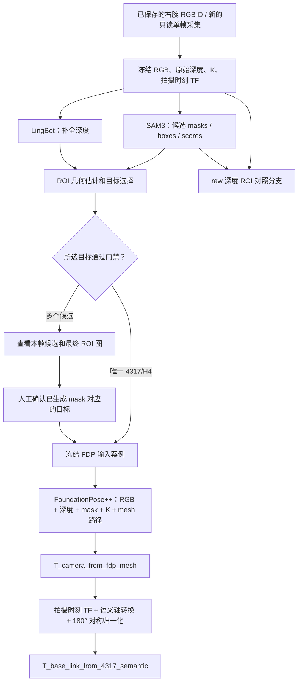

# S1 箱体位姿感知解耦实验使用手册

版本：2026-09-07。日常简称：FDP 剥离/解耦实验。当前阶段：FDP 基线复现。

**本手册的主流程是：从一帧已保存的右腕 RGB-D 开始，重新运行 SAM3、
LingBot、ROI 目标选择、FoundationPose++，最后输出箱体在 base_link 下的位姿。**
如需重新拍摄，将第 6 节的采集步骤接在主流程之前。

## 阅读导航

| 你要做什么 | 看哪里 |
|---|---|
| 理解实验做什么、不做什么 | 第 1 节 |
| 区分完整重跑、只跑 FDP、离线回放 | 第 2 节 |
| 分清本机、S1、Thor 和 FDP 服务 | 第 3 节 |
| 不连机器人，先复现已有结果 | 第 4 节 |
| **整段 SAM3 + LingBot + ROI + FDP 重跑** | **第 5 节** |
| 换一帧新照片重新实验 | 第 6 节，再接第 5 节 |
| 只重新调用 FDP | 第 7 节 |
| 找图片、mask、深度、位姿、日志 | 第 8 节 |
| 判断本轮是否成功 | 第 9 节 |
| 排查报错、保存/搬移实验 | 第 10～11 节 |

## 1. 实验范围和数据流



实验停止在物体位姿。不会自动进行粗感知导航、摆双臂、腰部升降、生成预抓
目标、IMC 规划、抓取或搬运；不要用 `run_s1_mode00_one_click.py` 启动此实验。

默认以 **LingBot 深度分支**作为生产兼容基线。`--depth-mode both` 同时计算
raw 深度分支供比较，但不会自动运行两次 FDP。

| 关键量 | 含义 |
|---|---|
| RGB / depth | 同一观测的对齐图像与深度；NumPy 深度单位为米 |
| K | 相机 3×3 内参；与图像分辨率对应 |
| 拍摄时刻 TF | `T_base_link_from_camera`，绑定到该帧时间戳 |
| SAM mask | SAM3 分割的候选区域 |
| final ROI mask | ROI 处理后实际交给 FDP 的二值区域，可能与 SAM mask 不同 |
| 4317/H4 | 本实验采用的箱型/层高判定条件，不是唯一物理实例 ID |
| FDP 原始位姿 | `T_camera_from_fdp_mesh`，mesh 坐标到相机坐标 |
| 最终语义位姿 | `T_base_link_from_4317_semantic`，箱体长/宽/高语义坐标到 base_link |

不要单独旋转原图而继续沿用旧深度、mask 和 K。本次原图倒置，但所有计算
均使用原始像素方向。也不要用“现在的 TF”替换历史帧的拍摄时刻 TF。

## 2. 先选择运行范围

| 模式 | 重新读相机 | SAM3 | LingBot | ROI | FDP 模型 | 坐标转换 |
|---|---|---|---|---|---|---|
| A：保存响应的纯离线回放 | 否 | 否 | 否 | 否 | 否 | 是 |
| B：固定输入，仅重跑 FDP | 否 | 否 | 否 | 否 | 是 | 是 |
| C：固定 RGB-D，整段精感知重跑 | 否 | 是 | 是 | 是 | 是 | 是 |
| D：新帧整段实验 | 是 | 是 | 是 | 是 | 是 | 是 |

本手册第 5 节是 **C 模式**。`replay_fdp_case.py --call-service` 只是 B 模式，
不会重跑 SAM3/LingBot/ROI。A 模式不会再次运行神经网络。

同输入重新推理可能受服务版本、权重、运行条件影响；本次尚未验证重复推理
稳定性。更换观测则是新案例，不能把新结果称为原始观测的精确复现。

## 3. 机器、目录和运行条件

以下为本次已核验/记录的部署。后续地址或版本变化时先核对，不自动替换配置。

| 位置 | 职责 | 地址/目录 |
|---|---|---|
| Ubuntu 本机，用户 lsy03 | 看图、人工确认案例、FDP 客户端、离线分析 | `/home/lsy03/文档/ChatGPT/S1/experiments/20260903_fdp_baseline` |
| S1，用户 galbot | 只读采集；读取现场配置运行 SAM3/LingBot/ROI 客户端 | `10.34.216.17`，`/home/galbot/Lsy03/fdp_baseline` |
| Thor SAM3 | 分割服务 | `10.34.216.11:7861` |
| Thor LingBot | 深度补全服务 | `10.34.216.11:7865` |
| FDP 服务 | FoundationPose++ 推理 | `http://10.34.216.13:7876/first_frame_track` |

本机已检查：Python 3.10.12、NumPy 1.21.5、OpenCV 4.5.4、Requests 2.25.1、
PyYAML 5.4.1。S1 实时采集必须使用 `/home/galbot/ie_lab/bin/s1-python`；
S1 上的文件感知处理使用原有 `python3`。不要为这份手册升级 SDK 或全局依赖。

**本机新增的 `confirm_frozen_target.py` 和 `replay_saved_fdp_result.py`
尚未部署到 S1。**因此主流程明确分成 S1 处理、拷回本机、确认并调用 FDP。
凭据只由 S1 客户端从已有 `site.production.yaml` 读取，不复制该配置或打印凭据。

### SSH 连接（仅第 5/6 节需要）

先在本机检查现有连接；看到 `Master running` 就直接使用，不重复创建：

```bash
ssh -S /tmp/s1_fdp_mux_20260907 -O check galbot@10.34.216.17
```

若连接不存在且本轮需要访问 S1，执行以下后台连接命令，密码在终端输入：

```bash
(
  umask 077
  ssh -fN -M \
    -S /tmp/s1_fdp_mux_20260907 \
    -o ControlPersist=2h \
    -o ServerAliveInterval=5 \
    -o ServerAliveCountMax=2 \
    galbot@10.34.216.17
)
```

`-fN` 认证后进入后台；`2h` 是空闲保留时间，不是强制两小时总时长。
实验结束需要断开时：

```bash
ssh -S /tmp/s1_fdp_mux_20260907 -O exit galbot@10.34.216.17
```

## 4. A 模式：先离线复现已保存的结果

**执行位置：本机。**不用 SSH，不调用服务，不读取机器人。

```bash
cd /home/lsy03/文档/ChatGPT/S1/experiments/20260903_fdp_baseline
FDP_CASE=cases/right_wrist_20260907_01_lingbot_operator1
FDP_REFERENCE=outputs/fdp_20260907_01_lingbot_operator1
FDP_TAG=$(date +%Y%m%d_%H%M%S_%N)
FDP_OUT="outputs/offline_fdp_${FDP_TAG}"

python3 scripts/verify_case.py --case-dir "$FDP_CASE"

python3 scripts/replay_saved_fdp_result.py \
  --case-dir "$FDP_CASE" \
  --reference-run-dir "$FDP_REFERENCE" \
  --output-dir "$FDP_OUT"

cat "$FDP_OUT/replay_result.json"
```

本机已实测：`ok:true`、`request_payload_matches:true`、
`all_matrices_exactly_equal:true`，平移/旋转/矩阵元素差均为 0。
新输出为 `$FDP_OUT/normalized_pose.json` 和 `replay_result.json`。
`normalize_reference.py` 面向旧案例内嵌的历史 reference，不要拿它替代本命令。

## 5. C 模式：固定 RGB-D，完整重跑精感知

本节是真正重新执行 **SAM3 → LingBot/ROI → 目标确认 → FDP → 语义位姿**。
中间保留人工检查点；目前没有一个会自动解决多候选选箱的整段一键命令。
本节不采新图，不要求机器人继续保持 9 月 7 日的旧姿态。

### 5.1 进入 S1，建立新的批次名称

在本机另开一个终端，进入 S1：

```bash
ssh -S /tmp/s1_fdp_mux_20260907 galbot@10.34.216.17
```

之后以下命令在 **S1 shell** 执行：

```bash
cd /home/galbot/Lsy03/fdp_baseline
FDP_CAPTURE_ID=right_wrist_20260907_01
FDP_BATCH_ID="full_$(date +%Y%m%d_%H%M%S_%N)"

printf 'CAPTURE_ID=%s\nBATCH_ID=%s\n' "$FDP_CAPTURE_ID" "$FDP_BATCH_ID"
cat "captures/$FDP_CAPTURE_ID/capture_result.json"
```

记下这两个 ID，稍后在本机终端输入相同值。不同终端和不同机器不会自动共享
shell 变量。`capture_result.json` 必须存在且 `ok:true`。

### 5.2 在 S1 上重跑 SAM3、LingBot 和两条 ROI 分支

**本命令实际发送冻结 RGB-D 至上述 Thor 服务。**每批 SAM3/LingBot 各调用一次。

```bash
python3 scripts/build_fresh_fdp_case.py \
  --capture-dir "captures/$FDP_CAPTURE_ID" \
  --output-dir "outputs/perception_$FDP_BATCH_ID" \
  --case-root "cases/batches/$FDP_BATCH_ID" \
  --depth-mode both \
  --site-config /home/galbot/ie_lab/projects/dual_arm_v5/workspace/s1_sjtu_0806/config/site.production.yaml \
  --perception-root /home/galbot/ie_lab/projects/dual_arm_v5/workspace/s1_sjtu_0806/vendor/g1_workbin_perception \
  --mesh /home/galbot/ie_lab/projects/dual_arm_v5/workspace/s1_sjtu_0806/assets/mesh/EU4322_midcut_target175mm.obj \
  --timeout-s 180
```

这里的 `--case-root` 为每批单独设置，避免用同一采集 ID 重跑时与原案例撞名。
不要删除旧 `cases/right_wrist_20260907_01_*` 来腾位置。

成功完成后，再执行：

```bash
python3 scripts/render_live_diagnostics.py \
  --capture-dir "captures/$FDP_CAPTURE_ID" \
  --perception-dir "outputs/perception_$FDP_BATCH_ID"

cat "outputs/perception_$FDP_BATCH_ID/result.json"
```

重点检查 `branch_gates.lingbot`；顶层 `ok:true` 不等于 `ready_for_fdp:true`。
`fdp_called:false` 在此步骤正常，因为 FDP 还没执行。
若没有有效 ROI 或所选目标不符合 4317/H4，先诊断，不能进入 5.5。

### 5.3 把本批产物复制到本机

**切回本机终端**，执行：

```bash
cd /home/lsy03/文档/ChatGPT/S1/experiments/20260903_fdp_baseline
read -r -p '输入 S1 打印的 CAPTURE_ID: ' FDP_CAPTURE_ID
read -r -p '输入 S1 打印的 BATCH_ID: ' FDP_BATCH_ID
test -n "$FDP_CAPTURE_ID" && test -n "$FDP_BATCH_ID"

mkdir -p outputs cases/batches
```

确认变量不是空值。以下目标目录必须尚不存在；已复制过该批时跳过复制，
不要让 `scp` 在已有同名目录内再套一层：

```bash
test ! -e "outputs/perception_$FDP_BATCH_ID" && \
scp -r -o ControlPath=/tmp/s1_fdp_mux_20260907 \
  -o ControlMaster=no -o BatchMode=yes -o ProxyCommand=false \
  "galbot@10.34.216.17:/home/galbot/Lsy03/fdp_baseline/outputs/perception_$FDP_BATCH_ID" \
  outputs/

test ! -e "cases/batches/$FDP_BATCH_ID" && \
scp -r -o ControlPath=/tmp/s1_fdp_mux_20260907 \
  -o ControlMaster=no -o BatchMode=yes -o ProxyCommand=false \
  "galbot@10.34.216.17:/home/galbot/Lsy03/fdp_baseline/cases/batches/$FDP_BATCH_ID" \
  cases/batches/
```

案例内已经包含 RGB、所用深度、K、TF、mask、mesh 和参考记录；不用复制
生产配置。设置本批路径：

```bash
FDP_PERCEPTION="outputs/perception_$FDP_BATCH_ID"
FDP_SOURCE_CASE="cases/batches/$FDP_BATCH_ID/${FDP_CAPTURE_ID}_lingbot"
unset FDP_CASE

python3 scripts/verify_case.py --case-dir "$FDP_SOURCE_CASE"
xdg-open "$FDP_PERCEPTION/common/sam_candidates_overlay.png"
xdg-open "$FDP_PERCEPTION/lingbot/roi_mask_overlay.png"
cat "$FDP_PERCEPTION/lingbot/roi_result.json"
```

### 5.4 确定最终目标，保留确认依据

检查画面中的物理箱体、`target_roi.index`、`matching_4317_h4_roi_indices`
和 `gates`。每次重新分割都要重新核对编号，不能凭旧编号认箱。

**情况一：`ready_for_fdp:true`，且你核对所选目标正确。**使用原案例：

```bash
FDP_CASE="$FDP_SOURCE_CASE"
```

**情况二：多个 H4 候选，但最终 ROI 叠加图中的默认目标就是你要验证的箱体。**
在看图后执行下面交互命令，输入你实际确认的编号和描述：

```bash
read -r -p '输入刚刚看图确认的 target_roi.index: ' FDP_REVIEWED_INDEX
read -r -p '输入本帧目标的人工确认描述: ' FDP_OPERATOR_NOTE

FDP_RGB_HASH=$(python3 -c 'import json,sys; print(json.load(open(sys.argv[1]))["files"]["rgb"]["sha256"])' "$FDP_SOURCE_CASE/manifest.json")
FDP_MASK_HASH=$(python3 -c 'import json,sys; print(json.load(open(sys.argv[1]))["files"]["mask"]["sha256"])' "$FDP_SOURCE_CASE/manifest.json")
FDP_CONFIRMED_CASE="cases/operator_${FDP_BATCH_ID}_$(date +%H%M%S_%N)"

python3 scripts/confirm_frozen_target.py \
  --source-case-dir "$FDP_SOURCE_CASE" \
  --output-case-dir "$FDP_CONFIRMED_CASE" \
  --sam-index "$FDP_REVIEWED_INDEX" \
  --expected-rgb-sha256 "$FDP_RGB_HASH" \
  --expected-mask-sha256 "$FDP_MASK_HASH" \
  --operator-statement "$FDP_OPERATOR_NOTE" && \
FDP_CASE="$FDP_CONFIRMED_CASE"
```

确认脚本成功后才继续。原始案例和候选报告不变；新案例保留
`strict_unique_4317_h4:false`，以单独的人工确认策略记录本帧选箱。

**情况三：你想选另一只箱体，当前最终 ROI mask 却不是它。**停止在此处。
当前脚本只确认已经生成最终 mask 的目标，不支持任意切换候选。
不能只改 `--sam-index`、把 `ready_for_fdp` 手动改成 true，或复制旧 mask；
需要先补上该候选的 ROI/mask 物化步骤。这是当前工具能力边界。

### 5.5 准备请求，再实际调用 FDP

仍在 **本机同一终端**。先清楚区分准备请求与发送请求：

```bash
: "${FDP_CASE:?请先完成本批目标选择，设置 FDP_CASE}"
python3 scripts/verify_case.py --case-dir "$FDP_CASE"
FDP_RUN_TAG="${FDP_BATCH_ID}_$(date +%H%M%S_%N)"

env -u HTTP_PROXY -u HTTPS_PROXY -u ALL_PROXY \
  NO_PROXY=10.34.216.0/24,localhost,127.0.0.1 \
  no_proxy=10.34.216.0/24,localhost,127.0.0.1 \
  python3 scripts/replay_fdp_case.py \
  --case-dir "$FDP_CASE" \
  --output-dir "outputs/prepare_$FDP_RUN_TAG"

cat "outputs/prepare_$FDP_RUN_TAG/request_summary.json"
```

此时只是 `request_prepared_not_sent`；准备成功不表示选箱门禁已经允许发送。
核对 `service_url`、`case_id`、mesh 路径和案例 gate 后再执行。
以下命令实际向 FDP 服务发送本帧 RGB、LingBot 深度、mask、K 和 mesh 路径：

```bash
FDP_OUT="outputs/fdp_$FDP_RUN_TAG"

env -u HTTP_PROXY -u HTTPS_PROXY -u ALL_PROXY \
  NO_PROXY=10.34.216.0/24,localhost,127.0.0.1 \
  no_proxy=10.34.216.0/24,localhost,127.0.0.1 \
  python3 scripts/replay_fdp_case.py \
  --case-dir "$FDP_CASE" \
  --output-dir "$FDP_OUT" \
  --service-url http://10.34.216.13:7876 \
  --timeout-s 180 \
  --call-service
```

成功后查看：

```bash
cat "$FDP_OUT/run_result.json"
xdg-open "$FDP_OUT/foundationpose_vis.png"
python3 -m json.tool "$FDP_OUT/normalized_pose.json"
printf '本轮案例：%s\n最终输出：%s\n' "$FDP_CASE" "$FDP_OUT"
```

到这里才完成一次整段精感知重跑。不会自动进入抓取。

## 6. D 模式：先重新拍一帧

只在需要新观测时执行。用户先完成现场摆位，保证底盘、双臂、腰部和目标箱
静止。右腕相机应完整看到目标顶缘和可见外壁，避免截边和遮挡；0.8 m 是
生产底盘观察退距参考，不是相机必须满足的精确距离。

当前箱型采用约 0.4×0.3×0.175 m 的 4317，ROI 门禁要求 H4。多个候选允许
保存诊断，但不自动进入 FDP。相机“能看到”还要通过有效深度、尺寸和时间同步检查。

**采集脚本不移动任何设备。**现场摆位如需底盘靠近货垛、手臂调整视角或
腰部改变高度，须分别预览运动范围，低速操作、保留与货垛/环境的净空并保证
实体急停可用；夹爪开合与抓取不属于本次实验。不要从“零/home”猜测恢复位。
由助手执行任何真实运动仍需当次具体动作确认，本手册不提供运动命令。

在 **S1 shell** 中运行：

```bash
cd /home/galbot/Lsy03/fdp_baseline
FDP_CAPTURE_ID="right_wrist_$(date +%Y%m%d_%H%M%S_%N)"

/home/galbot/ie_lab/bin/s1-python scripts/capture_right_wrist_rgbd_once.py \
  --output-dir "captures/$FDP_CAPTURE_ID" \
  --settle-s 3 --timeout-s 15 \
  --acknowledge-readonly-live-s1

cat "captures/$FDP_CAPTURE_ID/capture_result.json"
printf '新 CAPTURE_ID=%s\n' "$FDP_CAPTURE_ID"
```

要求采集成功、`ok:true`、`motion_commands_sent:false`。失败时保留目录，
查看 `capture_failure.json`，先解决采集问题，不用失败输入继续推理。

然后设置新批次，并**从 5.2 开始**：

```bash
FDP_BATCH_ID="full_$(date +%Y%m%d_%H%M%S_%N)"
printf 'CAPTURE_ID=%s\nBATCH_ID=%s\n' "$FDP_CAPTURE_ID" "$FDP_BATCH_ID"
```

不要再执行 5.1 中赋值旧 `FDP_CAPTURE_ID` 的那一行。5.3 拷贝后可以直接
查看案例中的 `input/rgb.png`，不必另拷原始采集目录才能继续。

## 7. B 模式：仅重跑一次 FDP

在本机执行；使用已经确认的旧案例，不调用 SAM3、LingBot 或 ROI。

```bash
cd /home/lsy03/文档/ChatGPT/S1/experiments/20260903_fdp_baseline
FDP_CASE=cases/right_wrist_20260907_01_lingbot_operator1
FDP_REFERENCE=outputs/fdp_20260907_01_lingbot_operator1
FDP_OUT="outputs/fdp_repeat_$(date +%Y%m%d_%H%M%S_%N)"

python3 scripts/replay_fdp_case.py \
  --case-dir "$FDP_CASE" --output-dir "$FDP_OUT" \
  --service-url http://10.34.216.13:7876 \
  --timeout-s 180 --call-service
```

成功后比较新旧结果：

```bash
python3 scripts/compare_results.py \
  "$FDP_REFERENCE/normalized_pose.json" \
  "$FDP_OUT/normalized_pose.json"

xdg-open "$FDP_OUT/foundationpose_vis.png"
```

`compare_results.py` 的 `ok:true` 表示比较执行成功，不表示误差满足某个
合格标准。实际看 `delta` 的平移（米）、旋转（度）和最大矩阵元素差。
只在同一坐标定义下比较；底盘动过的新帧 base_link 不应直接当作旧帧基座
坐标进行精度对比，需额外建立共同参考坐标系。

## 8. 产物在哪里、怎样看

### 8.1 通用目录

| 目录/文件 | 作用 |
|---|---|
| `captures/<CAPTURE_ID>/` | 单帧原始 RGB-D、K、TF、采集状态 |
| `outputs/perception_<BATCH_ID>/common/` | SAM 原始响应、候选 masks、补全深度 |
| `outputs/perception_<BATCH_ID>/raw/` | raw ROI 报告、最终 mask、叠加图 |
| `outputs/perception_<BATCH_ID>/lingbot/` | LingBot ROI 报告、最终 mask、叠加图 |
| `cases/batches/<BATCH_ID>/<CAPTURE_ID>_lingbot/` | 本批冻结的 FDP 输入案例 |
| `cases/operator_<...>/` | 人工确认后新建案例，含父案例和确认依据 |
| `outputs/prepare_<...>/` | 请求已生成，尚未发送 |
| `outputs/fdp_<...>/` | 服务返回、位姿、叠加图、调用摘要 |

### 8.2 单个文件的读取方法

| 文件 | 内容 | 怎样看 |
|---|---|---|
| `rgb.png` | 原始 RGB | `xdg-open` |
| `depth_raw_m.npy` / `depth_lingbot_m.npy` | 原始/补全深度，米 | Python `numpy.load()` |
| `intrinsics.npy` | 3×3 K | Python `numpy.load()` |
| `base_from_camera.npy` | 拍摄时刻 4×4 TF | Python `numpy.load()` |
| `capture_meta.json` | 时间戳、关节状态、TF 核对 | `python3 -m json.tool` |
| `sam_candidates_overlay.png` | 候选编号与区域 | `xdg-open` |
| `roi_mask_final.png` | FDP 实际使用的最终二值 mask | `xdg-open` |
| `roi_mask_overlay.png` | mask 与 RGB 叠加 | `xdg-open` |
| `roi_result.json` | 候选、默认目标、中心/yaw、门禁 | `python3 -m json.tool` |
| `manifest.json` | 输入索引、哈希、来源、gate | `verify_case.py` + JSON 查看 |
| `reference/operator_confirmation.json` | 人工选择的原话、编号及绑定哈希 | JSON 查看 |
| `request_summary.json` | 服务地址、case、编码、是否发送 | JSON 查看 |
| `request_payload.json.gz` | 完整实际请求 | Python `gzip.open()` + `json.load()` |
| `raw_response.json` | FDP 原始响应，可能含大段 base64 图像 | 调试时查看 |
| `foundationpose_vis.png` | 服务输出的三维框叠加图 | `xdg-open` |
| `normalized_pose.json` | 语义位姿、转换链、质量与对称信息 | JSON 查看 |
| `run_result.json` | 调用状态、耗时、输出哈希 | 首先查看 |

在本机只打印最近运行的最终矩阵（沿用 `$FDP_OUT`）：

```bash
python3 - "$FDP_OUT/normalized_pose.json" <<'PY'
import json, sys
r = json.load(open(sys.argv[1]))
print('T_base_link_from_4317_semantic:')
for row in r['matrices']['T_base_link_from_4317_semantic']:
    print(' '.join(f'{v: .8f}' for v in row))
PY
```

这个矩阵的最后一列前三项是箱体语义中心在 base_link 下的 X/Y/Z（米），
左上 3×3 是旋转矩阵；它不是左右夹爪/TCP 的目标。

### 8.3 直接查询 9 月 7 日基线

本机目录前缀：`/home/lsy03/文档/ChatGPT/S1/experiments/20260903_fdp_baseline/`。

- 原始图：`captures/right_wrist_20260907_01/rgb.png`。
- 候选图：`outputs/live_perception_20260907_01/common/sam_candidates_overlay.png`。
- ROI 图：`outputs/live_perception_20260907_01/lingbot/roi_mask_overlay.png`。
- 人工确认案例：`cases/right_wrist_20260907_01_lingbot_operator1/`。
- FDP 最终结果：`outputs/fdp_20260907_01_lingbot_operator1/`。
- 对比补充记录：上述 FDP 目录内的 `offline_verification.json`，由本次分析生成，
  并非每次运行 `replay_fdp_case.py` 都会自动生成。
- 详细记录：[RUN_20260907_FDP_OPERATOR_TARGET.md](RUN_20260907_FDP_OPERATOR_TARGET.md)。

## 9. 如何判断本轮完成到哪一步

| 检查项 | 合格的含义 | 不能推出什么 |
|---|---|---|
| capture `ok:true` | 采集和现有数据检查通过 | 目标一定唯一/清晰 |
| case `hashes_verified:true` | 当前文件与 manifest 哈希匹配 | 模型估姿准确 |
| ROI `ready_for_fdp:true` | 当前选择策略允许该案例进入 FDP | 跨帧身份持续锁定 |
| `request_prepared_not_sent` | 请求已归档 | FDP 已运行 |
| HTTP 200 + `fdp_response_normalized` + `ok:true` | 返回位姿并通过现有坐标/高度轴检查 | 达到抓取精度 |
| 离线矩阵差 0 | 保存响应的后处理可重复 | 神经网络每次输出一样 |
| 叠加框看起来覆盖目标 | 没有明显选错目标等视觉异常 | 已有毫米级精度真值 |

当前基线已完成独立链路，保存语义中心约 `[1.392452, 0.255328, 0.505903] m`，
yaw 约 `91.2885°`。但与 LingBot ROI 的 XY 中心相差约 **137.3 mm**，原因待验证。
ROI Z 表示原算法的顶面中心，FDP Z 表示箱体中心，比较 Z 必须考虑半高和语义轴。
ROI 本身也不是真值；不把两者差异直接称为 FDP 误差，不据此输出实机抓取动作。

## 10. 常见问题

| 现象 | 处理方法 |
|---|---|
| SSH 输入密码后没有提示符 | `-fN` 成功后应回本机提示符；用 `-O check` 看 master 状态 |
| `Control socket ... No such file` | 当前复用连接已失效；本轮需要 S1 时重新建立 |
| `FileExistsError` / output exists | 换新的 batch/run ID；不要覆盖或删除历史失败目录 |
| 同一 RGB-D 重跑时报 cases 已存在 | 使用第 5 节独立 `--case-root cases/batches/<BATCH_ID>` |
| `ready_for_fdp=false` | 检查目标型号/高度/多候选；走本帧人工确认，不能手改 gate |
| 输入的 SAM index 与最终 mask 不一致 | 当前确认工具不支持换箱；停止并补该目标 mask 物化 |
| 共享 `control.lock` 被占用 | 查明其他任务；不杀未知进程、不删锁文件绕过保护 |
| RGB-D 或 TF 时间差超限 | 当前采集作废并保留诊断；确认静止及传感器状态后另采新帧 |
| SAM/LingBot 网络失败 | 核对 Thor 服务、端口及原配置；保留失败目录，换批次重试 |
| FDP HTTP 超时/非 200/mesh 不存在 | 查看本轮已生成文件与终端报错；确认服务和 mesh 路径，不算成功 |
| 输出框落到另一只箱体 | 停止使用此位姿；先查 mask、目标身份及输入绑定 |
| `xdg-open` 在 S1 无法显示 | 在本机复制后看图，不依赖 S1 桌面 |
| Python 找不到 `galbot_sdk` | 采集使用 S1 的 `s1-python`；离线脚本本来不需要 SDK |
| 本机 raw ROI 回放 `ok:false`、mask 却一致 | 当前已记录约 `1.19e-7 m` 中心差，高于 `1e-9 m` 严格阈值；保留结果分析，不擅自放宽 |

HTTP 调用失败可能只留下请求文件、没有 `run_result.json`；终端 traceback
也是诊断证据。不要因输出目录存在就判定成功。

## 11. 保存、复查和证据边界

代码、手册与实验报告留在仓库；`captures/`、`cases/`、`outputs/` 被
`.gitignore` 排除，因此 **仅复制 Git 代码不会带走实验数据**。

搬到另一台电脑，至少复制当前 `fdp_baseline/`、`scripts/`、完整确认案例目录
以及对应 FDP 输出目录；不要漏掉 `reference/`、父 manifest 和确认文件。
完整 ROI 回放还需要原始分支案例、对应 vendor 源码和依赖。
连接密码、token、私钥、生产配置中的凭据不随数据包保存。

本机检查当前案例：

```bash
python3 scripts/verify_case.py --case-dir "$FDP_CASE"
```

核对原始 9 月 7 日归档清单（不覆盖后来新增文件）：

```bash
sha256sum --quiet -c ASSET_MANIFEST_20260907.sha256
```

旧 `DEPLOYMENT_MANIFEST.sha256` 是早先 S1 部署快照，不是当前本机全部
新增脚本的清单。服务端 mesh 哈希、权重和版本本轮未独立核验；不能据本机
输入哈希声称跨服务版本完全一致。

本手册命令按当前脚本参数核对，相关采集/分支推理/FDP/离线复算在 9 月 7 日
分别有运行证据。编写手册期间未再次连接 S1、调用推理服务或执行运动；
第 5 节新的批次组织命令仅完成参数、路径逻辑与 shell 语法核对，未再实际
执行一批远端推理。