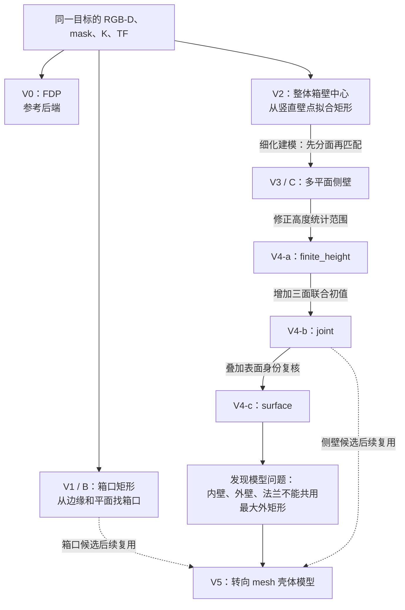
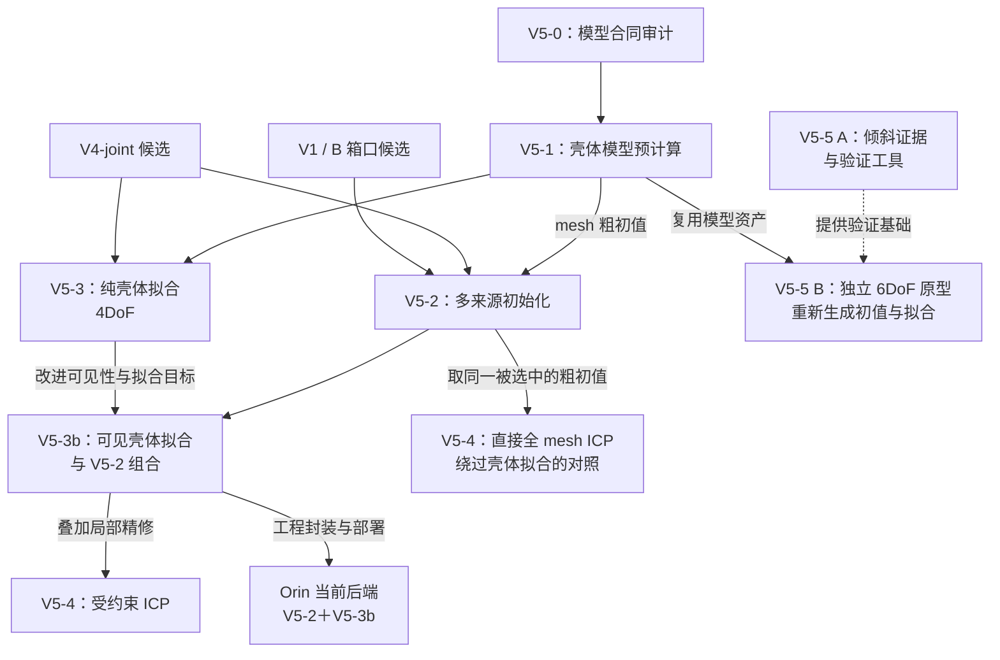

# S1 IE Lab 拆垛位姿后端阶段报告

汇报日期：2026-09-14。四页版：原始路线图 1 / 原始路线图 2 / 均值对比 / 实机证据与计划。

## V0-V4 原图

## V5 原图

## 版本演进与 FDP 差异

共同样本：D04, D05, D06, D07, D09, D10, D11, D12，每版本 n=8。先计算每帧中心欧氏距离，再取算术平均；包含拒绝诊断候选。RGB、深度、mask、K、TF、mesh 的保存哈希和本地资产已核对。

| 版本 | 平均中心差 mm | 平均 180° 对称 yaw 差 ° | 完整 D02-D12 批次状态 |
|---|---:|---:|---|
| V3 | 23.00 | 1.91 | 0/11 正式接受 |
| V4-joint / surface | 19.37 | 1.65 | 4/11 中间通过；复核后 0/11 |
| V5-3 | 9.35 | 1.11 | 9/11 拟合通过 |
| V5-2 + V5-3b | 10.47 | 1.32 | 9/11 拟合通过 |
| V5-4 受约束 ICP | 10.01 | 1.29 | 11/11 优化完成；无发布门禁 |

V3 到 V5-3 中心差减少 59.4%；后续可见性版本略有回退，受约束 ICP 收益有限，不能写成每一版都持续接近 FDP。FDP 不是独立真值，各版本接受门限不同。

D01-D12 已有结果均值：V5-3 9.26 mm（n=11，含 D01、缺 D08）；V5-2＋V5-3b 10.44 mm（n=11，D02-D12）。覆盖集合不同，仅作汇总。未用零补缺项，V1/V2 不捏造批量均值。

ICP A/B 的平均单帧 p90：当前基线 21.79 mm，受约束 ICP 21.92 mm，全 mesh ICP 77.42 mm（n=11）。这里的 shell-fit 为 V5-2＋V5-3b，不能标成 V5-3。

## 观测与计划

D08：V5-3 无初值，当前基线补出低置信候选。D12：截边与拟合不足，正式拒绝。

Orin 已贯通采集、远端 SAM3/LingBot、人工确认和本地位姿后端；双腕同箱体右腕结果与 FDP 中心差 6.82 mm，仅各一帧。

## 下一步计划

1. 冻结版本，完成固定视角重复帧统计：中心/yaw 抖动、拒绝率、平均耗时。
2. 核对实物与 mesh、表面身份，补独立测量参考，评价箱口和两侧参考点。
3. 优化 Docker 中算法运行速度，考虑采用降采样、降低精度的方式进行实验。

## 证据及复核

- [版本谱系](/home/lsy03/文档/ChatGPT/S1/docs/s1_pose_version_lineage_20260912.md)
- [ICP A/B](/home/lsy03/文档/ChatGPT/S1/experiments/20260907_bin_rim_pose/V5_4_ICP_AB_REPORT_20260909.md)
- [双腕对照](/home/lsy03/文档/ChatGPT/S1/docs/s1_orin_bilateral_fdp_comparison_20260911.md)
- [同样本统计和输入哈希](assets/common_frame_statistics.json)
- [V5-3 与 FDP](/home/lsy03/文档/ChatGPT/S1/experiments/20260907_bin_rim_pose/outputs/v5_shell_fit_fdp_compare_D02_D12_20260908_01/comparison.json)
- [当前基线与 FDP](/home/lsy03/文档/ChatGPT/S1/experiments/20260907_bin_rim_pose/outputs/v5_2_fdp_compare_D02_D12_20260908_02/comparison.json)

本次只重算归档结果和制作报告；没有重跑算法、访问机器人或执行运动。