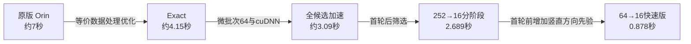

# 本次 FDP 算法路线与版本关系 — 2026-09-22

这里按“推理流程/方法路线”归类，不把每个候选数、精修次数、单项消融或重复验收算作独立算法。
共整理为 **5个主线版本 + 4类探索分支**。5个主线中，原版和Exact是沿用的起点，另外3个是本轮新增；4类探索分支中包括只完成离线诊断的候选融合。
这些配置共用原FDP网络和训练权重，没有重新训练模型。下列A0–A4及中文名称是整理用称呼，不是新建的官方版本号或Docker标签。

| 编号 | 名称 | 代码/结果标识 | 核心变化 | 代表性预热后register耗时 | 验证边界 |
|---|---|---|---|---:|---|
| A0 | 原版 Orin FDP | original | 252候选全部精修两轮，最后联合评分 | 约7秒 | 相对比较基线，不是独立真值 |
| A1 | FDP Exact 等价优化版 | v9 exact / exact | 等价XYZ采样、避免无用日志求值；保留252候选与两轮 | 约4.15秒 | 现已28帧×5与原始矩阵一致 |
| A2 | FDP 全候选加速版 | combo | A1 + 微批次64 + cuDNN算法选择，仍保留252候选 | 约3.09秒 | 现已28帧×5与原始矩阵一致 |
| A3 | FDP 分阶段筛选版 | inline16 / 252→16 | 首轮精修/评分252，保留16完成第二轮与最终评分 | 2.689秒 | 现已28帧×5通过；最大中心差7.756mm |
| A4 | FDP 竖直先验快速版 | upright64 / 64→16 | 按每帧TF与语义轴，在12个yaw扇区偏向竖直方向选64，再首轮筛到16 | 0.878秒 | 现已28帧×5通过；最大中心差7.407mm，逐轴最大0.058/0.529/1.089° |

时间来自不同阶段的固定输入实验，属于代表值，不是同时运行的严格性能排序；均不含分割/LingBot前端、文件读取、模型初始化或Docker启动。
A3/A4的通过标准为相对同帧原版中心欧氏差≤10mm、包装后的roll/pitch/yaw各≤4°。
微批次64只是把网络执行拆批，A2仍计算全部252个候选；A4的64才是实际保留的首轮候选数量。

## 主线流程

- A0/A1/A2：252 → 第1轮精修 → 252 → 第2轮精修 → 252联合评分 → 输出。
- A3：252 → 第1轮精修与评分 → 16 → 第2轮精修与评分 → 输出。
- A4：原252方向网格 → 竖直偏好筛到64 → 第1轮精修与评分 → 16 → 第2轮精修与评分 → 输出。

本轮曾将两轮拆成两次predict：不删候选时约3.811秒，比A2更慢。随后改成在原循环中插入筛选，252控制复现原矩阵，才形成A3。

## 四类探索分支

| 路线 | 实现 | 结果与去向 |
|---|---|---|
| FPS全局稀疏网格 | 从原网格按SO(3)距离选48/64/96/128，再精修；另试增加精修或不做中途筛选 | 64可到约0.878秒，但LingBot只有11/13通过；未采用 |
| 几何预筛选 | 低分辨率渲染、mask重叠、深度残差给原252候选预排序 | 64分支约1.28秒但有大幅错误位姿；未采用 |
| 评分前置 | 先用原评分网络给未精修252候选排序，再只精修64或16 | 保留64的LingBot初筛13/13矩阵一致、约2.615秒，未做5次重复；保留16加精修未全通过，作为探索保留 |
| 候选位姿融合 | 对FPS64输出的前2/3/5个近邻做姿态融合诊断 | 只做离线候选诊断，未使完整分支通过，不宣称新的端到端耗时 |

BN融合、channels-last、FP16权重预转换、cuDNN单项、缓存保留、候选数量及精修轮数变化均是消融或参数试验，不另增加“算法路线”计数。
旧v9 fast约2.9秒，是本轮沿用的历史失败对照；其多项优化在部分帧超出误差门槛，本轮从Exact重新拆解优化。它不是本轮新形成的算法，亦未作为最终主线保留。

## 当前状态

A4是目前最快且完成C13重复验收的版本。它只偏向竖直候选，不把输出roll/pitch强制设为0，因此可以在一些倾斜条件下工作；不能据此保证任意倾斜或倒置。
新扩展D12/H3各5次的完整同输入原版对照均已通过，中心最大差约0.001/0.004mm；H的原版估计倾角约5.974–6.848°，不是独立物理真值。
随后按用户要求完成覆盖补齐：A0–A4均已具备相同28帧、每帧5次正式结果，全部通过10mm/逐轴4°。新增355次正式与已完成345次按输入哈希及来源合并。最新完整数值见[统一报告](../experiments/20260922_fdp_complete_coverage/FINAL_REPORT.md)；上表耗时仍保留各版本形成时的代表值。

依据：
- [工程优化与分阶段筛选](../experiments/20260921_fdp_accuracy_speed/README.md)
- [首轮优化及探索分支](../experiments/20260921_fdp_first_stage/README.md)
- [0.878秒条件验收](../experiments/20260921_fdp_first_stage/FINAL_REPORT.md)
- [跨组暂停状态](../experiments/20260921_fdp_cross_dataset_validation/PAUSED.md)