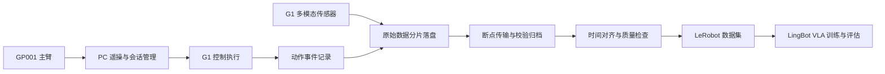

# VLA G1 项目回顾与月度计划

统计截至：2026 年 9 月 20 日
计划周期：2026 年 9 月 21 日—10 月 20 日

## 项目回顾

项目已完成设备修复、GP001 适配及主臂—PC—G1 链路搭建，推进七关节遥操、夹爪控制和数据记录。LingBot VLA 已完成 Docker 部署、RTX 4090 单卡推理及 WebSocket 接口验证，并搭建可视化仿真环境。数采软件已形成“机器人端原始记录—PC 端校验归档—时间对齐—LeRobot 导出”架构草案，完成传感器读取和样本存取验证，完整数采与真机模型闭环仍待打通。

## 数采软件架构设计

采用机器人端与 PC 端分工：G1 按原始频率记录图像、深度、腕力、关节及夹爪反馈，关联实际控制指令；PC 负责会话管理、数据传输校验、时间对齐、质量检查和训练集导出。记录与控制独立运行，避免写盘或传输阻塞遥操。

计划采集 17 个数据流：6 路 RGB、2 路深度、2 路腕力、5 个关节组及 2 路夹爪反馈；同时记录动作事件、原始时间戳和有效性信息，保证数据可追溯。

以上为目标架构，完整记录、传输与转换链路尚待实现和验收。LingBot 当前已验证模型推理与简化仿真展示，尚未完成 G1 动作映射和自主任务闭环。

## 未来一个月计划

| 阶段 | 主要工作 |
| --- | --- |
| 第 1 周（9 月 21—27 日） | 完善遥操与时间同步；确定数采字段、动作语义和模块接口；固化 LingBot 部署环境，明确 G1 输入输出映射。 |
| 第 2 周（9 月 28 日—10 月 4 日） | 实现机器人端多模态记录、PC 端校验归档及 LeRobot 转换；完成 LingBot 数据加载、归一化与训练配置适配。 |
| 第 3 周（10 月 5—11 日） | 完成 10 分钟连续采集及断网恢复测试，试采 10 段任务数据；数据验收后开展小规模微调和离线评估。 |
| 第 4 周及收尾（10 月 12—20 日） | 完善数采质量报告和操作流程，部署适配后的 LingBot；通过动作回放与安全验收后，尝试低速真机闭环并统计任务成功率。 |