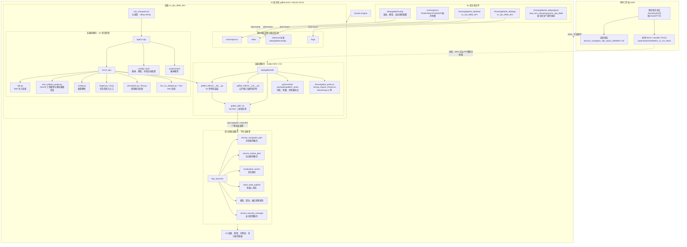

# 8_27 导航功能调试 确认 S1 控制是否使用容器

- 归档编号：`01a04115-4425-7671-aeee-ac88e18292d4`
- 项目：S1 IE_lab 拆垛
- 创建时间：2026-08-27T10:38:27.889000+08:00
- 更新时间：2026-08-27T19:26:34.906000+08:00
- 状态：活动
- 导出范围：用户可见消息与助手可见回复；不含隐藏推理和工具原始输出

## 1. 用户

目前控制 S1 是否是用容器？
galbot@galbot-echo:~$ docker ps
CONTAINER ID   IMAGE                      COMMAND                  CREATED       STATUS                 PORTS     NAMES
4003964332fa   s1-sjtu-0806-slim:latest   "/ros_entrypoint.sh …"   3 weeks ago   Up 2 hours (healthy)             s1_sjtu_0806_slim
galbot@galbot-echo:~$
帮我看下

## 2. 助手（进展）

我先按仓库约定读取项目说明和 SDK/真机相关知识，再检查本地代码里这个容器名、镜像和控制入口的证据；这一步只做只读检查，不连接机器人。

## 3. 助手（进展）

从你贴的 `docker ps` 可以先确认：S1 主机上确实有一个健康运行中的 `s1-sjtu-0806-slim` 容器。但这还不能单独证明“当前机器人控制进程就在容器里”——也可能只是环境常驻。我会对已知 S1 地址做一次只读 SSH 核查，查看容器启动配置、容器内进程以及宿主机相关进程；不启动/停止服务，不初始化 SDK，也不执行任何运动。

## 4. 助手（进展）

只读检查已发起，但 SSH 命令目前没有正常返回，可能卡在远端 Docker 权限/连接交互上。我先终止这次挂起的检查，避免保留 SSH 会话，然后改用带整体超时的只读命令。

## 5. 用户

现在 ssh已经给你开了
umask 077
ssh -M -S /tmp/s1_codex_mux_20260827 \
  -o ControlPersist=15m \
  galbot@10.34.216.17

## 6. 助手（进展）

收到。我会复用你创建的 SSH 控制连接，只读检查该容器的配置、挂载和进程归属；不进入交互 shell，不改文件、不碰控制器，也不会执行运动。检查结束后不会主动关闭你建立的主连接。

## 7. 助手（进展）

证据已经很明确：这个容器不是 S1 底层服务本体，而是一个常驻的 SDK/开发运行环境；此刻确实有人通过 `docker exec` 在容器里调用 `GalbotNavigation.init()` 和 `stop_navigation()`。底层导航、运动规划、传感器等服务则直接运行在宿主机 `/data/galbot/bin/` 下。我再做一次瞬时只读复查，确认那条 SDK 命令是否仍在运行，不会终止或干预它。

## 8. 助手

是的，目前有人通过这个容器调用 S1 SDK，但系统是“宿主机底层服务 + 容器内 SDK 客户端”的混合架构。

核查结果：

- 容器 `s1_sjtu_0806_slim` 正常运行，状态 `healthy`。
- 容器自身默认只运行 `sleep infinity`，说明它主要是常驻开发/SDK 环境，并不会启动整套控制系统。
- S1 的底层服务直接运行在宿主机，包括：
  - `service_motion_plan`
  - `service_navigation_plan`
  - `localization_server`
  - `robot_state_publish`
  - 相机、雷达、感知等服务
- 容器采用 `network=host`、`ipc=host`，并挂载宿主机配置、地图和数据，因此容器内 SDK 可以直接访问这些底层服务。

更关键的是，检查时发现一条正在运行的命令：

```bash
docker exec -e PYTHONPATH=/opt/galbot/sdk s1_sjtu_0806_slim \
  python3 -c 'from galbot_sdk.s1 import GalbotNavigation;
  n=GalbotNavigation();
  print("init", n.init());
  print("stop", n.stop_navigation())'
```

它在 2026-08-27 10:47:11 启动，到 10:52:35 已运行约 5 分钟，卡在等待状态。这说明：

1. 当前确实有人通过该容器调用导航 SDK。
2. 调用内容是初始化导航接口并停止底盘导航，不是移动指令。
3. 该调用长时间未退出，暂时不要重复启动同类 SDK 客户端，也不要贸然杀进程，以免影响导航状态。

结论：**控制接口是在容器里调用的，但真正的机器人底层控制服务主要运行在宿主机上。容器更像统一的 S1 SDK/项目运行环境，而不是完整控制系统本身。**

本次只进行了只读检查，没有修改容器、服务或机器人状态，也没有关闭你建立的 SSH 主连接。

## 9. 用户

要不我们下午从导航sdk开始调？我想看看它暴露了哪些接口，是否可以在rviz中画出点云图，以及仿真的nav2，以及之后看看能不能解决抓箱子之后就视为碰撞报警的问题

## 10. 助手

可以，下午建议按这个顺序推进，先把接口和数据流摸清，再碰真机：

1. **导航 SDK 接口盘点**
   - 只读查看 `GalbotNavigation` 的类、方法签名、类型说明和示例。
   - 区分状态读取、定位、地图、路径规划、导航、停止/取消等接口。
   - 先处理或确认当前卡住的 `stop_navigation()` 进程，不重复初始化客户端。

2. **RViz 数据可视化**
   - 检查宿主机实际 ROS/ROS 2 版本、topic 和 TF。
   - 确认雷达/深度相机是否发布 `PointCloud2`、`LaserScan`、深度图、里程计、地图。
   - 如果已有标准 topic，直接在 RViz2 显示；如果只有 SDK 数据，再做只读桥接节点。
   - 重点核对 `map → odom → base_link → sensor` 坐标链。

3. **Nav2 仿真**
   - 先确认当前导航栈是否兼容标准 Nav2 接口，不能预设 Galbot SDK 就是 Nav2。
   - 用现有 S1 URDF/MJCF 建立离线模型、地图、雷达和底盘运动接口。
   - 先在仿真中验证定位、代价地图、全局/局部规划和避障，不连接真机底盘。

4. **抓箱后碰撞报警**
   - 抓箱前后对比运动规划日志、碰撞对象、机器人状态和代价地图。
   - 重点检查：
     - 箱子是否仍作为外部障碍物留在规划场景；
     - 抓取后是否正确转成 `attached collision object`；
     - 箱体是否与双臂、胸前、升降柱或底盘 footprint 重叠；
     - 导航碰撞监控是否不知道机器人正在携带箱子；
     - 箱体尺寸、位姿、TF 或安全膨胀半径是否过大。
   - 目标是正确建模“携箱状态”，不直接关闭碰撞检测。

若后面进入真机导航：涉及的是**移动底盘**，预期会产生平面移动和转向；双臂、夹爪和升降柱应保持已确认的携箱姿态。主要风险是箱体增大机器人外形、近距离障碍物、定位漂移和急停距离。我们会先做接口读取、日志分析、RViz 和仿真；任何真实底盘运动前，再单独向你说明目标、速度、路径、净空和急停要求，并取得当次确认。

## 11. 用户

或者我要不自己建立一个容器，来做环境隔离，然后在容器中运行代码，还是说直接调用宿主及就可以？

## 12. 助手

建议不要直接在 S1 宿主机安装依赖或运行实验代码，也暂时不用重新造一个真机控制容器。采用三层隔离最稳妥：

| 环境 | 用途 |
|---|---|
| S1 宿主机 | 保持厂家底层服务、驱动、传感器和运动规划服务不变 |
| 现有 `s1_sjtu_0806_slim` | 查看并调用真实 Galbot SDK，运行经过审查的真机客户端 |
| 新建独立开发/仿真容器 | Nav2、算法依赖、离线回放、碰撞问题复现 |

原因是现有容器已经配置好了：

- SDK 路径；
- `host` 网络和 IPC；
- S1 配置、模型、地图及日志挂载；
- 与宿主机底层服务的通信环境。

自己新建容器如果漏掉配置、DDS/ROS 网络、设备权限、模型或动态库，很可能出现“SDK 能导入但连接不上机器人”的情况。反过来，直接在宿主机做开发又容易污染厂家运行环境。

下午可以这样做：

1. 先在现有容器内进行纯只读 SDK 接口盘点。
2. 导出接口、topic、TF 和消息类型信息，不执行导航。
3. RViz2 优先使用你本机已经装好的 ROS 2 Humble，不必为了 GUI 再建容器。
4. Nav2 仿真单独建立版本固定、可重建的开发容器，与真机完全隔离。
5. 等接口和依赖明确后，如果确实需要自己的真机开发容器，再根据现有容器生成受控的 Dockerfile/Compose；不使用 `--privileged`，不直接挂载无关设备。

简化后的结构是：

```text
本机 RViz2 / Nav2 仿真容器
             │
      日志、地图、标准 ROS 消息
             │
S1 现有 SDK 容器 ── S1 宿主机底层服务 ── 硬件
```

所以我的明确建议是：**真机 SDK 先复用现有容器；仿真另建容器；不要直接改 S1 宿主机环境。**另外，现有容器里那条卡住的 `stop_navigation()` 应先确认来源和状态，再开展下一轮 SDK 初始化。

## 13. 用户

如何进入容器？ 给我命令，我来进行 还是说我再把当前的容器 CONTAINER ID   IMAGE                      COMMAND                  CREATED       STATUS                 PORTS     NAMES
4003964332fa   s1-sjtu-0806-slim:latest   "/ros_entrypoint.sh …"   3 weeks ago   Up 3 hours (healthy)             s1_sjtu_0806_slim
封成镜像，或者是我自己在原始镜像上重新建立一个新的容器？

[附件：0cc5441c20762e34--pasted-text.txt](../../assets/0cc5441c20762e34--pasted-text.txt)

## 14. 助手

先直接进入现有容器查看 SDK，不要先封镜像，也不要用 `docker attach`。

在 S1 宿主机执行：

```bash
docker exec -it \
  -e PYTHONPATH=/opt/galbot/sdk \
  -w /opt/s1-sjtu \
  s1_sjtu_0806_slim \
  bash
```

如果没有 `bash`，改用：

```bash
docker exec -it \
  -e PYTHONPATH=/opt/galbot/sdk \
  -w /opt/s1-sjtu \
  s1_sjtu_0806_slim \
  sh
```

进入后先只查看环境：

```bash
whoami
pwd
echo "$PYTHONPATH"
python3 --version
ps -ef
ls -la /opt/galbot/sdk
```

退出容器：

```bash
exit
```

建议使用容器名 `s1_sjtu_0806_slim`，不要依赖会变化的 Container ID。

注意：当前容器里此前发现一条长时间未退出的 `GalbotNavigation.init()/stop_navigation()` 命令。进入容器本身不会控制机器人，但暂时不要再初始化 SDK、运行导航示例或杀掉该进程，先用下面命令确认：

```bash
docker top s1_sjtu_0806_slim
```

我的建议是：

- **现在查看导航 SDK 接口**：进入现有容器。
- **以后安装依赖、改代码、做 Nav2 仿真**：从原始镜像另建开发容器。
- **不建议 `docker commit` 当前容器**：它会把临时状态和调试残留一起封进去，而且挂载目录里的配置、地图、日志和数据不会被包含在镜像中。
- **不要直接修改宿主机 Python/ROS 环境**。

在新建容器前，先保存现有配置作为参照：

```bash
docker inspect s1_sjtu_0806_slim > s1_sjtu_0806_slim.inspect.json

docker image inspect s1-sjtu-0806-slim:latest \
  --format 'ID={{.Id}} CREATED={{.Created}}'
```

如果只是建立一个不接真机、用于看代码的隔离容器，可以先这样：

```bash
docker run -it --rm \
  --name s1_nav_offline \
  --network none \
  s1-sjtu-0806-slim:latest \
  bash
```

但这个离线容器没有现有容器的配置、SDK挂载和网络，因此不能直接代表真实运行环境。要建立能够访问真机底层服务的新开发容器，需要复制现有容器的网络、IPC、环境变量和挂载配置；在完整核对 `docker inspect` 后再生成 Compose 文件更稳妥，而且不能让两个容器同时初始化控制客户端。

## 15. 用户

>   -e PYTHONPATH=/opt/galbot/sdk \
>   -w /opt/s1-sjtu \
>   s1_sjtu_0806_slim \
>   bash
groups: cannot find name for group ID 1000
I have no name!@galbot-echo:/opt/s1-sjtu$ whoami
whoami: cannot find name for user ID 1000
I have no name!@galbot-echo:/opt/s1-sjtu$ pwd
/opt/s1-sjtu
I have no name!@galbot-echo:/opt/s1-sjtu$ echo "$PYTHONPATH"
/opt/galbot/sdk
I have no name!@galbot-echo:/opt/s1-sjtu$ python3 --version
Python 3.8.10
I have no name!@galbot-echo:/opt/s1-sjtu$ ps -ef
UID          PID    PPID  C STIME TTY          TIME CMD
1000           1       0  0 05:30 ?        00:00:00 sleep infinity
1000         592       0  0 05:32 pts/0    00:00:00 bash
1000         600     592  0 05:32 pts/0    00:00:00 ps -ef
I have no name!@galbot-echo:/opt/s1-sjtu$ ls -la /opt/galbot/sdk

## 16. 助手

这是正常的容器用户映射现象，不是权限故障。

容器进程以 UID/GID `1000` 运行，但容器的 `/etc/passwd` 和 `/etc/group` 没有对应用户名，所以提示：

```text
I have no name!
groups: cannot find name for group ID 1000
```

不影响 Python、SDK或文件操作。暂时不要修改 `/etc/passwd`，也不需要用 root。

另外，从最新的 `ps -ef` 看，之前卡住的 `stop_navigation()` 已经退出了；现在只有：

- PID 1：`sleep infinity`
- 你当前的 `bash`
- 临时查看命令

下一步可安全地只读盘点 SDK，不要实例化 `GalbotNavigation`：

```bash
ls -ld /opt/galbot/sdk
find /opt/galbot/sdk -maxdepth 3 -type f | sort | head -100
```

确认 Python 实际导入位置：

```bash
python3 -c '
import galbot_sdk
print("galbot_sdk:", galbot_sdk.__file__)
import galbot_sdk.s1
print("galbot_sdk.s1:", galbot_sdk.s1.__file__)
'
```

只列出 `s1` 模块暴露的名字：

```bash
python3 -c '
import galbot_sdk.s1 as s1
for name in sorted(dir(s1)):
    if not name.startswith("_"):
        print(name)
'
```

查看 `GalbotNavigation` 的方法名和签名，但不创建对象：

```bash
python3 -c '
import inspect
from galbot_sdk.s1 import GalbotNavigation

print("Class:", GalbotNavigation)
for name, member in inspect.getmembers(GalbotNavigation):
    if name.startswith("_"):
        continue
    if callable(member):
        try:
            signature = inspect.signature(member)
        except Exception:
            signature = "(signature unavailable)"
        print(f"{name}{signature}")
'
```

这些命令只进行 Python 模块导入和反射，不调用 `GalbotNavigation()`、`init()` 或导航方法。把输出贴给我，我们就能整理出导航 SDK 接口表。

## 17. 用户

要不你去容器里看看总结给我好了，别乱改里面的代码，给我总结个说明书或者报告
lsy03@lsy03-System-Product-Name:~$ ssh -M -S /tmp/s1_codex_mux_20260827   -o ControlPersist=15m   galbot@10.34.216.17
galbot@10.34.216.17's password:
[REDACTED] /tmp/s1_codex_mux_20260827 already exists, disabling multiplexing
Welcome to Ubuntu 20.04.6 LTS (GNU/Linux 5.10.216-tegra aarch64)

这个已经开了

## 18. 助手（进展）

可以。我会复用现有 SSH 控制连接，对容器做纯只读盘点：SDK 文件、版本、导航类接口、示例、ROS/话题相关线索和现有项目调用方式。不会实例化导航对象、不会调用 `init()`，也不会修改容器或项目代码。最后我会在本地仓库生成一份可持续更新的 Markdown 报告。

## 19. 助手

刚才的控制 socket 已失效：出现 `Broken pipe`，随后 SSH 尝试重新认证，但我没有密码。你刚才看到的：

```text
ControlSocket ... already exists, disabling multiplexing
```

说明新连接没有成为可复用的主连接。

请在你本机另开终端，用一个新 socket 名建立后台主连接：

```bash
umask 077

ssh -fNM \
  -S /tmp/s1_codex_mux_20260827_report \
  -o ControlPersist=60m \
  galbot@10.34.216.17
```

输入密码后验证：

```bash
ssh -S /tmp/s1_codex_mux_20260827_report \
  -O check \
  galbot@10.34.216.17
```

看到类似以下内容就成功：

```text
Master running (pid=...)
```

然后告诉我“已开”。我会继续只读检查并生成导航 SDK 说明报告，不实例化 SDK、不调用控制接口、不修改容器代码。

## 20. 用户

lsy03@lsy03-System-Product-Name:~/文档/ChatGPT/S1/experiments/20260822_s1_rviz_demo/ros2_ws$ umask 077

ssh -fNM \
  -S /tmp/s1_codex_mux_20260827_report \
  -o ControlPersist=60m \
  galbot@10.34.216.17
galbot@10.34.216.17's password:
[REDACTED]
已经执行，看是否成功？

## 21. 助手（进展）

我先验证新控制连接；成功后立即继续只读盘点。整个过程不会在容器内写文件，也不会创建 SDK 对象或调用机器人接口。

## 22. 助手（进展）

连接成功，主连接 PID 为 `450888`。我现在开始检查 SDK 目录结构、安装版本和导航相关文件。

## 23. 助手（进展）

SDK 的核心 Python API 是带类型桩的二进制扩展，导航相关协议库也已随 SDK 安装。下一步我会直接读取官方 `s1/__init__.pyi` 类型说明，并在 `/opt/s1-sjtu` 中查找真实调用案例；这是最可靠的“接口说明书”来源。

## 24. 助手（进展）

接口里已经出现了与“抓箱后碰撞”直接相关的关键 API：`add_bounding_box`、`attach_box_to_link`、`detach_box_from_link` 和状态 `COLLISION/CLOSE_TO_OBSTACLE`。我接着核查 ROS 版本、当前可见的 TF/地图/雷达/点云话题，以及项目是否已经使用这些箱体接口。只列名称和类型，不读取大体量传感器数据。

## 25. 助手（进展）

目前可以先下两个结论：这个 slim 容器只带 ROS 1 Noetic 环境变量，但没有 `rosnode/rostopic/rviz` 等 ROS CLI；因此它不能直接承担 RViz 或 Nav2 仿真。另一方面，SDK 可以直接返回雷达点云二进制、字段布局、TF 和里程计，具备编写 `PointCloud2` 桥接节点的基础。我再确认地图/导航配置资产和项目现有碰撞诊断逻辑，然后开始写报告。

## 26. 用户

能不能执行的时候和我说一下，命令是在容器内运行的还是在宿主机上？

## 27. 助手（进展）

可以，之后每一步我都会明确标注执行位置。

刚才的检查分两类：

- **本机宿主机**：只执行 `ssh ...`，用于连接 S1。
- **S1 宿主机**：执行 `docker inspect`，读取容器配置。
- **S1 容器内**：通过 `docker exec s1_sjtu_0806_slim ...` 执行 `find/sed/grep/dpkg`，读取 SDK、ROS、地图和项目文件。

下一条命令的执行位置是：**S1 宿主机发起 `docker exec`，实际读取动作在 `s1_sjtu_0806_slim` 容器内执行**。它只读取现有碰撞诊断代码和配置，不运行 Python。

## 28. 助手（进展）

现有项目的 `tool_collision_probe.py` 只验证“GE103 工具模型挂载后，当前静止姿态是否自碰撞”，并没有调用导航侧的箱体过滤/挂载 API。因此，“抓箱后导航报碰撞”很可能还有一层未接入：既要把箱子作为携带物加入碰撞模型，也要从融合障碍点中剔除机器人自己携带的箱体点云。

下一步执行位置是：**你的本地工作站仓库**。我先检查 Git 状态和相关本地文档，然后仅新增报告、补充知识库；不会修改 S1 宿主机或容器。

## 29. 助手（进展）

我将新增本地报告 `docs/s1_navigation_sdk_report_20260827.md`，并在知识库补一段索引。报告会明确区分“已从当前容器验证”“从类型桩推断”“仍待真机只读/仿真验证”，同时标出哪些 API 会运动、哪些会改变导航状态。执行位置仍是**本地工作站仓库**。

## 30. 助手（进展）

报告已经写入本地。校验时我注意到知识库新增索引插在“Documentation workflow”标题之后，导致原有工作流正文的层级归属不准确；我会只在**本地工作站仓库**调整标题位置并检查 Markdown 内容，不访问 S1。

## 31. 助手（进展）

层级已修正。最后一步执行位置是：**本地工作站仓库**。我只检查报告文件、知识库索引和 Git 差异，不再访问 S1；随后给你结论和报告链接。

## 32. 助手

调查完成，报告已生成：[S1 导航 SDK 容器调查报告](../../assets/f6378b5bcdb04289--s1_navigation_sdk_report_20260827.md)。

核心结论：

- Galbot SDK 版本为 `1.9.0`，运行于 Python 3.8/aarch64。
- 真机底层服务运行在 S1 宿主机，容器承担 SDK 客户端和项目运行环境。
- 当前 slim 容器没有 RViz、ROS CLI 或 Nav2，不能直接用于 Nav2 仿真。
- SDK 能读取 LiDAR 点云、TF、外参和里程计，可桥接到本机 ROS 2/RViz2。
- 导航 SDK 暴露完整的目标导航、航点、速度、定位、状态和碰撞相关接口。
- 抓箱后报警的高优先级原因是：
  - 箱体点云没有从融合障碍物中过滤；
  - 携带箱体没有正确加入机器人碰撞模型。
- SDK 已提供对应接口：
  - `add_bounding_box()`
  - `remove_bounding_box()`
  - `attach_box_to_link()`
  - `detach_box_from_link()`
- 当前 `/opt/s1-sjtu` 项目尚未调用这些导航箱体接口。
- 不建议通过 `enable_collision_check=False` 绕过报警。

执行位置说明：

- `docker inspect`：在 **S1 宿主机**执行。
- SDK、项目、地图和环境检查：通过 `docker exec` 在 **S1 容器内**执行。
- 报告和知识库更新：在**你的本地工作站仓库**执行。
- S1 宿主机和容器内均未修改文件，未初始化 SDK，也未发送任何机器人控制命令。

知识库也已补充索引：[knowledge_base.md](../../assets/352759744db064d1--knowledge_base.md#L273)。后续执行命令时，我会继续提前明确标注“本机 / S1 宿主机 / S1 容器内”。

[附件：f6378b5bcdb04289--s1_navigation_sdk_report_20260827.md](../../assets/f6378b5bcdb04289--s1_navigation_sdk_report_20260827.md)

[附件：352759744db064d1--knowledge_base.md](../../assets/352759744db064d1--knowledge_base.md)

## 33. 用户

你讲的这些代码都是在容器里的还是在S1里的？给我画一下你调查的所有代码的结构图

## 34. 助手（进展）

我会用可视化技能画一张“物理位置 + 容器挂载 + 代码/服务调用关系”的结构图，因为这里最容易混淆的是：容器文件系统、S1 宿主机文件、挂载目录和底层服务并不是同一层。我先读取该技能的制作规范，然后基于刚才已验证的信息生成图。

## 35. 用户

继续

## 36. 助手

对，刚才调查的 SDK 和生产项目代码主要都在 **S1 主机上的 Docker 容器内部**。容器本身运行在 S1 上，因此“在容器里”也属于“物理上在 S1 里”，但与 S1 宿主机文件系统和底层服务是不同层。



具体归属如下：

- `/opt/galbot/sdk/**`：**容器镜像内部**
  - 我调查的 `GalbotNavigation` 接口就在这里。
  - `.pyi` 是接口说明，`.so` 是实际二进制实现。

- `/opt/s1-sjtu/**`：**容器镜像内部**
  - 包含当前容器内的项目代码快照。
  - `tool_collision_probe.py`、`sdk.py`、`config.py` 等都在这里。
  - `docker inspect` 没显示 `/opt/s1-sjtu` 是挂载目录，所以它是构建镜像时封进去的，不会自动随宿主机源代码更新。

- `/data/config`、`/data/galbot/config/**`、`/var/maps/cur`、`/logs`：**S1 宿主机目录挂载进容器**
  - 容器内看到这些路径时，实际读写的是宿主机文件。
  - 地图 PGM、PCD、ESDF 也属于宿主机挂载资产。

- `/data/galbot/bin/service_navigation_plan` 等：**S1 宿主机进程**
  - 不在 Docker 容器里。
  - 容器中的 SDK 通过 host 网络和 IPC 调用它们。

- `/home/galbot/ie_lab/projects/dual_arm_v5/workspace/s1_sjtu_0806`：**S1 宿主机生产源代码树**
  - 与容器内 `/opt/s1-sjtu` 是两个位置。
  - 容器内版本可以理解为构建镜像时打包进去的部署快照，两者是否完全一致仍需做文件哈希或版本对比。

- 本地 `docs/s1_navigation_sdk_report_20260827.md`：**你的工作站**
  - 只是调查报告，不参与机器人运行。

一句话概括：

```text
容器里放 SDK 和应用代码
        ↓
调用 S1 宿主机上的厂家服务
        ↓
宿主机服务控制硬件
```

所以以后改代码时要特别区分：修改 S1 宿主机源代码并不会自动改变容器里的 `/opt/s1-sjtu`；直接改容器里的代码又可能在容器重建后丢失。

## 37. 用户

UnknownDiagramError: No diagram type detected matching given configuration for text: ```mermaid
flowchart TB
    subgraph PC["本地工作站 lsy03"]
        LOCAL_REPO["项目知识仓库<br/>/home/lsy03/文档/ChatGPT/S1"]
        LOCAL_REPORT["调查报告<br/>docs/s1_navigation_sdk_report_20260827.md"]
        LOCAL_RVIZ["本地 ROS 2 Humble / RViz2<br/>experiments/20260822_s1_rviz_demo"]
        LOCAL_REPO --> LOCAL_REPORT
        LOCAL_REPO --> LOCAL_RVIZ
    end

    subgraph S1["S1 宿主机 galbot-echo / Ubuntu 20.04"]
        DOCKER["Docker Engine"]

        subgraph HOST_SERVICE["宿主机底层服务：不在容器里"]
            HPU["hpu_launcher"]
            NAV_SERVICE["service_navigation_plan<br/>导航规划服务"]
            MOTION_SERVICE["service_motion_plan<br/>运动规划服务"]
            LOCALIZATION["localization_server<br/>定位服务"]
            ROBOT_STATE["robot_state_publish<br/>机器人状态"]
            SENSOR_SERVICE["相机、雷达、融合感知服务"]
            SECURITY["service_security_manager<br/>安全管理服务"]

            HPU --> NAV_SERVICE
            HPU --> MOTION_SERVICE
            HPU --> LOCALIZATION
            HPU --> ROBOT_STATE
            HPU --> SENSOR_SERVICE
            HPU --> SECURITY
        end

        subgraph HOST_FILES["S1 宿主机文件"]
            HOST_CONFIG["/data/galbot/config<br/>系统、模型、运动规划配置"]
            HOST_MAP["/var/maps/cur<br/>PGM/YAML/PCD/ESDF/拓扑地图"]
            HOST_DATA["/home/galbot/ie_lab/data/<br/>s1_sjtu_0806_slim"]
            HOST_LOGS["/home/galbot/ie_lab/logs/<br/>s1_sjtu_0806_slim"]
            HOST_SOURCE["/home/galbot/ie_lab/projects/<br/>dual_arm_v5/workspace/s1_sjtu_0806<br/>宿主机生产源代码树"]
        end

        subgraph CONTAINER["容器 s1_sjtu_0806_slim"]
            ENTRY["/ros_entrypoint.sh<br/>主进程：sleep infinity"]

            subgraph SDK["容器镜像内：Galbot SDK 1.9.0"]
                SDK_ROOT["/opt/galbot/sdk"]
                SDK_S1_PY["galbot_sdk/s1/__init__.py<br/>S1 单例包装层"]
                SDK_STUB["galbot_sdk/s1/__init__.pyi<br/>公开接口及类型说明"]
                SDK_SO["galbot_sdk/*.so<br/>aarch64 二进制实现"]
                SDK_PROTO["python3/site-packages/galbot/*_proto<br/>导航、地图、传感器协议"]
                SDK_LIB["libnavigation_proto.so<br/>libmap_engine_shared.so<br/>liboctomap.so 等"]

                SDK_ROOT --> SDK_S1_PY
                SDK_ROOT --> SDK_STUB
                SDK_ROOT --> SDK_SO
                SDK_ROOT --> SDK_PROTO
                SDK_ROOT --> SDK_LIB
            end

            subgraph APP["容器镜像内：S1 项目快照"]
                APP_ROOT["/opt/s1-sjtu"]
                APP_SRC["src/s1_sjtu"]
                SDK_ADAPTER["sdk.py<br/>SDK 导入适配"]
                COLLISION_PROBE["tool_collision_probe.py<br/>GE103 工具模型与静态碰撞检查"]
                CONFIG_PY["config.py<br/>配置解析"]
                STAGES["stages.py / cli.py<br/>任务阶段与入口"]
                PERCEPTION["perception.py / thor.py<br/>感知服务适配"]
                IMC["imc_s1_adapter.py + imc/<br/>IMC 适配"]
                APP_CONFIG["config/*.yaml<br/>箱体、抓取、导航目标配置"]
                ASSETS["assets/mesh<br/>箱体模型"]

                APP_ROOT --> APP_SRC
                APP_SRC --> SDK_ADAPTER
                APP_SRC --> COLLISION_PROBE
                APP_SRC --> CONFIG_PY
                APP_SRC --> STAGES
                APP_SRC --> PERCEPTION
                APP_SRC --> IMC
                APP_ROOT --> APP_CONFIG
                APP_ROOT --> ASSETS
            end

            subgraph MOUNT["宿主机挂载到容器的目录"]
                C_CONFIG["/data/config 和<br/>/data/galbot/config/..."]
                C_MAP["/var/maps/cur"]
                C_DATA["/data"]
                C_LOGS["/logs"]
            end

            ENTRY --> APP_ROOT
            APP_SRC --> SDK_S1_PY
            SDK_S1_PY --> SDK_SO
        end

        DOCKER --> CONTAINER

        HOST_CONFIG -- "bind mount" --> C_CONFIG
        HOST_MAP -- "bind mount" --> C_MAP
        HOST_DATA -- "bind mount" --> C_DATA
        HOST_LOGS -- "bind mount" --> C_LOGS

        SDK_SO -- "host network + host IPC<br/>厂家协议调用" --> HOST_SERVICE
        HOST_SERVICE --> ROBOT["S1 底盘、双臂、升降柱、夹爪和传感器"]
    end

    PC -- "SSH，只读调查" --> S1
    LOCAL_RVIZ -. "未来：SDK 点云/TF/里程计桥接" .-> SDK
```

你看看是不是有问题

## 38. 助手

问题是 Mermaid 解析器收到了包含 ` ```mermaid ` 和结尾反引号的完整 Markdown，而它要求输入从 `flowchart TB` 直接开始，所以报 `UnknownDiagramError`。

我改成了不依赖 Mermaid 的结构图：

visualize{"path":"/home/lsy03/.codex/visualizations/2026/08/27/01a04115-4425-7671-aeee-ac88e18292d4/s1-code-structure.html","mode":"wide","title":"S1 代码、容器与宿主机结构"}

核心区别：`/opt/galbot/sdk` 和 `/opt/s1-sjtu` 在容器镜像内；`/data`、`/logs`、`/var/maps/cur` 是宿主机挂载进容器；真正控制硬件的厂家服务运行在 S1 宿主机。

[附件：22366ca3b93857ef--s1-code-structure.html](../../assets/22366ca3b93857ef--s1-code-structure.html)

## 39. 用户

好的，我大概了解了，我想调用导航的sdk我应该如何操作？ 我是否应该参考 [https://developer.galbot.com/docs/SDK/1.9.1/s1/zh/tutorials#example3-%E6%9C%BA%E5%99%A8%E4%BA%BA%E5%AF%BC%E8%88%AA](https://developer.galbot.com/docs/SDK/1.9.1/s1/zh/tutorials#example3-%E6%9C%BA%E5%99%A8%E4%BA%BA%E5%AF%BC%E8%88%AA) 以及 [https://developer.galbot.com/docs/SDK/1.9.1/s1/zh/routine_operations/？](https://developer.galbot.com/docs/SDK/1.9.1/s1/zh/routine_operations/？)

## 40. 助手（进展）

是的，这两页应该作为主要参考，但我先核对官方 1.9.1 页面内容，并与容器里已验证的 SDK 1.9.0 接口逐项对照。重点会确认示例是否会立即驱动底盘、初始化/清理方式，以及 1.9.0 与 1.9.1 的差异；目前只查文档，不在 S1 或容器里执行代码。

## 41. 助手（进展）

官方“常规操作”页确认：导航前必须完成地图、雷达、定位服务和定位质量检查；你当前 `/var/maps/cur` 已有地图资产，但定位分数与当前位姿还没有做运行时验证。教程页直接打开失败，我会沿官方页面中的 Example 3 链接继续读取。

## 42. 助手（进展）

官方站点的教程页是动态页面，普通网页读取没有拿到 Example 3 正文。我会用浏览器能力打开该官方页面并读取可见内容，只用于核对示例代码；不会点击任何可能连接或控制机器人功能。

## 43. 助手（进展）

教程页加载较慢，第一次浏览器读取超时，没有取得正文。我会重试一次并只提取“Example 3”附近文本，避免读取整页；仍然只是访问官方网页。

## 44. 助手

应该参考，但要注意版本：**S1 容器实际安装的是 Galbot SDK 1.9.0，而你给的是 1.9.1 文档。**

建议参考顺序：

1. [SDK 1.9.1 常规操作](https://developer.galbot.com/docs/SDK/1.9.1/s1/zh/routine_operations/)：确认地图、雷达、定位和安全前置条件。
2. [SDK 1.9.0 Python API 参考](https://developer.galbot.com/docs/SDK/1.9.0/s1/zh/api_python_reference/)：作为当前容器的接口准绳。
3. [SDK 1.9.1 Python 示例](https://developer.galbot.com/docs/SDK/1.9.1/s1/zh/examples_python/)：参考完整调用流程，但逐项和 1.9.0 类型桩对照。
4. 你给的 [Example 3 导航教程](https://developer.galbot.com/docs/SDK/1.9.1/s1/zh/tutorials#example3-%E6%9C%BA%E5%99%A8%E4%BA%BA%E5%AF%BC%E8%88%AA)：用于理解流程，不要直接照搬示例坐标。

第二个链接末尾不要带中文 `？`，正确地址是：

```text
https://developer.galbot.com/docs/SDK/1.9.1/s1/zh/routine_operations/
```

## 推荐调用流程

### 第一步：只读检查，不调用 SDK

执行位置：**S1 宿主机**

```bash
docker top s1_sjtu_0806_slim

ps -ef | grep -E \
'service_navigation_plan|localization_server|service_lidar|GalbotNavigation' \
| grep -v grep
```

需要确认：

- 没有另一个 SDK 客户端占用导航；
- 雷达服务正在运行；
- `localization_server` 正在运行；
- `service_navigation_plan` 正在运行；
- `/var/maps/cur` 使用的是正确地图。

官方文档明确要求导航前保证雷达、定位服务、有效地图和正常位姿；官方 1.9.1 常规操作页给出的定位质量要求是分数大于 `0.8`。[官方常规操作说明](https://developer.galbot.com/docs/SDK/1.9.1/s1/zh/routine_operations/)

### 第二步：初始化并只读查询

执行位置：**S1 容器内**

进入容器：

```bash
docker exec -it \
  -e PYTHONPATH=/opt/galbot/sdk \
  -w /opt/s1-sjtu \
  s1_sjtu_0806_slim \
  bash
```

第一份程序只应该初始化并读取状态，不设置控制器、不重定位、不发送目标：

```python
from galbot_sdk.s1 import (
    GalbotRobot,
    GalbotNavigation,
)

robot = GalbotRobot()
navigation = GalbotNavigation()

robot_initialized = False

try:
    robot_initialized = bool(robot.init())
    if not robot_initialized:
        raise RuntimeError("GalbotRobot.init() failed")

    if not navigation.init():
        raise RuntimeError("GalbotNavigation.init() failed")

    localized = navigation.is_localized()
    print("localized:", localized)

    if localized:
        pose = navigation.get_current_pose()
        print("map pose [x,y,z,qx,qy,qz,qw]:", pose)

    print("navigation status:", navigation.get_navigation_status())
    print("bounding boxes:", navigation.get_bounding_box())

finally:
    if robot_initialized:
        robot.request_shutdown()
        robot.wait_for_shutdown()
        robot.destroy()
```

虽然这里没有运动指令，但 `robot.init()` 和 `navigation.init()` 会建立硬件/中间件通信并初始化导航子系统。因此运行前仍要确认没有其他 SDK 客户端正在使用。

### 第三步：规划检查

只有在 `is_localized()` 为真、当前位姿稳定后，才考虑：

```python
reachable = navigation.check_path_reachability(
    goal_pose,
    navigation.get_current_pose(),
)
```

但要注意：类型说明明确写的是**静态地图可达性检查**。返回 `True` 不代表现场没有人员、托盘、箱体或临时障碍物。

### 第四步：切换底盘控制器

官方导航示例会调用：

```python
robot.switch_controller(
    S1ControllerName.SWERVE_CHASSIS_POSE_CTRL
)
```

这会改变底盘控制权，虽然不一定立即移动，但已经不是只读操作。必须确认：

- 遥控器未处于控制模式；
- 没有其他程序控制底盘；
- 控制器切换不会抢占当前任务；
- 急停可用；
- 周围人员和障碍物已清空。

### 第五步：发送导航目标

官方示例的核心调用是：

```python
navigation.navigate_to_goal(
    goal_pose,
    enable_collision_check=True,
    is_blocking=True,
    timeout=30,
)
```

官方说明要求目标是 `map` 坐标系下：

```text
[x, y, z, qx, qy, qz, qw]
```

并且机器人必须已经定位。[官方 Python API](https://developer.galbot.com/docs/SDK/1.9.1/s1/zh/api_python_reference/)

不要直接使用教程中的：

```python
[1.0, 1.0, 0.0, ...]
```

这些只是示例数字，不一定处于你们当前地图的安全区域。目标应该来自：

- 当前现场已经验证的导航点；
- 现有生产配置中的 `pick_pose`/`unload_pose`；
- 或以后在 RViz 地图上人工选择、再经过边界和净空检查的目标。

首次真机测试建议使用 `navigate_to_goal()`，先不使用：

- `move_straight_to()`：没有全局路径规划和动态避障；
- `navigate_with_velocity()`：会直接产生持续速度；
- `relocalize()`：会改变定位状态；
- `enable_collision_check=False`：不应关闭碰撞检测。

## 阻塞与非阻塞要点

官方示例同时提供两种方式：

- `is_blocking=True`：当前线程等待结果，适合第一次受控测试。
- `is_blocking=False`：命令仍会立即让底盘开始导航，只是 Python 不等待。

非阻塞模式必须轮询：

```python
status = navigation.get_navigation_status()
```

并处理所有终态：

```text
SUCCESS
FAILED
INTERRUPTED
OCCUPIED
COLLISION
CLOSE_TO_OBSTACLE
```

不能把 `(True, "...")` 或“请求已发送”当成已经到达。官方也要求非阻塞调用单独监控完成和失败状态。[官方 Python 示例](https://developer.galbot.com/docs/SDK/1.9.1/s1/zh/examples_python/)

## 我建议的实际推进顺序

先不直接跑官方 Example 3，而是拆成四个独立脚本：

1. `navigation_preflight.py`
   - 宿主机进程、地图、SDK 占用检查。

2. `navigation_state_readonly.py`
   - 初始化；
   - `is_localized()`；
   - `get_current_pose()`；
   - 状态和 bounding box；
   - 完整清理；
   - 不切换控制器、不运动。

3. `navigation_plan_check.py`
   - 使用人工确认的真实目标；
   - 只做静态路径可达性检查；
   - 不发送导航。

4. `navigation_micro_test.py`
   - 切换底盘控制器；
   - 保持双臂、夹爪和升降柱不动；
   - 以低速导航到短距离、无遮挡、经过测量的目标；
   - 开启碰撞检测；
   - 监控状态并确保急停可用。

真正执行第 4 步前，需要重新确认：运动设备是**移动底盘**；双臂、夹爪和升降柱保持不动；明确起点、目标 `map` 位姿、最大线/角速度、路线净空、箱体状态以及现场急停人员。

## 45. 用户

galbot@galbot-echo:~$ docker top s1_sjtu_0806_slim
UID                 PID                 PPID                C                   STIME               TTY                 TIME                CMD
galbot              7931                7911                0                   13:30               ?                   00:00:00            sleep infinity
galbot@galbot-echo:~$
galbot@galbot-echo:~$ ps -ef | grep -E \
> 'service_navigation_plan|localization_server|service_lidar|GalbotNavigation' \
> | grep -v grep
galbot      4200    4127 33 13:28 ?        00:18:08 /data/galbot/bin/service_navigation_plan
galbot      4313    4127  5 13:28 ?        00:03:15 /data/galbot/bin/service_lidar_head_capture /userdata/user_config/industry
galbot      4315    4127  5 13:28 ?        00:03:14 /data/galbot/bin/service_lidar_back_capture /userdata/user_config/industry
galbot      4317    4127  6 13:28 ?        00:03:27 /data/galbot/bin/service_lidar_chassis_capture /userdata/user_config/industry
galbot      4320    4127 41 13:28 ?        00:22:50 /data/galbot/bin/localization_server /userdata/user_config/industry
galbot@galbot-echo:~$

## 46. 助手

目前前置检查结果正常：

- 容器内只有 `sleep infinity`，没有其他 SDK 客户端占用导航。
- S1 宿主机上的导航规划服务正常运行。
- 头部、后部、底盘三个雷达服务都已运行。
- 定位服务已运行。
- 目前没有执行机器人控制命令。

进程 CPU 占用较高本身不能判断异常，需要继续确认定位输出和地图。

下一步执行位置：**S1 宿主机，不进入容器，只读检查**。

```bash
ls -lh \
  /var/maps/cur/map.yaml \
  /var/maps/cur/map.pgm \
  /var/maps/cur/global_cloud_cleaned.pcd \
  /var/maps/cur/map_topo.osm
```

然后查看定位日志目录：

```bash
ls -lht /userdata/log/localization_server/ | head -20
```

如果存在官方文档所述日志文件，执行：

```bash
tail -n 100 \
  /userdata/log/localization_server/localization_server.INFO
```

如果内容太多，可以筛选：

```bash
tail -n 300 \
  /userdata/log/localization_server/localization_server.INFO \
  | grep -Ei 'score|pose|position|localiz|error|warn|fail'
```

需要从日志确认：

- 定位分数是否持续大于 `0.8`；
- 是否持续发布有效位姿；
- 位姿是否包含有限的数值和正常四元数；
- 是否有 `lost`、`error`、`fail`、地图加载失败等信息；
- 定位结果是否稳定，而不是偶尔出现一次高分。

暂时不要执行：

```python
navigation.relocalize(...)
navigation.navigate_to_goal(...)
navigation.move_straight_to(...)
navigation.navigate_with_velocity(...)
```

也不要手动启动第二个 `localization_server` 或 `service_navigation_plan`。把地图检查和定位日志输出贴过来，确认定位健康后，下一步才是在**容器内**运行“只初始化并读取状态”的 SDK 程序。

## 47. 用户

我的代码一定要在容器内吗，要不先在 galbot@galbot-echo:~/Lsy03$ ll
total 32
drwxrwxr-x  2 galbot galbot 4096 8月  20 20:42 ./
drwxr-xr-x 35 galbot galbot 4096 8月  27 09:16 ../
-rw-rw-r--  1 galbot galbot 9354 8月  20 20:40 micro_move_right_joint7.py
-rw-rw-r--  1 galbot galbot 3911 8月  20 20:22 monitor_dual_arm_state.py
-rw-rw-r--  1 galbot galbot 1586 8月  20 16:30 read_left_arm_state.py
-rw-rw-r--  1 galbot galbot 2378 8月  20 20:42 right_joint7_micro_20260820_204215.json
galbot@galbot-echo:~/Lsy03$
现在这个目录下新建一个 导航测试 的文件夹下进行？

## 48. 助手

可以，而且这是目前最合适的方式：

- **代码文件保存在 S1 宿主机**：`/home/galbot/Lsy03/navigation_tests`
- **Python 和 Galbot SDK 在现有容器内运行**
- **不修改容器内 `/opt/s1-sjtu` 的生产代码**
- **不需要把 SDK 安装到宿主机**

建议在 S1 宿主机执行：

```bash
mkdir -p ~/Lsy03/navigation_tests
mkdir -p ~/Lsy03/navigation_tests/outputs

cd ~/Lsy03/navigation_tests
pwd
```

目录建议：

```text
/home/galbot/Lsy03/navigation_tests/
├── README.md
├── 00_host_preflight.sh
├── 01_navigation_state_readonly.py
├── 02_navigation_plan_check.py
├── 03_navigation_micro_test.py
└── outputs/
```

暂时只准备前两个阶段：

- `00_host_preflight.sh`：宿主机进程、地图、定位日志检查。
- `01_navigation_state_readonly.py`：容器内初始化 SDK，只读取定位、位姿和导航状态。
- `02`、`03` 先不编写或至少不运行，尤其 `03` 会移动底盘。

## 如何运行宿主机上的 Python 文件

当前运行中的容器没有挂载 `~/Lsy03`。但简单单文件程序可以通过标准输入送进容器，不需要复制或修改容器：

```bash
docker exec -i \
  -e PYTHONPATH=/opt/galbot/sdk \
  -w /opt/s1-sjtu \
  s1_sjtu_0806_slim \
  python3 - \
  < ~/Lsy03/navigation_tests/01_navigation_state_readonly.py
```

这里各部分的执行位置是：

```text
S1 宿主机：
  读取 ~/Lsy03/navigation_tests/01_navigation_state_readonly.py
              │
              │ 标准输入传递
              ▼
S1 容器：
  python3 执行代码并加载 /opt/galbot/sdk
              │
              ▼
S1 宿主机：
  SDK 访问 navigation/localization 等厂家服务
```

注意重定向运行时不要加 `-t`，使用 `docker exec -i` 即可。

## 为什么这样更合适

相比直接在容器中编辑：

- 容器删除或重建后，源代码仍保留；
- 不会污染 `/opt/s1-sjtu` 的生产快照；
- 文件可以用 Git 管理；
- 仍使用容器中已经配置好的 SDK 1.9.0 和动态库；
- 代码位置与运行位置十分明确。

相比直接在宿主机运行：

- 不需要在宿主机安装 Galbot SDK；
- 避免 Python、动态库和环境变量不匹配；
- 复用已验证的 S1 SDK 容器。

等脚本变成多文件项目后，可以把该目录以只读方式挂载到一个专用开发容器；当前第一阶段用 `docker exec -i ... python3 -` 最简单。

目前只建议新建目录和脚本文件，不要运行 SDK 初始化程序。等定位日志确认正常后，再审查 `01_navigation_state_readonly.py` 的每一行，然后运行。

## 49. 用户

是否能直接跳过s1容器进行运行？ 还是必须适用s1容器？ 为什么？

## 50. 助手（进展）

要准确回答“能不能跳过”，需要确认 S1 宿主机本身是否安装了可导入、动态库完整且与机器人系统版本匹配的 Galbot SDK。下一条命令执行位置是：**S1 宿主机本身，不进入容器**；只检查 Python、SDK 包位置和环境变量，不导入 SDK、不初始化机器人。

## 51. 助手

当前状态下，**调用真实 Galbot SDK 必须使用容器**。我刚才在 S1 宿主机上做了只读检查，结果是：

```text
宿主机 Python：3.8.10
宿主机架构：aarch64
galbot_sdk Python 包：未找到
/opt/galbot/sdk：不存在
PYTHONPATH：未配置
LD_LIBRARY_PATH：未配置
```

也就是说，在宿主机直接执行：

```bash
python3 -c "import galbot_sdk"
```

目前必然会得到：

```text
ModuleNotFoundError: No module named 'galbot_sdk'
```

## 为什么容器中可以运行

容器内具备完整运行条件：

```text
/opt/galbot/sdk/
├── galbot_sdk Python 包
├── Python 3.8 aarch64 扩展 .so
├── 导航、地图、传感器 protobuf
├── 运动规划和碰撞库
└── SDK 所需第三方动态库
```

此外容器配置了：

- `PYTHONPATH=/opt/galbot/sdk`；
- `host` 网络；
- `host` IPC；
- S1 配置、地图和日志挂载；
- 与宿主机厂家服务匹配的运行环境。

S1 宿主机虽然运行：

```text
service_navigation_plan
localization_server
service_lidar_*
```

但这些只是底层服务，不等于宿主机安装了 Python SDK。

## 理论上能否直接在宿主机运行

理论上可以，但必须完成：

1. 安装与当前机器人系统匹配的 Galbot SDK；
2. 安装全部 aarch64 动态库依赖；
3. 配置 `PYTHONPATH`；
4. 配置 `LD_LIBRARY_PATH`；
5. 配置厂家中间件、proto、模型和地图路径；
6. 验证 SDK 版本与当前 GBS 系统兼容；
7. 确认不会覆盖或干扰厂家已有软件。

这相当于把容器环境重新部署到宿主机。收益很小，却可能污染厂家运行环境，因此不推荐。

## 哪些代码可以跳过容器

不导入 `galbot_sdk` 的代码可以直接在宿主机或本地工作站运行，例如：

- 目标坐标计算；
- 地图 YAML/PGM/PCD 离线分析；
- 路径数据处理；
- 四元数转换；
- 日志解析；
- RViz2、Nav2 仿真；
- 点云文件离线转换；
- 单元测试。

只要代码包含：

```python
from galbot_sdk.s1 import ...
```

当前就应该在 S1 容器内运行。

## 推荐架构

```text
代码文件
S1 宿主机 ~/Lsy03/navigation_tests
                │
                │ docker exec 标准输入
                ▼
执行环境
S1 容器 Python 3.8 + Galbot SDK 1.9.0
                │
                │ host network / IPC
                ▼
S1 宿主机厂家服务
                │
                ▼
机器人硬件
```

因此最终建议是：

- **源代码保存在宿主机 `~/Lsy03/navigation_tests`**
- **涉及 Galbot SDK 的代码在现有容器中执行**
- **离线算法、RViz2 和 Nav2 仿真在本地工作站或独立仿真容器运行**
- **不要把 SDK 安装到 S1 宿主机**
- **不要直接修改现有容器的 `/opt/s1-sjtu`**

这样既保留代码，又不污染宿主机或生产容器。

## 52. 用户

不对啊，我看官网上
这个代码是不是也能用呀？ 也不需要什么容器和sdk啥

[附件：fe4d280d27703fb2--pasted-text.txt](../../assets/fe4d280d27703fb2--pasted-text.txt)

## 53. 助手（进展）

我先直接读取你贴的官网示例，逐行判断它依赖什么。这里最容易误解的是：示例代码没有写 Docker 命令，不代表不依赖 SDK；官网通常默认“已经进入安装好 SDK 的运行环境”。这一步只读本地附件。

## 54. 助手

这段官网代码当然可以作为参考，但它**明确依赖 Galbot SDK**。它不写 Docker 命令，是因为官网默认用户已经处于“安装并配置好 SDK 的运行环境”。

代码开头已经说明：

```python
from galbot_sdk.s1 import GalbotNavigation
from galbot_sdk.s1 import GalbotRobot
```

导入失败时它会打印：

```text
Failed to import galbot_sdk, please install it first or check if it's in PYTHONPATH
```

所以准确结论是：

- **SDK 是必须的。**
- **容器不是理论上必须的。**
- 但你们当前 S1 上，SDK 只存在于容器 `/opt/galbot/sdk`，宿主机检查结果为 `find_spec("galbot_sdk") = None`。
- 因此在你们当前环境中，运行该官网代码仍然要借助现有容器。

运行关系是：

```text
官网 Python 示例
    ↓ import
Galbot SDK Python 包
    ↓ 厂家协议
service_navigation_plan
    ↓
S1 底盘
```

`service_navigation_plan` 只是服务端；示例代码还需要 `galbot_sdk` 作为客户端。仅仅看到服务进程运行，不代表宿主机 Python 能直接调用它。

## 这份示例不能原样作为第一次测试

它会真实控制**移动底盘**，执行：

```text
前进 0.5 米 + 左转 90°
重复 4 次
```

理论上走一个正方形。双臂、夹爪和升降柱没有目标，但底盘运动仍可能使它们及携带物与环境碰撞。

此外代码存在几个明显风险：

1. 自动重定位到地图原点

```python
nav.relocalize([0, 0, 0, 0, 0, 0, 1])
```

如果机器人实际不在地图原点，这会给出错误初始位姿。不能仅凭程序提示就假定机器人已经准确处于原点。

2. 自动重试导航

```python
while True:
    status = nav.navigate_to_goal(...)
```

一次失败后会继续发送导航任务。按当前计数逻辑，最多可能调用四次，而不是直观上的三次。

3. 初始化失败后仍继续

```python
if robot.init():
    ...
else:
    print("Robot initialization failed")
```

打印失败后没有退出，程序仍会继续初始化导航并尝试执行。

4. 自动安装依赖

```python
os.system("pip install numpy")
os.system("pip install scipy")
```

不适合生产机器人环境，可能修改容器或宿主机依赖，也依赖网络。

5. 没有切换底盘控制器

较新的官方导航示例通常会先切换：

```python
S1ControllerName.SWERVE_CHASSIS_POSE_CTRL
```

这份教程可能假设底盘已经处于正确控制模式，需要结合当前系统验证。

6. 清理不完整

它没有在 `finally` 中调用：

```python
nav.stop_navigation()
```

而且如果 `robot = GalbotRobot()` 之前发生异常，`finally` 中访问 `robot` 还可能产生未定义变量错误。

7. 文档版本不一致

这是 1.9.1 示例，而当前容器 SDK 是 1.9.0。我们已经确认主要导航方法在 1.9.0 中存在，但仍应以容器内 1.9.0 类型桩和官方 1.9.0 API 为执行依据。

## 正确使用方式

可以把官网文件保存在：

```text
/home/galbot/Lsy03/navigation_tests/
```

但使用容器执行：

```bash
docker exec -i \
  -e PYTHONPATH=/opt/galbot/sdk \
  -w /opt/s1-sjtu \
  s1_sjtu_0806_slim \
  python3 - \
  < ~/Lsy03/navigation_tests/example3_robot_navigation.py
```

不过现在**不要运行原版 Example 3**，因为上述命令一旦确认交互提示，就可能让底盘开始走正方形。

建议从它派生两个版本：

- `01_navigation_state_readonly.py`
  - 初始化 SDK；
  - 读取定位状态、当前位置、导航状态；
  - 不重定位、不切控制器、不运动。

- `03_square_navigation_test.py`
  - 保留正方形运动逻辑；
  - 等地图、目标、速度、控制器和现场安全全部验证后再使用；
  - 移除自动重定位、自动安装和盲目重试。

所以最终判断是：**官网代码依赖 SDK；在别的已安装 SDK 的环境里可以不使用容器，但在你们当前 S1 环境里必须通过容器运行。代码可参考，但不适合原样直接执行。**

## 55. 用户

给我确认一下不存在于宿主机，我记得我之前就在宿主机上控制了机械臂

## 56. 助手（进展）

你这个质疑是对的：我上次只确认了“宿主机默认 `python3` 当前找不到 SDK”，还不足以证明宿主机所有目录、虚拟环境或脚本自带路径里都不存在。之前机械臂能控制，可能是当时设置过 `PYTHONPATH/LD_LIBRARY_PATH`、用了另一套 Python、脚本动态添加 SDK 路径，或者实际通过容器执行。

我现在重新做完整的只读核查。执行位置：**S1 宿主机，不进入容器**。会检查 `~/Lsy03` 脚本的导入方式、用户 Python 环境、虚拟环境和可能的 SDK 文件；不导入 SDK、不运行任何脚本。

## 57. 助手（进展）

已经找到关键证据：**宿主机上确实存在一套 SDK runtime**，位于 `/home/galbot/ie_lab/projects/chassis_env/build/sdk_runtime`；我之前说“宿主机不存在 SDK”过于绝对，需要更正。准确说法是：SDK 没有安装到默认 Python 环境，但有项目私有运行时目录。

下一步执行位置仍是：**S1 宿主机，不进入容器**。我会只读确认这套 runtime 的版本、启动包装方式，以及 `~/Lsy03` 机械臂脚本过去如何获得 `PYTHONPATH/LD_LIBRARY_PATH`。

## 58. 助手（进展）

证据表明这套宿主机 runtime 是构建容器时的 SDK 快照：`Dockerfile` 把它复制到容器 `/opt/galbot/sdk`，而 `run.sh` 为容器设置动态库路径。这解释了为什么文件“在宿主机存在”，但默认 `python3` 仍导入失败。

为了确认它是否也能在宿主机直接加载，我做最后一个受限测试。执行位置：**S1 宿主机**；只导入包并打印版本，不创建 `GalbotRobot/GalbotNavigation` 对象，不调用 `init()`。同时只读查看 `README.md/run.sh` 的预期运行方式。

## 59. 用户

什么叫 导入项目私有 SDK ？

## 60. 助手

“项目私有 SDK”不是指秘密或权限私有，而是指：**SDK 放在某个项目自己的目录中，没有安装到操作系统的默认 Python 环境里。**

你们 S1 上实际有三层概念：

### 1. 宿主机默认 Python 环境

```text
/usr/bin/python3
```

默认搜索：

```text
/home/galbot/.local/lib/python3.8/site-packages
/usr/local/lib/python3.8/dist-packages
/usr/lib/python3/dist-packages
```

这里没有安装 `galbot_sdk`，所以直接执行：

```bash
python3 -c "import galbot_sdk"
```

会找不到。

### 2. 项目目录里自带的 SDK runtime

我们找到的是：

```text
/home/galbot/ie_lab/projects/chassis_env/build/sdk_runtime
```

里面包含：

```text
sdk_runtime/
├── galbot_sdk/
│   ├── __init__.py
│   ├── s1/
│   └── galbot_sdk.cpython-38-aarch64-linux-gnu.so
├── libgalbotsdk.so
├── libnavigation_proto.so
├── libmap_engine_shared.so
└── 大量依赖动态库
```

版本是 `1.9.0`。

它没有通过 pip 或系统安装程序注册到默认 Python，因此需要显式告诉 Python：

```bash
export PYTHONPATH=/home/galbot/ie_lab/projects/chassis_env/build/sdk_runtime
export LD_LIBRARY_PATH=/home/galbot/ie_lab/projects/chassis_env/build/sdk_runtime:$LD_LIBRARY_PATH
```

这就是我说的“项目私有 SDK”：**只属于 `chassis_env` 项目目录的一份 SDK 运行时快照。**

### 3. 容器内 SDK

`chassis_env/Dockerfile` 中存在：

```dockerfile
COPY build/sdk_runtime/ /opt/galbot/sdk/
```

也就是说，容器里的：

```text
/opt/galbot/sdk
```

本质上是把宿主机项目目录中的：

```text
build/sdk_runtime
```

复制进镜像得到的。

关系如下：

```text
S1 宿主机项目目录
/home/galbot/ie_lab/projects/chassis_env/build/sdk_runtime
                     │
                     │ docker build 时 COPY
                     ▼
S1 容器
/opt/galbot/sdk
```

所以我之前说“宿主机不存在 SDK”是不准确的。正确说法是：

> 宿主机上存在一套项目自带的 Galbot SDK 1.9.0 runtime，但没有安装或配置到宿主机默认 Python 环境中。

你以前在宿主机控制机械臂完全有可能，运行命令可能临时设置了：

```bash
PYTHONPATH=...
LD_LIBRARY_PATH=...
python3 ~/Lsy03/某个脚本.py
```

也可能通过 `chassis_env/run.sh` 或 Docker 执行。仅从 `~/Lsy03` 脚本本身看，它们没有添加 SDK 路径，所以运行时一定还有外部环境配置。

刚才用于验证“这套宿主机 runtime 能否直接加载”的导入测试被中断了，因此目前状态是：

- SDK 文件确实存在：**已确认**
- SDK 版本 1.9.0：**已确认**
- 默认 Python 找不到它：**已确认**
- 设置 `PYTHONPATH/LD_LIBRARY_PATH` 后能否在宿主机完整加载：**待完成验证**
- 是否应该用它直接控制机器人：还需比较宿主机 runtime 与当前容器 SDK、动态库和启动方式后决定

刚才的验证只尝试导入模块，没有创建机器人对象、没有调用 `init()`，也没有发送任何运动命令。

## 61. 用户

是 import还是啥？

## 62. 助手

对，就是 Python 的 `import`。

你的脚本写了：

```python
from galbot_sdk.s1 import GalbotRobot
```

Python 会在 `sys.path` 中寻找 `galbot_sdk`。宿主机默认搜索路径里没有它，所以直接运行会失败。

如果临时指定项目中的 SDK 路径：

```bash
SDK_RUNTIME=/home/galbot/ie_lab/projects/chassis_env/build/sdk_runtime

PYTHONPATH="$SDK_RUNTIME" \
LD_LIBRARY_PATH="$SDK_RUNTIME" \
python3 your_script.py
```

那么：

- `PYTHONPATH`：让 Python 找到 `galbot_sdk` 包；
- `LD_LIBRARY_PATH`：让其中的二进制扩展找到 `libgalbotsdk.so` 等动态库；
- `import galbot_sdk`：加载 SDK；
- `GalbotRobot()` 和 `robot.init()`：才开始建立机器人通信；
- `set_joint_positions()`、`navigate_to_goal()`：才会发送运动命令。

所以单纯说“SDK 不在默认 Python 环境”是指：**不额外设置路径时，`import galbot_sdk` 找不到；SDK 文件实际仍存在于项目目录里。**

## 63. 用户

# S1 宿主机 SDK 环境

这套环境直接运行在机器人宿主机上，不经过 Docker，也不修改 Ubuntu 的
`/usr/bin/python3`。

## 日常使用

进入环境后使用普通 `python`：

```bash
source /home/galbot/ie_lab/bin/s1-env
python your_example.py
```

不激活环境，直接运行：

```bash
s1-python your_example.py
```

执行不初始化机器人、不发送运动指令的环境检查：

```bash
s1-env-check
```

## 当前版本

- Galbot SDK：1.9.0，运行时位于 `/data/galbot/lib`
- Python：3.8.20
- NumPy：1.24.4
- SciPy：1.10.1
- OpenCV：4.10.0
- Open3D：0.18.0
- Miniforge：26.3.2-3

受管环境位于：

```text
/home/galbot/ie_lab/envs/s1-sdk-1.9.0-py38
```

安装包和可复现清单位于：

```text
/home/galbot/ie_lab/cache/host_env
```

## 维护规则

1. SDK 示例不要使用 `/usr/bin/python3`，使用 `s1-python` 或先加载 `s1-env`。
2. 不在 `.bashrc` 中全局设置 `/data/galbot/lib` 的 `PYTHONPATH` 或
   `LD_LIBRARY_PATH`。
3. 不执行 `conda init`，不自动激活 Miniforge `base`。
4. 不在当前环境中直接升级核心依赖；SDK版本变化时创建一个新环境。
5. 所有外部大包先在 Thor 下载和校验，再传到机器人。
6. `s1-env` 和 `s1-python` 不包含机器人控制锁。

`test_nav.py` 等官方导航示例能够控制底盘。环境检查通过不代表可以无人看护地
运行运动示例。


你看看这两个文件，我记得里面有些可用的宿主机python环境来执行sdk的

[附件：3bc0a3aa0e9c4272--pasted-text.txt](../../assets/3bc0a3aa0e9c4272--pasted-text.txt)

## 64. 助手（进展）

你记得是对的：这份说明指出还有一套专门为“宿主机直接运行 SDK”准备的受管 Python 环境，和我刚找到的 `chassis_env/build/sdk_runtime` 不是同一种入口。

我会分两步核对：

- **本地工作站**：读取你附上的交接文档；
- **S1 宿主机**：只读检查 `s1-env`、`s1-python`、`s1-env-check`、受管 Python 环境及 `/data/galbot/lib`。

不会运行导航示例，不创建 SDK 对象，不调用 `init()`。

## 65. 助手（进展）

交接文档与您贴的宿主机环境说明相互印证：`s1-python` 才是宿主机直接运行 SDK 的正式入口，而 `/usr/bin/python3` 不是。下一步执行位置是：**S1 宿主机**。我先只读查看三个启动脚本和环境目录，确认它们没有隐藏的初始化或控制动作；确认安全后再决定是否运行 `s1-env-check`。

## 66. 助手（进展）

三个入口已确认安全边界：

- `s1-env` 只激活受管环境并设置路径；
- `s1-python` 只包装 Python 启动；
- `s1-env-check` 只执行依赖检查和模块导入，源码明确输出 `motion_init=not_run`，没有创建 SDK 实例、没有调用 `init()`。

下一条执行位置是：**S1 宿主机，非容器**。我现在运行官方的被动环境检查，验证当前宿主机 SDK 环境是否仍可用。

## 67. 助手（进展）

检查已经通过，结论需要纠正：**容器不是调用 S1 SDK 的必需条件**。宿主机已有正式受管入口 `s1-python`，可以直接导入 SDK 1.9.0；默认 `/usr/bin/python3` 才是不行。

我再读取一份宿主机上的 `HOST_ENVIRONMENT.md` 做最终交叉确认。执行位置：**S1 宿主机，只读文件**。之后会在**本地工作站知识库**记录这一更正。

## 68. 助手（进展）

两份宿主机文档和实际脚本完全一致。现在执行位置切换为：**本地工作站仓库**。我只更新调查报告与知识库，把“必须使用容器”更正为“可用宿主机受管环境或容器；导航学习脚本优先使用 `s1-python`”，不修改 S1。

## 69. 助手

你记得完全正确。我之前“当前必须通过容器调用 SDK”的结论是错误的，现已根据宿主机实际环境完成更正。

S1 有两套可用 SDK 环境：

### 1. 宿主机受管环境——更适合官方单文件示例

```text
SDK：/data/galbot/lib
Python：/home/galbot/ie_lab/envs/s1-sdk-1.9.0-py38
入口：/home/galbot/ie_lab/bin/s1-python
```

刚才实际运行了被动检查，结果：

```text
No broken requirements found.
python=3.8.20
numpy=1.24.4
scipy=1.10.1
opencv=4.10.0
open3d=0.18.0
sdk_import=GalbotRobot,GalbotNavigation
rotation.as_matrix=ok
motion_init=not_run
```

这证明宿主机可以直接导入 Galbot SDK 1.9.0，不需要 Docker。

日常使用可以直接：

```bash
/home/galbot/ie_lab/bin/s1-python your_example.py
```

或者：

```bash
source /home/galbot/ie_lab/bin/s1-env
python your_example.py
```

### 2. 容器 SDK 环境

```text
容器：s1_sjtu_0806_slim
SDK：/opt/galbot/sdk
Python：3.8.10
```

它更适合运行：

- `/opt/s1-sjtu` 生产项目；
- 依赖容器内 ROS Noetic 的代码；
- 已封装好的感知、IMC 和生产流程。

### 为什么之前默认 Python 查不到

下面这个仍然不能用：

```bash
/usr/bin/python3 your_example.py
```

因为系统默认 Python 没配置 `/data/galbot/lib`。这是一种刻意的隔离设计，不代表宿主机没有 SDK。

`s1-python` 内部实际上设置了：

```bash
PYTHONPATH=/data/galbot/lib
LD_LIBRARY_PATH=/data/galbot/lib:...
```

然后调用受管的 Python 3.8.20。

### 你的导航学习代码建议

可以直接建立：

```bash
mkdir -p ~/Lsy03/navigation_tests
cd ~/Lsy03/navigation_tests
```

以后用：

```bash
/home/galbot/ie_lab/bin/s1-python \
  ~/Lsy03/navigation_tests/01_navigation_state_readonly.py
```

因此无需用 `docker exec`，也不需要把代码放进容器。

不过需要注意：

- `s1-python` 只提供环境，不自动取得机器人控制锁；
- `GalbotRobot.init()`、`GalbotNavigation.init()` 会建立机器人通信；
- `relocalize()` 会改变定位状态；
- `navigate_to_goal()` 会移动底盘；
- 官方 Example 3 会让底盘走正方形，不能直接作为环境检查运行。

项目推荐的机器人级共享锁是：

```text
/home/galbot/ie_lab/control.lock
```

真正执行导航前还要围绕该锁设计单实例运行和异常清理。

更正后的调查报告在：[s1_navigation_sdk_report_20260827.md](../../assets/f6378b5bcdb04289--s1_navigation_sdk_report_20260827.md#L54)。当前建议已经变为：**官方 SDK 学习脚本优先用宿主机 `s1-python`；依赖 ROS Noetic 或生产项目库时再使用容器。**

[附件：f6378b5bcdb04289--s1_navigation_sdk_report_20260827.md](../../assets/f6378b5bcdb04289--s1_navigation_sdk_report_20260827.md)

## 70. 用户

好的，我们继续执行导航功能，现在到哪一步了？

## 71. 助手（进展）

目前已经完成：

- 宿主机导航、三路 LiDAR、定位服务在运行；
- 容器没有其他 SDK 客户端；
- 当前地图资产存在；
- 宿主机 `s1-python` 环境检查通过，SDK 1.9.0 可导入且未初始化机器人。

现在处于“导航前静态预检”阶段，还没有创建 SDK 对象、切换底盘控制器或发送目标。下一步先确认当前定位质量、地图指向、控制锁及是否有其他控制客户端。

执行位置：**S1 宿主机，只读检查**。不会移动底盘、双臂、夹爪或升降柱。

## 72. 助手（进展）

静态预检通过：

- 控制锁当前无人持有；
- 没有其他 SDK/导航客户端；
- 当前地图是 `/var/maps/room0804`；
- 导航、定位、三路 LiDAR 服务正常；
- 定位分数约 `0.95–0.97`，高于官方 `0.8` 门槛；
- 里程计速度为零，当前底盘静止；
- 当前地图位姿约为 `[x≈2.80, y≈0.30, yaw≈0]`。

下一步进入“SDK 只读初始化验证”。安全边界：**没有设备应该移动**；底盘、双臂、夹爪和升降柱都不发送目标，速度为零。脚本只初始化通信并读取定位、位姿、导航状态和已有 bounding box。若现场出现任何意外动作，应立即按急停；但脚本中没有运动、重定位、控制器切换或停止导航调用。

我先在**本地工作站仓库**创建可审查脚本，再复制到 **S1 宿主机 `~/Lsy03/navigation_tests`**，最后用宿主机 `s1-python` 和共享控制锁运行。

## 73. 助手（进展）

脚本已在本地工作站创建，明确禁止运动相关调用。下一步仍在**本地工作站**做静态语法和禁用 API 检查，不连接 S1。

## 74. 助手（进展）

静态检查通过；唯一出现的 `stop_navigation` 字样只是结果字段 `stop_navigation_sent: false`，没有方法调用。

下一步：

- **S1 宿主机**：创建 `~/Lsy03/navigation_tests`；
- **本地工作站 → S1 宿主机**：复制只读状态脚本和 README；
- 不进入容器，也不运行脚本。复制完成后先核对 SHA-256。

## 75. 助手（进展）

文件复制命令尚未返回，可能是复用连接在 `scp` 阶段等待。我先终止这次挂起的传输并检查远端是否已部分完成；不会重复覆盖未知内容。

## 76. 助手（进展）

复制实际上已经完成，脚本 SHA-256 两端一致。现在执行“SDK 只读初始化验证”。

执行位置：**S1 宿主机**，解释器是宿主机 `/home/galbot/ie_lab/bin/s1-python`，不使用容器。命令先检查无其他控制客户端，再非阻塞取得 `/home/galbot/ie_lab/control.lock`，随后运行只读脚本。预期无任何机械运动。

## 77. 助手（进展）

只读 SDK 验证成功：

- `localized=true`；
- SDK 返回的当前 `map` 位姿与定位日志一致；
- 当前导航任务状态 `UNKNOWN`，表示没有可跟踪的活动/最近任务；
- 当前导航 bounding box 为空；
- 没有发送运动、控制器切换、重定位或停止导航命令；
- 脚本完成完整 SDK 清理并正常退出。

下一步若要真正移动底盘，必须先确定一个经过现场确认的目标位姿和速度，不能使用官网示例坐标。开始运动前还需要新的、针对该目标的明确确认。

我先在**本地工作站仓库**记录这次非运动验证结果，不再访问 S1。

## 78. 助手

现在已经完成到“宿主机 SDK 只读初始化验证”阶段，结果全部正常：

- 导航、定位、三路 LiDAR 服务运行正常；
- 当前地图：`/var/maps/room0804`；
- 定位分数约 `0.95–0.97`；
- SDK 返回 `localized=true`；
- 当前 `map` 位姿约：

```text
x=2.79459
y=0.29787
z=-0.00194
qx=0.00222
qy=-0.00146
qz=-0.00065
qw=0.999996
```

- 当前导航状态：`UNKNOWN (0)`，没有活动导航任务；
- bounding box 列表为空；
- SDK 初始化和清理成功；
- 没有运动、重定位、切换控制器或停止导航。

脚本和结果已保存：

- [只读导航状态脚本](/home/lsy03/文档/ChatGPT/S1/experiments/20260827_s1_navigation/01_navigation_state_readonly.py)
- [本次结果](../../assets/a2834f2a14dcf926--result_20260827_1508.json)
- [实验说明](../../assets/097fe17e5ed31629--README.md)

下一步建议先做“目标规划检查”，仍不运动。需要你指定：

- 使用已有的取箱点/卸货点；
- 或现场选定一个新的地图坐标；
- 或准备做一个很小的相对移动测试。

不能直接使用官网 `[0,0,0]` 或 `[1,1,0]` 示例目标。

如果要做首次微运动，涉及的是**移动底盘**，双臂、夹爪和升降柱保持不动。需要现场确认行进方向、距离、地面净空、最大速度和急停人员，然后我再生成目标、只做路径可达性检查，最后单独向你申请实际导航确认。

[附件：a2834f2a14dcf926--result_20260827_1508.json](../../assets/a2834f2a14dcf926--result_20260827_1508.json)

[附件：097fe17e5ed31629--README.md](../../assets/097fe17e5ed31629--README.md)

## 79. 用户

做一个很小的相对移动测试就行，就向后移动50cm就行，给我代码我来运行吧

## 80. 助手（进展）

可以，但先明确：后退 50 cm 对重载 S1 不算“很小”，属于一次真实底盘导航。

本次代码的安全约束：

- 运动设备：仅移动底盘；
- 预期运动：沿当前 `base_link` 的负 X 方向后退 0.50 m，保持当前朝向；
- 双臂、夹爪、升降柱：不发送任何命令；
- 最大平移速度：0.10 m/s；最大偏航速度：0.15 rad/s；
- 开启碰撞检测，先检查静态地图路径；
- 后方至少预留 1 m 净空，包含制动余量；
- 现场无人、无电缆/低矮障碍物，急停由现场人员握住；
- 切换舵轮底盘控制器时，车轮可能先调整转向角；
- 碰撞检测不能替代现场观察。

我只在**本地工作站仓库**生成代码，不复制到 S1、不运行。脚本会在打印起点、预期终点和路径检查结果后，要求你输入精确确认短语才发送运动。

## 81. 助手（进展）

代码已生成，但不会自动部署或运行。我现在仍在**本地工作站**做静态检查：语法、目标距离、速度上限、碰撞检测、确认门和禁止的重定位调用。

## 82. 助手（进展）

静态检查通过。最后一步仍在**本地工作站**计算文件校验值，方便你复制到 S1 后确认运行的是同一份代码。

## 83. 助手

代码已准备好并通过静态检查，但我没有复制到 S1，也没有运行：

[02_navigation_back_0p5m.py](/home/lsy03/文档/ChatGPT/S1/experiments/20260827_s1_navigation/02_navigation_back_0p5m.py)

SHA-256：

```text
2385ffe9cac70d128e2b5c89b0e79105c78632471cf2affe44983a61fa011997
```

在本地工作站复制：

```bash
scp \
  /home/lsy03/文档/ChatGPT/S1/experiments/20260827_s1_navigation/02_navigation_back_0p5m.py \
  galbot@10.34.216.17:/home/galbot/Lsy03/navigation_tests/
```

登录 S1 后核对：

```bash
sha256sum \
  /home/galbot/Lsy03/navigation_tests/02_navigation_back_0p5m.py
```

运行前确认：

- S1 后方至少 1 m 净空；
- 无人员、电缆、托盘和低矮障碍物；
- 双臂、夹爪和升降柱当前位置不会与环境碰撞；
- 急停由现场人员握住；
- 没有其他 SDK/容器控制客户端；
- 遥控器没有占用底盘控制。

检查其他客户端：

```bash
ps -ef | grep -E \
's1-python|galbot_sdk|GalbotNavigation|navigate_|test_nav' \
| grep -v grep
```

执行位置：**S1 宿主机，不使用容器**。

```bash
flock -n /home/galbot/ie_lab/control.lock \
  /home/galbot/ie_lab/bin/s1-python \
  /home/galbot/Lsy03/navigation_tests/02_navigation_back_0p5m.py
```

脚本流程：

1. 初始化 Robot 和 Navigation SDK；
2. 确认已经定位；
3. 读取当前 `map` 位姿；
4. 计算当前 `base_link` 后方 0.50 m 的预计地图终点；
5. 执行静态地图路径检查；
6. 打印运动预览；
7. 等待你输入：

```text
MOVE_BACK_0.5M
```

8. 切换舵轮底盘控制器；
9. 使用 `navigate_to_goal_v2()` 后退 0.50 m；
10. 最大平移速度 `0.10 m/s`，最大偏航速度 `0.15 rad/s`；
11. 开启碰撞检测；
12. 读取最终位姿和到达状态；
13. 清理导航及 SDK。

输入任何其他内容都会在发送运动前取消。运行后把完整输出贴给我，不要紧接着重复运行。

## 84. 用户

galbot@galbot-echo:~/Lsy03/navigation_tests$ sha256sum \
>   /home/galbot/Lsy03/navigation_tests/02_navigation_back_0p5m.py
2385ffe9cac70d128e2b5c89b0e79105c78632471cf2affe44983a61fa011997  /home/galbot/Lsy03/navigation_tests/02_navigation_back_0p5m.py
galbot@galbot-echo:~/Lsy03/navigation_tests$ ps -ef | grep -E \
> 's1-python|galbot_sdk|GalbotNavigation|navigate_|test_nav' \
> | grep -v grep
galbot@galbot-echo:~/Lsy03/navigation_tests$

## 85. 助手

代码校验一致，且没有发现其他 SDK/导航客户端。软件侧检查通过。

现在只差现场安全确认。请先确认：

- S1 后方至少 1 m 净空；
- 后方和两侧没有人员、电缆、托盘或低矮障碍；
- 双臂、夹爪、升降柱不会扫碰环境；
- 遥控器未占用底盘；
- 急停已由现场人员握住并可立即按下；
- 预期运动确实是底盘沿当前朝向向后 0.50 m，最高速度 0.10 m/s。

确认后回复“现场条件已确认”，再运行运动脚本。

## 86. 用户

galbot@galbot-echo:~/Lsy03/navigation_tests$ ps -ef | grep -E \
> 's1-python|galbot_sdk|GalbotNavigation|navigate_|test_nav' \
> | grep -v grep
galbot@galbot-echo:~/Lsy03/navigation_tests$ flock -n /home/galbot/ie_lab/control.lock \
>   /home/galbot/ie_lab/bin/s1-python \
>   /home/galbot/Lsy03/navigation_tests/02_navigation_back_0p5m.py
{
  "mode": "navigation_backward_relative_v2",
  "requested_displacement_base_link_m": [
    -0.5,
    0.0,
    0.0
  ],
  "max_velocity": [
    0.1,
    0.1,
    0.15
  ],
  "collision_check_enabled": true,
  "omnidirectional_planning": true,
  "controller_switch_sent": false,
  "relocalization_sent": false,
  "navigation_command_attempted": false,
  "start_pose_map": [
    2.796624183654785,
    0.30146554112434387,
    0.001180866383947432,
    0.002119647542367565,
    -0.0008759680480781674,
    -0.0011525401247355089,
    0.9999967057073417
  ],
  "expected_goal_pose_map": [
    2.2966262793235455,
    0.3026199341957952,
    0.0003073442004072498,
    0.002119647542367565,
    -0.0008759680480781674,
    -0.0011525401247355089,
    0.9999967057073417
  ],
  "static_path_reachable": false,
  "ok": false,
  "outcome": "failed_closed",
  "error": {
    "type": "RuntimeError",
    "message": "static path check refused the requested backward move"
  }
}
galbot@galbot-echo:~/Lsy03/navigation_tests$

## 87. 助手（进展）

结果是安全的：脚本在发送任何运动前主动拒绝了。

已确认：

- `controller_switch_sent=false`
- `navigation_command_attempted=false`
- 没有底盘运动命令；
- SDK 已完成清理；
- 目标本来会从约 `(2.7966, 0.3015)` 后退到 `(2.2966, 0.3026)`；
- 静态规划器判定该路径不可达，因此不能绕过检查或改成直接速度控制。

下一步只做诊断。执行位置：**S1 宿主机**；读取地图像素和导航日志，不进入容器、不初始化 SDK、不控制机器人。我要判断是目标落在静态障碍/围栏内，还是 `check_path_reachability` 本身当前不可用。

## 88. 助手（进展）

地图文件有效，但第一次离线像素分析脚本的 YAML 正则写法有误，未得到占用结果；这只是诊断脚本错误，与机器人和导航无关。导航日志也使用了不同命名规则。

我会重跑修正后的只读分析。执行位置仍是：**S1 宿主机**，不初始化 SDK、不发送任何命令。

## 89. 助手（进展）

二维地图分析显示：起点、终点以及两点之间的 51 个采样全部是自由空间，周围 0.6 m 方形区域也没有占用或未知栅格。因此拒绝不是由 `map.pgm` 上的明显障碍造成的。

导航服务日志显示 SDK 已连接到 `evaluate_goal_availability` RPC，但同时存在大量 DDS sample-lost/type-mismatch 记录。目前更像是：

- 可达性 RPC 没有得到有效肯定响应；
- 或内部使用的是 3D ESDF/OSM/电子围栏，而非二维 PGM；
- 或 SDK/服务通信状态有问题。

下一步继续只读定位。执行位置：**S1 宿主机**，只提取本次 RPC 附近日志及 SDK 客户端日志，不初始化 SDK。

## 90. 用户

是否是目前机器人正抓着箱子，导致碰撞检测过不了？

## 91. 助手

有可能影响真正的动态碰撞检测，但**目前这次失败还不能直接归因于机器人正抓着箱子**。

原因是本次失败发生在：

```python
navigation.check_path_reachability(goal, start)
```

SDK 1.9.0 类型说明把它定义为“只检查静态地图障碍物”。理论上，它不应使用实时融合点云，因此物理上抓着的箱子不应直接导致这个函数返回 `False`。

目前证据是：

- 2D 地图上起点、终点和中间路径全部为自由空间；
- 起点与终点周围 0.6 m 区域也全是自由栅格；
- `get_bounding_box()` 返回空列表；
- 项目没有调用 `attach_box_to_link()`；
- 项目没有调用 `add_bounding_box()`；
- 导航 RPC 能连接，但日志存在 DDS sample-lost/type-mismatch 警告；
- 运动命令尚未发送。

所以当前有两个分开的潜在问题：

1. **静态可达性检查异常**
   - 内部可能使用 3D ESDF、OSM 或电子围栏，而不是 `map.pgm`；
   - 可达性 RPC 可能没有正确返回；
   - SDK 与导航服务通信可能存在问题；
   - 当前姿态/目标可能不符合内部规划约束。

2. **抓箱后的动态碰撞问题**
   - 箱子没有作为携带物加入机器人碰撞模型；
   - 箱子自身点云没有从融合障碍物中过滤；
   - 即使绕过静态检查，真正导航时仍可能返回 `COLLISION` 或 `CLOSE_TO_OBSTACLE`；
   - 抓在机器人前方的箱体即使底盘向后移动，也可能始终处于安全监控区域内。

因此结论是：

> 正抓着箱子很可能是后续动态碰撞报警的重要原因，但不能解释或至少不能单独解释当前 `check_path_reachability=False`。

下一步最安全的判断方法不是关闭碰撞检测，而是只做规划查询：

- 当前位姿 → 当前位姿；
- 后退 0.10 m；
- 后退 0.50 m；
- 前进 0.10 m；
- 左移/右移 0.10 m。

全程不切换控制器、不运动。如果所有目标都返回 `False`，更可能是可达性 RPC/内部地图问题；如果只有箱体附近方向失败，才更支持箱体或局部障碍解释。

同时，当前 `bounding_boxes=[]` 已经证明：**导航系统至少没有通过这个公开 SDK 接口配置携箱点云过滤框。**不要改成 `enable_collision_check=False`。

## 92. 用户

接下来我们如何排查问题？ navigation.check_path_reachability(goal, start) 是否从这个函数开始排查？这个函数报错或者失败的原因是什么？

## 93. 助手（进展）

是的，应该从 `check_path_reachability(goal, start)` 开始，但先把它拆成三层排查：

1. Python 传参和坐标语义；
2. SDK 内部 RPC 是否成功；
3. PNS 导航服务为什么判定不可达。

这个函数只返回 `bool`，会把“目标确实不可达”和“RPC 超时/内部失败”都压缩成 `False` 的风险很高，所以不能把 `False` 直接解释成碰撞。

下一步执行位置：**S1 宿主机，只读检查**。我会查看 SDK 1.9.0 的头文件、类型桩、协议字段、示例和本次服务日志；不初始化 SDK、不运行规划查询、不控制机器人。

## 94. 助手（进展）

已找到一个关键点：服务端并不是用 `map.pgm` 做这项判断，而是加载：

```text
/var/maps/cur/global_cloud_cleaned.esdf
```

其碰撞/搜索参数包括：

- ESDF 分辨率 0.05 m；
- A* 搜索分辨率 0.1 m；
- 点安全边距 0.65 m；
- 起终点安全边距各 0.4 m；
- `evaluate_at_dyn_map = 0`，说明该可达性检查不使用动态地图。

这进一步说明：当前 `False` 更可能来自静态 3D ESDF 净空、RPC结果或接口内部失败，而不是实时看到手里的箱子。

下一步执行位置仍是：**S1 宿主机，只读文件与协议描述**。我会确认 RPC 请求/响应究竟有哪些状态字段，以及官方最小示例怎样传参。

## 95. 助手（进展）

传参顺序已确认正确：官方最小示例也是 `check_path_reachability(goal, start)`，并且两者都必须是 `map` 坐标系 7D 位姿。当前脚本在这点上没有写反。

协议模块不在 `s1-python` 默认附加路径中，第一次纯协议导入失败；这不影响 SDK 运行。下一步仍在 **S1 宿主机** 做只读头文件/协议解析，显式加入协议目录，不连接机器人。

## 96. 助手（进展）

协议层已经揭示了 `False` 背后原本有六类信息，但 Python API 全部压缩成一个布尔值：

```text
start_pose.available
start_pose.distance / grad
goal_pose.available
goal_pose.distance / grad
has_solution
path_collision
available
```

因此可能失败于：

1. 起点距离静态 3D 障碍小于安全边距；
2. 终点距离静态 3D 障碍小于安全边距；
3. A* 找不到解；
4. 路径与 ESDF 碰撞；
5. RPC/响应异常，SDK回落为 `False`；
6. 参数无效或地图边界问题。

我们已排除参数顺序和二维栅格障碍。下一步先检查静态 3D 点云净空。执行位置：**S1 宿主机**；离线读取 `global_cloud_cleaned.pcd`，不加载 SDK、不连接机器人。

## 97. 助手（进展）

第一次 3D 净空分析没有读取地图就失败了：受管环境的 `scipy.spatial.cKDTree` 需要宿主机当前 `libstdc++` 未提供的 `GLIBCXX_3.4.29`。这是一个独立的环境兼容问题，也值得记录；它没有连接机器人。

我改用已经安装的 Open3D 自带 KDTree 重跑。执行位置仍是：**S1 宿主机，纯离线地图读取**。

## 98. 助手（进展）

Open3D 读取 167 MB 点云超过预期时间，诊断仍未返回。我会终止这次离线分析，避免长期占用 S1 资源；这不会影响导航服务或机器人状态。后续改用已有 ESDF/服务端日志和小规模规划查询，不再全量加载点云。

## 99. 助手（进展）

3D 静态地图分析已经完成，得到很有价值的线索：

- 当前底盘中心到最近静态高障碍点约 `0.7247 m`；
- 最近点在约 `(3.521, 0.323, z=0.632)`，位于机器人当前前方；
- 后退终点到该点约 `1.2246 m`；
- 路径越往后，静态净空越大；
- PNS 的点安全边距配置是 `0.65 m`，当前只多出约 `7.5 cm`；若再考虑底盘/机器人几何膨胀，起点很可能被判为不可用。

这符合“机器人目前靠近箱垛/箱体区域”的场景，但这里检查的是静态地图，不是手里实时箱子的点云。

下一步做一个只读可达性矩阵：当前点、前后左右 0.1/0.2/0.5 m。执行位置将是 **S1 宿主机 `s1-python`**，只调用 `check_path_reachability`，不切控制器、不发送运动。这样可以判断是否“所有路径都因起点不可用而返回 False”。

## 100. 助手（进展）

只读矩阵脚本已在**本地工作站**生成。现在先做语法与禁用运动 API 检查；不连接 S1。

## 101. 助手（进展）

静态检查确认脚本没有导航、速度、控制器切换、重定位或停止命令，只有 8 次规划查询和 SDK 生命周期管理。

下一步：

- 从**本地工作站**复制到 S1；
- 在 **S1 宿主机**核对 SHA-256；
- 确认没有其他 SDK 客户端并取得共享锁；
- 用 `s1-python` 运行只读查询。

预期无任何机械运动。

## 102. 助手（进展）

可达性矩阵查询尚未返回，可能某个 RPC 在等待超时。我继续等待短时间；如果仍无输出就终止客户端，避免长期占用 SDK 和控制锁。

## 103. 助手（进展）

矩阵结果已经把问题缩小很多：

- 后退 0.50 m：这次返回 `True`；
- 前进 0.10/0.20 m、左右 0.10 m：返回 `True`；
- 当前点、后退 0.10/0.20 m：返回 `False`；
- 前几个 `False` 在约 `0.0001 s` 内立即返回；
- 后续 `True` 每次约 `0.1007 s`，明显经历了真实 RPC。

这说明：

1. PNS、地图和可达性函数整体是可用的；
2. 机器人抓箱并没有让所有静态路径都失败；
3. 第一次 0.50 m 失败很可能是 `nav.init()` 返回后，可达性 RPC 尚未完全匹配的启动竞态；
4. 极短距离也可能被规划器的最小搜索/起终点半径规则直接判为无有效路径。

我再做最后一个不运动的“同一 0.50 m 目标：初始化后立即查询 vs 等待 2 秒后查询”测试，确认是否是启动竞态。执行位置：**S1 宿主机，只读规划查询**。

## 104. 用户

后退 0.50 m：这次返回 True   和  当前点、后退 0.10/0.20 m：返回 False； 是否矛盾？

## 105. 助手

表面上反直觉，但目前不算逻辑矛盾，因为这些查询有两个变量同时变化了：

1. 目标距离不同；
2. 查询发生在 `nav.init()` 后的不同时间。

实际顺序是：

```text
刚初始化：
当前点       False，约 0.0006 秒
后退 0.10 m False，约 0.00009 秒
后退 0.20 m False，约 0.00009 秒

稍后：
后退 0.50 m True，约 0.1008 秒
前进 0.10 m True，约 0.1009 秒
左右 0.10 m True，约 0.1008 秒
```

关键区别是耗时：

- `False` 几乎瞬间返回，可能根本没有完成 RPC；
- `True` 都耗时约 0.1 秒，像是正常经过了规划服务。

因此当前最可能的解释是：`navigation.init()` 返回时，可达性 RPC 通道还没有完全准备好；前三次查询过早，所以立即得到默认 `False`。等约 0.3 秒后，RPC 就绪，0.50 m 和后续查询返回 `True`。

不能据此断言“后退 0.10/0.20 m 本身不可达”，因为后来的前进/左右 0.10 m 都返回了 `True`。这说明距离过短不是唯一解释。

正确验证方式是保持目标完全相同：

```text
同一个后退 0.50 m 目标：
nav.init 后立即查
等待 2 秒后再查
再等待 0.25 秒查第三次
```

然后在 RPC 已预热后重新查询后退 0.10/0.20 m。

如果结果是：

```text
立即：False
2 秒后：True
2.25 秒后：True
```

就能确认是 SDK 初始化与 RPC 就绪之间的竞态，而不是地图碰撞。

所以现在的结论应是：**不矛盾，但原矩阵把“方向/距离”和“初始化时序”混在了一起，尚不能单独判断短距离后退不可达。**

## 106. 用户

现在 后退 0.5 m 是否可行吗

## 107. 助手（进展）

目前只能说“最近一次静态规划返回可行”，还不能把它升级为“可以安全执行”，因为第一次同样的 0.50 m 查询曾返回 `False`，初始化时序尚未验证。

我现在完成同一目标的预热复测。执行位置：**S1 宿主机**；只重复 `check_path_reachability`，不切控制器、不发送运动。如果等待 2 秒后的两次结果稳定为 `True`，才能确认静态规划层面可行。

## 108. 助手（进展）

脚本静态检查通过，没有运动相关 API。现在从**本地工作站**复制到 S1，并在 **S1 宿主机**取得共享锁后运行三次同目标规划查询；预期无机械运动。

## 109. 用户

顺便查一下现在导航的碰撞检测是否开着？

## 110. 助手（进展）

0.50 m 后退的静态可达性已经稳定确认：同一目标连续三次都是 `True`，包括初始化后立即查询，耗时均约 0.10 秒。第一次失败属于瞬时/偶发查询失败，运动脚本应增加稳定复核，不能只查一次。

碰撞检测需要分两层确认：

- 服务端全局碰撞/路径检查配置；
- 每次导航请求的 `enable_collision_check` 参数。

当前没有活动导航任务，所以不存在“当前任务正在检测”的运行状态。我先读取 **S1 宿主机**上的实际 PNS 配置；不初始化 SDK、不发送导航。

## 111. 助手（进展）

结论：

- **静态规划层面，后退 0.50 m 现在可行**：同一目标连续三次均为 `True`。
- **服务端路径碰撞检查已开启**：
  - `collision_check_plan_path=true`
  - `enable_path_search=true`
  - 碰撞管理器是 `ESDF`
  - 检查半径 2.5 m、高度 1.2 m、障碍安全距离参数 0.2 m。
- **运动脚本也显式传入 `enable_collision_check=True`**。
- 但当前没有活动导航任务，所以此刻没有“正在运行的任务级碰撞检测”。
- 重要限制：服务日志显示 `use_whole_body_collision_check=0`，且 bounding box 为空；因此它不等于“已经正确建模双臂和手里箱子的完整外形”。

在你再次运行前，我会把运动脚本的一次性路径检查升级为“等待 RPC 就绪并连续三次确认”，避免第一次偶发 `False`。执行位置：**本地工作站代码**，不访问或运行 S1。

## 112. 助手（进展）

更新完成。最后在**本地工作站**做静态检查并生成新 SHA-256；旧的 S1 文件暂时不要再运行。

## 113. 助手

是的，**静态规划层面，后退 0.50 m 已确认可行**：

```text
立即查询：True，约 0.103 s
等待 2 s：True，约 0.101 s
再次查询：True，约 0.101 s
```

但这不等于完整物理安全证明。

当前碰撞配置：

- ESDF 静态地图碰撞检查：开启；
- 规划路径碰撞检查：开启；
- 运动脚本 `enable_collision_check=True`；
- 动态障碍检测：将在导航请求执行期间启用；
- 全身碰撞检查：`use_whole_body_collision_check=0`；
- 携带箱体建模：未配置；
- 点云过滤 bounding box：空。

也就是说，系统会检查底盘规划路径和动态障碍，但不一定正确表示伸出的双臂及手中箱体体积。

我已更新运动脚本，增加：

- 等待 RPC 就绪 1 秒；
- 对同一起终点连续检查三次；
- 三次必须全部为 `True` 才允许进入人工确认。

旧文件 SHA：

```text
2385ffe9...
```

不要再运行旧文件。新文件：

[02_navigation_back_0p5m.py](/home/lsy03/文档/ChatGPT/S1/experiments/20260827_s1_navigation/02_navigation_back_0p5m.py)

新 SHA-256：

```text
ea30a5ac7a09eedf0e86ae04fe445e23a37f0a09f8c7fabfd427d0c7fbfbaea2
```

重新复制：

```bash
scp \
  /home/lsy03/文档/ChatGPT/S1/experiments/20260827_s1_navigation/02_navigation_back_0p5m.py \
  galbot@10.34.216.17:/home/galbot/Lsy03/navigation_tests/
```

在 S1 上确认：

```bash
sha256sum \
  /home/galbot/Lsy03/navigation_tests/02_navigation_back_0p5m.py
```

只有得到新 SHA 后才能继续。运行前仍需重新确认后方 1 m 净空、箱体与双臂不会扫碰、急停在手。后退目标静态可达，但由于携箱模型尚未接入，必须现场全程观察。

## 114. 用户

galbot@galbot-echo:~/Lsy03/navigation_tests$ sha256sum \
>   /home/galbot/Lsy03/navigation_tests/02_navigation_back_0p5m.py
ea30a5ac7a09eedf0e86ae04fe445e23a37f0a09f8c7fabfd427d0c7fbfbaea2  /home/galbot/Lsy03/navigation_tests/02_navigation_back_0p5m.py
galbot@galbot-echo:~/Lsy03/navigation_tests$
怎么样看sha256 验证是否成功？

## 115. 助手

验证成功。你 S1 上得到的 SHA-256：

```text
ea30a5ac7a09eedf0e86ae04fe445e23a37f0a09f8c7fabfd427d0c7fbfbaea2
```

与本地生成的新脚本 SHA-256 完全相同：

```text
ea30a5ac7a09eedf0e86ae04fe445e23a37f0a09f8c7fabfd427d0c7fbfbaea2
```

判断方法就是比较文件名前面的 64 个十六进制字符：

```text
本地：ea30a5ac...fbaea2
S1：  ea30a5ac...fbaea2
      完全一致 ✅
```

这证明：

- 文件传输过程中没有损坏；
- S1 上是最新修改后的版本；
- 包含 1 秒预热和连续三次可达性检查；
- 不再是之前那个 SHA 为 `2385ffe9...` 的旧版本。

SHA 一致只证明代码文件相同，不代表现场运动条件安全。运行前仍需确认后方 1 m 净空、急停在手、没有其他控制客户端，以及双臂和箱体不会扫碰环境。

## 116. 用户

我们继续

## 117. 助手（进展）

继续前先做最后一次即时软件预检。

本次拟执行的真实动作：

- 设备：S1 移动底盘；
- 运动：沿当前 `base_link` 负 X 方向后退 0.50 m，保持朝向；
- 速度上限：平移 0.10 m/s、偏航 0.15 rad/s；
- 双臂、夹爪、升降柱：不发送命令；
- 碰撞检测：请求级开启，但全身/携箱几何尚未完整建模；
- 风险：箱体或双臂扫碰、后方低矮障碍、动态点云触发急停、舵轮切换时车轮转向。

我先在 **S1 宿主机**只读确认无其他客户端、控制锁空闲、定位分数和底盘速度；不会运行运动脚本。

## 118. 助手

即时软件预检通过：

- 没有其他 SDK/导航客户端；
- 共享控制锁空闲；
- 导航、定位、三路 LiDAR 服务正常；
- 定位分数约 `0.96–0.97`；
- 底盘速度为零。

现在只差现场确认。请确认：

- 后方至少 1 m 净空；
- 无人员、电缆、托盘或低矮障碍；
- 双臂及所抓箱体后退时不会扫碰；
- 急停已由现场人员握住；
- 同意底盘以最高 `0.10 m/s` 后退 `0.50 m`。

请回复：“现场已确认，同意后退 0.50 m”。随后你再运行脚本，并在脚本提示时输入 `MOVE_BACK_0.5M`。

## 119. 用户

现场已确认，同意后退 0.50 m

## 120. 助手

确认已收到。请在 **S1 宿主机**运行：

```bash
flock -n /home/galbot/ie_lab/control.lock \
  /home/galbot/ie_lab/bin/s1-python \
  /home/galbot/Lsy03/navigation_tests/02_navigation_back_0p5m.py
```

脚本显示运动预览后，再输入：

```text
MOVE_BACK_0.5M
```

执行期间：

- 全程观察底盘、双臂和箱体；
- 若方向不对、距离异常、箱体接近障碍或出现异响，立即按物理急停；
- 不要同时使用遥控器或运行其他 SDK 程序；
- 结束后不要重复运行。

把完整终端输出贴给我，我会核对实际位移、到达状态、碰撞状态和清理结果。

## 121. 用户

02_navigation_back_0p5m.py  用的什么函数来运行的，是navigate_to_goal？有没有开碰撞检测？

## 122. 助手

脚本使用的不是 `navigate_to_goal()`，而是：

```python
navigation.navigate_to_goal_v2(
    local_goal,
    MAX_VELOCITY,
    pose_frame="base_link",
    enable_collision_check=True,
    is_blocking=True,
    timeout=15.0,
    omni_plan=True,
)
```

代码位置：[02_navigation_back_0p5m.py](/home/lsy03/文档/ChatGPT/S1/experiments/20260827_s1_navigation/02_navigation_back_0p5m.py:169)

具体含义：

- `local_goal=[-0.5, 0, 0, 0, 0, 0, 1]`
  - 当前 `base_link` 坐标系向后 0.50 m；
  - 保持当前朝向。
- `MAX_VELOCITY=[0.10, 0.10, 0.15]`
  - X/Y 最大线速度 0.10 m/s；
  - 最大角速度 0.15 rad/s。
- `is_blocking=True`
  - 等待导航结束或超时。
- `timeout=15.0`
  - 最长运动时间 15 秒。
- `omni_plan=True`
  - 使用全向底盘规划。
- `enable_collision_check=True`
  - **执行阶段的碰撞检测已经开启。**

执行前还会调用三次：

```python
navigation.check_path_reachability(expected_goal, start_pose)
```

这是基于静态 ESDF 地图的路径检查，三次必须全部返回 `True` 才会进入人工确认。

当前碰撞保护分层如下：

```text
执行前：
静态 ESDF 路径检查                 开启

执行中：
navigate_to_goal_v2 动态碰撞参数   开启
规划路径碰撞检查                   开启
ESDF 碰撞管理器                    开启

限制：
全身碰撞检查                       关闭
携带箱体碰撞模型                   未添加
箱体点云过滤 bounding box          未添加
```

所以答案是：**使用 `navigate_to_goal_v2()`，并且开启了碰撞检测；但现有检测不等于已经正确覆盖双臂和手中箱体的完整几何。**

## 123. 用户

看下现在S1 的位置是否在 0，0，0 附近？

## 124. 助手（进展）

我会读取 S1 宿主机定位服务的最新位姿，不初始化 SDK、不发送任何控制命令。这里的“0,0,0”需区分地图位置 `(x,y,z)` 和姿态四元数；我会同时给出与地图原点的平面距离。

## 125. 助手（进展）

当前定位确实在地图原点附近，但出现了一个必须立即核查的异常：15:55 软件预检时位置约为 `(2.80, 0.30)`，现在变成约 `(-0.03, 0.013)`，变化远大于预期的后退 0.50 m。

当前底盘速度为零、定位分数约 0.96。请暂时不要再运行任何导航、重定位或运动命令。我会继续只读检查 15:55–16:02 的定位与导航日志，判断是实际移动、重定位跳变，还是地图坐标被重置。执行位置仍是 **S1 宿主机**。

## 126. 用户

给我导航到 （1，-1，-1），确保开启碰撞检测

## 127. 助手

先不要执行。`(1, -1, -1)` 存在关键歧义：

- 如果表示平面导航，应理解为：

```text
map 坐标系：
x = 1.0 m
y = -1.0 m
yaw = -1.0 rad（约 -57.3°）
```

转换成 SDK 7D 位姿是：

```python
[1.0, -1.0, 0.0, 0.0, 0.0, -0.47942554, 0.87758256]
```

- 如果表示 `(x,y,z)`，那么 `z=-1 m` 不适合作为底盘导航目标。

另外，当前定位从此前约 `(2.8,0.3)` 变到了约 `(-0.03,0.013)`，原因尚未完成核查。必须先确认这是机器人实际移动后的正确定位，而不是定位跳变或坐标重置。

拟执行动作：

- 设备：S1 移动底盘；
- 起点：当前约 `(-0.03,0.013)`，需重新读取确认；
- 终点：假定为 `map` 下 `(x=1,y=-1,yaw=-1 rad)`；
- 平面距离约 1.44 m，不是微运动；
- 双臂、夹爪、升降柱不发送命令；
- 静态 ESDF 路径检查连续三次；
- `enable_collision_check=True`；
- 但 `use_whole_body_collision_check=0`，且手中箱体尚未加入碰撞模型，所以无法保证箱体和双臂得到完整保护。

请明确回复：

```text
确认目标是 map 坐标系 x=1、y=-1、yaw=-1 rad；
当前定位正确；
路线和旋转空间净空；
急停就绪；
同意先做只读路径检查。
```

收到后我只做路径检查并给你预览；实际导航还会再单独确认。

## 128. 用户

确认目标是 map 坐标系 x=1、y=-1、yaw=-1 rad；
当前定位正确；
路线和旋转空间净空；
急停就绪；
同意先做只读路径检查。

## 129. 助手（进展）

确认收到。本轮只做目标 `(1.0, -1.0, yaw=-1.0 rad)` 的规划预检：

- 执行位置：**S1 宿主机 `s1-python`**；
- 使用 `map` 坐标系 7D 目标；
- 等待 RPC 就绪后连续检查三次；
- 不切换控制器；
- 不调用 `navigate_to_goal`/`navigate_to_goal_v2`；
- 不发送运动、重定位或停止命令；
- 双臂、夹爪、升降柱和底盘均不应移动。

我先在本地生成并静态审查专用预检脚本。

## 130. 助手（进展）

脚本已生成。现在在**本地工作站**检查语法、目标四元数、API 调用清单和 SHA-256，不连接 S1。

## 131. 助手（进展）

静态检查通过，脚本没有任何运动相关 API。现在：

- 从本地复制到 S1；
- 在 **S1 宿主机**核对 SHA；
- 检查无其他 SDK 客户端；
- 取得共享锁；
- 执行三次只读可达性查询。

预期无任何机械运动。

## 132. 助手

只读路径预检通过，未发生任何运动：

- 当前起点：

```text
x=-0.04031
y=0.00798
yaw≈-0.01793 rad
```

- 目标：

```text
map: x=1.0, y=-1.0, yaw=-1.0 rad
```

- 平面距离：约 `1.4485 m`
- 连续三次静态路径检查：全部 `True`
- 每次规划响应约 `0.101 s`
- 没有切换控制器、重定位或发送导航命令。

下一步是真实底盘运动，需要新的确认：

- 使用 `navigate_to_goal_v2()`；
- `pose_frame="map"`；
- `enable_collision_check=True`；
- `omni_plan=True`；
- 最大平移速度 `0.10 m/s`；
- 最大角速度 `0.15 rad/s`；
- 超时建议 `30 s`；
- 双臂、夹爪、升降柱不发送命令；
- 路线约 1.45 m，并旋转到约 `-57.3°`；
- 全身碰撞检查仍为关闭状态，手中箱体未加入碰撞模型，必须现场持续观察。

请明确回复：

```text
确认从当前位姿导航到 map(1,-1,yaw=-1)，
同意最大平移速度0.10m/s、角速度0.15rad/s，
碰撞检测开启，现场净空及急停已确认。
```

收到后我生成专用运动脚本和校验值，由你在 S1 宿主机运行。

## 133. 用户

确认从当前位姿导航到 map(1,-1,yaw=-1)，
同意最大平移速度0.10m/s、角速度0.15rad/s，
碰撞检测开启，现场净空及急停已确认。

## 134. 助手（进展）

确认收到。我现在只在**本地工作站仓库**生成专用运动脚本，不复制、不运行。

脚本将固定：

- 目标：`map(1.0, -1.0, yaw=-1.0 rad)`；
- `navigate_to_goal_v2()`；
- `enable_collision_check=True`；
- `omni_plan=True`；
- 最大速度 `[0.10, 0.10, 0.15]`；
- 超时 30 秒；
- 连续三次静态路径检查；
- 检查当前起点没有偏离刚才确认位置过多；
- 再要求精确人工确认短语；
- 异常或结束时尝试停止导航并清理 SDK。

## 135. 用户

[https://developer.galbot.com/docs/SDK/1.9.1/s1/zh/api_python_reference#galbotrobot-set_base_pose-function](https://developer.galbot.com/docs/SDK/1.9.1/s1/zh/api_python_reference#galbotrobot-set_base_pose-function)
其中导航如何使用？

## 136. 助手（进展）

我会核对这个官方 `set_base_pose` 条目与 `GalbotNavigation` 的差别。重点是判断它属于“底盘控制器直接位姿命令”还是“带地图规划与避障的导航”，避免把两套接口混用。本轮只查官方文档，不访问 S1。

## 137. 助手

你链接的 `GalbotRobot.set_base_pose()` 不是自主导航接口，而是底盘姿态控制器的直接运动命令。

官方文档将模块明确区分为：

- `GalbotRobot`：底盘、关节、传感器等底层控制；
- `GalbotNavigation`：定位、地图、路径规划、动态避障和自主导航。[官方 Python API](https://developer.galbot.com/docs/SDK/1.9.1/s1/zh/api_python_reference/)

## 两者区别

| 接口 | `set_base_pose()` | `navigate_to_goal_v2()` |
|---|---|---|
| 所属模块 | `GalbotRobot` | `GalbotNavigation` |
| 用途 | 直接控制底盘到相对位姿 | 地图导航 |
| 路径规划 | 没有明确保证 | 有 |
| 动态避障参数 | 没有 | `enable_collision_check` |
| 推荐坐标系 | `rel(0)` | `map` 或 `base_link` |
| 适合场景 | 受控环境的小范围相对运动 | 正式自主导航 |

官方说明 `set_base_pose()` 使用底盘姿态控制器，并且当前推荐 `frame_id="rel(0)"`；`map`、`odom`、`base_link` 只为向后兼容，不建议继续使用。[官方 set_base_pose 说明](https://developer.galbot.com/docs/SDK/1.9.1/s1/zh/api_python_reference/#galbotrobot-set_base_pose-function)

而且它的签名中没有：

```python
enable_collision_check=True
```

所以不要用它替代我们当前的带碰撞检测导航。

## `set_base_pose()` 怎么用

例如在空旷、受控环境中相对后退 0.50 m：

```python
status = robot.set_base_pose(
    -0.50,
    0.0,
    0.0,
    frame_id="rel(0)",
    reference_frame_id="odom",
    is_blocking=True,
    timeout_s=15.0,
)
```

它的意思是：

```text
相对当前位置：
x = -0.50 m
y = 0
yaw = 0
```

这更接近“底盘相对位姿控制”，不是基于地图的导航。它适合标定、对位、短距离受控调整，不适合跨场景导航。

## 正式导航怎么用

导航到我们确认的：

```text
map(x=1, y=-1, yaw=-1 rad)
```

应使用：

```python
import math
import numpy as np

from galbot_sdk.s1 import (
    GalbotRobot,
    GalbotNavigation,
    S1ControllerName,
    ControlStatus,
)

robot = GalbotRobot()
navigation = GalbotNavigation()

robot.init()
navigation.init()

goal = np.array([
    1.0,
    -1.0,
    0.0,
    0.0,
    0.0,
    math.sin(-1.0 / 2.0),
    math.cos(-1.0 / 2.0),
])

if not navigation.is_localized():
    raise RuntimeError("机器人未定位")

start = navigation.get_current_pose()

if not navigation.check_path_reachability(goal, start):
    raise RuntimeError("静态路径不可达")

controller_status = robot.switch_controller(
    S1ControllerName.SWERVE_CHASSIS_POSE_CTRL
)
if controller_status != ControlStatus.SUCCESS:
    raise RuntimeError("底盘控制器切换失败")

result = navigation.navigate_to_goal_v2(
    goal,
    np.array([0.10, 0.10, 0.15]),
    pose_frame="map",
    enable_collision_check=True,
    is_blocking=True,
    timeout=30.0,
    omni_plan=True,
)
```

实际工程代码还必须增加：

- 连续三次可达性检查；
- 共享控制锁；
- 精确人工确认；
- `finally` 中停止导航和清理 SDK；
- 最终位姿与导航状态验证；
- 异常情况下的急停处理。

结论：**短距离相对对位可以考虑 `set_base_pose(rel(0))`；地图目标导航必须使用 `GalbotNavigation.navigate_to_goal()` 或 `navigate_to_goal_v2()`。对于当前 `(1,-1,-1)` 目标，继续使用 `navigate_to_goal_v2()`，不要换成 `set_base_pose()`。**

## 138. 用户

我看链接里面不是也有
导航到目标V2（navigate_to_goal_v2）
def navigate_to_goal_v2(
    goal_pose: numpy.ArrayLike,
    max_vel: numpy.ArrayLike,
    pose_frame: str = 'map',
    enable_collision_check: bool = True,
    is_blocking: bool = False,
    timeout: SupportsFloat = 5.0,
    omni_plan: bool = False
) -> tuple

使用导航 v2 接口引导机器人到达目标姿态。

此方法向 PNS 服务发送导航 v2 规划请求。它支持通过 pose_frame 设置全局和局部目标坐标系，并在发送目标请求之前应用导航速度和运行时超时配置。

参数

名称	类型	默认值	描述
goal_pose	numpy.ArrayLike	需要传参	目标姿态：位置（x，y，z）以米为单位，方向以单位四元数（x，y，z，w）表示，在 pose_frame 中解释。
max_vel	numpy.ArrayLike	需要传参	最大导航速度限制 [vx, vy, vyaw]。每个参数必须在 [0.05, 1.5] 范围内。线速度分量单位为米/秒，偏航速度单位为弧度/秒。低于 0.05 的值可能太小，无法可靠地驱动基座。
pose_frame	str	'map'	目标姿态的参考系。仅“map”和“base_link”有效。默认值：“map”。“map”：地图坐标系中的全局目标姿态。“base_link”：相对于机器人基座的局部目标姿态。
enable_collision_check	bool	True	如果为真，则启用规划和运行时执行中最接近的 v2 碰撞检查字段。默认值：真。
is_blocking	bool	False	执行模式标志。默认值：false。false（非阻塞）：发送导航命令后立即返回，并启动一个 SDK 端的监视线程。返回状态指示命令是否被接受。true（阻塞）：阻塞，直到到达目标、导航失败、被中断或 SDK 端监视超时。返回状态反映最终的导航结果。
timeout	SupportsFloat	5.0	导航运行时超时时间（以秒为单位）。默认值：5.0 秒。此值通过 set_navigation_timeout() 函数发送到 PNS 服务。负值将禁用导航运动时间限制。当超时时间为非负数时，SDK 端监控使用超时时间 + 5.0 秒；对于负超时时间，SDK 端监控将等待直至收到终端任务状态报告。
omni_plan	bool	False	运动规划模式标志。默认值：false。true：启用全方位运动规划。false：使用基于航向的规划。
返回值

类型	描述
tuple	导航状态指示结果：- 非阻塞模式下：命令接受状态 - 阻塞模式下：最终导航结果。成功和中断分别报告为 NavigationStatus::SUCCESS，失败报告为 NavigationStatus::FAIL，SDK 监视器超时报告为 NavigationStatus::TIMEOUT。
note
此方法使用导航 v2 主题和协议。

note
pose_frame 目前支持“map”表示全局目标，“base_link”表示局部目标。

warning
此方法可能会更改导航控制参数，进而影响基站控制行为，例如速度限制和导航超时。如果应用程序之后需要独立的底层基站控制，请重新设置基站控制参数以覆盖导航配置。

warning
长距离导航可能需要较长时间；建议使用非阻塞模式或监控进度。

## 139. 助手

对，你说得对。这个链接是整份 S1 Python API 文档，虽然 URL 锚点定位到了 `set_base_pose`，但同一页面后面也完整包含 `GalbotNavigation.navigate_to_goal_v2()`。

对于自主导航，我们就应该使用你贴出的这个函数，而不是 `set_base_pose()`。

当前目标对应的调用是：

```python
goal = np.array([
    1.0,
    -1.0,
    0.0,
    0.0,
    0.0,
    math.sin(-1.0 / 2.0),
    math.cos(-1.0 / 2.0),
])

result = navigation.navigate_to_goal_v2(
    goal_pose=goal,
    max_vel=np.array([0.10, 0.10, 0.15]),
    pose_frame="map",
    enable_collision_check=True,
    is_blocking=True,
    timeout=30.0,
    omni_plan=True,
)
```

参数与当前任务的对应关系：

| 参数 | 当前值 | 含义 |
|---|---:|---|
| `goal_pose` | `[1,-1,0,0,0,-0.4794,0.8776]` | 地图坐标目标 |
| `max_vel` | `[0.10,0.10,0.15]` | X/Y 最大 0.10 m/s，偏航最大 0.15 rad/s |
| `pose_frame` | `"map"` | 全局地图目标 |
| `enable_collision_check` | `True` | 开启规划和执行阶段的 v2 碰撞检查 |
| `is_blocking` | `True` | 等待最终成功、失败、中断或超时 |
| `timeout` | `30.0` | PNS 运动时限 30 秒；SDK 监视最长约 35 秒 |
| `omni_plan` | `True` | 使用 S1 全向底盘规划 |

你贴出的文档还解释了我们前面两种测试的区别：

```python
pose_frame="base_link"
```

适合“相对当前位置后退 0.50 m”：

```python
goal = [-0.5, 0, 0, 0, 0, 0, 1]
```

而：

```python
pose_frame="map"
```

适合当前全局目标：

```text
x=1, y=-1, yaw=-1
```

当前 S1 实装 SDK 是 1.9.0，但我们已检查容器和宿主机 1.9.0 类型桩，`navigate_to_goal_v2()` 的函数签名与这份 1.9.1 文档一致。因此该调用方式适用于当前环境。

需要保留两个安全限制：

- `enable_collision_check=True` 已开启，但服务端 `use_whole_body_collision_check=0`；
- 手中箱体尚未通过 `attach_box_to_link()` 和 `add_bounding_box()` 建模。

所以准确结论是：**使用 `navigate_to_goal_v2()`，v2 碰撞检查明确开启；但携箱全身几何保护仍不完整。**

## 140. 用户

给我编写代码，实现当前位置查看功能，以及导航到目标点的功能

## 141. 助手（进展）

我会把两项功能合并成一个宿主机 CLI：

- `pose`：只读取定位状态、当前 `map` 位姿、导航状态和 bounding box；
- `navigate`：导航到 `map(x,y,yaw)`，固定开启碰撞检测、三次静态路径检查、低速限制、共享控制锁和人工确认。

代码只在**本地工作站仓库**生成和检查，不复制到 S1、不执行运动。导航子命令会明确使用 `navigate_to_goal_v2()`，不会提供关闭碰撞检测的选项。

## 142. 助手（进展）

代码已生成。我现在在**本地工作站**进行静态安全审查，重点核对：

- 只有一个真实导航调用；
- 碰撞检测无法从命令行关闭；
- 控制器切换发生在人工确认之后；
- SDK 初始化失败也能清理；
- `pose` 子命令不包含运动调用；
- 目标距离和速度边界有效。

## 143. 助手（进展）

静态审查通过：脚本只有一个 `navigate_to_goal_v2()`，碰撞参数是不可变的字面量 `True`，没有 `set_base_pose`、速度直控、重定位或旧版导航调用。

我再在**本地工作站**用完全模拟的 SDK 做离线流程测试：验证 `pose` 输出、人工确认前不会切控制器，以及确认后传给模拟导航的参数。不会连接 S1。

## 144. 助手

代码已完成并通过静态审查与模拟 SDK 流程测试：

[s1_navigation_cli.py](/home/lsy03/文档/ChatGPT/S1/experiments/20260827_s1_navigation/s1_navigation_cli.py)

SHA-256：

```text
efdf359f116abbf69aa09053516eb008a0dccf766d01028806bd9e31c3fc9031
```

它使用官方 `navigate_to_goal_v2()`，支持 `map` 目标、速度限制、全向规划和请求级碰撞检测。[官方 API](https://developer.galbot.com/docs/SDK/1.9.1/s1/zh/api_python_reference/#galbotnavigation-navigate_to_goal_v2-function)

## 复制到 S1

在本地工作站运行：

```bash
scp \
  /home/lsy03/文档/ChatGPT/S1/experiments/20260827_s1_navigation/s1_navigation_cli.py \
  galbot@10.34.216.17:/home/galbot/Lsy03/navigation_tests/
```

在 S1 上验证：

```bash
sha256sum \
  /home/galbot/Lsy03/navigation_tests/s1_navigation_cli.py
```

必须与上述 SHA 完全相同。

## 查看当前位置

执行位置：S1 宿主机。

```bash
/home/galbot/ie_lab/bin/s1-python \
  /home/galbot/Lsy03/navigation_tests/s1_navigation_cli.py \
  pose
```

输出包括：

- 是否已定位；
- 当前 `map` 7D 位姿；
- 当前导航状态；
- 已注册的 navigation bounding box；
- 明确记录 `motion_commands_sent=false`。

## 导航到目标点

当前目标：

```text
map(x=1.0, y=-1.0, yaw=-1.0 rad)
```

运行：

```bash
/home/galbot/ie_lab/bin/s1-python \
  /home/galbot/Lsy03/navigation_tests/s1_navigation_cli.py \
  navigate \
  --x 1.0 \
  --y -1.0 \
  --yaw -1.0 \
  --max-vx 0.10 \
  --max-vy 0.10 \
  --max-vyaw 0.15 \
  --timeout 30 \
  --max-distance 2.0
```

脚本内部已经自行取得：

```text
/home/galbot/ie_lab/control.lock
```

因此不要再在外层添加 `flock`，否则会和自身锁冲突。

脚本会依次执行：

1. 检查定位；
2. 获取当前位置；
3. 检查目标距离不超过 2 m；
4. 连续三次静态路径检查；
5. 查询 bounding box；
6. 打印完整运动预览；
7. 等待精确确认短语；
8. 切换舵轮底盘控制器；
9. 调用：

```python
navigate_to_goal_v2(
    goal,
    max_vel,
    pose_frame="map",
    enable_collision_check=True,
    is_blocking=True,
    timeout=30.0,
    omni_plan=True,
)
```

对于当前目标，确认短语是：

```text
NAVIGATE_MAP_1.000_-1.000_YAW_-1.000
```

代码没有提供关闭碰撞检测的命令行参数。不过目前 PNS 全身碰撞检查未开启、携带箱体也未注册，因此运行时仍须保持急停就绪并持续观察箱体与双臂。

## 145. 用户

导航往前走一米，给我命令

## 146. 助手（进展）

“向前 1 m”应使用 `pose_frame="base_link"` 的相对导航，不能把当前 CLI 的 `--x 1 --y 0` 当作前进 1 m——那个命令表示地图绝对坐标 `(1,0)`。

我会给 CLI 增加 `relative` 子命令，固定使用：

- `navigate_to_goal_v2()`；
- 相对目标 `[+1.0,0,0]`；
- 碰撞检测开启；
- 全向规划开启；
- 最大平移速度 0.10 m/s；
- 连续三次静态地图预检；
- 人工确认和内部控制锁。

这一步只修改**本地工作站代码**，不访问或运行 S1。真实运动前仍需确认前方至少 1.5 m 净空、箱体/双臂净空和急停。

## 147. 助手（进展）

`relative` 子命令已加入。现在在**本地工作站**检查语法、确认所有真实导航调用都把碰撞检测固定为 `True`，并计算新 SHA-256。旧版 CLI 不能用于这条相对命令。

## 148. 助手

已增加“相对当前位置前进”功能。新文件 SHA-256：

```text
205edcc23d6e0348c755e776f880e2365914aadda233593c78f6b48e2bf83c3a
```

先从本地重新复制新版 CLI：

```bash
scp \
  /home/lsy03/文档/ChatGPT/S1/experiments/20260827_s1_navigation/s1_navigation_cli.py \
  galbot@10.34.216.17:/home/galbot/Lsy03/navigation_tests/
```

在 S1 上验证：

```bash
sha256sum \
  /home/galbot/Lsy03/navigation_tests/s1_navigation_cli.py
```

确认 SHA 一致后，前进 1 m 的命令是：

```bash
/home/galbot/ie_lab/bin/s1-python \
  /home/galbot/Lsy03/navigation_tests/s1_navigation_cli.py \
  relative \
  --x 1.0 \
  --y 0.0 \
  --yaw 0.0 \
  --max-vx 0.10 \
  --max-vy 0.10 \
  --max-vyaw 0.15 \
  --timeout 30 \
  --max-distance 1.2
```

含义：

- `pose_frame="base_link"`；
- 当前朝向向前 1 m；
- 不旋转；
- `navigate_to_goal_v2()`；
- `enable_collision_check=True`；
- 连续三次静态路径检查；
- 内部自动取得控制锁，不要在外面再加 `flock`。

运动设备仅为底盘，双臂、夹爪和升降柱不发送命令。输入确认短语前，确认前方至少 1.5 m 净空、箱体和双臂不会扫碰、急停在手。

脚本要求输入：

```text
NAVIGATE_BASE_1.000_0.000_YAW_0.000
```

只有精确输入后才会切换控制器并发送导航。运行结束后不要重复执行，把完整输出贴给我。

## 149. 用户

/home/galbot/ie_lab/bin/s1-python \
  /home/galbot/Lsy03/navigation_tests/s1_navigation_cli.py \
  relative \
  --x 0.5 \
  --y 0.0 \
  --yaw 0.0 \
  --max-vx 0.10 \
  --max-vy 0.10 \
  --max-vyaw 0.15 \
  --timeout 30 \
  --max-distance 1.2

## 150. 助手

命令正确。它表示：

- 当前 `base_link` 朝向向前 0.50 m；
- 不横移、不旋转；
- 最大线速度 0.10 m/s；
- 最大角速度 0.15 rad/s；
- 超时 30 秒；
- 最大允许相对距离 1.2 m；
- 内部固定开启碰撞检测；
- 连续三次静态路径检查。

运行前确认 S1 上的 CLI SHA 是新版：

```text
205edcc23d6e0348c755e776f880e2365914aadda233593c78f6b48e2bf83c3a
```

脚本预览后要求的确认短语会变成：

```text
NAVIGATE_BASE_0.500_0.000_YAW_0.000
```

输入前确认：

- 前方至少 1 m 净空；
- 手中箱体和双臂不会扫碰；
- 急停在手；
- 没有其他控制程序；
- 预期确实是底盘向前 0.50 m。

执行完成后不要立即重复运行，把完整输出贴过来。

## 151. 用户

galbot@galbot-echo:~/Lsy03/navigation_tests$ /home/galbot/ie_lab/bin/s1-python \
>   /home/galbot/Lsy03/navigation_tests/s1_navigation_cli.py \
>   relative \
>   --x 0.5 \
>   --y 0.0 \
>   --yaw 0.0 \
>   --max-vx 0.10 \
>   --max-vy 0.10 \
>   --max-vyaw 0.15 \
>   --timeout 30 \
>   --max-distance 1.2

REAL-ROBOT RELATIVE NAVIGATION PREVIEW
  device: S1 mobile base
  start map pose: [0.07944861799478531, 0.0748864933848381, -0.012857923284173012, 0.002085125304796528, -0.0003777775074193574, -0.08064267914591071, 0.9967408228003848]
  relative base_link goal: [0.5, 0.0, 0.0, 0.0, 0.0, 0.0, 1.0]
  expected map goal: [0.5729452335791099, -0.005494144693324682, -0.01264952711152609, 0.002085125304796528, -0.0003777775074193574, -0.08064267914591071, 0.9967408228003848]
  relative planar distance: 0.500 m
  maximum velocity [vx, vy, vyaw]: [0.1, 0.1, 0.15]
  timeout: 30.0 s
  v2 collision checking: enabled
  omnidirectional planning: enabled
  registered navigation bounding boxes: 0
  WARNING: no carried-payload bounding box is registered
  WARNING: PNS whole-body collision checking is not guaranteed
  arms/grippers/lift: no commands
  physical emergency stop must remain ready

Type NAVIGATE_BASE_0.500_0.000_YAW_0.000 to authorize this exact navigation: NAVIGATE_BASE_0.500_0.000_YAW_0.000
{
  "mode": "navigate_relative_goal_v2",
  "goal_frame": "base_link",
  "relative_goal_pose": [
    0.5,
    0.0,
    0.0,
    0.0,
    0.0,
    0.0,
    1.0
  ],
  "relative_distance_m": 0.5,
  "max_velocity": [
    0.1,
    0.1,
    0.15
  ],
  "timeout_s": 30.0,
  "enable_collision_check": true,
  "omni_plan": true,
  "controller_switch_sent": true,
  "navigation_command_attempted": true,
  "relocalization_sent": false,
  "start_pose_map": [
    0.07944861799478531,
    0.0748864933848381,
    -0.012857923284173012,
    0.002085125304796528,
    -0.0003777775074193574,
    -0.08064267914591071,
    0.9967408228003848
  ],
  "expected_goal_pose_map": [
    0.5729452335791099,
    -0.005494144693324682,
    -0.01264952711152609,
    0.002085125304796528,
    -0.0003777775074193574,
    -0.08064267914591071,
    0.9967408228003848
  ],
  "static_path_checks": [
    {
      "index": 0,
      "reachable": true,
      "duration_s": 0.10130205400128034
    },
    {
      "index": 1,
      "reachable": true,
      "duration_s": 0.10165575900100521
    },
    {
      "index": 2,
      "reachable": true,
      "duration_s": 0.10069877700152574
    }
  ],
  "bounding_boxes": [],
  "controller_switch_status": "SUCCESS",
  "navigate_to_goal_v2_return": [
    true,
    "SUCCESS"
  ],
  "final_pose_map": [
    0.5450056195259094,
    -0.0005102271097712219,
    -0.008383027277886868,
    0.0025203009525627995,
    0.0013886837797823079,
    -0.07969454989000678,
    0.9968151776323921
  ],
  "position_error_m": 0.028699555549727467,
  "orientation_error_rad": 0.004105724067852198,
  "goal_arrival": false,
  "navigation_status": {
    "name": "UNKNOWN",
    "value": 0,
    "repr": "<NavigationTaskStatus.UNKNOWN: 0>"
  },
  "ok": false,
  "outcome": "terminal_result_not_arrived"
}
{"cleanup_stop_navigation": [true, "SUCCESS"]}
galbot@galbot-echo:~/Lsy03/navigation_tests$ /home/galbot/ie_lab/bin/s1-python \
>   /home/galbot/Lsy03/navigation_tests/s1_navigation_cli.py \
>   pose
{
  "mode": "pose_readonly",
  "motion_commands_sent": false,
  "localized": true,
  "current_pose_map": [
    0.54588383436203,
    -0.0037363518495112658,
    -0.009181353263556957,
    0.0025099487008970202,
    0.001100907291659884,
    -0.07973173105207469,
    0.9968125898202198
  ],
  "navigation_status": {
    "name": "UNKNOWN",
    "value": 0,
    "repr": "<NavigationTaskStatus.UNKNOWN: 0>"
  },
  "bounding_boxes": [],
  "ok": true
}
galbot@galbot-echo:~/Lsy03/navigation_tests$

验证是否往前走了0.5m？

## 152. 助手（进展）

从结果看底盘确实向前移动了，且方向正确；我用起始四元数把地图坐标差转换回起始 `base_link`，计算实际前进量、横向偏差和与 0.50 m 目标的误差。这个计算只在本地进行，不访问 S1。

## 153. 助手（进展）

计算结果为：按起始 `base_link` 坐标系，实际向前约 `0.4730 m`，横向偏差约 `-0.0026 m`，距离 0.50 m 目标少约 `0.0270 m`，完成约 `94.6%`。我会把这次用户执行的真实结果记录到本地实验文档；不访问 S1。

## 154. 助手

验证结果：**确实向前移动了，但实际约为 0.473 m，不是完整的 0.500 m。**

以起始 `base_link` 坐标系计算：

```text
前进：    0.4730 m
横向：   -0.0026 m
垂直：    0.0035 m（定位噪声）
少走：    0.0270 m
完成比例：94.6%
```

方向正确，横向偏差只有约 2.6 mm。最终相对预期目标的位置误差约 2.7–2.9 cm，姿态误差约：

```text
0.0041 rad ≈ 0.24°
```

状态解读：

- 三次静态路径检查：全部 `True`
- 碰撞检测：开启
- 控制器切换：`SUCCESS`
- `navigate_to_goal_v2()`：返回 `(True, "SUCCESS")`
- 没有返回 `COLLISION` 或 `CLOSE_TO_OBSTACLE`
- 清理停止导航：`SUCCESS`
- `check_goal_arrival()`：`False`
- 后续状态：`UNKNOWN`

因此脚本报告：

```text
terminal_result_not_arrived
```

是合理的：底盘已基本完成动作，但严格到达检查没有通过。可能是位置误差约 2.7 cm 超出了当前到达阈值，也可能是阻塞调用结束后任务状态没有被继续保留。

不要为了补偿剩余 2.7 cm 立即重复运行 `--x 0.5`，否则会再前进约 0.5 m。结果已记录在 [result_forward_0p5_user_run.json](../../assets/47da75e2ca1020ae--result_forward_0p5_user_run.json)。

[附件：47da75e2ca1020ae--result_forward_0p5_user_run.json](../../assets/47da75e2ca1020ae--result_forward_0p5_user_run.json)

## 155. 用户

galbot@galbot-echo:~/Lsy03/navigation_tests$ /home/galbot/ie_lab/bin/s1-python \
>   /home/galbot/Lsy03/navigation_tests/s1_navigation_cli.py \
>   pose
{
  "mode": "pose_readonly",
  "motion_commands_sent": false,
  "localized": true,
  "current_pose_map": [
    0.54588383436203,
    -0.0037363518495112658,
    -0.009181353263556957,
    0.0025099487008970202,
    0.001100907291659884,
    -0.07973173105207469,
    0.9968125898202198
  ],
  "navigation_status": {
    "name": "UNKNOWN",
    "value": 0,
    "repr": "<NavigationTaskStatus.UNKNOWN: 0>"
  },
  "bounding_boxes": [],
  "ok": true
}
galbot@galbot-echo:~/Lsy03/navigation_tests$

这些 pose——map 含义是什么

## 156. 助手（进展）

我把这组四元数转换成更直观的 roll/pitch/yaw，并说明 `map`、位置和方向各自代表什么。计算只在本地完成。

## 157. 助手

`current_pose_map` 表示：**S1 底盘当前在全局地图坐标系 `map` 中的位置和方向**。

格式固定为：

```text
[x, y, z, qx, qy, qz, qw]
```

你的数据是：

```text
位置：
x =  0.545884 m
y = -0.003736 m
z = -0.009181 m

方向四元数：
qx =  0.002510
qy =  0.001101
qz = -0.079732
qw =  0.996813
```

转换成直观角度：

```text
roll  =  0.00483 rad =  0.28°
pitch =  0.00260 rad =  0.15°
yaw   = -0.15963 rad = -9.15°
```

因此可以理解为：

```text
机器人位于地图原点 X 正方向约 54.6 cm；
Y 方向基本处于原点线上，仅偏负方向约 3.7 mm；
机器人朝向相对地图 X 正方向顺时针偏转约 9.15°。
```

`z=-0.009 m` 并不表示底盘陷入地下 9 mm，通常是三维定位、地图地面高度和传感器噪声产生的小偏差。底盘导航主要关心 `x、y、yaw`。

## 三个常用坐标系

```text
map
├── 全局地图坐标系
├── 原点由建图时确定
├── 用于全局导航目标
└── 重定位时可能发生跳变

odom
├── 里程计坐标系
├── 短时间连续、平滑
├── 长时间可能漂移
└── 常用于底层运动控制

base_link
├── 固定在机器人底盘上
├── +X：机器人前方
├── +Y：机器人左侧
└── +Z：机器人上方
```

因此：

```python
pose_frame="map"
```

表示导航到地图里的绝对位置；而：

```python
pose_frame="base_link"
```

表示相对机器人当前位置运动。

例如当前朝向向前 0.5 m，虽然在 `base_link` 中是：

```text
[+0.5, 0]
```

转换到 `map` 后会同时改变 X 和 Y，因为机器人当前有约 `-9.15°` 的偏航角。这就是刚才预期目标中 X 增加、Y 减少的原因。

其他字段：

- `localized=true`：当前地图定位有效；
- `navigation_status=UNKNOWN`：目前没有可追踪的活动导航任务，不代表定位失败；
- `bounding_boxes=[]`：导航系统当前没有通过公开 SDK 注册箱体过滤框。

## 158. 用户

galbot@galbot-echo:~/Lsy03/navigation_tests$ /home/galbot/ie_lab/bin/s1-python \
> >   /home/galbot/Lsy03/navigation_tests/s1_navigation_cli.py \
> >   pose
Python 3.8.20 | packaged by conda-forge | (default, Sep 30 2024, 17:47:05)
[GCC 13.3.0] on linux
Type "help", "copyright", "credits" or "license" for more information.
>>> ^C
KeyboardInterrupt
>>> exit
>>>

这是啥情况

## 159. 助手（进展）

你在续行提示符后又输入了一个额外的 `>`。这个 `>` 被 Bash 当成“输出重定向”，所以 `s1-python` 没收到脚本参数，进入了交互式 Python；更严重的是，它可能把 `s1_navigation_cli.py` 当成重定向目标并截断。

先不要再运行导航。我现在只读检查 S1 上脚本的大小和 SHA-256，不执行 Python。

## 160. 用户

galbot@galbot-echo:~/Lsy03/navigation_tests$ /home/galbot/ie_lab/bin/s1-python \
>   /home/galbot/Lsy03/navigation_tests/s1_navigation_cli.py \
>    pose
galbot@galbot-echo:~/Lsy03/navigation_tests$   这是为啥，感觉没有识别

## 161. 助手

当前命令写法是正确的，但上一次误输入额外的 `>` 很可能已经把脚本截断成空文件，所以 Python 执行后什么都不输出，直接返回。

先检查：

```bash
ls -l /home/galbot/Lsy03/navigation_tests/s1_navigation_cli.py

sha256sum \
  /home/galbot/Lsy03/navigation_tests/s1_navigation_cli.py
```

正确文件 SHA 应为：

```text
205edcc23d6e0348c755e776f880e2365914aadda233593c78f6b48e2bf83c3a
```

如果文件大小为 `0` 或 SHA 不一致，需要从本地工作站重新复制：

```bash
scp \
  /home/lsy03/文档/ChatGPT/S1/experiments/20260827_s1_navigation/s1_navigation_cli.py \
  galbot@10.34.216.17:/home/galbot/Lsy03/navigation_tests/
```

然后重新核对 SHA。

为避免续行符混淆，使用单行命令：

```bash
/home/galbot/ie_lab/bin/s1-python /home/galbot/Lsy03/navigation_tests/s1_navigation_cli.py pose
```

上一次终端中的：

```text
> > /home/...
```

第一个 `>` 是 Bash 自动显示的续行提示符，第二个是误输入的重定向符。它会先清空 `s1_navigation_cli.py`，再启动没有脚本参数的 Python 交互环境。这就是当前脚本不输出的最可能原因。

## 162. 用户

galbot@galbot-echo:~/Lsy03/navigation_tests$ sha256sum \
>   /home/galbot/Lsy03/navigation_tests/s1_navigation_cli.py
e3b0c44298fc1c149afbf4c8996fb92427ae41e4649b934ca495991b7852b855  /home/galbot/Lsy03/navigation_tests/s1_navigation_cli.py
galbot@galbot-echo:~/Lsy03/navigation_tests$

## 163. 助手

确认了：这个 SHA-256 是空文件的固定哈希：

```text
e3b0c442...b855
```

说明 S1 上的 `s1_navigation_cli.py` 已被上一次误输入的 `>` 截断为 0 字节。

请在**本地工作站终端**重新复制，不是在 S1 SSH 终端中执行：

```bash
scp \
  /home/lsy03/文档/ChatGPT/S1/experiments/20260827_s1_navigation/s1_navigation_cli.py \
  galbot@10.34.216.17:/home/galbot/Lsy03/navigation_tests/
```

然后回到 S1 验证：

```bash
sha256sum \
  /home/galbot/Lsy03/navigation_tests/s1_navigation_cli.py
```

必须得到：

```text
205edcc23d6e0348c755e776f880e2365914aadda233593c78f6b48e2bf83c3a
```

确认一致后，先只运行位置查询：

```bash
/home/galbot/ie_lab/bin/s1-python /home/galbot/Lsy03/navigation_tests/s1_navigation_cli.py pose
```

先不要运行导航命令，等 `pose` 正常输出后再继续。

## 164. 用户

galbot@galbot-echo:~/Lsy03/navigation_tests$ /home/galbot/ie_lab/bin/s1-python   /home/galbot/Lsy03/navigation_tests/s1_navigation_cli.py   relative   --x 1.0   --y 0.0   --yaw 0.0   --max-vx 0.10   --max-vy 0.10   --max-vyaw 0.15   --timeout 30   --max-distance 1.2
{
  "ok": false,
  "outcome": "failed_closed",
  "error": {
    "type": "NavigationCliError",
    "message": "static path was not reachable in all three checks"
  }
}
galbot@galbot-echo:~/Lsy03/navigation_tests$

检查一下什么问题？

## 165. 助手（进展）

这次是安全失败：脚本在控制器切换和导航提交之前停止，因此没有运动命令。

当前问题是“从现在位置沿 `base_link` 前方 1.0 m，三次静态 ESDF 可达性检查至少有一次为 False”。常见原因包括：

- 1 m 终点或路径进入静态 ESDF 障碍膨胀区；
- 前方箱垛/货架距离不足；
- 当前起点附近的安全边距限制；
- 可达性 RPC 瞬时失败。

我先在 **S1 宿主机**只读检查当前位姿、最新规划日志和控制锁；不初始化 SDK、不发送运动。

## 166. 助手

这次没有运动：失败发生在静态路径检查阶段，控制器尚未切换，导航命令未提交。

我尝试读取 S1 日志时，之前的 SSH 控制连接已经过期，当前返回：

```text
Permission denied (publickey,password)
```

请在本地工作站重新建立连接：

```bash
umask 077

ssh -fNM \
  -S /tmp/s1_codex_mux_20260827_diag \
  -o ControlPersist=60m \
  galbot@10.34.216.17
```

输入密码后验证：

```bash
ssh -S /tmp/s1_codex_mux_20260827_diag \
  -O check \
  galbot@10.34.216.17
```

看到：

```text
Master running (pid=...)
```

后告诉我“已开”。我会只读检查：

- 当前起点与预计 1 m 终点；
- 三次可达性检查分别是什么结果；
- 0.25/0.5/0.75/1.0 m 的可达边界；
- 静态 ESDF 最近障碍；
- PNS 服务端失败原因。

不会切控制器或发送运动。

## 167. 用户

已开

## 168. 助手（进展）

我先验证新连接，然后进行只读诊断。执行位置是 **S1 宿主机**，不会初始化 SDK或发送运动。

## 169. 助手（进展）

已经找到明确原因：代码和 RPC 都正常，三次都被 PNS 服务端判定为**目标姿态静态碰撞**。

关键日志：

```text
start: 1.00756, -0.07644
goal:  1.99485, -0.23534
target state is in collision
goal available: 0
path_collision: 0
has_solution: 0
```

碰撞对象是 `omni_chassis_base_link` 的 sphere 9；ESDF 距离约 `0.145–0.163 m`，小于该球半径 `0.17 m`。这不是实时动态点云判定，因为日志明确 `evaluate at dyn map: 0`；也不是手中箱子建模，因为左右臂工具均为 `None`。它是目标附近静态 3D ESDF 障碍造成的。

我会把该诊断记录到本地实验文档，不修改 S1。

## 170. 助手

问题已明确：**前进 1 m 的目标姿态落入静态 ESDF 碰撞区，规划器正确拒绝，没有发送运动。**

三次检查的服务端结果一致：

```text
起点：map(1.00756, -0.07644)
终点：map(1.99485, -0.23534)

start available = true
goal available  = false
path_collision  = false
has_solution    = false
```

碰撞信息：

```text
机器人碰撞连杆：omni_chassis_base_link
碰撞球：sphere 9
球半径：0.17 m
ESDF距离：约 0.145–0.163 m
```

由于 ESDF 距离小于碰撞球半径，终点处底盘模型与静态地图障碍重叠。

日志还明确显示：

```text
evaluate at dyn map: 0
```

因此：

- 不是动态 LiDAR 点云导致；
- 不是手中箱子的实时点云导致；
- 不是 RPC 失败；
- 不是代码参数错误；
- 是目标位置附近的静态 3D 地图障碍；
- 当前起点本身可用，目标不可用；
- 控制器没有切换，导航命令没有提交。

不要关闭碰撞检测、缩小碰撞球或直接使用速度控制绕过。

下一步建议做纯只读距离扫描：

```text
前进 0.1 m
前进 0.2 m
……
前进 0.9 m
```

找出静态 ESDF 开始拒绝的距离边界。然后在 RViz/点云中检查目标附近，特别是机器人碰撞球预计位置约：

```text
map(1.78088, -0.09343, z=0.37338)
```

周围的静态点。如果现场实际是空的，则地图可能保留了旧箱体、货架或杂点，需要处理地图，而不是绕过检测。诊断已记录在 [result_forward_1m_precheck_failed.json](../../assets/562e25a1beb5af2f--result_forward_1m_precheck_failed.json)。

[附件：562e25a1beb5af2f--result_forward_1m_precheck_failed.json](../../assets/562e25a1beb5af2f--result_forward_1m_precheck_failed.json)
