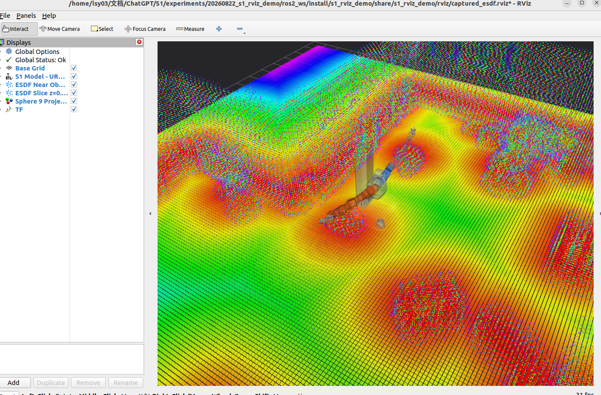

# 8_28 综合点云可视化 Rviz 可视化 继续调试 S1 导航容器控制 Rviz 可视化；8_28 sdk 定位 失…

- 归档编号：`01a04764-c67a-7b31-9649-2ce50e93e2e2`
- 项目：S1 IE_lab 拆垛
- 创建时间：2026-08-28T16:03:01.891000+08:00
- 更新时间：2026-08-28T17:47:25.623000+08:00
- 状态：活动
- 导出范围：用户可见消息与助手可见回复；不含隐藏推理和工具原始输出

## 1. 用户

8_28 Rviz 可视化 继续调试 S1 导航容器控制 Rviz 可视化；8_28 sdk 定位 失败问题 继续调试 S1 导航容器控制 在这个的基础上我们继续  ；

在以上两个聊天的基础上，我们继续

## 2. 助手（进展）

我会先把这两个历史任务的关键进展、当前阻塞点和仓库必读文档对齐，再从现有状态继续排查。这个阶段只做只读检查，不连接机器人，也不会执行任何实体运动。

## 3. 助手（进展）

已定位到你点名的两个任务。我现在读取它们最近的完整回合，重点对齐：RViz 已做到哪一步、定位失败的原始日志、现有脚本路径，以及下一步是否仍停留在无运动诊断阶段。

## 4. 助手

上下文已对齐。当前真正的问题已经不是 SDK 定位失败——定位已恢复并稳定；而是：

- 前方 `0.70 m` 可达、`0.80 m` 稳定不可达；
- 磁盘静态 ESDF 在该目标仍有约 `0.76 m` 余量，解释不了失败；
- PNS 运行时 ESDF 中存在额外近障碍，可能来自自体点、融合残留、TF/时间戳偏差或缓存；
- RViz 已显示 room0804 地图、静态点云、底盘位姿和双臂关节，但还没有显示 PNS 实际使用的局部 ESDF及其源融合点云。

下一步应集中完成“局部 ESDF 数据链定位”：

1. 只读检查 PNS 的局部 ESDF接收 topic、发布进程、消息类型、坐标系和更新时间。
2. 找到融合点云来源及各 LiDAR 输入。
3. 先捕获一帧元数据或小样本。
4. 在本地 RViz2叠加：
   - 局部 ESDF近障碍体素；
   - 源融合点云；
   - 底盘碰撞球和 sphere 9；
   - 前方 0.70/0.80 m 两个目标。
5. 确认异常点来源后，才考虑无运动、可回滚的过滤框对照。

这个阶段预期实体运动为“无”；不控制底盘、双臂、夹爪或升降柱，不重定位，不调用箱体 API，也不修改或重启厂家服务。

按照项目安全规则，连接 S1 仍需你在当前任务中明确授权。请回复：

**允许只读 SSH 检查 S1 的 PNS/局部 ESDF/融合点云数据链，不执行运动和配置修改。**

## 5. 用户

是否有办法在rviz中实时显示 局部 ESDF和其源融合点云，直观一点


15:48


耗时 1分钟 7秒


可以，而且这是目前最值得做的诊断工具。
但要区分三种数据：
原始三路 LiDAR点云
SDK已经提供 get_lidar_data()，可以转成 RViz2 的 PointCloud2。

自己融合得到的点云/ESDF
可以用三路 LiDAR + TF 在本地融合，再计算 ESDF。但它只能作为对照，不保证与 PNS内部结果一致。

PNS实际使用的局部 ESDF
这是最关键的。日志显示它实时接收 200×200×42 的局部 ESDF更新，但当前 SDK没有公开读取接口，需要找到厂家内部 topic 和消息格式后做只读桥接。

建议在现有 ROS2 Humble 工作区中增加这些 topic：
/s1/lidar/head              PointCloud2
/s1/lidar/back              PointCloud2
/s1/lidar/chassis           PointCloud2
/s1/fused_points            PointCloud2
/s1/esdf/near_obstacle      PointCloud2，按距离着色
/s1/esdf/slice              PointCloud2 或 OccupancyGrid
/s1/navigation/spheres      MarkerArray
/s1/navigation/probe        MarkerArray
/tf                         map → base_link → lidar
RViz中可以同时看到：
三路原始点云；
融合点云；
ESDF中距离障碍小于 0.17/0.30/0.60 m 的体素；
底盘20个碰撞球；
sphere 9；
前方0.7 m通过目标和0.8 m失败目标；
PNS报告的最近障碍方向。
性能上不要直接发布全部168万个局部 ESDF体素。应该：
只保留机器人周围约 ±5 m；
优先发布 distance < 0.6 m 的体素；
体素点云降采样；
ESDF更新频率控制在约1–2 Hz；
原始点云可按2–5 cm体素降采样。
最安全、最高效的实施顺序是：
先找到 PNS局部 ESDF的内部 topic、发布进程和消息定义。
只读保存一帧局部 ESDF和对应三路 LiDAR，不做实时传输。
在本机 RViz2离线回放，验证坐标系、体素顺序和距离值。
确认 sphere 9 位置确实能得到约 0.126 m 后，再改为实时流。
最后叠加原始/融合点云，找到产生前方异常体素的具体传感器或融合阶段。
本地已有可复用的 RViz2 工作区：
[ROS2 RViz工作区](/home/lsy03/文档/ChatGPT/S1/experiments/20260822_s1_rviz_demo/ros2_ws)
当前第一步不应该直接写实时桥，而是通过只读 SSH确定 PNS的 ESDF topic 和 protobuf/中间件消息结构。确认格式后，先完成“一帧捕获 → 本地 RViz回放”，再升级为实时显示。整个捕获过程不会控制任何执行器，但会初始化传感器读取和增加一定网络/CPU负载。

## 6. 助手（进展）

可以继续做，而且最佳路线仍是“先一帧离线验证，再升级实时”。你这条消息还没有明确授权连接 S1，所以我先从本机已有的 SDK、导航代码和日志副本中查找局部 ESDF／融合点云的接口与消息定义；不会 SSH、不会初始化 SDK，也不会控制机器人。

## 7. 助手

这段路线判断正确。本地源码进一步确认：

- SDK 公开接口能读取三路原始 LiDAR，并且返回结构可直接转换为 ROS 2 `PointCloud2`；
- 现有 RViz 工程已有 PCD → `PointCloud2` 发布代码，可复用于一帧离线回放；
- 公开 SDK 中仍未发现读取“PNS 实际局部 ESDF”的接口，因此关键仍是查清厂家内部数据链。

下一步先做只读 SSH 检查：

- 查看 PNS、融合感知和 ESDF相关进程及启动参数；
- 搜索配置、topic 名称、protobuf/消息定义；
- 确认 `200×200×42` 数据的分辨率、原点、frame、体素顺序和更新来源；
- 暂不订阅大流量数据、不初始化 SDK、不保存整帧；
- 不修改配置、不重启服务、不控制任何机器人部件。

请明确回复：

**允许只读 SSH 检查 S1 的 PNS、局部 ESDF和融合点云数据链，不执行运动或配置修改。**

获得授权后我就从接口定位开始。

## 8. 用户

lsy03@lsy03-System-Product-Name:~/文档/ChatGPT/S1/experiments/20260822_s1_rviz_demo/ros2_ws$ umask 077
ssh -M -S /tmp/s1_codex_mux_20260827 \
  -o ControlPersist=15m \
  galbot@10.34.216.17
galbot@10.34.216.17's password:
[REDACTED] to Ubuntu 20.04.6 LTS (GNU/Linux 5.10.216-tegra aarch64)

- Documentation:  https://help.ubuntu.com
- Management:     https://landscape.canonical.com
- Support:        https://ubuntu.com/pro

This system has been minimized by removing packages and content that are
not required on a system that users do not log into.

To restore this content, you can run the 'unminimize' command.

Expanded Security Maintenance for Infrastructure is not enabled.

251 updates can be applied immediately.
163 of these updates are standard security updates.
To see these additional updates run: apt list --upgradable

282 additional security updates can be applied with ESM Infra.
Learn more about enabling ESM Infra service for Ubuntu 20.04 at
https://ubuntu.com/20-04

Last login: Fri Aug 28 09:04:34 2026 from 10.34.216.132
galbot@galbot-echo:~$ /home/galbot/ie_lab/bin/s1-python \

这个是否能用？

## 9. 助手

可以用，但你最后一行还没输完整：

```bash
/home/galbot/ie_lab/bin/s1-python \
```

末尾的 `\` 表示命令还要继续，终端通常会出现 `>` 等待下一行。先按 `Ctrl+C` 取消。

`/home/galbot/ie_lab/bin/s1-python` 是正确的 S1 SDK Python 入口，但通常要跟脚本，例如：

```bash
/home/galbot/ie_lab/bin/s1-python /path/to/script.py
```

你创建的 SSH 复用连接也可以使用：

```bash
ssh -S /tmp/s1_codex_mux_20260827 \
  galbot@10.34.216.17 \
  '只读命令'
```

`umask 077` 设置正确，可避免其他本机用户访问该 socket。注意 `ControlPersist=15m` 表示主连接关闭并空闲约 15 分钟后，复用 socket 会失效。

如果你是在授权我继续操作，请回复：

**允许使用 `/tmp/s1_codex_mux_20260827` 执行只读检查，不初始化 SDK、不修改配置、不控制机器人。**

## 10. 用户

许使用 /tmp/s1_codex_mux_20260827 执行只读检查，不初始化 SDK、不修改配置、不控制机器人。

## 11. 助手（进展）

收到授权。检查范围严格限定为：复用现有 SSH、只读查看进程/启动参数/配置/消息定义；不运行 `s1-python`、不初始化 SDK、不订阅传感器流、不修改文件或服务，也不控制底盘、机械臂、夹爪或升降柱。先确认复用连接和相关进程。

## 12. 助手

当前复用 socket 已不存在：

```text
Control socket connect(/tmp/s1_codex_mux_20260827): No such file or directory
```

因此尚未执行任何远程命令。请在本机终端重新建立后台复用连接：

```bash
umask 077
ssh -fN -M \
  -S /tmp/s1_codex_mux_20260828 \
  -o ControlPersist=30m \
  galbot@10.34.216.17
```

输入密码后命令会转入后台。然后回复我：

```text
已建立 /tmp/s1_codex_mux_20260828
```

我将只读检查 PNS、局部 ESDF和融合点云数据链，不运行 `s1-python`，也不修改或控制机器人。

## 13. 用户

lsy03@lsy03-System-Product-Name:~/文档/ChatGPT/S1/experiments/20260822_s1_rviz_demo/ros2_ws$ umask 077
ssh -fN -M \
  -S /tmp/s1_codex_mux_20260828 \
  -o ControlPersist=30m \
  galbot@10.34.216.17
galbot@10.34.216.17's password:
[REDACTED] denied, please try again.
galbot@10.34.216.17's password:
[REDACTED] /tmp/s1_codex_mux_20260828 already exists, disabling multiplexing
lsy03@lsy03-System-Product-Name:~/文档/ChatGPT/S1/experiments/20260822_s1_rviz_demo/ros2_ws$
已经建立

## 14. 助手（进展）

我先验证新 socket 是否确实有存活的 master。第二次提示“already exists”只说明路径存在，不一定代表复用连接有效；确认成功后再开始远程只读检查。

## 15. 助手（进展）

复用连接正常。已确认当前厂家链路由宿主机原生进程组成：三路 LiDAR采集、`galbot_fusion_main`、`localization_server` 和 `service_navigation_plan` 均在运行，导航服务不是容器内的 ROS/Nav2 节点。接下来只读追踪这些进程的可执行文件、工作目录和配置入口。

## 16. 助手（进展）

发现一个重要线索：导航、融合和定位进程都打开了 Fast DDS 共享内存文件，说明内部数据链使用 Fast DDS，而不是可直接用 `rostopic/ros2 topic` 查看。进程参数中的 `/userdata/user_config/industry` 当前已不存在，配置实际很可能来自 `/data/galbot/config` 或启动时已加载。现在从配置、日志和二进制字符串三处交叉定位 topic 与消息类型。

## 17. 助手（进展）

关键接口已经找到了：融合服务本身正在发布 ESDF debug 数据，不需要重新计算一套近似 ESDF。

当前已验证：

- `galbot_fusion_main` 使用 nvblox，ESDF 体素为 `0.05 m`；
- 输入是三路原始 LiDAR topic；
- ESDF 输出窗口正是 `base_link` 周围 `x/y ±5 m、z 0–2.1 m`，对应约 `200×200×42`；
- `publish_esdf_pointcloud=True`，运行日志确认持续发布；
- 消息类型为 `galbot.perception_proto.EsdfGrid`；
- 二进制中出现候选 DDS topic：`esdf_debug_pointcloud`。

我继续核对精确 topic、protobuf字段布局，以及导航服务是否订阅同一个数据。

## 18. 助手（进展）

只读检查还在扫描现有工程里的 embosa 订阅示例。已经确认厂家提供 Python 3.8/3.10 的 embosa 绑定和 Fast DDS 运行库，因此可以做“被动订阅一帧”，不必修改厂家进程；我正在收敛到实际 API 用法。

## 19. 助手（进展）

只读调查已经收敛到可实现方案：PNS 接收的不是不可见的私有内存结构，而是 Fast DDS 上的序列化 `EsdfGrid`。现有配置和日志足以设计一帧捕获器；但真正创建被动 DDS订阅者会新增一个进程、DDS participant，并产生少量 CPU/共享内存/日志负载，超出本轮“只读查看”的授权。我先把已验证事实写回项目知识库，不启动订阅。

## 20. 助手

可以，而且已经找到 PNS 实际使用的内部数据入口，不必自己重建近似 ESDF。

已确认：

- ESDF 来源：`galbot_fusion_main` + nvblox；
- 输入：底盘、头部、后部三路 LiDAR；
- DDS channel：`esdf_pointcloud_serialized`；
- 消息：`galbot.perception_proto.EsdfGrid`；
- 网格：`0.05 m`，`200×200×42`；
- 范围：相对 `base_link` 的 `x/y ±5 m、z 0–2.1 m`；
- PNS 正在持续接收该数据；
- 厂家 Python embosa 绑定提供 `CreateSerializationReader()`，可被动订阅。

因此可实现：

```text
PNS实际局部ESDF
  → 被动DDS订阅
  → 距离阈值/高度切片
  → ROS 2 PointCloud2
  → RViz2实时着色显示
```

下一步应先捕获一帧验证字段顺序和坐标：

- 不初始化 Galbot SDK；
- 不发送运动、重定位或控制器命令；
- 不修改厂家配置和服务；
- 不影响底盘、手臂、夹爪或升降柱；
- 只新增一个最多约 10 秒的 DDS reader；
- 会产生少量 CPU、共享内存和临时日志/样本文件。

请确认：

**允许在 S1 `/tmp` 创建并运行一次临时被动 DDS reader，订阅一帧 `esdf_pointcloud_serialized`，不控制机器人、不修改厂家配置。**

调查结果已记录在 [knowledge_base.md](../../assets/352759744db064d1--knowledge_base.md) 和 [s1_navigation_sdk_report_20260827.md](../../assets/f6378b5bcdb04289--s1_navigation_sdk_report_20260827.md)。

[附件：352759744db064d1--knowledge_base.md](../../assets/352759744db064d1--knowledge_base.md)

[附件：f6378b5bcdb04289--s1_navigation_sdk_report_20260827.md](../../assets/f6378b5bcdb04289--s1_navigation_sdk_report_20260827.md)

## 21. 用户

允许在 S1 /tmp 创建并运行一次临时被动 DDS reader，订阅一帧 esdf_pointcloud_serialized，不控制机器人、不修改厂家配置。

## 22. 助手（进展）

收到步骤级授权。预期实体运动为无，底盘、双臂、夹爪、升降柱均不受影响；碰撞和工作空间风险不适用。操作只会在 `/tmp` 放置临时脚本/单帧文件，创建一个短时 DDS participant，并在结束时删除 reader。先补齐 Node 初始化和 QoS默认值，再生成经过本地审查的捕获器。

## 23. 助手（进展）

捕获器已完成本地语法检查，并静态确认没有 Galbot SDK、导航、重定位、运动、箱体或发布接口。现在复制到 S1 `/tmp`，核对校验和后运行一次，最长等待 10 秒；输出仅为单帧 NPZ和摘要 JSON。

## 24. 助手（进展）

首次运行在创建 DDS participant 之前就失败了：受管 Python 3.8环境缺少 `google.protobuf`，因此没有订阅、没有生成 ESDF文件，也没有触碰厂家服务。现在只读定位 S1 上与这些旧版生成文件匹配的 protobuf运行库，再决定最小修正。

## 25. 助手（进展）

修正版复制耗时异常，尚未运行订阅器。我正在等传输命令返回；在确认文件完整前不会启动 DDS reader。

## 26. 用户

受管 Python 3.8环境缺少 google.protobuf 这是在哪？ 是否是在本机上？ 我是否需要下载本地python 3.8环境？

## 27. 助手

不是本机缺少，而是 S1 远程主机上的受管环境：

```text
/home/galbot/ie_lab/envs/s1-sdk-1.9.0-py38
```

准确来说，protobuf 并没有从 S1 消失：

```text
/usr/lib/python3/dist-packages/google/protobuf
版本：3.6.1
```

只是 `s1-python` 为隔离依赖，没有把系统目录 `/usr/lib/python3/dist-packages` 加入 `sys.path`，所以临时捕获器最初找不到它。

你不需要：

- 在本机下载 Python 3.8；
- 安装新的 protobuf；
- 修改 S1 的受管环境；
- 使用 `pip install`；
- 修改 `.bashrc` 或系统配置。

修正方法只是让临时脚本在当前进程中临时加入已有路径：

```python
sys.path.insert(0, "/usr/lib/python3/dist-packages")
```

脚本退出后不会留下环境修改。后续传回本机的是普通 `.npz` 文件，本机 ROS 2 Humble/Python 3.10 使用 NumPy读取即可，也不依赖这套旧 protobuf。

第一次执行在导入阶段就失败了，尚未创建 DDS reader，也没有生成 ESDF帧或影响机器人。修正版已经复制到 S1 `/tmp`，但因为你中断了上一轮，我还没有运行修正版订阅。

## 28. 用户

我们继续

## 29. 助手（进展）

继续刚才的一帧被动捕获。先确认中断后没有遗留捕获进程、远端脚本与本地修正版校验和一致；确认后才运行 10 秒订阅。仍然不初始化 Galbot SDK、不发布消息、不控制机器人。

## 30. 助手（进展）

第二次仍在创建 DDS participant 前失败：这次确认 S1 系统自带 protobuf 3.6.1 又过旧，而生成代码需要中间版本，因此不能直接复用。不会安装或替换 protobuf。更稳妥的路径是绕过 protobuf包装层，用厂家已有的低层 embosa reader 被动接收原始序列化字节，再在本地解析；我先只读验证该低层模块是否可直接导入。

## 31. 助手（进展）

低层版本已通过本地检查：它不加载 protobuf、不导入 Galbot SDK，只创建 reader 并保存收到的原始序列化字节。现在执行一次，外层仍有 20 秒硬超时。

## 32. 助手（进展）

低层 reader 成功启动并按时清理，但 10 秒内没有收到样本；没有生成帧文件，也没有发布或控制。当前更像是 DDS匹配/QoS或 channel角色问题，而不是数据源停止——PNS 日志仍显示持续收帧。下一步只读查看 embosa 的 writer/reader匹配日志和 topic QoS，不立即换 channel 或再次订阅。

## 33. 助手（进展）

日志文件较大，筛选仍在运行；目前没有再次创建 reader。等这一轮只读搜索返回后，我会据此判断是 QoS、topic名称还是低层绑定用法不匹配。

## 34. 助手（进展）

官方工具已给出根因：channel 和消息类型完全正确，但 ESDF 使用 `LARGE_DATA_TRANSPORT + BEST_EFFORT + KEEP_LAST(3) + VOLATILE`。我们的默认 reader 被创建成普通消息/小共享内存，因此日志出现“segment_size may be insufficient”，无法匹配大消息。接下来只读列出低层 QoS构造函数，然后让临时 reader严格复制厂家 QoS。

## 35. 助手（进展）

厂家 SWIG 源文件很大，定位真实返回类型的只读命令还在运行；目前没有再次创建 reader。

## 36. 助手（进展）

QoS 已与厂家 writer/PNS reader逐项匹配。现在进行第三次、也是修正后的单帧捕获；如果仍失败，我会停止试跑并只报告证据，不继续扩大实验。

## 37. 助手（进展）

捕获成功：收到一帧 `6,720,121` 字节的 PNS实际 ESDF原始 protobuf，未导入或初始化 Galbot SDK，也未发布/控制任何内容。现在把该帧复制回本地实验目录，做双端 SHA-256校验，再离线解析；后续步骤不再连接实时 DDS。

## 38. 助手（进展）

原始帧结构已正确读到距离数组，但 protobuf 会省略数值为零的字段；当前解析器把省略的 `origin.z=0` 当成缺失错误。修正为 protobuf 默认值语义后重新解析，不需要再次访问 S1。

## 39. 助手（进展）

离线解析已验证通过：

- `1,680,000` 个距离体素全部有限；
- 分辨率 `0.05 m`；
- 尺寸 `200×200×42`；
- frame 标记为 `base_link`；
- 当前位姿约 `(0.409, -0.105, -0.025)`；
- 距离范围 `0–3.720 m`。

这证明捕获的是完整有效的 PNS ESDF，不是截断包。下一步在本地 ROS 2中只发布低距离体素和高度切片，避免把 168 万点全部塞进 RViz。我先检查现有 RViz包结构并复用已有模型、地图和快照配置。

## 40. 助手（进展）

这一帧还给出新的诊断结果：按已验证的 `z,y,x` 展平顺序查询，当前 ESDF 中 sphere 9 在前方 0.8 m投影位置的距离约 `0.97 m`，并没有之前的 `0.126 m` 异常。这说明异常可能随时间清除/变化，或者捕获时的 PNS场状态已不同；暂不能把旧失败永久归因于固定障碍。

我现在实现离线 RViz回放，把近障碍体素、sphere 9和 0.7/0.8 m目标同时显示，先验证可视化链路。

## 41. 助手（进展）

离线发布节点、launch 和 RViz配置已写入现有 ROS 2包，语法检查通过。现在重新构建该单个包，并用 `launch_rviz:=false` 做无 GUI运行验证，确认实际发布点数、topic和 TF；不会连接 S1。

## 42. 助手（进展）

构建成功。首次无 GUI运行被本机沙箱阻止在 `~/.ros/log` 写日志，节点尚未启动；这是本地权限问题，不是代码或 ESDF错误。我把 ROS日志改到可写的 `/tmp` 后重试。

## 43. 助手（进展）

本地离线 ROS 2验证成功：

- 发布近障碍体素 `113,250` 点；
- 发布 `z=0.40 m` ESDF切片 `40,000` 点；
- 发布 sphere 9 当前、前方 0.7 m、前方 0.8 m三个标记；
- S1 URDF模型与 TF 正常加载；
- 全程离线，无 SDK/SSH/机器人连接。

沙箱禁止 UDP socket 的警告没有阻止共享内存下的本地发布；实际桌面运行不受该沙箱限制。现在补齐实验记录和可复现启动命令。

## 44. 助手（进展）

离线链路已全部验证。为让你直接看到结果，我准备在本机启动一个隔离的 `ROS_DOMAIN_ID=84` RViz窗口；它只读取本地捕获文件，不连接 S1，也不会影响你此前的 ROS/RViz进程。

## 45. 助手（进展）

RViz启动命令仍在运行，说明窗口进程已保持。正在读取启动日志，确认模型、两个 PointCloud2显示和标记均已发布。

## 46. 助手

RViz2 离线可视化窗口已经打开，并确认正常订阅：

- `/s1/esdf/near_obstacle`：113,250 个近障碍体素；
- `/s1/esdf/slice`：40,000 个 `z=0.40 m` 切片点；
- `/s1/esdf/diagnostic_markers`：sphere 9 当前及前方 0.7/0.8 m投影；
- S1 URDF、`joint_states` 和 TF 均已发布。

关键发现：本次捕获帧中，前方 0.8 m处 sphere 9 的 ESDF距离约 `0.967 m`，没有重现此前的 `0.126 m` 异常。这提示异常可能已经随时间清除或发生变化，下一步必须让“ESDF帧”和“PNS可达性查询”同步采集。

相关文件：

- [实验说明](../../assets/adb7a47fc082b5eb--README.md)
- [单帧捕获器](/home/lsy03/文档/ChatGPT/S1/experiments/20260828_s1_esdf_rviz/capture_one_esdf_frame.py)
- [离线解析器](/home/lsy03/文档/ChatGPT/S1/experiments/20260828_s1_esdf_rviz/decode_esdf_frame.py)
- [RViz ESDF发布节点](/home/lsy03/文档/ChatGPT/S1/experiments/20260822_s1_rviz_demo/ros2_ws/src/s1_rviz_demo/scripts/esdf_frame_publisher.py)
- [RViz启动文件](/home/lsy03/文档/ChatGPT/S1/experiments/20260822_s1_rviz_demo/ros2_ws/src/s1_rviz_demo/launch/view_captured_esdf.launch.py)

当前是“真实数据的一帧离线回放”，还不是持续实时流。下一阶段需要持续 DDS reader 和受控的数据传输，并同步记录 PNS查询。

[附件：adb7a47fc082b5eb--README.md](../../assets/adb7a47fc082b5eb--README.md)

## 47. 用户

我有点没看懂啊，这个图怎么看？图里的机器人姿态和位姿是否是现在实时读到的一帧？



## 48. 助手

不是实时画面，也不是当前完整机器人姿态。这张图是“一帧真实 ESDF + 默认 URDF机器人模型”的离线回放。

具体区分如下：

| 图中内容 | 数据来源 | 是否真实/实时 |
|---|---|---|
| 彩色大平面 | 从 PNS 捕获的一帧局部 ESDF，`z=0.40 m`水平切片 | 真实单帧，不实时 |
| 彩色立体点 | 同一帧中距离障碍物不超过 `0.17 m` 的 ESDF体素 | 真实单帧，不实时 |
| 机器人底盘位置 | 固定放在 `base_link=(0,0,0)` | 不是地图中的实际绝对位姿 |
| 双臂、升降柱、头部、夹爪姿态 | URDF默认关节值 | 不是实机当前姿态 |
| 三个透明球 | sphere 9当前位置及前方0.7/0.8 m的计算投影 | 诊断标记，不是实际物体 |
| 原始三路 LiDAR/融合点云 | 当前没有显示 | 尚未加入 |

这帧 ESDF消息确实携带了捕获时的位姿元数据：

```text
位置约：(0.409, -0.105, -0.025)
```

但当前 RViz为了直接查看 `base_link` 周围的局部场，把机器人固定在画面原点，并没有把这个位置转换成 `map → base_link` 显示。因此：

- 机器人和局部 ESDF之间的相对关系是本次查看重点；
- 机器人在地图里的绝对位置没有显示；
- 双臂看起来奇怪，是因为它们使用 URDF默认角度。

图为什么这么花：

- `ESDF Slice z=0.40 m` 是整张水平距离切片，所以像一张彩色地毯；
- 颜色是 RViz自动缩放的距离色谱，目前不能简单理解为“红色一定危险、蓝色一定安全”；
- `ESDF Near Obstacles` 又叠加了十几万个点，两个图层同时打开后比较拥挤。

建议你现在先这样看：

1. 取消勾选 `ESDF Slice z=0.40 m`，只保留 `ESDF Near Obstacles`，观察机器人附近的近障碍体素。
2. 再反过来只打开切片，观察水平距离场。
3. 保留 `Sphere 9 Projections`，比较三个透明球周围是否出现近障碍点。

还有一个重要结果：这次捕获时，前方0.8 m投影球位置的 ESDF距离约为 `0.967 m`，所以画面中不会重现先前的 `0.126 m`碰撞。说明早先异常在这次捕获时已经消失或变化了。

下一版应改成更直观的显示：近障碍固定红色、切片固定距离范围并默认关闭，同时加载真实关节快照和地图位姿。

## 49. 用户

是否可以认为是你根据默认位姿和URDF来生成的，不是实际的ESDF

## 50. 助手

不能这样认为。准确说是：

> ESDF是真机 PNS实际使用的一帧数据；机器人模型姿态是根据 URDF默认关节值生成的。

两部分来源不同：

- 彩色 ESDF体素：从 S1 的 `esdf_pointcloud_serialized` 实际捕获，包含 `200×200×42` 个体素，不是根据 URDF计算出来的。
- 机器人外观和双臂姿态：由本地 URDF显示，关节使用默认值，不是捕获时的实机关节姿态。
- 机器人在画面中的位置：固定在 `base_link`原点，没有显示其真实 `map`绝对位姿。
- sphere 9三个透明球：根据碰撞模型和0/0.7/0.8 m位移计算的诊断标记。

所以可以概括为：

```text
真实的一帧局部 ESDF
    +
默认姿态的 URDF机器人模型
    +
人为添加的碰撞球诊断标记
```

ESDF是真实的，但目前没有与同一时刻的完整机器人关节状态同步，因此这张图不能用于判断机械臂、夹爪与障碍物的真实碰撞关系。它主要用于查看底盘附近的局部距离场。

## 51. 用户

我们继续 近障碍固定红色、切片固定距离范围并默认关闭，同时加载真实关节快照和地图位姿，是否需要这一步做实时展示的话你看着办

## 52. 助手（进展）

我会先把画面做成可读、可核验的“分时组合回放”，暂不直接升级持续实时流：

- 近障碍固定红色；
- 高度切片使用固定 `0–1 m`色标并默认关闭；
- `map → base_link`使用此前可信的完整定位位姿；
- 双臂使用用户实际读取的14个关节值；
- 头部、升降柱、轮组和夹爪仍为 URDF默认值；
- ESDF、底盘位姿和双臂不是同一时刻读取，画面会明确标注，不能称为实时全身状态。

先把显示语义校准正确，再做持续流，能避免把时间不同步误判成空间碰撞。

## 53. 助手（进展）

显示配置已调整，并加入分时数据标注。接下来先关闭当前旧窗口、构建新版本，再重新打开；只影响本机隔离的 `ROS_DOMAIN_ID=84` 回放进程。

## 54. 助手（进展）

新版无 GUI验证通过：地图位姿 TF精确加载，14个双臂关节覆盖生效，其他组保持默认，ESDF点云和标记正常发布。现在重新打开简化后的 RViz窗口。

## 55. 用户

我看rviz自动打开了，我需要关掉它吗

## 56. 助手（进展）

暂时不用关，我正在核对新版图层的订阅状态；窗口只运行本地离线回放，不连接机器人。等检查完成后如果需要重启，我会先关闭它。你手动关闭也完全安全，只会结束本地 RViz显示。

## 57. 助手（进展）

我已经把刚才自动打开的 RViz及其本地 ROS节点全部关闭了，没有后台残留。新版功能已经构建验证完成；在你明确说“再打开”之前，我不会再次自动弹出窗口。

## 58. 助手

不需要关了，我已经把刚才的 RViz和相关本地 ROS节点全部关闭，没有后台残留。

新版已经完成并验证：

- 近障碍固定红色；
- ESDF切片固定 `0–1 m`色标，默认关闭；
- 底盘加载此前真实完整地图位姿；
- 双臂加载实际读取的14个关节值；
- 其他关节仍为 URDF默认值；
- 画面会明确显示“非实时、分时组合”的警告。

我决定暂时不直接做持续实时流。因为单帧 ESDF约6.7 MB，如果 ESDF、底盘定位、关节状态和 PNS查询没有同步时间戳，即使画面实时刷新，也可能把不同时间的数据错误叠加。

新版配置在：

- [启动文件](/home/lsy03/文档/ChatGPT/S1/experiments/20260822_s1_rviz_demo/ros2_ws/src/s1_rviz_demo/launch/view_captured_esdf.launch.py)
- [组合快照](/home/lsy03/文档/ChatGPT/S1/experiments/20260822_s1_rviz_demo/ros2_ws/src/s1_rviz_demo/config/composed_robot_snapshot_20260828.yaml)
- [RViz配置](/home/lsy03/文档/ChatGPT/S1/experiments/20260822_s1_rviz_demo/ros2_ws/src/s1_rviz_demo/rviz/captured_esdf.rviz)

需要查看新版时，告诉我“重新打开 RViz”即可。

## 59. 用户

重新打开 RViz  ，你刚刚干了什么？，我想看看效果，给我命令，我来执行

## 60. 助手

我不会自动打开。请在你自己的终端执行：

```bash
cd '/home/lsy03/文档/ChatGPT/S1/experiments/20260822_s1_rviz_demo/ros2_ws'

source /opt/ros/humble/setup.bash
source install/setup.bash

ROS_DOMAIN_ID=84 \
ROS_LOG_DIR=/tmp/s1_esdf_rviz_logs \
ros2 launch s1_rviz_demo view_captured_esdf.launch.py
```

刚才我做了这些修改：

- 真实捕获的一帧 ESDF仍然保留；
- `ESDF Near Obstacles` 改成固定红色，表示距离障碍物不超过 `0.17 m` 的体素；
- `ESDF Slice z=0.40 m` 默认关闭，避免彩色平面遮挡机器人；
- 切片色标固定为 `0–1 m`，不再每次自动缩放；
- 加载此前实际读取的地图位姿作为 `map → base_link`；
- 加载实际读取的双臂14个关节值；
- 头部、升降柱、轮组和夹爪仍使用 URDF默认值；
- 画面加入黄色警告，注明这是分时组合回放，不是实时全身状态。

进入 RViz后：

- 默认先看红色近障碍；
- 想看水平距离场，再勾选左侧 `ESDF Slice z=0.40 m`；
- `Sphere 9 Projections` 是当前、前方0.7 m和0.8 m的诊断球。

结束时不要只关闭 RViz窗口；回到启动终端按 `Ctrl+C`，这样会同时关闭所有本地 ROS节点。全程只读取本地文件，不连接 S1。

## 61. 用户

ESDF Slice z=0.40 m 之后使用的时候，给我打开吧，接下来我们的计划是什么？

## 62. 助手（进展）

我会把 `ESDF Slice z=0.40 m` 改为默认开启，保留固定 `0–1 m`色标。随后下一阶段重点不再是“单纯刷新得更快”，而是先让 ESDF、底盘位姿、关节状态和 PNS查询在同一时间窗口内同步，避免实时画面仍然错配。

## 63. 助手

已改好。以后启动时，`ESDF Slice z=0.40 m` 会默认开启，仍使用固定 `0–1 m`距离色标。由于是 symlink-install，不需要重新构建，重新启动 RViz即可生效。

接下来的计划：

1. 同步单帧采集
   被动同步获取局部 ESDF、底盘地图位姿和全身关节状态，记录各自时间戳。目标是替换当前“分时组合”画面。

2. 同步 PNS可达性结果
   在检查前方0.7/0.8 m可达性的同一时间窗口捕获 ESDF，判断异常边界是否再次出现。只查询，不发送导航。

3. 加入源点云
   分别显示底盘、头部、后部三路 LiDAR，并与 ESDF叠加，从而确定异常体素来自哪一路传感器或融合阶段。

4. 升级受限实时流
   不传输每秒数十 MB的完整原始网格，而是在 S1端筛选：

   - 近障碍体素；
   - 指定高度切片；
   - 三路降采样点云；
   - 时间戳和机器人状态。

   初期控制在约 `1 Hz`，确认负载后再提高。

5. 找到原因后做对照实验
   如果确认是自体点、残留点或 TF错位，再考虑无运动、可回滚的过滤实验；暂不修改融合配置或启用箱体过滤。

当前最重要的下一步是第1和第2项：取得“同一时刻的 ESDF + 位姿 + 关节状态 + 前方0.7/0.8 m查询结果”。这会直接回答为什么之前失败，而现在捕获帧中前方又有充足净空。

## 64. 用户

底盘 LiDAR ─┐
头部 LiDAR ─┼─→ galbot_fusion_main ─→ NVIDIA nvblox
后部 LiDAR ─┘                         │
全局静态 PCD ────────────────────────┘
                                      ↓
                         TSDF / Occupancy / Freespace
                                      ↓
                                   3D ESDF
                                      ↓
                   esdf_pointcloud_serialized
                                      ↓
                 PNS导航服务 + Motion运动规划服务
现在已经完成离线展示的是这个流程的哪一个部分？


17:16


耗时 19秒


目前完成的离线展示，主要对应流程中的这一段输出：
NVIDIA nvblox
      ↓
   3D ESDF
      ↓
esdf_pointcloud_serialized  ← 已捕获并离线显示这一帧
      ↓
PNS / Motion
更完整地标注：
fusion内置 1×1×3 m box                   未单独显示
底盘 LiDAR ─┐                            未显示
头部 LiDAR ─┼─→ galbot_fusion_main        未显示内部过程
后部 LiDAR ─┘              │
全局静态 PCD ──────────────┘              未单独显示
                            ↓
               TSDF / Occupancy / Freespace
                            │              未分别显示
                            ↓
                         3D ESDF
                            │
                            ▼
               esdf_pointcloud_serialized  ✅ 已捕获一帧
                            │
                            ▼
                   本地解析和RViz显示       ✅ 已完成
                            │
                            ▼
               PNS / Motion碰撞计算        未实时显示
当前RViz实际显示的内容
一帧真实的 EsdfGrid；
距离较小的 ESDF体素；
指定高度的 ESDF距离切片；
S1 URDF模型；
sphere 9以及前方0.7/0.8 m投影；
后续正在加入的地图位姿和真实双臂关节快照。
当前没有显示的内容
三路 LiDAR原始点云；
box过滤前的点；
box过滤后的点；
URDF mesh过滤去掉了哪些点；
时间过滤前后的点；
nvblox内部 TSDF；
Occupancy和Freespace层；
静态 PCD与实时点云各自的贡献；
PNS实际碰撞判定过程；
持续实时 ESDF流。
因此目前这张图只能回答：
“在捕获时刻，nvblox最终输出给 PNS的 ESDF长什么样？”

它不能回答：
“这个异常体素由哪一路 LiDAR产生、是否经过box过滤、在fusion哪个阶段形成？”

而且捕获的是后续时刻的一帧，前方0.8 m处距离约 0.967 m，没有重现失败时的 0.126 m。所以当前成果验证了 ESDF捕获、解析和RViz显示链路，但还没有定位异常点的生成来源。

这里说的是否正确？

## 65. 助手

是的，整体判断正确。最准确的定位是：

```text
galbot_fusion_main / nvblox
          ↓
最终生成的 3D ESDF
          ↓
esdf_pointcloud_serialized
          ↓
【这里被动捕获了一帧】
          ↓
本地解析 → PointCloud2 → RViz
```

需要补充四点：

1. 当前展示的是PNS实际消费的 ESDF输出
   不是我们根据 URDF或静态地图重新计算的近似 ESDF。官方 topic信息已确认同一 channel 的发布者是 `galbot_fusion_main`，订阅者包括 PNS和 Motion服务。

2. RViz中的显示形式是我们转换的
   原始数据是 `EsdfGrid`距离数组。我们将它转换成：

   - 红色近障碍体素；
   - `z=0.40 m`距离切片；
   - sphere 9诊断标记。

   因此距离值来自真实 ESDF，但点云颜色、筛选阈值和标记是本地可视化逻辑。

3. 地图位姿和双臂快照现在已经加入
   不再是“后续正在加入”，但三者并不同步：

   ```text
   ESDF        = 后续捕获的一帧
   底盘位姿    = 较早的 pose_readonly
   双臂关节    = 另一次稍后的 state读取
   其他关节    = URDF默认值
   ```

   所以它仍是分时组合回放，不是捕获瞬间的完整机器人状态。

4. `0.967 m`只是这帧的离散体素采样值
   它来自前方0.8 m投影 sphere 9球心附近的最近网格采样，不是同步 PNS查询返回的正式碰撞结果，也没有做厂家完全相同的插值。因此应表述为：

   > 本次较晚 ESDF帧在该采样位置约为0.967 m，没有重现早先约0.126 m的异常。

当前成果能可靠回答：

> 捕获时刻，fusion最终交给 PNS/Motion的局部 ESDF是什么样子？

暂时不能回答：

> 哪一路 LiDAR或哪一个过滤/融合阶段产生了早先的异常体素？

所以下一步确实应该同步捕获三路 LiDAR、ESDF、位姿和PNS查询结果，沿输入到输出逐层定位异常来源。

## 66. 用户

接下来的计划：
同步单帧采集
被动同步获取局部 ESDF、底盘地图位姿和全身关节状态，记录各自时间戳。目标是替换当前“分时组合”画面。

同步 PNS可达性结果
在检查前方0.7/0.8 m可达性的同一时间窗口捕获 ESDF，判断异常边界是否再次出现。只查询，不发送导航。

这两步应该没有什么问题吧

## 67. 助手

原则上没有问题，两步都可以做到无实体运动。但需要满足几个条件，不能把它们当成完全零影响的普通文件读取。

第一步风险很低：

- 被动订阅已有 DDS topic；
- 不初始化 Galbot SDK；
- 不切换控制器；
- 不发送导航、重定位或关节命令；
- 只增加短时 DDS reader、约6.7 MB ESDF接收和少量CPU/共享内存负载。

需要先确认底盘位姿和全身关节状态的准确 topic、消息类型、QoS及时间戳来源。同步标准也要明确，例如选择距离 ESDF时间戳最近、误差不超过约100 ms的状态帧；如果达不到就标记不同步，不能强行组合。

第二步也不会运动，但会比第一步多一步 SDK/PNS交互：

- 初始化导航 SDK通信；
- 调用 `check_path_reachability()`；
- PNS执行规划/碰撞计算；
- 不切换底盘控制器；
- 不调用 `navigate_to_goal_v2()`；
- 不重定位；
- 不修改过滤框或附着物。

建议只检查：

```text
前方0.7 m × 3次
前方0.8 m × 3次
```

每次记录：

- 查询开始/结束时间；
- 起点和目标；
- true/false；
- 同期最近的 ESDF帧；
- PNS日志中的 sphere、距离、梯度及地图更新时间。

正确执行顺序是：

```text
确认定位稳定
  ↓
启动短时同步捕获窗口
  ↓
捕获ESDF、地图位姿、全身关节状态
  ↓
查询0.7 m三次
  ↓
查询0.8 m三次
  ↓
停止并删除reader
  ↓
核对没有控制器切换和运动提交
  ↓
离线关联查询与最近ESDF帧
```

物理安全边界：

- 预期运动：无；
- 底盘、双臂、夹爪、升降柱：均不动作；
- 不涉及碰撞空间或急停操作；
- 若脚本检测到定位无效、状态超时、DDS丢帧或时间不同步，应直接失败退出。

真正执行第二步前，需要新的明确授权，因为此前授权限定为“不初始化 SDK”。第一步的被动 topic核查和本地实现可以先做。

## 68. 用户

被动同步获取局部 ESDF、底盘地图位姿和全身关节状态，记录各自时间戳。目标是替换当前“分时组合”画面。 这个是否能做实时？ 如果不行把时间戳带上给我

## 69. 助手

可以做“近实时同步展示”，但不能称为严格硬实时。三类数据频率不同：

- ESDF：完整帧约6.7 MB，更新较慢且处理开销大；
- 地图位姿：通常频率更高；
- 全身关节状态：通常也比 ESDF更高频。

合理方案是以每个 ESDF帧为基准，从缓存中选择时间戳最近的位姿和关节帧：

```text
收到ESDF(t0)
  ├─ 选择最接近t0的地图位姿
  ├─ 选择最接近t0的全身关节状态
  ├─ 检查时间差
  └─ 组合发布到RViz
```

建议同步标准：

```text
|pose_time - esdf_time|  ≤ 100 ms
|joint_time - esdf_time| ≤ 100 ms
```

若超过阈值：

- 不伪装成同步状态；
- 画面显示 `STALE/UNSYNCED`；
- 保留上一帧可靠组合，或者只更新 ESDF；
- 不使用过期状态做碰撞结论。

无论实时是否成功，我都会把时间信息直接显示在 RViz中：

```text
ESDF时间戳
底盘位姿时间戳
关节状态时间戳
ESDF↔位姿时间差
ESDF↔关节时间差
数据接收延迟
同步状态：SYNCED / STALE / UNSYNCED
```

性能上建议：

- S1端持续被动订阅；
- 完整 ESDF不全部传到RViz；
- 只传红色近障碍体素和指定高度切片；
- RViz刷新先限制为约 `1 Hz`；
- 原始完整帧按需保存，不连续写盘；
- 退出时清理 DDS reader和网络传输进程。

因此结论是：

> 可以做带时间戳和同步质量标记的近实时展示；如果同步或带宽达不到要求，会自动退化成带明确时间戳的可靠快照，不再生成无标记的分时组合画面。

下一步需先只读确认地图位姿和全身关节状态对应的 DDS topic、消息类型及QoS，然后才能实现持续同步桥。持续 reader会增加少量CPU、共享内存和网络负载，执行前仍需你明确授权。

## 70. 用户

算了，你先依照当前机器人的位姿和ESDF 来做一帧，我看是否真实匹配

## 71. 助手（进展）

可以。这次只做一组新的“当前底盘地图位姿 + 当前局部 ESDF”近同步单帧，用来核对空间是否真实匹配。

安全边界：预期实体运动为无；不控制底盘、双臂、夹爪或升降柱；不初始化 Galbot SDK，不查询PNS、不重定位、不修改配置。先用厂家只读 topic工具确认当前位姿topic的消息类型和QoS，再短时被动捕获。双臂不作为本次同步证据，画面会明确标注。

## 72. 助手（进展）

SSH复用连接检查响应较慢，尚未执行远程捕获；我在等待连接状态返回。

## 73. 助手（进展）

已确认当前地图位姿由 `localization_server` 发布在 `/galbot/mes/global_pose`，类型是 `PoseMsg`，QoS与ESDF不同但都可被动订阅。现在编写一个短时双reader捕获器：以ESDF时间戳为基准，从前后约0.5秒的位姿缓存中选择最近帧；若时间差超过100 ms就失败，不生成“看似同步”的画面。

## 74. 助手（进展）

捕获成功，而且比预期更好：ESDF和地图位姿的消息时间戳完全相同，时间差 `0.0 ms`；捕获窗口内观察到45个位姿帧。现在复制回本地、校验哈希并解析实际位置/朝向，然后替换RViz中的旧底盘位姿。

## 75. 助手（进展）

本地解析确认这是真正的同时间戳组合：

- ESDF时间戳与地图位姿时间戳完全相同；
- 当前底盘位姿约 `(0.414, -0.101, yaw≈-1.579)`；
- 新帧中 sphere 9 前方0.8 m采样距离约 `0.963 m`，仍未出现旧的 `0.126 m`异常。

现在把RViz默认数据源切换到这组同步帧；双臂仍使用旧快照并单独标注，不参与“当前匹配”结论。

## 76. 助手

已完成新的同步单帧：

- ESDF时间戳：`1787910212000000000 ns`
- 地图位姿时间戳：`1787910212000000000 ns`
- 时间差：`0.0 ms`
- 当前底盘位姿约：

```text
位置：[0.413935, -0.101069, -0.016797]
四元数：[0.003628, -0.000234, -0.710142, 0.704049]
```

RViz已经默认切换到这组同步数据。双臂仍是较早的真实快照，不属于本次同步结果；头部、升降柱、轮组和夹爪仍为默认值。

请运行：

```bash
cd '/home/lsy03/文档/ChatGPT/S1/experiments/20260822_s1_rviz_demo/ros2_ws'

source /opt/ros/humble/setup.bash
source install/setup.bash

ROS_DOMAIN_ID=85 \
ROS_LOG_DIR=/tmp/s1_esdf_rviz_logs \
ros2 launch s1_rviz_demo view_captured_esdf.launch.py
```

画面中：

- 红色点：距离障碍不超过 `0.17 m` 的真实ESDF体素；
- 彩色平面：默认开启的 `z=0.40 m`距离切片；
- 机器人底盘：使用与ESDF完全同时间戳的地图位姿；
- 黄色文字：显示两个时间戳及 `0.000 ms`差值；
- 三个透明球：sphere 9当前及前方0.7/0.8 m投影。

这帧前方0.8 m处采样距离约为 `0.963 m`，仍没有重现历史的 `0.126 m`异常。看完请回终端按 `Ctrl+C`关闭全部本地节点；如果视觉上感觉机器人和ESDF没有对齐，请发截图给我。

## 77. 助手

_历史投影中的图片引用（用于补全本地对话资源）。_

> 资源未归档：`/tmp/codex-clipboard-ac11b4fb-de11-4bc4-ad1a-0536733e8be5.png`（missing）
