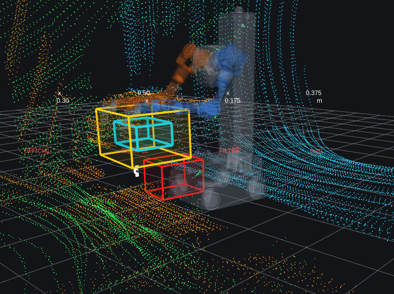
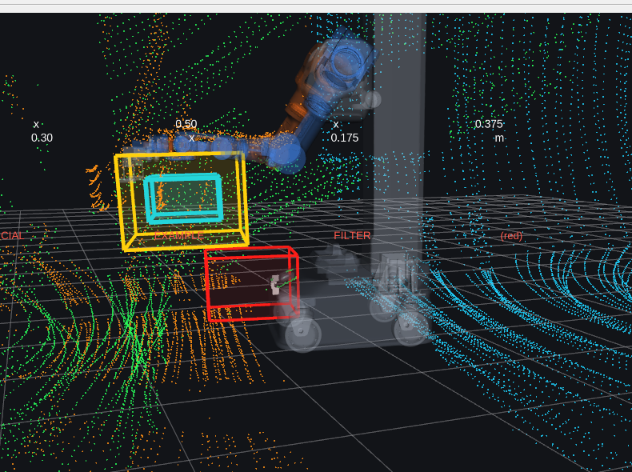

# 8_31 银河碰撞box代码 分析导航碰撞盒代码

- 归档编号：`01a05769-6c27-7231-89ce-f68800c131cd`
- 项目：S1 IE_lab 拆垛
- 创建时间：2026-08-31T18:42:01.901000+08:00
- 更新时间：2026-08-31T20:56:22.600000+08:00
- 状态：活动
- 导出范围：用户可见消息与助手可见回复；不含隐藏推理和工具原始输出

## 1. 用户

from galbot_sdk.g1 import GalbotNavigation
from galbot_sdk.g1 import GalbotRobot


def print_boxes(boxes):
    print(f"Current bounding boxes: {len(boxes)}")
    for index, box in enumerate(boxes):
        print(f"--- Box [{index}] ---")
        print("Tag:", box["box_tag"])
        print("Parent:", box["parent_link_name"])
        print("Size:", box["box_size"])
        print("Pose:", box["box_pose"])


robot = GalbotRobot()
robot.init()

nav = GalbotNavigation()
nav.init()

# Add a box so navigation does not treat the corresponding fused points as obstacles.
box_info = {
    "box_size": [0.4, 0.3, 0.28],
    "box_pose": [0.45, 0.0, 0.25, 0.0, 0.0, 0.0, 1.0],
    "box_tag": 1001,
    "parent_link_name": "base_link",
}
attached_box_info = {
    "box_size": [0.4, 0.3, 0.28],
    "box_pose": [0.2, 0.0, -0.2, 0.0, 0.0, 0.0, 1.0],
    "box_tag": 2001,
    "parent_link_name": "left_arm_end_effector_mount_link",
}

success, status = nav.add_bounding_box(box_info)
print("add_bounding_box:", success, status)

print_boxes(nav.get_bounding_box())

success, status = nav.attach_box_to_link(attached_box_info, [])
print("attach_box_to_link:", success, status)

success, status = nav.detach_box_from_link(2001)
print("detach_box_from_link:", success, status)

success, status = nav.remove_bounding_box(1001)
print("remove_bounding_box:", success, status)

print_boxes(nav.get_bounding_box())

robot.request_shutdown()
robot.wait_for_shutdown()
robot.destroy()
print("Resources released successfully")

给我看下这段代码
分析一下可行性，告诉我如何使用

## 2. 助手（进展）

我先按仓库要求读取项目说明、知识库，以及与 SDK/真机相关的文档，再核对本地是否有这些 API 的示例或定义。这里只做静态分析和只读检查，不连接机器人，也不会执行任何运动或导航命令。

## 3. 助手（进展）

已有项目记录正好覆盖这四个箱体接口。我接下来会核对当前本地 SDK stub 的精确签名和返回值，并重点检查这段脚本的初始化、异常清理、坐标系与调用顺序是否安全可靠。

## 4. 用户

暂时别修改代码，只读查看就行

## 5. 助手

收到。此次只做了本地文档、SDK stub 和示例代码的只读核对，没有修改文件、连接机器人或调用 SDK。

结论：这段代码适合作为 API 演示，但不建议直接用于当前 S1 真机业务流程。

### 代码在做什么

1. 初始化机器人 SDK 和导航模块。
2. `add_bounding_box(box_info)`：
   - 向 fusion 注册一个过滤框。
   - 后续进入该框的传感器点不会被当作普通环境障碍融合。
3. `get_bounding_box()`：
   - 查询已注册的 fusion 过滤框。
   - 它不能查询 PNS 中的附着碰撞物。
4. `attach_box_to_link(attached_box_info, [])`：
   - 将箱体作为碰撞几何附着到左臂末端 link。
   - PNS 规划时会考虑箱体与环境的碰撞。
5. 随即解除附着、删除过滤框并关闭 SDK。

所以脚本只测试“添加—查询—附着—解除—删除”是否能调用成功，没有导航动作，也没有真正验证携箱导航效果。

### 可行性判断

API 本身可行。当前 S1 SDK 1.9.0 已确认存在这五个接口；项目在 2026-08-31 的实机实验中也成功调用过 `add_bounding_box()`、`get_bounding_box()` 和 `attach_box_to_link()`。

不过有几个关键问题：

- 你的代码使用的是：

```python
from galbot_sdk.g1 import ...
```

这份代码与本地官方 G1 示例完全一致。当前项目是真机 S1，语义正确的命名空间应是：

```python
from galbot_sdk.s1 import GalbotNavigation, GalbotRobot
```

我没有修改代码。如果运行对象确实是 G1，则原导入才是正确的。

- `robot.init()` 和 `nav.init()` 的返回值没有检查。初始化失败后，脚本仍会继续调用接口。
- 没有 `try/finally`。如果中途抛异常，过滤框或附着物可能遗留在 fusion/PNS 中。
- 两个箱体使用不同 tag、不同父坐标系和不同位姿，因此它们并不表示同一个物理箱体：
  - 过滤框：tag `1001`，相对 `base_link`
  - 碰撞箱：tag `2001`，相对左臂末端
- `ignore_collision_links=[]` 表示不忽略任何机器人 link。如果箱体与夹爪或末端执行器发生正常接触，可能被判断为自碰撞。具体忽略哪些 link 必须依据实际接触关系确定，不能随意扩大。
- 示例位姿很可能只是演示数据，不能直接套到当前箱体：
  - 尺寸单位为米；
  - 位姿为 `[x,y,z,qx,qy,qz,qw]`；
  - 位姿相对于 `parent_link_name`；
  - 四元数必须归一化。
- `add_bounding_box()`只过滤登记之后进入融合系统的新点，不会可靠地追溯删除此前已经融合进 TSDF/ESDF 的箱体体素。相关运行时分析见 [s1_add_bounding_box_runtime_analysis_20260831.md](../../assets/7b81546798fced5b--s1_add_bounding_box_runtime_analysis_20260831.md#L18)。

### 如何正确使用

如果目的只是验证接口，应当：

1. 在机器人静止、导航任务不处于 `RUNNING`/`OCCUPIED` 时操作。
2. 确认没有其他 SDK 客户端占用机器人。
3. S1 上使用受管 Python 环境，而不是普通 `python3`：

```bash
/home/galbot/ie_lab/bin/s1-python bounding_box_filter.py
```

4. 先查询现有过滤框，确保 tag 没有冲突。
5. 根据实际抓取姿态测量箱体尺寸和相对位姿。
6. 添加过滤框后，必须通过 `get_bounding_box()`确认 tag、尺寸、父 link 和位姿。
7. 附着失败时，立即回滚过滤框。
8. 完成携箱导航并停止导航后，再解除附着和删除过滤框。
9. 最后再次查询，确认过滤框确实消失。

这段脚本本身不会命令底盘、机械臂、夹爪或升降柱运动，但会改变 fusion 的感知过滤范围和 PNS 碰撞场。过滤框过大或位置错误可能把真实障碍过滤掉；附着箱体错误则可能导致错误碰撞或错误放行。因此不能把示例中的尺寸和位姿直接用于真机导航。

当前仓库已有更稳健的 S1 实现，包含初始化检查、tag 冲突检查、失败回滚、显式确认和清理验证，可参考 [s1_navigation_cli.py](/home/lsy03/文档/ChatGPT/S1/experiments/20260827_s1_navigation/s1_navigation_cli.py:251) 和对应的 [使用说明](../../assets/097fe17e5ed31629--README.md#L63)。其中固定的 4317 参数只适用于文档记录的特定抓取姿态，不能用于这里的示例箱体。

[附件：7b81546798fced5b--s1_add_bounding_box_runtime_analysis_20260831.md](../../assets/7b81546798fced5b--s1_add_bounding_box_runtime_analysis_20260831.md)

[附件：097fe17e5ed31629--README.md](../../assets/097fe17e5ed31629--README.md)

## 6. 用户

bounding_box_filter.py filter 代码能否帮我加入 s1_navigation_cli.py  ,或者另外新建一个导航代码 我想验证一下  bounding_box_filter.py 核心功能加入之后，抱着箱子向前运动能否实现

## 7. 助手（进展）

可以。我会优先扩展现有 `s1_navigation_cli.py`，复用它已经验证过的锁、定位检查、三次可达性预检、碰撞检测、超时和清理逻辑，避免另起一套容易分叉的导航代码。

安全边界先说明：拟新增的命令将驱动 S1 移动底盘抱箱向 `base_link` 正前方低速移动；不会主动运动机械臂、夹爪或升降柱，但它们会保持当前抱箱状态随底盘整体移动。主要风险是箱体/双臂外廓碰撞、过滤框误遮真实障碍、前方净空不足和急停不及时。代码会默认拒绝运动，只有现场再次确认具体距离、速度、空间净空和物理急停就绪后才允许提交；我只做本地代码和伪 SDK 测试，不连接或运行真机。先按仓库要求复读上下文并检查当前实现。

## 8. 助手（进展）

检查结果显示，其实 `bounding_box_filter.py` 的两个核心动作已经在现有 CLI 中实现了：`payload-register-4317` 会先添加 fusion 过滤框，再把实体箱作为 PNS 碰撞物附着；不是简单复制 G1 示例。

我准备新增一个专用的 `payload-forward-4317` 小步验证命令：默认前进 0.20 m、硬上限 0.50 m；必须检测到 tag 4317 的过滤框且尺寸/位姿与已记录配置一致，三次可达性检查全部通过，并输入与距离绑定的确认口令才会切换底盘控制器。它不会自动清图，也不会绕过碰撞检测；已有体素若导致预检失败，命令会停在运动提交之前。现有文件已有未提交改动，我会只打最小补丁保留它们。

## 9. 用户

给我严格对照 bounding_box_filter.py 和  s1_navigation_cli.py 其中的 add_bounding_box 以及相关函数使用方法，两者是否一致？s1_navigation_cli中是否有可以添加的东西？添加完我就让S1 前进一米来验证

## 10. 助手（进展）

我先暂停上一轮“直接新增命令”的方向，改为严格做逐项对照；目前我还没有修改任何文件。

先给关键结论：两边的 SDK 调用签名和核心顺序是一致的，但 `s1_navigation_cli.py` 已经比官方示例更完整。真正值得补的是“添加后校验完整尺寸/位姿”和“运动前强制确认 tag 4317 配置正确”，不是再复制一遍示例。另一个重要事实是：当前实机证据已经表明，携箱状态下前进 1 m 的三次预检均为 false；直接补代码不会让它安全变成可达。我会把代码与证据逐项列清楚。

## 11. 助手

严格对照后结论：两份代码对 `add_bounding_box()` 及相关 API 的使用方式一致，`s1_navigation_cli.py` 已经完整包含 `bounding_box_filter.py` 的核心功能，而且更适合真机。当前没有修改文件。

## 逐项对照

| 功能 | `bounding_box_filter.py` | `s1_navigation_cli.py` | 判断 |
|---|---|---|---|
| SDK 模块 | `galbot_sdk.s1` | `galbot_sdk.s1` | 一致 |
| 添加过滤框 | `nav.add_bounding_box(box_info)` | `nav.add_bounding_box(CARRIED_4317_BOX_FILTER)` | 一致 |
| 返回值 | `(success, status)` | 同样检查 tuple 首项 | 一致，CLI 检查更严格 |
| 查询过滤框 | `nav.get_bounding_box()` | 添加后立即查询 | 一致 |
| 附着碰撞箱 | `nav.attach_box_to_link(info, [])` | `attach_box_to_link(info, ignore_links)` | 接口一致，CLI 参数更符合双臂抱箱 |
| 解除碰撞箱 | `detach_box_from_link(tag)` | 相同 | 一致 |
| 删除过滤框 | `remove_bounding_box(tag)` | 相同 | 一致 |
| 生命周期 | 同一脚本内立即添加、解除、删除 | 注册后保留，放箱后单独删除 | CLI 更符合真实携箱流程 |
| 初始化检查 | 不检查返回值 | 检查 `robot.init()`、`navigation.init()` | CLI 更安全 |
| 异常处理 | 无 | 加锁、回滚、关闭 SDK | CLI 更安全 |

官方示例在 [bounding_box_filter.py](/home/lsy03/Lsy03_document/galbot_s1_SDK_learning/third_party/GalbotSDK_official_full/examples/s1/python/galbot_navigation/bounding_box_filter.py:21)，CLI 对应实现在 [s1_navigation_cli.py](/home/lsy03/文档/ChatGPT/S1/experiments/20260827_s1_navigation/s1_navigation_cli.py:454)。

### 参数差异是有意设计

官方示例用了两个独立演示对象：

- fusion 过滤框：tag `1001`，相对 `base_link`
- PNS 碰撞箱：tag `2001`，相对左臂末端

CLI 表示同一个实际 4317 箱体：

- fusion 过滤框：`0.60 × 0.50 × 0.375 m`
- PNS 实体碰撞箱：`0.40 × 0.30 × 0.175 m`
- 两者统一 tag `4317`
- 都使用经过生产代码记录的 `base_link` 相对位姿
- 忽略四个与箱体正常接触的末端 link

这个设计已经在真机 SDK 1.9.0 中成功注册，而且 PNS 日志确认 `sdk_box_4317` 已经附着。

## CLI 仍然值得补强的地方

建议添加两项，不需要重复移植官方示例。

1. 完整校验过滤框

当前添加后只验证“是否存在 tag 4317”，没有自动比较：

- `box_size`
- `box_pose`
- `parent_link_name`
- 四元数合法性

应增加带浮点容差的完整配置校验，防止同一个 tag 对应错误尺寸或旧位姿。

2. 新增专用 `payload-forward-4317`

当前通用 `relative` 命令只统计过滤框数量；即使没有 tag 4317，只会打印警告，并不会阻止运动。

专用命令应强制：

- 定位有效；
- 导航状态空闲；
- tag 4317 存在；
- 尺寸、位姿和父 link 与记录配置一致；
- 明确提示 attachment 无法通过公开 getter 查询；
- 对精确的前进目标连续做三次可达性检查；
- 三次全部为 true 才显示运动确认；
- 始终启用 v2 碰撞检测；
- 不提供关闭碰撞检查或清 ESDF 的选项；
- 确认口令绑定距离，例如 `MOVE_HELD_4317_FORWARD_1.000`。

## 关于直接前进 1 米

目前不能直接提交这次 1 m 运动。

现有实机证据是：

- tag 4317 过滤框已成功注册并跨 SDK 会话存在；
- PNS 附着箱体也已由日志确认；
- 抱箱状态下前进 1.0 m 的三次可达性检查全部返回 `false`；
- 拒绝来自底盘原生 sphere 11 与运行时 ESDF 碰撞；
- 最符合证据的原因是：过滤框注册前已经融合的箱体体素没有被追溯删除。

`add_bounding_box()`只过滤登记后的新输入点，不会自动清除已有 ESDF 体素。因此，补代码可以让流程更严格，但不能把当前不可达的 1 m 目标强行变为可达。相关证据在 [knowledge_base.md](../../assets/352759744db064d1--knowledge_base.md#L617)。

正确验证顺序应是：

1. 补充完整配置校验和专用携箱前进命令。
2. 只读查询当前 tag 4317 状态。
3. 扫描前方 `0.10、0.20、0.30、0.40、0.50、0.60、0.80、1.00 m`。
4. 只允许三次稳定可达的距离进入运动确认。
5. 首次携箱移动从最短稳定可达距离开始。
6. 只有 1 m 三次预检重新变为 true，且现场确认箱体/双臂外廓、前方空间、低速和物理急停后，才能单独确认 1 m 运动。

不应加入 `clear_esdf`、关闭碰撞检查或绕过预检。下一步可以按上述两项补强 `s1_navigation_cli.py`，但代码完成不代表已经授权真机前进；运动前仍需要一次新的、绑定精确距离和速度的确认。

[附件：352759744db064d1--knowledge_base.md](../../assets/352759744db064d1--knowledge_base.md)

## 12. 用户

给我对比一下两者的具体参数
# Add a box so navigation does not treat the corresponding fused points as obstacles.
box_info = {
    "box_size": [0.4, 0.3, 0.28],
    "box_pose": [0.45, 0.0, 0.25, 0.0, 0.0, 0.0, 1.0],
    "box_tag": 1001,
    "parent_link_name": "base_link",
}
attached_box_info = {
    "box_size": [0.4, 0.3, 0.28],
    "box_pose": [0.2, 0.0, -0.2, 0.0, 0.0, 0.0, 1.0],
    "box_tag": 2001,
    "parent_link_name": "left_arm_end_effector_mount_link",
}
就是看参数是否合理，以及 parent_link_name 是否能对应上相关的位置？ 确定一下点云去除box的具体范围是在哪个空间中？我也有怀疑是参数配置错误导致点云没有去除干净

## 13. 助手（进展）

我会把两个过滤框和两个碰撞框分别换算成“父坐标系中的中心、半尺寸、轴向覆盖范围”，再核对 `parent_link_name` 是否存在于当前 S1 模型、CLI 中 4317 位姿是怎样得到的，以及 fusion 实际在哪个坐标系执行过滤。这里只做本地模型/代码/日志的只读核对，不连接机器人或修改配置。

## 14. 助手

结论很明确：

- 如果用 `bounding_box_filter.py` 示例里的 `box_info` 去过滤当前 4317 抱箱，参数明显不匹配，极可能几乎没有过滤到实际箱体。
- `s1_navigation_cli.py` 的 4317 参数在几何上是自洽的：过滤框完整包住实体箱，并在每个局部方向留出约 10 cm 余量。
- `attached_box_info` 不参与点云过滤，它只影响 PNS 碰撞模型。真正决定点云删除范围的是传给 `add_bounding_box()` 的 `box_info`。

## 1. 点云过滤参数对比

### 官方示例过滤框

```python
box_size = [0.4, 0.3, 0.28]
box_pose = [0.45, 0.0, 0.25, 0, 0, 0, 1]
parent_link_name = "base_link"
```

四元数是单位姿态，因此过滤框与 `base_link` 三轴平行。

按“`box_pose` 是箱体中心位姿”计算：

| 方向 | 中心 | 半尺寸 | 覆盖范围 |
|---|---:|---:|---:|
| base x | 0.45 m | 0.20 m | `0.25～0.65 m` |
| base y | 0.00 m | 0.15 m | `-0.15～0.15 m` |
| base z | 0.25 m | 0.14 m | `0.11～0.39 m` |

也就是说，它过滤的是底盘前方、距离较近、位置很低的一块区域。

### CLI 当前 4317 过滤框

```python
box_size = [0.60, 0.50, 0.375]
box_pose = [
    0.72799, 0.01063, 0.64757,
    0.00782, 0.00233, 0.70228, 0.71185
]
parent_link_name = "base_link"
```

该四元数归一化正确，对应近似：

```text
roll  =   0.83°
pitch =  -0.44°
yaw   =  89.22°
```

所以箱体相对底盘几乎横转了 90°。这是一个有方向的 OBB，不是简单的 base 坐标轴对齐框。

它在自身局部坐标中的覆盖范围是：

```text
局部 x：中心 ±0.300 m
局部 y：中心 ±0.250 m
局部 z：中心 ±0.1875 m
```

换算成 `base_link` 下的轴对齐包围范围约为：

| 方向 | 覆盖范围 |
|---|---:|
| base x | `0.471～0.985 m` |
| base y | `-0.294～0.315 m` |
| base z | `0.454～0.841 m` |

### 两者关键差异

| 参数 | 官方示例 | CLI 4317 |
|---|---:|---:|
| 中心 x | 0.45 m | 0.728 m |
| 中心 y | 0 m | 0.011 m |
| 中心 z | 0.25 m | 0.648 m |
| 姿态 | 无旋转 | 约旋转 89.2° |
| 尺寸 | 0.4×0.3×0.28 m | 0.6×0.5×0.375 m |
| base z 范围 | 0.11～0.39 m | 0.454～0.841 m |

两个框在 z 方向甚至没有重叠：

```text
示例框最高：0.39 m
4317 实体箱最低约：0.556 m
间隔约：0.166 m
```

因此，如果当前箱体确实位于 CLI 记录的位置，官方示例的过滤框基本过滤不到它。

## 2. CLI 过滤框是否覆盖实体箱

CLI 的实体碰撞箱是：

```python
box_size = [0.40, 0.30, 0.175]
```

过滤框是：

```python
box_size = [0.60, 0.50, 0.375]
```

两者中心和姿态相同，因此过滤框比实体箱每个方向都多 `0.20 m`，即每一侧约多 `0.10 m`。

换算到 `base_link`：

| 几何 | base x | base y | base z |
|---|---|---|---|
| 实体碰撞箱 | 0.574～0.882 | -0.192～0.213 | 0.556～0.739 |
| fusion 过滤框 | 0.471～0.985 | -0.294～0.315 | 0.454～0.841 |

因此，CLI 过滤框确实完整包住实体箱，且四周约有 10 cm 的噪声余量。从纯几何参数看是合理的。

## 3. `parent_link_name` 的具体含义

### `base_link`

`base_link` 是当前 S1 模型的根坐标系。CLI 使用：

```python
"parent_link_name": "base_link"
```

含义是：

```text
箱体中心和方向固定在底盘坐标系中
```

只要双臂、夹爪和升降柱保持记录时的姿态，箱体与底盘之间没有相对移动，这个选择就是合理的。

如果之后出现以下任何变化，原参数就会失效：

- 手臂改变姿态；
- 箱体在夹爪中滑动；
- 升降柱升降；
- 抓取后没有执行记录中的 `+100 mm` 上抬和 `-50 mm base-X` 后退；
- 箱体不是当前记录的 4317/H4 箱体。

### `left_arm_end_effector_mount_link`

这个 link 在当前官方 S1 URDF 中确实存在，见 [galbot_s1.urdf](/home/lsy03/Lsy03_document/galbot_s1_SDK_learning/third_party/galbot_s1_description/urdf/galbot_s1.urdf:1056)。

但它的坐标轴并不等同于 `base_link`。它相对 `left_arm_link7`：

```text
平移：x = -0.14 m
旋转：roll ≈ -π，yaw ≈ π
```

所以示例中的：

```python
box_pose = [0.2, 0.0, -0.2, 0, 0, 0, 1]
```

表示的是：

```text
沿左臂末端 mount 坐标系 x 正方向 0.2 m
沿该末端坐标系 z 负方向 0.2 m
```

不能把它直接理解成“相对底盘向前 0.2 m、向下 0.2 m”。必须结合当前机械臂关节状态和 FK，才能知道它在 `base_link` 中的实际位置。

这个 link 名称有效，但示例位姿是否对应当前箱体，不能仅凭 link 名称确认。它只是官方演示参数。

## 4. 点云具体在哪个空间被过滤

已从当前 fusion 二进制和运行日志确认：

```text
box_pose（相对 parent_link_name）
        ↓ 当前 TF
转换到 base_link
        ↓
检查新输入的 LiDAR 点是否落在有方向包围框 OBB 内
        ↓
框内点不进入 TSDF / occupancy / color integration
        ↓
后续生成 ESDF
```

所以：

- 参数输入空间：`parent_link_name` 坐标系；
- fusion 内部共同计算空间：转换到 `base_link`；
- 过滤形状：由四元数确定方向的 OBB；
- 不是 map 中固定不动的轴对齐区域；
- parent 是 `base_link` 时，过滤框会随机器人底盘移动；
- 它过滤的是后续传感器输入点，不是直接从现有 ESDF 中删除体素。

具体运行链路见 [s1_add_bounding_box_runtime_analysis_20260831.md](../../assets/7b81546798fced5b--s1_add_bounding_box_runtime_analysis_20260831.md#L19)。

## 5. `attached_box_info` 会不会帮助去除点云

不会。

```python
nav.attach_box_to_link(attached_box_info, ...)
```

只会把箱体加入 PNS 的机器人碰撞模型，使导航规划考虑：

```text
携带箱体 ↔ 环境障碍物
```

它不会：

- 过滤 LiDAR 点；
- 修改 fusion；
- 删除 TSDF；
- 删除 ESDF；
- 扩大 `add_bounding_box()` 的过滤范围。

因此，排查“点云没有去除干净”时，首先看的是 `box_info`，不是 `attached_box_info`。

## 6. 对“参数配置错误”的判断

你的怀疑有一部分是成立的：

- 如果实际使用了官方示例的 `[0.45, 0, 0.25]`，参数明显错误，过滤区域比当前箱体低约 30～50 cm。
- 如果实际使用的是 CLI 的 4317 参数，过滤框本身能够完整覆盖记录的实体箱，尺寸和方向没有明显错误。

当前 CLI 参数下仍然出现残留，最有证据支持的原因是：

1. 箱体点在注册过滤框之前已经融合进 TSDF/ESDF；
2. `add_bounding_box()`不会追溯删除这些旧体素；
3. 前进 1 m 时，底盘 sphere 11 正好进入旧箱体所在的世界坐标区域；
4. PNS 因此仍然判断目标碰撞。

其次才需要检查：

- 当前抱箱姿态是否偏离记录姿态；
- 箱体是否在夹爪内滑动；
- 升降柱或手臂是否又发生变化；
- 实际点云是否超出 10 cm 过滤余量；
- TF 是否在过滤时缺失或滞后。

所以目前不能简单通过放大过滤框解决；最有效的下一步是把实时点云/ESDF与 CLI 的过滤 OBB 同屏显示，确认残留点是在框外，还是框内的历史体素。

[附件：7b81546798fced5b--s1_add_bounding_box_runtime_analysis_20260831.md](../../assets/7b81546798fced5b--s1_add_bounding_box_runtime_analysis_20260831.md)

## 15. 用户

确认完成：RViz现在已实际订阅MarkerArray（订阅者数1），不是仅发布未显示。窗口中：
黄色外框/半透明体：4317 add_bounding_box过滤区域；
青色实体/线框：4317物理箱；
红色框：官方示例；
全部绑定 base_link 且 frame_locked=true，会随实时机器人底盘位姿一起移动。
我补充说明后保持窗口运行。

帮我看一下我怎么觉得这个黄框和青色的框是偏离的





## 16. 助手（进展）

我会对照两张截图和当前 Marker 生成代码，重点核查黄色/青色是否真的用了同一 `box_pose`、同一四元数顺序和同一个 `base_link` 原点，并区分“透视造成的视觉错位”和“Marker 参数确实不一致”。只读检查，不关闭窗口、不改代码、不连接机器人。

## 17. 助手

_工具输出图片（原始工具文本未纳入归档）。_


## 18. 助手

_工具输出图片（原始工具文本未纳入归档）。_


## 19. 助手（进展）

从源代码看，黄色和青色 Marker 确实共用同一个 `pose` 对象：同一中心、同一四元数、同一 `base_link`。因此“二者在三维数据上互相偏心”基本可以排除。下一步我会核对当前 ROS 安装目录实际运行的脚本/配置是否与源码一致；如果一致，截图里的观感主要就是透视投影、透明面混合和前后棱线造成的。另一个需要单独判断的是：两框虽然彼此同心，但整体是否偏离真实箱体点云。

## 20. 助手

你的感觉有一部分是对的，但要分成两件事：

1. 黄色框和青色框彼此之间没有真实的三维偏移。
2. 两个框整体可能与当前实际箱体点云有偏移。

## 黄色与青色是否同心

代码中两者共用完全相同的：

- `frame_id = base_link`
- 中心位置
- 四元数
- `frame_locked = true`

只改变尺寸：

```python
yellow: pose, [0.60, 0.50, 0.375]
cyan:   pose, [0.40, 0.30, 0.175]
```

对应代码见 [carried_box_markers.py](/home/lsy03/文档/ChatGPT/S1/experiments/20260822_s1_rviz_demo/ros2_ws/src/s1_rviz_demo/scripts/carried_box_markers.py:117)。我也核对了当前 ROS `install/` 中实际运行的脚本和 YAML，它们与源码完全一致。

因此数值上：

```text
中心差 = [0, 0, 0] m
姿态差 = 0 rad
```

黄色框在箱体局部三个方向都比青色框每侧多 0.10 m。

截图里青色框看起来略微向右、向下，是因为：

- 当前是透视视图；
- 大框和小框的前后表面深度不同；
- 箱体相对 `base_link` 旋转了约 89.2°；
- 半透明面发生叠加和遮挡；
- 黄色和青色线宽也不同。

所以不能用截图中两个框的二维外接矩形中心判断它们是否同心。

## 但两个框可能整体偏离真实箱体

从截图观察，机械臂之间的橙色/绿色密集点似乎比青色实体框的上表面略高，两个框可能整体偏低或前后位置存在偏差。不过原始点云混有机械臂、夹爪和环境点，仅凭截图还不能定量确认。

关键原因是当前 Marker 使用的是一个固定历史位姿：

```text
center = [0.72799, 0.01063, 0.64757] in base_link
```

它只适用于记录时的状态：

```text
抓取后上抬 100 mm
底盘沿自身 X 后退 50 mm
手臂和箱体保持该姿态
```

`frame_locked=true` 的作用只是让框随 `base_link` 一起移动，它不会：

- 根据当前机械臂关节自动重新计算箱体位置；
- 跟踪箱体在夹爪中的滑动；
- 跟踪升降柱变化；
- 从点云重新估计箱体中心。

因此，如果当前手臂、升降柱或箱体姿态与记录时有差异，黄色和青色会一起偏离实际箱体。

## 还有一个容易误判的地方

截图中显示的是：

```text
/s1/lidar/*_raw
```

即三路原始 LiDAR 点云。

`add_bounding_box()`不会删除原始 LiDAR topic 中的点。它是在点云进入 fusion 后、集成 TSDF/occupancy/color 之前过滤。因此：

```text
原始 LiDAR：框内仍能看到箱体点，这是正常的
fusion/ESDF：后续新输入的箱体点应被过滤
```

所以截图中黄色框内仍有点，不能证明 `add_bounding_box()`没有生效。

## 最可靠的检查方式

先在 RViz 中做两个纯显示检查：

1. 临时切换正交顶视图和正交侧视图，排除透视影响。
2. 在共同 `box_pose` 处显示一个中心球和 XYZ 坐标轴。黄色、青色中心应落在同一个球上。

然后做点云几何检查：

```text
p_box = R(q)ᵀ × (p_base - box_center)
```

过滤框内点应满足：

```text
|x| <= 0.300
|y| <= 0.250
|z| <= 0.1875
```

实体箱范围是：

```text
|x| <= 0.200
|y| <= 0.150
|z| <= 0.0875
```

可以统计实时原始点云中疑似箱体表面的中心和 OBB，再与配置中心比较。最终验证过滤效果则要看同步的 fusion ESDF/TSDF，而不是 `/s1/lidar/*_raw`。

所以当前判断是：黄色和青色之间没有参数偏心；你看到的视觉偏心主要来自透视。但两个框相对当前真实箱体可能存在整体偏移，需要用正交视图和箱体点云拟合进一步确认。

## 21. 用户

过滤框往前平移20cm 如何？

## 22. 助手

不建议直接把黄色过滤框整体向前平移 20 cm。

如果“向前”指 `base_link +X`，中心会从：

```python
[0.72799, 0.01063, 0.64757]
```

变为：

```python
[0.92799, 0.01063, 0.64757]
```

但青色实体箱保持原位后，过滤框将不再完整包住实体箱。当前每侧只有约 10 cm 余量，而整体平移 20 cm 会导致靠近机器人一侧约 10 cm 的实体箱落到过滤框外，反而更容易残留箱体点。

另外：

- 平移过滤框不会删除已经融合的旧 ESDF 体素；
- 若真正的箱体确实整体前移了 20 cm，应同时修正黄色过滤框和青色碰撞箱；
- 若只是想把前方过滤范围扩大 20 cm，应扩大过滤框并平移中心约 10 cm，而不是整体平移 20 cm。

由于当前箱体约旋转了 89.2°，机器人前方 `base_link +X` 基本对应箱体局部 `-Y`。若需要只向前扩大 20 cm、后边界保持不变，近似候选参数是：

```python
"box_size": [0.60, 0.70, 0.375],
"box_pose": [
    0.82797,
    0.00928,
    0.64613,
    0.00782,
    0.00233,
    0.70228,
    0.71185,
]
```

但这样会多过滤机器人前方 20 cm 的真实环境点，不能直接用于导航。

最安全的办法是先只在 RViz 增加一个“向前平移 20 cm”的候选虚线框，与当前点云对照，不修改实际 `add_bounding_box`。如果候选框明显更贴合真实箱体，再根据点云拟合结果同时修正过滤框和物理碰撞箱。当前截图不足以支持直接平移 20 cm。

## 23. 助手

_历史投影中的图片引用（用于补全本地对话资源）。_

> 资源未归档：`/tmp/codex-clipboard-215ec017-b9dd-4b29-92fb-ef70851c18bf.png`（missing）

> 资源未归档：`/tmp/codex-clipboard-46142838-acef-4af4-b8e2-d92c5d5837fd.png`（missing）
