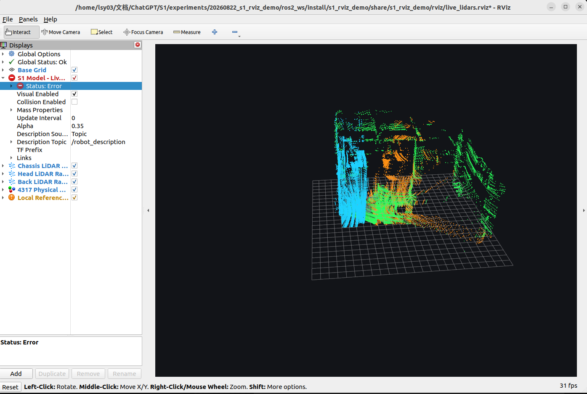
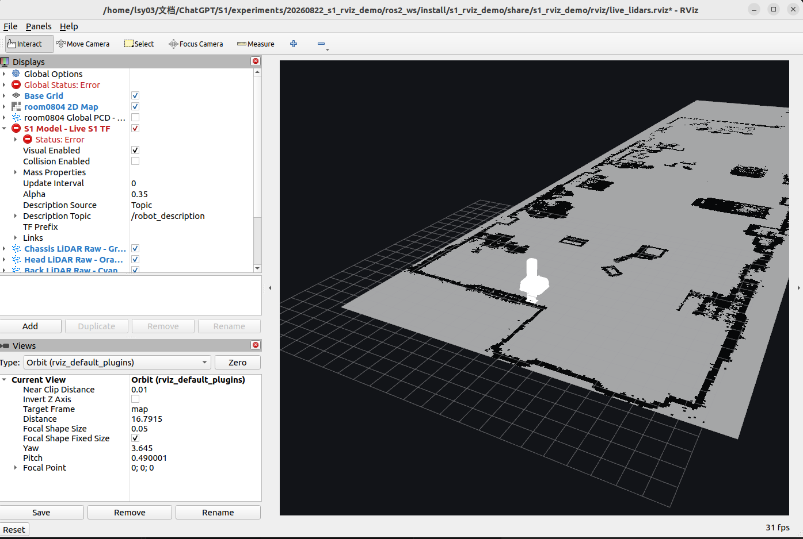

# 9_1 评估 RViz 添加 PCD 地图

- 归档编号：`01a05bea-23f4-7b13-b449-6cadbef776e1`
- 项目：S1 IE_lab 拆垛
- 创建时间：2026-09-01T15:41:06.428000+08:00
- 更新时间：2026-09-01T19:01:42.066000+08:00
- 状态：活动
- 导出范围：用户可见消息与助手可见回复；不含隐藏推理和工具原始输出

## 1. 用户

# 启动 S1 Rviz

完整操作均在主机执行：
1. 主机建立SSH复用连接
```text
umask 077
ssh -fN -M \
  -S /tmp/s1_codex_mux_20260831_lidar \
  -o ControlPersist=2h \
  galbot@10.34.216.17
  ```
2. 主机上传脚本到S1
```text
cd '/home/lsy03/文档/ChatGPT/S1'

scp -o ControlPath=/tmp/s1_codex_mux_20260831_lidar \
  experiments/20260831_s1_lidar_live_rviz/s1_lidar_stream.py \
  galbot@10.34.216.17:/tmp/s1_lidar_stream_20260831.py
  ```
这条命令在主机运行，但目标文件写到S1。

3. 主机启动ROS 2和RViz
```text
cd '/home/lsy03/文档/ChatGPT/S1/experiments/20260822_s1_rviz_demo/ros2_ws'

source /opt/ros/humble/setup.bash
source install/setup.bash

mkdir -p /tmp/s1_live_lidar_ros_logs
export ROS_LOG_DIR=/tmp/s1_live_lidar_ros_logs
export ROS_DOMAIN_ID=84

ros2 launch s1_rviz_demo view_live_lidars.launch.py

这是我之前已经跑通的rviz你可以看看这个对话“记录S1 RViz恢复过程”，现在我想在这个基础之上在Rviz中添加地图（使用PCD图二维或者三维地图，你看着办） 你先别行动，最多做只读查询，我们看下可行性如何

## 2. 助手（进展）

我先只做本地只读盘点，不连接 S1、不启动 ROS/RViz，也不修改文件。会先按仓库要求阅读基础文档和这个 RViz/LiDAR 实验的说明与代码，再评估 PCD 以二维/三维方式接入现有 RViz 的可行路径。

## 3. 助手（进展）

基础边界已确认：现有 `s1_rviz_demo` 是后续导航/ESDF 可视化的规范实现；这次评估应继续基于它，而不是另起一个旧包。接下来我只读查看该实验的 README、launch、RViz 配置、发布节点以及现有地图/PCD 资产线索，重点核对坐标系、消息类型和依赖。

## 4. 助手（进展）

已经发现可直接复用的本地地图资产：`global_cloud_cleaned.pcd`（约 174 MB）以及配套 `map.pgm + map.yaml`。这意味着“两条路”都不需要现场建图：PCD 可做三维背景，PGM 可直接作为二维占据栅格。现在最关键的是验证两者的坐标原点/分辨率，以及是否与当前实时 `map` TF 同属一个地图坐标系。

## 5. 助手（进展）

旧的只读参考包已经把这两类地图发布器都实现过：二维 `OccupancyGrid` 与三维 `PointCloud2`。我会把它当作经过历史使用的设计参考，检查其解析方式、QoS、frame_id 和性能策略；不会修改或启动它。这样可以判断迁移到当前主包的工作量，而不是从零猜测。

## 6. 助手（进展）

本机默认 `python3` 不是 ROS Humble 使用的系统 Python，所以刚才只读解析因缺少 `rclpy` 直接退出，没有读取/发布地图内容。我会改用 `/usr/bin/python3` 做同一项离线统计；仍不启动任何 ROS 节点。

## 7. 助手

可行性很高，而且现有资产和代码基础已经比较完整。本次仅进行了本地只读检查：没有连接 S1、没有启动 ROS/RViz、没有修改文件。

建议采用“二维地图默认显示，三维 PCD 可选开启”的组合：

- 二维地图用于清晰观察机器人在房间中的位置、墙体和可通行区域。
- 三维点云用于检查高度结构、LiDAR 与静态环境的空间重合。
- 没必要把 PCD 再投影成二维，因为已有配套 `map.pgm + map.yaml`，语义更清楚。

已确认的地图资产：

- [map.yaml](/home/lsy03/文档/ChatGPT/S1/experiments/20260827_s1_navigation/s1_room0804/map.yaml)
- [map.pgm](/home/lsy03/文档/ChatGPT/S1/experiments/20260827_s1_navigation/s1_room0804/map.pgm)
- `global_cloud_cleaned.pcd`：2,177,227 个点，约 174 MB，校验和正确。

坐标范围高度吻合：

| 资产 | X 范围 | Y 范围 | Z 范围 |
|---|---:|---:|---:|
| 二维地图 | -3.703 ～ 36.297 m | -6.711 ～ 4.289 m | — |
| 三维 PCD | -3.711 ～ 36.346 m | -6.748 ～ 4.430 m | -0.261 ～ 4.741 m |

这种厘米级边界吻合是二者使用同一 `room0804/map` 坐标系的强证据。二维地图尺寸为 `800 × 220`，分辨率 `0.05 m`，即约 `40 × 11 m`。

现有实时 RViz 也很适合接入：

- Fixed Frame 已是 `map`。
- SSH LiDAR 桥已经转发实时 `map -> base_link` TF。
- 当前没有本地 `/map` 发布器，不会直接冲突。
- 历史只读参考包中已经存在可复用的 `OccupancyGrid` 和二进制 PCD 解析实现，无需安装完整 Nav2。

如果后续实施，我建议迁移到当前规范包 `s1_rviz_demo`：

1. 增加一次性 `/map` 发布，使用 transient-local/reliable QoS。
2. 增加可选 `/s1/map/static_cloud`。
3. PCD 默认每 10 点取 1 点，约 21.8 万点、2.6 MB ROS 数据，显示压力较小。
4. RViz 中二维地图默认打开，三维点云默认关闭但可勾选。
5. 不增加 `world -> map` 静态 TF，因为实时桥已经提供 S1 的 `map` 树，避免重复 TF。

唯一尚未确认的是：S1 当前实际加载的地图是否仍是 `room0804`。历史记录证明它曾经是，但这不能自动证明当前状态。即使不远程确认，也可以先离线完成地图接入；正式判断实时点云是否正确叠加时，再做一次只读地图身份核对或直接观察墙面重合情况。

## 8. 用户

好的，我们现在开始 实际加载的地图是否仍是 room0804

## 9. 助手（进展）

我现在只核对 S1 当前地图身份：读取 `/var/maps/cur` 的实际指向和对应 `map.yaml` 元数据。不会初始化 Galbot SDK、不会启动或修改定位/导航服务，也不会让底盘、机械臂、夹爪或升降柱发生任何运动。先检查现有 SSH 复用连接是否还有效。

## 10. 助手（进展）

SSH 复用连接有效。下一步我会同时核对两层证据：一是 `/var/maps/cur` 当前指向；二是正在运行的定位/导航进程及其命令行或近期日志是否实际加载了同一路径。仅看软链接只能证明“当前配置入口”，不能单独证明运行中的进程已经采用它。

## 11. 助手（进展）

第一层已经确认：S1 当前 `/var/maps/cur` 明确指向 `/var/maps/room0804`，且地图元数据与本地副本一致。定位、导航、融合进程也正在运行。

不过发现一个需要认真核对的细节：S1 上 `map.yaml` 和 `map.pgm` 的修改时间是今天 14:40，说明这两个文件今天被更新过。接下来我会只读检查运行进程启动时间和近期定位日志中的“地图加载”记录，确认它加载的是当前 `room0804`，以及今天更新后是否重载过。

## 12. 助手（进展）

运行日志已经给出直接证据：定位服务从 `/var/maps/cur/` 加载了 106 个关键位姿；融合服务加载了 `/var/maps/cur/global_cloud_cleaned.pcd` 的 2,177,227 个点；导航服务也成功加载了 `/var/maps/cur/global_cloud_cleaned.esdf`。因此“运行中实际使用 room0804”已经可以确认。

我再做最后一个本地只读比对：检查 S1 当前二维地图文件是否与我们准备加载进 RViz 的本地副本逐字节一致。

## 13. 助手

已确认：S1 当前实际加载的仍是 `room0804`。

直接证据：

- `/var/maps/cur -> room0804`
- 实际路径：`/var/maps/room0804`
- 定位服务于今天 14:40 启动，并从 `/var/maps/cur/` 成功加载 106 个关键位姿。
- 融合服务成功加载 `/var/maps/cur/global_cloud_cleaned.pcd`，共 2,177,227 点。
- 导航服务成功加载 `/var/maps/cur/global_cloud_cleaned.esdf`，分辨率 `0.05 m`。
- S1 当前 `map.yaml`、`map.pgm` 与本地 RViz 地图副本的 SHA-256 完全一致。

因此，可以直接使用本地 [room0804 地图资产](../../assets/05c8444553492d12--README.md)接入现有实时 RViz；二维地图坐标与 S1 当前 `map` TF 属于同一地图体系。

本次没有运动任何设备、没有初始化 SDK、没有修改 S1 服务或文件。

[附件：05c8444553492d12--README.md](../../assets/05c8444553492d12--README.md)

## 14. 用户

# 启动 S1 Rviz

完整操作均在主机执行：
1. 主机建立SSH复用连接
````text
umask 077
ssh -fN -M \
  -S /tmp/s1_codex_mux_20260831_lidar \
  -o ControlPersist=2h \
  galbot@10.34.216.17
  ```
2. 主机上传脚本到S1
```text
cd '/home/lsy03/文档/ChatGPT/S1'

scp -o ControlPath=/tmp/s1_codex_mux_20260831_lidar \
  experiments/20260831_s1_lidar_live_rviz/s1_lidar_stream.py \
  galbot@10.34.216.17:/tmp/s1_lidar_stream_20260831.py
  ```
这条命令在主机运行，但目标文件写到S1。

3. 主机启动ROS 2和RViz
```text
cd '/home/lsy03/文档/ChatGPT/S1/experiments/20260822_s1_rviz_demo/ros2_ws'

source /opt/ros/humble/setup.bash
source install/setup.bash

mkdir -p /tmp/s1_live_lidar_ros_logs
export ROS_LOG_DIR=/tmp/s1_live_lidar_ros_logs
export ROS_DOMAIN_ID=84

ros2 launch s1_rviz_demo view_live_lidars.launch.py
````

请问这一套是否能复用启动？

## 15. 助手

可以复用。整体启动链不需要改变；地图发布器可以加入现有 `view_live_lidars.launch.py`，继续使用同一条 `ros2 launch` 命令。

但目前代码尚未加入地图，所以现在运行只会显示：

- S1 模型
- 三路实时 LiDAR
- 实时 TF
- 携箱标记

加入地图代码后，需要额外重新构建一次：

```bash
cd '/home/lsy03/文档/ChatGPT/S1/experiments/20260822_s1_rviz_demo/ros2_ws'

source /opt/ros/humble/setup.bash
colcon build --symlink-install --packages-select s1_rviz_demo
source install/setup.bash
```

之后仍可按原命令启动：

```bash
mkdir -p /tmp/s1_live_lidar_ros_logs
export ROS_LOG_DIR=/tmp/s1_live_lidar_ros_logs
export ROS_DOMAIN_ID=84
export ROS_LOCALHOST_ONLY=1

ros2 launch s1_rviz_demo view_live_lidars.launch.py
```

需要注意：

- 当前 SSH Master 已在运行，此刻不用重复执行 `ssh -fN -M`；先用 `ssh -S ... -O check` 检查即可。
- `scp` 可以重复执行，用来确保 S1 `/tmp` 中的脚本存在。
- 启动新 RViz 前必须先用 `Ctrl+C` 停止旧 launch，避免两个桥接器和标记发布器同时运行。
- 地图将在主机本地发布，不会上传到 S1，也不会修改 S1 当前地图或定位状态。

所以实施完成后的变化只有“一次重新构建”，日常启动流程和入口可以保持不变。

## 16. 用户

我现在在rviz中并没有看到全局的 PCB图，这是为何？



## 17. 助手（进展）

我先核对截图中的 Display 列表与当前 `view_live_lidars.launch.py`、`live_lidars.rviz`。从截图初步看，RViz 里只有三路实时 LiDAR，没有 `Map` 或全局静态点云 Display；我会确认这是尚未接入发布节点，还是构建后仍在使用旧的 install 配置。

## 18. 助手

_工具输出图片（原始工具文本未纳入归档）。_


## 19. 助手

原因明确：全局 PCD 地图还没有接入当前启动包。

当前 [view_live_lidars.launch.py](/home/lsy03/文档/ChatGPT/S1/experiments/20260822_s1_rviz_demo/ros2_ws/src/s1_rviz_demo/launch/view_live_lidars.launch.py) 只启动：

- 实时 LiDAR SSH 桥
- RobotModel
- 携箱 Marker
- RViz

它没有启动 PCD 发布节点；[live_lidars.rviz](/home/lsy03/文档/ChatGPT/S1/experiments/20260822_s1_rviz_demo/ros2_ws/src/s1_rviz_demo/rviz/live_lidars.rviz) 中也没有 `/static_cloud` 或 `/map` Display。截图左侧确实只有三路 Raw LiDAR。

另外，启动日志中的 “map pose” 仅表示转发了实时 `map -> base_link` TF，不表示已经加载全局地图。RViz 也不能仅凭磁盘上存在 `.pcd` 文件自动显示它，必须先转换并发布为 `sensor_msgs/PointCloud2`。

所以这不是显示范围或相机角度问题，也不是重新构建能自动解决的问题；地图功能目前确实尚未实现。截图中的 RobotModel `Status: Error` 是另一项问题，与全局 PCD 缺失无直接关系。下一步需要把二维 `/map` 和三维静态 PCD 发布器正式加入现有 launch 与 RViz 配置。

## 20. 用户

下一步 把二维 /map 和三维静态 PCD 发布器正式加入现有 launch 与 RViz 配置，你能不能把功能完整实现了再停止？我们现在明确一下目标是啥，先别行动

## 21. 助手

可以。先把目标明确为：

在规范包 `s1_rviz_demo` 中完整加入 `room0804` 的二维和三维全局地图，并保持你现有的启动流程不变。重新构建后，仍然执行：

```bash
ros2 launch s1_rviz_demo view_live_lidars.launch.py
```

完成标准如下：

- 本地主机读取已验证的 `room0804/map.yaml + map.pgm`，发布 `nav_msgs/OccupancyGrid` 到 `/map`。
- 本地主机读取 `global_cloud_cleaned.pcd`，降采样后发布 `sensor_msgs/PointCloud2`。
- 二维地图和三维 PCD 都使用 `frame_id=map`，与 S1 实时 `map -> base_link` TF 对齐。
- 两个静态话题采用 reliable + transient-local QoS，RViz 后启动也能收到。
- `live_lidars.rviz` 默认加入并开启：
  - `room0804 2D Map`
  - `room0804 Global PCD`
- 三路实时 LiDAR、机器人模型、实时 TF 和携箱 Marker 保持原功能。
- PCD 默认降采样，例如每 10 点取 1 点；支持 launch 参数调整或关闭。
- 支持分别启用/关闭二维地图和三维 PCD。
- 地图缺失、格式不符或路径错误时明确报错，不静默显示空白。
- 不复制 174 MB PCD 到 ROS 包或 Git，直接引用现有本地资产。
- 补全 `package.xml`、CMake 安装项、README 和必要测试。
- 完成后执行构建、解析测试和本地 ROS 话题验证，确认 `/map` 与全局 PCD 确实发布成功。
- 不修改 S1 地图、不初始化 Galbot SDK、不发送任何控制或运动指令；新增功能全部运行在主机。

最终交付结果应是：你停止旧 RViz、重新构建并用原命令启动后，左侧 Displays 能直接看到二维地图和全局 PCD，并与机器人及三路实时 LiDAR处于同一个 `map` 坐标系。

截图中的 RobotModel `Status: Error` 是独立问题，不纳入地图功能范围；但如果它暴露出会阻碍地图对齐的 TF 问题，我会一并定位。现在尚未修改任何文件。

## 22. 用户

好的，按照 完成标准 给我执行

## 23. 助手（进展）

我现在按刚才的完成标准实施，所有新增地图功能都在主机规范包 `s1_rviz_demo` 内完成，不改 S1、不触发任何运动。先检查相关文件已有未提交改动，避免覆盖你当前的 LiDAR/Marker 工作；随后加入发布器、launch 参数、RViz Display、测试和文档，并做离线构建与话题验证。

## 24. 助手（进展）

集成点已经确认：当前 `CMakeLists.txt`、live launch 和 RViz 配置包含尚未提交的实时 LiDAR/Marker 工作，我会在其上增量修改，不覆盖这些内容。地图资产继续引用现有证据目录，不复制大文件；发布话题确定为二维 `/map`、三维 `/s1/map/global_cloud`，两者默认启用且可通过 launch 参数关闭。

## 25. 助手（进展）

两个发布器和基础测试已经加入：二维发布器严格解析 map-server YAML/P5 PGM，并避免把合法的首像素空白字节误当作头部；三维发布器按 PCD 字段偏移读取二进制 XYZ、过滤非有限点并可配置降采样。现有 launch 已默认启动二者，RViz 也已加入对应 Display。现在先做静态语法、YAML 和单元测试检查，再根据结果修正。

## 26. 助手（进展）

构建正在进行中，包已经进入 `s1_rviz_demo` 构建阶段。当前 RViz 即使仍开着也不会自动重载新配置；完成验证后需要停止旧 launch，再重新启动才能看到新增地图。

## 27. 助手（进展）

构建和 `colcon test` 已通过（4 项发布器单元测试，整体测试结果 0 错误）。下一步做真正的离线 ROS 验收：在隔离 Domain 中启动两个新发布器，使用实际 `room0804` 资产，确认话题类型、消息尺寸、`frame_id=map` 以及 transient-local/reliable QoS。不会启动 SSH 桥或 RViz，也不会访问 S1。

## 28. 助手（进展）

两个节点第一次启动在 ROS 初始化阶段退出，原因是沙箱不允许写默认 `~/.ros/log`，不是地图代码错误。按照你正式启动时已有的做法，把测试日志目录设到 `/tmp` 后重新运行。

## 29. 助手（进展）

离线 ROS 验收已经通过：`/map` 是 `OccupancyGrid`、`800×220@0.05 m`；`/s1/map/global_cloud` 是 `PointCloud2`、默认 217,723 点。两个发布端都实测为 reliable + transient-local，测试节点已正常停止。接下来核对安装后的 launch 参数和 RViz 配置，再补充持久文档并做最终差异检查。

## 30. 助手（进展）

最终文档与持久知识记录已补齐；安装后的 launch 也已识别两个发布器及五个地图参数。静态检查发现的仅是 3 处 Python 切片空格风格问题，已经修正。现在做最后一次重建和回归检查。

## 31. 助手（进展）

最终回归已通过：构建成功、4 项测试通过、flake8 无问题、安装后的 RViz 配置固定坐标为 `map`，并准确订阅 `/map` 与 `/s1/map/global_cloud`；launch 五个地图参数均已安装且默认开启。测试用 ROS 节点也已停止，没有留下发布进程。最后我会核对改动摘要与关键行位置，然后给你可直接执行的重启步骤。

## 32. 助手

功能已完整实现并完成构建验证。

已加入：

- `/map`：`800×220`、`0.05 m/cell` 的二维 `OccupancyGrid`
- `/s1/map/global_cloud`：默认 217,723 点的三维静态 PCD
- 两者均为 `frame_id=map`
- reliable + transient-local QoS
- RViz 默认开启二维地图和紫色全局 PCD
- 支持 `publish_2d_map`、`publish_3d_map`、`map_point_stride` 等参数

关键实现位于：

- [view_live_lidars.launch.py](/home/lsy03/文档/ChatGPT/S1/experiments/20260822_s1_rviz_demo/ros2_ws/src/s1_rviz_demo/launch/view_live_lidars.launch.py:74)
- [room0804_map_publisher.py](/home/lsy03/文档/ChatGPT/S1/experiments/20260822_s1_rviz_demo/ros2_ws/src/s1_rviz_demo/scripts/room0804_map_publisher.py)
- [room0804_pcd_publisher.py](/home/lsy03/文档/ChatGPT/S1/experiments/20260822_s1_rviz_demo/ros2_ws/src/s1_rviz_demo/scripts/room0804_pcd_publisher.py)
- [live_lidars.rviz](/home/lsy03/文档/ChatGPT/S1/experiments/20260822_s1_rviz_demo/ros2_ws/src/s1_rviz_demo/rviz/live_lidars.rviz:16)

验证结果：

- `colcon build` 成功
- 4 项发布器测试全部通过
- flake8 和 RViz YAML 检查通过
- 实际 ROS 话题、类型、尺寸与 QoS 验证通过
- 测试节点均已停止
- 未修改 S1、未初始化 SDK、未发送运动指令

现在先在旧 RViz 终端按 `Ctrl+C`，然后重新启动：

```bash
cd '/home/lsy03/文档/ChatGPT/S1/experiments/20260822_s1_rviz_demo/ros2_ws'

source /opt/ros/humble/setup.bash
source install/setup.bash

mkdir -p /tmp/s1_live_lidar_ros_logs
export ROS_LOG_DIR=/tmp/s1_live_lidar_ros_logs
export ROS_DOMAIN_ID=84
export ROS_LOCALHOST_ONLY=1

ros2 launch s1_rviz_demo view_live_lidars.launch.py
```

重新打开后，左侧 Displays 应出现：

- `room0804 2D Map`
- `room0804 Global PCD - Purple`

初始相机已改为全局地图视角，方便直接看到约 `40×11 m` 的完整房间地图。

## 33. 用户

# 启动 S1 Rviz

完整操作均在主机执行：
1. 主机建立SSH复用连接
````text
umask 077
ssh -fN -M \
  -S /tmp/s1_codex_mux_20260831_lidar \
  -o ControlPersist=2h \
  galbot@10.34.216.17
  ```
2. 主机上传脚本到S1
```text
cd '/home/lsy03/文档/ChatGPT/S1'

scp -o ControlPath=/tmp/s1_codex_mux_20260831_lidar \
  experiments/20260831_s1_lidar_live_rviz/s1_lidar_stream.py \
  galbot@10.34.216.17:/tmp/s1_lidar_stream_20260831.py
  ```
这条命令在主机运行，但目标文件写到S1。

3. 主机启动ROS 2和RViz
```text
cd '/home/lsy03/文档/ChatGPT/S1/experiments/20260822_s1_rviz_demo/ros2_ws'

source /opt/ros/humble/setup.bash
source install/setup.bash

mkdir -p /tmp/s1_live_lidar_ros_logs
export ROS_LOG_DIR=/tmp/s1_live_lidar_ros_logs
export ROS_DOMAIN_ID=84

ros2 launch s1_rviz_demo view_live_lidars.launch.py
请问现在这一套还能用吗，是否需要更新命令了？
````

## 34. 助手

还能用，核心命令不需要改变。新的二维地图和三维 PCD 已默认集成到原来的 `view_live_lidars.launch.py`，无需额外参数。

建议把流程稍微更新为以下版本。

### 1. 检查 SSH 复用连接

先检查，不要在已有 Master 时重复创建：

```bash
ssh -S /tmp/s1_codex_mux_20260831_lidar \
  -O check \
  galbot@10.34.216.17
```

如果输出 `Master running`，直接进入第 2 步；如果连接不存在，再执行：

```bash
umask 077
ssh -fN -M \
  -S /tmp/s1_codex_mux_20260831_lidar \
  -o ControlPersist=2h \
  galbot@10.34.216.17
```

### 2. 上传 S1 临时读取脚本

命令保持不变：

```bash
cd '/home/lsy03/文档/ChatGPT/S1'

scp -o ControlPath=/tmp/s1_codex_mux_20260831_lidar \
  experiments/20260831_s1_lidar_live_rviz/s1_lidar_stream.py \
  galbot@10.34.216.17:/tmp/s1_lidar_stream_20260831.py
```

### 3. 启动 ROS 2 和 RViz

先确保旧 launch 已经通过 `Ctrl+C` 停止，然后执行：

```bash
cd '/home/lsy03/文档/ChatGPT/S1/experiments/20260822_s1_rviz_demo/ros2_ws'

source /opt/ros/humble/setup.bash
source install/setup.bash

mkdir -p /tmp/s1_live_lidar_ros_logs
export ROS_LOG_DIR=/tmp/s1_live_lidar_ros_logs
export ROS_DOMAIN_ID=84
export ROS_LOCALHOST_ONLY=1

ros2 launch s1_rviz_demo view_live_lidars.launch.py
```

唯一建议新增的是：

```bash
export ROS_LOCALHOST_ONLY=1
```

地图功能默认已经开启，相当于：

```text
publish_2d_map:=true
publish_3d_map:=true
map_point_stride:=10
```

启动后应同时看到：

- `room0804 2D Map`
- `room0804 Global PCD - Purple`
- 三路实时 LiDAR
- S1 模型与实时 TF
- 携箱 Marker

当前代码已经构建过，所以这次不需要再次运行 `colcon build`。只有以后修改源码或删除 `build/install` 后才需要重建。

## 35. 用户

等一下，我怎么看机器人不再里面？ URDF是否正常导入



## 36. 助手

_历史投影中的图片引用（用于补全本地对话资源）。_

> 资源未归档：`/tmp/codex-clipboard-cd3c9d70-da2f-4131-8b64-1f2fd4b48a30.png`（missing）

> 资源未归档：`/tmp/codex-clipboard-0a99653f-8355-4f40-9742-1b1acb491967.png`（missing）
