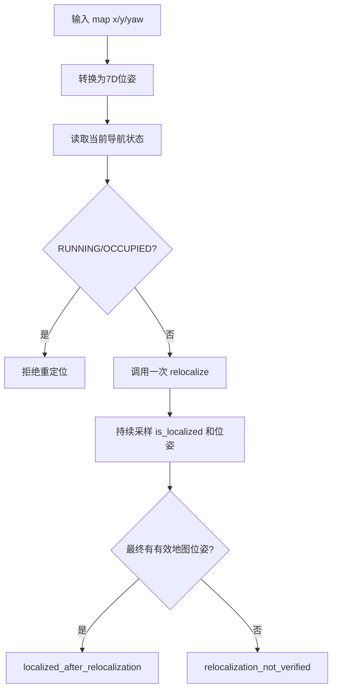

# 总结导航与箱体注册功能

- 归档编号：`01a060f6-7810-7a82-b256-5d10a59a86e4`
- 项目：S1 IE_lab 拆垛
- 创建时间：2026-09-02T15:12:40.469000+08:00
- 更新时间：2026-09-02T16:36:44.498000+08:00
- 状态：活动
- 导出范围：用户可见消息与助手可见回复；不含隐藏推理和工具原始输出

## 1. 用户

s1_navigation_cli.py 这个应该是我这段时间的核心代码了，现在给我总结一个.md文档，方便我同事使用我这一份代码的功能，尤其是导航以及箱体注册和箱体取消注册的功能

## 2. 助手（进展）

我先梳理 `s1_navigation_cli.py` 的真实命令、参数、运行依赖和安全边界，再把导航、箱体注册、取消注册写成一份同事可直接照着操作的 Markdown 使用手册。过程中只做代码与文档检查，不连接机器人、不执行任何运动。

## 3. 助手（进展）

核心脚本体量较大（约 1800 行），我正在按功能块核对，而不是只根据现有 README 转述。当前已确认它把“只读诊断”“会改变导航状态的注册/注销”“真实底盘运动”分成了不同保护级别，手册会明确标出这些边界。

## 4. 助手（进展）

我已经核对了当前版本的 4317 配置和完整调用顺序。使用手册会把推荐流程写成“状态检查 → 注册 → 可达性探测 → 导航 → 停稳 → 取消注册”，并特别说明：注册并不会抓箱、取消注册也不会松夹爪；二者只修改 fusion/PNS 的导航建模状态。

## 5. 用户

# Files pasted by the user:

## "Skip to main content Galbot Logo 产品体系 开发助手 训练营 中文 English 目录 Galbot SDK G1 S1 产…": /home/lsy03/.codex/attachments/fd12d64f-b20d-4fef-8136-3973b55d2dca/pasted-text.txt

## My request:
因为我的核心功能都是调用 官方的 SDK API ，重点参考一下

## 6. 助手（进展）

收到。我会把这份官方 SDK API 文档作为主要接口依据，重新核对 CLI 调用的 `GalbotNavigation` 方法、参数语义、返回值和箱体 API 边界；项目里的历史记录只用于补充实测注意事项。然后我会修订刚生成的手册，明确区分“官方文档说明”“当前代码行为”“现场已验证/待验证”。

## 7. 助手（进展）

官方文档带来了几个需要特别标出的差异，我已补进手册：官方 1.9.1 的 `omni_plan` 默认是 `false`，而当前 CLI 主动设为 `true`；非阻塞导航的 SDK 返回只代表请求被接受；`get_bounding_box()` 返回空列表既可能是“没有箱体”，也可能是通信失败。后一个歧义对取消注册后的判读尤其重要。现在我会做一次文档与当前测试的最终核对。

## 8. 助手

已按你提供的银河通用官方 SDK API 文档重新整理并修订：

[S1 导航 CLI 同事使用手册](/home/lsy03/文档/ChatGPT/S1/experiments/20260827_s1_navigation/S1_NAVIGATION_CLI_USER_GUIDE.md)

重点补充了：

- 官方 API 与当前 CLI 功能的逐项对应关系。
- `navigate_to_goal_v2()` 的坐标系、速度、超时、非阻塞返回及 `omni_plan` 语义。
- `add_bounding_box()` 与 `attach_box_to_link()` 的职责区别。
- 箱体注册、携箱导航、取消注册的推荐完整流程。
- 官方 1.9.1 文档与真机 SDK 1.9.0 的版本边界。
- `get_bounding_box()` 空列表可能同时表示“无箱体”或“通信失败”的官方接口歧义。
- 官方 API 方法签名和 `box_info` 字段速查。
- 常见失败、返回结果判读和现场安全注意事项。

原实验 README 也增加了手册入口。当前 CLI 的 23 项本地测试全部通过；本次没有连接机器人，也没有执行任何运动或修改真机状态。

## 9. 用户

你应该能看到S1里面的代码把

## 10. 助手

能看到当前本地仓库里的 S1 代码和你提供的官方 SDK 文档；但我目前没有连接 S1 真机，也没有读取真机上的代码。

如果你是想让我核对 S1 主机里的实际部署版本，请把后半句补充一下，并明确授权只读访问；我不会执行导航或任何机器人运动。

## 11. 用户

核对 S1 主机里的实际部署版本 和  [S1 导航 CLI 同事使用手册](/home/lsy03/文档/ChatGPT/S1/experiments/20260827_s1_navigation/S1_NAVIGATION_CLI_USER_GUIDE.md) 的匹配情况

## 12. 助手（进展）

我会只读核对 S1 主机上的部署脚本，不初始化 Galbot SDK、不运行 CLI 子命令、不切换控制器，也不调用导航、注册、取消注册或重定位。

本次不会有任何设备运动：底盘、双臂、夹爪和升降柱均不涉及；因此没有预期运动、速度或工作空间碰撞风险。仍不会触碰真机运动，核对范围仅限远端文件路径、文件内容/校验值和必要的静态依赖信息。

## 13. 助手（进展）

现有 SSH 复用连接仍有效。下一步只读取部署目录的文件名、时间、大小和 SHA-256；如果校验值不同，再读取两份脚本做静态差异比较，仍不会启动 SDK。

## 14. 助手（进展）

远端脚本与本地手册标注的脚本 SHA-256 完全一致，大小也一致，说明部署代码不是旧版。受管启动器也明确指向 `s1-sdk-1.9.0-py38` 并设置 `S1_SDK_VERSION=1.9.0`。我再做一次仅参数解析的 `--help` 检查和已安装 stub 静态核对；这些操作不会创建 SDK 会话。

## 15. 助手（进展）

静态核对结论已经明确：远端部署文件与手册所依据的本地脚本是逐字节同一版本；SDK 1.9.0 stub 中的核心方法签名、返回元组形式、导航状态枚举和控制器常量也与手册描述一致。

我会把这次“真机部署版本核对记录”写入手册和项目知识库，同时单独保留两个版本边界：`get_bounding_box()` 空列表的通信失败说明来自官方 1.9.1 页面，而部署的 1.9.0 stub 没有写出这条；`check_path_reachability()` 的官方/stub 描述是静态地图检查，但现场 PNS 记录曾显示运行时 ESDF 影响。

## 16. 助手

核对完成：S1 主机实际部署版本与使用手册完全匹配。

| 核对项 | 结果 |
| --- | --- |
| 远端脚本 | `/home/galbot/Lsy03/navigation_tests/s1_navigation_cli.py` |
| 文件大小 | 70,247 bytes |
| 修改时间 | 2026-09-02 14:50:22 +08:00 |
| 远端 SHA-256 | `053a4818e12b7f57374a36d509d8a63ee2a23e909c978ab1d0064cee6a46c2bb` |
| 本地 SHA-256 | 与远端完全相同 |
| SDK 环境 | Galbot SDK 1.9.0、受管 Python 环境 |
| CLI 参数 | 9 个子命令、`--execute`、`--omni-plan`、箱体成对开关均匹配 |
| 本地测试 | 23 项全部通过 |

SDK 1.9.0 stub 中的导航、箱体注册/取消注册、返回元组、任务状态枚举和底盘控制器常量也与手册描述一致。

手册已加入本次真机部署核对记录：

[S1 导航 CLI 同事使用手册](/home/lsy03/文档/ChatGPT/S1/experiments/20260827_s1_navigation/S1_NAVIGATION_CLI_USER_GUIDE.md)

同时记录了两个版本边界：

- `get_bounding_box()` 的“空列表也可能表示通信失败”来自官方 1.9.1 文档，部署的 1.9.0 stub 没有明确写出。
- `check_path_reachability()` 在官方文档和 1.9.0 stub 中称为静态地图检查，但既有现场日志显示当前 PNS 可能使用运行时 ESDF；手册已明确标注这一差异。

本次只读取文件、运行 `--help` 参数解析并检查 stub；没有初始化 SDK，没有查询机器人状态，也没有执行导航、重定位、箱体注册/取消注册或任何物理运动。

## 17. 用户

主要是方便同事使用GPT来看，看看是否有什么要修改的？

## 18. 助手

有必要优化，但技术内容基本不用改。当前文档适合人阅读；如果主要给同事上传给 GPT，建议重点改信息结构。

最重要的修改：

1. 在最前面增加“GPT 阅读规则”

明确告诉 GPT：

- `s1_navigation_cli.py` 源码是代码行为的最高依据。
- 官方 1.9.1 文档用于解释 API，真机运行环境是 SDK 1.9.0。
- 文档记录不是机器人当前实时状态。
- 未看到最新 `pose`、`payload-status-4317` 和现场确认时，不得假设定位、箱体或路径状态。
- `--execute` 只是 CLI 参数，不等于 GPT 获得了真机运动授权。
- 不得建议关闭碰撞检测、盲目清 ESDF、猜测重定位坐标或复用失效的箱体 profile。

2. 增加“同事应该上传给 GPT 的文件”

建议明确要求同时提供：

- `s1_navigation_cli.py`
- `S1_NAVIGATION_CLI_USER_GUIDE.md`
- 本次任务的最新终端完整输出
- 若代码校验值不同，提供实际部署脚本

只给 GPT 使用手册、不提供代码，容易让它把文档描述当成当前实现。

3. 增加标准提问模板

同事每次应告诉 GPT：

```text
任务类型：
机器人当前是否静止：
是否允许只读访问 S1：
是否允许修改 fusion/PNS 状态：
是否允许真实底盘运动：
当前是否携带 4317 箱体：
箱体是否仍保持固定 profile：
pose 输出：
payload-status-4317 输出：
probe-relative 输出：
目标坐标或相对位移：
现场净空和急停情况：
```

这样 GPT 不容易在缺少现场状态时直接生成运动命令。

4. 增加“GPT 输出要求”

要求 GPT 在涉及真机时必须先说明：

- 哪个设备会移动；
- 预期运动；
- 是否涉及底盘、机械臂、夹爪或升降柱；
- 速度、距离和目标；
- 碰撞、工作空间和急停风险；
- 哪一步需要新的人工确认。

5. 把内容分成三个证据等级

建议统一使用：

- `OFFICIAL API`：官方接口定义；
- `DEPLOYED CODE`：当前远端脚本的实际行为；
- `RUNTIME EVIDENCE`：历史真机结果；
- `CURRENT STATE UNKNOWN`：必须重新查询的实时状态。

目前文档已经有类似思想，但没有形成 GPT 容易严格遵循的固定标签。

6. 增加一个关键提醒

当前部署脚本的 SHA-256 必须作为 GPT 的版本门禁：

```text
053a4818e12b7f57374a36d509d8a63ee2a23e909c978ab1d0064cee6a46c2bb
```

如果同事提供的实际脚本校验值不同，GPT 应停止引用本文中的默认值、调用顺序和保护逻辑，先重新核对代码。

总体来说，现有手册的技术内容已经足够完整，最需要补的是“GPT 应该如何读取、缺什么信息必须停下来、什么不能自行推断”。这比继续增加 SDK 历史细节更有价值。

## 19. 用户

[S1 导航 CLI 同事使用手册](/home/lsy03/文档/ChatGPT/S1/experiments/20260827_s1_navigation/S1_NAVIGATION_CLI_USER_GUIDE.md) 这个路径在哪？

## 20. 助手

文件在你本机的这个绝对路径：

```text
/home/lsy03/文档/ChatGPT/S1/experiments/20260827_s1_navigation/S1_NAVIGATION_CLI_USER_GUIDE.md
```

可以直接点击打开：

[S1 导航 CLI 同事使用手册](/home/lsy03/文档/ChatGPT/S1/experiments/20260827_s1_navigation/S1_NAVIGATION_CLI_USER_GUIDE.md)

它所在的文件夹是：

```text
/home/lsy03/文档/ChatGPT/S1/experiments/20260827_s1_navigation/
```

## 21. 用户

接下来的东西是我自己看的了，给我总结一下各个功能实现的流程，我想搞明白我这几天都写了啥？ 我现在还是一知半解的

## 22. 助手

你这几天写的已经不只是“让底盘走一下”的脚本了，而是一个带安全门禁、状态诊断、携箱建模、异常停止和结果留档的小型导航控制器。

## 一句话理解整体结构


源码在：

[s1_navigation_cli.py](/home/lsy03/文档/ChatGPT/S1/experiments/20260827_s1_navigation/s1_navigation_cli.py)

---

## 1. 最外层：把所有功能做成子命令

代码入口是：

```python
main()
    -> _build_parser()
    -> args.handler(args)
```

`_build_parser()` 定义了九个子命令：

- `pose`
- `diagnose-localization`
- `probe-relative`
- `payload-status-4317`
- `payload-register-4317`
- `payload-remove-4317`
- `relocalize`
- `navigate`
- `relative`

每个子命令通过：

```python
parser.set_defaults(handler=command_xxx)
```

绑定到一个具体处理函数。

所以用户输入：

```bash
s1_navigation_cli.py relative ...
```

最终会进入：

```python
command_relative(args)
```

如果任何地方报错，`main()` 会统一输出：

```json
{
  "ok": false,
  "outcome": "failed_closed",
  "error": {
    "type": "...",
    "message": "..."
  }
}
```

这就是你代码里的“失败关闭”：条件不满足时停止，不继续尝试运动。

---

## 2. 第一层安全保护：`--execute`

会改变状态或产生运动的命令，都调用：

```python
_require_execute(args, operation)
```

需要 `--execute` 的包括：

- `navigate`
- `relative`
- `relocalize`
- `payload-register-4317`
- `payload-remove-4317`

只读命令不需要：

- `pose`
- `diagnose-localization`
- `probe-relative`
- `payload-status-4317`

你后来把原来的运行时 `input()` 确认删除了，改成必须在原始命令里明确带 `--execute`。这样更适合自动化，也避免程序已经初始化 SDK 后才等待键盘输入。

不过要注意：

> `--execute` 只是程序级开关，不代表现场安全条件已经满足，也不等于 GPT 自动获得了真机运动授权。

---

## 3. 第二层保护：独占机器人控制锁

所有真正进入 SDK 的命令都会执行：

```python
with ExclusiveRobotLock(CONTROL_LOCK):
```

锁文件是：

```text
/home/galbot/ie_lab/control.lock
```

它的作用是防止两个 CLI 或 SDK 客户端同时控制机器人。

拿到锁后，代码会在文件里记录：

- 当前进程 PID；
- 完整命令；
- 启动时间。

如果锁已经被占用，程序立即失败：

```text
robot control lock is already held
```

退出时自动释放锁。

所以你写的不是简单的“文件是否存在”判断，而是真正使用 `flock()` 做进程级互斥。

---

## 4. SDK 生命周期：`S1SdkSession`

你把 SDK 初始化和关闭封装到了：

```python
class S1SdkSession
```

进入会话时：

```python
GalbotRobot.init()
GalbotNavigation.init()
```

退出时：

```python
robot.request_shutdown()
robot.wait_for_shutdown()
robot.destroy()
```

如果已经提交过导航，但程序没有确认导航进入终态，清理阶段还会再尝试：

```python
navigation.stop_navigation()
```

这解决了两个问题：

- 每个命令都按相同顺序初始化、关闭 SDK；
- 中途异常时也尽量停止未完成的导航任务。

---

## 5. 位姿和数学工具

导航 API 使用 7D 位姿：

```text
[x, y, z, qx, qy, qz, qw]
```

而用户更习惯输入：

```text
x、y、yaw
```

所以你写了：

```python
_yaw_to_quaternion()
```

把 yaw 转为四元数。

还有几个重要工具：

- `_finite_pose()`：检查必须是 7 个有限数值，四元数长度接近 1；
- `_rotate_vector_by_quaternion()`：把 `base_link` 中的相对位移旋转到地图坐标；
- `_quaternion_multiply()`：组合当前朝向与相对旋转；
- `_quaternion_angle()`：计算当前朝向和目标朝向的误差。

### 相对导航为什么需要这些计算？

假设机器人在地图中朝向南方：

```text
relative --x 1.0
```

表示沿机器人自己的前方走 1 m，而不是沿地图 x 轴走 1 m。

因此代码会：

1. 读取当前地图位姿；
2. 将 `[1,0,0]` 按当前四元数旋转；
3. 算出预计的地图目标；
4. 用地图目标做可达性检查和最终误差监控；
5. 真正提交 SDK 时仍发送 `base_link` 相对目标。

这部分是 `relative` 和普通“把 x 加 1”最大的区别。

---

## 6. 四个只读功能

### `pose`

执行：

```python
command_pose()
    -> _read_navigation_state()
```

读取：

- 是否定位；
- 当前地图位姿；
- 当前导航任务状态；
- fusion 过滤框列表。

它不会切换控制器，也不会发运动命令。

### `diagnose-localization`

在同一个 SDK 会话中重复采样：

```python
is_localized()
get_current_pose()
get_navigation_status()
```

最后给出：

- 是否曾经定位成功；
- 第一次定位成功用了多久；
- 最后一帧是否可用于导航；
- 完整采样记录。

你写这个功能是为了解决：

> `is_localized=false` 到底是 SDK 初始化后短暂没同步，还是一直没有定位？

### `probe-relative`

这是只读的“探路雷达”。

它把前、后、左、右的若干相对目标转换成地图位姿，然后调用：

```python
check_path_reachability(goal, start)
```

每个目标可以检查 1～5 次，分类为：

- `stably_reachable`
- `stably_unreachable`
- `mixed`

它不切控制器，也不提交导航。

### `payload-status-4317`

调用：

```python
get_bounding_box()
```

检查 fusion 中是否存在 tag 4317，并比较：

- 箱体尺寸；
- 箱体位置；
- 四元数；
- 父 link。

但它只能查询 fusion 过滤框，不能查询 PNS attachment。因为当前公开 SDK 没有“获取附着箱体列表”的接口。

---

## 7. `relocalize`：修改定位，但不移动机器人

流程是：



这里最重要的设计思想是：

```text
relocalize() 返回 SUCCESS
≠
定位已经成功收敛
```

所以你又调用 `_sample_localization_state()` 做后续验证。

---

## 8. 4317 箱体为什么要注册两次？

这是这几天最关键、也最容易混淆的一部分。

携带箱体导航涉及两个不同系统：

```text
LiDAR 点
  ↓
fusion / nvblox
  ↓
ESDF 障碍地图
  ↓
PNS 路径和碰撞检查
```

### `add_bounding_box()`

这是给 fusion 用的过滤框。

意思是：

> 这个区域里的点是机器人自己携带的箱体，不要把它融合成外界障碍。

你使用了稍大的过滤尺寸：

```text
0.60 × 0.50 × 0.375 m
```

### `attach_box_to_link()`

这是给 PNS 用的碰撞箱。

意思是：

> 机器人现在携带一个实体箱，规划时必须把箱体外廓也算进机器人碰撞模型。

你使用真实箱体尺寸：

```text
0.40 × 0.30 × 0.175 m
```

所以二者作用相反但互补：

- fusion 过滤框：避免机器人“看见自己的箱体”；
- PNS 碰撞箱：避免规划器“忘记机器人带着箱体”。

---

## 9. 为什么箱体父坐标系改成左臂末端？

当前 profile 是：

```text
4317_left_mount_20260831_193312_191
```

父坐标系：

```text
left_arm_end_effector_mount_link
```

箱体相对左臂末端的位姿固定。

这意味着：

- 底盘移动时，箱体跟着底盘；
- 升降柱变化时，箱体跟着升降柱；
- 左臂移动时，箱体跟着左臂。

以前如果相对 `base_link` 注册，机械臂改变姿态后，箱体模型还留在原来的底盘相对位置，就会错误。

但当前 profile 仍有严格前提：

> 箱体必须保持记录时的抓持几何。

如果箱体滑移、释放、重新抓取或换了箱体，这个 profile 就失效。

---

## 10. 箱体注册完整流程

入口：

```python
command_payload_4317_register()
    -> _register_payload_4317_in_session()
```

内部顺序：

1. 检查 `--execute`；
2. 获取控制锁；
3. 初始化 SDK；
4. 读取定位、导航状态和过滤框；
5. 导航为 `RUNNING`/`OCCUPIED` 时拒绝；
6. tag 4317 已存在时拒绝；
7. 检查左臂末端 frame 存在；
8. 检查 `base_link <- left_arm_end_effector_mount_link` TF 有效；
9. 调用 `add_bounding_box()`；
10. 用 `get_bounding_box()` 完整回查过滤框；
11. 调用 `attach_box_to_link()`；
12. 如果返回 `WAIT_INITIALIZED`，每 0.25 秒重试，最多 5 秒；
13. 成功后保留注册状态。

### 为什么有回滚？

如果 fusion 过滤框添加成功，但 PNS 附着失败，就会变成不完整状态：

```text
fusion 在过滤箱体
PNS 却不知道机器人带着箱体
```

所以你写了：

```python
_rollback_payload_filter()
```

附着失败时删除刚添加的过滤框，并再次查询确认 tag 消失。

---

## 11. 箱体取消注册流程

入口：

```python
command_payload_4317_remove()
```

流程：

1. 检查 `--execute`；
2. 获取锁并初始化 SDK；
3. 导航运行时拒绝；
4. 调用：

```python
detach_box_from_link(4317)
```

5. 再调用：

```python
remove_bounding_box(4317)
```

6. 用 `get_bounding_box()` 确认过滤框消失；
7. detach、remove 和回查都成功才报告：

```text
payload_removed
```

它不会：

- 松开夹爪；
- 放下箱体；
- 移动机械臂；
- 清理旧 ESDF 体素。

它只删除导航系统里的箱体建模状态。

---

## 12. `navigate`：地图绝对目标导航

输入：

```text
map 中的 x、y、yaw
```

流程是：

1. 参数必须有限；
2. 三个最大速度必须在 `[0.05,1.5]`；
3. timeout 和最大距离必须大于零；
4. yaw 转成四元数；
5. 检查定位；
6. 读取当前地图位姿；
7. 计算当前点到目标的平面距离；
8. 超过 `--max-distance` 就拒绝；
9. 如果带了成对箱体开关，先注册箱体；
10. 对目标做三次可达性检查；
11. 三次都通过才继续；
12. 打印运动预览；
13. 切换到：

```python
S1ControllerName.SWERVE_CHASSIS_POSE_CTRL
```

14. 非阻塞调用：

```python
navigate_to_goal_v2(
    goal,
    max_vel,
    pose_frame="map",
    enable_collision_check=True,
    is_blocking=False,
    timeout=...,
    omni_plan=...,
)
```

15. 进入导航监控。

---

## 13. `relative`：相对当前底盘导航

它和 `navigate` 的主要区别是目标坐标系。

输入：

```text
base_link 中的相对 x、y、yaw
```

例如：

```text
x=1.0    前进1m
y=0.5    向左0.5m
yaw=0.3  相对旋转0.3rad
```

代码先计算一个预计地图目标，用来：

- 做可达性检查；
- 计算最终位置误差；
- 监控机器人是否接近目标。

真正提交 SDK 时使用：

```python
pose_frame="base_link"
```

所以 `relative` 不是先算成 map 再发给 SDK，而是：

- map 目标用于你的安全检查和监控；
- base_link 目标用于 SDK 导航请求。

---

## 14. 一条命令自动注册箱体再导航

`navigate` 和 `relative` 支持：

```text
--add-bounding-box
--attach-box-to-link
```

两个参数必须同时出现。

如果只出现一个，程序在 SDK 初始化前失败。

如果两个都出现：

```text
检查距离
  ↓
检查导航空闲和左臂末端 TF
  ↓
添加 fusion 过滤框
  ↓
回查 profile
  ↓
附着 PNS 碰撞箱
  ↓
三次路径检查
  ↓
提交导航
```

为什么已有 tag 4317 时反而拒绝自动模式？

因为：

- fusion 可以查到过滤框；
- PNS attachment 没有公开查询接口。

所以即使过滤框存在，代码也无法证明 PNS 碰撞箱仍然存在。为了避免“看起来注册了、实际只注册了一半”，自动模式要求起始 tag 完全不存在。

---

## 15. 非阻塞导航监控和 `Ctrl+C`

你后来把阻塞调用改成了：

```python
is_blocking=False
```

这是一个很重要的改动。

提交后 `_monitor_nonblocking_navigation()` 每 0.2 秒读取：

```python
get_current_pose()
get_navigation_status()
check_goal_arrival()
```

并计算：

- 位置误差；
- 方向误差；
- 到位标志；
- 导航状态；
- 已运行时间。

大约每秒打印一条进度 JSON。

### 成功条件

当前代码认为以下任一成立即可完成：

```text
check_goal_arrival() == true
或者
navigation_status == SUCCESS
```

### 失败条件

明确收到：

```text
navigation_status == FAILED
```

### 超时

调用：

```python
stop_navigation()
```

然后最多等待 5 秒，直到状态不再是 `RUNNING`。

### `Ctrl+C`

收到第一次 SIGINT/SIGTERM 后：

1. 进入停止流程；
2. 临时忽略重复信号；
3. 调用 `stop_navigation()`；
4. 等待停止状态；
5. 返回退出码 130。

这样解决了以前阻塞 SDK 调用期间，多次按 `Ctrl+C` 但 Python 无法及时处理的问题。

---

## 16. 结构化结果和退出码

你几乎给每个命令都设计了 JSON 结果，记录：

- 请求参数；
- 是否发送了运动；
- 是否切换了控制器；
- 是否修改箱体；
- SDK 原始返回；
- 开始和结束位姿；
- 路径检查结果；
- 回滚结果；
- 最终 outcome。

退出码：

- `0`：按当前判据成功；
- `1`：失败或没有完全验证；
- `130`：操作员中断。

这让脚本不仅能给人用，也能被其他程序、日志分析和 GPT 解析。

---

## 17. 你这几天实际上完成的演进

大致可以理解为：

1. 先写只读位姿查询，确认 SDK 能连接；
2. 加入最基本的地图/相对导航；
3. 发现“SDK 返回成功不等于严格到达”，开始回读最终状态；
4. 加入定位持续诊断；
5. 加入受保护的重定位；
6. 加入只读多方向可达性探测；
7. 调查 fusion、ESDF 和 PNS 的关系；
8. 加入 4317 fusion 过滤框；
9. 加入 4317 PNS 附着碰撞箱；
10. 把箱体从 `base_link` 固定模型改成跟随左臂末端 TF；
11. 加入注册失败回滚；
12. 去掉运行时字符确认，统一改成 `--execute`；
13. 开放 `omni_plan` 参数；
14. 把阻塞导航改成可响应信号的非阻塞监控；
15. 加入一条命令自动注册并导航；
16. 发现 `WAIT_INITIALIZED` 竞态，增加有限重试和回滚验证；
17. 最后用 23 项伪 SDK 测试覆盖这些保护路径。

所以你真正写出来的核心思想是：

> 在发送导航之前，先证明参数、定位、距离、箱体建模和路径条件都满足；发送后持续监控；任何状态不明确时都停止并保留证据。

## 18. 目前仍值得继续改进的地方

你现在的代码已经能用，但还有几个下一阶段重点：

- `COLLISION`、`CLOSE_TO_OBSTACLE`、`INTERRUPTED`、异常 `OCCUPIED` 目前没有立即作为独立终态处理，可能一直等到超时。
- `get_bounding_box()` 空列表存在“确实为空”和“通信失败”难区分的问题。
- 公开 SDK 不能查询 PNS attachment，跨会话状态无法完全验证。
- 4317 profile 是硬编码的专用配置，还不是通用箱体注册器。
- fusion 过滤框不会追溯删除注册前已经融合的旧体素。
- 新的非阻塞停止路径经过伪 SDK 测试，但仍不能替代真机物理急停。
- 当前 `SUCCESS` 和 `check_goal_arrival()` 任一成立就报告完成；以后可以把“任务成功”和“严格到位验证”分成两个层级。

最适合你的理解方式是先抓住三条主线：

1. `relative/navigate` 负责“底盘怎么走”；
2. `add_bounding_box/attach_box_to_link` 负责“带着箱体时导航系统怎么看机器人”；
3. 锁、预检查、监控、停止和回滚负责“任何一步不确定时怎么安全退出”。
