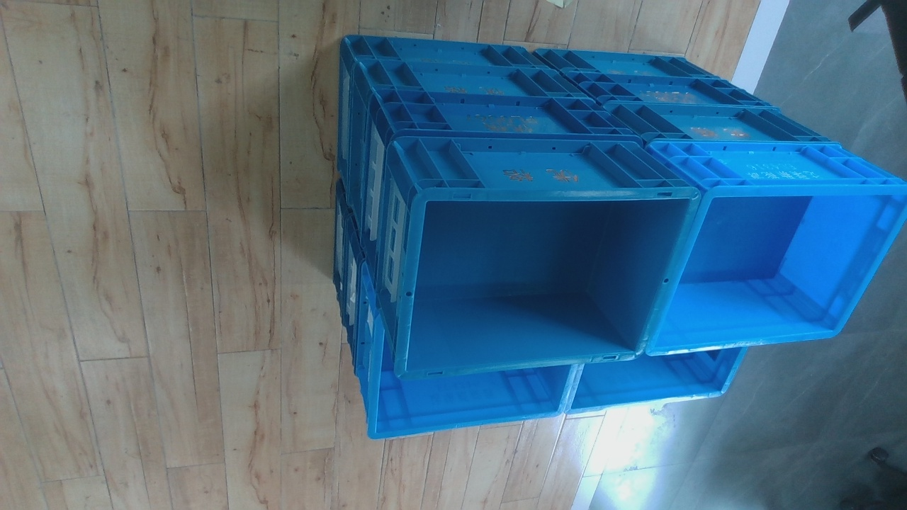
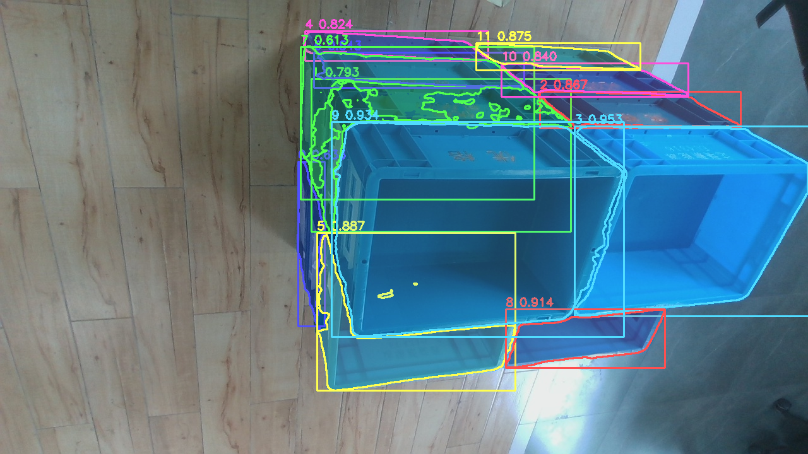
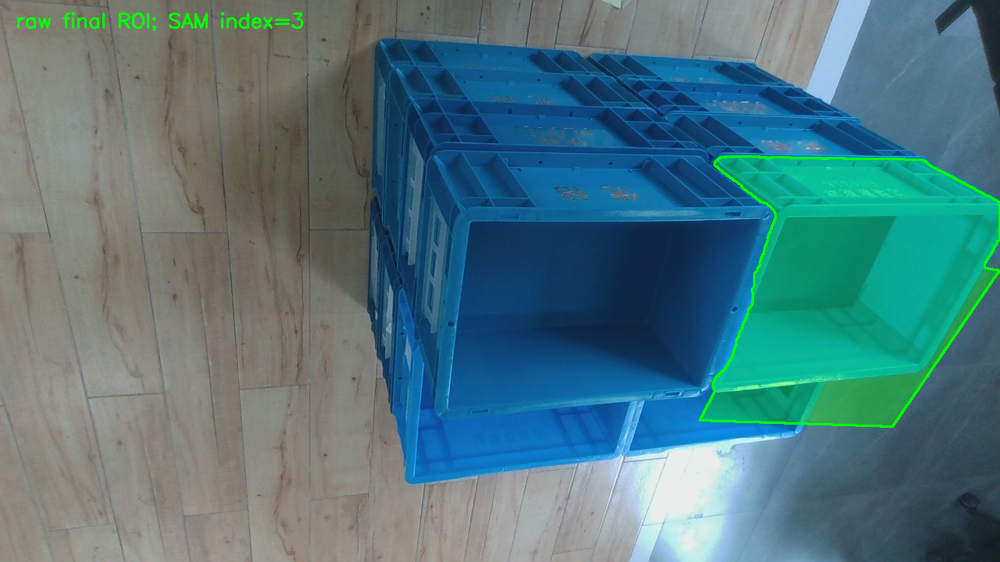
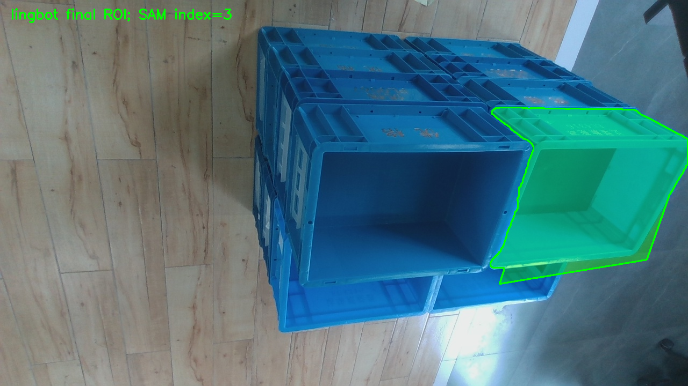
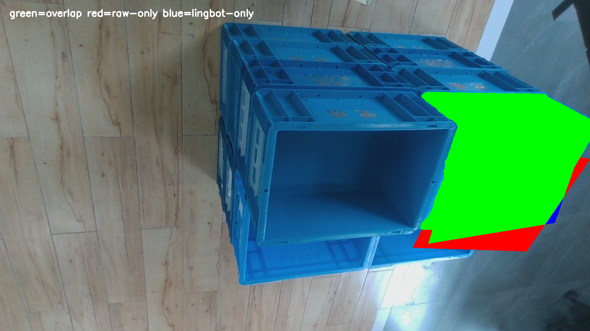

# 9_3 评估FDP替代与ICP方案

- 归档编号：`01a066f8-8b17-7851-a5b7-d87301508295`
- 项目：S1 IE_lab 拆垛
- 创建时间：2026-09-03T19:12:39.715000+08:00
- 更新时间：2026-09-04T10:04:42.722000+08:00
- 状态：活动
- 导出范围：用户可见消息与助手可见回复；不含隐藏推理和工具原始输出

## 1. 用户

| 2 | 工作站上的 FoundationPose++ | S1 本机 ICP | 箱体相对相机/base_link 的 6D 位姿 |
你先看看“9_3 梳理一键拆垛整体方案” “梳理拆垛方案并评估SJTU ICP”
如果我希望使用ICP或者其他的什么方案来替代FDP，那么我们 是不是第一步先建立一个基于“run_s1_mode00_one_click.py”的独立的FDP脚本来先验证FDP的输入和输出，然后才进行ICP或者其他啥的方案的推进？

## 2. 助手（进展）

我先按仓库要求读取基础文档，再定位你提到的两份方案和 `run_s1_mode00_one_click.py`。重点会核清 FDP 在现流程里的真实输入、输出、坐标系和依赖，然后判断“先拆出独立 FDP 验证脚本”是不是最稳妥的第一步。

## 3. 助手（进展）

初步检索显示，这两次梳理的关键结论已经同步进 `docs/knowledge_base.md` 的 9 月 3 日条目：其中直接提到了“替换 FDP 目前不是配置切换”、ROI/ICP 粗初值，以及先做离线 A/B。接下来我会把对应段落和拆垛学习计划读全，并尝试定位两条原任务的原始讨论，避免只凭二手摘要判断。

## 4. 助手

是的，这基本就是正确的第一步。

但更准确地说，不是把 `run_s1_mode00_one_click.py` 复制一份删删改改，而是从它的精感知阶段中拆出一个“纯感知、绝不控制机器人”的 FDP 基准脚本。这个脚本将成为以后 ICP、几何配准或其他算法共同对照的基线。

## 为什么要先做 FDP 基准脚本

现在的问题并不只是“ICP 能不能算出 4×4 矩阵”，而是必须先明确：

- 现有 FDP 实际吃进去的是什么数据；
- 输出矩阵的坐标系和轴语义是什么；
- 哪部分是 FDP 输出，哪部分是后处理和人工标定；
- 哪些历史抓取成功能归因于 FDP；
- 新算法怎样做到与现有下游接口等价。

如果没有这条基线，ICP 算出一个位姿后，我们很难判断差异来自算法本身，还是深度、mask、坐标变换、mesh 轴、单位或后处理规则。

## 建议拆成两层

### 1. FDP 原始调用层

输入建议固定为：

```text
rgb
aligned/refined depth
SAM3 mask
camera intrinsics K
4317 mesh / model id
capture timestamp
```

直接输出：

```text
T_camera_from_object  # 4×4
FDP 服务状态
输入输出文件路径和哈希
可视化叠加图
运行耗时和错误信息
```

这一层只回答：

> 给相同的 RGB、深度、mask、内参和 mesh，FDP 到底输出什么？

### 2. 位姿规范化层

再使用捕获时刻变换：

```text
T_base_from_object
    = T_base_from_camera
    × T_camera_from_object
```

然后单独记录：

- FDP mesh 轴到 4317 语义长宽高轴的转换；
- 0°/180° 对称方向统一；
- 左右 TCP 人工偏移；
- 强制 TCP RPY 为零的现有规则。

这很关键：当前抓取目标不是“纯 FDP 输出”，而是：

```text
FDP 位姿
→ mesh 轴语义转换
→ 对称方向统一
→ 操作员标定偏移
→ 双臂 TCP 目标
```

所以不能拿 ICP 原始矩阵直接和最终双臂目标比较。

## 第一版脚本应该是什么性质

我建议第一版是“历史数据离线回放器”，例如：

```text
tools/replay_pose_backend.py
pose_backends/foundationpose_backend.py
schemas/object_pose_result.json
```

使用历史成功 run 保存的 RGB、深度、mask、内参、TF 和 FDP 输出作为输入，不读取 SDK，不连接控制器，不规划、不执行。

它的验收标准应包括：

- 同一输入能否稳定复现相同或足够接近的 FDP 位姿；
- 确认矩阵方向到底是 `camera <- object` 还是相反；
- 平移单位是否为米；
- mesh 尺度是否正确；
- 相机坐标到 `base_link` 的变换是否正确；
- 箱体坐标轴投影回 RGB/点云后是否与箱体一致；
- 输出可否完整保存并重复比较。

## 然后再推进 ICP

推荐顺序是：

```text
历史 run 数据整理
        ↓
独立 FDP 离线回放
        ↓
定义统一 Pose Backend 输入/输出协议
        ↓
建立 FDP 基准结果集
        ↓
实现 ROI/矩形粗定位
        ↓
实现受约束 ICP
        ↓
相同输入下 FDP/ICP A-B 对比
        ↓
实时只读 shadow mode
        ↓
只规划、不执行
        ↓
通过门禁后才考虑分步实机验证
```

统一输出可以类似：

```json
{
  "ok": true,
  "method": "foundationpose",
  "source_frame": "camera",
  "object_model": "4317",
  "T_source_from_object": [[0, 0, 0, 0]],
  "T_base_from_object": [[0, 0, 0, 0]],
  "quality": {},
  "capture_timestamp": 0,
  "input_manifest": {}
}
```

以后 ICP 只需要实现同一接口：

```json
{
  "method": "constrained_icp",
  "quality": {
    "converged": true,
    "rmse_m": 0.0,
    "inlier_ratio": 0.0,
    "coverage": 0.0,
    "symmetry_margin": 0.0
  }
}
```

## 一个重要提醒

不要让这个独立脚本直接调用 `run_s1_mode00_one_click.py`。当前一键入口无参数时默认是：

```text
--execute --unattended
```

存在真实机械臂、夹爪、升降和底盘运动风险。正确做法是读取它调用的精感知模块和数据格式，提取纯计算逻辑，或者用历史 run 产物重新构造 FDP 请求。

所以最终结论是：

> 是，先建立独立 FDP 基准链是替换 FDP 的第一项工程工作；但它应是“基于一键流程精感知接口的离线、无运动、可回放脚本”，不是一键脚本的简化执行版本。完成基准和统一接口以后，再实现 ICP 或其他算法，才能进行可信的同输入 A/B 对比。

这一判断也与前两次只读核查一致：当前 ICP 不是可配置后端，现有代码还强制要求 `source=fdp`，而历史粗几何与 FDP 已表现出约 `19.5 mm` 平均 XY 差异，因此先建立可复现基线尤其必要。相关证据见[知识库](../../assets/352759744db064d1--knowledge_base.md#L829)。

[附件：352759744db064d1--knowledge_base.md](../../assets/352759744db064d1--knowledge_base.md)

## 5. 用户

FDP 基准脚本 给我放在这里 sftp://galbot@10.34.216.17/home/galbot/Lsy03/  是否可以？
你先讲讲我们FDP 原始调用层和 2. 位姿规范化层的实现步骤和目标，我们先计划再行动

## 6. 助手

可以。建议放在 S1 的独立目录：

```text
/home/galbot/Lsy03/fdp_baseline/
```

这个位置与生产目录 `s1_sjtu_0806` 分开，适合做实验，不会直接碰生产入口和批准哈希。不过行动前仍需只读确认目录权限、剩余空间和 Python 环境。`sftp://...` 是访问地址，脚本在机器人上的实际路径就是上面这个 Linux 路径。

需要明确：脚本虽然放在 S1 上，第一阶段 FDP 计算仍会调用工作站 `10.34.216.13:7876`；它不会因此变成本机 FDP。

本轮只制定计划，不连接 S1、不创建文件、不调用 FDP 服务。

## 总体边界

建议把基准工程分为两层：

```text
历史输入数据
   ↓
① FDP 原始调用层
   ↓ 原始 T_camera_from_mesh
② 位姿规范化层
   ↓ 标准 T_base_from_box
统一 Pose Backend 接口
   ↓
未来 FDP / ICP / 其他算法 A/B 对比
```

两层必须分开，因为我们要判断误差究竟来自：

- FDP 算法；
- 相机到 `base_link` 的坐标变换；
- mesh 坐标轴到 4317 语义坐标轴的转换；
- 180° 对称方向处理；
- 还是后面的双臂抓取偏移。

---

# 1. FDP 原始调用层

## 目标

完整复现当前一键流程中“向 FDP 工作站发请求并取得原始位姿”的行为，回答四个问题：

1. FDP 实际接收哪些文件和参数？
2. 深度单位、图像尺寸、mask 格式是什么？
3. FDP 返回的 4×4 矩阵到底表示哪个方向？
4. 相同输入重复调用时，输出是否稳定？

这一层不做 `base_link` 变换，不生成左右臂目标，也不控制机器人。

## 实现步骤

### 第一步：确认当前真实接口

从当前生产代码中只读提取：

- FDP 服务 URL、接口路径和超时；
- HTTP 请求方式；
- RGB、depth、mask 的编码方式；
- 相机内参字段；
- mesh/model 参数；
- registration 与 tracking 模式；
- 返回 JSON、矩阵和可视化字段；
- 当前错误处理和成功判断。

这些内容需要从现有代码确认，不能根据通用 FoundationPose API 猜测。

### 第二步：定义独立输入案例

每个案例建议保存为：

```text
cases/case_0001/
├── manifest.json
├── rgb.png
├── depth.*
├── mask.png
├── camera_intrinsics.json
├── base_from_camera.json
├── model.json
└── reference/
    ├── fdp_raw_response.json
    └── current_pipeline_result.json
```

其中 `manifest.json` 记录：

- 来源 run；
- 捕获时间戳；
- 图像尺寸；
- 深度单位和无效值规则；
- 相机 frame；
- 目标 `4317/H4`；
- 所有输入文件 SHA-256；
- 当前客户端代码和 mesh 来源；
- FDP 服务/镜像版本，无法确认的字段标为“待验证”。

### 第三步：输入门禁

调用 FDP 前检查：

- RGB、depth、mask 分辨率一致；
- mask 非空且像素数量合理；
- depth 中有效值比例；
- 深度单位明确；
- `K` 是有效的 3×3 内参；
- RGB/depth 是否已经对齐；
- model/mesh 是 4317 对应版本；
- 所有数值有限，不含异常 NaN/Inf。

门禁失败时只输出诊断，不继续请求 FDP。

### 第四步：封装 FDP 客户端

客户端只负责：

```text
读取输入
→ 按现有协议序列化
→ 调用 10.34.216.13:7876
→ 原样保存请求元数据和响应
→ 提取原始 4×4 位姿
```

建议把服务原始响应完整保存，不能只保留矩阵。这样以后服务发生版本变化时还能追溯。

### 第五步：原始输出验证

检查：

- 是否为 4×4；
- 最后一行是否接近 `[0, 0, 0, 1]`；
- 旋转矩阵是否正交；
- `det(R)` 是否接近 `+1`；
- 平移是否在合理量级；
- 输出是否明确标注 source/target frame；
- 是否真实运行 FDP，而不是缓存、mock 或 fallback。

### 第六步：重复性测试

对同一个历史输入调用多次，记录：

- 平移差异；
- 旋转差异；
- 运行耗时；
- 服务错误率；
- 是否存在随机性；
- 可视化结果是否一致。

这一阶段先测分布，不提前拍脑袋制定过严阈值。

## 第一层输出建议

```json
{
  "ok": true,
  "method": "foundationpose",
  "mode": "registration",
  "service_endpoint": "10.34.216.13:7876",
  "input_frame": "camera_frame_name",
  "object_frame": "fdp_mesh_frame",
  "transform_convention": "T_camera_from_mesh",
  "T_camera_from_mesh": [],
  "raw_response_path": "",
  "visualization_path": "",
  "runtime_ms": 0,
  "input_validation": {},
  "provenance": {}
}
```

这里的矩阵名称最终必须根据现有代码验证，不能先假定。

---

# 2. 位姿规范化层

## 目标

将 FDP 的专用输出转换成一个与算法无关、可以让 FDP、ICP 或其他算法共同输出的标准对象位姿：

```text
T_base_link_from_4317_semantic_box
```

以后 ICP 只要输出同样的标准结果，后面的抓取目标生成器就不需要理解 ICP 内部细节。

## 坐标约定

建议统一记号：

```text
T_A_from_B
```

表示把 B 坐标系中的点变换到 A 坐标系。

假设确认后 FDP 返回：

```text
T_camera_from_mesh
```

并且已知：

```text
T_mesh_from_box
T_base_from_camera
```

则：

```text
T_camera_from_box
  = T_camera_from_mesh × T_mesh_from_box

T_base_from_box
  = T_base_from_camera × T_camera_from_box
```

所有矩阵都要保存来源和时间戳，避免把当前 TF 与历史图像混用。

## 实现步骤

### 第一步：解析并校验原始矩阵

- 检查矩阵方向；
- 检查单位；
- 规范齐次矩阵；
- 校验旋转矩阵；
- 禁止自动猜测逆矩阵；
- 如果接口语义不明确，必须通过历史代码和投影结果确认。

### 第二步：mesh 轴转 4317 语义轴

FDP mesh 的 X/Y/Z 不一定对应：

```text
4317 长轴 / 宽轴 / 高轴
```

需要从当前生产目标生成代码中提取固定轴变换，例如：

```text
T_mesh_from_4317_box
```

这一变换应成为有版本、有测试的配置，不能散落在代码里用交换列、改符号等方式隐式处理。

### 第三步：处理 180° 对称

4317 箱体在水平面可能存在：

```text
yaw
yaw + 180°
```

两个几何等价候选。

规范化层应：

- 同时生成两个候选；
- 按现有语义规则选择；
- 保存选择前后的矩阵；
- 记录 `symmetry_choice`；
- 禁止悄悄翻转箱体轴而不留记录。

未来 ICP 也必须使用相同规则，否则左右抓取方向可能互换。

### 第四步：相机坐标转 `base_link`

使用捕获时刻锁定的：

```text
T_base_from_camera
```

而不是脚本运行时的当前 TF。

检查：

- 图像时间戳与 TF 时间戳；
- frame 名称；
- 平移单位；
- 变换是否与历史产物一致；
- 重新投影后的箱体是否落在真实观测附近。

### 第五步：输出标准结果

建议同时保留三个层次：

```text
raw:
    T_camera_from_mesh

semantic_camera:
    T_camera_from_4317_box

semantic_base:
    T_base_link_from_4317_box
```

标准输出示意：

```json
{
  "ok": true,
  "method": "foundationpose",
  "object_model": "4317",
  "raw_pose": {
    "frame": "camera",
    "object_frame": "fdp_mesh",
    "T_camera_from_mesh": []
  },
  "normalized_pose": {
    "frame": "base_link",
    "object_frame": "4317_semantic_box",
    "T_base_link_from_box": [],
    "symmetry_choice_deg": 0
  },
  "transforms_used": {
    "T_base_from_camera": [],
    "T_mesh_from_box": []
  },
  "validation": {},
  "provenance": {}
}
```

### 第六步：可视化验证

至少生成：

- 箱体语义坐标轴投影到 RGB；
- 模型框投影到 RGB；
- 箱体框叠加到观测点云；
- `base_link` 下箱体中心和长宽高方向；
- 原始 FDP 轴与规范化语义轴的对照图。

这一步很重要，因为矩阵在数值上合法，不代表轴方向正确。

---

# 哪些内容暂时不要放进规范化层

下面这些属于“抓取目标生成层”，不是 FDP 位姿规范化：

- 左 TCP `[-35,-50,0] mm`；
- 右 TCP `[-35,+50,0] mm`；
- 左右 TCP RPY 强制为零；
- 预抓点；
- 向内 100 mm；
- 抬升 100 mm；
- IMC 规划与执行。

建议第一版基准脚本停在：

```text
T_base_link_from_4317_semantic_box
```

最多提供一个纯离线兼容测试，验证现有目标生成器能否读取它，但不生成或执行机器人命令。

---

# 建议目录结构

```text
/home/galbot/Lsy03/fdp_baseline/
├── README.md
├── config/
│   ├── fdp_service.yaml
│   └── 4317_frame_convention.yaml
├── schemas/
│   ├── fdp_raw_result.schema.json
│   └── normalized_pose.schema.json
├── src/fdp_baseline/
│   ├── case_io.py
│   ├── input_validation.py
│   ├── fdp_client.py
│   ├── pose_validation.py
│   ├── pose_normalization.py
│   └── visualization.py
├── scripts/
│   ├── inspect_case.py
│   ├── replay_fdp_case.py
│   ├── normalize_fdp_result.py
│   └── compare_reference.py
├── tests/
├── cases/
├── outputs/
└── manifests/
```

## 安全要求

第一版工程应满足：

- 不导入 Galbot SDK；
- 不导入 IMC executor；
- 不连接 ROS/DDS 控制话题；
- 不读取实时关节状态；
- 不控制机械臂、夹爪、升降或底盘；
- 不调用 `run_s1_mode00_one_click.py`；
- 不修改生产目录；
- 默认只读取历史案例；
- 调用 FDP 服务必须使用显式参数，例如 `--call-fdp`；
- 所有输出写入新的时间戳目录，禁止覆盖历史输入。

实时腕部 RGB-D 采集以后单独做 `capture_case.py`，不能和第一版离线回放脚本混在一起。

## 三个阶段验收门

### Gate A：原始调用层通过

- 输入格式已确认；
- 原始请求和响应可保存；
- 4×4 矩阵方向已验证；
- 同输入重复性已测量；
- 不涉及机器人控制。

### Gate B：位姿规范化层通过

- mesh 轴转换明确；
- 180° 对称规则明确；
- `camera → base_link` 可复算；
- 与历史流水线结果一致；
- RGB/点云可视化正确。

### Gate C：允许开始 ICP

只有 A、B 都通过后，才建立：

```text
foundationpose_backend
constrained_icp_backend
```

让二者读取相同 case、输出相同 schema，再比较：

- XYZ 平移差；
- 对称归一后的 yaw 差；
- 完整旋转差；
- 点云残差；
- 内点率与覆盖率；
- 运行耗时；
- 失败类型。

因此第一阶段的准确目标不是“写一个能调用 FDP 的脚本”，而是：

> 建立一条可回放、可追溯、坐标语义明确、完全不控制机器人的 FDP 参考基线，为后续 ICP 和其他算法提供统一比较标准。

## 7. 用户

开始行动 ：建立一条可回放、可追溯、坐标语义明确、完全不控制机器人的 FDP 参考基线，为后续 ICP 和其他算法提供统一比较标准

## 8. 助手（进展）

我现在开始实施，先建立本地可审查版本，再部署到 S1 的 `/home/galbot/Lsy03/fdp_baseline/`。安全边界保持不变：不会运行 `run_s1_mode00_one_click.py`，不会导入或初始化 Galbot SDK/IMC，不连接控制话题；机械臂、夹爪、升降和底盘都不会动作。第一轮只读取现有感知接口与历史产物、编写离线回放/规范化代码并运行本地测试。

## 9. 助手（进展）

当前源码副本已经确认了原始协议：S1 将 RGB 编为 PNG/base64、深度从米转换为 `uint16` 毫米 PNG、mask 编为二值 PNG，并向 `http://10.34.216.13:7876/first_frame_track` 发送 `mesh_path、RGB、depth、mask、K、depth_scale=1000、return_vis`；服务返回 `pose` 和可选可视化。现有轴语义转换也已找到：FDP mesh 位姿右乘固定 `FDP_MESH_FROM_SEMANTIC_OBJECT`，再按“语义长轴在 `base_link` 的 Y 分量为正”处理 180° 对称。下一步我会据此实现独立协议，不复用会导入相机/机器人运行时的生产流水线。

## 10. 用户

你能使用SSH吗，是否需要我给你链接？

## 11. 助手

可以使用 SSH，但当前没有可用的复用连接，需要你建立一次。请在你的终端执行：

```bash
umask 077
ssh -fN -M -S /tmp/s1_codex_mux_20260903_fdp \
  -o ControlPersist=2h \
  galbot@10.34.216.17
```

密码只在你的终端输入。完成后回复“已连接”。

我只会：

- 只读检查现有 FDP 代码和历史案例；
- 创建 `/home/galbot/Lsy03/fdp_baseline/`；
- 上传并测试纯离线基准工具；
- 不运行一键脚本、不初始化 SDK、不控制机械臂/夹爪/升降/底盘。

## 12. 用户

已连接

## 13. 助手（进展）

收到。我先验证复用通道，并只读检查目标目录权限、磁盘空间、当前 FDP 客户端源码与历史 run 的输入文件结构。确认后再在本地完成代码和测试，最后只写入 `/home/galbot/Lsy03/fdp_baseline/`。

## 14. 助手（进展）

历史成功 run 暴露了一个重要事实：它保存了原始 RGB-D、内参、捕获时刻 `base_link←camera`、最终 ROI mask 和 FDP 位姿，但没有保存当时真正送入 FDP 的 LingBot 稠密深度，也没有保存完整 HTTP 原始响应。因此我会把该案例诚实标为“历史部分可回放”：可精确验证坐标规范化，但不能冒充对原 FDP 请求的逐字节复现。同时，新工具会从今以后把 FDP 请求载荷、输入哈希和原始响应完整冻结，补上这个缺口。

## 15. 助手（进展）

本地第一版已完成，5 项离线测试通过：原始 HTTP 字段与生产协议一致、非法反射矩阵会被拒绝、mesh→4317 语义轴转换正确、180° 对称规范化正确、位姿差异计算正确；静态检查没有发现 SDK、IMC、ROS 或运动 API 依赖。现在我将创建全新的远端实验目录并上传代码，不覆盖任何已有文件。

## 16. 助手（进展）

首个案例已经从 2026-09-01 的完整成功 run 建立，所有输入均复制到独立目录并绑定 SHA-256。它被明确标记为 `legacy_partial`：历史 RGB、mask、内参、TF 和 FDP 位姿可验证，但原 LingBot 稠密深度缺失，所以默认禁止把新服务结果称作历史复现。现在进行 S1 本机离线验收：单元测试、案例哈希检查、规范化结果与原生产 `fdp_pose_lock.json` 数值对齐，以及“只生成请求但不发送”的门禁测试。

## 17. 助手（进展）

S1 离线验收已通过，规范化后的 canonical FDP mesh 位姿与生产 `fdp_pose_lock.json` 的矩阵最大元素差仅约 `3.13×10⁻⁸ m/无量纲`。不过对比工具把两份轻微非正交的 float32 旋转直接做迹公式，误报了 `0.025°`；这不是生产结果差异，而是对比实现的数值问题。我正在先修正为投影到最近 SO(3) 后再计算，并补充回归测试，再完成最终部署验收。

## 18. 助手（进展）

目前“坐标规范化基准”已经成立，但为了真正完成端到端 FDP 可回放基线，我还会补一个安全的输入固化步骤：对历史静态 RGB-D 仅调用 Thor 的 LingBot-Depth，生成一份新的、明确标注日期与来源的稠密深度案例；随后用这个冻结案例显式调用 FDP 一次并保存完整请求/响应。这个过程仍只做网络推理，不读取实时相机、不初始化机器人 SDK，也不会产生任何运动。原历史 FDP 结果与新生成结果会严格分开，避免伪称复现。

## 19. 助手（进展）

代码与离线基准已部署，但“生成新的 LingBot 稠密深度案例”被安全审批门拦下：这一步会把冻结的内部 RGB-D 发送到 `10.34.216.11:7865`，并在内存中读取现有生产配置的 API key。虽然不会控制机器人，也不会把凭据写入案例，但当前授权没有被认定为明确包含这项数据发送。我不会绕过该门禁；先完成部署清单和项目文档，最后把需要你明确确认的唯一网络推理步骤单独列出。

## 20. 助手

离线 FDP 基线已建立并部署到：

```text
/home/galbot/Lsy03/fdp_baseline/
```

已完成：

- 生产 FDP HTTP 输入/输出协议复刻；
- 4317 mesh→语义坐标轴转换；
- `camera→base_link` 捕获时刻变换；
- 180° 对称规范化；
- 后端统一结果 schema；
- 历史成功 run 案例及全部 SHA-256；
- 请求完整归档，但尚未发送；
- 本机与 S1 端 7 项测试全部通过；
- 与生产 `fdp_pose_lock.json` 对齐：
  - 平移差约 `3.93×10⁻⁸ m`
  - 旋转差约 `2.09×10⁻⁶°`
  - 矩阵最大元素差约 `3.13×10⁻⁸`
- 没有导入 SDK、ROS、IMC 或控制接口，没有机器人运动。

详细说明见 [README.md](../../assets/4e5683453ee99533--README.md#L1)，结论已写入[知识库](../../assets/352759744db064d1--knowledge_base.md#L942)。

现在只差端到端网络推理，需要你明确授权：

1. 将冻结的历史 RGB-D 发送到内部 Thor LingBot-Depth：`10.34.216.11:7865`；
2. 在内存中读取现有生产配置 API key，不打印、不复制、不写入案例；
3. 将冻结的 RGB、稠密深度、mask、K 和 mesh 路径发送到 FDP：`10.34.216.13:7876`；
4. 保存完整请求、原始响应、FDP 位姿和规范化结果；
5. 不读取实时相机，不初始化 SDK，机器人任何部件都不会运动。

如果同意，请明确回复：

> 我授权发送这份冻结的历史 RGB-D 到现有 LingBot 和 FDP 内部服务，生成新的端到端 FDP 基准。

[附件：4e5683453ee99533--README.md](../../assets/4e5683453ee99533--README.md)

[附件：352759744db064d1--knowledge_base.md](../../assets/352759744db064d1--knowledge_base.md)

## 21. 用户

给我简述一下这个输入是什么，输出是什么？ 是否和源代码 ./run_s1_mode00_one_click.py 其中的FDP应用 一模一样？ 给我列一个表格对比一下，类似输入输出以及中间过程啥的

## 22. 助手

简要结论：

> 当前 FDP 基准的“HTTP 调用格式”和“位规范化算法”与 `run_s1_mode00_one_click.py` 使用的 FDP 路径一致；但当前历史案例例缺少当时 LingBot 输出的稠密深度，因此还不是那次历史 FDP 输入的逐字节复现。它也故意不包含实时采集、SAM3、机械臂规划和执行。

## 输入与输出

当前基准案例输入：

```text
历史右腕 RGB
历史右腕原始深
历史选中箱体的最终 ROI mask
相机内参 K
捕获时刻 T_base_link_from_camera
4317 mesh
FDP 服务地址和服务端 mesh 路径
```

FDP 原直接输出：

```text
T_camera_from_fdp_mesh       # 4×4 原始 FDP 位姿
原始 HTTP 响应
FoundationPose 可视化图
耗时、状态和输入输出 SHA-256
```

位姿规范化层继续输出：

```text
T_base_link_from_fdp_mesh
T_camera_from_4317_semantic
T_base_link_from_4317_semantic
180° 对称规范化结果
坐标矩阵质量检查结果
```

当前还没有发送新的 FDP 请求，所以现在已有的规范化输出使用的是历史 run 保存的 `object_in_camera`。

## 与一键流程对比

| 阶段 | `run_s1_mode00_one_click.py` 中的 FDP 应用 | 当前 FDP 基准 | 是否一样 |
|---|---|---|---|
| 数据来源 | 机器人运动到 FDP 观察姿态后，实时采集右腕 RGB-D | 从历史成功 run 读取静态文件 | 数据类型一致，来源方式不同 |
| RGB | 右腕 D435I RGB，当前案例为 `1280×720` | 同一历史 run 的右腕 RGB | 当前案例与历史 RGB 一致 |
| 原始深度 | 右腕对齐深度 | 同一历史 run 的 `depth_m.npy` | 一致 |
| LingBot 稠密深度 | 把原始 RGB-D 发送给 Thor LingBot，得到补全深度 | 当前案例尚只有原始深度；历史稠密深度没有被保存 | 当前不一样，是主要缺口 |
| SAM3 | 实时向 Thor SAM3 请求箱体 masks | 不重新调用 SAM3 | 不一样，基准使用冻结结果 |
| ROI/目标选择 | 点云 ROI、4317/H4 判断、目标身份选择 | 使用历史已选中的最终 ROI mask | FDP 接收到的 mask 类型相同，但不重跑上游选择 |
| mask | 选中箱体的最终二值 ROI mask | 历史 `roi_mask_00.png`，共 `121825` 个像素 | 对该历史案例可认为一致 |
| 相机内参 | 捕获时读取的 3×3 `K` | 同一历史 run 保存的 `intrinsics.npy` | 一致 |
| 相机外参 | 捕获时刻 `T_base_link_from_camera` | 同一历史 run 保存的矩阵 | 一致 |
| mesh | 4317 对应 `EU4322_midcut_target175mm.obj` | 同一 mesh 的不可变副本，并保存 SHA-256 | 模型内容一致 |
| FDP 接口 | `POST 10.34.216.13:7876/first_frame_track` | 相同 URL 和接口 | 一样 |
| RGB 编码 | RGB数组→BGR→PNG→base64 | 完全相同 | 一样 |
| 深度编码 | 米→`uint16` 毫米→PNG→base64 | 完全相同 | 一样 |
| mask 编码 | 二值化→`0/255` PNG→base64 | 完全相同 | 一样 |
| 请求字段 | `mesh_path`、RGB、depth、mask、`K`、`depth_scale=1000`、`return_vis` | 完全相同字段 | 一样 |
| FDP 原始输出 | 4×4 `object_in_camera`，解释为 `T_camera_from_fdp_mesh` | 相同定义 | 一样 |
| `base_link` 变换 | `T_base_camera × T_camera_mesh` | 完全相同 | 一样 |
| mesh轴→4317语义轴 | 右乘固定轴变换矩阵 | 完全相同矩阵 | 一样 |
| 180° 对称处理 | 选择语义长轴在 `base_link` 中 Y 分量为正的解 | 完全相同规则 | 一样 |
| FDP 位姿锁定 | 生成 `fdp_pose_lock.json` | 输出相同意义的 canonical FDP/semantic 矩阵，并增加完整中间矩阵 | 核心结果一致，基准记录更完整 |
| TCP人工修正 | 后续叠加左右 TCP 操作员偏移和 RPY 规则 | 不包含 | 故意不同 |
| 预抓/内收/提升 | 继续生成双臂目标 | 不生成 | 故意不同 |
| IMC规划和机器人执行 | 后续可能规划并真实运动 | 完全没有控制依赖 | 故意不同 |
| 可追溯性 | 保存部分运行产物，但没有完整 FDP 请求和 LingBot 稠密深度 | 保存输入哈希、完整压缩请求、原始响应、所有中间矩阵 | 基准更严格 |

## 哪些部分已经证明“一样”

使用历史 `object_in_camera`、历史捕获 TF 和相同规范化规则，基准重新算出的 canonical FDP mesh 位姿与原生产 `fdp_pose_lock.json` 的差异为：

| 指标 | 差异 |
|---|---:|
| 平移 | `3.93×10⁻⁸ m` |
| 旋转 | `2.09×10⁻⁶°` |
| 矩阵最大元素 | `3.13×10⁻⁸` |

因此可以认为：

- `camera → base_link`：一致；
- FDP mesh → 4317 语义轴：一致；
- 180° 对称规范化：一致；
- 最终 canonical FDP 位姿：数值一致。

## 现在还不能说“一模一样”的原因

唯一重要缺口是：

```text
2026-09-01 历史 run
没有保存当时送给 FDP 的 LingBot 稠密深度
```

当前已经准备但没有发送的 FDP 请求使用的是历史原始深度，而一键流程当时送入 FDP 的是 LingBot 补全后的深度。因此，这份准备好的请求不能称为那次历史 FDP 调用的完全复现。

获得授权后，下一步会形成一条新的完整基准：

```text
冻结的历史 RGB + 原始深度
        ↓
现有 LingBot 服务
        ↓
保存新的稠密深度和原始响应
        ↓
冻结 RGB + 稠密深度 + 历史 mask + K
        ↓
使用与一键流程完全相同的 FDP HTTP 协议
        ↓
保存 FDP 原始响应
        ↓
相同的坐标规范化
        ↓
新的端到端可重复 FDP 基准
```

这会是“从 FDP 实际输入开始完全可回放”的新基准，但仍不能称为原 2026-09-01 LingBot/FDP 输出的复现，因为原来的 LingBot 稠密深度已经没有保存。

## 23. 用户

我需要
实时采集右腕 RGB-D，实时向 Thor SAM3 请求箱体 masks，选中箱体的最终二值 ROI mask

是否可以实现？给我计划，先不要行动

## 24. 助手

可以实现，而且现有 `run_s1_mode00_one_click.py` 调用链里已经有这些能力。我们要做的是把它拆成一个独立的“单次实时采集 → Thor 感知 → ROI 选择 → 冻结案例”工具，不进入 FDP、规划或执行。

第一版建议先做“按命令采集一帧”，不要直接做无限循环实时流。这样更容易验证时间同步、mask 选择和数据追溯，也不会持续占用相机与 Thor 服务。

## 目标流程

```text
S1 右腕 D435I
    ↓ 被动读取一次
实时 RGB + 对齐深度 + K + 时间戳
    ↓
捕获时刻 T_base_link_from_camera
    ↓
RGB → Thor SAM3
    ↓
所有箱体 masks + boxes + scores
    ↓
RGB + 深度 + K + TF + 每个 SAM mask
    ↓
三维 ROI 几何计算
    ↓
4317/H4 候选排序与门禁
    ↓
选中箱体的最终二值 ROI mask
    ↓
保存成可回放 FDP case
```

## 一个关键点

如果只是想得到 SAM3 的二维 mask：

```text
RGB → SAM3 → masks
```

不需要 LingBot。

但如果要得到与当前一键流程同定义的“最终二值 ROI mask”，还需要：

```text
RGB + 原始深度
    ↓
LingBot-Depth 稠密深度
    ↓
SAM mask 内生成三维点云
    ↓
拟合 4317/H4 几何
    ↓
投影拟合箱体边界并扩充 mask
    ↓
最终 ROI mask
```

因此建议同时保存两种 mask：

- `sam_mask_original.png`：SAM3 原始分割；
- `roi_mask_final.png`：经过深度、三维 ROI、4317 几何和边界扩充后的 FDP 最终输入 mask。

这样以后能判断误差来自 SAM3 还是 ROI 后处理。

## 模块计划

| 模块 | 输入 | 中间处理 | 输出 | 是否影响机器人 |
|---|---|---|---|---|
| 只读预检 | 相机状态、Thor服务状态、控制锁状态 | 确认没有一键流程或控制程序并发 | `preflight.json` | 不运动 |
| 右腕单帧采集 | 右腕 RGB-D 流 | 被动读取 RGB、depth、K、时间戳 | 原始 RGB-D | 不运动 |
| 时间同步门禁 | RGB/depth 时间戳 | 检查帧差、尺寸和 frame ID | 同步检查报告 | 不运动 |
| 捕获时刻 TF | 深度时间戳、只读机器人状态 | 获取 `T_base_link_from_camera` | 4×4 TF | 不运动 |
| SAM3 | 当前 RGB、提示词 | 调用 Thor `10.34.216.11:7861` | masks、boxes、scores、原始响应 | 不运动；发送 RGB |
| LingBot | RGB、原始深度、K | 调用 Thor `10.34.216.11:7865` | 稠密深度、原始响应 | 不运动；发送 RGB-D |
| ROI 几何 | 每个 mask、稠密深度、K、TF | 点云、俯视矩形、尺寸模板、H4 判断 | 所有 ROI 候选 | 纯计算 |
| 目标选择 | ROI候选、SAM分数、目标要求 | 要求 4317/H4，保存排序理由 | 唯一选中 ROI | 纯计算 |
| 最终 mask | 选中 SAM mask、拟合箱体角点 | 边界投影、填充、闭运算 | `roi_mask_final.png` | 纯计算 |
| 案例冻结 | 上述全部产物 | SHA-256、schema、来源记录 | 精确 FDP 输入案例 | 纯文件写入 |

## 建议拆成两个程序

### 1. 实时只读采集程序

建议新增：

```text
scripts/capture_right_wrist_rgbd_once.py
```

它只负责：

- 被动读取右腕 RGB；
- 被动读取对齐深度；
- 读取相机内参；
- 读取捕获时刻 `base_link←camera`；
- 保存数据；
- 不调用 SAM3、LingBot、FDP；
- 不生成抓取目标。

输出：

```text
capture_<timestamp>/
├── rgb.png
├── depth_m.npy
├── intrinsics.npy
├── base_from_camera.npy
└── capture_meta.json
```

`capture_meta.json` 必须明确包含：

```json
{
  "camera_arm": "right",
  "sensor_frame": "right_arm_camera_color_optical_frame",
  "reference_frame": "base_link",
  "rgb_timestamp_ns": 0,
  "depth_timestamp_ns": 0,
  "frame_sync_skew_ns": 0,
  "transform_semantics": "T_base_link_from_camera_at_depth_timestamp",
  "motion_commands_sent": false
}
```

### 2. 感知与案例生成程序

建议新增：

```text
scripts/build_fresh_fdp_case.py
```

它只读取前一步保存的静态文件，然后：

```text
读取 capture
→ 调用 LingBot
→ 调用 SAM3
→ 生成所有 ROI
→ 选择 4317/H4
→ 保存最终 mask
→ 生成 FDP case manifest
```

这种拆分很重要：

- SDK 只存在于采集程序；
- 感知程序完全不接触机器人；
- 即使 Thor/FDP 出错，也不需要继续占用机器人相机接口；
- 所有感知算法都可以对同一捕获反复离线重跑。

## 目标选择不能只看 SAM 分数

当前场景可能一次返回多个箱体 mask。最终选择建议至少执行以下门禁：

| 门禁 | 要求 |
|---|---|
| 类别/模型 | 必须匹配 4317 |
| 层级 | 必须为 H4 |
| mask | 非空，面积达到最低要求 |
| 深度 | mask 内有效深度点数达到要求 |
| 空间范围 | 箱体中心在允许工作空间内 |
| 尺寸 | 拟合长宽与 `0.4×0.3 m` 相符 |
| 高度 | 顶面高度与 H4 配置相符 |
| 唯一性 | 最优候选与次优候选差距足够明确 |
| TF | 必须使用这次捕获时间戳对应的变换 |

如果存在两个无法区分的 4317/H4 候选，程序应该拒绝自动选择，并输出候选图，而不是默认拿第一个。

第一版为了复刻生产行为，可以同时记录：

```text
production_compatible_selection
stricter_baseline_selection
```

这样既能对齐现有流程，也能暴露现有“默认选择第一个”的风险。

## 最终案例输出

```text
cases/fresh_right_wrist_<timestamp>/
├── manifest.json
├── input/
│   ├── rgb.png
│   ├── depth_raw_m.npy
│   ├── depth_lingbot_m.npy
│   ├── intrinsics.npy
│   ├── base_from_camera.npy
│   ├── sam_mask_original.png
│   ├── roi_mask_final.png
│   └── model.obj
├── service_responses/
│   ├── sam3_response.json
│   └── lingbot_response.json
└── diagnostics/
    ├── all_sam_masks.png
    ├── roi_candidates.json
    ├── selected_roi.json
    └── selected_mask_overlay.png
```

`manifest.json` 应注明：

```json
{
  "schema": "s1.fdp_baseline.case.v1",
  "input_bundle_exact_for_fdp": true,
  "rgb_depth_live_capture": true,
  "sam3_live_request": true,
  "lingbot_live_request": true,
  "selected_model": "4317",
  "selected_height_level": 4,
  "motion_commands_sent": false
}
```

## 安全边界

虽然没有运动，但这是实时连接机器人，属于实时只读操作。执行前需要确认：

- 右臂不会由本工具运动；
- 左臂、夹爪、升降和底盘也不会运动；
- 工具只读取右腕相机和必要的状态/TF；
- 不允许与一键拆垛或其他控制进程并发；
- 不设置控制模式，不挂载工具，不规划；
- 如果当前右腕看不到箱体，只报告“视野不满足”，不能自动移动右臂补视角；
- 实时 RGB 会发送给 Thor SAM3；
- RGB-D 会发送给 Thor LingBot；
- 所有数据仅写入 `/home/galbot/Lsy03/fdp_baseline/`。

如果确实需要先把右臂移动到 FDP 观察姿态，那将是另一个真实运动步骤，需要重新说明目标姿态、路径、速度、碰撞空间和急停条件，并单独确认。

## 验收顺序

### Gate 1：仅采集

只运行一次右腕 RGB-D 被动采集，检查：

- RGB 和深度可读；
- 时间同步通过；
- 有效深度比例合理；
- TF 合法；
- `motion_commands_sent=false`。

### Gate 2：只运行 SAM3

发送冻结 RGB，保存全部 masks，人工查看是否正确分割箱体。

### Gate 3：LingBot 与 ROI

发送冻结 RGB-D，生成稠密深度和所有 ROI，确认：

- 选中 4317；
- 判定 H4；
- 最终 mask 覆盖正确箱体；
- 没有把相邻箱或箱内物品并入。

### Gate 4：离线重复性

不用再次读机器人，只对冻结 capture 重跑感知：

- 输入哈希一致；
- 最终 mask 一致或差异有记录；
- 目标选择结果一致；
- 每个中间产物可追溯。

### Gate 5：接入 FDP 基准

只有前四个门通过，才把：

```text
rgb.png
depth_lingbot_m.npy
roi_mask_final.png
intrinsics.npy
model.obj
```

送入现有 FDP 基准客户端。

因此，这项功能可以实现；建议下一步先实现并审查两个独立程序，然后只执行 Gate 1 的单帧实时只读采集。现有 FDP/ICP 后端都暂时不参与，也不会控制机器人。

## 25. 用户

是否可以做一个切换选项，使用lingbot和不适用lingbot的，确认一下源方案是否使用来lingbot？

## 26. 助手

可以做切换选项。并且已经从当前 S1 源码确认：`run_s1_mode00_one_click.py` 的正式 FDP 路径确实使用了 LingBot-Depth。

## 源方案是否使用 LingBot

当前实际调用关系是：

```text
右腕原始 RGB + 原始深度 + K
        ↓
Thor LingBot-Depth
        ↓
dense_depth_m
        ├─→ ROI 三维点云、矩形拟合、4317/H4 判断
        └─→ FoundationPose++ 深度输入
```

源码中的关键行为是：

1. S1 适配层固定设置：

```python
"depth_completion": {"enabled": True}
```

2. 感知流水线调用：

```python
depth_result = self.ai.complete_depth(
    rgb,
    depth_m,
    intrinsics,
)
dense_depth_m = depth_result.depth_m
```

3. `dense_depth_m` 随后同时用于：

- ROI 点云生成；
- 箱体尺寸和 H4 判断；
- 目标选择；
- 最终 FDP 输入。

所以结论不是“LingBot 只给 FDP 补一下深度”，而是：

> LingBot 当前同时影响最终 ROI mask 和 FDP 6D 位姿。

当前生产配置里并没有暴露一个方便的命令行开关；虽然底层感知模块支持关闭 depth completion，但 S1 的正式适配层把它固定成了 `True`。

## 建议增加的切换选项

先只在独立 FDP 基准项目中增加，不修改生产一键流程：

```bash
--depth-mode lingbot
--depth-mode raw
--depth-mode both
```

| 选项 | ROI 使用的深度 | FDP 使用的深度 | 是否调用 LingBot | 用途 |
|---|---|---|---|---|
| `lingbot` | LingBot 稠密深度 | LingBot 稠密深度 | 是 | 对齐现有生产方案 |
| `raw` | 右腕原始深度 | 右腕原始深度 | 否 | 验证不依赖 LingBot 的效果 |
| `both` | 两条分支分别计算 | 两条分支分别计算 | 是，仅调用一次 | 对相同捕获做 A/B 对比 |

建议默认值：

```text
--depth-mode lingbot
```

因为它与当前源方案一致。禁止 LingBot 失败后静默切换 raw；失败时应明确报错。如果想使用原始深度，必须显式选择 `--depth-mode raw`。

## 两条分支的中间过程

| 阶段 | LingBot 分支 | Raw 分支 |
|---|---|---|
| 右腕采集 | 同一帧 RGB-D | 同一帧 RGB-D |
| SAM3 | 同一次 SAM3 结果 | 复用同一次 SAM3 结果 |
| 初始 masks | 相同 | 相同 |
| 深度输入 | `depth_lingbot_m.npy` | `depth_raw_m.npy` |
| mask 内点云 | 用补全深度生成 | 用原始深度生成 |
| ROI 矩形拟合 | 单独计算 | 单独计算 |
| 4317/H4 判断 | 单独计算 | 单独计算 |
| 最终 ROI mask | `roi_mask_lingbot.png` | `roi_mask_raw.png` |
| FDP 输入深度 | LingBot 深度 | 原始深度 |
| FDP 输出 | `pose_lingbot` | `pose_raw_depth` |
| 坐标规范化 | 相同规则 | 相同规则 |

输出目录建议：

```text
case_<timestamp>/
├── common/
│   ├── rgb.png
│   ├── depth_raw_m.npy
│   ├── intrinsics.npy
│   ├── base_from_camera.npy
│   └── sam3_response.json
├── lingbot/
│   ├── depth_lingbot_m.npy
│   ├── roi_mask_final.png
│   ├── roi_result.json
│   └── fdp_input_manifest.json
└── raw/
    ├── roi_mask_final.png
    ├── roi_result.json
    └── fdp_input_manifest.json
```

## A/B 对比要分两种

为了准确知道 LingBot 影响了什么，建议做两组对比。

### 1. 完整感知链对比

```text
LingBot深度 → ROI → 最终mask → FDP
原始深度    → ROI → 最终mask → FDP
```

这里深度和最终 mask 都可能不同，回答：

> 去掉 LingBot 后，整个箱体选择和位姿结果会怎样变化？

比较项目包括：

- 有效深度点数；
- ROI 中心差；
- 4317 尺寸拟合差；
- H4 判断是否一致；
- 最终 mask IoU；
- FDP 位置和旋转差。

### 2. 仅 FDP 深度对比

固定相同的 RGB、最终 mask、K、TF 和 mesh，只改变 FDP 深度：

```text
同一 mask + LingBot深度 → FDP
同一 mask + 原始深度    → FDP
```

这才能单独回答：

> LingBot 对 FoundationPose++ 本身的位姿结果有多大影响？

如果只做完整链对比，就无法区分变化来自 ROI mask，还是来自 FDP 深度。

## 建议实施顺序

1. 增加 `--depth-mode lingbot|raw|both`，默认 `lingbot`。
2. 实时采集右腕一帧 RGB-D。
3. SAM3 只调用一次，冻结所有原始 masks。
4. LingBot 只调用一次并保存完整响应。
5. 分别用 raw/LingBot 深度计算 ROI。
6. 保存两份最终 mask 和选择理由。
7. 第一轮只比较 ROI，不调用 FDP。
8. ROI 结果确认后，再运行固定 mask 的 FDP 深度 A/B。
9. 输出统一的 `T_base_link_from_4317_semantic` 和差异报告。
10. 不接入一键执行、IMC 或机器人运动。

因此可以实现，而且建议加入 `both` 模式。它比简单的开/关更有价值，因为一次采集就能得到公平的 LingBot 与原始深度对照。

## 27. 用户

lsy03@lsy03-System-Product-Name:~/文档/ChatGPT/S1/experiments/20260822_s1_rviz_d
emo/ros2_ws$ ssh -fN -M -S /tmp/s1_codex_mux_20260903_fdp   -o ControlPersist=2h   galbot@10.34.216.17
galbot@10.34.216.17's password:
[REDACTED]
emo/ros2_ws$

好的我们继续，先列出计划，明确目标

## 28. 助手

可以继续。当前 SSH 复用连接已经由你建立，但本条先只明确目标和计划，不访问 S1、不运行程序。

## 明确目标

在现有目录：

```text
/home/galbot/Lsy03/fdp_baseline/
```

增加一条独立、可切换、可追溯的实时感知链：

```text
右腕单帧 RGB-D 被动采集
        ↓
实时调用 Thor SAM3
        ↓
得到全部箱体 masks
        ↓
raw / LingBot / both 深度模式
        ↓
4317/H4 ROI 计算与目标选择
        ↓
最终二值 ROI mask
        ↓
冻结为可回放 FDP 输入案例
```

第一阶段终点是“生成可审查的 FDP 输入案例”，不调用 FDP，不生成机械臂目标。

## 深度切换目标

提供：

```bash
--depth-mode raw
--depth-mode lingbot
--depth-mode both
```

| 模式 | ROI深度 | 是否调用LingBot | 目的 |
|---|---|---|---|
| `raw` | 右腕原始深度 | 否 | 验证无 LingBot 方案 |
| `lingbot` | LingBot 稠密深度 | 是 | 对齐当前一键源方案 |
| `both` | 两条分支分别计算 | 是一次 | 同一帧公平 A/B 对比 |

默认使用：

```text
--depth-mode lingbot
```

因为已确认当前 `run_s1_mode00_one_click.py` 正式方案固定启用了 LingBot，且 LingBot 深度同时进入 ROI 计算和 FDP。

## 实施计划

### 阶段1：只读核查与并发保护

通过 SSH 只读确认：

- 当前右腕相机接口和生产采集函数；
- RGB、depth、K、TF 的读取方式；
- SAM3、LingBot 当前接口；
- 是否存在一键拆垛或其他控制进程；
- 当前 `/home/galbot/ie_lab/control.lock` 状态；
- 新目录代码与本地版本哈希是否一致。

如果发现控制程序正在运行，只报告并停止，不与其并发。

### 阶段2：实现单次实时采集脚本

新增：

```text
scripts/capture_right_wrist_rgbd_once.py
```

只被动读取：

- 右腕 RGB；
- 对齐深度；
- 相机内参；
- RGB/depth 时间戳；
- 捕获时刻 `T_base_link_from_camera`。

输出：

```text
captures/<timestamp>/
├── rgb.png
├── depth_raw_m.npy
├── intrinsics.npy
├── base_from_camera.npy
└── capture_meta.json
```

门禁：

- RGB/depth frame一致；
- 时间差满足当前生产阈值；
- 深度有效点比例合格；
- TF为合法刚体变换；
- 明确记录 `motion_commands_sent=false`。

### 阶段3：实现 SAM3 与深度模式工具

新增：

```text
scripts/build_fresh_fdp_case.py
```

输入是已经保存的 capture，不再连接机器人。

流程：

1. RGB只调用一次 SAM3；
2. 保存SAM3完整原始响应；
3. 保存每个原始 mask、box、score；
4. 根据 `--depth-mode` 选择深度；
5. `lingbot/both` 时调用一次 LingBot 并保存返回的稠密深度；
6. 对每条深度分支分别计算 ROI。

禁止行为：

- SAM3失败后使用旧mask；
- LingBot失败后静默回退raw；
- 多候选无法区分时默认选择第一个；
- 重用其他时间的TF。

### 阶段4：生成并比较最终 ROI mask

两条分支分别输出：

```text
raw/
├── roi_candidates.json
├── roi_mask_final.png
└── selected_roi.json

lingbot/
├── depth_lingbot_m.npy
├── roi_candidates.json
├── roi_mask_final.png
└── selected_roi.json
```

比较内容：

- 有效深度点数；
- mask 内点数；
- ROI中心XYZ；
- 长宽高拟合；
- yaw；
- H4判断；
- 最终mask面积；
- raw/lingbot mask IoU；
- 最优候选与次优候选差距。

最终目标必须通过：

```text
model == 4317
height_level == 4
mask非空
深度点数合格
TF合法
候选唯一性合格
```

### 阶段5：冻结精确 FDP 案例

输出：

```text
cases/fresh_right_wrist_<timestamp>/
├── manifest.json
├── common/
│   ├── rgb.png
│   ├── depth_raw_m.npy
│   ├── intrinsics.npy
│   ├── base_from_camera.npy
│   └── sam3_response.json
├── raw/
│   ├── roi_mask_final.png
│   └── fdp_input_manifest.json
└── lingbot/
    ├── depth_lingbot_m.npy
    ├── lingbot_response.json
    ├── roi_mask_final.png
    └── fdp_input_manifest.json
```

每个文件记录 SHA-256，并明确：

- 捕获时间；
- camera/base frame；
- 深度来源；
- SAM提示词；
- 目标选择理由；
- 服务地址；
- 当前源码哈希；
- `motion_commands_sent=false`。

### 阶段6：离线复跑验收

断开实时机器人读取后，用冻结案例重复运行：

- 不再访问相机；
- 不重新读取TF；
- 检查输入哈希；
- 检查ROI结果是否可复现；
- 检查raw/lingbot分支是否不会混用数据；
- 本机与S1分别运行测试。

### 阶段7：人工看图确认

向你展示：

- 原始RGB；
- SAM全部候选；
- 选中SAM mask；
- raw最终ROI mask；
- LingBot最终ROI mask；
- 两者叠加差异；
- 选中4317/H4的理由和数值。

你确认目标箱和mask正确后，下一阶段才允许把冻结输入发送给 FDP。

## 本轮安全边界

涉及的实体设备只有右腕相机读取，不命令任何设备运动：

| 设备 | 本计划行为 |
|---|---|
| 右腕相机 | 被动读取一帧RGB-D |
| 右臂 | 不运动 |
| 左臂 | 不运动 |
| 左右夹爪 | 不动作 |
| 升降机构 | 不运动 |
| 移动底盘 | 不运动 |
| IMC/规划器 | 不启动 |
| FDP | 第一阶段不调用 |

尽管没有运动，执行实时采集前仍会确认没有其他控制程序并发。若当前右腕视野中没有目标箱，只保存或报告视野不满足，不自动调整手臂、升降或底盘。

## 完成标准

本阶段完成时应达到：

1. 一条命令安全采集一帧右腕RGB-D；
2. 一条命令生成SAM3全部masks；
3. 可明确选择 `raw/lingbot/both`；
4. raw与LingBot各自产生独立最终ROI；
5. 唯一选中4317/H4，否则拒绝；
6. 所有输入、中间结果和选择理由可追溯；
7. 冻结案例可以完全离线复跑；
8. 没有任何机器人运动或规划执行。

## 29. 用户

好的，我们根据目标开始行动，完成之后告诉我结果

## 30. 助手（进展）

开始执行。安全边界按刚才计划固定：只被动读取右腕相机和捕获时刻状态/TF；右臂、左臂、夹爪、升降和底盘都不运动，不启动 IMC/FDP/规划执行。若检测到一键流程或其他控制进程并发、视野不满足或任何门禁失败，我会停止在只读阶段，不自动调整机器人。随后只把冻结 RGB 发送给现有 SAM3、冻结 RGB-D 发送给 LingBot，并保存完整产物。

## 31. 助手（进展）

我已核到生产采集实现：当前正式链通过 `GalbotRobot` 读取右腕 RGB/深度/内参和相机 TF，并用 `GalbotMotion.get_robot_states()` 只读记录捕获时刻关节状态；同步阈值是 RGB/深度 ≤50 ms，TF时间差 ≤100 ms，且会交叉检查静态外参与捕获时刻 TF。为保持独立性，我不会导入整套生产流水线，而会在基准项目中实现只暴露这些读取方法的窄接口，并记录实际 API 调用清单。

## 32. 助手（进展）

预检发现两个必须先处理的事实：S1 宿主机 Python 没有 `galbot_sdk`，所以实时采集必须沿用生产 Docker 运行环境；同时 `/home/galbot/ie_lab/control.lock` 文件存在，但进程列表中没有看到一键/主流水线。锁文件“存在”不代表当前被持有，我会继续只读确认实际 flock 持有状态，并核对容器启动参数。没有确认并发安全前不会初始化相机或 SDK。

## 33. 助手（进展）

只读运行方式已确定：无需启动 Docker，S1 已有隔离解释器 `/home/galbot/ie_lab/bin/s1-python`，其中 SDK、NumPy、OpenCV、SciPy 都可用。共享控制锁当前可获取，生产容器停止且镜像身份正确。因此实现会直接使用这个隔离解释器，在整个采集期间持有同一个 `control.lock`；SDK 对象只允许 `init/get_* /destroy` 白名单，任何控制方法名都会被代码拒绝。

## 34. 助手（进展）

实现和本地验证已完成：新增右腕单帧采集、SAM3客户端、`raw|lingbot|both` 双分支、生产 ROI 模块复用、严格 4317/H4 唯一性门禁、mask IoU/中心/yaw 对比和标准 FDP case 生成。11 项测试通过，其中 mock SDK 测试验证实际调用轨迹只有白名单读取/lifecycle 方法，任何 `set_joint_positions` 等控制调用都会被拒绝。接下来更新说明与部署哈希，然后先在 S1 只运行测试，不立即读相机。

## 35. 助手（进展）

S1 端部署哈希全部通过，宿主 Python 与隔离 SDK Python 的 11 项测试均通过，共享控制锁仍可获取。现在执行计划中的唯一实时机器人步骤：被动读取一帧右腕 RGB-D、内参、关节状态和捕获时刻 TF。预期没有任何机构运动；若锁被占、时间同步、深度或 TF 门禁失败，脚本会直接停止。

## 36. 助手（进展）

实时采集成功：`1280×720`，RGB/深度时间差为 `0 ns`，有效深度比例约 `85.22%`；API轨迹只有初始化、读取、TF和销毁，`motion_commands_sent=false`。我先把这张 RGB 复制到本机做视觉检查，确认右腕视野里确实有目标箱，再决定是否值得发送给 SAM3/LingBot；不会因为视野不佳而移动机器人。

## 37. 助手

_工具输出图片（原始工具文本未纳入归档）。_



## 38. 助手（进展）

视觉检查通过：右腕画面清楚包含多只蓝色 4317 箱体，没有必要移动机器人。现在按 `--depth-mode both` 对这一帧执行一次 SAM3 和一次 LingBot：SAM3 输出会被两条分支共同复用，raw/LingBot 分别计算 ROI 和最终 mask；本阶段仍不调用 FDP。若唯一性门禁失败，诊断产物会保留，但不会标记为可送入 FDP。

## 39. 助手（进展）

SAM3 请求已返回 HTTP 成功响应，但解码器没有在当前顶层字段中找到 mask；因此流程在调用 LingBot 前停止，未生成 ROI，也未调用 FDP。这个失败很可能是 SAM3 当前响应包了一层或字段名发生变化。我会只读检查刚保存的响应结构和生产历史响应格式，修正解析兼容性；不会重新采集，也不会重复调用服务，直到原因明确。

## 40. 助手（进展）

原因已确认并修正：当前 Thor 响应把 `masks` 设为整数 `12`（数量），实际 PNG 数组放在 `mask_png_base64`；生产客户端本来就兼容这种格式，我的独立客户端少了“非列表时回退”判断。失败目录会按实验规则保留，不覆盖；修正后 12 项测试通过，接下来使用同一冻结捕获在新的 retry 输出目录重新请求，无需再次读取机器人。

## 41. 助手（进展）

A/B 感知成功完成，且没有调用 FDP。两条分支都选中了同一个 SAM 候选 `index=3`，并都判断为 `4317/H4`；但场景中存在多个满足 4317/H4 的候选，所以严格唯一性门禁正确地给出 `ready_for_fdp=false`，要求人工看图。raw 与 LingBot 的选中 ROI 中心相差约 `55.7 mm`、180°对称 yaw 相差约 `12.69°`、最终 mask IoU 约 `0.892`，说明 LingBot 对几何拟合影响显著。我继续检查全部候选和两张最终 mask，确认它们具体选中了画面中的哪只箱子。

## 42. 助手

_工具输出图片（原始工具文本未纳入归档）。_


## 43. 助手（进展）

人工查看三张 mask 后可以确认：SAM3 的 `index=3` 是画面右侧、靠图像边界的箱体；raw 和 LingBot 都沿用了它，但二者几何扩充边界明显不同。由于同层候选分别有 raw 4 个、LingBot 2 个，当前生产规则“无参考点时取 ROI 排序第一名”不足以证明目标唯一。我不会调用 FDP。为了让结果可直接审查，我正在补充带编号的全部 SAM 候选叠加图、两条最终 mask 叠加图和 raw/LingBot 差异图。

## 44. 助手

_工具输出图片（原始工具文本未纳入归档）。_









## 45. 助手（进展）

诊断图确认：raw 与 LingBot 都选择了画面最右侧的开口箱（SAM index 3），mask 覆盖主体正确；但该箱靠近图像右边界，而且场景内有多个 H4 候选，所以“生产兼容选择已产生”与“可安全送 FDP”必须区分。当前结果满足用户要求的实时采集、SAM3 masks、两种深度和最终二值 ROI mask，但保持 `ready_for_fdp=false`。我最后补齐完全离线 ROI 复跑验证，确保以后不访问相机和 Thor 也能复算相同 mask。

## 46. 助手（进展）

离线复跑已通过：raw 和 LingBot 两个冻结案例都在不访问机器人、不调用任何网络服务的情况下复算出相同 SAM index、中心、yaw 和最终 mask，`mask IoU=1.0`、中心差 `0`、yaw 差 `0`。功能目标已经实现；我现在做最后的证据哈希、锁释放/进程状态核对，并把本次成功、首次解析失败及“多候选导致 FDP 门禁关闭”写入运行报告和知识库。

## 47. 助手（进展）

所有实现、实时采集、A/B 感知、离线复跑、哈希与文档都已完成；共享锁已释放，生产容器仍停止，未发现控制进程。当前任务已经结束，我现在关闭这次临时 SSH 复用连接，避免任务完成后继续保留机器人访问。

## 48. 助手

目标已完成：实时右腕 RGB-D、实时 SAM3、`raw/lingbot/both` 切换、最终二值 ROI mask、不可变案例和离线复跑均已实现。

| 项目 | 结果 |
|---|---|
| 实时采集 | `1280×720` 右腕 RGB-D |
| RGB/深度时间差 | `0 ns` |
| 原始深度有效率 | `85.22%` |
| SAM3 | 返回 `12` 个 masks |
| 选中目标 | SAM index `3`，画面最右侧开口箱 |
| raw/LingBot是否选中同一箱 | 是 |
| 两者中心差 | `55.7 mm` |
| 180°对称 yaw 差 | `12.69°` |
| 最终 mask IoU | `0.8918` |
| 离线复跑 | 两分支均 `IoU=1.0`、中心/yaw差为0 |
| FDP | 未调用 |
| 机器人运动 | 无 |

生产方案确实使用 LingBot；本次实测也说明它会明显改变 ROI 中心和 yaw，不只是填补深度空洞。

两个冻结案例位于：

```text
/home/galbot/Lsy03/fdp_baseline/cases/right_wrist_20260904_01_raw
/home/galbot/Lsy03/fdp_baseline/cases/right_wrist_20260904_01_lingbot
```

但当前不能继续调用 FDP：raw 分支有4个、LingBot分支有2个 `4317/H4` 候选，因此两份案例均正确标记：

```text
human_review_required=true
ready_for_fdp=false
```

SAM3全部候选：


raw/LingBot最终mask差异，绿色为重合、红色为raw独有、蓝色为LingBot独有：


12项测试全部通过；采集后控制锁已释放、生产容器仍停止、控制进程数为0。完整过程和哈希见[运行报告](../../assets/680d66f38aa4ceb9--RUN_20260904_LIVE_RGBD_SAM_LINGBOT.md#L1)，持久结论已写入[知识库](../../assets/352759744db064d1--knowledge_base.md#L975)。首次SAM3字段解析失败也已保留并记录，没有覆盖失败证据。SSH复用连接已关闭。

[附件：680d66f38aa4ceb9--RUN_20260904_LIVE_RGBD_SAM_LINGBOT.md](../../assets/680d66f38aa4ceb9--RUN_20260904_LIVE_RGBD_SAM_LINGBOT.md)

[附件：352759744db064d1--knowledge_base.md](../../assets/352759744db064d1--knowledge_base.md)

> 资源未归档：`/tmp/s1_fdp_overlays_20260904/sam_candidates_overlay.png`（missing）

> 资源未归档：`/tmp/s1_fdp_overlays_20260904/raw_vs_lingbot_overlay.png`（missing）
