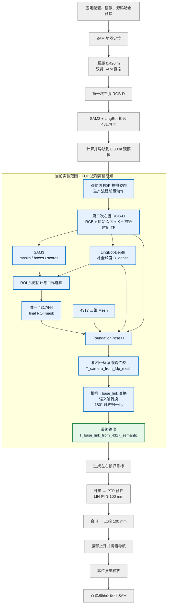
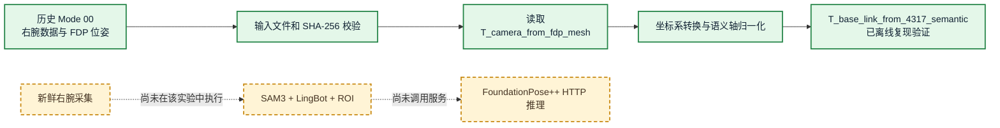
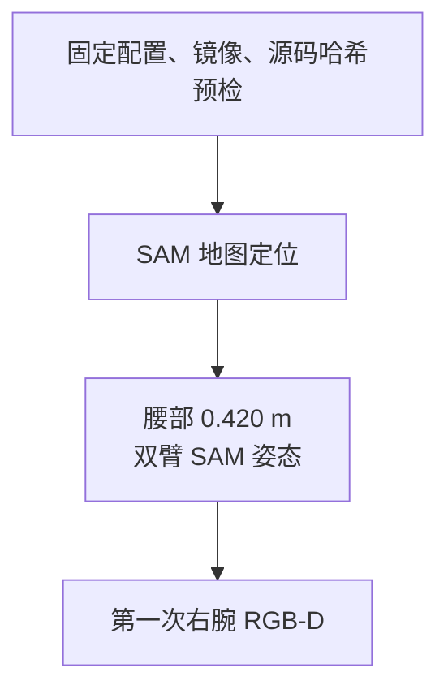

# 9_3 分析箱体6D位姿流程输入输出

- 归档编号：`01a06a1a-6375-7013-b78d-2c64d17861ca`
- 项目：S1 IE_lab 拆垛
- 创建时间：2026-09-04T09:48:29.435000+08:00
- 更新时间：2026-09-07T14:54:39.947000+08:00
- 状态：活动
- 导出范围：用户可见消息与助手可见回复；不含隐藏推理和工具原始输出

## 1. 用户

run_s1_mode00_one_click.py

固定配置、镜像和源码哈希预检
    ↓
恢复/检查 SAM 地图定位
    ↓
腰部到 0.420 m，双臂到 SAM 拍摄姿态
    ↓
右腕 RGB-D
    ↓
Thor：SAM3 分割 + LingBot-Depth 深度补全
    ↓
粗选 4317/H4 箱体
    ↓
根据箱体位置计算 0.80 m 观察位，底盘导航过去
    ↓
双臂到 FDP 拍摄姿态，再采一次右腕 RGB-D
    ↓
SAM3 + LingBot + ROI + FoundationPose++
    ↓
得到箱体在 base_link 下的 6D 位姿
    ↓
生成左右预抓目标
    ↓
开爪 → PTP 到预抓位 → LIN 双侧内收 100 mm
    ↓
合爪 → LIN 上抬 100 mm
    ↓
腰部 0.420 → 0.520 m，同时携箱导航到卸货点
    ↓
保持高位，双爪张开至 100 mm
    ↓
双臂回 SAM → 底盘回 SAM

先给我明确一下 以上流程是正确的

然后给我分析，一下流程各个阶段的输入输出分别是什么？
流程如下
双臂到 FDP 拍摄姿态，再采一次右腕 RGB-D
    ↓
SAM3 + LingBot + ROI + FoundationPose++
    ↓
得到箱体在 base_link 下的 6D 位姿

## 2. 助手（进展）

我先按仓库里的实现和项目知识库核对这条链路，重点确认 `run_s1_mode00_one_click.py` 的实际阶段划分、坐标系和中间产物。这里只做代码与文档检查，不连接机器人，也不执行任何运动。

## 3. 助手（进展）

已经确认：仓库保存了这条生产链路的离线复现与坐标归一化证据，但当前工作区没有生产脚本本体。因此我会把结论分成“已由当前资料确认”和“不能仅凭这份本地快照断言”的两层，避免把历史流程描述冒充逐行源码核验。接下来聚焦你指定的 FDP 精感知段。

## 4. 助手（进展）

核对结果很明确：你列出的主流程与 2026-09-03 对当前 S1 部署源码所做的只读审计一致。需要特别保留三个限定：该入口无参数默认会真实执行且无人值守；携箱导航与腰部上升是并发的，并关闭导航碰撞检查；卸货处是“高位开爪释放”，不是已经验证的 `put/down` 放置。下面我把精感知三段拆成可直接对照接口和文件的输入/输出。

## 5. 助手

结论：你列出的顺序与 2026-09-03 对当前 S1 部署源码的只读审计一致，可以作为 `run_s1_mode00_one_click.py` 的 Mode 00 主流程图。[知识库中的源码审计记录](../../assets/352759744db064d1--knowledge_base.md#L839)

不过，“流程顺序正确”不等于“已经是安全、完整的生产流程”。需要保留四个限定：

- 脚本不带参数时默认是 `--execute --unattended`，会执行真实运动；`--dry-run` 才只做静态预检。
- 卸货阶段没有执行经过验证的 `put/down`，而是在高位直接张爪释放，也没有释放后外撤。
- 腰部从 `0.420 m` 升至 `0.520 m` 与携箱导航确实是并发执行。
- 当前携箱导航没有注册 4317 的过滤框/附着碰撞箱，并且显式关闭导航碰撞检查。这是现有实现，不代表安全性已经充分验证。

完整主链在知识库中的记录与你写的一致：[主链与关键限制](../../assets/352759744db064d1--knowledge_base.md#L844)。

## 精感知三阶段的输入与输出

### 1. 双臂到 FDP 拍摄姿态，再采右腕 RGB-D

这一阶段其实包含“运动”和“采集”两个子步骤。

#### 1.1 双臂到 FDP 观察姿态

输入：

- 当前左右臂关节状态。
- 固定的 FDP 拍摄姿态目标。
- 当前腰部高度，通常仍为 H4 对应的 `0.420 m`。
- 当前底盘已经到达根据粗定位计算出的约 `0.80 m` 观察位。
- 关节限位、姿态到达误差、控制锁等门禁。

输出：

- 左右臂到达 FDP 观察姿态。
- 右腕相机获得适合近距离观察目标箱体的视角。
- 运动完成并静止后，才进入相机采集。

FDP 拍摄姿态本身不产生箱体位姿，它只是建立稳定、近距离、遮挡较少的观测条件。

#### 1.2 右腕 RGB-D 采集

输入：

- 右腕彩色相机和对齐深度相机：
  `right_arm_camera_color_optical_frame`
- 当前机器人关节状态。
- RGB、深度相机时间戳。
- 相机内参和机器人 TF。

主要输出：

| 输出 | 形式 | 含义 |
|---|---|---|
| `RGB` | `H×W×3`，uint8 | 右腕彩色图像 |
| `D_raw` | `H×W`，float32，单位 m | 与 RGB 对齐的原始深度 |
| `K` | `3×3` 矩阵 | 相机内参 `fx, fy, cx, cy` |
| `T_base_link_from_camera` | `4×4` 矩阵 | 深度帧拍摄时刻，相机坐标到 `base_link` 的变换 |
| 时间戳 | ns | RGB、深度、TF 的时间一致性依据 |
| 机器人状态 | 17 个 whole-body 关节等 | 证明捕获时机器人处于什么姿态 |
| 质量信息 | 比例、范围、误差 | 有效深度率、深度统计、TF 刚性等 |

当前门禁包括：

- RGB 与深度尺寸必须一致；
- RGB/深度时间差不超过 `50 ms`；
- 有效深度像素比例至少 `5%`；
- 深度中位数位于 `0.05～10 m`；
- 捕获时 TF 与深度时间差不超过 `100 ms`；
- `T_base_link_from_camera` 必须是有效刚体变换。

对应实现见[右腕采集与门禁](/home/lsy03/文档/ChatGPT/S1/experiments/20260903_fdp_baseline/fdp_baseline/live_capture.py:185)。

这里最关键的输出不是只有 RGB-D，还包括：

```text
T_base_link_from_camera_at_depth_timestamp
```

没有这个“拍摄时刻锁定的变换”，后面就不能可靠地把相机坐标系中的 FDP 位姿转换到 `base_link`。

---

### 2. SAM3 + LingBot + ROI + FoundationPose++

整体数据流是：

```text
RGB ───────────────→ SAM3 ─────────→ masks / boxes / scores
 │
 ├─ RGB + D_raw + K → LingBot-Depth → D_dense
 │
 └─ masks + D_dense + K + T_base_camera
                         ↓
                        ROI
                         ↓
          唯一的 4317/H4 + final mask
                         ↓
RGB + D_dense + final mask + K + 4317 mesh
                         ↓
                 FoundationPose++
                         ↓
              T_camera_from_fdp_mesh
```

#### 2.1 SAM3 分割

输入：

- 右腕 RGB 图像。
- 文本提示词，例如 `blue plastic crate`。
- SAM3 服务地址和认证配置。

输出：

- 一个或多个二值 `mask`；
- 对应的 `bounding box`；
- 分割 `score`；
- 原始服务响应和可选诊断图。

SAM3只回答“图像里哪些像素可能属于目标箱体”，不提供公制深度，也不直接提供 6D 位姿。

#### 2.2 LingBot-Depth 深度补全

输入：

- 同一帧 RGB。
- 原始对齐深度 `D_raw`，单位 m。
- 相机内参 `K`。
- `depth_scale=1000`。

传输时深度会转换成 uint16 毫米 PNG。

输出：

- 补全后的稠密深度 `D_dense`，形状仍为 `H×W`，单位 m。
- 有效点和运行时间等元数据。

LingBot 的职责是修补和细化深度，不负责判断哪个箱体是 4317/H4。

#### 2.3 ROI 几何估计和目标选择

输入：

- SAM3 的所有 masks、boxes、scores。
- LingBot 补全深度 `D_dense`。
- RGB。
- 相机内参 `K`。
- 捕获时刻的 `T_base_link_from_camera`。
- 4317 模板参数：
  - 长宽：`0.4 × 0.3 m`
  - 高度：`0.175 m`
  - 层间距：`0.165 m`
  - 目标层：H4

内部主要过程：

```text
mask 内深度像素
    ↓ 反投影
三维点
    ↓ 转到 base_link
XY 俯视栅格
    ↓
最大轮廓
    ↓
minAreaRect
    ↓
匹配最近箱型模板并吸附角点
```

输出：

- 所有 ROI 候选；
- 每个候选的中心、yaw、顶面角点、尺寸、箱型和高度层；
- 选中的 `target_roi`；
- 最终精化二值 mask：`roi_mask_final.png`；
- 目标是否为 `4317/H4`；
- 是否只有唯一一个 `4317/H4` 候选；
- `ready_for_fdp` 门禁。

当前要求：

```text
目标是 4317/H4
并且
场景中恰好只有一个匹配的 4317/H4 候选
```

否则不应进入 FDP。对应实现见[ROI 输入、模板和门禁](/home/lsy03/文档/ChatGPT/S1/experiments/20260903_fdp_baseline/fdp_baseline/fresh_case.py:106)。

需要注意：当前最近模板匹配没有“不够像就拒绝”的距离阈值。因此 ROI 给出 `4317` 不等于物体身份已被强语义验证；它主要负责选箱、生成精确 mask 和 H4 几何门禁。

#### 2.4 FoundationPose++

输入：

| 输入 | 含义 |
|---|---|
| RGB | 同一帧右腕彩色图 |
| `D_dense` | LingBot 补全深度，单位 m |
| `final mask` | ROI 选出的唯一 4317/H4 二值 mask |
| `K` | 相机内参 |
| `mesh_path` | 批准的 4317 三维网格模型 |
| `depth_scale=1000` | 毫米编码尺度 |
| `return_vis` | 是否返回可视化 |

这些输入必须来自同一个冻结的拍摄数据包，RGB、深度和 mask 的高宽必须完全一致。[FDP 请求字段](/home/lsy03/文档/ChatGPT/S1/experiments/20260903_fdp_baseline/fdp_baseline/client.py:30)

FoundationPose++ 原始输出：

```text
T_camera_from_fdp_mesh
```

它是一个有限、有效的 `4×4` 刚体变换矩阵，表示：

> 4317 mesh 原始坐标系在右腕相机坐标系中的 6D 位姿。

服务还可能返回：

- `ok: true`
- FDP 可视化图
- HTTP 状态、耗时等元数据

它此时还不是最终的 `base_link` 下 4317 语义位姿，因为：

1. 坐标仍在相机系；
2. 坐标轴仍是 FDP mesh 原始轴；
3. 4317 有 `0°/180°` 对称歧义。

---

### 3. 得到箱体在 `base_link` 下的 6D 位姿

这一阶段的输入是：

```text
T_camera_from_fdp_mesh
T_base_link_from_camera
T_fdp_mesh_from_4317_semantic
可选的 180° 对称修正
```

首先把 FDP mesh 位姿从相机系变到机器人基座系：

```text
T_base_link_from_fdp_mesh
=
T_base_link_from_camera
×
T_camera_from_fdp_mesh
```

然后把 FDP mesh 坐标轴转换成 4317 语义坐标轴：

```text
T_base_link_from_4317_semantic_raw
=
T_base_link_from_camera
×
T_camera_from_fdp_mesh
×
T_fdp_mesh_from_4317_semantic
```

其中语义转换矩阵为：

```text
T_fdp_mesh_from_4317_semantic =
[[0, 0,-1, 0],
 [0, 1, 0, 0],
 [1, 0, 0, 0],
 [0, 0, 0, 1]]
```

最后处理箱体的 `0°/180°` 等价姿态：选择“4317 语义长度轴 `+X` 在 `base_link` 水平面上的 Y 分量非负”的那个方向。

最终输出：

```text
T_base_link_from_4317_semantic
```

矩阵结构是：

```text
[R11 R12 R13 x]
[R21 R22 R23 y]
[R31 R32 R33 z]
[ 0   0   0  1]
```

其中：

- `x, y, z`：箱体语义中心在 `base_link` 中的位置，单位 m；
- `R`：箱体长、宽、高三个语义轴在 `base_link` 中的朝向；
- 合起来就是位置 3 自由度 + 姿态 3 自由度，即 6D 位姿。

同时输出：

- FDP 原始 mesh 位姿；
- 语义轴转换前后的位姿；
- 是否执行了 180° 归一化；
- 旋转矩阵合法性；
- 箱体高度轴与 `base_link +Z` 的对齐程度；
- `ok` 门禁，目前要求高度轴对齐量至少 `0.85`。

计算实现见[坐标转换与最终输出](/home/lsy03/文档/ChatGPT/S1/experiments/20260903_fdp_baseline/fdp_baseline/geometry.py:107)。

最后要明确区分：

```text
FoundationPose++ 原始输出
= T_camera_from_fdp_mesh

系统所需最终输出
= T_base_link_from_4317_semantic
```

这两者中间包含相机外参变换、mesh 到 4317 语义轴转换和 180° 对称归一化，不能直接把 FDP 返回的矩阵当成机械臂抓取目标。最终的左右预抓目标还会在这个语义位姿之上叠加左右 TCP 标定偏移。

[附件：352759744db064d1--knowledge_base.md](../../assets/352759744db064d1--knowledge_base.md)

## 6. 用户

我们现阶段的实验是在其中的哪个部分？给我用图展示出来

## 7. 助手（进展）

我会用可视化工具把“完整 Mode 00 主链”和“当前实验覆盖范围”叠在一张图里，并明确标出实验的起点、终点以及没有进入的运动阶段。这里仍只依据现有代码和文档，不连接机器人。

## 8. 助手

现阶段实验位于整条 Mode 00 流程中间的“近距离精感知与 6D 位姿估计”部分：



准确地说：

- 生产流程中的范围：从“双臂到 FDP 拍摄姿态”开始，到“得到箱体在 `base_link` 下的 6D 位姿”为止。
- 当前 `fdp_baseline` 实验的实际边界：从已经保存的右腕 RGB-D/历史 FDP 产物开始，停止在 `T_base_link_from_4317_semantic`。
- 双臂运动不是当前离线实验的一部分，只是生产流程的上游前置条件。
- 左右预抓目标、IMC 规划、机械臂运动、夹爪和底盘导航均不属于当前 FDP 实验。

当前已完成和未完成的状态是：



所以一句话定位：

> 我们现在正在验证“拍摄数据经过精感知，最终变成 `base_link` 下箱体 6D 位姿”这一段，尚未进入“根据该位姿生成抓取目标并控制双臂抓取”的实验阶段。

这一实验明确停止在归一化后的 4317 物体位姿，不导入规划器、执行器或执行器接口，见 [FDP baseline 实验边界](../../assets/4e5683453ee99533--README.md#L1)；完整生产链位置见 [Mode 00 主链审计](../../assets/352759744db064d1--knowledge_base.md#L844)。

[附件：4e5683453ee99533--README.md](../../assets/4e5683453ee99533--README.md)

[附件：352759744db064d1--knowledge_base.md](../../assets/352759744db064d1--knowledge_base.md)

## 9. 用户

```mermaid
flowchart TD
    A["固定配置、镜像、源码哈希预检"] --> B["SAM 地图定位"]
    B --> C["腰部 0.420 m<br/>双臂 SAM 姿态"]
    C --> D["第一次右腕 RGB-D"]
    D --> E["SAM3 + LingBot 粗选 4317/H4"]
    E --> F["计算并导航到 0.80 m 观察位"]

    subgraph CURRENT["当前实验范围：FDP 近距离精感知"]
        G["双臂到 FDP 拍摄姿态<br/>生产流程前置动作"] --> H["第二次右腕 RGB-D<br/>RGB + 原始深度 + K + 拍摄时刻 TF"]

        H --> I["SAM3<br/>masks / boxes / scores"]
        H --> J["LingBot-Depth<br/>补全深度 D_dense"]

        I --> K["ROI 几何估计与目标选择"]
        J --> K
        K --> L["唯一 4317/H4<br/>final ROI mask"]

        H --> M["FoundationPose++"]
        J --> M
        L --> M
        N["4317 三维 Mesh"] --> M

        M --> O["相机坐标系原始位姿<br/>T_camera_from_fdp_mesh"]
        O --> P["相机→base_link 变换<br/>语义轴转换<br/>180° 对称归一化"]
        P --> Q["最终输出<br/>T_base_link_from_4317_semantic"]
    end

    F --> G
    Q --> R["生成左右预抓目标"]
    R --> S["开爪 → PTP 预抓<br/>LIN 内收 100 mm"]
    S --> T["合爪 → 上抬 100 mm"]
    T --> U["腰部上升并携箱导航"]
    U --> V["高位张爪释放"]
    V --> W["双臂和底盘返回 SAM"]

    classDef outside fill:#eeeeee,stroke:#888,color:#333;
    classDef experiment fill:#e5f1ff,stroke:#1677c8,stroke-width:2px,color:#123;
    classDef result fill:#e4f7e9,stroke:#258548,stroke-width:3px,color:#123;

    class A,B,C,D,E,F,R,S,T,U,V,W outside;
    class G,H,I,J,K,L,M,N,O,P experiment;
    class Q result;

这个流程图有没有办法让我在 .md 里也能看到？
```

## 10. 助手

可以。把 Mermaid 代码直接放进 `.md` 文件即可：

````markdown

````

能渲染 Mermaid 的 Markdown 查看器会直接显示流程图，例如：

- GitHub / GitLab
- Obsidian
- VS Code，安装 `Markdown Preview Mermaid Support`
- Typora 等支持 Mermaid 的编辑器

注意：`.md` 文件本身只是文本，是否显示成图取决于查看器是否支持 Mermaid。若不支持，就只会看到代码块；可以改用支持 Mermaid 的预览器，或导出为 SVG/PNG。
