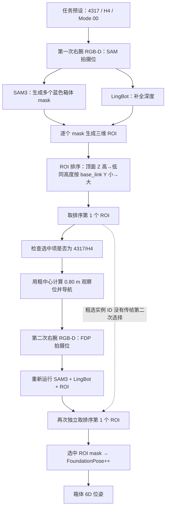
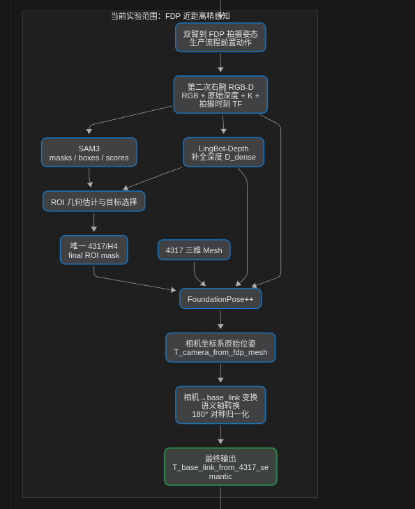

# 9_5 继续分析箱体6D位姿流程

- 归档编号：`01a06f1a-06fd-70d3-b3ed-abf9d282cf2b`
- 项目：S1 IE_lab 拆垛
- 创建时间：2026-09-05T09:06:11.848000+08:00
- 更新时间：2026-09-05T12:08:55.196000+08:00
- 状态：活动
- 导出范围：用户可见消息与助手可见回复；不含隐藏推理和工具原始输出

## 1. 用户

我们在 “9_3 分析箱体6D位姿流程输入输出” 这个对话的基础上继续

## 2. 助手（进展）

我先把该对话的上下文和仓库必读资料一起读回来，再从它当前的结论与未完成事项继续。此步只做读取，不会改代码或连接机器人。

## 3. 助手（进展）

已找到并完整读取了目标对话。上次停点是：当前实验只覆盖“冻结/采集右腕 RGB-D → SAM3、LingBot、ROI、FDP++ → `base_link` 下 4317 箱体语义 6D 位姿”，尚未进入预抓目标生成与双臂执行。我再补齐对应实验文档后，就以这个边界作为本对话的起点。

## 4. 助手

已接上该对话，并同步了后续实验记录。当前最新状态是：

- 已完成右腕 RGB-D 只读采集。
- 已完成 SAM3、LingBot-Depth 和 ROI 的 raw/LingBot A/B 实验。
- 两条分支都选中 SAM index 3，但分别存在 4 个和 2 个 `4317/H4` 候选，目标不唯一。
- 因此 `ready_for_fdp=false`，尚未调用 FoundationPose++，也未进入抓取规划或机器人运动。
- 下一道门禁是先解决“目标箱唯一识别/人工确认”，再执行 FDP，最终输出 `T_base_link_from_4317_semantic`。

实验详情见 [运行记录](../../assets/680d66f38aa4ceb9--RUN_20260904_LIVE_RGBD_SAM_LINGBOT.md)。本次没有连接或控制机器人。你可以直接继续提出下一步问题。

[附件：680d66f38aa4ceb9--RUN_20260904_LIVE_RGBD_SAM_LINGBOT.md](../../assets/680d66f38aa4ceb9--RUN_20260904_LIVE_RGBD_SAM_LINGBOT.md)

## 5. 用户

要不我们先回顾一下，run_s1_mode00_one_click.py是如何确定目标箱体的？

## 6. 助手（进展）

可以。我会把“确定目标箱体”拆成两个容易混淆的环节来核对：第一次粗感知如何选出导航观察目标，以及第二次精感知如何选出送给 FoundationPose++ 的箱体。这里只读本地代码和审计记录，不连接 S1，也不运行任何感知或运动程序。

## 7. 助手（进展）

目前已经确认一个关键点：它不是由 FoundationPose++“从一堆箱子里挑目标”。目标类别和层位先固定为 `4317/H4`，SAM3、深度和 ROI 几何负责产生候选并排序；FoundationPose++只对已经选定的最终 mask 做精确 6D 估姿。现在我正在核对排序与粗、精两次选择之间是否真的有目标 ID 继承。

## 8. 用户

先暂停，一会我回来再继续

## 9. 助手（进展）

好的，先暂停。我会停止这轮只读核对，不连接机器人，也不做任何修改；你回来后我们从“候选箱排序，以及粗、精两次选择是否锁定同一目标”这里继续。

## 10. 助手

已暂停。没有连接机器人、运行程序或修改文件。回来后直接说“继续”即可。

## 11. 用户

我回来了，我们继续

## 12. 助手（进展）

继续。我们从刚才的停点接上：重点确认 `run_s1_mode00_one_click.py` 在多个 `4317/H4` 候选中到底按什么规则选第一只，以及粗感知和精感知之间有没有显式目标 ID 继承。仍然只读本地资料，不连接机器人。

## 13. 助手（进展）

我补回了 9 月 3 日只读审计时保存的源码摘录，关键问题已经能定论：当前一键链的两次选择没有接入同系代码里现成的 3D identity lock；精感知不会沿用粗选 ROI 的实例 ID，而是对新画面重新按 ROI 顺序选一次。接下来我把准确规则和它的局限合在一张流程图里。

## 14. 助手

结论先说：截至 2026-09-03 的部署快照，`run_s1_mode00_one_click.py` 不是“识别并持续追踪唯一箱体”，而是：

> 粗感知按几何顺序取第一只箱体用于导航；到近距离后重新拍摄，再独立取一次第一只箱体，把它的 mask 交给 FoundationPose++。



### 每个候选箱体是怎样产生的

对 SAM3 返回的每个 mask，程序依次：

1. 使用 LingBot 深度和相机内参，把 mask 内像素反投影成点云。
2. 用捕获时刻 TF 转到 `base_link`。
3. 投影到 XY 俯视栅格。
4. 取最大轮廓并执行 `cv2.minAreaRect`。
5. 得到中心、长宽、yaw 和顶面高度 `z_top`。
6. 用 `0.4 × 0.3 × 0.175 m` 模板吸附箱体尺寸。
7. 用约 `0.165 m` 层距，根据 `z_top` 四舍五入得到 H1～H8。

这里的 `4317` 不是强语义分类。当前只有一个尺寸模板，而且“最近模板匹配”没有拒绝阈值；只要一个 mask 能拟合出矩形，就会匹配到 4317。[几何模板实现](/home/lsy03/GalbotS1文件/260611_sjtu_workbin_movement/migrate_back/g1_workbin_perception/src/g1_workbin_perception/geometry.py:200)

### 到底按什么规则选第一只

ROI 的排序键是：

```python
(-center_world[2], center_world[1])
```

也就是：

1. 顶面 Z 越高越优先；
2. Z 相同时，`base_link` 下 Y 数值越小越优先。

然后直接取 `rois[0]`。[ROI 排序实现](/home/lsy03/GalbotS1文件/260611_sjtu_workbin_movement/migrate_back/g1_workbin_perception/src/g1_workbin_perception/roi_estimator.py:101)

虽然配置写的是：

```python
{"enabled": True, "selection_mode": "score"}
```

但它没有配置参考点，深度和面积权重也都是零，所以代码在计算综合 score 之前就提前返回 `rois[0]`。因此当前并不是按 SAM3 置信度最高、最近、面积最大或图像中心最近来选。[TargetSelector 分支](/home/lsy03/GalbotS1文件/260611_sjtu_workbin_movement/migrate_back/g1_workbin_perception/src/g1_workbin_perception/target_selector.py:140)

上述本机三份同系源码的 SHA-256 与 9 月 3 日部署快照一致。

### 粗选和精感知之间如何关联

关联很弱：

- 粗选输出的 `center_world` 只用于计算距离箱体约 `0.80 m` 的观察位。
- 第二次精感知重新运行整套 SAM3、LingBot 和 ROI 选择。
- 精感知调用没有传入第一次的 ROI index、中心参考或实例 ID。
- 因此观察位让相机“大概率继续对着那只箱体”，但代码没有证明第二次选中的一定是同一物理箱体。

vendor 中确实存在一个更严格的 `fdp_identity_lock.py`，可以把粗选中心通过 `odom` 预测到第二次相机坐标系，并要求最近的同型号 H4 候选距离不超过 `0.15 m`；但 9 月 3 日审计的一键链没有接入它。[未接入的身份锁算法](/home/lsy03/GalbotS1文件/260611_sjtu_workbin_movement/migrate_back/g1_workbin_perception/src/g1_workbin_perception/fdp_identity_lock.py:153)

### FoundationPose++在这里负责什么

FDP 不选箱。它只接收已经选好的：

```text
RGB + LingBot 深度 + 选中 ROI mask + K + 4317 mesh
```

然后估计该 mask 对应箱体的 4×4 位姿。

### 当前暴露出来的问题

9 月 4 日实验中：

- raw 深度产生了 4 个 `4317/H4` 候选；
- LingBot 深度产生了 2 个；
- 两条分支都因为 ROI 排序结果而选中了 SAM index 3；
- 原一键链没有“必须只有一个 4317/H4”的门禁。

我们新增的 FDP baseline 才增加了严格唯一性检查，因此这次被标记为 `ready_for_fdp=false`，没有调用 FDP。[实验结果](../../assets/680d66f38aa4ceb9--RUN_20260904_LIVE_RGBD_SAM_LINGBOT.md:83)

所以最准确的一句话是：

> 当前一键代码确定的是“按顶面高度和 Y 位置排序后的第一只候选箱”，不是经过唯一性验证并跨两次拍摄持续锁定的目标实例。

[附件：680d66f38aa4ceb9--RUN_20260904_LIVE_RGBD_SAM_LINGBOT.md](../../assets/680d66f38aa4ceb9--RUN_20260904_LIVE_RGBD_SAM_LINGBOT.md)

## 15. 用户

我们当前实验是否需要额外的其他信息？我的意思是实验的前置条件是啥？，还是我只要大概把G1 位置放在正对箱体的大概0.8 m 位置，然后右腕部相机只要能拍摄到箱子就可以了



## 16. 助手（进展）

我先按图里的“近距离精感知实验”边界核对：哪些条件只是为了画面好看，哪些是代码会硬性拒绝的门禁。先说方向：`约 0.8 m + 能看到箱子` 是必要条件，但还不足以直接进入 FDP，尤其还缺“唯一目标”和拍摄时刻标定/同步条件。本轮只做只读核对，不连接或移动机器人。

## 17. 助手

_工具输出图片（原始工具文本未纳入归档）。_


## 18. 助手（进展）

图里的第一节点可以理解为“人工已经把机器人摆到可拍摄状态”，但 `0.8 m` 是底盘相对货垛的观察退距，不等于相机到箱体必须精确 0.8 m。真正影响这次实验的是右腕相机视角、目标唯一性、RGB-D/TF 同步，以及是否按 H4/4317 配置通过门禁。

## 19. 助手

我按你这里的 “G1” 指当前 S1 机器人理解。

结论是：如果只做图中的“FDP 近距离感知实验”，基本可以由你先把机器人摆到箱体前约 `0.8 m`，再让右腕相机看到目标箱体，不需要先完整运行 Mode 00 的粗感知和自动导航。

但“能拍到箱子”还不够。至少还要满足下面这些条件。

| 条件 | 要求 |
|---|---|
| 目标实物 | 确认是真正的 4317 箱体，尺寸约 `0.4 × 0.3 × 0.175 m` |
| 高度 | 当前配置要求 H4；按算法，箱顶在 `base_link` 下约 `0.58～0.74 m` 会被量化为 H4 |
| 目标唯一性 | 画面中最好只有一个可被识别为 `4317/H4` 的候选；多个候选时当前实验会拒绝调用 FDP |
| 画面 | 整只箱体不要截边，尽量靠近画面中部；顶部边框和可见外壁清楚，避免机械臂遮挡和多个箱体轮廓重叠 |
| 深度 | 目标区域要有稳定有效深度；“RGB 能看到”不等于深度相机能测好 |
| 静止 | 底盘、双臂、腰部和箱体在采集时都必须静止；脚本默认先稳定约 3 秒 |
| 运行环境 | 没有其他一键流程或控制程序占用 `control.lock`；右腕相机、Thor SAM3/LingBot 和 FDP 服务可访问 |
| 模型与标定 | 使用批准的 4317 mesh、正确内参 `K` 和拍摄时刻 `T_base_link_from_camera` |

其中，内参、TF、时间戳和 17 个关节状态不需要你手工提供，采集脚本会自动读取并记录。

代码还会自动检查：

- RGB/深度时间差不超过 `50 ms`；
- RGB、深度和内参尺寸一致；
- 全图有效深度比例至少 `5%`；
- 深度中位数位于 `0.05～10 m`；
- TF 与深度时间差不超过 `100 ms`；
- 静态外参与拍摄时刻 TF 差异不超过约 `20 mm / 2.86°`；
- 相机变换是合法刚体变换。

这些门禁见 [右腕采集实现](/home/lsy03/文档/ChatGPT/S1/experiments/20260903_fdp_baseline/fdp_baseline/live_capture.py:184)。

要特别注意两点：

1. `0.8 m` 不是相机距离的硬性门限
   它是生产流程里底盘相对货垛的名义观察退距。相机装在手腕上，实际视角更取决于手臂姿态。只做算法冒烟测试时，不必精确到 `0.800 m`；画面和深度质量更重要。

2. 当前最大前置条件是“唯一目标”
   上次画面已经能清楚看到箱体，但 raw 分支出现 4 个、LingBot 分支出现 2 个 `4317/H4` 候选，因此仍然没有调用 FDP。[上次实验结果](../../assets/680d66f38aa4ceb9--RUN_20260904_LIVE_RGBD_SAM_LINGBOT.md:83)

如果希望结果能与生产 Mode 00 直接对比，还应进一步复现：

- 腰部约 `0.420 m`；
- 双臂处于批准的 FDP 拍摄姿态；
- 底盘位于按货垛方向计算的约 `0.80 m` 观察位；
- 使用 LingBot 深度分支；
- 拍摄时完整记录实际关节状态和 TF。

否则实验仍然有效，但应称为“人工摆位的近距离 FDP 感知测试”，不能称为完整 Mode 00 等价复现。

最稳妥的下一步顺序是：

1. 现场把机器人摆到大约 `0.8 m`，让右腕完整看到目标箱；
2. 只采集一帧 RGB-D，不调用 FDP；
3. 先检查 RGB、深度和全部 SAM/ROI 候选图；
4. 确认只有一个 `4317/H4` 候选；
5. 再单独调用 FDP。

机器人摆位会涉及移动底盘，生产等价摆位还涉及双臂和腰部；需要低速、清空机械臂和箱体周围空间并保证实体急停可用。当前实验脚本不会自动完成这些运动；若后面需要我协助执行任何实机移动，仍需针对底盘、双臂或腰部的具体动作逐步确认。

[附件：680d66f38aa4ceb9--RUN_20260904_LIVE_RGBD_SAM_LINGBOT.md](../../assets/680d66f38aa4ceb9--RUN_20260904_LIVE_RGBD_SAM_LINGBOT.md)

## 20. 助手

_历史投影中的图片引用（用于补全本地对话资源）。_

> 资源未归档：`/tmp/codex-clipboard-6619a172-6868-4029-9b1d-ebece21f10b5.png`（missing）
