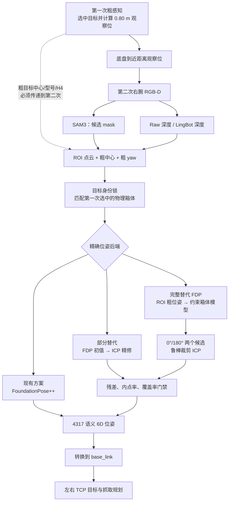
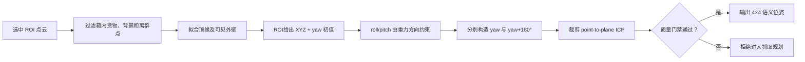

# 9_5 分析ICP替代箱体6D流程

- 归档编号：`01a06fc9-65d2-7c01-b8e4-3d26b3aa4f09`
- 项目：S1 IE_lab 拆垛
- 创建时间：2026-09-05T12:17:44.918000+08:00
- 更新时间：2026-09-05T12:20:03.860000+08:00
- 状态：活动
- 导出范围：用户可见消息与助手可见回复；不含隐藏推理和工具原始输出

## 1. 用户

```mermaid
flowchart TD
    A["任务预设：4317 / H4 / Mode 00"] --> B["第一次右腕 RGB-D：SAM 拍摄位"]
    B --> C["SAM3：生成多个蓝色箱体 mask"]
    B --> D["LingBot：补全深度"]
    C --> E["逐个 mask 生成三维 ROI"]
    D --> E
    E --> F["ROI 排序：顶面 Z 高→低<br/>同高度按 base_link Y 小→大"]
    F --> G["取排序第 1 个 ROI"]
    G --> H["检查选中项是否为 4317/H4"]
    H --> I["用粗中心计算 0.80 m 观察位并导航"]

    I --> J["第二次右腕 RGB-D：FDP 拍摄位"]
    J --> K["重新运行 SAM3 + LingBot + ROI"]
    K --> L["再次独立取排序第 1 个 ROI"]
    L --> M["选中 ROI mask → FoundationPose++"]
    M --> N["箱体 6D 位姿"]

    G -. "粗选实例 ID 没有传给第二次选择" .-> L


看下“9_5 继续分析箱体6D位姿流程”这个聊天
 第二次右腕 RGB-D：FDP 拍摄位：SAM3 + LingBot + ROI  这是之前的方案

如果我现在想用 ICP或者别的什么方案 是部分替代还是完全替代掉？ 最好给我画个图看看，形象一点
```

## 2. 助手（进展）

我先把仓库里的已确认结论、SDK/真机注意事项，以及你提到的那条任务记录对齐起来。随后我会把 ICP 放在流程中的几种位置拆开比较，并画一张“部分替代 / 完全替代”的直观架构图。

## 3. 助手（进展）

关键边界已经明确：ICP不是“从整张图里找箱子”的算法，它主要接手的是“已选中箱体的精确位姿求解”。所以它可以替换 FoundationPose++，但通常不会一起替掉 SAM3、深度和 ROI；而且它也解决不了两次拍摄选中了不同箱体的问题。

## 4. 助手

看过“9_5 继续分析箱体6D位姿流程”。最直接的结论是：

> 对整个感知系统来说，ICP通常是“部分替代”；但对精确位姿模块来说，它可以“完整替代 FoundationPose++”。

也就是说，推荐保留第二次拍摄的 `SAM3 + 深度 + ROI`，只把最后的 FoundationPose++ 换成“受约束箱体几何 + ICP”。



### 哪些保留，哪些替换

| 模块 | ICP方案中的处理 |
|---|---|
| 第二次右腕 RGB-D | 保留，ICP同样需要现场深度 |
| SAM3 | 建议保留，用来隔离目标箱体 |
| LingBot | 可保留，但需要和 raw 深度做 A/B；不能盲目信任 |
| ROI | 保留，而且成为ICP的初值来源 |
| 粗中心、yaw、H4 | 保留，用于初始化和物理合理性检查 |
| FoundationPose++ | 可以保留后精修，也可以彻底移除 |
| 目标身份锁 | 必须新增；ICP不能解决“选错箱子” |
| 后续坐标变换、TCP偏移 | 保留，但要支持 `source=icp` |

所以，“完全替代”的准确含义是：

```text
SAM3 + 深度 + ROI + FoundationPose++
                     ↓
SAM3 + 深度 + ROI + 约束几何/ICP
```

不是把第二次拍摄的全部感知都删掉。

### 我更推荐的无FDP方案

4317是已知尺寸、正常竖直放置的规则箱体，其实没必要让ICP自由搜索完整6自由度。更稳妥的是：



虽然最后仍输出4×4“6D位姿矩阵”，但实际只重点估计：

- `X/Y/Z`
- `yaw`

`roll/pitch`由地面重力和“箱体竖直放置”约束。这比自由6D ICP更不容易跑偏。

当前历史数据也支持这个方向：8个成功FDP观测中，ROI粗几何相对FDP的XY中心差平均约`19.5 mm`、最大`26.5 mm`，对称归一后的yaw差平均约`1.93°`、最大`4.71°`。这说明ROI很适合当ICP初值，但还不能证明几何结果已经达到安全抓取精度。[核查记录](../../assets/9532a89bcd51d69d--knowledge_base.md:927)

### 为什么不建议“裸ICP直接吃整块点云”

ICP是局部优化器，不是目标检测器。当前场景有几个典型问题：

- 箱体有`180°`旋转对称；
- 箱内货物不属于箱体模型，可能把ICP拉偏；
- 只能看到顶缘和部分外壁，CAD模型与观测不完整；
- 多个相同蓝箱相邻，选错mask后ICP照样可能收敛；
- 初值不够好时，低残差也未必表示物理姿态正确。

因此要用“ROI粗初值 + 约束ICP”，而不是“全局自由6D ICP”。

### LingBot需要特别小心

9月4日同一帧实测中，raw与LingBot分支的选中中心相差约`55.7 mm`，对称yaw相差约`12.69°`。这说明LingBot不只是补洞，也改变了几何表面。[A/B结果](../../assets/9532a89bcd51d69d--knowledge_base.md:993)

ICP阶段建议：

- raw有效点作为主要配准依据；
- LingBot用于补洞、生成初值，或者作为独立分支；
- raw与LingBot分别估姿，差异过大则拒绝；
- 不要无权重地把两种深度混成一片点云。

### 其他可选路线

- **箱体平面/顶缘拟合**：不使用ICP，直接拟合规则长方体。最简单、可解释，适合4317固定箱型。
- **几何拟合 + ICP**：目前最推荐；几何给初值，ICP做毫米级精修。
- **FDP + ICP**：风险最低的过渡方案；先用FDP，ICP只精修或交叉校验。
- **全局配准 + ICP**：例如特征匹配后再ICP；可不依赖ROI初值，但对重复、对称、局部可见的箱体通常更难。
- **AprilTag/标记板**：如果允许改造箱体，这是最容易获得稳定姿态的方案，但存在遮挡、标签维护和现场工艺问题。

我的建议顺序是：先离线实现“**目标身份锁 → 约束箱体拟合 → 双候选ICP → 质量门禁**”，和FDP并行A/B；验证稳定后，再把FoundationPose++从生产链中移除。当前部署还硬编码要求`source=fdp`，真正替换时还必须修改位姿来源schema、语义轴转换、门禁和批准哈希，不能只把函数调用换掉。[当前接口约束](../../assets/9532a89bcd51d69d--knowledge_base.md:911)

[附件：9532a89bcd51d69d--knowledge_base.md](../../assets/9532a89bcd51d69d--knowledge_base.md)
