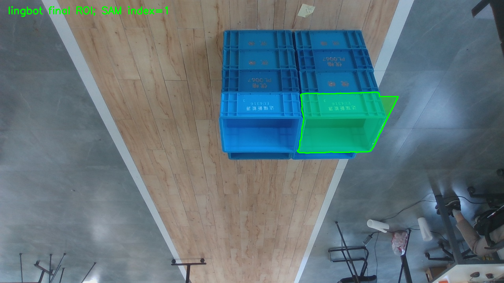
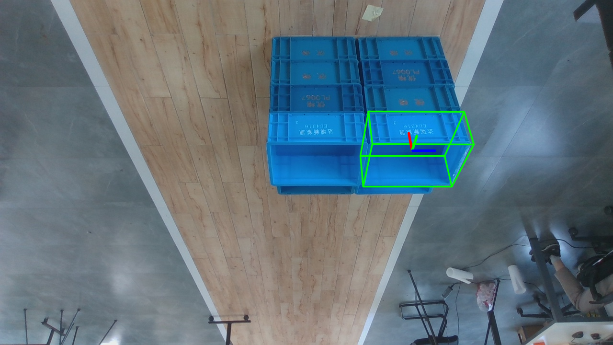
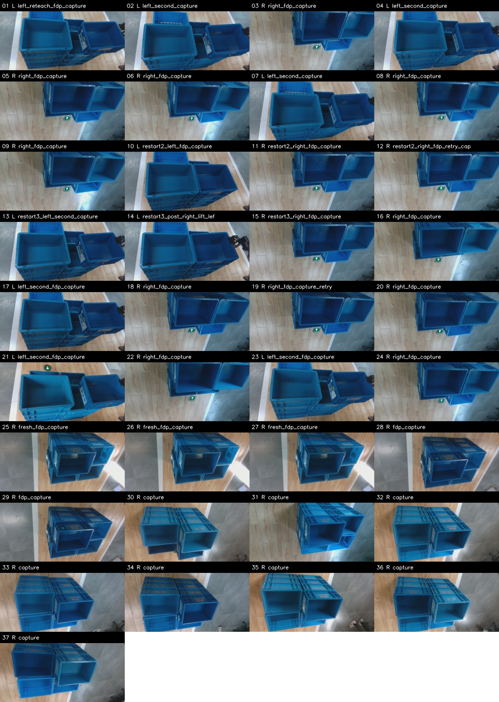
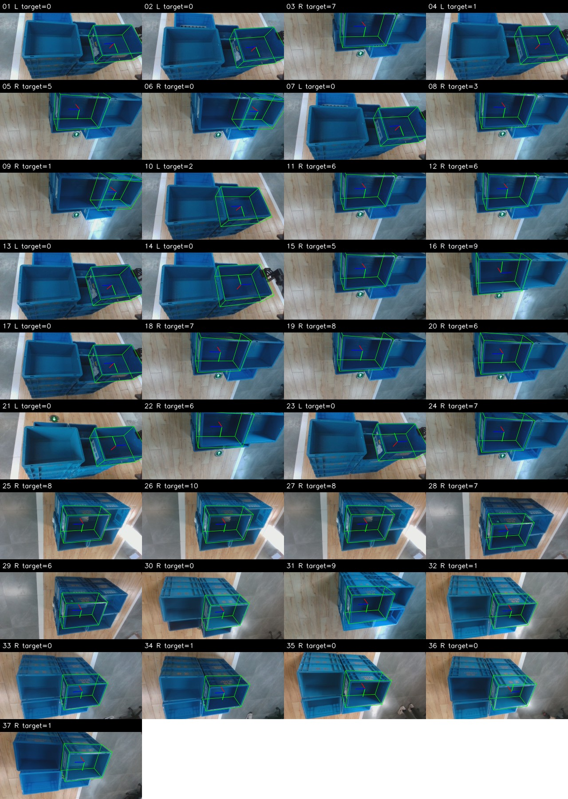

# 9_7 分析FDP剥离解耦实验

- 归档编号：`01a07984-d67d-7b11-956f-9a304cca746c`
- 项目：S1 IE_lab 拆垛
- 创建时间：2026-09-07T09:39:03.936000+08:00
- 更新时间：2026-09-07T16:48:59.836000+08:00
- 状态：活动
- 导出范围：用户可见消息与助手可见回复；不含隐藏推理和工具原始输出

## 1. 用户

```mermaid
flowchart TD
    A["固定配置、镜像、源码哈希预检"] --> B["SAM 地图定位"]
    B --> C["腰部 0.420 m<br/>双臂 SAM 姿态"]
    C --> D["第一次右腕 RGB-D"]
    D --> E["SAM3 + LingBot 粗选 4317/H4"]
    E --> F["计算并导航到 0.80 m 观察位"]

    subgraph CURRENT["当前实验范围：FDP 近距离精感知"]
        G["双臂到 FDP 拍摄姿态<br/>生产流程前置动作"] --> H["第二次右腕 RGB-D<br/>RGB + 原始深度 + K + 拍摄时刻 TF"]

        H --> I["SAM3<br/>masks / boxes / scores"]
        H --> J["LingBot-Depth<br/>补全深度 D_dense"]

        I --> K["ROI 几何估计与目标选择"]
        J --> K
        K --> L["唯一 4317/H4<br/>final ROI mask"]

        H --> M["FoundationPose++"]
        J --> M
        L --> M
        N["4317 三维 Mesh"] --> M

        M --> O["相机坐标系原始位姿<br/>T_camera_from_fdp_mesh"]
        O --> P["相机→base_link 变换<br/>语义轴转换<br/>180° 对称归一化"]
        P --> Q["最终输出<br/>T_base_link_from_4317_semantic"]
    end

    F --> G
    Q --> R["生成左右预抓目标"]
    R --> S["开爪 → PTP 预抓<br/>LIN 内收 100 mm"]
    S --> T["合爪 → 上抬 100 mm"]
    T --> U["腰部上升并携箱导航"]
    U --> V["高位张爪释放"]
    V --> W["双臂和底盘返回 SAM"]

    classDef outside fill:#eeeeee,stroke:#888,color:#333;
    classDef experiment fill:#e5f1ff,stroke:#1677c8,stroke-width:2px,color:#123;
    classDef result fill:#e4f7e9,stroke:#258548,stroke-width:3px,color:#123;

    class A,B,C,D,E,F,R,S,T,U,V,W outside;
    class G,H,I,J,K,L,M,N,O,P experiment;
    class Q result;

我们现在做的FDP 剥离 或者 叫 解耦 实验 你应该看得到吧，看下这个对话“9_5 分析ICP替代箱体6D流程” 和 “9_3 分析箱体6D位姿流程输入输出”“9_5 分析ICP替代箱体6D流程”
```

## 2. 助手（进展）

我先读取仓库里的项目记录，再查找你提到的两段对话，核对 FDP 解耦实验的范围和当前进展。

## 3. 助手（进展）

两段对话都找到了，你贴的图正是“9_3 分析箱体6D位姿流程输入输出”中的图。不过其中“尚未采集新数据”的状态已被 9 月 4 日实验更新：右腕采集、SAM3、LingBot 和 ROI 回放已经完成，目前停在目标唯一性检查，尚未调用 FDP。9 月 5 日讨论的 ICP 替代则还是方案阶段。

## 4. 助手

**看得到，已经读过你提到的两段对话**，也补读了“9_5 继续分析箱体6D位姿流程”。你重复写的“9_5 分析ICP替代箱体6D流程”是同一段。

我现在对齐的理解是：**把近距离精感知这一段从完整 Mode 00 中独立出来，建立可保存输入、离线回放、比较不同位姿后端的实验。**

对应你图里的边界：

- **G：双臂到 FDP 拍摄姿态**——生产前置动作，不由当前解耦工具自动执行。
- **H～Q：右腕数据 → 分割/深度/ROI → FDP → 箱体语义位姿**——实验核心。
- **R 之后：生成抓取目标及执行**——在当前实验范围之外。

根据最新保存的实验记录，进展是：

| 环节 | 状态 |
|---|---|
| 历史 FDP 位姿的坐标转换、语义轴和对称归一化 | 已离线复现 |
| 新鲜右腕 RGB-D 采集 | 9 月 4 日已完成 |
| SAM3、raw/LingBot 两分支及 ROI 回放 | 已完成 |
| 唯一目标检查 | 未通过：raw 有 4 个、LingBot 有 2 个 4317/H4 候选 |
| 新帧 FoundationPose++ 推理 | 尚未调用 |
| ICP 替代后端 | 方案讨论阶段 |

所以你图中的 **L「唯一 4317/H4」是需要通过的门禁，当前还没有通过**；Q 是最终目标输出，不能理解为新帧已经跑到了 Q。[实验记录](../../assets/680d66f38aa4ceb9--RUN_20260904_LIVE_RGBD_SAM_LINGBOT.md)

“解耦”和“替代”也对应两个阶段：当前先让这段感知能独立运行；9 月 5 日讨论的是在此基础上，保留采集、SAM3、深度和 ROI，尝试用约束几何/ICP 替换 FDP 位姿求解部分。

我已把这次对话衔接和状态修正写进[项目知识库](../../assets/9532a89bcd51d69d--knowledge_base.md:1008)，后续可以从这个实际停点继续。

[附件：680d66f38aa4ceb9--RUN_20260904_LIVE_RGBD_SAM_LINGBOT.md](../../assets/680d66f38aa4ceb9--RUN_20260904_LIVE_RGBD_SAM_LINGBOT.md)

[附件：9532a89bcd51d69d--knowledge_base.md](../../assets/9532a89bcd51d69d--knowledge_base.md)

## 5. 用户

这个实验要不给我取个名字？叫什么比较好？

## 6. 助手

建议叫：**S1 箱体位姿感知解耦实验**。

这个名字覆盖当前的 `RGB-D → SAM3 / 深度 / ROI → 箱体位姿`，也能自然容纳后续 ICP 等替代方案，不会把实验限定在 FDP 上。

可以统一这样使用：

- **正式名称**：S1 箱体位姿感知解耦与对比验证实验
- **日常简称**：箱体感知解耦实验
- **代码目录**：`s1_crate_pose_lab`
- **当前阶段**：阶段一——FDP 基线复现

后续阶段就可以叫“几何 / ICP 位姿对比验证”，仍属于同一个实验项目。

## 7. 用户

现在我们先验证 FDP 基线复现 现在需要我给你  ssh链接吗？

## 8. 助手

**需要你授权本轮 SSH 访问；如果地址没变，不用重新提供地址。**之前记录的是 `galbot@10.34.216.17`。若已有 SSH 复用连接，提供当前 socket 路径即可，密码不要发在聊天里。

下一步先只读检查已有采集、候选 mask 和基线文件。上次停在**目标不唯一**，需要先解决这一点，再对冻结输入调用 FDP、检查输出位姿；仅复核历史位姿的坐标转换还不算重新跑通 FDP。

本轮是否授权我通过上述地址进行只读检查？这一步不移动机器人，也不调用推理服务。

## 9. 用户

你如果需要SSh 链接，就给我命令我帮你连。我是不是应该先把机器人移动到箱子附近，然后右臂深度相机拍着拆垛箱子？

## 10. 助手

**如果要验证新拍摄数据的 FDP 完整流程，是的，需要先具备合适的拍摄位置。**如果只是回放已有数据，则不用移动机器人。

现场准备建议这样做：

- **位置**：机器人在货垛前约 `0.8 m` 可作为参考。这是底盘观察退距，不要求右腕相机到箱体精确 `0.8 m`。
- **视角**：右腕 RGB-D 相机能完整看到目标箱，顶缘和可见外壁清楚，避免截边、手臂遮挡。
- **目标**：沿用当前的 **4317/H4** 配置；最好让画面中只有一个符合条件的目标候选。上次就是因为多个候选而停住。
- **采集**：底盘、手臂、腰部和箱体全部静止后再拍。我们先检查 RGB、深度和候选 mask，通过后才进入 FDP。

摆位可能涉及 **S1 底盘和右臂**；若调整拍摄高度，也会涉及腰部。请用你熟悉的现场控制方式低速分步操作，确认双臂与货垛、周围障碍物有净空，实体急停随手可用。**这次无需抓取或开合夹爪；我不会自动发送运动命令。**

你可以先在这台电脑上打开终端，执行：

```bash
ssh -M \
  -S /tmp/s1_fdp_mux_20260907 \
  -o ControlPersist=no \
  -o ServerAliveInterval=30 \
  -o ServerAliveCountMax=3 \
  -N galbot@10.34.216.17
```

密码只在终端输入。连接成功后终端保持占用、没有命令提示符是正常的，先保留该窗口；结束时按 `Ctrl+C` 断开。

连接好后告诉我“已连接”，并说明机器人是否已摆好。我先检查已有基线文件和采集条件。

## 11. 用户

lsy03\@lsy03-System-Product-Name:\~/文档/ChatGPT/S1/experiments/20260822\_s1\_rviz\_demo/ros2\_ws$ ssh -M \\
&#x20; -S /tmp/s1\_fdp\_mux\_20260907 \\
&#x20; -o ControlPersist=no \\
&#x20; -o ServerAliveInterval=30 \\
&#x20; -o ServerAliveCountMax=3 \\
&#x20; -N galbot\@10.34.216.17
galbot\@10.34.216.17's password:[REDACTED];

现在像是卡在这里？有没有办法验证链接成功？

## 12. 助手（进展）

我检查一下本机 SSH 复用连接的状态，这个检查不会读取传感器或触发机器人动作。

## 13. 助手

**连接已经成功。**我刚检查得到：

```text
Master running (pid=114236)
```

看起来“卡住”是正常的：`-N` 只保持 SSH 连接，不进入远程命令行；输入密码时也不会显示字符。

请保持这个终端窗口打开。你也可以在另一个终端随时验证：

```bash
ssh -S /tmp/s1_fdp_mux_20260907 -O check galbot@10.34.216.17
```

返回 `Master running` 就说明连接仍然有效。

## 14. 用户

有没有直接后台运行的方法，我记得之前用（umask 077

ssh -fN -M \\
&#x20; -S /tmp/s1\_codex\_mux\_20260902\_rviz \\
&#x20; -o ControlPersist=2h \\
&#x20; -o ServerAliveInterval=5 \\
&#x20; -o ServerAliveCountMax=2 \\
&#x20; galbot\@10.34.216.17
）这种就可以

## 15. 助手

可以，你记得的方式是对的。**`-fN` 会在认证成功后转入后台，不用一直开着终端。**

先在当前保持连接的终端按 `Ctrl+C`，然后执行：

```bash
(
  umask 077
  ssh -fN -M \
    -S /tmp/s1_fdp_mux_20260907 \
    -o ControlPersist=2h \
    -o ServerAliveInterval=5 \
    -o ServerAliveCountMax=2 \
    galbot@10.34.216.17
)
```

输入密码后应返回本机命令提示符。验证连接：

```bash
ssh -S /tmp/s1_fdp_mux_20260907 -O check galbot@10.34.216.17
```

显示 `Master running` 就成功了，可以关闭终端窗口。`ControlPersist=2h` 表示空闲保留时间，并非连接建立两小时后强制断开。

实验结束时，主动关闭后台连接：

```bash
ssh -S /tmp/s1_fdp_mux_20260907 -O exit galbot@10.34.216.17
```

## 16. 用户

现在可以了
galbot\@10.34.216.17's password:[REDACTED];
lsy03\@lsy03-System-Product-Name:\~/文档/ChatGPT/S1/experiments/20260822\_s1\_rviz\_demo/ros2\_ws$ ssh -S /tmp/s1\_fdp\_mux\_20260907 -O check galbot\@10.34.216.17
Master running (pid=114417)
lsy03\@lsy03-System-Product-Name:\~/文档/ChatGPT/S1/experiments/20260822\_s1\_rviz\_demo/ros2\_ws$

## 17. 助手（进展）

后台连接已正常。我接着只读检查 S1 上保存的 FDP 基线、上次候选结果和相关进程状态，确认继续实验的起点。

## 18. 用户

<send_user_message_question_reply>
[{"questionItemId":"[\"request_user_input_async\",\"call_oFk9d47FMZWP2uP9VpvDb74M\",0]","question":"S1 现在是否已摆到箱体附近，右腕相机朝向目标，并且底盘、双臂和腰部都已停止运动？","answer":"已摆好并静止"}]
</send_user_message_question_reply>

## 19. 助手（进展）

收到。S1 上的旧基线文件仍在，停点也与记录一致：raw 和 LingBot 两条分支都因目标不唯一而未进入 FDP。

既然已摆好并静止，我先核对采集脚本和控制占用，再采一帧右腕 RGB-D。采集只读取图像、深度、标定和状态，不发送运动命令；随后先检查画面质量和候选箱体。

## 20. 助手

_工具输出图片（原始工具文本未纳入归档）。_


## 21. 助手（进展）

新的一帧已采集成功：分辨率为 1280×720，RGB 与深度时间戳一致，全图有效深度约 86.6%。

画面中能看到两列蓝箱。原始图像是倒置的，我会保留原图与对应标定，避免改变像素坐标。接下来对这张冻结图运行 SAM3 和 raw/LingBot 两条 ROI 分支，检查是否仍有多个 H4 候选。

## 22. 助手（进展）

我先完成不依赖服务的文件校验、深度统计和采集记录归档，服务调用等待你确认。

自动审批拒绝了向 Thor SAM3/LingBot 发送本次图像和深度的操作，理由是本轮尚未明确授权这些数据及接收地址。上方确认仅涉及这两个服务的数据发送；刚才的推理命令没有执行。

## 23. 用户

<send_user_message_question_reply>
[{"questionItemId":"[\"request_user_input_async\",\"call_f161JIsNgyTEiCNpZtYNjX79\",0]","question":"是否授权将本次冻结的右腕 RGB 图像发送到实验室 Thor SAM3（10.34.216.11:7861），并将 RGB、原始深度和内参发送到 Thor LingBot（10.34.216.11:7865），用于生成分割和补全深度？这些是既有实验服务；本步不调用 FDP、不控制机器人。","answer":"授权发送到上述两个服务"}]
</send_user_message_question_reply>

## 24. 助手（进展）

已收到授权，配置中的两个地址也核对一致，SAM3/LingBot 处理已开始。

本地校验同时通过：五个输入文件哈希全部匹配，RGB、深度和拍摄时刻 TF 的时间差均为 0。这帧数据已经保存，后续可以直接回放，无需反复拍摄。

## 25. 助手

_工具输出图片（原始工具文本未纳入归档）。_




## 26. 助手（进展）

SAM3 返回了 10 个 mask；raw 和 LingBot 两条分支都找到了 **两个 4317/H4 候选：编号 1 和 2**。默认排序都选了编号 1，但严格唯一性检查未通过，所以 FDP 仍未调用。

下面绿色区域是编号 1，也就是这张倒置原图中右侧的开口箱。左侧开口箱是编号 2。若本轮采用人工指定目标，需要把你的选择绑定到这帧和对应 mask，保存为单独的实验案例。


## 27. 用户

<send_user_message_question_reply>
[{"questionItemId":"[\"request_user_input_async\",\"call_wAr7I7qTVinVpPV2EmvkEd1K\",0]","question":"本轮 FDP 基线要使用哪只箱体？按刚展示的倒置原图选择；我会把人工选择绑定到本次冻结图像和 mask，并保留原始多候选结果。","answer":"图中右侧绿色箱：编号 1"}]
</send_user_message_question_reply>

## 28. 助手（进展）

已确认：本轮固定使用**原图右侧绿色箱，SAM 编号 1**。

我会保留两条原始多候选案例，另外建立绑定这帧图像和 mask 的“人工确认目标”案例。先用生产兼容的 LingBot 深度准备 FDP 请求，同时核验离线回放结果。

## 29. 助手（进展）

人工确认案例和 FDP 请求已准备好：使用编号 1 的最终 ROI mask、LingBot 深度、原始 RGB、内参和 4317 mesh 路径。原始案例仍保留“两个候选”的记录。

两条 ROI 离线回放均完全一致：中心和 yaw 差为 0，mask IoU 为 1。下一步会向另一台 FDP 服务发送请求；你刚才的授权只涵盖 Thor 两个服务，因此还需单独确认这个接收地址。

## 30. 用户

<send_user_message_question_reply>
[{"questionItemId":"[\"request_user_input_async\",\"call_4zJtQNQj5Ofm46oNnCvkbI40\",0]","question":"是否授权将已准备好的编号 1 箱体基线请求（本帧 RGB、LingBot 深度、最终 ROI mask、内参 K 和 mesh 路径）发送至既有 FoundationPose++ 服务 http://10.34.216.13:7876/first_frame_track，执行一次位姿推理并保存响应及可视化？只做感知计算，不生成或执行抓取动作。","answer":"授权本次 FDP 推理"}]
</send_user_message_question_reply>

## 31. 助手（进展）

FDP 请求已发出，正在等待服务返回位姿和叠加图。

人工选箱案例的校验已通过 15 项离线测试，包括确认后输入被替换、候选编号与 mask 不匹配时拒绝加载。返回结果后，我会检查坐标转换和图像上的拟合情况；服务返回成功本身还不能证明位姿准确。

## 32. 助手

_工具输出图片（原始工具文本未纳入归档）。_



## 33. 助手（进展）

这次已跑通到最终输出：FDP 返回 HTTP 200，位姿完成了相机到 `base_link` 的转换、语义轴转换和对称归一化，叠加框落在你选定的右侧箱体上。

但精度还不能判定通过：FDP 与 LingBot ROI 的 XY 中心相差约 **137 mm**，需要继续解释。ROI 本身也不是真值，因此目前能确认的是“独立感知链跑通、输入输出可回放”，尚不能确认抓取精度。我正在保存结果和这个待验证问题。

## 34. 助手

**这次 FDP 独立感知链已跑通，输入和结果都已保存。**使用的是你指定的原图右侧箱体（编号 1）。


- FDP 返回成功，已输出 `T_base_link_from_4317_semantic`。
- 箱体中心：`[1.39245, 0.25533, 0.50590] m`；yaw：`91.29°`。
- 两条 ROI 回放、保存响应的坐标归一化复算均一致；15 项离线测试通过。
- 全程未发送机器人运动命令。

**精度尚未验证通过：**FDP 与 LingBot ROI 的 XY 中心相差约 **137 mm**，需要先查明原因。ROI 也不是真值，因此不能直接把这项差异当作 FDP 误差。

[查看实验记录](../../assets/cf5e1ca6d2da6de3--RUN_20260907_FDP_OPERATOR_TARGET.md) · [查看完整位姿输出](../../assets/c1fa0a7b6f453454--normalized_pose.json)


[附件：cf5e1ca6d2da6de3--RUN_20260907_FDP_OPERATOR_TARGET.md](../../assets/cf5e1ca6d2da6de3--RUN_20260907_FDP_OPERATOR_TARGET.md)

[附件：c1fa0a7b6f453454--normalized_pose.json](../../assets/c1fa0a7b6f453454--normalized_pose.json)

## 35. 用户

现在的这个实验我是否可以复现？给我实验运行的命令，方便我复现 。其中的产物我如何查询？

## 36. 助手（进展）

我先核对现有脚本、数据位置和运行环境，把“纯离线复现”“重新调用 FDP”和“重新采集”分开整理成可直接执行的命令，并标明产物查询位置。

## 37. 助手（进展）

可以复现，而且现在完整输入和 FDP 返回都已保存在本机，不需要先连机器人。

我补了一个纯离线回放命令并实际跑过：请求内容匹配，最终位姿与已保存结果完全一致，平移和旋转差都是 0。重新调用 FDP 则是另一种复现方式，需要服务在线，结果是否完全一致还要比较。

## 38. 助手

**可以复现。**我已经整理好[运行与产物查询手册](../../assets/dc4dc812afdbb0cc--REPRODUCE.md)，包含离线回放、重新调用 FDP、重新采集三种方式。

下面命令都在你的 **Ubuntu 本机终端**执行。

**1．进入实验目录，设置路径**

```bash
cd /home/lsy03/文档/ChatGPT/S1/experiments/20260903_fdp_baseline

FDP_CASE=cases/right_wrist_20260907_01_lingbot_operator1
FDP_REFERENCE=outputs/fdp_20260907_01_lingbot_operator1
FDP_TAG=$(date +%Y%m%d_%H%M%S_%N)
```

**2．先做纯离线复现，不需要 SSH 或推理服务**

```bash
python3 scripts/verify_case.py --case-dir "$FDP_CASE"

python3 scripts/replay_saved_fdp_result.py \
  --case-dir "$FDP_CASE" \
  --reference-run-dir "$FDP_REFERENCE" \
  --output-dir "outputs/offline_fdp_${FDP_TAG}"
```

这一步使用**保存的 FDP 返回**重新计算最终位姿。我已实际验证，预期输出：

```text
ok: true
request_payload_matches: true
all_matrices_exactly_equal: true
平移、旋转差均为 0
```

**3．如果要真正重新运行一次 FDP 模型**

需要 `10.34.216.13:7876` 服务在线。这条命令会发送同一套冻结输入，不需要移动机器人：

```bash
FDP_TAG=$(date +%Y%m%d_%H%M%S_%N)
FDP_NEW_OUT="outputs/fdp_repeat_${FDP_TAG}"

python3 scripts/replay_fdp_case.py \
  --case-dir "$FDP_CASE" \
  --output-dir "$FDP_NEW_OUT" \
  --service-url http://10.34.216.13:7876 \
  --timeout-s 180 \
  --call-service
```

比较新旧位姿并查看新结果：

```bash
python3 scripts/compare_results.py \
  "$FDP_REFERENCE/normalized_pose.json" \
  "$FDP_NEW_OUT/normalized_pose.json"

xdg-open "$FDP_NEW_OUT/foundationpose_vis.png"
cat "$FDP_NEW_OUT/run_result.json"
```

输出目录不能重复使用，所以每次运行都生成新的 `FDP_TAG`。

**已有产物可以直接点击查看：**

| 想查看什么 | 文件 |
|---|---|
| 原始照片 | [rgb.png](../../assets/eb045825a3ec3a49--image-eb045825a3ec.png) |
| SAM3 全部候选 | [候选叠加图](../../assets/61312edd36f87341--image-61312edd36f8.png) |
| 选中的箱体 mask | [ROI 叠加图](../../assets/be76dbed7a7a925f--image-be76dbed7a7a.png) |
| FDP 三维框 | [位姿叠加图](../../assets/bced59f2c10d5c8a--image-bced59f2c10d.png) |
| 最终 4×4 位姿 | [normalized_pose.json](../../assets/c1fa0a7b6f453454--normalized_pose.json) |
| 调用状态、耗时 | [run_result.json](../../assets/7b46c3b425de199e--run_result.json) |

**重新拍摄一帧的完整命令也在手册中。**新帧需要重新检查目标，不能直接沿用这次的“编号 1”确认。当前复现验证的是感知链路，约 **137 mm 的 ROI/FDP 中心差异**仍待解释。

[附件：dc4dc812afdbb0cc--REPRODUCE.md](../../assets/dc4dc812afdbb0cc--REPRODUCE.md)


[附件：c1fa0a7b6f453454--normalized_pose.json](../../assets/c1fa0a7b6f453454--normalized_pose.json)

[附件：7b46c3b425de199e--run_result.json](../../assets/7b46c3b425de199e--run_result.json)

## 39. 用户

运行一次 FDP 模型 是从 “SAM3 + LingBot + ROI 目标选择                   ↓            FoundationPose++” 这整个流程都走过一遍吗

## 40. 助手

**不是。刚才“重新运行一次 FDP”的命令，只重新调用 FoundationPose++，随后完成坐标转换和语义归一化。**

它直接读取这次已经保存好的输入：

```text
已有 RGB + 已有 LingBot 深度
+ 已确认的 ROI mask + K + mesh 路径
                 ↓
       重新运行 FoundationPose++
                 ↓
       坐标转换、语义轴和对称归一化
                 ↓
T_base_link_from_4317_semantic
```

**SAM3、LingBot 和 ROI 目标选择不会重新运行。**

我们现在有三种不同的运行范围：

| 运行方式 | 重跑哪些环节 |
|---|---|
| 纯离线位姿回放 | 读取保存的 FDP 位姿，只重算坐标转换 |
| 重新调用 FDP | 使用保存的深度和 mask，重新估计位姿 |
| 整段精感知重跑 | RGB-D → SAM3 + LingBot → ROI 选择 → FDP → 最终位姿 |

**你说的“整个流程都走一遍”属于第三种。**它也可以从已经保存的 RGB-D 开始，不一定要重新拍摄；但会重新调用 SAM3、LingBot，并重新检查 ROI 目标。

## 41. 用户

FDP剥离解耦实验 有没有使用手册？ 要不给我写一个

## 42. 助手（进展）

我会把现有复现说明整理成一份完整使用手册，重点写清整段感知重跑、仅重跑 FDP、纯离线回放的区别，以及本机/S1 上的命令、选箱步骤和产物查询方法。

## 43. 助手（进展）

现有说明更偏向“复现某一步”，完整流程还缺少批次目录、产物拷回本机，以及人工选箱后衔接 FDP 的步骤。

新手册会把“从已保存 RGB-D 重跑 SAM3 → LingBot → ROI → FDP”作为主流程，写清每步执行位置、输出文件和停止条件。只编写和核对手册，不重新采集或调用服务。

## 44. 用户

.md 就行

## 45. 助手（进展）

好的，就用 `.md`。手册正文已写好，正在检查命令语法、脚本参数和文档链接；整段重跑的操作集中在第 5 节，也写明了当前工具不能直接切换到另一只候选箱的限制。

## 46. 助手

已写好 Markdown 手册：

**[FDP 剥离/解耦实验使用手册.md](../../assets/5d1e4f1fdc3d9945--FDP_DECOUPLING_USER_GUIDE.md)**

包含完整运行命令、本机/S1 执行位置、SSH、人工选箱、产物查询、成功判据和常见报错。

你最关心的部分：

- **第 5 节**：从保存的 RGB-D 开始，整段重跑 **SAM3 + LingBot + ROI → FDP**。
- **第 6 节**：重新采集新帧，再接完整流程。
- **第 8 节**：查询图片、mask、深度和最终位姿。

23 个 Bash 命令块已通过语法检查；本轮只写手册，没有重新运行实验。

[附件：5d1e4f1fdc3d9945--FDP_DECOUPLING_USER_GUIDE.md](../../assets/5d1e4f1fdc3d9945--FDP_DECOUPLING_USER_GUIDE.md)

## 47. 用户

我现在需要 “整段精感知重跑” 给我命令我来执行

## 48. 助手

下面按**“使用 9 月 7 日保存的 RGB-D，重跑 SAM3 + LingBot + ROI → FDP”**执行。会调用三个推理服务，不重新拍照、不移动机器人。

**所有命令都在本机终端执行，按顺序操作；某一步报错就先停下。**

**① 重跑 SAM3、LingBot 和 ROI**

整块复制执行：

```bash
cd /home/lsy03/文档/ChatGPT/S1/experiments/20260903_fdp_baseline

FDP_BATCH_ID="full_$(date +%Y%m%d_%H%M%S_%N)"

ssh -S /tmp/s1_fdp_mux_20260907 \
  -o ControlMaster=no -o BatchMode=yes -o ProxyCommand=false \
  galbot@10.34.216.17 bash -s -- "$FDP_BATCH_ID" <<'S1'
set -e

cd /home/galbot/Lsy03/fdp_baseline
FDP_BATCH_ID=$1

python3 scripts/build_fresh_fdp_case.py \
  --capture-dir captures/right_wrist_20260907_01 \
  --output-dir "outputs/perception_$FDP_BATCH_ID" \
  --case-root "cases/batches/$FDP_BATCH_ID" \
  --depth-mode both \
  --site-config /home/galbot/ie_lab/projects/dual_arm_v5/workspace/s1_sjtu_0806/config/site.production.yaml \
  --perception-root /home/galbot/ie_lab/projects/dual_arm_v5/workspace/s1_sjtu_0806/vendor/g1_workbin_perception \
  --mesh /home/galbot/ie_lab/projects/dual_arm_v5/workspace/s1_sjtu_0806/assets/mesh/EU4322_midcut_target175mm.obj \
  --timeout-s 180

python3 scripts/render_live_diagnostics.py \
  --capture-dir captures/right_wrist_20260907_01 \
  --perception-dir "outputs/perception_$FDP_BATCH_ID"

cat "outputs/perception_$FDP_BATCH_ID/result.json"
S1
```

这里 `fdp_called:false` 正常，FDP 尚未运行。

**② 把结果复制回来，查看目标箱体**

继续在**同一个本机终端**执行：

```bash
mkdir -p outputs cases/batches

scp -r \
  -o ControlPath=/tmp/s1_fdp_mux_20260907 \
  -o ControlMaster=no -o BatchMode=yes -o ProxyCommand=false \
  "galbot@10.34.216.17:/home/galbot/Lsy03/fdp_baseline/outputs/perception_$FDP_BATCH_ID" \
  outputs/

scp -r \
  -o ControlPath=/tmp/s1_fdp_mux_20260907 \
  -o ControlMaster=no -o BatchMode=yes -o ProxyCommand=false \
  "galbot@10.34.216.17:/home/galbot/Lsy03/fdp_baseline/cases/batches/$FDP_BATCH_ID" \
  cases/batches/

FDP_PERCEPTION="outputs/perception_$FDP_BATCH_ID"
FDP_SOURCE_CASE="cases/batches/$FDP_BATCH_ID/right_wrist_20260907_01_lingbot"

python3 scripts/verify_case.py --case-dir "$FDP_SOURCE_CASE"

xdg-open "$FDP_PERCEPTION/common/sam_candidates_overlay.png"
xdg-open "$FDP_PERCEPTION/lingbot/roi_mask_overlay.png"

cat "$FDP_PERCEPTION/lingbot/roi_result.json"
```

**先看图：最终绿色 ROI 必须覆盖你要验证的箱体。**重新分割后的编号可能变化，不要直接沿用旧编号 1。

**③ 看图后，确认这次的目标**

仅当最终绿色 ROI 就是你要的箱体时执行。输入本次 `target_roi.index` 和你的确认描述：

```bash
read -r -p '输入本次已看图确认的 target_roi.index: ' FDP_REVIEWED_INDEX
read -r -p '输入目标确认描述，例如原图右侧开口箱: ' FDP_OPERATOR_NOTE

FDP_RGB_HASH=$(python3 -c 'import json,sys; print(json.load(open(sys.argv[1]))["files"]["rgb"]["sha256"])' "$FDP_SOURCE_CASE/manifest.json")

FDP_MASK_HASH=$(python3 -c 'import json,sys; print(json.load(open(sys.argv[1]))["files"]["mask"]["sha256"])' "$FDP_SOURCE_CASE/manifest.json")

FDP_CASE="cases/operator_${FDP_BATCH_ID}"

python3 scripts/confirm_frozen_target.py \
  --source-case-dir "$FDP_SOURCE_CASE" \
  --output-case-dir "$FDP_CASE" \
  --sam-index "$FDP_REVIEWED_INDEX" \
  --expected-rgb-sha256 "$FDP_RGB_HASH" \
  --expected-mask-sha256 "$FDP_MASK_HASH" \
  --operator-statement "$FDP_OPERATOR_NOTE"
```

如果你想选另一只、而绿色 ROI 没覆盖它，**停在这里，把图发给我**。这个确认命令不能靠改编号来切换 mask。

**④ 确认成功后，调用 FDP 并查看最终结果**

```bash
FDP_OUT="outputs/fdp_${FDP_BATCH_ID}"

python3 scripts/replay_fdp_case.py \
  --case-dir "$FDP_CASE" \
  --output-dir "$FDP_OUT" \
  --service-url http://10.34.216.13:7876 \
  --timeout-s 180 \
  --call-service
```

成功后查看：

```bash
cat "$FDP_OUT/run_result.json"
xdg-open "$FDP_OUT/foundationpose_vis.png"
python3 -m json.tool "$FDP_OUT/normalized_pose.json"
```

出现 `status: fdp_response_normalized` 且 `ok: true`，表示本轮已完成到最终语义位姿。**这才是整段精感知重跑；位姿精度仍需另外检查。**

## 49. 用户

好的，给我整体验证一遍

## 50. 用户

lsy03\@lsy03-System-Product-Name:\~/文档/ChatGPT/S1/experiments/20260822\_s1\_rviz\_demo/ros2\_ws$ cd /home/lsy03/文档/ChatGPT/S1/experiments/20260903\_fdp\_baseline

FDP\_BATCH\_ID="full\_$(date +%Y%m%d\_%H%M%S\_%N)"

ssh -S /tmp/s1\_fdp\_mux\_20260907 \\
&#x20; -o ControlMaster=no -o BatchMode=yes -o ProxyCommand=false \\
&#x20; galbot\@10.34.216.17 bash -s -- "$FDP\_BATCH\_ID" <<'S1'
set -e

cd /home/galbot/Lsy03/fdp\_baseline
FDP\_BATCH\_ID=$1

python3 scripts/build\_fresh\_fdp\_case.py \\
&#x20; \--capture-dir captures/right\_wrist\_20260907\_01 \\
&#x20; \--output-dir "outputs/perception\_$FDP\_BATCH\_ID" \\
&#x20; \--case-root "cases/batches/$FDP\_BATCH\_ID" \\
&#x20; \--depth-mode both \\
&#x20; \--site-config /home/galbot/ie\_lab/projects/dual\_arm\_v5/workspace/s1\_sjtu\_0806/config/site.production.yaml \\
&#x20; \--perception-root /home/galbot/ie\_lab/projects/dual\_arm\_v5/workspace/s1\_sjtu\_0806/vendor/g1\_workbin\_perception \\
&#x20; \--mesh /home/galbot/ie\_lab/projects/dual\_arm\_v5/workspace/s1\_sjtu\_0806/assets/mesh/EU4322\_midcut\_target175mm.obj \\
S1t "outputs/perception\_$FDP\_BATCH\_ID/result.json"ID"
{
&#x20; "schema": "s1.fdp\_baseline.fresh\_case\_build.v1",
&#x20; "ok": true,
&#x20; "depth\_mode": "both",
&#x20; "capture\_dir": "/home/galbot/Lsy03/fdp\_baseline/captures/right\_wrist\_20260907\_01",
&#x20; "output\_dir": "/home/galbot/Lsy03/fdp\_baseline/outputs/perception\_full\_20260907\_110222\_165338253",
&#x20; "case\_dirs": {
&#x20;   "raw": "/home/galbot/Lsy03/fdp\_baseline/cases/batches/full\_20260907\_110222\_165338253/right\_wrist\_20260907\_01\_raw",
&#x20;   "lingbot": "/home/galbot/Lsy03/fdp\_baseline/cases/batches/full\_20260907\_110222\_165338253/right\_wrist\_20260907\_01\_lingbot"
&#x20; },
&#x20; "branch\_gates": {
&#x20;   "raw": {
&#x20;     "production\_target\_is\_4317\_h4": true,
&#x20;     "strict\_unique\_4317\_h4": false,
&#x20;     "human\_review\_required": true,
&#x20;     "ready\_for\_fdp": false
&#x20;   },
&#x20;   "lingbot": {
&#x20;     "production\_target\_is\_4317\_h4": true,
&#x20;     "strict\_unique\_4317\_h4": false,
&#x20;     "human\_review\_required": true,
&#x20;     "ready\_for\_fdp": false
&#x20;   }
&#x20; },
&#x20; "comparison": {
&#x20;   "schema": "s1.fdp\_baseline.raw\_lingbot\_roi\_comparison.v1",
&#x20;   "ok": true,
&#x20;   "same\_selected\_sam\_roi\_index": true,
&#x20;   "raw\_selected\_index": 1,
&#x20;   "lingbot\_selected\_index": 1,
&#x20;   "center\_l2\_m": 0.037225387631194914,
&#x20;   "yaw\_180\_symmetric\_delta\_deg": 0.0,
&#x20;   "final\_mask\_iou": 0.9367682207363931,
&#x20;   "raw\_ready\_for\_fdp": false,
&#x20;   "lingbot\_ready\_for\_fdp": false,
&#x20;   "motion\_commands\_sent": false
&#x20; },
&#x20; "sam3\_called\_once": true,
&#x20; "lingbot\_called\_once": true,
&#x20; "fdp\_called": false,
&#x20; "credential\_stored": false,
&#x20; "motion\_commands\_sent": false
}
{
&#x20; "ok": true,
&#x20; "sam\_candidate\_count": 10,
&#x20; "rendered\_modes": [
&#x20;   "lingbot",
&#x20;   "raw"
&#x20; ],
&#x20; "motion\_commands\_sent": false
}
{
&#x20; "branch\_gates": {
&#x20;   "lingbot": {
&#x20;     "human\_review\_required": true,
&#x20;     "production\_target\_is\_4317\_h4": true,
&#x20;     "ready\_for\_fdp": false,
&#x20;     "strict\_unique\_4317\_h4": false
&#x20;   },
&#x20;   "raw": {
&#x20;     "human\_review\_required": true,
&#x20;     "production\_target\_is\_4317\_h4": true,
&#x20;     "ready\_for\_fdp": false,
&#x20;     "strict\_unique\_4317\_h4": false
&#x20;   }
&#x20; },
&#x20; "capture\_dir": "/home/galbot/Lsy03/fdp\_baseline/captures/right\_wrist\_20260907\_01",
&#x20; "case\_dirs": {
&#x20;   "lingbot": "/home/galbot/Lsy03/fdp\_baseline/cases/batches/full\_20260907\_110222\_165338253/right\_wrist\_20260907\_01\_lingbot",
&#x20;   "raw": "/home/galbot/Lsy03/fdp\_baseline/cases/batches/full\_20260907\_110222\_165338253/right\_wrist\_20260907\_01\_raw"
&#x20; },
&#x20; "comparison": {
&#x20;   "center\_l2\_m": 0.037225387631194914,
&#x20;   "final\_mask\_iou": 0.9367682207363931,
&#x20;   "lingbot\_ready\_for\_fdp": false,
&#x20;   "lingbot\_selected\_index": 1,
&#x20;   "motion\_commands\_sent": false,
&#x20;   "ok": true,
&#x20;   "raw\_ready\_for\_fdp": false,
&#x20;   "raw\_selected\_index": 1,
&#x20;   "same\_selected\_sam\_roi\_index": true,
&#x20;   "schema": "s1.fdp\_baseline.raw\_lingbot\_roi\_comparison.v1",
&#x20;   "yaw\_180\_symmetric\_delta\_deg": 0.0
&#x20; },
&#x20; "credential\_stored": false,
&#x20; "depth\_mode": "both",
&#x20; "fdp\_called": false,
&#x20; "lingbot\_called\_once": true,
&#x20; "motion\_commands\_sent": false,
&#x20; "ok": true,
&#x20; "output\_dir": "/home/galbot/Lsy03/fdp\_baseline/outputs/perception\_full\_20260907\_110222\_165338253",
&#x20; "sam3\_called\_once": true,
&#x20; "schema": "s1.fdp\_baseline.fresh\_case\_build.v1"
}
lsy03\@lsy03-System-Product-Name:\~/文档/ChatGPT/S1/experiments/20260903\_fdp\_baseline$&#x20;
现在如何？

## 51. 助手

这一步已经成功完成到 **ROI 目标选择**，状态正常：

- SAM3：已调用 1 次，返回 10 个候选 mask。
- LingBot：已调用 1 次。
- raw/LingBot：都选择了 index `1`。
- 两个分支都识别为 `4317/H4`。
- ROI 中心差：约 `37.2 mm`。
- mask IoU：`0.9368`。
- `motion_commands_sent:false`。
- `fdp_called:false`，所以现在还没有运行 FDP。

当前由于还有两个 `4317/H4` 候选，必须人工看图确认后才能进入 FDP。

先把本批结果复制回本机：

```bash
cd /home/lsy03/文档/ChatGPT/S1/experiments/20260903_fdp_baseline

FDP_BATCH_ID=full_20260907_110222_165338253

mkdir -p outputs cases/batches

if [ ! -e "outputs/perception_$FDP_BATCH_ID" ]; then
  scp -r \
    -o ControlPath=/tmp/s1_fdp_mux_20260907 \
    -o ControlMaster=no \
    -o BatchMode=yes \
    -o ProxyCommand=false \
    "galbot@10.34.216.17:/home/galbot/Lsy03/fdp_baseline/outputs/perception_$FDP_BATCH_ID" \
    outputs/
fi

if [ ! -e "cases/batches/$FDP_BATCH_ID" ]; then
  scp -r \
    -o ControlPath=/tmp/s1_fdp_mux_20260907 \
    -o ControlMaster=no \
    -o BatchMode=yes \
    -o ProxyCommand=false \
    "galbot@10.34.216.17:/home/galbot/Lsy03/fdp_baseline/cases/batches/$FDP_BATCH_ID" \
    cases/batches/
fi
```

然后查看候选图和 ROI 图：

```bash
FDP_PERCEPTION="outputs/perception_$FDP_BATCH_ID"
FDP_SOURCE_CASE="cases/batches/$FDP_BATCH_ID/right_wrist_20260907_01_lingbot"

python3 scripts/verify_case.py \
  --case-dir "$FDP_SOURCE_CASE"

xdg-open "$FDP_PERCEPTION/common/sam_candidates_overlay.png"
xdg-open "$FDP_PERCEPTION/lingbot/roi_mask_overlay.png"

python3 -m json.tool \
  "$FDP_PERCEPTION/lingbot/roi_result.json"
```

确认绿色 ROI 覆盖的是你要验证的目标后，执行人工确认：

```bash
read -r -p '输入本次确认的 target_roi.index: ' FDP_REVIEWED_INDEX
read -r -p '输入目标描述: ' FDP_OPERATOR_NOTE

FDP_RGB_HASH=$(python3 -c \
'import json,sys; print(json.load(open(sys.argv[1]))["files"]["rgb"]["sha256"])' \
"$FDP_SOURCE_CASE/manifest.json")

FDP_MASK_HASH=$(python3 -c \
'import json,sys; print(json.load(open(sys.argv[1]))["files"]["mask"]["sha256"])' \
"$FDP_SOURCE_CASE/manifest.json")

FDP_CASE="cases/operator_${FDP_BATCH_ID}"

python3 scripts/confirm_frozen_target.py \
  --source-case-dir "$FDP_SOURCE_CASE" \
  --output-case-dir "$FDP_CASE" \
  --sam-index "$FDP_REVIEWED_INDEX" \
  --expected-rgb-sha256 "$FDP_RGB_HASH" \
  --expected-mask-sha256 "$FDP_MASK_HASH" \
  --operator-statement "$FDP_OPERATOR_NOTE"
```

如果确认成功，再运行 FDP：

```bash
FDP_OUT="outputs/fdp_${FDP_BATCH_ID}"

python3 scripts/replay_fdp_case.py \
  --case-dir "$FDP_CASE" \
  --output-dir "$FDP_OUT" \
  --service-url http://10.34.216.13:7876 \
  --timeout-s 180 \
  --call-service
```

最后查看：

```bash
cat "$FDP_OUT/run_result.json"
xdg-open "$FDP_OUT/foundationpose_vis.png"
python3 -m json.tool "$FDP_OUT/normalized_pose.json"
```

出现：

```text
"status": "fdp_response_normalized"
"ok": true
```

就表示本轮已经完整跑通：

```text
RGB-D
  ↓
SAM3
  ↓
LingBot
  ↓
ROI
  ↓
人工目标确认
  ↓
FoundationPose++
  ↓
base_link 下 4317 语义位姿
```

这次不会执行任何机器人运动。

## 52. 用户

lsy03\@lsy03-System-Product-Name:\~/文档/ChatGPT/S1/experiments/20260903\_fdp\_baseline$ read -r -p '输入本次确认的 target\_roi.index: ' FDP\_REVIEWED\_INDEX
输入本次确认的 target\_roi.index: FDP\_REVIEWED\_INDEX
lsy03\@lsy03-System-Product-Name:\~/文档/ChatGPT/S1/experiments/20260903\_fdp\_baseline$&#x20;
这是啥意思？

## 53. 助手

你这里把变量名当成输入值了。

提示：

```text
输入本次确认的 target_roi.index:
```

这里应该输入数字，例如：

```text
1
```

你刚才输入的是：

```text
FDP_REVIEWED_INDEX
```

所以变量当前值实际上是字符串 `"FDP_REVIEWED_INDEX"`，不是数字。没有调用 FDP，也没有发送网络请求。

如果你确认绿色 ROI 是默认选中的编号 1，直接执行：

```bash
FDP_REVIEWED_INDEX=1
FDP_OPERATOR_NOTE='本帧原图右侧绿色开口箱'
```

然后继续执行：

```bash
FDP_RGB_HASH=$(python3 -c \
'import json,sys; print(json.load(open(sys.argv[1]))["files"]["rgb"]["sha256"])' \
"$FDP_SOURCE_CASE/manifest.json")

FDP_MASK_HASH=$(python3 -c \
'import json,sys; print(json.load(open(sys.argv[1]))["files"]["mask"]["sha256"])' \
"$FDP_SOURCE_CASE/manifest.json")

FDP_CASE="cases/operator_${FDP_BATCH_ID}"

python3 scripts/confirm_frozen_target.py \
  --source-case-dir "$FDP_SOURCE_CASE" \
  --output-case-dir "$FDP_CASE" \
  --sam-index "$FDP_REVIEWED_INDEX" \
  --expected-rgb-sha256 "$FDP_RGB_HASH" \
  --expected-mask-sha256 "$FDP_MASK_HASH" \
  --operator-statement "$FDP_OPERATOR_NOTE"
```

当前最终 ROI mask 是编号 `1`。因此这里输入 `1` 才能通过；输入 `2` 会被拒绝，因为当前流程还没有为编号 2 物化对应的最终 mask。

## 54. 用户

我应该在哪里看 绿色 ROI ？

## 55. 助手

绿色 ROI 在这张图里看：

```bash
cd /home/lsy03/文档/ChatGPT/S1/experiments/20260903_fdp_baseline

xdg-open \
outputs/perception_full_20260907_110222_165338253/lingbot/roi_mask_overlay.png
```

这张图是：

```text
原始 RGB + 绿色最终 ROI mask
```

同时建议打开全部候选图：

```bash
xdg-open \
outputs/perception_full_20260907_110222_165338253/common/sam_candidates_overlay.png
```

候选图会显示每个 SAM 编号；绿色 ROI 图顶部也会标注类似：

```text
lingbot final ROI; SAM index=1
```

本次图像方向是倒置的，这是原始相机图像的方向，不要自行旋转后再对应编号。确认绿色区域覆盖你要验证的箱体后，输入：

```bash
FDP_REVIEWED_INDEX=1
```

如果文件打不开，先确认本批结果是否已复制到本机：

```bash
ls -l outputs/perception_full_20260907_110222_165338253/lingbot/
```

## 56. 用户

lsy03\@lsy03-System-Product-Name:\~/文档/ChatGPT/S1/experiments/20260903\_fdp\_baseline$ read -r -p '输入本次确认的 target\_roi.index: ' FDP\_REVIEWED\_INDEX
输入本次确认的 target\_roi.index: 1
lsy03\@lsy03-System-Product-Name:\~/文档/ChatGPT/S1/experiments/20260903\_fdp\_baseline$ read -r -p '输入目标描述: ' FDP\_OPERATOR\_NOTE
输入目标描述: 右侧绿色mask箱子
lsy03\@lsy03-System-Product-Name:\~/文档/ChatGPT/S1/experiments/20260903\_fdp\_baseline$ FDP\_RGB\_HASH=$(python3 -c \\
'import json,sys; print(json.load(open(sys.argv[1]))["files"]["rgb"]["sha256"])' \\
"$FDP\_SOURCE\_CASE/manifest.json")

FDP\_MASK\_HASH=$(python3 -c \\
'import json,sys; print(json.load(open(sys.argv[1]))["files"]["mask"]["sha256"])' \\
"$FDP\_SOURCE\_CASE/manifest.json")

FDP\_CASE="cases/operator\_${FDP\_BATCH\_ID}"

python3 scripts/confirm\_frozen\_target.py \\
&#x20; \--source-case-dir "$FDP\_SOURCE\_CASE" \\
&#x20; \--output-case-dir "$FDP\_CASE" \\
&#x20; \--sam-index "$FDP\_REVIEWED\_INDEX" \\
&#x20; \--expected-rgb-sha256 "$FDP\_RGB\_HASH" \\
&#x20; \--expected-mask-sha256 "$FDP\_MASK\_HASH" \\
&#x20; \--operator-statement "$FDP\_OPERATOR\_NOTE"
Traceback (most recent call last):
&#x20; File "\<string>", line 1, in \<module>
FileNotFoundError: [Errno 2] No such file or directory: '/manifest.json'
Traceback (most recent call last):
&#x20; File "\<string>", line 1, in \<module>
FileNotFoundError: [Errno 2] No such file or directory: '/manifest.json'
Traceback (most recent call last):
&#x20; File "/home/lsy03/文档/ChatGPT/S1/experiments/20260903\_fdp\_baseline/fdp\_baseline/io\_utils.py", line 37, in load\_json
&#x20;   with Path(path).open("r", encoding="utf-8") as handle:
&#x20; File "/usr/lib/python3.10/pathlib.py", line 1119, in open
&#x20;   return self.\_accessor.open(self, mode, buffering, encoding, errors,
FileNotFoundError: [Errno 2] No such file or directory: '/home/lsy03/文档/ChatGPT/S1/experiments/20260903\_fdp\_baseline/manifest.json'

During handling of the above exception, another exception occurred:

Traceback (most recent call last):
&#x20; File "/home/lsy03/文档/ChatGPT/S1/experiments/20260903\_fdp\_baseline/fdp\_baseline/case.py", line 35, in load\_case
&#x20;   manifest = load\_json(case\_dir / "manifest.json")
&#x20; File "/home/lsy03/文档/ChatGPT/S1/experiments/20260903\_fdp\_baseline/fdp\_baseline/io\_utils.py", line 40, in load\_json
&#x20;   raise ValueError("cannot load JSON %s: %s" % (path, exc))
ValueError: cannot load JSON /home/lsy03/文档/ChatGPT/S1/experiments/20260903\_fdp\_baseline/manifest.json: [Errno 2] No such file or directory: '/home/lsy03/文档/ChatGPT/S1/experiments/20260903\_fdp\_baseline/manifest.json'

During handling of the above exception, another exception occurred:

Traceback (most recent call last):
&#x20; File "/home/lsy03/文档/ChatGPT/S1/experiments/20260903\_fdp\_baseline/scripts/confirm\_frozen\_target.py", line 81, in \<module>
&#x20;   main()
&#x20; File "/home/lsy03/文档/ChatGPT/S1/experiments/20260903\_fdp\_baseline/scripts/confirm\_frozen\_target.py", line 28, in main
&#x20;   case = load\_case(args.source\_case\_dir)
&#x20; File "/home/lsy03/文档/ChatGPT/S1/experiments/20260903\_fdp\_baseline/fdp\_baseline/case.py", line 37, in load\_case
&#x20;   raise CaseError(str(exc))
fdp\_baseline.case.CaseError: cannot load JSON /home/lsy03/文档/ChatGPT/S1/experiments/20260903\_fdp\_baseline/manifest.json: [Errno 2] No such file or directory: '/home/lsy03/文档/ChatGPT/S1/experiments/20260903\_fdp\_baseline/manifest.json'
lsy03\@lsy03-System-Product-Name:\~/文档/ChatGPT/S1/experiments/20260903\_fdp\_baseline$&#x20;


现在是什么问题？

> 资源未归档：`home/文档/ChatGPT/S1/experiments/20260903\_fdp\_baseline/manifest.json`（missing）

## 57. 助手

问题是这几个环境变量没有设置：

```text
FDP_SOURCE_CASE=""
FDP_BATCH_ID=""
```

所以命令实际变成了：

```text
/manifest.json
```

因此人工确认脚本没有执行成功，也没有调用 FDP；只是路径变量为空导致本地读取失败。

请重新明确设置本批次路径：

```bash
cd /home/lsy03/文档/ChatGPT/S1/experiments/20260903_fdp_baseline

FDP_BATCH_ID=full_20260907_110222_165338253

FDP_PERCEPTION="outputs/perception_${FDP_BATCH_ID}"
FDP_SOURCE_CASE="cases/batches/${FDP_BATCH_ID}/right_wrist_20260907_01_lingbot"
FDP_CASE="cases/operator_${FDP_BATCH_ID}"

printf 'FDP_SOURCE_CASE=%s\n' "$FDP_SOURCE_CASE"
ls -l "$FDP_SOURCE_CASE/manifest.json"
```

如果最后一条能看到 `manifest.json`，继续执行：

```bash
python3 scripts/verify_case.py \
  --case-dir "$FDP_SOURCE_CASE"
```

然后重新计算哈希并确认目标：

```bash
FDP_RGB_HASH=$(python3 -c \
'import json,sys; print(json.load(open(sys.argv[1]))["files"]["rgb"]["sha256"])' \
"$FDP_SOURCE_CASE/manifest.json")

FDP_MASK_HASH=$(python3 -c \
'import json,sys; print(json.load(open(sys.argv[1]))["files"]["mask"]["sha256"])' \
"$FDP_SOURCE_CASE/manifest.json")

python3 scripts/confirm_frozen_target.py \
  --source-case-dir "$FDP_SOURCE_CASE" \
  --output-case-dir "$FDP_CASE" \
  --sam-index 1 \
  --expected-rgb-sha256 "$FDP_RGB_HASH" \
  --expected-mask-sha256 "$FDP_MASK_HASH" \
  --operator-statement '右侧绿色mask箱子'
```

如果 `ls` 提示找不到 `manifest.json`，说明本批案例还没有从 S1 复制回来，需要重新执行之前的 `scp` 复制命令。

## 58. 用户

```yaml
"positive_depth_points": 921600,
"positive_depth_ratio": 1.0,
"rgb_shape": [
  720,
  1280,
  3
]
```

}
}
lsy03\@lsy03-System-Product-Name:\~/文档/ChatGPT/S1/experiments/20260903\_fdp\_baseline$ FDP\_RGB\_HASH=$(python3 -c \
'import json,sys; print(json.load(open(sys.argv[1]))["files"]["rgb"]["sha256"])' \
"$FDP\_SOURCE\_CASE/manifest.json")

FDP\_MASK\_HASH=$(python3 -c \
'import json,sys; print(json.load(open(sys.argv[1]))["files"]["mask"]["sha256"])' \
"$FDP\_SOURCE\_CASE/manifest.json")

python3 scripts/confirm\_frozen\_target.py \
\--source-case-dir "$FDP\_SOURCE\_CASE" \
\--output-case-dir "$FDP\_CASE" \
\--sam-index 1 \
\--expected-rgb-sha256 "$FDP\_RGB\_HASH" \
\--expected-mask-sha256 "$FDP\_MASK\_HASH" \
\--operator-statement '右侧绿色mask箱子'
{
"case\_id": "operator\_full\_20260907\_110222\_165338253",
"gates": {
"human\_review\_required": false,
"production\_target\_is\_4317\_h4": true,
"ready\_for\_fdp": true,
"strict\_unique\_4317\_h4": false,
"operator\_confirmed\_target": true
},
"validation": {
"ok": true,
"rgb\_shape": [
720,
1280,
3
],
"depth\_shape": [
720,
1280
],
"mask\_shape": [
720,
1280
],
"mask\_pixels": 31948,
"mask\_ratio": 0.03466579861111111,
"positive\_depth\_points": 921600,
"positive\_depth\_ratio": 1.0,
"positive\_depth\_min\_m": 0.27300000190734863,
"positive\_depth\_median\_m": 2.937000036239624,
"positive\_depth\_max\_m": 7.5,
"base\_from\_camera\_quality": {
"valid": true,
"shape": [
4,
4
],
"finite": true,
"rotation\_determinant": 1.0000000000000004,
"rotation\_orthogonality\_error\_fro": 6.142782955257895e-16,
"bottom\_row\_error\_l2": 0.0
},
"hashes\_verified": true
}
}
lsy03\@lsy03-System-Product-Name:\~/文档/ChatGPT/S1/experiments/20260903\_fdp\_baseline$


现在好了吗

## 59. 助手

现在已经好了。人工目标确认成功：

- `operator_confirmed_target: true`
- `ready_for_fdp: true`
- 目标：SAM index `1`
- RGB、LingBot 深度、mask、K、TF 和 mesh 哈希全部通过
- 还没有调用 FDP，也没有任何机器人运动

`positive_depth_ratio: 1.0` 是 LingBot 补全深度分支的结果，表示 720×1280 的每个像素都有有效深度，属于正常现象。

现在执行最后的 FDP 推理：

```bash
cd /home/lsy03/文档/ChatGPT/S1/experiments/20260903_fdp_baseline

FDP_BATCH_ID=full_20260907_110222_165338253
FDP_CASE="cases/operator_${FDP_BATCH_ID}"
FDP_OUT="outputs/fdp_${FDP_BATCH_ID}"

test -f "$FDP_CASE/manifest.json"
test ! -e "$FDP_OUT"

python3 scripts/replay_fdp_case.py \
  --case-dir "$FDP_CASE" \
  --output-dir "$FDP_OUT" \
  --service-url http://10.34.216.13:7876 \
  --timeout-s 180 \
  --call-service
```

这一步会把本批次的：

```text
RGB + LingBot 深度 + 绿色 ROI mask + K + 4317 mesh 路径
```

发送给 FoundationPose++，不会访问机器人，也不会执行运动。

完成后查看：

```bash
cat "$FDP_OUT/run_result.json"

xdg-open "$FDP_OUT/foundationpose_vis.png"

python3 -m json.tool \
  "$FDP_OUT/normalized_pose.json"
```

成功标志是：

```text
"status": "fdp_response_normalized"
"ok": true
```

此时本轮整段流程就完成到：

```text
SAM3 → LingBot → ROI → 人工目标确认 → FDP → base_link 下 4317 语义位姿
```

## 60. 用户

lsy03\@lsy03-System-Product-Name:\~/文档/ChatGPT/S1/experiments/20260903\_fdp\_baseline$ cd /home/lsy03/文档/ChatGPT/S1/experiments/20260903\_fdp\_baseline

FDP\_BATCH\_ID=full\_20260907\_110222\_165338253
FDP\_CASE="cases/operator\_${FDP\_BATCH\_ID}"
FDP\_OUT="outputs/fdp\_${FDP\_BATCH\_ID}"

test -f "$FDP\_CASE/manifest.json"
test ! -e "$FDP\_OUT"

python3 scripts/replay\_fdp\_case.py \\
&#x20; \--case-dir "$FDP\_CASE" \\
&#x20; \--output-dir "$FDP\_OUT" \\
&#x20; \--service-url [http://10.34.216.13:7876](http://10.34.216.13:7876) \\
&#x20; \--timeout-s 180 \\
&#x20; \--call-service
Traceback (most recent call last):
&#x20; File "/home/lsy03/文档/ChatGPT/S1/experiments/20260903\_fdp\_baseline/fdp\_baseline/client.py", line 99, in call\_first\_frame
&#x20;   result = response.json()
&#x20; File "/usr/lib/python3/dist-packages/requests/models.py", line 900, in json
&#x20;   return complexjson.loads(self.text, \*\*kwargs)
&#x20; File "/usr/lib/python3.10/json/\_\_init\_\_.py", line 346, in loads
&#x20;   return \_default\_decoder.decode(s)
&#x20; File "/usr/lib/python3.10/json/decoder.py", line 337, in decode
&#x20;   obj, end = self.raw\_decode(s, idx=\_w(s, 0).end())
&#x20; File "/usr/lib/python3.10/json/decoder.py", line 355, in raw\_decode
&#x20;   raise JSONDecodeError("Expecting value", s, err.value) from None
json.decoder.JSONDecodeError: Expecting value: line 1 column 1 (char 0)

During handling of the above exception, another exception occurred:

Traceback (most recent call last):
&#x20; File "/home/lsy03/文档/ChatGPT/S1/experiments/20260903\_fdp\_baseline/scripts/replay\_fdp\_case.py", line 138, in \<module>
&#x20;   raise SystemExit(main())
&#x20; File "/home/lsy03/文档/ChatGPT/S1/experiments/20260903\_fdp\_baseline/scripts/replay\_fdp\_case.py", line 105, in main
&#x20;   raw = call\_first\_frame(
&#x20; File "/home/lsy03/文档/ChatGPT/S1/experiments/20260903\_fdp\_baseline/fdp\_baseline/client.py", line 101, in call\_first\_frame
&#x20;   raise FdpClientError("FDP returned non-JSON HTTP %s: %s" % (response.status\_code, response.text[:500]))
fdp\_baseline.client.FdpClientError: FDP returned non-JSON HTTP 502:&#x20;
lsy03\@lsy03-System-Product-Name:\~/文档/ChatGPT/S1/experiments/20260903\_fdp\_baseline$&#x20;
这是什么问题？

## 61. 助手（进展）

这是 FDP 服务端返回的 **HTTP 502 Bad Gateway**，不是你的案例校验或 mask 选择失败。先检查本地已保存的请求摘要和输出目录，确认请求确实生成、没有被本地脚本误改。

## 62. 助手

根因是 FDP 服务返回了：

```text
HTTP 502 Bad Gateway
```

这表示请求已经到达 `10.34.216.13:7876`，但 FDP 网关没有从后端 FoundationPose++ 进程拿到有效 JSON。不是你的 RGB-D、ROI、mask 或案例校验失败。

本地请求已经成功生成，摘要中确认：

```text
hashes_verified: true
input_bundle_exact_for_fdp: true
motion_commands_sent: false
```

当前目录里只有：

```text
request_payload.json.gz
request_summary.json
```

因为服务返回的不是 JSON，所以还没有：

```text
raw_response.json
normalized_pose.json
foundationpose_vis.png
```

不要重复使用这个输出目录。先检查服务是否仍可访问：

```bash
curl -i --max-time 10 \
  http://10.34.216.13:7876/
```

根路径返回 `404` 也能说明 HTTP 服务可达；如果仍返回 `502`、连接失败或超时，说明服务端需要重启或检查后端日志。

服务恢复后，用新目录重试：

```bash
cd /home/lsy03/文档/ChatGPT/S1/experiments/20260903_fdp_baseline

FDP_BATCH_ID=full_20260907_110222_165338253
FDP_CASE="cases/operator_${FDP_BATCH_ID}"
FDP_OUT="outputs/fdp_retry_${FDP_BATCH_ID}_$(date +%H%M%S_%N)"

python3 scripts/replay_fdp_case.py \
  --case-dir "$FDP_CASE" \
  --output-dir "$FDP_OUT" \
  --service-url http://10.34.216.13:7876 \
  --timeout-s 180 \
  --call-service
```

如果服务端仍然返回 502，这一帧的输入不需要重新采集；需要 FDP 服务维护者检查网关和 FoundationPose++ 后端进程，尤其是服务端 mesh 路径：

```text
/opt/s1-sjtu/assets/mesh/EU4322_midcut_target175mm.obj
```

## 63. 用户

你直接帮我排查问题

## 64. 助手（进展）

我来直接排查：先确认 FDP 主机端口、HTTP 网关和可能的健康入口，再核对失败请求的本地输入与服务路径。先做只读网络诊断，不重新发送整帧数据，也不连接或控制机器人。

## 65. 助手（进展）

端口本身是通的，但所有路径都由中间代理统一返回空的 502；这说明问题很可能在本机代理路径，而不是请求内容或 FoundationPose++ 结果。我继续检查代理环境，并用绕过代理的只读请求对比。

## 66. 助手（进展）

诊断结果已经明确：FDP 服务本体是活的。绕过代理访问 `/health` 返回 `200 OK`，显示：

```text
service: local_fdp_4090
ok: true
GPU: NVIDIA GeForce RTX 4090
import_error: null
```

刚才的 502 是服务端/网络路径的临时网关异常；现在健康检查已恢复。我用显式直连配置重试同一冻结案例，输出写入新的目录，不覆盖失败证据。

## 67. 用户

我先问个问题，为什么需要使用代理？不是直接在S1 里面进行FDP实验吗

## 68. 助手

不需要使用代理。你理解得对：**FDP 实验属于 S1 流程，但 FoundationPose++ 实际运行在另一台 RTX 4090 服务机上。**

当前网络结构是：

```text
S1：10.34.216.17
  ├─ 右腕 RGB-D 采集
  ├─ SAM3 / LingBot：10.34.216.11
  └─ HTTP 调用 FDP：10.34.216.13:7876
                         ↓
                    RTX 4090 上的 FDP
```

所以：

- S1 和 `10.34.216.11`、`10.34.216.13` 都属于实验室内网；
- 这些地址应该直接访问；
- 代理 `192.168.42.129:7890` 主要用于外网访问；
- FDP 并不是在 S1 本机 GPU 上运行，而是调用 `10.34.216.13:7876`。

刚才出现 502 的原因已经确认：默认命令走到了代理。证据是：

```text
默认访问：HTTP 502 Bad Gateway
显式绕过代理：HTTP 200 OK
service: local_fdp_4090
GPU: NVIDIA GeForce RTX 4090
```

因此这不是 FDP 模型输入错误，而是代理路径问题。

以后访问实验室内网时建议显式关闭代理：

```bash
env -u HTTP_PROXY \
    -u HTTPS_PROXY \
    -u ALL_PROXY \
    NO_PROXY=10.34.216.0/24 \
    no_proxy=10.34.216.0/24 \
    python3 scripts/replay_fdp_case.py \
      --case-dir "$FDP_CASE" \
      --output-dir "$FDP_OUT" \
      --service-url http://10.34.216.13:7876 \
      --timeout-s 180 \
      --call-service
```

当前流程是：

```text
S1 完成采集、SAM3、LingBot、ROI
        ↓
案例复制到本机进行人工目标确认
        ↓
本机直连 10.34.216.13 调用 FDP
```

这只是因为新增的人工确认工具目前在本机，**不是因为 FDP 必须通过本机或代理运行**。如果需要，也可以把人工确认和 FDP 客户端都放回 S1，使整段流程在 S1 上执行，但 FDP 计算仍然是在 `10.34.216.13` 的 RTX 4090 上完成。

## 69. 用户

回答完问题你就继续

## 70. 助手（进展）

继续执行：我会用同一已确认案例，明确移除 HTTP/HTTPS/ALL_PROXY 后直连 FDP 服务，写入新的重试目录；失败的 502 目录保留不覆盖。

## 71. 助手（进展）

直连重试成功：FDP 返回 HTTP 200，且同一输入得到有效归一化位姿。现在我比较这次结果与之前成功结果，确认 502 修复后输出是否一致。

## 72. 助手

_工具输出图片（原始工具文本未纳入归档）。_


## 73. 助手（进展）

直连重试已经成功，而且与之前成功的 FDP 结果逐元素一致：

- HTTP `200`
- `status: fdp_response_normalized`
- 平移差 `0`
- 旋转差 `0`
- 矩阵最大差 `0`
- 叠加框仍覆盖右侧确认箱体

我把这次“代理导致 502、显式直连恢复”的结论补进实验记录和手册，避免以后再次遇到同样问题。

## 74. 助手

整段验证已经完成。

第一次 FDP 调用的 502 已定位为本机代理路径问题：

```text
默认代理路径：HTTP 502
绕过代理访问 /health：HTTP 200
服务：local_fdp_4090
GPU：NVIDIA RTX 4090
import_error：null
```

随后使用显式绕过代理的方式重试成功：

```text
HTTP 200
status: fdp_response_normalized
```

本次结果与之前成功结果完全一致：

```text
平移差：0 m
旋转差：0 deg
最大矩阵差：0
```

最终重试产物：

[FoundationPose++ 重试结果目录](/home/lsy03/文档/ChatGPT/S1/experiments/20260903_fdp_baseline/outputs/fdp_diag_retry_full_20260907_110222_165338253_111518_743241865)

[最终位姿 normalized_pose.json](../../assets/2f2f0441385ec6a3--normalized_pose.json)

[FDP 叠加图 foundationpose_vis.png](../../assets/bced59f2c10d5c8a--image-bced59f2c10d.png)

本轮完整链路已经跑通：

```text
RGB-D
→ SAM3
→ LingBot
→ ROI
→ 人工确认目标
→ FoundationPose++
→ base_link 下 4317 语义位姿
```

全程没有发送任何机器人运动命令。代理绕过方式也已经补进[实验使用手册](../../assets/5d1e4f1fdc3d9945--FDP_DECOUPLING_USER_GUIDE.md)和实验记录。

[附件：2f2f0441385ec6a3--normalized_pose.json](../../assets/2f2f0441385ec6a3--normalized_pose.json)


[附件：5d1e4f1fdc3d9945--FDP_DECOUPLING_USER_GUIDE.md](../../assets/5d1e4f1fdc3d9945--FDP_DECOUPLING_USER_GUIDE.md)

## 75. 用户

你现在应该能看到“9\_7 建议用轻量算法替代FDP” 这个对话，我现在需要多进行几次“9\_7 分析FDP剥离解耦实验” 来冻结一批能用的数据大概十几套数据，应该够了吧

## 76. 助手（进展）

我先读取“9_7 建议用轻量算法替代FDP”里的结论，再结合当前基线里暴露的 137 mm 差异，判断十几套数据够验证什么、还不能证明什么，并把采集批次设计成可比较的数据集。

## 77. 助手（进展）

对，方向正确，但有一个关键区别：**重复跑同一帧只能测算法重复性，不能增加独立数据量。**要冻结十几套“能用于替代算法开发”的数据，必须采集新的 RGB-D，并有计划地改变视角、距离或目标位置。

我先盘点目前已有多少个独立采集帧和完整 FDP 案例，再给你一个够用的 15 套采集矩阵。

## 78. 助手（进展）

目前本机只有 **1 个独立 RGB-D 采集帧**。刚才再次跑完整链路，虽然产生了新 SAM/LingBot/FDP 结果，但输入仍是 `right_wrist_20260907_01`，所以它属于“同帧重复性验证”，不能算第 2 套独立数据。

我会把目标定为 **15 套独立冻结帧：12 套有效姿态样本 + 3 套应拒绝样本**。这足够启动轻量几何/ICP 后端、分析 137 mm 差异并做小规模留出测试，但不足以证明生产精度或训练一个泛化网络。

## 79. 用户

先给我计划，你先别行动

## 80. 助手

明白，先停在计划阶段。刚才我只在本地整理了计划文档，没有连接 S1、调用服务或采集新数据。

**结论：15 套独立 RGB-D 数据足够第一阶段开发和筛选轻量算法，但不足以证明生产精度。**

当前虽然已经多次运行 FDP，实际都来自同一个 `right_wrist_20260907_01`，所以现在只有 **1 套独立观测数据**。

建议的 15 套安排如下：

| 编号 | 场景 | 用途 |
|---|---|---|
| D01 | 当前标称视角 | 已完成 |
| D02–D03 | 机器人和箱体不动，分别重新采集 | 测量传感器、SAM、LingBot、FDP重复性 |
| D04 | 相对标称位置稍近 | 距离变化 |
| D05 | 相对标称位置稍远 | 距离变化 |
| D06 | 相机视点偏左 | 横向视角变化 |
| D07 | 相机视点偏右 | 横向视角变化 |
| D08 | 轻微左斜视箱体 | 方位变化 |
| D09 | 轻微右斜视箱体 | 方位变化 |
| D10 | 换另一只物理 H4 箱体 | 检查不同实例 |
| H01 | 回到标称视角重新采集 | 留出验证，不参与调参 |
| H02 | 距离和横向位置组合变化 | 留出验证 |
| R01 | 箱体明显截边 | 应拒绝 |
| R02 | 箱体部分遮挡或邻箱干扰 | 应拒绝或低置信输出 |
| R03 | 两个等价 H4 箱体且不人工指定 | 应保持 `ready_for_fdp=false` |

也就是：

```text
10 套开发数据
+ 2 套有效留出数据
+ 3 套拒绝测试数据
= 15 套
```

每套数据都必须来自一个新的 `CAPTURE_ID`，完整冻结：

```text
RGB
原始深度
相机内参 K
拍摄时刻 TF
SAM3 原始响应和全部 masks
LingBot 补全深度
raw/LingBot ROI 结果
人工目标确认
FDP 请求、响应、叠加图
T_base_link_from_4317_semantic
文件 SHA-256
```

每套执行顺序是：

```text
人工调整位置并静止
→ 新采一帧 RGB-D
→ SAM3 + LingBot
→ raw/LingBot ROI
→ 看图确认目标
→ FDP
→ 冻结全部输入输出和哈希
```

有两个关键原则：

- 重跑同一帧可以测算法重复性，但不能计作新的独立数据。
- FDP 位姿只能作为“当前参考后端结果”，不能视为真实位姿。若后面要证明几何/ICP绝对精度，需要额外加入标记板、测量工具或其他有误差界限的参考。

完成 15 套后，我们可以先比较：

```text
FDP
vs
纯箱体几何拟合
vs
箱体几何 + ICP
```

比较中心、yaw、短边抓取参考、抖动、拒绝率以及运行时间。结果有希望后，再扩展到数十套带独立参考测量的数据。

计划已经整理在：[FDP 基线冻结数据采集计划](../../assets/d50c7566bf38babe--DATASET_COLLECTION_PLAN_20260907.md)。

[附件：d50c7566bf38babe--DATASET_COLLECTION_PLAN_20260907.md](../../assets/d50c7566bf38babe--DATASET_COLLECTION_PLAN_20260907.md)

## 81. 用户

/home/lsy03/Lsy03\_document/galbot\_s1\_SDK\_learning/fdp\_perception\_data\_20260824\_20260907\_extracted&#x20;

帮我看下这个路径内的数据是否能用？

## 82. 助手（进展）

我会只读检查这个目录的文件结构、采集帧数量、RGB/深度/K/TF/mask/FDP 位姿是否成套，以及是否存在重复帧、缺失哈希或坐标系不明确的问题。不会修改该目录。

## 83. 助手（进展）

目录里看起来远不止十几帧，而且不少是 2026-08-24～27 的 Mode 10/Mode 00 历史 FDP 采集。接下来要区分：

- 真正独立的 RGB-D 帧；
- 同一帧的 retry/replay 重复目录；
- 左腕与右腕数据；
- 是否带完整 FDP mask、LingBot 深度、原始 FDP 返回；
- 只有 `perception_result.json` 的历史结果，能否转换成当前 baseline 格式。

## 84. 助手（进展）

初步结论：这些数据很有价值，但不能原样当作“当前完整 FDP baseline 案例”。

已发现两个重要限制：

1. 目录有 37 组 RGB-D/K/TF 与 37 个 `perception_result.json`，但没有保存实际 `fdp_mask.png`、LingBot 稠密深度或 FDP 原始 HTTP 请求/响应。
2. `resolved_pipeline_config.json` 含明文服务凭据。该目录不能直接共享、提交 Git 或打包分发，必须先脱敏。

我继续统计独立帧、左右腕分布、FDP 成功数、重复数据和数组完整性。

## 85. 助手

_工具输出图片（原始工具文本未纳入归档）。_



## 86. 助手（进展）

视觉上这 37 帧不是重复拷贝：RGB 和深度哈希各有 37 个唯一值，画面也包含左右腕、近距离双箱和后期多层货垛等不同视角。不过大量帧仍来自同一货垛布局，不能把“37 帧”当成 37 种独立场景。

我再核对采集时间范围、最终选中 mask 是否每帧齐全，以及相机—目标视角的重复程度。

## 87. 助手

_工具输出图片（原始工具文本未纳入归档）。_



## 88. 助手

能用，而且这个目录已经足够整理出第一批 15 套数据；但需要先筛选和转换，不能原样直接当作当前 FDP baseline 案例。

我只做了只读检查，没有修改这个目录。

| 检查项 | 结果 |
|---|---:|
| 独立 RGB-D 帧 | 37 |
| 右腕帧 | 27 |
| 左腕帧 | 10 |
| RGB/深度哈希唯一 | 37/37 |
| RGB/深度尺寸 | 全部 1280×720 |
| K | 全部 3×3 |
| 拍摄时刻 TF | 全部 4×4、有限 |
| RGB/深度时间差 | 全部 0 ns |
| TF/深度时间差 | 全部 0 ns |
| 原始深度有效率 | 83.74%～86.36% |
| 4317/H4 | 37/37 |
| FDP 相机与 base_link 位姿 | 37/37 |
| 选中 ROI mask | 37/37 |
| FDP 三维框可视化 | 37/37 |
| 历史感知 gate | 37/37 通过 |

这些数据实际采集于 **2026-08-24 至 2026-09-01**。目录名虽然写到 `20260907`，但没有包含我们刚做的 `right_wrist_20260907_01`，9 月 7 日数据在当前 FDP baseline 目录里。

这批数据适合：

- 开发纯箱体几何、PCA、矩形拟合和 ICP；
- 使用相同 RGB、原始深度、mask、K、TF 对比不同位姿后端；
- 把历史 FDP 位姿作为参考输出；
- 分析静止重复、左右腕、近远和货垛视角变化；
- 构造有效样本与边界/拒绝样本。

但有几个限制。

1. **没有保存历史 LingBot 稠密深度**

历史 FDP 用的是 LingBot 补全深度，目录里只有原始 `depth_m.npy`。因此不能逐字节重现当时 FDP 请求。

可以用原始深度开发轻量算法；如果需要当前完整基线，则应对历史 RGB-D 重新运行当前 LingBot 和 FDP，并标记为“新结果”。

2. **没有保存 FDP 原始 HTTP 请求和响应**

保存了：

```text
pose.object_in_camera
pose.object_in_world
```

以及 FDP 三维框图，但没有 `request_payload.json.gz` 和 `raw_response.json`。历史位姿可以作为参考矩阵，不能验证服务返回的原始 JSON。

3. **目标选择大多不唯一**

37 帧中符合 4317/H4 的候选数量：

| H4 候选数 | 帧数 |
|---:|---:|
| 1 | 11 |
| 2 | 19 |
| 3 | 6 |
| 5 | 1 |

所有历史选择理由都是：

```text
未配置参考点，使用 ROI estimator 排序第一项
```

所以只有 11 帧具备自动唯一候选条件；其余帧需要重新看 mask 和 FDP 叠加图，确认选中的是哪只物理箱体。

4. **部分样本适合作为困难样本**

- 27 帧的目标检测框完整位于图像内；
- 10 帧的选中 mask 接触图像边界；
- 右腕中有 25 帧满足“检测框在图内且 mask 不触边”。

这 10 个触边样本不宜全部当作正常正样本，但很适合验证截边、遮挡和拒绝能力。

5. **没有绝对真值**

历史 FDP 和 ROI 都不是测量真值。37 帧里 ROI 与 FDP 的 XY 差异为：

```text
平均：24.8 mm
中位：18.5 mm
95分位：52.4 mm
最大：71.8 mm
```

yaw 的 180° 对称差异：

```text
平均：2.03°
中位：1.58°
最大：6.15°
```

这些数据可以评价“与历史 FDP 的差异”，不能直接写成 ICP 的绝对误差。

6. **包含明文服务凭据**

37 个 `resolved_pipeline_config.json` 都包含凭据字段。这个目录不能直接提交 Git、共享或打包。后续应保持原目录只读，创建脱敏派生数据集，删除凭据字段并重新生成 SHA-256 清单。原目录当前没有统一 manifest 或 SHA-256 清单。

第一批 15 套建议直接从这里选：

- 11 套右腕、画面完整、H4 候选唯一的数据，作为主要有效样本；
- 1 套右腕、画面完整但多候选的数据，人工确认目标；
- 3 套 mask 触边、多候选或遮挡明显的数据，作为拒绝/困难样本；
- 9 月 7 日的新基线作为额外样本单独保留，不混入历史精确复现标签。

因此你暂时不必为了凑够 15 套立刻重新移动机器人采集。这批历史数据足以先完成轻量几何/ICP的第一阶段开发。后续再专门补充当前数据缺少的角度、距离和独立真值。

数据目录：[fdp_perception_data_20260824_20260907_extracted](/home/lsy03/Lsy03_document/galbot_s1_SDK_learning/fdp_perception_data_20260824_20260907_extracted)

## 89. 用户

给我对比一下，你之前冻结的内容，和现在“fdp\_perception\_data\_20260824\_20260907\_extracted” 这里面的内容，给我能用或者不能用的原因

## 90. 助手

两批数据是互补关系：

- 我们之前冻结的 9 月 7 日数据，是一套**完整、可逐字节回放的标准案例**。
- `fdp_perception_data_20260824_20260907_extracted` 是一批**数量较多、场景较丰富，但缺少部分关键中间产物的历史数据**。

| 内容 | 9 月 7 日冻结案例 | 历史 extracted 数据 |
|---|---|---|
| 独立 RGB-D 帧 | 1 帧 | 37 帧 |
| 相机 | 右腕 | 右腕 27、左腕 10 |
| 原始 RGB | 有 | 37/37 有 |
| 原始深度 | 有 | 37/37 有 |
| LingBot 稠密深度 | **有，且是实际送入 FDP 的深度** | **没有** |
| 相机内参 K | 有 | 37/37 有 |
| 拍摄时刻 TF | 有 | 37/37 有 |
| SAM3原始服务响应 | 有 | 没有完整原始响应，只有 boxes、scores 等摘要 |
| 各候选 ROI mask | 有当前运行产物 | 有，共344张 |
| 最终选中 mask | 有 | 37/37 有 |
| 人工目标确认 | 有，绑定 index、RGB、mask 和哈希 | 没有 |
| FDP完整请求 | 有，`request_payload.json.gz` | 没有 |
| FDP原始 HTTP 响应 | 有，`raw_response.json` | 没有 |
| FDP相机坐标位姿 | 有 | 37/37 有 |
| FDP base_link 位姿 | 有 | 37/37 有 |
| 4317语义轴转换结果 | 有 | 没有直接保存，需要重新计算 |
| 180°对称归一化 | 有 | 没有明确保存 |
| FDP叠加图 | 有 | 37/37 有 |
| 单案例 manifest 与哈希 | 有 | 没有 |
| 独立真值 | 没有 | 没有 |
| 明文服务凭据 | 没有保存 | 37份配置中存在凭据字段 |

## 之前冻结的数据

当前标准案例是：

[right_wrist_20260907_01_lingbot_operator1](../../assets/0007098de5136e17--manifest.json)

它冻结的是：

```text
原始 RGB
+ 实际 LingBot 稠密深度
+ 最终 ROI mask
+ K
+ 拍摄时刻 T_base_link_from_camera
+ 本地 mesh 副本
+ SAM3 原始响应
+ LingBot 原始响应
+ 人工目标确认
```

FDP 运行后又保存了：

```text
完整请求
+ 原始 HTTP 响应
+ T_camera_from_fdp_mesh
+ T_base_link_from_4317_semantic
+ 三维框叠加图
+ 请求和响应哈希
```

### 能用的地方

它适合：

- 检查 FDP 客户端输入输出合同；
- 重建完全相同的请求；
- 从保存的 FDP 响应重新计算语义位姿；
- 验证坐标轴转换和180°对称规则；
- 固定所有输入，只替换 FDP 为几何/ICP；
- 检查不同算法读取相同 mask、深度和 mesh 后的结果。

我们已经验证：

```text
重新构造的 FDP 请求与归档请求一致
保存响应重新归一化后矩阵差为 0
同一输入再次调用 FDP，输出矩阵差为 0
```

### 不能证明的地方

只有一个独立观测，因此不能证明：

- 算法面对不同距离和视角的稳定性；
- 目标选择泛化能力；
- 生产成功率；
- FDP或ICP的绝对精度；
- 137 mm ROI/FDP差异究竟谁对。

它是“标准黄金案例”，但不是完整测试集。

---

## extracted 历史数据

路径：

[fdp_perception_data_20260824_20260907_extracted](/home/lsy03/Lsy03_document/galbot_s1_SDK_learning/fdp_perception_data_20260824_20260907_extracted)

虽然目录名写到 9 月 7 日，实际采集时间为：

```text
2026-08-24 ～ 2026-09-01
```

不包含我们刚采集的 9 月 7 日新帧。

### 可以直接使用的内容

37 帧的以下数据完整：

```text
rgb.png
depth_m.npy
intrinsics.npy
base_from_camera.npy
capture_meta.json
选中 roi_mask_xx.png
perception_result.json
foundationpose_vis.png
```

并且：

- 37帧RGB和深度哈希均不同，是真正独立采集，不是简单复制；
- 全部为1280×720；
- RGB/深度时间差全部为0；
- TF/深度时间差全部为0；
- 原始深度有效率约83.7%～86.4%；
- 所有 FDP 位姿矩阵均为有限4×4刚体矩阵；
- 所有历史 gate 均标记为真实 FDP、4317/H4和有效4×4位姿；
- 右腕有27帧，其中25帧的选中检测框在图内且mask不触边。

因此可直接用于：

1. **raw深度几何/ICP开发**

```text
RGB + raw depth + K + TF + 选中mask + 4317 mesh
```

已经足够生成目标点云并尝试矩形、平面、箱沿和ICP拟合。

2. **与历史 FDP 位姿比较**

`perception_result.json` 中保存了：

```text
pose.object_in_camera
pose.object_in_world
```

前者可以作为历史 `T_camera_from_fdp_mesh`，后者是历史 base_link 下的 FDP mesh 位姿。

3. **困难样本与拒绝测试**

有10帧选中mask接触图像边界，还有大量多H4候选：

| H4候选数 | 帧数 |
|---:|---:|
| 1 | 11 |
| 2 | 19 |
| 3 | 6 |
| 5 | 1 |

这些数据适合验证截边、多目标歧义和拒绝逻辑。

### 需要转换后才能使用的内容

1. **历史位姿需要语义转换**

历史 `object_in_world` 是 FDP mesh 位姿，不能直接当作：

```text
T_base_link_from_4317_semantic
```

必须应用与当前案例相同的：

```text
FDP mesh轴 → 4317长宽高语义轴
→ 180°对称归一化
```

否则与抓取点或当前轻量算法输出比较时，轴定义会错。

2. **多候选帧需要人工复核**

历史代码全部使用：

```text
未配置参考点，按ROI排序取第一项
```

26帧存在两个以上H4候选。虽然保存了最终mask和FDP叠加图，但不能自动断言所选mask就是预期物理箱体。

这26帧只能在人工确认后作为带明确目标身份的数据。

3. **需要重新建立 manifest 和哈希**

历史目录没有当前案例格式的：

```text
manifest.json
输入角色说明
完整SHA-256绑定
人工确认记录
```

因此应从原目录生成新的只读派生案例，不能直接移动或重命名文件后宣称完成冻结。

---

## extracted 数据不能直接做什么

### 不能精确重放历史 FDP 请求

历史 FDP 实际使用 LingBot 稠密深度，但目录里只有原始深度：

```text
历史保存：raw depth
历史FDP输入：LingBot dense depth
```

两者不是同一数组。

因此缺少：

```text
历史实际 LingBot 深度
完整 FDP 请求
FDP 原始 HTTP 响应
```

即使使用相同 RGB、mask 和 K 再调用 FDP，也只能叫：

```text
当前服务对历史冻结帧产生的新结果
```

不能叫“历史 FDP 精确复现”。

### 不能直接评价绝对精度

两批数据都没有箱体真实位姿测量。

历史37帧中，ROI和FDP的XY中心差：

```text
平均：24.8 mm
中位：18.5 mm
95分位：52.4 mm
最大：71.8 mm
```

这只能说明两个后端不一致，不能判断谁更准确。

### 不能原样共享或提交

37个 `resolved_pipeline_config.json` 都含服务凭据字段。必须：

```text
保留原目录只读
→ 创建脱敏副本
→ 删除凭据
→ 重新生成哈希和manifest
```

如果凭据仍有效，还应由服务维护者处理更换问题。

---

## 最适合的组合方式

建议把两批数据这样使用：

```text
9月7日完整冻结案例
    → 标准黄金案例
    → 验证文件格式、请求合同、坐标转换和算法输入一致性

历史37帧
    → 数据广度
    → 筛选右腕有效样本、困难样本和多候选样本
    → 转换成当前case格式
    → 运行几何/ICP
```

第一批15套可以这样选：

- 9月7日完整案例：1套黄金案例；
- 历史右腕、H4候选唯一、画面完整：10套左右；
- 历史右腕、多候选但人工可确认：1套；
- 历史mask触边/遮挡/多目标：3套拒绝样本。

这样已经足够开始轻量几何/ICP第一阶段开发，不必立刻再采15个新帧。

最终判断：

| 用途 | 9月7日冻结案例 | extracted历史数据 |
|---|---|---|
| 精确文件与坐标回放 | **能用** | 部分能用 |
| 精确重建历史FDP请求 | 9月7日本次调用能用 | **不能用** |
| raw深度几何/ICP | 能用 | **能用，且数量更有价值** |
| 当前LingBot/FDP重新推理 | 能用 | 能用，但属于新结果 |
| 历史FDP参考位姿 | 能用 | **能用** |
| 多场景稳定性检查 | 不能，只1帧 | **能用** |
| 绝对精度验证 | 不能 | 不能 |
| 直接分享/提交 | 可按当前案例边界使用 | **不能，需先脱敏** |

两批数据合起来，已经具备搭建第一版轻量算法离线测试集的条件。

[附件：0007098de5136e17--manifest.json](../../assets/0007098de5136e17--manifest.json)

## 91. 用户

还是说我重新自己采集几轮干净的数据算了？

## 92. 助手

我建议**重新采一批干净数据作为主基准，同时保留历史37帧作为补充集**。

原因很直接：历史数据虽然数量多，但缺少实际 LingBot 稠密深度、FDP原始请求/响应、人工目标确认和统一哈希，而且大多数帧有多个H4候选。把它们全部整理成严格案例，成本可能接近重新采集。

新采数据的优势是：

- 全部使用当前版本的SAM3、LingBot和FDP；
- 只采右腕相机，避免左右腕混用；
- 每帧保存实际送入FDP的稠密深度和mask；
- 每帧人工确认目标；
- 完整保存请求、响应、TF、位姿和哈希；
- 不携带历史配置中的服务凭据；
- 可以按我们真正需要的距离、视角和失败条件设计。

当前9月7日的数据可以算第1套。我建议再采14套：

| 数量 | 场景 |
|---:|---|
| 3套 | 相同姿态连续独立采集，测重复抖动；包含当前1套 |
| 2套 | 相对标称位置稍近、稍远 |
| 2套 | 相机视点偏左、偏右 |
| 2套 | 左斜视、右斜视 |
| 2套 | 更换另一只物理H4箱体 |
| 1套 | 轻微遮挡但仍应成功 |
| 1套 | 明显截边，应拒绝 |
| 1套 | 多个等价H4目标且不确认，应拒绝 |

执行上建议分两轮：

1. 先补4套，形成5套小样本，检查文件、mask、中心差异和命名是否都正确。
2. 确认数据格式稳定后，再补剩余10套。

这样可以避免采完15套后才发现某个关键字段一直没有保存。

每套必须冻结：

```text
RGB
原始深度
LingBot稠密深度
K
拍摄时刻TF
SAM3原始响应和全部mask
raw/LingBot ROI结果
最终ROI mask
人工目标确认
FDP完整请求和原始响应
FDP叠加图
T_base_link_from_4317_semantic
SHA-256
```

历史37帧仍然有用，可作为：

- raw深度几何/ICP扩展集；
- 历史FDP参考集；
- 多候选、截边和不同视角困难集；
- 检查新算法是否只适配新采场景。

但不应与新数据放在同一“精确基准等级”中：

```text
新采数据：主基准集
历史37帧：legacy_partial扩展集
```

还有一个关键点：如果最终要判断ICP是否真的比FDP准确，只采输入和FDP结果还不够，至少部分新帧需要独立参考测量。否则我们只能判断“ICP与FDP相差多少”，不能判断谁更接近真实箱体位姿。

现场重新摆位可能涉及S1底盘、右臂和腰部。每次调整应低速进行，检查右腕相机、手臂与箱体及环境净空，实体急停可用；调整后全部静止再采集。采集脚本本身只读取右腕RGB-D和状态，不会发送运动命令。

## 93. 助手

_历史投影中的图片引用（用于补全本地对话资源）。_

> 资源未归档：`/tmp/fdp_extracted_contact_sheet.jpg`（missing）

> 资源未归档：`/tmp/fdp_extracted_fdp_vis_sheet.jpg`（missing）
