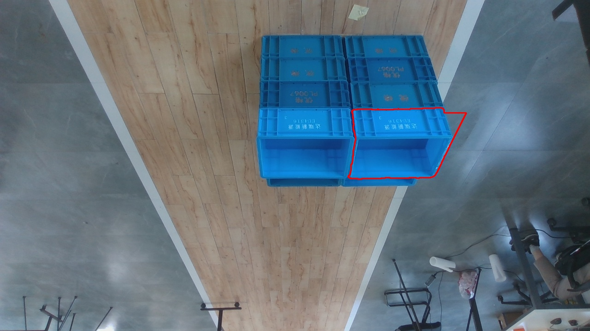
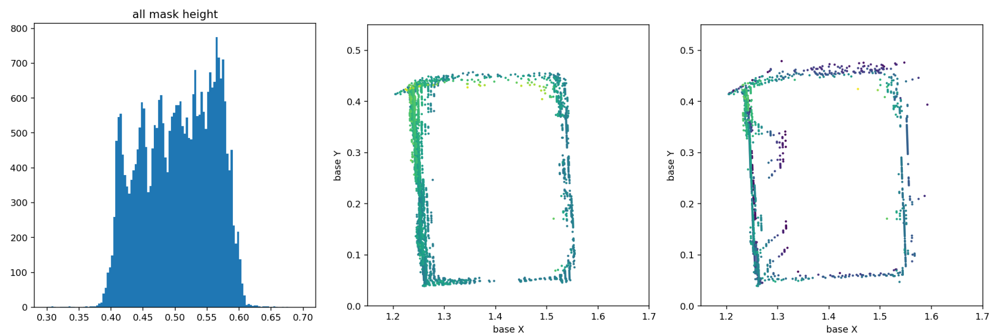
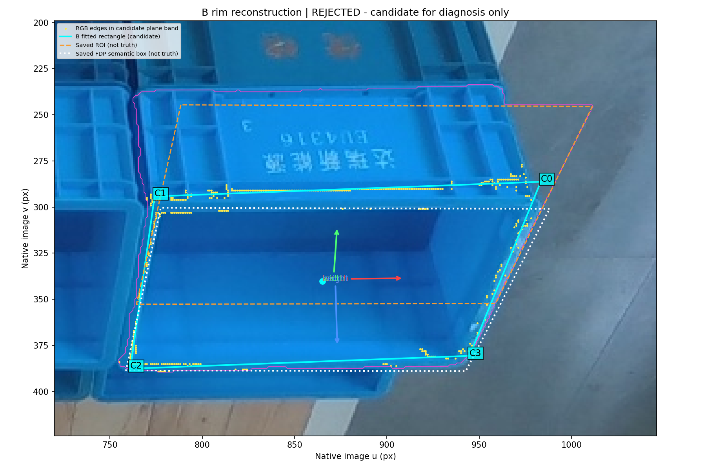
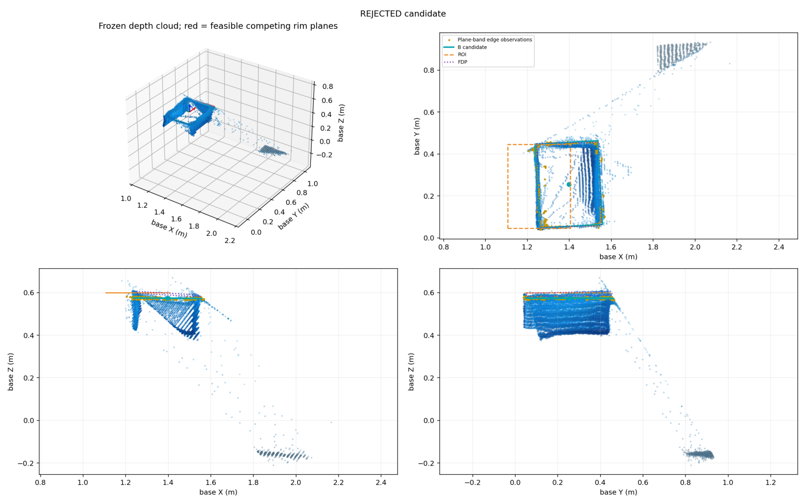
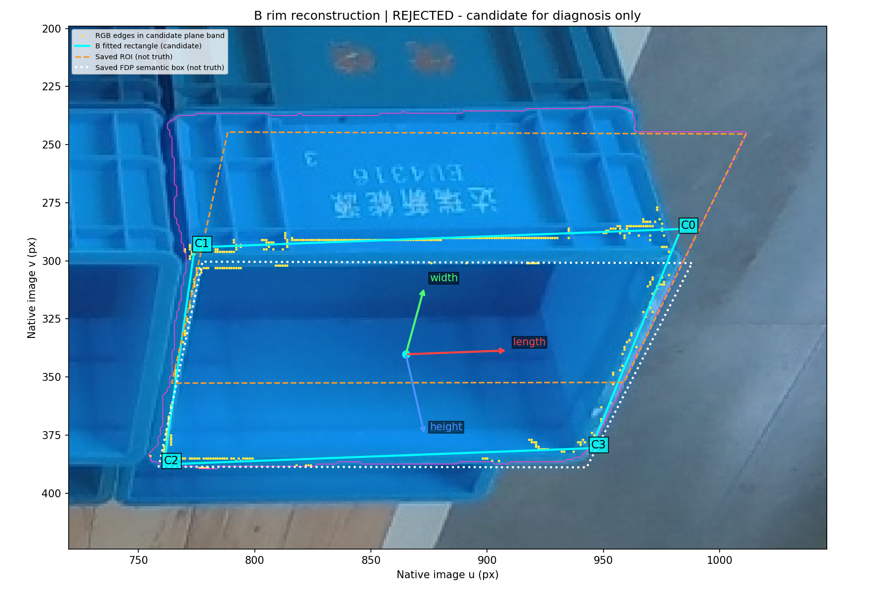
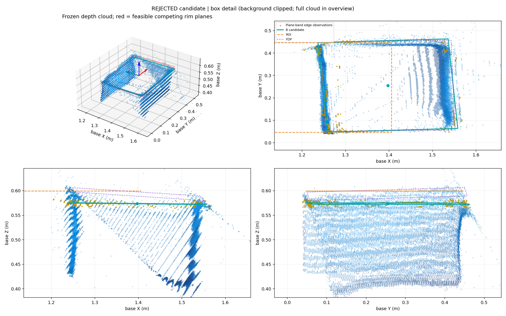
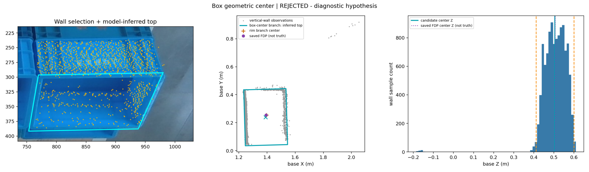
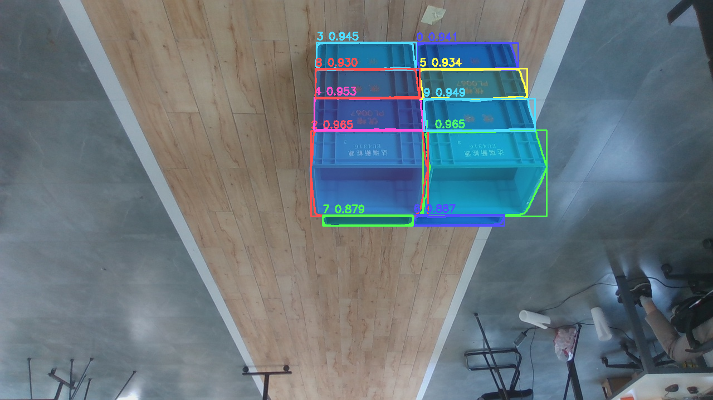
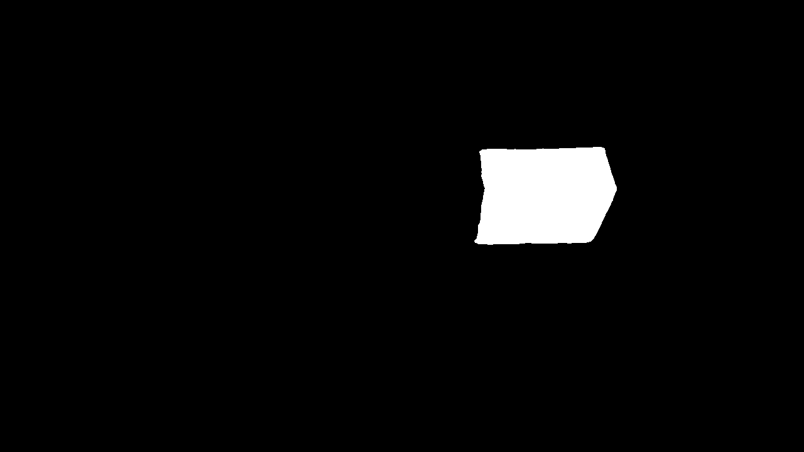
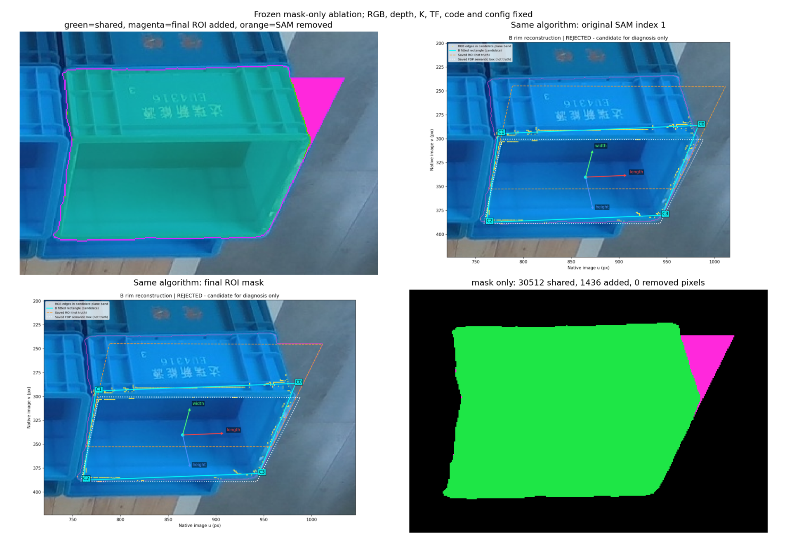

# 9_7 建议用轻量算法替代FDP

- 归档编号：`01a07a67-a824-78c3-ac14-2ac2c473a3a8`
- 项目：S1 IE_lab 拆垛
- 创建时间：2026-09-07T14:00:32.758000+08:00
- 更新时间：2026-09-07T19:44:51.214000+08:00
- 状态：活动
- 导出范围：用户可见消息与助手可见回复；不含隐藏推理和工具原始输出

## 1. 用户

要不你先给我列出一些替代FDP的技术方案，以及对比他们的实现难度，以及最终的实现效果，综合评估，我来进行选型。
我主要是想 看能不能读到箱体的中心点以及方位，或者是上表面以及范围，从而计算出短边上的机械夹爪的抓取点位，然后控制机械臂抓取。

## 2. 助手（进展）

我会按“能否定位箱体中心、方向和短边抓取点”来比较方案，把完整 6D 位姿和直接提取抓取几何分开评估，并区分预期效果与已经验证的结果。

## 3. 助手（进展）

按你补充的目标，“识别箱口矩形和两个短边的可抓区域”比恢复完整 mesh 位姿更直接，我会把它排在首选。对开口箱，“上表面”应理解为箱沿所在的平面；箱内深度不能当作顶面，短边中点也还需要结合夹爪结构换算成实际抓取位姿。

## 4. 助手

你补充的需求让选型更明确了：**你需要的是“能计算短边抓取点的箱体几何”，不一定必须恢复完整的 FDP mesh 六自由度位姿。**

对于固定规格的 4317 开口箱，只要可靠得到以下信息，就有条件计算抓取目标：

- 箱口中心、长边方向和短边方向；
- 箱沿高度，以及箱体是否倾斜；
- 两条短边的位置与可抓区域。

其中，“上表面”应理解为**箱沿所在的平面与外轮廓**。开口箱中间没有实体顶面，箱底、内壁和箱内物品不能混入顶面拟合。

**一、可选技术方案总表**

下面的效果是针对你们场景的工程预估，**目前都没有经过本项目的精度和成功率验证**。资源负担仅比较位姿后端，不包含 SAM3、LingBot。

| 方案 | 核心方法 | 实现难度 | 端侧计算负担 | 条件满足时能达到的效果 | 我的定位 |
|---|---|---|---|---|---|---|
| **A. ROI 几何直接输出** | 点云主方向、包围矩形、尺寸约束 | 低 | 很低 | 粗中心、方向、范围 | 快速对照、提供初值 |
| **B. 箱沿/角点 + RGB-D 矩形拟合** | 找箱口边缘，恢复三维矩形 | 中 | 低 | 箱口中心、四角、短边位置，可直接生成抓取参考 | **最贴近当前需求** |
| **C. 多平面/侧壁拟合** | 提取侧面，结合长宽高恢复箱体 | 中偏高 | 低～中 | 中心、朝向、倾斜、侧面位置 | 侧视场景或辅助 B |
| **D. 几何初值 + ICP 精修** | B/C 给初值，再对齐模型与点云 | 中偏高 | 中 | 在有效几何充分时进一步精修位姿 | B/C 的可选增强 |
| **E. 专用关键点检测 + PnP** | 检测箱角或把手关键点，再求位姿 | 高 | 低～中，取决于网络 | 中心、方向、抓取特征位置，降低对完整深度的依赖 | 愿意投入训练时考虑 |
| **F. AprilTag + 固定箱体外参** | 识别标签，再换算箱体与抓取位置 | 低～中 | 很低 | 标签可见时得到身份、位姿和短边位置 | **允许贴标时优先考虑** |
| **G. 专用完整 6D 网络** | 训练 CenterPose 等模型 | 高～很高 | 中～高 | 数据覆盖充分时支持更广视角和物体变化 | 当前不优先 |

**二、各方案真正的难点与预期效果**

**A：直接用 ROI 中心和方向——最快，但不宜直接作为最终抓取方案。**

可以利用分割后的点云，求主方向和包围矩形，再结合箱体尺寸计算短边位置。OpenCV 已提供轮廓、直线和最小包围矩形等基础工具。[官方文档](https://docs.opencv.org/4.13.0/d3/dc0/group__imgproc__shape.html)

难点是：**相机看到的点云中心，经常不是完整箱体中心。** 遮住一半、只看到近侧壁，结果就会偏；图像中的矩形角度也不能直接当作空间 yaw。

你们已有 ROI，可以最低成本建立这个对照，但当前 ROI 与 FDP 中心相差约 137 mm，说明它还需要独立核验。

**B：直接恢复箱口矩形——我最推荐你优先选的方案。**

处理过程是：

> 找到目标箱 → 提取箱口边缘/角点 → 用深度恢复三维几何 → 结合已知长宽拟合矩形 → 输出两个短边及可抓区域。

它的优势是输出直接对应抓取需求，**不必拟合箱体全部表面，也不必依赖高精度完整 mesh**。

主要难点包括：

- 区分箱口的内边与外边；
- 深度边缘噪声、空洞；
- 邻箱边缘混入；
- 部分箱沿被遮挡。

四个角不一定都要可见，但缺失部分需要用尺寸先验推断，并明确标记。若关键约束不足，应拒绝输出。

**预期效果：**当箱口边缘通常可见时，它最有希望以较小计算量得到你需要的中心、方向、范围和短边抓取参考。

**C：拟合侧壁与多个平面——适合侧面比箱口更清楚的视角。**

用 RANSAC 等方法提取侧壁，利用不同侧面的方向、交线和箱体尺寸恢复几何。PCL 已有平面提取实现。[官方教程](https://pointclouds.org/documentation/tutorials/planar_segmentation.html)

优势是能够补充箱口缺失的信息。难点是箱壁上的孔洞、加强筋、内外壁，以及相邻箱体可能产生错误平面。

**只拟合一个平面不够：它不能确定这个平面内的完整箱体位置和范围。** 需要第二个方向的侧面、箱沿或其他约束。

**预期效果：**作为 B 的补充比较有价值；是否适合单独使用，取决于你们腕部相机实际能看到哪些面。

**D：几何初值 + ICP——有潜力增强精度，但不能保证一定比 B 更好。**

ICP 用模型与观测点云的对应关系不断调整位姿。它需要初始对齐，多尺度处理可以改善效率与收敛。[Open3D 文档](https://open3d.org/html/tutorial/t_pipelines/t_icp_registration.html)

实际工程难点集中在：

- 初值已经偏到错误位置；
- 箱体对称导致匹配歧义；
- 模型背面与相机可见表面错误匹配；
- 深度中的箱底、背景被当成外表面；
- 单一平面上“残差很小，但位置仍然偏”。

**预期效果：**几何信息充分时可能提升稳定性和精度；信息不足时，也可能把原本不错的初值修坏。因此应把它作为可开关的精修模块，用实验判断收益。

**E：关键点检测 + PnP——把训练投入集中在箱角或把手上。**

训练一个小模型识别箱角、短边中点或把手关键点，再利用已知三维位置和相机内参求姿态，也可联合深度优化。PnP 的基础接口已有成熟实现。[OpenCV 文档](https://docs.opencv.org/4.13.0/d5/d1f/calib3d_solvePnP.html)

难点主要在标注与训练，而不是 PnP 本身：角点编号、遮挡、对称、光照变化都要处理。

**预期效果：**如果箱沿深度长期不好，但 RGB 特征清楚，这条路线值得考虑。若抓取必须对准把手或特殊结构，它可能比单纯拟合外矩形更合适。

**F：AprilTag——允许贴标时，工程投入通常最省。**

在箱体固定位置贴标签，标定标签到箱体的变换；识别标签后，直接换算箱体中心和短边位置。AprilTag 官方实现支持位姿估计。[官方仓库](https://github.com/AprilRobotics/apriltag)

优势是同时解决“是哪一个箱体”和“箱体在哪里”。难点是标签遮挡、贴附误差、标签尺寸和相机标定。标签装在可变形或位置不固定的区域，会直接影响抓取位置。

**预期效果：**在可控实验环境、标签稳定可见时，非常适合快速建立抓取闭环；但它依赖对箱体做标记。

**G：训练完整 6D 网络——当前投入偏大。**

例如 CenterPose 类方法，从 RGB 预测物体位姿。[官方实现](https://github.com/NVlabs/CenterPose)

它适合后续物体类型、姿态和视角明显增加的需求。对当前固定箱体短边抓取，数据、训练和部署成本较高，不建议作为第一轮选型。

**三、获得箱口后，怎样计算短边抓取点**

定义：

- \(c\)：箱口**外矩形**中心；
- \(u\)：沿长边的单位方向；
- \(L\)：箱体外长。

两条短边的中点就是：

\[
q_1=c+\frac{L}{2}u,\qquad q_2=c-\frac{L}{2}u
\]

**注意：短边位于长轴两端，所以这里用的是长 \(L\)。** 对长 400 mm 的箱体，两点分别位于中心沿长轴正负 200 mm 处。

但这两个点只是几何参考。实际抓取还需要确定：

- 从箱沿向下抓多少、是否需要避开加强筋或对准把手；
- 夹爪朝向、接近方向与张开宽度；
- 接触位置到夹爪 TCP 的偏移；
- 两个位置如何分配给左右臂。

所以感知模块最好输出“**短边可抓区间 + 朝向 + 可信度**”，再由抓取模块计算 TCP 位姿。中心和方向准确，并不自动等于抓取点可用。

**四、怎样判断最终效果，而不是只看图像叠加**

我建议按以下指标选型：

| 指标 | 对抓取的意义 |
|---|---|
| 两侧抓取参考的位置误差 | 夹爪是否对准箱沿/把手 |
| 方向与法向误差 | 夹爪是否歪着接近、夹持 |
| 静止场景重复抖动 | 每次感知是否给出稳定目标 |
| 错误接受率与拒绝率 | 算错时能否识别，正常场景是否经常失败 |
| 整链 p95 耗时与内存 | 在 OrinX 实际负载下能否使用 |

方向误差尤其不能忽略：**对 400 mm 长箱体，即使中心完全准确，yaw 偏 3°，短边中点也会偏约 10.5 mm。** 因此不能只验收中心点。

目前没有独立真值和夹爪容差数据，不适合承诺“某方案达到几毫米、成功率多少”。

**我的综合排序是：**

- **不允许贴标、箱口通常可见：选 B，必要时增加 C；D 通过对照证明有收益后再加入。**
- **允许贴标、希望尽快建立可重复闭环：选 F。**
- **深度长期不可靠、愿意标注训练：选 E。**
- A 保留为快速基线；G 暂缓。

整条链端侧运行还需分别处理 SAM3 和 LingBot 的外部依赖。上述比较及抓取点计算关系已补入[选型文档](../../assets/74f773e518de7e8f--s1_lightweight_pose_replacement_advice_20260907.md)，当前尚未选型或执行机器人动作。

[附件：74f773e518de7e8f--s1_lightweight_pose_replacement_advice_20260907.md](../../assets/74f773e518de7e8f--s1_lightweight_pose_replacement_advice_20260907.md)

## 5. 用户

查到的核心结论是：FDP 不直接选择抓取点。FDP 只输出箱体的 4×4 位姿；双臂 TCP 的抓取、预抓和抬升目标由后续的固定几何规则与人工标定偏移生成。[当前 Mode 00 审计记录 (line 879)](../../assets/9532a89bcd51d69d--knowledge_base.md:879)

流程可以分成两层。

第一层是“选哪一个箱子”：
```css
SAM3 mask
  ↓
mask + 深度生成 ROI 点云
  ↓
BEV 投影、最大轮廓、minAreaRect
  ↓
匹配 4317 尺寸模板
  ↓
按 (-center_world[2], center_world[1]) 排序
  ↓
取第一个 ROI
```

也就是：

1. 顶面高度 `Z` 越高越优先；
2. 高度相同时，`base_link` 下的 `Y` 越小越优先；
3. 取排序后的第一项；
4. 再检查它是否是 `4317/H4`。

它不是按 FDP 选箱，也不是按 SAM 置信度最高、面积最大或距离最近来选。第一次粗感知和第二次 FDP 精感知会重新各选一次，第一次的实例 ID 没有可靠传递给第二次，所以理论上可能两次选中不同的物理箱体。

第二层是“箱子选定后，双臂抓哪里”：
```
FDP 箱体位姿
  ↓
转换为 4317 语义长/宽/高轴
  ↓
固定 180° 对称方向
  ↓
叠加左右 TCP 标定偏移
  ↓
生成双臂 pre-grasp / grasp / lift
```

当前部署审计记录的有效规则是：

- 箱体尺寸固定为 `0.40 × 0.30 × 0.175 m`；
- 左 TCP 标定偏移：`[-35, -50, 0] mm`；
- 右 TCP 标定偏移：`[-35, +50, 0] mm`；
- 两侧末端姿态的 RPY 被强制为零；
- 从预抓位沿箱体接近轴向内移动 `100 mm` 得到抓取位；
- 从抓取位沿 `base_link +Z` 抬升 `100 mm` 得到提升位。

因此，之前的“抓取点”本质上不是从点云中重新搜索一个最佳接触点，而是：
```diff
箱体语义中心
+ 箱体方向
+ 左右固定 TCP 偏移
+ 预抓/内收/抬升距离
```

在本地保存的历史抓取生成代码中，还能看到更底层的几何构造。它先把箱体位姿变换到左臂基座：
```ini
pose_bin_base_left = Tcam2base_left @ Tleftcam2head @ pose_bin
```

然后：

- 选与 `base_link ±Y` 最接近的箱体轴作为夹爪横向轴；
- 从其余轴中选最接近 `base_link +Z` 的轴作为接近方向；
- 用叉乘构造夹爪姿态；
- 名义抓取位置为：
```markdown
grasp_pos = bin_center \
          + eef_z * (box_length / 2) \
          - target_y * (0.7 * box_height + 0.01)
```

对于 `0.4 × 0.3 × 0.175 m` 箱体，后面的高度项是：
```
0.7 × 0.175 + 0.01 = 0.1325 m
```

历史代码随后还叠加了经验修正：
```makefile
left  += -eef_x * 0.17 + eef_y * 0.07 + eef_z * 0.01
right = 镜像左臂姿态，再沿箱体方向移动一整个长度
```

预抓位在历史版本中是左右分别沿接近轴偏移 `120 mm`，提升位沿另一条轴偏移 `110 mm`。具体代码见[历史抓取几何实现 (line 124)](/home/lsy03/GalbotS1文件/260611_sjtu_workbin_movement/test_project/源代码/DualMobManip/realman_grasp_lesstime_gb.py:124)，其中抓取位置从[第 202 行 (line 202)](/home/lsy03/GalbotS1文件/260611_sjtu_workbin_movement/test_project/源代码/DualMobManip/realman_grasp_lesstime_gb.py:202)开始，预抓和提升位分别在[第 233 行 (line 233)](/home/lsy03/GalbotS1文件/260611_sjtu_workbin_movement/test_project/源代码/DualMobManip/realman_grasp_lesstime_gb.py:233)和[第 246 行 (line 246)](/home/lsy03/GalbotS1文件/260611_sjtu_workbin_movement/test_project/源代码/DualMobManip/realman_grasp_lesstime_gb.py:246)。

这里存在一个版本差异：当前 9 月 3 日部署审计记录的是 `[-35, ±50, 0] mm`、内收 `100 mm`、抬升 `100 mm`；本地 6/7 月历史 helper 使用的是 `170/70/10 mm`、预抓 `120 mm`、提升 `110 mm`。这两个版本不能直接混用。当前远端脚本这次因 SSH 公钥认证失败没能重新读取，所以应以部署快照对应的目标 JSON 和源码 SHA 为准，不能把历史 helper 当作当前脚本的逐字节实现。

对后续 ICP 替代最重要的是：ICP 只需要替代“箱体位姿估计”部分，最终双臂抓取点的生成规则仍然可以保留。也就是说，ICP 输出必须继续遵守现有的：
```
4317 语义轴
→ 180° 对称约定
→ 左右 TCP 偏移
→ pre-grasp / grasp / lift
```

否则即使 ICP 算出的箱体位姿正确，机械臂目标也可能发生轴向或左右手错误。


目前是这样确定预抓取位的。


要不我们先来试试“B：直接恢复箱口矩形——我最推荐你优先选的方案。” 先给我制定计划，先别操作，谋定而后动

[附件：9532a89bcd51d69d--knowledge_base.md](../../assets/9532a89bcd51d69d--knowledge_base.md)

## 6. 助手

可以。**先把 B 做成独立的离线位姿后端：从箱口恢复矩形，再转换成现有的 4317 语义位姿，保留后续抓取目标生成规则。** 本轮只制定计划，不读取文件、不修改代码、不连接机器人或运行实验。

根据你提供的审计，实验边界定为：

```text
冻结 RGB-D + 目标 mask + K + 拍摄时刻 TF
                    ↓
        B：箱口矩形几何估计
                    ↓
        4317 语义中心、长宽高轴
                    ↓
        现有 180° 对称归一化
                    ↓
    T_base_link_from_4317_semantic
                    ↓
  后续离线验证：原版本抓取规则生成 TCP
```

**一、先明确这次要证明什么**

核心问题是：

> 在现有右腕拍摄视角下，能否根据箱沿的实际观测，稳定恢复完整箱口的位置与方向，并输出符合现有接口的箱体位姿？

这次不重新设计抓取策略。你列出的当前部署规则与历史 helper 分开保存，后续只使用**源码 SHA、配置和目标 JSON 能对应起来的同一版本**。

另一个关键点是：原 ROI 已经使用 BEV 和 `minAreaRect`。因此 B 不能只是把原 ROI 输出改个名字，而应增加：

- 对箱口外沿的明确识别；
- 对箱底、内壁和邻箱点的排除；
- 对矩形边缘观测的拟合与检查；
- 对“实际看见”和“尺寸先验补出来”的区分。

**二、第一阶段：冻结输入、接口与评估依据**

先使用已经保存、人工确认过目标的 9 月 7 日案例，不新增采集。

| 项目 | 计划 |
|---|---|
| 目标实例 | 固定为已确认的那个箱体，不重新排序选箱 |
| 图像与深度 | 保存原始 RGB、raw 深度、LingBot 深度，分别标记 |
| mask | 同时保留原始 SAM mask 与最终 ROI mask |
| 坐标信息 | 使用该帧内参和拍摄时刻 TF |
| 模型约定 | 核对 4317 长宽高、语义原点、轴向和对称规则 |
| 参照结果 | 保存现有 ROI、FDP 输出，但均不当作真值 |

**阶段产物：输入清单与坐标合同。**

这里优先核实两个问题：

1. 最终 ROI mask 是否已经裁掉部分真实箱沿，或引入了由原 ROI 推断出来的边界？
2. 现有语义原点是否确实位于箱体几何中心，箱口外沿与该原点之间如何对应？

如果第一点存在问题，B 的主几何拟合不能盲目依赖最终 ROI mask。

**三、第二阶段：实现最小箱口几何后端**

拟分为五步。

**① 提取目标附近的有效观测**

用 mask 限定目标范围，结合深度有效性、空间连通性和局部几何排除明显背景。

不直接把所有 mask 内点取平均，也不把它们全部视为顶面点。开口箱中央的深度可能来自箱底、内壁或后方物体。

**② 寻找箱口外沿及其所在平面**

结合两类信息：

- RGB 中的边缘、直线与角点；
- 深度中的空间边缘、局部表面方向与高度分布。

开口箱的箱沿可能很窄，不能简单选择“点数最多的平面”，否则可能选到箱底或侧壁。

若箱沿深度缺失，可以研究用邻近有效表面确定平面，再将图像边缘投影到该平面；这部分须标记为推断，不能等同于直接深度观测。

**③ 在箱口平面内拟合已知尺寸矩形**

将候选边缘转换到平面坐标中，拟合：

- 两组互相垂直的边；
- 外长、外宽；
- 箱口中心和长短轴方向。

先使用匹配的固定尺寸约束，减少自由度，同时检查观测是否支持该尺寸，不能把任何轮廓强行套成 4317。

**④ 处理遮挡与歧义**

第一版优先支持箱沿较完整的情况，随后再增加部分遮挡。

对于缺失边：

- 可由已知尺寸推断，但必须记录哪些边是推断的；
- 只有一条边、无法确定矩形位于哪一侧等情况，应输出无效；
- 同时存在多个合理矩形时，保留候选及歧义，不能仅因残差最小就接受。

**⑤ 输出几何结果与诊断**

至少输出：

```text
箱口中心 c_top
长轴 u、短轴 v、向上法向 n
外长 L、外宽 W
四角与两条短边
各边的观测支持情况
拟合残差、歧义、有效性及拒绝原因
```

**阶段产物：可离线运行的 B 后端，以及 RGB/点云上的几何叠加图。**

**四、第三阶段：转换成现有 FDP 后端合同**

如果核实语义原点为箱体中心、箱高为 \(H\)，则：

\[
c_{\text{box}}=c_{\text{top}}-\frac{H}{2}n
\]

再由长轴、短轴、高度轴构造旋转矩阵，生成完整 4×4 位姿。

此处要专门检查：

- 长宽轴不能交换；
- 三个轴正交且构成右手系；
- 高度轴方向正确；
- 使用拍摄时刻 TF 转到 `base_link`；
- 只执行一次现有 180° 对称归一化；
- **B 若直接输出语义轴，就不能再次套用 FDP mesh→语义轴转换。**

对于倾斜处理，建议采用两步：

- 第一版验证直立或小倾斜箱体，并明确姿态约束；
- 数据证明可可靠估计箱沿法向后，再扩大倾斜范围。

不能把“人为固定为竖直”的结果描述成已经测出了 roll/pitch。

**阶段产物：与现有位姿结果兼容的 JSON，加上 B 自身的质量字段。**

**五、第四阶段：分层对照，决定是否值得继续**

先做后端比较，再做输入消融，避免一次改变所有环节。

| 实验 | 固定什么 | 改变什么 | 要回答的问题 |
|---|---|---|---|
| 后端对照 | 同一目标、深度、mask、TF | ROI / B / 已保存 FDP | B 得到了什么不同的几何解释？ |
| 深度对照 | 同一目标、同一 mask | raw / LingBot | 原始深度能否支持箱沿恢复？ |
| mask 对照 | 同一目标、同一深度 | SAM / 最终 ROI mask | 原 ROI 处理是否影响箱沿估计？ |
| 稳定性验证 | 同一算法配置 | 不同冻结帧 | 是否只在一帧上有效？ |

先解释现有约 **137 mm** 的中心差异，不能以“B 更接近 FDP”作为成功标准。

后续多帧数据应覆盖：不同距离、yaw、遮挡、相邻箱、空箱/有物品、箱沿深度缺失。新增采集单独制定方案，不包含在本轮计划执行授权中。

**六、第五阶段：只在离线检查抓取目标**

B 的几何结果通过检查后，才接入**版本已锁定的原抓取生成器**，离线生成左右 TCP 的预抓、抓取和抬升目标。

这一阶段重点检查：

- 左右臂分配是否正确；
- 两侧目标是否仍落在预期短边附近；
- 固定 TCP 偏移是否在正确坐标系中生效；
- 强制 RPY 为零等现有规则如何影响最终目标；
- 位姿的小变化是否造成 TCP 大幅跳变。

先在 RGB、点云和离线机器人模型上显示，不发送运动命令。若当前生成器版本无法核实，就停在语义位姿输出，不借用历史 helper 拼接验证。

**七、验收与停止条件**

暂不预设未经测量的毫米级精度和成功率。验收分三层：

| 层级 | 通过条件 |
|---|---|
| 几何正确 | 外沿、长短轴、中心定义正确；不足观测能够拒绝 |
| 接口正确 | 坐标、单位、语义轴、对称处理一致；离线抓取目标没有左右或轴向错误 |
| 工程可用 | 独立多帧测试下，误差、抖动、错误接受率及耗时满足夹爪与系统预算 |

**如果 B 在清楚可见的箱沿上就持续恢复错误，应先修正几何与输入；如果 B 已正确但精度或稳定性不足，再考虑加 ICP。** ICP 不作为第一版必需项。

建议第一轮只推进到“**单个冻结案例的箱口恢复、语义位姿输出与诊断报告**”，用这个结果决定是否进入多帧验证。这样你可以先判断 B 是否抓住了正确几何，再决定后续投入。

## 7. 用户

我们这个实验叫什么呢？ 我感觉是不是最好独立于之前的“9\_7 分析FDP剥离解耦实验”？

## 8. 助手

对，**建议独立成一个新实验，但复用之前保存的冻结输入与 FDP 基线。** 两个实验的目标不同：

| 实验 | 核心目标 |
|---|---|
| 原来的 **FDP 剥离解耦实验** | 从运动链中拆出 FDP 感知流程，建立可回放的输入输出基线 |
| 新实验 | 验证箱口几何方法能否替代 FDP，输出符合原接口的箱体位姿 |

我推荐正式名称：

**“4317 箱口矩形重建与轻量位姿估计实验”**

这个名字明确了对象、方法与输出，也没有提前宣称“替代成功”或“已实现端侧运行”。

对话可以叫：

**“9_7 箱口几何替代FDP实验”**

实验边界建议这样定义：

```text
原实验冻结数据
      ↓
新实验：箱沿提取 → 矩形重建 → 4317 语义位姿
      ↓
与原 ROI、FDP 结果对照
      ↓
后续：原抓取规则的离线目标验证
```

组织上保持三点：

- **输入复用**：引用原实验数据并锁定哈希，不改原始案例。
- **代码与结果独立**：新算法、配置、诊断图和报告放在新实验目录。
- **输出兼容**：继续输出 `T_base_link_from_4317_semantic`，便于以后替换后端。

建议目录名为 `20260907_bin_rim_pose`。当前只确定命名与组织方式，尚未创建目录或新任务。

## 9. 用户

按刚才确定的 B 方案和实验组织方式，开始第一轮离线实现，不再重复制定总体计划。

实验名称：4317 箱口矩形重建与轻量位姿估计实验。
在当前 S1 仓库中新建独立实验目录：
experiments/20260907\_bin\_rim\_pose

执行要求：

1. 先阅读项目规定的文档，核对现有代码、冻结数据和坐标约定。此前讨论中的技术判断作为待核验假设，不直接视为事实。
2. 复用 FDP 基线实验中已保存、人工确认目标的冻结案例；记录输入路径与哈希，不修改原案例，不覆盖原实验结果。
3. 新算法、配置、测试、诊断图和报告放在新实验目录；已有基线工具优先通过清晰接口复用。
4. 实现箱沿提取、箱口矩形重建和 4317 语义位姿输出，保持 T\_base\_link\_from\_4317\_semantic 的坐标、单位和对称约定。
5. 区分直接观测与尺寸先验推断；观测不足或存在无法消除的歧义时，输出拒绝原因，不强行给出有效位姿。
6. 用同一冻结输入与已保存的 ROI、FDP 结果对照，但不把它们当作真值。

本轮允许修改本地实验代码、运行离线验证并更新实验文档。
不连接机器人、不调用外部感知服务、不修改 third\_party 或生产抓取规则；暂不加入 ICP。

第一轮交付：

- 可复现的离线运行命令；
- 箱口中心、四角、长短轴与语义位姿结果；
- RGB 和点云诊断图；
- 必要的几何与坐标验证；
- 结果报告，说明失败情况、未解决问题及下一步建议。

在上述范围内自主推进，无需逐步询问。遇到影响算法成立或坐标正确性的关键缺失时，说明证据与阻塞。
完成后停在“单个冻结案例的箱口恢复、语义位姿输出与诊断报告”，暂不进入抓取目标接入、多帧采集或真机执行。

## 10. 助手（进展）

我会先核对冻结案例、语义坐标和可复用的基线接口，再在独立目录实现箱沿重建与离线诊断。所有结果写入新实验；观测不足时保留候选和拒绝原因，不强行输出有效位姿。

## 11. 助手

_工具输出图片（原始工具文本未纳入归档）。_


## 12. 助手

_工具输出图片（原始工具文本未纳入归档）。_



## 13. 助手（进展）

冻结案例的哈希和人工目标确认已通过检查。发现最终 ROI mask 包含箱壁、箱内区域和少量背景，不能直接作为箱沿点集；另外，OBJ 文件的原始轴与基线语义轴不同，需要核查 FDP 是否做过居中和轴变换。我会从观测独立提取箱沿，并把这些坐标差异写入审计记录。

## 14. 助手

_工具输出图片（原始工具文本未纳入归档）。_



## 15. 用户

我的意思是你要不先做离线实验，因为现在S1 机器人别人还在调

## 16. 助手（进展）

明白，当前一直是纯离线实验：只读取本机已保存的 RGB-D 和人工确认案例，没有连接 S1 或调用外部感知服务，不会影响别人调试。初版已拟合出矩形候选，但发现不同高度的箱壁截面也可能通过矩形检查；我正在补充箱沿高度和歧义检查，避免把它们误认成箱口。

## 17. 助手（进展）

矩形候选已经重建出来，XY 中心明显更接近保存的 FDP 结果。不过，同一帧中有多个高度或倾角不同的平面都能支撑四边拟合，目前无法可靠区分真正的箱口平面。最终结果会保留候选中心、四角和轴向用于诊断，同时拒绝输出有效位姿；接下来验证坐标转换、拒绝门禁和复现命令。

## 18. 助手

_工具输出图片（原始工具文本未纳入归档）。_





## 19. 助手（进展）

离线实现和 16 项测试已完成，覆盖合成箱口恢复、缺边拒绝、坐标转换、180° 约定和当前帧的歧义拒绝。当前候选箱口中心约为 `[1.3973, 0.2552, 0.5737] m`，但仍有两个竞争平面，因此正式输出保持 `ok=false`，不提供有效位姿矩阵。正在整理诊断图与复现报告。

## 20. 助手

_工具输出图片（原始工具文本未纳入归档）。_





## 21. 用户

如果箱口拟合不好就预测箱体集合中心也行，反正最终精度越高越好实现方式不重要

## 22. 助手（进展）

我按“箱体几何中心”理解。可以，不必限定在箱口拟合：我会在同一个冻结案例上增加一条箱壁几何拟合分支，用已知尺寸估计箱体中心和方向，与箱口方案对照。仍然纯离线、暂不加 ICP；如果高度只能由先验推断，会明确标出，不能因为更接近 FDP 就认定精度更高。

## 23. 助手

_工具输出图片（原始工具文本未纳入归档）。_



## 24. 助手（进展）

箱体几何中心分支也已完成离线对照。它给出的候选中心约为 `[1.3903, 0.2390, 0.5052] m`、yaw 约 `91.61°`，但一条短边的支持不足，壁面高度范围也与当前直立模型不一致，因此同样保留为被拒绝的诊断候选。两条分支和 20 项测试均已完成；我会把结果与限制一起交付，不接入机械臂。

## 25. 用户

现在进行到哪一步？ 进度已经到百分之多少？%

## 26. 助手

**本轮约定的离线实现与报告已完成，交付进度 100%。但“达到可替代 FDP 的可靠精度”尚未通过验证。**

已完成：

- 独立实验目录、冻结输入与哈希核验；
- **箱口矩形重建**、**箱壁几何中心估计**两条分支；
- 候选中心、四角、方向及语义位姿输出；
- RGB、点云诊断图与 ROI/FDP 对照；
- **20 项测试通过**，复现命令和报告已保存。

当前两条分支都能算出候选，但均被质量门禁拒绝：

| 分支 | 尚未解决的问题 |
|---|---|
| 箱口矩形 | 多个平面都能支持矩形，箱沿高度与倾角存在歧义 |
| 箱体几何中心 | 一条短边支持不足，壁面高度与直立模型不一致 |

因此，**现在停在“单帧候选已恢复、问题已定位，尚不能用于抓取”**。全程没有连接 S1，不影响别人调试机器人。

你可以直接查看[第一轮结果报告](../../assets/f028ac5cc7c9d42f--ROUND1_REPORT.md)和[复现说明](../../assets/c9044a19ded0c023--README.md)。

[附件：f028ac5cc7c9d42f--ROUND1_REPORT.md](../../assets/f028ac5cc7c9d42f--ROUND1_REPORT.md)

[附件：c9044a19ded0c023--README.md](../../assets/c9044a19ded0c023--README.md)

## 27. 用户

我现在怀疑是sum效果的问题，如何查看你之前使用的SUM3图像？ 给我命令我去看看

## 28. 助手（进展）

你说的应该是 SAM3。先确认本地冻结案例和感知输出里实际保存了哪些图，再给你一组可以直接复制执行的查看命令。

## 29. 助手

你说的是 **SAM3**。之前 2026-09-07 冻结案例的 SAM3 输出在本机，不需要连接 S1。

直接执行：

```bash
cd /home/lsy03/文档/ChatGPT/S1

xdg-open \
  experiments/20260903_fdp_baseline/outputs/live_perception_20260907_01/common/sam_candidates_overlay.png
```

这张图会把 SAM3 返回的所有候选 mask 叠加到原始 RGB 上。

查看我们后来确认的 **SAM index 1** 原始 mask：

```bash
xdg-open \
  experiments/20260903_fdp_baseline/outputs/live_perception_20260907_01/common/sam_mask_01.png
```

查看原始 RGB：

```bash
xdg-open \
  experiments/20260903_fdp_baseline/captures/right_wrist_20260907_01/rgb.png
```

查看 index 1 经过 ROI 处理后的最终 mask：

```bash
xdg-open \
  experiments/20260903_fdp_baseline/outputs/live_perception_20260907_01/lingbot/roi_mask_overlay.png
```

如果想一次打开这四张：

```bash
cd /home/lsy03/文档/ChatGPT/S1

for f in \
  experiments/20260903_fdp_baseline/captures/right_wrist_20260907_01/rgb.png \
  experiments/20260903_fdp_baseline/outputs/live_perception_20260907_01/common/sam_candidates_overlay.png \
  experiments/20260903_fdp_baseline/outputs/live_perception_20260907_01/common/sam_mask_01.png \
  experiments/20260903_fdp_baseline/outputs/live_perception_20260907_01/lingbot/roi_mask_overlay.png
do
  xdg-open "$f"
done
```

重点先看 `sam_candidates_overlay.png` 和 `sam_mask_01.png`：如果 SAM3 的 index 1 没有完整覆盖目标箱体，后面的 ROI、几何拟合和 FDP 都会受到影响。

## 30. 用户

`sam_candidates_overlay.png`  这个我看分割完有一个多出来的锐利尖角不属于箱体，`sam_mask_01.png`倒是正常的

## 31. 助手（进展）

这个现象很关键。我先核对 overlay 的生成方式和各候选 mask，判断尖角是 index 1 自身的问题，还是多候选叠加造成的视觉现象；只做本地离线检查。

## 32. 助手

_工具输出图片（原始工具文本未纳入归档）。_





## 33. 助手（进展）

已经确认：`sam_candidates_overlay.png` 不是单个 SAM3 mask，它把 10 个候选 mask 和各自的轴对齐检测框全部画在同一张图上。那个锐利尖角可能来自彩色矩形框或邻近候选的轮廓；我再量一下 index 1 与最终 ROI mask 的实际差异。

## 34. 助手

你的观察是对的，但问题更可能不在 `sam_mask_01.png` 本身。

`sam_candidates_overlay.png` 是诊断图，它同时绘制了：

- 10 个 SAM3 候选 mask；
- 每个候选的彩色轮廓；
- 每个候选的轴对齐矩形框；
- 编号和置信度。

所以其中的“锐利尖角”可能是检测框或其他候选轮廓叠加造成的。该图本身不会输入后续算法。

真正值得注意的是：后续使用的最终 ROI mask 并不完全等于 `sam_mask_01.png`。离线比较结果为：

| 项目 | SAM index 1 | LingBot 最终 ROI |
|---|---:|---:|
| 像素数 | 30,512 | 31,948 |
| ROI 新增像素 | — | 1,436 |
| 删除 SAM 像素 | — | 0 |
| IoU | — | 0.9551 |

也就是说，ROI 几何处理在 SAM3 mask 外面又增加了 1,436 个像素。这些新增区域可能把箱体附近的其他深度、侧壁或背景带入点云，进而影响中心和箱沿拟合。

你可以依次查看：

```bash
cd /home/lsy03/文档/ChatGPT/S1

# 原始 SAM3 index 1
xdg-open experiments/20260903_fdp_baseline/outputs/live_perception_20260907_01/common/sam_mask_01.png

# LingBot 分支最终 ROI mask
xdg-open experiments/20260903_fdp_baseline/outputs/live_perception_20260907_01/lingbot/roi_mask_final.png

# 最终 ROI 叠加到 RGB 上
xdg-open experiments/20260903_fdp_baseline/outputs/live_perception_20260907_01/lingbot/roi_mask_overlay.png
```

我的判断是：

```text
SAM3 index 1 看起来正常
          ↓
ROI 几何处理扩张了 mask
          ↓
新增像素可能引入多余点云
          ↓
箱口/箱体中心拟合出现平面和高度歧义
```

因此下一步最有价值的纯离线实验，是保持 RGB、深度、K、TF 和算法完全不变，只做：

```text
原始 sam_mask_01
        对比
最终 roi_mask_final
```

这样可以直接判断当前拟合失败究竟来自 SAM3，还是来自后续 ROI mask 扩张。

## 35. 用户

好的我们开始：“保持 RGB、深度、K、TF 和算法完全不变，只做：
```
原始 sam_mask_01
        对比
最终 roi_mask_final”
```

## 36. 助手（进展）

开始做纯离线 mask 消融：同一冻结案例、同一 LingBot 深度、K、TF、尺寸先验和全部阈值，只把输入 mask 在“原始 SAM index 1”和“最终 ROI mask”之间切换。两条结果分别写入新目录，原案例和已有输出都不修改。

## 37. 助手（进展）

对照入口已经完成，21 项测试通过。已核实原始 SAM index 1 为 30,512 像素，最终 ROI 为 31,948 像素：ROI 只新增了 1,436 像素，没有删掉 SAM 像素。现在用同一版代码和配置分别跑两次，确保唯一变化就是 mask。

## 38. 助手（进展）

初步结果已经很明确：ROI 新增的 1,436 个像素会改变边缘支持门禁，但对候选中心和方向的数值影响很小。两种 mask 下仍然都存在箱沿平面歧义，箱壁中心分支的失败原因也完全相同。我继续把差异量、四边支持和对照图整理成正式报告。

## 39. 助手

_工具输出图片（原始工具文本未纳入归档）。_



## 40. 助手

对照实验已完成。核心结论是：**右上角的大三角不是 SAM3 index 1 产生的，而是后续 ROI mask 扩张产生的。**

原因已经从源码核实：ROI 默认启用 `augment_mask`，把尺寸模板的四个三维角点投影回图像，然后用 `fillPoly()` 把整个投影矩形并入原始 SAM mask。

严格控制变量结果：

| 指标 | 原始 SAM mask | 最终 ROI mask |
|---|---:|---:|
| 像素数 | 30,512 | 31,948 |
| ROI 新增 | — | 1,436 |
| ROI 删除 | — | 0 |
| IoU | — | 0.9551 |

对箱沿拟合的影响：

- 箱体中心变化约 **0.744 mm**
- yaw 变化约 **0.366°**
- 第四条边覆盖率从 **41.7% 提升到 58.3%**
- 两种 mask 仍然都存在 `ambiguous_rim_planes`

箱壁中心分支变化也很小：

- 中心变化约 **1.540 mm**
- yaw 变化约 **0.166°**
- 两种 mask 的拒绝原因完全相同

所以当前判断是：ROI 扩张确实制造了多余三角区域，也会影响边缘门禁；但它不是目前多平面歧义和高度问题的主要原因。后续轻量几何算法更适合使用原始 SAM mask 作为搜索范围，模板补全只作为先验，不能当成真实观测点。


完整结果见：

- [Mask 消融实验报告](../../assets/c782c4d0fe8c609b--MASK_ABLATION_REPORT.md)
- [机器可读对照结果](../../assets/1de349a2d54dabcd--comparison.json)
- [复现说明](../../assets/c9044a19ded0c023--README.md)

21 项离线测试全部通过。全程没有连接 S1、调用外部服务或生成机械臂目标。


[附件：c782c4d0fe8c609b--MASK_ABLATION_REPORT.md](../../assets/c782c4d0fe8c609b--MASK_ABLATION_REPORT.md)

[附件：1de349a2d54dabcd--comparison.json](../../assets/1de349a2d54dabcd--comparison.json)

[附件：c9044a19ded0c023--README.md](../../assets/c9044a19ded0c023--README.md)

## 41. 用户

接下来有什么建议吗，是不是应该直接上ICP？

## 42. 助手

我建议下一步加入 ICP，但不是“直接用全 6D ICP 从零配准”。

更合适的是：

> **现有几何结果生成多个初始候选，再用受约束 ICP 对每个候选评分和精修。**

原因是当前问题并非完全找不到箱体：

- 箱口分支的候选 XY 和 yaw 已经比较稳定；
- 更换 SAM/ROI mask 后，中心只变化约 0.7 mm、yaw 约 0.37°；
- 真正没有解决的是箱沿高度、内外壁归属和多个平面之间的歧义。

普通 ICP 是局部优化。如果直接给它完整 6D 自由度，它可能把模型配准到内壁、侧壁筋条或错误高度，而且残差看起来仍然不错。

下一轮建议这样设计：

```text
原始 SAM index 1 + 同一 LingBot 深度
                ↓
现有箱口/箱壁几何生成多个候选
                ↓
每个候选生成 0° / 180° 对称初值
                ↓
受约束 ICP
只优化 x、y、z、yaw
roll/pitch 保持直立先验
                ↓
比较残差、覆盖率、多个面的支持和候选分差
                ↓
最佳候选明显优于其他候选 → 输出
差距不足 → 拒绝
```

具体建议：

- 使用原始 `sam_mask_01`，不要把 ROI 增加的三角区当作观测。
- 同时保留当前三个箱沿平面候选，不提前选一个。
- ICP 使用完整 4317 mesh 或经过整理的可见表面模型。
- 排除箱内背景、明显地面点和超出合理高度的点。
- 第一版约束为 4DoF：`x、y、z、yaw`。
- 分别尝试 0° 和 180° 对称方向。
- 使用鲁棒损失、最大对应距离和异常点裁剪。
- 不能只看 ICP RMSE，还要看四条边或多个侧面的覆盖率。
- 如果两个候选分数接近，继续输出拒绝，不能强选第一名。

我不建议现在做：

- 单位矩阵初值的全局 ICP；
- 无约束 6DoF ICP；
- 只用单个平面做 point-to-plane ICP；
- 以“更接近 FDP”为 ICP 验收标准。

下一阶段可以命名为：

**“第二轮：4317 受约束多假设 ICP 离线配准”**

继续放在当前[箱口轻量位姿实验](../../assets/c9044a19ded0c023--README.md)里比较合适。它仍属于同一个目标，只是为几何候选增加模型验证和精修。

我的综合判断是：**现在适合上 ICP，但应把 ICP 当成候选判别器和精修器，而不是独立替代整套前处理。**这条路线最有机会解决当前的平面歧义，同时保持 Orin 端的计算量可控。

[附件：c9044a19ded0c023--README.md](../../assets/c9044a19ded0c023--README.md)

## 43. 用户

**C：拟合侧壁与多个平面——适合侧面比箱口更清楚的视角。**

用 RANSAC 等方法提取侧壁，利用不同侧面的方向、交线和箱体尺寸恢复几何。PCL 已有平面提取实现。[官方教程](https://pointclouds.org/documentation/tutorials/planar_segmentation.html)

优势是能够补充箱口缺失的信息。难点是箱壁上的孔洞、加强筋、内外壁，以及相邻箱体可能产生错误平面。

**只拟合一个平面不够：它不能确定这个平面内的完整箱体位置和范围。** 需要第二个方向的侧面、箱沿或其他约束。

\*\*预期效果：\*\*作为 B 的补充比较有价值；是否适合单独使用，取决于你们腕部相机实际能看到哪些面。

**D：几何初值 + ICP——有潜力增强精度，但不能保证一定比 B 更好。**

ICP 用模型与观测点云的对应关系不断调整位姿。它需要初始对齐，多尺度处理可以改善效率与收敛。[Open3D 文档](https://open3d.org/html/tutorial/t_pipelines/t_icp_registration.html)

实际工程难点集中在：

- 初值已经偏到错误位置；
- 箱体对称导致匹配歧义；
- 模型背面与相机可见表面错误匹配；
- 深度中的箱底、背景被当成外表面；
- 单一平面上“残差很小，但位置仍然偏”。

\*\*预期效果：\*\*几何信息充分时可能提升稳定性和精度；信息不足时，也可能把原本不错的初值修坏。因此应把它作为可开关的精修模块，用实验判断收益。


我们还需要试试C吗

## 44. 助手

需要试，而且我建议 **先完成真正的 C，再上 D**。

我们目前做过的箱壁中心分支只是一个简化版：

```text
局部法向筛选近似竖直点
→ 所有壁面点一起投影
→ 固定尺寸矩形拟合
```

它还不是完整的“多平面 RANSAC”。当前它选出了约 1.1 万个竖直壁面像素，但把外壁、内壁、加强筋和噪声混在一起，最终出现：

- 一条短边支持不足；
- 矩形内点比例不足；
- 观测高度范围超过 175 mm 模型高度。

这正好说明有必要尝试真正的 C：**先把不同侧壁分开，再利用平面之间的方向和距离恢复箱体。**

建议下一轮实现：

```text
原始 SAM index 1 + 固定深度
          ↓
提取近竖直表面点
          ↓
多平面 RANSAC
          ↓
按法向聚成两组近似正交的侧壁
          ↓
分析同方向平面的不同偏移
区分内壁 / 外壁 / 加强筋
          ↓
利用 0.40 × 0.30 × 0.175 m 尺寸组合候选
          ↓
恢复中心、长短轴、侧壁范围和上沿高度
          ↓
候选唯一则输出，否则拒绝
```

C 对当前问题有三个价值：

1. 能把当前混在一起的壁面点拆开，解释为什么高度跨度达到约 189 mm。
2. 能直接判断当前视角是否真的提供了两个方向的侧壁约束。
3. 可以为后面的 ICP 提供更可靠的中心、yaw 和表面身份，降低 ICP 对齐到内壁或错误高度的风险。

推荐顺序是：

| 阶段 | 作用 |
|---|---|
| B：箱口矩形 | 提供箱口和顶缘候选 |
| C：多平面侧壁 | 分离内外壁，恢复或验证中心与方向 |
| B+C 融合 | 形成多个有明确来源的初始位姿 |
| D：受约束 ICP | 对候选评分、消除部分歧义并精修 |

如果 C 连两个近似正交的可靠平面族都找不到，那么直接上 ICP 风险会比较高；ICP 很可能只是把错误初值拟合得“残差更漂亮”。如果 C 能得到稳定的平面组合，即便仍有两三个候选，ICP 就很适合做下一步判别。

因此我的建议是：下一阶段叫做 **“第二轮：4317 多平面侧壁分解与几何中心估计”**，继续保持同一冻结帧、原始 SAM mask、无 ICP。完成后再决定第三轮是否加入受约束 ICP。
