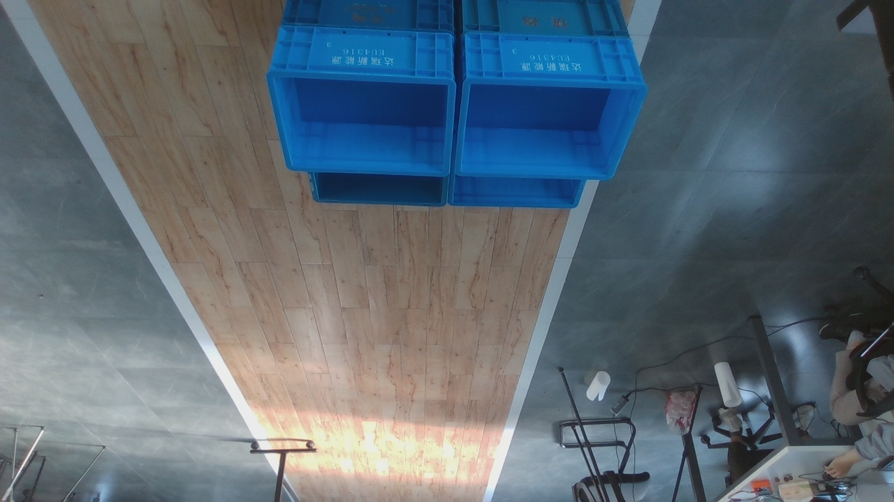
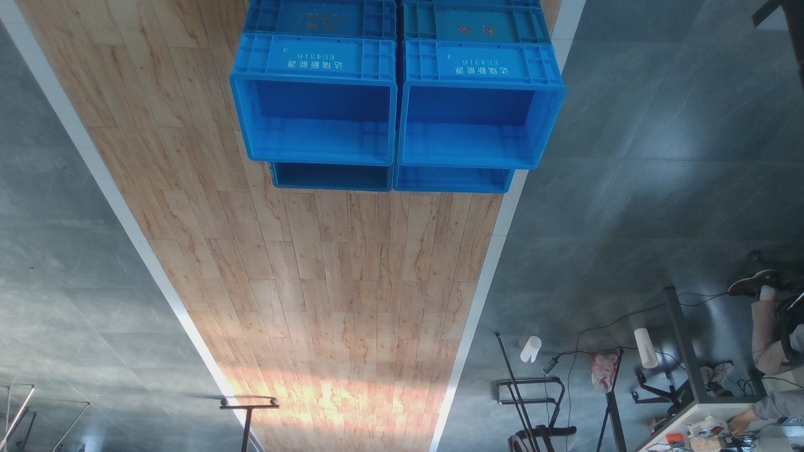
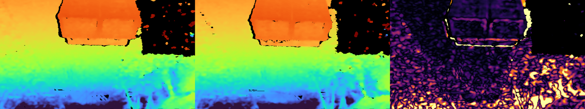

# 添加冻结数据批量采集命令

- 归档编号：`01a07b0e-b072-77d3-aa0d-c6bb88273e6a`
- 项目：S1 IE_lab 拆垛
- 创建时间：2026-09-07T16:49:15.384000+08:00
- 更新时间：2026-09-07T18:28:25.252000+08:00
- 状态：活动
- 导出范围：用户可见消息与助手可见回复；不含隐藏推理和工具原始输出

## 1. 用户

我们在“9\_7 分析FDP剥离解耦实验”的基础上进行 冻结数据的批量采集，先给我一个命令我来实现，先采集一次，验证一下效果如何

## 2. 助手（进展）

我先核对仓库里的实验记录和现有采集脚本，确认命令沿用“9_7 分析FDP剥离解耦实验”的参数与安全边界。这里先只给你单次采集命令，不会连接或控制真机执行。

## 3. 助手

在机器人与箱体保持静止、右腕相机完整看到目标的前提下，在 **S1 shell** 执行：

```bash
cd /home/galbot/Lsy03/fdp_baseline && \
FDP_CAPTURE_ID="right_wrist_D02_$(date +%Y%m%d_%H%M%S_%N)" && \
/home/galbot/ie_lab/bin/s1-python scripts/capture_right_wrist_rgbd_once.py \
  --output-dir "captures/$FDP_CAPTURE_ID" \
  --settle-s 3 \
  --timeout-s 15 \
  --acknowledge-readonly-live-s1 && \
python3 -m json.tool "captures/$FDP_CAPTURE_ID/capture_result.json" && \
printf '\nCAPTURE_ID=%s\n保存目录=%s\n' "$FDP_CAPTURE_ID" "$(pwd)/captures/$FDP_CAPTURE_ID"
```

这条命令只读取右腕 RGB-D、机器人状态和拍摄时刻 TF；不会移动机械臂、夹爪、腰部或底盘，也不会调用 SAM3、LingBot 或 FDP。采集期间不要人工移动设备，保持工作区净空和实体急停可用。

成功时重点确认：

- `"ok": true`
- `"motion_commands_sent": false`
- `depth_valid_ratio` 合理
- 已生成 `rgb.png`、`depth_raw_m.npy`、`intrinsics.npy`、`base_from_camera.npy`

执行后把终端输出发给我，我再帮你核验这次采集，并给出查看 RGB/深度效果的命令。

## 4. 用户

galbot\@galbot-echo:\~$ cd /home/galbot/Lsy03/fdp\_baseline && \


> FDP\_CAPTURE\_ID="right\_wrist\_D02\_$(date +%Y%m%d\_%H%M%S\_%N)" && \
> /home/galbot/ie\_lab/bin/s1-python scripts/capture\_right\_wrist\_rgbd\_once.py \
> \--output-dir "captures/$FDP\_CAPTURE\_ID" \
> \--settle-s 3 \
> \--timeout-s 15 \
> \--acknowledge-readonly-live-s1 && \
> python3 -m json.tool "captures/$FDP\_CAPTURE\_ID/capture\_result.json" && \
> printf '\nCAPTURE\_ID=%s\n保存目录=%s\n' "$FDP\_CAPTURE\_ID" "$(pwd)/captures/$FDP\_CAPTURE\_ID"{
> "schema": "s1.fdp\_baseline.live\_capture\_result.v1",
> "ok": true,
> "output\_dir": "/home/galbot/Lsy03/fdp\_baseline/captures/right\_wrist\_D02\_20260907\_165547\_084851541",
> "files\_sha256": {
> "rgb.png": "e4a9395ff29c270fcede334cec42984bcd8c201ea7cc43382c90cd589abae700",
> "depth\_raw\_m.npy": "803194c534df4a646767f4b974c59b424d0e728763965f695053c49adb62736f",
> "intrinsics.npy": "0d7554b837d90016c02ac7959b0d48be3524f44a4fd0aa074305906032d283ff",
> "base\_from\_camera.npy": "272dc055984f159fe882e1c06d69f427faca5f108eddc4f780d6b61832055078",
> "capture\_meta.json": "fba26bfbf22c1e11f27982092ed4851b6a86b7dabe9db32863b91b5248479f54"
> },
> "rgb\_shape": [
> 720,
> 1280,
> 3
> ],
> "depth\_shape": [
> 720,
> 1280
> ],
> "depth\_valid\_ratio": 0.8601150173611111,
> "frame\_sync\_skew\_ns": 0,
> "api\_call\_trace": [
> "GalbotRobot.init",
> "GalbotMotion.init",
> "GalbotRobot.get\_rgb\_data",
> "GalbotRobot.get\_depth\_data",
> "GalbotRobot.get\_camera\_intrinsic",
> "GalbotMotion.get\_robot\_states",
> "GalbotRobot.get\_sensor\_extrinsic",
> "GalbotRobot.get\_transform",
> "GalbotRobot.destroy"
> ],
> "motion\_commands\_sent": false
> }
> {
> "api\_call\_trace": [
> "GalbotRobot.init",
> "GalbotMotion.init",
> "GalbotRobot.get\_rgb\_data",
> "GalbotRobot.get\_depth\_data",
> "GalbotRobot.get\_camera\_intrinsic",
> "GalbotMotion.get\_robot\_states",
> "GalbotRobot.get\_sensor\_extrinsic",
> "GalbotRobot.get\_transform",
> "GalbotRobot.destroy"
> ],
> "depth\_shape": [
> 720,
> 1280
> ],
> "depth\_valid\_ratio": 0.8601150173611111,
> "files\_sha256": {
> "base\_from\_camera.npy": "272dc055984f159fe882e1c06d69f427faca5f108eddc4f780d6b61832055078",
> "capture\_meta.json": "fba26bfbf22c1e11f27982092ed4851b6a86b7dabe9db32863b91b5248479f54",
> "depth\_raw\_m.npy": "803194c534df4a646767f4b974c59b424d0e728763965f695053c49adb62736f",
> "intrinsics.npy": "0d7554b837d90016c02ac7959b0d48be3524f44a4fd0aa074305906032d283ff",
> "rgb.png": "e4a9395ff29c270fcede334cec42984bcd8c201ea7cc43382c90cd589abae700"
> },
> "frame\_sync\_skew\_ns": 0,
> "motion\_commands\_sent": false,
> "ok": true,
> "output\_dir": "/home/galbot/Lsy03/fdp\_baseline/captures/right\_wrist\_D02\_20260907\_165547\_084851541",
> "rgb\_shape": [
> 720,
> 1280,
> 3
> ],
> "schema": "s1.fdp\_baseline.live\_capture\_result.v1"
> }

CAPTURE\_ID=right\_wrist\_D02\_20260907\_165547\_084851541
保存目录=/home/galbot/Lsy03/fdp\_baseline/captures/right\_wrist\_D02\_20260907\_165547\_084851541
galbot\@galbot-echo:\~/Lsy03/fdp\_baseline$

给我看下，这个能用吗

## 5. 助手

能用。它已经通过“原始冻结数据采集”门禁：

- RGB/深度尺寸匹配：`1280×720`
- 深度有效率：`86.01%`，很好
- RGB/深度时间差：`0 ns`
- K、拍摄时刻 TF、RGB、深度和元数据均已冻结并生成 SHA-256
- `motion_commands_sent:false`，未发送运动命令
- 调用记录全部是初始化、状态/传感器读取和销毁

终端出现两份 JSON 是正常的：脚本自己打印一次，随后 `json.tool` 又打印了一次。

但目前只能确认“采集数据技术上有效”，还不能确认箱体是否完整入镜、是否遮挡，以及深度是否覆盖目标。请在本机终端复制这次采集：

```bash
cd /home/lsy03/文档/ChatGPT/S1/experiments/20260903_fdp_baseline

scp -r \
  galbot@10.34.216.17:/home/galbot/Lsy03/fdp_baseline/captures/right_wrist_D02_20260907_165547_084851541 \
  captures/
```

然后打开 RGB：

```bash
xdg-open /home/lsy03/文档/ChatGPT/S1/experiments/20260903_fdp_baseline/captures/right_wrist_D02_20260907_165547_084851541/rgb.png
```

把图片发给我，我再判断它能否作为有效的 D02 标称重复样本；先不要运行 SAM3/LingBot/FDP。



## 6. 用户

是否多采集几帧的深度和RGB图像会比较好？

## 7. 助手

会更好，但要区分两类“多帧”：

- 同一姿态连续采 3 帧：用于评估深度噪声、空洞、RGB稳定性和时间同步。当前计划中的 D01/D02/D03 就是这个用途。
- 改变距离和视角后分别采集：这才增加数据覆盖度，对几何/ICP算法更重要。

建议现在保持机器人、箱体和环境完全不动，再采一帧作为 D03。这样先得到同姿态重复组，再检查三帧之间：

- RGB目标位置是否稳定；
- 深度有效率和目标区域空洞是否稳定；
- TF是否稳定；
- 后续 ROI/FDP/轻量算法输出的抖动程度。

不要快速连续采很多帧并把它们当成独立样本；同姿态连拍主要用于重复性分析。每帧仍需单独保存 RGB、深度、K、拍摄时刻 TF 和唯一 `CAPTURE_ID`，也不要直接平均深度——应先确认相机和目标严格静止，再离线测试中值融合。

当前合理顺序是：再采 D03 → 查看 D02/D03 图像 → 比较采集元数据 → 确认质量后再开始稍近、稍远、左右视角等独立采集。

## 8. 用户

现在的采集模式你觉得还有什么需要修改的吗？

是否我重新运行之前的命令“ cd /home/galbot/Lsy03/fdp\_baseline && \\
FDP\_CAPTURE\_ID="right\_wrist\_D02\_$(date +%Y%m%d\_%H%M%S\_%N)" && \\
/home/galbot/ie\_lab/bin/s1-python scripts/capture\_right\_wrist\_rgbd\_once.py \\
&#x20; \--output-dir "captures/$FDP\_CAPTURE\_ID" \\
&#x20; \--settle-s 3 \\
&#x20; \--timeout-s 15 \\
&#x20; \--acknowledge-readonly-live-s1 && \\
python3 -m json.tool "captures/$FDP\_CAPTURE\_ID/capture\_result.json" && \\
printf '\nCAPTURE\_ID=%s\n保存目录=%s\n' "$FDP\_CAPTURE\_ID" "$(pwd)/captures/$FDP\_CAPTURE\_ID"”

就可以继续采集了？

## 9. 助手

可以继续采集，当前单帧模式暂时不需要修改。它已有唯一目录、只读接口、时间同步检查、深度有效率检查、TF检查和控制锁。

但不要原样重复，因为它会把新帧继续标成 `D02`。下一帧同姿态重复应改成 `D03`。在 S1 shell 执行：

```bash
cd /home/galbot/Lsy03/fdp_baseline && \
FDP_CAPTURE_ID="right_wrist_D03_$(date +%Y%m%d_%H%M%S_%N)" && \
/home/galbot/ie_lab/bin/s1-python scripts/capture_right_wrist_rgbd_once.py \
  --output-dir "captures/$FDP_CAPTURE_ID" \
  --settle-s 3 \
  --timeout-s 15 \
  --acknowledge-readonly-live-s1 && \
python3 -m json.tool "captures/$FDP_CAPTURE_ID/capture_result.json" && \
printf '\nCAPTURE_ID=%s\n保存目录=%s\n' \
  "$FDP_CAPTURE_ID" "$(pwd)/captures/$FDP_CAPTURE_ID"
```

采集前保持底盘、双臂、夹爪、腰部和箱体静止；该命令本身不会移动任何设备。

后续正式批量采集前，我建议再补一个批量包装脚本，自动记录：

- `D04/D05/...`等计划编号和场景标签；
- 目标箱实例与现场备注；
- 帧间隔；
- 每帧成功/失败汇总；
- RGB与深度预览图；
- 禁止重复编号、禁止覆盖已有数据。

不过现在先采 D03 更合适。D03 成功后，先比较 D02/D03，再决定是否进入视角变化采集。

## 10. 用户

是不是我每次只需要吧D03这种往后改一位就行了？其他不需要动

## 11. 助手

对，当前采集阶段每次只需修改编号，其他参数保持不变：

```bash
FDP_CAPTURE_ID="right_wrist_D03_$(date +%Y%m%d_%H%M%S_%N)"
```

下一次依次改为 `D04`、`D05`……但编号必须对应采集计划中的实际场景：

- `D02–D03`：标称姿态、不移动机器人和箱体
- `D04`：稍近
- `D05`：稍远
- `D06`：左侧视角
- `D07`：右侧视角
- `D08–D09`：左右斜视
- `D10`：更换另一只 H4 箱
- 之后是 `H01`、`H02`、`R01–R03`，不是继续写 `D11`

时间戳会保证目录唯一，不需要修改 `settle-s`、`timeout-s` 或其他参数。注意：场景变化只能由现场人员安全摆位；这条采集命令本身不会移动设备。

## 12. 用户

galbot\@galbot-echo:\~/Lsy03/fdp\_baseline$ cd /home/galbot/Lsy03/fdp\_baseline && \


> FDP\_CAPTURE\_ID="right\_wrist\_D03\_$(date +%Y%m%d\_%H%M%S\_%N)" && \
> /home/galbot/ie\_lab/bin/s1-python scripts/capture\_right\_wrist\_rgbd\_once.py \
> \--output-dir "captures/$FDP\_CAPTURE\_ID" \
> \--settle-s 3 \
> \--timeout-s 15 \
> \--acknowledge-readonly-live-s1 && \
> python3 -m json.tool "captures/$FDP\_CAPTURE\_ID/capture\_result.json" && \
> printf '\nCAPTURE\_ID=%s\n保存目录=%s\n' \
> "$FDP\_CAPTURE\_ID" "$(pwd)/captures/$FDP\_CAPTURE\_ID"
> {
> "schema": "s1.fdp\_baseline.live\_capture\_result.v1",
> "ok": true,
> "output\_dir": "/home/galbot/Lsy03/fdp\_baseline/captures/right\_wrist\_D03\_20260907\_170359\_732494930",
> "files\_sha256": {
> "rgb.png": "bebaa714648e3cc925f85700397a099a7fc734e58dff02ad6f1c004ec86de9ed",
> "depth\_raw\_m.npy": "087e03853ca0a5b1ef22e4c26ec86711f7d316a463aa3ea36a09dc623904ecca",
> "intrinsics.npy": "0d7554b837d90016c02ac7959b0d48be3524f44a4fd0aa074305906032d283ff",
> "base\_from\_camera.npy": "a0948ff898c896098c22aac19888835dec7a433fe5b1ef9f2de158eb5992b6d7",
> "capture\_meta.json": "3c5908a9c5ba1e419fdf47d0ead6a80c27cbd11ef632ac0d5a4936800060e6cb"
> },
> "rgb\_shape": [
> 720,
> 1280,
> 3
> ],
> "depth\_shape": [
> 720,
> 1280
> ],
> "depth\_valid\_ratio": 0.8605533854166667,
> "frame\_sync\_skew\_ns": 0,
> "api\_call\_trace": [
> "GalbotRobot.init",
> "GalbotMotion.init",
> "GalbotRobot.get\_rgb\_data",
> "GalbotRobot.get\_depth\_data",
> "GalbotRobot.get\_camera\_intrinsic",
> "GalbotMotion.get\_robot\_states",
> "GalbotRobot.get\_sensor\_extrinsic",
> "GalbotRobot.get\_transform",
> "GalbotRobot.destroy"
> ],
> "motion\_commands\_sent": false
> }
> {
> "api\_call\_trace": [
> "GalbotRobot.init",
> "GalbotMotion.init",
> "GalbotRobot.get\_rgb\_data",
> "GalbotRobot.get\_depth\_data",
> "GalbotRobot.get\_camera\_intrinsic",
> "GalbotMotion.get\_robot\_states",
> "GalbotRobot.get\_sensor\_extrinsic",
> "GalbotRobot.get\_transform",
> "GalbotRobot.destroy"
> ],
> "depth\_shape": [
> 720,
> 1280
> ],
> "depth\_valid\_ratio": 0.8605533854166667,
> "files\_sha256": {
> "base\_from\_camera.npy": "a0948ff898c896098c22aac19888835dec7a433fe5b1ef9f2de158eb5992b6d7",
> "capture\_meta.json": "3c5908a9c5ba1e419fdf47d0ead6a80c27cbd11ef632ac0d5a4936800060e6cb",
> "depth\_raw\_m.npy": "087e03853ca0a5b1ef22e4c26ec86711f7d316a463aa3ea36a09dc623904ecca",
> "intrinsics.npy": "0d7554b837d90016c02ac7959b0d48be3524f44a4fd0aa074305906032d283ff",
> "rgb.png": "bebaa714648e3cc925f85700397a099a7fc734e58dff02ad6f1c004ec86de9ed"
> },
> "frame\_sync\_skew\_ns": 0,
> "motion\_commands\_sent": false,
> "ok": true,
> "output\_dir": "/home/galbot/Lsy03/fdp\_baseline/captures/right\_wrist\_D03\_20260907\_170359\_732494930",
> "rgb\_shape": [
> 720,
> 1280,
> 3
> ],
> "schema": "s1.fdp\_baseline.live\_capture\_result.v1"
> }

CAPTURE\_ID=right\_wrist\_D03\_20260907\_170359\_732494930
保存目录=/home/galbot/Lsy03/fdp\_baseline/captures/right\_wrist\_D03\_20260907\_170359\_732494930
galbot\@galbot-echo:\~/Lsy03/fdp\_baseline$


现在是否有问题？

## 13. 助手

目前没有发现采集问题，D03 技术上有效：

- `ok:true`
- RGB/深度均为 `1280×720`
- 深度有效率 `86.055%`
- RGB/深度时间差 `0 ns`
- 相机内参哈希与 D02 完全一致
- `motion_commands_sent:false`
- 所有冻结文件及 SHA-256 均已生成

D02 深度有效率为 `86.012%`，D03 为 `86.055%`，仅相差约 `0.044` 个百分点，整体非常稳定。RGB、深度和 TF 哈希不同是正常的：不同采集时刻的数据即使场景静止，也会有传感器噪声或微小数值变化。

仍需确认两点：

1. D02/D03 的 TF 数值是否足够接近，证明相机姿态确实稳定。
2. RGB 中箱体是否完整入镜，以及目标区域深度是否良好。

因此 D03 可以保留。建议现在先不要进入 D04，先把 D02/D03 复制回本机查看和比较；终端中两份相同 JSON 仍是脚本与 `json.tool` 各打印一次，并非重复采集。

## 14. 用户

给我检查一下相关文件

## 15. 助手（进展）

我会只读检查 S1 上 D02/D03 的采集目录、元数据、哈希、TF 数值差异、深度统计和两帧图像差异；不会调用相机、SDK、推理服务或任何运动接口，也不会保留 SSH 会话。

## 16. 助手（进展）

现有 `/tmp/g1_codex_mux_20260907` 虽然显示为活动连接，但复制时远端报告两个目录都不存在，说明这个复用连接可能不是刚才采集所在的 S1 会话，或其路径上下文已变化。我先只读核对该连接的主机名和采集目录，避免误判。

## 17. 助手

本机没有 D02/D03 文件；现有旧 SSH 复用连接虽然返回 `galbot-echo`，但看不到 `/home/galbot/Lsy03/fdp_baseline`，不能用它可靠检查。

你是否明确授权我新建一次到 `galbot@10.34.216.17` 的只读 SSH 连接，复制 D02/D03 到本机临时目录并检查 RGB、深度、TF、元数据和哈希？全程不会调用 SDK、推理服务或运动接口，也不会发送任何机械臂、夹爪、腰部或底盘命令。

## 18. 用户

给我命令我来授权

## 19. 用户

umask 077

ssh -fN -M \\
&#x20; -S /tmp/s1\_codex\_mux\_20260902\_rviz \\
&#x20; -o ControlPersist=2h \\
&#x20; -o ServerAliveInterval=5 \\
&#x20; -o ServerAliveCountMax=2 \\
&#x20; galbot\@10.34.216.17
类似这种

## 20. 助手

可以。在本机终端执行下面的命令，建立只用于本次文件检查的 SSH 复用连接：

```bash
(
  umask 077
  ssh -fN -M \
    -S /tmp/s1_fdp_check_mux_20260907 \
    -o ControlPersist=2h \
    -o ServerAliveInterval=5 \
    -o ServerAliveCountMax=2 \
    galbot@10.34.216.17
)
```

输入密码后，用下面的命令确认连接：

```bash
ssh -S /tmp/s1_fdp_check_mux_20260907 \
  -O check \
  galbot@10.34.216.17
```

看到 `Master running` 后告诉我“已授权”。我将只读取并临时复制 D02/D03 文件进行检查，不调用 SDK、推理或运动接口。

检查结束后可断开：

```bash
ssh -S /tmp/s1_fdp_check_mux_20260907 \
  -O exit \
  galbot@10.34.216.17
```

## 21. 用户

已授权

## 22. 助手（进展）

收到。我现在通过你建立的连接只读检查 D02/D03：先确认目录和文件完整性，再复制到临时目录计算哈希、TF/关节状态差异、深度稳定性，并直接查看两张 RGB 和深度预览。不会访问控制接口。

## 23. 助手（进展）

结构与哈希都完整，D02/D03 的相机位姿也几乎不变（约 0.014 mm、0.0024°）。不过全图共同有效深度的差异比预想大；这可能主要来自远处背景、无效深度边界或场景中动态物体，不能仅凭全图统计判定。我正在直接查看两张 RGB，并生成同尺度深度/差分图定位差异区域。

## 24. 助手

_工具输出图片（原始工具文本未纳入归档）。_




## 25. 助手

_工具输出图片（原始工具文本未纳入归档）。_



## 26. 用户

算了要不别看了，我继续收集数据了

## 27. 助手

好的，已停止检查，没有修改 S1 上任何文件，也没有调用 SDK、推理或运动接口。D02、D03 均已通过采集门禁，可以保留。

继续采集时注意：`D04` 开始不只是改编号，还要按计划改变场景；D04 是稍近、D05 是稍远。摆位涉及机器人时需由你现场安全操作并保持急停可用，全部静止后再运行同一采集命令。

## 28. 用户

cd /home/galbot/Lsy03/fdp\_baseline && \\
FDP\_CAPTURE\_ID="right\_wrist\_D04\_$(date +%Y%m%d\_%H%M%S\_%N)" && \\
/home/galbot/ie\_lab/bin/s1-python scripts/capture\_right\_wrist\_rgbd\_once.py \\
&#x20; \--output-dir "captures/$FDP\_CAPTURE\_ID" \\
&#x20; \--settle-s 3 \\
&#x20; \--timeout-s 15 \\
&#x20; \--acknowledge-readonly-live-s1 && \\
python3 -m json.tool "captures/$FDP\_CAPTURE\_ID/capture\_result.json" && \\
printf '\nCAPTURE\_ID=%s\n保存目录=%s\n' \\
&#x20; "$FDP\_CAPTURE\_ID" "$(pwd)/captures/$FDP\_CAPTURE\_ID"

现在我们采集完的数据是否有FDP的数据？

## 29. 助手

没有。你现在这条 D04 命令只采集并冻结原始观测数据：

- `rgb.png`
- `depth_raw_m.npy`
- `intrinsics.npy`
- `base_from_camera.npy`
- `capture_meta.json`
- `capture_result.json`

其中 `base_from_camera.npy` 是拍摄时刻的相机外参，不是 FDP 箱体位姿。

目前尚未产生：

- SAM3 候选 mask
- LingBot 补全深度
- ROI 结果及最终 mask
- FDP 请求与原始响应
- `T_camera_from_fdp_mesh`
- `T_base_link_from_4317_semantic`
- FDP 可视化框图

正确流程是先完成全部原始 RGB-D 采集，再批量运行 `SAM3 → LingBot → ROI`。每帧检查并确认目标后，才能分别调用 FDP 生成参考结果。这样能避免采集过程中因多候选或误选目标而把错误 FDP 结果混入数据集。

## 30. 用户

也行

## 31. 助手

好的，就按这个顺序继续：

1. 先完成各场景的原始 RGB-D 冻结采集。
2. 每个编号只对应计划中的实际场景。
3. 采集结束后统一检查 RGB、深度、K 和 TF。
4. 再批量运行 SAM3、LingBot 和 ROI。
5. 逐帧人工确认目标后，再调用 FDP 生成参考位姿。

采集命令本身不会产生 FDP 数据，也不会控制机器人运动。

## 32. 助手

_历史投影中的图片引用（用于补全本地对话资源）。_

> 资源未归档：`/tmp/s1_fdp_check_60vHP5/right_wrist_D02_20260907_165547_084851541/rgb.png`（missing）

> 资源未归档：`/tmp/s1_fdp_check_60vHP5/right_wrist_D03_20260907_170359_732494930/rgb.png`（missing）

> 资源未归档：`/tmp/s1_fdp_check_60vHP5/depth_d02_d03_diff.png`（missing）
