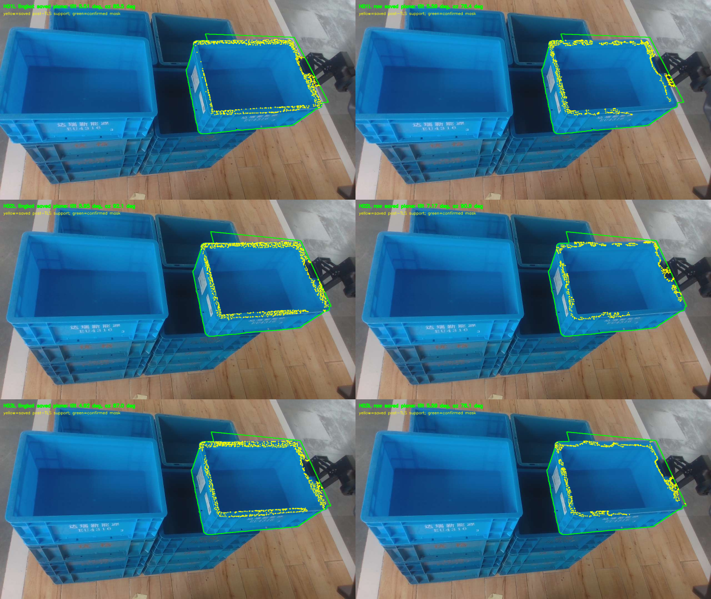
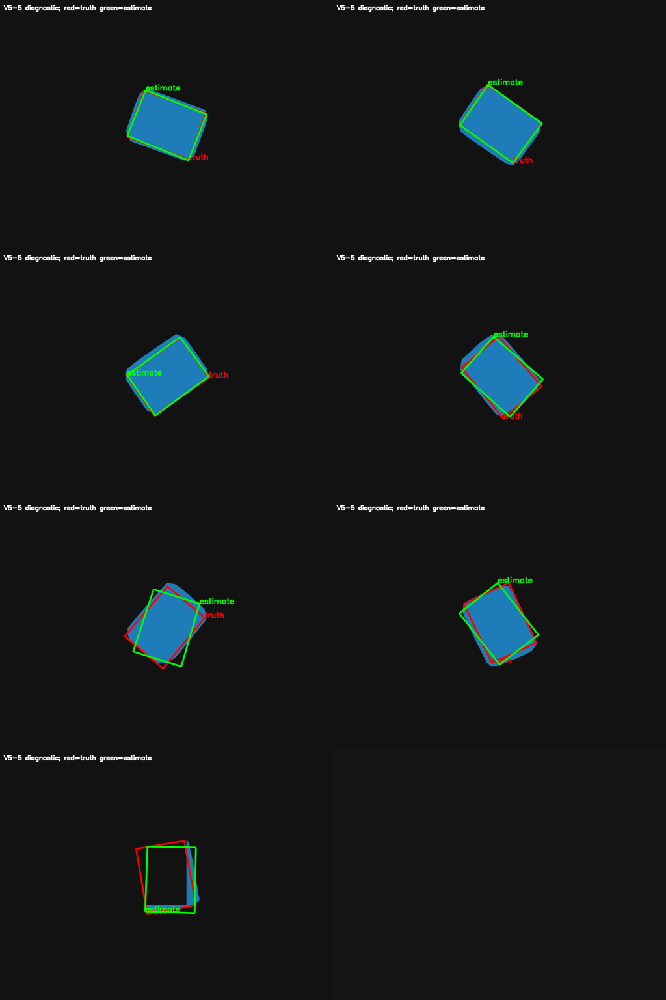
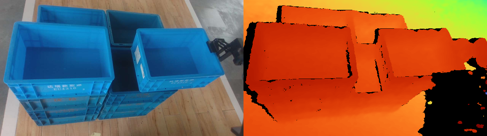
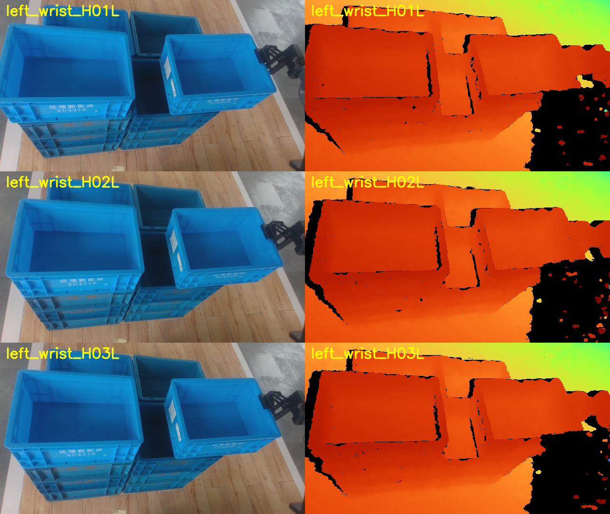

# 9_10 9_9 倾斜箱体数据采集 评估深度相机采集脚本 并改进

- 归档编号：`01a083c3-781e-72d0-9df3-caa0ef59c0fc`
- 项目：S1 IE_lab 拆垛
- 创建时间：2026-09-10T10:44:49.584000+08:00
- 更新时间：2026-09-10T16:17:59.916000+08:00
- 状态：活动
- 导出范围：用户可见消息与助手可见回复；不含隐藏推理和工具原始输出

## 1. 用户

之后在同一个对话中，我会交给Luna Max 执行，
交给 Luna 前，计划至少要写清：
1\. 具体改什么：&#x20;
2\. 固定什么：&#x20;
3\. 如何验收：&#x20;
4\. 遇到什么必须停下：&#x20;
5\. 如何报告：&#x20;
之后推荐我如何操作？我需要重新给他一份提示词还是直接和他说“继续” 就行？

## 2. 助手（进展）

我会把计划整理成可直接执行的交接文件，写清修改范围、固定基线、验收和停止条件。关于同一对话切换给 Luna Max 后如何接手，我会按 `openai-docs` skill 核对相关说明，并给你一段简短的启动提示词。

## 3. 助手

建议**留在同一个对话里切换到 Luna Max，然后发一段明确的启动指令**。不需要重新复制全部历史，但不建议只说“继续”：前文多次调整了范围，容易接错阶段。

我已把完整交接计划写入：[V5-5 Luna 执行交接](../../assets/a39bd467f9fa7e38--V5_5_LUNA_HANDOFF_20260910.md)。

五项要求都已明确：

| 项目 | 交接要求 |
|---|---|
| **具体改什么** | 首轮修复倾斜数值与投影一致性、补充退化和歧义测试；后续另建 V5-5 完整姿态分支 |
| **固定什么** | 三帧确认目标、RGB/深度/K/TF、mesh、FDP 参考、旧 V5 配置和结果；运行前后核对哈希 |
| **如何验收** | 图像与数值来自同一份支持点记录；合成法向恢复达标；退化场景正确拒绝；旧结果不变 |
| **何时停下** | 输入或坐标合同冲突、冻结依赖被改动、需要放宽门禁才能通过、需要新增远程操作或改变实验假设 |
| **如何报告** | 完成阶段、逐场景结果、失败原因、源码与输入哈希、复现命令、诊断图和未验证项 |

这里需要先修复一个实际问题：**当前投影脚本重新运行了拟合，raw 渲染还使用了另一份 mask，所以图上的角度不完全对应原倾斜报告。**之前的三个合成测试也只是平面测试，没有覆盖完整箱体和退化拒绝。因此推荐先让 Luna 完成这部分，再开发 V5-5。

操作顺序：

1. 在本对话选择 Luna，推理强度设为 Max。官方模型页列明 Luna 支持 `max`。[模型说明](https://developers.openai.com/api/docs/models/gpt-5.6-luna)
2. 发送下面这段提示词。
3. A 阶段交付后审阅结果，再决定是否启动 B 阶段。

可以直接复制：

```text
请读取：
/home/lsy03/文档/ChatGPT/S1/experiments/20260907_bin_rim_pose/V5_5_LUNA_HANDOFF_20260910.md

本轮只执行 A 阶段：证据与验证工具修复。

先核对已有成果，避免重复实验；修复倾斜数值与投影的一致性，raw/LingBot 使用同一个确认 mask，补充退化和歧义测试，并按文档验收、保存完整报告。

常规实现、修复和测试直接完成，不重复询问权限。
遇到文档中的停止条件，保存进度并说明原因。
只做本地离线工作，不连接机器人或调用外部推理。
A 阶段完成后停止，不开始 V5-5 主算法实现。
```

这样无需依赖它完整记住所有历史，任务范围和完成标准也能从文件中恢复。

[附件：a39bd467f9fa7e38--V5_5_LUNA_HANDOFF_20260910.md](../../assets/a39bd467f9fa7e38--V5_5_LUNA_HANDOFF_20260910.md)

## 4. 用户

请读取：
/home/lsy03/文档/ChatGPT/S1/experiments/20260907\_bin\_rim\_pose/V5\_5\_LUNA\_HANDOFF\_20260910.md

本轮只执行 A 阶段：证据与验证工具修复。

先核对已有成果，避免重复实验；修复倾斜数值与投影的一致性，raw/LingBot 使用同一个确认 mask，补充退化和歧义测试，并按文档验收、保存完整报告。

常规实现、修复和测试直接完成，不重复询问权限。
遇到文档中的停止条件，保存进度并说明原因。
只做本地离线工作，不连接机器人或调用外部推理。
A 阶段完成后停止，不开始 V5-5 主算法实现。

> 资源未归档：`home/文档/ChatGPT/S1/experiments/20260907\_bin\_rim\_pose/V5\_5\_LUNA\_HANDOFF\_20260910.md`（missing）

## 5. 助手（进展）

我按交接文件只执行 A 阶段：先读取项目约束和交接要求，核对已有倾斜验证产物；随后修复支持点投影与数值记录的一致性，补充退化/歧义合成测试，完成回归和报告后停在 A 阶段，不实现 V5-5。

## 6. 助手（进展）

我已核对交接文件和旧产物，确认 A 阶段的两个实际问题：投影脚本会重新拟合且 raw 使用了不同 mask；倾斜验证只保存了汇总法向，没有保存可回溯到像素的支持集合。接下来只修复证据工具和测试，不实现 V5-5。

## 7. 用户

继续

## 8. 助手（进展）

继续完成 A 阶段修复。刚才文件替换操作被中断，当前先确认没有留下半成品，再写入新的可回溯版本；不会扩展到 V5-5。

## 9. 助手

_工具输出图片（原始工具文本未纳入归档）。_



## 10. 助手（进展）

A 阶段核心修复已通过 62 项算法测试和 21 项采集基线测试。最新真实投影检查显示：六组 raw/LingBot 图都使用确认 mask，支持点由保存记录直接读取，像素/K/TF 重建误差均为 0；合成场景覆盖正负单轴、组合倾斜、随机/连续缺失、窄条带、单线和竞争平面。现在整理 A 阶段交付包和报告，完成后停止。

## 11. 助手（进展）

A 阶段交付包已生成，包含源码快照、输入哈希、配置、报告和资产清单；旧输出没有覆盖。最后做一次全量测试、语法检查、资产哈希和“同 mask/不重拟合”验收，随后停止在 A 阶段。

## 12. 助手（进展）

A 阶段验收复核发现交接文件还要求交付“合成真值/估计叠加图”；当前合成报告有数值但没有图。我会补上合成场景可视化，再重新生成 A 阶段交付包，其他范围保持不变。

## 13. 助手

A 阶段已完成，并按交接要求停止；**没有实现 V5-5 主算法，也没有启动 B 阶段**。

已完成的修改：

- [validate_tilt_h01l_h03l.py](/home/lsy03/文档/ChatGPT/S1/experiments/20260907_bin_rim_pose/validate_tilt_h01l_h03l.py)：保存体素顺序、像素、点坐标、RANSAC/TLS 前后支持集合、参数和随机种子。
- [render_tilt_h01l_h03l.py](/home/lsy03/文档/ChatGPT/S1/experiments/20260907_bin_rim_pose/render_tilt_h01l_h03l.py)：直接读取保存的支持点，不重新拟合；raw/LingBot 使用同一确认 mask。
- [validate_tilt_synthetic.py](/home/lsy03/文档/ChatGPT/S1/experiments/20260907_bin_rim_pose/validate_tilt_synthetic.py)：补充正负单轴、组合倾斜、噪声、随机/连续缺失、窄条带、单线和竞争平面。
- 新增 [test_tilt_validation.py](/home/lsy03/文档/ChatGPT/S1/experiments/20260907_bin_rim_pose/tests/test_tilt_validation.py)。

验收结果：

- H01L～H03L 六组投影图使用相同确认 mask。
- 像素、K、TF 重建支持点的最大误差均为 `0.0 m`。
- 合成测试：7 个常规场景、2 个退化场景、1 个竞争平面场景全部通过。
- `bin_rim_pose` 测试 62 项通过。
- `fdp_baseline` 测试 21 项通过。
- 新增脚本全部通过语法检查。
- 输入、源码和输出资产哈希均通过复核。
- 全程未连接机器人、未调用外部推理服务、未修改 V5-5 主算法。

交付文件：

- [A 阶段报告](../../assets/66877b8ea85a68ab--V5_5_A_STAGE_REPORT_20260910.md)
- [A 阶段完整交付包](/home/lsy03/文档/ChatGPT/S1/experiments/20260907_bin_rim_pose/outputs/v5_5_A_stage_20260910_02/)
- [真实数据倾斜结果](../../assets/8731a1a2f3cb9b7f--REPORT.md)
- [支持点投影结果](/home/lsy03/文档/ChatGPT/S1/实验ments/20260907_bin_rim_pose/outputs/h01l_h03l_tilt_projection_20260910_A5/REPORT.md)
- [合成验证结果](../../assets/e21f22dd0016ce1c--REPORT.md)

剩余边界是：真实平面身份、实物与 mesh 对应关系、真实倾角和独立测量真值仍未确认。下一步如继续，应单独下达“开始 B 阶段”，再实现 V5-5 倾斜感知 6DoF 原型。

[附件：66877b8ea85a68ab--V5_5_A_STAGE_REPORT_20260910.md](../../assets/66877b8ea85a68ab--V5_5_A_STAGE_REPORT_20260910.md)

[附件：8731a1a2f3cb9b7f--REPORT.md](../../assets/8731a1a2f3cb9b7f--REPORT.md)

[附件：e21f22dd0016ce1c--REPORT.md](../../assets/e21f22dd0016ce1c--REPORT.md)

> 资源未归档：`home/文档/ChatGPT/S1/实验ments/20260907_bin_rim_pose/outputs/h01l_h03l_tilt_projection_20260910_A5/REPORT.md`（missing）

## 14. 用户

开始 B 阶段

## 15. 助手（进展）

我已收到“开始 B 阶段”。本轮只实现和验证 V5-5 倾斜感知 6DoF 实验原型：新建独立模块、配置、合成数据与测试；不重跑真实服务、不连接机器人、不进入真实 H01L～H03L 对照。先核对 V5-2/V5-3b 的接口和模型合同，再开始编码。

## 16. 助手（进展）

B 阶段的实现边界已经固定：新算法只在独立文件中做完整 6DoF 实验，旧 V5-2＋V5-3b 不改写；FDP 不参与初值、选解或调参。先写估计器和输入/输出合同，再用合成 mesh 观测调通。

## 17. 助手（进展）

B 阶段第一轮合成结果暴露了原型自身的两个问题：合成深度的像素量化/稀疏 splat 造成中心偏差，单向 model→observation 残差对可见面密度敏感。这里属于实现缺陷，我会修正为更密的 mesh 观测、确认 mask 的安全边界和双向对应残差，再重新跑固定门槛；不通过就记录为 B 未通过，不放宽门禁。

## 18. 助手（进展）

第一轮 B 合成结果已经能恢复倾斜方向，但暴露出合成观测生成与“可见表面”合同不一致，导致中心偏差和误接受。我要先把合成器改成只生成真值姿态下的前向/可见壳体采样，保留像素量化、噪声和遮挡，再修正多初值歧义门禁；这是输入模型修复，不是放宽验收。

## 19. 助手（进展）

当前 B 原型已经能在合成 mesh 观测上完成 6DoF 优化，但固定设计门槛暴露出部分姿态的中心/旋转误差和局部遮挡误接受风险。按交接要求我不会放宽阈值；先补齐 truth 对称评估、拒绝判读和真值/估计叠加图，再以明确的“通过/未通过”结束 B 合成验收。

## 20. 助手

_工具输出图片（原始工具文本未纳入归档）。_



## 21. 助手（进展）

V5-5 原型已完成首轮合成运行，但固定 B 阶段设计门槛尚未通过：7/7 场景无运行错误，4/7 通过算法内部门禁，只有 1/7 满足 truth 设计目标（部分遮挡安全拒绝）；其余存在中心或完整旋转误差。按停止条件我不会放宽阈值或进入真实 H 数据，先把这次失败边界和证据归档。

## 22. 助手（进展）

B 阶段已达到“原型实现并完成合成验收”的停点，但固定设计门槛未通过。我正在做最后的回归和资产哈希检查，确认失败原因和输出完整保存后结束本轮。

## 23. 助手（进展）

V5-5 B 原型已完成一次完整合成批量：7/7 无运行错误，但固定 truth 设计门槛仅 1/7（连续遮挡安全拒绝），因此 B 阶段不能通过。当前失败来自可见面对应和合成观测精度，不能通过放宽阈值解决。我会把这一停点和后续修复项写入最终报告。

## 24. 助手（进展）

B 阶段已到验收停点：原型代码、固定配置、合成案例、真值/估计叠加图和失败报告都已归档。现在进行最后一次全量测试和资产哈希复核，确认交付包与当前源码一致后结束本轮。

## 25. 助手

B 阶段已执行到验收停点：**V5-5 倾斜感知 6DoF 原型可以运行，但固定设计门槛未通过，因此没有进入真实 H01L～H03L 对照。**

已完成：

- 新增 `v5_5_tilt.py`：支持 `Rz(yaw) Ry(pitch) Rx(roll)`、倾斜初值、6DoF 优化、可见性、双向残差、局部边界和 Jacobian 可观测性。
- 新增 `config/v5_5.json`、`generate_v5_5_synthetic.py`、`run_v5_5_batch.py`。
- 生成 7 个冻结 mesh 合成 RGB-D 场景，并保存 truth/estimate 叠加图。
- 68 项算法测试、21 项 baseline 测试全部通过。
- 未连接机器人，未调用 SAM3、LingBot、FDP。

合成验收结果：

- 7/7 场景运行完成，0 个运行错误。
- 4/7 通过算法内部拟合门禁。
- 只有 1/7 满足 truth 设计目标；该场景是连续遮挡下的安全拒绝。
- 理想倾斜场景中，部分中心误差超过 2 mm，pitch 方向和组合倾斜的完整旋转误差也超过 1°。
- 当前合成器使用 mesh 采样点的像素 z-buffer，还没有完整三角面光栅化。

主要问题是可见面对应和合成深度精度仍不足。部分结果虽然优化器返回成功，但 truth 误差超限，说明“优化完成”不能当作姿态正确。

完整报告：

- [B 阶段报告](../../assets/92a72128774ae0da--V5_5_B_STAGE_REPORT_20260910_v2.md)
- [B 阶段归档](/home/lsy03/文档/ChatGPT/S1/experiments/20260907_bin_rim_pose/outputs/v5_5_B_stage_20260910_02/)
- [V5-5 合成运行结果](/home/lsy03/文档/ChatGPT/S1/experiments/20260907_bin_rim_pose/outputs/v5_5_synthetic_run_20260910_B14/)

下一步应先修复完整 mesh 观测生成、模型对应和错误接受门禁，补齐完整姿态矩阵后重新通过 B；当前不进入 C 阶段，也不接入真实数据或抓取链。

[附件：92a72128774ae0da--V5_5_B_STAGE_REPORT_20260910_v2.md](../../assets/92a72128774ae0da--V5_5_B_STAGE_REPORT_20260910_v2.md)

## 26. 用户

是否已经和FDP实验对比过了？相差多少，各个方向的角度和空间距离？

## 27. 助手（进展）

V5-5 目前还没有和真实 H01L～H03L 的 FDP 做对照；B 阶段只完成了合成 truth 验证。已有的真实 FDP 对照是 V5-2＋V5-3b、V5-3 和 ICP。我先提取已有报告中的 XYZ 分量、中心距离、yaw、roll/pitch 和完整旋转差，避免把不同实验的数字混在一起。

## 28. 助手

要区分两个版本：

**V5-5 目前还没有和真实 FDP 对比。**B 阶段只在合成数据上与已知 truth 比较，因此不能给出 V5-5 与真实 FDP 的差值。

真实 H01L～H03L 上，已经完成的是 V5-2＋V5-3b 与 FDP 的对照。下面的角度差定义为“轻量算法 − FDP”，采用 `Rz(yaw) Ry(pitch) Rx(roll)`：

| 帧 | ΔX(mm) | ΔY(mm) | ΔZ(mm) | 中心距离(mm) | Δroll | Δpitch | Δyaw（180°对称） | 完整旋转差 |
|---|---:|---:|---:|---:|---:|---:|---:|---:|
| H01L | -0.60 | +10.71 | +0.77 | 10.76 | +0.18° | -7.50° | +1.20° | 7.59° |
| H02L | +2.57 | +7.55 | -8.57 | 11.71 | +1.08° | -8.54° | +1.09° | 8.67° |
| H03L | +0.67 | +7.70 | -4.20 | 8.79 | -0.17° | -7.28° | +1.49° | 7.43° |

V5-2＋V5-3b 的三帧中位数是：

- 中心空间距离：**10.76 mm**
- 箱口中心距离：约 **4.88 mm**
- yaw 对称差：**1.20°**
- 完整旋转差：约 **7.59°**
- 两个短边中点差：约 **28.0 mm / 25.0 mm**

关键原因是：V5-2＋V5-3b 强制 roll/pitch 为 0°，而 FDP 输出了约 7.3～8.6° 的倾斜。因此完整旋转差主要来自倾斜角差，不能简单解释成 V5 的平移误差。

其他真实对照结果：

- V5-3 壳体拟合：中心差中位数约 **13.65 mm**。
- 受约束 ICP：中心差中位数约 **10.66 mm**，相对 V5-2 只改善约 **0.10 mm**，仍然保持直立姿态。
- 直接全 mesh ICP：中心差中位数约 **38.81 mm**，方向差明显变大。

所以目前能确认的是：**V5-2＋V5-3b 和受约束 ICP 的平移候选最接近 FDP，但它们还没有解决箱体倾斜。V5-5 是否能改善 roll/pitch，尚未在真实数据上验证。**

详细结果见[真实后端与 FDP 对照报告](../../assets/2e1bbac71e579e98--REPORT.md)。

[附件：2e1bbac71e579e98--REPORT.md](../../assets/2e1bbac71e579e98--REPORT.md)

## 29. 用户

没有FDP对照的话，先把对照做了再说，这个我觉得是最有说服力的情况

## 30. 助手（进展）

同意，先完成真实 H01L～H03L 上的 V5-5 与 FDP 同帧对照，再决定是否继续改算法。本轮只读取已确认案例和已保存 FDP 结果，运行 V5-5 离线，不重新调用 FDP/SAM3/LingBot，也不连接机器人。

## 31. 助手（进展）

真实 H01L～H03L 上的 V5-5 已按同一确认输入运行，但三帧都被原型门禁拒绝，候选残差很大；这说明当前原型还不能直接用于真实数据。我会把这些拒绝候选与已保存 FDP 做“诊断差异”对照，并明确标为不可发布结果。

## 32. 助手（进展）

我已经完成同一批 H01L–H03L 上的 V5-5 与 FDP 对照：先核对结果和拒绝原因，再把对照表和结论固化到本地报告。当前不会连接机器人，也不会继续调参或进入 C 阶段。

## 33. 助手（进展）

对照结果已经核实：V5-5 在三帧上都完成了离线计算，但正式结果 0/3 接受；它保留的三个矩阵只是失败候选。下面我会把“候选与 FDP 的逐轴角度、逐方向位移、中心/箱口距离”和与当前 V5-2+V5-3b 基线的参照一起写入归档。

## 34. 助手（进展）

报告已写入并更新知识库。现在做最后的只读复核：检查报告中的数值是否与机器结果一致、输出资产是否完整，并确认测试状态不被这次对照改变。

## 35. 助手

已经完成同帧 FDP 对照。结论是：**V5-5 当前明显失配，三帧正式接受率为 0/3，不能使用。**

| 帧 | ΔX/ΔY/ΔZ (mm) | 中心距离 | 箱口距离 | Δroll/Δpitch/Δyaw | 完整旋转差 |
|---|---:|---:|---:|---:|---:|
| H01L | +360.01 / −449.41 / −235.75 | 622.22 mm | 649.38 mm | −9.95° / −19.49° / +115.10° | 116.03° |
| H02L | +391.63 / −484.28 / −237.61 | 666.61 mm | 709.71 mm | +13.94° / −26.67° / +4.84° | 30.60° |
| H03L | +347.66 / −465.92 / −222.07 | 622.30 mm | 647.72 mm | +0.97° / −19.28° / +41.81° | 45.91° |

这些是 V5-5 的**失败诊断候选**与 FDP 的差异；正式输出矩阵均为 `null`。V5-5 三帧均因残差过大、内点率过低和倾斜假设歧义而拒绝。

作为参照，当前 V5-2+V5-3b 与 FDP 的中心差为 10.76/11.71/8.79 mm，中位数 10.76 mm，仅 H02L 通过门禁。因此目前没有证据表明 V5-5 优于旧基线。

详细报告：

- [V5-5/FDP 同帧对照报告](../../assets/f24d4c35a3246aab--V5_5_FDP_H01L_H03L_COMPARISON_20260910.md)
- [统一后端对照结果](../../assets/2431ad02e40302a7--REPORT.md)
- [V5-5 批次结果](../../assets/b008982461bde6db--REPORT.md)

FDP 仍只是参考后端，不是独立真值；B 阶段保持失败，C 阶段暂不开始。

[附件：f24d4c35a3246aab--V5_5_FDP_H01L_H03L_COMPARISON_20260910.md](../../assets/f24d4c35a3246aab--V5_5_FDP_H01L_H03L_COMPARISON_20260910.md)

[附件：2431ad02e40302a7--REPORT.md](../../assets/2431ad02e40302a7--REPORT.md)

[附件：b008982461bde6db--REPORT.md](../../assets/b008982461bde6db--REPORT.md)

## 36. 用户

继续

## 37. 助手（进展）

我将按上一份对照报告的停点继续：先修复 V5-5 的模型/观测坐标对应与可见性生成，再用固定合成真值门槛验收；未通过前不再把新候选用于真实 H 或抓取链。先核对交接文档和当前代码状态，避免重复改动。

## 38. 助手

_历史投影中的图片引用（用于补全本地对话资源）。_





