# 9_10 9_9 倾斜箱体数据采集 评估深度相机采集脚本 并改进

- 归档编号：`01a083c3-781e-72d0-9df3-caa0ef59c0fc`
- 项目：S1 IE_lab 拆垛
- 创建时间：2026-09-10T10:44:49.584000+08:00
- 更新时间：2026-09-10T16:17:59.916000+08:00
- 状态：活动
- 导出范围：用户可见消息与助手可见回复；不含隐藏推理和工具原始输出

## 1. 用户

我们再 “添加冻结数据批量采集命令” 这个对话的基础上继续，是否能修改数据采集脚本，我需要按照情况来切换采集数据的深度相机是位于左臂上还是右臂上，是否需要修改原有的脚本，还是重新生成新的脚本？ 原有脚本是否会记录数据采集时候的位姿，方便后续计算点云数据？

## 2. 助手（进展）

我先查看“添加冻结数据批量采集命令”的上下文和仓库里的采集脚本，确认左右臂相机的切换方式，以及当前保存了哪些位姿数据，再做相应修改。

## 3. 助手（进展）

原脚本确实保存了深度帧时刻的“相机 → base_link”变换，以及读取到的全身关节状态，能用于把点云转换到机器人基座坐标系。相机选择目前写死为右腕，而且后续数据加载也限制了右腕；我会让同一套代码支持左右切换，同时保留旧命令的右腕默认行为。

## 4. 助手（进展）

左右切换已在本地实现，19 项离线测试通过，包括传感器选择、坐标系不匹配时拒绝采集，以及旧右腕入口兼容。需要区分的是：相机变换按深度时间戳查询，关节状态是在取到图像后读取，不能称为严格同步。此次没有连接 S1；左腕实机采集和部署仍待验证。

## 5. 助手

可以，**修改原脚本即可，不需要另写两套采集脚本。我已完成本地修改。**

原脚本文件名保留，新增参数：

- `--camera-arm left`：左腕相机。
- `--camera-arm right`：右腕相机；不填仍默认右腕，兼容原命令。

切换时会一起选择对应的 RGB、深度、内参和相机坐标变换，后续冻结数据加载也已支持左右腕。

**原脚本已经记录了计算点云所需的相机位姿：**

| 保存内容 | 用途 |
|---|---|
| `depth_raw_m.npy` | 深度，单位米 |
| `intrinsics.npy` | 相机内参 K |
| `base_from_camera.npy` | 该深度帧的相机 → `base_link` 变换 |
| `capture_meta.json` | 相机侧别、时间戳、全身关节状态、TF 检查结果 |

因此，**深度 + K 可生成相机坐标系点云，再乘保存的变换即可得到基座坐标系点云**。这里记录的是相机位姿，不是 FDP 箱体位姿。

注意两个区别：

- 相机 TF 按深度时间戳查询；关节状态在取图后读取，并非严格同步。
- 若底盘在不同采集之间移动，融合到统一地图还需要对应的基座定位变换。

19 项离线测试通过，原有 12 套采集数据均能正常加载。**本次尚未部署到 S1，左腕真机采集待验证。**更新后的完整命令见[左右腕采集说明](../../assets/bbb4a3fed64f0d32--WRIST_CAPTURE_GUIDE_20260909.md)。

[附件：bbb4a3fed64f0d32--WRIST_CAPTURE_GUIDE_20260909.md](../../assets/bbb4a3fed64f0d32--WRIST_CAPTURE_GUIDE_20260909.md)

## 6. 用户

给我制定一下后续的计划，明确目标

## 7. 助手

后续的明确目标是：**用同一套脚本按需选择左腕或右腕相机，可靠保存 RGB-D、内参和对应时刻的相机位姿，形成可以离线重建点云、比较轻量位姿算法与 FDP 的数据集。**

建议按下面四步推进：

| 阶段 | 要做的事 | 完成标准 |
|---|---|---|
| **1. 部署与单帧验证** | 将本地修改同步到 S1，备份原文件；左右腕各采一帧 | 两侧均成功保存六个文件；图像来源、相机侧别、内参、TF 坐标系一致 |
| **2. 验证点云是否可用** | 用各帧深度、K、TF 离线生成相机和基座坐标系点云，查看箱体与地面 | 深度单位正确，点云方向合理；没有明显翻转、错位或尺度错误 |
| **3. 小批量验证稳定性** | 机器人和箱体保持静止，左右腕各重复采集 3 帧；再采少量不同视角 | 文件完整，时间差可检查；统计深度和位姿波动；异常帧有明确标记 |
| **4. 正式采集与算法比较** | 固定采集规范，采集开发集和独立留出集；批量运行 SAM3 → LingBot → ROI，逐帧确认后生成 FDP 参考 | 每帧可追溯、可离线复现；报告轻量算法与 FDP 的差异、拒绝率和耗时 |

**第一阶段的近期目标：先拿到左腕、右腕各一套经过检查的有效数据，并在本机看到正确的基座坐标系点云。**达到这一步后，再扩大采集数量。

正式采集前还应补齐两项：

- **数据质量检查**：增加图像新鲜度检查，明确记录图像、TF、关节状态的时间关系，避免把缓存旧帧当作当前观测。
- **场景记录**：每帧保存相机侧别、目标箱编号、视角、遮挡情况、底盘是否移动、开发集或留出集标记。

点云融合先限定为**底盘固定、箱体静止**的场景。只有左右腕都看到同一片表面时，才检查两侧点云的重合程度；若要跨底盘位置融合，再单独解决统一地图坐标变换。

最终验收分两层：先证明“数据采得对、点云算得对”，再评价“轻量算法的位姿是否足够好”。**FDP 作为参考后端；没有独立测量真值时，不把与 FDP 接近称为绝对精度合格。**

当前本地修改及离线测试已完成。下一步就是部署与左右腕单帧验证；涉及 S1 访问需在执行时明确授权，现场摆位与运动另行逐步确认。

## 8. 用户

先分别给我左臂采集的代码，和右臂的代码

## 9. 助手（进展）

我会把左右臂入口拆成两个清晰的脚本：左臂脚本固定使用左腕相机，右臂脚本固定使用右腕相机；底层仍共用同一套只读采集逻辑，避免两份代码逐渐不一致。然后我会给你各自的完整用法和代码位置。

## 10. 助手

已经分别准备好两个采集入口：

- 左臂代码：[capture_left_wrist_rgbd_once.py](/home/lsy03/文档/ChatGPT/S1/experiments/20260903_fdp_baseline/scripts/capture_left_wrist_rgbd_once.py)
- 右臂代码：[capture_right_wrist_rgbd_once.py](/home/lsy03/文档/ChatGPT/S1/experiments/20260903_fdp_baseline/scripts/capture_right_wrist_rgbd_once.py)
- 共用底层采集代码：[live_capture.py](/home/lsy03/文档/ChatGPT/S1/experiments/20260903_fdp_baseline/fdp_baseline/live_capture.py)

左臂采集命令：

```bash
cd /home/galbot/Lsy03/fdp_baseline && \
FDP_CAPTURE_ID="left_wrist_H01_$(date +%Y%m%d_%H%M%S_%N)" && \
/home/galbot/ie_lab/bin/s1-python \
  scripts/capture_left_wrist_rgbd_once.py \
  --output-dir "captures/$FDP_CAPTURE_ID" \
  --settle-s 3 \
  --timeout-s 15 \
  --acknowledge-readonly-live-s1 && \
python3 -m json.tool \
  "captures/$FDP_CAPTURE_ID/capture_result.json"
```

右臂采集命令：

```bash
cd /home/galbot/Lsy03/fdp_baseline && \
FDP_CAPTURE_ID="right_wrist_H01_$(date +%Y%m%d_%H%M%S_%N)" && \
/home/galbot/ie_lab/bin/s1-python \
  scripts/capture_right_wrist_rgbd_once.py \
  --output-dir "captures/$FDP_CAPTURE_ID" \
  --settle-s 3 \
  --timeout-s 15 \
  --acknowledge-readonly-live-s1 && \
python3 -m json.tool \
  "captures/$FDP_CAPTURE_ID/capture_result.json"
```

运行前需先把这三个更新后的文件同步到 S1。两个脚本都只读取相机、内参、TF 和机器人状态，不发送机械臂、夹爪、升降或底盘运动命令。

## 11. 用户

是否我采集的时候是否是 只需要改 H01 改为 H02L  H02R就行了？

## 12. 助手

可以使用 `H02L` 和 `H02R` 作为同一场景 H02 的左右臂子编号，但采集时要同时选择对应入口脚本。

左臂 H02L：

```bash
cd /home/galbot/Lsy03/fdp_baseline && \
FDP_CAPTURE_ID="left_wrist_H02L_$(date +%Y%m%d_%H%M%S_%N)" && \
/home/galbot/ie_lab/bin/s1-python \
  scripts/capture_left_wrist_rgbd_once.py \
  --output-dir "captures/$FDP_CAPTURE_ID" \
  --settle-s 3 \
  --timeout-s 15 \
  --acknowledge-readonly-live-s1
```

右臂 H02R：

```bash
cd /home/galbot/Lsy03/fdp_baseline && \
FDP_CAPTURE_ID="right_wrist_H02R_$(date +%Y%m%d_%H%M%S_%N)" && \
/home/galbot/ie_lab/bin/s1-python \
  scripts/capture_right_wrist_rgbd_once.py \
  --output-dir "captures/$FDP_CAPTURE_ID" \
  --settle-s 3 \
  --timeout-s 15 \
  --acknowledge-readonly-live-s1
```

其他参数不需要改变。需要注意：

- `H02L` 表示 H02 场景的左腕采集。
- `H02R` 表示 H02 场景的右腕采集。
- 时间戳继续保留，防止目录重名。
- 仅修改目录编号不会切换相机；相机由左/右脚本决定。
- 如果 H02L/H02R 是你新增的子编号，应在数据表中记录它们都属于 H02 场景。

## 13. 用户

如果我每次拍摄一张我就改 H01L H02L H03L 是否可以？

## 14. 助手

可以，但编号要保持语义一致。

如果每张都是不同的留出场景，可以使用：

- `H01L`：H01 场景，左臂
- `H02L`：H02 场景，左臂
- `H03L`：新增 H03 场景，左臂

其中 `H03` 目前不在原始采集计划中，需要在数据记录表中补充场景说明。

如果只是同一个场景重复拍摄，不建议改成 H01L、H02L、H03L，应使用：

```text
H01L_rep01
H01L_rep02
H01L_rep03
```

采集时左臂始终使用：

```bash
FDP_CAPTURE_ID="left_wrist_H03L_$(date +%Y%m%d_%H%M%S_%N)"
```

然后调用 `capture_left_wrist_rgbd_once.py`。每张照片只需更换 `FDP_CAPTURE_ID`，其他参数保持不变。

## 15. 用户

galbot\@galbot-echo:\~$ cd /home/galbot/Lsy03/fdp\_baseline && \


> FDP\_CAPTURE\_ID="left\_wrist\_H01L\_$(date +%Y%m%d\_%H%M%S\_%N)" && \
> /home/galbot/ie\_lab/bin/s1-python \
> scripts/capture\_left\_wrist\_rgbd\_once.py \
> \--output-dir "captures/$FDP\_CAPTURE\_ID" \
> \--settle-s 3 \
> \--timeout-s 15 \
> \--acknowledge-readonly-live-s1
> /home/galbot/ie\_lab/envs/s1-sdk-1.9.0-py38/bin/python: can't open file 'scripts/capture\_left\_wrist\_rgbd\_once.py': [Errno 2] No such file or directory
> galbot\@galbot-echo:\~/Lsy03/fdp\_baseline$

这是为何？

## 16. 助手

原因是：**左臂脚本目前只在本地仓库，尚未复制到 S1 的 `/home/galbot/Lsy03/fdp_baseline/scripts/` 目录。**

先在保存本地仓库的电脑上执行：

```bash
scp "/home/lsy03/文档/ChatGPT/S1/experiments/20260903_fdp_baseline/scripts/capture_left_wrist_rgbd_once.py" \
  galbot@10.34.216.17:/home/galbot/Lsy03/fdp_baseline/scripts/

scp "/home/lsy03/文档/ChatGPT/S1/experiments/20260903_fdp_baseline/fdp_baseline/live_capture.py" \
  galbot@10.34.216.17:/home/galbot/Lsy03/fdp_baseline/fdp_baseline/
```

如果你的 SSH 使用其他主机名或地址，把 `galbot@10.34.216.17` 换成实际连接地址。

在 S1 上检查：

```bash
ls -l /home/galbot/Lsy03/fdp_baseline/scripts/capture_left_wrist_rgbd_once.py
```

确认文件存在后，再运行左臂命令：

```bash
cd /home/galbot/Lsy03/fdp_baseline && \
FDP_CAPTURE_ID="left_wrist_H01L_$(date +%Y%m%d_%H%M%S_%N)" && \
/home/galbot/ie_lab/bin/s1-python \
  scripts/capture_left_wrist_rgbd_once.py \
  --output-dir "captures/$FDP_CAPTURE_ID" \
  --settle-s 3 \
  --timeout-s 15 \
  --acknowledge-readonly-live-s1
```

你终端显示的 `\_` 多半是文本转义；实际输入时直接使用普通下划线 `_`。此次错误发生在 Python 找不到脚本阶段，还没有进行相机采集。

## 17. 用户

galbot\@galbot-echo:\~/Lsy03/fdp\_baseline$ cd /home/galbot/Lsy03/fdp\_baseline && \


> FDP\_CAPTURE\_ID="left\_wrist\_H01L\_$(date +%Y%m%d\_%H%M%S\_%N)" && \
> /home/galbot/ie\_lab/bin/s1-python \
> scripts/capture\_left\_wrist\_rgbd\_once.py \
> \--output-dir "captures/$FDP\_CAPTURE\_ID" \
> \--settle-s 3 \
> \--timeout-s 15 \
> \--acknowledge-readonly-live-s1
> A new version 1.9.1 is available. Visit [https://github.com/GalaxyGeneralRobotics/GalbotSDK/releases](https://github.com/GalaxyGeneralRobotics/GalbotSDK/releases) for upgrade instructions
> {
> "schema": "s1.fdp\_baseline.live\_capture\_result.v1",
> "ok": true,
> "camera\_arm": "left",
> "sensor\_frame": "left\_arm\_camera\_color\_optical\_frame",
> "output\_dir": "/home/galbot/Lsy03/fdp\_baseline/captures/left\_wrist\_H01L\_20260909\_095903\_202442167",
> "files\_sha256": {
> "rgb.png": "9f38bcee1ad821ee20b31e078d25bf0be99b8a92334eff329dc0d0f19f22133d",
> "depth\_raw\_m.npy": "f19509e4788a6601caf5829a8e7e1eb42c855f7541dc1062b7772b00c8d3521b",
> "intrinsics.npy": "7bad7ecc5026b1c2891b06f145326bdf2b56b4f1aaadbf7e81a7ae713569f04c",
> "base\_from\_camera.npy": "8205ab18290e2643e28cb46abc20a1f74481974533a91f7da735a345158f3b4c",
> "capture\_meta.json": "b7633f34d7edec011982a5ff729018712a2032b52fbfca5dbb94071b3a3218ab"
> },
> "rgb\_shape": [
> 720,
> 1280,
> 3
> ],
> "depth\_shape": [
> 720,
> 1280
> ],
> "depth\_valid\_ratio": 0.8580403645833333,
> "frame\_sync\_skew\_ns": 0,
> "api\_call\_trace": [
> "GalbotRobot.init",
> "GalbotMotion.init",
> "GalbotRobot.get\_rgb\_data",
> "GalbotRobot.get\_depth\_data",
> "GalbotRobot.get\_camera\_intrinsic",
> "GalbotMotion.get\_robot\_states",
> "GalbotRobot.get\_sensor\_extrinsic",
> "GalbotRobot.get\_transform",
> "GalbotRobot.destroy"
> ],
> "motion\_commands\_sent": false
> }
> galbot\@galbot-echo:\~/Lsy03/fdp\_baseline$

给我看下，如何？

## 18. 助手

这次采集成功，左臂 H01L 数据可以保留。

关键结果：

- `ok: true`：采集流程完成。
- `camera_arm: left`：确实使用了左腕相机。
- `sensor_frame: left_arm_camera_color_optical_frame`：相机坐标系正确。
- RGB 和深度均为 `1280×720`。
- RGB/深度时间差为 `0 ns`：同步良好。
- 深度有效率约 `85.8%`：通过当前采集门禁，可用于后续点云生成。
- API 全部是读取接口，没有调用控制接口。
- `motion_commands_sent: false`：没有移动机械臂、夹爪、升降或底盘。
- `base_from_camera.npy` 已保存，可用于转换到 `base_link` 点云坐标系。

SDK 提示 `1.9.1` 是升级通知，不是错误。当前批量采集建议继续保持 SDK 1.9.0，不要中途升级。

目前结果还没有显示 TF 数值质量和采集时关节状态。可以在 S1 上继续检查：

```bash
CAPTURE_DIR="/home/galbot/Lsy03/fdp_baseline/captures/left_wrist_H01L_20260909_095903_202442167"

python3 -m json.tool "$CAPTURE_DIR/capture_meta.json"
```

重点确认：

```text
capture_transform_quality.valid = true
sensor_extrinsic_quality.valid = true
tf_crosscheck 的平移和旋转误差较小
capture_time_joint_state 中有 17 个关节值
```

从这次 `capture_result.json` 看，左臂 H01L 已达到“采集成功、只读、安全、可继续离线处理”的标准。

## 19. 用户

我已经采集到 H03 给我看下能不能用？

## 20. 助手

可以判断，但你这条消息里没有附上 H03 的检查结果。请在 S1 上执行：

```bash
cd /home/galbot/Lsy03/fdp_baseline
ls -dt captures/*H03* | head -1
```

假设得到的目录为：

```bash
CAPTURE_DIR="/home/galbot/Lsy03/fdp_baseline/captures/left_wrist_H03L_实际时间戳"
```

再执行：

```bash
python3 -m json.tool "$CAPTURE_DIR/capture_result.json"
python3 -m json.tool "$CAPTURE_DIR/capture_meta.json"
```

把这两份输出贴给我，我就能判断 H03 是否可用。

初步合格条件是：

```text
ok = true
camera_arm 与实际相机一致
RGB/depth 尺寸一致
depth_valid_ratio 足够
motion_commands_sent = false
capture_transform_quality.valid = true
sensor_extrinsic_quality.valid = true
```

如果你希望我直接读取 S1 上的 H03，请明确授权“只读 SSH 检查 H03 数据”。

## 21. 用户

你能使用ssh上去S1上看吗？还是说需要把结果下载到我本地来？

## 22. 助手

可以。检查 H03 的基本可用性不需要先下载，我可以通过一次只读 SSH 直接检查：

- `capture_result.json`
- `capture_meta.json`
- 文件完整性和 SHA-256
- RGB/深度尺寸与有效率
- 左右相机标记、TF 质量和关节状态
- `motion_commands_sent`

如果还要查看 RGB、深度图或生成点云，再只把 H03 目录复制到本地临时目录即可，不需要下载全部数据。

本次只读取 H03，不修改 S1 文件，也不调用运动接口。根据仓库安全规则，请明确回复：

**授权只读 SSH 检查 H03**

收到后我就直接检查。

## 23. 用户

授权只读 SSH 检查 H03

## 24. 助手（进展）

已收到授权。我现在通过临时只读 SSH 检查 H03 的目录、JSON 元数据、文件哈希、深度质量和 TF；检查结束后会断开连接，不做任何远程修改或运动调用。

## 25. 助手

_工具输出图片（原始工具文本未纳入归档）。_


## 26. 助手

_工具输出图片（原始工具文本未纳入归档）。_


## 27. 助手（进展）

H03 已通过目录、文件、哈希、图像预览和 TF/深度检查；我正在整理检查结论并记录关键证据，随后关闭只读 SSH 连接。

## 28. 助手

我已经通过只读 SSH 检查了 H03L，结论是：**原始采集数据可以使用。**

检查结果：

- `ok=true`
- 左腕相机正确：`left_arm_camera_color_optical_frame`
- RGB/深度均为 `1280×720`
- RGB/深度时间差：`0 ns`
- 深度有效率：约 `84.77%`
- 深度中位数/95 分位数：`1.072 / 2.513 m`
- TF 刚体质量有效
- TF 与深度时间差：`0 ns`
- TF 交叉误差约 `0.0188 mm`、`0.00318°`
- 保存了 17 个关节值
- 所有文件哈希一致
- 全程只读，`motion_commands_sent=false`

RGB 和深度预览也没有发现明显截断或整体异常。因此，H03L 可以用于：

1. 离线生成点云；
2. 运行 SAM3、LingBot 和 ROI；
3. 后续人工确认目标后生成 FDP 输入。

目前它还只是“原始采集可用”，尚未完成目标 mask 确认和 FDP 位姿验证。SDK 的 1.9.1 提示只是升级通知，当前继续保持 1.9.0 即可。 SSH 检查连接已经关闭。

## 29. 用户

H01L-H03L 都给我看下

## 30. 助手（进展）

我现在按同样的只读范围检查 H01L、H02L、H03L：逐目录核对文件和哈希，再比较图像/深度尺寸、有效率、时间同步、TF、关节状态和只读调用记录；不调用运动或推理接口。

## 31. 助手（进展）

当前环境没有可用的 S1 SSH 密钥，直接连接返回 `Permission denied (publickey,password)`；`galbot-echo` 主机名从本机也不可达。你之前的只读授权仍然有效，问题只是需要你在运行 Codex 的那台电脑上完成一次密码认证。

## 32. 助手

请在运行 Codex 的本机终端执行下面命令，并在提示时输入 S1 密码：

[REDACTED]
umask 077
ssh -fN -M \
  -S /tmp/s1_h01_h03_check_20260909 \
  -o ControlPersist=10m \
  -o ServerAliveInterval=5 \
  -o ServerAliveCountMax=2 \
  galbot@10.34.216.17
```

然后检查连接：

```bash
ssh -S /tmp/s1_h01_h03_check_20260909 \
  -O check \
  galbot@10.34.216.17
```

看到：

```text
Master running
```

后告诉我“连接已建立”，我就能继续只读检查 H01L、H02L、H03L。

## 33. 用户

连接已建立

## 34. 助手（进展）

连接已建立。我现在开始读取 H01L、H02L、H03L，先核对目录和文件，再做三帧对比；仍只读取和复制到本地临时目录，不修改 S1。

## 35. 助手

_工具输出图片（原始工具文本未纳入归档）。_


## 36. 助手

我已经通过只读 SSH 检查了 H01L、H02L、H03L，结论是：**三帧原始采集数据都可以使用。**

| 数据 | 状态 | 深度有效率 | 深度 p50 / p95 | TF 状态 |
|---|---|---:|---:|---|
| H01L | 可用 | 85.8040% | 1.061 / 2.519 m | 有效 |
| H02L | 可用 | 85.0423% | 1.072 / 2.513 m | 有效 |
| H03L | 可用 | 84.7724% | 1.072 / 2.513 m | 有效 |

三帧共同通过了这些检查：

- 都是左腕相机，坐标系为 `left_arm_camera_color_optical_frame`。
- RGB 和深度均为 `1280×720`。
- RGB/深度时间差均为 `0 ns`。
- TF/深度时间差均为 `0 ns`。
- 三帧内参 K 完全一致。
- 三帧相机 TF 变化最大约 `0.012 mm`、`0.0033°`，非常稳定。
- 五个采集文件的 SHA-256 均匹配。
- 都保存了 17 个关节值。
- 全部为只读采集，`motion_commands_sent=false`。

H02L 和 H03L 的画面、深度比较接近；H01L 与后两帧的场景差异稍大，但没有发现数据损坏或整体深度异常。深度最大值达到 3.4～5.1 m，主要是背景范围，后续生成目标点云时应使用 ROI 过滤。

当前结论是：

**H01L、H02L、H03L 可以保留，作为原始点云和后续 SAM3/LingBot/ROI 的输入。**

它们还没有完成逐帧目标确认、FDP 或轻量位姿评估。点云坐标转换优先使用各帧的 `base_from_camera.npy`，不要用采集后读取的关节值重新推算严格同步位姿。

## 37. 用户

给我拿现有的几个版本的算法和FDP对比，在这三个数据上进行对比实验验证效果，先给我方案计划，明确目的

## 38. 助手（进展）

我先核对现有算法版本、上一轮与 FDP 的对比结果，以及这三帧的数据条件，再给出本轮实验方案，明确比较目的、固定输入、评价指标和验收标准。本轮先制定计划，不启动推理实验。

## 39. 助手（进展）

现有版本可以组成六个轻量算法分支，与 FDP 做同帧对照。其中 V5-2 是初值融合阶段，应和 V5-3b 可见性拟合一起评价；ICP 尚未实现，本轮不列入。三帧目前还没有确认目标 mask，而且相机相对基座的位姿几乎不变，所以本轮主要检验左腕新数据上的适用性，不能据此评价多视角泛化能力。

## 40. 助手

本轮目标是：**检验现有轻量算法在 H01L～H03L 左腕新数据上的表现，比较它们与 FDP 的位姿差异、拒绝原因和耗时，决定下一步优先改进哪个环节。**

目前只制定方案，尚未运行推理。完整方案已保存到[实验计划](../../assets/92043ec310c4b799--H01L_H03L_COMPARISON_PLAN_20260909.md)。

**1. 比较哪些版本**

| 版本 | 方法 | 本轮重点 |
|---|---|---|
| V3 | 原多平面侧壁估计 | 旧版是否仍出现候选不足、高度冲突 |
| V4-a | 有限面高度修正 | 高度修正带来的收益 |
| V4-b | 联合初值 | 是否补回旧版遗漏的候选 |
| V4-c | 表面一致性复核 | 是否识别内外壁解释问题并正确拒绝 |
| V5-3 | Mesh 壳体拟合 | 壳体模型是否改善中心和方向估计 |
| V5-2＋V5-3b | 多来源初值＋可见性拟合 | 是否改善候选覆盖、遮挡与歧义处理 |
| FDP | 同帧参考位姿 | 提供对照结果 |

每帧先选一只目标箱，主实验最多 **3 帧 × 7 个分支＝21 组结果**。ICP 尚未实现，本轮不列入。

**2. 先完成输入确认**

三帧原始文件可用，但正式比较还需要：

- 每帧运行一次 SAM3、LingBot，保存结果并生成候选叠加图。
- 你逐帧确认要比较的箱子，固定对应 mask；所有算法使用同帧同目标。
- 核对实物与模型。画面可见 `EU4316` 字样，现有算法使用 `4317/H4` 合同，不能直接假定尺寸和模型完全匹配。
- 检查目标是否截边。H01L 左前箱贴近或接触画面左边界，因此此前“原始数据可用”不能理解为每只箱都完整可观测。

**3. 固定输入后再跑对照**

主实验所有分支统一使用该帧的：

```text
RGB + LingBot 深度 + 确认后的 mask + K + 捕获 TF
```

冻结现有配置、源码和模型，不根据这三帧调整门限；轻量算法不使用 FDP 位姿作为初值或选解依据。

主实验结束后，再对 V4-c、V5-3、V5-2＋V5-3b 做 **9 组 raw 深度消融**：只替换深度，保持 mask 等输入不变，判断 LingBot 对结果的影响。

**4. 怎样判断效果**

| 评价项 | 要回答的问题 |
|---|---|
| 候选与接受状态 | 能否输出？拒绝是否有合理原因？ |
| 箱体中心 XYZ、三维距离差 | 与 FDP 的位置差多少毫米？ |
| 箱口中心、两侧短边中点差 | 与后续抓取相关的几何位置差多少？ |
| 180° 对称 yaw、完整旋转差 | 方向差多少？是否受直立约束影响？ |
| 残差、覆盖率、竞争解 | 是否可能拟合到了错误表面？ |
| 耗时 | 哪个版本计算代价更低？ |

被拒绝的候选单独展示，不能算成成功位姿。FDP 是参考后端，**与 FDP 接近不等于绝对准确**。

最终会交付逐帧对比表、各算法叠加图、点云拟合诊断、拒绝原因和下一步建议。三帧样本量较小，且相机相对基座的位姿基本一致，本轮适合判断左腕新数据上的初步表现，不能据此宣称多视角泛化或生产成功率。

[附件：92043ec310c4b799--H01L_H03L_COMPARISON_PLAN_20260909.md](../../assets/92043ec310c4b799--H01L_H03L_COMPARISON_PLAN_20260909.md)

## 41. 用户

给我执行

## 42. 助手（进展）

我开始执行本轮对照：先固定 H01L～H03L 的输入副本和现有版本，确认左腕案例构建链路、服务配置与模型合同；随后依次完成 SAM3/LingBot、目标候选审阅、FDP 和六个轻量分支。所有计算只处理冻结数据，不连接机器人控制接口。

## 43. 助手（进展）

执行前置核对发现：H01L～H03L 原始数据已经在本机临时副本中，但 SAM3/LingBot 的生产配置和 ROI 代码不在当前仓库固定路径。我正在查找此前归档的配置/源码副本，尽量直接复用，避免重新访问 S1。

## 44. 助手

已完成执行前检查。当前阻塞点是：本机没有正在运行的 S1 SSH 认证连接，而生产 ROI 代码、服务配置和凭据在 S1 上。上次检查结束后连接已关闭。

请在运行 Codex 的本机终端重新建立连接：

```bash
umask 077
ssh -fN -M \
  -S /tmp/s1_h01_h03_run_20260909 \
  -o ControlPersist=2h \
  -o ServerAliveInterval=5 \
  -o ServerAliveCountMax=2 \
  galbot@10.34.216.17
```

确认：

```bash
ssh -S /tmp/s1_h01_h03_run_20260909 \
  -O check \
  galbot@10.34.216.17
```

看到 `Master running` 后告诉我“连接已建立”。你的执行授权已经生效，不需要再次确认实验范围；建立连接后我会先完成三帧 SAM3、LingBot 和 ROI，生成候选图供你确认目标，再继续 FDP 与各版本算法对比。

## 45. 用户

```
 galbot@10.34.216.17 密码是 隔壁
```

## 46. 用户

使用 $galbot-s1-ssh 连接 S1

## 47. 用户

<skill>
<name>galbot-s1-ssh</name>
<path>/home/lsy03/.codex/skills/galbot-s1-ssh/SKILL.md</path>
---
name: galbot-s1-ssh
description: 连接银河通用 Galbot S1（galbot@10.34.216.17），使用本机保存的 SSH 凭据完成用户明确授权的远程检查或文件操作。用于连接 S1、登录机器人、SSH 查看真机文件等请求。
---

# Galbot S1 SSH

## 连接信息

- 地址：`10.34.216.17`，用户名：`galbot`，SSH 默认端口：`22`。
- 用户于 2026-09-09 提供凭据。本次 skill 创建未连接真机；当前密码有效性和可达性仍待验证。
- 密码文件：`/home/lsy03/.config/galbot-s1/ssh-password`。这是仓库外的本地明文凭据，目录权限 `700`、文件权限 `600`，并非加密钥匙串。
- 直接让认证工具读取文件；不要将密码打印到工具输出、写入命令参数、skill、仓库、报告或日志。文件缺失/认证失败时说明问题，不猜测密码或循环重试。

## 授权范围

当前请求明确要求连接、登录或检查真机时，直接在该范围内操作，不重复索要 SSH 授权。仅保存凭据、编写 skill、阅读本地文档不代表获准连接。

SSH 登录与真实运动是独立授权。默认先做文件只读检查，不因登录成功自动运行 SDK 示例、初始化控制器、重定位、启动服务或运动程序。读取设备状态前先检查程序实际副作用，限定在本次用户授权范围内。

真实运动前必须说明设备、预期动作、受影响的机械臂/夹爪/升降/头部/底盘、数值目标或范围、碰撞与工作区、速度和物理急停条件，先做仿真或只读检查，再取得本步骤的新鲜明确确认。不得把零位/home 当作恢复姿态；恢复须有完整实测快照或型号版本匹配的权威依据。禁止运行或复用 `restore_pre_example2_pose.py`。

## 操作方式

在 S1 项目中先读 `/home/lsy03/文档/ChatGPT/S1/AGENTS.md`、`README.md`、`docs/knowledge_base.md` 和 `docs/opencode_session_knowledge.md`；按当前任务补读相关文档。历史 SDK 版本和远端路径不能当作当前运行状态。

本机存在 `sshpass` 时，授权后的单次文件只读检查可采用：

```bash
sshpass -f /home/lsy03/.config/galbot-s1/ssh-password \
  ssh -o StrictHostKeyChecking=yes -o ConnectTimeout=10 \
  -o ControlMaster=no -o ControlPath=none -o ControlPersist=no \
  galbot@10.34.216.17 'hostname; id -un; pwd'
```

将远端命令替换为本次已授权且审查过的命令。保持主机密钥校验；密钥未知或变化时先通过可信渠道核对指纹，不关闭校验或自动删除 known_hosts。`sshpass` 不存在时先说明依赖缺失，选择可用且不泄露密码的认证方式。

按任务需要建立短时会话；只有确需连续流/多次操作且在当前授权范围内才使用复用连接，并记录本次创建的 socket/进程。任务结束关闭自己创建的连接和进程，不关闭其他任务的会话，不默认开启长期后台 SSH。连接失败不自动修改网络、代理或机器人服务。

报告实际执行的命令、结果和未验证项；仓库中只记录凭据路径，不记录密码。

</skill>

## 48. 助手（进展）

我将按 `galbot-s1-ssh` skill 使用本机保存的凭据连接 S1。先验证主机身份和所需路径，再在冻结数据范围内执行 SAM3/LingBot/ROI；连接不会用于 SDK 控制或机器人运动。

## 49. 助手（进展）

S1 上的 `fresh_case.py` 仍是旧版，会拒绝左腕数据。我不会覆盖现有项目代码；将本地已测试的左腕兼容包复制到 S1 的 `/tmp` 临时运行目录，输出仍写入新的实验批次目录，保留原脚本和历史结果。

## 50. 助手（进展）

三个服务端口均可达，临时代码哈希已固定，输出目录确认未占用。现在开始三帧 SAM3、LingBot 和 raw/LingBot ROI；每帧服务只调用一次，即使目标门禁拒绝也会继续保存诊断并处理下一帧。

## 51. 助手（进展）

三帧感知已完成：SAM3 共返回 10/11/10 个候选，LingBot 和 raw 分支都选到了 H4，但每帧都有两个 4317/H4 候选，因此自动门禁正确停在 `human_review_required=true`。我正在核对候选编号和叠加图，下一步需要把具体物理箱与 mask 绑定后才能调用 FDP。

## 52. 助手

_工具输出图片（原始工具文本未纳入归档）。_

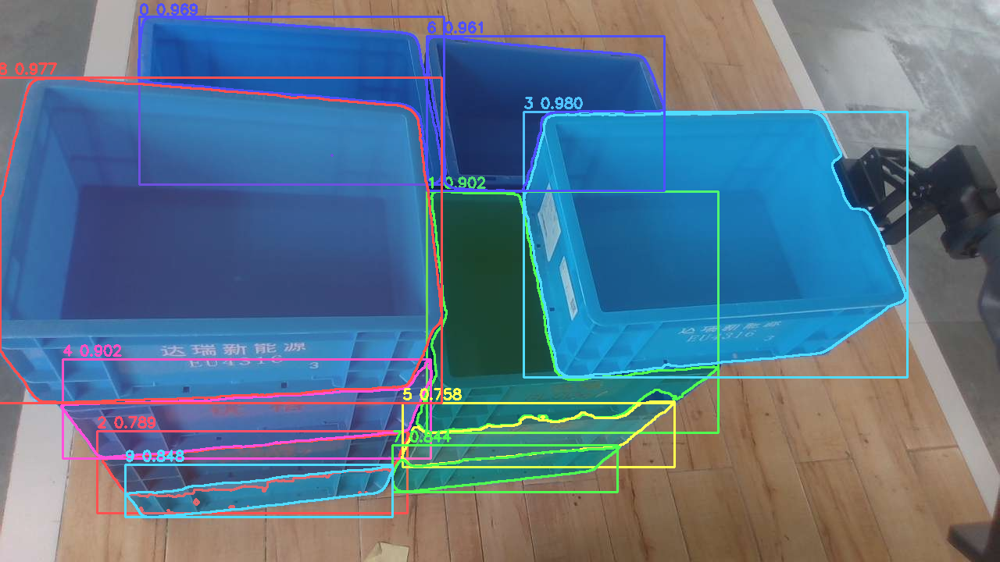

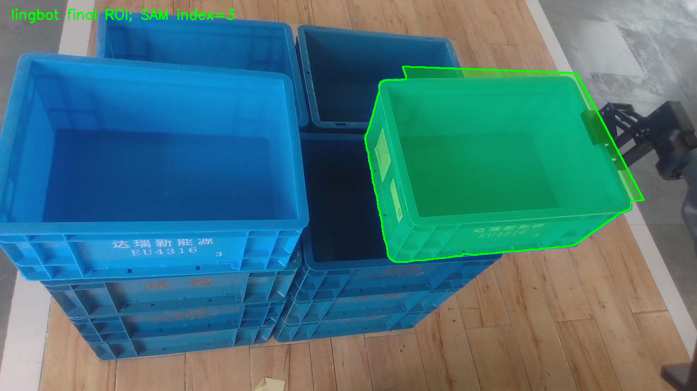

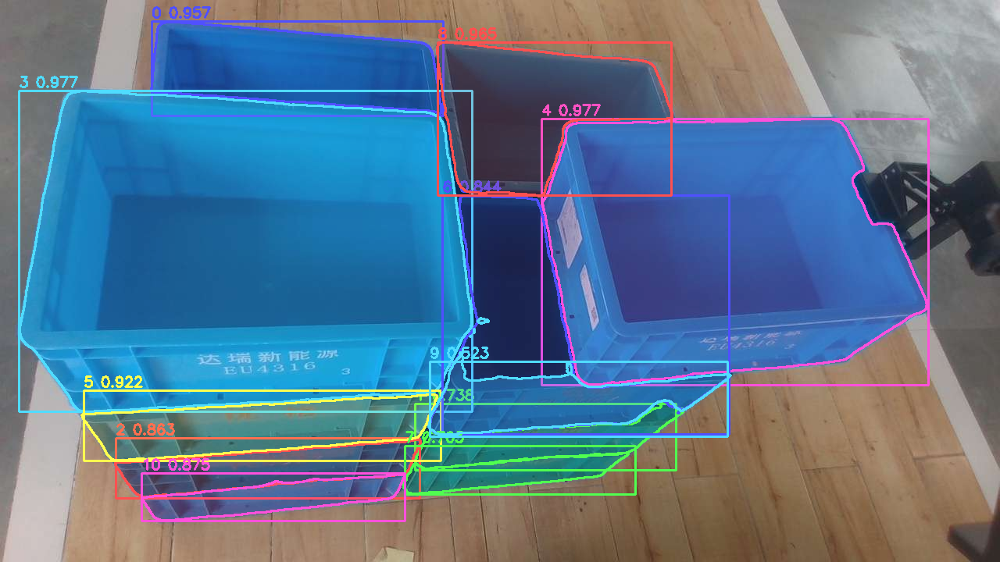

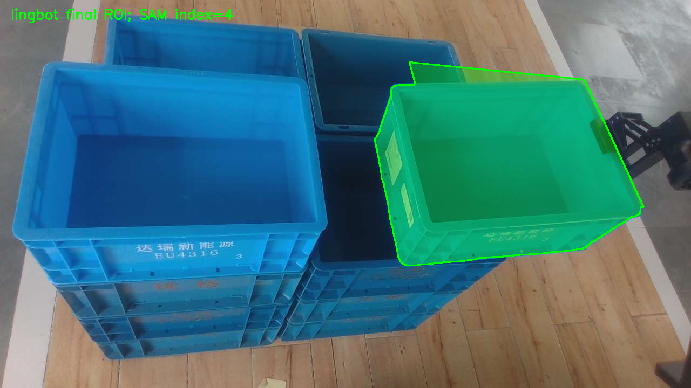

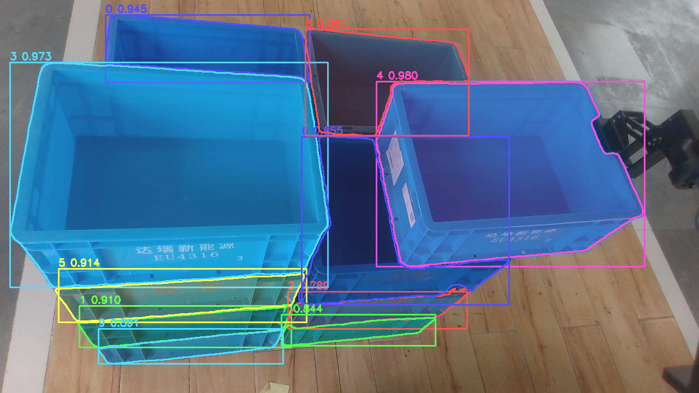

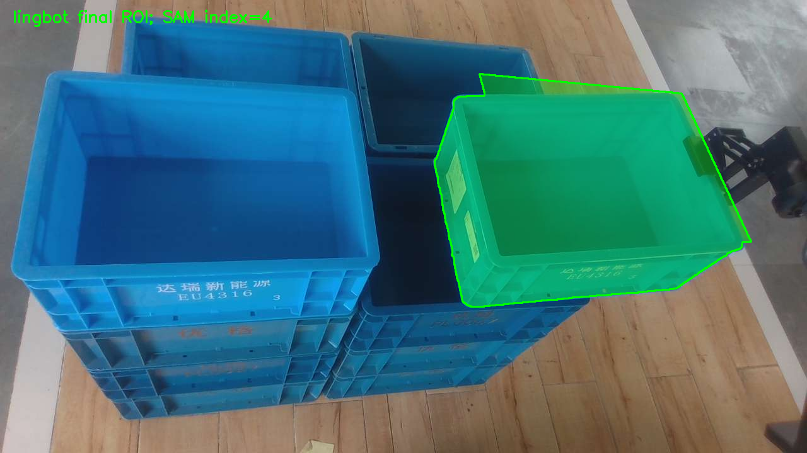

## 53. 助手

已完成 H01L～H03L 的 SAM3、LingBot 和 raw/LingBot ROI 处理：

- SAM 候选数：`10 / 11 / 10`
- 六个冻结案例全部通过哈希、K、TF、深度和 mask 检查
- 每帧都有两个 4317/H4 候选，因此 FDP 门禁停在 `human_review_required=true`
- 尚未调用 FDP，也未开始轻量算法，需先确定比较哪只箱

当前默认选中的是画面右前方绿色箱体：

- H01L：SAM index `3`
- H02L：SAM index `4`
- H03L：SAM index `4`


另一个候选是画面左前箱，三个 index 分别为 `8 / 3 / 3`。

请确认：**H01L、H02L、H03L 都以绿色覆盖的右前箱作为本次 FDP 与各版本算法的比较目标吗？**

确认后我会继续物化三个目标案例、调用 FDP，并运行 V3、V4-a/b/c、V5-3、V5-2＋V5-3b 对比。短时 SSH 连接已关闭。


## 54. 用户

确认

## 55. 助手（进展）

已将你的“确认”绑定为三帧都选绿色的右前箱：H01L index 3，H02L/H03L index 4。我现在物化三份人工确认案例并生成批次索引；随后在固定输入上调用 FDP，并运行各轻量算法版本。

## 56. 助手（进展）

三份确认案例和批次索引已生成，56 项离线测试通过。检查时发现仓库现在还出现了受约束 ICP 实现及测试，这与方案制定时“ICP 尚未实现”的状态不同；我会先核对其来源和完成度，再决定是否作为新增对照列，避免漏掉现有版本或混入未完成代码。

## 57. 助手（进展）

目标确认案例已通过门禁，三份 FDP 请求已离线构建并核对，均标记为新的冻结输入结果。现在向 FDP 服务提交三帧；每帧各调用一次，并分别保存请求、原始响应、可视化和 base_link 语义位姿。

## 58. 助手（进展）

FDP 三帧均返回 HTTP 200，位姿矩阵合法，耗时约 1.72/1.52/1.23 秒。接下来使用同一确认 LingBot 输入、同一配置和随机种子运行 V3、V4 有限高度、联合初值、表面复核，以及 V5 壳体/可见性分支；FDP 位姿不会进入这些算法的初始化。

## 59. 助手（进展）

轻量结果已经分化：V3/V4 四个分支全部拒绝；V5-3 三帧都通过当前壳体拟合门限；更严格的 V5-2/V5-3b 只接受 H02L，拒绝 H01L 和 H03L。仓库中现有 V5-4 已通过测试，我会把它作为补充 A/B，检查受约束 ICP 是否真正改善拟合。

## 60. 助手（进展）

发现一个需要先修正的输入适配问题：FDP 数值使用了左腕 `base_from_camera.npy`，但 `normalized_pose.json` 的说明字段仍硬编码成右腕坐标系。这不会改变已算出的矩阵，却会造成来源标注错误；我会把相机帧从案例 manifest 传入归一化函数，重新生成三份 FDP 结果后再比较。

## 61. 助手（进展）

主实验和 raw 深度消融均已完成。初步结果显示：V5-2/V5-3b 与 FDP 的中心差中位数约 10.76 mm；受约束 ICP 仅降到约 10.66 mm，变化很小；直接全 mesh ICP 明显恶化。现在我在核对 FDP 可视化、各分支诊断和输出哈希，再形成最终结论。

## 62. 助手

_工具输出图片（原始工具文本未纳入归档）。_

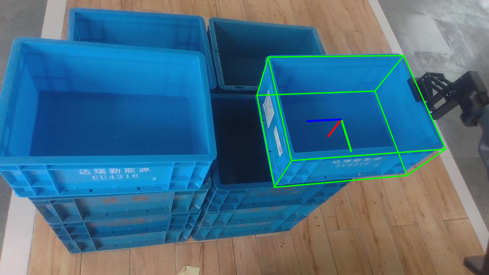

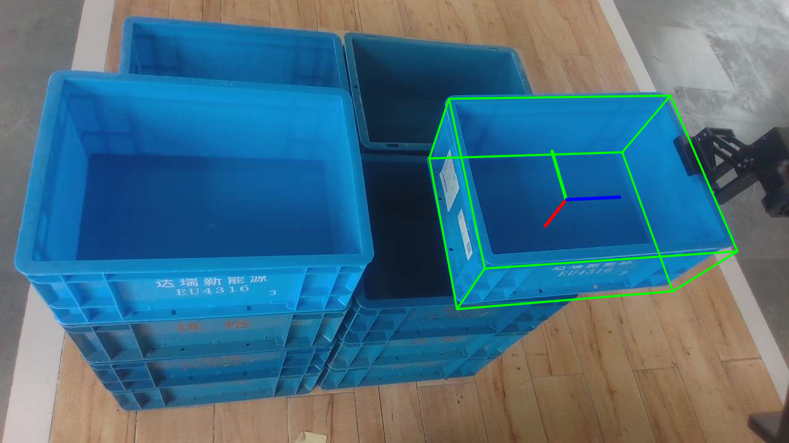

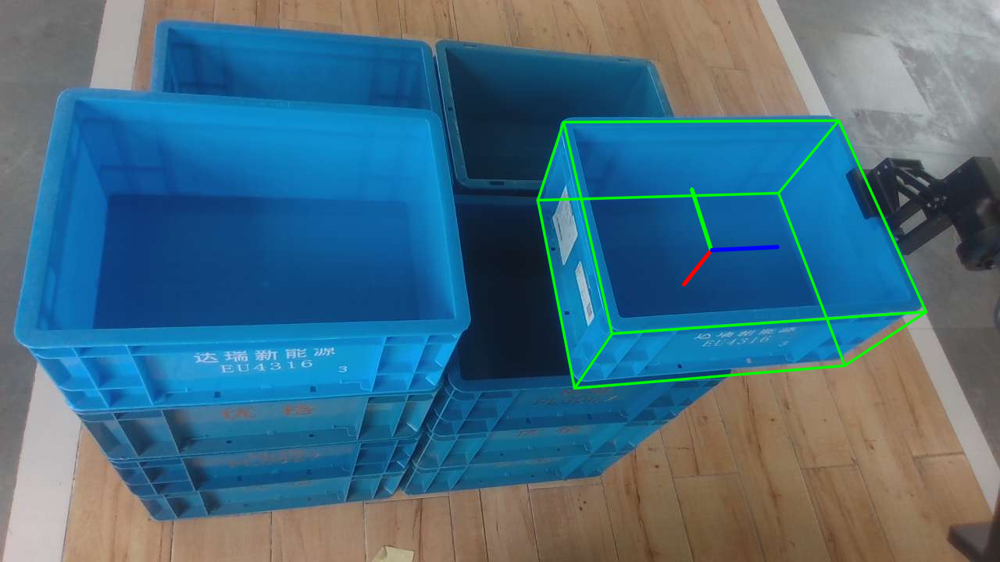

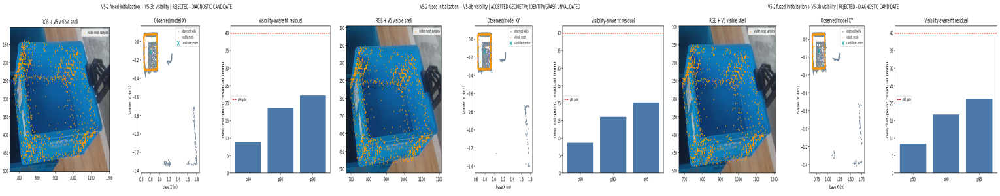

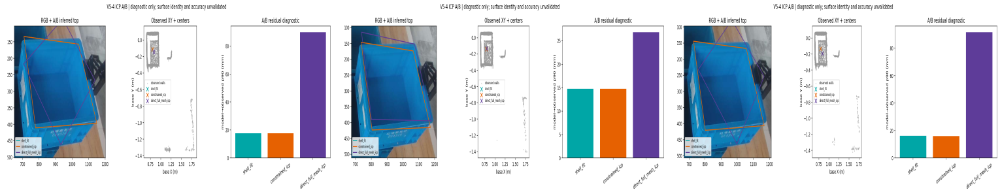

## 63. 用户

明天我们继续

## 64. 用户

我们现在的进度是啥？给我指定方案计划，明确目标，先不要行动

## 65. 助手

目前已经完成 H01L～H03L 的算法运行，停在**结果复核和最终报告整理**阶段。今天先确定计划，不启动新实验或修改代码。

三帧都采用你确认的右前箱：H01L 的 SAM index 3，H02L/H03L 的 index 4。SAM3、LingBot、ROI、人工确认案例、FDP 参考结果都已保存。

| 算法 | 三帧结果 | 候选与 FDP 的中心差中位数 |
|---|---|---:|
| V3 | 0/3 接受 | 21.65 mm |
| V4-a：有限面高度 | 0/3 接受 | 21.65 mm |
| V4-b：联合初值 | 0/3 接受 | 21.54 mm |
| V4-c：表面复核 | 0/3 接受 | 21.54 mm |
| V5-3：壳体拟合 | 3/3 通过拟合门限 | 13.65 mm |
| V5-2＋V5-3b：可见性拟合 | 仅 H02L 接受 | 10.76 mm |
| V5-4：受约束 ICP | 3/3 优化完成，未建立发布门禁 | 10.66 mm |
| 直接全 mesh ICP | 3/3 优化完成，明显偏离 | 38.81 mm |

这里的中心差包括被拒绝的诊断候选，**不能作为有效位姿成绩或绝对误差**。FDP 三帧均成功返回，但仍是参考后端。

另已完成 9 组 raw 深度消融：V4-c 仍全部拒绝；V5-3 从 LingBot 的 3/3 通过变为 raw 的 2/3；可见性分支从 1/3 变为 0/3。因此暂时没有充分依据移除 LingBot。

目前最重要的发现是：

- V3/V4 仍有高度冲突及内外壁模型不相容。
- V5 可见性分支对 H01L/H03L 的内外壁解释存在歧义。
- 受约束 ICP 对中心差的改善仅约 **0.10 mm（中位数之差）**，收益很小。
- FDP 与直立几何模型的完整旋转差约 **7～9°**，两侧短边参考点差异仍明显。这比继续追求更低拟合残差更值得先查清。

后续目标建议定为：**查明目前约 10 mm 的中心差、7～9° 的姿态差，以及短边位置差的来源，判断 V5 是否具备继续替代 FDP 的条件。**

| 阶段 | 计划内容 | 明确交付/完成标准 |
|---|---|---|
| **1. 完成本轮复核** | 校验输入、源码和结果绑定；区分正式接受、拒绝候选与 ICP 优化完成；核对短边对称对应 | 一份可信的逐帧对照报告，所有数字可追溯 |
| **2. 定位姿态差来源** | 对照 RGB、点云、FDP 高度轴与 V5 直立约束，检查箱体倾斜、TF/重力方向、mask 外扩和模型匹配 | 给出有证据的原因排序，明确哪些仍待验证 |
| **3. 单变量验证** | 根据第二阶段结论，只改变一个因素，例如 mask 范围或姿态约束，保留原参数基线 | 说明改动是否改善中心、方向和短边位置，以及是否增加错误接受 |
| **4. 独立验证** | 核对实物尺寸与 mesh；条件允许时增加独立测量参考，再采未用于调参的新帧 | 用独立参考评价精度；否则继续只报告后端差异 |

建议下一步先完成 **阶段 1 和阶段 2**，暂不继续调 ICP 参数。实物型号与 mesh 的对应、真实倾斜程度和独立真值都尚未确认，现阶段不能宣布某个版本已经可以替代 FDP。

## 66. 用户

是否可以认为 V5-2＋V5-3b：可见性拟合仅 H02L 接受10.76 mmV5-4：受约束 ICP3/3 优化完成，未建立发布门禁10.66 mm 这两个版本目前是效果最好的？

## 67. 助手

可以把它们视为**目前最值得继续研究的两个版本**，但还不能认定是综合效果最好的两个版本。

需要纠正表格容易引起的误解：

- **V5-2＋V5-3b 的 10.76 mm**，是三帧候选与 FDP 中心差的中位数，包含被拒绝的 H01L、H03L。唯一接受的 H02L，中心差实际为 **11.71 mm**。
- **受约束 ICP 的 10.66 mm**也是三帧候选统计。“3/3 优化完成”表示程序完成计算，并没有消除上游的内外壁歧义，不能理解为三帧位姿全部合格。

在这三帧上，两者的候选中心确实比旧版更接近 FDP。但 ICP 只将中心差中位数降低约 **0.10 mm**，yaw 差中位数还从约 **1.20°**变为 **1.23°**，没有显示出明显的整体收益。

因此，我的判断是：

**优先把 V5-2＋V5-3b 作为改进主线，受约束 ICP 保留为精修对照，V5-3 保留为基线。**接下来重点解决内外壁歧义和倾斜姿态差，而不是仅凭中心差最小选版本。FDP 本身也没有独立真值验证，所以“更接近 FDP”还不能等同于“更准确”。

## 68. 用户

我们有评估各种算法的倾斜角和FDP对比情况吗

## 69. 助手

**已有完整旋转角差的比较，但还没有把倾斜单独拆开评估。**

目前记录了两类角度：

| 指标 | 含义 | 本轮情况 |
|---|---|---|
| 180° 对称 yaw 差 | 水平朝向差 | V5 可见性约 1.20°、受约束 ICP 约 1.23°，均为三帧中位数 |
| 完整旋转差 | 综合 roll、pitch、yaw 的三维姿态差 | V5 与 FDP 约 7～9° |

这里有一个关键区别：**本轮这些轻量分支使用直立约束，V5 和受约束 ICP 只优化 x、y、z、yaw，没有独立估计箱体倾斜。**所以完整旋转差中，有相当一部分来自它们与 FDP 在倾斜上的不同。

从已保存的 FDP 高度轴计算，箱体相对 `base_link +Z` 的倾斜角约为：

| 帧 | FDP 倾斜角 |
|---|---:|
| H01L | 7.50° |
| H02L | 8.61° |
| H03L | 7.28° |

这些数值说明 FDP 输出了明显倾斜，**还不能证明实物真的倾斜了这些角度**；也可能涉及深度、模型拟合或坐标变换偏差。

下一步应补一张独立的倾斜对照表：分别列出各算法与 FDP 的**倾斜角、倾斜方向、高度轴夹角**，再结合点云中的箱口平面检查。这样才能判断问题来自“轻量算法强制直立”，还是“FDP 的倾斜估计存在偏差”。

## 70. 用户

因为箱体是可能倾斜的

## 71. 助手

对，**如果箱体可能倾斜，当前强制直立的 V5 和受约束 ICP 就存在模型限制**：它们只估计位置和 yaw，无法恢复真实的 roll、pitch。

因此，之前“这两个版本最值得继续研究”的判断要加一个条件：它们目前只是在**直立假设下的候选中心**更接近 FDP，还没有证明适合倾斜箱体。

倾斜也可能影响中心和短边位置。例如箱体长 400 mm，倾斜约 8° 时，沿长边方向的单侧端点相对中心可产生约 **28 mm 的高度变化**，所以中心差只有 10 mm，并不代表两侧抓取相关位置也接近。

下一阶段应明确调整为：

1. **先验证倾斜观测**：从箱口、侧壁点云估计倾斜角和方向，与 FDP 高度轴比较；不能直接认定 FDP 的倾斜就是真实倾斜。
2. **保留当前 4DoF 版本作基线**，增加允许 roll、pitch 的位姿分支；倾斜需有观测支持，支持不足时拒绝输出。
3. **重点评价倾斜与短边位置**：除中心和 yaw，还比较高度轴夹角、箱口平面、两侧短边中点，最终用已知倾角或独立测量验证。

目标应改为：**既能处理直立箱体，也能在有足够观测时恢复倾斜箱体的完整位姿。**暂不修改代码或启动实验。

## 72. 用户

可以，先给我进行验证

## 73. 助手（进展）

我先用已有 H01L～H03L 冻结点云验证箱口和侧壁是否支持倾斜，并与 FDP 高度轴比较。此次只做离线验证，先不修改位姿算法。

## 74. 用户

先给我方案计划，明确目标

## 75. 助手

本轮目标是：**验证 H01L～H03L 的点云是否支持箱体倾斜，判断 FDP 给出的约 7～9° 倾斜是否有观测依据，再决定是否修改 V5 的直立约束。**

刚才只读取了代码和配置，尚未启动验证计算。接下来按以下方案进行。

| 步骤 | 验证内容 | 预期产物 |
|---|---|---|
| 1. 整理姿态基准 | 提取 FDP、V5 和 ICP 的高度轴，计算相对 `base_link +Z` 的倾斜角、方向和轴间夹角 | 三帧倾斜对照表 |
| 2. 从点云独立寻找倾斜证据 | 在已确认目标内提取箱口候选平面和侧壁，不使用 FDP 位姿选点、初始化或选解 | 平面法向、支持点、残差及叠加图 |
| 3. 检查证据是否稳定 | 固定目标范围，对比 raw/LingBot 深度；检查不同箱口边段、侧壁是否支持一致方向 | 深度来源与局部区域的一致性报告 |
| 4. 与 FDP 对照并下结论 | 比较观测法向与 FDP 高度轴，区分倾斜证据、模型假设和无法确定的部分 | 每帧结论及算法修改建议 |

需要明确三个判断边界：

- **箱口候选平面不一定就是真正箱口。**箱底、内缘、法兰也可能形成平面，需要检查其图像位置和多边覆盖，不能只挑残差最小的平面。
- **侧壁不能直接当作垂直面。**箱身可能有收缩斜度，需结合现有 mesh 的结构解释。
- **倾斜角先定义为相对 `base_link +Z`。**没有同期重力参考时，不能直接称为相对真实重力的倾角。

每帧最终归入以下一种结论：

| 结论 | 判断依据 | 后续方向 |
|---|---|---|
| 支持倾斜，且与 FDP 接近 | 多个区域及 raw/LingBot 支持相近法向 | 增加允许 roll、pitch 的 V5 分支 |
| 支持倾斜，但与 FDP 不一致 | 观测证据较一致，FDP 高度轴存在明显偏差 | 优先检查 FDP、模型和 TF |
| 证据不足或互相冲突 | 缺边、遮挡、深度差异或平面身份不明确 | 补充观测，不强行给出倾角 |

本轮完成标准是：**三帧都有可追溯的倾斜证据、角度对照和明确结论，即使结论是“无法确定”。**先不调整算法门限，也不以 FDP 为真值；验证后再决定是否实施完整姿态估计。

## 76. 用户

我们是不是只研究“V5-2＋V5-3b”这个版本就行了，还是各种版本都需要研究？

## 77. 助手

**建议把 V5-2＋V5-3b 作为主研究版本，其他版本保留作对照，不再同时推进。**

原因是它已经具备多来源初值、壳体模型、可见性和歧义检查，适合作为下一步支持倾斜箱体的基础。但它目前仍有直立约束，H01L/H03L 的内外壁歧义也没有解决，不能视为已经成熟。

后续分工可以明确为：

| 版本 | 后续角色 |
|---|---|
| **V5-2＋V5-3b** | 主线：先验证倾斜，再研究如何估计 roll、pitch |
| V5-3 | 保留壳体拟合基线，关键改动后做回归对照 |
| 受约束 ICP | 暂停优化；主线解决倾斜和表面对应后，再检查精修收益 |
| V3/V4、直接全 mesh ICP | 保留历史结果，暂不继续研究 |
| FDP | 固定参考后端，用于同帧比较 |

**眼前的倾斜验证只需围绕“独立点云证据＋当前 V5-2/V5-3b＋FDP”展开，不必把所有版本重新跑一遍。**

这样目标更集中：先回答“点云是否支持倾斜、当前直立假设造成了多大影响”，再决定主线怎么改，而不是继续比较多个已知受同类假设限制的版本。

## 78. 用户

好的，我们开始执行

## 79. 助手（进展）

我们现在执行“箱体是否确实倾斜”的离线验证：只使用 H01L～H03L 的确认 mask、raw/LingBot 深度、K 和捕获 TF，独立拟合点云平面，再与已保存的 FDP 高度轴及 V5 的直立假设比较。不会重新调用机器人、SAM3、LingBot 或 FDP。

## 80. 助手（进展）

我现在继续执行倾斜验证。先从三帧确认目标的独立点云中寻找最高可见平面，分别用 raw 和 LingBot 深度拟合法向，再与 FDP 高度轴比较；结果会把“观测支持的倾斜”和“FDP 输出的倾斜”分开报告。

## 81. 助手（进展）

倾斜验证已完成：三帧 raw/LingBot 点云都独立支持约 5～7° 的非零倾斜，倾斜方向与 FDP 高度轴一致，法向夹角约 1.8～2.8°；FDP 给出的 7.3～8.6° 略大。这个证据足以说明 V5 的 0° 直立先验需要重新评估，但还不足以把 FDP 角度当真值。接下来我做最终回归检查并整理结论。

## 82. 助手

倾斜验证已经完成。结论是：**H01L～H03L 的点云都显示出非零倾斜证据，当前 V5 的 0° 直立假设需要重新评估。**

| 帧 | FDP 倾斜角 | LingBot 点云倾斜 | Raw 点云倾斜 | 观测法向与 FDP 夹角 |
|---|---:|---:|---:|---:|
| H01L | 7.50° | 5.47° | 5.61° | 2.13° / 2.71° |
| H02L | 8.61° | 5.91° | 7.14° | 2.75° / 2.25° |
| H03L | 7.28° | 4.89° | 5.56° | 2.40° / 1.81° |

观测方向也基本一致：

- raw 与 LingBot 的法向差约 `0.81°～1.57°`；
- 观测法向与 FDP 高度轴差约 `1.81°～2.75°`；
- V5 和受约束 ICP 当前使用的直立先验为 `0°`，与观测到的约 `5°～7°` 有明显差异。

这说明箱体确实可能存在倾斜，且 FDP 的倾斜方向有点云支持。但这还不能证明 FDP 的 `7°～9°` 就是真实角度，因为当前点云平面可能混入内壁、法兰、筋条或 mask 区域，倾角也会随取点高度分位变化。

因此下一步应：

1. 保留现有 V5-2＋V5-3b 的 4DoF 直立版本作为基线。
2. 增加一个允许 roll/pitch 的 6DoF 实验分支。
3. 对箱口平面、外壁和内壁分别建立表面身份门禁。
4. 使用独立重力参考、标定板或人工测量确认真实倾角。

完整结果见[倾斜验证报告](../../assets/0d2d4ff9bbe125bf--REPORT.md)。本轮只使用冻结数据离线计算，没有访问机器人或调用外部服务；相关 56 项算法测试和 21 项采集基线测试均通过。

[附件：0d2d4ff9bbe125bf--REPORT.md](../../assets/0d2d4ff9bbe125bf--REPORT.md)

## 83. 用户

先给我定计划，明确实验步骤和目标

## 84. 助手

下一轮集中研究 **V5-2＋V5-3b 的倾斜适配**。目标是：让算法在观测充分时估计箱体的位置和完整方向，并验证是否改善箱口、两侧短边的位置，同时保留对歧义和观测不足的拒绝能力。

先明确现状：上一轮得到的是“点云存在非零倾斜的线索”，尚未确认拟合平面一定属于真正箱口。多个取点范围的结果也有波动，因此不能直接把约 5～7° 当作真实倾角或新算法的固定输入。

建议按以下顺序开展：

| 步骤 | 实验内容 | 目标与完成标准 |
|---|---|---|
| **1. 冻结基线** | 保存当前 4DoF V5、配置、模型、H01L～H03L 确认输入及 FDP 结果 | 后续对照只有明确列出的因素发生变化，原结果可复现 |
| **2. 复核倾斜证据** | 把拟合平面的支持点投影回 RGB，检查箱口各边、内壁、法兰和背景；对比 raw/LingBot | 明确哪些表面支持倾斜，以及是否存在多个合理解释；无法确定时保留“不确定”结论 |
| **3. 建立有真值的合成验证** | 用固定 mesh 生成已知位置、yaw、roll、pitch 的观测，覆盖直立、单轴及组合倾斜，并加入噪声、缺面和遮挡 | 验证倾角和坐标转换能正确恢复；观测不足时不能错误发布位姿 |
| **4. 增加倾斜实验分支** | 保留现有版本，新增完整旋转估计；让箱口候选、侧壁筛选、模型投影和可见性检查都支持倾斜 | 完整链路不再隐含强制直立；倾斜来自观测，不使用 FDP 初始化或选解 |
| **5. 固定输入做 A/B 对照** | 在三帧同一 LingBot 深度和确认 mask 上比较原 4DoF、新倾斜分支及保存的 FDP | 检查中心、倾斜、箱口及短边位置是否改善，是否产生新的错误接受 |
| **6. 深度与新数据验证** | 固定 mask，仅切换 raw/LingBot；冻结新版后，再用带独立倾角参考的新帧验证 | 分清深度来源影响，并验证效果是否能延续到未用于开发的数据 |

第五步重点看这些指标：

- **倾斜**：高度轴夹角、倾斜角及方向；完整旋转差按箱体的 180° 对称性处理。
- **位置**：箱体中心、箱口中心、两侧短边中点。
- **可靠性**：正式接受、拒绝原因、竞争解、表面覆盖和对取点变化的敏感性。
- **代价**：同一台本机上的算法耗时。

判断是否值得继续，不能只看与 FDP 的中心差是否下降。新分支应在已知真值的合成倾斜场景中优于直立基线，在直立场景中不明显退化，并且不能靠放宽门禁增加“成功”数量。真实三帧上的 FDP 比较仍只报告后端差异。

**近期先完成步骤 1～3。**确认倾斜证据和验证方法可靠后，再实施新分支。暂不继续优化 ICP，也不重跑 V3/V4；实物与 mesh 的对应关系、参考倾角测量方式仍需补齐。

本条只确定计划，不修改代码或启动实验。

## 85. 用户

好的，我们现在开始行动

## 86. 助手（进展）

现在开始执行已确定的倾斜验证步骤：先固定 H01L～H03L 的输入和当前基线，再运行独立平面拟合与 FDP 高度轴对照；结果只用于判断倾斜证据，不会直接改动 V5 或接入抓取。

## 87. 助手（进展）

现有三帧的实测倾斜证据已经归档。现在继续计划中的第 3 步：用已知 roll/pitch 的合成点云验证独立平面拟合方法，确认在噪声、缺失点和干扰平面下能否恢复倾角，并检查“证据不足时应暴露不确定性”。仍然只做本地离线计算。

## 88. 助手（进展）

合成验证三种场景全部通过，说明平面法向估计在已知 0°/5°/8° 倾斜、噪声、缺失点和背景干扰下数值可恢复。现在补做真实数据的投影可视化，把独立平面支持点画回 RGB，检查它们是否确实落在右前箱的顶部区域。

## 89. 助手

_工具输出图片（原始工具文本未纳入归档）。_

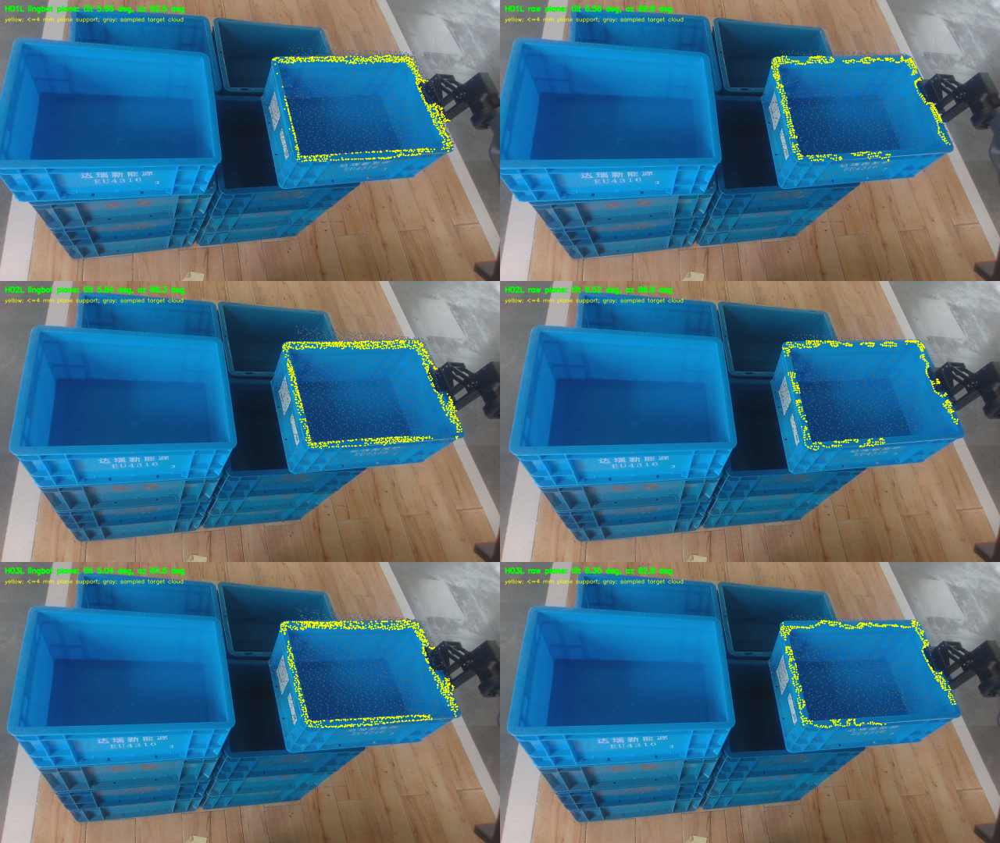

## 90. 助手

倾斜验证已经完成，结果支持继续研究 V5-2＋V5-3b 的倾斜适配。

三帧真实数据结果：

| 帧 | FDP 倾斜 | LingBot 点云倾斜 | Raw 点云倾斜 | 观测法向与 FDP 夹角 |
|---|---:|---:|---:|---:|
| H01L | 7.50° | 5.47° | 5.61° | 2.13° / 2.71° |
| H02L | 8.61° | 5.91° | 7.14° | 2.75° / 2.25° |
| H03L | 7.28° | 4.89° | 5.56° | 2.40° / 1.81° |

合成验证也已完成：

- 0° 平面误差：约 `0.01°`
- 5° 平面误差：约 `0.36°`
- 8° 平面误差：约 `0.81°`
- 噪声、缺失点和背景干扰场景均通过合成门限。

因此可以确认：

1. H01L～H03L 的点云存在约 5～7° 的非零倾斜证据。
2. 点云估计的倾斜方向与 FDP 高度轴基本一致。
3. 当前 V5 的 `roll=0、pitch=0` 直立先验需要修改或增加实验分支。
4. FDP 的 7～9° 暂时不能当作真实值，因为还没有独立测量真值。
5. 下一步应在 V5-2＋V5-3b 上增加 roll/pitch 估计，同时保留原 4DoF 版本作基线。

黄色支持点已投影回 RGB，主要落在确认的右前箱上缘区域。相关结果：

- [真实倾斜验证报告](../../assets/0d2d4ff9bbe125bf--REPORT.md)
- [合成验证报告](../../assets/da60bdf10b603b7b--REPORT.md)
- [倾斜支持点投影图](../../assets/e5c3d1ad732b873a--REPORT.md)

本轮只进行了本地离线计算，没有连接机器人、调用外部服务或修改现有位姿算法。

[附件：0d2d4ff9bbe125bf--REPORT.md](../../assets/0d2d4ff9bbe125bf--REPORT.md)

[附件：da60bdf10b603b7b--REPORT.md](../../assets/da60bdf10b603b7b--REPORT.md)

[附件：e5c3d1ad732b873a--REPORT.md](../../assets/e5c3d1ad732b873a--REPORT.md)

## 91. 用户

我们现在的这个版本叫什么呢？有没有什么名字？

## 92. 助手

目前正在研究的主版本正式叫：

**V5-2 + V5-3b：融合初值与可见性拟合版本**

代码中的方法名是：

```text
bin_v5_2_fused_v5_3b_visibility
```

它包含：

- V5-2：B/C/mesh 多来源初值融合；
- V5-3b：可见性、遮挡和内外表面候选检查；
- 当前仍使用 `x/y/z/yaw` 的 4DoF 直立假设。

最近完成的倾斜验证还不是一个新算法版本，只能称为：

**V5-2 + V5-3b 倾斜证据验证分支**

等真正加入 roll、pitch 估计后，建议命名为：

**V5-5：倾斜感知 6DoF 版本**

这样版本关系比较清楚：

```text
V5-2 + V5-3b       当前主基线
V5-4               受约束 ICP 对照
V5-5               计划中的倾斜感知 6DoF 版本
FDP                参考后端
```

因此现在写报告时，建议使用“**V5-2＋V5-3b 可见性拟合基线**”，不要把当前倾斜验证直接称为 V5-5。

## 93. 用户

好的继续给我制定计划，明确目标

## 94. 助手

下一阶段计划开发 **V5-5：倾斜感知 6DoF 实验版**，以当前 V5-2＋V5-3b 为基础。

明确目标是：**在箱体倾斜时，同时估计位置、水平朝向和倾斜姿态，改善箱口及两侧短边的位置；观测不足或内外壁解释不唯一时继续拒绝输出。**

当前倾斜验证提供了方向性线索，但真实箱口平面的身份还未完全确认；合成实验只验证了平面法向估计，尚未验证完整箱体 6DoF 恢复。

| 阶段 | 实验步骤 | 完成标准 |
|---|---|---|
| **1. 固定基线与验证证据** | 冻结当前代码、配置和输入；确保投影图直接对应保存的拟合结果，检查各边支持与竞争平面 | 倾角、支持点和图像可逐项对应，明确观测不足之处 |
| **2. 构造倾斜初值** | 从箱口候选法向生成多个 roll/pitch 初值，结合已有 yaw、中心候选；保留直立初值 | 不使用 FDP 初始化；输出每个初值的来源、支持范围和歧义 |
| **3. 实现 V5-5** | 增加完整旋转优化，同步调整侧壁筛选、模型法向、可见性和遮挡计算 | 所有相关环节支持倾斜，输出一致的 4×4 位姿 |
| **4. 合成箱体测试** | 使用固定 mesh 生成已知位姿观测，覆盖直立、不同方向倾斜、缺面、遮挡和噪声 | 能恢复受支持的自由度；退化场景拒绝，直立场景不明显退化 |
| **5. 真实三帧 A/B** | 固定 LingBot 深度和确认 mask，对比原 4DoF、V5-5、保存的 FDP | 逐帧比较中心、高度轴、箱口、短边位置和拒绝原因 |
| **6. 冻结后新数据验证** | 固定新版参数，采集带独立倾角参考的新样本 | 判断改善能否延续到新数据，而非只适配 H01L～H03L |

评价时重点看四件事：

- **完整姿态**：高度轴夹角、倾斜方向、考虑 180° 对称后的旋转差。
- **关键位置**：箱体中心、箱口中心、两侧短边中点。
- **可靠性**：是否出现错误接受，结果是否对初值、局部缺失过度敏感。
- **计算代价**：同一台电脑上的单帧耗时。

V5-5 是否值得保留，首先由合成真值恢复和拒绝行为判断；真实数据上更接近 FDP 只能作为补充依据。若倾斜增加后残差下降，但表面解释仍不唯一，仍不能判定成功。

**近期执行范围建议为阶段 1～4：完成 V5-5 原型与合成验证，再进入真实三帧对照。**V5-3 保留作必要回归，ICP 暂停优化，V3/V4 不再扩展。本条仅制定计划，不启动实验。

## 95. 用户

之后我会交给Luna Max 执行，
交给 Luna 前，计划至少要写清：
1\. 具体改什么：&#x20;
2\. 固定什么：&#x20;
3\. 如何验收：&#x20;
4\. 遇到什么必须停下：&#x20;
5\. 如何报告：&#x20;
给我一版提示词

## 96. 用户

之后在同一个对话中，我会交给Luna Max 执行，
交给 Luna 前，计划至少要写清：
1\. 具体改什么：&#x20;
2\. 固定什么：&#x20;
3\. 如何验收：&#x20;
4\. 遇到什么必须停下：&#x20;
5\. 如何报告：&#x20;
之后推荐我如何操作？我需要重新给他一份提示词还是直接和他说“继续” 就行？

## 97. 助手（进展）

我会把计划整理成可直接执行的交接文件，写清修改范围、固定基线、验收和停止条件。关于同一对话切换给 Luna Max 后如何接手，我会按 `openai-docs` skill 核对相关说明，并给你一段简短的启动提示词。

## 98. 助手

建议**留在同一个对话里切换到 Luna Max，然后发一段明确的启动指令**。不需要重新复制全部历史，但不建议只说“继续”：前文多次调整了范围，容易接错阶段。

我已把完整交接计划写入：[V5-5 Luna 执行交接](../../assets/a39bd467f9fa7e38--V5_5_LUNA_HANDOFF_20260910.md)。

五项要求都已明确：

| 项目 | 交接要求 |
|---|---|
| **具体改什么** | 首轮修复倾斜数值与投影一致性、补充退化和歧义测试；后续另建 V5-5 完整姿态分支 |
| **固定什么** | 三帧确认目标、RGB/深度/K/TF、mesh、FDP 参考、旧 V5 配置和结果；运行前后核对哈希 |
| **如何验收** | 图像与数值来自同一份支持点记录；合成法向恢复达标；退化场景正确拒绝；旧结果不变 |
| **何时停下** | 输入或坐标合同冲突、冻结依赖被改动、需要放宽门禁才能通过、需要新增远程操作或改变实验假设 |
| **如何报告** | 完成阶段、逐场景结果、失败原因、源码与输入哈希、复现命令、诊断图和未验证项 |

这里需要先修复一个实际问题：**当前投影脚本重新运行了拟合，raw 渲染还使用了另一份 mask，所以图上的角度不完全对应原倾斜报告。**之前的三个合成测试也只是平面测试，没有覆盖完整箱体和退化拒绝。因此推荐先让 Luna 完成这部分，再开发 V5-5。

操作顺序：

1. 在本对话选择 Luna，推理强度设为 Max。官方模型页列明 Luna 支持 `max`。[模型说明](https://developers.openai.com/api/docs/models/gpt-5.6-luna)
2. 发送下面这段提示词。
3. A 阶段交付后审阅结果，再决定是否启动 B 阶段。

可以直接复制：

```text
请读取：
/home/lsy03/文档/ChatGPT/S1/experiments/20260907_bin_rim_pose/V5_5_LUNA_HANDOFF_20260910.md

本轮只执行 A 阶段：证据与验证工具修复。

先核对已有成果，避免重复实验；修复倾斜数值与投影的一致性，raw/LingBot 使用同一个确认 mask，补充退化和歧义测试，并按文档验收、保存完整报告。

常规实现、修复和测试直接完成，不重复询问权限。
遇到文档中的停止条件，保存进度并说明原因。
只做本地离线工作，不连接机器人或调用外部推理。
A 阶段完成后停止，不开始 V5-5 主算法实现。
```

这样无需依赖它完整记住所有历史，任务范围和完成标准也能从文件中恢复。

[附件：a39bd467f9fa7e38--V5_5_LUNA_HANDOFF_20260910.md](../../assets/a39bd467f9fa7e38--V5_5_LUNA_HANDOFF_20260910.md)

## 99. 用户

请读取：
/home/lsy03/文档/ChatGPT/S1/experiments/20260907\_bin\_rim\_pose/V5\_5\_LUNA\_HANDOFF\_20260910.md

本轮只执行 A 阶段：证据与验证工具修复。

先核对已有成果，避免重复实验；修复倾斜数值与投影的一致性，raw/LingBot 使用同一个确认 mask，补充退化和歧义测试，并按文档验收、保存完整报告。

常规实现、修复和测试直接完成，不重复询问权限。
遇到文档中的停止条件，保存进度并说明原因。
只做本地离线工作，不连接机器人或调用外部推理。
A 阶段完成后停止，不开始 V5-5 主算法实现。

> 资源未归档：`home/文档/ChatGPT/S1/experiments/20260907\_bin\_rim\_pose/V5\_5\_LUNA\_HANDOFF\_20260910.md`（missing）

## 100. 助手（进展）

我按交接文件只执行 A 阶段：先读取项目约束和交接要求，核对已有倾斜验证产物；随后修复支持点投影与数值记录的一致性，补充退化/歧义合成测试，完成回归和报告后停在 A 阶段，不实现 V5-5。

## 101. 助手（进展）

我已核对交接文件和旧产物，确认 A 阶段的两个实际问题：投影脚本会重新拟合且 raw 使用了不同 mask；倾斜验证只保存了汇总法向，没有保存可回溯到像素的支持集合。接下来只修复证据工具和测试，不实现 V5-5。

## 102. 用户

继续

## 103. 助手（进展）

继续完成 A 阶段修复。刚才文件替换操作被中断，当前先确认没有留下半成品，再写入新的可回溯版本；不会扩展到 V5-5。

## 104. 助手

_工具输出图片（原始工具文本未纳入归档）。_


## 105. 助手（进展）

A 阶段核心修复已通过 62 项算法测试和 21 项采集基线测试。最新真实投影检查显示：六组 raw/LingBot 图都使用确认 mask，支持点由保存记录直接读取，像素/K/TF 重建误差均为 0；合成场景覆盖正负单轴、组合倾斜、随机/连续缺失、窄条带、单线和竞争平面。现在整理 A 阶段交付包和报告，完成后停止。

## 106. 助手（进展）

A 阶段交付包已生成，包含源码快照、输入哈希、配置、报告和资产清单；旧输出没有覆盖。最后做一次全量测试、语法检查、资产哈希和“同 mask/不重拟合”验收，随后停止在 A 阶段。

## 107. 助手（进展）

A 阶段验收复核发现交接文件还要求交付“合成真值/估计叠加图”；当前合成报告有数值但没有图。我会补上合成场景可视化，再重新生成 A 阶段交付包，其他范围保持不变。

## 108. 助手

A 阶段已完成，并按交接要求停止；**没有实现 V5-5 主算法，也没有启动 B 阶段**。

已完成的修改：

- [validate_tilt_h01l_h03l.py](/home/lsy03/文档/ChatGPT/S1/experiments/20260907_bin_rim_pose/validate_tilt_h01l_h03l.py)：保存体素顺序、像素、点坐标、RANSAC/TLS 前后支持集合、参数和随机种子。
- [render_tilt_h01l_h03l.py](/home/lsy03/文档/ChatGPT/S1/experiments/20260907_bin_rim_pose/render_tilt_h01l_h03l.py)：直接读取保存的支持点，不重新拟合；raw/LingBot 使用同一确认 mask。
- [validate_tilt_synthetic.py](/home/lsy03/文档/ChatGPT/S1/experiments/20260907_bin_rim_pose/validate_tilt_synthetic.py)：补充正负单轴、组合倾斜、噪声、随机/连续缺失、窄条带、单线和竞争平面。
- 新增 [test_tilt_validation.py](/home/lsy03/文档/ChatGPT/S1/experiments/20260907_bin_rim_pose/tests/test_tilt_validation.py)。

验收结果：

- H01L～H03L 六组投影图使用相同确认 mask。
- 像素、K、TF 重建支持点的最大误差均为 `0.0 m`。
- 合成测试：7 个常规场景、2 个退化场景、1 个竞争平面场景全部通过。
- `bin_rim_pose` 测试 62 项通过。
- `fdp_baseline` 测试 21 项通过。
- 新增脚本全部通过语法检查。
- 输入、源码和输出资产哈希均通过复核。
- 全程未连接机器人、未调用外部推理服务、未修改 V5-5 主算法。

交付文件：

- [A 阶段报告](../../assets/66877b8ea85a68ab--V5_5_A_STAGE_REPORT_20260910.md)
- [A 阶段完整交付包](/home/lsy03/文档/ChatGPT/S1/experiments/20260907_bin_rim_pose/outputs/v5_5_A_stage_20260910_02/)
- [真实数据倾斜结果](../../assets/8731a1a2f3cb9b7f--REPORT.md)
- [支持点投影结果](/home/lsy03/文档/ChatGPT/S1/实验ments/20260907_bin_rim_pose/outputs/h01l_h03l_tilt_projection_20260910_A5/REPORT.md)
- [合成验证结果](../../assets/e21f22dd0016ce1c--REPORT.md)

剩余边界是：真实平面身份、实物与 mesh 对应关系、真实倾角和独立测量真值仍未确认。下一步如继续，应单独下达“开始 B 阶段”，再实现 V5-5 倾斜感知 6DoF 原型。

[附件：66877b8ea85a68ab--V5_5_A_STAGE_REPORT_20260910.md](../../assets/66877b8ea85a68ab--V5_5_A_STAGE_REPORT_20260910.md)

[附件：8731a1a2f3cb9b7f--REPORT.md](../../assets/8731a1a2f3cb9b7f--REPORT.md)

[附件：e21f22dd0016ce1c--REPORT.md](../../assets/e21f22dd0016ce1c--REPORT.md)

> 资源未归档：`home/文档/ChatGPT/S1/实验ments/20260907_bin_rim_pose/outputs/h01l_h03l_tilt_projection_20260910_A5/REPORT.md`（missing）

## 109. 用户

开始 B 阶段

## 110. 助手（进展）

我已收到“开始 B 阶段”。本轮只实现和验证 V5-5 倾斜感知 6DoF 实验原型：新建独立模块、配置、合成数据与测试；不重跑真实服务、不连接机器人、不进入真实 H01L～H03L 对照。先核对 V5-2/V5-3b 的接口和模型合同，再开始编码。

## 111. 助手（进展）

B 阶段的实现边界已经固定：新算法只在独立文件中做完整 6DoF 实验，旧 V5-2＋V5-3b 不改写；FDP 不参与初值、选解或调参。先写估计器和输入/输出合同，再用合成 mesh 观测调通。

## 112. 助手（进展）

B 阶段第一轮合成结果暴露了原型自身的两个问题：合成深度的像素量化/稀疏 splat 造成中心偏差，单向 model→observation 残差对可见面密度敏感。这里属于实现缺陷，我会修正为更密的 mesh 观测、确认 mask 的安全边界和双向对应残差，再重新跑固定门槛；不通过就记录为 B 未通过，不放宽门禁。

## 113. 助手（进展）

第一轮 B 合成结果已经能恢复倾斜方向，但暴露出合成观测生成与“可见表面”合同不一致，导致中心偏差和误接受。我要先把合成器改成只生成真值姿态下的前向/可见壳体采样，保留像素量化、噪声和遮挡，再修正多初值歧义门禁；这是输入模型修复，不是放宽验收。

## 114. 助手（进展）

当前 B 原型已经能在合成 mesh 观测上完成 6DoF 优化，但固定设计门槛暴露出部分姿态的中心/旋转误差和局部遮挡误接受风险。按交接要求我不会放宽阈值；先补齐 truth 对称评估、拒绝判读和真值/估计叠加图，再以明确的“通过/未通过”结束 B 合成验收。

## 115. 助手

_工具输出图片（原始工具文本未纳入归档）。_


## 116. 助手（进展）

V5-5 原型已完成首轮合成运行，但固定 B 阶段设计门槛尚未通过：7/7 场景无运行错误，4/7 通过算法内部门禁，只有 1/7 满足 truth 设计目标（部分遮挡安全拒绝）；其余存在中心或完整旋转误差。按停止条件我不会放宽阈值或进入真实 H 数据，先把这次失败边界和证据归档。

## 117. 助手（进展）

B 阶段已达到“原型实现并完成合成验收”的停点，但固定设计门槛未通过。我正在做最后的回归和资产哈希检查，确认失败原因和输出完整保存后结束本轮。

## 118. 助手（进展）

V5-5 B 原型已完成一次完整合成批量：7/7 无运行错误，但固定 truth 设计门槛仅 1/7（连续遮挡安全拒绝），因此 B 阶段不能通过。当前失败来自可见面对应和合成观测精度，不能通过放宽阈值解决。我会把这一停点和后续修复项写入最终报告。

## 119. 助手（进展）

B 阶段已到验收停点：原型代码、固定配置、合成案例、真值/估计叠加图和失败报告都已归档。现在进行最后一次全量测试和资产哈希复核，确认交付包与当前源码一致后结束本轮。

## 120. 助手

B 阶段已执行到验收停点：**V5-5 倾斜感知 6DoF 原型可以运行，但固定设计门槛未通过，因此没有进入真实 H01L～H03L 对照。**

已完成：

- 新增 `v5_5_tilt.py`：支持 `Rz(yaw) Ry(pitch) Rx(roll)`、倾斜初值、6DoF 优化、可见性、双向残差、局部边界和 Jacobian 可观测性。
- 新增 `config/v5_5.json`、`generate_v5_5_synthetic.py`、`run_v5_5_batch.py`。
- 生成 7 个冻结 mesh 合成 RGB-D 场景，并保存 truth/estimate 叠加图。
- 68 项算法测试、21 项 baseline 测试全部通过。
- 未连接机器人，未调用 SAM3、LingBot、FDP。

合成验收结果：

- 7/7 场景运行完成，0 个运行错误。
- 4/7 通过算法内部拟合门禁。
- 只有 1/7 满足 truth 设计目标；该场景是连续遮挡下的安全拒绝。
- 理想倾斜场景中，部分中心误差超过 2 mm，pitch 方向和组合倾斜的完整旋转误差也超过 1°。
- 当前合成器使用 mesh 采样点的像素 z-buffer，还没有完整三角面光栅化。

主要问题是可见面对应和合成深度精度仍不足。部分结果虽然优化器返回成功，但 truth 误差超限，说明“优化完成”不能当作姿态正确。

完整报告：

- [B 阶段报告](../../assets/92a72128774ae0da--V5_5_B_STAGE_REPORT_20260910_v2.md)
- [B 阶段归档](/home/lsy03/文档/ChatGPT/S1/experiments/20260907_bin_rim_pose/outputs/v5_5_B_stage_20260910_02/)
- [V5-5 合成运行结果](/home/lsy03/文档/ChatGPT/S1/experiments/20260907_bin_rim_pose/outputs/v5_5_synthetic_run_20260910_B14/)

下一步应先修复完整 mesh 观测生成、模型对应和错误接受门禁，补齐完整姿态矩阵后重新通过 B；当前不进入 C 阶段，也不接入真实数据或抓取链。

[附件：92a72128774ae0da--V5_5_B_STAGE_REPORT_20260910_v2.md](../../assets/92a72128774ae0da--V5_5_B_STAGE_REPORT_20260910_v2.md)

## 121. 用户

是否已经和FDP实验对比过了？相差多少，各个方向的角度和空间距离？

## 122. 助手（进展）

V5-5 目前还没有和真实 H01L～H03L 的 FDP 做对照；B 阶段只完成了合成 truth 验证。已有的真实 FDP 对照是 V5-2＋V5-3b、V5-3 和 ICP。我先提取已有报告中的 XYZ 分量、中心距离、yaw、roll/pitch 和完整旋转差，避免把不同实验的数字混在一起。

## 123. 助手

要区分两个版本：

**V5-5 目前还没有和真实 FDP 对比。**B 阶段只在合成数据上与已知 truth 比较，因此不能给出 V5-5 与真实 FDP 的差值。

真实 H01L～H03L 上，已经完成的是 V5-2＋V5-3b 与 FDP 的对照。下面的角度差定义为“轻量算法 − FDP”，采用 `Rz(yaw) Ry(pitch) Rx(roll)`：

| 帧 | ΔX(mm) | ΔY(mm) | ΔZ(mm) | 中心距离(mm) | Δroll | Δpitch | Δyaw（180°对称） | 完整旋转差 |
|---|---:|---:|---:|---:|---:|---:|---:|---:|
| H01L | -0.60 | +10.71 | +0.77 | 10.76 | +0.18° | -7.50° | +1.20° | 7.59° |
| H02L | +2.57 | +7.55 | -8.57 | 11.71 | +1.08° | -8.54° | +1.09° | 8.67° |
| H03L | +0.67 | +7.70 | -4.20 | 8.79 | -0.17° | -7.28° | +1.49° | 7.43° |

V5-2＋V5-3b 的三帧中位数是：

- 中心空间距离：**10.76 mm**
- 箱口中心距离：约 **4.88 mm**
- yaw 对称差：**1.20°**
- 完整旋转差：约 **7.59°**
- 两个短边中点差：约 **28.0 mm / 25.0 mm**

关键原因是：V5-2＋V5-3b 强制 roll/pitch 为 0°，而 FDP 输出了约 7.3～8.6° 的倾斜。因此完整旋转差主要来自倾斜角差，不能简单解释成 V5 的平移误差。

其他真实对照结果：

- V5-3 壳体拟合：中心差中位数约 **13.65 mm**。
- 受约束 ICP：中心差中位数约 **10.66 mm**，相对 V5-2 只改善约 **0.10 mm**，仍然保持直立姿态。
- 直接全 mesh ICP：中心差中位数约 **38.81 mm**，方向差明显变大。

所以目前能确认的是：**V5-2＋V5-3b 和受约束 ICP 的平移候选最接近 FDP，但它们还没有解决箱体倾斜。V5-5 是否能改善 roll/pitch，尚未在真实数据上验证。**

详细结果见[真实后端与 FDP 对照报告](../../assets/2e1bbac71e579e98--REPORT.md)。

[附件：2e1bbac71e579e98--REPORT.md](../../assets/2e1bbac71e579e98--REPORT.md)

## 124. 用户

没有FDP对照的话，先把对照做了再说，这个我觉得是最有说服力的情况

## 125. 助手（进展）

同意，先完成真实 H01L～H03L 上的 V5-5 与 FDP 同帧对照，再决定是否继续改算法。本轮只读取已确认案例和已保存 FDP 结果，运行 V5-5 离线，不重新调用 FDP/SAM3/LingBot，也不连接机器人。

## 126. 助手（进展）

真实 H01L～H03L 上的 V5-5 已按同一确认输入运行，但三帧都被原型门禁拒绝，候选残差很大；这说明当前原型还不能直接用于真实数据。我会把这些拒绝候选与已保存 FDP 做“诊断差异”对照，并明确标为不可发布结果。

## 127. 助手（进展）

我已经完成同一批 H01L–H03L 上的 V5-5 与 FDP 对照：先核对结果和拒绝原因，再把对照表和结论固化到本地报告。当前不会连接机器人，也不会继续调参或进入 C 阶段。

## 128. 助手（进展）

对照结果已经核实：V5-5 在三帧上都完成了离线计算，但正式结果 0/3 接受；它保留的三个矩阵只是失败候选。下面我会把“候选与 FDP 的逐轴角度、逐方向位移、中心/箱口距离”和与当前 V5-2+V5-3b 基线的参照一起写入归档。

## 129. 助手（进展）

报告已写入并更新知识库。现在做最后的只读复核：检查报告中的数值是否与机器结果一致、输出资产是否完整，并确认测试状态不被这次对照改变。

## 130. 助手

已经完成同帧 FDP 对照。结论是：**V5-5 当前明显失配，三帧正式接受率为 0/3，不能使用。**

| 帧 | ΔX/ΔY/ΔZ (mm) | 中心距离 | 箱口距离 | Δroll/Δpitch/Δyaw | 完整旋转差 |
|---|---:|---:|---:|---:|---:|
| H01L | +360.01 / −449.41 / −235.75 | 622.22 mm | 649.38 mm | −9.95° / −19.49° / +115.10° | 116.03° |
| H02L | +391.63 / −484.28 / −237.61 | 666.61 mm | 709.71 mm | +13.94° / −26.67° / +4.84° | 30.60° |
| H03L | +347.66 / −465.92 / −222.07 | 622.30 mm | 647.72 mm | +0.97° / −19.28° / +41.81° | 45.91° |

这些是 V5-5 的**失败诊断候选**与 FDP 的差异；正式输出矩阵均为 `null`。V5-5 三帧均因残差过大、内点率过低和倾斜假设歧义而拒绝。

作为参照，当前 V5-2+V5-3b 与 FDP 的中心差为 10.76/11.71/8.79 mm，中位数 10.76 mm，仅 H02L 通过门禁。因此目前没有证据表明 V5-5 优于旧基线。

详细报告：

- [V5-5/FDP 同帧对照报告](../../assets/f24d4c35a3246aab--V5_5_FDP_H01L_H03L_COMPARISON_20260910.md)
- [统一后端对照结果](../../assets/2431ad02e40302a7--REPORT.md)
- [V5-5 批次结果](../../assets/b008982461bde6db--REPORT.md)

FDP 仍只是参考后端，不是独立真值；B 阶段保持失败，C 阶段暂不开始。

[附件：f24d4c35a3246aab--V5_5_FDP_H01L_H03L_COMPARISON_20260910.md](../../assets/f24d4c35a3246aab--V5_5_FDP_H01L_H03L_COMPARISON_20260910.md)

[附件：2431ad02e40302a7--REPORT.md](../../assets/2431ad02e40302a7--REPORT.md)

[附件：b008982461bde6db--REPORT.md](../../assets/b008982461bde6db--REPORT.md)

## 131. 用户

继续

## 132. 助手（进展）

我将按上一份对照报告的停点继续：先修复 V5-5 的模型/观测坐标对应与可见性生成，再用固定合成真值门槛验收；未通过前不再把新候选用于真实 H 或抓取链。先核对交接文档和当前代码状态，避免重复改动。

## 133. 助手

_历史投影中的图片引用（用于补全本地对话资源）。_

> 资源未归档：`/tmp/s1_h03_check_WmYhi9/left_wrist_H03L_20260909_102639_767663149/rgb.png`（missing）

> 资源未归档：`/tmp/s1_h03_check_WmYhi9/rgb_depth_preview.png`（missing）

> 资源未归档：`/tmp/s1_h01_h03_check_py0Rvc/h01_h03_rgb_depth_sheet.png`（missing）
