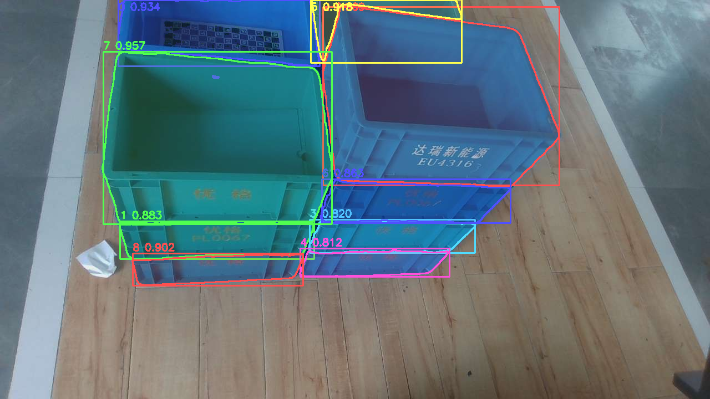

# 继续部署 Orin 箱体定位流水线

- 归档编号：`01a08e82-fd12-7123-8827-f52d68107d14`
- 项目：S1 IE_lab 拆垛
- 创建时间：2026-09-11T14:06:51.687000+08:00
- 更新时间：2026-09-11T14:29:00.149000+08:00
- 状态：活动
- 导出范围：用户可见消息与助手可见回复；不含隐藏推理和工具原始输出

## 1. 用户

/home/galbot/ie\_lab/bin/s1-python /home/galbot/Lsy03/move\_to\_pregrasp.py \\
&#x20; \--arm right \\
&#x20; \--xyz 0.895094 -0.311603 0.598968 \\
&#x20; \--rpy-deg 0 0 0 \\
&#x20; \--speed 0.05 \\
&#x20; \--output "/home/galbot/Lsy03/v5\_right\_pregrasp\_$(date +%Y%m%d\_%H%M%S).json" \\
&#x20; \--execute 给我生成一下右臂的V5预抓取位命令

## 2. 助手

按你示例中的偏移 **X−0.035 m、Y＋0.050 m、Z不变**，本轮右臂 V5 预抓取位为：

`[0.915834, -0.316822, 0.594662] m`

保留你指定的 `RPY=0 0 0`：

```bash
/home/galbot/ie_lab/bin/s1-python /home/galbot/Lsy03/move_to_pregrasp.py \
  --arm right \
  --xyz 0.915834 -0.316822 0.594662 \
  --rpy-deg 0 0 0 \
  --speed 0.05 \
  --output "/home/galbot/Lsy03/v5_right_pregrasp_$(date +%Y%m%d_%H%M%S).json" \
  --execute
```

此命令用于右臂 TCP 到预抓取位，夹爪、左臂、升降和底盘不应运动。执行前确认箱体和底盘位置未改变，审阅脚本生成的计划，检查肘部及夹爪路径净空、低速设置和急停；现场确认后再提交运动。我未执行此命令。

## 3. 用户

| 阶段机械臂XYZ |    |          |           |                         |
| -------- | -- | -------- | --------- | ----------------------- |
| 预抓取位     | 左臂 | 0.981083 | 0.302495  | 0.594662                |
| 预抓取位     | 右臂 | 0.950834 | -0.366822 | 0.594662                |
| 抓取位      | 左臂 | 0.975665 | 0.182617  | 0.594662                |
| 抓取位      | 右臂 | 0.956252 | -0.246944 | 0.594662 给我一版FDP的一起对比一下 |

## 4. 助手（进展）

我会用本轮右腕同帧 FDP 结果，按与 V5 相同的预抓取/抓取规则计算左右臂 TCP，再放在一张表里比较。这里沿用你贴出的原始几何坐标，不加上一条命令中的 XYZ 标定偏移。

## 5. 助手

以下使用**本轮右腕同帧的 V5/FDP 结果**，按相同 mode-00 几何规则计算。坐标系均为 `base_link`，单位米，**未加 XYZ 标定偏移**。

| 阶段 | 机械臂 | V5 XYZ（m） | FDP XYZ（m） | 两者距离 |
|---|---|---|---|---:|
| 预抓取位 | 左臂 | `[0.981083, 0.302495, 0.594662]` | `[0.980314, 0.308395, 0.596440]` | 6.21 mm |
| 预抓取位 | 右臂 | `[0.950834, -0.366822, 0.594662]` | `[0.958168, -0.361239, 0.596440]` | 9.39 mm |
| 抓取位 | 左臂 | `[0.975665, 0.182617, 0.594662]` | `[0.976347, 0.188460, 0.596440]` | 6.15 mm |
| 抓取位 | 右臂 | `[0.956252, -0.246944, 0.594662]` | `[0.962135, -0.241305, 0.596440]` | 8.34 mm |

右臂预抓取位的 **FDP−V5** 差值为：X **+7.33 mm**、Y **+5.58 mm**、Z **+1.78 mm**。

这是末端几何候选的差异，不是精度误差；新目标仍需规划与碰撞检查。[完整对照数据](../../assets/b36b05eca605c2c1--v5_fdp_tcp_comparison.json)已保存。

[附件：b36b05eca605c2c1--v5_fdp_tcp_comparison.json](../../assets/b36b05eca605c2c1--v5_fdp_tcp_comparison.json)

## 6. 用户

我们这几次实验是否数据都沉淀下来了？我们后面来离线分析，S1别人马上要调了

## 7. 助手（进展）

我马上核对这几次实验在本机和 S1 上的保存情况，补齐缺失数据并校验哈希，确保后续能离线分析。此次只复制已保存文件，不采集、不调用 SDK 或运动接口；完成后关闭本任务的连接，方便交接 S1。

## 8. 用户

我们继续

## 9. 助手（进展）

继续做离线沉淀。上次备份命令被中断，远端数据没有删除；我会新建一个独立归档目录，把 S1 `runs/` 下这几次实验完整复制到本机，保留失败运行、原始 RGB-D、mask、服务响应、V5/FDP 结果和耗时，然后生成文件清单与 SHA-256。整个过程只读 S1 文件，不启动 SDK。

## 10. 助手（进展）

归档复制已完成：S1 `runs/` 共 9 个目录、约 72 MB、302 个文件，包含成功、拒绝、时间同步失败和认证失败记录；没有删除或修改 S1 文件。接下来我把本地生成的双腕对照、TCP 对照、投影图和报告一起登记，并生成 SHA-256 清单。

## 11. 助手（进展）

本机归档已完成并通过 302 个文件的 SHA-256 校验。最后我检查 S1 没有残留本次流水线/SSH 子进程、控制锁没有被占用，再把交接状态写清楚。

## 12. 助手（进展）

归档中发现一个需要明确标注的缺口：首轮右腕 `live_right_20260911_01` 的 RGB-D、mask、LingBot、V5 都在，但它的首轮 FDP 原始 HTTP 请求/响应不在该 `runs/` 目录；本地只保留了归一化 TCP 报告和对比文档。我再检查 S1 旧 `fdp_baseline` 输出目录是否有同名原始响应，能恢复就一并归档。

## 13. 助手

已经沉淀完成，当前状态适合交给其他人调试。

- 从 S1 只读归档了 9 个运行目录，共 72 MB、302 个文件。
- 包含 RGB、原始深度、LingBot 深度、K、TF、SAM3 响应、全部候选 mask、人工确认、V5 结果、FDP 对照和失败记录。
- 成功、V5 拒绝、RGB/深度不同步失败、SAM3 401 失败都已保留。
- `SHA256SUMS` 已生成并校验通过。
- S1 检查结果：流水线进程数 `0`，控制锁占用数 `0`，没有运动命令发送。

归档入口：

- [归档说明 README](../../assets/6447fdf08ba408f0--README.md)
- [SHA-256 清单](/home/lsy03/文档/ChatGPT/S1/experiments/20260910_orin_pose_pipeline/archives/20260911_live_runs/SHA256SUMS)
- [双腕 V5/FDP 报告](../../assets/19a48ea1406f977c--s1_orin_bilateral_fdp_comparison_20260911.md)
- [V5/FDP TCP 对照](../../assets/b36b05eca605c2c1--v5_fdp_tcp_comparison.json)

有一个已明确记录的缺口：首轮右腕 FDP 的原始 HTTP 请求/响应不在该次远端 `runs` 目录，本地保留了其归一化报告、TCP 结果和对比文档；后续离线分析应优先使用双腕实验和第二观测位中完整保存的 FDP 原始请求/响应。 S1 上的原始 `runs/` 暂未删除。

[附件：6447fdf08ba408f0--README.md](../../assets/6447fdf08ba408f0--README.md)

[附件：19a48ea1406f977c--s1_orin_bilateral_fdp_comparison_20260911.md](../../assets/19a48ea1406f977c--s1_orin_bilateral_fdp_comparison_20260911.md)

[附件：b36b05eca605c2c1--v5_fdp_tcp_comparison.json](../../assets/b36b05eca605c2c1--v5_fdp_tcp_comparison.json)

## 14. 助手

_历史投影中的图片引用（用于补全本地对话资源）。_




