# 9_12 周报 规划S1拆垛周报版本演进

- 归档编号：`01a08f7e-856c-71c1-8fef-32ba16cf5ce7`
- 项目：S1 IE_lab 拆垛
- 创建时间：2026-09-11T16:03:48.725000+08:00
- 更新时间：2026-09-12T09:46:26.436000+08:00
- 状态：活动
- 导出范围：用户可见消息与助手可见回复；不含隐藏推理和工具原始输出

## 1. 用户

参考一下“9\_5 周报 9\_7 整理S1 IE\_lab拆垛周报”，我9\_14 要给经理继续汇报本周拆垛的进度了

我这周是不是 主要在“各个版本ICP 算法的演进之路”？ 我要不要总结一个版本演进流程，然后选几个重要的版本来做一下数据对比，然后给出下一步的计划

## 2. 助手（进展）

我先找一下上次周报和本周 ICP 实验记录，核对这周的主线，再帮你梳理 9 月 14 日汇报该怎么讲、哪些版本值得对比。

## 3. 助手（进展）

目前记录支持把“位姿后端替代与演进”作为主线，但“各版本 ICP”不够准确：前面主要是几何和壳体拟合，V5-4 才正式加入 ICP。本周还完成了 Orin 部署和实时感知对照，这部分也应放进汇报，体现从离线实验走向实机的进展。

## 4. 助手

**是的，建议按“版本演进 → 关键版本数据对比 → 当前结论与下一步计划”来讲。** 我看过你提到的上次周报，也核对了本周实验报告。上次讲到“FDP 流程拆分、ICP 方案选型”；这周已经推进到**替代算法实现、批量对照和 Orin 实机部署**，这个承接关系很清楚。

不过，主题建议写成：

**「拆垛箱体位姿估计：轻量后端演进与实机验证」**

“各版本 ICP 算法的演进之路”可以作为口头引入，但技术上前几个版本主要是几何估计、壳体拟合，**V5-4 才正式加入 ICP**。

**1. 版本演进：重点讲每次为什么改**

可以压缩成下面这张表，不用逐个展开所有小版本：

| 阶段 | 为什么做这一步 | 本轮得到的结论 |
|---|---|---|
| 箱口/多平面几何，V3–V4 | 尝试利用规则箱体几何直接估计位姿 | 内外壁、法兰和高度差异使简单矩形模型不够用 |
| Mesh 壳体拟合，V5-3 | 引入随高度变化的真实模型截面 | D02–D12 中 9/11 通过拟合门限，形成可运行基线 |
| 多初值与可见性，V5-2＋V5-3b | 补齐初值，处理遮挡、截边和内外壁歧义 | 改善候选覆盖与拒绝机制，成为当前部署版本 |
| ICP 精修，V5-4 | 检查在壳体拟合基础上还能提高多少 | 当前受约束 ICP 整体收益很小，侧壁观测对高度约束不足 |
| 倾斜 6DoF，V5-5 | 解决直立假设与实际倾斜不一致的问题 | 原型已实现，但验证未达标，继续保留现有基线 |

这里最值得讲的发现是：**后续瓶颈集中在表面对应、可见性和倾斜，而加上 ICP 本身没有带来明显改善。** [ICP 实验报告](../../assets/c2e1facacf098c95--V5_4_ICP_AB_REPORT_20260909.md)

**2. 数据对比：选四个代表版本就够了**

建议正文使用 **H01L–H03L 同三帧、同一批确认输入**的现成结果：

| 代表版本 | 与 FDP 的候选中心差中位数 | 输出状态 |
|---|---:|---|
| V4-joint | 21.54 mm | 0/3 接受 |
| V5-3 壳体拟合 | 13.65 mm | 3/3 通过拟合门限 |
| V5-2＋V5-3b | 10.76 mm | 1/3 接受，其余因歧义拒绝 |
| V5-4 受约束 ICP | 10.66 mm | 3/3 优化完成，无独立发布门禁 |

**表下注明：含拒绝候选；FDP 是对照后端，差异不是绝对精度，各版本门限也不同。** 这样可以展示结果，又不会把“更接近 FDP”或“通过门限”误写成准确率提升。[统一对照报告](../../assets/2431ad02e40302a7--REPORT.md)

V5-5 放在“探索结果与问题”里单独一句：**已尝试倾斜扩展，但合成验收未通过，真实三帧均拒绝，暂不替换当前版本。**

**3. 保留一块“实机落地进展”**

这部分能让经理看到算法实验如何服务拆垛：

- 已将 V5-2＋V5-3b 部署到 Orin，打通采集、远端 SAM3/LingBot、人工选目标、本地位姿输出。
- 已完成左右腕实时输入及同帧 FDP 对照。
- 双腕同箱体实验中，右腕通过拟合门限，与 FDP 中心差 **6.82 mm**；左腕因截边和表面歧义拒绝。
- 当前仍需验证重复性、绝对精度和抓取效果。[实机对照记录](../../assets/19a48ea1406f977c--s1_orin_bilateral_fdp_comparison_20260911.md)

**4. 下周计划写成三个能验收的任务**

1. **验证稳定性：**冻结当前版本，在固定箱体、固定视角下采集重复帧，统计中心/方向抖动、拒绝率和耗时。
2. **确认实际误差：**核对实物与 mesh、内外壁对应，补独立测量参考，重点评价箱口和两侧抓取参考点。
3. **修复倾斜分支：**先解决 V5-5 的模型与观测对应问题，通过固定合成验收后，再决定是否进入下一阶段。

延续你上次喜欢的简洁形式，建议**正文一页：演进表＋关键对比＋一张实机叠加图＋下周计划**；完整版本数据放附页。

开场可以直接说：

> 上周完成了 FDP 流程拆分和替代方案评估，本周完成了多轮轻量位姿算法实现与对照，并将当前基线部署到 Orin，打通实时感知流程。实验表明，壳体建模和可见性处理是主要进展，ICP 精修暂未带来明显收益；下一步重点验证稳定性、实际抓取点误差和倾斜适用性。

[附件：c2e1facacf098c95--V5_4_ICP_AB_REPORT_20260909.md](../../assets/c2e1facacf098c95--V5_4_ICP_AB_REPORT_20260909.md)

[附件：2431ad02e40302a7--REPORT.md](../../assets/2431ad02e40302a7--REPORT.md)

[附件：19a48ea1406f977c--s1_orin_bilateral_fdp_comparison_20260911.md](../../assets/19a48ea1406f977c--s1_orin_bilateral_fdp_comparison_20260911.md)

## 5. 用户

我怎么觉得我们使用 D01-D12的数据验证会比较好

## 6. 助手

**我同意，周报主对比用 D01–D12 更合适。** 这批数据贯穿了版本开发，更适合解释“发现什么问题、为什么改、改完有什么变化”。我前面优先推荐 H01L–H03L，考虑的是已有同帧全版本对照表，但它只有三帧，而且倾斜问题会干扰这条主线。

建议这样安排：

- **D01–D12：主对比数据。** 展示版本演进、拟合表现、与 FDP 的差异和耗时。
- **H01L–H03L：倾斜场景补充。** 说明当前直立假设的局限，以及为什么探索 V5-5。
- **Orin 实时数据：部署成果。** 证明流程已在实机运行。

这里有一个需要统一的细节：**现成的主要批量结果覆盖 D02–D12，共 11 帧；D01 是早期单帧实验，部分版本和 FDP 参考的运行批次不同。** 所以最终可以用完整 D01–D12，但应先核对输入和版本，补齐缺项，再统计。若直接使用现有报告，就明确写“D02–D12，11 帧”，把 D01 作为案例展示。

正文选四个代表版本即可：

| 版本 | 对比重点 |
|---|---|
| V4 | 简单几何模型遇到了什么限制 |
| V5-3 | 引入 mesh 壳体模型后的变化 |
| V5-2＋V5-3b | 多初值、可见性和歧义拒绝带来的变化 |
| V5-4 | 加入 ICP 后是否值得增加计算量 |

每个版本统一报告：**接受/拒绝数量、与 FDP 的中心及两短边参考点差异、yaw 差异、算法耗时**。拒绝候选单独标注，不能只筛出表现好的帧。

配图重点选 **D08、D03、D12** 就很有说服力：

- **D08：**原先没有初值，后来补齐候选。
- **D03：**原先通过，后来识别出内外壁歧义而拒绝。
- **D12：**截边及拟合不足，明确拒绝输出。

这样既能讲出改进，也能解释“版本升级不一定意味着通过数量增加”。

唯一要保留的口径是：**D01–D12 已参与开发，适合做版本回归对比；泛化能力仍需冻结版本后用新数据验证。与 FDP 的差异也不等于真实误差。**

## 7. 用户

给我参考一下“ICP\_\_\_\_\_V0至V5算法演进” 这个对话，我需要整理一份一两页的报告周一来汇报这段时间ICP的工作，再给我看看，报告使用什么结构比较好？是否需要放一些什么数据对比图或者是箱子识别图还有啥点云分析图，这样就更直观和专业一点，有视觉效果哈哈哈

## 8. 助手（进展）

我先找一下“ICP_____V0至V5算法演进”这段对话，并核对现有对比图和实验结果，再给你一个适合一两页汇报的结构，具体到每张图放什么、要说明什么结论。

## 9. 助手

_工具输出图片（原始工具文本未纳入归档）。_


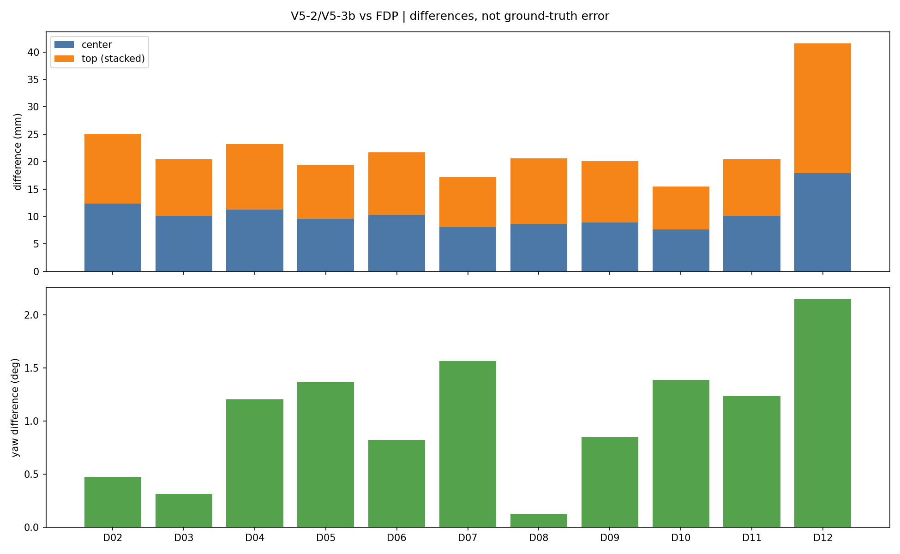

## 10. 助手

看过 **“ICP_____V0至V5算法演进”** 了。这次建议做成 **两页 A4：第一页讲“做了什么、效果如何”，第二页讲“为什么这样改、下一步解决什么”**。你想加入数据图、箱体定位图和点云分析图，很合适；每张图配一句明确结论，视觉效果和技术说服力就都有了。

标题可以保留熟悉的 ICP 表述：

**《S1 拆垛位姿估计阶段进展——轻量几何与 ICP 替代 FDP》**
副标题：V0–V5-5 算法演进、离线对照与 Orin 部署｜2026.09.14

**第一页：阶段成果与量化对比**

| 位置 | 放什么 | 要回答的问题 |
|---|---|---|
| 顶部 | 目标＋两三句阶段结论 | 为什么做？现在做到哪里？ |
| 中上 | 简化的版本演进图 | 各次改进解决了什么问题？ |
| 中下 | 同帧箱体位姿叠加图＋批量数据图 | 输出长什么样？与 FDP 差多少？ |
| 底部 | 当前部署版本及验证状态 | 哪个版本正在用？ |

开头可以直接写：

> 本阶段围绕 FDP 位姿后端替代，完成了箱口、侧壁、多平面、mesh 壳体拟合及 ICP 精修等路线实验，并将 V5-2＋V5-3b 部署到 Orin。当前已形成可运行的轻量位姿基线；ICP 精修在现有数据上收益有限，后续重点是表面对应、稳定性及倾斜适用性验证。

演进图沿用那段对话核实的关系，但压缩为几个大节点：

- **V0 FDP：**放在旁边作为参考后端。
- **V1 箱口／V2 箱壁 → V3 多平面 → V4 几何修正 → V5 壳体拟合。**
- 从当前 **V5-2＋V5-3b** 分出“V5-4 ICP 精修”和“Orin 部署”。
- **V5-5 倾斜原型**单独标为探索分支。

这样能避免把所有版本画成一条“逐代变好”的直线。[已核对的版本关系](../../assets/720a60163859ce09--s1_pose_version_lineage_20260912.md)

**第二页：关键发现、问题与下一步**

| 位置 | 放什么 | 推荐内容 |
|---|---|---|
| 上半页 | 点云／模型对应分析图 | 解释为什么固定外矩形不够用，为什么改成 mesh 壳体 |
| 中间 | 两个代表案例 | D08 初值补齐；D03 歧义拒绝或 D12 截边拒绝 |
| 下半页 | 当前结论＋三项后续任务 | 保留部署基线、补精度验证、推进倾斜分支 |

**配图建议控制在四组，具体这样选：**

**① 版本演进图：一张，说明工作脉络。**
每个节点只写“方法＋关键变化”，详细算法原理留作口头讲解。V5-0、V5-1 合并为“模型准备”，不用各占一个大框。

**② 箱体位姿叠加图：同一帧并排展示 FDP 与当前 V5。**
画出箱体框、中心和两条短边参考点，颜色和视角统一。图名用“箱体位姿估计对比”更准确，因为本次主要改进的是位姿后端，分割仍来自 SAM3。

选一个正常通过样本作主图，拒绝案例放第二页，不必把十二个箱子都缩成小图。

**③ 数据对比图：以 D 数据为主，做两个小面板。**

- **面板 A：**逐帧与 FDP 的中心差，比较 V5-3、V5-2＋V5-3b；用空心点标拒绝候选，缺失结果留空。
- **面板 B：**壳体拟合与受约束 ICP 的逐帧 p90 残差对比，直接回答“加 ICP 有多少收益”。

V4 的接受状态和各版本耗时放小表即可，不必把所有指标塞进图里。现成批量统计以 **D02–D12，11 帧**最完整；D01 可以作为早期案例，统一输入并补齐结果后再纳入十二帧汇总。

我看了现有数据图，其中把“中心差”和“箱口差”画成了堆叠柱。这两个量相加没有明确意义，**正式报告应改成并列点图或分面图**。

**④ 点云分析图：最值得做成报告亮点的一张。**
建议同一帧、同一视角并排画：

> 观测侧壁点＋固定矩形模型　｜　观测侧壁点＋mesh 壳体模型

灰色表示观测点，橙色表示模型，只标注两三个关键部位：**内壁、外壁、法兰**。图注可以写：

> 箱体不同高度、不同表面的截面并不相同，固定外尺寸难以解释全部观测；因此转向随高度变化的壳体模型。

现有 D02 诊断图已经包含“RGB 投影＋俯视点云＋拟合残差”，可作为素材基础：


正式版需要放大箱体区域、换成中文短标注，并让两种模型使用相同坐标范围；原始调试图中的长标题和大片空白可以去掉。

最后的计划控制为三条：**固定版本验证重复性、核对模型与实物并测量抓取参考点误差、修复倾斜原型后重新验收。** Orin 部署成果保留一个小块，V5-5 的未达标结果用一句话说明。

整份报告保持统一字体和配色，约一半版面用于图。页脚简短注明：**FDP 差异非真值误差；拟合通过非抓取成功；D 数据用于开发回归。** 这样经理能快速看懂成果，也能沿着图理解你做出技术选择的依据。

[附件：720a60163859ce09--s1_pose_version_lineage_20260912.md](../../assets/720a60163859ce09--s1_pose_version_lineage_20260912.md)


## 11. 用户

好的，给我执行

## 12. 助手（进展）

我现在按这个结构直接做成一份可汇报的 1–2 页报告：用 D01–D12 作为主数据，补上版本演进图、关键数据对比图、箱体/点云诊断图，并同时生成可编辑 Markdown 和 PDF 预览。我会先遵循项目文档与 PDF/可视化技能的排版和核验要求。

## 13. 助手（进展）

我已经把版本编号和数据口径核对好了：报告会明确 V0 是 FDP 参考，V1–V4 是几何路线，V5 是 mesh/可见性路线，V5-4 才是显式 ICP，V5-5 是独立倾斜探索分支。D02–D12 的 11 帧批量结果作为主数据，D01 作为早期案例补充，避免把不同批次硬拼成“12 帧同条件对比”。现在开始生成图和两页版式。

## 14. 助手

_工具输出图片（原始工具文本未纳入归档）。_

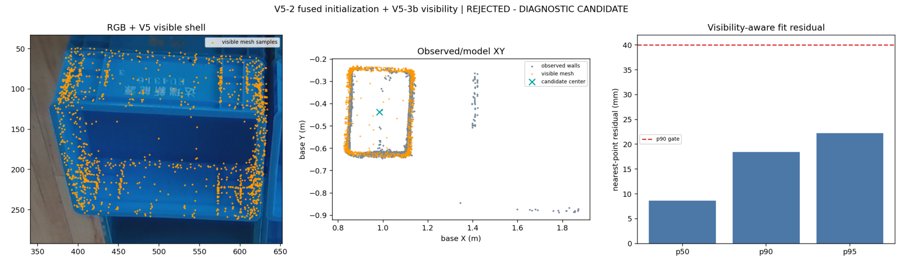


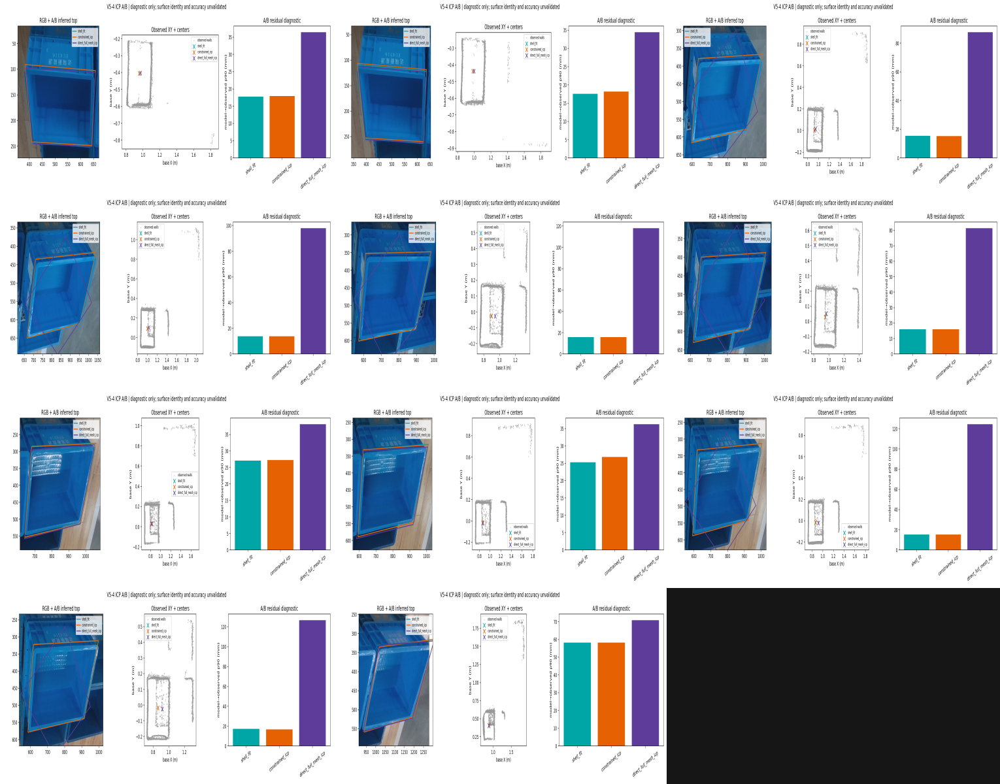

## 15. 助手

_工具输出图片（原始工具文本未纳入归档）。_


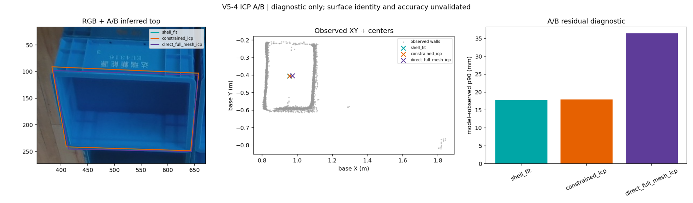

## 16. 助手

_工具输出图片（原始工具文本未纳入归档）。_

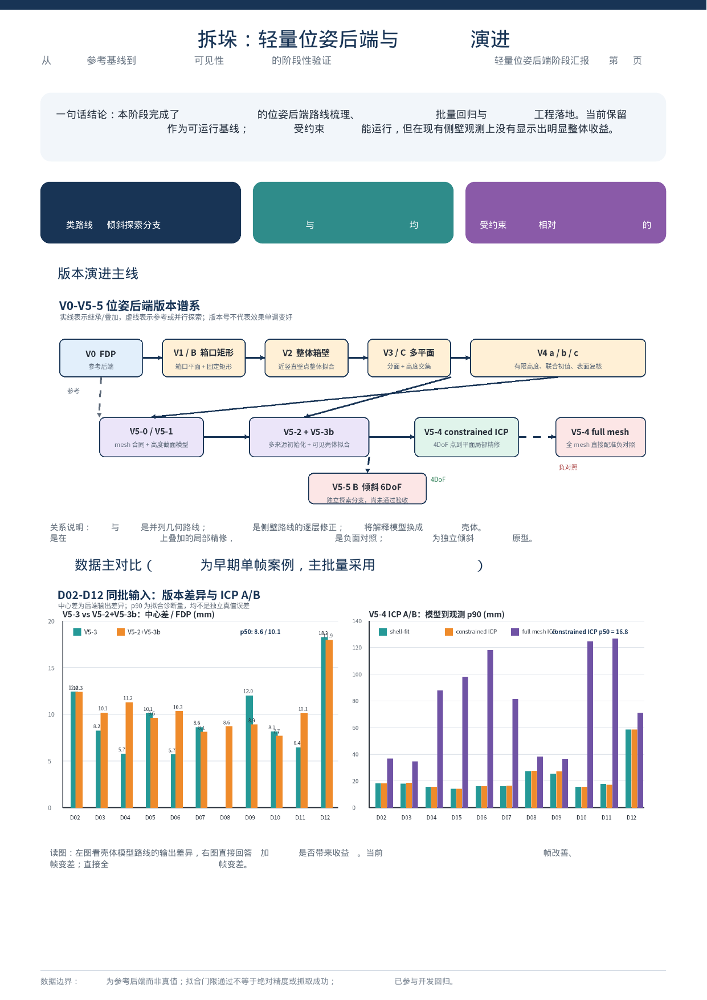

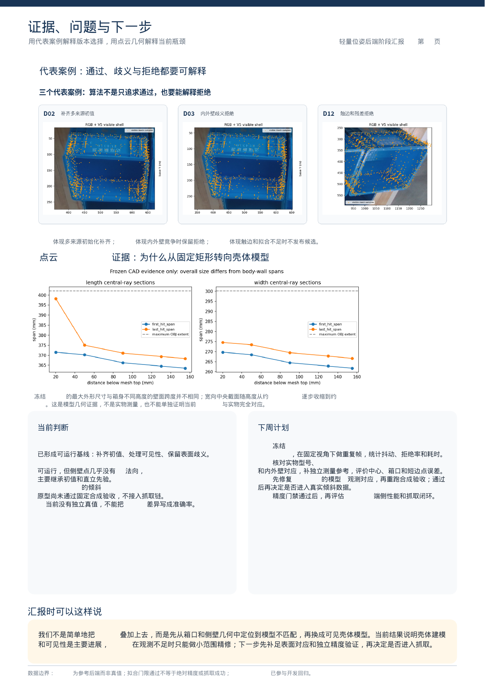

## 17. 助手

_工具输出图片（原始工具文本未纳入归档）。_


## 18. 助手

_工具输出图片（原始工具文本未纳入归档）。_

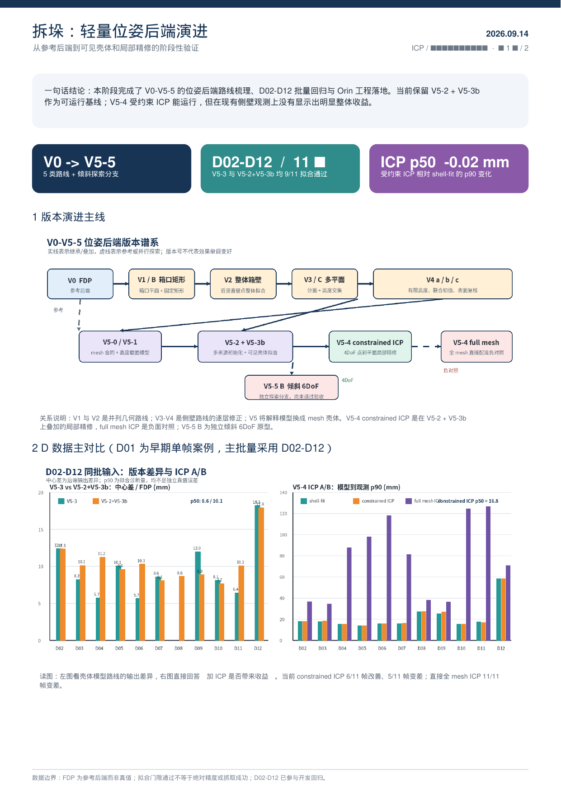

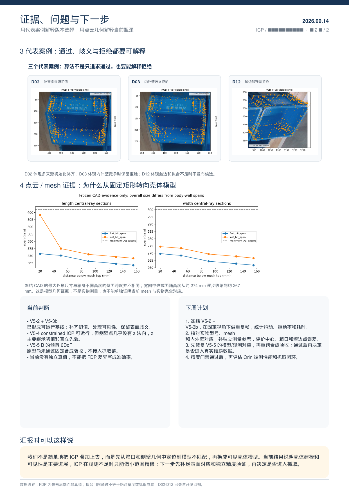

## 19. 助手

_工具输出图片（原始工具文本未纳入归档）。_


## 20. 助手

_工具输出图片（原始工具文本未纳入归档）。_


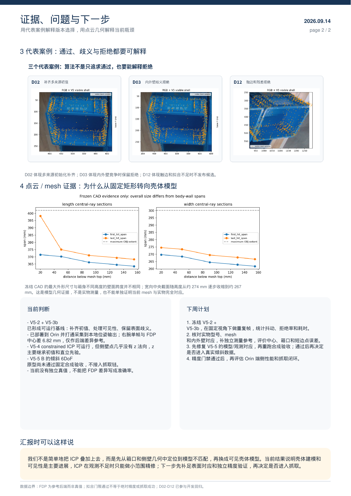

## 21. 助手

_工具输出图片（原始工具文本未纳入归档）。_


## 22. 用户

“”“”
````mermaid
flowchart TD
    I["同一目标的 RGB-D、mask、K、TF"]
    I --> F["V0：FDP<br/>参考后端"]
    I --> B["V1 / B：箱口矩形<br/>从边缘和平面找箱口"]
    I --> W["V2：整体箱壁中心<br/>从竖直壁点拟合矩形"]

    W -->|"细化建模：先分面再匹配"| C["V3 / C：多平面侧壁"]
    C -->|"修正高度统计范围"| A["V4-a：finite_height"]
    A -->|"增加三面联合初值"| J["V4-b：joint"]
    J -->|"叠加表面身份复核"| S["V4-c：surface"]

    S --> Q["发现模型问题：<br/>内壁、外壁、法兰不能共用最大外矩形"]
    Q --> M["V5：转向 mesh 壳体模型"]
    B -.->|"箱口候选后续复用"| M
    J -.->|"侧壁候选后续复用"| M
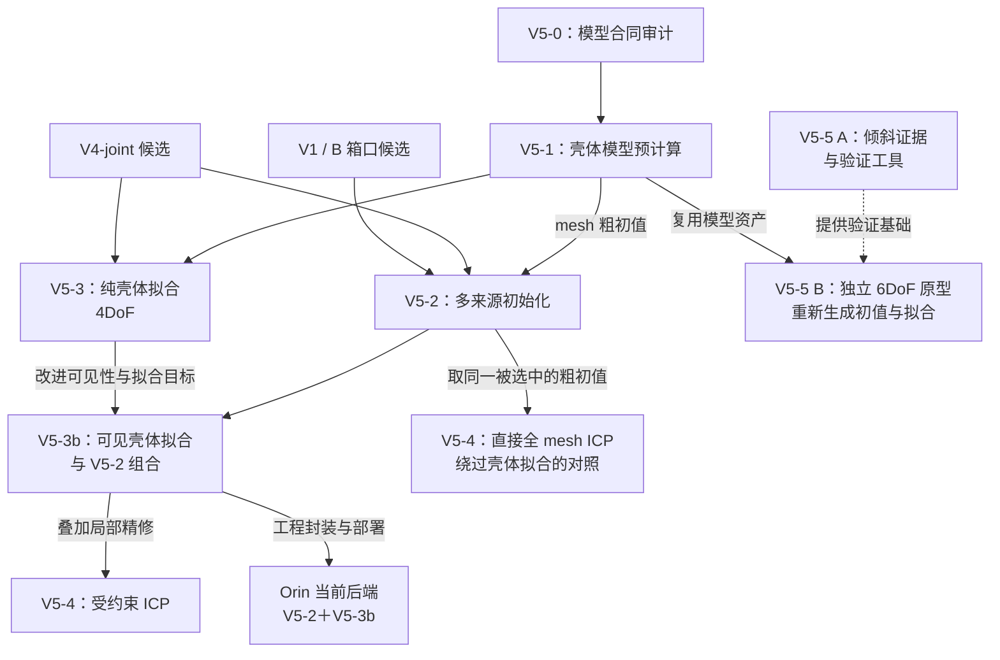
```mermaid
flowchart TD
    M0["V5-0：模型合同审计"] --> M1["V5-1：壳体模型预计算"]

    J["V4-joint 候选"] --> S3["V5-3：纯壳体拟合<br/>4DoF"]
    M1 --> S3

    B["V1 / B 箱口候选"] --> S2["V5-2：多来源初始化"]
    J --> S2
    M1 -->|"mesh 粗初值"| S2

    S3 -->|"改进可见性与拟合目标"| S3B["V5-3b：可见壳体拟合<br/>与 V5-2 组合"]
    S2 --> S3B

    S3B -->|"叠加局部精修"| ICP["V5-4：受约束 ICP"]
    S2 -->|"取同一被选中的粗初值"| DIRECT["V5-4：直接全 mesh ICP<br/>绕过壳体拟合的对照"]

    S3B -->|"工程封装与部署"| ORIN["Orin 当前后端<br/>V5-2＋V5-3b"]

    M1 -->|"复用模型资产"| TILT["V5-5 B：独立 6DoF 原型<br/>重新生成初值与拟合"]
    TA["V5-5 A：倾斜证据<br/>与验证工具"] -.->|"提供验证基础"| TILT
```
````

“”“”


我看了一下，报告里的路线演进图，我们使用这两张就行。


还有D01到D12 的数据对比我们直接整一个12 项的平均数就行了，不需要每个数据都摆出来

## 23. 助手（进展）

收到，我按你的意思改：路线图不再自绘成一张合并图，而是把你给的两张 Mermaid 关系图分别放进报告；D01-D12 的数据区改成“平均值 + 样本覆盖说明”的汇总图和小表，不再展示逐帧柱状图。这里会保留 D01/D08 的缺项说明，避免为了凑 12 项而填入没有证据的数值。

## 24. 助手

_工具输出图片（原始工具文本未纳入归档）。_

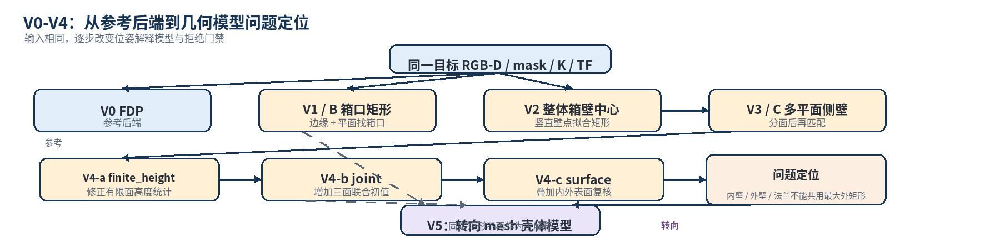

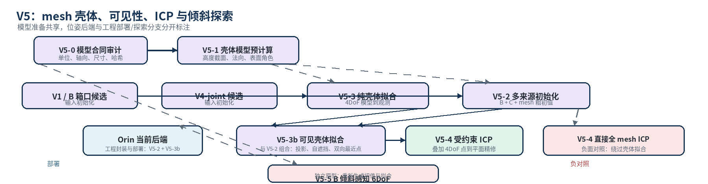

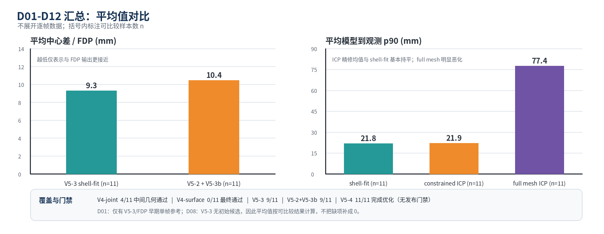

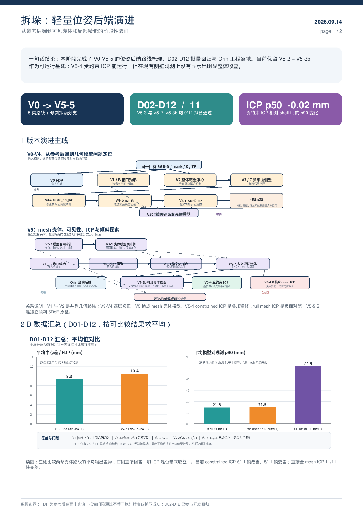

## 25. 助手

_工具输出图片（原始工具文本未纳入归档）。_


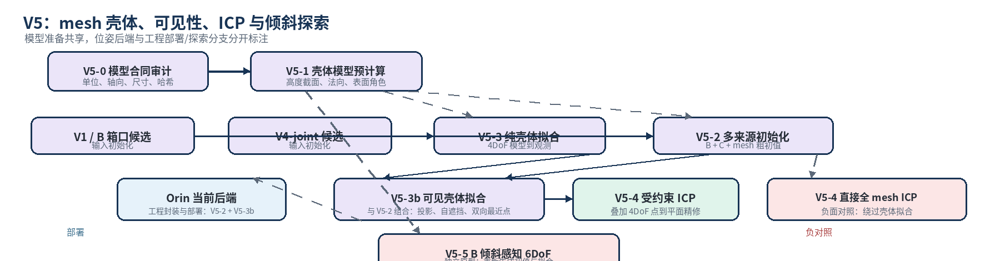

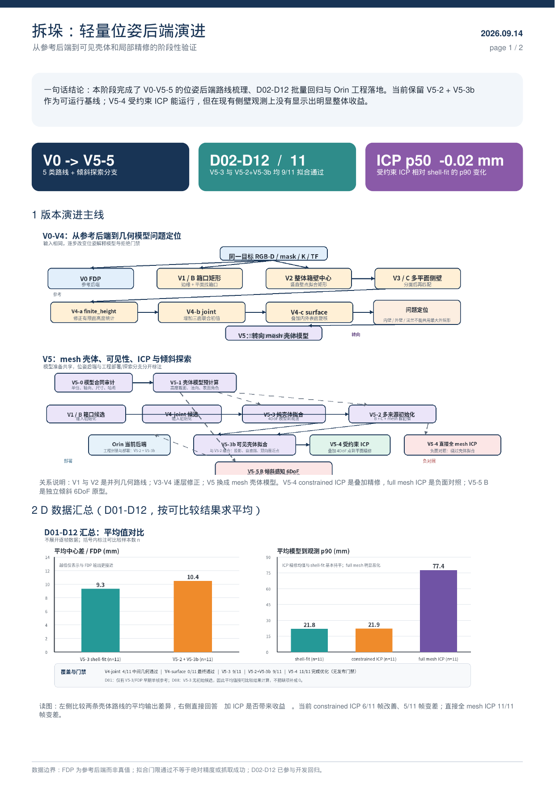

## 26. 助手

_工具输出图片（原始工具文本未纳入归档）。_


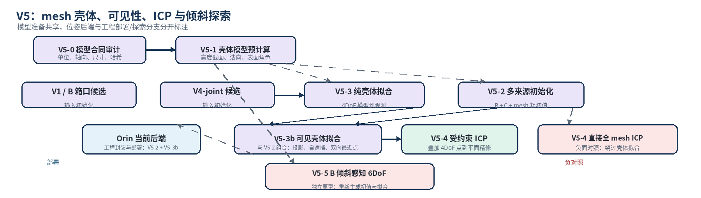

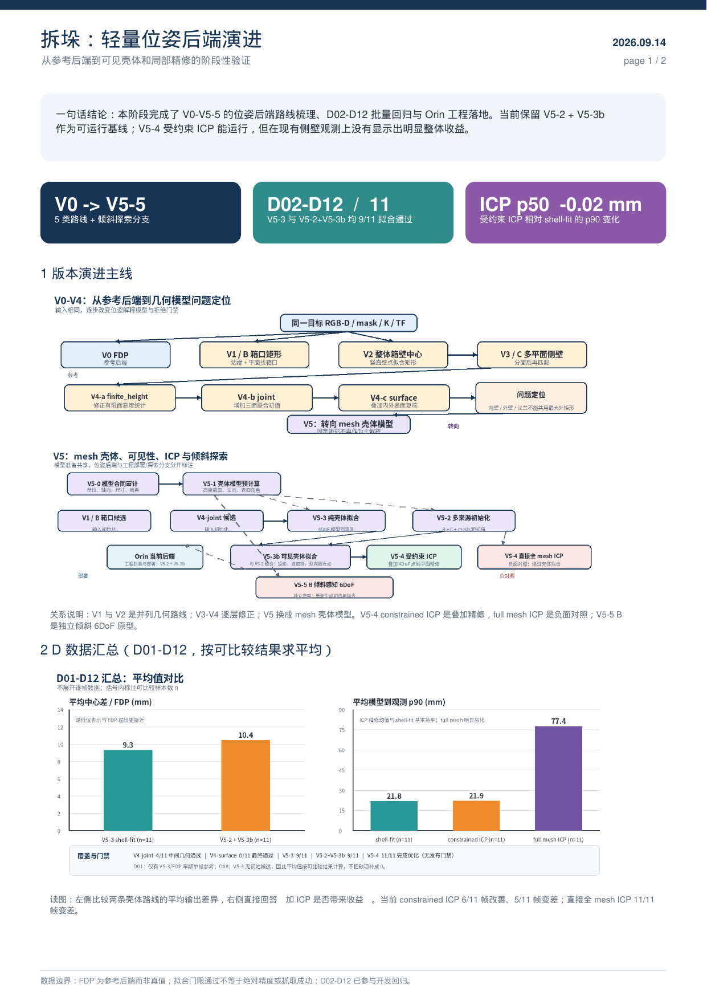

## 27. 助手

_工具输出图片（原始工具文本未纳入归档）。_


## 28. 助手

_工具输出图片（原始工具文本未纳入归档）。_

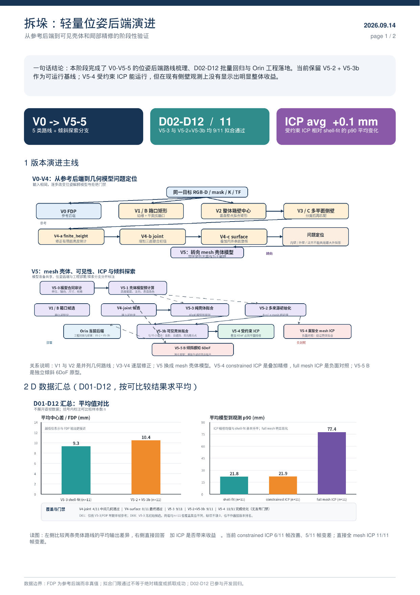


## 29. 助手

_工具输出图片（原始工具文本未纳入归档）。_


## 30. 助手

已按你的要求执行完成：

- 两张 Mermaid 路线演进图分别放入第一页。
- D01-D12 改为平均值汇总图，不再展示逐帧数据。
- 保留 D01、D08 缺项说明，平均值按可比较结果 `n=11` 计算。
- 第二页加入 D02、D03、D12 三个箱体识别案例和 mesh 点云截面分析图。
- PDF 已渲染检查，共 2 页 A4。

已生成经理汇报版 :codex-file-citation{path="/home/lsy03/文档/ChatGPT/S1/output/pdf/S1_ICP_算法演进阶段周报_2026-09-14.pdf" purpose="output"}，以及[可编辑 Markdown 源文件](../../assets/f92f9f22d9053cd6--S1_ICP_%E7%AE%97%E6%B3%95%E6%BC%94%E8%BF%9B%E9%98%B6%E6%AE%B5%E5%91%A8%E6%8A%A5_2026-09-14.md)。

- :codex-followup[替换汇报信息]{prompt="把报告中的汇报人、项目名称和日期替换成正式信息，并重新导出 PDF"}
- :codex-followup[加入实机截图]{prompt="把我提供的 Orin 实机截图加入报告，并保持两页排版"}
- :codex-followup[压缩成一页]{prompt="把当前报告压缩成一页经理速览版，保留两张路线图和平均值对比"}

[附件：c07a3c54af0787f7--S1_ICP_算法演进阶段周报_2026-09-14.pdf](../../assets/c07a3c54af0787f7--S1_ICP_%E7%AE%97%E6%B3%95%E6%BC%94%E8%BF%9B%E9%98%B6%E6%AE%B5%E5%91%A8%E6%8A%A5_2026-09-14.pdf)

[附件：f92f9f22d9053cd6--S1_ICP_算法演进阶段周报_2026-09-14.md](../../assets/f92f9f22d9053cd6--S1_ICP_%E7%AE%97%E6%B3%95%E6%BC%94%E8%BF%9B%E9%98%B6%E6%AE%B5%E5%91%A8%E6%8A%A5_2026-09-14.md)

## 31. 助手

_历史投影中的图片引用（用于补全本地对话资源）。_


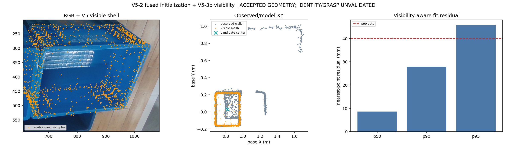

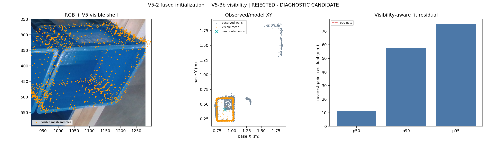


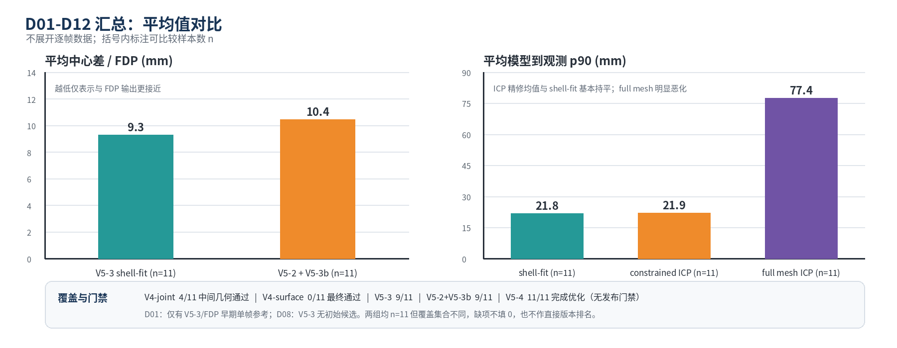
