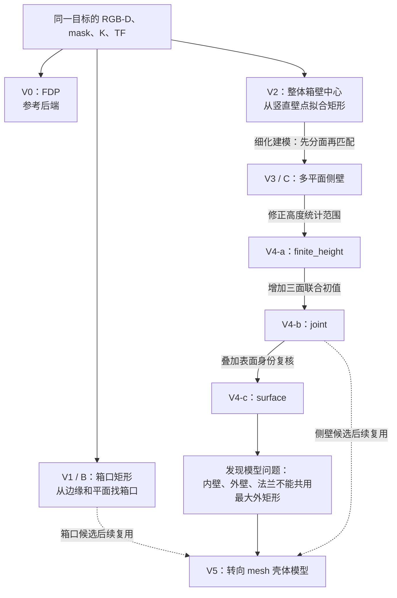
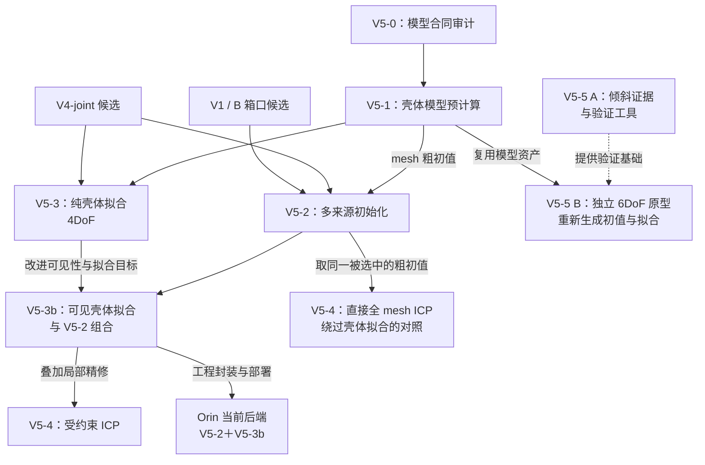

# ICP_____V0至V5算法演进

- 归档编号：`01a0930c-9ba5-7940-b29b-73c3650a9e4b`
- 项目：S1 IE_lab 拆垛
- 创建时间：2026-09-12T08:37:52.165000+08:00
- 更新时间：2026-09-12T08:42:15.916000+08:00
- 状态：活动
- 导出范围：用户可见消息与助手可见回复；不含隐藏推理和工具原始输出

## 1. 用户

草稿：

参考一下“9\_5 周报 9\_7 整理S1 IE\_lab拆垛周报”，我9\_14 要给经理继续汇报本周拆垛的进度了

我这周是不是 主要在“各个版本ICP 算法的演进之路”？ 我要不要总结一个版本演进流程，然后选几个重要的版本来做一下数据对比，然后给出下一步的计划

星期五16:07

用时 1m 46s

**是的，建议按“版本演进 → 关键版本数据对比 → 当前结论与下一步计划”来讲。** 我看过你提到的上次周报，也核对了本周实验报告。上次讲到“FDP 流程拆分、ICP 方案选型”；这周已经推进到**替代算法实现、批量对照和 Orin 实机部署**，这个承接关系很清楚。

不过，主题建议写成：

**「拆垛箱体位姿估计：轻量后端演进与实机验证」**

“各版本 ICP 算法的演进之路”可以作为口头引入，但技术上前几个版本主要是几何估计、壳体拟合，**V5-4 才正式加入 ICP**。

**1. 版本演进：重点讲每次为什么改**

可以压缩成下面这张表，不用逐个展开所有小版本：

| 阶段为什么做这一步本轮得到的结论   |                    |                               |
| ------------------ | ------------------ | ----------------------------- |
| 箱口/多平面几何，V3–V4     | 尝试利用规则箱体几何直接估计位姿   | 内外壁、法兰和高度差异使简单矩形模型不够用         |
| Mesh 壳体拟合，V5-3     | 引入随高度变化的真实模型截面     | D02–D12 中 9/11 通过拟合门限，形成可运行基线 |
| 多初值与可见性，V5-2＋V5-3b | 补齐初值，处理遮挡、截边和内外壁歧义 | 改善候选覆盖与拒绝机制，成为当前部署版本          |
| ICP 精修，V5-4        | 检查在壳体拟合基础上还能提高多少   | 当前受约束 ICP 整体收益很小，侧壁观测对高度约束不足  |
| 倾斜 6DoF，V5-5       | 解决直立假设与实际倾斜不一致的问题  | 原型已实现，但验证未达标，继续保留现有基线         |

这里最值得讲的发现是：**后续瓶颈集中在表面对应、可见性和倾斜，而加上 ICP 本身没有带来明显改善。** [ICP 实验报告](../../assets/c2e1facacf098c95--V5_4_ICP_AB_REPORT_20260909.md)

**2. 数据对比：选四个代表版本就够了**

建议正文使用 **H01L–H03L 同三帧、同一批确认输入**的现成结果：

| 代表版本与 FDP 的候选中心差中位数输出状态 |          |                  |
| ----------------------- | -------- | ---------------- |
| V4-joint                | 21.54 mm | 0/3 接受           |
| V5-3 壳体拟合               | 13.65 mm | 3/3 通过拟合门限       |
| V5-2＋V5-3b              | 10.76 mm | 1/3 接受，其余因歧义拒绝   |
| V5-4 受约束 ICP            | 10.66 mm | 3/3 优化完成，无独立发布门禁 |

**表下注明：含拒绝候选；FDP 是对照后端，差异不是绝对精度，各版本门限也不同。** 这样可以展示结果，又不会把“更接近 FDP”或“通过门限”误写成准确率提升。[统一对照报告](../../assets/2431ad02e40302a7--REPORT.md)

V5-5 放在“探索结果与问题”里单独一句：**已尝试倾斜扩展，但合成验收未通过，真实三帧均拒绝，暂不替换当前版本。**

**3. 保留一块“实机落地进展”**

这部分能让经理看到算法实验如何服务拆垛：

- 已将 V5-2＋V5-3b 部署到 Orin，打通采集、远端 SAM3/LingBot、人工选目标、本地位姿输出。
- 已完成左右腕实时输入及同帧 FDP 对照。
- 双腕同箱体实验中，右腕通过拟合门限，与 FDP 中心差 **6.82 mm**；左腕因截边和表面歧义拒绝。
- 当前仍需验证重复性、绝对精度和抓取效果。[实机对照记录](../../assets/19a48ea1406f977c--s1_orin_bilateral_fdp_comparison_20260911.md)

**4. 下周计划写成三个能验收的任务**

1. \*\*验证稳定性：\*\*冻结当前版本，在固定箱体、固定视角下采集重复帧，统计中心/方向抖动、拒绝率和耗时。
2. \*\*确认实际误差：\*\*核对实物与 mesh、内外壁对应，补独立测量参考，重点评价箱口和两侧抓取参考点。
3. \*\*修复倾斜分支：\*\*先解决 V5-5 的模型与观测对应问题，通过固定合成验收后，再决定是否进入下一阶段。

延续你上次喜欢的简洁形式，建议**正文一页：演进表＋关键对比＋一张实机叠加图＋下周计划**；完整版本数据放附页。

开场可以直接说：

> 上周完成了 FDP 流程拆分和替代方案评估，本周完成了多轮轻量位姿算法实现与对照，并将当前基线部署到 Orin，打通实时感知流程。实验表明，壳体建模和可见性处理是主要进展，ICP 精修暂未带来明显收益；下一步重点验证稳定性、实际抓取点误差和倾斜适用性。

星期五16:08

今天 8:30

我怎么觉得我们使用 D01-D12的数据验证会比较好

8:30

**我同意，周报主对比用 D01–D12 更合适。** 这批数据贯穿了版本开发，更适合解释“发现什么问题、为什么改、改完有什么变化”。我前面优先推荐 H01L–H03L，考虑的是已有同帧全版本对照表，但它只有三帧，而且倾斜问题会干扰这条主线。

建议这样安排：

- **D01–D12：主对比数据。** 展示版本演进、拟合表现、与 FDP 的差异和耗时。
- **H01L–H03L：倾斜场景补充。** 说明当前直立假设的局限，以及为什么探索 V5-5。
- **Orin 实时数据：部署成果。** 证明流程已在实机运行。

这里有一个需要统一的细节：**现成的主要批量结果覆盖 D02–D12，共 11 帧；D01 是早期单帧实验，部分版本和 FDP 参考的运行批次不同。** 所以最终可以用完整 D01–D12，但应先核对输入和版本，补齐缺项，再统计。若直接使用现有报告，就明确写“D02–D12，11 帧”，把 D01 作为案例展示。

正文选四个代表版本即可：

| 版本对比重点     |                   |
| ---------- | ----------------- |
| V4         | 简单几何模型遇到了什么限制     |
| V5-3       | 引入 mesh 壳体模型后的变化  |
| V5-2＋V5-3b | 多初值、可见性和歧义拒绝带来的变化 |
| V5-4       | 加入 ICP 后是否值得增加计算量 |

每个版本统一报告：**接受/拒绝数量、与 FDP 的中心及两短边参考点差异、yaw 差异、算法耗时**。拒绝候选单独标注，不能只筛出表现好的帧。

配图重点选 **D08、D03、D12** 就很有说服力：

- \*\*D08：\*\*原先没有初值，后来补齐候选。
- \*\*D03：\*\*原先通过，后来识别出内外壁歧义而拒绝。
- \*\*D12：\*\*截边及拟合不足，明确拒绝输出。

这样既能讲出改进，也能解释“版本升级不一定意味着通过数量增加”。

唯一要保留的口径是：**D01–D12 已参与开发，适合做版本回归对比；泛化能力仍需冻结版本后用新数据验证。与 FDP 的差异也不等于真实误差。**

8:31

要不你先给我讲讲我们这周所有的实验版本标号以及实验名称还有实验算法原理，我们先回顾一下，以及对比各个方向分支的关系是继承/叠加/替换还是什么别的关系，最好我们直观一点画个图来对比一下

[附件：c2e1facacf098c95--V5_4_ICP_AB_REPORT_20260909.md](../../assets/c2e1facacf098c95--V5_4_ICP_AB_REPORT_20260909.md)

[附件：2431ad02e40302a7--REPORT.md](../../assets/2431ad02e40302a7--REPORT.md)

[附件：19a48ea1406f977c--s1_orin_bilateral_fdp_comparison_20260911.md](../../assets/19a48ea1406f977c--s1_orin_bilateral_fdp_comparison_20260911.md)

## 2. 助手（进展）

我先核对本周实验目录、报告和代码中的版本定义，把各分支的算法原理及继承、叠加、替换关系理清，再画一张关系图。图示会使用 visualize 技能。

## 3. 助手（进展）

已经确认一个关键点：版本号并不是一条连续升级链。V4 的三个子版本是逐层叠加；V5-0/1 是模型准备，V5-2 是初始化模块；V5-4 里还同时包含“叠加精修”和“替换拟合”的两条对照分支。V5-5 则是独立的倾斜原型，不能理解为当前部署版本的升级版。

## 4. 用户

我们从V0开始算到V5最后一个版本

## 5. 助手（进展）

好的，按 V0 一直梳理到 V5-5。我会把早期原型也纳入，并区分仓库原有编号和为了回顾补充的阶段编号，避免把第一轮、第二轮、分支名混成一套版本号。

## 6. 助手（进展）

找到了此前已经约定的完整编号：**V0 是 FDP，V1 是箱口矩形，V2 是整体箱壁中心，V3 才是多平面侧壁。** 另外，源码核对发现早期报告对 V5-3 的初值描述偏宽：实际入口主要取 V4-joint 候选，完整的 B＋C＋mesh 多来源初值是在 V5-2 补齐的。这也解释了为什么 V5-3 先做出来，随后才补 V5-2。

## 7. 助手

**好，我们就沿用之前的编号，从 V0（FDP）一直讲到 V5-5。** 这套编号在之前的侧聊归档里已经有约定：V1 是箱口矩形，V2 是整体箱壁中心，V3 是多平面侧壁。

需要先抓住一点：**这是一棵算法探索树，其中有替代路线、模块叠加和独立分支；版本号更大，不代表效果一定更好。**

下面按“做了什么 → 为什么继续改 → 与前版是什么关系”回顾。

**先看 V0～V4：从现有后端，走到简单几何模型的局限**

这里 V0 与轻量算法是**对照关系**。我们尝试替换的是 FDP 的位姿估计环节，前面的 SAM3、LingBot、人工选目标仍保留。

| 编号与实验名称 | 算法原理，直观理解 | 为什么继续改 |
|---|---|---|
| **V0：FDP / FoundationPose++ 参考基线** | 把 RGB、深度、mask、相机内参和 mesh 交给现有服务，得到箱体完整位姿，再转换到统一坐标系。 | 作为已有参照，研究能否用更轻量的本地后端完成这一步。FDP 本身不是真值。 |
| **V1 / B：箱口矩形重建** | 找 RGB 边缘，用深度恢复三维点；寻找箱口候选平面，在平面内套一个 **400×300 mm 矩形**；由箱口中心沿法向减去半个箱高，得到箱体中心。 | **能套出矩形，却未必套在真正顶缘上。** D01 有多个不同高度的平面都支持矩形，因此拒绝。 |
| **V2：整体箱壁几何中心** | 不再依赖箱口，直接用深度局部法向挑选近竖直壁点，把这些壁点整体拟合到矩形周边；再利用壁面高度范围估计中心 Z。 | 内壁、外壁、筋条混在一起，整体拟合容易混淆；还存在缺边和高度范围不相容。 |
| **V3 / C：多平面侧壁分解** | 先把壁点分解成多个平面，再寻找符合长宽尺寸的组合；至少需要三个面，其中有一组相对面，最后检查各面给出的中心高度区间能否相交。 | 比整体拟合更能解释“哪几个面支持位姿”，但仍有候选遗漏、竞争解释和高度冲突。修正版在 D02–D12 为 **0/11 接受**。 |
| **V4-a：有限面高度修正** | 计算某个面的高度时，只统计真正落在这个箱体有限侧面范围内的点。 | 修复了混入范围外点造成的高度冲突，中间门禁变为 **2/11**。 |
| **V4-b：三面联合初始化** | 同时用“一对相对面＋一个正交面”求初值，补充之前搜索容易遗漏的组合。 | 找到更多合理候选，中间门禁变为 **4/11**，但还没有判断匹配的是内壁还是外壁。 |
| **V4-c：内外表面一致性复核** | 利用相机位置、平面朝向和候选箱体方向，检查“这个观测面是否能被当成外尺寸边界”。 | 发现内壁被强行套在最大外矩形上，最终 **0/11 接受**。这一步定位了模型问题。 |

**V1 与 V2 是两条并列路线；V3 是对箱壁路线的细化；V4-a → b → c 才是明确的逐层叠加。** V4-c 保留 V4-b 的候选位置，增加拒绝检查，并没有重新算出一个更准确的中心。

上述原理与结果见 [第一轮报告](../../assets/f028ac5cc7c9d42f--ROUND1_REPORT.md)、[V3 批量报告](../../assets/63d7c4085247be5f--ROUND2_BATCH_REPORT_20260908.md)、[V4 报告](../../assets/ae40583149b8b274--ROUND2_V4_REPORT_20260908.md)。

**V4 → V5 最关键的变化，是换了“用什么形状解释观测点”**

以前相当于拿一个固定的长方体外框去套所有侧壁。

但冻结 mesh 显示：**最大外形尺寸、箱身外壁间距、内腔间距是不同的，而且箱身截面随高度变化。** 例如距顶 50 mm 的宽向中央截面，内外层跨度约为 268–273 mm，明显小于最大宽度 300 mm。

因此 V5 改成：**先知道模型上有哪些表面、它们在哪里，再把模型与当前看见的点对齐。** 这些截面是 mesh 的几何证据，mesh 与实物是否完全对应仍待验证。

**再看 V5：模型准备、初始化、拟合、ICP 和倾斜分支**

| 编号与实验名称 | 具体算法原理 | 关系与当前结论 |
|---|---|---|
| **V5-0：模型合同与资产审计** | 核对 mesh 的单位、轴向、原点、尺寸、哈希及人工裁切结构。 | **准备工作**，不输出每帧位姿；实物对应关系仍待验证。 |
| **V5-1：随高度变化的壳体模型** | 预计算高度截面、模型点、法向和表面类别，区分内壁、外壁、法兰、接缝等。 | **共享模型模块**。生成了 36 个高度层；表面类别仍是启发式判断。 |
| **V5-2：B＋C＋mesh 多候选初始化** | 汇集箱口候选、侧壁候选和 mesh 粗初值，统一坐标并去重，然后分别交给拟合器。 | **初始化模块**，不是平均几个中心。补上了 D08 原先无初值的问题。 |
| **V5-3：纯壳体拟合** | 从粗位姿出发，移动、旋转 mesh 壳体，使模型点尽量接近观测点；采用鲁棒损失，优化 **x、y、z、yaw**。 | **替换固定矩形拟合模型**，保留旧候选作为起点。D02–D12 为 **9/11 通过拟合门限**。 |
| **V5-3b：可见性增强壳体拟合** | 在 V5-3 基础上，增加投影范围、自遮挡处理和双向最近点约束；检查触边、覆盖不足及内外壁竞争解释。 | **改进拟合模块＋叠加门禁**，与 V5-2 合用。仍为 **9/11**，但补出 D08、拒绝 D03，D12 继续拒绝。 |
| **V5-4：受约束 ICP** | 从壳体拟合后的位姿出发，只用筛选后的可见壳体点，进行多尺度、鲁棒的 **点到平面配准**，仍优化 4DoF。 | **叠加精修**。模型 p90 残差变化中位数仅 **−0.02 mm**，整体收益很小。 |
| **V5-4：直接全 mesh ICP** | 从同一个被选中的**粗初值**出发，直接用全部 mesh 角色配准，跳过壳体拟合优化。 | **替代对照路线**。本轮模型 p90 残差变化中位数 **＋65.38 mm**，明显恶化。 |
| **V5-5 A：倾斜证据与验证工具** | 检查顶部候选平面的倾斜、支持点来源和图像投影；用合成平面验证噪声、遮挡、退化与歧义处理。 | **验证工具阶段**，不是新的完整位姿估计器。 |
| **V5-5 B：倾斜感知 6DoF 壳体拟合** | 用观测点范围估中心、PCA 提议 yaw、顶部法向提议 roll/pitch；随后做可见壳体双向最近点优化，估计完整六自由度。 | **独立实验原型**，不是接在 V5-4 后面。合成整体验收未通过，真实 H 三帧全部拒绝，未替换部署基线。 |

V5 的执行证据见 [模型准备报告](../../assets/f1f67a61c302a33f--V5_0_V5_1_REPORT_20260908.md)、[V5-3 报告](../../assets/6cc95091f9a16741--V5_3_REPORT_20260908.md)、[V5-2＋V5-3b 报告](../../assets/9d3cb58bd7664ba3--V5_2_V5_3B_REPORT_20260908.md)、[ICP 对照报告](../../assets/c2e1facacf098c95--V5_4_ICP_AB_REPORT_20260909.md)、[V5-5 合成验收](../../assets/92a72128774ae0da--V5_5_B_STAGE_REPORT_20260910_v2.md)及[真实三帧对照](../../assets/f24d4c35a3246aab--V5_5_FDP_H01L_H03L_COMPARISON_20260910.md)。

**这里有三个容易讲混的地方。**

第一，**编号顺序不等于实施顺序。** 我们先做出了 V5-3 壳体拟合，再补齐 V5-2 多来源初值和 V5-3b。源码里，早期 V5-3 实际主要使用 V4-joint 候选，还没有完整接入 B＋C＋mesh 初始化。

第二，**V5-3 已经属于模型与观测的几何配准。** 它用的是最近点距离优化，和 ICP 有亲缘关系；仓库把后来单独增加的“多尺度、受约束、点到平面”模块命名为 V5-4 ICP。因此汇报时说“V5-4 加入显式 ICP 精修”更准确，不能说此前完全没有做点云与模型对齐。

第三，**V5-5 改的不只是多放开两个角度。** 它还换了初值生成和拟合实现，所以失败不能简单归结为“允许倾斜反而更差”。当前证据只说明这个独立原型还没有完成可靠验证。

另外，本周还有几类实验，应该放在这棵树旁边：

| 实验方向 | 与版本演进的关系 |
|---|---|
| 原 SAM mask 与最终 ROI mask 对照 | 输入消融：检查 mask 扩张如何影响结果 |
| raw 深度与 LingBot 深度对照 | 输入消融：检查深度来源的影响 |
| D01–D12、H01L–H03L、同帧 FDP 对照 | 评估实验，数据编号不是算法版本号 |
| Orin 部署、左右腕实时输入、Docker 隔离 | 工程落地，核心后端仍是 V5-2＋V5-3b |

因此，你这周的演进主线可以讲成：

> **从箱口和侧壁的简单几何出发，发现固定外尺寸无法解释内外壁与法兰，转向 mesh 壳体拟合；随后补齐初始化和可见性，验证 ICP 的额外收益，并探索倾斜扩展。当前保留 V5-2＋V5-3b 作为部署基线。**

这份编号、分支关系和源码核对结果已保存到[版本谱系回顾](../../assets/720a60163859ce09--s1_pose_version_lineage_20260912.md)，后面做 D01–D12 对比时可以直接沿用。

[附件：f028ac5cc7c9d42f--ROUND1_REPORT.md](../../assets/f028ac5cc7c9d42f--ROUND1_REPORT.md)

[附件：63d7c4085247be5f--ROUND2_BATCH_REPORT_20260908.md](../../assets/63d7c4085247be5f--ROUND2_BATCH_REPORT_20260908.md)

[附件：ae40583149b8b274--ROUND2_V4_REPORT_20260908.md](../../assets/ae40583149b8b274--ROUND2_V4_REPORT_20260908.md)

[附件：f1f67a61c302a33f--V5_0_V5_1_REPORT_20260908.md](../../assets/f1f67a61c302a33f--V5_0_V5_1_REPORT_20260908.md)

[附件：6cc95091f9a16741--V5_3_REPORT_20260908.md](../../assets/6cc95091f9a16741--V5_3_REPORT_20260908.md)

[附件：9d3cb58bd7664ba3--V5_2_V5_3B_REPORT_20260908.md](../../assets/9d3cb58bd7664ba3--V5_2_V5_3B_REPORT_20260908.md)

[附件：c2e1facacf098c95--V5_4_ICP_AB_REPORT_20260909.md](../../assets/c2e1facacf098c95--V5_4_ICP_AB_REPORT_20260909.md)

[附件：92a72128774ae0da--V5_5_B_STAGE_REPORT_20260910_v2.md](../../assets/92a72128774ae0da--V5_5_B_STAGE_REPORT_20260910_v2.md)

[附件：f24d4c35a3246aab--V5_5_FDP_H01L_H03L_COMPARISON_20260910.md](../../assets/f24d4c35a3246aab--V5_5_FDP_H01L_H03L_COMPARISON_20260910.md)

[附件：720a60163859ce09--s1_pose_version_lineage_20260912.md](../../assets/720a60163859ce09--s1_pose_version_lineage_20260912.md)
