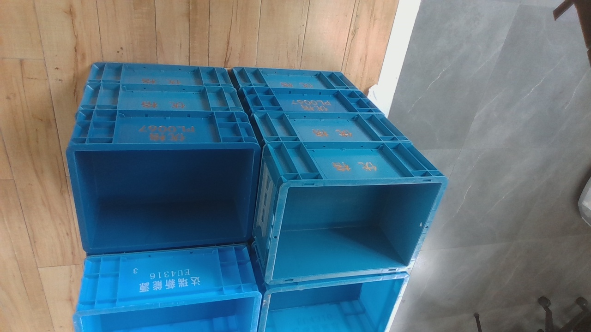
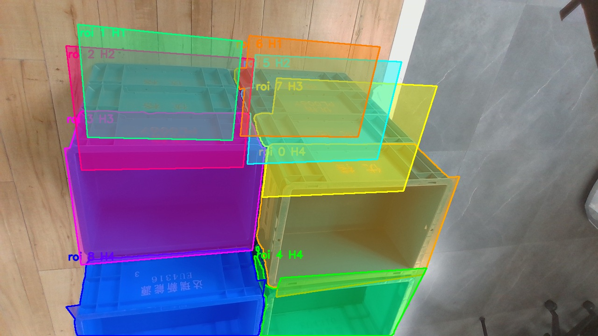
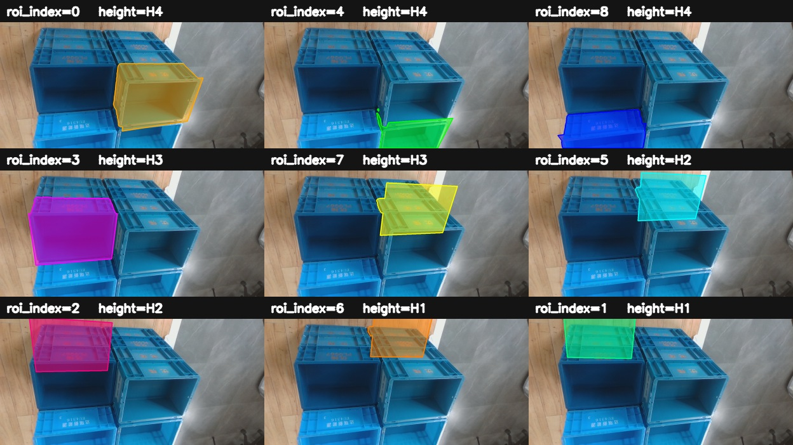

# 9_12 单线程配置容器加速 制定离线功能测试方案

- 归档编号：`01a0941f-114f-7f23-af9f-03a29bc6738d`
- 项目：S1 IE_lab 拆垛
- 创建时间：2026-09-12T13:37:39.162000+08:00
- 更新时间：2026-09-12T15:21:53.860000+08:00
- 状态：活动
- 导出范围：用户可见消息与助手可见回复；不含隐藏推理和工具原始输出

## 1. 用户

我们在 “9\_12 9\_11 评估 Orin Docker 环境隔离” 的基础上继续，下一步我们是不是做“s1-box-pose-compute:v5\_2\_v5\_3b\_20260911\_03”内部的离线功能测试？给我制定方案计划，并明确目标

## 2. 助手（进展）

我先查阅项目文档和“9_12 9_11 评估 Orin Docker 环境隔离”的结论，确认这个镜像的验证进度，再制定离线功能测试的目标和计划。

## 3. 助手（进展）

已有记录确认：`_03` 的基础离线回归已经完成，包括左右腕各 5 次重复、资源采样和旧入口回放。下一步适合补齐“输入异常、输出合同和失败恢复”的离线功能验收；当前镜像入口是冻结 Observation → V5 计算，SAM3/LingBot 到人工确认的完整容器链路还需另行验证。

## 4. 助手

**是的，建议下一步补齐 `_03` 镜像内部的离线功能验收。**但基础离线测试已经完成，这次重点是异常输入、输出规范和失败恢复。

根据前序执行记录，已经完成：

- 右腕 5/5 `accepted`；左腕 5/5 `rejected`，拒绝原因一致。
- 左右腕资源采样均未 OOM。
- 旧入口同输入回放成功，右腕中心与容器结果差为 0。
- 镜像内 GPU 核函数验证通过；V5 算法仍使用 CPU。

**本轮目标：证明这个固定镜像能正确计算合法输入、明确拒绝异常输入，并在失败后保留可追溯记录、安全重跑，为后续实时联调提供稳定计算基线。**

当前测试范围是：

```text
冻结 RGB、深度、已确认 mask、K、TF
                  ↓
        _03 容器内 V5 计算
                  ↓
      箱体位姿 / 拒绝原因 / 错误记录
```

SAM3/LingBot 调用、ROI 生成和人工确认流程，需要后续单独集成验证。

| 步骤 | 计划工作 | 验收目标 |
|---|---|---|
| 1. 固定测试基线 | 核验镜像 ID、输入、模型和配置哈希，整理已有证据 | 明确测的是哪个版本、哪些数据 |
| 2. 补充正常样本 | 沿用左右腕锚点，追加完整归档帧，与旧环境同输入对照 | 状态、原因一致；中心差 ≤ `1e-6 m`，矩阵元素最大差 ≤ `1e-6` |
| 3. 异常输入测试 | 缺文件、错误哈希、左右腕不匹配、单位错误、空 mask、非法 K/TF 等 | 明确报错，不产生正式可用位姿 |
| 4. 输出合同测试 | 分别检查 `accepted/rejected/error` | 成功时中心与矩阵一致；拒绝或错误时正式位姿为空，诊断单列 |
| 5. 失败恢复测试 | 输出目录重复、不可写、计算中断后新目录重跑 | 不覆盖历史结果、不误用残留结果，重跑可恢复 |
| 6. 隔离与报告 | 核验断网、只读输入、权限、资源与逐例日志 | 形成明确的通过、失败和未覆盖清单 |

**完成标准：上述必选用例符合预期，结果可复现，所有失败可定位。**这证明计算模块的工程可靠性；定位绝对精度、倾斜箱体适用性和抓取效果仍需独立验证。

通过后，再推进“冻结采集文件 → 感知服务 → ROI → 人工确认 → V5”的完整文件链路，随后进行实时单次联调。

完整方案已保存到[离线功能验收计划](../../assets/79d49a4980029e91--s1_orin_compute_offline_test_plan_20260912.md)。本次只制定计划，未连接 S1 或执行测试。

[附件：79d49a4980029e91--s1_orin_compute_offline_test_plan_20260912.md](../../assets/79d49a4980029e91--s1_orin_compute_offline_test_plan_20260912.md)

## 5. 用户

现在机器人已经到达FDP位，我们要不现在进行“s1-box-pose-compute:v5\_2\_v5\_3b\_20260911\_03”的在线测方案？给我指定方案，明确目标

## 6. 助手（进展）

可以利用当前 FDP 观测位做一次“现场采集 → `_03` 容器计算”的在线验证。我会按现有镜像能力制定方案：宿主机完成采集、SAM3/LingBot 和目标确认，`_03` 接收冻结数据计算位姿；本次先明确步骤和验收目标。

## 7. 助手

**可以，当前已经到达 FDP 观测位，适合先做一次“现场新采集 → `_03` 容器计算”的在线验证。建议先右腕单次跑通，再扩展左腕和重复测试。**

**本轮明确三个目标：**

1. **链路可用：**现场新数据能够经过感知、人工确认和容器计算，输出箱体位姿或明确拒绝原因。
2. **迁移一致：**同一帧输入在旧环境 V5 与 `_03` 中得到一致结果。
3. **现场稳定：**连续独立采集时，统计接受率、拒绝原因、位姿波动及耗时。

实际流程为：

```text
宿主机：腕部采集 → SAM3/LingBot → ROI → 人工确认
                              ↓
                     冻结 Observation
                              ↓
            _03 容器：断网运行 V5 → 保存结果
```

当前 `_03` 从已经确认的 Observation 开始计算，因此本轮验证的是**在线数据接入容器计算**；完整感知前端迁入 Docker 仍是后续工作。

| 步骤 | 操作计划 | 验收目标 |
|---|---|---|
| 1. 运行前核对 | 核验镜像 ID、采集入口、服务、资源和机器人静止状态 | 使用指定 `_03`，旧环境和 `current` 保持可回退 |
| 2. 右腕首次采集 | 采集新 RGB、深度、K、TF，生成候选图，由你确认本次箱体 | 目标清楚、输入完整，确认绑定本帧 mask |
| 3. 容器计算 | 导出冻结 bundle，交给 `_03`，保存位姿、诊断和日志 | 成功输出规范位姿；拒绝时正式位姿为空，原因明确 |
| 4. 同帧对照 | 旧环境 V5 与容器串行处理完全相同输入 | 状态和原因一致；中心差 ≤ `1e-6 m`，矩阵元素最大差 ≤ `1e-6` |
| 5. 左腕验证 | 原姿态下独立采集左腕并重复上述流程 | 覆盖左腕；截边或歧义应正确拒绝 |
| 6. 新采集重复 | 首轮通过后，右腕累计 5 次；左腕视野合适时累计 5 次 | 统计接受/拒绝/异常次数、位姿离散度和分阶段耗时 |

这里的 5 次是**重新采集、推理、确认**，区别于此前同一个冻结文件重复计算。若左腕持续截边，保留诊断并停止重复，不为凑次数放宽门限。

**首轮完成标准：**右腕一组新数据完成整条链路，并通过同帧旧 V5 对照。`accepted` 表示获得通过算法门禁的候选；`rejected` 表示链路正常但该帧没有可用位姿；`error` 表示工程问题，需要先处理。

FDP 对照可以在主链路通过后追加，用来观察两种后端的中心和姿态差异；**FDP 不是独立真值，这次也不验收抓取精度。**

本测试只读取相机和状态，**机械臂、夹爪、升降、底盘均无预期运动**。现场保持静止、工作区净空和急停可用；若需调整观测姿态，再单独制定并确认具体动作。

方案已保存到[在线验证计划](../../assets/cc747589f8ff0ac5--s1_orin_compute_online_test_plan_20260912.md)。本次仅制定方案，尚未连接机器人或开始采集。

[附件：cc747589f8ff0ac5--s1_orin_compute_online_test_plan_20260912.md](../../assets/cc747589f8ff0ac5--s1_orin_compute_online_test_plan_20260912.md)

## 8. 用户

记得记录运算时间，并进行对比，能不能给我顺便加上使用GPU的方案，如果太麻烦的话就下次在做？

## 9. 助手（进展）

我会把分阶段计时和旧环境/容器的同帧耗时对比纳入本轮必选项，再补充 GPU 加速方案及工作量判断。先核对 V5 的计算路径，确认有没有可以直接启用的 GPU 后端。

## 10. 助手

**已加入方案：本轮必须记录耗时并做同帧对比；GPU 加速建议放到下一轮，不耽误当前观测位测试。**

本轮计时包含：

| 项目 | 记录内容 |
|---|---|
| 采集与前处理 | 采集、SAM3/LingBot、ROI 耗时 |
| 人工确认 | 单独记录等待时间 |
| 容器计算 | 启动与准备、V5 运算、结果保存、完整命令耗时 |
| 同帧对比 | 旧环境 V5 CPU 与 `_03` V5 CPU 的运算时间、差值及耗时比 |
| 重复测试 | 每次耗时，以及均值、中位数、最小/最大值 |

同时报告**含人工等待的总时间**和**扣除人工等待的机器处理时间**。左右腕、接受和拒绝案例分开统计，避免把不同计算量混在一起。

GPU 方面，我核对了源码：当前 V5 使用 NumPy、SciPy 的 `cKDTree` 和 `least_squares`，**没有直接打开就能使用 GPU 的开关**。此前 CUDA 测试通过，只说明容器可以执行 GPU 核函数。

后续 GPU 方案是：

1. 用本轮冻结数据分析 CPU 耗时热点。
2. 针对热点尝试 GPU 计算，例如点变换、最近邻或残差计算。
3. 构建独立新镜像，保留 `_03` 作为 CPU 基准。
4. 同输入比较结果与完整耗时，计入数据传输和同步开销，确认是否实际提速。

这涉及算法适配和依赖兼容验证，工作量超过简单配置。**本轮先取得可靠的 CPU 耗时基线，下次再决定 GPU 优化哪一部分最划算。**

已更新[在线验证计划](../../assets/cc747589f8ff0ac5--s1_orin_compute_online_test_plan_20260912.md)，尚未执行现场测试。

[附件：cc747589f8ff0ac5--s1_orin_compute_online_test_plan_20260912.md](../../assets/cc747589f8ff0ac5--s1_orin_compute_online_test_plan_20260912.md)

## 11. 用户

好的GPU方案放到下一轮，给我更新一下计划，我们明确方案步骤，明确目标

## 12. 助手（进展）

我会将计划明确为“本轮 CPU 在线验证与计时对比，下一轮 GPU 优化”，并固定本轮的执行顺序、每步通过条件和最终交付。

## 13. 助手

已更新计划：**本轮使用 `_03` 的 CPU 后端，完成在线验证、结果一致性和耗时对比；GPU 优化放到下一轮。**

**本轮目标**

1. 跑通现场新采集数据到容器位姿输出的流程。
2. 验证旧环境 V5 与 `_03` 对同一输入的结果一致。
3. 测清算法运算时间、容器运行开销和整体处理时间。
4. 通过独立新采集，观察接受率、拒绝原因和位姿重复性。

**执行步骤**

| 顺序 | 工作 | 完成条件 |
|---|---|---|
| 1 | 核验镜像、采集入口、服务、资源及现场静止状态 | 固定 `_03`、模型和参数，运行条件有记录 |
| 2 | 右腕采集新数据，运行 SAM3/LingBot、生成 ROI，由你确认目标 | 输入完整，确认绑定本帧 mask |
| 3 | 保存宿主机 V5 结果，导出同一 Observation，在 `_03` 中计算 | 两套结果、计时、输入哈希完整 |
| 4 | 对比状态、位姿和运算时间 | 状态/原因一致；中心差 ≤ `1e-6 m`，矩阵元素最大差 ≤ `1e-6` |
| 5 | 左腕完成一次相同流程 | 明确该视角成功、拒绝或工程失败的原因 |
| 6 | 首轮通过后，右腕累计 5 次新采集；左腕视野允许时累计 5 次 | 每次重新采集、推理、确认，保存配对对照 |
| 7 | 汇总结果与性能报告 | 给出通过项、问题、实际次数和未覆盖项 |

出现工程错误或同帧结果超差，先暂停对应路径并定位。左腕持续截边时保留诊断，不凑次数或放宽门限。

**计时与对比要求**

- 分别记录采集、感知前处理、人工等待、导出、V5 运算和容器完整运行时间。
- 对比同帧的**宿主机 V5 CPU vs `_03` V5 CPU**，报告耗时差与比值。
- 左右腕、接受/拒绝案例分组，提供逐次值、均值、中位数及范围。
- 人工等待单列；不能独立测得的分项标为“未测”，不估算成实测数据。

**最终交付：**输入及确认记录、结果叠加图、位姿差异表、耗时对比表、重复性统计、资源与失败日志。

当前流程仍是“宿主机采集与感知 → 人工确认 → 冻结文件 → Docker 内 V5”。本轮不涉及机械臂、夹爪、升降或底盘运动；现场保持静止、净空和急停可用。通过测试也不代表抓取精度已验证。

[完整计划已更新](../../assets/cc747589f8ff0ac5--s1_orin_compute_online_test_plan_20260912.md)，目前仍处于计划阶段，尚未开始现场测试。

[附件：cc747589f8ff0ac5--s1_orin_compute_online_test_plan_20260912.md](../../assets/cc747589f8ff0ac5--s1_orin_compute_online_test_plan_20260912.md)

## 14. 用户

好的，我们开始执行

## 15. 助手（进展）

开始执行在线验证。我将使用 S1 SSH 技能做远端只读检查和一次在线数据链路测试；本次预期只读取腕部相机/TF、调用现有感知服务并运行 `_03` 计算，不移动机械臂、夹爪、升降或底盘。先核对机器人静止、镜像与入口状态，再从右腕开始；任何锁冲突、视野异常或输入不一致都会停止该次测试。

## 16. 助手（进展）

先做远端只读预检：确认主机、镜像摘要、`current` 指针、运行中的相关容器、控制锁和在线入口文件；这一步不采集、不调用服务、不改变文件。

## 17. 助手（进展）

预检通过：主机 `galbot-echo`，目标镜像摘要与记录一致，旧 `current` 未切换，在线入口和配置存在，当前没有相关计算容器运行，控制锁未被占用。下一步先确认在线入口参数，再启动右腕一次只读采集；这会读取相机并调用现有感知服务，但仍不发送任何运动命令。

## 18. 助手（进展）

右腕在线单次开始：运行当前已部署的只读入口，明确指定 `--camera-arm right`，结果目录使用新的独立 run ID。入口会在候选生成后暂停等待本次目标确认；在看到候选前不提交任何目标选择。

## 19. 助手（进展）

只读预检已通过，但启动在线采集的命令被自动审批拦截，尚未读取相机、调用服务或写入运行目录。拦截点是“真实 RGB-D/状态数据将发送到指定远程感知服务”，需要对这条具体数据路径作单独确认。

## 20. 助手

预检已完成：机器人主机、`_03` 镜像、在线入口和控制锁状态正常，未发送运动命令。

启动右腕在线测试时，自动审批拒绝了具体操作。被拒绝的动作是：

- 读取右腕 RGB-D、K、TF 和状态数据；
- 将感知数据发送至 `10.34.216.11:7861`（SAM3）和 `10.34.216.11:7865`（LingBot）；
- 将本次结果写入 `/home/galbot/Lsy03/box_pose_pipeline/runs/online_docker_20260912_right_01`。

请明确确认：**是否授权这一次右腕 RGB-D/状态数据按上述路径发送并保存，用于在线测试？**本次仍不移动机械臂、夹爪、升降或底盘。

自动审批拒绝原因：该操作涉及真实机器人采集数据及向指定远程服务发送数据；此前“开始执行”的授权未被审批器视为对这条具体数据传输路径的充分确认。

## 21. 用户

授权这一次右腕 RGB-D/状态数据按上述路径发送并保存，用于在线测试

## 22. 助手（进展）

收到明确授权。我现在启动一次右腕只读在线采集，按已说明的 SAM3/LingBot 地址发送并保存到指定 run 目录；机器人保持当前 FDP 位，不执行任何运动。采集和感知完成后我会停在目标候选确认处。

## 23. 助手（进展）

右腕在线进程已启动，当前仍在采集/感知阶段，尚未到目标选择或 V5 计算。

## 24. 助手（进展）

右腕本次采集进程已结束，但在 SAM3 返回 HTTP 401 后停止，未进入目标确认或 `_03` 计算；没有运动命令。现在我只读取失败记录和凭据注入状态（不打印密钥），判断是认证配置问题还是服务本身问题，不重复发送请求。

## 25. 助手（进展）

失败证据显示本机 SSH 非交互环境没有注入 `S1_PERCEPTION_API_KEY`；此前成功记录明确是“使用指定安全文件注入”。我将先从既有任务记录中核对那个已授权的安全文件路径，不探测其他凭据位置，也不打印密钥。

## 26. 助手（进展）

已定位到此前任务使用的安全凭据文件：`/home/galbot/ie_lab/projects/s1_continuous_destack/.secrets.env`。上次 401 的原因是 SSH 非交互命令未加载它；我会按既有安全边界只在进程环境中加载，不打印、不复制、不写入结果，然后用新的 run ID 重试右腕在线链路。

## 27. 助手（进展）

重试仍在 SAM3 返回 HTTP 401，已加载指定安全文件但服务未接受认证。进程仍未进入目标确认或 `_03`；我现在只读取本次 manifest 的 `credential_used` 和安全文件权限/变量存在性，确认加载链路，不读取密钥值。

## 28. 助手（进展）

定位完成：安全文件本身存在且权限为 `600`，但它定义的是 `AI_SERVICE_API_KEY`，而在线入口读取的是 `S1_PERCEPTION_API_KEY`，所以前两次运行的清单均为 `credential_used=false`。我会只在当前进程内做变量名适配，不改安全文件，然后用新的 run ID 重试。

## 29. 助手（进展）

认证已生效，右腕采集和 SAM3/LingBot 均成功；入口现在停在人工目标确认处，尚未运行 V5 或 `_03`。本帧候选为：

```text
roi_index=0  H4  center=[0.940820,-0.007863,0.627542] yaw=90.000°
roi_index=4  H4  center=[1.204119,-0.014747,0.622777] yaw=-95.208°
roi_index=8  H4  center=[1.189940,-0.436444,0.619211] yaw=90.000°
roi_index=3  H3  center=[0.926651,-0.424358,0.466843] yaw=87.879°
roi_index=7  H3  center=[0.784506,-0.007682,0.454361] yaw=-91.918°
roi_index=5  H2  center=[0.777846,-0.015791,0.292962] yaw=89.304°
roi_index=2  H2  center=[0.777477,-0.422906,0.292865] yaw=87.879°
roi_index=6  H1  center=[0.775705,-0.002126,0.131111] yaw=-92.146°
roi_index=1  H1  center=[0.774405,-0.422060,0.125210] yaw=86.760°
```

请根据现场候选图确认一个 `roi_index`，并提供一句本次人工确认说明；我收到后只提交该选择，继续运行宿主机对照和 `_03` 容器计算。

## 30. 助手

认证已恢复，右腕数据采集及 SAM3/LingBot 成功。当前流程停在人工目标确认处，尚未运行宿主机 V5 或 `_03` 容器。

请提供：

```text
roi_index=<候选编号>
说明=<一句人工确认理由>
```

候选包括 H4：`0、4、8`；H3：`3、7`；H2：`5、2`；H1：`6、1`。确认后我将继续执行同帧旧环境与 `_03` 计算，并记录运算时间和对比结果。

## 31. 用户

给我把图片展示一下，我再来选择

## 32. 助手（进展）

可以。我会读取本次右腕 run 目录中的候选可视化和原图，不重新采集或调用服务；随后把候选叠加图展示给你，确认仍停在人工选择提示处。

## 33. 助手

_工具输出图片（原始工具文本未纳入归档）。_



## 34. 助手

_工具输出图片（原始工具文本未纳入归档）。_





## 35. 助手（进展）

候选图已生成并展示。上图是所有候选叠加总览，下图按候选逐项展示；每格标题标明 `roi_index` 和高度层，颜色仅用于区分候选。


当前进程仍停在人工确认提示，没有运行 V5 或 `_03`。请回复你确认的 `roi_index`，再附一句确认说明（例如“确认右侧中层完整蓝色箱体”）。

> 资源未归档：`/tmp/online_docker_20260912_right_03/candidate_overview.jpg`（missing）

> 资源未归档：`/tmp/online_docker_20260912_right_03/candidate_contact_sheet.jpg`（missing）

## 36. 助手

候选图如下：


当前流程仍停在人工确认处，尚未运行 V5 或 `_03`。请回复：

```text
roi_index=<编号>
说明=<一句确认理由>
```

## 37. 用户

```
roi_index=0
说明=<最高最近的料箱>
```

## 38. 助手（进展）

收到本帧人工确认：`roi_index=0`，说明为“最高最近的料箱”。我先提交候选编号，再按入口提示提交说明；随后将运行宿主机 V5 对照并导出 bundle 给 `_03`，全程不发送运动命令。

## 39. 助手（进展）

人工确认已提交，宿主机 V5 正在对这帧数据计算；目前只出现 NumPy 浮点告警，没有错误。计算完成后我会读取结果并用同一 bundle 运行 `_03`。

## 40. 助手（进展）

宿主机旧环境 V5 已完成并接受，结果中心为 `[0.9272119309, -0.0255310572, 0.5314192737] m`。下一步先核对本次 run 是否已生成完整 Observation bundle，再将同一输入只读交给 `_03` 容器；不重新采集、不重新调用感知服务。

## 41. 助手（进展）

本次 run 已生成完整采集、确认和感知文件，`roi_index=0` 已绑定到本帧 mask，宿主机 V5 为 `accepted`。我现在把经过本地验证的 bundle 导出脚本临时放到 Orin `/tmp`，生成只读输入 bundle；随后用同一输入启动 `_03`。不会修改旧 `current` 或镜像。

## 42. 助手（进展）

bundle 导出脚本首次运行失败，原因是远端发布包的 Python 模块路径与本地脚本假设不同；没有生成 bundle，也未启动容器。我会只读定位远端 `pose_pipeline` 包路径后，用同一 run 重新导出，不重新采集。

## 43. 助手（进展）

已确认无需修改旧发布包：`s1-python` 会清理外部 `PYTHONPATH`，所以我改用进程内显式加入当前 release 的模块路径来运行导出脚本。这样只生成本次 run 的 bundle，不改变 `current`。

## 44. 助手（进展）

当前 live release 没有后来加入的 `bundle.py`，所以远端直接导出失败；这是发布包结构差异，不是数据问题。我将把本次 run 的必要输入只读复制到本地临时目录，用已验证的本地 bundle 导出器生成哈希清单，再把 bundle 复制回该 run 目录，随后运行 `_03`。不修改旧 release。

## 45. 助手（进展）

右腕在线前端和宿主机 V5 已成功，bundle 已通过本地哈希重载校验并复制回 Orin。本次同一输入现在进入 `_03`：断网、非 root、只读输入、独立输出，记录容器 V5 计算时间和资源状态。

## 46. 助手（进展）

`_03` 容器计算已完成并接受，输出中心与宿主机结果目前看完全相同。现在做收尾核验：读取两侧 timing、结果合同、镜像摘要和输出文件清单，确认没有 OOM/网络/SDK 访问，并计算耗时差。

## 47. 助手（进展）

同帧验收结果已确认：宿主机和 `_03` 都是 `accepted`，中心及 4×4 矩阵逐元素差均为 0。为完成本轮资源记录，我再用同一 bundle 做一次不联网的容器采样运行；它不重新采集、不调用感知服务，也不改变结果基线。

## 48. 助手（进展）

资源采样完成：`_03` 退出码 0、`oom_killed=false`，周期采样峰值约 `290.9 MiB / 8 GiB`，CPU 峰值约 `615%`（6 CPU 限额内）。同一输入再次 `accepted`，中心不变。接下来归档本次 run，并生成本地对比记录。

## 49. 助手（进展）

右腕单次在线里程碑已完成：旧环境与 `_03` 均接受，位姿逐元素一致；容器资源采样也已完成。现在做最后的清场核验并把结果写入本地实验记录；左腕和五次新采集重复本轮尚未启动，因为当前授权只覆盖这一次右腕数据。

## 50. 助手

右腕单次在线测试已完成，最终 run 为：

`online_docker_20260912_right_03`

用户确认 `roi_index=0`（“最高最近的料箱”）。宿主机 V5 和 `_03` 容器均为 `accepted`，输出中心一致：

```text
[0.9272119309, -0.0255310572, 0.5314192737] m
```

同一冻结 Observation 对比：

| 指标 | 宿主机 V5 | `_03` 容器 |
|---|---:|---:|
| 后端计算时间 | 17.5951 s | 34.3402 s |
| 中心最大差 | — | 0 m |
| 4×4 矩阵最大差 | — | 0 |

容器本次约慢 `16.7450 s`，即慢 `95.17%`，约为宿主机 `1.95×`。资源采样运行耗时 `32.3750 s`，内存峰值约 `290.9 MiB / 8 GiB`，CPU 峰值约 `615.52%`，退出码为 0，未 OOM。

前两次 401 失败已保留；原因是安全文件变量名为 `AI_SERVICE_API_KEY`，入口读取的是 `S1_PERCEPTION_API_KEY`。最终仅在进程环境中完成映射，密钥未写入文件、参数或结果。

全程没有运动命令；容器断网、未访问 SDK，旧 `current` 未切换，测试结束后进程和控制锁均已清理。当前只完成右腕 1 次新采集，不能代表绝对精度、实时重复性或抓取可用性；GPU 优化按计划放到下一轮。容器完整外部墙钟时间未单独测量，本次对比是 V5 后端计算时间。

详细记录：

- [在线测试报告](../../assets/cc6b470f56313926--s1_orin_docker_online_test_20260912.md)
- [耗时与结果对比 JSON](../../assets/1e80ec543441e9e3--online_test_comparison.json)

[附件：cc6b470f56313926--s1_orin_docker_online_test_20260912.md](../../assets/cc6b470f56313926--s1_orin_docker_online_test_20260912.md)

[附件：1e80ec543441e9e3--online_test_comparison.json](../../assets/1e80ec543441e9e3--online_test_comparison.json)

## 51. 用户

V5容器内 结果和 宿主机 结果 以及 FDP 结果的对比如何？

## 52. 助手（进展）

我先核对当前 `right_03` 是否保存了同帧 FDP 结果，并把已有的 FDP 对照样本区分开，避免把不同采集帧的数值混在一起。

## 53. 助手

当前这帧 `online_docker_20260912_right_03` 的结论是：

| 结果 | 状态 | 中心（base_link，m） | yaw |
|---|---|---|---:|
| 宿主机 V5 | `accepted` | `[0.927212, -0.025531, 0.531419]` | 87.599° |
| `_03` 容器 V5 | `accepted` | `[0.927212, -0.025531, 0.531419]` | 87.599° |
| FDP | 尚未对本帧执行 | — | — |

宿主机和容器对同一 Observation 的中心差、矩阵最大差均为 `0`，说明 Docker 迁移没有改变 V5 结果。计算时间方面，宿主机 V5 为 `17.5951 s`，容器为 `34.3402 s`，容器约慢 `95.17%`。

已有的 FDP 对照属于其他采集帧，不能直接与本帧混用：

- 9/11 双腕实验右腕：V5 与 FDP 中心差 `6.8214 mm`，180° 对称 yaw 差 `0.6936°`。
- 9/11 右腕实时实验：中心差 `12.10 mm`，yaw 差 `1.66°`。

因此目前能得出的结论是：**本帧容器和宿主机完全一致；本帧尚无 FDP 三方对照。**历史 FDP 数值只能作为后端差异参考，不能当作绝对误差或真值。

如果要完成本帧三方比较，需要将当前已保存 bundle 发送到 FDP 服务，再比较中心、yaw、箱口中心和耗时；这仍然不涉及机器人运动。[当前测试记录](../../assets/cc6b470f56313926--s1_orin_docker_online_test_20260912.md)

[附件：cc6b470f56313926--s1_orin_docker_online_test_20260912.md](../../assets/cc6b470f56313926--s1_orin_docker_online_test_20260912.md)

## 54. 用户

将当前已保存 bundle 发送到 FDP 服务，再比较中心、yaw、箱口中心和耗时

## 55. 助手（进展）

我将用当前右腕 `right_03` 的已保存 bundle 做同帧 FDP 请求，再与宿主机 V5 和 `_03` 容器 V5 比较中心、180° 对称 yaw、箱口中心和后端耗时。此次仍只发送图像/深度/mask/K/模型数据，不执行任何机器人运动；先核对 bundle、FDP 客户端和服务入口。

## 56. 助手（进展）

当前 bundle 合同已核对：右腕、`base_link`、光学 Z 米制深度、用户确认 mask，且 `motion_commands_sent=false`。我会沿用已验证的 FDP 首帧接口 `POST /first_frame_track` 和既有客户端，先确认远端客户端版本及本次输出目录为空，再发一次请求。

## 57. 助手（进展）

FDP 服务 TCP 可达，远端客户端接口与输出目录均正常。我会用当前 bundle 的 `depth_m.npy`（LingBot 完成深度）、用户确认的 `mask.png`、RGB、K 和 TF 发起一次 `/first_frame_track`，将请求/响应/可视化和三方比较写入本次 run 的 `fdp_compare_01`；不重新采集、不发送运动命令。

## 58. 助手（进展）

刚才通过带 TTY 的 SSH 传入脚本，`s1-python -` 被解释成了交互式 REPL，脚本未执行、也未发送 FDP 请求；我先关闭这个空闲会话，然后改用无 TTY 的标准输入方式重跑。当前 run 没有新增 FDP 产物。

## 59. 助手（进展）

同帧 FDP 请求已成功返回 HTTP 200。初步三方结果：宿主机 V5 与 `_03` 中心、yaw、箱口中心完全一致；两者与 FDP 的中心差约 `14.542 mm`，180° 对称 yaw 差约 `1.237°`，箱口中心差约 `14.722 mm`，FDP 服务耗时 `1.2299 s`。我现在核对响应文件并归档结果。

## 60. 助手（进展）

FDP 三方结果已落盘并写入实验记录。现在做最后清场和文档一致性检查，确认 FDP 请求结束、控制锁未占用、没有运动命令或残留计算进程。

## 61. 助手

当前右腕 `right_03` 同一 bundle 的三方结果如下：

| 方法 | 状态 | 中心（base_link，m） | yaw | 耗时 |
|---|---|---|---:|---:|
| 宿主机 V5 | `accepted` | `[0.927212, -0.025531, 0.531419]` | 87.5991° | 17.5951 s |
| `_03` 容器 V5 | `accepted` | `[0.927212, -0.025531, 0.531419]` | 87.5991° | 34.3402 s |
| FDP | HTTP 200 | `[0.933132, -0.024928, 0.544688]` | 86.3618° | 1.2299 s |

对比结果：

- 宿主机 V5 与容器 V5：中心差 `0 mm`，yaw 差 `0°`，箱口中心差 `0 mm`。
- 宿主机 V5 与 FDP：中心距离 `14.5418 mm`，180° 对称 yaw 差 `1.2373°`，箱口中心差 `14.7219 mm`。
- 容器 V5 与 FDP：数值完全相同，差异也是中心 `14.5418 mm`、yaw `1.2373°`、箱口中心 `14.7219 mm`。

因此，这次验证说明：

1. `_03` 容器没有改变宿主机 V5 的计算结果。
2. V5 与 FDP 在本帧存在约 `14.5 mm` 的中心差，主要体现在 Z 方向。
3. FDP 耗时较短，但它是独立服务请求，计时边界和 V5 不同，不能直接当作公平速度排名。
4. FDP 不是独立真值；这些差异只能作为后端输出差异，不能直接解释为 V5 绝对误差。

完整比较结果见：[comparison.json](../../assets/e380b17991288614--comparison.json)，报告已更新至[在线测试记录](../../assets/cc6b470f56313926--s1_orin_docker_online_test_20260912.md)。全程无运动命令，`accuracy_validated=false`、`grasp_ready=false` 仍保持不变。

[附件：e380b17991288614--comparison.json](../../assets/e380b17991288614--comparison.json)

[附件：cc6b470f56313926--s1_orin_docker_online_test_20260912.md](../../assets/cc6b470f56313926--s1_orin_docker_online_test_20260912.md)

## 62. 用户

给我分析一下`_03` 容器 V5为什么运行得这么慢？是否是没有启动GPU加速的原因？

## 63. 助手（进展）

我会从计时边界、CPU 限额、Python/NumPy/SciPy 构建差异和 V5 实际算子入手，判断“容器慢”是 GPU 未启用、CPU 资源限制，还是运行时/依赖差异造成的。先做本地证据核对，不修改镜像。

## 64. 助手（进展）

从当前输出看，V5 不是一次简单拟合：本帧有 12 个初值、1621 个模型点、2156 个观测点，最佳优化就用了 23 次函数评估；每次残差还会做最近邻查询并重建反向 `cKDTree`。我再核对宿主机与容器的 CPU 可见性、cgroup 限额和 NumPy/SciPy 构建，确认慢速主因。

## 65. 助手（进展）

仅凭源码可以判断“未启用 GPU”不是宿主机与容器速度差的直接原因：两边本次都走 CPU。为把 CPU 限额和线程配置从推测变成证据，我会在同一 bundle、同一镜像下做两个无网络基准：容器 6 CPU + 单线程，以及默认线程 + 12 CPU；不访问相机/服务、不改镜像。

## 66. 助手（进展）

基准命令在启动前发现 Orin 没有 `/usr/bin/time`，因此两个基准都未运行；我改用 shell 单调时间戳重新执行，测试条件不变。原有 `_03` 和现场结果不受影响。

## 67. 助手（进展）

基准已经把主因量化出来：同一 `_03` 镜像、同一 bundle、6 CPU 限额下，补上 `OPENBLAS_NUM_THREADS=1` 后 V5 从 `34.34 s` 降到 `15.59 s`；把 CPU 配额放宽到 12 但仍不控线程，反而是 `43.23 s`。这说明当前慢速主要是容器默认 BLAS 线程/调度配置，而不是“没有启动 GPU”。我先归档这两组证据，再给出完整判断。

## 68. 助手

结论：**主要原因不是没有启动 GPU，而是容器没有复用宿主机的单线程 BLAS 配置，导致线程竞争/超配额。**

同一镜像、同一 bundle 的实测结果：

| 配置 | V5 算法时间 |
|---|---:|
| 宿主机，`OPENBLAS_NUM_THREADS=1` | 17.5951 s |
| `_03`，6 CPU，未设置线程变量 | 34.3402 s |
| `_03`，6 CPU，BLAS/OpenMP 全部设为 1 | 15.5938 s |
| `_03`，12 CPU，仍未设置线程变量 | 43.2306 s |

单线程配置使容器耗时下降 **54.59%**，并且比宿主机还快约 **11.37%**。放宽到 12 CPU 反而变慢，说明“多给 CPU”不是解决办法。

主要证据有三点：

1. 宿主机启动命令显式设置了 `OPENBLAS_NUM_THREADS=1`，容器启动脚本没有设置。
2. 宿主机 CPU cgroup 无配额，容器使用 `--cpus 6`，但两边都能看到 12 个 CPU；容器默认线程运行时 CPU 峰值达到约 `615%`，存在线程竞争。
3. 容器使用 NumPy `1.23.5`、SciPy `1.10.0` 的 OpenBLAS ILP64 构建，宿主机使用 NumPy `1.24.4`、SciPy `1.10.1` 的另一套 `blas/cblas` 构建，单线程下剩余差异很可能来自运行时构建和频率/负载差异。

V5 本身也比较重：本帧有 12 个初值、1621 个模型点和 2156 个观测点；每个 `least_squares` 优化都会反复执行 `cKDTree` 最近邻查询，并重建反向树。最佳候选就用了 23 次函数评估。

GPU 方面，当前 V5 只调用 NumPy、SciPy 和 OpenCV，没有 CUDA、PyTorch 或 CuPy 计算路径。此前 CUDA smoke test 只证明容器能访问 GPU 驱动，**不会自动把 V5 CPU 代码变成 GPU 代码**。因此：

- “未启用 GPU”解释了当前算法没有 GPU 加速；
- 但它不能解释宿主机和容器之间这次约 2 倍的差距，因为宿主机 V5 本次也没有使用 GPU；
- 当前最优先的修正是把单线程环境纳入容器启动配置，再做左右腕和多次复测；
- GPU 优化应在 CPU 基线稳定后，对 `cKDTree`、点变换和残差计算做 profiling，再单独构建新镜像。

诊断结果已保存到：[v5_runtime_diagnosis.json](../../assets/8c3f527438ebbc4a--v5_runtime_diagnosis.json)。本次只做诊断，没有修改 `_03` 镜像或启动脚本。

[附件：8c3f527438ebbc4a--v5_runtime_diagnosis.json](../../assets/8c3f527438ebbc4a--v5_runtime_diagnosis.json)

## 69. 助手

_历史投影中的图片引用（用于补全本地对话资源）。_

> 资源未归档：`/tmp/online_docker_20260912_right_03/rgb.png`（missing）

> 资源未归档：`/tmp/online_docker_20260912_right_03/candidate_overview.jpg`（missing）

> 资源未归档：`/tmp/online_docker_20260912_right_03/candidate_contact_sheet.jpg`（missing）
