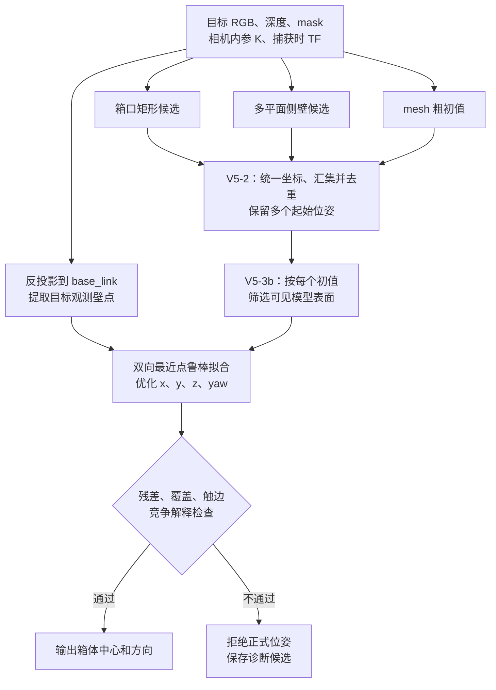

# 9_14 优化算法运行时间至1秒内 (2)——容器线程优化实验

- 归档编号：`01a094c0-5455-7a32-bb30-bc13a3d1fa74`
- 项目：S1 IE_lab 拆垛
- 创建时间：2026-09-12T16:51:18.052000+08:00
- 更新时间：2026-09-15T16:10:37.146000+08:00
- 状态：活动
- 导出范围：用户可见消息与助手可见回复；不含隐藏推理和工具原始输出

## 1. 用户

这个实现是否可以复现？要不我们来做个实验？

## 2. 助手（进展）

可以。我们可以用同一镜像、同一份冻结输入，把默认线程和单线程配置交替运行，检查加速是否稳定、输出是否一致。我先核对已有数据和启动脚本，准备可复现的实验条件。

## 3. 助手

可以，**这个配置可以复现，但要通过重复实验确认加速是否稳定**，不能只凭上次的一个数字。

我已准备好 [A/B 实验方案](../../assets/e32a05f84b8743f6--s1_v5_thread_ab_reproduction_20260912.md)：

- **固定条件**：同一 Orin、同一个 `_03` 镜像、同一份冻结输入，均限制 6 CPU。
- **A 组**：原默认线程配置。
- **B 组**：四个 BLAS/OpenMP 相关变量设为 `1`。
- 各预运行一次，再交替进行 **5 对正式测试**，预计 5–10 分钟。
- 比较算法耗时、容器总耗时，以及输出状态和位姿是否一致。

仅运行已有文件的计算，不采集相机、不调用远端感知服务、不产生机器人运动。

**是否授权我现在通过 SSH 连接 S1，执行这轮冻结数据 A/B 实验？**

需要这次确认，是因为仓库 `AGENTS.md` 明确要求当前请求授权机器人访问；之前任务的 SSH 授权不能直接沿用。

[附件：e32a05f84b8743f6--s1_v5_thread_ab_reproduction_20260912.md](../../assets/e32a05f84b8743f6--s1_v5_thread_ab_reproduction_20260912.md)

## 4. 用户

授权

## 5. 助手（进展）

我现在使用 galbot-s1-ssh 技能连接 S1，按已准备的方案执行冻结数据 A/B 测试。只运行计算容器，不调用相机、SDK 或运动接口。

## 6. 助手（进展）

镜像 ID 和冻结输入目录已核对，镜像默认确实没有设置这四个线程变量。实验会在独立目录保存每次结果，原厂正在运行的容器保持不变；现在开始两次预运行和五对正式测试。

## 7. 助手（进展）

预运行已完成：默认线程为 29.32 秒，单线程配置为 15.37 秒，均正常退出、无 OOM。方向与上次一致；这两次不计入正式统计，接下来查看五对交替运行的结果。

## 8. 助手（进展）

第一对正式结果是 32.33 秒对 15.41 秒，单线程约快 2.10 倍；交换先后顺序后的下一次单线程为 15.56 秒。目前单线程耗时较稳定，仍需完成全部配对和输出一致性核验。

## 9. 助手（进展）

前三对已完成：默认线程为 31.04–33.15 秒，单线程为 15.41–15.56 秒，三对都是单线程更快。还剩两对；目前所有运行均正常退出、无 OOM。

## 10. 助手（进展）

第四对交换顺序后仍为 31.86 秒对 15.49 秒，加速约 2.06 倍。最后一对正在运行，随后会归档原始数据，逐次比较完整位姿矩阵、诊断候选和拒绝原因。

## 11. 助手（进展）

五对测试全部完成，加速复现成功：默认线程中位数 31.86 秒，单线程中位数 15.49 秒，约快 2.06 倍。输出核验也已通过：包含预运行的 12 次结果均 accepted，正式位姿和诊断候选与原基线一致；输入和镜像未改变。

## 12. 助手

**复现成功：单线程配置稳定将耗时从约 32 秒降到 15.5 秒。**

同一 Orin、同一 `_03` 镜像、同一冻结输入，五对正式实验：

| 次数 | 默认线程 | 单线程配置 |
|---|---:|---:|
| 1 | 32.33 s | 15.41 s |
| 2 | 31.04 s | 15.56 s |
| 3 | 33.15 s | 15.51 s |
| 4 | 31.86 s | 15.49 s |
| 5 | 29.91 s | 15.44 s |
| **中位数** | **31.86 s** | **15.49 s** |

**加速约 2.06 倍，耗时下降 51.39%。**

包括预运行在内，12 次全部 accepted，正式位姿及完整诊断结果与原基线一致，中心和矩阵差为 **0**，无 OOM。

因此，上次的 **15.59 秒确实可以复现**。目前结论限于这份冻结样本。原启动脚本和镜像尚未修改，测试容器已清理，全程无机器人运动。

[查看实验报告与原始数据](../../assets/40c484515eb2887e--README.md)

[附件：40c484515eb2887e--README.md](../../assets/40c484515eb2887e--README.md)

## 13. 用户

当前算法是否可以分为一下这几个部分？

## 14. 用户

当前算法是否可以分为一下这几个部分？



我计划设计实验统计各个部分的耗时，然后看优化的空间到底有多少？

## 15. 助手（进展）

我先对照当前 V5 的调用顺序核对这张图，重点看哪些步骤重复执行、哪些耗时会嵌套，避免分段统计时重复计数。

## 16. 助手

**可以，你这张图基本准确，而且先做分段计时，再决定优化哪里，是当前最合适的下一步。** 不过，为了让统计能反映真实开销，建议补充三个细节。

1. **这些分支当前顺序执行。** 图中的 B/C/M 表示数据依赖，不代表代码已经并行运行。
2. **观测点提取存在重复。** `mesh 粗初值` 内部会调用一次 `observation_cloud()`，主拟合前又调用一次；不能把所有反投影耗时只归到 O。
3. **竞争解释检查包含两次额外拟合。** 最佳候选选出后，还分别进行“外壁＋箱口”“内壁＋箱口”拟合。这部分应该单列，否则容易误以为 G 只是几个阈值判断。

另外，每个初值的可见模型点在优化前选定；优化结束后会再次检查可见性，**并非每次优化迭代都重新筛选可见表面**。[对应源码](/home/lsy03/文档/ChatGPT/S1/experiments/20260907_bin_rim_pose/v5_2_visibility.py:150)

建议保留你的图作为算法说明，实验计时按下面这张表划分：

| 计时部分 | 包含内容 | 需要同时记录 |
|---|---|---|
| 模型与入口准备 | 模型加载、首次算法导入、适配器处理，分别记录 | 加载次数 |
| B：箱口候选 | 箱口估计完整调用 | 是否产生候选 |
| C：多平面候选 | 多平面 joint 估计完整调用 | 候选及竞争解数量 |
| M：mesh 粗初值 | 内部观测点提取、方向估计、扰动初值生成 | 点数、初值数 |
| S：候选融合 | 转换、汇集、去重、排序、截取 | 去重前后数量 |
| O：主拟合观测点 | 主流程中的观测壁点提取 | 有效点数 |
| V/F：各初值拟合 | 可见性、降采样、建树、优化、最终评价 | **逐候选耗时**、点数、残差调用次数 |
| 内外表面竞争拟合 | 外壁＋箱口、内壁＋箱口两次拟合 | 分别计时 |
| 最终判定与结果构造 | 排序、歧义/残差/覆盖/触边判断、位姿构造 | accepted/rejected |

**第一层回答“哪个阶段慢”，第二层再回答“阶段内部为什么慢”。**

针对 V/F，进一步拆为：

```text
单个候选拟合总时间
├─ 初始可见表面筛选
├─ 观测点降采样、观测 KDTree 建立
├─ 优化器总时间
│  ├─ 模型点变换
│  ├─ 正向最近邻查询
│  ├─ 反向 KDTree 重建
│  ├─ 反向最近邻查询
│  └─ 残差拼接及其他优化器开销
└─ 最终可见性、残差及覆盖率评价
```

**父项包含子项，不能全部相加。** 总耗时表使用互不重叠的阶段；内部展开表单独展示。还应直接统计残差函数实际调用次数，避免只看优化器报告的 `nfev`。

实验建议这样设计：

- **固定单线程配置**，以刚复现的约 **15.49 秒**为当前对照。
- 先使用同一右腕冻结输入，未插桩版本与计时版本交替运行 **5 对**，既测分段时间，也检查计时本身带来的开销。
- 第一轮只增加计时和计数，保持算法、候选、采样和阈值不变；计时数据单独保存，循环内不打印、不写文件。
- 每次比较状态、正式位姿和诊断结果。分段耗时之和应能对应总耗时，剩余部分明确列为未归类开销。
- 找到瓶颈后，再用已有不同帧和 rejected 案例检查它是否普遍存在。

最后，“优化空间”要用**实际秒数**判断。例如，假设最近邻相关操作占 12 秒，其余占 3.5 秒，即使最近邻计算完全消失，总时间也还有 3.5 秒；将它加速 10 倍，总时间约为 **4.7 秒**。这只是示例，但说明了分段计时的价值：**能判断优化某一部分是否足以接近 1 秒，而不只是得到一个漂亮的局部加速比。**

## 17. 用户

好的，我们先进行一次实验简单的15s 多就行

## 18. 助手（进展）

我先做一次单线程配置的分段分析，沿用同一 `_03` 镜像和冻结输入。只跑一轮，通过 Python 性能分析器记录各函数耗时；计时工具会有少量额外开销，因此结果可能略高于原来的 15.5 秒。

## 19. 助手（进展）

这一轮发现了更值得优先关注的地方：主要耗时在初值生成——多平面候选约 8.17 秒、箱口候选约 5.48 秒；后续 14 次可见壳体拟合合计约 4.01 秒。开启分析器后算法耗时为 18.40 秒，不能直接当作无分析器的运行速度；我正在核对结果一致性并整理各段占比。

## 20. 助手

**已完成一次实验。主要耗时在 B/C 初值生成，合计约占 74%。**

| 部分 | 本次耗时 | 占比 |
|---|---:|---:|
| B：箱口候选 | **5.48 s** | 29.8% |
| C：多平面侧壁候选 | **8.17 s** | 44.4% |
| M：mesh 粗初值 | 0.23 s | 1.2% |
| O：主流程观测壁点提取 | 0.22 s | 1.2% |
| V/F：可见表面筛选、拟合及评价，含两次表面竞争拟合 | **4.01 s** | 21.8% |
| 其余加载、融合、判定等 | 0.30 s | 1.6% |
| **合计** | **18.40 s** | **100%** |

本次开启了性能分析器，所以高于此前无分析器的 **15.49 秒**。这张表用于定位热点，不能直接当作正常运行时间；各初值和两次竞争拟合尚未分别计时。

结果仍为 **accepted**，正式位姿及完整诊断结果与原基线完全一致。

**这修正了我之前的优化优先级：应先看多平面候选和箱口候选。** 其中，多平面里的壁面提取用了约 **6.18 秒**；箱口里的矩形拟合累计约 **4.75 秒**。仅优化后面的最近邻拟合，不足以把整体压到 1 秒。

[查看实验报告与原始计时](../../assets/f94e19b454364baa--README.md)

[附件：f94e19b454364baa--README.md](../../assets/f94e19b454364baa--README.md)

## 21. 用户

我们再进行一次重复实验，避免偶然性

## 22. 助手（进展）

我再按完全相同的单线程配置、镜像和冻结输入运行一次性能分析，对比各阶段耗时和输出一致性，检查上一轮的热点分布是否重复出现。

## 23. 助手

**重复实验完成，两次热点分布基本一致。**

| 部分 | 第一次 | 第二次 |
|---|---:|---:|
| B：箱口候选 | 5.48 s | 5.35 s |
| C：多平面候选 | 8.17 s | 8.09 s |
| M：mesh 粗初值 | 0.23 s | 0.23 s |
| O：观测壁点提取 | 0.22 s | 0.22 s |
| V/F：拟合及评价 | 4.01 s | 3.94 s |
| 其余 | 0.30 s | 0.30 s |
| **总时间** | **18.40 s** | **18.13 s** |

- 总耗时相差 **1.49%**。
- B/C 合计占比两次都约 **74.12%**。
- 两次都是 **14 次拟合、1526 次残差调用**。
- 本次 accepted，正式位姿及完整诊断结果与原基线完全一致，无 OOM。

**因此，在这份冻结输入上，“初值生成是主要瓶颈”的判断得到重复验证。** 下一步优先分析 C 的壁面提取和 B 的矩形拟合更有依据。

以上仍是带性能分析器的耗时，正常运行基线仍约 15.5 秒。[实验报告](../../assets/f94e19b454364baa--README.md)

[附件：f94e19b454364baa--README.md](../../assets/f94e19b454364baa--README.md)

## 24. 用户

给我查一下docker中运算的精度是多少？ 是fp16还是fp8 是否可以进行优化？

## 25. 助手（进展）

我先检查 `_03` 对应的源码和已有容器运行记录，确认实际使用的数据类型，再判断降低精度能否加速。这次先查本地归档，不连接机器人。

## 26. 助手

**查过了：我们测试的 `_03` 容器 V5 主要使用 FP64（双精度），深度输入使用 FP32；没有使用 FP16 或 FP8，也没有运行 GPU 算法。** 这是依据对应源码和已归档运行记录确认的，本次未重新连接 S1。

Docker 本身不决定计算精度，精度由容器里的算法和计算库决定。

| 数据／计算部分 | 当前精度 |
|---|---|
| 输入深度 | **FP32** |
| 相机内参 K、坐标变换 TF | **FP64** |
| 模型点、法向、位姿参数 | **FP64** |
| 主要几何拟合与优化 | **以 FP64 为主** |
| SciPy KDTree 最近邻 | **双精度数据** |

源码中多处 `dtype=float` 在这里对应 NumPy 的 FP64，例如[模型加载与位姿变换](/home/lsy03/文档/ChatGPT/S1/experiments/20260907_bin_rim_pose/mesh_shell_fit.py:29)；[输入合同](/home/lsy03/文档/ChatGPT/S1/experiments/20260910_orin_pose_pipeline/pose_pipeline/contracts.py:49)则明确区分了 FP32 深度和 FP64 内参、TF。

**可以研究降低精度，但建议先尝试 FP32，而不是直接 FP16/FP8。**

| 方案 | 对当前算法的建议 |
|---|---|
| **FP64 → FP32** | 值得实验，优先用于大量点坐标、距离计算、粗候选评分；关键求解保留 FP64 |
| **FP16** | 暂不用于完整几何拟合，舍入误差可能影响最近邻、阈值判断及数值差分 |
| **FP8** | 不建议用于当前毫米级几何定位主流程 |

而且，**只把数组改成 FP32，不一定真正获得单精度加速**：当前 SciPy 1.10 的 `cKDTree` 使用双精度数据，`least_squares` 入口也会把初始参数转为 `float`，可能又转回 FP64。[KDTree 文档](https://docs.scipy.org/doc/scipy-1.10.0/reference/generated/scipy.spatial.cKDTree.html)、[优化器源码](https://raw.githubusercontent.com/scipy/scipy/v1.10.0/scipy/optimize/_lsq/least_squares.py)

结合前两次分析，**最值得试的是：在 B/C 初值生成中，把批量几何计算改为 FP32，保留最终精修的 FP64，再比较耗时和结果。** B/C 占带分析器耗时约 74%，应优先针对这里设计实验。若进一步迁移到 GPU，也可以先采用 FP32。

不能承诺降低一半位宽就快两倍；我们需要同时检查**实际中间数据类型、耗时、中心/yaw 差异，以及原本应拒绝的样本是否仍被拒绝**。

## 27. 用户

给我评估一下，这两步对实验的最终精度影响大不大？

“”

| 部分第一次第二次 |        |          |      |                       |
| -------- | ------ | -------- | ---- | --------------------- |
| B：箱口候选   | 5.48 s | 5.35 s   |      |                       |
| C：多平面候选  | 8.17 s | 8.09 s“” | <br> | 如果影响不大是否可以直接跳过了？我需要考虑 |

## 28. 助手

**B/C 值得做“跳过实验”，但现在还不能判断它们对最终精度影响小，也不建议直接从正式流程删除。** 前两次只测了耗时，没有验证去掉它们后的结果。

它们虽然只生成初值，但初值会影响后续拟合落在哪个解上，而且当前算法还会**根据初值选择可见模型表面**。因此，换初值不只是让优化器多走几步，也可能改变参与拟合的点。

| 部分 | 对最终结果的作用 | 跳过后的主要风险 |
|---|---|---|
| **B：箱口候选** | 从箱口提供位置和方向线索，补充侧壁解释 | 箱口清楚、侧壁不足时，可能失去有效初值 |
| **C：多平面候选** | 从侧壁几何生成候选及竞争解释 | 可能失去较好的中心/yaw 初值，或漏掉应当拒绝的竞争解 |
| **只保留 M：mesh 粗初值** | 当前主要由观测点分布估计中心、方向，再添加扰动 | 遮挡或只看到局部侧壁时，观测点中心可能偏离箱体中心 |

**所以要同时看“精度”和“错误接受”，不能只看剩下的结果是否 accepted。** 删掉一种候选后，竞争减少，有时反而更容易 accepted，但不代表更准确。

建议先做一个很直接的四组消融：

| 实验组 | 保留的初值来源 | 要回答的问题 |
|---|---|---|
| 基线 | B＋C＋M | 原结果 |
| 去掉 B | C＋M | 箱口分支是否冗余？ |
| 去掉 C | B＋M | 最贵的多平面分支是否必要？ |
| 同时去掉 B/C | M | 只靠粗初值能否得到一致结果？ |

固定其他参数、输入和后续拟合，比较：

- **时间**：实际省了多少；初值变化也可能改变后续迭代耗时。
- **位姿变化**：中心、yaw，以及箱口/短边抓取参考点的变化。
- **状态变化**：原 accepted 是否变 rejected；尤其检查原 rejected 是否变成了可疑 accepted。
- **候选变化**：最佳解来自哪里，内外壁竞争解释是否仍然存在。

可以先用当前冻结帧筛查，但决定删除分支前，要覆盖已有的不同视角、遮挡和拒绝样本。**与旧版一致只能证明回归一致性；真实精度仍需要独立参考，FDP 也不能直接当真值。**

从速度收益看，尝试很有价值：B/C 合计约占带分析器耗时的 **74%**。但即使把这两项完全扣掉，其余仍约 **4.7 秒**，这只是按现有计时做的估算，不能保证删掉后就是这个速度，更不能直接达到 1 秒。

**我的建议是先做上述四组实验。若某一分支只在少数困难样本上有帮助，再考虑“平时跳过、有可靠触发条件时补算”；若跨样本都没有明显贡献，才有依据删除。**
