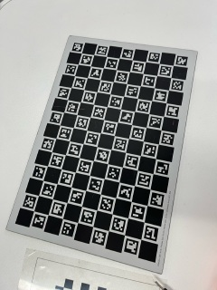
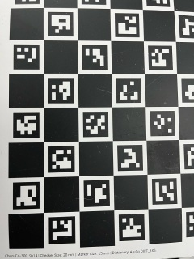
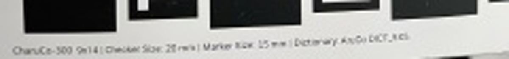
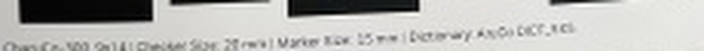
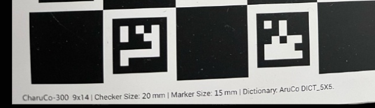

# 评估箱体3D或6D位姿测定

- 归档编号：`01a09f23-48b0-7f23-8aed-bbb4ec124b04`
- 项目：S1 IE_lab 拆垛
- 创建时间：2026-09-14T16:58:04.848000+08:00
- 更新时间：2026-09-14T19:46:33.661000+08:00
- 状态：活动
- 导出范围：用户可见消息与助手可见回复；不含隐藏推理和工具原始输出

## 1. 用户

给我看下这个怎么用，是否能通过这个来测定真实的箱体6D或者3D位姿？





## 2. 助手（进展）

我先核对项目里的说明和图片上的板卡参数，再结合 OpenCV/机器人相机坐标系说明它的用法，以及它能否用于真实箱体的 3D/6D 位姿测量。图片里的文字我会当作板卡标注来识别，不把它当成对本次任务的额外指令。

## 3. 助手

_工具输出图片（原始工具文本未纳入归档）。_


## 4. 助手（进展）

从图片底部标注可以读到：这是 ChArUco 棋盘，参数看起来是 `3×3`、`Checker Size 20 mm`、`Marker Size 15 mm`、字典 `DICT_4X4_50`。我正在检查仓库里是否已有相机标定、板卡检测或箱体坐标定义，避免把这块板的“板坐标系”与箱体坐标系混为一谈。

## 5. 助手

_工具输出图片（原始工具文本未纳入归档）。_



## 6. 助手

_工具输出图片（原始工具文本未纳入归档）。_




## 7. 助手（进展）

放大标签后，板子规格基本可以确定为 `ChArUco 9×14`、方格 `20 mm`、marker `15 mm`；因为 9×14 棋盘会用到约 63 个 marker，字典更可能是 `DICT_4X4_100`（不是 50），但照片末尾仍有一点模糊，我会把字典作为必须核对项。接下来我用本机 OpenCV 做一次只读检测，验证这组参数是否与照片相符。

## 8. 助手

结论：可以。
但它首先测的是“ChArUco 板相对于相机的 6D 位姿”，不是自动测箱体位姿。要测真实箱体，必须把它刚性固定在箱体上，并标定“板坐标系—箱体坐标系”的固定变换。

从图片标签看，这块板大概率是：

- ChArUco：`9×14`
- 方格边长：`20 mm`
- Marker 边长：`15 mm`
- 字典：大概率 `DICT_4X4_100`
- 有效棋盘区域约：`180×280 mm`
- 理论内角点：`8×13=104` 个

9×14 棋盘大约需要 63 个 marker，所以字典应至少包含 63 个 ID，`DICT_4X4_100` 比 `DICT_4X4_50` 更合理。实际使用前最好确认原始生成文件或 PDF。

### 基本使用流程

1. 用相机内参 `K` 和畸变参数 `D`。
2. 按准确参数创建 ChArUco board。
3. 从 RGB 图像检测 ArUco marker 和 ChArUco 角点。
4. 用 `solvePnP` 或 `estimatePoseCharucoBoard` 求位姿。
5. 得到：

```text
T_camera_from_board
```

其中平移是板坐标原点在相机坐标系中的位置，旋转是板的姿态。方格尺寸用米输入，输出平移也就是米。OpenCV 官方流程也是检测 ChArUco 角点后使用 `solvePnP` 求板的 6D 位姿。[OpenCV ChArUco 官方教程](https://docs.opencv.org/4.12.0/df/d4a/tutorial_charuco_detection.html)

本机 OpenCV 4.5.4 可先用下面的旧接口：

```python
import cv2
import numpy as np

img = cv2.imread("frame.png")

K = np.load("K.npy").astype(np.float64)
D = np.load("D.npy").astype(np.float64)

dictionary = cv2.aruco.getPredefinedDictionary(
    cv2.aruco.DICT_4X4_100
)

board = cv2.aruco.CharucoBoard_create(
    9,       # squaresX
    14,      # squaresY
    0.020,   # checker square length, m
    0.015,   # marker length, m
    dictionary
)

marker_corners, marker_ids, _ = cv2.aruco.detectMarkers(
    img, dictionary
)

if marker_ids is None:
    raise RuntimeError("没有检测到 marker")

num, charuco_corners, charuco_ids = \
    cv2.aruco.interpolateCornersCharuco(
        marker_corners,
        marker_ids,
        img,
        board,
        None,
        None,
        K,
        D
    )

if charuco_ids is None or len(charuco_ids) < 6:
    raise RuntimeError("有效 ChArUco 角点太少")

ok, rvec, tvec = cv2.aruco.estimatePoseCharucoBoard(
    charuco_corners,
    charuco_ids,
    board,
    K,
    D,
    None,
    None
)

if not ok:
    raise RuntimeError("位姿估计失败")

R, _ = cv2.Rodrigues(rvec)

T_camera_from_board = np.eye(4)
T_camera_from_board[:3, :3] = R
T_camera_from_board[:3, 3] = tvec.reshape(3)

print("board position in camera:", tvec.reshape(3))
print("T_camera_from_board:\n", T_camera_from_board)

cv2.aruco.drawDetectedCornersCharuco(
    img, charuco_corners, charuco_ids
)
cv2.drawFrameAxes(img, K, D, rvec, tvec, 0.05)
cv2.imwrite("detected.png", img)
```

### 转成 S1 中的箱体位姿

定义：

```text
T_base_from_camera       # S1 当前时刻相机到 base_link
T_camera_from_board      # 图像检测得到
T_board_from_box         # 板坐标到箱体坐标，需实测或 CAD 给出
```

则：

```text
T_base_from_box =
    T_base_from_camera
    · T_camera_from_board
    · T_board_from_box
```

这就是箱体在 `base_link` 下的完整 6D 位姿：

```text
x, y, z, roll, pitch, yaw
```

当前项目已有的腕部采集数据中就保存了类似 `T_base_link_from_camera` 的相机变换，但必须使用图像对应时刻的 TF。[左右腕 RGB-D 采集说明](<../../assets/bbb4a3fed64f0d32--WRIST_CAPTURE_GUIDE_20260909.md>)

### 关键判断

- ChArUco 板单独放在箱子旁边：只能测板，不能推出箱体位姿。
- 板刚性贴在箱体上，但没有测量安装偏移：只能得到近似结果。
- 板刚性固定，且 `T_board_from_box` 已测量：可以作为箱体 6D 位姿参考。
- 只想要箱体 XYZ：取变换矩阵最后一列即可。
- 想得到真实 roll/pitch：板必须随箱体刚性运动，且相机视角、标定和坐标变换可靠。

这块板很适合做当前箱体算法的独立参考。项目文档也明确建议使用固定在箱体上的标定板，并记录板到箱体的变换；目前照片中的棋盘格没有这些信息，不能直接当作真值。[V5 真值与准确度计划](<../../assets/d2c8f3c115c3dd12--s1_v5_mesh_shell_plan_20260908.md>)

另外，你上传的照片分辨率较低、存在透视和模糊，本地测试无法检测到足够角点，所以不能从这两张照片直接算出可靠位姿。实际使用时应让板在原始相机图像中占据足够像素，并保存相机 `K/D`。

[附件：bbb4a3fed64f0d32--WRIST_CAPTURE_GUIDE_20260909.md](../../assets/bbb4a3fed64f0d32--WRIST_CAPTURE_GUIDE_20260909.md)

[附件：d2c8f3c115c3dd12--s1_v5_mesh_shell_plan_20260908.md](../../assets/d2c8f3c115c3dd12--s1_v5_mesh_shell_plan_20260908.md)

## 9. 用户

现在标定版我应该放在料箱中的哪个位置，我能确保标定板固定在箱子的左上角落， 希望能测量出准确的箱体3D位姿。能否给我在S1 “`_03` 容器 V5” 中进行标定测试？或者给我讲一下，我该如何进行实验？

## 10. 助手

可以做，而且很适合用来检验现在 `_03` 容器 V5 的箱体定位误差。**你能固定在左上角是一个好的起点，但还需要知道板相对箱体的准确位置和朝向。**“左上角”只描述大致位置，尚不足以换算出箱体中心。

我建议先做“标定板参考测量 + 同帧 V5 对照”，跑通静态实验后再判断精度。

你应该怎样放板：

- 优先固定在**相机能看清的外侧面、靠近上沿的一角**，保留完整棋盘和周围白边。
- 用硬质平板或定位支架固定，保证平整、不翘曲、不滑动。开口料箱有斜壁和加强筋，直接贴上去可能导致板倾斜或弯曲。
- 尽量避开箱口轮廓、短边抓取位置和主要几何特征。板若遮住这些地方，会影响 V5。
- 如果只能放在箱内左上角，应使用固定支架，让板保持可见；不要松放在箱底或随意斜靠箱壁。

**不一定要把板中心放在箱体中心。安装位置固定且可测量，比放在哪里更重要。**不过板离箱体中心越远，板的角度误差对推算中心的影响越大。例如偏移距离为 200 mm，角度误差 1°，仅这部分就可能产生约 3.5 mm 的中心误差。

你需要测量的是下面这段固定关系：

```text
标定板的坐标原点、三个轴
          ↓ 实测安装位置和方向
箱体的几何中心、长轴、宽轴、高度轴
```

这里还要纠正上一条回答的一处措辞：`T_board_from_box` 的含义是“将箱体坐标中的点转换到板坐标”，方向不能反。正确计算是：

```text
T_camera_from_box = T_camera_from_board × T_board_from_box

T_base_from_box = T_base_from_camera × T_camera_from_box
```

不能直接把板的 XYZ 当成箱体中心，也不能只减去一个固定的世界坐标偏移；箱体转动时，安装偏移也要跟着旋转。

实验可以按以下顺序进行：

1. **先确认板卡参数和安装几何。**
   上一条提到的 `9×14、20 mm、15 mm、DICT_4X4_100` 仍是照片推测，字典和 ID 布局没有检测验证，不能直接作为正式配置。需要原始板卡文件或清晰标签，并用尺检查实际格长。再记录板的定位边到箱体基准边的距离、支架厚度和安装朝向；箱体中心沿用当前 V5 的几何中心定义。

2. **先验证板本身能否稳定测量。**
   机器人和箱体保持静止，用一侧腕部相机采集原始 RGB、匹配的 `K/D` 和同期 TF，连续保存例如 30 帧。检测角点、求板位姿、画坐标轴，检查角点覆盖、重投影误差和位姿抖动。OpenCV 支持通过 ChArUco 角点与已知尺寸求完整位姿。[官方说明](https://docs.opencv.org/4.12.0/df/d4a/tutorial_charuco_detection.html)

3. **用同一批图像对照 `_03` V5。**
   保留现有 SAM3/LingBot、人工确认和 `_03` V5 流程；旁路计算板参考位姿，再换算成箱体中心。若板或支架进入 V5 的箱体点云，要明确剔除其区域，并记录有效箱壁覆盖是否减少。否则测到的差异可能来自新增板子对 V5 的干扰。

4. **先比较相机坐标，再比较 `base_link`。**
   记录每帧中心的 ΔX、ΔY、ΔZ、三维距离误差、V5 接受/拒绝状态和板测量质量。先在相机坐标中比较，有助于减少机器人外参对后端评估的干扰。两者共用同一个 TF 转到 `base_link` 后，即使一致，也不能证明手眼标定本身准确。

5. **固定安装不变，覆盖多个箱体位置。**
   先测直立箱体的不同距离和朝向；每个位置重复采集。当前 `_03` 的 V5 只估计 `x/y/z/yaw`，roll/pitch 使用直立先验。倾斜箱体可以作为后续限制测试，但不能把当前输出当成已测得完整倾斜姿态。

这项测试可以在 S1 上进行。现有 `_03` 是冻结 Observation 的计算容器，比较合适的接法是：**保留 `_03`，另加独立的标定板测量程序，离线读取同帧 RGB 和标定数据，再生成配对报告。**目前还没有完成这个程序或运行本次测试。

标定板结果应先称为“测量参考”。只有安装偏移、板尺寸、相机标定等误差经过核验后，才能用它评价毫米级准确度；静止时输出很稳，并不代表绝对位置准确。

你说的“左上角”具体是**箱内底面、外侧壁，还是箱口上沿**？发一张板固定在箱子上的全景照片，能让我把安装基准、需要测的尺寸和这次实验步骤确定下来。

## 11. 用户

说的“左上角”具体是**箱内底面**



## 12. 助手

明白，是**箱内底面、靠某个角的位置**。这个位置可以用于测量箱体的 3D 中心，前提是板固定平整、相机能看到足够多的棋盘角点，并且板到箱体中心的距离经过测量。

新照片也纠正了之前的识别：标签写的是 `9×14`、方格 `20 mm`、marker `15 mm`，字典是 **ArUco `DICT_5X5…`**。此前猜测的 `DICT_4X4_100` 不正确，不能使用；`5X5` 后面的字典容量仍需原始文件或检测确认。

对于你这个安装位置，我建议这样布置：

1. **板平放在箱内底面，固定在平整硬板上。**
   如果箱底有筋条、凹凸或弧度，用固定支撑保证板不弯曲、不摇晃。支撑和板的厚度要记录。

2. **板的两条边分别沿箱体长、宽方向。**
   可以靠定位块固定，但不要单凭“顶到内壁”判断位置：料箱内壁可能有斜度和圆角。让棋盘与箱壁留出足够空间，避免底部边缘的角点被遮住。

3. **给这个角做一个固定标记，例如 A 角。**
   后续都按“A 角”描述。相机换到另一侧后，画面中的“左上角”会变化，箱体基准不能跟着变。

你最终需要确定的不是板边到箱壁的大致距离，而是**棋盘图案基准到箱体几何中心的三个偏移，以及两者轴向关系**：

| 需要确定的量 | 实际含义 |
|---|---|
| 长度方向偏移 | 棋盘基准到箱体中心沿长轴的距离 |
| 宽度方向偏移 | 棋盘基准到箱体中心沿宽轴的距离 |
| 高度方向偏移 | 棋盘印刷面到箱体几何中心的高度差 |
| 安装朝向 | 棋盘两条轴与箱体长、宽、高轴如何对应 |

特别注意：**箱内底面不是箱体外底面**。计算高度时，需要考虑箱底厚度、板厚度和支撑高度；不能直接把箱高除以二当作板到中心的距离。棋盘软件原点也不一定在实体板材的外角，白边不能忽略。

对 `_03` V5 的第一轮实验，这个布置还有一个好处：可以尽量保留箱沿和外壁。但板会改变箱内的 RGB 和深度，因此仍需检查 SAM3/LingBot 和 V5 是否把板面当作箱体表面参与拟合。

接下来可以按这个顺序做：

- 先在当前静止观察位拍一张**腕部原始 RGB**，检查箱内棋盘是否被箱壁遮挡。
- 确认字典、角点布局和安装尺寸，先求板位姿，并投影箱体轮廓检查坐标方向。
- 连续采集静态帧，分别计算板参考中心和同帧 `_03` V5 中心，报告 XYZ 差值、三维距离差、抖动和拒绝情况。

**当前最关键的是一张“整只箱子＋板的安装位置”的照片。**你这张是标签近照，能帮助确认板规格，但还看不到它与箱底、箱壁的实际关系。全景照片能确定应从哪里量尺寸；精确偏移仍需要现场尺量，不能从照片猜。

## 13. 用户

cd /home/galbot/Lsy03/fdp\_baseline && \\
FDP\_CAPTURE\_ID="left\_wrist\_H01\_$(date +%Y%m%d\_%H%M%S\_%N)" && \\
/home/galbot/ie\_lab/bin/s1-python \\
&#x20; scripts/capture\_left\_wrist\_rgbd\_once.py \\
&#x20; \--output-dir "captures/$FDP\_CAPTURE\_ID" \\
&#x20; \--settle-s 3 \\
&#x20; \--timeout-s 15 \\
&#x20; \--acknowledge-readonly-live-s1 && \\
python3 -m json.tool \\
&#x20; "captures/$FDP\_CAPTURE\_ID/capture\_result.json"

是否我使用之前的数据记录脚本重新记录几组有标定板的数据，你可以直接来给我进行箱体位姿的apriltag标定和对ICP以及FDP的对比了？

## 14. 助手

**可以，重新采集几组带板的数据，就能开展“标定板参考位姿—ICP/V5—FDP”的同帧对比。**不过还需要补齐板的准确配置、相机畸变信息和板到箱体的安装关系，否则只能比较板的位置，无法准确换算箱体中心。

这块是 **ChArUco／ArUco 板**，我们会做 ChArUco 位姿测量；AprilTag 是另一种标签。

你原来的采集脚本可以继续使用。你贴的命令带有 Markdown/HTML 转义，终端中请用下面这个干净版本；目前先用普通实验编号，避免尚未冻结方案就称为 H01 留出集：

```bash
cd /home/galbot/Lsy03/fdp_baseline && \
FDP_CAPTURE_ID="left_wrist_charuco_$(date +%Y%m%d_%H%M%S_%N)" && \
/home/galbot/ie_lab/bin/s1-python \
  scripts/capture_left_wrist_rgbd_once.py \
  --output-dir "captures/$FDP_CAPTURE_ID" \
  --settle-s 3 \
  --timeout-s 15 \
  --acknowledge-readonly-live-s1 && \
python3 -m json.tool \
  "captures/$FDP_CAPTURE_ID/capture_result.json"
```

按既有说明，它保存 RGB、原始深度、内参 K、相机到 `base_link` 的 TF 和时间戳。**还要核对是否保存畸变参数 D，以及 RGB 是否已经去畸变**；不能直接假设 D 为零。采集脚本本身不执行机械臂、夹爪、升降或底盘运动。

建议分两步采集，避免一次拍很多却缺关键条件：

1. **先拍一组试验数据。**
   板固定在箱内底面，相机和箱体静止，尽量让整块棋盘清晰可见。同时拍一张箱体和板安装位置的全景照片。先检查角点识别和坐标配置能否跑通。

2. **试验通过后，再采 3～5 个箱体摆位，每个摆位独立采 5 次。**
   首轮保持箱体直立，改变位置或绕竖直轴的朝向；板的安装保持不变。同一摆位的重复采集期间，箱体和机器人都保持静止。倾斜场景另列，因为当前 `_03` V5 的 roll/pitch 是直立先验。

与此同时，需要提供这三项信息：

| 信息 | 用途 |
|---|---|
| 板原始 PDF／生成配置，或完整字典名称与 ID 布局 | 正确匹配角点；目前只确认 `9×14、20 mm、15 mm、DICT_5X5…` |
| 板的固定位置、朝向及实测安装尺寸 | 建立板到箱体几何中心的变换，包含白边、板厚和支撑高度 |
| 箱体实际长宽高及中心定义 | 确保标定板、ICP/V5、FDP比较的是同一个几何中心 |

有这些数据后，我可以做以下处理：

- 检测 ChArUco，输出板位姿、角点叠加图、重投影误差和重复抖动。
- 根据实测安装关系，换算箱体参考中心和姿态。
- 对**同一帧、同一目标、同一深度和 mask**运行指定 ICP/V5 后端与 FDP，比较 XYZ、中心距离和姿态差；拒绝结果单列。
- 先在相机坐标系比较，再输出 `base_link` 结果。共用 TF 的一致性不能验证手眼外参的绝对精度。

其中 `_03` 当前 V5 与独立 ICP 实验后端需要分别标明，不能统称为 ICP。板和支架若进入拟合点云，也要检查并排除其影响。

**先采一组给我检查即可。**带板采集是必要输入；安装尺寸和相机标定补齐后，才能把它作为有误差预算的箱体测量参考，而不是仅凭检测成功就当作准确真值。

## 15. 助手

_历史投影中的图片引用（用于补全本地对话资源）。_

> 资源未归档：`/tmp/codex-clipboard-0c78b4f8-d3f7-47f1-aa03-16d33dc9c771.png`（missing）

> 资源未归档：`/tmp/codex-clipboard-a8165189-714d-4921-a95c-b31034d12569.png`（missing）

> 资源未归档：`/tmp/charuco_label_zoom.png`（missing）

> 资源未归档：`/tmp/charuco_label_lanczos.png`（missing）

> 资源未归档：`/tmp/charuco_label_nearest.png`（missing）

> 资源未归档：`/tmp/codex-clipboard-0f89fa48-428a-40da-b843-824e8f3f0450.png`（missing）
