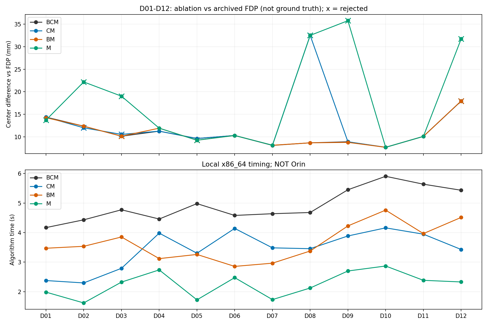
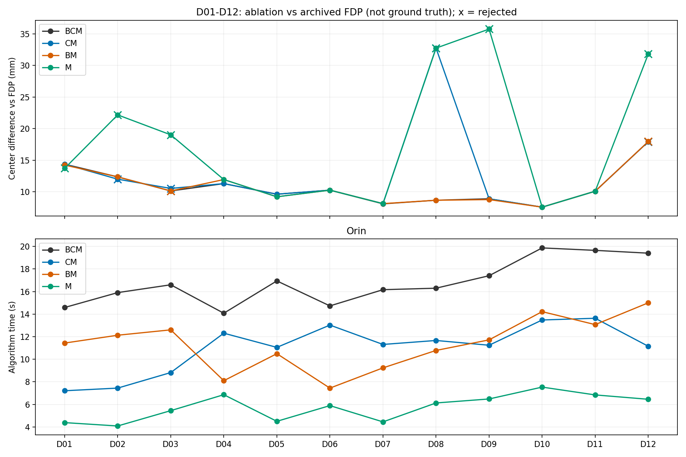

# 开展B/C初值来源消融实验 （1）

- 归档编号：`01a0a43d-2f4c-7b71-97c6-0c188c9c3def`
- 项目：S1 IE_lab 拆垛
- 创建时间：2026-09-15T16:44:28.376000+08:00
- 更新时间：2026-09-16T09:48:49.753000+08:00
- 状态：活动
- 导出范围：用户可见消息与助手可见回复；不含隐藏推理和工具原始输出

## 1. 用户

我们在“”9\_14 优化算法运行时间至1秒内 (2)——容器线程优化实验“” 这个的基础上，我们继续 开始消融实验

“”

**B/C 值得做“跳过实验”，但现在还不能判断它们对最终精度影响小，也不建议直接从正式流程删除。** 前两次只测了耗时，没有验证去掉它们后的结果。

它们虽然只生成初值，但初值会影响后续拟合落在哪个解上，而且当前算法还会**根据初值选择可见模型表面**。因此，换初值不只是让优化器多走几步，也可能改变参与拟合的点。

| 部分对最终结果的作用跳过后的主要风险 |                         |                              |
| ------------------ | ----------------------- | ---------------------------- |
| **B：箱口候选**         | 从箱口提供位置和方向线索，补充侧壁解释     | 箱口清楚、侧壁不足时，可能失去有效初值          |
| **C：多平面候选**        | 从侧壁几何生成候选及竞争解释          | 可能失去较好的中心/yaw 初值，或漏掉应当拒绝的竞争解 |
| **只保留 M：mesh 粗初值** | 当前主要由观测点分布估计中心、方向，再添加扰动 | 遮挡或只看到局部侧壁时，观测点中心可能偏离箱体中心    |

**所以要同时看“精度”和“错误接受”，不能只看剩下的结果是否 accepted。** 删掉一种候选后，竞争减少，有时反而更容易 accepted，但不代表更准确。

建议先做一个很直接的四组消融：

| 实验组保留的初值来源要回答的问题 |       |                |
| ---------------- | ----- | -------------- |
| 基线               | B＋C＋M | 原结果            |
| 去掉 B             | C＋M   | 箱口分支是否冗余？      |
| 去掉 C             | B＋M   | 最贵的多平面分支是否必要？  |
| 同时去掉 B/C         | M     | 只靠粗初值能否得到一致结果？ |

固定其他参数、输入和后续拟合，比较：

- **时间**：实际省了多少；初值变化也可能改变后续迭代耗时。
- **位姿变化**：中心、yaw，以及箱口/短边抓取参考点的变化。
- **状态变化**：原 accepted 是否变 rejected；尤其检查原 rejected 是否变成了可疑 accepted。
- **候选变化**：最佳解来自哪里，内外壁竞争解释是否仍然存在。

可以先用当前冻结帧筛查，但决定删除分支前，要覆盖已有的不同视角、遮挡和拒绝样本。**与旧版一致只能证明回归一致性；真实精度仍需要独立参考，FDP 也不能直接当真值。**

从速度收益看，尝试很有价值：B/C 合计约占带分析器耗时的 **74%**。但即使把这两项完全扣掉，其余仍约 **4.7 秒**，这只是按现有计时做的估算，不能保证删掉后就是这个速度，更不能直接达到 1 秒。

**我的建议是先做上述四组实验。若某一分支只在少数困难样本上有帮助，再考虑“平时跳过、有可靠触发条件时补算”；若跨样本都没有明显贡献，才有依据删除。**

“”

我们在“”9\_14 优化算法运行时间至1秒内 (2)——容器线程优化实验“” 这个的基础上，我们继续 开始消融实验

## 2. 助手（进展）

我先读取项目记录和“容器线程优化实验”任务的结论，确认冻结输入、线程配置和基线，再开展 B＋C＋M、C＋M、B＋M、M 四组消融，比较耗时、位姿、接受状态和候选竞争变化。

## 3. 助手（进展）

基线已确认：同一冻结右腕帧在 Orin 单线程容器中约 15.49 秒。代码还会对初值去重并限制数量，因此跳过 B/C 可能让更多 M 初值进入后续拟合；消融会保留这些原有规则和内外壁检查。先准备独立实验入口并核验本地冻结数据。

## 4. 用户

<send_user_message_question_reply>
[{"questionItemId":"[\"request_user_input_async\",\"call_EbBID4pvzLhXWOb6MqQP88s4\",0]","question":"本轮是否授权通过 SSH 连接 S1（10.34.216.17），在原 Orin `_03` 容器中运行冻结文件的四组消融？仅离线计算，不采集相机、不调用感知服务或运动接口。项目 AGENTS.md 要求当前任务明确授权机器人访问；我会先完成本地入口验证。","answer":"授权在 Orin 容器运行"}]
</send_user_message_question_reply>

## 5. 助手（进展）

收到授权。本地基线已运行完成，结果为 accepted。接下来使用 galbot-s1-ssh 技能，在原 `_03` 镜像中串行运行四组冻结计算，记录完整结果和分支调用次数。

## 6. 助手（进展）

Orin 四组已跑完：基线 15.48 秒，跳过 B 为 10.50 秒，跳过 C 为 8.99 秒，同时跳过 B/C 为 4.09 秒。四组均 accepted、无 OOM；我正在核对位姿和竞争候选，判断加速后结果发生了什么变化。

## 7. 助手

**首轮四组消融已在 Orin 原容器中完成。**

| 保留初值 | 算法耗时 | 相对基线节省 | 状态 |
|---|---:|---:|---|
| B＋C＋M | 15.48 秒 | — | accepted |
| C＋M | 10.50 秒 | 32.17% | accepted |
| B＋M | 8.99 秒 | 41.92% | accepted |
| M | **4.09 秒** | **73.58%** | accepted |

本冻结帧的结果：

- 四组**中心、yaw、箱口中心、短边参考点变化均为 0**。
- 最佳解均来自 M；内外壁竞争检查保留，结果一致。
- 基线完整诊断与旧容器结果完全一致；输入和镜像未改变。

**这说明 B/C 在当前帧可以跳过，约加速 3.79 倍，但仍未达到 1 秒。** 每组仅一次、且本帧原本 accepted，尚不能证明跨帧精度或拒绝行为可靠。下一轮应覆盖已有拒绝、遮挡和不同视角样本，暂不删除正式分支。

[完整实验报告](../../assets/dc32cdd13b844dc7--REPORT.md)

[附件：dc32cdd13b844dc7--REPORT.md](../../assets/dc32cdd13b844dc7--REPORT.md)

## 8. 用户

你重新验证了几组数据？分别验证了哪些？ 名字是什么？

## 9. 助手

这次只重新验证了 **1 组冻结数据，跑了 4 种算法配置**，不是 4 组不同数据。

**数据名称：** `online_docker_20260912_right_03`

- 内容：此前容器线程优化实验使用的**右腕冻结帧**。
- 输入目录：`container_input_bundle`
- 四种配置：B＋C＋M、C＋M、B＋M、仅 M，各运行一次。

本机还用同一数据跑过一次完整基线，验证实验入口；它不算新增样本。

**D02–D12、H01L–H03L，以及此前左腕拒绝帧，这次都尚未重新验证。** 因此当前结论仅适用于上述右腕单帧。

## 10. 用户

要不我们消融实验继续验证 D01–D12，并最终给出于FDP结果的对比

## 11. 助手（进展）

我先核对 D01–D12 的冻结输入、目标确认记录和已有 FDP 结果，再沿用四组消融逐帧验证。最终同时给出相对完整基线的变化、与同帧 FDP 的位姿差，以及接受/拒绝状态变化；缺失数据会明确列出。

## 12. 助手（进展）

D01–D12 全部找到了已确认输入和同帧 FDP 归档，12 帧的输入哈希、FDP 请求内容及坐标变换复核均通过，可以直接比较，不需要重新调用 FDP。接下来继续用已授权的 S1 SSH 和原单线程容器跑 **12 帧 × 4 组，共 48 次**；拒绝结果也会完整保留。

## 13. 助手（进展）

连接 S1 时出现了超时，随后返回“No route to host”，Orin 批次尚未启动。我会先在本机用相同冻结输入和四组配置完成位姿、状态及 FDP 对比；本机耗时单独标注，不当作 Orin 性能。

## 14. 助手（进展）

本机已完成前 8 帧，结果与上一轮单帧明显不同：D02、D08 去掉 B 后由 accepted 变为 rejected，D05 去掉 C 后也变为 rejected。说明 B、C 在这批数据中都可能有作用；剩余帧完成后会结合 FDP 位姿差分析，不能仅按接受状态下结论。

## 15. 助手

_工具输出图片（原始工具文本未纳入归档）。_

## 16. 助手（进展）

48 次本机运行已完成。完整基线接受 10/12 帧，去掉 B 后为 8/12，去掉 C 后为 9/12，仅 M 为 5/12；本批没有原 rejected 转 accepted 的情况。仅 M 有 6 帧的 yaw 与 FDP 相差约 73°–78°，这些帧均被拒绝。结果不支持直接删除 B/C，我正在整理逐帧报告和复核记录。

## 17. 助手

**D01–D12 已完成四组消融，共 48 次，并与同帧 FDP 归档结果完成对比。**

本轮 S1 网络不可达，因此运行在**本机 x86_64**；下表时间不是 Orin 耗时。

| 保留初值 | 接受帧数 | 本机耗时中位数 | 与 FDP 中心差均值* |
|---|---:|---:|---:|
| B＋C＋M | 10/12 | 4.73 秒 | 10.77 mm |
| C＋M | 8/12 | 3.47 秒 | 12.76 mm |
| B＋M | 9/12 | 3.50 秒 | 10.77 mm |
| M | 5/12 | 2.33 秒 | 17.68 mm |

\*统计全部 12 帧候选，包括拒绝结果；**FDP 是参考后端，不是真值。**

### 主要发现

- **去掉 B：**D02、D08 从接受变拒绝；D08 相对基线 yaw 变化约 **72.92°**。
- **去掉 C：**D05 从接受变拒绝。中心变化仅约 **1.30 mm**，但内外壁竞争判定改变。
- **仅 M：**新增 5 帧拒绝；6 帧候选与 FDP 的 yaw 差约 **73°–78°**，均被拒绝。
- 本批没有出现原拒绝转接受。

**结论：B/C 都不能直接删除，仅 M 在这批数据上明显不足。** 去 C 的位姿变化相对较小，但仍须解决 D05 的状态变化。

[完整逐帧报告](../../assets/77d1a66bc11a6c71--REPORT.md) · [48 组明细表](../../assets/564e781825834733--results.csv)

Orin 的 48 组计时尚未完成，需恢复 S1 连通后补齐。

[附件：77d1a66bc11a6c71--REPORT.md](../../assets/77d1a66bc11a6c71--REPORT.md)

[附件：564e781825834733--results.csv](../../assets/564e781825834733--results.csv)

## 18. 用户

Orin 的 48 组计时 我们继续

## 19. 助手（进展）

我继续补齐 Orin 的 48 组计时，沿用原 `_03` 镜像、单线程配置和 D01–D12 冻结输入。先检查 S1 连通性与输入完整性，再串行运行四组消融，并核对结果是否与本机一致；仅执行离线计算。

## 20. 助手（进展）

S1 已恢复连接，原镜像 ID 一致，12 帧冻结输入已上传。现在开始 48 次串行计算；各帧轮换配置顺序，分别记录算法耗时和容器总耗时，预计需要约十分钟。

## 21. 助手（进展）

D01 的四组已完成：完整基线 14.59 秒，仅 M 为 4.39 秒，但仅 M 被拒绝，与本机实验一致。D02 的去 B 和仅 M 两组也被拒绝，说明前一轮观察到的状态变化在 Orin 上仍然存在。

## 22. 助手（进展）

D02 四组已完成：基线 15.91 秒、去 B 7.45 秒、去 C 12.13 秒、仅 M 4.09 秒。去 C 仍接受，去 B 和仅 M 拒绝，与本机一致；目前所有容器均正常退出，无 OOM。

## 23. 助手（进展）

已完成 15/48 次。原本拒绝的 D03 在四种配置下均保持拒绝；D04 已完成的三组均接受。加速幅度明显随帧变化，最终会报告全部逐帧时间和跨帧中位数，不沿用首轮单帧的加速比例。

## 24. 助手（进展）

发现一处需要重点核对的差异：D05 去掉 C 后在 Orin 上返回 accepted，而此前本机是 rejected。我会保留这个差异，完成后检查候选位姿和内外壁残差，不能直接把本机的状态统计套用到 Orin。

## 25. 助手（进展）

已完成 25/48 次。D05 去 C 的差异已定位到表面歧义门限：两台机器的候选中心只差约 0.05 mm，但外/内表面残差比落在 1.10 阈值的两侧，导致接受状态不同。这提示门禁对数值结果较敏感，还不能将 Orin 的 accepted 解释为精度更好。

## 26. 助手（进展）

D01–D08 已完成，共 32/48 次。D08 在 Orin 上同样是完整基线和去 C 接受、去 B 和仅 M 拒绝。目前除 D05 的两组状态差异外，其余已完成组的接受/拒绝情况与本机一致。

## 27. 助手（进展）

D09 已完成，只有仅 M 被拒绝，与本机一致。接下来是 D10–D12；计算完成后还会检查输入/镜像未变、48 个容器的隔离与退出记录，并逐组量化 Orin 和本机的位姿差。

## 28. 助手（进展）

已完成 41/48 次。D10 四组均接受，算法时间从基线 19.87 秒降到仅 M 的 7.53 秒，仍高于 1 秒目标。剩余 D11、D12 运行后即可汇总。

## 29. 助手（进展）

D11 四组均接受，现已完成 45/48 次。最后的 D12 仅 M 组保持拒绝；待其余三组完成，我会下载归档并生成最终计时与跨设备对比报告。

## 30. 助手（进展）

Orin 48/48 次已完成，无超时或 OOM，测试容器已全部清理。最终接受数为：完整基线 10/12、去 B 8/12、去 C 10/12、仅 M 6/12；D05 的去 C 和仅 M 两组与本机状态不同，报告会单独说明。

## 31. 助手

_工具输出图片（原始工具文本未纳入归档）。_

## 32. 助手

**Orin 的 48 组计时已完成：D01–D12 × 四种配置，无超时或 OOM。**

| 保留初值 | 算法耗时中位数 | 相对基线下降 | 接受帧数 |
|---|---:|---:|---:|
| B＋C＋M | 16.45 秒 | — | 10/12 |
| C＋M | 11.28 秒 | 31.44% | 8/12 |
| B＋M | 11.58 秒 | 29.62% | 10/12 |
| M | 6.01 秒 | 63.47% | 6/12 |

**重要差异：**D05 的去 C、仅 M 两组，本机拒绝，Orin 接受。候选中心只差约 **0.055 mm**，但内外壁残差比跨过了歧义阈值。因此，去 C 虽在本轮保持基线接受数，仍不能直接认定可删除。

仅 M 仍未达到 1 秒，而且丢失了部分基线接受帧。原拒绝的 D03、D12 均保持拒绝。

输入和镜像核验通过，测试容器已清理。报告包含逐帧计时、FDP 对比及跨设备差异：

[完整报告](../../assets/447b158328ce02e5--REPORT.md) · [48 组明细](../../assets/18ab58abd428c011--results.csv)

[附件：447b158328ce02e5--REPORT.md](../../assets/447b158328ce02e5--REPORT.md)

[附件：18ab58abd428c011--results.csv](../../assets/18ab58abd428c011--results.csv)

## 33. 用户

这四种配置和FDP的误差有多少？

## 34. 助手（进展）

我按 Orin 的 48 组结果重新核对四种配置相对同帧 FDP 的统计，分别区分“全部候选（含拒绝诊断）”和“仅 accepted”。FDP 只作为参考后端，下面的数值是输出差异，不是独立真值误差。

## 35. 助手

按 Orin 的 D01–D12、48 次结果统计。严格说这是与 FDP 的输出差异，FDP 不是独立真值，因此不能直接称为绝对误差。

中心位置差（欧氏距离，mm；均值 / 中位数 / 最大值）：

| 配置 | 全部 12 帧候选 | 仅 accepted |
|---|---:|---:|
| B＋C＋M | 10.76 / 10.10 / 17.93 | 10.11 / 9.84 / 14.36（10/12） |
| C＋M（去 B） | 12.78 / 10.38 / 32.76 | 10.01 / 9.84 / 14.36（8/12） |
| B＋M（去 C） | 10.76 / 10.10 / 17.95 | 10.11 / 9.64 / 14.22（10/12） |
| M（去 B/C） | 17.70 / 12.81 / 35.77 | 9.52 / 9.64 / 11.93（6/12） |

yaw 差（按 180° 对称处理，度；均值 / 中位数 / 最大值）：

| 配置 | 全部候选 | 仅 accepted |
|---|---:|---:|
| B＋C＋M | 1.03 / 1.16 / 2.15 | 0.99 / 1.16 / 1.57 |
| C＋M | 7.08 / 1.21 / 73.00 | 1.16 / 1.21 / 1.53 |
| B＋M | 1.04 / 1.15 / 2.13 | 1.00 / 1.15 / 1.53 |
| M | 38.00 / 37.10 / 78.25 | 1.20 / 1.24 / 1.53 |

关键解释：

- 去 C 的中心差与完整配置几乎相同。
- 去 B 出现了 D08 约 **32.76 mm、73°** 的异常候选，并被拒绝。
- 仅 M 的全部候选中有多个约 **73°–78°** 的方向错误；这些多数被拒绝，所以“仅 accepted”统计看起来反而较小，存在筛选偏差。
- 箱口中心差均值约为：B＋C＋M **12.23 mm**、C＋M **14.10 mm**、B＋M **12.21 mm**、M **18.96 mm**。

[完整统计报告](../../assets/447b158328ce02e5--REPORT.md)

[附件：447b158328ce02e5--REPORT.md](../../assets/447b158328ce02e5--REPORT.md)
