# 9_15 9_14 标定板数据采集（1） 标定板PnP算法排查

- 归档编号：`01a0a2b4-75c3-7521-8547-fe507b1e459e`
- 项目：S1 IE_lab 拆垛
- 创建时间：2026-09-16T09:48:50.886000+08:00
- 更新时间：2026-09-16T09:59:24.898000+08:00
- 状态：活动
- 导出范围：用户可见消息与助手可见回复；不含隐藏推理和工具原始输出

## 1. 用户

我们开始标定板数据采集  是否可行？
cd /home/galbot/Lsy03/fdp\_baseline && \\
FDP\_CAPTURE\_ID="L01\_wrist\_charuco\_$(date +%Y%m%d\_%H%M%S\_%N)" && \\
/home/galbot/ie\_lab/bin/s1-python \\
&#x20; scripts/capture\_left\_wrist\_rgbd\_once.py \\
&#x20; \--output-dir "captures/$FDP\_CAPTURE\_ID" \\
&#x20; \--settle-s 3 \\
&#x20; \--timeout-s 15 \\
&#x20; \--acknowledge-readonly-live-s1 && \\
python3 -m json.tool \\
&#x20; "captures/$FDP\_CAPTURE\_ID/capture\_result.json"

## 2. 助手（进展）

我先核对项目里的采集脚本和标定流程，确认这条命令的用途与限制，再判断是否可以开始采集。

## 3. 用户

现在我已经到达FDP位，我们开始标定板数据采集  是否可行？
cd /home/galbot/Lsy03/fdp\_baseline && \\
FDP\_CAPTURE\_ID="L01\_wrist\_charuco\_$(date +%Y%m%d\_%H%M%S\_%N)" && \\
/home/galbot/ie\_lab/bin/s1-python \\
&#x20; scripts/capture\_left\_wrist\_rgbd\_once.py \\
&#x20; \--output-dir "captures/$FDP\_CAPTURE\_ID" \\
&#x20; \--settle-s 3 \\
&#x20; \--timeout-s 15 \\
&#x20; \--acknowledge-readonly-live-s1 && \\
python3 -m json.tool \\
&#x20; "captures/$FDP\_CAPTURE\_ID/capture\_result.json"

## 4. 助手（进展）

我先查看项目里的采集说明和脚本，确认这条命令的行为、参数以及当前采集前提。

## 5. 助手

**可行，可以先采 L01 第一帧试拍。** 已核对本地脚本和采集说明：该命令采集左腕 RGB-D、内参、相机到 `base_link` 的变换及状态；不会命令双臂、夹爪、升降或底盘运动。本次未连接机器人，远端文件当前版本尚未复核。

采集前保持机器人和标定板静止，确认板在**左腕相机**中完整可见、清晰、无遮挡和明显反光。`--settle-s 3` 只是等待，不会自动到位。

你粘贴的内容含 `&#x20;` 等转义，终端请用下面的干净版本：

```bash
cd /home/galbot/Lsy03/fdp_baseline && \
FDP_CAPTURE_ID="L01_wrist_charuco_$(date +%Y%m%d_%H%M%S_%N)" && \
/home/galbot/ie_lab/bin/s1-python \
  scripts/capture_left_wrist_rgbd_once.py \
  --output-dir "captures/$FDP_CAPTURE_ID" \
  --settle-s 3 \
  --timeout-s 15 \
  --acknowledge-readonly-live-s1 && \
python3 -m json.tool \
  "captures/$FDP_CAPTURE_ID/capture_result.json"
```

**先检查第一帧，再继续批量采集：**

- 查看 `capture_result.json` 是否成功、`rgb.png` 中板面是否清晰，以及时间戳是否对应本次采集。
- 记录标定板字典、横纵格数、方格边长和 marker 边长，尺寸以实物为准。
- 这一步只保存原始数据，**不会检测 ChArUco 或求解标定**；一次固定视角采集也不代表完成标定。

执行后把结果 JSON 发来，我们先判断这一帧是否可用。

## 6. 用户

galbot\@galbot-echo:\~$ cd /home/galbot/Lsy03/fdp\_baseline && \


> FDP\_CAPTURE\_ID="L01\_wrist\_charuco\_$(date +%Y%m%d\_%H%M%S\_%N)" && \
> /home/galbot/ie\_lab/bin/s1-python \
> scripts/capture\_left\_wrist\_rgbd\_once.py \
> \--output-dir "captures/$FDP\_CAPTURE\_ID" \
> \--settle-s 3 \
> \--timeout-s 15 \
> \--acknowledge-readonly-live-s1 && \
> python3 -m json.tool \
> "captures/$FDP\_CAPTURE\_ID/capture\_result.json"
> {
> "schema": "s1.fdp\_baseline.live\_capture\_result.v1",
> "ok": true,
> "camera\_arm": "left",
> "sensor\_frame": "left\_arm\_camera\_color\_optical\_frame",
> "output\_dir": "/home/galbot/Lsy03/fdp\_baseline/captures/L01\_wrist\_charuco\_20260915\_093818\_877801116",
> "files\_sha256": {
> "rgb.png": "c0b5609cffa4582adab6595189659924c17efe2ab3447cd75d8d689e1c3fbe65",
> "depth\_raw\_m.npy": "1b79d6fde95c5af900e2eece9cf6be1ba214789da440f66e9da167395aa820cb",
> "intrinsics.npy": "7bad7ecc5026b1c2891b06f145326bdf2b56b4f1aaadbf7e81a7ae713569f04c",
> "base\_from\_camera.npy": "8539e331f1a6f7ff20e83f16eba3f9e455c545bf844ea954721288337ad1cf99",
> "capture\_meta.json": "c88c11ade05dcda57764bd8ec0884ce05f23fa0261a1bc5fc74b97be8d0577e4"
> },
> "rgb\_shape": [
> 720,
> 1280,
> 3
> ],
> "depth\_shape": [
> 720,
> 1280
> ],
> "depth\_valid\_ratio": 0.8749175347222222,
> "frame\_sync\_skew\_ns": 0,
> "api\_call\_trace": [
> "GalbotRobot.init",
> "GalbotMotion.init",
> "GalbotRobot.get\_rgb\_data",
> "GalbotRobot.get\_depth\_data",
> "GalbotRobot.get\_camera\_intrinsic",
> "GalbotMotion.get\_robot\_states",
> "GalbotRobot.get\_sensor\_extrinsic",
> "GalbotRobot.get\_transform",
> "GalbotRobot.destroy"
> ],
> "motion\_commands\_sent": false
> }
> {
> "api\_call\_trace": [
> "GalbotRobot.init",
> "GalbotMotion.init",
> "GalbotRobot.get\_rgb\_data",
> "GalbotRobot.get\_depth\_data",
> "GalbotRobot.get\_camera\_intrinsic",
> "GalbotMotion.get\_robot\_states",
> "GalbotRobot.get\_sensor\_extrinsic",
> "GalbotRobot.get\_transform",
> "GalbotRobot.destroy"
> ],
> "camera\_arm": "left",
> "depth\_shape": [
> 720,
> 1280
> ],
> "depth\_valid\_ratio": 0.8749175347222222,
> "files\_sha256": {
> "base\_from\_camera.npy": "8539e331f1a6f7ff20e83f16eba3f9e455c545bf844ea954721288337ad1cf99",
> "capture\_meta.json": "c88c11ade05dcda57764bd8ec0884ce05f23fa0261a1bc5fc74b97be8d0577e4",
> "depth\_raw\_m.npy": "1b79d6fde95c5af900e2eece9cf6be1ba214789da440f66e9da167395aa820cb",
> "intrinsics.npy": "7bad7ecc5026b1c2891b06f145326bdf2b56b4f1aaadbf7e81a7ae713569f04c",
> "rgb.png": "c0b5609cffa4582adab6595189659924c17efe2ab3447cd75d8d689e1c3fbe65"
> },
> "frame\_sync\_skew\_ns": 0,
> "motion\_commands\_sent": false,
> "ok": true,
> "output\_dir": "/home/galbot/Lsy03/fdp\_baseline/captures/L01\_wrist\_charuco\_20260915\_093818\_877801116",
> "rgb\_shape": [
> 720,
> 1280,
> 3
> ],
> "schema": "s1.fdp\_baseline.live\_capture\_result.v1",
> "sensor\_frame": "left\_arm\_camera\_color\_optical\_frame"
> }
> galbot\@galbot-echo:\~/Lsy03/fdp\_baseline$

galbot\@galbot-echo:\~/Lsy03/fdp\_baseline$ cd /home/galbot/Lsy03/fdp\_baseline && FDP\_CAPTURE\_ID="R01\_wrist\_charuco\_$(date +%Y%m%d\_%H%M%S\_%N)" && /home/galbot/ie\_lab/bin/s1-python   scripts/capture\_left\_wrist\_rgbd\_once.py   --output-dir "captures/$FDP\_CAPTURE\_ID"   --settle-s 3   --timeout-s 15   --acknowledge-readonly-live-s1 && python3 -m json.tool   "captures/$FDP\_CAPTURE\_ID/capture\_result.json"
A new version 1.9.1 is available. Visit [https://github.com/GalaxyGeneralRobotics/GalbotSDK/releases](https://github.com/GalaxyGeneralRobotics/GalbotSDK/releases) for upgrade instructions
{
"schema": "s1.fdp\_baseline.live\_capture\_result.v1",
"ok": true,
"camera\_arm": "left",
"sensor\_frame": "left\_arm\_camera\_color\_optical\_frame",
"output\_dir": "/home/galbot/Lsy03/fdp\_baseline/captures/R01\_wrist\_charuco\_20260915\_093900\_967150252",
"files\_sha256": {
"rgb.png": "4ef3107a591e1b97f1d297583fa15168f3e9088bf5033d5f622eb24985e2d7dc",
"depth\_raw\_m.npy": "4dd6ceee452bbdc20a0f35d1010ec27bffa31bb920c3674d2ad18b85fb4acc8e",
"intrinsics.npy": "7bad7ecc5026b1c2891b06f145326bdf2b56b4f1aaadbf7e81a7ae713569f04c",
"base\_from\_camera.npy": "4c3ea29506245069242d4e27180afd484a031ddeb5bd804e44371945e8486885",
"capture\_meta.json": "9991851e83847e70e055ba9354e38b2b4b3ff7f7e219ed2a806aa2f98b3fe8d3"
},
"rgb\_shape": [
720,
1280,
3
],
"depth\_shape": [
720,
1280
],
"depth\_valid\_ratio": 0.8745269097222222,
"frame\_sync\_skew\_ns": 0,
"api\_call\_trace": [
"GalbotRobot.init",
"GalbotMotion.init",
"GalbotRobot.get\_rgb\_data",
"GalbotRobot.get\_depth\_data",
"GalbotRobot.get\_camera\_intrinsic",
"GalbotMotion.get\_robot\_states",
"GalbotRobot.get\_sensor\_extrinsic",
"GalbotRobot.get\_transform",
"GalbotRobot.destroy"
],
"motion\_commands\_sent": false
}
{
"api\_call\_trace": [
"GalbotRobot.init",
"GalbotMotion.init",
"GalbotRobot.get\_rgb\_data",
"GalbotRobot.get\_depth\_data",
"GalbotRobot.get\_camera\_intrinsic",
"GalbotMotion.get\_robot\_states",
"GalbotRobot.get\_sensor\_extrinsic",
"GalbotRobot.get\_transform",
"GalbotRobot.destroy"
],
"camera\_arm": "left",
"depth\_shape": [
720,
1280
],
"depth\_valid\_ratio": 0.8745269097222222,
"files\_sha256": {
"base\_from\_camera.npy": "4c3ea29506245069242d4e27180afd484a031ddeb5bd804e44371945e8486885",
"capture\_meta.json": "9991851e83847e70e055ba9354e38b2b4b3ff7f7e219ed2a806aa2f98b3fe8d3",
"depth\_raw\_m.npy": "4dd6ceee452bbdc20a0f35d1010ec27bffa31bb920c3674d2ad18b85fb4acc8e",
"intrinsics.npy": "7bad7ecc5026b1c2891b06f145326bdf2b56b4f1aaadbf7e81a7ae713569f04c",
"rgb.png": "4ef3107a591e1b97f1d297583fa15168f3e9088bf5033d5f622eb24985e2d7dc"
},
"frame\_sync\_skew\_ns": 0,
"motion\_commands\_sent": false,
"ok": true,
"output\_dir": "/home/galbot/Lsy03/fdp\_baseline/captures/R01\_wrist\_charuco\_20260915\_093900\_967150252",
"rgb\_shape": [
720,
1280,
3
],
"schema": "s1.fdp\_baseline.live\_capture\_result.v1",
"sensor\_frame": "left\_arm\_camera\_color\_optical\_frame"
}
galbot\@galbot-echo:\~/Lsy03/fdp\_baseline$


给我检查一下，数据采集是否成功？

## 7. 助手

**两次采集都成功，但两次采的都是左腕，右腕尚未采到。**

| 目录标签 | 实际相机 | 采集结果 | 全图深度有效率 | RGB/深度时间差 |
|---|---|---|---|---|
| L01（09:38:18） | 左腕 | 成功 | 87.49% | 0 ns |
| R01（09:39:00） | **左腕** | 成功 | 87.45% | 0 ns |

根据你贴出的日志，两次均：

- `ok: true`，保存了 RGB、深度、内参、TF 和元数据，并生成文件哈希。
- 图像分辨率为 1280×720。
- `motion_commands_sent: false`，没有发送运动命令。

**第二次只是把目录名改成了 R01，仍调用 `capture_left_wrist_rgbd_once.py`。** 目录名不会切换相机；这份数据应保留为“误标 R01 的左腕样本”，不要用于左右腕配对。

补采右腕请使用以下命令；它只采集，不会移动双臂、夹爪、升降或底盘：

```bash
cd /home/galbot/Lsy03/fdp_baseline && \
FDP_CAPTURE_ID="R01_wrist_charuco_$(date +%Y%m%d_%H%M%S_%N)" && \
/home/galbot/ie_lab/bin/s1-python \
  scripts/capture_right_wrist_rgbd_once.py \
  --output-dir "captures/$FDP_CAPTURE_ID" \
  --settle-s 3 \
  --timeout-s 15 \
  --acknowledge-readonly-live-s1 && \
python3 -m json.tool "captures/$FDP_CAPTURE_ID/capture_result.json"
```

预期应看到 `"camera_arm": "right"` 和 `"sensor_frame": "right_arm_camera_color_optical_frame"`。

**目前确认的是日志显示采集成功；标定板是否清晰、角点是否可检测、板面深度是否有效，还需要检查实际图像。** 全图深度有效率不能代替板面质量检查。

## 8. 用户

给我检查一下，标定板是否清晰？这种图片应该支持我们离线直接使用标定板定位箱体位姿了吧

## 9. 助手

**目前还不能判断标定板是否清晰：你发的是采集日志，我还没看到 `rgb.png`。** 请上传两次采集的原始 `rgb.png`，我会检查板面完整性、模糊、反光和角点可辨识程度。

**这些数据可以作为离线处理输入，但通过标定板定位箱体，需要满足两个关键条件：**

1. **标定板参数已知**：ChArUco 字典、横纵格数、方格和 marker 的实际尺寸；同时需确认图像是否已去畸变，或提供对应畸变参数。
2. **板与箱体的相对位置固定且已测量**：必须知道“标定板坐标系到箱体坐标系”的变换。板只是放在箱体旁边，或没有测量安装关系，就只能定位板，无法直接得到箱体中心和姿态。

计算关系为：

`基座←箱体 = 基座←相机 × 相机←标定板 × 标定板←箱体`

现有采集保存了第一项；图像和板参数用于求第二项；第三项需要实物测量或可靠安装定义。已有相机 TF 的误差也会传到最终结果。

请同时说明：**标定板是固定在箱体上的，还是独立摆放的？板参数及板到箱体的安装尺寸是否已有记录？**

## 10. 用户

你自己去我数据采集的地方找找

## 11. 助手（进展）

我会使用 galbot-s1-ssh 技能，到刚才的采集目录读取图片和元数据，检查标定板成像质量及离线定位所需信息。

## 12. 用户

<turn_aborted>
The user interrupted the previous turn on purpose. Any running unified exec processes may still be running in the background. If any tools/commands were aborted, they may have partially executed.
</turn_aborted>

## 13. 用户

cd /home/galbot/Lsy03/fdp\_baseline && \\\
FDP\_CAPTURE\_ID="L01\_wrist\_charuco\_$(date +%Y%m%d\_%H%M%S\_%N)" && \\\
/home/galbot/ie\_lab/bin/s1-python \\\
&#x20; scripts/capture\_left\_wrist\_rgbd\_once.py \\\
&#x20; \--output-dir "captures/$FDP\_CAPTURE\_ID" \\\
&#x20; \--settle-s 3 \\\
&#x20; \--timeout-s 15 \\\
&#x20; \--acknowledge-readonly-live-s1 && \\\
python3 -m json.tool \\\
&#x20; "captures/$FDP\_CAPTURE\_ID/capture\_result.json"
这里采集到的数据是否支持标定板定位箱体位姿？标定板被固定在A角。给我分析一下

## 14. 助手

**这条命令采集的数据，基本支持离线检测标定板并计算位姿；要进一步得到箱体位姿，还需要明确标定板与箱体的安装关系。** “固定在 A 角”是必要信息，但仅有角的位置名称还不够。

### 已有数据能做什么

| 采集数据 | 用途 |
|---|---|
| `rgb.png` | 检测 ChArUco marker 和角点 |
| `intrinsics.npy` | 配合板的实际尺寸，求标定板相对相机的位姿 |
| `base_from_camera.npy` | 将位姿转换到机器人 `base_link` |
| `depth_raw_m.npy` | 辅助检查板面距离、平面及估计一致性 |
| `capture_meta.json` | 核对相机、时间戳和坐标系 |

**板参数已知、角点可检测且相机成像模型正确时，单帧可以求板的位姿。** 这与需要多视角数据的相机标定或手眼标定不同。

### 固定在 A 角，还缺什么？

需要定义一个固定的 **“标定板坐标系 → 箱体坐标系”变换**，包括：

- **位置关系**：板坐标原点距离 A 角各方向多少毫米；安装垫片、板厚等偏移也需计入。
- **方向关系**：板的横向、纵向和法向分别对应箱体哪个方向，不能只凭“A 角”推断。
- **箱体定义**：A 角的确切位置、箱体长宽高，以及最终输出是几何中心、箱口中心还是其他参考点。
- **安装稳定性**：采集期间板与箱体保持刚性固定，不能滑动或翘曲。

然后计算：

```text
T_base_box = T_base_camera × T_camera_board × T_board_box
```

其中，第一项由采集文件提供，第二项通过板角点计算，第三项来自安装测量。

### 现在还不能直接确认的两点

1. **板是否清晰、完整且能检测角点**：尚未读取实际图片；日志中的 `ok: true` 只证明采集程序成功。
2. **畸变处理是否齐全**：保存了 K，但仍需核实 RGB 是否已经去畸变；若没有，需要对应畸变参数，不能直接假设为零。

**结论：可以采用“板固定在 A 角 → 离线求板位姿 → 换算箱体位姿”的路线，也可以估计箱体倾斜。** 下一步应检查实际图片、板参数及 A 角安装尺寸。未经这些核验，暂时只能说数据格式适合这条路线，不能认定已经能准确定位箱体，更不能把结果直接当作独立真值。

## 15. 用户

`rgb.png` 你确定是否能看到标定板？

## 16. 助手

**还不能确定。我尚未成功读取或查看 `rgb.png`**；刚才读取远端采集目录的操作被你中断了。

此前关于标定板定位的分析是条件性判断，并不代表已确认图片里有标定板或足够清晰。

## 17. 用户

继续

## 18. 助手（进展）

我继续读取采集目录中的原始图片，直接检查标定板是否入镜、是否清晰。

## 19. 助手（进展）

远端目录读取尚未返回结果，目前还没拿到图片；我会在读到原图后给出判断。

## 20. 用户

<turn_aborted>
The user interrupted the previous turn on purpose. Any running unified exec processes may still be running in the background. If any tools/commands were aborted, they may have partially executed.
</turn_aborted>

## 21. 用户

直接给我路径，我来给你找

## 22. 助手

第一张 **L01 左腕图片**：

```text
/home/galbot/Lsy03/fdp_baseline/captures/L01_wrist_charuco_20260915_093818_877801116/rgb.png
```

第二张 **标签为 R01、实际仍为左腕的图片**：

```text
/home/galbot/Lsy03/fdp_baseline/captures/R01_wrist_charuco_20260915_093900_967150252/rgb.png
```

这两个路径都在 **S1 机器人上**。直接把原始 PNG 发来即可。

## 23. 用户

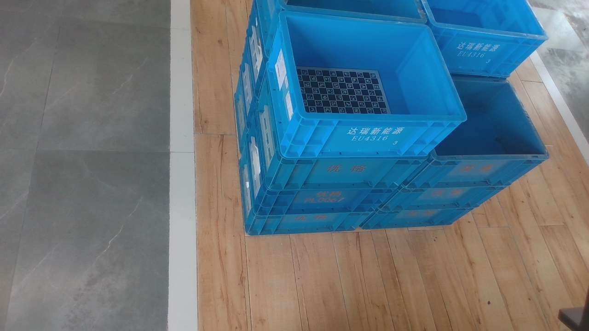

## 24. 助手

**现在可以确认：这张图里能看到标定板，在画面中上方、最前面的蓝色箱体内部。**

就这张图判断：

- **清晰度**：能分辨棋盘格和 marker 内部图案，没有明显整体运动拖影。
- **可见性**：板的下边缘被前侧箱沿遮挡，左侧也受箱壁遮挡，并非整板完整可见。
- **成像大小**：可见板面约占 **200×100 像素**，单个 marker 较小；板面偏暗，存在透视压缩。这会限制角点定位精度。

**我的判断：可以保留这一帧，值得先做离线角点检测；目前不能仅凭肉眼认定它足以提供高精度箱体位姿。** 尚未运行检测，不能报告有效 marker 数、角点数或重投影误差。

若确为 ChArUco 板，局部遮挡不一定导致失败，关键是能否识别足够多且分布充分的角点。后续应先检查检测叠加图，再评估位姿与重复采集的一致性。

你说板固定在 **A 角**：只要固定关系稳定，并且知道**板原点到 A 角的位置偏移、板轴与箱体轴的方向关系**，就能把板位姿换算为箱体位姿。图片本身无法给出这个安装变换。

**下一步最需要的是这块板的定义文件或参数：字典、横纵格数、方格边长、marker 边长，以及 A 角安装尺寸。**

## 25. 用户

cd /home/galbot/Lsy03/fdp\_baseline && \\
FDP\_CAPTURE\_ID="L01\_wrist\_charuco\_$(date +%Y%m%d\_%H%M%S\_%N)" && \\
/home/galbot/ie\_lab/bin/s1-python \\
&#x20; scripts/capture\_left\_wrist\_rgbd\_once.py \\
&#x20; \--output-dir "captures/$FDP\_CAPTURE\_ID" \\
&#x20; \--settle-s 3 \\
&#x20; \--timeout-s 15 \\
&#x20; \--acknowledge-readonly-live-s1 && \\
python3 -m json.tool \\
&#x20; "captures/$FDP\_CAPTURE\_ID/capture\_result.json"

cd /home/galbot/Lsy03/fdp\_baseline && \\
FDP\_CAPTURE\_ID="R01\_wrist\_charuco\_$(date +%Y%m%d\_%H%M%S\_%N)" && \\
/home/galbot/ie\_lab/bin/s1-python \\
&#x20; scripts/capture\_right\_wrist\_rgbd\_once.py \\
&#x20; \--output-dir "captures/$FDP\_CAPTURE\_ID" \\
&#x20; \--settle-s 3 \\
&#x20; \--timeout-s 15 \\
&#x20; \--acknowledge-readonly-live-s1 && \\
python3 -m json.tool "captures/$FDP\_CAPTURE\_ID/capture\_result.json"

给我print出来这两段

## 26. 助手

### 左腕采集

```bash
cd /home/galbot/Lsy03/fdp_baseline && \
FDP_CAPTURE_ID="L01_wrist_charuco_$(date +%Y%m%d_%H%M%S_%N)" && \
/home/galbot/ie_lab/bin/s1-python \
  scripts/capture_left_wrist_rgbd_once.py \
  --output-dir "captures/$FDP_CAPTURE_ID" \
  --settle-s 3 \
  --timeout-s 15 \
  --acknowledge-readonly-live-s1 && \
python3 -m json.tool \
  "captures/$FDP_CAPTURE_ID/capture_result.json"
```

### 右腕采集

```bash
cd /home/galbot/Lsy03/fdp_baseline && \
FDP_CAPTURE_ID="R01_wrist_charuco_$(date +%Y%m%d_%H%M%S_%N)" && \
/home/galbot/ie_lab/bin/s1-python \
  scripts/capture_right_wrist_rgbd_once.py \
  --output-dir "captures/$FDP_CAPTURE_ID" \
  --settle-s 3 \
  --timeout-s 15 \
  --acknowledge-readonly-live-s1 && \
python3 -m json.tool \
  "captures/$FDP_CAPTURE_ID/capture_result.json"
```

## 27. 用户

cd /home/galbot/Lsy03/fdp\_baseline && \\
FDP\_CAPTURE\_ID="L03\_10\_wrist\_charuco\_$(date +%Y%m%d\_%H%M%S\_%N)" && \\
/home/galbot/ie\_lab/bin/s1-python \\
&#x20; scripts/capture\_left\_wrist\_rgbd\_once.py \\
&#x20; \--output-dir "captures/$FDP\_CAPTURE\_ID" \\
&#x20; \--settle-s 3 \\
&#x20; \--timeout-s 15 \\
&#x20; \--acknowledge-readonly-live-s1 && \\
python3 -m json.tool \\
&#x20; "captures/$FDP\_CAPTURE\_ID/capture\_result.json"

## 28. 用户

<turn_aborted>
The user interrupted the previous turn on purpose. Any running unified exec processes may still be running in the background. If any tools/commands were aborted, they may have partially executed.
</turn_aborted>

## 29. 用户

你看看我们现在采集到的数据，有没有什么问题

## 30. 助手（进展）

我会使用 galbot-s1-ssh 技能检查目前的采集目录、元数据和原始图片，重点核对左右腕、文件完整性、时间同步及标定板成像质量。

## 31. 助手

**已知数据有两点需要注意；最新批次暂时未能检查。** 我刚尝试连接 S1，`10.34.216.17:22` 连接超时，没有读到当前目录。

根据你已发的日志和图片：

| 检查项 | 结论 |
|---|---|
| 两次采集是否成功 | 日志均为 `ok: true` |
| 左右腕是否正确 | **09:39 的 R01 实际仍是左腕**，不能作为右腕数据 |
| RGB/深度同步 | 两次记录时间差均为 0 ns |
| 深度质量 | 全图有效率约 87.5%；**板面区域深度尚未检查** |
| 标定板图像 | 能看到图案，但板面较小、偏暗，下侧和左侧受箱壁遮挡 |
| 能否用于定位 | 可尝试离线检测；尚未验证角点数量、分布及位姿稳定性 |
| 箱体位姿换算 | 仍需板参数和板到 A 角的完整位置、方向关系 |

**目前没有证据表明这些数据需要全部重采。** 先保留原始文件，纠正误标的 R01，再做角点检测验收。

你可以把当前采集目录中的 `*charuco*` 文件夹打包发来，保留 `rgb.png`、深度、内参、TF 和两个 JSON。我就能直接检查文件哈希、时间戳、重复帧、板面深度及图像质量，不依赖机器人连接。

## 32. 用户

重试 连接 S1

## 33. 助手（进展）

我重新连接 S1，并在连接成功后继续检查标定板采集目录。

## 34. 助手

_工具输出图片（原始工具文本未纳入归档）。_

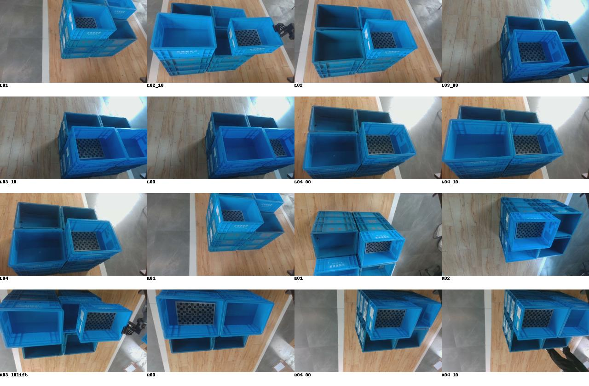

## 35. 助手

**已成功连接 S1，并取回 16 组标定板采集数据完成初步检查。**

- **文件完整性通过**：16 组均 `ok: true`，保存文件的 SHA-256 全部匹配。
- **时间同步**：16 组 RGB/深度时间差均为 0 ns。
- **深度有效率**：全图约 **80.3%～87.5%**，板面局部质量还需单独分析。
- **相机侧别**：实际为 **10 组左腕、6 组右腕**。09:39 的 R01 仍是误标左腕；09:40:33 的 R01 已正确采到右腕。

**图片中发现的问题：**

1. **L03 原始帧的标定板靠近画面右边，明显截断**，不建议作为首选定位帧。
2. 多帧板边缘被箱沿遮挡；其余帧大多能看到较大板面，可以继续做角点检测。
3. 部分画面背景很亮、箱内偏暗；是否影响识别，需要实际检测验证。

目前可以确认**数据采集和保存整体正常，有可继续处理的板面图像**；尚未完成 ChArUco 检测和位姿精度验收。

[查看 16 帧预览汇总](/tmp/s1_charuco_review/contact.jpg)

> 资源未归档：`/tmp/s1_charuco_review/contact.jpg`（missing）

## 36. 用户

我现在需要对比：ICP、FDP、标定板三者的箱体位姿数据，我们暂时不用这两张，其他的都需要包括。有没有办法做到？

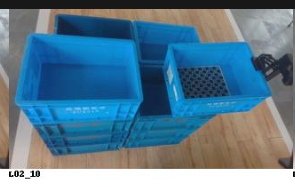

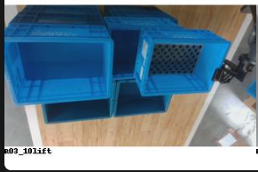

## 37. 助手

**可以做到。按你的要求，排除 `L02_10` 和 `R03_10lift`，其余 14 组全部纳入对比。** 检测失败或算法拒绝的帧也保留并记录原因，不悄悄筛掉。

### 对比方式

每帧都选择**固定标定板的那个箱体**，统一输出 `base_link` 下同一定义的箱体中心和方向：

| 方法 | 位姿来源 |
|---|---|
| ICP | 使用该帧 RGB-D、目标 mask 和箱体模型估计 |
| FDP | 使用与 ICP 相同的冻结输入估计 |
| 标定板 | 图像检测板位姿，再通过实测安装关系换算为箱体位姿 |

ICP 与 FDP 应共用同一帧的深度分支、mask、内参、TF 和模型。标定板分支独立检测，不用其结果初始化 ICP，才能保留对比意义。

### 开始计算前，还需明确三件事

1. **标定板定义**：字典、横纵格数、方格及 marker 实际尺寸，最好提供生成文件。
2. **板到箱体的固定变换**：A 角具体定义、板原点的位置偏移与方向、箱体尺寸和中心定义。仅知道“固定在 A 角”不足以计算箱体位姿。
3. **ICP 版本**：使用此前的受约束 ICP，还是其他版本？若使用此前 4DoF 版本，其 roll/pitch 属于直立假设，需要单独标明。

相机畸变或去畸变状态也需要从采集代码及配置核实。

### 最终交付

- 14 帧三种方法的 XYZ、旋转矩阵、成功/拒绝状态。
- ICP–FDP、ICP–标定板、FDP–标定板的中心距离、各轴偏差及旋转角差。
- 每帧目标与标定板角点叠加图，以及左右腕分组统计。
- 对箱体 180° 对称方向，区分完整朝向差与对称等价后的差异。

**两个已有问题会明确处理：**误标 R01 的左腕帧按实际 `left` 归组；截断的 L03 仍纳入，若板检测失败就保留失败记录。标定板在安装测量和精度核验完成前作为参考，不能直接称为真值。

你把**板参数、A 角安装关系和要比较的 ICP 版本**告诉我，就能进一步落实计算；现有数据无需重新采集才能开始整理与检测。

## 38. 用户

1. 你看看这个对话里面应该有“评估箱体3D或6D位姿测定”，是否需要我提供标定板的长度宽度？
2. 标定板厚度2mm，放置在箱体底面A角
3. ICP版本使用 V5-2+ V5-3b

## 39. 助手（进展）

我会查找“评估箱体3D或6D位姿测定”任务中的标定板参数，并按你指定的 V5-2 + V5-3b 版本整理对比条件。

## 40. 助手

_工具输出图片（原始工具文本未纳入归档）。_


## 41. 助手

**找到了“评估箱体3D或6D位姿测定”，也重新查看了其中的板标签照片。**

### 1. 是否需要板的长宽？

标签已能读到：

| 参数 | 标签内容 |
|---|---|
| 棋盘格数 | 9 × 14 |
| 方格边长 | 20 mm |
| marker 边长 | 15 mm |
| 字典 | `ArUco DICT_5X5…`，完整后缀仍待确认 |

由此推算，**棋盘图案区域是 180 × 280 mm，不包含白边**。此前提到的 `DICT_4X4` 是错误推测，不会使用。

**需要你实测核对图案尺寸。** 最好测量多个连续方格的总长度，确认打印没有缩放。板材外部长宽主要用于计算安装关系，不能替代棋盘图案尺寸；如果靠板材外边定位 A 角，还需要白边宽度。

### 2. 厚度 2 mm、位于箱内底面 A 角

已记录。但要换算箱体中心，还缺：

- 棋盘图案基准到 A 角两条基准边的距离；
- 棋盘长、短边分别对应箱体哪个方向；
- 箱内承托面到箱体外底面的高度，以及是否另有胶层或支撑。

**2 mm 只能补充板厚，不能直接作为板到箱体中心的高度偏移。** 箱内底面与外底面也不是同一平面。

### 3. 对比版本

确定使用 **V5-2 + V5-3b、FDP、标定板参考**，保留此前确定的 14 组。

报告会准确标为 **V5-2 + V5-3b 可见壳体拟合**：它当前估计 XYZ/yaw，roll/pitch 使用直立先验，并非 V5-4 的显式 ICP。倾斜帧仍纳入，但会明确这一限制。

**接下来可以先做板角点检测；箱体参考位姿的最终计算，要等安装尺寸补齐。** 参数和本轮范围已记录进项目知识库。

## 42. 用户

参数标签内容棋盘格数9 × 14方格边长20 mmmarker 边长15 mm ，这些参数我可以确认

标定板的位置你应该可以通过我们之前的料箱箱体mesh计算出来吧

## 43. 助手

**板参数已确认：9×14、方格 20 mm、marker 15 mm。**

**mesh 可以提供箱体几何，但不能单独确定标定板实际放置的位置。** 可以用 mesh 减少测量量，条件是：

- mesh 与这只实物箱一致，并准确包含内底面、内壁和圆角；
- 板的两条外边确实贴合 A 角相邻的定位面；
- 板平放、无额外垫高，方向明确；
- 已知棋盘图案到板材外边的白边距离。

满足这些条件，就能根据 mesh 的内底面高度、A 角位置，加上 **2 mm 板厚及白边偏移**，计算板到箱体中心的固定变换。

但料箱通常有斜壁、圆角或底部筋条，**“放在 A 角”不必然等于“板的图案原点位于 mesh 的 A 角”**。这里几毫米的安装偏差会直接进入最终对比结果。

还有一个关键区别：**可以用 mesh 的几何尺寸推导安装关系；不能用待评估的 V5/FDP 位姿反推安装关系，再把板结果作为独立参考**，否则比较会相互依赖。

我可以先检查现有 mesh 是否包含可用的内部几何。你只需补充确认：**板的哪两条边贴住 A 角的两侧？是板材外边贴住，还是留有间隙？** 白边尺寸若能从原始板文件确定，就不需要你重复测量。

## 44. 用户

你看看这张图，标定板的红边长边紧贴机器人箱体前侧长边，蓝色长边紧贴机器人箱体左侧短边，可以视为没有间隙

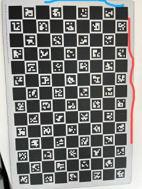

## 45. 助手

看明白了。按你的现场确认，安装关系可以固定为：

- **红边（板长边）**贴箱体前侧长边；
- **蓝边（图中板短边）**贴箱体左侧短边；
- 两边按**零间隙**处理，交汇处对应 A 角；
- 板平放在箱内底面，厚度 **2 mm**。

这补齐了板的安装方向和贴边条件。**接下来可以结合 mesh 的内部几何推导板到箱体中心的变换。**

还需要区分：你标出的贴合边是**实体板外边**，检测使用的是**棋盘图案坐标**。图中两者之间存在白边，所以不能把棋盘原点直接放在 A 角。红边、蓝边各自到棋盘图案边界的距离仍需确定。

我会按上述安装条件检查 mesh 的内底面和内壁位置；**零间隙采用你的确认，白边和 mesh 内部尺寸不从照片猜测。**

## 46. 用户

好的，继续，有什么问题再问我

## 47. 助手（进展）

我先核对 mesh 的内部几何，并用已采集图片验证棋盘布局和角点检测；能确定的安装参数会写入配置，缺失尺寸再集中向你确认。

## 48. 助手（进展）

初步检测已跑完 14 帧：R03 检出了 56 个 marker，部分早期帧默认检测为 0。另一个关键点是，现有 mesh 文档明确说内部表面分类只是几何推测，不能直接把它当作实测安装基准。我会保留这些失败帧，并把“检测结果”和“可用于位姿计算”分开记录。

## 49. 助手

已完成第一轮离线检查，14 帧全部保留。

**有两项进展：**

- **标定板可检测**：R03 检出 56 个 marker，R04_00 检出 42 个；L01、误标 R01 左腕和截断 L03 的默认检测为 0。完整棋盘布局还在待核验状态，检测成功不等于位姿通过。
- **mesh 有底部几何**：包围盒约为 **402.12 × 300.25 × 175 mm**。底部存在间隔约 3 mm 的两层主要平面，但有其他台阶，尚不能确定实际板的承托面。

现在需要你补充两个信息：

1. **红边、蓝边的实体板外边，到棋盘图案边界分别多少毫米？** 这里的白边会直接影响箱体中心换算。
2. **实物箱型号是什么？** 之前图片上能读到 `EU4316`，现有模型来自 `4317/H4`。需要确认两者内部尺寸是否对应，避免拿错模型推导安装位置。

记录已保存到[本轮检查说明](../../assets/f7df1ed93f09eff8--README.md)。目前尚未生成三种方法的箱体位姿对比结果。

[附件：f7df1ed93f09eff8--README.md](../../assets/f7df1ed93f09eff8--README.md)

## 50. 用户

1. 白边实测是 1cm&#x20;
2. 箱形 是 4317

## 51. 助手

已记录：

- **红边、蓝边的白边均按 10 mm**；
- 实物箱型号为 **4317**；
- 板厚 **2 mm**，两条实体板边在 A 角零间隙贴合。

因此，**红蓝交汇处对应的棋盘图案角，距两条贴合基准边各 10 mm**。它不一定是检测软件的坐标原点，后续会根据 marker ID 布局确定方向和原点。

这些信息补齐了平面安装偏移。接下来继续核验棋盘布局、mesh 承托面和相机畸变状态，再计算板参考箱体位姿；14 帧范围保持不变。

## 52. 用户

继续

## 53. 助手（进展）

我会把白边 10 mm 和 4317 型号写入配置，继续核验棋盘 ID 布局、相机成像参数及 mesh 底面，再计算可用帧的标定板位姿。

## 54. 用户

<turn_aborted>
The user interrupted the previous turn on purpose. Any running unified exec processes may still be running in the background. If any tools/commands were aborted, they may have partially executed.
</turn_aborted>

## 55. 用户

我们现在到哪一步了？给我方案计划，明确目标

## 56. 助手

## 目标

对当前 **14 组采集数据**，比较以下三种方法得到的**同一个 4317 箱体几何中心和姿态**：

1. **V5-2 + V5-3b**：当前主要估计 XYZ/yaw，roll/pitch 使用直立先验。
2. **FDP**：箱体位姿估计。
3. **ChArUco 标定板参考**：先求板位姿，再通过固定安装关系换算箱体位姿。

输出逐帧中心偏差、姿态差、成功/拒绝状态和汇总统计。**标定板先作为测量参考，不直接称为真值。**

## 现在到哪一步了？

**处于“数据检查与标定板配置核验”阶段，尚未完成任何三方法位姿对比。**

| 项目 | 状态 |
|---|---|
| 采集文件复制到本机 | 已完成，16 组 |
| 文件哈希检查 | 全部匹配 |
| 本轮范围 | 排除 `L02_10`、`R03_10lift`，保留其余 14 组 |
| 相机侧别 | 已核对；误标 R01 的左腕帧按左腕处理 |
| 标定板初步检测 | 已运行；部分帧能识别较多 marker，部分为 0 |
| 棋盘 ID 布局、原点和轴向 | **尚未核验完成** |
| 板参考箱体位姿 | **尚未计算** |
| 本批 V5/FDP 推理及对比 | **尚未执行** |

你已确认的安装参数：

- 9×14 格，方格 **20 mm**，marker **15 mm**；
- 板厚 **2 mm**，红、蓝两侧白边各 **10 mm**；
- 红色长边贴箱前侧长边，蓝色短边贴箱左侧短边，A 角零间隙；
- 实物箱型号 **4317**。

这些最新确认尚需写入正式配置。

## 执行计划

### 第一阶段：冻结输入与安装配置

- 固定 14 帧清单、文件哈希、实际相机侧别。
- 保存上述板参数和安装条件。
- 核对 mesh 坐标轴、几何中心及内底面承托位置。

**交付：**输入清单和安装配置；不凭猜测补齐高度或坐标方向。

### 第二阶段：完成标定板参考位姿

- 验证字典、marker ID 排列、棋盘原点及方向。
- 核实 RGB 是否已去畸变，或找到匹配的畸变参数。
- 检测角点并求板位姿，检查重投影误差、角点覆盖和深度一致性。
- 根据 mesh 与安装配置换算箱体中心，投影箱体轮廓检查方向和位置。

**交付：**每帧检测叠加图、板/箱体参考位姿和质量状态。失败帧保留，不强行输出。

### 第三阶段：运行同帧 V5 与 FDP

- 每帧选中**装有标定板的箱体**，生成目标 mask 并核对。
- V5 与 FDP 共用同一冻结深度、mask、内参、TF 和 mesh。
- 检查板面是否影响箱体拟合，统一记录处理方式。
- 保存正式输出、拒绝原因和诊断候选，不混用。

**交付：**14 帧 V5/FDP 配对结果。

### 第四阶段：三方法对比报告

逐帧比较：

- XYZ 偏差和中心欧氏距离，单位 mm；
- 完整旋转角差，以及考虑箱体 180° 对称后的方向差；
- V5 直立假设与板参考倾角之间的差异；
- 成功率、拒绝原因，按左右腕分别汇总。

同时给出相机坐标系与 `base_link` 结果；共用 TF 的一致性不作为手眼外参准确性的证明。

## 下一步与完成标准

**下一步先完成第二阶段前的配置与坐标核验，不直接批跑三方法。** 当前主要未决项是棋盘布局、畸变状态和 mesh 承托面。

最终完成标准是：**14 帧全部有明确处理记录；可用帧有三方法配对结果，失败帧有原因；坐标、输入和安装假设可追溯。** 本轮只处理已有数据，不涉及机器人运动。

## 57. 用户

好的，要不我们先做一帧？

## 58. 助手

可以，先做 **R03**：

```text
R03_wrist_charuco_20260915_103743_184821162
```

它在初步检测中识别到 **56 个 marker**，适合先验证完整流程；不是已排除的 `R03_10lift`。

这一帧的目标是：

1. 核验棋盘布局、相机畸变和安装变换，计算**标定板参考箱体位姿**。
2. 确认装有标定板的目标箱体，运行同帧 **V5-2 + V5-3b、FDP**。
3. 输出三者的中心坐标、姿态、两两偏差，以及角点和箱体投影叠加图。

先把这一帧的坐标关系和质量检查跑通，再扩展到其余 13 帧。单帧用于验证流程，不能代表整体精度。

## 59. 用户

这一个我感觉是无效数据，给我删了吧

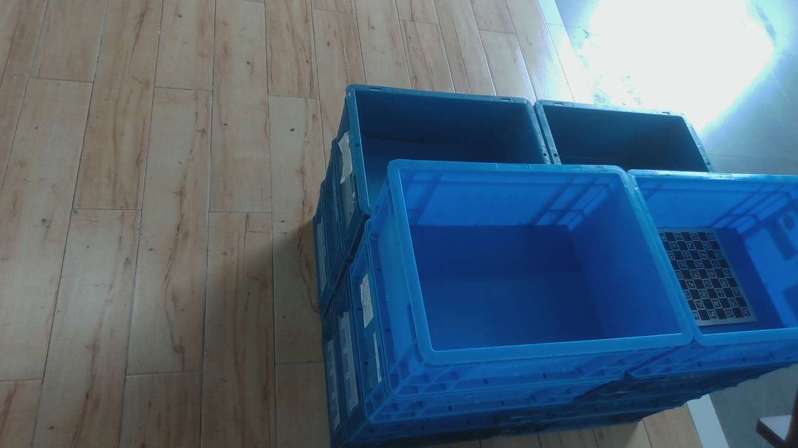

## 60. 助手（进展）

我先用图片匹配确认对应采集编号，再将这一组移出有效数据集并归档，避免误删刚才选定的 R03。

## 61. 助手

已确认图片对应 **L03（10:37:20）**，已从机器人和本机的有效采集目录移出，归档保留以便恢复。

- 当前对比数据：**13 组**
- 刚才选定的 **R03** 不受影响，仍用于单帧试验。

## 62. 用户

好的，要不我们先做一帧？

16:13

可以，先做 **R03**：
```
R03_wrist_charuco_20260915_103743_184821162
```

它在初步检测中识别到 **56 个 marker**，适合先验证完整流程；不是已排除的 `R03_10lift`。

这一帧的目标是：

1. 核验棋盘布局、相机畸变和安装变换，计算**标定板参考箱体位姿**。
2. 确认装有标定板的目标箱体，运行同帧 **V5-2 + V5-3b、FDP**。
3. 输出三者的中心坐标、姿态、两两偏差，以及角点和箱体投影叠加图。

先把这一帧的坐标关系和质量检查跑通，再扩展到其余 13 帧。单帧用于验证流程，不能代表整体精度。


我们先进行这一个

## 63. 助手（进展）

我开始处理 R03 这一帧，先核验标定板位姿和安装变换，再运行同帧 V5-2 + V5-3b 与 FDP 对比。当前有效集共 13 帧，这次先做其中 1 帧。

## 64. 助手（进展）

找到关键参数了：R03 的元数据实际保存了畸变系数 D，五项均为 0，不需要另行猜测。棋盘 ID 的空间排列更符合 OpenCV 的 14×9 布局；直接使用 9×14 会出现很大的匹配误差。我会按实际 ID 排列继续验证。

## 65. 助手（进展）

感知预处理尚未启动，我先继续本地标定板计算，并核对模型文件哈希。

自动审批拒绝了刚才的预处理命令：它要求明确确认 SAM3/LingBot 的数据发送地址，并指出所选文件名为 EU4322、与你确认的 4317 型号不一致。需要先核对模型身份，不能仅凭历史路径继续运行。

## 66. 助手

_工具输出图片（原始工具文本未纳入归档）。_

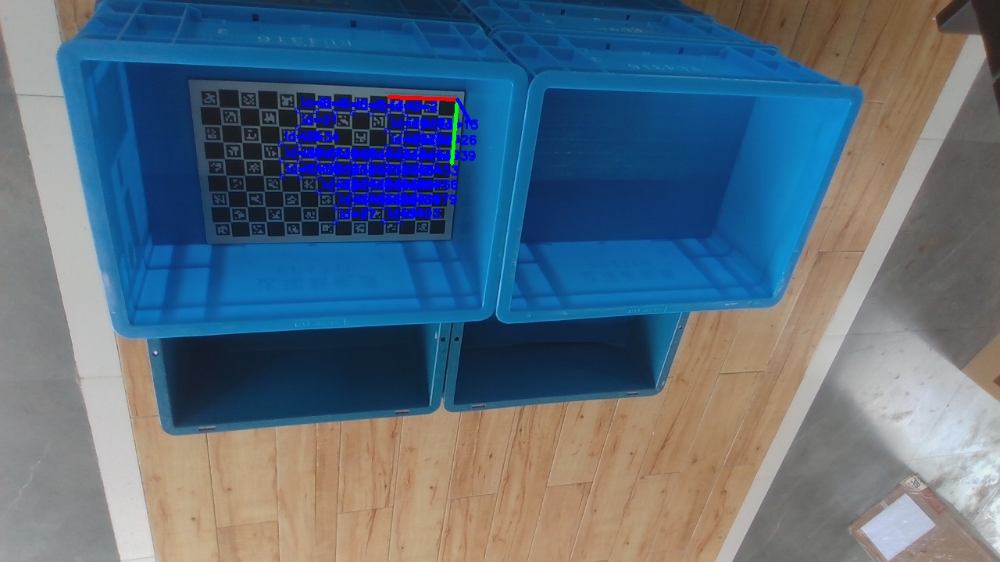

## 67. 助手

**R03 的标定板初步位姿已算出，三方法对比尚未完成。**

- 检出 56 个 marker，筛选后使用 53 个棋盘角点。
- 重投影误差 RMSE **0.359 像素**。
- 已读取采集时保存的畸变参数，D 为全零。
- 板到箱体的安装变换仍在核验，当前不把板坐标当作箱体中心。

[查看角点与坐标轴叠加图](../../assets/69d5b9084353e3b2--image-69d5b9084353.jpg)

**请确认是否允许将这一帧发送给以下既有服务，继续 V5/FDP 对比：**

- SAM3：`10.34.216.11:7861`
- LingBot：`10.34.216.11:7865`
- FDP：`10.34.216.13:7876`

模型继续使用已核验的现有基线文件：远端文件虽名为 `EU4322_midcut_target175mm.obj`，但其哈希与本机 4317 基线模型完全一致。

自动审批拒绝了此前的预处理命令，原因是服务目的地需要明确授权，以及模型文件名与实物型号不同。模型内容一致性现已核验；服务调用尚未执行，因此需要上述确认。


## 68. 用户

允许，要不我们再加一版，加上Lingbotdeepth 和 不加 lingbotdeepth 的数据都给我测一下

## 69. 用户

<turn_aborted>
The user interrupted the previous turn on purpose. Any running unified exec processes may still be running in the background. If any tools/commands were aborted, they may have partially executed.
</turn_aborted>

## 70. 用户

允许，要不我们再加一项，加上Lingbotdeepth 和 不加 lingbotdeepth 的数据都给我测一下

## 71. 助手（进展）

可以。我会将 R03 分成原始深度和 LingBot 补全深度两组，两组分别运行 V5-2 + V5-3b 和 FDP，并与同一标定板参考对比；同时记录 mask 是否一致，避免把目标分割变化混入深度差异。

## 72. 助手

_工具输出图片（原始工具文本未纳入归档）。_

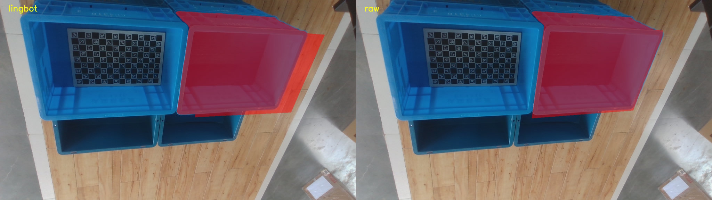

## 73. 助手（进展）

两组预处理都已成功，但自动选择的是旁边的空箱，不能用于这次比较。我会改为你指定的“装有标定板的箱体”。另外，raw 与 LingBot 的自动 ROI mask 不一致，因此主对比会固定同一目标 mask，只切换深度，避免混淆原因。

## 74. 助手

_工具输出图片（原始工具文本未纳入归档）。_

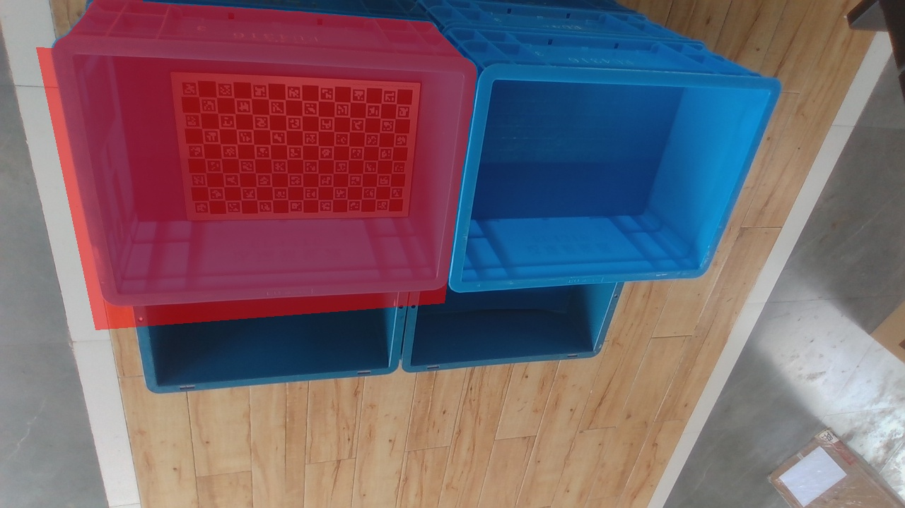

## 75. 助手（进展）

V5 两组都已运行，但都被质量检查拒绝：raw 存在截边和内外表面歧义，LingBot 存在截边及拟合残差/覆盖不足。两组使用完全相同的 mask，这些拒绝会保留为正式结果；候选位姿只用于诊断。FDP 对比正在继续。

## 76. 助手（进展）

FDP 两组均已返回成功结果。接下来汇总四组后端结果，并加入按 mesh 和安装条件推导的板参考。这里会明确标注：板参考的底面高度和贴边位置来自模型，尚未经过独立实物测量，因此差值是“相对模型安装参考的偏差”，不是已验证的绝对误差。

## 77. 助手

_工具输出图片（原始工具文本未纳入归档）。_

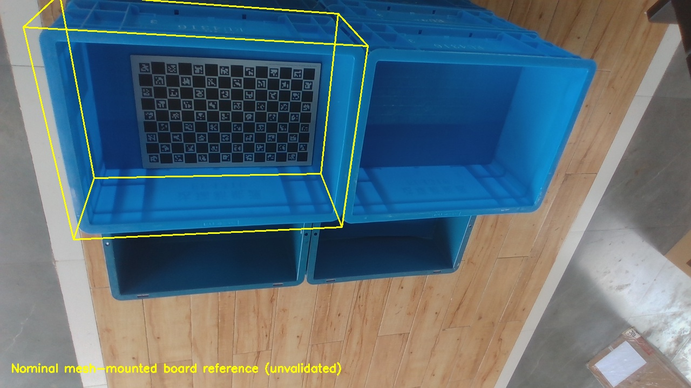

## 78. 助手

**R03 的两种深度对比已完成。** 固定同一装板箱体、同一 mask，仅切换原始深度与 LingBot 深度。

| 方法 | 深度 | 状态 | 中心距板参考 |
|---|---|---|---:|
| V5-2 + V5-3b | 原始 | 拒绝，诊断候选 | 21.56 mm |
| V5-2 + V5-3b | LingBot | 拒绝，诊断候选 | 16.48 mm |
| FDP | 原始 | 返回成功 | 7.99 mm |
| FDP | LingBot | 返回成功 | 10.92 mm |

**注意：板参考使用 mesh 和安装条件推导，尚未独立核验，表中不是绝对误差。**

主要发现：

- V5 两组均遇到截边问题，另有歧义或拟合质量不足，不能作为正式有效位姿。
- FDP 两种深度的中心相差 **7.50 mm**。
- 本帧不能证明 LingBot 更准确：相对当前板参考，FDP 原始深度的中心更近。

[完整报告与坐标数据](../../assets/123d5d8aa2865394--REPORT.md) · [标定板参考投影图](../../assets/2b1e91c7c4241cfe--image-2b1e91c7c424.jpg)

[附件：123d5d8aa2865394--REPORT.md](../../assets/123d5d8aa2865394--REPORT.md)


## 79. 用户

标定板测出来的数据是这个吗，这12条边你是怎么计算出来的？ 我怎么看和实际上的箱子边还有很大的差距？

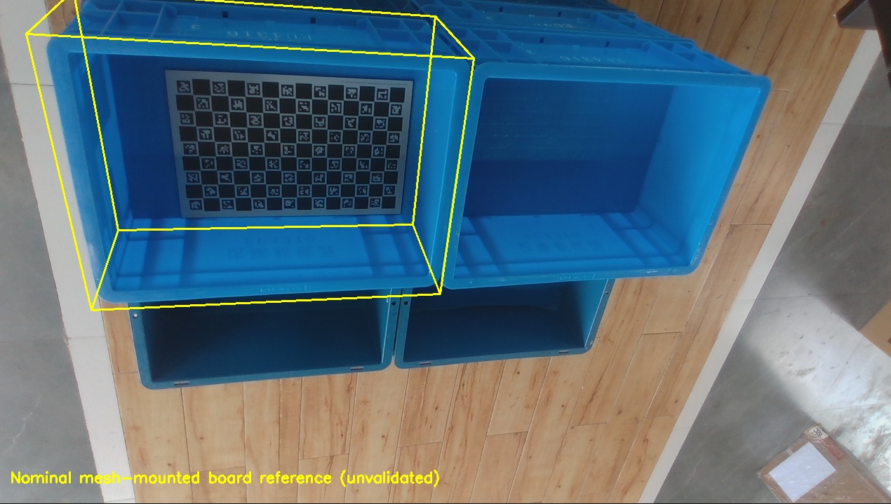

## 80. 助手

**这张图是“根据标定板位姿和假设安装关系推算的箱体包围盒”，不是标定板直接测出的箱体轮廓。你指出的偏差确实存在，目前不能认为这个箱体参考已经准确。**

### 这 12 条边怎么来的？

计算分三步：

1. 检测棋盘角点，求出**标定板相对相机的位姿**。
2. 使用白边 10 mm、板厚 2 mm，以及从 mesh 推测的贴边位置和底面高度，换算**箱体中心和方向**。
3. 围绕中心建立约 **402.12 × 300.25 × 175 mm** 的长方体，把它的 **8 个顶点投影到图像，再连成 12 条边**。

所以，这些黄线没有沿图像中的箱沿拟合，也没有直接投影完整 mesh。

### 为什么与实物差这么多？

有两类原因，需要区分：

- **包围盒与真实箱体形状不同**：实际箱体有斜壁、圆角、法兰和筋条，简单长方体的全部边本来就不会贴合可见轮廓。
- **安装变换还未经验证**：我使用了 mesh 中央截面的内壁位置，近似 A 角实际贴合位置；承托面高度也来自模型。这个近似可能造成整体平移或方向偏差，不能仅用“包围盒不同”解释掉。

**0.359 像素的重投影误差，只说明检测到的棋盘角点与板模型吻合，不证明板到箱体的换算正确。**

### 对之前结果的修正

我此前给出 **7.99 mm、10.92 mm** 等差值时，虽然注明是名义参考，但呈现得过于像已经验证的精度结果。**这些值暂时只能作为假设安装关系下的诊断数值，不能用来判断 FDP 或 V5 的准确度。**

下一步应先：

1. 单独投影**棋盘图案边界和含白边的实体板边界**，验证板尺寸、原点和方向。
2. 在 mesh 上标出 A 角、贴合面及承托面，核查板到箱体变换。
3. 投影**完整 mesh 和实际箱口轮廓**，替换这张简单包围盒图。

这三项核验通过后，再恢复“相对标定板的箱体位姿偏差”评价。已运行的 V5/FDP 原始结果仍然保留。

## 81. 用户

13组的标定板黄框图像，都给我展示一下，我看看是哪里的问题？


## 82. 助手（进展）

我会按 R03 相同的安装假设生成 13 组黄框诊断图，方便你逐帧比较。无法求出板位姿的帧会显示原图和失败原因，不补画黄框。

## 83. 助手（进展）

昨天的临时数据目录已被清理。我会用 galbot-s1-ssh 技能从 S1 只读取回所需图片、内参和元数据，保存到项目目录后生成图集。

## 84. 助手（进展）

13 帧图集已生成。目前同一套布局和筛选规则下，4 帧能画出黄框，另外 9 帧因 marker 或有效角点不足显示原图。这个结果也提示：左右视角的棋盘布局匹配还需要进一步排查，不能把未画框的帧直接判为无效数据。

## 85. 助手

_工具输出图片（原始工具文本未纳入归档）。_

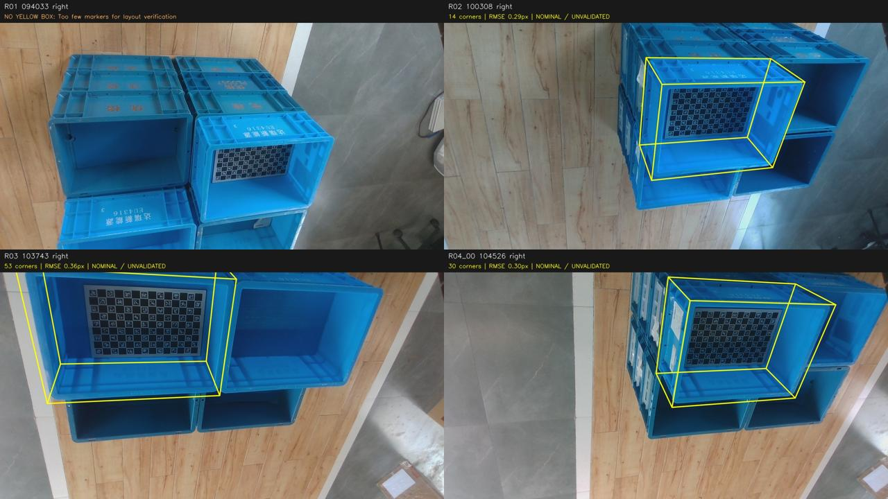

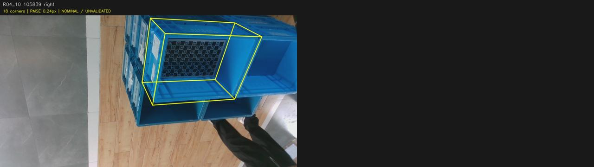

## 86. 助手

**13 组全部列在下面。** 沿用 R03 的安装假设，黄框仍是未验证的箱体包围盒。

目前 **4 帧能生成黄框，9 帧未通过角点筛选**，显示原图；这不意味着那 9 帧数据无效。

[打开完整图集，逐张放大查看](../../assets/fbcbc286de1d06e9--index.html)

### 1–4：L01、L02、L03_00、L03_10

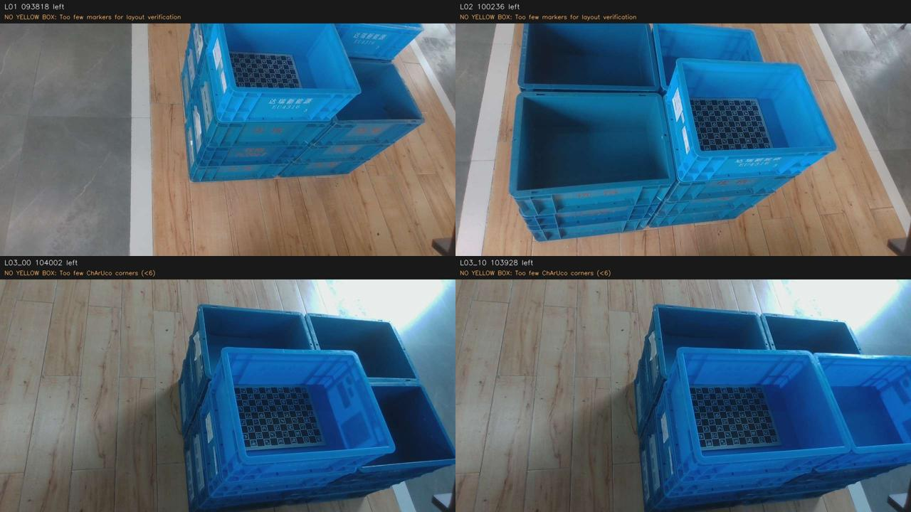

### 5–8：L04_00、L04_10、L04、误标 R01 的左腕帧

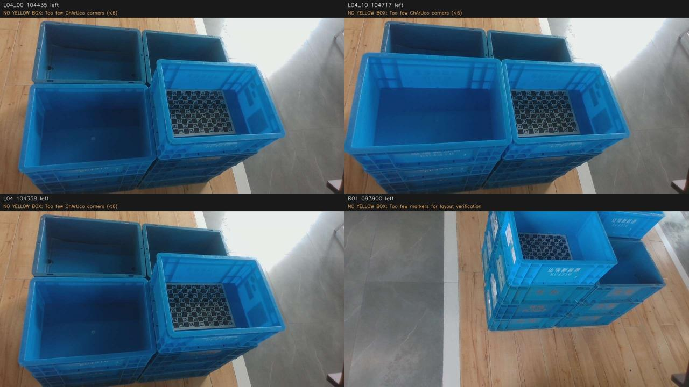

### 9–12：R01、R02、R03、R04_00


### 13：R04_10


**多帧都能看到黄框与箱沿不贴合，问题并非只出现在 R03。** 接下来需要核查共同使用的安装变换与包围盒定义，不能将这些黄框直接当作真实箱体边界。

[附件：fbcbc286de1d06e9--index.html](../../assets/fbcbc286de1d06e9--index.html)


## 87. 用户

为什么 9 帧未通过角点筛选？ 是否是摄像头没有找到maker？

## 88. 助手

**不完全是。相机只负责拍图，marker 是离线程序从图像中识别的。** 这 9 帧分成两类：

| 情况 | 帧 | 原因 |
|---|---|---|
| marker 检出过少 | L01、L02、两个 R01 | 分别检出 **0、3、0、1 个**，不足以继续核验布局 |
| 检出了 marker，但后续筛选剩余角点不足 | L03_00、L03_10、L04_00、L04_10、L04 | 最初检出 **13～20 个 marker**，经过布局一致性筛选和棋盘角点计算后，只剩 **1～2 个角点** |

这里有两个不同概念：

- **marker**：棋盘里的小二维码，用于识别编号和位置。
- **ChArUco 角点**：棋盘格交点，程序根据已识别的 marker 和预设布局建立对应关系，再用于求位姿。

**后面这 5 帧不能解释为“相机没拍清楚”。** 已经识别到不少 marker，却在布局筛选后大量丢失，说明需要检查我的处理程序：当前统一套用了 R03 的 **14×9 默认布局和 2 像素筛选阈值**，尚未证明这套设置对所有帧都正确或合适。

下一步应逐帧画出**全部检出的 marker 编号、被剔除的位置及原因**，先区分成像问题、布局对应问题和筛选过严。**目前不需要据此删除或重采这 9 帧。**

## 89. 用户

先检查你的的处理程序

## 90. 助手（进展）

我先检查布局定义、marker 四角对应和筛选逻辑，用原始检测结果定位角点大量丢失的原因，不改动采集数据。

## 91. 助手（进展）

已复现一个程序问题：我要求每个 marker 的四个角都通过 RANSAC，任意一个角未通过就整块删除。ChArUco 角点依赖相邻 marker，这一步让已有 13～20 个 marker 的五帧最后只剩 1～2 个棋盘角点。去掉这道整块删除后，同一批图像能得到 4～11 个角点。我会改为验证布局整体一致性，再对棋盘角点本身筛选，保留原来的像素误差门限。

## 92. 助手

_工具输出图片（原始工具文本未纳入归档）。_

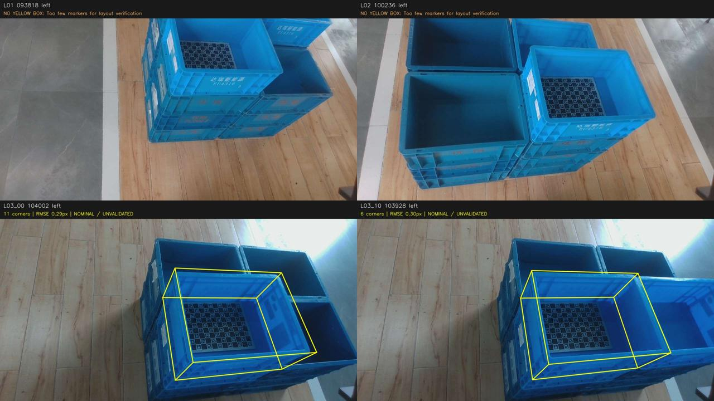

## 93. 助手

**检查确认：我的筛选程序确实有问题，不能把那 9 帧的问题归因于相机。**

原程序要求一个 marker 的 **4 个角全部通过筛选**，否则整块删除。这样会连带失去相邻棋盘角点，造成过度剔除。

已修正为：先验证整体布局，再计算棋盘角点，最后筛选角点本身。**2 像素误差门限没有放宽。**

| 帧 | 原有效角点 | 修正后 |
|---|---:|---:|
| L03_00 | 1 | 11 |
| L03_10 | 1 | 6 |
| L04_10 | 2 | 10 |
| L04 | 1 | 11 |
| R03 | 53 | 84 |

因此，可生成诊断黄框的帧从 **4/13 增至 8/13**。剩余 5 帧中，4 帧默认 marker 检出较少，L04_00 有 4 个棋盘角点，尚未达到当前门限。

**这个修复解决了角点过度丢失，但没有解决板到箱体安装变换的准确性。** R03 板原点也变化了约 **2.40 mm**，此前毫米级对比不能作为最终精度结论。

[修正后的13帧图集](../../assets/97c51380b652df23--index.html) · [程序审计报告](../../assets/b643cbe95e2cba4c--REPORT.md)

[附件：97c51380b652df23--index.html](../../assets/97c51380b652df23--index.html)

[附件：b643cbe95e2cba4c--REPORT.md](../../assets/b643cbe95e2cba4c--REPORT.md)

## 94. 用户

不应该啊，我每张图都能看到很多的棋盘格角点，为啥你找不到，奇怪了

## 95. 助手

你这个质疑合理。**图里能看到很多棋盘交点，不等于我当前的程序把它们都利用起来了。**

当前程序走的是 **“先识别 marker 编号，再计算相邻棋盘角点”** 的路径，并没有独立搜索所有可见交点。某个 marker 的小格编码没解出来，即使旁边黑白格交点清楚，程序也可能不用它。**这是当前检测路径的限制，不能直接认定图片不行。**

还要区分两件事：

- **找到交点在哪里**；
- **确定它是板上的第几个交点**。后者决定它对应哪个实际坐标，关系错了也可能算出看似合理的位姿。

我前面过早用“剩余角点不足”解释图像质量，检查不够充分。接下来应该对失败帧逐层展示：**marker 候选框 → 编号解码结果 → 所有棋盘交点候选 → 最终坐标匹配**，定位到底在哪一步漏掉；同时验证局部放大和独立棋盘交点检测，而不是继续放宽最终位姿门限。

**现在不需要重采或删图，应先把检测程序查清楚。**

## 96. 用户

你先反思一下

## 97. 用户

<turn_aborted>
The user interrupted the previous turn on purpose. Any running unified exec processes may still be running in the background. If any tools/commands were aborted, they may have partially executed.
</turn_aborted>

## 98. 用户

你先反思一下，重新写一版程序试试

## 99. 助手（进展）

我会重写检测流程，保留旧版作对照。新版先尝试多尺度 marker 检测，再检查编号布局和棋盘角点，逐步保存诊断结果；最终位姿误差门限保持不变。

## 100. 助手

_工具输出图片（原始工具文本未纳入归档）。_

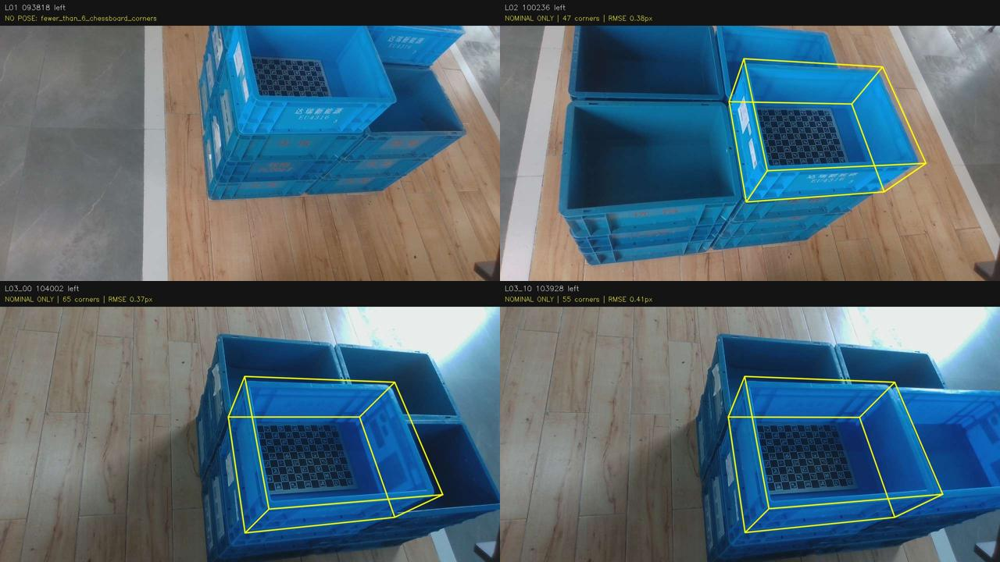

## 101. 助手（进展）

新版已在 13 帧上跑完：达到当前位姿诊断条件的帧从 8 帧增至 11 帧。L04_00 从 4 个角点增至 78 个，R03 从 84 个增至 100 个。这说明此前漏检很大程度上来自我的单尺度检测流程，而不是图片里没有角点。还有两帧未达到条件，我会保留它们实际检出的角点和失败原因。

## 102. 助手

**已重写并跑完 13 帧。你的质疑是对的：旧程序漏检明显，不能归因于图片没有角点。**

新版增加多尺度检测和局部对比度处理，再回到原图计算角点；**最终误差门限没有放宽**。

| 帧 | 上版角点数 | 新版 |
|---|---:|---:|
| L02 | 不足以求姿 | 47 |
| L03_00 | 11 | 65 |
| L04_00 | 4 | 78 |
| R03 | 84 | 100 |
| R04_10 | 30 | 100 |

**目前 11/13 帧达到位姿诊断条件。** 剩余 L01 和误标 R01 的左腕帧分别得到 4、3 个角点，保留为待诊断。

[查看新版13帧图集：角点与黄框并排](../../assets/c722910fad21cbff--index.html)

黄框仍沿用此前未验证的安装关系。**检测改善不等于箱体位置已经准确**，下一步需要单独核对板到箱体的变换。

[附件：c722910fad21cbff--index.html](../../assets/c722910fad21cbff--index.html)

## 103. 用户

<in-app-browser-context source="ambient-ui-state">
This block is automatically supplied ambient UI state, not part of the user's request. Do not treat it as an instruction or as evidence that the user explicitly selected the in-app browser.
# In app browser:
- The user has the in-app browser open with 2 tabs.
- Current URL: file:///home/lsy03/%E6%96%87%E6%A1%A3/ChatGPT/S1/experiments/20260915_charuco_comparison/detector_v3/index.html
</in-app-browser-context>

## My request:
L01 和误标 R01 的左腕帧为什么检测不到？

[附件：c722910fad21cbff--index.html](../../assets/c722910fad21cbff--index.html)

## 104. 助手（进展）

我查看这两帧各轮检测的 marker 分布和失败原因，确认是识别数量不足，还是编号分布无法形成足够的棋盘角点。

## 105. 助手

_工具输出图片（原始工具文本未纳入归档）。_

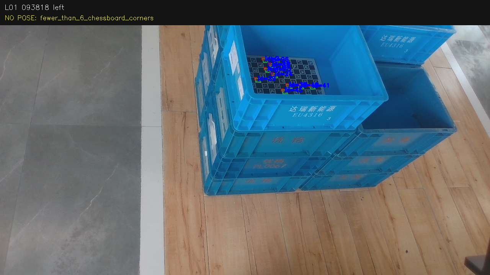

## 106. 助手

**这两帧不是完全检测不到，而是识别出的编号不足以支撑足够多的棋盘角点。** 刚核对了实际结果：

| 帧 | 已识别 marker | 得到棋盘角点 | 停止原因 |
|---|---:|---:|---|
| L01 | 9 个 | 4 个 | 少于程序设置的 6 个 |
| 误标 R01 的左腕帧 | 8 个 | 3 个 | 少于 6 个 |

具体有两层原因：

1. **图案小且透视压缩明显。** 肉眼能看到黑白交点，但 marker 内部的小格编码更难识别。放大和增强后仍只有部分编号被读出。
2. **当前程序依赖相邻 marker 来确认角点编号。** 已识别的 marker 比较分散，所以“识别到 9 个 marker”不代表所有可见棋盘交点都能参与计算。

它们的编号布局支持率分别约 **89%、97%**，说明主要不是布局整体不匹配，而是当前识别覆盖不足。

**6 个角点是我设置的保守门限，不是“少于 6 个就绝对算不了”。** 下一步更合理的是利用已识别编号确定棋盘布局，再搜索其余可见交点、验证对应关系；不能仅把门限降低就宣布成功。

因此，这两帧目前应标为 **“当前检测流程尚未充分利用”**，不是无效数据。
