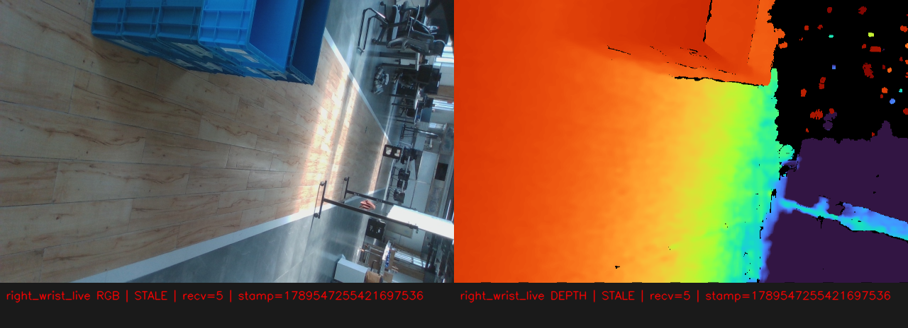
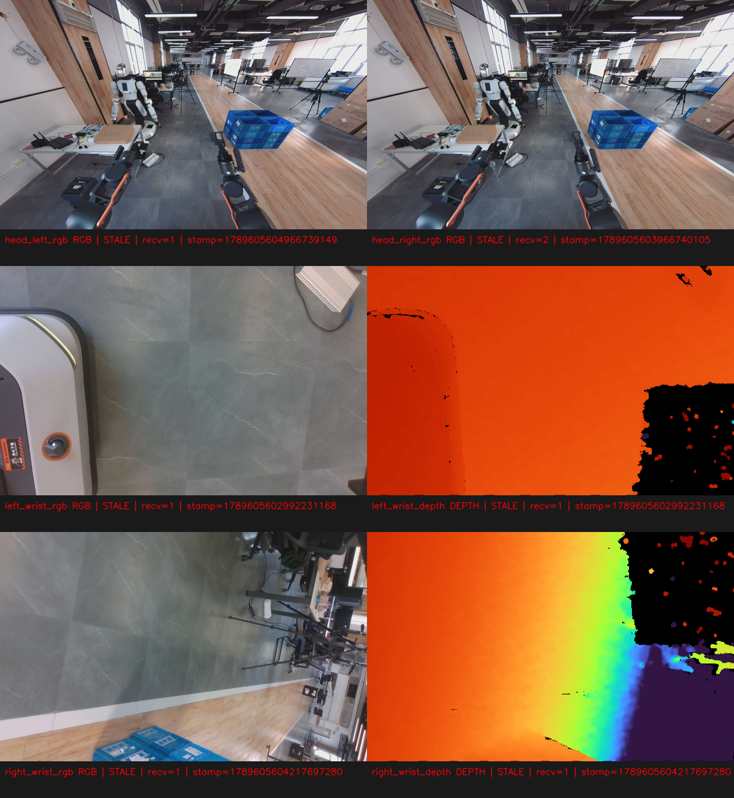
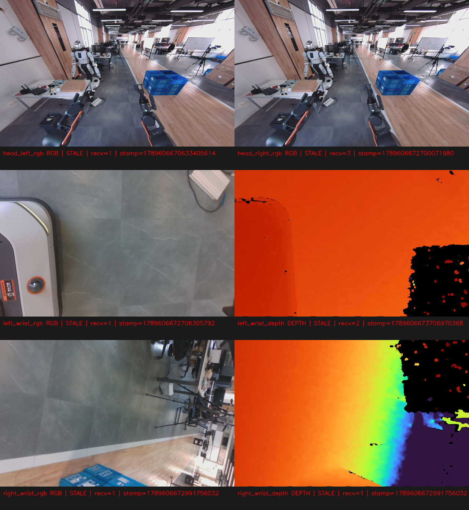
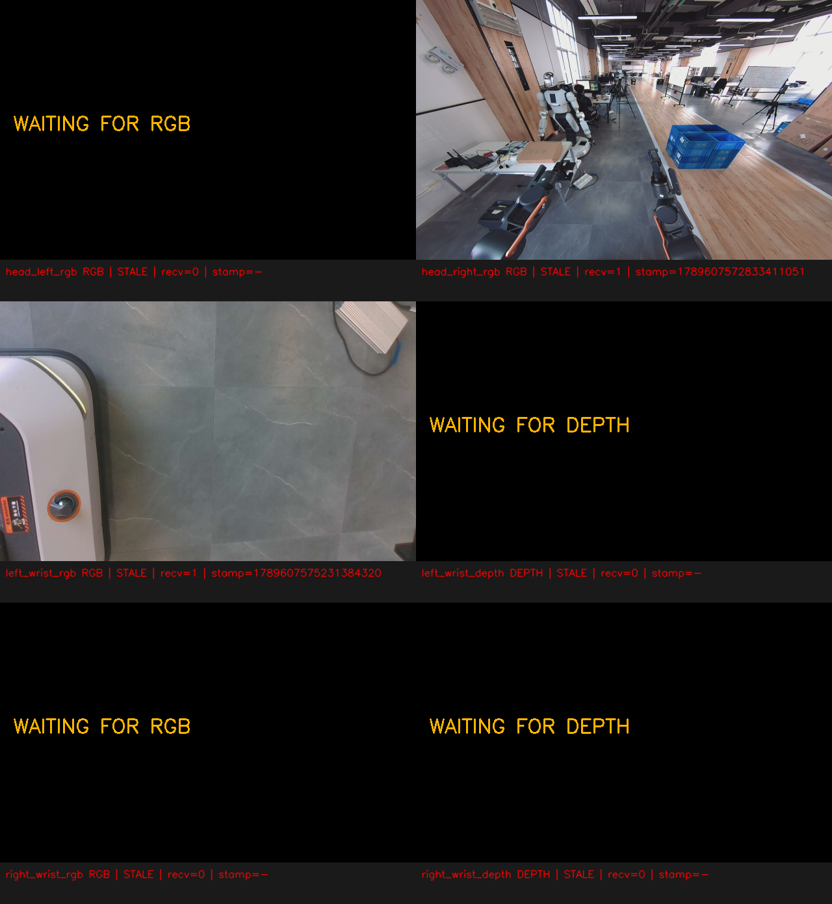
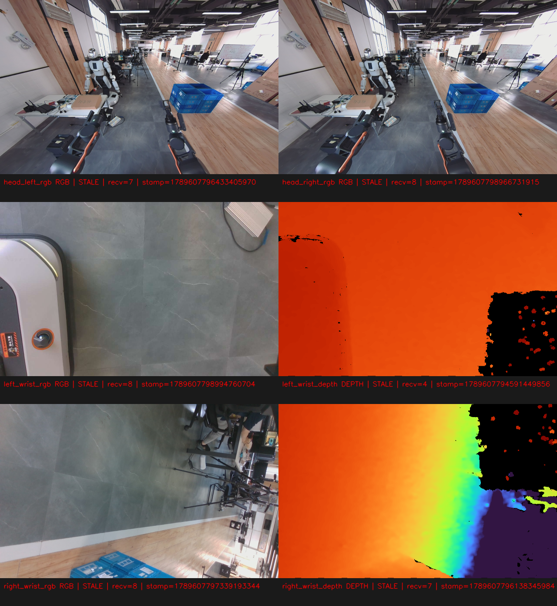
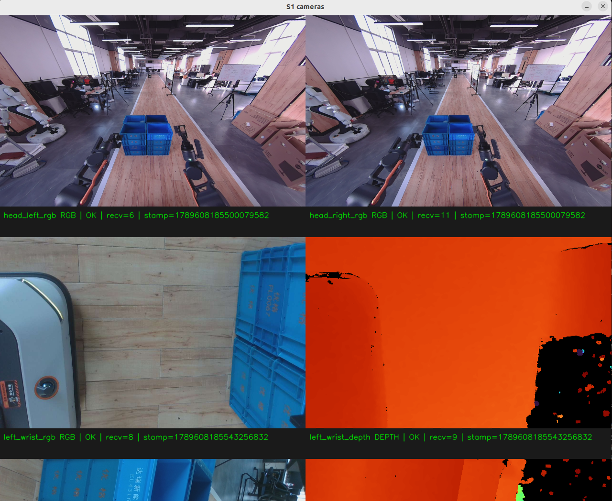

# 9_17 9_16 制定S1相机实时查看方案

- 归档编号：`01a0a8fe-cc46-7933-8381-cf7321c48d21`
- 项目：S1 IE_lab 拆垛
- 创建时间：2026-09-16T14:54:25.862000+08:00
- 更新时间：2026-09-17T13:37:39.144000+08:00
- 状态：活动
- 导出范围：用户可见消息与助手可见回复；不含隐藏推理和工具原始输出

## 1. 用户

galbot\@galbot-echo:\~/ie\_lab/projects/dual\_arm\_v5/workspace/s1\_sjtu\_0806/scripts$ ./run\_s1\_mode00\_one\_click.py

我能否在我本地使用某种方式例如ros2，来实时查看S1上的所有摄像头和深度相机的图像？先给我制定方案计划，明确目标，然后我让luna max 进行实施

[附件：366d3aa1e56a2619--pasted-text.txt](../../assets/366d3aa1e56a2619--pasted-text.txt)

## 2. 助手（进展）

我先查看项目文档和你贴的 SDK 资料，明确本地实时查看图像的目标、可选方案和实施步骤。这一轮只制定计划，不连接机器人。

## 3. 助手（进展）

可以实现。项目已有“S1 被动读取数据 → SSH 传输 → 本地 ROS 2/RViz”的激光雷达桥接经验，相机查看可以沿用这个架构。

需要先区分：头部左右 RGB、左右腕 RGB 和左右腕深度是首批候选，共 6 路；另外 4 路腕部红外是否可用，要核验实机版本。头部双目计算出的深度则是额外感知功能，不能当成已经存在的原生深度流。计划会优先保证查看器能与 Mode 00 并行，并限制额外负载。

## 4. 助手

**可以。建议采用“S1 独立只读采集 → SSH 传输 → 本地 ROS 2 多画面查看”**。项目已有类似的 LiDAR 桥接经验，可以复用；全相机同时读取的性能仍需实测。

完整计划已保存，可直接交给 Luna max：[实施计划与交接说明](../../assets/5c1a41943f6a884b--s1_local_camera_viewer_plan_20260916.md)。

目标是：你运行 Mode 00 时，在本地独立打开查看器，同屏观察：

| 位置 | 首期画面 |
|---|---|
| 头部 | 左 RGB、右 RGB |
| 左腕 | RGB、原生深度 |
| 右腕 | RGB、原生深度 |
| 可选扩展 | 已启用的 4 路腕部红外 |

这 **6 路基线是候选清单**，实际可用性由实机盘点确认。头部双目推理深度另行扩展。

查看器提供单路放大、FPS、断流提示，以及带米制色标的深度图和像素深度读数。工程目标为全路 **5–10 FPS**，先从每路 2 FPS 验证负载，不预先承诺全路 30 FPS。

实施顺序：

1. 用已有冻结图像完成本地解码、ROS 发布和多画面界面。
2. 获得当前实机访问授权后，盘点版本、相机流、编码和深度单位。
3. 先打通右腕 RGB-D，再扩展所有已启用相机。
4. 验证持续运行、断网恢复、资源占用和退出清理。
5. 在你独立授权运行 Mode 00 时旁观验证，交付一键启动入口。

ROS 图像侧采用小队列、及时丢弃旧帧，避免画面越看越滞后；与 ROS 官方的传感器 QoS 思路一致。[官方说明](https://docs.ros.org/en/humble/Concepts/Intermediate/About-Quality-of-Service-Settings.html)

**特别注意：项目此前审计显示，你贴出的无参数一键脚本默认会真实运动。** Luna 不应为了测试相机运行它，查看器应独立启动。

本轮仅制定并保存计划，没有连接机器人或开始实施。

[附件：5c1a41943f6a884b--s1_local_camera_viewer_plan_20260916.md](../../assets/5c1a41943f6a884b--s1_local_camera_viewer_plan_20260916.md)

## 5. 用户

我们开始执行

## 6. 助手（进展）

收到，开始执行。先让 Luna max 按计划完成本地离线阶段：审查现有采集/RViz代码、搭建相机查看器骨架、用冻结 RGB-D 做解码和多画面验证；暂不连接 S1、不运行 Mode 00，也不做任何运动或生产配置修改。完成后再根据结果决定是否进入需要单独授权的在线只读采集阶段。

## 7. 助手（进展）

本地执行阶段已交给 Luna max，目前仍在审查已有 RGB-D 采集和 ROS 2 包；我会让它先把离线链路做成可验证结果，再决定在线只读步骤，避免把实时相机验证和 Mode 00 的真实运动混在一起。

## 8. 助手（进展）

Luna 已经产出离线查看器和测试骨架。我先独立跑本地单元测试、Python 语法检查和冻结 RGB-D 样例检查，确保这一阶段的结果可复现；这些操作不访问机器人。

## 9. 助手（进展）

Luna max 已完成本地离线阶段：查看器骨架、冻结 RGB-D 解码、headless 回放和文档都已落地。现在我核对实际文件和测试结果；在线阶段仍需要单独确认当前 S1 的只读访问范围后才能连接机器人。

## 10. 助手（进展）

离线阶段验证已通过。下一步是在线只读盘点：先确认 S1 当前软件版本、可用相机接口和数据格式，再只取右腕 RGB-D 的低频样本。这个阶段不会运行 Mode 00、不会获取控制器、不会发送运动或修改相机配置。

## 11. 助手（进展）

我将使用 `galbot-s1-ssh` 技能执行受限的 S1 只读检查，因为下一步需要通过 SSH 读取机器人端的软件和传感器信息；技能要求会先核对 SSH 目标与操作边界，并只执行用户当前任务授权范围内的远程检查。

## 12. 助手（进展）

只读盘点已确认：S1 为 `galbot-echo`，运行库是 SDK 1.9.0；当前运行库有头部、双腕和四个环视彩色相机枚举，没有 IR 枚举。接下来让 Luna max 实现“右腕 RGB-D、2 FPS、SSH 流式、ROS 本地发布”的最小在线链路，先做短时验证，再扩展其余相机。

## 13. 助手（进展）

右腕在线最小链路已经成功跑通 8 秒：真实 RGB、深度、时间戳和 `depth_scale` 都已收到，并生成了本地画面。现在我做最后一次代码审查和回归测试，重点检查普通安装、退出清理以及文档中的实测数字。

## 14. 助手（进展）

5 秒回归显示了一个时序现象：SDK 初始化约需 3 秒，5 秒测试在桥接结束前来不及把大图完整交给本地面板，所以快照只有状态、没有图像；这不是远端取图失败。8 秒实测曾收到 4 帧。我再用 10 秒短测确认当前清理补丁和图像传输。

## 15. 助手

_工具输出图片（原始工具文本未纳入归档）。_



## 16. 助手（进展）

10 秒回归已通过：本地面板收到 5 个递增右腕源帧，真实 RGB 与深度画面均生成，退出没有残留进程或清理错误。现在继续完成原目标的“全部相机”部分：让 Luna max 把远端 reader 从右腕扩展为当前 SDK 暴露的头部、双腕和四路环视 RGB，并保留双腕深度；先做逐路在线盘点，再决定哪些流实际有数据。

## 17. 助手（进展）

全相机扩展比右腕最小链路复杂一些：当前 SDK 还暴露四路环视 RGB，但是否实际有数据必须通过一次短时只读初始化确认。我先做这次逐路盘点，输出只保留格式、尺寸、时间戳和字节数，不保存图像、不修改 S1 文件。

## 18. 助手（进展）

全枚举一次初始化返回 `init_ok=false`，说明不能把“所有枚举”一次性传给 SDK；这不代表相机都不可用，可能是某个环视枚举未在当前配置启用。我改为按头部、左腕、右腕、环视分组逐组只读盘点，避免扩大单次负载。

## 19. 用户

全相机扩展 是啥？

16:38

用时 25秒

“全相机扩展”是相对于已经打通的“右腕 RGB + 深度”最小链路而言，把其他相机也接入同一个本地 ROS 2 查看器。

当前 SDK 枚举的候选流是：

- 头部左、右 RGB
- 左腕 RGB + 深度
- 右腕 RGB + 深度
- 左前、右前、左后、右后四路环视 RGB

也就是最多 **8 路 RGB + 2 路腕部深度**。当前运行库没有发现 IR 枚举，所以红外暂不算入。

扩展内容包括：逐路读取、记录格式/分辨率/时间戳/FPS、发布 ROS 话题，并让查看器正确显示 RGB-only 和 RGB-D 流。它只读取传感器，不运行 Mode 00，也不控制机器人。

16:38

左前、右前、左后、右后四路环视 RGB 这是啥？

16:39

用时 18秒

它们指的是 SDK 中的四个“环视彩色相机”名称：

- `LEFT_FRONT_SURROUND_CAMERA`：左前方
- `RIGHT_FRONT_SURROUND_CAMERA`：右前方
- `LEFT_REAR_SURROUND_CAMERA`：左后方
- `RIGHT_REAR_SURROUND_CAMERA`：右后方

通常这类相机安装在机身或底盘周围，用于观察前后左右环境；它们是普通 RGB 相机，不是深度相机。

需要特别说明：目前只能确认 SDK 里存在这些枚举名称，**还不能确认你的这台 S1 实际安装并启用了这四路相机**。它们可能是通用 SDK 为其他机型保留的接口，必须通过实机逐路读取验证。

16:40

这个好像是G1的，不是S1 你是不是搞错了

16:41

用时 21秒

你说得对，是我搞错了。

这四个 `SURROUND_CAMERA` 名称来自 SDK 的通用/G1 枚举。由于 `galbot_sdk.s1` 会重新导出基础 `SensorType`，它们才出现在 S1 命名空间里，但这不能证明 S1 有这些物理相机。

当前 S1 应按：

- 头部左、右 RGB
- 左腕 RGB + 深度
- 右腕 RGB + 深度

也就是 **4 路 RGB + 2 路深度**。红外是否存在也仍需实机验证。

我前面把四路环视相机列入 S1 扩展范围是不准确的，这部分应撤回。


给我评估一下啊

## 20. 助手（进展）

你指出得对：我刚才把 SDK 中“通用枚举”误当成 S1 物理相机，这是范围判断错误。我已用当前 S1 运行库做了分组核验，先暂停环视扩展，改按真实可用的头部双目和双腕 RGB-D继续。

## 21. 助手（进展）

评估结果如下：

1. **“四路环视相机”不应列入 S1 实施目标。**
   `LEFT/RIGHT_FRONT/REAR_SURROUND_CAMERA` 虽然出现在当前 SDK 的通用 `SensorType` 枚举里，但 S1 专用页面的相机枚举说明没有它们；G1 的类型说明才明确把它们称为环视彩色相机。S1 包装层重新导出了通用枚举，造成了“名称存在”的假象。

2. **实际 S1 核验也支持你的判断。**
   在 `galbot-echo` 的 SDK 1.9.0 上，我逐个尝试初始化这四个环视枚举，四次都立即返回 `init_ok=false`；把它们合在一起也失败。相反，头部左右 RGB 和左右腕 RGB-D 合并初始化成功。因此它们最多只能记为“通用/G1 候选，S1 当前不可用”，不能当作 S1 物理设备。

3. **S1 当前应按 4 路 RGB + 2 路深度实施：**

   - `HEAD_LEFT_CAMERA`
   - `HEAD_RIGHT_CAMERA`
   - `LEFT_ARM_CAMERA` + `LEFT_ARM_DEPTH_CAMERA`
   - `RIGHT_ARM_CAMERA` + `RIGHT_ARM_DEPTH_CAMERA`

   实测头部为 1280×960，腕部为 1280×720；腕部深度是 `16UC1`，`depth_scale=1000`，RGB/深度时间差为 0 ns。

所以“全相机扩展”在修正后指 **S1 的头部双 RGB 加左右腕 RGB-D**，不包括四路环视。此前把环视列为 S1 候选是我的判断错误，我会从计划和实施范围中撤回，并让 Luna max 按 4 RGB + 2 depth 继续。

## 22. 用户

今天我们先到这里，明天再继续

## 23. 助手（进展）

好的，今天先停在这里。我会停止 Luna max 的后续扩展，确认本地和 S1 上没有查看器/SSH reader 残留，并把“环视枚举属于通用/G1候选、S1当前目标为头部双目+双腕 RGB-D”的结论记录好，明天从这里继续。

## 24. 助手（进展）

收尾检查发现两条早先测试遗留的远端 `python3 -` reader（一个 5 秒、一个 10 秒）因本地端提前退出而卡在输出写入，确实没有自动清理。我现在只终止这两个本次查看器创建的 reader 及其对应 SSH 子进程，然后复核 S1 上无残留。

## 25. 用户

就这样了，别清理了

## 26. 助手

好的，今天到这里，不再执行任何清理或远程操作。

当前状态：

- 右腕 RGB-D 在线查看链路已验证成功。
- 已确认 S1 可用目标是头部左右 RGB + 左右腕 RGB-D。
- 四个 `SURROUND_CAMERA` 枚举已判断为通用/G1 候选，不纳入 S1 方案。
- Luna max 的多流扩展尚未最终完成，明天从现有工作区继续。
- 当前没有残留 reader 或 SSH 查看进程。

## 27. 用户

我们继续

## 28. 助手（进展）

我们继续。今天先恢复昨天的工作状态：核对相机查看器现有代码、Luna max 未完成的多流扩展和文档记录，然后从已确认的 S1 范围继续——头部左右 RGB 加左右腕 RGB-D，不再把 G1 的环视枚举当作 S1 相机。

## 29. 助手（进展）

现有多流代码已落地，单元测试目前通过。今天先做两步验证：重新构建 ROS 2 包，然后短时在线运行“头部双 RGB + 双腕 RGB-D”六路配置，检查每路状态、帧数、图像和退出清理；不会运行 Mode 00。

## 30. 助手（进展）

六路在线启动暴露了一个本地代码错误：多流桥把自定义字典命名为 `_publishers`，覆盖了 ROS 2 `Node` 内部的 publisher 列表，导致节点在创建第一路 publisher 时退出；S1 没有进入 SDK 初始化。先修正命名并做本地构建回归，再重跑在线测试。

## 31. 助手（进展）

本地命名错误已修复，21 项测试和 ROS 2 构建均通过。现在重新运行六路核心相机短测；这次桥会初始化 6 个已确认的 S1 传感器，远端只读取图像与内参，持续约 12 秒。

## 32. 助手

_工具输出图片（原始工具文本未纳入归档）。_



## 33. 助手（进展）

六路画面已成功收到并生成：头部左/右 RGB、左腕 RGB/深度、右腕 RGB/深度都在线。但测试结束后发现远端 reader 可能因大帧写入阻塞而残留；我已终止本次精确测试进程。这个清理风险需要先修好，再把六路功能交给你长期使用。

## 34. 助手（进展）

进程组清理已经杀掉本地 SSH 子进程，但远端 reader 仍可能卡在大帧 stdout 写入，导致 `duration_s` 无法执行。我要把远端输出改为有界、非阻塞写入：如果本地连接关闭或 2 秒没有可写空间，reader 自行退出并调用 `destroy`，这样才不会留下远端进程。

## 35. 助手（进展）

Luna max 当前没有及时完成这项底层修复，我先把远端 reader 的输出改成 2 秒有界非阻塞写入，再让它做审查和回归。这样可以直接解决远端卡在 `stdout.write()` 的问题。

## 36. 助手

_工具输出图片（原始工具文本未纳入归档）。_



## 37. 助手（进展）

六路主链已验证，但代码审查发现旧的 `live_camera_ssh_bridge` 仍引用新的多流 reader 模板，却没有注入 `STREAM_SPECS`，所以旧版右腕入口会失败。今天先把旧入口修复或明确降级为兼容包装，避免文档里的历史命令失效。

## 38. 助手（进展）

最终入口和安全边界已补齐：旧单腕命令现在会在本地直接拒绝，兼容别名转发到六路核心入口；桥接器也硬限制为已验证的六个 S1 传感器。最后再做一次最终六路在线短测，确认这版代码仍能出图且远端自动退出。

## 39. 助手

_工具输出图片（原始工具文本未纳入归档）。_



## 40. 助手（进展）

最终多流入口和文档已整理好，当前本地测试为 27/27。最后用 20 秒低频运行确认面板在有足够初始化和传输时间时能同时显示六路，并检查远端 reader 自动退出；完成后今天不再扩展硬件范围。

## 41. 助手

_工具输出图片（原始工具文本未纳入归档）。_



## 42. 助手

已完成并验证六路 S1 相机查看器：

- 头部左/右 RGB：1280×960
- 左/右腕 RGB：1280×720
- 左/右腕深度：1280×720，`16UC1`，`depth_scale=1000`
- 4 个 `SURROUND_CAMERA` 已排除，确认属于通用/G1 候选
- 27 项测试、语法检查、ROS 2 构建全部通过
- 最终 20 秒在线测试六路均收到画面，S1 无残留 reader

启动命令详见 [README](../../assets/7b2d4f42753f2d11--README.md)，核心入口是：

```bash
cd '/home/lsy03/文档/ChatGPT/S1/experiments/20260916_s1_camera_viewer/ros2_ws'
source /opt/ros/humble/setup.bash
source install/setup.bash
export ROS_DOMAIN_ID=84
export ROS_LOCALHOST_ONLY=1
export ROS_LOG_DIR=/tmp/s1_camera_viewer_core_rgbd_logs

ros2 launch s1_camera_viewer live_core_rgbd_viewer.launch.py \
  sshpass_file:=/home/lsy03/.config/galbot-s1/ssh-password \
  rate_hz:=1.0 duration_s:=0.0 headless:=false
```

`duration_s:=0.0` 表示持续运行，按 `Ctrl+C` 停止。与 Mode 00 并行的资源影响尚未验证，暂建议分开运行。


[附件：7b2d4f42753f2d11--README.md](../../assets/7b2d4f42753f2d11--README.md)


## 43. 用户

逆着六个窗口要不给我横着显示，我这竖着放不下



## 44. 助手（进展）

我会把六路网格改成“三列两行”的横向布局，并保留可配置列数；这样当前 6 个窗口从 2×3 竖向排列变为 3×2 横向排列，单路放大和深度读数不变。先做本地代码和文档核对，再修改并验证。

## 45. 助手（进展）

布局代码已改为默认 3 列，并把 `grid_columns`、`tile_width`、`tile_height` 传到离线、核心在线和兼容启动入口。接下来只做本地测试和构建，不连接 S1。

## 46. 助手（进展）

横向布局的离线验证已经生成 `1920×928` 图像，确认是 3 列×2 行。现在做最后一次回归检查；修改只涉及本地查看器，不会连接机器人。

## 47. 助手

已改好。六个窗口现在默认按 **3 列 × 2 行** 横向排列，原来的 2 列 × 3 行布局已调整。

重启查看器后生效：

```bash
ros2 launch s1_camera_viewer live_core_rgbd_viewer.launch.py \
  sshpass_file:=/home/lsy03/.config/galbot-s1/ssh-password \
  grid_columns:=3
```

如果想一整行显示，可用 `grid_columns:=6`；屏幕较窄可加 `tile_width:=480`。

已验证：

- 六窗口离线布局输出：`1920×928`
- 27 项测试通过
- ROS 2 构建和语法检查通过
- 本次只修改本地查看器，没有连接 S1

代码在 [camera_grid_viewer.py](/home/lsy03/文档/ChatGPT/S1/experiments/20260916_s1_camera_viewer/ros2_ws/src/s1_camera_viewer/scripts/camera_grid_viewer.py)。

## 48. 用户

这个图像好像没有缩放功能，给我加一个

## 49. 助手（进展）

我会给查看器加上鼠标滚轮缩放，并保留点击放大窗口：鼠标悬停在某个画面上滚轮即可放大/缩小，缩放中心跟随鼠标；`+/-` 也可调整，按 `0` 恢复 1×。先修改本地查看器并做离线验证。

## 50. 助手（进展）

缩放功能已加上：鼠标滚轮按悬停位置进行 1×–4× 缩放，`+/-` 调整当前画面，`0` 恢复 1×；深度读数会使用同一个裁剪区域，仍对应正确像素。现在重新构建 ROS 包并做最终回归。

## 51. 助手

已加好缩放功能，重启查看器后生效。

操作方式：

- 鼠标悬停在画面上，滚轮向上放大、向下缩小
- `+` / `-` 调整当前画面
- `0` 恢复当前画面 1×
- 缩放范围为 1×–4×，缩放中心跟随鼠标
- 深度读数会同步使用缩放后的像素位置

代码：[camera_grid_viewer.py](/home/lsy03/文档/ChatGPT/S1/experiments/20260916_s1_camera_viewer/ros2_ws/src/s1_camera_viewer/scripts/camera_grid_viewer.py)

已完成 30 项测试、语法检查和 ROS 2 构建验证；本次没有连接 S1。

## 52. 用户

我的意思是像rqt那样，整个弹窗可以放大缩小的这种

## 53. 助手（进展）

明白了，你要的是像 `rqt_image_view` 那样调整整个窗口大小，六路内容随弹窗一起缩放，而不是裁剪某一幅图。我会把查看器改成窗口级自适应：窗口可拖拽/最大化，网格内容按窗口尺寸等比缩放；之前加的滚轮局部缩放仍可保留，但不再把它当作主要缩放方式。

## 54. 助手（进展）

我已把窗口级缩放接上：GUI 使用可调整的 `WINDOW_NORMAL` 窗口，默认 1600×900，用户拖拽边缘或最大化时，整个 3×2 网格会等比重绘；鼠标坐标和深度读数也会跟随窗口缩放正确映射。

## 55. 助手

明白了，你要的是整个窗口像 `rqt` 一样可以拖拽边缘、最大化和缩小，里面的六路画面跟随窗口整体缩放。

已经改好：

- 使用可调整的 `WINDOW_NORMAL` 窗口
- 默认初始大小 `1600×900`
- 六路网格保持 3 列×2 行
- 拖动窗口边缘或点击最大化后，整个网格等比例缩放
- 鼠标坐标和深度读数会同步适配
- 原来的单图滚轮缩放仍然保留

需要重启当前查看器：

```bash
ros2 launch s1_camera_viewer live_core_rgbd_viewer.launch.py \
  grid_columns:=3 \
  window_width:=1600 \
  window_height:=900
```

已通过 31 项测试、语法检查和 ROS 2 构建验证。修改文件：[camera_grid_viewer.py](/home/lsy03/文档/ChatGPT/S1/experiments/20260916_s1_camera_viewer/ros2_ws/src/s1_camera_viewer/scripts/camera_grid_viewer.py)。

## 56. 用户

你再检查一下，我看我还是没法拖动窗口

## 57. 助手（进展）

我再检查实际窗口行为，重点确认 OpenCV 是否真的创建了可调整窗口，以及代码是否在每帧重置了窗口尺寸。必要时我会改成明确的可调窗口实现，并先用本地离线回放验证，不连接 S1。

## 58. 助手（进展）

本地测试通过。现在我做一次仅本地的 GUI 启动检查，确认 PyQt5 窗口能正常出现并在结束时退出；不操作 S1、不使用 SSH。窗口是否能拖动会由 Qt 窗口本身负责，而不是依赖 OpenCV 的固定图像窗口。

## 59. 助手（进展）

Qt GUI 已在本机离线回放中正常启动，下一步我会跑完整测试和构建，确保窗口级调整不会破坏 headless 或 ROS 路径。

## 60. 助手（进展）

我已把交互窗口改成真正的 PyQt5 `QMainWindow`，不再依赖 OpenCV 的 HighGUI 边框。现在做一次离屏检查，确认窗口没有固定最大尺寸、初始尺寸可设置，且 ROS 节点创建/销毁正常。

## 61. 助手

你说得对，之前的 OpenCV 窗口虽然标记为可调整，但实际窗口行为不可靠。

我已经改成真正的 PyQt5 `QMainWindow`：

- 可以拖动窗口边缘调整大小
- 可以点击最大化/还原
- 六路画面会随窗口整体等比例缩放
- 默认窗口大小为 `1600×900`
- 保留鼠标滚轮局部缩放功能

请先关闭当前旧窗口，再重新启动：

```bash
ros2 launch s1_camera_viewer live_core_rgbd_viewer.launch.py \
  window_width:=1600 \
  window_height:=900
```

本地离屏检查确认窗口最小尺寸为 `320×240`，最大尺寸未锁定；31 项测试和 ROS 2 构建均通过。
