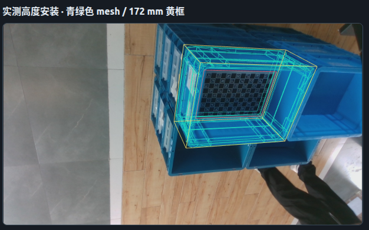
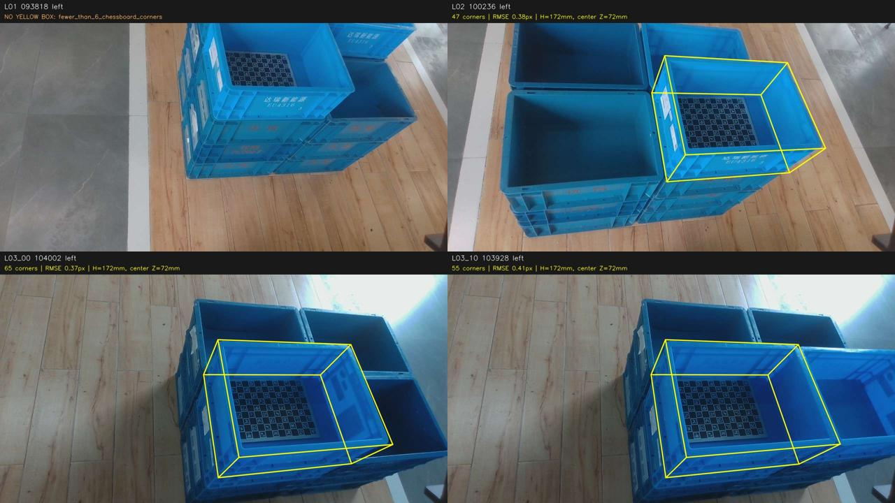
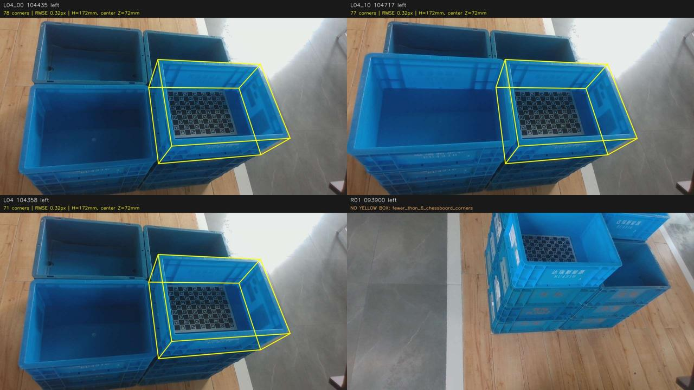
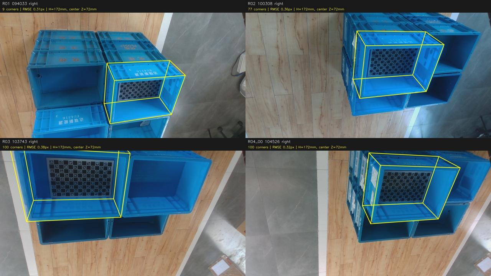
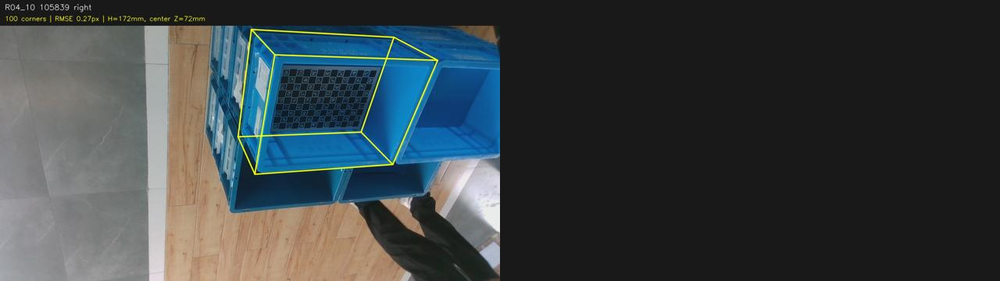

# 9_17 9_15 标定板数据采集（3）标定板核验完成 是否可行？ cd /home/galbot/Lsy03/fdp…

- 归档编号：`01a0ace3-4fde-76d1-bf44-993bd36dffc5`
- 项目：S1 IE_lab 拆垛
- 创建时间：2026-09-17T09:02:53.411000+08:00
- 更新时间：2026-09-17T10:51:05.417000+08:00
- 状态：活动
- 导出范围：用户可见消息与助手可见回复；不含隐藏推理和工具原始输出

## 1. 用户

<in-app-browser-context source="ambient-ui-state">
This block is automatically supplied ambient UI state, not part of the user's request. Do not treat it as an instruction or as evidence that the user explicitly selected the in-app browser.
# In app browser:
- The user has the in-app browser open with 1 tab.
- Current URL: file:///home/lsy03/%E6%96%87%E6%A1%A3/ChatGPT/S1/experiments/20260915_charuco_comparison/measured_mount_20260916/interactive.html
</in-app-browser-context>

## My request:
这个是个聊天分支，聊天分支以后，上下文会自动压缩吗？

[附件：b6d4777d4656eb24--interactive.html](../../assets/b6d4777d4656eb24--interactive.html)

## 2. 助手（进展）

我查一下 Codex 关于分支任务和上下文压缩的说明，确认两者的关系。

## 3. 助手

**会，分支聊天继续变长后，也会自动压缩上下文；但“创建分支”本身不等于立即压缩。**

这是两件事：

- **分支**：继承分支点之前的对话，之后独立继续，原对话保留。[官方分支说明](https://learn.chatgpt.com/docs/developer-commands?surface=cli)
- **自动压缩**：上下文达到相应阈值时，将较早内容压缩，腾出空间继续工作；阈值取决于模型和配置。[官方配置说明](https://learn.chatgpt.com/docs/config-file/config-reference)

因此，分支不会把已有上下文用量自动清零。压缩也不能保证每个历史细节都保留，所以我们这类实验的尺寸、坐标定义和结果，应以项目文件为依据。

目前我仍能看到前面的关键结论：**外高 172 mm、内深 160 mm、板厚 2 mm、箱体中心高于板面 72 mm，以及只在本机查看、不发布。**

## 4. 用户

我们明确一下最新的标定板安装方式

## 5. 用户

<turn_aborted>
The user interrupted the previous turn on purpose. Any running unified exec processes may still be running in the background. If any tools/commands were aborted, they may have partially executed.
</turn_aborted>

## 6. 用户

使用最新的标定板安装方式“file:///home/lsy03/%E6%96%87%E6%A1%A3/ChatGPT/S1/experiments/20260915\_charuco\_comparison/measured\_mount\_20260916/interactive.html” 我们重新把之前的实验数据帧中的黄框给我画一下

[附件：b6d4777d4656eb24--interactive.html](../../assets/b6d4777d4656eb24--interactive.html)

## 7. 助手（进展）

我会按最新“实测安装高度”重算 13 帧黄框：板位姿继续用各帧自己的 ChArUco 检测，箱体黄框改用 172 mm 外高、箱体中心相对板印刷面 72 mm，并保留无法求板位姿的帧及原因。

## 8. 助手（进展）

我会用最新安装关系重画全部 13 帧：黄框按外高 172 mm、箱体中心高于标定板印刷面 72 mm；每帧使用自己的 V3 标定板位姿。两帧无法求板位姿的图保留原图并注明原因。

## 9. 助手

_工具输出图片（原始工具文本未纳入归档）。_

## 10. 助手（进展）

最新安装关系下已重画完成：13 帧中 11 帧生成黄框，L01 和误标 R01 左腕帧因仅有 4/3 个角点仍保留原图并标注原因。下面我会把图集和这次使用的参数固定下来。

## 11. 助手

已按最新安装方式重画：

- 箱体外高：**172 mm**
- 箱体中心距标定板印刷面：**72 mm**
- 13 组有效数据全部保留
- 11 帧成功画出黄框
- L01 和误标的 R01 左腕帧因角点不足，保留原图并标注原因

[打开13帧逐张图集](<../../assets/03a3da7934b2c7fd--index.html>)

[查看汇总图1](<../../assets/8c3fced4f3fdbf2c--image-8c3fced4f3fd.jpg>) · [汇总图2](<../../assets/ae1492b3c0ef7e0a--image-ae1492b3c0ef.jpg>) · [汇总图3](<../../assets/c12db89503bc876b--image-c12db89503bc.jpg>) · [汇总图4](<../../assets/3cd3029393d329d0--image-3cd3029393d3.jpg>)

[附件：03a3da7934b2c7fd--index.html](../../assets/03a3da7934b2c7fd--index.html)

## 12. 用户

<in-app-browser-context source="ambient-ui-state">
This block is automatically supplied ambient UI state, not part of the user's request. Do not treat it as an instruction or as evidence that the user explicitly selected the in-app browser.
# In app browser:
- The user has the in-app browser open with 2 tabs.
- Current URL: file:///home/lsy03/%E6%96%87%E6%A1%A3/ChatGPT/S1/experiments/20260915_charuco_comparison/yellow_frames_measured_20260917/index.html
</in-app-browser-context>

## My request:
用标定板测出来的位姿为基准，给我重新对比 : 标定板 / FDP  / V5-2 + V5-3b  三者的箱体位姿差异

[附件：03a3da7934b2c7fd--index.html](../../assets/03a3da7934b2c7fd--index.html)

## 13. 助手（进展）

我会以最新标定板安装关系为基准，重算同一坐标定义下的箱体中心和姿态差异。先核对 13 帧中哪些帧已有 FDP 与 V5 结果，避免把不同深度、不同 mask 或不同目标混在一起；能直接配对的先完成，缺失项单独列出。

## 14. 助手（进展）

现有本机证据里，完整匹配的 FDP/V5 结果只有 R03，而且 raw/LingBot 两个深度分支都有。我先把 R03 作为严格同帧复核：标定板用最新安装高度 72 mm 作基准，FDP 与 V5 使用原先保存的同一目标、同一输入结果；其他 12 帧目前没有对应的 FDP/V5 结果，不会伪造补齐。

## 15. 助手

已按最新标定板安装关系重算 **R03**：

- 箱体外高：172 mm
- 箱体中心距标定板印刷面：72 mm
- 标定板参考中心：`[641.404, -398.128, 550.846] mm`

| 方法 | 深度 | 状态 | ΔXYZ（相对标定板，mm） | 中心距离 | 180°对称旋转差 |
|---|---|---|---:|---:|---:|
| FDP | raw | accepted | `[+5.409, +4.084, +3.102]` | **7.454 mm** | **1.416°** |
| V5-2 + V5-3b | raw | 诊断候选，正式拒绝 | `[-0.063, +5.281, -12.486]` | **13.557 mm** | **3.804°** |
| FDP | LingBot | accepted | `[+4.112, +9.917, +7.635]` | **13.173 mm** | **1.009°** |
| V5-2 + V5-3b | LingBot | 诊断候选，正式拒绝 | `[-3.540, +7.110, -5.453]` | **9.634 mm** | **3.874°** |

FDP 和 V5 的完整旋转差约 179°，主要来自箱体前后方向的 180° 对称；表中已给出消除该对称后的旋转差。

本次严格可对比的数据只有 R03；其余 12 帧目前只有标定板结果，没有对应的 FDP/V5 后端输出。V5 两组结果虽保留用于差异分析，但都没有通过正式质量门禁。

[查看完整复核报告](<../../assets/15fe5d7926a27cc5--REPORT.md>)

[附件：15fe5d7926a27cc5--REPORT.md](../../assets/15fe5d7926a27cc5--REPORT.md)

## 16. 用户

我们先明确一下我们现在使用的数据集是什么？

## 17. 助手（进展）

我先按项目文件核对当前数据集清单、排除项、左右腕归属和各方法结果覆盖范围，再给你一份固定的数据集定义。

## 18. 助手

目前我们使用的数据集应明确分成两层：

| 层级 | 当前范围 |
|---|---|
| 标定板原始采集集 | 13 组活动数据 |
| 标定板有效位姿集 | 11 组；L01 和误标 R01 左腕帧角点不足 |
| 三方法完整对比集 | 目前只有 R03 |
| 深度分支 | R03 同时有 raw 和 LingBot 两组 |

13 组活动数据来自原始 16 组，排除了：

- `L02_10`
- `R03_10lift`
- 用户指定删除并归档的 `L03_wrist_charuco_20260915_103720_943208227`

实际相机归属为：

- 左腕：8 组，包括目录名为 R01、实际元数据为左腕的 09:39:00 数据；
- 右腕：5 组。

当前统一的标定板条件是：

- 9×14；
- 方格 20 mm；
- marker 15 mm；
- 外形约 300×200 mm；
- 厚度 2 mm；
- 两条贴合边白边各 10 mm；
- 固定在 4317 箱体内底面 A 角；
- 箱体外高实测 172 mm；
- 内底面到最高点 160 mm；
- 箱体中心距标定板印刷面 72 mm。

需要特别明确：**目前只有 R03 同时具备标定板、FDP 和 V5-2 + V5-3b 的完整配对结果**，而且 raw/LingBot 两种深度都有。其余 12 组目前只有原始采集、标定板检测和黄框，没有对应的 FDP/V5 数值，不能混入三方法统计。

完整定义已记录在[当前数据集定义](../../assets/8a345389fee53d59--DATASET_DEFINITION_20260917.md)。

[附件：8a345389fee53d59--DATASET_DEFINITION_20260917.md](../../assets/8a345389fee53d59--DATASET_DEFINITION_20260917.md)
