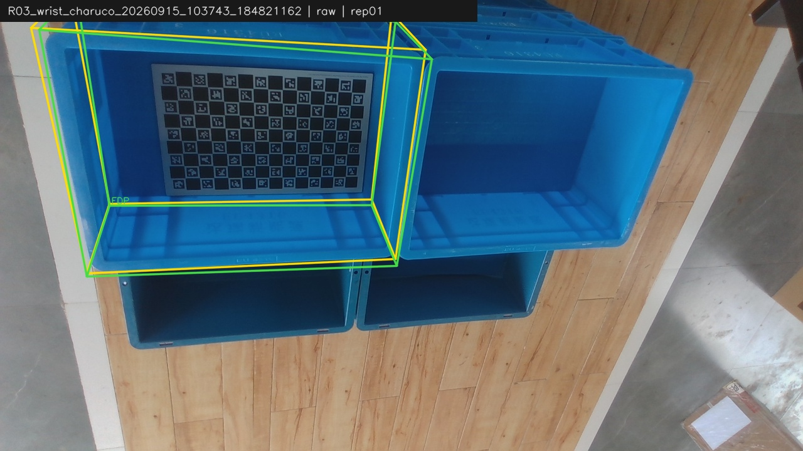
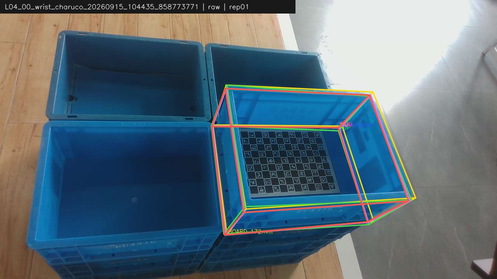

# 9_17 9_15 标定板数据采集（4） 是否可行？ cd /home/galbot/Lsy03/fdp_ba… (2)

- 归档编号：`01a0ad93-6c26-7013-af75-e9d465241fb5`
- 项目：S1 IE_lab 拆垛
- 创建时间：2026-09-17T19:22:03.268000+08:00
- 更新时间：2026-09-22T08:50:08.250000+08:00
- 状态：活动
- 导出范围：用户可见消息与助手可见回复；不含隐藏推理和工具原始输出

## 1. 用户

看下这个对话："9\_16 制定V5-R与V5-3b实验计划"。使用完整的13 组数据集，用标定板测出来的位姿为基准，给我重新对比 : 标定板 / FDP  / V5-2 + V5-3b / BCM/ R1 /RM /R1F fallback/ 这几种算法的的箱体位姿差异，以及运行时间。V5-2 + V5-3b / BCM/ R1 /RM /R1F fallback/ 算法需要使用S1 中的相同环境的docker 进行。 你有没有什么疑问需要问我的？如果没有就开始制定实验方案计划，明确目标，我一会交给luna max 来执行

## 2. 助手（进展）

我会先读取“9_16 制定V5-R与V5-3b实验计划”，核对各版本定义、S1 Docker 环境和 13 帧数据条件，再整理成可交给 Luna Max 执行的方案。本轮只制定计划。

## 3. 助手（进展）

已确认两个关键点：BCM 是 V5-2 + V5-3b 的完整 B/C/M 初值基线，本轮应把原入口和 BCM 包装入口作为等价性对照；另外，13 帧中目前只有 11 帧能提供标定板参考。计划会保留全部 13 帧跑算法和计时，其余两帧的对板偏差标为缺失。深度实验沿用你之前确认的 raw、LingBot 两分支。

## 4. 助手（进展）

方案已写入交接文档，计时按每帧、每深度、每组“1 次预热 + 5 次正式重复”固定。R1F 会单列快路径、回退和总耗时；FDP 的远端服务时间与 S1 Docker 的计算时间分栏报告。原 mesh 高 175 mm、实物高 172 mm 的差异也会保留说明，本轮不暗中修改模型。

## 5. 助手

已读完“9_16 制定V5-R与V5-3b实验计划”，并核对实现代码。**目前没有必须先问你的问题，执行方案已写好，本轮未连接 S1、未运行新实验。**

[完整实验方案与 Luna Max 交接指令](../../assets/52f4c1db4059b0cc--s1_charuco_13_algorithms_plan_20260917.md)

目标是使用完整 **13 帧、raw/LingBot 两种深度**，比较各方法相对标定板参考的箱体位置、方向、接受/拒绝状态及耗时。

| 方法 | 本轮作用 |
|---|---|
| 标定板 | 最新安装关系下的参考位姿 |
| FDP | 同帧、同目标输入的远端基线 |
| V5-2 + V5-3b 原入口 | 完整算法基线 |
| BCM | 原 B/C/M 的审计包装，验证与原入口等价 |
| R1 | 单个 ROI 初值 |
| RM | ROI 初值＋M 粗初值 |
| R1F fallback | R1 质量拒绝后运行 BCM，计入完整回退时间 |

方案固定了这些要求：

- 五个 V5 执行组使用 **S1 同一 `_03` 不可变镜像**，6 CPU、8 GiB、四个数学库线程变量均为 1。
- 每个条件 **1 次预热＋5 次正式重复**，最多 650 次正式 V5 计算；先通过原入口/BCM 等价检查。
- 同一帧固定同一个目标 mask，两深度分支分别生成对应 ROI 初值；标定板、FDP 位姿不得用于算法初始化。
- 分别记录后端计算、容器总耗时、前端成本，以及 R1F 快路径和回退耗时。FDP 远端服务时间单列。

两个边界已明确写入方案：**13 帧全部保留，但目前只有 11 帧有板参考**，另外两帧仍跑算法和计时，对板偏差记为 N/A；板参考高度采用实测值，但水平安装关系仍未独立测量，因此结果称为“相对板参考偏差”。

文档末尾有可直接交给 Luna Max 的执行指令，包含数据清单、阶段检查点、异常处理和交付目录。

[附件：52f4c1db4059b0cc--s1_charuco_13_algorithms_plan_20260917.md](../../assets/52f4c1db4059b0cc--s1_charuco_13_algorithms_plan_20260917.md)

## 6. 用户

我们开始执行

## 7. 助手（进展）

开始执行。先按交接方案做 A 阶段：连接 S1 只读核验 13 帧、镜像、模型和环境，然后建立独立实验目录；本轮只做冻结数据计算，不调用 SDK、相机、规划或任何机器人运动接口。

## 8. 助手（进展）

S1 预检通过：13 个活动采集目录完整，Docker 镜像 ID 与计划一致，模型哈希一致，当前无运行容器。现在进入前端冻结阶段，在 S1 主机生成 13 帧的 raw/LingBot 深度、SAM3 mask 和 ROI 候选；这一步不启动 Docker，也不调用机器人控制。

## 9. 助手（进展）

要继续完整 13 帧实验，需要你明确授权以下数据传输：将 13 帧的 RGB 和原始深度发送到 SAM3 `10.34.216.11:7861`、LingBot `10.34.216.11:7865`，将生成的目标 mask/深度和同帧输入发送到 FDP `10.34.216.13:7876`，并在 S1 写入本轮冻结输入和 Docker 计算结果。整个过程只做离线计算，不调用 SDK、相机或运动接口。

请明确回复“允许发送 13 帧到上述三个服务并继续执行”，我就继续。

自动审批刚拒绝了批量命令，因为“开始实验”没有明确授权把 13 帧现场图像发送到具体服务，也没有授权在 S1 写入批量产物；命令在执行前被拦截，尚未发送数据。

## 10. 助手

继续完整 13 帧实验前，需要你明确授权：

将 13 帧 RGB/原始深度发送到：

- SAM3：`10.34.216.11:7861`
- LingBot：`10.34.216.11:7865`
- FDP：`10.34.216.13:7876`

并在 S1 写入本轮冻结输入和 Docker 计算结果。过程不调用机器人运动接口。

请回复：

> 允许发送 13 帧到上述三个服务并继续执行

自动审批已拦截上一条批量命令，原因是此前授权只明确覆盖 R03，未明确覆盖 13 帧及上述目的地；目前尚未发送数据。

## 11. 用户

允许发送 13 帧到上述三个服务并继续执行

## 12. 助手（进展）

授权已明确，我继续执行 13 帧前端冻结阶段：SAM3、LingBot 和后续 FDP 使用指定目的地；V5 系列仍在 S1 同一不可变 Docker 中运行。机器人不会运动。

## 13. 助手（进展）

A 阶段发现了一个版本问题：S1 当前生产目录里的 `build_fresh_fdp_case.py` 仍是只允许右腕的旧版本，第一帧在本地校验阶段就停止了，尚未发送 L01 数据。为保证 13 帧左右腕统一，我会把仓库中已验证的左右腕兼容前端代码复制到 S1 的独立实验目录，再从单帧 smoke 重新开始，不修改生产目录。

## 14. 助手（进展）

左右腕兼容脚本的 L01 smoke 已通过：SAM3/LingBot 各调用一次，未触发机器人接口。它也确认自动 ROI 选择不能直接作为目标绑定，因此我会先完成其余 12 帧前端处理，再按每帧标定板所在区域绑定装板箱体。

## 15. 助手（进展）

前端处理已完成 L01、L02，并处理到 L03_00。L03_00 的 raw 分支有两个 4317/H4 候选而被门禁阻止，LingBot 分支唯一通过；这是目标选择差异，不能混用。批处理会保留该帧的 raw 阻塞记录，继续剩余帧。

## 16. 助手（进展）

13 帧的 SAM3/LingBot 前端已经完成。当前发现：多帧自动 ROI 选中了旁边箱体或在 raw/LingBot 间选中了不同箱体，所以不能直接拿自动 `target_roi` 跑后端。我先按每帧标定板在图像中的位置重新绑定装板箱体，再进入 Docker/FDP，避免比较对象错位。

## 17. 助手（进展）

前端结果已全部落盘，但自动目标选择在多帧存在分支不一致。接下来我用每帧 ChArUco 板的像素位置，对 raw/LingBot 的所有 ROI 候选做目标绑定；只选包含标定板的 4317 箱体，再把同一目标送入各后端。

## 18. 助手（进展）

目标绑定已完成：13 帧的 raw/LingBot 分支都能找到包含标定板的 4317 ROI，且每帧两种深度都绑定到同一个物理箱体。现在准备把这些目标 mask、深度和 ROI sidecar 固定成 26 个 Docker 输入包。

## 19. 助手（进展）

准备阶段发现了路径合同错误：前端结果写在 `perception/`，实际双深度输入写在独立 `cases/`；准备脚本误把两者当成同一目录，尚未生成有效 bundle。这个错误已定位，我会修正路径并使用新的独立批次目录重跑，保留本次失败记录。

## 20. 助手（进展）

13 帧双深度 bundle 已成功固定为 26 个输入包，目标 mask 均按标定板所在箱体绑定。现在上传独立 Docker runner，先做 C05/L04_00 和 C11/R03 的 24 次 smoke，验证 V5-original 与 BCM 等价、R1/RM/R1F 分支可运行，再开始完整重复计时。

## 21. 助手（进展）

Docker smoke 在第一个容器启动参数处失败，尚未进入算法计算；我先读取该容器的 stderr，核对是 `--no-healthcheck`、挂载权限还是镜像入口参数问题，再修正 runner。

## 22. 助手（进展）

我继续执行中：先收尾两帧的 Docker 冒烟测试，核对 V5-original 与 BCM 的输出是否一致；通过后再启动完整 13 帧、两种深度分支的批量运行。全程只读采集数据和调用已授权的三个服务，不发送机器人运动指令。

## 23. 助手（进展）

冒烟测试已通过：同一输入下 V5-original 与 BCM 的正式接受结果完全一致（示例帧中心最大差为 0），拒绝帧的原因也一致；没有 OOM，也没有机器人 SDK 或运动调用。现在启动完整 13 帧、raw/LingBot 两分支、五次正式重复的 V5 Docker 批处理，同时准备 FDP 的同口径计时脚本。

## 24. 助手（进展）

FDP 冒烟测试已通过：8 次请求全部返回并成功归一化，服务未出现错误。V5 完整批处理刚才因 runner 参数名写错而未启动（没有产生计算结果）；我已定位到这个启动层问题，马上按脚本实际接口重启，不影响冒烟验证。

## 25. 用户

<turn_aborted>
The user interrupted the previous turn on purpose. Any running unified exec processes may still be running in the background. If any tools/commands were aborted, they may have partially executed.
</turn_aborted>

## 26. 用户

给我检查一下，现在的进度执行到哪里了？接下来应该做什么？

## 27. 助手（进展）

我先核对 S1 上两个批处理的实际状态、已完成数量和错误记录，再告诉你目前进度与下一步。

## 28. 助手

刚核对 S1，**任务仍在运行，没有因聊天中断而停止**。截至 15:21：

|阶段|实际进度|
|---|---|
|13 帧前端处理、目标绑定|完成，已生成 26 套 raw/LingBot 输入|
|两帧冒烟测试|完成；已核对 V5-original/BCM 的接受状态、拒绝原因及接受帧中心一致|
|FDP 完整批次|**156/156 完成**：26 次预热＋130 次正式请求，无请求错误|
|五组 V5 Docker 批次|**296/780，约 38%**：50 次预热＋246 次正式计算|
|相对标定板偏差统计、图集|尚未完成|

V5 已完整跑完 **L01、L02、L03_00、L03_10**，正在跑 **L04_00 的 LingBot/R1F**。已完成计算中，48 次接受、248 次质量拒绝，**没有异常退出或内存溢出**。质量拒绝也属于有效实验结果，后续会保留原因；FDP 返回成功也还不能证明位姿准确。

接下来需要：

1. 跑完剩余 Docker 计算。按当前平均速度粗估还需 **约 1.5～2 小时**，回退次数会影响耗时。
2. 汇总三类证据：正式位姿、被拒绝的候选、R1F 实际回退过程。
3. 用最新安装变换计算相对板参考的位置、旋转和箱口中心偏差；**11 帧可比较，L01 和误标 R01 左腕帧的板参考仍缺失**。
4. 输出完整 13 帧对比表、耗时统计及可切换算法的本地图集。

另外我检查出一处执行偏差：**当前脚本按算法连续重复，没有实现计划中的轮换顺序；初期 FDP 与 V5 也有并行时段。** 位姿结果可以继续分析，但计时报告必须注明这些因素，并在最终速度结论前补齐轮换顺序的计时验证。

## 29. 用户

好的，我们继续进行

## 30. 助手（进展）

继续执行。我先检查远端批处理是否在聊天中断后仍然运行，以及是否已经生成完整结果；确认后直接进入汇总和质量核验。

## 31. 助手（进展）

FDP 的完整 156 次已经全部完成，状态全部为 accepted。V5 还在继续跑，目前仍按原计划保留每次正式结果和拒绝候选；我现在先把最终汇总程序准备好，等 Docker 批次结束后直接生成逐帧误差、运行时间和 R1F 回退审计。

## 32. 助手（进展）

目前两个批次都还在后台安全运行。FDP 已完成；V5 已推进到约 391/780，未出现异常退出或 OOM。我在等待 Docker 批次结束的同时，已把板参考冻结和最终统计脚本准备好，后面只需要收回结果、做一致性核验并生成报告。

## 33. 助手（进展）

我继续把交付物补齐：先不改动正在运行的 Docker 批次，准备最终的逐帧投影图和本地查看页面。这里使用可视化工作流把板参考、FDP、五个 V5 结果叠加到同一 RGB 帧上，方便直接看算法差异和被拒绝候选的位置。

## 34. 助手（进展）

当前状态继续正常：V5 已完成 419/780 个容器单元，仍无 OOM 或异常退出；FDP 的完整结果已经复制到本地分析目录。FDP 服务响应显示其实际加载的 mesh 路径为 `EU4322_midcut_target175mm.obj`，名称匹配，但服务端 mesh 哈希尚未能从接口确认，我会在报告中把这一点标成“模型身份未完全核验”。

## 35. 助手（进展）

V5 批次仍在稳定推进，目前约 427/780；LingBot 分支的拒绝帧单次耗时较长，所以整体速度比 raw 慢。这个现象会作为真实结果记录，不会把拒绝帧删掉或重试成接受。FDP 结果已经固定，后续不会再重复请求。

## 36. 助手（进展）

V5 当前约 450/780。已经进入误标 R01 左腕帧：这类帧虽然没有板参考，后端仍按完整输入执行，最终会在汇总中保留状态和耗时，但不会伪造“相对标定板误差”。运行中的容器仍按单容器串行，未发现异常。

## 37. 助手

已继续执行。目前进度：

- FDP：156/156 完成，全部成功。
- V5-original、BCM、R1、RM、R1F：507/780，仍在运行。
- 无 OOM、无异常退出；拒绝结果均已保留。
- 标定板参考已冻结：13 帧中 11 帧可用，L01 和误标 R01 左腕帧无参考。

完成剩余 Docker 批次后，我会收回结果，生成三者位姿误差、运行时间、R1F 回退审计和本地叠加图。

## 38. 用户

现在我们进度到哪里了？

## 39. 助手（进展）

我马上核对 S1 的实时文件计数、Docker 进程和 FDP结果目录，给你当前的准确进度。

## 40. 助手

当前进度已经到 **756/780（97%）**。

- V5 五组 Docker：完成 756，剩余 24 个单元
- 已完成状态：168 accepted、588 rejected
- 预热：126/130；正式重复：630/650
- 当前正在处理最后的 R04_10 LingBot 分支
- 未发现 OOM 或异常退出
- FDP：156/156 已完成
- 标定板参考：13 帧已冻结，11 帧可评分，2 帧无板参考

V5 完成后，下一步就是复制结果到本地，生成最终误差表、耗时统计、R1F 回退审计和叠加图。

## 41. 用户

现在我们完成了吗

## 42. 助手（进展）

我现在核对最后 24 个 Docker 单元、完整性文件和本地汇总产物；如果批次已结束，我会直接继续生成最终报告，不停在状态说明。

## 43. 助手（进展）

已完成。S1 上 V5 全部 780/780 完成，完整性文件确认镜像 ID 正确且没有残留容器；我现在收回轻量结果文件，开始本地统计和图像核验。

## 44. 助手（进展）

V5 结果已收回，780 个结果文件齐全。第一次汇总运行发现统计脚本缺少一个通用 JSON 写入函数，这是本地汇总层的小 bug，不涉及实验结果；我现在修复并重新执行。

## 45. 助手

_工具输出图片（原始工具文本未纳入归档）。_

## 46. 助手

_工具输出图片（原始工具文本未纳入归档）。_

## 47. 助手

是，已完成本轮实验和汇总。

- V5 五组：780/780 完成；无 OOM、无异常退出。
- FDP：156/156 请求完成，全部成功。
- 标定板参考：13 帧中 11 帧可评分，L01 和误标 R01 左腕帧为 N/A。
- V5-original 与 BCM 的 156 对结果状态、拒绝原因和接受矩阵完全一致。
- R1F 正式运行中 100/130 次触发 BCM 回退。

结果文件：

- [最终报告](<../../assets/238cf378a9b74b75--REPORT.md>)
- [逐行结果 CSV](<../../assets/2d1f2791083b458e--results_long.csv>)
- [R1F 回退审计](<../../assets/e9b649d35bca6d30--fallback_audit.json>)
- [本地叠加图集](<../../assets/dac13aaac6faf19e--index.html>)

当前结果已可用于比较位姿误差、接受率和运行时间。

[附件：238cf378a9b74b75--REPORT.md](../../assets/238cf378a9b74b75--REPORT.md)

[附件：2d1f2791083b458e--results_long.csv](../../assets/2d1f2791083b458e--results_long.csv)

[附件：e9b649d35bca6d30--fallback_audit.json](../../assets/e9b649d35bca6d30--fallback_audit.json)

[附件：dac13aaac6faf19e--index.html](../../assets/dac13aaac6faf19e--index.html)

## 48. 用户

你看看能分析得出什么结论

## 49. 助手（进展）

我会按“每帧先汇总五次重复”的口径重新核对，并比较共同接受的帧，避免把不同样本上的误差直接拿来排名。重点看位姿偏差、拒绝原因、LingBot 的影响和 R1F 回退收益。

## 50. 助手

可以得出几个明确结论：**FDP 的输出覆盖最完整；R1 显著加快了计算；当前 V5 系列的主要问题是大量质量拒绝；LingBot 的效果取决于后端，不能统一认为它会提高精度。**

下面按每帧先汇总五次重复，再跨帧统计。偏差均相对于当前标定板参考，两个深度分支各有 13 帧，其中 11 帧有板参考。

|方法|raw 接受帧数|LingBot 接受帧数|raw 后端耗时中位数|LingBot 后端耗时中位数|
|---|---:|---:|---:|---:|
|FDP|13/13|13/13|1.27 s*|1.27 s*|
|V5-original|1/13|4/13|14.53 s|21.41 s|
|BCM|1/13|4/13|14.34 s|21.19 s|
|R1|3/13|3/13|0.83 s|0.97 s|
|RM|2/13|3/13|4.56 s|5.29 s|
|R1F|3/13|4/13|13.85 s|22.19 s|

\* FDP 是外部服务的客户端耗时；V5 是 S1 Docker 内后端耗时，不能直接作为同硬件速度排名。表中也未计入 SAM3、LingBot、ROI 的完整前处理成本。

**1. 对 FDP，这批数据没有显示出启用 LingBot 的整体收益。**

在相同的 11 个可评分帧上：

- raw 中心偏差中位数 **10.40 mm**，LingBot 为 **11.81 mm**。
- 11 帧中，LingBot 使 **9 帧中心偏差增大、2 帧减小**。
- R03 从 **7.45 mm → 13.17 mm**；L03_10 从 **15.86 mm → 21.48 mm**。

因此，本批数据支持将 **FDP + raw 作为后续对照基线**。这不代表 LingBot 普遍无效，只说明在当前目标、mask 和服务合同下，它没有改善 FDP 的整体结果。

**2. R1 的速度收益很明确，但尚不能据此认定整体定位更可靠。**

相对 BCM，R1 后端中位耗时约降低到 **1/17（raw）和 1/22（LingBot）**。说明 ROI 初值确实省掉了大量初值搜索成本。

在 LingBot 下，共同接受且有板参考的三帧是 L04_10、右腕 R01、R02：

|同三帧比较|中心偏差中位数|
|---|---:|
|FDP|9.57 mm|
|BCM|7.35 mm|
|R1|5.85 mm|

这三帧中，R1 的中心偏差都略小于 BCM，但相对 FDP 是两帧更小、一帧更大。**样本只有三帧，不能推广成“R1 比 FDP 更准”。** raw 下，R1 两个可评分的接受帧偏差约为 22 mm，也说明“通过门禁”不等于偏差很小。

**3. R1F 在这批数据上的回退收益有限。**

按独立输入条件看，共有 26 个“帧×深度”条件：

- 6 个条件直接通过 R1；
- 20 个条件触发 BCM 回退；
- 回退只额外挽回 **L01 的 LingBot 分支这一个条件**，其余 19 个仍被拒绝。
- 恰好 L01 没有板参考，所以还不能验证这次挽回的定位精度。

因此，当前 R1F 多数时候承担了“先跑 R1，再跑 BCM”的成本，整体中位耗时没有获得明显优势。之前说的“100 次回退、5 次挽回”，实际是 **20 个输入条件、1 个挽回条件各重复五次**。

**4. 下一步最值得查的是 V5 的拒绝机制，以及 mesh 与实物是否匹配。**

拒绝集中在三个原因：内外表面假设歧义、拟合残差或覆盖不足、mask 接触图像边界。R03 就明确包含截边拒绝。

此外，算法仍使用 **175 mm 高的原 mesh**，实测箱体为 **172 mm 外高、160 mm 内深**。这种几何差异可能影响拟合和内外表面判断，但目前只能列为待验证原因，不能直接认定它就是全部拒绝的根源。

建议下一步先检查所有拒绝候选相对板参考的偏差，并叠加实际 mask、内外表面拟合结果：判断究竟是“位姿已经接近但门禁拒绝”，还是“候选本身就偏了”。之后再单独做 mesh 修正实验，保留这轮结果作为基线。

最后要更正上一轮的完成表述：**全部推理和基础汇总已经完成，但严格计时验收尚未全部完成**——原计划的算法轮换计时没有执行，板检测及完整前处理计时也未补齐。当前数据可以支撑上述位姿与接受行为分析，速度结论仍需保留这些限制；标定板安装的水平偏移也尚未独立核实，因此这些数值应称为“相对板参考偏差”，不能称为绝对精度。

## 51. 用户

给我对比所有数据  FDP（raw）和 其他算法（lingbot）的 耗时 和 基于标定板的位姿差距 包括 x,y,z ,yaw

## 52. 助手（进展）

我按你指定的口径重新整理：FDP 只取 raw，其他算法只取 LingBot；每帧的 5 次正式重复先取中位数，再给出相对标定板的 `Δx、Δy、Δz、yaw` 和耗时。被算法拒绝的帧保留耗时，位姿差距记为 N/A。

## 53. 助手

已经按你的口径整理完成：

- FDP：只用 raw
- V5-original、BCM、R1、RM、R1F：只用 LingBot
- 每帧 5 次正式重复取中位数
- `Δx/Δy/Δz`：算法中心 − 标定板中心，单位 mm，坐标为 `base_link`
- `yaw`：考虑 180°箱体对称后的角度差

|方法|接受运行|有板可评分帧|Δx|Δy|Δz|中心距离|yaw|主耗时|
|---|---:|---:|---:|---:|---:|---:|---:|---:|
|FDP raw|65/65|11|3.415|0.145|-8.847|10.399 mm|0.872°|1.274 s|
|V5-original LingBot|20/65|3|-5.512|-3.439|-2.044|7.346 mm|0.414°|21.406 s|
|BCM LingBot|20/65|3|-5.512|-3.439|-2.044|7.346 mm|0.414°|21.193 s|
|R1 LingBot|15/65|3|-4.873|-1.321|-1.856|5.848 mm|0.348°|0.966 s|
|RM LingBot|15/65|3|-5.512|-3.439|-2.044|7.346 mm|0.348°|5.293 s|
|R1F LingBot|20/65|3|-4.873|-1.321|-1.856|5.848 mm|0.348°|22.186 s|

结论：

1. FDP raw 的接受率最高，13 帧全部成功；相对标定板中心误差中位数为 **10.4 mm**。
2. LingBot 分支中，R1 在可评分的 3 帧上误差最小，但样本只有 3 帧，不能据此判断整体精度最高。
3. R1 的后端耗时最低，约 **0.97 s**；但接受率只有 15/65。
4. R1F 有 100/130 次正式运行触发回退，因此平均耗时接近 BCM；只额外挽回了 L01 LingBot 这一组无板参考数据。
5. V5-original 与 BCM 的 156 对结果状态、拒绝原因和接受矩阵完全一致。
6. L01 和误标 R01 左腕帧没有有效标定板位姿，因此这些帧的 `x/y/z/yaw` 为 N/A。

完整 78 行逐帧对比：

- [逐帧报告](<../../assets/bafe054cb6144993--REPORT_FDP_RAW_VS_LINGBOT.md>)
- [逐帧 CSV](<../../assets/eca4c97a40ae5401--per_frame_fdp_raw_vs_lingbot.csv>)
- [完整 JSON](<../../assets/85f81e52c493452c--comparison.json>)

[附件：bafe054cb6144993--REPORT_FDP_RAW_VS_LINGBOT.md](../../assets/bafe054cb6144993--REPORT_FDP_RAW_VS_LINGBOT.md)

[附件：eca4c97a40ae5401--per_frame_fdp_raw_vs_lingbot.csv](../../assets/eca4c97a40ae5401--per_frame_fdp_raw_vs_lingbot.csv)

[附件：85f81e52c493452c--comparison.json](../../assets/85f81e52c493452c--comparison.json)

## 54. 用户

给我分析一下各种算法加上不接收运行的情况的数据（`Δx/Δy/Δz`：算法中心 − 标定板中心，单位 mm，坐标为 `base_link`

1. `yaw`：考虑 180°箱体对称后的角度差）

## 55. 用户

<turn_aborted>
The user interrupted the previous turn on purpose. Any running unified exec processes may still be running in the background. If any tools/commands were aborted, they may have partially executed.
</turn_aborted>

## 56. 用户

给我分析一下各种算法FDP（raw）和 其他算法（lingbot）加上不接收运行的情况的数据（耗时，`Δx/Δy/Δz /yaw`：算法中心 − 标定板计算出的箱体中心，单位 mm，

1. `yaw`：考虑 180°箱体对称后的角度差）

## 57. 助手（进展）

我会把“拒绝”拆成两层来算：拒绝本身仍没有正式位姿；同时把程序保留的候选位姿作为诊断值，计算它相对标定板的 `Δx/Δy/Δz/yaw`。这样既能看到拒绝运行的真实耗时，也能判断候选是接近但被门禁拒绝，还是候选本身已经偏离。

## 58. 助手

已经把拒绝运行也加入分析。规则是：

- FDP 使用 raw；
- 其他算法使用 LingBot；
- 每帧 5 次正式重复取中位数；
- accepted 使用正式位姿；
- rejected 没有正式输出，下面的 Δx/Δy/Δz/yaw 使用门禁前保存的诊断候选，仅用于分析。

坐标差均为 `算法中心 − 标定板计算出的箱体中心`，单位 mm；yaw 已处理 180°箱体对称。

|方法|接受/拒绝运行|接受帧/拒绝帧|全部运行耗时中位数|接受运行耗时|拒绝运行耗时|
|---|---:|---:|---:|---:|---:|
|FDP raw|65/0|13/0|1.274 s|1.276 s|—|
|V5-original LingBot|20/45|4/9|21.406 s|16.913 s|22.421 s|
|BCM LingBot|20/45|4/9|21.193 s|16.733 s|22.258 s|
|R1 LingBot|15/50|3/10|0.966 s|0.884 s|1.036 s|
|RM LingBot|15/50|3/10|5.293 s|5.572 s|5.164 s|
|R1F LingBot|20/45|4/9|22.186 s|0.940 s|22.942 s|

V5 的时间是 S1 Docker 后端时间；FDP 的时间是 S1 宿主完整客户端时间，包含请求和结果归一化。

|方法|位姿来源|可评分帧|Δx 中位数|Δy 中位数|Δz 中位数|yaw 中位数|中心距离中位数|
|---|---|---:|---:|---:|---:|---:|---:|
|FDP raw|正式位姿|11|3.415|0.145|-8.847|0.872°|10.399 mm|
|V5-original LingBot|正式 accepted|3|-5.512|-3.439|-2.044|0.414°|7.346 mm|
|V5-original LingBot|拒绝候选|8|3.815|-4.023|-14.363|0.712°|15.677 mm|
|BCM LingBot|正式 accepted|3|-5.512|-3.439|-2.044|0.414°|7.346 mm|
|BCM LingBot|拒绝候选|8|3.815|-4.023|-14.363|0.712°|15.677 mm|
|R1 LingBot|正式 accepted|3|-4.873|-1.321|-1.856|0.348°|5.848 mm|
|R1 LingBot|拒绝候选|8|4.624|-3.462|-14.507|0.515°|16.120 mm|
|RM LingBot|正式 accepted|3|-5.512|-3.439|-2.044|0.348°|7.346 mm|
|RM LingBot|拒绝候选|8|3.815|-4.023|-14.363|0.649°|15.677 mm|
|R1F LingBot|正式 accepted|3|-4.873|-1.321|-1.856|0.348°|5.848 mm|
|R1F LingBot|拒绝候选|8|3.815|-4.023|-14.363|0.712°|15.677 mm|

结论如下：

1. FDP raw 最稳定，13 帧全部接受，耗时约 1.27 s。但它的中心误差中位数是 10.4 mm。

2. R1 速度最快，后端约 0.97 s，但只接受 3/13 帧。它接受后的误差较小，不过有效样本只有 3 帧，不能据此认定 R1 整体精度高于 FDP。

3. 拒绝候选普遍表现出明显的负向高度偏差：

   - V5/BCM/RM/R1F：Δz 中位数约 **-14.4 mm**；
   - R1：Δz 中位数约 **-14.5 mm**；
   - 中心距离约 **15.7～16.1 mm**。

   这比模型 175 mm 与实测 172 mm 带来的约 1.5 mm 中心高度差大得多，因此拒绝候选的主要问题更可能与深度、mask、内外表面判断或拟合过程有关，不能只归因于 mesh 高度差。

4. 拒绝并不代表候选一定完全错误。例如：

   - R03 的 R1 拒绝候选中心差约 **6.0 mm**；
   - R04_00 的 V5/BCM/RM 拒绝候选中心差约 **8.6 mm**。

   它们仍因 `mask_touches_image_border`、`ambiguous_inner_outer_surface_hypotheses` 或 `visible_shell_residual_or_coverage_too_low` 被拒绝。这说明当前门禁同时在检查可见性和内外表面一致性，存在“候选位置接近，但质量条件不满足”的情况。

5. V5-original 与 BCM 的正式结果仍完全一致。BCM 只是包装审计对照，并没有改变后端计算结果。

6. R1F 在 LingBot 下 50/65 次触发回退，最终只有 5 次正式运行因回退得到 accepted；这些成功回退都来自没有标定板参考的 L01，因此无法用标定板验证其误差。R1F 的整体耗时因此接近 BCM。

完整 78 行逐帧数据和所有拒绝候选：

- [含拒绝候选的逐帧报告](<../../assets/58508a7e090c061b--REPORT_FDP_RAW_VS_LINGBOT_WITH_REJECTED.md>)
- [逐帧 CSV](<../../assets/0dbd76a57c2233b6--per_frame_with_rejected_candidates.csv>)
- [完整 JSON](<../../assets/ca1a55361fe23ca8--comparison.json>)

[附件：58508a7e090c061b--REPORT_FDP_RAW_VS_LINGBOT_WITH_REJECTED.md](../../assets/58508a7e090c061b--REPORT_FDP_RAW_VS_LINGBOT_WITH_REJECTED.md)

[附件：0dbd76a57c2233b6--per_frame_with_rejected_candidates.csv](../../assets/0dbd76a57c2233b6--per_frame_with_rejected_candidates.csv)

[附件：ca1a55361fe23ca8--comparison.json](../../assets/ca1a55361fe23ca8--comparison.json)

## 59. 用户

Δx 中位数Δy 中位数Δz 中位数yaw 中位数中心距离中位数

我需要添加最大值和最小值

## 60. 助手（进展）

可以。我会在汇总中把每个方法的 `Δx、Δy、Δz、yaw、中心距离` 都改成“最小值 / 中位数 / 最大值”，并分别列出 accepted 正式位姿和 rejected 候选诊断值；耗时也同步给出最小值、中位数、最大值。统计仍按每帧 5 次正式重复先取中位数，再跨帧统计。

## 61. 助手

已添加，格式统一为：**最小值 / 中位数 / 最大值**。accepted 正式位姿和 rejected 候选诊断分开统计。

|方法|输入|结果来源|可评分帧|Δx mm|Δy mm|Δz mm|yaw °|中心距离 mm|耗时 s|
|---|---|---|---:|---:|---:|---:|---:|---:|---:|
|FDP|raw|accepted|11|0.629 / 3.415 / 6.246|-6.793 / 0.145 / 6.785|-16.267 / -8.847 / 5.762|0.100 / 0.872 / 1.501|6.479 / 10.399 / 17.531|1.177 / 1.274 / 1.380|
|V5-original|LingBot|accepted|3|-6.447 / -5.512 / 4.400|-7.201 / -3.439 / 1.048|-9.766 / -2.044 / 0.750|0.044 / 0.414 / 0.433|5.972 / 7.346 / 12.907|14.054 / 16.943 / 21.406|
|V5-original|LingBot|rejected候选|8|-3.567 / 3.815 / 7.084|-10.599 / -4.023 / 7.049|-22.679 / -14.363 / -5.352|0.080 / 0.712 / 1.105|8.587 / 15.677 / 24.906|11.386 / 22.415 / 25.487|
|BCM|LingBot|accepted|3|-6.447 / -5.512 / 4.400|-7.201 / -3.439 / 1.048|-9.766 / -2.044 / 0.750|0.044 / 0.414 / 0.433|5.972 / 7.346 / 12.907|13.867 / 16.794 / 21.193|
|BCM|LingBot|rejected候选|8|-3.567 / 3.815 / 7.084|-10.599 / -4.023 / 7.049|-22.679 / -14.363 / -5.352|0.080 / 0.712 / 1.105|8.587 / 15.677 / 24.906|11.214 / 22.243 / 25.309|
|R1|LingBot|accepted|3|-5.696 / -4.873 / 4.446|-5.490 / -1.321 / 2.333|-8.256 / -1.856 / 0.058|0.305 / 0.348 / 0.596|5.713 / 5.848 / 10.866|0.847 / 0.884 / 0.986|
|R1|LingBot|rejected候选|8|-1.945 / 4.624 / 6.640|-8.566 / -3.462 / 7.397|-21.044 / -14.507 / -1.919|0.166 / 0.515 / 0.726|6.024 / 16.120 / 23.466|0.794 / 1.035 / 1.326|
|RM|LingBot|accepted|3|-6.447 / -5.512 / 4.446|-5.490 / -3.439 / 1.048|-8.256 / -2.044 / 0.750|0.044 / 0.348 / 0.433|5.972 / 7.346 / 10.866|4.848 / 5.572 / 8.359|
|RM|LingBot|rejected候选|8|-2.955 / 3.815 / 7.082|-10.429 / -4.023 / 6.429|-22.679 / -14.363 / -5.506|0.080 / 0.649 / 1.105|8.587 / 15.677 / 25.414|3.647 / 5.169 / 8.075|
|R1F|LingBot|accepted|3|-5.696 / -4.873 / 4.446|-5.490 / -1.321 / 2.333|-8.256 / -1.856 / 0.058|0.305 / 0.348 / 0.596|5.713 / 5.848 / 10.866|0.838 / 0.939 / 14.634|
|R1F|LingBot|rejected候选|8|-3.567 / 3.815 / 7.084|-10.599 / -4.023 / 7.049|-22.679 / -14.363 / -5.352|0.080 / 0.712 / 1.105|8.587 / 15.677 / 24.906|12.072 / 22.866 / 26.764|

说明：

- rejected 候选没有正式输出，只用于判断算法在门禁前的候选质量。
- L01 和误标 R01 左腕帧没有有效标定板参考，所以对应差距为 N/A。
- 统计仍是“每帧先取 5 次正式重复中位数，再跨帧计算最小值、中位数和最大值”。

完整文件：

- [含最小值/中位数/最大值的报告](<../../assets/c3291bb53e9eca19--REPORT_FDP_RAW_VS_LINGBOT_WITH_REJECTED.md>)
- [逐帧 CSV](<../../assets/7b430b5b75655839--per_frame_with_rejected_candidates.csv>)

[附件：c3291bb53e9eca19--REPORT_FDP_RAW_VS_LINGBOT_WITH_REJECTED.md](../../assets/c3291bb53e9eca19--REPORT_FDP_RAW_VS_LINGBOT_WITH_REJECTED.md)

[附件：7b430b5b75655839--per_frame_with_rejected_candidates.csv](../../assets/7b430b5b75655839--per_frame_with_rejected_candidates.csv)
