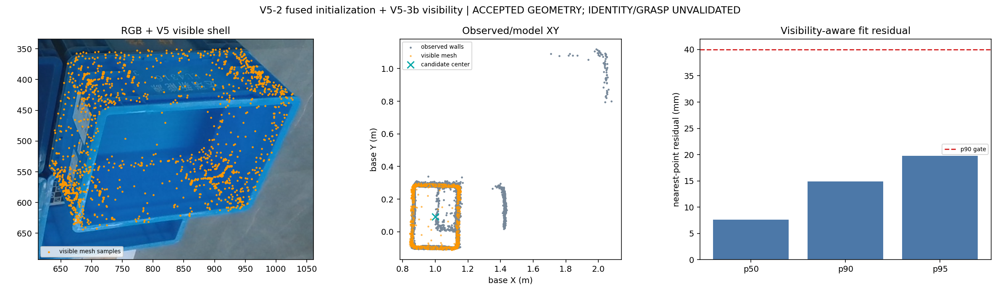

# 解释 R1 LingBot 点云匹配原理

- 归档编号：`01a0b243-817c-79e1-bc4a-c7ec673bf2ce`
- 项目：S1 IE_lab 拆垛
- 创建时间：2026-09-18T10:06:03.644000+08:00
- 更新时间：2026-09-18T10:56:39.657000+08:00
- 状态：活动
- 导出范围：用户可见消息与助手可见回复；不含隐藏推理和工具原始输出

## 1. 用户

R1 LingBot 算法的原理是什么？是否是mesh点云匹配？

9:18

用时 1分钟 14秒

是，但更准确地说，R1 是“ROI 初始化的 mesh 到深度点云可见表面匹配”，属于 ICP 类方法，但不是经典的 6D ICP。

R1 的流程是：

1. 上游 LingBot ROI 提供箱体的粗略中心和 yaw。
2. 转换成 V5 使用的四自由度初值：
```ini
q0 = [x, y, z - mesh_height / 2, yaw]
```

其中只优化：
```
x、y、z、yaw
```

roll 和 pitch 固定为箱体直立状态。

3. 使用 4317 mesh 的采样点、法向量和表面角色，筛选当前姿态下可见的：
   - `outer_shell`
   - `inner_shell`
   - `rim_flange`
4. 将 mesh 点变换到 base\_link，与深度图和 mask 反投影得到的观测点云建立双向最近邻残差：
```rust
mesh 点 -> 观测深度点
观测深度点 -> mesh 点
```

然后使用 robust `least_squares` 优化位姿。

5. 最后进行质量门禁：
   - p90 拟合残差；
   - mesh 点内点比例；
   - 观测点内点比例；
   - mask 是否触碰图像边界；
   - inner/outer 表面是否产生歧义；
   - 可见 mesh 点数量。

所以，R1 的最终匹配确实是 mesh 点云和深度点云之间的匹配，但它有几个特点：

- 使用的是可见 mesh shell，不是整个 mesh 无差别匹配；
- 使用 mask、视角、法向量和 z-buffer 过滤不可见或被遮挡的表面；
- 是双向最近邻残差，形式上接近 ICP；
- 优化的是 4DoF，不是完整 6DoF；
- 使用 `soft_l1` 鲁棒损失，不是经典 ICP 中的简单点对点 SVD；
- ROI 只负责提供初始位姿，最终位姿仍由 mesh 与深度点云拟合得到；
- R1 不读取 FDP 位姿，也不使用标定板位姿。

因此最准确的描述是：

> R1 = LingBot ROI 初始化 + V5-3b visibility-aware mesh-to-depth registration。

代码依据：

- [R1 入口包装](/home/lsy03/文档/ChatGPT/S1/experiments/20260916_v5_r_roi_init/entry_v5_r.py)
- [ROI 初值构造](/home/lsy03/文档/ChatGPT/S1/experiments/20260916_v5_r_roi_init/roi_initializer.py)
- [V5-3b 可见 shell 匹配实现](/home/lsy03/文档/ChatGPT/S1/experiments/20260907_bin_rim_pose/v5_2_visibility.py)

在本次 13 帧实验中，R1 LingBot 后端耗时中位数约 **0.966 s**，但正式接受率为 **15/65**。它的加速主要来自“只用一个 ROI 初值”，不是因为取消了 mesh 与深度点云的匹配。

9:19

mesh点到底是如何与深度图和 mask 反投影得到的观测点云 进行匹配的？

9:52

用时 1分钟 13秒

R1 的匹配过程可以概括为：
```css
深度图 + mask
      ↓
反投影到 base_link 点云
      ↓
筛选箱体墙面点、体素降采样
      ↓
mesh 采样点按当前位姿变换
      ↓
筛选可见的 mesh shell 点
      ↓
mesh 点云 ↔ 深度观测点云最近邻匹配
      ↓
优化 x、y、z、yaw
```

第一步，深度图中的每个像素使用相机内参反投影：
```ini
P_camera = depth(u,v) · K⁻¹ · [u,v,1]
P_base   = T_base_from_camera · P_camera
```

因此得到的是 `base_link` 坐标系下的三维观测点云。然后使用 mask、深度范围和局部深度法向量筛选箱体墙面点，再以约 12 mm 体素进行降采样。

第二步，mesh 不是直接拿全部三角面参与匹配。算法使用预采样的 mesh 点、法向量和表面类别，只保留：
```
outer_shell
inner_shell
rim_flange
```

给定 R1 的初始位姿：
```ini
q0 = [x, y, z, yaw]
```

将 mesh 点变换到 `base_link`：
```
M_base(q) = Rz(yaw) · M_mesh + [x,y,z]
```

然后根据以下条件筛选可见 mesh 点：

- 投影点在相机前方；
- 投影点落在图像范围内；
- mesh 法向量与观察方向满足可见性条件；
- 2 像素 z-buffer 去除被模型前表面遮挡的内层点。

第三步是三维最近邻匹配。代码中实际计算两组距离：
```
mesh 点 → 最近的深度观测点
深度观测点 → 最近的 mesh 点
```

形式上可以写成：
```
r(q) =
[
  min_j || mesh_i(q) - observed_j ||,
  min_i || observed_j - mesh_i(q) ||
]
```

然后使用 `scipy.optimize.least_squares` 优化 `x、y、z、yaw`。残差使用 `soft_l1` 鲁棒损失，并限制最大残差为 80 mm，减少离群点影响。

所以它是“mesh 点集和深度点集之间的匹配”，但不是传统的完整 6D ICP：

- 它只优化 4DoF：`x、y、z、yaw`；
- roll、pitch 固定为直立先验；
- 使用可见 shell，而不是完整 mesh；
- 使用双向最近邻距离；
- 使用鲁棒非线性优化，而不是经典 ICP 的刚体 SVD 更新；
- 可见 mesh 点集合主要根据初始位姿确定，优化后再重新检查可见性；
- 没有 RGB 特征点匹配。

mask 的作用也需要区分：当前实现中，mask 主要用来筛选深度观测点云；mesh 点的 `mask_inside_fraction` 会被统计，但并没有把“每个 mesh 点必须落在 mask 内”作为严格的逐点硬筛选条件。最后还会检查 p90 残差、模型和观测点内点比例、内外表面歧义以及 mask 是否触碰图像边界。

因此最准确的名称是：

> R1 = LingBot ROI 初始化 + 可见 mesh shell 与深度墙面点云的 4DoF 双向最近邻鲁棒拟合。

实现位置：

- [R1 入口](/home/lsy03/文档/ChatGPT/S1/experiments/20260916_v5_r_roi_init/entry_v5_r.py)
- [深度点云与 mesh shell 拟合](/home/lsy03/文档/ChatGPT/S1/experiments/20260907_bin_rim_pose/v5_2_visibility.py)
- [深度反投影和墙面筛选](/home/lsy03/文档/ChatGPT/S1/experiments/20260907_bin_rim_pose/mesh_shell_fit.py)


能不能画个图给我直观的感受一下点云和mesh的位置关系以及最终算法得出的箱体位姿估计的结论是什么？

## 2. 助手（进展）

我会先核对实现和已有实验结果，再画出观测点云、mesh 与估计位姿的关系。我会使用 visualize 技能，让你能旋转查看三维位置关系。

## 3. 助手（进展）

我会把图做成“先看一帧三维几何关系，再看位姿结论”的交互式示意：观测深度点云、可见 mesh 壳体、相机/坐标轴和最终估计位姿同时显示，并把这次实验的接受/拒绝与残差门禁标在图旁。先从实现与报告中提取真实数值，避免画成脱离结果的概念图。

## 4. 助手

_工具输出图片（原始工具文本未纳入归档）。_


## 5. 助手（进展）

图已经按真实 D05 帧的数据生成；我正在做一次浏览器预览检查，确认三维投影、按钮状态和窄屏布局都能正常显示。

## 6. 助手

图中使用真实 D05 帧：蓝点是深度观测，彩色点是可见 mesh shell，虚线框为 ROI 初值，实线框为拟合结果，可切换 3D、俯视和正视。

visualize{"path":"/home/lsy03/.codex/visualizations/2026/09/18/01a0b243-817c-79e1-bc4a-c7ec673bf2ce/r1-mesh-pointcloud.html"}

D05 最终位姿为 `center=(0.998, 0.094, 0.531) m`、`yaw=-91.7°`。p90 残差为 16.1 mm，几何门禁通过；但 `accuracy_validated=false`、`grasp_ready=false`，因此它是“可接受的几何候选”，不是独立真值。

[附件：b17061898ca9b0a7--r1-mesh-pointcloud.html](../../assets/b17061898ca9b0a7--r1-mesh-pointcloud.html)

## 7. 用户

## R1 有没有不接受的情况，再给我画一个“mesh 壳体怎样贴到深度点云”对比一下差距在哪

## 8. 助手（进展）

我会选一帧 R1 接受的 D05 和一帧 R1 拒绝的 D03 做并排图，重点把“点云都能贴上，但内外壳两种解释几乎同样好，因此拒绝”的差别画出来；如果 D03 的主要拒绝原因不是这个，我会按真实门禁原因调整图注。

## 9. 助手

有。R1 在冻结 D01–D12 中接受 **8/12**：

- **D01、D02、D03**：内壳/外壳解释过于接近，触发 `ambiguous_inner_outer_surface_hypotheses`。
- **D12**：p90 残差约 **61.4 mm** 超过 40 mm 门限，同时 mask 触碰图像边界。

下面对比 D05（接受）和 D03（拒绝）。D03 的最佳 p90 仍只有 17.9 mm，但 outer/inner 候选分别为 18.57/18.52 mm，差异仅 0.05 mm，所以算法拒绝的是“表面解释不唯一”。

visualize{"path":"/home/lsy03/.codex/visualizations/2026/09/18/01a0b243-817c-79e1-bc4a-c7ec673bf2ce/r1-rejection-compare.html","mode":"wide"}

[附件：2eedd84f7f3583f7--r1-rejection-compare.html](../../assets/2eedd84f7f3583f7--r1-rejection-compare.html)

## 10. 助手

_历史投影中的图片引用（用于补全本地对话资源）。_


