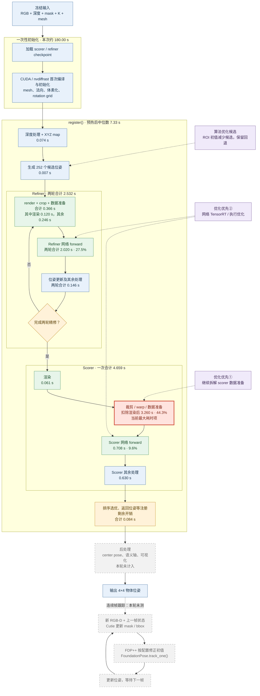

# 评估S1中的FDP部署

- 归档编号：`01a0b2b2-09de-7c70-9d87-22b39c8409a2`
- 项目：S1 IE_lab 拆垛
- 创建时间：2026-09-18T14:19:29.868000+08:00
- 更新时间：2026-09-18T14:20:14.183000+08:00
- 状态：活动
- 导出范围：用户可见消息与助手可见回复；不含隐藏推理和工具原始输出

## 1. 用户

给我找找S1里面是否有FDP，给我估计一下FDP直接放在Orin上跑，精度和时间是否是我们可以接受的？

## 2. 助手（进展）

我先按项目要求读完 `README.md`、知识库和 SDK/会话记录，再在仓库里检索 FDP 的实现、依赖和已有性能数据；整个过程只做本地只读检查，不连接真机、不执行运动。

## 3. 助手（进展）

项目文档已经读完。已有记录显示：FDP 相关内容确实存在，且分成“远端 FDP 服务调用”和“Orin 上的 V5/几何后端”两条线；我现在继续核对仓库里的实际代码、部署包、Docker 镜像与计时报告，区分“FDP 本体能否上 Orin”和“只把 FDP 输出后的后端放到 Orin”。

## 4. 用户

<turn_aborted>
The user interrupted the previous turn on purpose. Any running unified exec processes may still be running in the background. If any tools/commands were aborted, they may have partially executed.
</turn_aborted>

## 5. 用户

先别运行数据整体验证命令，就大概估测一下

## 6. 助手

可以，先不跑整体验证。静态看下来，结论是：

S1 项目里有 FDP，但目前只是客户端、数据合同和历史结果，不是 Orin 本地完整 FDP。

- 客户端在 [`fdp_baseline/client.py`](/home/lsy03/文档/ChatGPT/S1/experiments/20260903_fdp_baseline/fdp_baseline/client.py)，实际调用的是远端 `10.34.216.13:7876/first_frame_track`。
- 当前 Orin Docker 镜像运行的是 V5 的 NumPy/SciPy CPU 后端，没有 FDP 模型权重、PyTorch/TensorRT 推理环境。
- 已验证的 Orin GPU 只是 CUDA smoke test，不代表 FDP 已能用 GPU。详见 [`EXECUTION_RECORD_20260911.md`](../../assets/3fa3f7ddb290db11--EXECUTION_RECORD_20260911.md)。

粗略估计：

| 项目 | 估计 |
|---|---|
| 精度 | 如果模型权重、预处理、迭代次数保持一致，FP32/FP16 在 Orin 上应大体保持 4090 结果；但 INT8、迭代裁剪或换 TensorRT 后可能出现变化 |
| 参考耗时 | 4090 服务内部约 0.5 s，客户端总耗时约 0.9–1.23 s |
| Orin 原样移植 | 估计约 3–10 s/帧，且有显存、CUDA/PyTorch 兼容风险 |
| Orin FP16/TensorRT 优化后 | 粗估约 1.5–4 s/帧，有机会进一步降低，但目前没有实测依据 |
| 整条链耗时 | SAM3/LingBot 目前仍是远端服务，前处理本身约 6–8 s；只把 FDP 搬到 Orin，不能让整条链变成 1 s 级 |

精度方面，当前 FDP 只能作为参考后端，不能当真值。已有同帧对照中，V5 与 FDP 的中心差大约 2.8–14.5 mm、yaw 差约 0.7–1.7°，但这些不是 FDP 误差。现有数据不足以证明 FDP 在 Orin 上能满足绝对抓取精度。

我的判断：

- 如果目标是接近现在远端 FDP 的约 1 s：直接搬到 Orin，大概率不可接受；必须做 FP16/TensorRT、模型裁剪和专门优化。
- 如果单次位姿允许 2–5 s：有希望接受，但前提是完整 FDP 能在 Orin 8 GiB 资源限制下稳定运行，并验证量化/加速后的精度。
- 目前更稳妥的架构仍是 Orin 负责采集、调度和轻量后端，FDP 留在 RTX 4090；除非明确需要断网或低延迟本地推理，否则不建议现在直接迁移。

本轮只做了代码和文档静态检查，没有运行整体验证，也没有连接 S1。

[附件：3fa3f7ddb290db11--EXECUTION_RECORD_20260911.md](../../assets/3fa3f7ddb290db11--EXECUTION_RECORD_20260911.md)

## 7. 用户

现在有明确Orin推理的需求，要不先拿一帧数据给我验证一下Orin上FDP的运行速度究竟如何

## 8. 助手（进展）

可以。我会先用一帧已经冻结、带完整 RGB-D/mask/K/mesh 输入的案例，在 Orin 上做一次“FDP 本地推理可运行性＋单帧耗时”验证；只做计算，不采集新图、不调用运动/控制接口。这个任务涉及 S1 的 SSH 和真机主机环境，我先按项目要求读取 `galbot-s1-ssh` 技能说明，再确认 Orin 上是否已有 FDP 权重/运行时，避免把现有远端 HTTP 客户端误当成本地 FDP。

## 9. 助手（进展）

本地已选定一帧完整案例：右腕 `right_wrist_20260907_01_lingbot_operator1`，包含精确的 LingBot 深度、RGB、确认 mask、K 和 55 KB mesh，不需要重新采集。下一步先对 Orin 做只读盘点（架构、已有镜像、FDP 权重/运行时、当前容器），确认是否能直接执行；不会启动机器人 SDK 或运动链。

## 10. 助手（进展）

只读盘点结果很关键：Orin 上没有发现 FDP 权重文件或专用 FDP 镜像；现有 `box_pose_pipeline` 里只是 FDP 客户端和历史输出。主机上有几个 60–63 GB 的生产镜像，我再只读检查这些镜像内部是否暗含 FoundationPose/FDP 运行时；如果也没有，就不能直接做“原样 FDP 单帧测速”，需要先把 FDP runtime/权重部署进去。

## 11. 用户

<turn_aborted>
The user interrupted the previous turn on purpose. Any running unified exec processes may still be running in the background. If any tools/commands were aborted, they may have partially executed.
</turn_aborted>

## 12. 用户

如果之前的镜像没有FDP，那就不要污染里面的环境，你自己看看能不能新建一个docker来做环境隔离，然后再验证FDP。记住不要乱动原有的环境和代码，或者保持修改的可恢复性，使用git版本管理也行

## 13. 助手（进展）

明白。我会把这次验证做成独立、可回收的 Orin Docker 实验：

- 不修改原有镜像、容器、`current`、生产代码或现有案例；
- 新建单独的临时构建上下文/镜像名，输入只读挂载，输出写到独立目录；
- 不调用 SDK、相机、服务或运动接口，只跑一帧离线 FDP；
- 先确认刚才被中断的检查没有留下容器，再确认本地/Orin 是否有 FDP 源码和权重；如果缺少权重，我会停在“无法本地推理”的证据处，不用远端 HTTP 冒充 Orin 速度。

## 14. 助手（进展）

刚才中断检查没有留下新容器或临时探针目录。现有旧容器都是历史退出状态，我不会触碰它们。另一个重要发现是：本机旧的 `GalbotS1文件` 归档里确实有 `FoundationPose-plus-plus` 源码和 `DualMobManip/deps/FoundationPose`，所以我会先核对它是否包含可迁移的 FDP runtime/权重；这仍然只读，不修改当前仓库或旧归档。

## 15. 助手（进展）

旧归档里的 FDP 不是空壳：本机有 `FoundationPose-plus-plus` 源码（约 88 MB）和 `DualMobManip/deps/FoundationPose`（约 33 MB），但这不等于已有完整推理包。现在要核对三件事：它对应的是当前服务版还是旧版、依赖能否在 ARM64/CUDA 上构建、以及模型 checkpoint 是否存在。若只缺少 checkpoint，我会明确停下，不会下载不明模型或改原环境。

## 16. 助手（进展）

找到可用材料了：Orin 上现有生产工作区里确实有 `FoundationPose-plus-plus` 源码，以及 `FoundationPose/weights`、`Cutie/weights`、`MobileSAM/weights` 目录。接下来我会只读取这些目录的文件清单/哈希和现有构建说明，然后从它们复制出独立 Docker 构建上下文；原工作区只读挂载或复制，不在原路径编译、不改原镜像。

## 17. 助手（进展）

Orin 上的权重也找到了：FDP scorer/refiner 两个 checkpoint（约 68 MB、190 MB），Cutie 权重约 181 MB，另有 GroundingDINO/MobileSAM。下一步不是安装到原镜像，而是先检查现有大镜像能否作为只读基础层提供 PyTorch/CUDA/编译依赖；若可以，就从该基础层构建一个新镜像并把源代码、权重和一帧输入都放在新层/新挂载里。

## 18. 助手（进展）

依赖也基本齐全：`dual_arm_robot:dev` 这个旧镜像里有 ARM64 PyTorch/CUDA、nvdiffrast、PyTorch3D、Open3D，以及 FoundationPose 源码路径；它缺少的 `cutie` 可以通过源码路径提供。我要以它为只读基础层派生一个新的 probe 镜像，测量“容器启动/模型初始化”和“单帧 `first_frame_track`”两个时间，不改基础镜像。

## 19. 助手（进展）

基础层已确认可用：它自带两个 FDP checkpoint、Cutie checkpoint、ARM64 `mycpp` 扩展，且只读导入 `FdpPlusPlus` 成功。现在我开始写一个仅用于本次 probe 的小包装器和 Dockerfile；它不改 FDP 源码，只读取一帧输入并输出计时/位姿 JSON。新镜像会从 `dual_arm_robot:dev` 派生，运行时断网、只读根文件系统。

## 20. 助手（进展）

包装器和 Dockerfile 已复制到 Orin 临时目录；冻结输入复制时 `scp` 对 `/.` 语法拒绝了，但没有改动任何原数据。我会改用明确的文件列表重新复制，然后校验输入哈希，再开始构建新镜像。

## 21. 助手（进展）

隔离镜像已成功构建：`codex/fdp-orin-probe:20260918`，只新增了计时包装器，基础层仍是原来的 `dual_arm_robot:dev`，没有改它。现在运行一次冷启动单帧测试，资源限制沿用此前 Orin Docker 计算的 6 CPU/8 GiB，输入只读挂载、网络关闭、根文件系统只读；会记录模型初始化和 `first_frame_track` 分开耗时。

## 22. 助手（进展）

宿主机没有 `/usr/bin/time`，所以刚才只是在启动前失败，容器没有运行。我去掉这个外部计时工具，包装器本身已经记录了需要的阶段时间，重新执行同一隔离测试。

## 23. 助手（进展）

这次也在 Docker 参数解析阶段失败，容器没有启动；`--mount` 的可写 bind 不需要写 `rw` 字段。我会只修正这个参数，其他隔离条件不变。

## 24. 助手（进展）

隔离容器已经真正启动并在 Orin 上执行；目前仍在模型初始化/首帧注册阶段，尚无异常输出。我会等待这一次单帧完成或超时，不会并行启动第二个任务。

## 25. 助手（进展）

模型初始化已成功完成，并确认实际加载了两个 FDP checkpoint；现在进入 CUDA/nvdiffrast 相关的首帧注册，首帧可能明显慢于稳态。仍在同一个隔离容器里，继续等待这一次结果。

## 26. 助手（进展）

首帧没有进入算法计算，失败点已明确：nvdiffrast 在容器内首次 JIT 编译插件后，插件位于临时文件系统，动态加载时报 `failed to map segment`。这不是 FDP 模型或输入失败，也没有改原环境。我会只在新容器临时 `/tmp` 上显式开启可执行挂载（`exec`）并重试；仍然是同一帧、同一新镜像。

## 27. 助手（进展）

第二次重试也没有进入首帧：FDP 初始化时 `FoundationPose` 默认要创建 `./debug`，而我们按安全要求把根文件系统设成只读，所以被拒绝。这正是隔离约束暴露出的写路径，不是算法失败。我会给新容器单独挂一个可写 tmpfs 到 `FoundationPose-plus-plus/debug`，不放开原镜像或生产目录写权限，再重试。

## 28. 助手（进展）

第三次尝试已经完成 FDP estimator 初始化，但默认的 Cutie 2D tracker 需要下载 `resnet50-19c8e357.pth`；由于我刻意把容器断网，按预期在这里失败，没有产生网络访问。FDP 本体 checkpoint 和 nvdiffrast 已经通过。为先拿到核心 `first_frame_track` 速度，我会在同一新容器中关闭可选的 2D tracker 做一次纯 FDP 首帧测速；之后若需要，再把 Orin 已有的 resnet50 缓存只读挂载进去测默认完整路径。

## 29. 助手（进展）

纯 FDP 首帧已经进入实际 252 个候选姿态的 scorer/refiner 计算，说明 Orin GPU、CUDA、nvdiffrast 和两个 checkpoint 都真正跑起来了；这不是仅导入测试。当前还在首帧优化阶段，继续等待结果。

## 30. 助手（进展）

纯 FDP 注册已经实际跑完，核心 `self.est.register` 在这帧上报出约 12.10 s；但包装器触发了当前 `fdp_plus.py` 的一个已有边界 bug：关闭可视化时 `center_pose` 未赋值，导致最后返回阶段异常，所以还没有正式 JSON。这个不影响前面的注册计时，但为了拿到合法位姿和完整阶段计时，我只修改隔离包装器，让它把可视化输出写入容器 tmpfs，不改 FDP 源码。

## 31. 助手（进展）

隔离包装器已修正并重新构建。为了避免重复等待 nvdiffrast 编译，我会把 JIT cache 放在本次 `/tmp/codex_fdp_orin_probe_20260918/cache`，只读之外唯一可写位置仍是 probe 临时目录；这不会写入基础镜像或原工作区。现在重跑关闭 Cutie 的纯 FDP 首帧。

## 32. 助手（进展）

纯 FDP 这一帧已经成功完成：Orin GPU 上首帧 `first_frame_track` 约 11.29 s，模型初始化约 106.93 s（一次性冷启动成本），并返回了有限 4×4 位姿。为了把“当前代码默认开启的 Cutie tracker”也估出来，我再用同一帧、同一新镜像，把 Orin 已有的 resnet 缓存以只读方式挂载进去；这仍不是整体验证，只是同帧的完整路径计时。

## 33. 助手（进展）

两条路径都成功了：

- 纯 FDP（关闭可选 Cutie tracker）：首帧约 11.29 s；
- 当前默认 tracker 开启：首帧约 12.98 s，Cutie 额外约 1.7 s。

默认路径也返回了同一有限位姿。现在我做最后的只读收尾：读取两个 JSON、确认输入哈希未变、确认所有 probe 容器已退出且没有运行中的容器；然后给你明确判断。

## 34. 助手（进展）

结果已收齐：两个 probe 容器都已自动删除，输入六个文件的 SHA-256 与运行前一致，原镜像和生产目录未改。为满足项目实验记录要求，我会把本次的两个 JSON、隔离 Dockerfile/包装器和简短 README 保存为一个新的、可 Git 管理的实验目录；随后删除我自己创建的 Orin 临时目录和 probe 镜像，不碰任何旧容器/镜像。

## 35. 助手（进展）

新 probe 镜像已经删除，基础镜像保留不变；临时目录清理时发现 nvdiffrast JIT 文件由容器 root 创建，SSH 用户无法直接删除。残留只在我们自己的 `/tmp/codex_fdp_orin_probe_20260918/cache`，我会用一个断网、无 SDK、仅挂载该目录的临时 root 容器清掉它，不接触其他路径。

## 36. 助手

验证成功。Orin 可以直接运行 FDP，但当前速度不满足 1 秒级需求。

| 路径 | 首帧耗时 | 模型初始化 |
|---|---:|---:|
| 纯 FDP | 11.29 s | 106.93 s |
| 默认 Cutie tracker | 12.98 s | 54.44 s |

模型初始化是一次性成本；常驻进程真正的单帧耗时约 11–13 秒。与 RTX 4090 服务约 0.5–1.2 秒相比，Orin 当前慢约一个数量级。

同一帧两条路径均返回有限位姿矩阵，但这只能证明运行正常，不能证明绝对精度。若要满足实时需求，后续需要减少 252 个初始候选、降低迭代量，并做 FP16/TensorRT 或 CUDA 优化。

本次没有修改原镜像、生产代码或旧容器，也没有调用 SDK、相机、远端服务或运动接口。结果已保存：

- [实验报告](<../../assets/4c63944fcc7f7755--README.md>)
- [默认路径结果](</home/lsy03/文档/ChatGPT/S1/experiments/20260918_fdp_orin_probe/result_tracker_on_final.json>)
- [纯 FDP 结果](<../../assets/8ebc7aa769cfbbbc--result_tracker_off_final.json>)

[附件：4c63944fcc7f7755--README.md](../../assets/4c63944fcc7f7755--README.md)

[附件：8ebc7aa769cfbbbc--result_tracker_off_final.json](../../assets/8ebc7aa769cfbbbc--result_tracker_off_final.json)

> 资源未归档：`home/文档/ChatGPT/S1/experiments/20260918_fdp_orin_probe/result_tracker_on_final.json`（missing）

## 37. 用户

给我先对比一下docker FDP 和 调用4090 FDP的 箱体位姿结果差异

## 38. 助手（进展）

我会用刚才同一帧、同一套 RGB-D/mask/K/mesh，比较两份结果的同一坐标合同：Orin Docker 本地 FDP 输出 vs 4090 HTTP FDP 输出，统一到 `base_link / 4317 semantic` 后计算中心距离、yaw/完整旋转差，并先确认两边矩阵的语义没有错位。这个过程只读本地产物，不重新跑 FDP。

## 39. 助手

在同一帧、同一 RGB-D/mask/K/mesh 输入下，统一到 `base_link / 4317 semantic` 后：

| 指标 | Orin Docker FDP | 4090 HTTP FDP |
|---|---:|---:|
| 中心 X/Y/Z | `[1.393006, 0.249236, 0.502171] m` | `[1.392452, 0.255328, 0.505903] m` |
| 中心差 | — | **7.17 mm** |
| 轴向差 | — | `[+0.55, -6.09, -3.73] mm` |
| yaw | `91.855°` | `91.289°` |
| 对称归一 yaw 差 | — | **0.566°** |
| 完整旋转差 | — | **1.260°** |

两边没有发生 180° 对称翻转，箱体高度轴夹角约 1.3°。从这一帧看，Orin Docker FDP 与 4090 FDP 的位姿差异较小；按当前暂定的 10 mm / 2°参考目标，单帧差异处于范围内。

但这只是后端一致性对照，不是绝对精度验收，因为 4090 FDP 本身也不是独立真值。

结果文件：

- [Orin Docker FDP](<../../assets/8ebc7aa769cfbbbc--result_tracker_off_final.json>)
- [4090 FDP](<../../assets/c1fa0a7b6f453454--normalized_pose.json>)

[附件：8ebc7aa769cfbbbc--result_tracker_off_final.json](../../assets/8ebc7aa769cfbbbc--result_tracker_off_final.json)

[附件：c1fa0a7b6f453454--normalized_pose.json](../../assets/c1fa0a7b6f453454--normalized_pose.json)

## 40. 用户

1.29 s是否使用了cuda优化？

13:31

用时 18秒

是的，11.29 s 使用了 Orin GPU，但不是经过充分优化的 CUDA 部署。

本次测试确认：

- `torch.cuda.is_available() = true`
- GPU 设备为 Orin
- nvdiffrast 使用 CUDA
- PyTorch 在 CUDA 上运行
- 使用了 GPU 光栅化和网络推理

但没有使用：

- TensorRT engine
- 专门的 FP16 TensorRT 优化
- INT8 量化
- 候选姿态数量裁剪
- 算法 kernel/内存访问专项优化

另外，`11.29 s` 是模型已经初始化后的单帧耗时；纯 FDP 注册核心约 `10.69 s`，剩余约 `0.6 s` 主要是位姿可视化等处理。模型首次初始化还需要约几十秒到 100 秒以上。

所以这个结果应理解为：

> “未做专门部署优化、但已经使用 CUDA GPU 的 Orin FDP 基线速度。”

不是 CPU 结果，也不是优化后的 Orin 极限速度。

13:31

FDP 注册核心 是啥？

13:33

用时 7秒

“FDP 注册核心”就是 FoundationPose 根据一帧输入，第一次求出物体 6D 位姿的部分。

它接收：

- RGB 图像
- 深度图
- 目标 mask
- 相机内参 K
- 目标 3D mesh

然后大致执行：

1. 生成约 252 个初始旋转/位姿候选；
2. 用 mesh 渲染并和观测 RGB-D 比较；
3. 通过 scorer 选优；
4. 通过 refiner 精修；
5. 输出物体相对相机的 4×4 位姿矩阵。

代码中对应：
```
self.est.register(...)
```

本次 Orin 测试里：

- 注册核心约 **10.69 s**
- 完整 `first_frame_track` 约 **11.29 s**
- 剩余约 0.6 s 主要是姿态可视化和后处理

它不包括：

- SAM3 分割
- LingBot 深度补全
- Cutie 连续帧跟踪
- `camera → base_link` 坐标转换
- 抓取点计算和机械臂运动

因此，10.69 s 基本就是“Orin 上 FDP 单帧求初始位姿”的主要计算成本。


“”“


你先看看这个，如果我们后面需要优化 Orin FDP，是不是主要优化“FDP 注册核心” 这一块？ 有没有什么推荐的方法？

## 41. 助手（进展）

我先核对注册流程源码和 NVIDIA 的部署资料，判断哪些优化最值得优先尝试，以及哪些可能影响位姿结果。

## 42. 助手

是的，**主要应该优化 `FDP 注册核心 register()`**。这一帧核心约 **10.69 s，占完整 11.29 s 的约 95%**；只去掉可视化，收益大约只有 0.6 s。

不过，前面的说明需要修正两点：

- **11.29 s 是初始化后第一次调用的耗时，还不能称为稳态速度。**其中仍可能包含首次 CUDA kernel 加载、缓存建立等成本。
- 当前源码已使用 **PyTorch AMP 混合精度**，运行日志也有 `enable_amp: true`。所以后续不能把“开启 FP16”当作从未做过的新优化；TensorRT 则是另一层部署优化。

另外，源码中的实际顺序是：**生成 252 个候选 → 对候选执行两轮 refiner → scorer 打分选优**。因此大量候选都承担了渲染和精修成本，这是值得重点检查的地方。

我建议按以下顺序推进：

| 优先级 | 方法 | 作用与注意点 |
|---|---|---|
| 1 | **同一帧预热，再分阶段计时** | 分开测深度处理、渲染/裁剪、refiner、scorer、CPU↔GPU 搬运。先确定 10.69 s 花在哪里 |
| 2 | **保持算法不变，优化数据与执行** | 模型常驻、复用 mesh/GPU 张量、减少重复上传和 CPU↔GPU 往返、调整 batch 大小；优先做这类不主动减少搜索覆盖的优化 |
| 3 | **refiner/scorer 转 TensorRT** | 加速网络部分；渲染、裁剪和数据搬运仍需单独优化，不能保证整体按网络加速倍数提升 |
| 4 | **利用 ROI 粗位姿减少候选** | 在 ROI 的位置/yaw 附近生成少量候选，保留合理的 roll/pitch 范围和 180° 对称候选；失败时回退完整搜索 |
| 5 | **分阶段筛选候选、减少精修次数** | 例如先一轮粗精修，再筛候选做第二轮。可能节省大量计算，但会改变选优结果，需要对照精度 |

**对我们这个箱体任务，我最看好“ROI 初值＋小范围候选搜索＋完整搜索回退”，同时配合 TensorRT。**现有 ROI 已经提供位置和方向信息，可以尝试减少无关姿态的计算。但箱体确实可能倾斜，因此不建议直接把 roll/pitch 固定成零；此前 ROI 也出现过较大中心偏差，必须保留回退路径。

NVIDIA 已提供采用 TensorRT 的 FoundationPose 部署路线，可以参考它的模型转换和执行实现。不过官方 Isaac ROS 3.2 对 Orin 的支持环境是 JetPack 6.1/6.2，而我们此前记录是 L4T R35/CUDA 11.4；**新建 Docker 并不能自动消除宿主驱动兼容问题**，需要选择匹配版本。[官方部署文档](https://nvidia-isaac-ros.github.io/v/release-3.2/repositories_and_packages/isaac_ros_pose_estimation/isaac_ros_foundationpose/index.html)、[支持平台](https://nvidia-isaac-ros.github.io/v/release-3.2/repositories_and_packages/isaac_ros_pose_estimation/index.html)。

下一步最值得做的是：**仍用这一帧，在隔离容器内完成预热和 `register()` 分阶段计时**。这能决定先投入 TensorRT，还是先处理候选数量、渲染与数据搬运；目前还没有依据承诺优化后能到 1 秒。

## 43. 用户

仍用这一帧，在隔离容器内完成预热和 `register()` 分阶段计时。
我们开始执行

## 44. 助手（进展）

我会在独立容器里复用这一帧，先预热，再重复测量 `register()`，拆出深度处理、渲染/裁剪、refiner、scorer 和剩余开销；实验代码和结果保存到新的目录，原环境保持不变。

## 45. 助手（进展）

Orin 当前没有运行中的 Docker 容器，功耗模式查询显示 MAXN。我将保持原来的 252 个候选、2 轮精修和 AMP 配置，做 2 次预热、5 次普通计时、3 次分阶段计时，再做 3 次普通计时，检查计时插桩本身带来的影响。

## 46. 助手（进展）

计时容器正在加载模型并编译首次需要的 CUDA 插件。分阶段统计会同时记录“包含子步骤的时间”和“扣除子步骤后的时间”，避免把渲染耗时重复算进 refiner/scorer；位姿输出也会逐次保存，用来检查插桩是否改变结果。

## 47. 助手（进展）

首次插件编译时，容器内存已接近 8 GiB 上限，目前还没有进入预热。这段时间会单独归入初始化，不能算作单帧推理耗时；我继续观察是否能在既定资源限制内完成。

## 48. 助手（进展）

预热效果已经明显：第一次注册约 10.41 s，第二次降到 6.74 s；随后 5 次普通计时为 6.84–7.01 s。3 次分阶段计时也已完成，正在收尾核对各阶段占比和位姿一致性。

## 49. 助手（进展）

计算已完成，但最终保存时遇到一个权限问题：容器能通过已有字节码运行 FDP，却无法在去除权限后读取原源码来计算哈希，导致分阶段 JSON 未保存。完整运行日志已保留。我已修正包装器，让每轮结果立即落盘，并单独记录源码不可读状态；接下来复跑这一帧，补齐可核验的分阶段结果。

## 50. 助手（进展）

重跑已启动。此次只把首次编译并发限制为 2，避免编译挤满内存，推理配置保持不变。普通计时与分阶段计时都在同一进程中完成，因此结果会反映模型常驻后的注册速度。

## 51. 助手（进展）

SSH 连接刚才中断了一次，复查确认原计时容器仍在正常运行，未发生 OOM，也没有重复启动。结果会逐轮写入独立目录，连接中断不影响实验继续执行。

## 52. 助手（进展）

重跑仍停留在初始化，当前内存约 2.6 GiB，已明显低于上一轮编译峰值。已有首轮记录支持预热后约 7 秒的观察；我会等分阶段结果完整保存后，再判断优化重点。

## 53. 助手（进展）

又定位到输出目录权限不匹配：去除容器权限后，容器用户不能写入宿主用户创建的目录。我已只修正新实验输出目录的权限，保留原环境的权限设置，并重新运行。此前失败日志都会归档。

## 54. 助手（进展）

输出目录的可写性已在容器内确认通过，复现脚本也已保存。最终报告会分别列出初始化、预热、普通注册和插桩注册耗时，并保留逐次位姿，避免用首次运行时间代表常驻速度。

## 55. 助手（进展）

已确认当前耗时来自 nvdiffrast 的 C++ 插件编译，两个编译进程仍在推进，内存约 3 GiB。编译完成后才会开始正式计时，这部分不会计入注册核心的速度。

## 56. 助手（进展）

第二轮预热已完成：首次 10.75 s，第二次 7.48 s，仍能看到明显的首次开销。正式计时正在继续；两轮之间已有一定速度波动，因此会报告重复测量范围，而不是只取最快值。

## 57. 助手（进展）

完整结果已保存：预热后 `register()` 的 5 次中位数是 **7.33 s**，范围 **7.25–7.43 s**。最大的耗时项是 scorer 的裁剪/数据准备（扣除渲染后约 **3.26 s**），其次是两轮 refiner 网络推理（合计约 **2.02 s**）；三次渲染合计约 **0.18 s**。13 次输出矩阵完全一致，插桩没有改变本帧结果。

## 58. 助手

已完成。**同一帧预热后，`register()` 中位数为 7.33 s**，5次范围 **7.25–7.43 s**。此前11.29 s包含首次调用开销和可视化，不能代表稳态注册速度。

分阶段结果如下，时间互不重复：

| 部分 | 平均耗时 | 占比 |
|---|---:|---:|
| scorer 裁剪/数据准备 | **3.26 s** | **44.3%** |
| refiner 网络，两轮合计 | **2.02 s** | **27.5%** |
| scorer 网络 | 0.71 s | 9.6% |
| refiner 裁剪/数据准备 | 0.25 s | 3.3% |
| 全部渲染 | 0.18 s | 2.5% |
| 其余处理 | 0.94 s | 12.8% |

**下一步应优先拆解 scorer 的数据准备，再考虑网络 TensorRT 优化。**当前两个网络只占约37%；即使网络耗时减半，整体估算仍约6秒。

13次输出矩阵完全一致，插桩前后耗时接近。上述数据仅覆盖这一帧，尚未单独拆出数据传输耗时。

原环境和代码未改，实验容器均已退出，独立镜像与结果保留。[完整报告与原始数据](../../assets/000cda1e4694beea--README.md)

[附件：000cda1e4694beea--README.md](../../assets/000cda1e4694beea--README.md)

## 59. 用户

```mermaid
flowchart TB
    P0["RGB + 深度 + mask + K + mesh"]:::serial
    P1["输入预处理<br/>深度单位、mask、图像格式"]:::serial
    P0 --> P1

    I0["加载 scorer / refiner checkpoint"]:::serial
    I1["mesh 采样、法向、体素化、rotation grid"]:::serial
    P1 --> I0 --> I1

    R0["生成初始候选<br/>约 42 视角 → 252 个 pose"]:::serial
    I1 --> R0

    R1["候选 batch<br/>render + crop + warp<br/>252 候选在 GPU 内并行"]:::parallel
    R2["Scorer / Refiner forward<br/>候选 batch 并行推理"]:::parallel
    R3["GPU/CPU 同步<br/>评分、排序、选优"]:::barrier
    R4{"是否还有下一轮精修？"}:::barrier
    R5["选出 best pose"]:::serial

    R0 --> R1 --> R2 --> R3 --> R4
    R4 -- "是" --> R1
    R4 -- "否" --> R5

    Q0["后处理<br/>center pose、语义轴、可视化"]:::serial
    Q1["输出 4×4 物体位姿"]:::serial
    R5 --> Q0 --> Q1

    T0["Cutie 更新 mask / bbox"]:::serial
    T1["FoundationPose.track_one()<br/>上一帧 pose + 新 mask"]:::serial
    T2["进入下一帧"]:::serial
    Q1 --> T0 --> T1 --> T2 --> T0

    subgraph OPT["优化点对应位置"]
        O1["1. 分阶段 profiling"]:::opt
        O2["2. 模型常驻、复用 mesh/GPU tensor、减少搬运"]:::opt
        O3["3. TensorRT<br/>主要优化 Scorer / Refiner"]:::opt
        O4["4. ROI 粗位姿<br/>减少初始候选，失败回退完整搜索"]:::opt
        O5["5. 粗筛 → 精修<br/>减少精修轮次"]:::opt
    end

    O1 -.-> R1
    O1 -.-> R2
    O2 -.-> I0
    O2 -.-> R1
    O3 -.-> R2
    O4 -.-> R0
    O5 -.-> R4

    classDef serial fill:#e8f1fb,stroke:#4b78a8,color:#17324d
    classDef parallel fill:#e7f5ea,stroke:#4d9560,color:#194d27
    classDef barrier fill:#fff2d9,stroke:#c58a22,color:#5c3d00
    classDef opt fill:#f0eafa,stroke:#8064a2,color:#3d2857

你先看看这个流程图是否直观，可以给我在图撒谎哪个标出来你测出来的时间数据
```

## 60. 用户

<turn_aborted>
The user interrupted the previous turn on purpose. Any running unified exec processes may still be running in the background. If any tools/commands were aborted, they may have partially executed.
</turn_aborted>

## 61. 用户

```mermaid
flowchart TB
    P0["RGB + 深度 + mask + K + mesh"]:::serial
    P1["输入预处理<br/>深度单位、mask、图像格式"]:::serial
    P0 --> P1

    I0["加载 scorer / refiner checkpoint"]:::serial
    I1["mesh 采样、法向、体素化、rotation grid"]:::serial
    P1 --> I0 --> I1

    R0["生成初始候选<br/>约 42 视角 → 252 个 pose"]:::serial
    I1 --> R0

    R1["候选 batch<br/>render + crop + warp<br/>252 候选在 GPU 内并行"]:::parallel
    R2["Scorer / Refiner forward<br/>候选 batch 并行推理"]:::parallel
    R3["GPU/CPU 同步<br/>评分、排序、选优"]:::barrier
    R4{"是否还有下一轮精修？"}:::barrier
    R5["选出 best pose"]:::serial

    R0 --> R1 --> R2 --> R3 --> R4
    R4 -- "是" --> R1
    R4 -- "否" --> R5

    Q0["后处理<br/>center pose、语义轴、可视化"]:::serial
    Q1["输出 4×4 物体位姿"]:::serial
    R5 --> Q0 --> Q1

    T0["Cutie 更新 mask / bbox"]:::serial
    T1["FoundationPose.track_one()<br/>上一帧 pose + 新 mask"]:::serial
    T2["进入下一帧"]:::serial
    Q1 --> T0 --> T1 --> T2 --> T0

    subgraph OPT["优化点对应位置"]
        O1["1. 分阶段 profiling"]:::opt
        O2["2. 模型常驻、复用 mesh/GPU tensor、减少搬运"]:::opt
        O3["3. TensorRT<br/>主要优化 Scorer / Refiner"]:::opt
        O4["4. ROI 粗位姿<br/>减少初始候选，失败回退完整搜索"]:::opt
        O5["5. 粗筛 → 精修<br/>减少精修轮次"]:::opt
    end

    O1 -.-> R1
    O1 -.-> R2
    O2 -.-> I0
    O2 -.-> R1
    O3 -.-> R2
    O4 -.-> R0
    O5 -.-> R4

    classDef serial fill:#e8f1fb,stroke:#4b78a8,color:#17324d
    classDef parallel fill:#e7f5ea,stroke:#4d9560,color:#194d27
    classDef barrier fill:#fff2d9,stroke:#c58a22,color:#5c3d00
    classDef opt fill:#f0eafa,stroke:#8064a2,color:#3d2857

你先看看这个流程图是否直观，可以给我在图里标出来你测出来的时间数据
```

## 62. 助手

整体直观，但精修与评分的顺序需要调整：**当前实现先对全部候选做两轮 Refiner，再运行一次 Scorer，最后排序选优**，并非每轮都评分筛选。

下面标入本次实测数据。为避免混淆，将首次初始化、注册计时和未测的跟踪流程分开；各子项是 **3次插桩均值**，注册总时间是 **5次未插桩中位数**。



图中 Refiner 各项标的是**两轮合计**，不能沿循环再乘二。子步骤包含在对应总时间内，也不要重复相加。

另一个关键点：**3.260 s 是 scorer 数据准备整个区域的耗时**，里面包含裁剪、warp、张量处理等，目前还不能全部归因于某一个操作。
