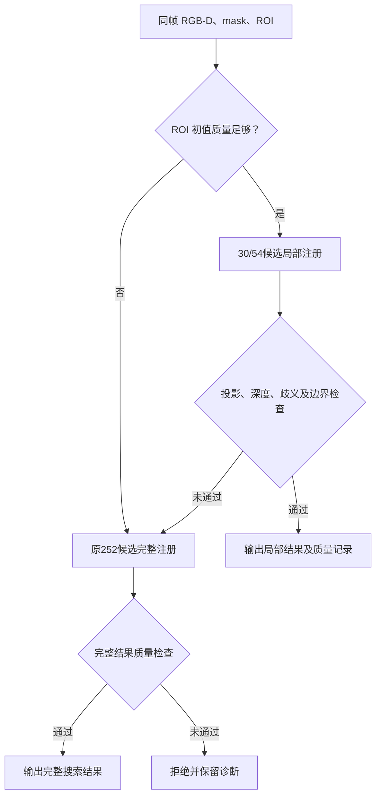

# 9_18 评估S1中的FDP部署 (2)

- 归档编号：`01a0b337-0e6c-7560-a191-d6416b7e7af8`
- 项目：S1 IE_lab 拆垛
- 创建时间：2026-09-18T14:32:04.972000+08:00
- 更新时间：2026-09-18T17:00:44.291000+08:00
- 状态：活动
- 导出范围：用户可见消息与助手可见回复；不含隐藏推理和工具原始输出

## 1. 用户

给我”ROI 初值＋小范围候选搜索＋完整搜索回退“ 的方案计划，有没有什么思路？

## 2. 助手

有，而且很适合我们当前“已知箱型、已有 ROI 粗位姿、单次识别”的流程。我的建议是：**保留 FDP 的渲染、Refiner、Scorer，只先改初始候选生成；局部结果不可靠时，重新执行原来的完整注册。**

这样能同时减少候选相关的数据准备和网络计算，覆盖当前两个主要耗时项。不过，候选减少后的速度和精度都需要实测，不能按数量线性推算。

### 1. ROI 提供位置和方向，但保留不确定范围

从同一帧现有 ROI 中读取：

- 箱口中心、yaw；
- 相机内参 K、捕获时刻 TF；
- mask、深度有效性和可见范围。

先按现有模型合同，将**箱口中心转换为箱体中心**，再转换到 FDP 实际使用的物体坐标系。这里必须核对 mesh 原点、居中变换和语义轴，不能直接把 ROI 中心填进 FDP 矩阵。

ROI yaw 用于缩小搜索范围，但 **roll/pitch 仍允许变化**。我们已有倾斜箱体数据，不宜继续用固定直立假设。

还有一个重要限制：此前 D01 的 ROI 与 FDP 中心差达到约137 mm。因此首版应当**分别评估“只用 ROI 方向”和“同时用 ROI 位置与方向”**，避免一个错误平移初值拖垮全部局部候选。

### 2. 先做两档候选，而不是一开始裁到极少

下面是实验起始配置，不是已经验证的最佳参数：

| 档位 | 候选设计 | 数量 | 用途 |
|---|---|---:|---|
| 局部标准档 | yaw 偏移 `−15°/0°/+15°`；roll、pitch 各 `−10°/0°/+10°`；保留180°对称方向 | 54 | 首轮主要方案 |
| 局部快速档 | yaw 偏移 `−10°/0°/+10°`；倾斜使用中心及四个单轴偏移，共5组；保留180°方向 | 30 | 标准档通过后再评估 |
| 原完整搜索 | 原252个旋转候选及原平移初始化 | 252 | 对照及回退 |

角度偏移应在明确的物体/参考坐标系中组合成旋转矩阵，统一处理坐标变换。

**第一轮保持2次精修、原AMP和网络不变。**这样观察到的变化主要来自候选初始化，不会混入减少精修次数或 TensorRT 的影响。

### 3. 回退依据不能只看 Scorer 最高分

候选减少后，Scorer 的分数和分差是否还能沿用原阈值，需要验证。尤其不能把“最高分高”直接等同于“位姿正确”。

建议采用几项组合检查：

| 检查 | 作用 |
|---|---|
| 输入质量 | ROI、有效深度或目标可见性不足时，直接跳过局部搜索 |
| 投影一致性 | 检查估计 mesh 的轮廓与目标 mask 是否明显错位 |
| 深度一致性 | 检查可见模型表面与观测深度的残差和覆盖率 |
| 搜索边界 | 最优解靠近局部角度范围边界时，视为可能搜索不足 |
| 候选歧义 | 非180°等价的高分解差异很大时，不直接接受 |

箱体是开口结构，投影与深度检查需要区分箱沿、内壁和外壁；首版不能直接使用“整个包围盒填满 mask”这样的简单判据。

流程建议如下：



回退时应**恢复原完整搜索的平移和旋转初始化**，不继承局部失败结果。完整搜索本身也可能失败，不能保证回退后一定有可靠位姿。

### 4. 分三步实验推进

**第一步：先验证初值合同。**
继续用这一帧，输出 ROI 与 FDP 的中心、轴向及模型投影，确认箱口到箱体中心、base 到 camera、语义轴到 mesh 轴的转换正确。只验证坐标关系，不以 FDP 为真值。

**第二步：同帧比较候选策略。**

| 组别 | 平移初始化 | 旋转初始化 |
|---|---|---|
| 原基线 | 原FDP方式 | 252候选 |
| 局部方向组 | 原FDP方式 | ROI附近54候选 |
| 局部完整组 | ROI箱体中心 | ROI附近54候选 |

各组预热后重复计时，保存全部候选、最终结果及质量指标。重点看是否真正减少了 scorer 数据准备的3.26秒和 refiner 网络的2.02秒，以及结果是否出现明显变化。

**第三步：多帧验证回退。**
用已有 D01–D12 和左右腕/倾斜数据做开发对照，保留失败样本；之后再用未参与调参的数据验证。统计：

- 局部直接通过率；
- **错误局部接受率**——这是最关键的风险；
- 回退比例和最终拒绝率；
- 中心、旋转及两侧抓取参考点差异；
- 包含质量检查和回退的真实总耗时。

与完整 FDP 接近只能说明一致性，绝对精度仍需板参考或独立测量。

### 5. 如何判断是否值得继续

回退会增加失败帧的时间。若局部路径含检查耗时为 \(T_L\)，回退比例为 \(p\)，完整注册仍约7.33秒，则平均时间近似：

\[
T_{\text{平均}} \approx T_L + p \times 7.33\text{ s}
\]

例如，**假设**局部路径2秒、20%回退，平均约3.47秒；回退帧则约9.33秒。因此需要同时看平均时间和慢帧，不能只展示局部成功时的最快结果。

我推荐先实施 **“原FDP平移＋ROI方向54候选”**，与“ROI完整位姿54候选”并列对照。它能先检验方向先验的收益，又能揭示 ROI 平移是否可靠；通过后再推进30候选和自动回退门禁。整个实验继续使用独立 Docker、新后端名称和固定基线，保留原252候选实现。

## 3. 用户

好的，我们开始

## 4. 助手（进展）

我们开始做第一轮单帧验证：在独立 Docker 中保留原始 252 候选作为基线，同时加入 ROI 局部候选和完整搜索回退，先比较候选数、耗时、输出位姿与回退判定。原 FDP 源码、生产镜像和 `current` 都不改；这轮只用已经冻结的那一帧。此次需要连接 Orin，我会按 `galbot-s1-ssh` 技能执行。

## 5. 助手（进展）

这轮我会先做三个同帧分支：原始 252 候选、ROI 方向局部 54 候选、ROI 完整位姿局部 54 候选。ROI 的 `center_world` 是箱口/顶面中心，我会按箱高减半得到箱体中心；局部结果先与完整基线做诊断对照，暂不把基线差异当作真值，也不直接把这帧的比较结果固化成生产门禁。

## 6. 助手（进展）

候选生成逻辑已写入独立实验包装器：54 个局部候选由 `3 yaw × 3 pitch × 3 roll × 2 对称方向`组成；同时保留原始 252 候选基线。当前正在构建并运行 Orin 隔离镜像，三条路径会在同一个常驻进程中顺序执行，避免把模型初始化重复算进每个分支。

## 7. 助手（进展）

模型初始化已完成，当前在首次 CUDA/nvdiffrast 运行阶段，容器内存约 3.8 GiB/8 GiB，没有 OOM。三条候选路径尚未开始输出，我继续等待同一进程完成。

## 8. 助手（进展）

三条路径已经完成，容器返回成功。现在收集 JSON、核对输入哈希和容器状态，再判断局部候选是否值得进入回退门禁设计。

## 9. 助手（进展）

第一轮结果很有信息量：54 候选把单次注册从约 4.73 s 降到约 1.05–1.09 s，但这帧的 ROI 局部结果明显跑偏，且最高分的前两候选完全并列，说明不能直接接受。接下来我把局部/基线统一换算到 `base_link/4317 semantic`，量化偏差并把“并列高分/局部结果不可信时回退 252 候选”落成这轮的诊断结论。

## 10. 助手（进展）

这帧的结论已经出来：54 候选约 1.05–1.09 s，速度降到基线 4.73 s 的约四分之一；但局部两种初始化都选出了同一个错误候选，前两名分数完全并列，和完整基线相差约 251 mm、119°。这正好验证了回退必须存在。我现在保存报告，并把这帧的“局部失败→完整搜索回退”记录下来，不改生产实现。

## 11. 助手（进展）

报告已写入本地实验目录，并在知识库中记录了首轮结论。局部搜索本身有明显速度收益，但这帧必须回退；我现在清理本次新建的 Orin 临时镜像/目录，保留本地结果、脚本和日志。

## 12. 助手

第一轮完成，结果很明确：

| 分支 | 候选数 | 注册耗时 |
|---|---:|---:|
| 原始完整搜索 | 252 | 4.733 s |
| ROI 方向局部搜索 | 54 | 1.088 s |
| ROI 完整位姿局部搜索 | 54 | 1.052 s |

局部搜索约快 **4.4 倍**，但两种 ROI 分支都选中了同一个错误候选：

- 前两名分数完全并列，`score_gap = 0`
- 相对完整搜索中心差：**250.91 mm**
- 旋转差：**119.34°**
- 局部结果中心约 `[1.598755, 0.271205, 0.360245] m`
- 完整搜索中心约 `[1.393006, 0.249236, 0.502171] m`

所以这轮验证了两件事：

1. 减少候选数确实能显著降时延；
2. 当前 ROI 到 FoundationPose mesh 坐标的初始化还不可靠，局部结果必须触发完整搜索回退。

这帧的回退判据已经有一个明确信号：**局部候选 top-two 分数并列时直接回退**。下一步应先审计 ROI 语义轴到 centered-mesh 的变换，再加入投影、深度和可见表面门禁。

实验结果保存在：

- [实验报告](<../../assets/b560d107de16d151--README.md>)
- [原始结果](<../../assets/a60e2a89527f5ed8--results.json>)

[附件：b560d107de16d151--README.md](../../assets/b560d107de16d151--README.md)

[附件：a60e2a89527f5ed8--results.json](../../assets/a60e2a89527f5ed8--results.json)

## 13. 用户

X/Y/Z不做网格搜索是吧，那之前为什么能够检测出还不错的箱体位姿，明明我看ROI在X方向上有1cm多的差距

## 14. 助手

对，目前两条路径都**没有显式的 X/Y/Z 网格搜索**。

当前 `register()` 的实际机制是：

1. 生成约 252 个不同旋转候选；
2. 所有候选先使用同一个 `guess_translation()` 平移，来源是 mask 中心像素和有效深度中值；
3. 每个旋转候选经过 Refiner，网络会预测自己的 XYZ 平移修正和旋转修正；
4. Scorer 选出最终结果。

所以它是：

> 旋转显式多候选，XYZ 由深度初值加 Refiner 连续修正。

不是：

> X/Y/Z 也分别枚举一组网格。

这也解释了为什么之前 FDP 能得到不错的箱体位姿：**原始 FDP 基线根本没有使用 ROI 的 XYZ 作为初值**。它使用的是 mask + 深度得到的 `guess_translation`。ROI 在 X 方向存在偏差，并不会直接污染原始 252 候选搜索。

另外，哪怕 ROI 只有约 10 mm 的 X 偏差，Refiner 的平移修正也可能把它纠回来，所以不一定需要 XYZ 网格。真正危险的是 ROI 初值偏差已经超出 Refiner 的有效收敛范围。

这次冻结帧里还要特别区分坐标和参考点：

- ROI 保存的是箱口/顶面中心；
- FDP 输出的是箱体语义中心；
- 两者还涉及 `base_link`、相机坐标、mesh 坐标和 centered-mesh 坐标转换。

当前这帧记录中的 ROI 顶面中心是：

```text
[1.255430, 0.246426, 0.599353] m
```

减去半高后的 ROI 箱体中心约为：

```text
[1.255430, 0.246426, 0.511853] m
```

而完整 FDP 基线中心约为：

```text
[1.393006, 0.249236, 0.502171] m
```

所以在这个冻结案例的 `base_link` 语义坐标里，X 差实际约 **138 mm**，不是 10 mm。你看到的“1 cm 多”可能是图像投影上的水平偏差，或者比较的是箱口中心与某个箱体边缘点；它不能直接等同于 `base_link X` 中心差。

这次 ROI 局部分支失败也说明了问题：

- 54 个 ROI 候选约 1.05–1.09 s；
- 但两个 ROI 分支都选出同一个错误位姿；
- 前两名 Scorer 分数完全并列；
- 和完整基线差约 251 mm、119°。

因此当前优先级不是立刻给 X/Y/Z 加大网格，而是先检查：

1. ROI 语义位姿到 FDP mesh 坐标的变换；
2. mesh 原点到 centered-mesh 的平移；
3. ROI yaw 的轴定义和 180°对称处理；
4. 局部候选的投影、深度和可见表面门禁。

坐标变换确认后，再加入少量平移锚点会更合适：

```text
mask-depth translation
ROI-derived translation
两者之间的插值或 ±10/20 mm 小范围平移
```

局部结果出现候选并列、投影不一致或深度残差异常时，直接回到完整 252 候选。当前实验已经证明候选裁剪能提速，但还没有证明 ROI 局部位姿可以安全接受。

实验结果在[ROI 局部搜索报告](<../../assets/b560d107de16d151--README.md>)。

[附件：b560d107de16d151--README.md](../../assets/b560d107de16d151--README.md)

## 15. 用户

实验中ROI的估计中心点和偏转角是多少？

## 16. 助手

本次实验使用的 ROI 估计为：

- ROI 箱口/顶面中心（`base_link`）：

```text
[1.255430, 0.246426, 0.599353] m
```

- 箱体中心（沿 +Z 减去半高 87.5 mm）：

```text
[1.255430, 0.246426, 0.511853] m
```

- 偏转角：

```text
yaw = 90.0°
roll = 0°
pitch = 0°
```

局部候选围绕这个 ROI 姿态搜索：

- yaw：`75° / 90° / 105°`，另加 180° 对称方向；
- roll：`-10° / 0° / +10°`；
- pitch：`-10° / 0° / +10°`；
- 共 `3 × 3 × 3 × 2 = 54` 个候选。

记录见 [`roi_target.json`](../../assets/11d1e15d96e03aa2--roi_target.json)。

[附件：11d1e15d96e03aa2--roi_target.json](../../assets/11d1e15d96e03aa2--roi_target.json)

## 17. 用户

先审计 ROI 语义轴到 centered-mesh 的变换，再加入投影、深度和可见表面门禁

## 18. 助手（进展）

我先不重新跑 GPU：用刚才保存的三条位姿结果做离线变换审计和门禁回放。这样可以先验证 centered-mesh 变换与投影/深度/可见表面指标，避免把门禁逻辑和重新推理混在一起；确认门禁能区分这帧的基线与错误局部结果后，再决定是否需要补一次 Orin 推理。

## 19. 助手（进展）

本机 Python 没有 trimesh，所以我不把本机环境当成审计环境；我会把同一个审计脚本放进已有 ARM64 计算基础镜像，只读挂载输入和结果，在 Orin 容器里用实际运行时的 trimesh 计算 AABB/centered-mesh 变换和门禁。仍不启动 SDK、不改镜像。

## 20. 助手（进展）

审计脚本第一次在容器里失败于默认路径表达式（容器内 `/audit_and_gates.py` 没有本地目录层级），没有进入计算。我修正环境变量路径解析后重跑，逻辑和输入不变。

## 21. 助手（进展）

审计与门禁回放成功：centered-mesh 链条可明确写成 `T_camera_from_original_mesh @ Trans(model_center)`；`to_origin` 只用于输出中心位姿，不能拿来替代 centered-mesh 初值。门禁也区分出了这帧的错误局部结果：投影门禁会通过，但深度门禁明确失败，正好说明三种门禁要组合使用。现在我把这些结论写进实验报告和知识库，并清理远端审计临时目录。

## 22. 助手

已完成审计和门禁回放。

centered-mesh 的正确变换链确认是：

```text
T_camera_from_semantic
    = inv(T_base_from_camera) @ T_base_from_semantic

T_camera_from_original_mesh
    = T_camera_from_semantic @ inv(FDP_MESH_FROM_SEMANTIC)

T_camera_from_centered_mesh
    = T_camera_from_original_mesh @ Trans(model_center)
```

本帧 mesh 的 `model_center` 为：

```text
[-0.000842, -0.087497, 0.000074] m
```

`to_origin` 属于 OBB 输出后处理，只用于：

```text
T_camera_from_mesh_center
    = T_camera_from_mesh @ inv(to_origin)
```

它不能替代 centered-mesh 的初值变换。也就是说，之前局部候选代码使用 `model_center` 平移补偿的方向是对的；当前局部结果失败主要来自 ROI 姿态/候选构造本身，而不是简单的 `to_origin` 使用错误。

门禁回放结果：

| 分支 | Mask支持 | 投影框IoU | 深度中位数 / P90 | 前向面数 | 结论 |
|---|---:|---:|---:|---:|---|
| 完整252候选 | 0.887 | 0.868 | 11.1 / 54.2 mm | 746 | 通过 |
| ROI方向54候选 | 0.718 | 0.498 | 364.5 / 521.7 mm | 817 | 拒绝 |
| ROI完整位姿54候选 | 0.718 | 0.498 | 364.5 / 521.7 mm | 817 | 拒绝 |

这说明错误局部位姿在 RGB 投影上仍可能覆盖 mask，因此投影门禁单独不够；深度一致性门禁成功识别并拒绝了它。当前回退条件应为：

- top-two 分数并列或分差过小；
- 投影/Mask门禁失败；
- 深度残差超限；
- 可见表面门禁失败。

本轮门禁还是实验版，“可见表面”目前使用前向面中心代理，还不是完整 z-buffer 可见性。

结果已保存：

- [实验报告](<../../assets/b560d107de16d151--README.md>)
- [变换与门禁结果](<../../assets/e983a103166ac12d--audit_gates.json>)
- [审计脚本](</home/lsy03/文档/ChatGPT/S1/experiments/20260918_fdp_roi_local_search/audit_and_gates.py>)

[附件：b560d107de16d151--README.md](../../assets/b560d107de16d151--README.md)

[附件：e983a103166ac12d--audit_gates.json](../../assets/e983a103166ac12d--audit_gates.json)
