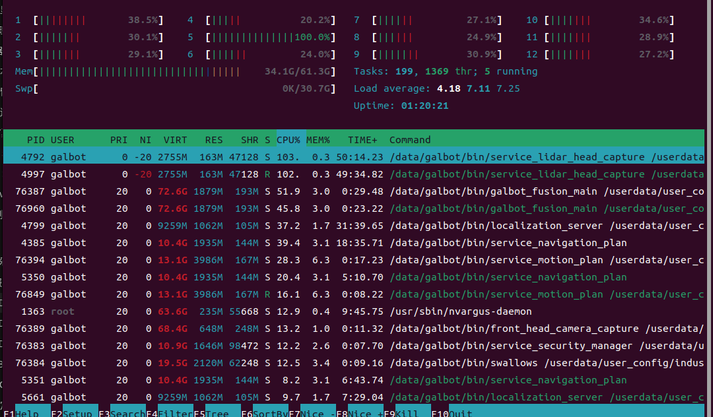

# 检查S1机器人系统状态

- 归档编号：`01a0b3a1-2fcf-7130-8c0d-bb6ddd82e163`
- 项目：S1 IE_lab 拆垛
- 创建时间：2026-09-18T16:28:00.335000+08:00
- 更新时间：2026-09-18T16:31:41.451000+08:00
- 状态：活动
- 导出范围：用户可见消息与助手可见回复；不含隐藏推理和工具原始输出

## 1. 用户

给我查一下现在S1机器人里面有没有什么问题，例如什么cpu gpu 占用过高啥的？

## 2. 助手（进展）

我会使用 galbot-s1-ssh 技能连接 S1，做只读检查，查看 CPU、GPU、内存、温度和服务异常，并对照你截图里的高占用进程。不会执行机器人运动或重启服务。

## 3. 助手（进展）

初步检查显示内存和磁盘空间都充足，系统没有整体满载。不过发现一个失败的时间戳服务，以及几分钟前的 USB 相机报错。我正在连续采样 CPU/GPU，并确认这些异常是否仍在发生。

## 4. 助手（进展）

30 秒采样中，CPU 整体平均占用约 46%，但头部雷达采集进程持续占满一个核；GPU 平均约 50%，短时达到 99%。同时有一个 FDP 计算容器在运行，因此这次测到的是后台计算与机器人服务并行时的负载。暂未看到内存不足或过热降频的证据。

## 5. 助手

查过了，**目前没有整机资源耗尽的迹象，但头部雷达持续满一个 CPU 核，另外发现相机断连记录和一个失败服务。**

这是今天 **16:29–16:30** 真机只读检查结果：

| 项目 | 实测结果 | 判断 |
|---|---|---|
| CPU 整体 | 平均 **46%**，短时最高约 **79%** | 有余量 |
| GPU | 平均 **50%**，瞬时最高 **99%** | 有高峰，未持续满载 |
| 内存 | 约 **27.7–35.8 / 61.3 GiB**，Swap 为 0 | 暂无不足迹象 |
| 温度 | CPU 约 **68–70°C**，GPU 约 **62–68°C** | 未见过热降频告警 |
| 磁盘 | 使用 **25%**，剩余约 **1.3 TB** | 空间充足 |

值得关注的有三处：

1. **头部雷达采集线程持续满核。**
   `service_lidar_head_capture` 的线程 **4997** 持续约 **100%**。你截图里的 **4792 是所属进程，4997 是它的线程，不能把两行加起来算成两个核**。这是否属于正常轮询，还需要查实现或雷达帧率，暂不能判定故障。

2. **两台 RealSense 相机几分钟前发生过 USB 断连、重连和报错。**
   集中在 **16:25–16:26**；**16:27 后未见新增内核警告**。可能与当时重启有关，但这次没有读取画面，尚不能保证相机出图正常。

3. **`pps_ts2spe.service` 启动失败。**
   原因是 **`/dev/pps0` 不存在**。是否影响这台 S1 的时间同步，需要对照实际配置确认。

另外，检查时有 **FDP 计算容器**在运行，限制为 6 核 CPU、8 GiB 内存，会叠加计算负载；GPU 峰值尚未做进程归因。

全程未修改服务或执行运动，检查连接已退出。[完整记录](../../assets/4e882c309e166db9--README.md)。

[附件：4e882c309e166db9--README.md](../../assets/4e882c309e166db9--README.md)
