# 周报 规划9_21周报实验内容

- 归档编号：`01a0b378-b6f2-7fe2-8f38-ea48aed2b19c`
- 项目：S1 IE_lab 拆垛
- 创建时间：2026-09-20T18:54:01.958000+08:00
- 更新时间：2026-09-21T10:17:54.126000+08:00
- 状态：活动
- 导出范围：用户可见消息与助手可见回复；不含隐藏推理和工具原始输出

## 1. 用户

”9\_12 周报 规划S1拆垛周报版本演进“在这个的基础上，我们继续，关于这周的在 9\_21 的周报  我大概能有啥可以说的？ 1.消融实验  2. 标定板对比  看看有啥思路？

## 2. 助手（进展）

我先查一下“9_12 周报 规划S1拆垛周报版本演进”的上下文和项目记录，再把消融实验、标定板对比整理成 9_21 周报可以展开的思路。

## 3. 助手（进展）

已经有一条很清楚的汇报主线：上周讲版本演进，这周讲“哪些模块值得保留、提速后能覆盖多少场景、与标定板参考差多少”。最新 13 帧报告还揭示了一个关键结果：ROI 快路径接近 1 秒，但新数据上的拒绝较多，回退后整体速度收益明显减弱，这很值得讲。

## 4. 助手

可以，而且这周已经有足够的数据支撑。接着“9_12 周报 规划S1拆垛周报版本演进”，我建议 9_21 的主题定为：

**S1 拆垛位姿估计：初值消融、加速验证与标定板参考评估。**

上周讲清了算法怎么演进到 V5；这周可以进一步回答：**哪些模块有用、能提速多少、在新场景中能否稳定输出。**

**1. 消融实验：讲清“速度与可用性怎么取舍”**

先用 D01–D12 的初值来源消融作为铺垫。B 是箱口初值，C 是多平面侧壁初值，M 是 mesh 粗初值：

| 配置 | 接受帧数 | 算法耗时中位数 |
|---|---:|---:|
| 完整 B+C+M | 10/12 | 16.45 s |
| 去掉 B，保留 C+M | 8/12 | 11.28 s |
| 去掉 C，保留 B+M | 10/12 | 11.58 s |
| 仅保留 M | 6/12 | 6.01 s |

这张表可以提炼成两句话：

- **本批数据中，去掉 C 可减少约 30% 耗时，并保留基线接受状态；但还不能据此认定 C 在所有场景都可删除。**
- **直接删掉几何初值会损失覆盖率，而且仅 M 仍未达到 1 秒目标。**

随后引出 ROI 初始化：利用已有 ROI 粗位姿减少搜索。旧 D01–D12 上，R1 快路径中位数约 **0.86 s**；失败后回退完整算法的 R1F，达到 **10/12 接受、中位数约 0.95 s**。

这就形成完整的研究过程：**消融定位开销 → ROI 替代复杂初始化 → 门禁与回退保留困难帧处理能力。**
依据：[初值消融报告](../../assets/447b158328ce02e5--REPORT.md)、[ROI 实验记录](../../assets/3a7368e43d7046a8--s1_v5_r_roi_initialization_plan_20260916.md)。

**2. 标定板对比：这周最值得重点讲的是“新数据暴露了什么”**

已经完成 **13 帧、raw/LingBot 两种深度、每条件 5 次重复**的对比，其中 **11 帧有可用板参考**。

挑几项主要结果就够了：

| 方法与深度 | 接受运行数／65 次 | 接受且有板参考的不同帧数 | 相对板中心差中位数 |
|---|---:|---:|---:|
| FDP raw | 65/65 | 11 | 10.40 mm |
| FDP LingBot | 65/65 | 11 | 11.81 mm |
| 原 V5 LingBot | 20/65 | 3 | 7.35 mm |
| R1 LingBot | 15/65 | 3 | 5.85 mm |
| R1F LingBot | 20/65 | 3 | 5.85 mm |

**这里不能拿 5.85 mm 和 10.40 mm 直接宣布 R1 精度更高**，因为接受样本集合不同。更有价值的结论是：

- FDP 在这批数据上输出覆盖更完整；LingBot 并没有使 FDP 的板参考中心差整体变小。
- V5/R1 在部分接受帧上与板参考较接近，但大量场景仍被质量门禁拒绝。
- **新数据中 R1 LingBot 仍约 0.97 s，但 R1F 因频繁回退升至约 22.19 s，原 V5 约 21.41 s。**因此，旧数据上的“回退方案接近 1 秒”尚未在新数据上复现。

这其实是本周很有分量的发现：**快路径速度已经验证，当前限制整体效果的是快路径覆盖率。**
依据：[13 帧完整报告](../../assets/238cf378a9b74b75--REPORT.md)。

板参考还应交代一句：实测高度关系已修正，但水平安装关系仍有名义假设，所以目前称“相对板参考偏差”更准确。

**3. 加一页失败分析，让下一步计划有依据**

建议选两个代表案例：

- **明显方向错误的案例**：例如旧数据 D08，仅 M 与 FDP 的 yaw 差约 73°，展示初值对收敛的影响。
- **候选接近参考、但仍被拒绝的案例**：例如新数据 R03，R1 LingBot 诊断候选中心差约 6.02 mm，但仍触发歧义和截边门禁。

第二个案例特别适合解释：**“有一个看起来不错的候选”和“算法能可靠地确认并输出它”是两回事。**下一步应检查拒绝原因是否合理，并区分模型不匹配、观测不足和门限敏感，而不是直接放宽门限。

**我建议最后做成 4 页：**

| 页码 | 内容 | 希望经理记住的结论 |
|---|---|---|
| 1 | 承接上周计划＋初值消融 | 已明确初值模块的速度与覆盖率贡献 |
| 2 | ROI 快路径及两批数据表现 | 单帧计算接近 1 秒，整体收益依赖快路径覆盖率 |
| 3 | 标定板参考、误差与接受率 | 已建立外部参考评价，当前覆盖不足得到量化 |
| 4 | 两个失败案例＋下一步 | 优先解决拒绝原因、参考安装误差和困难场景 |

另外，**同一冻结帧重复推理 5 次，不能替代上周计划中的“连续采集重复帧，测中心/yaw 抖动”**。这一项可以明确列为待补。

汇报开场可以直接这样说：

> 本周围绕上周提出的运行速度和独立参考评价开展实验。通过初值消融和 ROI 初始化，将快路径计算时间压到约 1 秒；同时完成 13 帧标定板参考对比，发现新场景下快路径接受率不足，频繁回退限制了整体提速。下一步重点是核实参考关系、分析拒绝原因，并提高困难场景的有效输出比例。

[附件：447b158328ce02e5--REPORT.md](../../assets/447b158328ce02e5--REPORT.md)

[附件：3a7368e43d7046a8--s1_v5_r_roi_initialization_plan_20260916.md](../../assets/3a7368e43d7046a8--s1_v5_r_roi_initialization_plan_20260916.md)

[附件：238cf378a9b74b75--REPORT.md](../../assets/238cf378a9b74b75--REPORT.md)

## 5. 用户

给我生成一版PDF报告

## 6. 助手（进展）

我会按项目已有的周报样式，把“消融实验＋ROI加速＋标定板对比＋下一步计划”整理成一份新的 9 月 21 日 PDF，并完成渲染检查。这里使用 PDF 技能，是因为这次需要生成并核验可交付的 PDF 文件。

## 7. 用户

最好使用一些图来分析数据

## 8. 助手（进展）

我已经把报告设计成图表化版本：消融页有各配置耗时柱状图，标定板页有各方法中心差横向对比图，并配合接受率、回退率和样本数表格。现在生成 PDF 并检查每页渲染效果。

## 9. 助手

_工具输出图片（原始工具文本未纳入归档）。_

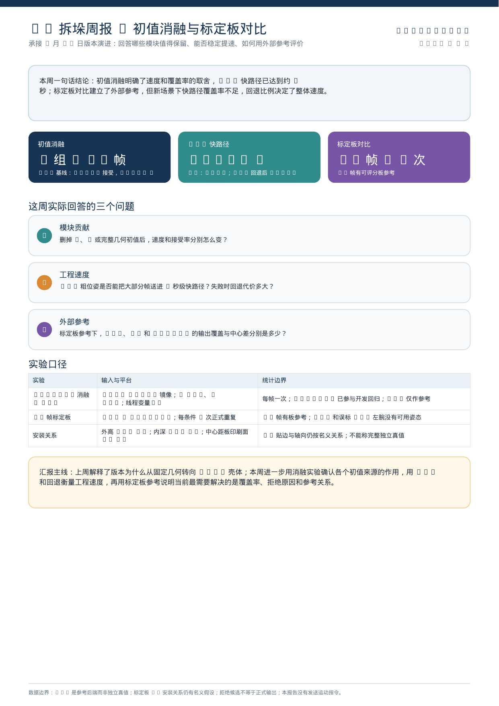

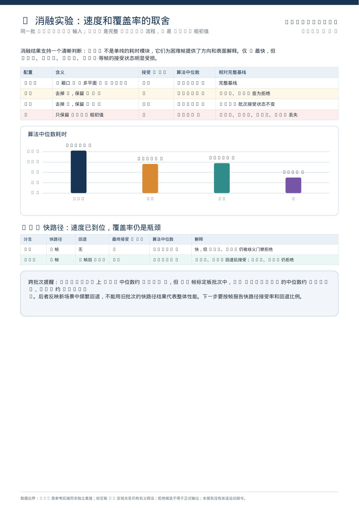

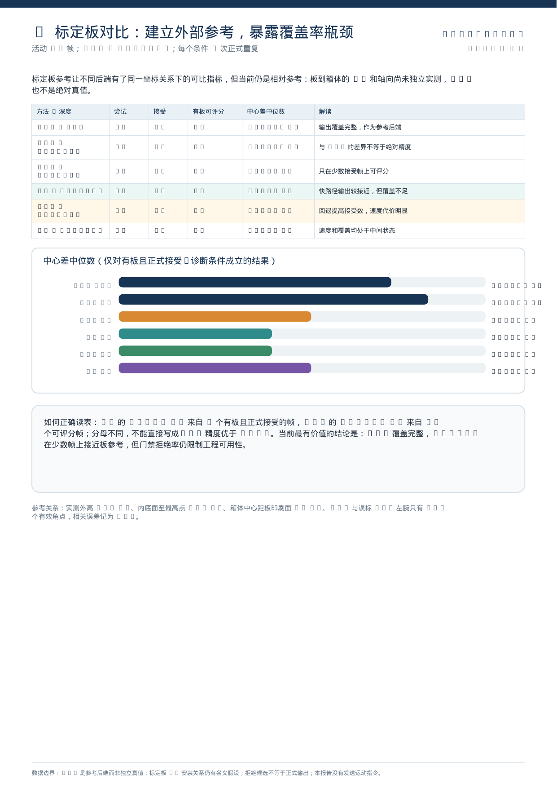

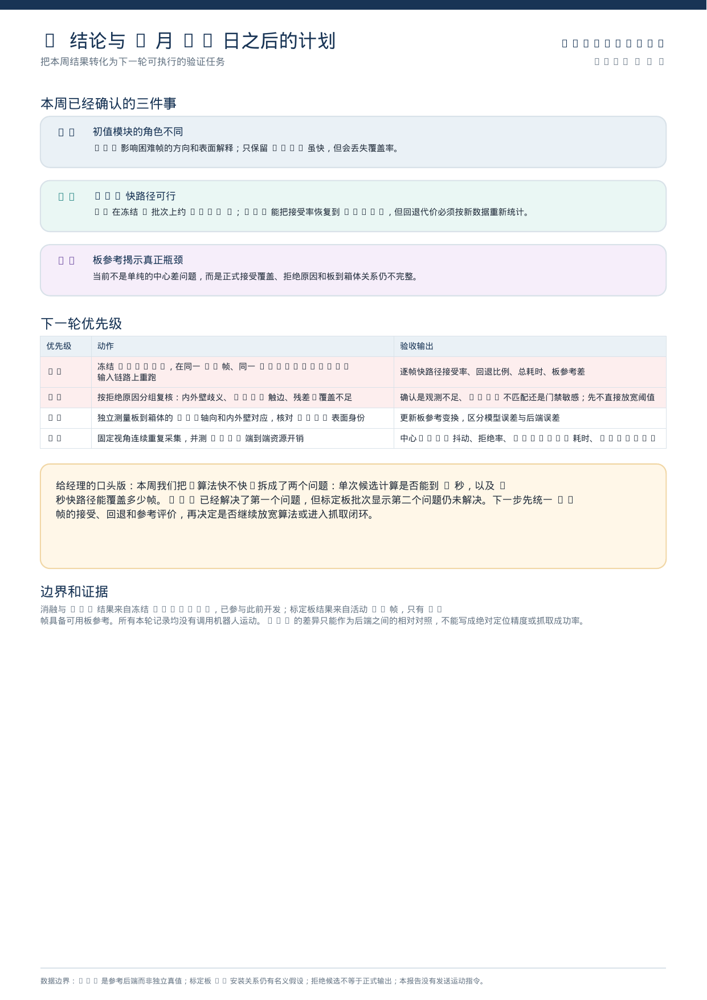

## 10. 助手（进展）

渲染检查发现字体对中文正常，但数字、英文和符号在部分位置出现方框。我会把报告字体改成中英文混排字体方案，再重新渲染；图表结构和数据内容保持不变。

## 11. 助手

_工具输出图片（原始工具文本未纳入归档）。_

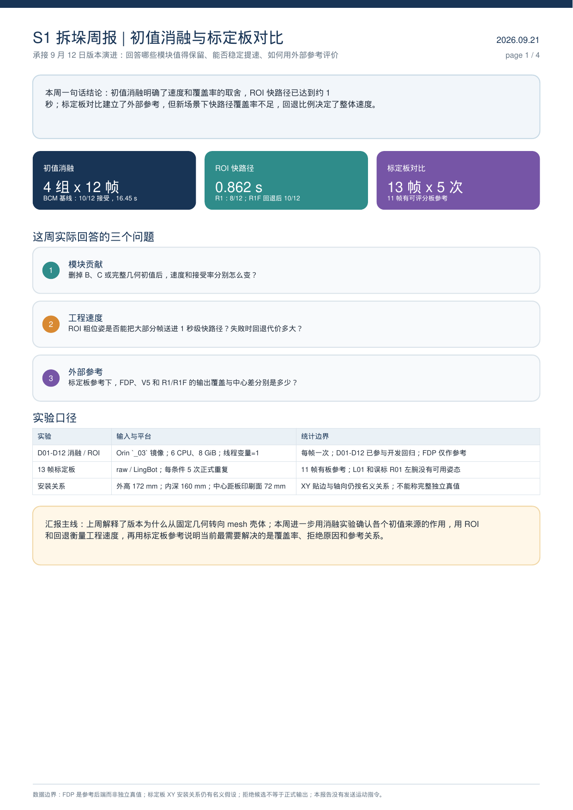

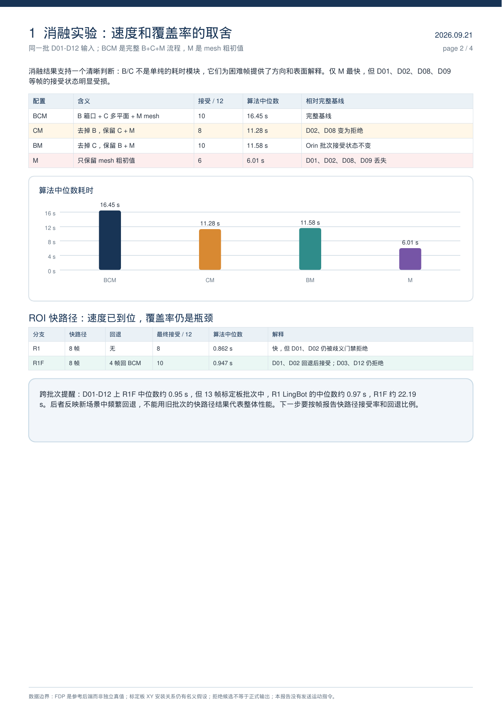

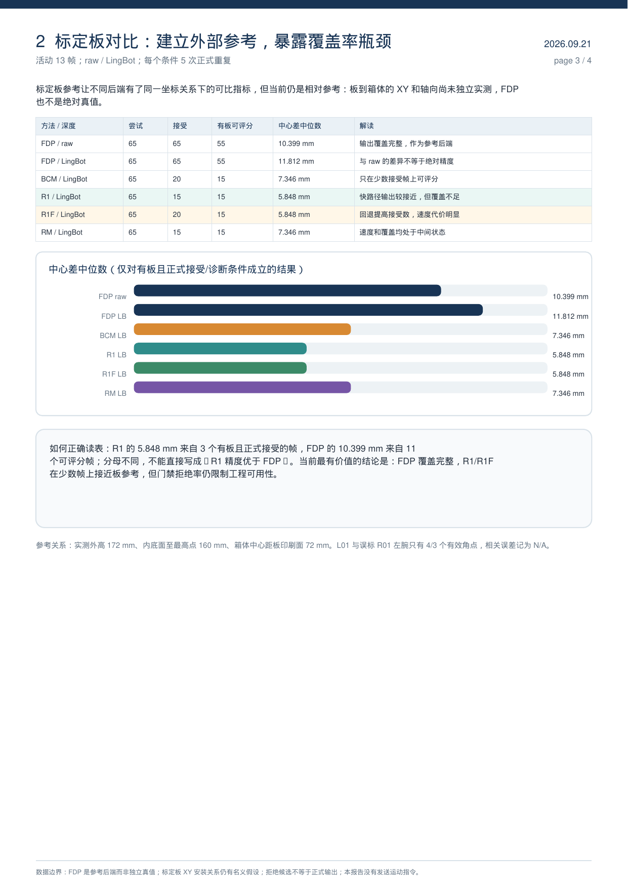

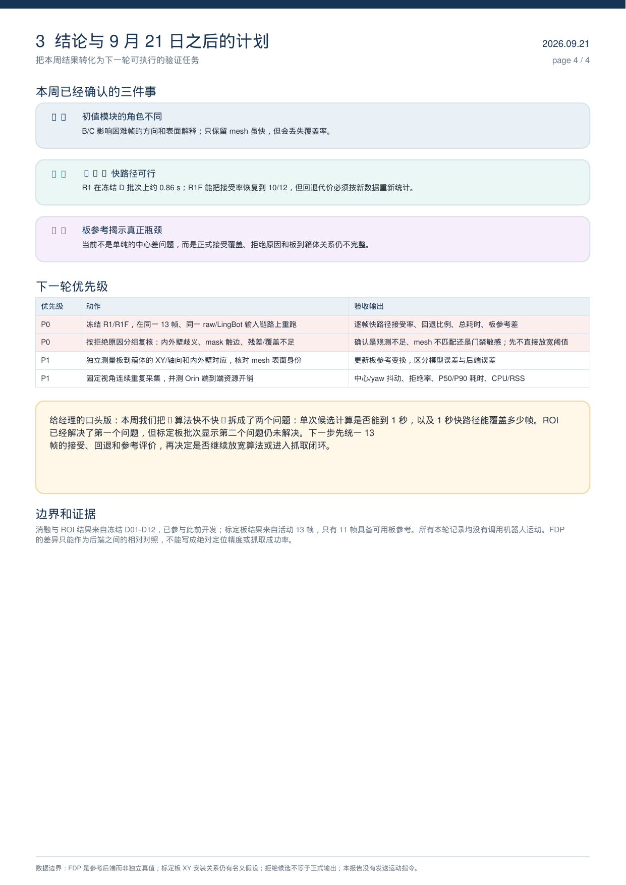

## 12. 助手

_工具输出图片（原始工具文本未纳入归档）。_

## 13. 助手

已生成 4 页 PDF 报告，包含消融实验耗时柱状图、标定板中心差对比图、ROI 回退分析和下一步计划：

 :codex-file-citation{path="/home/lsy03/文档/ChatGPT/S1/output/pdf/S1_拆垛周报_2026-09-21.pdf" purpose="output"}

同时保留了 Markdown 源文件和生成脚本，已完成 PDF 渲染检查，未执行机器人运动。

- :codex-followup[增加接受率图]{prompt="在标定板页面增加各方法接受率和回退率的并列柱状图。"}
- :codex-followup[压缩成两页]{prompt="把当前报告压缩成两页经理汇报版，保留核心图表和结论。"}
- :codex-followup[生成下一轮实验方案]{prompt="根据报告中的 P0 计划，生成 13 帧 R1/R1F 重跑实验方案和结果记录模板。"}

[附件：8c6fefdab2995219--S1_拆垛周报_2026-09-21.pdf](../../assets/8c6fefdab2995219--S1_%E6%8B%86%E5%9E%9B%E5%91%A8%E6%8A%A5_2026-09-21.pdf)

## 14. 用户

我想了一下，报告要不结构改一下：

1. 包括“”
   | 配置接受帧数算法耗时中位数 |       |              |   |
   | ------------- | ----- | ------------ | - |
   | 完整 B+C+M      | 10/12 | 16.45 s      |   |
   | 去掉 B，保留 C+M   | 8/12  | 11.28 s      |   |
   | 去掉 C，保留 B+M   | 10/12 | 11.58 s      |   |
   | 仅保留 M         | 6/12  | 6.01 s“”  |   |

2.包括

| 组接受算法中位数          |       |             |   |
| ----------------- | ----- | ----------- | - |
| BCM               | 10/12 | 16.234 s    |   |
| M                 | 6/12  | 6.051 s     |   |
| R1                | 8/12  | 0.862 s     |   |
| R9                | 8/12  | 3.133 s     |   |
| RM                | 8/12  | 5.608 s     |   |
| R1F：R1 失败后 BCM 回退 | 10/12 | **0.947 s** |   |

3. 包括标定板 定位    最好有些 定位对比图像

包括数据分析“”“”

已经把拒绝运行也加入分析。规则是：

- FDP 使用 raw；
- 其他算法使用 LingBot；
- 每帧 5 次正式重复取中位数；
- accepted 使用正式位姿；
- rejected 没有正式输出，下面的 Δx/Δy/Δz/yaw 使用门禁前保存的诊断候选，仅用于分析。

坐标差均为 `算法中心 − 标定板计算出的箱体中心`，单位 mm；yaw 已处理 180°箱体对称。

| 方法接受/拒绝运行接受帧/拒绝帧全部运行耗时中位数接受运行耗时拒绝运行耗时 |       |      |          |          |          |
| ------------------------------------- | ----- | ---- | -------- | -------- | -------- |
| FDP raw                               | 65/0  | 13/0 | 1.274 s  | 1.276 s  | —        |
| V5-original LingBot                   | 20/45 | 4/9  | 21.406 s | 16.913 s | 22.421 s |
| BCM LingBot                           | 20/45 | 4/9  | 21.193 s | 16.733 s | 22.258 s |
| R1 LingBot                            | 15/50 | 3/10 | 0.966 s  | 0.884 s  | 1.036 s  |
| RM LingBot                            | 15/50 | 3/10 | 5.293 s  | 5.572 s  | 5.164 s  |
| R1F LingBot                           | 20/45 | 4/9  | 22.186 s | 0.940 s  | 22.942 s |

V5 的时间是 S1 Docker 后端时间；FDP 的时间是 S1 宿主完整客户端时间，包含请求和结果归一化。

| 方法位姿来源可评分帧Δx 中位数Δy 中位数Δz 中位数yaw 中位数中心距离中位数 |             |    |        |        |         |        |           |
| ------------------------------------------ | ----------- | -- | ------ | ------ | ------- | ------ | --------- |
| FDP raw                                    | 正式位姿        | 11 | 3.415  | 0.145  | -8.847  | 0.872° | 10.399 mm |
| V5-original LingBot                        | 正式 accepted | 3  | -5.512 | -3.439 | -2.044  | 0.414° | 7.346 mm  |
| V5-original LingBot                        | 拒绝候选        | 8  | 3.815  | -4.023 | -14.363 | 0.712° | 15.677 mm |
| BCM LingBot                                | 正式 accepted | 3  | -5.512 | -3.439 | -2.044  | 0.414° | 7.346 mm  |
| BCM LingBot                                | 拒绝候选        | 8  | 3.815  | -4.023 | -14.363 | 0.712° | 15.677 mm |
| R1 LingBot                                 | 正式 accepted | 3  | -4.873 | -1.321 | -1.856  | 0.348° | 5.848 mm  |
| R1 LingBot                                 | 拒绝候选        | 8  | 4.624  | -3.462 | -14.507 | 0.515° | 16.120 mm |
| RM LingBot                                 | 正式 accepted | 3  | -5.512 | -3.439 | -2.044  | 0.348° | 7.346 mm  |
| RM LingBot                                 | 拒绝候选        | 8  | 3.815  | -4.023 | -14.363 | 0.649° | 15.677 mm |
| R1F LingBot                                | 正式 accepted | 3  | -4.873 | -1.321 | -1.856  | 0.348° | 5.848 mm  |
| R1F LingBot                                | 拒绝候选        | 8  | 3.815  | -4.023 | -14.363 | 0.712° | 15.677 mm |

结论如下：

1. FDP raw 最稳定，13 帧全部接受，耗时约 1.27 s。但它的中心误差中位数是 10.4 mm。
2. R1 速度最快，后端约 0.97 s，但只接受 3/13 帧。它接受后的误差较小，不过有效样本只有 3 帧，不能据此认定 R1 整体精度高于 FDP。
3. 拒绝候选普遍表现出明显的负向高度偏差：
   - V5/BCM/RM/R1F：Δz 中位数约 **-14.4 mm**；
   - R1：Δz 中位数约 **-14.5 mm**；
   - 中心距离约 **15.7～16.1 mm**。
   这比模型 175 mm 与实测 172 mm 带来的约 1.5 mm 中心高度差大得多，因此拒绝候选的主要问题更可能与深度、mask、内外表面判断或拟合过程有关，不能只归因于 mesh 高度差。
4. 拒绝并不代表候选一定完全错误。例如：
   - R03 的 R1 拒绝候选中心差约 **6.0 mm**；
   - R04\_00 的 V5/BCM/RM 拒绝候选中心差约 **8.6 mm**。
   它们仍因 `mask_touches_image_border`、`ambiguous_inner_outer_surface_hypotheses` 或 `visible_shell_residual_or_coverage_too_low` 被拒绝。这说明当前门禁同时在检查可见性和内外表面一致性，存在“候选位置接近，但质量条件不满足”的情况。
5. V5-original 与 BCM 的正式结果仍完全一致。BCM 只是包装审计对照，并没有改变后端计算结果。
6. R1F 在 LingBot 下 50/65 次触发回退，最终只有 5 次正式运行因回退得到 accepted；这些成功回退都来自没有标定板参考的 L01，因此无法用标定板验证其误差。R1F 的整体耗时因此接近 BCM。

完整 78 行逐帧数据和所有拒绝候选：

- [含拒绝候选的逐帧报告](../../assets/58508a7e090c061b--REPORT_FDP_RAW_VS_LINGBOT_WITH_REJECTED.md)
- [逐帧 CSV](../../assets/0dbd76a57c2233b6--per_frame_with_rejected_candidates.csv)
- [完整 JSON](../../assets/ca1a55361fe23ca8--comparison.json)

“”“”“

4. FDP orin docker优化速度

你先看看这个结构如何？ 先别生成报告

[附件：58508a7e090c061b--REPORT_FDP_RAW_VS_LINGBOT_WITH_REJECTED.md](../../assets/58508a7e090c061b--REPORT_FDP_RAW_VS_LINGBOT_WITH_REJECTED.md)

[附件：0dbd76a57c2233b6--per_frame_with_rejected_candidates.csv](../../assets/0dbd76a57c2233b6--per_frame_with_rejected_candidates.csv)

[附件：ca1a55361fe23ca8--comparison.json](../../assets/ca1a55361fe23ca8--comparison.json)

## 15. 助手

这个结构合适，主线比上一版更连贯：**初值消融 → ROI 初始化提速 → 标定板评价定位质量 → FDP 在 Orin 上的速度优化。** 前三部分也能自然解释为什么第四部分要继续研究 FDP 的端侧部署。

建议保留四部分，做以下调整。

**1. B/C/M 初值来源消融：哪些模块值得保留**

用你给的第一张表，回答两个问题：删除模块能省多少时间，又损失多少接受帧。

配一组左右并列图：左边算法耗时，右边接受帧数。这样能直接看到：去 C 本批保留 10/12 接受、耗时下降约 30%；仅 M 降到约 6 秒，但接受数下降到 6/12。

结论限定为“本批 Orin 结果”，保留本机 D05 曾跨门限的说明，避免把去 C 写成已经验证可直接删除。

**2. ROI 初始化及回退：能否进一步达到 1 秒级**

完整保留 BCM、M、R1、R9、RM、R1F 六组。先用一句话解释每组，读者才容易理解数字：

| 组 | 含义 |
|---|---|
| BCM | 原完整初值流程 |
| M | 仅 mesh 粗初值 |
| R1 | 单个 ROI 粗位姿初值 |
| R9 | ROI 周围 9 个初值 |
| RM | ROI 与 mesh 初值组合 |
| R1F | R1 被质量门禁拒绝后回退 BCM |

这里最值得讲的是：**增加到 R9、RM 后耗时上升，但本批接受数没有增加；R1F 恢复到 10/12 接受。**

需要同时展示 R1F 的逐帧耗时：中位数虽然只有 **0.947 s**，但 4 个回退帧约 **15–20 s**。只展示中位数，容易让人误以为所有帧都接近 1 秒。

另外，第一部分 BCM 为 16.451 s，第二部分为 16.234 s，是不同实验批次；明确标注即可，不必强行统一。

**3. 标定板定位对比：建议作为报告重点，占两到三页**

你给出的 accepted／rejected 分开分析很有价值，可以按以下顺序组织：

- **参考怎么建立**：一张实物标定板图，解释板位姿如何转换成箱体中心；注明实测高度关系和仍待核验的水平安装关系。
- **覆盖与耗时**：放接受／拒绝表，加接受率图、接受与拒绝耗时图。
- **定位偏差**：保留 Δx、Δy、Δz、yaw、中心距离表，用图突出拒绝候选的负向 Z 偏差。
- **典型图像**：选择一个正式接受案例、R03 和 R04_00。标定板参考、FDP、正式算法位姿、拒绝候选分别用固定颜色和线型表示；拒绝候选明确用虚线标注。

你列的六条结论基本都可以保留，但我建议修正三处表述：

1. “FDP raw 最稳定”改为 **“FDP raw 在本批 13 帧中输出覆盖最完整”**。同一冻结帧重复推理，尚不足以证明连续采集时的稳定性。
2. “中心误差”统一改为 **“相对标定板参考的中心偏差”**，因为板到箱体的水平安装关系还没有完整独立测量。
3. 负向 Z 偏差确实不能仅由 175/172 mm 高度差解释；但具体原因仍是**待验证假设**。深度、mask、表面对应、拟合，以及参考变换都应列入排查，暂时不确定主要归因。

还有一个统计口径必须在表下注清楚：**定位偏差按每帧 5 次取中位数后，再跨帧汇总；耗时表中“全部／接受／拒绝”各列是否采用相同聚合方式，需要逐列核对。** 否则 1.274 s 与 1.276 s 这类差异容易让读者困惑。

**4. FDP 在 Orin Docker 中的运行与提速探索**

这一节很好，它能回答：在几何方案覆盖不足的情况下，FDP 能否直接在机器人端承担定位任务。

最重要的是把两个计时边界分清：

| 对照 | 实际测量的内容 |
|---|---|
| 第三部分 FDP 约 1.27 s | S1 调用外部 FDP 服务的完整客户端时间 |
| 第四部分 Orin FDP | FDP 在 Orin 本地 Docker 中运行的时间 |

不能把约 1.27 s 当成 FDP 在 Orin 本地的推理速度。第四部分适合用**优化前后耗时图＋阶段耗时分解图**，同时列出候选数量、预热条件和输出是否变化。ROI 局部候选搜索若提速但选错位姿，也应作为失败实验保留。

整个报告建议安排 **6–7 页**：消融 1 页、ROI 1 页、标定板 2–3 页、FDP Orin 优化 1 页、结论与下一步 1 页。这样能完整容纳你希望保留的数据和定位图像，也能把最终判断讲清楚：**快路径具备速度优势，但覆盖率不足；FDP 输出覆盖更完整，端侧计算成本仍需优化。**

先按这个结构讨论，不生成或修改报告。

## 16. 用户

1. B/C/M 初值来源消融：哪些模块值得保留

中

B/C/M  算法也需要简单说明 代表了啥，

3.标定板定位对比

不需要太多的内容，一页最多了

4. &#x20;lingbot 条件下&#x20;

原始 Orin 、v9 exact 、v9 fast 的时间和 “中心差 min/median/max (mm)Δroll min/median/max (°)Δpitch min/median/max (°)Δyaw min/median/max (°)”的对比

修改一下以上三点， 其他的不用改啥，你还有什么要问我的吗，如果没有的话，生生成报告

## 17. 用户

1. B/C/M 初值来源消融：哪些模块值得保留

中

B/C/M  算法也需要简单说明 代表了啥，

3.标定板定位对比

不需要太多的内容，一页最多了

4. &#x20;lingbot 条件下&#x20;

原始 Orin 、v9 exact 、v9 fast 的时间和 “中心差 min/median/max (mm)Δroll min/median/max (°)Δpitch min/median/max (°)Δyaw min/median/max (°)”的对比

修改一下以上三点， 其他的不用改啥，你还有什么要问我的吗，如果没有的话，生成报告

## 18. 助手（进展）

没有需要补充确认的地方。我会简单说明 B/C/M 的含义，把标定板对比压到一页，并将第四部分改成 LingBot 条件下原始 Orin、v9 exact、v9 fast 的耗时及位姿差对比。先核对这三组的最新结果，再按 PDF 技能流程生成并检查报告。

## 19. 助手

_工具输出图片（原始工具文本未纳入归档）。_

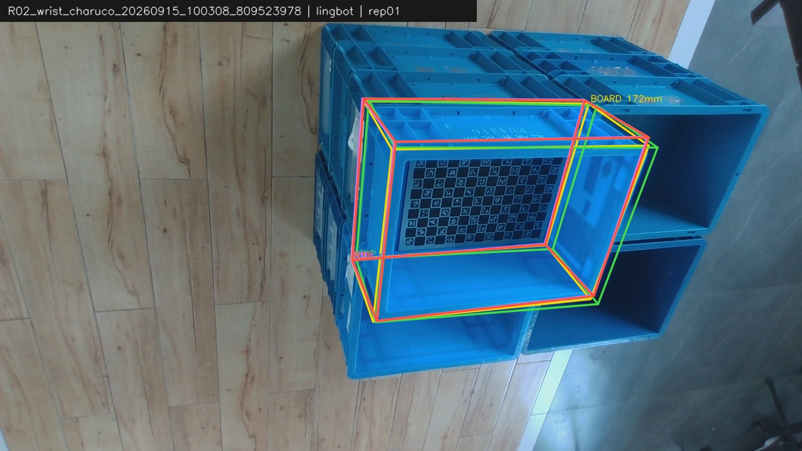

## 20. 助手（进展）

已核对最新的 13 帧 LingBot 数据：原始 Orin、v9 exact、v9 fast 的耗时中位数分别为 6.855、4.166、2.894 秒。exact 与原始 Orin 的位姿一致；fast 相对原始 Orin 的中心差中位数为 6.163 mm、最大为 18.616 mm。报告会注明：这组位姿差以原始 Orin 为基准，与标定板参考偏差是两种不同指标。

## 21. 用户

需要图表 表格和图片进行结合来说明

## 22. 助手（进展）

会结合三种形式来说明：表格保留精确数值，图表展示耗时、接受率和位姿差，标定板页放实际定位叠加图片。标定板部分仍控制在一页；ROI 部分另用逐帧耗时图展示回退成本。

## 23. 助手

_工具输出图片（原始工具文本未纳入归档）。_

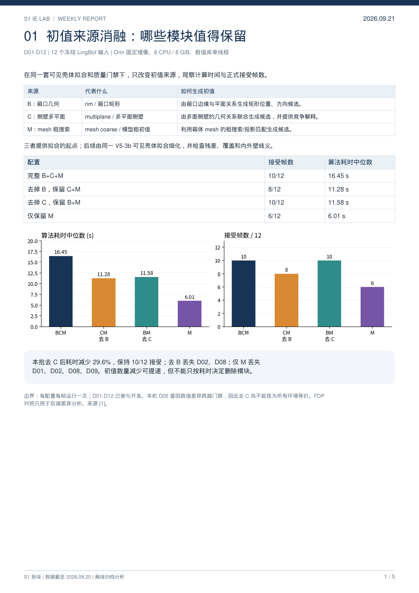

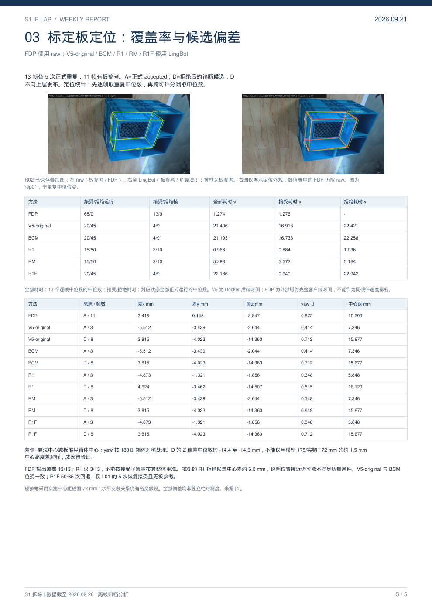

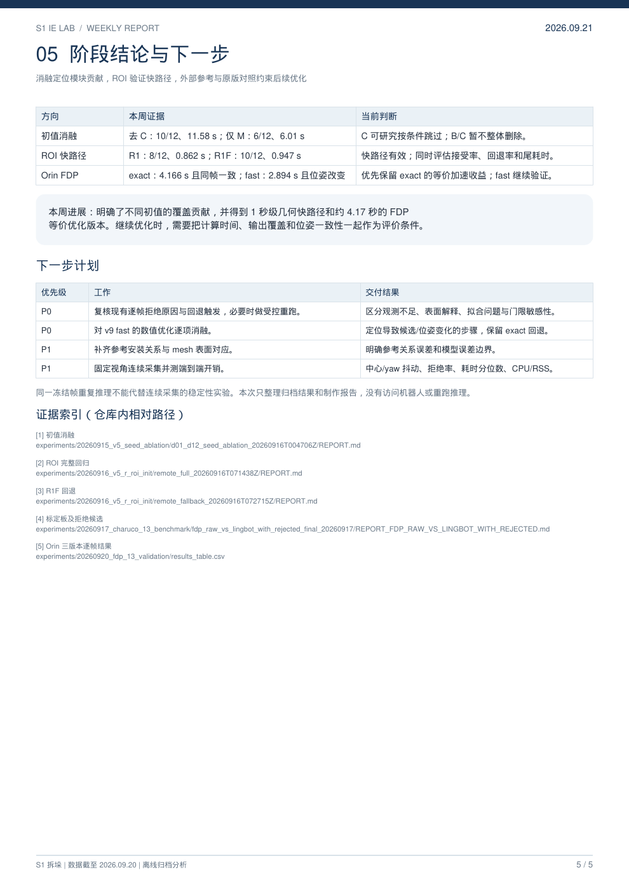

## 24. 助手

_工具输出图片（原始工具文本未纳入归档）。_

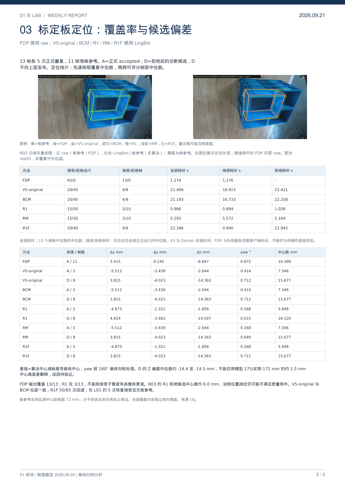

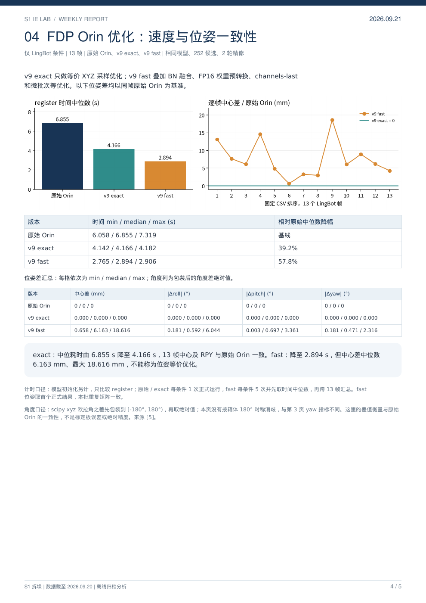

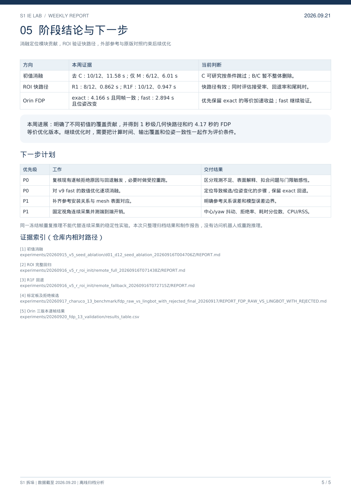

## 25. 助手（进展）

新版已排成 5 页，标定板对比严格控制在第 3 页，并配有两张实际定位叠加图。第四页已加入三版本耗时图、逐帧中心差图及 min/median/max 表；两页分别注明了参考基准和角度统计口径。正在做最后的文件检查。

## 26. 助手

已更新为 **5 页图文报告**，结合数据表、分析图和实际定位图片，并完成逐页检查。

包含 B/C/M 简介、完整 ROI 六组对比、**一页标定板分析**，以及 LingBot 条件下三版 Orin FDP 的耗时与位姿差统计。

:codex-file-citation{path="/home/lsy03/文档/ChatGPT/S1/output/pdf/S1_拆垛周报_2026-09-21.pdf" purpose="output"}

- :codex-followup[准备汇报讲稿]{prompt="根据这份 PDF，为我准备一份 5 分钟逐页汇报讲稿。"}
- :codex-followup[导出独立图表]{prompt="将新版报告中的分析图导出为适合放入 PPT 的高清图片。"}
- :codex-followup[准备问答要点]{prompt="根据这份报告，整理经理可能追问的问题和有数据依据的回答。"}

[附件：8c6fefdab2995219--S1_拆垛周报_2026-09-21.pdf](../../assets/8c6fefdab2995219--S1_%E6%8B%86%E5%9E%9B%E5%91%A8%E6%8A%A5_2026-09-21.pdf)

## 27. 用户

LingBot 条件下三版 Orin FDP 的耗时与位姿差统计&#x20;

这个我咋没看到？ 你是出幻觉了？

## 28. 助手（进展）

我先核对你拿到的 PDF 第 4 页，确认三版 Orin FDP 的统计是否确实写进文件，以及是否可能打开了旧版。

## 29. 助手

_工具输出图片（原始工具文本未纳入归档）。_

## 30. 助手

我刚重新读取并渲染了当前 PDF，**这部分确实在第 4 页，标题是“04 FDP Orin 优化：速度与位姿一致性”**，包含耗时图和中心差、roll/pitch/yaw 的 min/median/max 表。

但上次我沿用了旧版文件名，没有明确区分版本，这是我的疏忽。你可能看到的是之前的 **4 页旧版**；当前是 **5 页新版**。是否为预览缓存，我目前无法确认。

当前文件：:codex-file-citation{path="/home/lsy03/文档/ChatGPT/S1/output/pdf/S1_拆垛周报_2026-09-21.pdf" purpose="source"}

刚核对的第四页耗时中位数是：原始 Orin **6.855 s**、v9 exact **4.166 s**、v9 fast **2.894 s**。位姿差以原始 Orin 为基准，exact 全为零，fast 中心差为 **0.658 / 6.163 / 18.616 mm**。

[附件：8c6fefdab2995219--S1_拆垛周报_2026-09-21.pdf](../../assets/8c6fefdab2995219--S1_%E6%8B%86%E5%9E%9B%E5%91%A8%E6%8A%A5_2026-09-21.pdf)

## 31. 用户

第三页这一张耗时表给我换成柱状图 横座标是方法，纵座标是耗时和接受拒绝帧。

第三页 第二张差距表，给我画出柱状图
横座标是方法，纵座标是差距

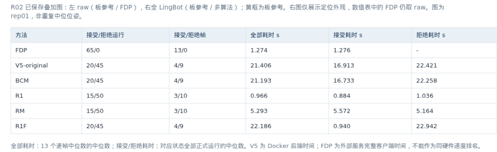

## 32. 助手（进展）

我会把第三页的两张表换成柱状图：第一组分别展示各方法的耗时和接受／拒绝帧数；第二组展示正式位姿与拒绝候选的定位差距，毫米偏差和 yaw 角度分开画。保留定位图片，并继续控制在一页内。

## 33. 助手

_工具输出图片（原始工具文本未纳入归档）。_

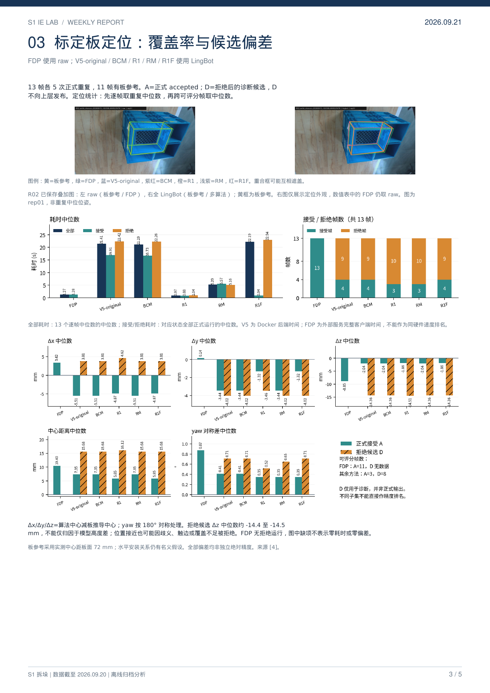

## 34. 助手

已改好第三页，两张表已替换为柱状图：

- 各方法耗时＋接受／拒绝帧数。
- 各方法 Δx、Δy、Δz、中心距离和 yaw 差，区分正式接受与拒绝候选。

保留定位图片，第三页仍为一页。新版使用独立文件名，避免与旧版混淆：

:codex-file-citation{path="/home/lsy03/文档/ChatGPT/S1/output/pdf/S1_拆垛周报_2026-09-21_第三页柱状图版.pdf" purpose="output"}

[附件：a1b4dfa2c704b995--S1_拆垛周报_2026-09-21_第三页柱状图版.pdf](../../assets/a1b4dfa2c704b995--S1_%E6%8B%86%E5%9E%9B%E5%91%A8%E6%8A%A5_2026-09-21_%E7%AC%AC%E4%B8%89%E9%A1%B5%E6%9F%B1%E7%8A%B6%E5%9B%BE%E7%89%88.pdf)

## 35. 用户

这三张图给我删掉算了，保留 中心距离中位数和yaw 对称差中位数算了

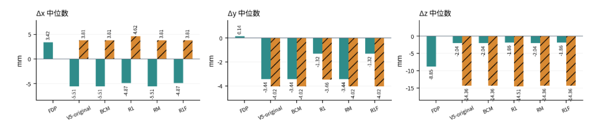

## 36. 助手（进展）

我会删掉 Δx、Δy、Δz 三张图，将中心距离中位数和 yaw 对称差中位数两张图并排放大，重新导出并检查 PDF。

## 37. 助手

_工具输出图片（原始工具文本未纳入归档）。_

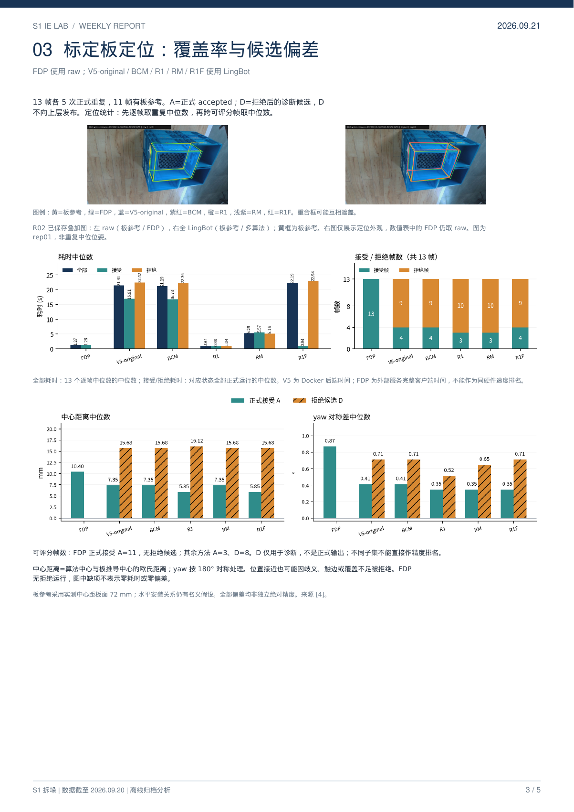

## 38. 助手

已删除 Δx、Δy、Δz 三张图，仅保留并放大“中心距离中位数”和“yaw 对称差中位数”，已检查第三页排版。

:codex-file-citation{path="/home/lsy03/文档/ChatGPT/S1/output/pdf/S1_拆垛周报_2026-09-21_中心距离与yaw版.pdf" purpose="output"}

[附件：e12d5818f10a1a61--S1_拆垛周报_2026-09-21_中心距离与yaw版.pdf](../../assets/e12d5818f10a1a61--S1_%E6%8B%86%E5%9E%9B%E5%91%A8%E6%8A%A5_2026-09-21_%E4%B8%AD%E5%BF%83%E8%B7%9D%E7%A6%BB%E4%B8%8Eyaw%E7%89%88.pdf)

## 39. 用户

里面好几个表格没有边框，你看怎么加上

## 40. 助手（进展）

我会把报告中的表格统一加上清晰的外框和内部网格线，增强表头分隔和行列边界，再导出一个带版本后缀的新 PDF，避免覆盖你之前打开的文件。

## 41. 助手

_工具输出图片（原始工具文本未纳入归档）。_

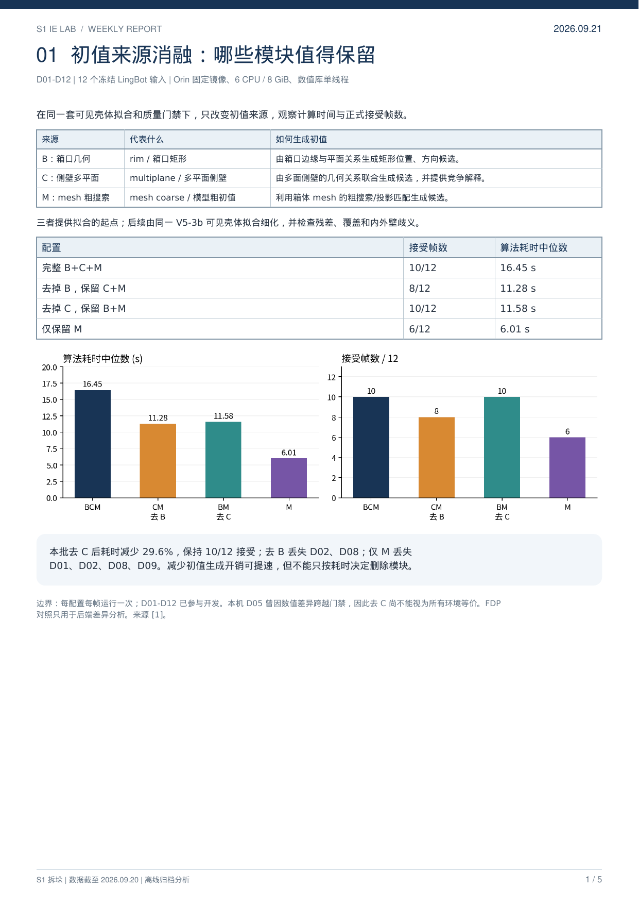

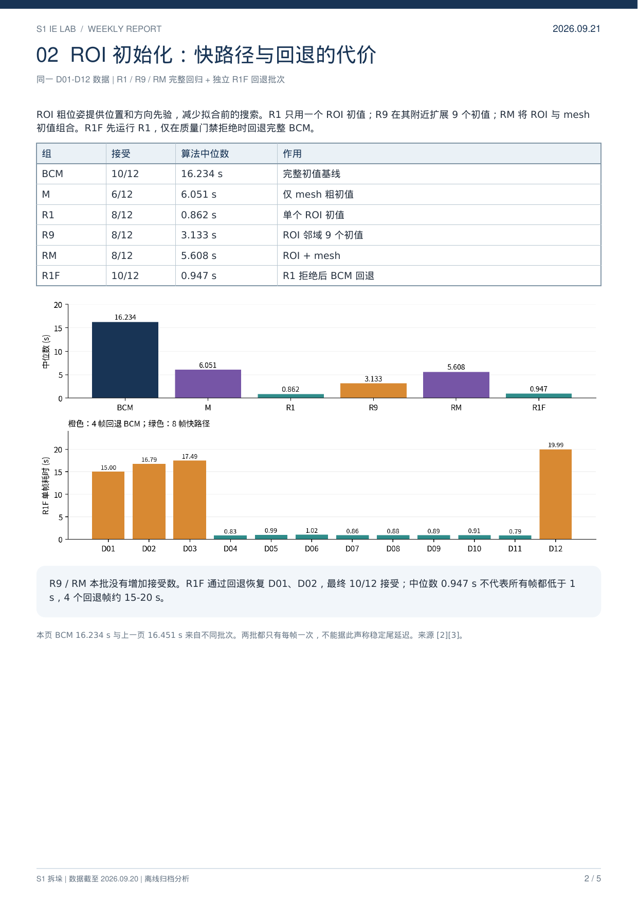

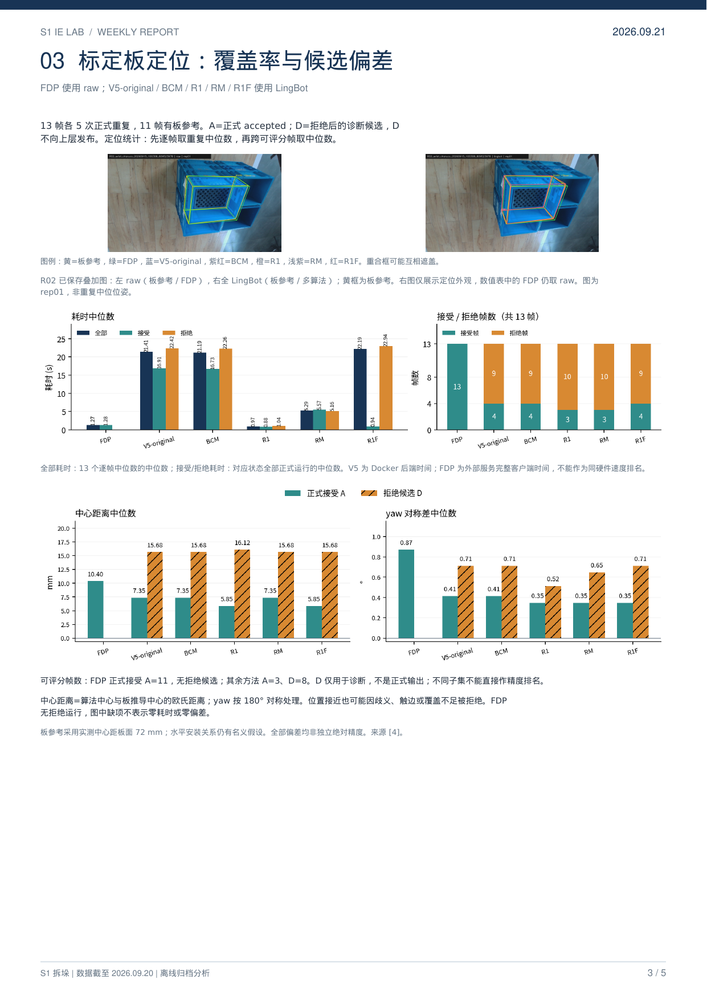

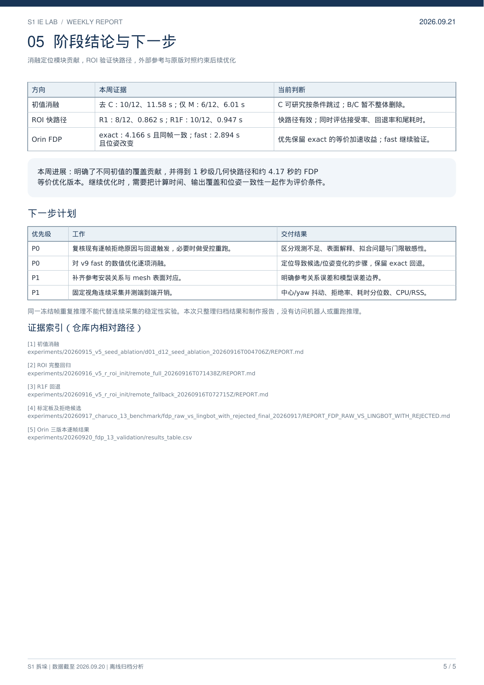

## 42. 助手

已统一为所有表格添加清晰的外框、内部网格线和表头分隔线，并重新检查了 5 页 PDF 的排版。

:codex-file-citation{path="/home/lsy03/文档/ChatGPT/S1/output/pdf/S1_拆垛周报_2026-09-21_中心距离与yaw版_表格加边框.pdf" purpose="output"}

- :codex-followup[调整边框颜色]{prompt="把表格边框改成更深或更浅的颜色，分别生成两个版本供我选择。"}
- :codex-followup[增加表格行底色]{prompt="给关键行增加浅色底纹，例如 FDP、R1 和 R1F。"}
- :codex-followup[导出最终汇报版]{prompt="根据当前版本生成最终经理汇报版，并统一文件名。"}

[附件：51e6a8829286e828--S1_拆垛周报_2026-09-21_中心距离与yaw版_表格加边框.pdf](../../assets/51e6a8829286e828--S1_%E6%8B%86%E5%9E%9B%E5%91%A8%E6%8A%A5_2026-09-21_%E4%B8%AD%E5%BF%83%E8%B7%9D%E7%A6%BB%E4%B8%8Eyaw%E7%89%88_%E8%A1%A8%E6%A0%BC%E5%8A%A0%E8%BE%B9%E6%A1%86.pdf)
