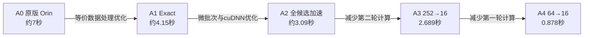
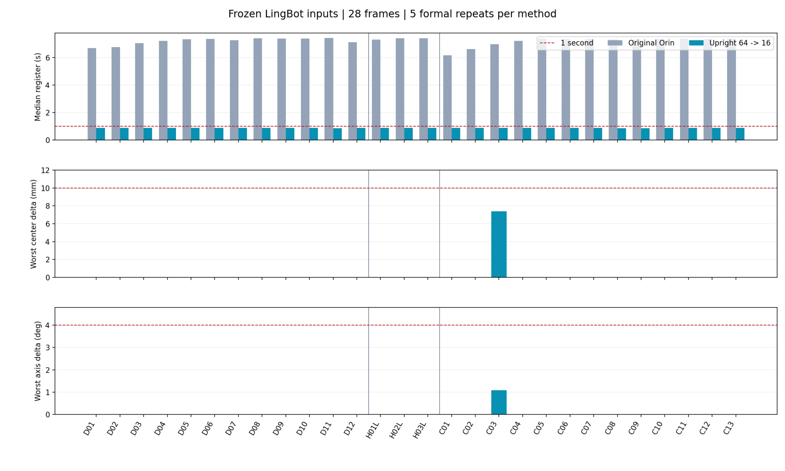
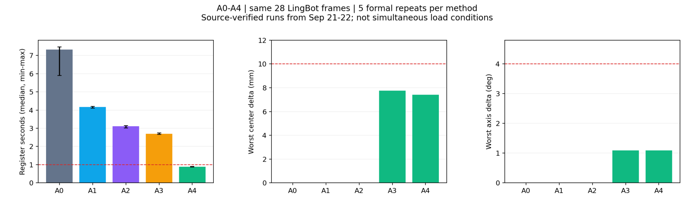

# 9_21 9_20 9_18 评估S1中的FDP部署 (4)

- 归档编号：`01a0c187-680b-7ae3-a679-749fa82119d9`
- 项目：S1 IE_lab 拆垛
- 创建时间：2026-09-21T09:39:00.741000+08:00
- 更新时间：2026-09-22T10:05:19.559000+08:00
- 状态：活动
- 导出范围：用户可见消息与助手可见回复；不含隐藏推理和工具原始输出

## 1. 用户

我们在“9\_20 9\_18 评估S1中的FDP部署 (3)”的基础上，我们继续，看看如何继续优化FDP的时间和精度，希望时间越短越好，尽量接近1S，然后精度不要丢失太多，不要超过1cm的差距，看看你有没有什么想法

## 2. 助手（进展）

我先查看上一任务的结论和仓库里的评估记录，确认 FDP 当前耗时、精度基线及瓶颈，再判断哪些优化最有希望接近 1 秒、同时把精度差距控制在 1 cm 内。

## 3. 助手（进展）

已有结果说明了一个关键问题：v9 exact 在 26 个条件下保持了原始位姿，约 4.17 秒；v9 fast 虽降到约 2.9 秒，但 LingBot 分支最大中心差也有 18.6 mm，超过你的要求。我会以 exact 为起点，重点检查“分阶段筛选候选”和“拆开网络优化逐项验证”这两条路线。

## 4. 助手（进展）

我重新统计了逐帧数据：raw 和 LingBot 各有 3/13 帧超过 10 mm，所以不能用中位数达标代替逐帧验收。另外，之前 54 候选确实跑到约 1.05 秒，但位姿错误很大；下一步要解决的是“减少计算时怎样保住正确候选”，而不是简单继续减候选数。

## 5. 助手

有思路。**我建议从 v9 exact 出发，重点优化“哪些候选值得继续精修”，同时拆开 v9 fast 的优化项，找出精度变化来自哪里。接近 1 秒值得尝试，但现有结果还不能保证同时满足 1 cm。**

我重新核对了上一任务的完整数据：

| 深度条件 | 原始 Orin 中位耗时 | v9 exact 中位耗时 | v9 fast 中位耗时 | fast 最大中心差 | 超过 1 cm |
|---|---:|---:|---:|---:|---:|
| raw | 6.957 s | 4.169 s | 2.891 s | 128.74 mm | 3/13 帧 |
| LingBot | 6.855 s | 4.166 s | 2.894 s | 18.62 mm | 3/13 帧 |

**exact 在全部 26 个条件下与原始输出一致，是目前最可靠的优化起点。**这里的差距相对原始 Orin，不代表真实物体定位误差；时间仅为预热后的 FDP 注册，不含 LingBot、分割等前端。

**我最建议按以下顺序推进：**

1. **先找出 fast 为什么偏了，再保留合格的加速项。**
   上次同时开启了 channels-last、BN 融合、FP16 权重预转换和微批次等设置。下一轮逐项测试，并分别作用于精修网络和评分网络。记录每个候选精修前后的位姿、评分和最终选中的候选，区分“同一个候选算偏了”和“选中了另一个候选”。这样可能找回一部分速度，又避免整套 fast 的异常。

2. **把“两轮都精修 252 个候选”改成分阶段筛选。**
   先让 252 个候选完成第一轮，保留有希望且方向有差异的 16/32/64 个，再完成第二轮。这样保留初始搜索覆盖，同时减少第二轮计算。
   这是我优先推荐的算法实验。不过，筛选本身也耗时，而且评分网络存在跨候选交互，因此必须看总耗时和最终结果，不能假定减少一半候选就快一倍。

3. **如果还不够快，再尝试“有几何约束的少候选搜索”。**
   如果箱体确定直立，可以利用支撑平面约束倾斜角，主要搜索水平朝向，测试 32/48/64 个候选。先保留两轮精修，避免同时削减太多计算。
   之前 54 候选已经达到约 **1.05 秒**，说明这条路线有速度潜力；但那次中心差达到 **250.91 mm**，说明 ROI 初值不能直接信任。需要正确的坐标转换、方向覆盖和深度一致性检查。

如果业务是**同一个箱体的连续视频帧**，还有一条更有希望的路线：首帧完整注册，后续从上一帧位姿继续精修。上游 FoundationPose 的 `track_one()` 就采用这种方式。但这属于跟踪，不能算作独立首帧的 1 秒注册；腕相机移动时还要处理坐标变换和时间对齐。[上游实现](https://github.com/NVlabs/FoundationPose/blob/main/estimater.py)

验收上，我建议把你的要求暂定为：**每个测试条件相对原始 Orin 的三维中心差都 ≤10 mm**，同时检查旋转和抓取点位移，不能只看平均值。失败时回退 exact，并把回退耗时算进去——例如快路径 1 秒、5% 的帧额外回退 4.17 秒，平均约 1.21 秒，但回退帧会超过 5 秒。

**下一轮最值得做的是：exact 分阶段计时 → 单项优化消融 → 分阶段候选筛选。**先得到可信的速度—精度关系，再冲刺 1 秒。

已将方案保存到[优化建议文档](../../assets/42b495b7015a23a2--fdp_1s_optimization_proposal_20260921.md)。本轮完成了本地复核，尚未连接 S1 或运行新推理。

[附件：42b495b7015a23a2--fdp_1s_optimization_proposal_20260921.md](../../assets/42b495b7015a23a2--fdp_1s_optimization_proposal_20260921.md)

## 6. 用户

好的，我们继续“exact 分阶段计时 → 单项优化消融 → 分阶段候选筛选。\*\*先得到可信的速度—精度关系，再冲刺 1 秒”。要求 raw 和 LingBot   选一种方式能够达到要求就行了，不要求两种都能达到

## 7. 用户

好的，我们继续“exact 分阶段计时 → 单项优化消融 → 分阶段候选筛选。\*\*先得到可信的速度—精度关系，再冲刺 1 秒”。要求 raw 和 LingBot   选一种方式能够达到要求就行了，不要求两种都能达到，而且三个角度的偏移也要在范围以内

## 8. 助手（进展）

我会把 raw 和 LingBot 分开评估，任一分支满足时间和精度要求即可。中心差暂沿用相对同帧原始 Orin 的三维距离 ≤10 mm；角度阈值需要明确，我先检查本地实验入口和计时、消融代码。

## 9. 用户

<send_user_message_question_reply>
[{"questionItemId":"[\"request_user_input_async\",\"call_kxXm7Dr8pgcVwn6A2zohdDbC\",0]","question":"相对同帧原始 Orin，roll、pitch、yaw 的绝对偏移上限分别是多少？可直接填写，例如“三个轴均 ≤2°”。","answer":"三个轴均 ≤4°"},{"questionItemId":"[\"request_user_input_async\",\"call_kxXm7Dr8pgcVwn6A2zohdDbC\",1]","question":"是否授权本次通过 SSH 访问 S1，在独立 Docker 中对已有冻结帧执行计时和推理实验？这一步需要使用 S1 的 Orin；项目 AGENTS.md 要求当前任务明确授权机器人访问。实验不调用 SDK、相机或运动接口。","answer":"授权，仅冻结帧离线计算"}]
</send_user_message_question_reply>

## 10. 助手（进展）

验收条件已确定：raw 或 LingBot 任一分支的全部测试帧，中心差 ≤10 mm，roll、pitch、yaw 各轴绝对差 ≤4°。我会使用 galbot-s1-ssh 技能连接 S1，仅在独立 Docker 中运行冻结帧实验；先完成 exact 基线和分阶段计时。

## 11. 助手（进展）

S1 上的固定 v9 镜像和 26 个冻结帧输入都已核验。当前另有一个业务容器运行，我会保持它不变，并记录并行负载，避免把负载波动误判为优化收益。exact 的首轮分阶段计时已启动。

## 12. 助手（进展）

误差统计工具已准备好，并验证了两个容易误判的边界：中心差按三维距离计算；角度跨越 ±180° 时先做包装。三个轴会各自按 4° 验收，180° 箱体对称也不会掩盖单轴超限。

后续消融优先跑 LingBot 全 13 帧，因为它在旧 fast 结果中的最大偏差较小；raw 保留为备选分支，不要求两路同时达标。

## 13. 助手（进展）

初始化较慢的原因已查明：新实验目录正在重新编译 nvdiffrast 插件，这部分会单独计入启动成本。目前首个正式 exact 结果约 4.12 秒，与旧的 4.17 秒基线接近。

分阶段筛选会先加一个“不删候选、只把两轮拆开”的对照，确认拆分调用本身有没有改变输出，再测试 64、32、16 个候选。

## 14. 助手（进展）

新的计时已显示瓶颈发生了变化：exact 消除了旧版大部分数据准备开销后，精修网络两轮约占 2.05 秒，评分网络约占 0.94 秒，合计约占总时间的 72%。因此下一步优先测试网络实现优化和候选筛选更有依据。已完成的正式样本仍与原始位姿一致。

## 15. 助手（进展）

exact 的分阶段计时已完成：4 个条件的未插桩中位数为 4.117 秒，撤销插桩后为 4.117 秒，输出与原始基线一致。插桩约增加 1.7% 耗时，后续速度比较会使用未插桩结果。

加入每轴 ≤4° 的要求后，旧 v9 fast 的通过数是 LingBot 10/13、raw 9/13。新的单项消融已开始按完整 LingBot 分支逐一运行。

## 16. 助手（进展）

本轮 exact 的 LingBot 全 13 帧对照已完成：13/13 通过，中心和三个角度的差异均为零，耗时中位数 4.113 秒。接下来正在测 channels-last；每种配置都用独立进程，避免前一种优化残留到后一种测试中。

## 17. 助手（进展）

channels-last 已出现精度超限：目前完成的 9 帧中有 3 帧中心差超过 10 mm，虽然耗时降到了约 3.53 秒。其中几个超限帧选中的候选 ID 也发生了变化。等整组完成后，我会进一步区分精修网络和评分网络各自的影响，不能直接接受这项加速。

## 18. 助手（进展）

channels-last 全组结果为 10/13 通过，最大中心差 16.95 mm，三个角度均未超过 4°。另外，超限帧的最高分与次高分差距有时反而更大，所以“分差够大”不能单独作为可靠性门槛。BN 融合的独立测试正在进行。

## 19. 助手（进展）

BN 融合单独开启也未通过：13 帧中 9 帧满足要求，最大中心差 20.31 mm，最大 pitch 偏移 6.14°，中位耗时约 3.66 秒。这说明之前的误差不能只归因于“多个优化叠加”；至少有单项优化本身就需要限制使用。

## 20. 助手（进展）

FP16 权重预转换目前完成的前 6 帧与 exact 输出完全一致，耗时约 4.10 秒，暂时没有看到明显收益。我会等全组结果确认；幅度很小的时间变化不会直接算作有效加速。

## 21. 助手（进展）

出现了一个有价值的结果：仅开启微批次 64，目前完成的 12 帧与 exact 位姿完全一致，耗时中位数约 3.52 秒。它有希望成为后续候选筛选的基础配置；我会先确认第 13 帧，再做重复验收。

## 22. 助手（进展）

微批次 64 的全 13 帧已确认全部通过，位姿差仍为零，中位耗时 3.516 秒。cuDNN 算法选择测试目前前 9 帧也保持零差异，耗时约 3.23 秒。若整组通过，下一步会测试两者组合，再进入分阶段候选筛选。

## 23. 助手（进展）

第一轮单项消融已完成。能在 LingBot 全 13 帧保持原始输出的有效加速项是：

- 微批次 64：约 3.52 秒。
- cuDNN 算法选择：约 3.23 秒。

两者的组合测试已启动。我也会单独测量取消每轮主动清空 CUDA 缓存的收益，并记录峰值内存；它不会改变网络权重或候选数量，但仍需验证输出。

## 24. 助手（进展）

通过项组合后的前 10 帧仍与原始位姿一致，耗时约 3.10 秒。接下来的缓存测试和分阶段筛选，会分别判断还能省下多少固定开销、以及减少第二轮候选是否会损失精度。组合本身也会做全组核验，不直接沿用单项通过结论。

## 25. 助手（进展）

组合测试已完成：LingBot 13/13 通过，矩阵与原始输出逐元素一致，中位耗时 3.094 秒。相比本轮 exact 的 4.113 秒，约缩短了 25%，且目前没有观察到精度损失。缓存实验仍在运行。

## 26. 助手（进展）

保留 CUDA 缓存没有带来可辨认的加速：中位数约 3.097 秒，与不保留时的 3.094 秒接近，精度也相同。下一阶段将采用更简单的“微批次 64 + cuDNN”配置，不加入这项没有实测收益的改动。

## 27. 助手（进展）

单网络诊断给出了更明确的线索：在 L03_10 这张异常帧上，仅改变精修网络布局就复现了 16.95 mm 的中心偏差；仅改变评分网络布局则保持原始输出。这个结论暂只覆盖该诊断帧。

现在已进入分阶段候选实验，先验证保留全部 252 候选、只拆分两轮调用的控制组。

## 28. 助手（进展）

252 候选拆分控制组目前保持了原始位姿，但耗时升到约 3.8 秒，说明把精修函数调用两次本身有额外开销。我会保留这组证据，并改为在原来的两轮循环之间插入筛选，避免让重复准备工作抵消减少候选的收益。

## 29. 助手（进展）

拆分调用控制组最终为 13/13 位姿一致，但中位耗时增加到 3.811 秒，因此不会采用这种实现。循环内筛选版本已启动；它必须先在“不删候选”的 252 对照组中逐帧复现原始矩阵，才会继续运行 64、32、16 候选测试。

## 30. 助手（进展）

循环内版本目前完成的前 7 帧与基线一致，中位耗时约 3.11 秒，已避免拆分调用带来的额外开销。后续每组会记录原始优胜候选是否被保留，帮助区分“筛选丢掉了好候选”和“候选集合改变后评分选了别的结果”。

## 31. 助手（进展）

循环内 252 控制组已完成：13/13 矩阵严格一致，中位耗时 3.116 秒，验证通过。现在开始减少候选；64、32、16 三组都会使用全 13 帧的中心差和逐轴角差验收，不按平均误差挑选结果。

## 32. 助手（进展）

64 候选组已完成：LingBot 13/13 通过，中心和角度差均为零，中位耗时 2.966 秒。原始最终优胜候选在第一轮评分中的排名最差为第 20 名，因此接下来的 32 候选组值得重点关注；16 候选组则可能丢掉至少一个原始优胜候选。

## 33. 助手（进展）

32 候选组没有通过：虽然降到约 2.83 秒，但只有 11/13 帧满足要求，最大中心差 20.52 mm，最大 roll 偏移 6.29°。这两张超限帧的原始优胜候选其实仍被保留，说明“保住原候选”还不足以保证最终输出一致。16 候选组仍在测试。

## 34. 助手（进展）

16 候选组出现了更好的结果：**LingBot 13/13 全部通过，中位耗时 2.693 秒，最大中心差 7.756 mm，三个轴最大偏移分别为 0.058°、0.529°、1.089°。**

它比 32 候选组更准，说明候选数量与精度并非单调关系。接下来会对这组和 exact 基线分别做每帧 5 次正式重复，确认稳定性；按当前速度，预计还需约 10 分钟。

## 35. 用户

我们先暂停，一会再继续

## 36. 助手（进展）

好的，我现在停止本次实验，保存已完成结果和暂停位置。不会继续启动后续测试。

## 37. 助手

已暂停，本次计算容器和 SSH 均已结束，结果与代码已保存。

当前最好初筛结果：**LingBot 13/13 通过，耗时中位数 2.693 秒，最大中心差 7.756 mm，三个角度均小于 4°。**

每帧 5 次重复验收尚未完成，下次从这里继续。[暂停记录](../../assets/350fddec12ac1669--PAUSED.md)

[附件：350fddec12ac1669--PAUSED.md](../../assets/350fddec12ac1669--PAUSED.md)

## 38. 用户

我们继续

## 39. 助手（进展）

我从暂停位置继续，先核验保存的代码、固定镜像和输入，再完成 LingBot 16 候选方案与 exact 基线的每帧 5 次重复验收。仍沿用中心差 ≤10 mm、roll/pitch/yaw 各轴 ≤4° 的标准，仅运行冻结帧离线计算。

## 40. 助手（进展）

恢复核验已通过：固定镜像、实验代码以及 13 组输入的 78 个文件均与暂停前一致。最终验收已启动，使用新输出目录保留旧结果；当前业务容器保持不变。

## 41. 助手（进展）

16 候选方案的重复验收目前已覆盖前 4 帧，已完成的正式运行均在限制内，耗时约 2.69 秒。最终统计会检查全部 65 次正式运行的最坏误差，并比较同一帧多次输出是否一致。

## 42. 助手（进展）

16 候选方案已完成 58/65 次正式运行，目前全部通过，耗时中位数约 2.69 秒。接下来会完成最后一帧并核验重复输出，随后运行 exact 对照，避免仅用旧耗时判断加速幅度。

## 43. 助手（进展）

16 候选方案的 **65/65 次正式运行全部通过**：中位耗时 2.689 秒，最大中心差 7.756 mm，三个轴最大偏移仍为 0.058°、0.529°、1.089°；同一帧 5 次输出矩阵完全一致。现在正在完成 exact 对照，随后汇总加速比例和完整时间范围。

## 44. 助手（进展）

exact 对照已完成 20 次正式运行，输出仍与原始 Orin 一致，耗时约 4.13 秒。16 候选方案的 P95 为 2.702 秒、最大值为 2.711 秒。验收后我会补测优化版的阶段耗时，用实测数据判断为什么还没到 1 秒。

## 45. 助手（进展）

exact 对照已完成 56/65 次正式运行，仍全部复现原始矩阵，耗时约 4.14 秒。目前看，16 候选方案相对同批 exact 约缩短了 35% 的注册时间；最后几次完成后会核定最终数字。

## 46. 助手（进展）

最终验收已完成：16 候选方案与 exact 各完成 65 次正式运行。新方案中位数 **2.689 秒**，相对同批 exact 的 **4.146 秒缩短 35.1%**，全部满足 10 mm / 每轴 4° 的约束。

我正在补测两个冻结条件的阶段耗时，随后保存完整报告并结束本次计算。

## 47. 助手（进展）

剩余瓶颈已基本定位：第一轮仍处理全部 252 个候选，精修网络约 0.89 秒，随后整组评分约 1.11 秒，还没计入第一轮裁剪等开销。相比之下，第二轮 16 个候选的精修网络仅约 0.05 秒。因此继续缩小第二轮候选，收益已经有限；冲刺 1 秒需要重点减少第一轮计算。

## 48. 助手

已完成重复验收：**LingBot 分支 13 帧 × 5 次，65/65 次均满足精度要求。**

| 指标 | 最终结果 |
|---|---:|
| 注册耗时中位数 | **2.689 秒** |
| P95 / 最大耗时 | 2.702 / 2.711 秒 |
| 最大中心差 | **7.756 mm** |
| 最大 roll / pitch / yaw 差 | **0.058° / 0.529° / 1.089°** |

偏差均相对同帧原始 Orin；同一帧重复输出完全一致。相比同批 exact 的 4.146 秒，耗时减少 **35.1%**。时间不含 LingBot 等前端处理。

**目前还没达到 1 秒。**补测发现，第一轮 252 候选的裁剪、精修和评分就占约 2.30 秒。下一步应重点减少第一轮计算，而非继续缩小第二轮的 16 个候选。

结果、代码和证据已保存，本次容器与 SSH 已结束。[完整报告](../../assets/efe44573f902af6e--FINAL_REPORT.md)

[附件：efe44573f902af6e--FINAL_REPORT.md](../../assets/efe44573f902af6e--FINAL_REPORT.md)

## 49. 用户

好的，我们继续优化

## 50. 助手（进展）

我继续优化首轮 252 候选的计算量，保持中心差 ≤10 mm、三个角度各 ≤4° 的验收标准。先检查现有候选生成和评分接口，选择能保留全局方向覆盖的减量方案；仍只在 S1 独立 Docker 中运行冻结帧实验。

## 51. 助手（进展）

我先做一组不依赖箱体直立假设的实验：从原有旋转网格中按方向间距选出 96、64、48 个候选，尽量保持全局覆盖，再进入精修。候选选择只依据网格几何，不使用这 13 帧的已知答案；原来通过验收的 2.689 秒方案会完整保留。

## 52. 助手（进展）

新入口的 252 候选对照目前已完成 9 帧，结果与此前通过验收的方案一致，耗时约 2.67 秒。本轮开始时没有其他 Docker 容器运行，所以我会用这次对照衡量收益，避免把环境变化算成算法加速。

## 53. 助手（进展）

首轮降到 96 个候选后，耗时已降到约 **1.36 秒**，但目前只有 **11/13 帧**满足精度要求，最大中心差约 20.52 mm。速度方向有效，问题是减量后出现了不同的最终解。我会继续核对 64、48 候选，以及适当增加精修能否补回精度。

## 54. 助手（进展）

首轮 64 候选已做到 **0.878 秒**，但仍有 2/13 帧超限；48 候选则有 4 帧超限，不能接受。接下来我会比较“多一轮小批量精修”和“64 个候选直接完成两轮精修”，同时检查 raw 分支，寻找能完整通过的方案。

## 55. 助手（进展）

多一轮精修还没有解决问题：LingBot 最大中心差降到了约 12.33 mm，但仍有角度超限；raw 也未通过。我准备再试“先用低分辨率渲染与观测深度做几何筛选，再把少量候选送进网络”，这样不必预先假设箱体直立，也能避免均匀抽样漏掉有用方向。

## 56. 助手（进展）

几何预筛选未通过，部分帧出现了较大的错误位姿，我不会采用它。下一组测试会比较两条路线：更密的 128 候选网格，以及“先用原评分网络筛选，再精修少量候选”。这些失败结果也会保留，避免后续重复尝试。

## 57. 助手（进展）

128 候选仍是 11/13 帧通过，单纯加密网格没有消除那两个异常。评分前置的“不删候选”控制已经复现原输出，现在正在测试先筛到 64 或 16 个再精修的方案。精度门槛保持不变。

## 58. 助手（进展）

评分前置方案目前前 6 帧都通过了精度检查，但耗时约 2.6 秒，速度收益不理想。接下来我也会检查高速方案的前几名候选：若它们只是同一位姿附近的小幅分歧，候选融合可能减少单次选错的影响；若属于不同姿态，则不能强行平均。

## 59. 助手（进展）

评分前置保留 64 候选的 LingBot 初筛已 13/13 通过，输出与原始结果一致，但耗时仍约 2.62 秒。

直立条件尚未确认。我会把直立先验单列为条件实验，只评估其潜力，不作为通用方案；同时继续检查不依赖该假设的候选融合路线。

## 60. 助手（进展）

候选融合也未通过：它能缩小部分偏差，但仍有中心和角度超限，说明异常不只是选中解附近的小幅噪声。当前仍保留已验收的 2.689 秒方案；直立先验的条件实验正在收尾。

## 61. 助手（进展）

找到一条有效路线：**直立先验分支已达到 0.878 秒，LingBot 13/13 帧全部通过，最大中心差 7.407 mm，三个角度均小于 1.1°。**

它根据相机到基座的变换和箱体竖直方向选择候选，平移仍沿用原估计。这个结果要求箱体直立、基座 Z 轴可代表竖直方向；我会继续做重复验收，并明确保留这个适用条件。

## 62. 助手（进展）

48 候选只有 10/13 帧通过，而且没有比 64 更快，因此已排除。现在仍以 **64 候选、约 0.88 秒**作为最快的合格条件方案；24 候选检查完后，会对最终配置做每帧 5 次正式重复。

## 63. 助手（进展）

24 候选能降到约 0.58 秒，但有 3 帧超限，不能采用。我再测试一次额外精修能否修复这些偏差；若仍不通过，就结束减量搜索，对已合格的 64 候选方案做最终重复验收。

## 64. 助手（进展）

24 候选增加精修后仍未通过，减量搜索到此结束。最终选择直立先验下的 64 候选方案，现在开始 **13 帧 × 5 次正式重复**，核验最坏误差、输出一致性和是否稳定低于 1 秒。

## 65. 助手（进展）

最终重复验收已完成 58/65 次正式运行，目前全部满足精度约束，耗时中位数仍约 **0.878 秒**。最后几次完成后，我会保存完整结果；报告会把“冻结数据上达标”和“现场是否满足直立条件”分开说明。

## 66. 助手（进展）

验收完成：**65/65 次均通过精度要求，也全部低于 1 秒**，耗时范围为 **0.865–0.903 秒**。最大中心差 7.407 mm，三个角度最大偏移为 0.058°、0.529°、1.089°；同一帧重复输出完全一致。

我正在归档代码和结果，并核验实验容器全部退出。该成果仍明确限定在直立先验下。

## 67. 助手

**在“箱体直立、基座 Z 轴代表竖直方向”的前提下，已做到 1 秒以内。**

LingBot 分支，13 帧 × 5 次正式运行：

| 指标 | 结果 |
|---|---:|
| 中位耗时 | **0.878 秒** |
| P95 / 最大耗时 | 0.897 / 0.903 秒 |
| 最大中心差 | **7.407 mm** |
| 最大 roll / pitch / yaw 差 | **0.058° / 0.529° / 1.089°** |
| 精度通过且低于 1 秒 | **65/65 次** |

偏差相对同帧原始 Orin；时间仅含预热后的 FDP 注册，不含 LingBot 前端。

关键改动是利用竖直方向，先从 252 个候选筛到 64 个，再精修筛到 16 个。**实际业务是否满足直立条件仍待确认**，此前的 2.689 秒方案完整保留。

结果已保存，实验容器与 SSH 已结束。[完整报告](../../assets/d6d191e54ed8da36--FINAL_REPORT.md)

[附件：d6d191e54ed8da36--FINAL_REPORT.md](../../assets/d6d191e54ed8da36--FINAL_REPORT.md)

## 68. 用户

如果测试通过了，你可以多选几组数据“”**D01–D12 右腕数据**9月7日**12帧**早期 FDP 与 V3/V4/V5 几何算法对比、消融实验**H01L–H03L 左腕数据**9月9日**3帧**左腕视角、倾斜箱体与 6DoF 估计验证**ChArUco 标定板数据**9月15日**原始16帧，当前使用13帧**板参考与 FDP/V5 对比；活动集左腕8帧、右腕5帧“”然后再对比原版 Orin 来测试一下

## 69. 助手（进展）

我会把验证范围扩到 D01–D12 右腕、H01L–H03L 左腕，并保留 ChArUco 13 帧作对照，逐帧补跑同输入的原版 Orin。H 组包含倾斜箱体，我会单独报告它们的结果，用来检验直立先验的适用范围。仍只运行冻结帧离线推理。

## 70. 助手（进展）

已确认 D 组 12 帧和 H 组 3 帧都有人工确认过目标的冻结 LingBot 输入，模型文件也一致。本轮共纳入 **28 帧：D 组 12、H 组 3、ChArUco 13**，两种版本都按每帧 1 次预热、5 次正式运行比较。

旧 D/H 结果来自历史服务，存在深度编码和运行环境差异，所以这次会重新跑原版 Orin，不把旧结果当作新基线。

## 71. 助手（进展）

28 帧测试集已组装完成，168 个输入文件的哈希全部核验通过。现在先运行锁定参数的快速版，再运行原版 Orin；整个比较预计约 20 多分钟。D、H、ChArUco 会分别统计，任何超限帧都保留在结果中，不因失败而剔除或临时调参。

## 72. 助手（进展）

快速版已完成全部 28 帧的 140 次正式运行。原版目前已完成 D01–D03 的对应重复测试，这三帧的快速版输出与原版矩阵一致；耗时分别约为 0.88 秒和 6.78 秒。其余帧仍在按顺序补齐原版基线。

## 73. 助手（进展）

原版对照已补齐 D01–D08，**8/8 帧全部满足要求**，目前最大中心差约 0.001 mm，角度差也很小。快速版三个组的全部 140 次正式运行都已低于 1 秒；剩余精度结论还要等 D09–D12、H 组和 ChArUco 的新原版结果。

## 74. 助手（进展）

这轮被中断了。我先检查后台实验状态，保存已完成结果；如果计算还在运行，会停止本任务的容器，留下可继续的断点。

## 75. 助手

已停止后台计算并保存断点。

新增数据的完整对照结果：

| 数据组 | 通过 | 最大中心差 |
|---|---:|---:|
| D01–D12 | **12/12** | 约 0.001 mm |
| H01L–H03L | **3/3** | 约 0.004 mm |

两组角度差均满足要求，快速版约 **0.88 秒**。全部 28 帧的快速版已完成；ChArUco 的本轮原版重跑尚未完成，下次只需补齐这部分。

[暂停记录与恢复入口](../../assets/e80a51dedc12d5ca--PAUSED.md)

[附件：e80a51dedc12d5ca--PAUSED.md](../../assets/e80a51dedc12d5ca--PAUSED.md)

## 76. 用户

这次对话我们一共形成了几种算法？分别是什么名字？ 之间迭代的流程是怎么样的？

## 77. 助手（进展）

我先核对本次保存的实验配置和结果，把主要算法版本与单项消融试验分开，整理出迭代关系。

## 78. 助手

按“算法路线”归类，**可以整理成 5 个主线版本 + 4 类探索分支**。

其中，原版 Orin 和 v9 Exact 是沿用的起点，**本次新增了 3 个主线方案**。候选数量、精修次数和单项消融，不单独算一种算法。这些版本共用同一套 FDP 网络和训练权重，改的是推理流程。

下面的名称是方便后续讨论的统一称呼，不是新建的官方版本号。

| 编号 | 名称 | 核心做法 | 代表耗时 | 当前结论 |
|---|---|---|---:|---|
| A0 | **原版 Orin FDP** | 252 个候选全部精修两轮，最后评分 | 约 7 秒 | 比较基线 |
| A1 | **FDP Exact 等价优化版** | 优化 XYZ 数据处理、去除无用日志求值，候选和轮数不变 | 约 4.15 秒 | 已测输出与原版一致 |
| A2 | **FDP 全候选加速版** | Exact + 微批次 64 + cuDNN 算法选择 | 约 3.09 秒 | 13 帧初筛与原版一致 |
| A3 | **FDP 分阶段筛选版：252→16** | 第一轮处理 252 个，评分后只让 16 个进入第二轮 | **2.689 秒** | 13 帧 × 5 次通过，最大中心差 7.756 mm |
| A4 | **FDP 竖直先验快速版：64→16** | 先按竖直方向偏好筛到 64 个，再精修、筛到 16 个 | **0.878 秒** | 13 帧 × 5 次通过，最大中心差 7.407 mm |

这里的时间都是**预热后的 FDP 注册时间**，不包含 LingBot、分割等前端。

迭代主线是：

三个关键流程可以这样理解：

- **A0／A1／A2：**252 → 精修第一轮 → 252 → 精修第二轮 → 评分。
- **A3：**252 → 第一轮精修和评分 → **16** → 第二轮精修和评分。
- **A4：**252 个方向 → 竖直偏好筛选 → **64** → 第一轮精修和评分 → **16** → 第二轮精修和评分。

**注意：A2 的“微批次 64”仍然会算完全部 252 个候选；A4 才真正把首轮候选减少到 64 个。**

此外，我们尝试了四类探索分支：

| 探索分支 | 思路 | 结果 |
|---|---|---|
| **FPS 全局稀疏网格** | 均匀保留较少的旋转方向 | 能到约 0.88 秒，但部分帧精度超限 |
| **几何预筛选** | 用渲染、mask 和深度残差先筛候选 | 出现较大错误位姿，未采用 |
| **评分前置** | 先评分，再精修少量候选 | 64 候选版初筛通过、约 2.615 秒，未做最终重复验收 |
| **候选位姿融合** | 融合排名靠前且接近的多个位姿 | 离线诊断仍未全部通过，未采用 |

旧的 **v9 fast** 是之前留下的历史对照：约 2.9 秒，但误差超限，所以本轮回到 Exact 重新优化。BN 融合、channels-last、缓存保留等则属于消融试验，不另算完整算法。

**目前主要保留 A3 和 A4：**A3 不使用竖直先验；A4 最快，但有方向先验。A4 新增的 D12、H3 对照也已通过，不过跨组验证中的 ChArUco 原版补跑仍未完成，且不能据此保证任意倾斜或倒置场景。

[完整版本关系与代码标识](../../assets/b759b7cd8d7c4da1--fdp_algorithm_lineage_20260922.md)

[附件：b759b7cd8d7c4da1--fdp_algorithm_lineage_20260922.md](../../assets/b759b7cd8d7c4da1--fdp_algorithm_lineage_20260922.md)

## 79. 用户

我们每个算法是否使用“**D01–D12 右腕数据**9月7日**12帧**早期 FDP 与 V3/V4/V5 几何算法对比、消融实验**H01L–H03L 左腕数据**9月9日**3帧**左腕视角、倾斜箱体与 6DoF 估计验证**ChArUco 标定板数据**9月15日**原始16帧，当前使用13帧**板参考与 FDP/V5 对比；活动集左腕8帧、右腕5帧”来进行对比？

## 80. 助手（进展）

我核对各版本实际保存的测试记录，区分完整对比、初筛和部分完成，避免把某个版本的覆盖范围算到其他版本上。

## 81. 助手

**没有全部覆盖。目前只有 A4 快速版扩展到了这三组数据，其他版本主要在 ChArUco 13 帧上验证。**

以下以本轮选择的 **LingBot 深度**为主，“×5”表示每帧正式重复 5 次：

| 算法版本 | D01–D12：12帧 | H01L–H03L：3帧 | ChArUco：13帧 |
|---|---|---|---|
| **A0 原版 Orin** | ✅ 12×5 | ✅ 3×5 | 历史13帧已测；**本轮重复补跑未完成** |
| **A1 Exact** | 未做完整12帧验证，早期测过D01 | 未完成 | ✅ 13×5 |
| **A2 全候选加速版** | 未完成 | 未完成 | ✅ 13×1，仅初筛 |
| **A3 分阶段 252→16** | 未完成 | 未完成 | ✅ 13×5 |
| **A4 竖直先验 64→16** | ✅ 12×5 | ✅ 3×5 | ✅ 13×5 |

四类探索分支——**FPS 稀疏网格、几何预筛、评分前置、候选融合**——也主要使用了 ChArUco 13 帧，没有完成 D/H 全组验证。其中候选融合只是离线分析，没有独立的完整耗时验收。

因此，目前准确的结论是：

- **D/H 两组：A4 对 A0 的完整比较已完成，15帧全部通过。**
- **A4 自身的28帧运行已完成**，但原版 Orin 的本轮 ChArUco 补跑尚未完成。
- 之前列出的各版本耗时，**不能当作“所有算法在同一28帧上的统一排名”**。

如果要公平比较全部主线版本，还需要补齐：**A0 的 ChArUco、A1/A2/A3 的 D/H，以及 A2 的 ChArUco 5次重复**。统一冻结输入和参数，再按同一套 10 mm／逐轴4°标准比较。

[完整数据覆盖矩阵](../../assets/285575eeda38c424--fdp_dataset_coverage_20260922.md)

[附件：285575eeda38c424--fdp_dataset_coverage_20260922.md](../../assets/285575eeda38c424--fdp_dataset_coverage_20260922.md)

## 82. 用户

补齐：**A0 的 ChArUco、A1/A2/A3 的 D/H，以及 A2 的 ChArUco 5次重复**

## 83. 助手（进展）

我会按暂停记录补齐这几项，保持算法参数和输入不变：A0 补跑 ChArUco，A1/A2/A3 补跑 D/H，A2 再补齐 ChArUco 的每帧 5 次正式重复。完成后汇总 A0–A4 在同一 28 帧上的覆盖、耗时和精度差异。

## 84. 助手（进展）

固定镜像和全部 168 个输入文件已核验，补跑已启动。预计需要约 30–35 分钟，主要时间花在原版 Orin 和仍保留 252 候选的版本上。已有完整结果会按来源保留并合并，不重复计算已完成的 D/H 原版或 A4。

## 85. 助手（进展）

A0 的 ChArUco 已完成 50/65 次正式运行。已完整补齐的 10 帧中，A4 相对新原版的最大中心差仍为 7.407 mm，三个角度最大差为 0.058°、0.529°、1.089°，与此前结论一致。数据合并程序也已验证：会替换旧的 C 组半途结果，不会重复计数。

## 86. 助手（进展）

A0 的 ChArUco 已补齐，A4 对原版的 **28 帧完整比较现已全部通过**：140 次正式运行都满足精度约束且低于 1 秒，整体中位耗时约 0.881 秒，最大中心差 7.407 mm。现在正在补 A1 Exact 的 D/H，之后继续 A2 和 A3。

## 87. 助手

_工具输出图片（原始工具文本未纳入归档）。_

## 88. 助手（进展）

A1 Exact 的 D/H 已完成 46/75 次正式运行，完整完成的 D01–D09 均通过，中心和三个角度差目前都是 0。最后的汇总会同时标注数据来源批次，区分“统一输入与重复数”和“同一批次计时”。

## 89. 助手（进展）

A1 的 D/H 已全部完成并通过。合并已有 ChArUco 结果后，**A1 在全部 28 帧、140 次正式运行中都与 A0 矩阵逐元素一致**。目前正在补 A2 的全 28 帧，最后再补 A3 的 D/H。

## 90. 助手（进展）

A2 的 D/H 已全部通过，中心和三个角度差目前均为 0，中位耗时约 3.11 秒。A2 的 ChArUco 重复测试正在进行，完成后就进入最后一项 A3 的 D/H。

## 91. 用户

我们当前使用的是什么模型？

## 92. 助手（进展）

FDP 实验用的是 **FoundationPose 位姿估计网络，通过 FoundationPose++ 调用**；A0–A4 共用原权重，只改推理流程。对话 AI 的具体型号，我会用 openai-docs 技能核对可确认的信息。

## 93. 用户

<send_user_message_question_reply>
[{"questionItemId":"[\"request_user_input_async\",\"call_YvBawVDUPob8HcXe4rPrbRto\",0]","question":"你指的是这次 Codex 对话使用的 AI 模型，还是正在测试的 FDP 位姿估计模型？","answer":"Codex 对话的 AI 模型"}]
</send_user_message_question_reply>

## 94. 助手（进展）

当前这次 Codex 对话使用的是 **GPT-6 Astra（`gpt-6-astra`）**，推理强度为 **Medium（中等）**。这是从当前任务最新的会话运行记录核对到的。

## 95. 用户

好的，那我们之前的任务进行到哪一步了？ 要不我们继续？

## 96. 助手（进展）

补跑计算已经全部结束：A0 的 ChArUco、A1/A3 的 D/H、A2 的全 28 帧都已完成，后台没有本任务容器在运行。现在还差取回最后两份结果、合并校验和生成五个版本的对比报告。我继续完成收尾。

## 97. 助手

_工具输出图片（原始工具文本未纳入归档）。_

## 98. 助手（进展）

全部结果已核验：**A0–A4 都覆盖了同一 28 帧，每帧 5 次正式运行，共 700 次，全部满足精度阈值。** A1、A2 与原版的位姿一致；A3 最大中心差 7.756 mm；A4 最大中心差 7.407 mm，且 140 次全部低于 1 秒。现在更新记录并归档收尾。

## 99. 助手

已经继续完成收尾，**要求补齐的项目全部完成**。

现在 A0–A4 都覆盖同一批 **28 帧，每帧 5 次正式运行，共 700 次结果**，均满足相对原版的中心差 ≤10 mm、三个角度各 ≤4°。

| 版本 | 中位耗时 | 最大中心差（相对A0） |
|---|---:|---:|
| A0 原版 Orin | 7.329 秒 | 基线 |
| A1 Exact | 4.163 秒 | 0 |
| A2 全候选加速 | 3.117 秒 | 0 |
| A3 分阶段 252→16 | 2.701 秒 | 7.756 mm |
| **A4 竖直先验 64→16** | **0.881 秒** | **7.407 mm** |

- **A1、A2 与原版矩阵逐元素一致。**
- **A4 的 140 次正式运行全部低于 1 秒，最大 0.903 秒。**
- 所有版本同一帧的重复输出均一致。

时间仅指预热后的 FDP 注册，不含 LingBot 等前端；结果按来源合并了不同批次，不能视为绝对定位精度或任意场景保证。

代码、逐帧结果和证据已归档，容器与 SSH 已结束。[完整对比报告](../../assets/73bb7e5ca3a4fe4e--FINAL_REPORT.md)

[附件：73bb7e5ca3a4fe4e--FINAL_REPORT.md](../../assets/73bb7e5ca3a4fe4e--FINAL_REPORT.md)

## 100. 用户

| 版本中位耗时最大中心差（相对A0） |             |                  |
| ----------------- | ----------- | ---------------- |
| A0 原版 Orin        | 7.329 秒     | 基线               |
| A1 Exact          | 4.163 秒     | 0                |
| A2 全候选加速          | 3.117 秒     | 0                |
| A3 分阶段 252→16     | 2.701 秒     | 7.756 mm         |
| **A4 竖直先验 64→16** | **0.881 秒** | **7.407 mm**  |

耗时和中心差的最大最小值需要显示在表格中

## 101. 助手（进展）

我从完整结果中提取各版本耗时和中心差的最小值、中位数、最大值，补成一张表。

## 102. 助手

统计范围：每个版本 **28 帧 × 5 次，共 140 次正式运行**；中心差相对同帧 A0。

| 版本 | 最小耗时（秒） | 中位耗时（秒） | 最大耗时（秒） | 最小中心差（mm） | 中位中心差（mm） | 最大中心差（mm） |
|---|---:|---:|---:|---:|---:|---:|
| A0 原版 Orin | 5.895 | 7.329 | 7.471 | 0（基线） | 0（基线） | 0（基线） |
| A1 Exact | 4.110 | 4.163 | 4.199 | 0 | 0 | 0 |
| A2 全候选加速 | 3.011 | 3.117 | 3.140 | 0 | 0 | 0 |
| A3 分阶段 252→16 | 2.662 | 2.701 | 2.745 | 0 | 0 | 7.756 |
| **A4 竖直先验 64→16** | **0.862** | **0.881** | **0.903** | **0** | **0** | **7.407** |

耗时为预热后的 FDP 注册时间，不含 LingBot 等前端。中心差中位数为 0，不代表所有帧都没有差异。

## 103. 用户

给我列出 x y z 的 差距的最小值中位数和最大值也一起放在表里

## 104. 助手（进展）

我把相对同帧 A0 的 X、Y、Z 分量差也补进表格，按绝对差统计最小值、中位数和最大值。

## 105. 助手

每个版本统计 **28 帧 × 5 次，共 140 次正式运行**。所有单元格均按 **最小值 / 中位数 / 最大值**排列；XYZ 为相对同帧 A0、在 `base_link` 坐标系下的**绝对分量差**。

| 版本 | 耗时（秒） | 中心距离差（mm） | \|ΔX\|（mm） | \|ΔY\|（mm） | \|ΔZ\|（mm） |
|---|---:|---:|---:|---:|---:|
| A0 原版 Orin | 5.895 / 7.329 / 7.471 | 0 / 0 / 0 | 0 / 0 / 0 | 0 / 0 / 0 | 0 / 0 / 0 |
| A1 Exact | 4.110 / 4.163 / 4.199 | 0 / 0 / 0 | 0 / 0 / 0 | 0 / 0 / 0 | 0 / 0 / 0 |
| A2 全候选加速 | 3.011 / 3.117 / 3.140 | 0 / 0 / 0 | 0 / 0 / 0 | 0 / 0 / 0 | 0 / 0 / 0 |
| A3 分阶段 252→16 | 2.662 / 2.701 / 2.745 | 0 / 0 / 7.756 | 0 / 0 / 3.421 | 0 / 0 / 7.657 | 0 / 0 / 3.354 |
| **A4 竖直先验 64→16** | **0.862 / 0.881 / 0.903** | **0 / 0 / 7.407** | **0 / 0 / 3.421** | **0 / 0 / 5.649** | **0 / 0 / 3.354** |

中心距离差为 √(ΔX²＋ΔY²＋ΔZ²)。**各轴最大值可能来自不同帧，不能直接用表中的三个最大值计算最大中心差。**

耗时仅含预热后的 FDP 注册，不含 LingBot 等前端。

## 106. 用户

明确一下我们使用的数据集是什么

## 107. 助手（进展）

我核对最终测试清单，明确数据组、深度分支、冻结输入和实际帧数。

## 108. 助手

本次 A0–A4 对比使用的是 **S1 项目已有的三组冻结数据，共 28 帧，统一采用 LingBot 深度分支**。

| 数据组 | 采集日期 | 实际使用帧数 | 相机 | 内容 |
|---|---|---:|---|---|
| **D01–D12** | 2026-09-07 | **12 帧** | 右腕 | 早期 FDP 与几何算法对比、消融实验数据 |
| **H01L–H03L** | 2026-09-09 | **3 帧** | 左腕 | 左腕视角、倾斜箱体及 6DoF 估计验证数据 |
| **ChArUco 活动集** | 2026-09-15 | **13 帧** | 左腕 8、右腕 5 | 带标定板的箱体数据 |
| **合计** | — | **28 帧** | **左腕 11、右腕 17** | 同一批输入供五个版本使用 |

ChArUco 原始有 16 帧，本次排除了：

- `L02_10`
- `R03_10lift`
- `L03_wrist_charuco_20260915_103720_943208227`

另外，`R01…093900` 虽然目录名写着 R01，**实际是左腕数据**，已按左腕统计。报告里的 **C01–C13** 只是这 13 帧的简写编号。

每一帧固定提供六项输入：**RGB、LingBot 浮点米制深度、目标 mask、相机内参 K、捕获时的相机到基座变换、同一个箱体 mesh**。五个版本使用的文件内容相同，已核验哈希；本轮没有重新采集，也没有重新运行 LingBot。

最后明确两个计数和比较口径：

- **数据集是 28 帧，不是 700 帧。**每版本每帧正式重复 5 次，因此每版本 140 次，五个版本合计 700 次。
- 表中的 XYZ、中心和角度差，均以**同帧 A0 原版 Orin**为参考，**不是相对标定板真值的绝对定位误差**。

[完整数据清单与文件哈希](../../assets/770f554883bdaf67--cases_manifest.json)

[附件：770f554883bdaf67--cases_manifest.json](../../assets/770f554883bdaf67--cases_manifest.json)
