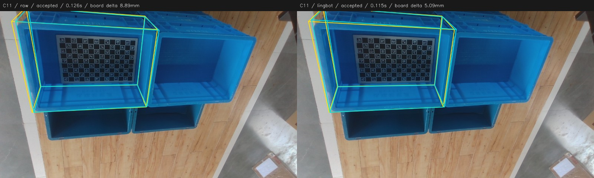
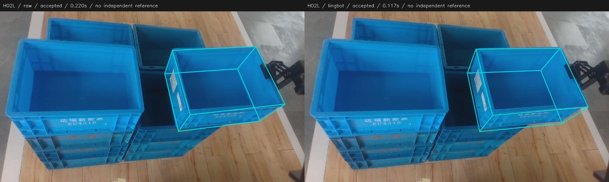
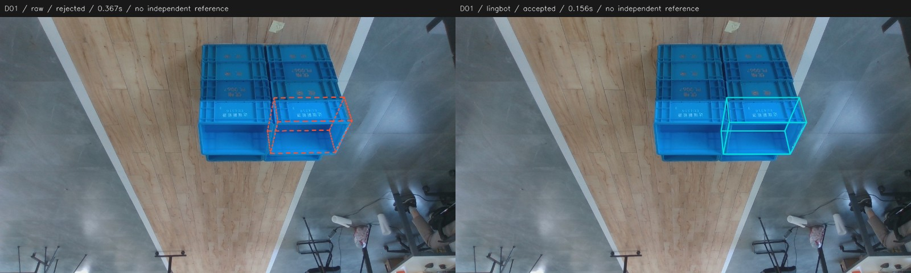

# 9_17 9_15 标定板数据采集（5） 是否可行？ cd /home/galbot/Lsy03/fdp_ba… (2)

- 归档编号：`01a0c7aa-a1ac-7b33-914d-e1c6f583aa93`
- 项目：S1 IE_lab 拆垛
- 创建时间：2026-09-22T14:00:53.293000+08:00
- 更新时间：2026-09-22T14:36:49.574000+08:00
- 状态：活动
- 导出范围：用户可见消息与助手可见回复；不含隐藏推理和工具原始输出

## 1. 用户

“”

| 批次采集时间数量主要用途       |          |                   |                                  |
| ------------------ | -------- | ----------------- | -------------------------------- |
| **D01–D12 右腕数据**   | 9月7日     | **12帧**           | 早期 FDP 与 V3/V4/V5 几何算法对比、消融实验    |
| **H01L–H03L 左腕数据** | 9月9日     | **3帧**            | 左腕视角、倾斜箱体与 6DoF 估计验证             |
| **ChArUco 标定板数据**  | 9月15日    | **原始16帧，当前使用13帧** | 板参考与 FDP/V5 对比；活动集左腕8帧、右腕5帧      |
| 现场联调数据             | 9月11–12日 | 多次零散采集            | Orin 实时流程、双腕及 Docker 接入验证，包含失败记录 |

“”

使用这些能用的数据，然后选择一种ICP算法，优化到 运行时间1s内，Δx mmΔy mmΔz mm以及以及中心距离和三个旋转角度和不超过3度，你有没有什么要问我的？

## 2. 助手

有，以下 4 点会直接影响算法选择和验收方式：

1. **位置误差上限是多少？**
   你明确了角度不超过 3°，但还没给出 `|Δx|、|Δy|、|Δz|` 和中心距离的上限。例如：每轴 ≤5 mm、中心距离 ≤10 mm；请确认你的目标。

2. **“1 秒内”包括哪些步骤？**
   是 S1 Orin 上、RGB-D 和目标 mask 已准备好后的 ICP 位姿计算，还是包含 SAM3、LingBot、ROI 的完整流程？这两种目标差别很大。

3. **三个旋转角是否指 roll、pitch、yaw，各自误差 ≤3°？**
   我建议同时检查完整三维旋转角差 ≤3°，yaw 沿用 180°箱体对称规则。若包含倾斜箱体，就需要真正估计 6DoF；现有固定 roll/pitch 的 V5 不能直接满足这个要求。

4. **允许多少拒绝或失败？**
   是每个有效目标都必须在 1 秒内输出并达标，还是允许少量拒绝？耗时要求是每次都 ≤1 秒，还是例如 95% 的运行 ≤1 秒？

数据方面，**D/H 数据可以用于优化、稳定性和耗时测试，但没有独立参考位姿的帧不能用于证明绝对精度**。目前 ChArUco 只有 11 帧有可用板参考，而且板到箱体的水平安装关系仍未独立核验，不能直接把它当成毫米级真值。

我的初步方向是：以 **ROI 初值＋多尺度 point-to-plane ICP** 为候选，保留完整三维旋转估计，在 S1 同一 Docker 环境下优化。现有 R1 接近 1 秒只能证明速度有基础，不能保证加上 6DoF 后仍能同时满足精度与成功率目标。

## 3. 用户

1.`|Δx|、|Δy|、|Δz|` 和中心距离的上限 是 10mm，
2.“1 秒内”包括，S1 Orin 上、RGB-D 和目标 mask 已准备好后的 ICP 位姿计算
3.三个旋转角是否指 roll、pitch、yaw，各自误差 ≤3°？ 是
4.95% 的运行 ≤1 秒

## 4. 助手

目标明确了，验收标准如下：

|指标|要求|
|---|---|
|位置偏差|`|Δx|、|Δy|、|Δz| ≤10 mm`，且中心距离 ≤10 mm|
|姿态偏差|roll、pitch、yaw 各自 ≤3°；yaw 考虑 180°对称|
|运行时间|S1 Orin 上，RGB-D 和目标 mask 准备好后，95% 的位姿计算 ≤1 秒|
|算法能力|完整 6DoF，包含倾斜箱体|

计时应包含该阶段必要的点云构建、下采样、法向估计、初值计算、ICP 和质量检查，避免把计算移到计时范围外。

还有一个未明确的验收条件：**允许多少定位失败或拒绝？** “95% ≤1 秒”只规定速度，不能代替成功率。建议采用：**至少 95% 的有效目标帧输出位姿且同时满足上述位置、角度要求；拒绝算失败。** 你是否同意这个成功率标准？

另外，现有数据可先用于研发，但最终精度验收还需要独立核验的板到箱体变换和未参与调参的数据。

## 5. 用户

每次都 ≤1 秒 算了

## 6. 助手

好的，耗时要求改为：**每次位姿计算都必须 ≤1 秒，超时计为失败**。

其余标准保持：

- `|Δx|、|Δy|、|Δz|` 和中心距离均 ≤10 mm。
- roll、pitch、yaw 误差各 ≤3°，yaw 考虑 180°对称。
- 在 S1 Orin 上计时，从 RGB-D 和目标 mask 已就绪开始，包含点云处理、初值、ICP 和质量检查。

还差一个条件：**定位成功率是否按至少 95% 验收，拒绝、超时或精度超限均计为失败？**

## 7. 用户

可以先按照 95%

## 8. 助手

确认，先按以下标准验收：

|项目|要求|
|---|---|
|位置|`|Δx|、|Δy|、|Δz|` 及中心距离均 ≤10 mm|
|姿态|roll、pitch、yaw 误差各 ≤3°，yaw 考虑 180°对称|
|耗时|每次 ≤1 秒，包含点云处理、初值、ICP 和质量检查|
|成功率|有效目标帧中至少 95% 同时满足精度与耗时；拒绝、超时、精度超限均计失败|
|环境|S1 Orin；RGB-D 和目标 mask 已准备好|

超时既计入失败，也单独判为“每次 ≤1 秒”要求未达标。成功率按独立数据帧统计，重复运行不增加样本数。

现有数据用于算法开发；最终精度验收需要可靠参考位姿和独立验证集。

## 9. 用户

好的，先给我方案计划，明确目标

## 10. 用户

<turn_aborted>
The user interrupted the previous turn on purpose. Any running unified exec processes may still be running in the background. If any tools/commands were aborted, they may have partially executed.
</turn_aborted>

## 11. 用户

好的，我们开始执行

## 12. 助手（进展）

我先盘点可用数据、参考位姿和现有 ICP 实现，确定能复用的部分，再做一版完整 6DoF 的 ICP 原型。随后使用 galbot-s1-ssh 技能，在 S1 的固定 Docker 环境里验证精度和单次耗时。

## 13. 助手（进展）

盘点发现两个关键点：旧 ICP 的竖直壁面对应不足以约束高度，旧 6DoF 原型在 H 组还出现过严重初始化偏差。因此这次会把初始化、箱口高度约束和 ICP 一起计时、一起验证。S1 已连通，固定镜像一致，目前没有其他运行中的容器。

## 14. 助手（进展）

已冻结 32 个独立帧：D 组12帧、H组3帧、标定板13帧、现场确认目标4帧，共49套深度输入。原型会从深度和 mask 重新计算初值，再用带异常点降权的完整6DoF ICP精修；板参考仅用于运行后的评分。

## 15. 助手（进展）

首版已通过已知位姿的合成恢复测试，但开发帧还没达到10 mm。检查还发现一个值得优先核实的偏差：C05、C06 的板面 RGB-D 深度比同帧 ChArUco 推算深约19–23 mm，而右腕样例差异小得多。我会保留这个测量结果，继续检查对应区域；同时测试 ICP 在 S1 上的实际耗时，避免把数据偏差都归因于算法。

## 16. 用户

是否使用 linbgbotdeepth的结果你自己看着办

## 17. 助手（进展）

我会把 raw 和 LingBot 都跑完，再选统一的默认分支，不按每帧的板参考结果择优。当前初筛里 raw 的几何对应更稳定，LingBot 在部分帧出现了高度偏移；我会补齐 D/H 组的 raw 对照后再确定。

## 18. 助手（进展）

S1 首轮结果已返回：245 次正式运行全部低于1秒，中位约0.095秒、最慢0.763秒，计时包含点云处理、初始化、ICP和质量检查。精度仍未达标。我正在做一项有界消融：利用固定箱体尺寸，让 ICP 估计一个小幅深度尺度修正，检查它能否改善位置偏差，而不使用板位姿作输入。

## 19. 助手（进展）

小幅尺度修正改善了 raw 分支的位置偏差：本地11个有板参考的帧都已进入10 mm范围，三个角度也都在3°内。轻度深度去噪还让 D02 通过了原有质量门限。我暂定 raw 为默认分支，现在锁定配置，去 S1 做完整重复验证；D/H和现场帧没有独立参考，仍只能检查输出与稳定性，不能据此认定全数据精度达标。

## 20. 助手（进展）

S1 完整验证已完成，当前选择 raw：160次正式运行全部低于1秒，最慢约0.547秒；11个有板参考的帧，55次正式结果均满足10 mm和逐轴3°，最大中心偏差约8.89 mm。32帧中有31帧通过几何质量检查，D01仍被拒绝。我正在整理逐帧结果；“31/32能输出”与“整体定位精度成功率”会分开标明。

## 21. 助手

_工具输出图片（原始工具文本未纳入归档）。_

## 22. 助手

_工具输出图片（原始工具文本未纳入归档）。_

## 23. 助手

首轮优化和 S1 实测已完成，**选择 raw 深度**。实现采用完整6DoF的鲁棒点到面 ICP，加入小幅深度尺度修正，修正量由箱体几何估计。

共测试 **32帧、raw/LingBot双分支、384次运行**。raw 结果如下：

|指标|实测结果|你的要求|
|---|---:|---:|
|耗时中位数|0.125秒|—|
|最大耗时，包含首轮|**0.569秒**|每次≤1秒|
|最大 \|Δx\| / \|Δy\| / \|Δz\||4.568 / 5.626 / 7.786 mm|各≤10 mm|
|最大中心距离|**8.888 mm**|≤10 mm|
|最大 roll / pitch / yaw 偏差|1.163° / 1.352° / 1.060°|各≤3°|

位置和角度统计来自 **11个有板参考的帧，55次正式重复全部达标**。同配置使用 LingBot 时只有8/11帧达标，因此采用统一的 raw 分支。

**全数据的95%精度成功率仍不能宣布完成验收。** raw 有31/32帧通过几何检查，D01被拒绝；但其余21帧缺少独立位姿参考，几何检查通过不能代替精度达标。现有板参考的水平安装关系也仍需独立核验。

耗时已包含点云处理、初始化、ICP、质量检查及必要重试；静态模型初始化另计。

- [完整报告与逐帧结果](<../../assets/cc0785a29109c795--REPORT.md>)
- [32帧 raw/LingBot 叠加图](<../../assets/ce6602d96dfb443e--index.html>)
- [算法代码与复现说明](<../../assets/1eef3998736239c6--README.md>)

下一步重点是补充独立参考和新场景验证，确认这套参数在未参与调试的数据上仍能达标。

[附件：cc0785a29109c795--REPORT.md](../../assets/cc0785a29109c795--REPORT.md)

[附件：ce6602d96dfb443e--index.html](../../assets/ce6602d96dfb443e--index.html)

[附件：1eef3998736239c6--README.md](../../assets/1eef3998736239c6--README.md)

## 24. 用户

目前已经测试过的数据集是哪些？

## 25. 助手（进展）

我核对一下本轮输入清单，给你列出实际测试的批次、帧数，以及哪些帧具备标定板参考。

## 26. 助手

本轮新的 **6DoF ICP** 已测试以下4批，共 **32个独立数据帧**：

|数据集|采集日期|数量|相机视角|板参考|
|---|---|---:|---|---|
|D01–D12|9月7日|12帧|右腕|无|
|H01L–H03L|9月9日|3帧|左腕，包含倾斜箱体|无|
|ChArUco 活动集 C01–C13|9月15日|13帧|左腕8帧、右腕5帧|11帧可用|
|现场联调 F01–F04|9月11–12日|4帧|左腕2帧、右腕2帧|无|
|合计||**32帧**||**11帧可计算对板偏差**|

现场4帧具体是：9月11日双腕采集的左、右各1帧，`live_left_20260911_04`，以及 `online_docker_20260912_right_03`。

全部32帧都测试了 **raw、LingBot两个分支**，在 S1 固定 Docker 环境中，每个条件运行首轮1次＋正式5次，共 **384次计算**。这些重复不增加独立样本数量。

ChArUco 中，L01 和误标为 R01 的左腕帧没有可用板位姿；此前排除的 L02_10、R03_10lift、L03（103720）未重新纳入。因此，**32帧都验证了运行情况和耗时，只有11帧能验证相对板参考的精度**。

[完整输入清单](<../../assets/d6c77ee706383655--inputs_manifest_v2.json>) · [32帧图集](<../../assets/ce6602d96dfb443e--index.html>)

[附件：d6c77ee706383655--inputs_manifest_v2.json](../../assets/d6c77ee706383655--inputs_manifest_v2.json)

[附件：ce6602d96dfb443e--index.html](../../assets/ce6602d96dfb443e--index.html)
