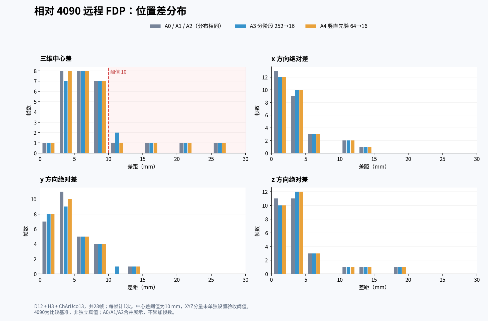
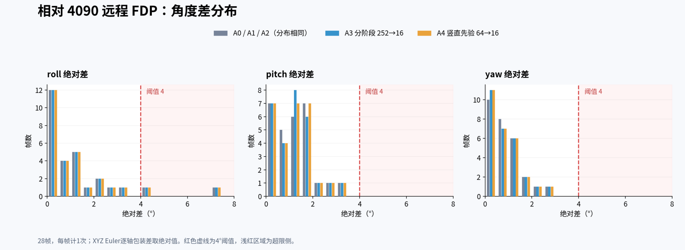
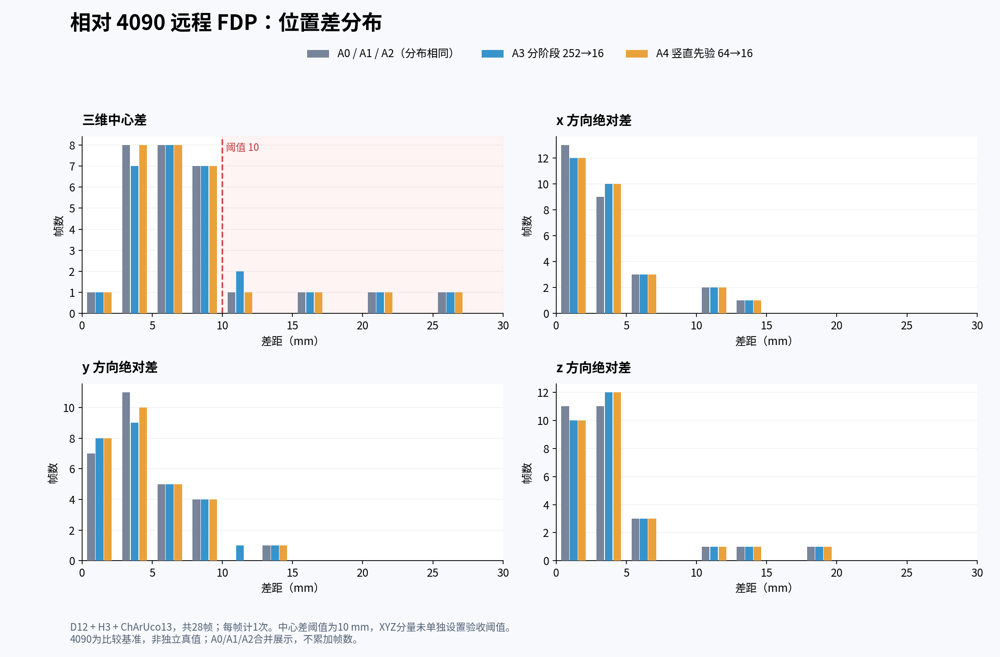
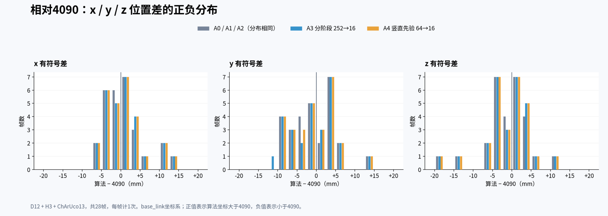
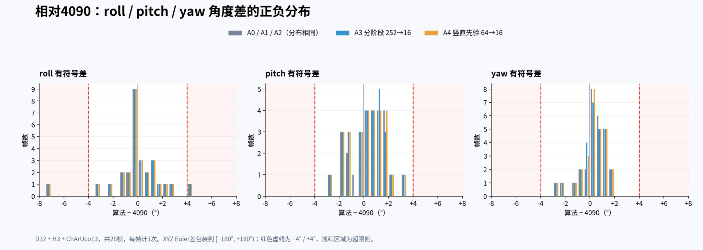
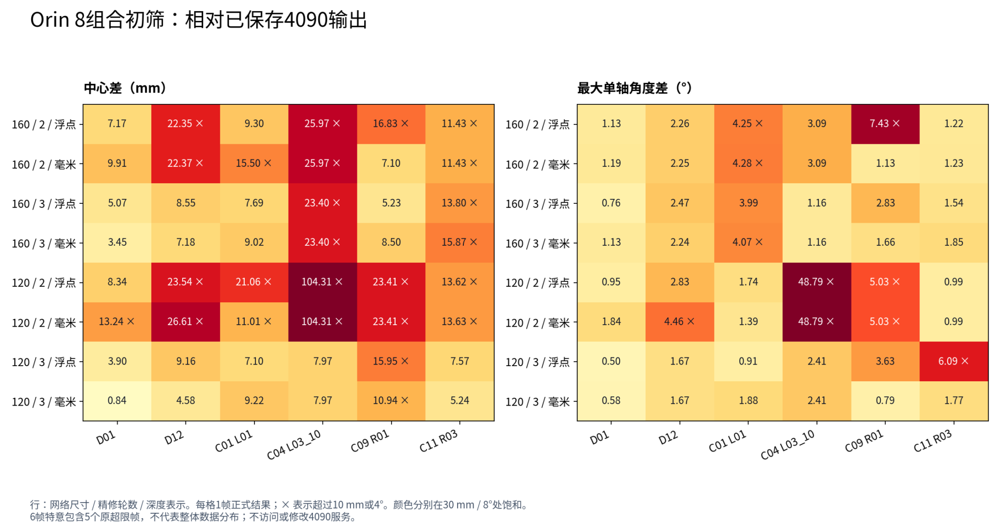

# 9_22 9_21 9_18 评估S1中的FDP部署 与 4090 FDP 对比 (4) (2)

- 归档编号：`01a0c7be-73a8-7973-9a79-268567b34d5f`
- 项目：S1 IE_lab 拆垛
- 创建时间：2026-09-22T16:15:52.538000+08:00
- 更新时间：2026-09-23T11:00:52.750000+08:00
- 状态：活动
- 导出范围：用户可见消息与助手可见回复；不含隐藏推理和工具原始输出

## 1. 用户

要不我们再加上和4090远程FDP服务的对比看看结果如何？

## 2. 助手（进展）

可以。我先核对 4090 FDP 服务的调用方式、当前版本和输入编码，再用同一批 28 帧做对照。重点保证目标 mask、深度、相机内参和 mesh 一致，并把服务计算时间与网络往返时间分开记录。

## 3. 助手（进展）

现有记录中的 4090 服务地址是 `10.34.216.13:7876`。有一个关键差异：旧接口把深度编码成整数毫米 PNG，而 A0–A4 用的是浮点米制深度。我会先核对接口支持；若仍需量化，会保留解码后的实际输入，并单独说明这层差异，避免把它误算成硬件差异。

## 4. 助手（进展）

4090 服务已连通，单帧试跑成功。当前服务是 3 轮精修，而 Orin 是 2 轮；接口还会把深度转成整数毫米，因此这次先比较“实际部署效果”，不能把差异全部归因于显卡。

接下来从 S1 发送同一套 28 帧，每帧预热 1 次、正式运行 5 次，同时记录服务自报耗时、完整请求耗时，以及相对 A0 的位置和三个角度差。

## 5. 助手（进展）

前 9 帧已完成，服务自报处理时间约 0.48 秒，S1 请求往返多数约 0.9–1.0 秒。随后出现一次连接超时，批次已停止；我会保留这次失败记录，检查服务连通性后补齐剩余数据，避免把网络失败从结果里隐去。

## 6. 助手（进展）

已发现一帧位置差超限：D12 相对 A0 的中心差约 22.35 mm，三个角度差仍在 4°以内。其余已检查的 D 组帧通过。需要等 ChArUco 组跑完，再判断远程服务整体是否满足要求；目前不能将它作为已达标方案。

## 7. 助手（进展）

D/H 共 15 帧已补齐，正在跑 ChArUco 的 13 帧。过程中共遇到两次连接超时，均已单独记录；最终表会把“成功请求的耗时”和“请求失败次数”分开呈现，也会保留您要求的 x、y、z 最小值、中位数、最大值。

## 8. 助手（进展）

28 帧、140 次正式推理已全部完成。我正在取回并校验完整记录，汇总失败帧和耗时范围；此前两次连接超时会一起写进报告。

## 9. 助手（进展）

结果已核验：4090 远程服务有 **23/28 帧通过**，5 帧超出位置或角度阈值；最大中心差 **25.97 mm**，最大 roll 差 **7.43°**。服务自报中位耗时 **0.483 秒**，但加上 S1 编码、请求往返和结果解析后，中位耗时是 **1.018 秒**。目前 A4 在这套数据上的达标情况更好。

## 10. 助手

已经完成对比：**4090 现有远程服务尚未满足全部帧的要求，当前 A4 更符合目标。**

数据仍为 **D12＋H3＋ChArUco13，共28帧**，统一 LingBot 深度，每帧5次正式测试。以下差距均相对 A0。

| 方案 | 耗时最小／中位／最大（秒） | 最大中心差 | 最大 roll／pitch／yaw 差 | 达标帧 |
|---|---|---:|---|---:|
| A0 原版 Orin | 5.895／7.329／7.471 | 基线 | 基线 | — |
| A4 竖直先验 64→16 | 0.862／0.881／0.903 | 7.407 mm | 0.058／0.529／1.089° | **28/28** |
| 4090 远程服务 | 0.901／1.018／1.823 | **25.973 mm** | **7.425**／3.440／2.728° | **23/28** |

**计时口径：**Orin 为 register；4090 为 S1 编码＋请求往返＋结果解析。4090 服务自报处理时间中位数仅 **0.483秒**，但客户端合计中位数为 **1.018秒**。另出现两次连接超时，已保留记录并补齐测试。

4090 的位置绝对差如下：

| 指标（mm） | 最小值 | 中位数 | 最大值 |
|---|---:|---:|---:|
| x 差 | 0.272 | 3.864 | 14.662 |
| y 差 | 0.047 | 3.861 | 14.200 |
| z 差 | 0.061 | 2.817 | 19.606 |
| 三维中心差 | 2.498 | 7.005 | 25.973 |

需要注意：**4090 当前是3轮精修，Orin是2轮，远程接口还会量化深度**；因此不能据此认定4090硬件导致精度下降。下一步建议先统一这些条件，排查5帧超限原因。

[A0–A4及4090完整对比报告](../../assets/09c1b13000148a0b--FINAL_REPORT.md)

[附件：09c1b13000148a0b--FINAL_REPORT.md](../../assets/09c1b13000148a0b--FINAL_REPORT.md)

## 11. 用户

如果以4090 远程服务为基准，给我重新生成报告

## 12. 助手（进展）

我会用同帧 4090 远程服务输出作为基准，重新计算 A0–A4 的中心、x/y/z 和三个角度差，并按中心差 ≤10 mm、各角度差 ≤4° 生成新报告。耗时沿用实测记录。

## 13. 助手

已生成[以4090为基准的新报告](../../assets/fef78ce475717fae--REPORT.md)，包含耗时、中心、x/y/z及三个角度差的**最小值／中位数／最大值**，以及超限帧明细。

同28帧、每帧5次正式结果重新计算如下：

| 版本 | 中心差最小／中位／最大（mm） | 满足10mm及逐轴4°的帧数 |
|---|---|---:|
| 4090 基准 | 0／0／0 | 自比较 |
| A0 原版 Orin | 2.498／7.005／25.973 | 23/28 |
| A1 Exact | 2.498／7.005／25.973 | 23/28 |
| A2 全候选加速 | 2.498／7.005／25.973 | 23/28 |
| A3 分阶段252→16 | 2.498／7.103／25.973 | 22/28 |
| A4 竖直先验64→16 | 2.498／7.005／25.973 | 23/28 |

**切换基准后，A4虽然仍全部小于1秒，但相对4090有5帧超限。**此前“全部通过”仅适用于以A0为基准。

本次仅重算已有记录，耗时未改变；4090作为比较参考，并不意味着它是实际位姿真值。

[附件：fef78ce475717fae--REPORT.md](../../assets/fef78ce475717fae--REPORT.md)

## 14. 用户

给我大概画一下分布直方图吧

## 15. 助手（进展）

我会按刚才的4090基准，画出中心差、x/y/z差和三个角度差的分布，并标出10 mm与4°阈值。每帧只计一次，避免5次相同输出重复堆高柱子。

## 16. 助手

_工具输出图片（原始工具文本未纳入归档）。_

## 17. 助手

画好了，均以 **4090为基准、28帧每帧计一次**。A0/A1/A2的分布完全一致，合并为灰色柱。

位置差主要集中在 **10 mm以内**，少量帧延伸到约26 mm：

角度差主要集中在 **0–2°**；超出4°的情况出现在 **roll**，pitch和yaw均未超限：

## 18. 用户

不需要绝对差距，需要标出正负值

## 19. 助手（进展）

我会改成带正负号的分布：统一按“算法输出 − 4090输出”计算 x/y/z 和 roll/pitch/yaw。三维中心距离本身没有正负号，会保留为距离分布。

## 20. 助手

_工具输出图片（原始工具文本未纳入归档）。_

## 21. 助手

已改为**带正负号的差值：算法输出 − 4090输出**。正值表示偏大，负值表示偏小；每帧计一次。

角度图中的红色虚线分别为 **−4°和＋4°**：

## 22. 用户

[fdp-4090-ssh](/home/lsy03/.codex/skills/fdp-4090-ssh/SKILL.md)
你可以看看“galbot\@galbot-echo:\~/Lsy03$ ls fdp\_info.md&#x20;
fdp\_info.md
galbot\@galbot-echo:\~/Lsy03$ pwd
/home/galbot/Lsy03
galbot\@galbot-echo:\~/Lsy03$&#x20;
”/skill

## 23. 用户

[fdp-4090-ssh](/home/lsy03/.codex/skills/fdp-4090-ssh/SKILL.md)
你可以看看“S1 里面 galbot\@galbot-echo:\~/Lsy03$ ls fdp\_info.md&#x20;
fdp\_info.md
galbot\@galbot-echo:\~/Lsy03$ pwd
/home/galbot/Lsy03
galbot\@galbot-echo:\~/Lsy03$&#x20;
”

## 24. 助手（进展）

我会先读取 S1 上的 `/home/galbot/Lsy03/fdp_info.md`。这次会使用 S1 SSH 技能，以及你指定的 `fdp-4090-ssh` 技能，核对文件中涉及的 4090 服务信息。

## 25. 用户

你要是能看到了4090上的FDP服务源码就告诉我

## 26. 助手

**可以，已经成功登录4090服务器，并实际读到了FDP服务源码。**

服务入口文件：
`/home/c/workspace/260611_sjtu_workbin_movement/migrate_back/g1_workbin_perception/scripts/serve_local_fdp_4090.py`

已看到 RGB、深度、mask 和相机内参的解码实现，确认可以继续从源码核对参数、计时范围，以及与 Orin 实现的差异。目前仅做只读查看，未修改或重启服务。

## 27. 用户

给我看看Orin上的算法为啥和4090上的FDP差距这么大，是不是有什么参数上或者服务调用上的区别？

## 28. 助手（进展）

我会对照4090服务源码和Orin实验代码，重点核查精修轮数、深度与mask处理、模型和mesh、坐标转换，以及计时范围。先找出已确认的配置差异，再判断哪些可能造成这次位姿偏差。

## 29. 助手（进展）

已确认两处关键差异：4090做3轮精修，Orin做2轮；4090收到的深度还经过整数毫米量化。源码也确认，两边采用相同的 `pose @ inv(to_origin)` 中心转换，没有发现重复转换。

另外，4090服务实际上忽略了 `return_vis=false`，仍然画图、写盘并返回图片。这能解释一部分耗时，但尚不能解释位姿偏差。我继续核对模型权重和核心代码。

## 30. 助手（进展）

找到一个此前漏查的重要差异：**Orin的评分网络和精修网络都使用160×160输入，4090都使用120×120。** 两个模型权重和mesh的哈希则完全一致。

这说明目前比较的并非同一推理配置。输入尺寸、精修轮数和深度量化都可能改变精修结果与候选评分；具体哪项贡献最大，还需要逐项消融才能确定，不能简单归因于Orin精度差。

## 31. 助手

**是的，已经查到明确的参数与服务差异。最重要的新发现：Orin和4090的网络输入尺寸不同。** 目前不能将偏差简单归因于Orin硬件。

| 核查项 | Orin A0 | 4090远程服务 | 影响 |
|---|---|---|---|
| **评分网络输入** | **160×160** | **120×120** | 可能改变候选评分、最终选择 |
| **精修网络输入** | **160×160** | **120×120** | 可能改变位姿精修结果 |
| 精修轮数 | 2轮 | 3轮 | 更新次数不同 |
| 深度输入 | float32米 | 整数毫米PNG解码 | 最大量化差约1 mm |
| 模型权重、mesh | **两边哈希完全一致** | **一致** | 已排除文件不同 |
| 中心与坐标转换 | 相同转换逻辑 | 相同转换逻辑 | 未发现重复转换或漏转换 |

这里的160/120指**送入网络的候选裁剪尺寸**，不是相机原图尺寸。A1–A4也沿用Orin的网络配置。

为什么这些变化可能产生厘米级差距？FDP会精修多个姿态候选，再评分选第一名。尺寸、深度或轮数改变后，可能改变候选排序，最终输出就可能跳到另一组位姿。**这是源码支持的可能机制；具体哪项导致这5帧超限，还需要单项消融确认。**

服务调用还发现一个耗时问题：**4090忽略了`return_vis=false`，仍然绘图、写盘并返回图片。** 服务自报耗时又不包含输入解码和响应图片编码，因此0.483秒不能直接当作完整返回时间。这主要解释耗时差，尚未发现它改变位姿的证据。

另外，**未优化的A0相对4090就已经有5帧超限**，所以差距并不是A4加速后才出现的。

下一步应先固定硬件，分别切换 **160/120尺寸、2/3轮、浮点/毫米深度** 做消融，再用完全一致的配置比较两台硬件。

[完整源码核查报告](../../assets/fdfc2b2fbf819c2b--REPORT.md)

[附件：fdfc2b2fbf819c2b--REPORT.md](../../assets/fdfc2b2fbf819c2b--REPORT.md)

## 32. 用户

你别乱改 4090 FDP上的代码，我们在 Orin上的Docker 进行实验 如何？

## 33. 助手

可以，**后续实验全部放在 Orin 的独立 Docker 中，4090 服务保持不动。**

刚才没有修改或重启4090服务，只读取了源码、配置、文件哈希，并检查了Warp初始化。

Orin实验采用独立脚本和配置副本，保留现有镜像及A0–A4结果，依次对比：

1. 网络输入：160×160 → 120×120。
2. 精修轮数：2轮 → 3轮。
3. 深度：浮点米 → 与4090接口一致的整数毫米量化。
4. 三项组合，判断能否接近已有4090输出。

继续只用冻结帧，不调用相机、SDK或运动接口。

## 34. 用户

好的，我们开始实验

## 35. 助手（进展）

我会在 Orin 的独立 Docker 中开始冻结帧消融，4090 服务保持不动。先用5个超限帧和1个通过帧，测试输入尺寸、精修轮数、深度量化的8种组合；再将与4090配置对齐的组合扩展到全部28帧。

## 36. 助手（进展）

实验脚本已准备好。网络尺寸只在新进程的内存配置中调整，原镜像和输入文件均只读；毫米深度会逐字节核对，确保与此前发给4090的数据一致。现在开始8组初筛，先确认原配置能复现A0，再看各项变化的影响。

## 37. 助手（进展）

首次启动在读取源码校验阶段就停下了，尚未执行推理：镜像里有些源码文件只允许其所属用户读取，而本次容器禁用了全部附加权限。我会只补上读取所需的权限，保留只读文件系统和无网络限制，再重新启动。

## 38. 助手（进展）

读取权限问题已解决，容器已进入模型初始化。每组都会记录最终胜出候选和前两名评分差，便于判断配置变化是让同一候选的位置发生变化，还是选中了另一候选。

## 39. 助手（进展）

模型初始化已完成，但结果保存又遇到新建目录的权限问题，仍未开始正式推理。我会把写权限限定给实验容器使用的用户组。

自动审批拒绝了刚才“将输出和缓存目录设为所有用户可写”的修复方案，理由是权限过宽；我会采用范围更小的目录权限设置。

## 40. 助手（进展）

原配置已经跑出5帧正式结果，位姿矩阵和胜出候选都与旧A0完全一致。这说明本次实验基线能复现，可以继续逐项比较参数变化。

## 41. 助手（进展）

前两组已完成。原配置在6帧上全部复现A0；只把深度改为整数毫米后，相对4090通过阈值的帧数从1/6变为2/6，但最大中心差仍约25.97 mm。

因此，深度量化确实会改变输出，但单靠这一项不能解释或消除全部差距。接下来测试精修轮数和网络输入尺寸。

## 42. 助手（进展）

已确认深度量化会触发“换候选”：只改深度表示，6帧中有3帧的胜出候选发生变化，两种配置的输出中心最多相差20.52 mm。这验证了此前的判断：小于1 mm的输入变化，也可能通过候选重新排序产生厘米级位姿变化。

## 43. 助手（进展）

保持160×160和浮点深度，只把精修从2轮改为3轮，6帧中已有4帧通过；最大中心差从25.97降到23.40 mm，三个角度的最大差都进入4°以内。轮数差异有明显影响，但位置偏差还未全部消除。

## 44. 助手（进展）

160×160的最后一组正在运行，随后进入120×120的四组。各组都使用相同帧和相同候选网格，比较同一帧的输出变化；每组的候选ID和评分记录也会保留。

## 45. 助手（进展）

160×160的四组已完成，出现了交互影响：3轮＋浮点深度通过4/6帧，3轮＋毫米深度反而是3/6帧。说明参数对齐并非每改一项都会单调改善，必须看完整组合。现在已开始120×120测试。

## 46. 助手（进展）

仅把网络尺寸改成120×120、仍保持2轮和浮点深度，结果明显变差：只通过1/6帧，最大中心差约104.31 mm，最大roll差约48.79°。这说明不能把“改成120”单独当作修复；我会继续测试3轮及毫米深度的组合，保留这组失败结果。

## 47. 助手（进展）

120×120、2轮、毫米深度这一组也已完成，6帧都未通过位置与角度的联合阈值。现在进入最后两组3轮测试，其中“120×120＋3轮＋毫米深度”才是与4090三项配置全部对齐的组合。

## 48. 助手（进展）

8组初筛已完成。三项全部对齐后，6帧中有5帧通过，最大中心差降到10.94 mm，三个角度最大差均小于2.42°，是这8组中通过帧数最多的一组。

但它仍未完全复现4090，说明这三项参数之外还有差异。接下来按计划跑全部28帧、每帧5次正式重复，检查剩余偏差的范围和稳定性。

## 49. 助手（进展）

初筛的48个“配置×帧”条件中，预热与正式输出都一致，原输入和源码校验也全部通过。28帧重复测试已开始。当前对齐配置的register约需6.7秒；这轮用于查清精度差异，尚未加入此前的加速方案。

## 50. 助手

_工具输出图片（原始工具文本未纳入归档）。_

## 51. 助手（进展）

全组复测已完成D01–D03，每帧5次输出均一致，也都满足相对4090的10 mm／逐轴4°阈值。三帧的中心差分别约0.84、5.52、1.74 mm。

## 52. 助手（进展）

目前D01–D05已完成，5帧全部通过，重复输出一致；最大中心差约5.51 mm、最大单轴角度差约1.03°。原来的252候选网格也已核验，在8组实验中完全相同。

## 53. 助手（进展）

D01–D08已完成，8帧都通过，5次重复结果一致。目前最大中心差仍为5.51 mm；继续验证剩余右腕帧和左腕、ChArUco组。

## 54. 助手（进展）

D01–D11已全部通过，最大中心差约6.29 mm，重复结果一致。正在复测原来中心差22.35 mm的D12，随后进入H组和ChArUco组。

## 55. 助手（进展）

D12的5次复测均通过，中心差稳定在约4.58 mm，较原配置的22.35 mm明显缩小。目前已完成13帧、全部通过；正在验证剩余两帧左腕数据。

## 56. 助手（进展）

D12帧和H3帧已全部完成，15/15帧通过，每帧5次输出一致。现在进入ChArUco组；初筛中那帧仍有10.94 mm偏差的数据也会按原样保留，完成重复验证。

## 57. 助手（进展）

已完成18帧，全部通过。原来roll差约4.25°的ChArUco L01帧，现在roll差约1.34°、中心差约9.22 mm，5次输出一致；正在复测原来中心差最大的L03_10帧。

## 58. 助手（进展）

已完成21帧，全部通过。原最大偏差帧L03_10的中心差从25.97降到7.97 mm，最大单轴角度差约2.41°，5次输出一致；还剩7帧。

## 59. 助手（进展）

全组测试发现一帧初筛未覆盖的超限：ChArUco `R01…093900`（实际为左腕帧）中心差约10.76 mm，角度差在范围内，5次结果一致。不能只依据6帧初筛判断整体改善；我会把这帧和原有超限帧一起计入最终结果。

## 60. 助手（进展）

已完成27帧，25帧通过。两帧超限都只差在位置，中心差分别约10.76和10.94 mm；目前所有帧的三个角度差均在4°以内，重复输出一致。最后一帧结束后，我会核验输入、源码和完整结果包。

## 61. 助手（进展）

全部测试完成并通过结果校验：对齐配置相对4090通过26/28帧，最大中心差10.94 mm；三个角度的最大差分别为2.26°、2.10°、2.41°，全部满足角度阈值。140次正式输出中，每帧的5次结果完全一致。

两帧位置仍超限，所以还不能宣布全部达标。当前register中位耗时6.694秒；本轮没有访问或修改4090服务。

## 62. 助手

实验已完成，**全部在Orin独立Docker运行，4090未访问、未修改。**

经过8组消融，再对全部28帧各重复5次，结果如下：

| 相对4090的指标 | 原A0：160尺寸／2轮／浮点深度 | 对齐配置：120尺寸／3轮／毫米深度 |
|---|---:|---:|
| 联合达标帧数 | 23/28 | **26/28** |
| 中心差中位数 | 7.005 mm | **4.518 mm** |
| 最大中心差 | 25.973 mm | **10.937 mm** |
| 最大roll／pitch／yaw差 | 7.425／3.440／2.728° | **2.262／2.096／2.414°** |
| register中位耗时 | 7.329秒 | 6.694秒 |

**已经证实：参数不一致是差距的重要原因，而且三项参数存在交互。** 单独改成120尺寸反而可能明显变差，不能只改这一项。

目前仍有两帧位置超限，分别为 **10.764 mm、10.937 mm**；角度全部达标。每帧5次输出完全一致，因此剩余偏差不是本次重复运行的随机波动。**尚未全部满足1 cm要求，也未达到1秒目标。**

[完整实验报告与8组消融图](../../assets/5c6fa6a6f5a7b700--REPORT.md)

[附件：5c6fa6a6f5a7b700--REPORT.md](../../assets/5c6fa6a6f5a7b700--REPORT.md)

## 63. 用户

为什么同一个程序，同时一套参数的FDP，在同一套数据的运行，4090和orin得到的结果差距这么大

## 64. 助手

**准确地说，我们目前只对齐了主要参数，还没有证明两边是完全相同的运行实现。** 把剩余差距直接解释为“4090和Orin硬件精度不同”，证据还不够。

目前已确认：

| 项目 | 核查结果 |
|---|---|
| 两个模型权重、mesh | 文件哈希一致 |
| register、评分和精修入口源码 | 已核对的文件一致 |
| 网络输入尺寸、精修轮数、深度数据 | 最新实验已对齐 |
| PyTorch／CUDA | **不同**：Orin为2.0开发版／11.4，4090为2.4.1／12.1 |
| 全部依赖、编译扩展、实际加载路径 | **尚未完整对齐核验** |
| 4090进程实际加载内容 | 尚未证明与当前磁盘文件完全一致 |

FDP还有一个容易放大差异的环节：**它会精修252个候选，再评分选第一名。**

即使初始数值差很小，经过多轮网络计算后，也可能改变候选排序。最后选中不同候选，输出就可能相差毫米甚至厘米。我们已经在同一台Orin上验证过：**仅改深度量化，6帧中就有3帧换了胜出候选，两种配置的中心最多相差20.52 mm。** 因此，不能认为“输入只差不到1 mm，输出就一定只差不到1 mm”。

不过，**这还不能证明最新两帧超限就是GPU数值误差造成的**。目前对齐后的结果是：

- 中心差中位数 **4.52 mm**，最大 **10.94 mm**；
- 三个角度全部在4°以内；
- 每帧5次结果完全一致。

这说明偏差在各自运行环境下是稳定的，继续重复跑不会自然消失。

**下一步应该找“两边第一次从哪里开始不一样”，而不是继续盲目调参数：**

1. 核对实际加载的完整代码、依赖，以及预处理后的深度、mesh中心变换和252个初始候选。
2. 对同一帧、同一候选，对比每轮精修后的位姿。
3. 对比评分、排名及前两名分差，确认是“精修结果不同”还是“最终选错了同一候选集合中的另一项”。
4. 在Orin独立Docker中关闭AMP做对照，检验混合精度是否是重要因素。

4090生产服务保持不改。**当前最需要的是定位分歧环节；尚不能断言是哪块显卡算得不准。**

## 65. 用户

Orin上我们要不试一下 160尺寸／3轮／毫米深度 如何？然后和 4090 FDP 对比一下

## 66. 助手（进展）

可以。160尺寸／3轮／毫米深度此前只测过6帧初筛，这次我会在Orin独立Docker中扩展到全部28帧，每帧预热1次、正式运行5次，与已保存的4090结果对比。4090服务保持不动。

## 67. 助手（进展）

本次已按160×160、3轮、毫米深度启动，沿用原版252候选，不加入加速补丁。报告会并列原A0、昨日120尺寸结果和本次160尺寸结果，区分尺寸变化对精度和耗时的影响。

## 68. 助手（进展）

D01的5次正式结果已完成，输出一致：中心差约3.45 mm，最大单轴角度差约1.13°，与昨日同配置初筛一致。正在继续跑完整D组。

## 69. 助手（进展）

D01–D03已完成，3帧均通过，重复输出一致。目前最大中心差约6.59 mm，最大单轴角度差约2.09°；后续会重点核对它是否改善昨日120尺寸的两帧位置超限。

## 70. 助手（进展）

D01–D05已完成，均满足位置和角度阈值，5次重复结果一致。目前最大中心差约7.63 mm；实验仍按原定28帧继续，不根据中途结果删帧或调参。

## 71. 助手（进展）

目前完成7/28帧，全部通过，重复结果一致。最大偏差暂未增加；继续验证剩余右腕帧。

## 72. 助手（进展）

已完成8帧，仍全部通过。目前正式推理中位耗时约8.34秒，比昨日120尺寸的6.69秒更长；这一轮主要看增加分辨率是否能换来更小的位姿偏差。

## 73. 助手（进展）

D01–D10已全部通过，最大中心差约7.97 mm，重复输出一致。剩余右腕帧完成后，将进入左腕与ChArUco组。

## 74. 助手（进展）

右腕D组12帧已全部通过，最大中心差约7.97 mm、最大单轴角度差约2.24°。正在跑H组左腕3帧，之后是ChArUco13帧。

## 75. 助手（进展）

目前完成14/28帧，全部通过，重复输出一致。H组前两帧没有新增超限；即将进入此前出现较大差异的ChArUco组。

## 76. 助手（进展）

D/H共15帧全部通过。ChArUco首帧L01出现角度超限：中心差约9.02 mm，但roll差约4.073°，略超过4°。5次结果一致，与昨日同配置初筛相符。

## 77. 助手（进展）

已完成17帧，16帧通过，目前仍只有L01的roll超限。后续帧继续按同一配置运行，避免为单帧结果临时调参。

## 78. 助手（进展）

L03_10复测完成，160尺寸下中心差稳定在23.40 mm，未通过；昨日120尺寸下这帧约为7.97 mm。可见增大尺寸并不一定更接近4090。当前已完成19帧，17帧通过。

## 79. 助手（进展）

已完成21/28帧，19帧通过，新增完成的两帧没有超限。接下来会测到昨日120尺寸下位置超限的两帧R01，直接看160尺寸能否改善它们。

## 80. 助手（进展）

160尺寸改善了其中一帧R01（实际左腕）：中心差从昨日的10.76降到7.87 mm，5次均通过。当前完成23帧、21帧通过，正在测另一帧R01。

## 81. 助手（进展）

昨日120尺寸下超限的两帧R01，本次都已通过。不过L01出现角度超限，L03_10出现较大位置偏差，说明两种尺寸有不同的失败帧。当前完成25帧、23帧通过，还剩3帧。

## 82. 助手（进展）

28帧已全部完成：160尺寸通过25/28帧，少于昨日120尺寸的26/28。三帧超限分别是L01的roll约4.073°、L03_10中心差约23.40 mm、R03中心差约15.87 mm。每帧5次输出一致；我正在做最终校验并整理对比报告。

## 83. 助手

已完成28帧、每帧5次正式测试。**相对4090，160尺寸这组整体没有优于120尺寸。** 4090服务未修改。

两组均为3轮精修、毫米深度：

| 指标 | 120尺寸 | 本次160尺寸 |
|---|---:|---:|
| 达标帧数 | **26/28** | 25/28 |
| 中心差最小／中位／最大（mm） | 0.373／4.518／10.937 | 1.825／5.284／23.399 |
| 最大roll／pitch／yaw差（°） | 2.262／2.096／2.414 | 4.073／2.087／2.186 |
| 耗时最小／中位／最大（秒） | 5.862／6.694／6.776 | 8.296／8.366／8.618 |

160尺寸修复了此前两帧R01的位置超限，但新增三帧超限：

- **L01**：roll差4.073°。
- **L03_10**：中心差23.399 mm。
- **R03**：中心差15.870 mm。

每帧5次输出完全一致。**按接近现有4090输出的目标，120／3轮／毫米深度目前更合适，但两组都还未全部达标。** 这比较的是输出一致性，并非真实位姿精度。

[完整报告：含有符号XYZ、角度统计及逐帧结果](../../assets/ae5099822f6981f9--REPORT.md)

[附件：ae5099822f6981f9--REPORT.md](../../assets/ae5099822f6981f9--REPORT.md)

## 84. 用户

给我看一下这一份文档里面的参数分别有哪些？

[附件：bb147845ba8f16e2--pasted-text.txt](../../assets/bb147845ba8f16e2--pasted-text.txt)

## 85. 助手（进展）

我会读取这份文档，把其中的FDP参数、输入处理参数、服务地址和安全门限分别整理出来，并区分当前配置与类默认值。

## 86. 助手

按这份文档，参数主要分为下面几类。**以下是文档记载值，不代表本次重新检查了服务运行状态。**

**1. FDP启动参数**

| 参数 | 文档中的服务配置 | 含义 |
|---|---:|---|
| `est_refine_iter` | **3** | 首帧位姿精修3轮 |
| `track_refine_iter` | **1** | 后续跟踪精修1轮；文档中的S1链路未调用连续跟踪 |
| `activate_2d_tracker` | `false` | 关闭2D跟踪器 |
| `activate_kalman_filter` | `false` | 关闭卡尔曼滤波 |
| `apply_scale` | **1.0** | mesh不额外缩放 |

注意：类默认值是 **2轮初始化、5轮跟踪、2D跟踪开启、Kalman开启**，被上述服务配置覆盖。

**2. 网络输入参数**

| 参数 | Score评分网络 | Refiner精修网络 |
|---|---:|---:|
| 输入裁剪尺寸 | **120×120** | **120×120** |
| `c_in` | 6 | 6 |
| `normalize_xyz` | `true` | `true` |
| 使用法向量 `normal` | 否 | 否 |
| `crop_ratio` | **1.1** | **1.2** |
| 权重版本目录 | `2024-01-11-20-02-45` | `2023-10-28-18-33-37` |

两者均加载对应目录下的 `model_best.pth`。这里的120×120是**网络裁剪输入尺寸，不是相机分辨率**。

**3. 深度预处理与初始化参数**

| 项目 | 文档值 |
|---|---|
| 初始化图像数量 | **1帧RGBD** |
| 深度腐蚀半径 | 2 |
| 深度双边滤波半径 | 2 |
| 腐蚀深度差阈值 | **0.001 m＝1 mm** |
| 邻域坏点比例阈值 | **0.8** |
| 有效点条件 | `depth >= 0.001 m` 且 `mask > 0` |
| 有效点不足的退化条件 | 少于4个 |
| 初始投影中心 | mask包围框中心 |
| 初始距离 | mask内有效深度中值 |
| `min_n_views` | **40** |
| 面内旋转步长 | **60°** |
| 实际旋转候选数 | 日志记录为**252个** |
| 每个候选精修次数 | **3次** |
| 最终选择方式 | Score评分最高的候选 |

Mask处理为 `(mask > 0)` 转成 **uint8的0/255图像，再用PNG传输**。文档明确说客户端不做mask腐蚀、膨胀或多帧融合。

**4. 本地几何检查门限**

| 检查项 | 门限 |
|---|---:|
| mode00的mask-depth检查 | 0.300 m |
| mode10的mask-depth检查 | 0.200 m |
| mode01的mask-depth检查 | 0.150 m |
| 普通／主臂：FDP原点与候选中心距离 | 0.150 m |
| 顺序拆垛次臂：对应距离 | 0.200 m |
| 比较点沿语义Z轴上移 | 0.100 m |

**这些是拆垛链路的几何检查门限，不是我们实验中“中心差≤10 mm、角度差≤4°”的验收标准。**

**5. 坐标轴映射**

| 箱体语义轴 | 对应FDP原始轴 |
|---|---|
| 长度 `length` | `+raw_axis_2` |
| 宽度 `width` | `+raw_axis_1` |
| 高度 `height` | `-raw_axis_0` |

**6. 服务配置**

| 服务 | 文档地址／端口 |
|---|---|
| FDP | `http://10.34.216.13:7876` |
| 默认Workbin | `ws://10.34.216.13:8040` |
| 原始深度Survey实验 | 8042；FDP候选仍来自8040 |
| SAM3 | Thor：7861 |
| LingBot-Depth | Thor：7865 |
| 首帧接口 | `/first_frame_track` |
| 连续跟踪接口 | `/next_frame_track`，当前链路未使用 |

文档另有一个状态字段：`service_response_binding_verified=false`，表示当时尚未验证服务内部对每个请求输入字节的使用情况。

**与我们当前实验最相关的是：120×120、3轮精修、252候选、crop ratio 1.1／1.2，以及深度预处理。文档没有明确列出深度传输的整数毫米编码、`depth_scale`或AMP配置；这些是我们后来从代码核查中补充确认的内容。**

## 87. 用户

当前orin上的实验参数是否能对齐 4090 FDP的参数，给我确认一下

## 88. 助手（进展）

我会核对Orin实验记录中的实际生效参数，并与之前归档的4090源码和配置逐项对照。此次只查本地记录，不改动4090服务。

## 89. 助手

**能对齐，但最新完成的160尺寸实验并未完全对齐4090。** 我核对了实验中的实际生效配置：主要差别仍是网络输入尺寸。

| 参数 | 最新Orin实验 | 4090归档配置 | 是否一致 |
|---|---|---|---|
| Score／Refiner输入尺寸 | **160×160** | **120×120** | ❌ |
| 首帧精修轮数 | 3 | 3 | ✅ |
| 初始候选数 | 252 | 252 | ✅ |
| 输入通道 `c_in` | 6 | 6 | ✅ |
| `normalize_xyz` | true | true | ✅ |
| 使用normal | false | false | ✅ |
| Score／Refiner裁剪比例 | 1.1／1.2 | 1.1／1.2 | ✅ |
| AMP混合精度 | 开启 | 开启 | ✅ |
| 2D跟踪／Kalman | 均关闭 | 均关闭 | ✅ |
| mesh缩放 | 1.0 | 1.0 | ✅ |
| 模型权重、mesh | 哈希一致 | 哈希一致 | ✅ |
| 毫米量化深度 | 与4090解码数组逐字节一致 | 参考输入 | ✅ |

另有一个**未参与本次首帧实验**的差别：Orin构造函数沿用了`track_refine_iter=5`，4090为`1`。如果以后测试连续跟踪，需要显式设为`1`；本次只调用`register`，它不影响结果。

**我们此前的“120尺寸／3轮／毫米深度”实验，已经对齐上述核心首帧推理参数**，结果是26/28帧通过。

但还不能称为“运行环境完全一致”：

- Orin：Torch 2.0、CUDA 11.4。
- 4090：Torch 2.4.1、CUDA 12.1。
- Orin直接调用`register`；4090经过服务封装，还包含绘图、写盘等操作。

因此，后续若要研究“两边参数对齐后为何仍有偏差”，应使用已有的 **120／3轮／毫米深度基线**。最新160实验属于另一组参数对照。此次确认没有修改配置或重新运行实验。

## 90. 用户

est\_refine\_iter       = 3

track\_refine\_iter     = 1

activate\_2d\_tracker   = false

activate\_kalman\_filter= false

apply\_scale           = 1.0

FoundationPose 内部首帧流程：

- 深度腐蚀：半径 2
- 深度双边滤波：半径 2
- 腐蚀深度差阈值：0.001 m
- 邻域坏点比例阈值：0.8
- 有效点条件：depth >= 0.001 m 且 mask > 0
- 有效点少于 4 个时，退化为单位旋转 + mask bbox/深度中值平移
- mask bbox 中心作为初始投影中心
- mask 内有效深度中值作为初始距离
- 旋转候选网格：源码参数 min\_n\_views=40、面内步长 60°
- 当前日志实际生成 252 个旋转假设
- 每个候选执行 3 次 PoseRefine
- ScorePredictor 对候选评分并选最高分
  代码：
- [FoundationPose 初始化网格与 register (line 18)](/home/c/workspace/260611_sjtu_workbin_movement/migrate_back/g1_workbin_perception/third_party/FoundationPose-plus-plus/FoundationPose/estimater.py:18)
- [register 深度/Mask/候选处理 (line 160)](/home/c/workspace/260611_sjtu_workbin_movement/migrate_back/g1_workbin_perception/third_party/FoundationPose-plus-plus/FoundationPose/estimater.py:160)
- [深度滤波参数 (line 352)](/home/c/workspace/260611_sjtu_workbin_movement/migrate_back/g1_workbin_perception/third_party/FoundationPose-plus-plus/FoundationPose/Utils.py:352)
  模型输入配置中，Score 和 Refiner 都是 120×120、c\_in=6、normalize\_xyz=true、不使用 normal；Score 的 crop ratio 是 1.1，Refiner 是 1.2。

这些参数是否对齐？

## 91. 助手（进展）

我会逐项核对你列出的参数和首帧处理逻辑，分别说明120尺寸对齐实验与最新160尺寸实验的情况。

## 92. 助手

**不是全部对齐。** 对你列出的清单，最新Orin **160／3轮／毫米深度**实验有两处不同：**网络尺寸、跟踪轮数**；其余首帧参数和处理逻辑已核对一致。

| 参数／处理步骤 | Orin实验 | 4090配置 | 核对结果 |
|---|---|---|---|
| `est_refine_iter` | 3 | 3 | 一致 |
| `track_refine_iter` | **5（默认值）** | **1** | 不同，但本次首帧实验不调用它 |
| `activate_2d_tracker` | false | false | 一致 |
| `activate_kalman_filter` | false | false | 一致 |
| `apply_scale` | 1.0 | 1.0 | 一致 |
| 深度腐蚀半径 | 2 | 2 | 一致 |
| 深度双边滤波半径 | 2 | 2 | 一致 |
| 腐蚀深度差阈值 | 0.001 m | 0.001 m | 一致 |
| 邻域坏点比例阈值 | 0.8 | 0.8 | 一致 |
| 有效点条件 | `depth ≥ 0.001 m`且`mask > 0` | 相同 | 一致 |
| 有效点少于4个的退化逻辑 | 单位旋转＋估计平移 | 相同 | 一致 |
| 初始投影中心 | mask包围框中心 | 相同 | 一致 |
| 初始距离 | mask内有效深度中值 | 相同 | 一致 |
| `min_n_views`／面内步长 | 40／60° | 40／60° | 一致 |
| 初始旋转候选数 | 252 | 252 | 数量一致 |
| 每候选精修次数 | 3 | 3 | 一致 |
| 最终选择 | Score评分最高的候选 | 相同 | 一致 |
| Score／Refiner尺寸 | **160×160** | **120×120** | **不同** |
| `c_in` | 6 | 6 | 一致 |
| `normalize_xyz` | true | true | 一致 |
| 使用normal | 否 | 否 | 一致 |
| Score／Refiner `crop_ratio` | 1.1／1.2 | 1.1／1.2 | 一致 |

**对于此前的120／3轮／毫米深度实验：**尺寸也已经一致，仅剩未使用的`track_refine_iter`仍为5。因此，你列出的**参与首帧推理的参数已经对齐**。

有一个需要保留的限定：上述滤波一致指**正常Warp路径的源码和参数一致**。4090源码额外存在“Warp不可用时跳过滤波”的回退；我们验证过其环境能成功初始化Warp，但尚未直接核验旧服务进程当时的滤波中间结果。因此，不能把“参数对齐”进一步等同于“两边所有实际中间计算完全一致”。

本次仅核对，没有修改参数。
