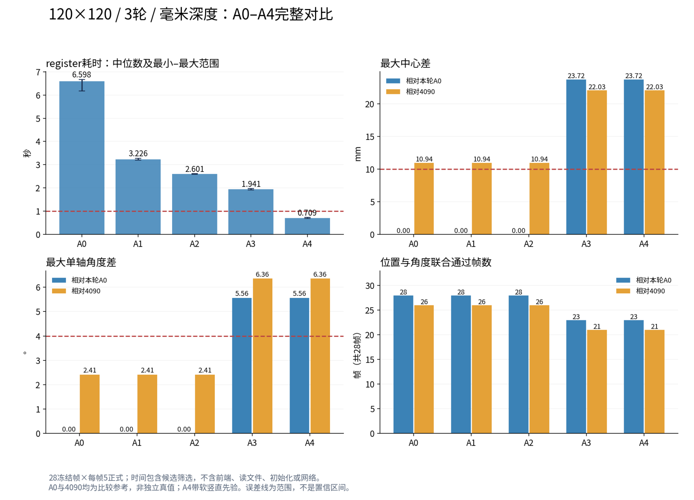
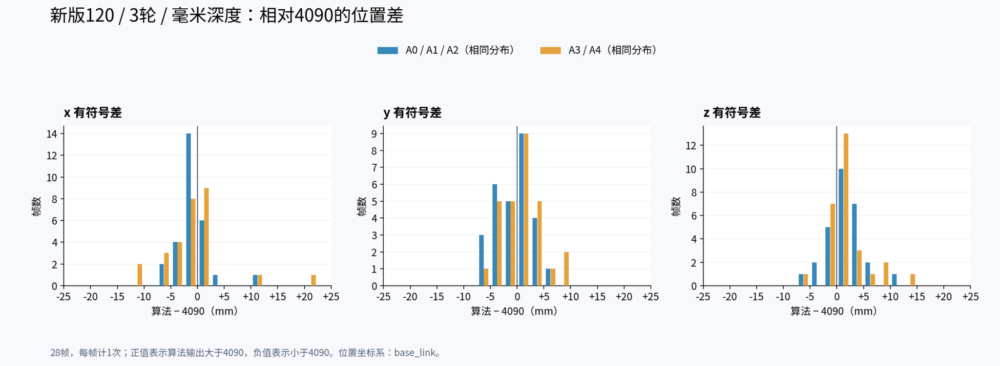
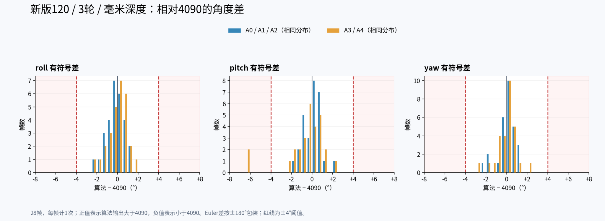
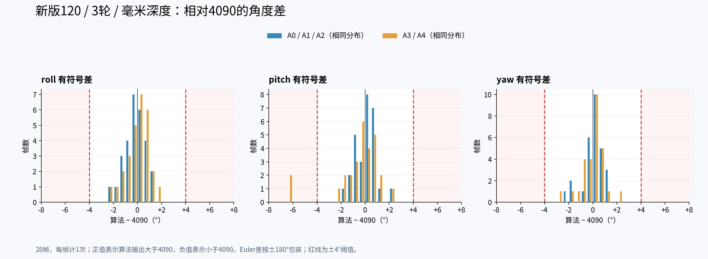
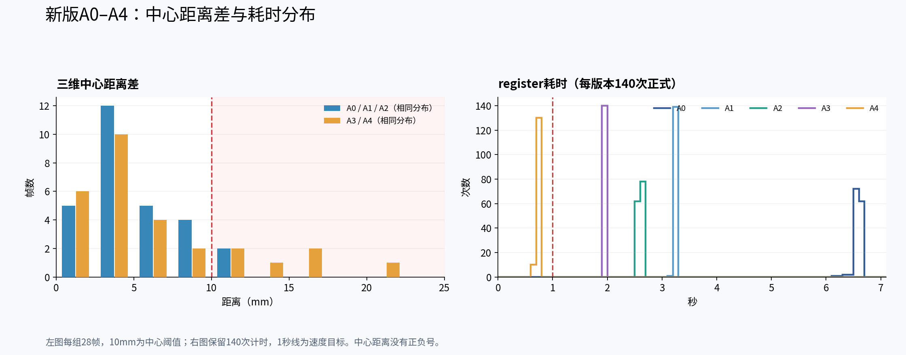

# 9_23 9_22 9_21 9_18 评估S1中的FDP部署 与 4090 FDP 对比 (4) (2) (2)

- 归档编号：`01a0cc39-2ec9-71f0-bee9-665b6e9f8e1a`
- 项目：S1 IE_lab 拆垛
- 创建时间：2026-09-23T11:04:54.735000+08:00
- 更新时间：2026-09-24T14:47:32.500000+08:00
- 状态：活动
- 导出范围：用户可见消息与助手可见回复；不含隐藏推理和工具原始输出

## 1. 用户

要不我们采用120尺寸／3轮／毫米深度，以及已经对齐4090 FDP参数，来进行 A0-A4版本的实验，如何？

## 2. 助手（进展）

可以。我会以 **120×120／3轮／毫米深度**建立新版A0基线，再测试A1–A4，并同时对照新版A0和已保存的4090结果。

先核查A3/A4的分阶段代码是否支持3轮，明确候选保留方式，避免只是把参数写成3轮、实际仍跑2轮。实验继续只在Orin独立Docker中进行，4090服务保持不动。

## 3. 助手（进展）

三轮方案可以明确为：

- A0/A1/A2：252个候选都精修3轮。
- A3：第一轮252个候选，筛选后16个候选继续精修两轮，即 **252→16→16**。
- A4：竖直先验选64个候选，第一轮后保留16个，再精修两轮，即 **64→16→16**。

我会显式设置跟踪轮数为1、缩放为1.0等参数，并记录实际每轮候选数。先做短测核查，再跑28帧完整对比；A4仍带有竖直先验这一额外条件。

## 4. 助手（进展）

新版A0短测已完成。所有版本都会记录实际精修轮数和候选数；另外增加一组“252→252→252、不筛候选”的控制测试，检查分阶段代码本身是否改变输出。

## 5. 助手（进展）

A1短测已完成：两帧的位姿矩阵与新版A0完全一致，中位耗时从约6.21秒降到3.24秒。这个结果只代表短测，完整28帧还会继续验证。

## 6. 助手（进展）

A2短测也复现了新版A0的位姿，中位耗时约2.60秒。“252→252→252”控制组与A2完全一致，说明三轮插桩在这两帧上没有引入额外位姿变化。接下来检查A3/A4实际筛掉候选后的结果。

## 7. 助手（进展）

A3短测已出现精度代价：中位耗时约1.94秒，但两帧中有一帧相对新版A0超出阈值，相对4090的最大中心差约22.03 mm。因此，旧的16候选设置不能直接视为在新配置下仍然达标。完整实验会保留这些失败结果。

## 8. 助手（进展）

所有短测进程已正常结束，但取回A4结果时，连接S1连续两次超时。结果已保存在Orin上，完整28帧批次尚未启动。我先检查连通性，避免在无法核验状态时继续提交任务。

## 9. 助手（进展）

连接已恢复，A4结果也已取回，你不需要再检查网络。A4短测中位耗时约0.71秒，但同样有一帧精度超限。

三轮实现和控制组核验已通过。现在开始A0–A4各28帧、每帧5次正式运行，完整统计速度、失败帧及有符号位置和角度差。

## 10. 助手（进展）

完整A0已完成前两帧，位姿与此前120／3轮／毫米深度结果完全一致。后续报告将以本轮重新测得的A0耗时为准，避免把不同批次的耗时混作同一次性能对比。

## 11. 助手（进展）

S1的结果下载又遇到一次连接超时，暂时没有拿到新的进度数据。我会先确认现有批次状态，不重复启动计算；结果会逐次保存在Orin独立目录中。

## 12. 助手（进展）

现在S1连Ping也没有回应，暂时无法核验远端进度。完整批次可能仍在Orin上离线执行，所以我不会重新启动它。短测数据和最后取回的A0结果已保存；需要网络恢复后，先检查现有容器和结果文件再继续。

## 13. 助手

已按这个方案启动，**4090未改动**。三轮版本定义为A3：252→16→16，A4：64→16→16。

两帧短测结果：

| 版本 | 中位耗时 | 相对新版A0 |
|---|---:|---|
| A0 | 6.21秒 | 基线 |
| A1 | 3.24秒 | 矩阵完全一致 |
| A2 | 2.60秒 | 矩阵完全一致 |
| A3 | 1.94秒 | 1帧超限 |
| A4 | 0.71秒 | 1帧超限 |

**完整28帧批次已启动，但目前S1网络中断，SSH提示“No route to host”，Ping也不通。** 远端可能仍在计算，尚不能确认完成情况，也没有重复启动。

需要先恢复S1到原网络，之后检查已有结果再继续。当前进度已保存在[状态记录](../../assets/59b0ee22c381bdd3--STATUS.json)。

[附件：59b0ee22c381bdd3--STATUS.json](../../assets/59b0ee22c381bdd3--STATUS.json)

## 14. 用户

看下现在网络恢复了没有？

## 15. 助手（进展）

我会检查S1的网络和SSH是否恢复；如果能连接，再只读查看原批次的容器和结果进度，不重复启动实验。

## 16. 助手

**网络已恢复，SSH也能正常登录S1。**

- Ping两次均成功，延迟约158–181 ms。
- 原实验容器已不在运行。
- A0保存了12次正式结果，在D03处中断；A1–A4的完整测试尚未开始。

此次仅检查状态，未重新启动实验，已有结果仍保留。

## 17. 用户

继续实验

## 18. 助手（进展）

我会继续使用 `galbot-s1-ssh` 技能，先核对并归档中断的结果，再恢复剩余实验。仍只在Orin独立Docker中处理冻结帧，4090服务保持不动。

## 19. 助手（进展）

已确认没有实验容器在运行，旧A0保存了15次推理，其中12次正式结果，停在D03。为避免混用中断前后的计时，我会保留这批记录，并从头跑完整A0，再依次跑A1–A4。

这次让有限批次在Orin上独立执行，网络短暂断开时也能继续保存结果；不会设置开机自启动。

## 20. 助手（进展）

恢复批次已开始，旧中断记录已单独归档，不计入最终统计。新版A0的D01已完成5次正式运行，位姿与此前120／3轮／毫米深度基线完全一致。

## 21. 助手（进展）

A0已完成4/28帧，20次正式结果都复现了旧对齐基线，重复输出一致。目前恢复后的网络和结果保存正常。

## 22. 助手（进展）

A0已完成9/28帧，45次正式结果均与旧对齐基线完全一致。当前中位耗时约6.58秒，后续A1–A4会与这批新基线逐帧比较。

## 23. 助手（进展）

A0已完成D01–D10，D11正在运行。所有已保存结果仍复现旧基线，没有发现恢复后出现新的位姿变化。

## 24. 助手（进展）

A0的D组12帧已完成，开始H组左腕数据；重复输出与旧对齐基线仍完全一致。

## 25. 助手（进展）

A0已完成14帧，H03L正在运行。目前中位耗时稳定在约6.59秒，尚未发现重复结果不一致。

## 26. 助手（进展）

A0已完成16帧，正在跑ChArUco组。当前所有输出均与此前120／3轮／毫米深度结果一致，基线复现正常。

## 27. 助手（进展）

A0完成18/28帧、90次正式运行，位姿和重复性检查均正常。A1–A4已排队，会在A0结束后顺序运行。

## 28. 助手（进展）

A0已完成20帧，100次正式结果均复现旧基线。接下来包含此前相对4090略超10 mm的两帧R01，它们会保留在基线中，不能算成优化新增的误差。

## 29. 助手（进展）

A0已完成22帧，并运行到第一帧R01。它再次出现约10.76 mm的中心差，与旧基线一致，说明这是已有的4090对照偏差。

## 30. 助手（进展）

A0已完成24帧。两帧R01的5次结果均稳定复现，中心差分别约10.76和10.94 mm；目前没有新增偏差。

## 31. 助手（进展）

A0完成26/28帧，剩最后两帧。全部已保存位姿仍与旧对齐基线一致，当前中位耗时约6.60秒。

## 32. 助手（进展）

A0完整基线已完成：28帧×5次正式结果全部复现旧对齐基线，中位耗时6.598秒；相对4090仍为26/28帧通过。接下来验证A1能否在完整数据上保持相同位姿。

## 33. 助手（进展）

A1已完成3帧，位姿矩阵与新版A0完全一致，中位耗时约3.21秒。等价优化在这些正式样本上保持了输出一致。

## 34. 助手（进展）

A1完成7/28帧，35次正式输出均与A0完全一致，重复结果稳定。当前中位耗时约3.22秒。

## 35. 助手（进展）

A1已完成10帧，D11正在运行。所有已保存结果仍与A0逐元素一致，尚未发现额外误差。

## 36. 助手（进展）

A1已完成16帧，覆盖全部D/H数据和首帧ChArUco数据。80次正式输出都与A0完全一致，中位耗时约3.23秒。

## 37. 助手（进展）

A1已完成20帧，进入ChArUco后半段。已保存结果仍与A0完全一致，目前耗时约为本轮A0的一半。

## 38. 助手（进展）

A1已完成23帧，正在复测第二帧R01。两帧R01对4090的偏差与A0相同，没有新增误差；A1与A0的位姿差仍为零。

## 39. 助手（进展）

A1已保存139次正式结果，全部与A0完全一致，最后一次正在收尾。A2随后会在这个基础上验证微批次和cuDNN设置的加速效果。

## 40. 助手（进展）

A1完整通过等价性核验：140次正式输出与A0完全一致，中位耗时约3.226秒。A2已开始，前面的正式结果也与A0一致，当前中位耗时约2.60秒。

## 41. 助手（进展）

A2完整结果已完成：140次正式位姿全部与A0一致，中位耗时2.601秒，最大2.616秒。它是目前已完成版本中最快、且没有引入额外位姿变化的方案；相对4090仍保留基线原有的两帧位置超限。

## 42. 助手（进展）

A3已完成5帧，中位耗时约1.94秒。D03相对新版A0仍在阈值内，但相对4090的中心差约10.05 mm，刚刚超限。这也是报告需要同时保留两种参考的原因。

## 43. 助手（进展）

A3已完成11帧，D12正在重复测试。D12已出现相对A0约12.52 mm的中心变化，超过优化误差阈值；因此A3不能再称为“保持新版A0精度”的方案。

## 44. 助手（进展）

A3已完成18帧。ChArUco中也出现超限：L03_10相对A0的中心变化约21.49 mm。约1.94秒的速度提升伴随明显精度损失，不能直接沿用旧的16候选验收结论。

## 45. 助手（进展）

A3已完成25帧，超限主要集中在ChArUco组。当前相对A0的最大中心变化约23.72 mm，相对4090约22.03 mm；剩余几帧跑完后就进入A4。

## 46. 助手（进展）

A3完整结果：中位耗时1.941秒，相对新版A0通过23/28帧，相对4090通过21/28帧，未满足全部帧的精度要求。现在只剩A4完整测试，重点看低于1秒时的精度代价。

## 47. 助手（进展）

A4已完成16帧，80次正式运行全部低于1秒，中位约0.709秒。但已出现精度超限：相对A0有D12，相对4090有D03和L01。速度目标有希望，当前精度还未通过。

## 48. 助手（进展）

五个版本已全部完成。A1、A2的140次正式位姿都与新版A0完全一致；A2中位耗时2.601秒。A4的140次都低于1秒，中位0.709秒，但相对A0仅23/28帧通过、相对4090仅21/28帧通过。

目前的结论是：A2保住了基线输出但未到1秒；A4达到了速度目标，但精度尚未达标。我正在核验证据包并整理最终报告。

## 49. 助手

_工具输出图片（原始工具文本未纳入归档）。_

## 50. 助手（进展）

核验完成，发现一个有用的细节：A3和A4在这28帧上的最终位姿完全相同。失败帧中既有“A0胜出候选被筛掉”的情况，也有“候选保留了，但最终改选另一候选”的情况，后续需要同时检查筛选和评分。

完整结果、短测和中断记录均已取回，哈希核验通过；恢复批次正常退出，实验容器已清理。

## 51. 助手

实验已全部完成：**120尺寸／3轮／毫米深度，A0–A4各28帧×5次正式测试，共700次。4090未改动。**

| 版本 | 耗时最小／中位／最大（秒） | 相对新A0达标 | 相对4090达标 |
|---|---|---:|---:|
| A0 原版 | 6.181／6.598／6.673 | 基线 | 26/28 |
| A1 Exact | 3.193／3.226／3.281 | 28/28 | 26/28 |
| A2 全候选加速 | 2.587／**2.601**／2.616 | **28/28** | 26/28 |
| A3 252→16→16 | 1.908／1.941／1.973 | 23/28 | 21/28 |
| A4 64→16→16 | 0.694／**0.709**／0.726 | 23/28 | 21/28 |

达标标准：中心差≤10 mm，三个角度差各≤4°。耗时为register，不含前端、初始化和网络。

- **A2是本轮最快的无额外位姿变化方案**：140次矩阵全部与A0一致。
- **A4全部低于1秒，但精度未达标**：相对A0最大中心差23.72 mm、最大单轴角度差5.56°。
- A3与A4在这28帧的输出完全相同，下一步应重点检查16候选筛选及后续评分，而不是继续减少候选。

[完整报告：含有符号XYZ、角度统计和失败帧](../../assets/88a706a8f833d234--REPORT.md)

[附件：88a706a8f833d234--REPORT.md](../../assets/88a706a8f833d234--REPORT.md)

## 52. 用户

| 版本耗时（秒）中心距离差（mm）\|ΔX\|（mm）\|ΔY\|（mm）\|ΔZ\|（mm） |                           |                   |                   |                   |                           |
| ---------------------------------------------- | ------------------------- | ----------------- | ----------------- | ----------------- | ------------------------- |
| A0 原版 Orin                                     | 5.895 / 7.329 / 7.471     | 0 / 0 / 0         | 0 / 0 / 0         | 0 / 0 / 0         | 0 / 0 / 0                 |
| A1 Exact                                       | 4.110 / 4.163 / 4.199     | 0 / 0 / 0         | 0 / 0 / 0         | 0 / 0 / 0         | 0 / 0 / 0                 |
| A2 全候选加速                                       | 3.011 / 3.117 / 3.140     | 0 / 0 / 0         | 0 / 0 / 0         | 0 / 0 / 0         | 0 / 0 / 0                 |
| A3 分阶段 252→16                                  | 2.662 / 2.701 / 2.745     | 0 / 0 / 7.756     | 0 / 0 / 3.421     | 0 / 0 / 7.657     | 0 / 0 / 3.354             |
| **A4 竖直先验 64→16**                              | **0.862 / 0.881 / 0.903** | **0 / 0 / 7.407** | **0 / 0 / 3.421** | **0 / 0 / 5.649** | **0 / 0 / 3.354**   |

给我类比一下这个表格，使用新调的A0-A4算法 然后对比FDP 4090 给我生成一个新的表格，如何？

## 53. 助手（进展）

我会按你这张表的格式，使用新版120尺寸／3轮／毫米深度的A0–A4结果，以4090为基准，列出耗时、中心距离差及各轴绝对差的最小值／中位数／最大值。

## 54. 助手

下面使用**新版120尺寸／3轮／毫米深度**的A0–A4，全部以**同帧FDP 4090输出为基准**。

每格均为 **最小值／中位数／最大值**；共28帧，每帧5次正式测试。XYZ按你给的表格采用绝对差。

| 版本 | 耗时（秒） | 中心距离差（mm） | \|ΔX\|（mm） | \|ΔY\|（mm） | \|ΔZ\|（mm） |
|---|---|---|---|---|---|
| A0 原版 Orin | 6.181 / 6.598 / 6.673 | 0.373 / 4.518 / 10.937 | 0.080 / 1.680 / 10.591 | 0.007 / 2.424 / 5.918 | 0.206 / 2.244 / 10.175 |
| A1 Exact | 3.193 / 3.226 / 3.281 | 0.373 / 4.518 / 10.937 | 0.080 / 1.680 / 10.591 | 0.007 / 2.424 / 5.918 | 0.206 / 2.244 / 10.175 |
| **A2 全候选加速** | **2.587 / 2.601 / 2.616** | 0.373 / 4.518 / 10.937 | 0.080 / 1.680 / 10.591 | 0.007 / 2.424 / 5.918 | 0.206 / 2.244 / 10.175 |
| A3 分阶段 252→16→16 | 1.908 / 1.941 / 1.973 | 0.757 / 4.458 / 22.033 | 0.158 / 1.925 / 20.125 | 0.135 / 2.488 / 9.139 | 0.157 / 1.649 / 12.848 |
| **A4 竖直先验 64→16→16** | **0.694 / 0.709 / 0.726** | 0.757 / 4.458 / 22.033 | 0.158 / 1.925 / 20.125 | 0.135 / 2.488 / 9.139 | 0.157 / 1.649 / 12.848 |

- **A1/A2与新版A0位姿完全一致**，所以误差统计相同。
- **A3/A4输出也完全一致**；A4达到亚秒耗时，但最大中心差为22.033 mm，未满足10 mm要求。
- 耗时仅为Orin的register。**旧表基准是旧A0，新表基准是4090，因此两表误差不能直接比较增减。**

[保存的表格文件](../../assets/a33f61627cecab45--TABLE_VS_4090_ABSOLUTE.md)

[附件：a33f61627cecab45--TABLE_VS_4090_ABSOLUTE.md](../../assets/a33f61627cecab45--TABLE_VS_4090_ABSOLUTE.md)

## 55. 用户

表格中的数据换成相对值吧，而且是否能给我画出来直方图展示一下

## 56. 助手（进展）

我把“相对值”按带正负号的差值处理，即 **新版算法输出 − 同帧4090输出**，并绘制x/y/z的分布直方图。中心距离本身没有正负号，耗时也保留原值；直方图每帧计一次。

## 57. 助手

_工具输出图片（原始工具文本未纳入归档）。_

## 58. 助手

已改为**有正负号的差值：算法输出 − 同帧4090输出**。每格为**最小／中位／最大**。中心距离没有正负号，耗时保持实测值。

| 版本 | 耗时（秒） | 中心距离差（mm） | ΔX（mm） | ΔY（mm） | ΔZ（mm） |
|---|---|---|---|---|---|
| A0 原版 | 6.181 / 6.598 / 6.673 | 0.373 / 4.518 / 10.937 | -5.500 / -0.871 / +10.591 | -5.918 / -0.061 / +5.151 | -5.462 / +1.838 / +10.175 |
| A1 Exact | 3.193 / 3.226 / 3.281 | 0.373 / 4.518 / 10.937 | -5.500 / -0.871 / +10.591 | -5.918 / -0.061 / +5.151 | -5.462 / +1.838 / +10.175 |
| A2 全候选加速 | 2.587 / 2.601 / 2.616 | 0.373 / 4.518 / 10.937 | -5.500 / -0.871 / +10.591 | -5.918 / -0.061 / +5.151 | -5.462 / +1.838 / +10.175 |
| A3 252→16→16 | 1.908 / 1.941 / 1.973 | 0.757 / 4.458 / 22.033 | -11.432 / -0.891 / +20.125 | -6.101 / +0.788 / +9.139 | -6.893 / +1.065 / +12.848 |
| A4 64→16→16 | 0.694 / 0.709 / 0.726 | 0.757 / 4.458 / 22.033 | -11.432 / -0.891 / +20.125 | -6.101 / +0.788 / +9.139 | -6.893 / +1.065 / +12.848 |

直方图每帧计一次，共28帧。由于输出相同，**A0/A1/A2合并为蓝色，A3/A4合并为橙色**，不累加样本数量。

[角度正负差直方图](../../assets/31e23a39ffdf48a7--signed_angle_histograms.png) · [中心距离与耗时直方图](../../assets/8c3f9b0a26e21f26--distance_time_histograms.png) · [完整表格与图](../../assets/b2cd75c59c5a1f99--TABLE_VS_4090_SIGNED.md)

[附件：b2cd75c59c5a1f99--TABLE_VS_4090_SIGNED.md](../../assets/b2cd75c59c5a1f99--TABLE_VS_4090_SIGNED.md)

## 59. 助手

_历史投影中的图片引用（用于补全本地对话资源）。_

