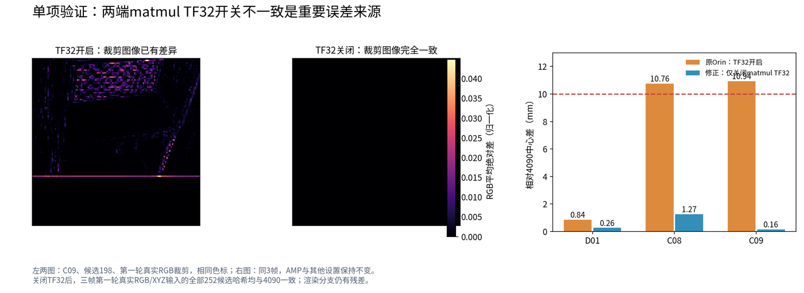

# 9_23 9_22 9_21 9_18 评估同样参数FDP A0 原版 和 4090 (… (2)

- 归档编号：`01a0d146-97fb-76f1-9d05-4491b4513b41`
- 项目：S1 IE_lab 拆垛
- 创建时间：2026-09-24T10:37:39.707000+08:00
- 更新时间：2026-09-24T16:31:21.416000+08:00
- 状态：活动
- 导出范围：用户可见消息与助手可见回复；不含隐藏推理和工具原始输出

## 1. 用户

首先我们调查一下  A0 原版为什么和 4090 FDP 的结果差距这么大？

## 2. 助手（进展）

我先把范围收窄到 **120尺寸／3轮／毫米深度的新A0**，排除A1–A4加速策略的影响。会先分析偏差最大的帧，再只读核查4090实际运行的入口、依赖和深度滤波路径，重点找尚未对齐的环节，不修改或重启4090服务。

## 3. 助手（进展）

这次会使用 `fdp-4090-ssh` 做只读核查。先确认一个边界：新A0目前相对4090的中心差中位数是4.52 mm、最大10.94 mm，26/28帧通过；旧配置的25.97 mm最大差不能混入这次调查。

## 4. 助手（进展）

发现了一个此前没查到的重要线索：4090服务的搜索路径优先加载了项目里的 **PyTorch3D、torchvision、Open3D等兼容模块**，其中旋转变换是自行实现的，并非直接使用标准库。

这还不能直接认定是根因。我会继续确认哪些兼容函数实际参与首帧推理，以及Orin是否也使用了相同实现。

## 5. 助手（进展）

目前已排除几项明显问题：两边mesh顶点和三角面完全一致，`to_origin`差异约10⁻¹⁶，不能解释毫米级位置偏差；4090按服务环境新建的检查进程也正常加载了Warp滤波，没有走“跳过滤波”回退。

仍有实际差异：4090使用自定义旋转变换，且nvdiffrast渲染器是0.4.0，Orin是0.3.3。我会先量化旋转函数差异，避免把所有依赖差异都当成根因。

## 6. 助手（进展）

旋转函数的CPU对照差异很小：在1万个测试旋转上，矩阵元素最大差约9×10⁻⁸，不能据此直接解释厘米级偏差。

我再在Orin独立Docker中做一个小对照：选两帧超限数据和D01，只替换为4090的旋转函数，其他全部保持不变。这样能判断这个兼容实现是否实际改变最终位姿，4090仍不做推理或改动。

## 7. 助手（进展）

几何核查进一步确认：转成GPU实际使用的float32后，两边顶点、法向量和`to_origin`逐元素一致。

评分记录也显示，A0多个帧的前两名分数很接近，但两帧超限并非简单的“完全同分”。接下来需要区分：是精修后的候选位姿不同，还是评分选中了不同候选。

## 8. 助手（进展）

单因素对照完成：在D01和两帧超限数据上，Orin换成4090的旋转函数后，**最终位姿和胜出候选都完全没变**。因此，这个兼容旋转函数不是这两帧偏差的原因。

目前还不能唯一定位根因。下一步应比较两端的渲染裁剪、每轮精修和最终评分，找出首次分歧，而不是继续改尺寸或迭代次数。

## 9. 助手

已经做了一轮源码、运行环境核查和小规模对照。**发现了新的实现差异，但还没有唯一锁定根因，不能直接归咎于Orin硬件精度。**

首先明确：调查的是新版 **120／3轮／毫米深度A0**，相对4090中心差中位数 **4.52 mm**、最大 **10.94 mm**，不是旧配置的25.97 mm。

| 核查项 | 结果 |
|---|---|
| 模型权重、mesh | 哈希一致 |
| mesh顶点、法向、中心转换、默认颜色 | GPU使用的float32数据一致 |
| 核心Python源码 | 35个文件中33个完全一致，其余两处差异已核查 |
| 深度滤波 | 当前4090同环境检查进程正常加载Warp滤波；没有证据表明它跳过滤波 |
| PyTorch3D | **4090使用项目自定义兼容模块，Orin使用安装库** |
| nvdiffrast渲染器 | **Orin 0.3.3，4090 0.4.0** |
| Torch／CUDA | 两边版本不同 |

我专门在Orin上做了一个单因素实验：**只换成4090的旋转变换函数**，测试D01和两帧超限数据。结果是：**位姿矩阵和胜出候选完全不变**。因此，这个旋转函数不能解释那两帧偏差。

**目前真正待查的是渲染、网络计算和评分链路。** 下一步应固定同一批初始候选，依次对比：

1. 滤波后的深度与XYZ。
2. 渲染、裁剪后的网络输入。
3. 每轮精修后的候选位姿。
4. 最终评分和胜出候选。

找到**第一次发生差异的位置**，才能判断是候选本身算得不同，还是评分选了不同候选。继续重复跑最终结果或调整尺寸，无法回答这个问题。

4090生产服务未修改、未重启；模型对照只在Orin独立Docker中执行。[完整调查报告](../../assets/14b025a6f8cef0e7--REPORT.md)

[附件：14b025a6f8cef0e7--REPORT.md](../../assets/14b025a6f8cef0e7--REPORT.md)

## 10. 用户

好的，我们继续对比

## 11. 助手（进展）

我会继续做逐阶段对比，先检查两边的深度滤波、初始候选和裁剪输入，再追踪每轮精修与最终评分。先用D01和两帧超限数据定位首次分歧；4090生产服务的代码、配置和进程都不改动。

## 12. 助手（进展）

要取得4090侧的中间数据，需要在它上面启动一个**独立的一次性诊断进程**，使用原服务的解释器和权重读取冻结帧；不会向生产进程注入代码，也不会改接口或重启服务。我会先检查GPU余量，并要求诊断进程的最终结果能复现原4090输出，再使用它的中间数据作比较。

## 13. 助手（进展）

4090侧的独立采集已经完成，插桩前后的最终位姿完全一致。Orin侧正在采集同样的数据。两边都保留全部252个候选的位姿、网络输出和评分；较大的图像张量保存全量哈希及同一组候选切片，用于定位差异。

## 14. 助手（进展）

4090诊断进程已成功逐矩阵复现原服务的三帧输出，采集结果可以用于解释原来的差异。一个关键现象是：C09两边最终都选中候选198，但位姿仍相差约10.94 mm——这帧不能只用“选中了不同候选”解释，差异已进入候选的精修结果。

## 15. 助手（进展）

找到一个明确的运行开关差异：**Orin的`matmul.allow_tf32=True`，4090为False**。

三帧的原始输入、深度滤波结果和第一轮裁剪矩阵都一致，但送进网络前的渲染、裁剪张量已经明显不同。我会只在Orin诊断进程中关闭这一项TF32矩阵乘法，再对照一次；AMP和其他设置保持不变。

## 16. 助手（进展）

单项验证已经有明显结果：只关闭Orin的`matmul TF32`，两帧超限中心差从 **10.76、10.94 mm** 降到 **1.27、0.16 mm**，三帧的胜出候选也都与4090一致。

这说明TF32开关是已验证的重要原因。我会继续核对中间张量，并将这个单项修正扩展到28帧验证，暂不改动A1–A4。

## 17. 助手（进展）

中间量也验证了这个方向：关闭TF32后，三帧第一轮的真实图像/XYZ网络输入，**全部252个候选的哈希都与4090一致**；此前这些输入已经不同。渲染侧仍有较小残差，尚未达到逐位一致。

扩展验证目前完成10帧，全部通过10 mm／逐轴4°，中心差中位数约0.28 mm。

## 18. 助手（进展）

28帧验证已完成19帧，全部通过。中心差中位数约0.26 mm；也有个别帧仍接近7.8 mm，所以目前能确认“整体显著改善”，不能说两端输出已经完全一致。

## 19. 助手（进展）

28帧验证已完成：只关闭Orin的`matmul TF32`后，**28/28帧全部通过**10 mm／逐轴4°。中心差中位数从4.52 mm降到约0.165 mm，最大值为7.76 mm。

这轮已把“底层数值差异”的猜测收窄为一个经过单项实验证实的原因。剩余残差仍存在；此次扩展验证是每帧1次预热＋1次正式，不冒充此前的5次重复验收。

## 20. 助手

_工具输出图片（原始工具文本未纳入归档）。_



## 21. 助手

**找到了一个主要原因，并完成了单项验证：两边的TF32矩阵乘法开关不同。**

| 设置 | 原Orin A0 | 4090 |
|---|---|---|
| `torch.backends.cuda.matmul.allow_tf32` | **True** | **False** |
| AMP混合精度 | 开启 | 开启 |

输入都标记为float32，但这个开关不同，会使矩阵乘法采用不同的精度路径。

逐阶段检查发现：**原始输入、深度滤波结果一致，明显差异在网络运行前的渲染和裁剪阶段就已出现。** 仅在Orin中设置：

```python
torch.backends.cuda.matmul.allow_tf32 = False
```

AMP和其他配置保持不变，结果如下：

| 相对4090的指标 | 修正前A0 | 修正后A0 |
|---|---:|---:|
| 达标帧数 | 26/28 | **28/28** |
| 中心差中位数 | 4.518 mm | **0.165 mm** |
| 最大中心差 | 10.937 mm | **7.765 mm** |
| 最大roll／pitch／yaw差 | 2.262／2.096／2.414° | **1.425／0.538／0.718°** |

原来两帧超限的中心差，分别从 **10.76、10.94 mm** 降到了 **1.27、0.16 mm**。

这次28帧采用每帧 **1次预热＋1次正式**，两次输出一致；尚未做5次正式验收，也未重测A1–A4。**下一步应在显式关闭这个开关的新基线上重新验证加速版本，不能直接沿用旧A4的精度结论。**

4090生产服务未修改、未重启。[完整报告与阶段证据图](../../assets/fd13ff7da813fa81--REPORT.md)

[附件：fd13ff7da813fa81--REPORT.md](../../assets/fd13ff7da813fa81--REPORT.md)

## 22. 用户

继续下一步

## 23. 助手（进展）

我会把 `matmul.allow_tf32=False` 固定到新版实验中，重新验证A0–A4。先做短测确认三轮候选流程和基线一致性，再跑同一套28帧、每帧5次正式测试；所有推理继续只在Orin独立Docker中执行，4090生产服务保持不动。

## 24. 助手

本轮停在准备阶段：只读取了配置，尚未启动关闭TF32后的A0–A4复验，也未改动4090服务。

## 25. 用户

我们继续验证

## 26. 助手（进展）

我继续验证：统一关闭 `matmul TF32`，保持AMP和其他设置不变，重测A0–A4。先检查是否有遗留任务，再做短测和28帧×5次正式验收；仅使用Orin独立Docker，不改动4090服务。

## 27. 助手（进展）

没有发现遗留的运行容器，三帧短测已启动，覆盖D01和此前两帧R01。A3仍按252→16→16、A4按64→16→16执行，先只检验TF32修正的影响，不同时调整候选数量。

## 28. 助手（进展）

A0和A1短测已完成：三帧全部满足相对4090的阈值，A1的位姿矩阵与新A0完全一致。短测中位耗时分别约4.61秒和2.32秒，接下来核查A2及分阶段版本。

## 29. 助手（进展）

A2短测也与新A0逐矩阵一致，三帧全部通过，中位约2.13秒。目前A1/A2没有因关闭TF32而出现新的位姿变化；完整28帧仍需继续验证。

## 30. 助手（进展）

不剪枝控制组已完成，输出与A2完全一致，三轮插桩核查通过。现在开始检验首轮筛到16个候选后，精度是否仍能保持。

## 31. 助手（进展）

A3短测仍有一帧超限：中位耗时约1.43秒，但相对4090的最大中心差约16.68 mm。说明TF32修正解决了基线的一部分问题，首轮只保留16个候选仍可能带来额外误差。

## 32. 助手（进展）

短测核查全部完成。A4中位约0.55秒，但也有一帧中心差超限；A1/A2则保持与新A0相同的位姿。

现在按计划完成五个版本各28帧×5次正式验收。批次会在Orin上独立顺序执行，网络短暂断开也不会触发重复启动。

## 33. 助手（进展）

完整批次已开始。另外，短测定位到一个具体问题：C09中，新A0最终胜出的候选，在A4第一轮评分里只排第38–39名，保留16个时会被丢掉。

我先完成既定A0–A4复验；如果A4仍超限，再单独验证保留48或64个候选，保留原结果不覆盖。

## 34. 助手（进展）

A0已完成6帧，D07正在运行。所有已保存位姿都与此前关闭TF32的初验结果完全一致，重复输出稳定；本轮耗时会以这批重新测得的数据为准。

## 35. 助手（进展）

A0完成8/28帧，D09正在运行。已完成帧全部满足相对4090的阈值，位姿仍与初验一致，没有发现重复波动。

## 36. 助手（进展）

A0已完成10帧，D11正在运行。当前最大中心差约5.00 mm，所有已保存位姿仍复现初验；没有改变任何算法参数。

## 37. 助手（进展）

A0的D组12帧和H01L已完成，全部通过。H02L正在运行，5次重复结果目前均保持一致。

## 38. 助手（进展）

A0的D/H共15帧已全部完成，75次正式结果均通过，且逐矩阵复现此前修正后的基线。现在开始ChArUco组。

## 39. 助手（进展）

A0已完成17帧。ChArUco L01的中心差稳定在约7.76 mm，仍在10 mm以内，5次输出一致；这是目前的最大中心差。

## 40. 助手（进展）

A0完成18帧，L03_10正在收尾。已保存结果全部通过，未发现相对初验的新偏差或重复波动。

## 41. 助手（进展）

A0已完成20帧，103次正式结果仍与修正后的初验完全一致。后面会重点复核原来超限的两帧R01。

## 42. 助手（进展）

A0已完成23帧。原来中心差10.76 mm的C08，现在5次正式结果均稳定在约1.27 mm，全部通过；正在复核C09。

## 43. 助手（进展）

A0完成25/28帧，全部通过。C09也已完成5次正式运行，中心差稳定在约0.16 mm，复现了单因素修正的结果。

## 44. 助手（进展）

A0已保存134次正式结果，全部通过且与初验一致。最后两帧收尾后，将自动进入A1完整验收。

## 45. 用户

我们继续

## 46. 助手（进展）

我先检查TF32关闭后的A0–A4批次现在运行到哪里，再从已保存结果继续，不会重复启动已有版本。

## 47. 助手（进展）

A2已完成，140次正式输出仍与修正后的A0逐矩阵一致，中位耗时约2.17秒。批次已自动进入A3；我会继续读取进度并保留失败帧。

## 48. 助手（进展）

A3已完成4帧，D03相对A0和4090的中心差都略超10 mm；目前最大约10.88 mm。A3仍在继续测试全组。

## 49. 助手（进展）

A3已完成11帧；目前仍只有D03超限，全部重复输出一致。中位耗时约1.63秒。

## 50. 助手（进展）

A3已完成18帧，D03仍是唯一超限帧，最大中心差约10.88 mm。ChArUco剩余帧还在测试。

## 51. 助手（进展）

A3已完成25帧，出现第二帧超限：R01（右腕）中心差约16.68 mm。当前中位耗时约1.68秒；速度提升仍伴随位置误差。

## 52. 助手（进展）

A3的完整验收已完成：中位耗时1.679秒，21/28帧相对4090通过，超限仍是D03和C09，与这批A0基线的失败帧相同。A4正在运行。

## 53. 助手（进展）

关闭TF32后，A0与4090的28帧都通过了10 mm／逐轴4°阈值。A4仍有一帧C09超限；我会核对短测中的候选排名，判断保留数量是否值得进一步调整。

## 54. 助手（进展）

完整测试显示，A4唯一超限的是C09；A0的对应候选198在A4首轮64个候选中排第38–39名，被保留16个时筛掉。我会额外验证保留48个候选，看看能否修复C09，同时保住亚秒速度。

## 55. 助手（进展）

新增短测启动前发现本地复制清单的旧文件路径不对，尚未启动新的推理容器或覆盖任何结果。我正在修正这份清单引用后继续。

## 56. 助手（进展）

短测启动脚本指向了旧实验目录，导致本次keep48命令没有执行；完整批次没有受影响。我会先检查有没有生成临时文件，再修正脚本路径后重试。

## 57. 用户

等一下，刚才银河G1 正在重启，现在应该好了

## 58. 助手（进展）

我先确认G1已重启、网络恢复且没有遗留的keep48容器或输出文件，再从现有A0–A4进度继续，不重复运行完整批次。

## 59. 助手（进展）

G1网络已恢复，旧的keep48短测进程也未运行。重启前它只完成了模型初始化，没有保存任何推理结果；我会用新的run ID重新做五帧短测，避免覆盖这次记录。

## 60. 助手（进展）

新run ID的keep48测试已启动，Orin容器正在初始化模型，旧日志和输出没有被覆盖。初始化完成后我会先核对5帧结果，再决定是否扩展到完整28帧。

## 61. 助手（进展）

刚才发现清单引用没接入runner，keep48短测实际上只跑了D01和C09。我会保留这两帧结果，但不把它当作五帧验收；修正runner后再跑完整清单。

## 62. 助手（进展）

runner文件的替换没有成功，远端刚启动的这组仍只覆盖两帧，不会当作五帧短测。我会保留并归档这次输出，再确认五帧清单正确后重跑。

## 63. 助手（进展）

两帧误覆盖结果和日志已单独归档、不计入统计。修复后的短测现在按清单覆盖D01、D03和三帧超限ChArUco数据，每帧各跑一次预热和正式推理。

## 64. 助手（进展）

发现keep48诊断脚本漏设了本轮A0–A4统一使用的`matmul.allow_tf32=False`。这批keep48结果是在不同精度设置下得到的，不能用于当前对比；我会保留它们作为无效旧尝试，并按正确设置重跑短测。

## 65. 助手（进展）

TF32正确设置下，keep48短测通过4/5帧，中心差两帧 R01 反向变化：修复C09，但新增C08超限。它没有通过短测验收，我不会据此扩大完整批次。

我再测候选数64的变体：保留初始筛出的全部64个候选继续三轮，查看能否解决这组取舍。

## 66. 助手（进展）

keep64短测再次因样本清单帧名拼错，在开始推理前就退出了，没有生成结果。我会修正帧名，归档这条启动日志后重跑；不计入实验数据。
