# 9_7 周会汇报 制定VLA实验路线方案

- 归档编号：`01a06f17-863a-7300-bb82-78e5ac992f1b`
- 项目：VLA G1 项目
- 创建时间：2026-09-05T09:03:27.805000+08:00
- 更新时间：2026-09-07T11:23:46.746000+08:00
- 状态：活动
- 导出范围：用户可见消息与助手可见回复；不含隐藏推理和工具原始输出

## 1. 用户

你应该能看到这个项目的其他对话吧 现在我需要和经理汇报VLA 实验路线计划方案，可能是不是用Lerobot平台？还是用蚂蚁lingbot平台，例如 先做ACT 然后 叠衣服 ，还有模型选型 像是 pi0.5 smlvla 或者是银河星脑，最好有模型之间的能力对比分析，理论分析（例如不同网络结构产生的不同能力差距和需要的硬件差距于执行的任务差距还有能力边界），还有可行性分析，最终的成功率是如何的。
综合一下这个项目的其他对话的信息，现在我应该算是调通了数采设备，机器人控制还需要继续进行。

给我点建议，报告我是直接用 .md来进行展示还是什么方式比较好，里面可能有流程图、网络结构、表格对比、以及文字表述的形式

## 2. 助手（进展）

可以，我会先核对这个项目目录里的资料，并读取同一项目下可访问的其他任务记录，再据此给你一套适合向经理汇报的结构与载体建议。这里我会使用 OpenAI Docs 技能确认“跨任务可见性”的边界，避免把我实际没读到的内容当成已知信息。

## 3. 助手（进展）

我先把工作拆成三条并行线：同项目其他任务记录、当前工作区里的实验资料、平台与模型的公开能力边界。这样最后给你的不是泛泛的“做个 PPT”，而是一份贴合你现状的汇报框架。

## 4. 助手（进展）

目前已经确认一个关键判断：你的“平台选择”不应简单做成 LeRobot 对 LingBot 的二选一。更合理的表述是“LeRobot 做实验与数据闭环底座，ACT 做可控基线；SmolVLA / π0.5 / LingBot-VLA 作为递进模型分支”。我正在核验各模型最新公开实现和硬件门槛，尤其要把“公开指标”和“我们项目上的预估成功率”严格分开。

## 5. 助手

能看到当前 Codex 可访问的其他任务，但不会自动继承全部上下文。这次我实际读取了数采、SynthNova、G1 控制和模型选型等相关任务。

## 先给结论

给经理汇报时，建议：

> **PPTX 作为主汇报，导出 PDF 备用；Markdown 作为完整技术方案和长期事实源。**

不要直接拿原始 `.md` 做正式汇报。Markdown 适合版本管理、详细论证和后续协作，但经理汇报更需要结论、路线、风险、资源和决策点，PPT 更合适。

## 当前进度应这样表述

| 模块 | 当前状态 | 已有证据 |
|---|---|---|
| GP001 遥操主臂数采 | 已打通 | 宿主机直读 100/100 帧有效、坏帧 0、双臂各 7 维、约 95.2Hz |
| SynthNova 验证 | 已打通 | 虚拟 G1 双臂跟随，5 秒 494 帧、约 93–96Hz |
| G1 状态读取 | 已打通 | Galbot SDK 1.9.0、控制器、URDF、关节状态和时间戳已验证 |
| G1 真机控制 | 待验收 | 安全微动作程序、14 项软件测试和真机 dry-run 已通过，但尚未真正运动 |
| 完整 VLA 数采 | 尚未闭环 | 四路相机、机器人状态、遥操动作、时间同步和完整 episode 尚未联合实测 |
| 模型训练部署 | 尚未开始 | ACT、SmolVLA、π0.5 等仍处于选型阶段 |

所以不要笼统说“数采已经全部完成”，更准确的是：

> **遥操主臂硬件采集链路已经打通；完整多模态 VLA 数据闭环仍待验证。**

当前机器人控制证据在 [g1_arm_smoke_test/README.md](<../../assets/d1560a47987e7d4f--README.md>)。

## 推荐技术路线

LeRobot 和 LingBot 不是同一层级的二选一：

- **LeRobot**：数据格式、训练、评测和部署框架。
- **LingBot-VLA**：使用 LeRobot 数据格式的候选模型。
- **Galbot SDK**：真正连接 Galbot G1 的控制和安全执行层。
- **银河星脑 AstraBrain**：厂商产品路线，公开自助微调、权重导出和部署接口仍不明确。

建议主线：

```text
GP001 + G1相机 + G1状态
        ↓
      MCAP原始数据
        ↓
时间同步、回放与质量检查
        ↓
   LeRobot Dataset v3
        ↓
ACT基线 → SmolVLA → π0.5 / LingBot-VLA 2.0
        ↓
     4090策略服务器
        ↓
限位、速度、碰撞、超时安全层
        ↓
      Galbot SDK
        ↓
  真机评测与失败数据回采
```

Galbot 已公开 MCAP 转 LeRobot 工具，包含四路相机和 23 维状态/动作，但输出是 LeRobot v2.1，建议保留 MCAP 原始真值并迁移到 v3。[Galbot MCAP 转换器](https://github.com/GalaxyGeneralRobotics/galbot-mcap2lerobot)；[LeRobot 总览](https://huggingface.co/docs/lerobot/main/index)

## 模型选型建议

| 模型 | 结构带来的能力 | 4090 情况 | 项目定位 |
|---|---|---|---|
| ACT | CVAE + Transformer，预测动作块；精确、快速、易排错 | 约 2–6GB 训练级别 | 必做基线 |
| SmolVLA | 450M VLM + flow-matching 动作专家；支持图像、状态、语言 | 约 10–16GB，4090 合适 | 第一条正式 VLA 主线 |
| π0.5 | 大型视觉语言骨干 + flow-matching 动作专家；预训练迁移能力更强 | 推理 >8GB、LoRA >22.5GB、全参 >70GB | 第二阶段对比 |
| LingBot-VLA 2.0 | 6B、原生深度、未来视频蒸馏、稀疏 MoE、统一动作表示 | 4090D 推理约 130ms；后训练更适合多张 48GB 级卡 | 泛化能力上限研究 |
| AstraBrain | G1 厂商原生大小脑一体化体系 | 公开硬件和训练要求不足 | 供应商 PoC/产业对标 |

参考：[LeRobot 硬件指南](https://huggingface.co/docs/lerobot/hardware_guide)、[SmolVLA](https://huggingface.co/docs/lerobot/smolvla)、[openpi](https://github.com/Physical-Intelligence/openpi)、[LingBot-VLA 2.0](https://github.com/Robbyant/lingbot-vla-v2)、[银河星脑](https://galbot.com/about/)。

理论上可以概括为：

- ACT 的动作分块减少逐帧误差积累、训练快，但语言语义和分布外泛化弱。
- VLM 给 SmolVLA、π0.5 带来物体语义和语言条件能力，但不会自动解决 G1 的关节映射、标定和控制问题。
- Flow matching 更适合生成连续、多模态动作，但推理更慢，需要异步推理或实时动作块衔接。
- LingBot 的深度、未来视频和 MoE 有利于几何、时序及跨本体能力，但训练、数据和集成成本最高。

## 不建议直接从叠衣服开始

叠衣服属于柔性物体、双臂、长时序任务，不是简单首任务。建议任务阶梯：

1. 单关节与夹爪闭环；
2. 固定点到达和轨迹回放；
3. 单臂固定位置刚体取放；
4. 随机位置刚体取放；
5. 语言选择红/蓝物体；
6. 抓取方巾角并放到标记点；
7. 固定初态方巾单次对折；
8. 最后做完整 T 恤折叠。

也就是：

> **先用 ACT 验证刚体取放，再用 ACT/SmolVLA 做方巾原子技能，最后进入完整叠衣。**

## 成功率怎么汇报

现在不能科学承诺最终成功率，因为尚无 G1 真机运动和模型 rollout 数据。建议报告写成“验收目标”，不要写成“预测结果”：

- ACT 固定场景刚体取放：目标 ≥80%，50 次独立测试；
- 位置、光照轻度变化：目标 ≥60%～70%；
- 固定初态方巾单次对折：首轮目标 ≥60%，迭代目标 ≥80%；
- 随机皱态完整 T 恤折叠：作为探索目标，暂不承诺百分比。

同时解释长任务的成功率乘法效应：5 个步骤若每步成功率都是 90%，端到端只有约 59%；每步达到 95%，端到端也只有约 77%。因此原子技能和控制必须先做到极稳。

## PPT 建议结构

建议 10–12 页：

1. 一页结论与需要经理批准的事项
2. 当前进度红黄绿状态
3. 项目目标和第一阶段边界
4. 完整系统流程图
5. 分阶段实验路线
6. LeRobot、LingBot、Galbot SDK 的关系
7. 模型能力对比表
8. 网络结构与硬件差异
9. 任务难度阶梯
10. 评测方法与成功率目标
11. 时间、算力和机器人资源
12. 风险、备选路线和决策请求

附录放完整模型资料、数据字段、网络结构细节和测试协议。

经理最终需要做的决策最好只有三项：

- 是否批准“LeRobot 底座 + ACT 基线 + SmolVLA 主线”；
- 是否同意首任务先做刚体取放、叠衣后移；
- 是否协调 4090、机器人测试时间和 AstraBrain 厂商接口信息。

下一步最适合同时制作一份完整 `.md` 技术方案和一套 10–12 页 `.pptx` 汇报稿，PPT 再导出 PDF。

[附件：d1560a47987e7d4f--README.md](../../assets/d1560a47987e7d4f--README.md)

## 6. 用户

或者我们用word 或者 PDF 行不行？ 三四页 或者最多五到七页
放在 lsy03@lsy03-System-Product-Name:~/Lsy03_document/项目进度/VLA 汇报$  这里

先帮我理清思路，整体的汇报结构是什么？

## 7. 助手

可以，而且比 PPT 更适合这种“需要保留理论分析、表格和实施细节”的汇报。

建议采用：

> **Word 作为可编辑源文件，PDF 作为正式交付文件；A4 横向，正文 6 页 + 1 页附录。**

3～4 页会压得太紧，模型结构、硬件和成功率分析容易变成堆表格。6 页最平衡，不单独占一页做封面。

整体叙事顺序应当是：

> **现在做到哪了 → 推荐走哪条路线 → 为什么这样选 → 怎么分阶段实施 → 如何评估成功 → 需要经理决定什么**

## 推荐的 6+1 页结构

| 页码 | 本页回答的问题 | 主要内容 | 推荐形式 |
|---|---|---|---|
| 第1页 | 结论是什么？ | 项目目标、当前阶段、推荐路线、3项核心结论 | 一页摘要＋红黄绿状态 |
| 第2页 | 现在真实做到哪了？ | GP001数采、SynthNova、G1状态读取、真机控制、完整数据集的进度与证据 | 状态表＋关键数字 |
| 第3页 | 整体技术路线是什么？ | Galbot SDK、MCAP、LeRobot、ACT、VLA模型、4090推理服务器、安全层的关系 | 主流程图 |
| 第4页 | 平台和模型为什么这样选？ | ACT、SmolVLA、π0.5、LingBot-VLA 2.0、银河星脑的架构、算力、任务和能力边界 | 核心对比表＋简化网络图 |
| 第5页 | 实验怎么逐步做？ | 控制闭环→刚体取放→随机位置→语言选择→方巾→叠衣；数据量、里程碑、退出条件 | 阶段路线图／时间轴 |
| 第6页 | 是否可行，成功如何判断？ | 可行性等级、成功率目标、测试方法、主要风险、资源和时间需求 | 验收表＋风险矩阵 |
| 第7页 | 结论依据是什么？ | 参考资料、模型官方链接、实验日志截图、数据字段和术语说明 | 附录 |

## 第1页：管理层摘要

标题建议：

> 《Galbot G1 VLA实验路线与阶段计划》

这一页只放四块内容：

1. 项目目标
   在 Galbot G1 上走通“遥操采集—数据转换—模型训练—真机部署—量化评测”的完整 VLA 闭环。

2. 当前状态
   - 遥操主臂数采链路：已验证；
   - G1 状态读取与安全预检：已验证；
   - 真机机械臂运动：待验收；
   - 完整多模态数采和模型训练：尚未开始。

3. 推荐路线
   **Galbot SDK + MCAP + LeRobot + ACT基线 + SmolVLA主线 + π0.5/LingBot后续对比。**

4. 经理需要决定
   - 是否批准该技术主线；
   - 是否同意第一任务先做刚体取放；
   - 是否协调4090、机器人测试时间及银河星脑厂商接口。

本页顶部可以直接写一句结论：

> 当前已经打通遥操主臂数据读取，但机器人控制和完整多模态数据闭环尚未完成；下一阶段应先以 ACT 验证工程链路，再逐步升级至 VLA 和叠衣任务。

## 第2页：当前项目进度

必须把“已验证”和“待验证”明确分开：

- GP001 宿主机直读：100/100帧有效，坏帧0，约95.2Hz；
- SynthNova虚拟双臂跟随：5秒494帧，约93～96Hz；
- G1 SDK、URDF、控制器、状态时间戳：dry-run通过；
- 14项软件测试通过；
- 尚未执行真机机械臂运动；
- 尚未联合验证相机、机器人状态、遥操动作和episode记录；
- 尚未训练任何模型。

这一页特别要说明：

> “数采设备已经调通”目前指遥操主臂硬件链路，不代表完整VLA数据集已经打通。

## 第3页：总体技术架构

建议只放一张核心流程图：

```text
GP001遥操主臂       G1四路相机       G1关节/夹爪状态
      └──────────────┬──────────────┘
                     ↓
              MCAP原始数据
                     ↓
       时间同步、质量检查、Episode切分
                     ↓
             LeRobot Dataset v3
                     ↓
       ACT → SmolVLA → π0.5/LingBot
                     ↓
              4090策略服务器
                     ↓
        动作映射、限幅、碰撞与看门狗
                     ↓
                 Galbot SDK
                     ↓
             G1执行与结果评测
```

核心观点是：

> LeRobot负责数据和模型实验闭环，Galbot SDK负责机器人执行，LingBot属于候选模型，不是LeRobot的替代平台。

## 第4页：模型与理论分析

这一页放一张主表，正文只解释四个原理：

- ACT动作分块为什么训练快、动作平滑，但分布外泛化弱；
- VLM为什么带来语言与视觉语义，但不能自动解决机器人本体差异；
- Flow Matching为什么能生成连续动作，但会增加推理延迟；
- LingBot的深度、未来视频和MoE为什么增强几何及时序能力，同时显著提高训练成本。

本页结论：

> ACT用于发现数据和控制问题；SmolVLA用于验证低成本语言VLA；π0.5用于泛化对比；LingBot-VLA 2.0用于高算力上限研究；银河星脑用于供应商PoC。

## 第5页：实验阶段计划

推荐按阶段门推进：

1. G0：真机单关节、夹爪与安全闭环；
2. G1：四路相机＋状态＋动作同步记录；
3. G2：ACT固定场景刚体取放；
4. G3：ACT随机位置取放；
5. G4：SmolVLA语言选择物体；
6. G5：π0.5或LingBot对比；
7. G6：抓方巾角、单次对折；
8. G7：完整衣物折叠。

这里要明确：

> 叠衣服不是第一阶段的“简单任务”，而是柔性物体、双臂和长时序的综合验收任务。

## 第6页：可行性、成功率和风险

建议将可行性写成等级，而不是现在就承诺最终百分比：

| 目标 | 当前可行性判断 | 建议验收目标 |
|---|---|---:|
| 完整数据—训练—部署闭环 | 高 | 全链路稳定运行 |
| 固定场景刚体取放 | 中高 | ≥80% |
| 随机位置或轻度光照变化 | 中 | ≥60%～70% |
| 固定初态方巾单次对折 | 中 | 首轮≥60% |
| 随机皱态完整T恤折叠 | 当前偏低 | 暂不承诺 |

正式实验建议每种条件50次独立测试，记录：

- 严格任务成功率；
- 子步骤完成率；
- 平均完成时间；
- 人工接管次数；
- 安全层拦截次数；
- 失败原因分类。

最后列出风险：机器人控制、时间同步、数据质量、本体适配、推理延迟、柔性物体状态不确定性。

## 第7页：附录

只放经理追问时需要的内容：

- GP001采集结果截图；
- G1 dry-run及测试结果；
- 模型官方资料链接；
- 观测与动作字段定义；
- 成功判定标准；
- “Galbot G1”和“Unitree G1”不得混淆的说明。

建议文件最终放为：

- `/home/lsy03/Lsy03_document/项目进度/VLA 汇报/Galbot_G1_VLA实验路线与阶段计划_v0.1.docx`
- `/home/lsy03/Lsy03_document/项目进度/VLA 汇报/Galbot_G1_VLA实验路线与阶段计划_v0.1.pdf`

等结构确认后，再生成 Word 和 PDF；写入该目录时系统可能需要一次目录权限确认。

## 8. 用户

经理需要决定
是否批准该技术主线；
是否同意第一任务先做刚体取放；
是否协调4090、机器人测试时间及银河星脑厂商接口。

这一块最好不要出现，我口头来说就行

## 9. 助手

同意，这部分不应出现在书面报告里，避免报告显得像“向经理提要求”。需要支持或审批的内容由你口头补充即可。

结构调整为：

- 第1页不再写“经理需要决定”，改为“下一阶段目标”：
  - 完成G1真机控制闭环；
  - 建立完整多模态数据集；
  - 完成ACT刚体取放基线；
  - 为后续VLA和叠衣实验建立可复用链路。

- 第6页不写“资源申请”，改为中性的“实施条件与外部依赖”：
  - 已具备RTX 4090；
  - 需要稳定的G1真机实验窗口；
  - 银河星脑的微调及部署接口有待进一步确认。

整份报告最终叙事就是：

> 当前进度 → 推荐技术路线 → 模型理论与硬件对比 → 分阶段实验计划 → 可行性与成功率评估 → 风险与下一步工作

第一页最后可以用这句话收尾：

> 下一阶段将优先完成G1真机控制和完整数据闭环，以ACT建立可解释、可量化的刚体取放基线，再逐步扩展至SmolVLA、π0.5及柔性物体操作。

最后一页则以“下一阶段预期产出”结束：

- G1机械臂与夹爪安全控制闭环；
- 一套可回放、可训练的LeRobot数据集；
- ACT刚体取放基线及量化测试结果；
- SmolVLA与大型VLA模型的适配条件结论；
- 方巾单次对折实验的进入条件。

这样书面材料只负责呈现事实、判断和计划；技术路线批准、实验优先级、机器人时间及厂商协调等内容由你在汇报时口头提出。

## 10. 用户

可以，现在我们重新理清思路，整体的汇报结构是什么？

## 11. 助手

建议把汇报定位为“阶段进展 + 后续实验路线”，而不是单纯的模型调研报告。

文件形式仍建议：

> Word 源文件 + PDF 汇报版，A4 横向，正文 6 页，附录可选第 7 页，不单独设置封面页。

整体逻辑是：

> **项目要做什么 → 已经做到哪 → 准备怎么搭系统 → 为什么这样选模型 → 实验如何逐级推进 → 如何判断可行与成功**

## 第1页：项目目标与核心结论

标题：

> 《Galbot G1 VLA实验路线与阶段计划》

内容包括：

- 项目目标：在 Galbot G1 上走通采集、数据、训练、部署和真机评测闭环。
- 当前阶段：遥操主臂数采已通，G1状态读取已通，真机运动控制待完成。
- 推荐主线：

```text
Galbot SDK + MCAP
→ LeRobot数据底座
→ ACT工程基线
→ SmolVLA主线
→ π0.5 / LingBot-VLA对比
→ 方巾及叠衣实验
```

本页核心结论：

> 当前重点不是直接追求大型VLA模型，而是先完成机器人控制和完整数据闭环，以ACT建立可解释的工程基线。

## 第2页：已完成工作与当前停点

使用“已验证／待验证／未开始”三段式状态表。

已验证：

- GP001宿主机直读100/100帧有效；
- 双臂各7维关节数据，约95.2Hz；
- SynthNova虚拟G1双臂跟随正常；
- G1 SDK、URDF、控制器和状态时间戳正常；
- 真机dry-run及14项软件测试通过。

待验证：

- 真机机械臂实际运动；
- 夹爪控制；
- GP001到G1的动作映射；
- 急停、限速、异常停止闭环；
- 相机、状态和遥操动作统一时间同步。

未开始：

- 完整MCAP episode；
- LeRobot数据集；
- ACT训练和真机部署；
- VLA模型对比；
- 方巾与叠衣实验。

本页要强调：

> “数采设备已调通”目前指遥操主臂采集链路，不代表完整VLA多模态数据链路已经完成。

## 第3页：整体技术路线与系统架构

以流程图为主体：

```text
GP001遥操主臂       G1四路相机       G1关节/夹爪状态
      └──────────────┬──────────────┘
                     ↓
                MCAP原始记录
                     ↓
       时间同步、质量检查、Episode切分
                     ↓
             LeRobot Dataset v3
                     ↓
       ACT → SmolVLA → π0.5/LingBot
                     ↓
              4090策略服务器
                     ↓
     动作映射、限位、碰撞检测、看门狗
                     ↓
                 Galbot SDK
                     ↓
             G1执行与结果评测
```

同时明确三个层级：

- Galbot SDK：机器人状态和安全执行层；
- LeRobot：数据、训练、部署和评测底座；
- ACT、SmolVLA、π0.5、LingBot：不同策略模型。

本页结论：

> LeRobot与LingBot不是二选一；LingBot是运行在标准机器人数据之上的候选模型。

## 第4页：模型选型、理论差异与硬件要求

用一张核心对比表呈现：

| 模型 | 主要结构 | 核心能力 | 4090适配 | 项目定位 |
|---|---|---|---|---|
| ACT | CVAE＋Transformer动作分块 | 闭集模仿、动作平滑、训练快速 | 轻松 | 必做基线 |
| SmolVLA | 轻量VLM＋Flow Matching动作专家 | 语言条件、视觉语义、消费级训练 | 合适 | 第一条VLA主线 |
| π0.5 | 大型VLM＋动作专家 | 更强预训练迁移和场景泛化 | 推理可行，LoRA较紧 | 第二阶段对比 |
| LingBot-VLA 2.0 | 深度＋未来视频＋稀疏MoE | 几何、时序、跨本体和长任务 | 推理可行，训练较重 | 泛化上限研究 |
| AstraBrain | 厂商大小脑一体化体系 | G1原生集成潜力 | 公开信息不足 | 产业对标 |

理论分析只解释四点：

- 动作分块为什么减少误差积累，但可能降低快速响应能力；
- VLM为什么提升语义能力，却不能解决关节映射和控制问题；
- Flow Matching为什么适合连续动作，但增加推理延迟；
- 深度、未来视频和MoE为什么提升能力，同时增加数据与硬件需求。

## 第5页：分阶段实验路线

建议用阶段门或时间轴：

1. G0：真机单关节与夹爪控制；
2. G1：遥操主臂到G1动作映射；
3. G2：四路相机、状态、动作同步采集；
4. G3：ACT固定场景刚体取放；
5. G4：随机位置取放及失败数据回采；
6. G5：SmolVLA语言选择物体；
7. G6：π0.5或LingBot横向比较；
8. G7：方巾角抓取与单次对折；
9. G8：完整衣物折叠。

每阶段都写清楚：

- 输入条件；
- 实验任务；
- 预期产物；
- 进入下一阶段的验收条件。

本页核心结论：

> 叠衣服作为后续综合任务，第一阶段先用刚体取放验证完整技术链路。

## 第6页：可行性、评测方式与下一步

### 可行性判断

- 完整技术链路：可行性高；
- 固定场景刚体取放：中高；
- 语言条件多物体操作：中等；
- 固定初态方巾对折：中等；
- 随机皱态完整T恤折叠：当前风险较高。

### 建议验收目标

- ACT固定刚体取放：≥80%；
- 位置或光照轻度变化：≥60%～70%；
- 固定初态方巾单次对折：首轮≥60%；
- 完整衣物折叠：完成前序实验后再设指标。

每种正式条件建议测试50次，记录：

- 端到端成功率；
- 子步骤完成率；
- 平均耗时；
- 人工接管次数；
- 安全拦截次数；
- 失败原因。

最后以“下一阶段预期产出”收尾：

- G1机械臂与夹爪安全控制闭环；
- 完整多模态MCAP样例；
- 可回放的LeRobot数据集；
- ACT刚体取放基线；
- 第一版量化成功率和失败分析。

## 第7页：可选附录

如果控制在6页，可以不放；如果允许7页，附录包括：

- GP001采集结果截图；
- G1 dry-run和测试结果；
- 数据字段说明；
- 模型官方来源；
- 成功判定标准；
- 重要术语说明。

这样报告的重点比例大约是：

- 当前进度：25%
- 技术路线：20%
- 模型与理论：20%
- 实验计划：20%
- 可行性和评测：15%

模型对比只占一页，避免整份报告变成“模型资料汇总”，真正突出你已经完成的工作和接下来可执行的路线。

## 12. 用户

好的我们现在开始形成文档

## 13. 助手（进展）

我会按刚才确定的结构，直接生成一份 A4 横向、正文 6 页、附录 1 页的 Word，并导出对应 PDF，放到 `/home/lsy03/Lsy03_document/项目进度/VLA 汇报/`。我会使用 Documents 技能负责 Word 的排版与逐页渲染检查，再用 PDF 技能核验最终 PDF；如果目录写入受到权限限制，系统会弹出一次授权请求。

## 14. 助手（进展）

Documents 技能要求在动笔前完整读取创建与渲染规范，并在没有现成模板时先做模板选择。我正在完成这一步；它会直接影响页面尺寸、表格密度和最终 PDF 的可读性，暂时还不会写入文件。

## 15. 助手（进展）

模板选择工具在当前环境中不可用，因此我会采用我们已确定的版式：正式技术汇报风格、A4 横向、黑色标题、深蓝表头、少装饰、每页一个结论。现在开始正式生成 Word 和 PDF。

## 16. 助手（进展）

初稿已经生成。接下来按 Documents 技能要求进行第一次逐页渲染：重点检查是否恰好为 7 页，以及模型表、流程图和附录链接有没有出现溢出、压缩或分页错位。

## 17. 助手（进展）

第一次渲染失败是运行时兼容问题：打包版 LibreOffice 要求更高版本的系统 GLIBC，并非文档内容错误。我已确认系统自带 LibreOffice 7.3 可用，接下来按 PDF 技能允许的手动渲染路径继续，不会降低检查标准。

## 18. 助手

_工具输出图片（原始工具文本未纳入归档）。_

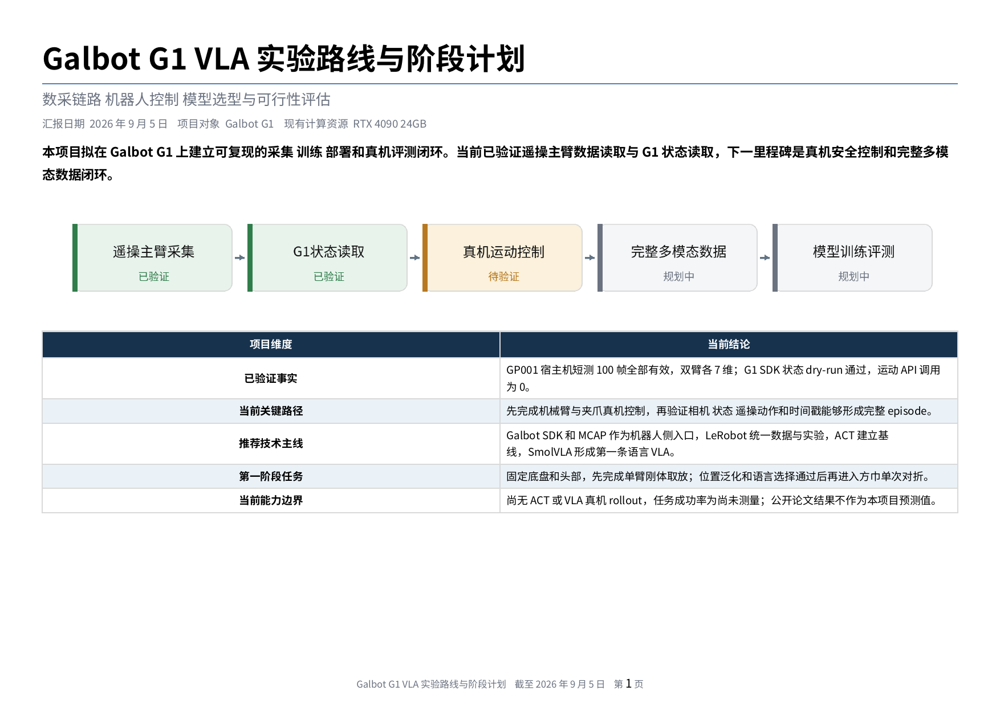

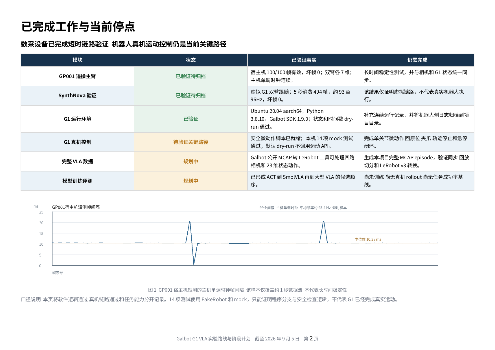

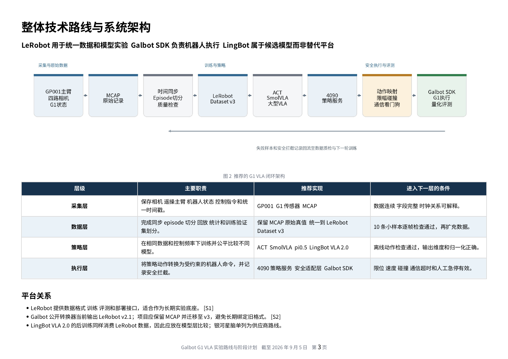


## 19. 助手

_工具输出图片（原始工具文本未纳入归档）。_

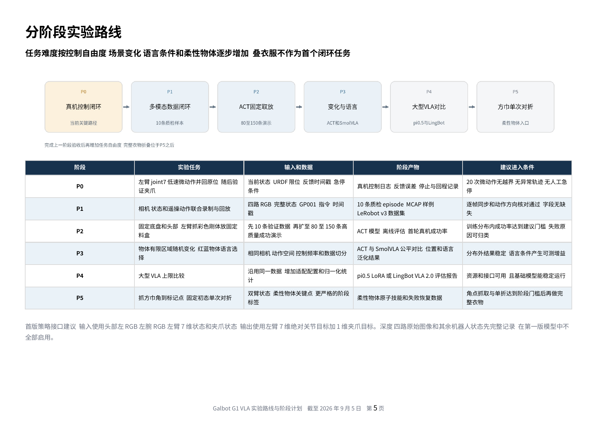


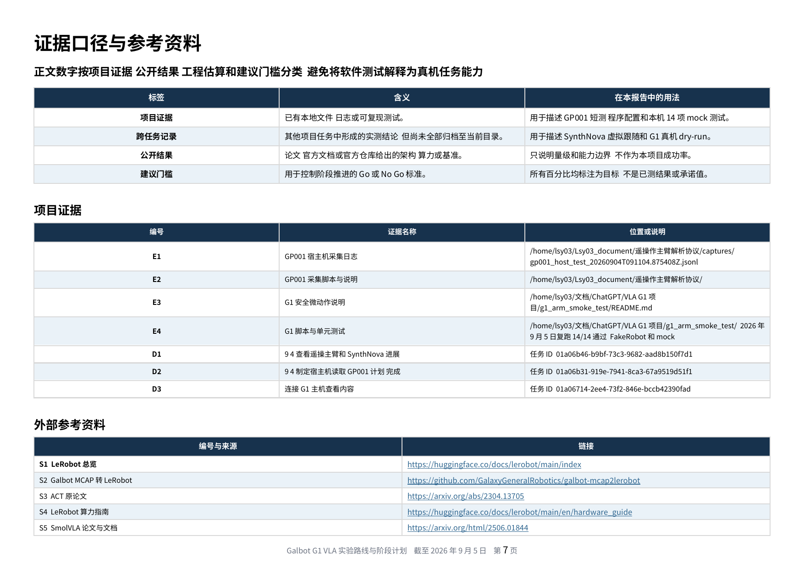

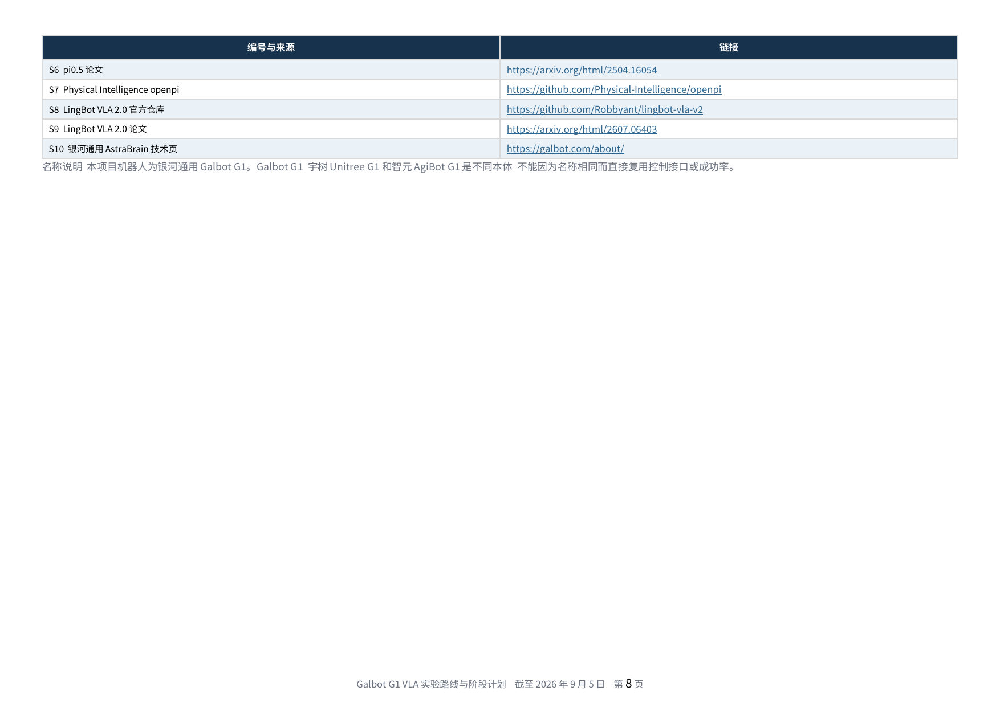

## 20. 助手（进展）

第一次视觉检查结果：正文 1 到 6 页排版清晰，问题集中在两个地方——Word 默认标题样式带出了一条蓝色横线，以及附录参考资料被挤到第 8 页。我会移除标题边框，并把 10 条外部来源改成双列短链接表，压回计划中的 7 页；同时把“目标门槛”和“实测结果”的措辞再收紧。

## 21. 助手

_工具输出图片（原始工具文本未纳入归档）。_

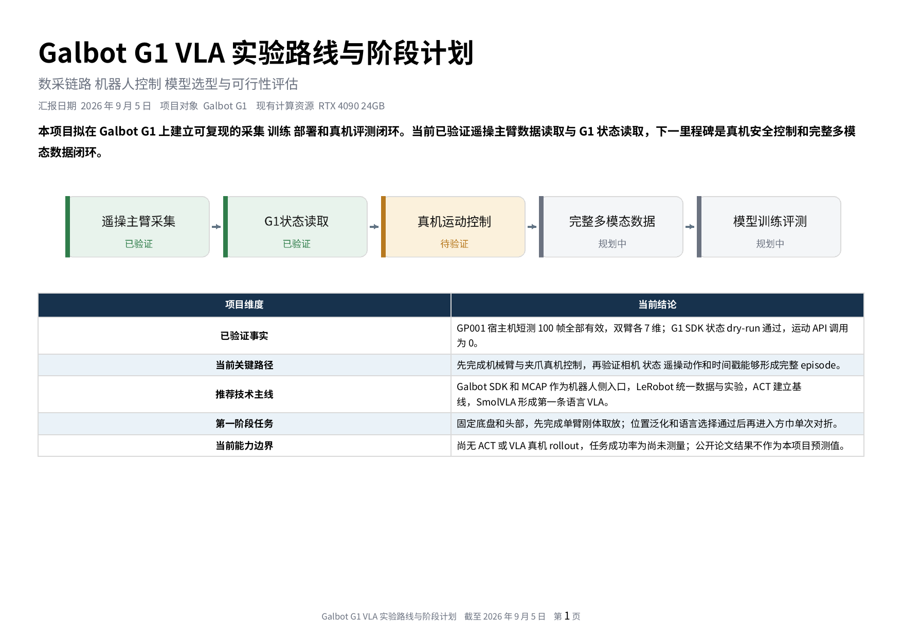

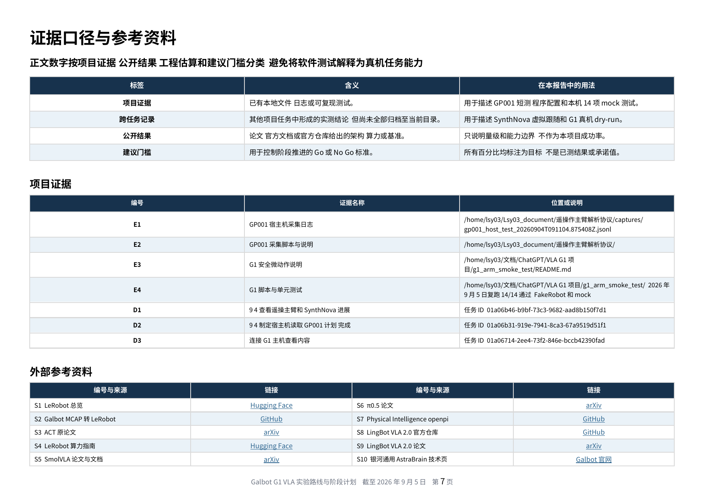


## 22. 助手（进展）

修订版已经稳定为 7 页，标题边框也已移除。现在进行最终逐页检查；这一步会核对所有 7 页，而不是只抽查封面和模型表。

## 23. 助手

_工具输出图片（原始工具文本未纳入归档）。_


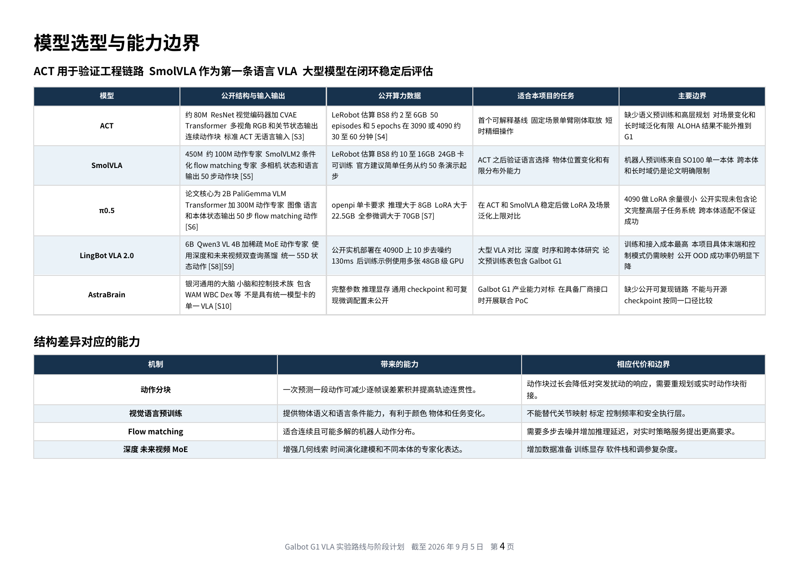

## 24. 助手

_工具输出图片（原始工具文本未纳入归档）。_


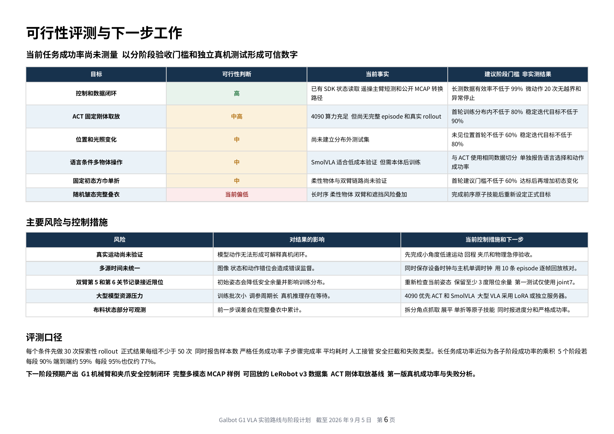


## 25. 助手（进展）

最终视觉检查已经通过，没有发现溢出、重叠或缺字。无障碍审计还发现 4 张图缺少替代文本；我会补上中文图像说明并再做一次最终渲染，这不会改变版式，但能让 Word 的可访问性更完整。

## 26. 助手

_工具输出图片（原始工具文本未纳入归档）。_


## 27. 助手（进展）

PDF 版式检查通过，但结构检查发现 LibreOffice 没有把 Word 中的 10 个外部链接导出为可点击注释。为避免 PDF 里的参考资料只剩下不可追踪的域名，我正在补强超链接标记并验证导出结果；如果系统版 LibreOffice仍不保留链接，我会改成显示可复制的短网址。

## 28. 助手

_工具输出图片（原始工具文本未纳入归档）。_

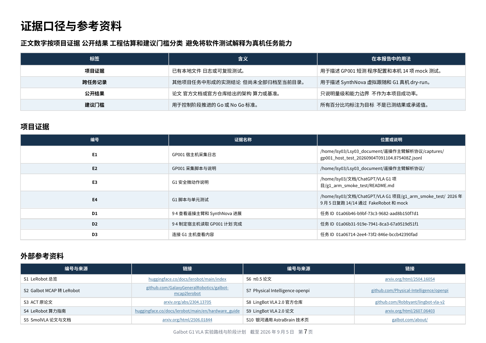

## 29. 助手

_工具输出图片（原始工具文本未纳入归档）。_


## 30. 助手（进展）

文档和 PDF 已完成最终检查：共 7 页、A4 横向，全部页面无溢出或缺字，4 张图已有替代文本，PDF 中也保留了可复制的完整参考网址。现在只剩把两个最终文件复制到你指定的 `VLA 汇报` 目录。

## 31. 助手

文档已完成并放入指定目录：

- Word 可编辑版：:codex-file-citation{path="/home/lsy03/Lsy03_document/项目进度/VLA 汇报/Galbot_G1_VLA实验路线与阶段计划_v0.1.docx" purpose="output"}
- PDF 汇报版：:codex-file-citation{path="/home/lsy03/Lsy03_document/项目进度/VLA 汇报/Galbot_G1_VLA实验路线与阶段计划_v0.1.pdf" purpose="output"}

报告为 A4 横向，共 7 页，包含项目进度、系统架构、模型与硬件对比、实验路线、成功率口径、风险及证据附录。已删除“经理需要决定”部分，改为客观的下一阶段工作和预期产出。

两个文件已逐页渲染检查，无内容溢出、缺字或表格错位；Word 无障碍审计也已通过。

## 32. 用户

我看了一下，要不我们另外写一版，下午有个简短的汇报，不是最正式的大汇报，这次的汇报不用太详细，就简短一点就行了，报告里面不需要太多的文字，简洁一点，你看着办，我计划就是两个部分，第一部分是整体技术路线于整体架构，第二部分是分阶段的实验路线。先写一版给我先看看

## 33. 助手（进展）

我会另做一份“下午简短汇报版”，不覆盖上一版。采用 A4 横向两页：第1页只讲整体技术路线与系统架构，第2页只讲分阶段实验路线，正文以流程图和阶段表为主，删除模型理论、成功率、风险和参考资料等展开内容。先生成 Word 和 PDF 给你看。

## 34. 助手（进展）

简版会保留一句当前进度，但不再展开数采数字、模型参数和成功率分析。版式上每页只有一张主流程图和一张三列表，确保你下午口头讲时不用照着文档念。

## 35. 助手（进展）

初稿已生成，但新版 Documents 技能要求只能使用它自带的 LibreOffice 做渲染。当前失败原因是打包版依赖的 GLIBC 版本高于宿主机；我正在检查运行包内是否同时提供了兼容库，先尝试修复官方渲染链路，不会改用系统版绕过检查。

## 36. 助手（进展）

打包版 LibreOffice缺少可运行的系统库，因此这次不能按技能要求验证并交付 Word。考虑到你现在只是下午先看一版，我会先交付两页 PDF 预览；内容确认后再继续处理可编辑 Word，避免把未经渲染核验的文件交给你。

## 37. 助手（进展）

两页 PDF 初稿已经生成，页数和 A4 横向尺寸正确。现在检查两页的实际视觉效果，重点看流程箭头、表格行高和底部“最近一步”是否过密。

## 38. 助手

_工具输出图片（原始工具文本未纳入归档）。_

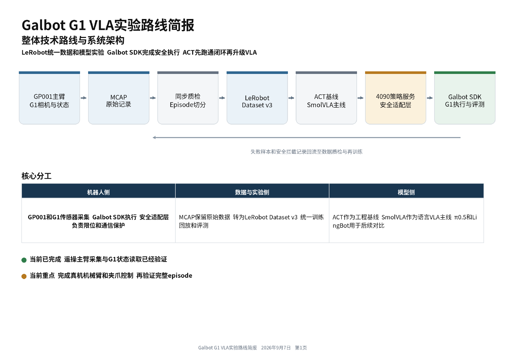

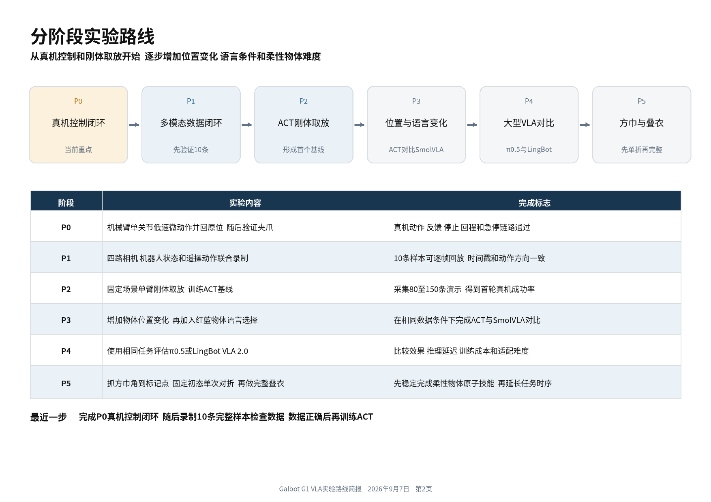

## 39. 助手（进展）

初稿的整体密度合适，两页都能一眼讲清。只发现第1页“模型侧”单元格把 LingBot 从中间断行了；我会把这一格改成“ACT基线、SmolVLA主线、大型VLA后续对比”，让简版更干净。

## 40. 助手

_工具输出图片（原始工具文本未纳入归档）。_

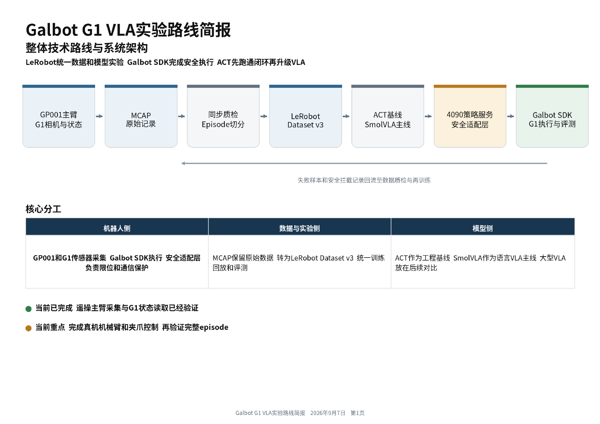


## 41. 助手（进展）

两页简版已经通过视觉检查：第一页讲整体技术架构，第二页讲六阶段实验路线，没有模型参数、成功率和风险展开。现在把 PDF 放到之前的 `VLA 汇报` 目录，原来的七页正式版不会被覆盖。

## 42. 助手

两页简版已经完成：:codex-file-citation{path="/home/lsy03/Lsy03_document/项目进度/VLA 汇报/Galbot_G1_VLA实验路线简报_20260907_v0.1.pdf" purpose="output"}

- 第1页：整体技术路线与系统架构
- 第2页：P0至P5分阶段实验路线

内容以流程图和简表为主，适合下午简短汇报。

本轮先交付 PDF 预览。Documents 技能要求 Word 必须通过 LibreOffice 渲染验证，但打包版运行环境与当前系统 GLIBC 不兼容，因此没有交付未经验证的 Word。你先看这一版内容和布局，确认后我再调整。

## 43. 用户

MCAP是啥？

## 44. 助手（进展）

MCAP 不是模型，而是机器人数据记录文件格式。我结合你现在的 G1 数采链路，把它和 LeRobot 数据集的关系说明清楚。

## 45. 助手

MCAP 可以理解成“机器人多模态数据的原始录像文件”。

它不是模型，而是一种开源日志容器格式，用来把多路带时间戳的数据保存在一个文件里，例如相机、关节状态、遥操指令和传感器消息。[MCAP 官方说明](https://mcap.dev/)

在你的 G1 项目里，理想的数据链路是：

```text
G1相机
G1关节和夹爪状态
GP001遥操动作
时间戳和标定信息
        ↓
      .mcap文件
        ↓
时间同步、质量检查、Episode切分
        ↓
LeRobot Dataset
        ↓
训练ACT、SmolVLA等模型
```

可以把它类比成 ROS 里的 bag 文件：

- `.mcap`：原始数据记录，适合长期保存和回放；
- `LeRobot Dataset`：整理后用于训练的数据集，通常包含视频、Parquet 状态和动作数据。

需要注意的是，你目前 GP001 宿主机测试保存的是 `.jsonl` 日志，不是 MCAP。后续需要把 G1 相机、机器人状态和遥操动作统一记录成完整 MCAP，才能形成真正的 VLA 训练数据。

简单说：

> **MCAP 是原始数据仓库，LeRobot 是训练数据集，ACT/SmolVLA 是使用这些数据训练的模型。**
