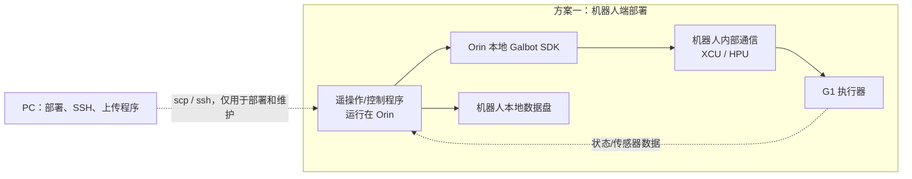
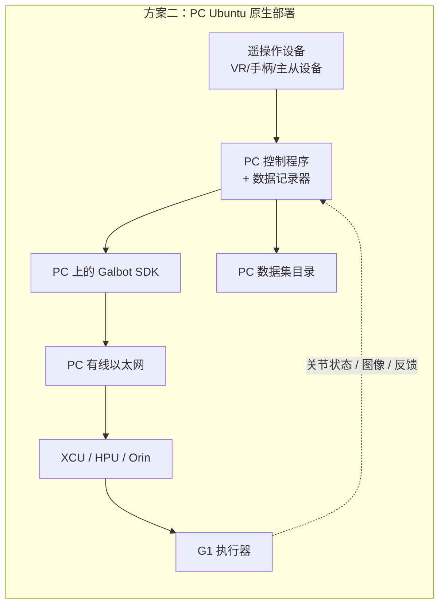
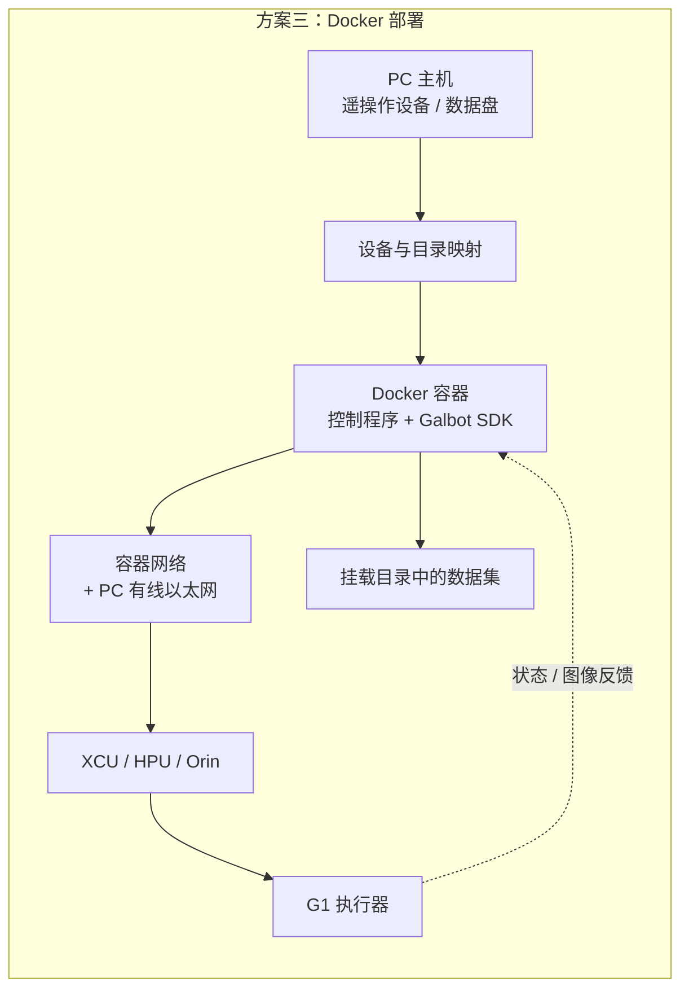
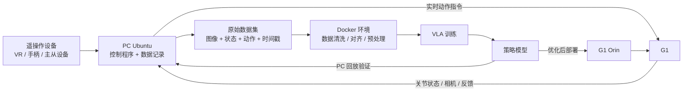

# 对比三种G1控制方案

- 归档编号：`01a08030-6908-74e0-89c3-c9cd314b3647`
- 项目：VLA G1 项目
- 创建时间：2026-09-08T16:44:11.400000+08:00
- 更新时间：2026-09-08T16:48:33.975000+08:00
- 状态：活动
- 导出范围：用户可见消息与助手可见回复；不含隐藏推理和工具原始输出

## 1. 用户

给我分析这三种方案控制G1的流程上的区别，各有什么优劣？ 给我画图直观感受三者的差异

[附件：6cbd365afb6a1066--pasted-text.txt](../../assets/6cbd365afb6a1066--pasted-text.txt)

## 2. 助手（进展）

我会先梳理你贴的 G1 文档里三种控制方案的完整调用链，再用可视化技能画一张对比图，突出“控制入口、数据流、实时性和开发成本”的差异。

## 3. 助手（进展）

可视化技能的实际路径与技能清单中的别名目录不同，我已定位到缓存目录，接下来按该技能说明执行并继续读取文档内容。

## 4. 助手

## 结论

针对“遥操作采集数据 + 训练 VLA”这个目标，我建议：

> **数采首选：PC 端 Ubuntu 原生部署**
> **训练/预处理：Docker 部署**
> **最终稳定推理或产品化：机器人端 Orin 部署**

如果现在只能三选一，选 **PC 端 Ubuntu**。

这三种方案本质上不是三种不同的 G1 控制 API，而是：

- 控制程序运行在哪里；
- PC 与机器人之间是否存在网络控制链路；
- SDK 和依赖是否被容器隔离；
- 遥操作设备、相机、数据记录程序如何组织。

---

## 一、三种方案的控制流程

### 方案一：机器人端部署

程序运行在 G1 的 Orin 上。PC 只负责部署、上传和登录。



运行过程大致是：

1. PC 交叉编译或准备 Python 程序；
2. 通过 `scp` 上传到 Orin；
3. SSH 登录机器人；
4. 在 Orin 上运行控制程序；
5. 程序通过本地 SDK 控制 G1；
6. 数据先记录在机器人本地，之后再拷回 PC。

优点：

- 控制链路短；
- 没有 PC 到机器人的运行时网络延迟；
- 通信开销最小；
- 实时性和稳定性最好；
- 适合最终部署和长时间运行。

缺点：

- 遥操作设备、相机、VR、主从设备如果接在 PC 上，需要额外建立数据链路；
- 修改程序需要重新上传，C++ 还需要交叉编译；
- 调试、日志查看、数据导出不方便；
- 控制程序、数据采集程序和 VLA 预处理可能竞争 Orin 资源；
- 不适合作为第一阶段快速试错环境。

关键问题是：

> 如果遥操作设备在 PC 上，而控制程序在 Orin 上，那么仍然需要“PC → Orin”的命令传输。这样就失去了部分本地部署的优势。

---

### 方案二：PC 端 Ubuntu 原生部署

控制程序、SDK、遥操作设备和数据记录程序都运行在 PC 上，通过有线以太网控制 G1。



运行过程大致是：

1. PC 与 G1 通过以太网转接板连接；
2. 配置 PC、XCU、HPU 的 IP；
3. 在 PC 安装 x86_64 SDK；
4. 在 PC 编译和运行控制程序；
5. 遥操作设备直接输入到 PC 程序；
6. PC 通过 SDK 和网络向 G1 发送控制指令；
7. G1 的状态、图像和动作数据回传给 PC；
8. PC 直接保存完整数据集。

优点：

- 最适合遥操作设备接入；
- 控制、相机、数据记录、可视化都能集中在 PC；
- 编译、调试和修改最快；
- 数据可以直接写入大容量硬盘；
- 方便实时查看轨迹、画面和控制状态；
- 最适合快速迭代 VLA 数据采集流程。

缺点：

- 控制指令需要经过以太网；
- 网络抖动、PC 调度和进程负载可能影响控制周期；
- 必须正确配置 PC、XCU、HPU 网络；
- PC 断电、程序崩溃或网线断开会影响控制；
- PC 环境长期使用后可能出现依赖污染。

对于遥操作数采，PC 端的主要优势不是“控制延迟最低”，而是：

> 遥操作输入、视觉数据、机器人状态、动作标签和数据集可以在一个地方完成时间同步和记录。

---

### 方案三：Docker 部署

Docker 不是另一种机器人通信方式，而是把 PC 上的 SDK 和控制程序放到容器里。



运行过程大致是：

1. PC 配置机器人网络；
2. 拉取 SDK 镜像；
3. 执行 `run.sh` 启动容器；
4. 在容器中运行控制和数据采集程序；
5. 容器通过宿主机网络访问 G1；
6. 通过挂载目录保存数据。

优点：

- SDK、Python、系统库版本隔离；
- 团队成员使用相同运行环境；
- 方便固定依赖版本；
- 适合 VLA 的 PyTorch、CUDA、数据预处理环境；
- 换机器、重装环境时更容易复现。

缺点：

- 网络、USB、相机、GPU、目录挂载都需要正确配置；
- 出问题时要区分“程序问题”和“容器问题”；
- 遥操作设备可能需要额外的设备映射；
- 容器网络可能增加调试复杂度；
- 对单机快速数采来说，收益不一定大；
- Docker 本身不会降低控制延迟，也不会自动提升实时性。

所以：

> Docker 的核心价值是“环境隔离和可复现”，不是“更快地控制 G1”。

---

## 二、三者对比

| 维度 | 机器人端 Orin | PC Ubuntu | Docker |
|---|---|---|---|
| 控制程序位置 | G1 Orin | PC | PC 上的容器 |
| 运行时网络 | 基本无 PC→G1 链路 | PC→G1 有线网络 | 容器→宿主机网络→G1 |
| 控制实时性 | 最好 | 较好，受网络和 PC 调度影响 | 通常接近 PC，但多一层配置 |
| 遥操作设备接入 | 较麻烦 | 最方便 | 可行，但需设备映射 |
| 数据记录 | 先记在机器人上 | 直接记在 PC | 记到挂载目录 |
| 开发调试 | 较慢 | 最快 | 中等 |
| 环境复现 | 中等 | 较弱 | 最好 |
| 网络故障影响 | 最小 | 较大 | 较大 |
| 适合快速采集 | 一般 | 最好 | 较好 |
| 适合最终部署 | 最好 | 一般 | 一般 |
| 主要价值 | 实时性、稳定性 | 迭代、数采、调试 | 隔离、复现、训练环境 |

---

## 三、针对 VLA 的推荐架构



推荐分工：

### 阶段 1：遥操作数据采集

使用 **PC Ubuntu 原生部署**：

- 遥操作设备接 PC；
- 控制程序运行在 PC；
- 通过有线网控制 G1；
- 相机、关节状态、遥操作动作、时间戳统一记录；
- 数据直接写入 PC 大硬盘。

### 阶段 2：数据处理和 VLA 训练

使用 **Docker**：

- 固定 Python、PyTorch、CUDA 和数据处理依赖；
- 处理图像、动作、状态和时间戳；
- 训练不同版本的 VLA；
- 保证团队成员环境一致。

### 阶段 3：策略验证和产品化

先在 **PC 端回放验证**：

- 检查模型是否产生合理动作；
- 检查动作限幅和安全策略；
- 检查控制频率和延迟。

稳定后，再将推理程序迁移到 **机器人端 Orin**，用于最终自主运行。

---

## 四、最终选型建议

### 推荐组合

> **PC Ubuntu 原生数采 + Docker 训练 + Orin 最终部署**

这是最符合 VLA 项目实际开发节奏的组合：

```text
PC Ubuntu：负责遥操作、控制、采集、调试
Docker：负责数据处理、训练、环境复现
Orin：负责最终实时推理和稳定运行
```

### 什么时候选机器人端部署？

适合：

- 最终产品运行；
- 已经确定控制程序；
- 对实时性和稳定性要求高；
- 遥操作设备本身能够接入机器人端；
- 不需要频繁修改控制逻辑。

### 什么时候选 PC Ubuntu？

适合：

- 当前正在采集数据；
- 需要频繁调试；
- 遥操作设备、相机和记录程序都在 PC；
- 需要实时观察动作和数据质量。

### 什么时候选 Docker？

适合：

- 多人协作；
- Python/CUDA/PyTorch 依赖复杂；
- 需要复现实验环境；
- 训练和预处理环境容易污染 PC；
- 已经有稳定的控制程序，想把环境固化。

---

## 五、落地前需要特别检查

你贴出的文档里存在版本示例不一致：

- 页面版本是 SDK `1.9.1`；
- Docker 示例镜像是 `galbot_sdk:1.8.0`；
- 机器人端示例库文件显示 `1.7.0`。

因此不要直接混用示例版本。实际部署前应执行：

```bash
galbot_sdk check-version
```

同时建议优先确认：

1. SDK 版本与机器人 GBS 版本兼容；
2. PC、XCU、HPU 可以互相 `ping`；
3. 控制指令、实际关节状态和图像使用统一时间戳；
4. 记录“期望动作”和“实际动作”，不要只记录遥操作输入；
5. 网线断开、程序崩溃时 G1 是否进入安全状态；
6. Docker 的网络、设备映射和数据目录挂载是否正确。

一句话总结：

> **数采阶段优先 PC Ubuntu，训练阶段使用 Docker，最终稳定运行迁移到机器人 Orin。**
