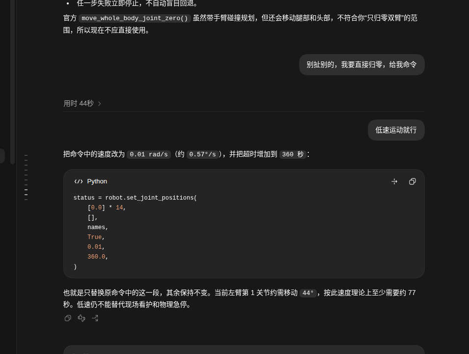
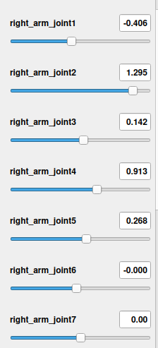
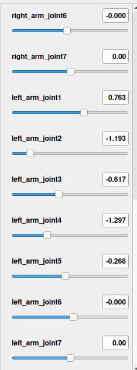
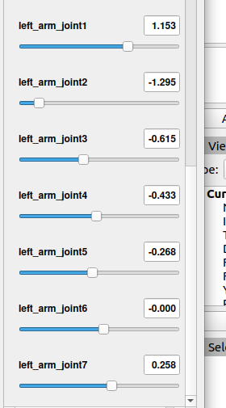

# 9_9 验证无线 SSH 与 G1 SDK 控制成功 ！

- 归档编号：`01a083a5-6b82-7982-a1c6-ef69ce870f7a`
- 项目：VLA G1 项目
- 创建时间：2026-09-09T08:50:51.407000+08:00
- 更新时间：2026-09-09T17:38:39.521000+08:00
- 状态：活动
- 导出范围：用户可见消息与助手可见回复；不含隐藏推理和工具原始输出

## 1. 用户

如果我想用 ssh 无线进入10.34.216.136 进入G1（不使用有线），并验证G1上的SDK是否能使用？就进行一些简单机械臂的关节角读取或者关节控制就行，我应该如何操作？

[附件：e124cdcbceb88cfd--pasted-text.txt](../../assets/e124cdcbceb88cfd--pasted-text.txt)

## 2. 助手（进展）

我会先阅读你贴的 G1 文档和当前项目里的说明，核对无线 SSH、SDK 环境及关节接口的准确命令，再整理成一套可直接执行、含安全检查的步骤。

## 3. 助手

可以。SSH 本身不区分有线/无线；只要电脑到 `10.34.216.136` 的路由走 Wi‑Fi 接口，就属于无线进入 G1。建议按“网络确认 → 只读 SDK 验证 → 现场微动作”三步进行。

项目记录显示 G1 用户名是 `galbot`，历史地址为 `10.34.216.136`。这个地址曾正常使用，但也出现过 `No route to host`，所以先验证当前网络。

### 1. 确认确实走无线网络

先拔掉电脑网线，然后在电脑执行：

```bash
ip route get 10.34.216.136
```

输出应包含无线接口，例如：

```text
10.34.216.136 dev wlan0 ...
```

接口也可能叫 `wlp...`。如果显示 `eth0`、`enp...`，仍在走有线。

继续检查：

```bash
ping -c 4 10.34.216.136
ssh galbot@10.34.216.136
```

首次连接时核对 SSH 主机指纹，不建议使用 `StrictHostKeyChecking=no` 绕过验证。

如果出现 `No route to host`，检查：

```bash
ip -br addr
ip route
```

电脑的 Wi‑Fi 地址通常需要和 G1 可路由，例如同处 `10.34.216.0/24`。如果网络启用了客户端隔离，即使连着同一个 Wi‑Fi 也可能无法互通。

登录 G1 后，可以确认地址：

```bash
hostname
ip -br addr
```

历史主机名应为 `galbot-echo`。如果无线和有线同时配置了相同地址，必须拔掉 G1 网线后再测试，才能确证是无线链路。

### 2. 只读验证 SDK和关节角

G1 上已经部署过一套只读验证程序。登录后运行：

```bash
cd /home/galbot/vla_g1_readonly_20260907
bash robot_g1/run_read_g1_state.sh
```

也可以从电脑直接运行：

```bash
ssh -t galbot@10.34.216.136 \
  'cd /home/galbot/vla_g1_readonly_20260907 && bash robot_g1/run_read_g1_state.sh'
```

成功时会输出 JSON，包括：

- `sdk_version`
- `sdk_path`
- 左臂 7 个 `joint_names`
- `positions_rad`
- `velocities_rad_s`
- `timestamps_ns`
- `active_controller`
- `motion_api_called: false`

这不仅验证 SDK 能导入，还会执行 `GalbotRobot.init()`、检查新鲜的关节反馈、活动控制器和 URDF 限位，最后按：

```text
request_shutdown → wait_for_shutdown → destroy
```

清理资源，全程不下发运动命令。

根据当前项目记录，G1 实际验证环境是：

```text
Python 3.8.10
Galbot SDK 1.9.0
SDK 模块 /data/galbot/lib/galbot_sdk
SDK setup /opt/galbot/galbot_sdk/linux-aarch64-gcc940/setup.sh
配置目录 /userdata/config/pw1
```

你贴的网页是 SDK `1.9.1` 文档，而机器人上此前验证的是 `1.9.0`。只读脚本遇到版本变化会主动报错；这时应先核对机器人是否确实升级，不要直接跳过检查进入运动测试。

### 3. 如果上述目录不存在

可以先做最低限度的导入检查：

```bash
source /opt/galbot/galbot_sdk/linux-aarch64-gcc940/setup.sh
export PYTHONPATH="/data/galbot/lib${PYTHONPATH:+:$PYTHONPATH}"
export GALBOT_CONFIG_DIR=/userdata/config/pw1

/usr/bin/python3 -c \
'import galbot_sdk; print(galbot_sdk.__version__); print(galbot_sdk.__file__)'
```

不过，单纯导入成功不代表机器人通信和关节反馈正常，因此仍推荐使用上面的只读程序。

### 4. 可选：现场执行一个极小关节动作

只有在机器人旁有人看护、急停立即可触达、周围约 2 米无人无障碍物，并确认没有其他控制程序时，才进入这一步。

先 SSH 登录，再执行默认 dry-run：

```bash
cd /home/galbot/g1_arm_smoke_test_20260904
./run_g1_arm_smoke_test.sh
```

它会读取当前左臂状态、连续反馈时间戳、速度、活动控制器和关节限位，但不会运动。确认输出包含类似：

```text
DRY-RUN 完成：未调用 set_joint_positions()
```

然后才可测试左臂第 7 关节正向移动 `1°`，速度限制 `0.03 rad/s`：

```bash
./run_g1_arm_smoke_test.sh \
  --execute \
  --arm left \
  --joint-index 7 \
  --delta-deg 1.0 \
  --speed-rad-s 0.03
```

程序会显示当前位置、目标值和硬限位，并要求输入类似：

```text
MOVE LEFT_ARM_JOINT7 +1.000 DEG
```

它只控制明确指定的第 7 关节，验证到位后自动返回原位。不要一开始测试第 1、5、6 关节——此前记录显示这些关节处于或接近硬限位。

如果从电脑直接启动真机测试，必须分配交互终端：

```bash
ssh -t galbot@10.34.216.136 \
  'cd /home/galbot/g1_arm_smoke_test_20260904 && ./run_g1_arm_smoke_test.sh --execute --arm left --joint-index 7 --delta-deg 1.0 --speed-rad-s 0.03'
```

无线 SSH 断开、`Ctrl+C` 和 SDK 停止接口都不能替代物理急停；首次运动不要无人值守执行。

## 4. 用户

给我总结一下现在的问题

## 5. 助手

现在主要有四类问题：

1. 无线 SSH 尚未确认稳定
   `10.34.216.136` 是 G1 的历史地址，曾连接成功，但项目记录也出现过 `No route to host`。需要确认：

   - 电脑与 G1 已连接同一可互通的 Wi‑Fi；
   - 电脑到该地址的路由走 `wlan0/wlp...`，而非有线接口；
   - 拔掉双方网线后仍能 `ping` 和 `ssh`。

2. SDK 文档与机器人版本不一致
   你贴的是 SDK `1.9.1` 文档，但 G1 上此前验证的是 SDK `1.9.0`。如果机器人已经升级，现有安全脚本会因版本不符而停止，需要先重新核对 SDK、固件、配置和机器人服务的兼容性。

3. SDK 只读能力已经验证过，但需要现场复测
   之前已成功完成：

   - SDK 初始化；
   - 左臂 7 个关节名称、角度、速度和时间戳读取；
   - 活动控制器检查；
   - SDK 正常清理。

   但这是历史结果。当前应重新运行：

   ```bash
   cd /home/galbot/vla_g1_readonly_20260907
   bash robot_g1/run_read_g1_state.sh
   ```

4. 真机关节控制仍未正式验证
   当前记录只证明了读取链路，尚未完成真实机械臂运动验收。风险点包括：

   - 第 1、5、6 关节处于或接近硬限位；
   - 无线中断后的实际停止行为尚未验证；
   - `set_joint_positions()` 没有环境碰撞检测保证；
   - 仍无法自动识别所有第三方控制程序。

因此目前最合理的顺序是：

```text
确认纯无线 SSH
→ 重新做 SDK 只读测试
→ 检查版本、反馈和控制器
→ 现场有人看护时，测试左臂第 7 关节 ±1°
```

一句话总结：**读取方案和安全测试脚本已经具备，现在真正未解决的是无线连接的当前可达性、SDK 版本一致性，以及现场看护下的首次真机微动作验证。**

## 6. 用户

galbot\@galbot-echo:\~$ cd /home/galbot/vla\_g1\_readonly\_20260907
galbot\@galbot-echo:\~/vla\_g1\_readonly\_20260907$ bash robot\_g1/run\_read\_g1\_state.sh
{
"schema": "galbot.g1.read\_only\_snapshot",
"schema\_version": 1,
"arm": "left\_arm",
"joint\_names": [
"left\_arm\_joint1",
"left\_arm\_joint2",
"left\_arm\_joint3",
"left\_arm\_joint4",
"left\_arm\_joint5",
"left\_arm\_joint6",
"left\_arm\_joint7"
],
"positions\_rad": [
0.7684282660484314,
-0.13103581964969635,
-0.34550535678863525,
-0.014837043359875679,
-0.10946355760097504,
0.03125535696744919,
0.027300437912344933
],
"velocities\_rad\_s": [
0.0,
0.0,
0.0,
0.0,
0.0,
0.0,
0.0
],
"timestamps\_ns": [
1788939106321019136,
1788939106321019136,
1788939106321019136,
1788939106321019136,
1788939106321019136,
1788939106321019136,
1788939106321019136
],
"lower\_limits\_rad": [
-3.00432619,
-1.608062789,
-2.916972222,
-2.5679938779914946,
-2.916972222,
-0.8226646259971648,
-1.538202778
],
"upper\_limits\_rad": [
3.00432619,
1.608062789,
2.916972222,
1.869862177,
2.916972222,
0.7353981633974483,
1.538202778
],
"velocity\_limits\_rad\_s": [
1.5,
1.5,
1.5,
1.5,
1.5,
1.5,
1.5
],
"active\_controller": "left\_arm\_pvt\_ctrl",
"urdf\_path": "/userdata/update/manual\_update/config/galbot\_description/galbot\_one\_golf\_description/galbot\_one\_golf.urdf",
"calibrated\_urdf\_path": "/userdata/user\_config/base/pns\_galbot\_description/galbot\_one\_golf\_description/galbot\_one\_golf\_cali.urdf",
"sdk\_version": "1.9.0",
"sdk\_path": "/data/galbot/lib/galbot\_sdk/**init**.py",
"python\_version": "3.8.10",
"captured\_wall\_time\_ns": 1788939106335676483,
"safety": {
"read\_only": true,
"motion\_api\_called": false
}
}
galbot\@galbot-echo:\~/vla\_g1\_readonly\_20260907$

我刚刚联系厂家修了一下，现在是不是已经正常了？

## 7. 助手

是的，**G1 的无线 SSH 和 SDK 只读链路现在已经恢复正常**。

从输出可以确认：

- SSH 已成功登录 `galbot-echo`。
- SDK `1.9.0` 成功加载，路径正确。
- `GalbotRobot.init()` 初始化成功。
- 左臂 7 个关节均成功读取。
- 所有关节速度为 `0`，机械臂处于静止状态。
- 7 个时间戳一致，属于同一反馈帧。
- 反馈时间戳与采集时间只差约 **14.7 ms**，数据很新鲜。
- 所有关节位置都在 URDF 限位内，当前没有关节贴近硬限位。
- 活动控制器为预期的 `left_arm_pvt_ctrl`。
- `motion_api_called: false`，确认此次没有下发运动命令。
- SDK 完成读取和清理，没有显示异常。

不过，目前证明的是：

> 无线 SSH 正常 + SDK 初始化正常 + 左臂状态读取正常。

尚未证明：

> SDK 的关节控制链路和实际运动是否正常。

如果你已经拔掉网线，并且此 SSH 会话仍然正常，那么“纯无线连接”也可以认定通过。

下一步建议先运行微动作脚本的无运动预检：

```bash
cd /home/galbot/g1_arm_smoke_test_20260904
./run_g1_arm_smoke_test.sh
```

确认 dry-run 完全通过后，再在机器人旁有人看护、急停可立即触达的情况下，测试左臂第 7 关节 `+1°`：

```bash
./run_g1_arm_smoke_test.sh \
  --execute \
  --arm left \
  --joint-index 7 \
  --delta-deg 1.0 \
  --speed-rad-s 0.03
```

结论：**厂家修复已经解决当前连接和 SDK 状态读取问题；现在只剩真机微动作控制尚未验证。**

## 8. 用户

是否正常？

[附件：1d93de3a27cc7226--pasted-text.txt](../../assets/1d93de3a27cc7226--pasted-text.txt)

## 9. 助手（进展）

我先核对这份 dry-run 日志里的初始化、反馈新鲜度、关节限位、控制器和退出清理结果，重点看是否有被忽略的警告。

## 10. 助手

**只读部分正常，但关节控制部分不正常。**

正常的部分：

- SDK `1.9.0` 初始化成功。
- 左臂反馈连续且新鲜，延迟约 `38–145 ms`。
- 7 个关节均静止，位置在限位内。
- 活动控制器是预期的 `left_arm_pvt_ctrl`。
- SDK 最终正常清理。

异常发生在真正控制流程的第一步：

```text
阶段 1/3 保持当前位置：ControlStatus=ControlStatus.FAULT
```

这一步只是让第 7 关节保持当前角度，还没执行计划中的 `+1°` 动作。因此：

- `+1°` 微动作没有成功执行；
- 日志显示停止后位置仍约为 `1.5655°`、速度全为 `0`，机械臂应没有发生明显运动；
- `stop_trajectory_execution()` 返回 `SUCCESS`，安全中止和清理逻辑工作正常。

当前结论是：

> 无线 SSH、SDK 初始化和关节读取已恢复，但 SDK 的关节命令链路仍未恢复或尚未获得执行条件。

可能原因包括控制权限未获取、机器人未处于允许运动的模式、硬件/安全状态存在故障，或者控制器虽然处于 active 状态，但不接受当前 SDK 会话的命令。仅凭 `ControlStatus.FAULT` 还不能确定是哪一种。

**现在不要重复执行 `--execute`，也不要增大角度或速度。** 建议把这两行以及完整日志发给厂家：

```text
阶段 1/3 保持当前位置：仅向 left_arm_joint7 发送 0.027323 rad
阶段 1/3 保持当前位置：ControlStatus=ControlStatus.FAULT
```

完整日志位于：

```text
/home/galbot/g1_arm_smoke_test_20260904/logs/g1_arm_smoke_test_20260909_155432.log
```

需要厂家重点确认：调用 `set_joint_positions()` 前是否必须显式执行 `acquire_controller("left_arm_pvt_ctrl")`，以及当前机器人安全状态和伺服使能状态是否允许外部 SDK 控制。

## 11. 用户

我重启了一下G1 你看看

## 12. 助手（进展）

我会先通过 SSH 做两项无运动检查：重新读取 SDK/左臂状态，然后运行机械臂 dry-run。不会调用 `--execute`，也不会下发关节命令。

## 13. 用户

galbot\@galbot-echo:\~$ cd /home/galbot/vla\_g1\_readonly\_20260907
galbot\@galbot-echo:\~/vla\_g1\_readonly\_20260907$ bash robot\_g1/run\_read\_g1\_state.sh
{
"schema": "galbot.g1.read\_only\_snapshot",
"schema\_version": 1,
"arm": "left\_arm",
"joint\_names": [
"left\_arm\_joint1",
"left\_arm\_joint2",
"left\_arm\_joint3",
"left\_arm\_joint4",
"left\_arm\_joint5",
"left\_arm\_joint6",
"left\_arm\_joint7"
],
"positions\_rad": [
0.7697232961654663,
-0.13079671561717987,
-0.34493115544319153,
-0.0075014252215623856,
-0.11015994101762772,
0.031230920925736427,
0.2157401442527771
],
"velocities\_rad\_s": [
0.0,
0.0,
0.0,
0.0,
0.0,
0.0,
0.0
],
"timestamps\_ns": [
1788942345900279296,
1788942345900279296,
1788942345900279296,
1788942345900279296,
1788942345900279296,
1788942345900279296,
1788942345900279296
],
"lower\_limits\_rad": [
-3.00432619,
-1.608062789,
-2.916972222,
-2.5679938779914946,
-2.916972222,
-0.8226646259971648,
-1.538202778
],
"upper\_limits\_rad": [
3.00432619,
1.608062789,
2.916972222,
1.869862177,
2.916972222,
0.7353981633974483,
1.538202778
],
"velocity\_limits\_rad\_s": [
1.5,
1.5,
1.5,
1.5,
1.5,
1.5,
1.5
],
"active\_controller": "left\_arm\_pvt\_ctrl",
"urdf\_path": "/userdata/update/manual\_update/config/galbot\_description/galbot\_one\_golf\_description/galbot\_one\_golf.urdf",
"calibrated\_urdf\_path": "/userdata/user\_config/base/pns\_galbot\_description/galbot\_one\_golf\_description/galbot\_one\_golf\_cali.urdf",
"sdk\_version": "1.9.0",
"sdk\_path": "/data/galbot/lib/galbot\_sdk/**init**.py",
"python\_version": "3.8.10",
"captured\_wall\_time\_ns": 1788942346000268499,
"safety": {
"read\_only": true,
"motion\_api\_called": false
}
}
galbot\@galbot-echo:\~/vla\_g1\_readonly\_20260907$ ./run\_g1\_arm\_smoke\_test.sh \


> \--execute \
> \--arm left \
> \--joint-index 7 \
> \--delta-deg 1.0 \
> \--speed-rad-s 0.03
> -bash: ./run\_g1\_arm\_smoke\_test.sh: No such file or directory
> galbot\@galbot-echo:\~/vla\_g1\_readonly\_20260907$

这是为啥

## 14. 助手

这是因为你还在错误的目录：

```text
/home/galbot/vla_g1_readonly_20260907
```

而微动作脚本位于：

```text
/home/galbot/g1_arm_smoke_test_20260904
```

重启后的只读结果正常：SDK、控制器和关节反馈均正常，数据约 100 ms 新鲜。不过第 7 关节现在是 `0.21574 rad ≈ 12.36°`，与重启前约 `1.57°` 不同，因此必须重新做 dry-run。

先逐行执行，不要加 `--execute`：

```bash
cd /home/galbot/g1_arm_smoke_test_20260904
./run_g1_arm_smoke_test.sh
```

确认输出最后包含：

```text
DRY-RUN 完成：未调用 set_joint_positions()
```

然后，在现场安全条件满足、急停可立即触达时，再执行：

```bash
./run_g1_arm_smoke_test.sh \
  --execute \
  --arm left \
  --joint-index 7 \
  --delta-deg 1.0 \
  --speed-rad-s 0.03
```

你看到的 `>` 是 Bash 在等待反斜杠续行，不是报错；真正的错误只是当前目录下没有该脚本。重启是否解决先前的 `ControlStatus.FAULT`，需要这次真机测试结果才能判断。

## 15. 用户

galbot\@galbot-echo:\~/g1\_arm\_smoke\_test\_20260904$ ./run\_g1\_arm\_smoke\_test.sh \


> \--execute \
> \--arm left \
> \--joint-index 7 \
> \--delta-deg 1.0 \
> \--speed-rad-s 0.03
> 2026-09-09 16:28:21,832 INFO 模式：真机微动作
> 2026-09-09 16:28:21,832 INFO 日志：/home/galbot/g1\_arm\_smoke\_test\_20260904/logs/g1\_arm\_smoke\_test\_20260909\_162821.log
> 2026-09-09 16:28:21,832 INFO PID=14567 host=galbot-echo
> 2026-09-09 16:28:21,832 INFO 已获取本实验单实例锁：/tmp/g1\_arm\_smoke\_test\_robot.lock
> 2026-09-09 16:28:21,834 INFO URDF：/userdata/update/manual\_update/config/galbot\_description/galbot\_one\_golf\_description/galbot\_one\_golf.urdf
> 2026-09-09 16:28:21,836 INFO 限位同时与标定 URDF 取保守交集：/userdata/user\_config/base/pns\_galbot\_description/galbot\_one\_golf\_description/galbot\_one\_golf\_cali.urdf
> 2026-09-09 16:28:21,909 INFO Python：/usr/bin/python3 3.8.10；SDK：1.9.0 (/data/galbot/lib/galbot\_sdk/**init**.py)
> 2026-09-09 16:28:21,910 INFO 初始化 GalbotRobot；此步骤尚未发送运动命令
> 2026-09-09 16:28:24,450 INFO 预检新鲜度：时间戳已递增；最大变化 0.0028 度（阈值 0.2000 度）；最大速度 0.000000 rad/s
> 2026-09-09 16:28:24,451 INFO 反馈时间戳：min=1788942504443435776 max=1788942504443435776，轴间跨度 0.000 ms，距本机 wall clock 7.776 ms
> 2026-09-09 16:28:24,451 INFO SDK 记录的活动控制器：left\_arm\_pvt\_ctrl
> 2026-09-09 16:28:24,451 INFO 关节计划（\* 为待微动关节）：
> 2026-09-09 16:28:24,451 INFO     #  joint                    current(deg)  target(deg)   limits(deg)
> 2026-09-09 16:28:24,451 INFO    1  left\_arm\_joint1               44.103       44.103   [-172.135,  172.135]
> 2026-09-09 16:28:24,451 INFO    2  left\_arm\_joint2               -7.491       -7.491   [ -92.135,   92.135]
> 2026-09-09 16:28:24,451 INFO    3  left\_arm\_joint3              -19.763      -19.763   [-167.130,  167.130]
> 2026-09-09 16:28:24,451 INFO    4  left\_arm\_joint4               -0.429       -0.429   [-147.135,  107.135]
> 2026-09-09 16:28:24,451 INFO    5  left\_arm\_joint5               -6.313       -6.313   [-167.130,  167.130]
> 2026-09-09 16:28:24,451 INFO    6  left\_arm\_joint6                1.799        1.799   [ -47.135,   42.135]
> 2026-09-09 16:28:24,452 INFO \*  7  left\_arm\_joint7               12.362       13.362   [ -88.133,   88.133]
> 2026-09-09 16:28:24,904 INFO 关节计划（\* 为待微动关节）：
> 2026-09-09 16:28:24,904 INFO     #  joint                    current(deg)  target(deg)   limits(deg)
> 2026-09-09 16:28:24,904 INFO    1  left\_arm\_joint1               44.102       44.102   [-172.135,  172.135]
> 2026-09-09 16:28:24,904 INFO    2  left\_arm\_joint2               -7.493       -7.493   [ -92.135,   92.135]
> 2026-09-09 16:28:24,904 INFO    3  left\_arm\_joint3              -19.763      -19.763   [-167.130,  167.130]
> 2026-09-09 16:28:24,904 INFO    4  left\_arm\_joint4               -0.430       -0.430   [-147.135,  107.135]
> 2026-09-09 16:28:24,904 INFO    5  left\_arm\_joint5               -6.313       -6.313   [-167.130,  167.130]
> 2026-09-09 16:28:24,904 INFO    6  left\_arm\_joint6                1.796        1.796   [ -47.135,   42.135]
> 2026-09-09 16:28:24,904 INFO \*  7  left\_arm\_joint7               12.358       13.358   [ -88.133,   88.133]

危险确认：下一步会让真实机械臂运动。
请确认：现场有人看护；物理急停可立即触达；机器人周围 2 米无人和障碍物；
没有其他程序或人员正在控制机械臂；已目视确认当前姿态和运动方向安全。
计划：left\_arm\_joint7 相对移动 +1.000 度，随后在成功验证后返回原位。
软件退出或 Ctrl+C 不能替代物理急停；出现异常请立即使用物理急停。
若全部确认，请准确输入：MOVE LEFT\_ARM\_JOINT7 +1.000 DEG

> MOVE LEFT\_ARM\_JOINT7 +1.000 DEG
> 2026-09-09 16:28:35,769 INFO 最终目标：left\_arm\_joint7 0.215763 -> 0.233216 rad（+1.000 度）
> 2026-09-09 16:28:35,769 INFO 阶段 1/3 保持当前位置：仅向 left\_arm\_joint7 发送 0.215763 rad (12.362 deg) 的阻塞式位置命令
> 2026-09-09 16:28:35,873 INFO 阶段 1/3 保持当前位置：ControlStatus=ControlStatus.SUCCESS
> 2026-09-09 16:28:36,175 INFO 阶段 2/3 微小偏移：仅向 left\_arm\_joint7 发送 0.233216 rad (13.362 deg) 的阻塞式位置命令
> 2026-09-09 16:28:36,782 INFO 阶段 2/3 微小偏移：ControlStatus=ControlStatus.SUCCESS
> 2026-09-09 16:28:37,184 INFO 微动反馈：目标误差 0.0002 度，实际位移 +0.9998 度，其余关节最大漂移 0.0014 度
> 2026-09-09 16:28:39,487 INFO 回程前复核：所选关节距微动目标 0.0025 度，其余关节最大漂移 0.0014 度
> 2026-09-09 16:28:39,490 INFO 阶段 3/3 返回原位：仅向 left\_arm\_joint7 发送 0.215763 rad (12.362 deg) 的阻塞式位置命令
> 2026-09-09 16:28:40,096 INFO 阶段 3/3 返回原位：ControlStatus=ControlStatus.SUCCESS
> 2026-09-09 16:28:40,499 INFO 回程反馈：所选关节误差 0.0069 度，其余关节最大漂移 0.0055 度
> 2026-09-09 16:28:40,499 INFO 实验成功：链路、单关节微动和回程均通过
> 2026-09-09 16:28:40,499 INFO 清理：request\_shutdown 完成
> 2026-09-09 16:28:40,999 INFO 清理：wait\_for\_shutdown 完成
> 2026-09-09 16:28:41,071 INFO 清理：destroy 完成
> galbot\@galbot-echo:\~/g1\_arm\_smoke\_test\_20260904$

现在应该成功通过了吧，我下一步直接需要把所有的关节都摆到零位，给我命令，我来执行，

## 16. 助手

是的，这次测试**完整通过**：

- 保持当前位置：`SUCCESS`
- 第 7 关节移动 `+0.9998°`
- 目标误差仅 `0.0002°`
- 其他关节最大漂移 `0.0014°`
- 成功返回原位
- SDK 正常清理

但不能直接给一个“所有关节归零”的通用命令。当前只验证了左臂单关节、低速、`1°` 微动；而归零会让部分关节移动较大角度，例如左臂第 1 关节约从 `44.1°` 移到 `0°`。直接调用 `set_joint_positions([0,...])` 没有环境碰撞检测保证，而且“零位”可能是编码器零点，不一定是安全姿态。

请先明确一个关键范围：你要归零的是**仅左臂 7 个关节、左右双臂 14 个关节，还是包括头部和腿部在内的全身关节**？确认后我再给你对应的先预览、分阶段低速执行命令。

## 17. 用户

左右双臂 14 个关节

## 18. 助手（进展）

双臂归零属于大幅、多关节运动。我先核对文档里的规划/碰撞检查接口及现有脚本能力，给你一套“先只读预览、再交互确认执行”的方案，不会让你直接裸调用 14 轴位置命令。

## 19. 助手

左右双臂 14 轴不能沿用刚才的单关节命令直接归零。**先不要运行**类似下面的裸调用：

```python
robot.set_joint_positions([0.0] * 14, ["left_arm", "right_arm"], ...)
```

它没有文档保证的碰撞规划，且当前只验证了左臂第 7 关节微动；右臂状态还没检查。机器人上的 SDK 是 `1.9.0`，你提供的规划接口文档则是 `1.9.1`，也不能直接照搬。

下一步先做右臂无运动预检：

```bash
cd /home/galbot/g1_arm_smoke_test_20260904

./run_g1_arm_smoke_test.sh \
  --arm right \
  --joint-index 7 \
  --delta-deg 1.0 \
  --speed-rad-s 0.03
```

注意没有 `--execute`。它只读取右臂 7 轴、限位和控制器。把完整输出发给我，我再根据左右臂实际起点，给你准备双臂专用的方案，要求：

- 只控制 `left_arm` 和 `right_arm`；
- 不移动头部、腿部和底盘；
- 使用 SDK 1.9.0 实际支持的碰撞规划接口；
- 先预览规划结果，再现场交互确认；
- 分阶段低速运行并验证反馈；
- 任一步失败立即停止，不自动盲目回退。

官方 `move_whole_body_joint_zero()` 虽然带手臂碰撞规划，但还会移动腿部和头部，不符合你“只归零双臂”的范围，所以现在不应直接使用。

## 20. 用户

别扯别的，我要直接归零，给我命令

## 21. 助手

可以。确保现场急停可立即触达、双臂运动范围无人无障碍物，然后在 G1 终端直接粘贴：

```bash
source /opt/galbot/galbot_sdk/linux-aarch64-gcc940/setup.sh
export PYTHONPATH="/data/galbot/lib${PYTHONPATH:+:$PYTHONPATH}"
export GALBOT_CONFIG_DIR=/userdata/config/pw1

/usr/bin/python3 - <<'PY'
from galbot_sdk.g1 import GalbotRobot, ControlStatus

robot = GalbotRobot()
initialized = False

try:
    if not robot.init():
        raise RuntimeError("GalbotRobot.init() failed")
    initialized = True

    names = (
        [f"left_arm_joint{i}" for i in range(1, 8)]
        + [f"right_arm_joint{i}" for i in range(1, 8)]
    )

    states = list(robot.get_joint_states([], names))
    print("当前角度(rad):")
    for state in states:
        print(state.joint_name, state.position)

    if input('输入 ZERO BOTH ARMS 确认归零：').strip() != "ZERO BOTH ARMS":
        raise RuntimeError("已取消")

    status = robot.set_joint_positions(
        [0.0] * 14,
        [],
        names,
        True,
        0.03,
        120.0,
    )
    print("归零状态:", status)

    if status != ControlStatus.SUCCESS:
        print("归零失败，尝试停止轨迹")
        print("停止状态:", robot.stop_trajectory_execution())
        raise RuntimeError(f"set_joint_positions failed: {status}")

    feedback = list(robot.get_joint_states([], names))
    print("归零后角度(rad):")
    for state in feedback:
        print(state.joint_name, state.position)

finally:
    if initialized:
        robot.request_shutdown()
        robot.wait_for_shutdown()
    robot.destroy()
PY
```

这会让左右臂 14 个关节同时以最大 `0.03 rad/s` 移向 `0 rad`，不会移动头、腿和底盘。该直接位置接口不做环境碰撞规划，出现异常立即使用物理急停。

## 22. 用户

低速运动就行

## 23. 助手

把命令中的速度改为 `0.01 rad/s`（约 `0.57°/s`），并把超时增加到 `360 秒`：

```python
status = robot.set_joint_positions(
    [0.0] * 14,
    [],
    names,
    True,
    0.01,
    360.0,
)
```

也就是只替换原命令中的这一段，其余保持不变。当前左臂第 1 关节约需移动 `44°`，按此速度理论上至少需要约 77 秒。低速仍不能替代现场看护和物理急停。

## 24. 用户

是不是有BUG，我看不到命令了



## 25. 助手

是界面把上一条长回复折叠了，你看到的只是需要替换的代码片段。下面是可直接粘贴执行的完整低速命令：

```bash
source /opt/galbot/galbot_sdk/linux-aarch64-gcc940/setup.sh
export PYTHONPATH="/data/galbot/lib${PYTHONPATH:+:$PYTHONPATH}"
export GALBOT_CONFIG_DIR=/userdata/config/pw1

/usr/bin/python3 - <<'PY'
from galbot_sdk.g1 import GalbotRobot, ControlStatus

robot = GalbotRobot()
initialized = False

try:
    if not robot.init():
        raise RuntimeError("GalbotRobot.init() failed")
    initialized = True

    names = (
        [f"left_arm_joint{i}" for i in range(1, 8)]
        + [f"right_arm_joint{i}" for i in range(1, 8)]
    )

    states = list(robot.get_joint_states([], names))
    print("当前角度(rad):")
    for state in states:
        print(state.joint_name, state.position)

    confirmation = input("输入 ZERO BOTH ARMS 确认归零：").strip()
    if confirmation != "ZERO BOTH ARMS":
        raise RuntimeError("已取消")

    status = robot.set_joint_positions(
        [0.0] * 14,
        [],
        names,
        True,
        0.01,
        360.0,
    )
    print("归零状态:", status)

    if status != ControlStatus.SUCCESS:
        print("归零失败，尝试停止轨迹")
        print("停止状态:", robot.stop_trajectory_execution())
        raise RuntimeError(f"set_joint_positions failed: {status}")

    feedback = list(robot.get_joint_states([], names))
    print("归零后角度(rad):")
    for state in feedback:
        print(state.joint_name, state.position)

finally:
    if initialized:
        robot.request_shutdown()
        robot.wait_for_shutdown()
    robot.destroy()
PY
```

粘贴后输入：

```text
ZERO BOTH ARMS
```

速度为 `0.01 rad/s`（约 `0.57°/s`），只控制左右双臂，不控制头部、腿部和底盘。执行时保持急停可立即触达。

## 26. 用户

galbot\@galbot-echo:\~/g1\_arm\_smoke\_test\_20260904$ /usr/bin/python3 - <<'PY'
\> from galbot\_sdk.g1 import GalbotRobot, ControlStatus
\>&#x20;
\> robot = GalbotRobot()
\> initialized = False
\>&#x20;
\> try:
\>     if not robot.init():
\>         raise RuntimeError("GalbotRobot.init() failed")
\>     initialized = True
\>&#x20;
\>     names = (
\>         [f"left\_arm\_joint{i}" for i in range(1, 8)]
\>         + [f"right\_arm\_joint{i}" for i in range(1, 8)]
\>     )
\>&#x20;
\>     states = list(robot.get\_joint\_states([], names))
\>     print("当前角度(rad):")
\>     for state in states:
\>         print(state.joint\_name, state.position)
\>&#x20;
\>     confirmation = input("输入 ZERO BOTH ARMS 确认归零：").strip()
\>     if confirmation != "ZERO BOTH ARMS":
\>         raise RuntimeError("已取消")
\>&#x20;
\>     status = robot.set\_joint\_positions(
\>         [0.0] \* 14,
\>         [],
\>         names,
\>         True,
\>         0.01,
\>         360.0,
\>     )
\>     print("归零状态:", status)
\>&#x20;
\>     if status != ControlStatus.SUCCESS:
\>         print("归零失败，尝试停止轨迹")
\>         print("停止状态:", robot.stop\_trajectory\_execution())
\>         raise RuntimeError(f"set\_joint\_positions failed: {status}")
\>&#x20;
\>     feedback = list(robot.get\_joint\_states([], names))
\>     print("归零后角度(rad):")
\>     for state in feedback:
\>         print(state.joint\_name, state.position)
\>&#x20;
\> finally:
\>     if initialized:
\>         robot.request\_shutdown()
\>         robot.wait\_for\_shutdown()
\>     robot.destroy()
\> PY
当前角度(rad):
left\_arm\_joint1 0.7696517705917358
left\_arm\_joint2 -0.13079671561717987
left\_arm\_joint3 -0.34495559334754944
left\_arm\_joint4 -0.0075014252215623856
left\_arm\_joint5 -0.1101355105638504
left\_arm\_joint6 0.031351346522569656
left\_arm\_joint7 0.21569128334522247
right\_arm\_joint1 0.07161783427000046
right\_arm\_joint2 0.006806783843785524
right\_arm\_joint3 0.15155217051506042
right\_arm\_joint4 0.011145672760903835
right\_arm\_joint5 -0.17669537663459778
right\_arm\_joint6 0.06739937514066696
right\_arm\_joint7 -0.9441183805465698
输入 ZERO BOTH ARMS 确认归零：Traceback (most recent call last):
&#x20; File "\<stdin>", line 21, in \<module>
EOFError: EOF when reading a line
galbot\@galbot-echo:\~/g1\_arm\_smoke\_test\_20260904$&#x20;


这是什么问题？

## 27. 助手

这是因为 Python 程序通过 `<<'PY'` 读取代码时，标准输入已经被 heredoc 占用；`input()` 无法再从终端读取，所以收到 `EOFError`。

**这次没有运动。** 报错发生在 `set_joint_positions()` 之前，随后 `finally` 已清理 SDK。

把原来的：

```python
confirmation = input("输入 ZERO BOTH ARMS 确认归零：").strip()
```

替换为：

```python
with open("/dev/tty", "r+") as tty:
    tty.write("输入 ZERO BOTH ARMS 确认归零：")
    tty.flush()
    confirmation = tty.readline().strip()
```

其他代码不变，再次执行即可。这样确认文字会直接从当前 SSH 终端读取。

## 28. 用户

直接给我命令我来执行

## 29. 助手

确保急停可立即触达，然后完整粘贴执行：

```bash
source /opt/galbot/galbot_sdk/linux-aarch64-gcc940/setup.sh
export PYTHONPATH="/data/galbot/lib${PYTHONPATH:+:$PYTHONPATH}"
export GALBOT_CONFIG_DIR=/userdata/config/pw1

/usr/bin/python3 - <<'PY'
from galbot_sdk.g1 import GalbotRobot, ControlStatus

robot = GalbotRobot()
initialized = False

try:
    if not robot.init():
        raise RuntimeError("GalbotRobot.init() failed")
    initialized = True

    names = (
        [f"left_arm_joint{i}" for i in range(1, 8)]
        + [f"right_arm_joint{i}" for i in range(1, 8)]
    )

    states = list(robot.get_joint_states([], names))
    if len(states) != 14:
        raise RuntimeError(f"关节状态数量异常：{len(states)}")

    print("当前角度(rad)：")
    for state in states:
        print(f"{state.joint_name}: {state.position:.6f}")

    with open("/dev/tty", "r+") as tty:
        tty.write("输入 ZERO BOTH ARMS 确认低速归零：")
        tty.flush()
        confirmation = tty.readline().strip()

    if confirmation != "ZERO BOTH ARMS":
        raise RuntimeError("已取消，未发送运动命令")

    status = robot.set_joint_positions(
        [0.0] * 14,
        [],
        names,
        True,
        0.01,
        360.0,
    )
    print("归零状态：", status)

    if status != ControlStatus.SUCCESS:
        print("归零失败，尝试停止轨迹：", robot.stop_trajectory_execution())
        raise RuntimeError(f"set_joint_positions failed: {status}")

    feedback = list(robot.get_joint_states([], names))
    print("归零后角度(rad)：")
    for state in feedback:
        print(f"{state.joint_name}: {state.position:.6f}")

finally:
    if initialized:
        robot.request_shutdown()
        robot.wait_for_shutdown()
    robot.destroy()
PY
```

出现提示后输入：

```text
ZERO BOTH ARMS
```

## 30. 用户

galbot\@galbot-echo:\~/g1\_arm\_smoke\_test\_20260904$ /usr/bin/python3 - <<'PY'
\> from galbot\_sdk.g1 import GalbotRobot, ControlStatus
\>&#x20;
\> robot = GalbotRobot()
\> initialized = False
\>&#x20;
\> try:
\>     if not robot.init():
\>         raise RuntimeError("GalbotRobot.init() failed")
\>     initialized = True
\>&#x20;
\>     names = (
\>         [f"left\_arm\_joint{i}" for i in range(1, 8)]
\>         + [f"right\_arm\_joint{i}" for i in range(1, 8)]
\>     )
\>&#x20;
\>     states = list(robot.get\_joint\_states([], names))
\>     if len(states) != 14:
\>         raise RuntimeError(f"关节状态数量异常：{len(states)}")
\>&#x20;
\>     print("当前角度(rad)：")
\>     for state in states:
\>         print(f"{state.joint\_name}: {state.position:.6f}")
\>&#x20;
\>     with open("/dev/tty", "r+") as tty:
\>         tty.write("输入 ZERO BOTH ARMS 确认低速归零：")
\>         tty.flush()
\>         confirmation = tty.readline().strip()
\>&#x20;
\>     if confirmation != "ZERO BOTH ARMS":
\>         raise RuntimeError("已取消，未发送运动命令")
\>&#x20;
\>     status = robot.set\_joint\_positions(
\>         [0.0] \* 14,
\>         [],
\>         names,
\>         True,
\>         0.01,
\>         360.0,
\>     )
\>     print("归零状态：", status)
\>&#x20;
\>     if status != ControlStatus.SUCCESS:
\>         print("归零失败，尝试停止轨迹：", robot.stop\_trajectory\_execution())
\>         raise RuntimeError(f"set\_joint\_positions failed: {status}")
\>&#x20;
\>     feedback = list(robot.get\_joint\_states([], names))
\>     print("归零后角度(rad)：")
\>     for state in feedback:
\>         print(f"{state.joint\_name}: {state.position:.6f}")
\>&#x20;
\> finally:
\>     if initialized:
\>         robot.request\_shutdown()
\>         robot.wait\_for\_shutdown()
\>     robot.destroy()
\> PY
当前角度(rad)：
left\_arm\_joint1: 0.769652
left\_arm\_joint2: -0.130772
left\_arm\_joint3: -0.344956
left\_arm\_joint4: -0.007430
left\_arm\_joint5: -0.110183
left\_arm\_joint6: 0.031351
left\_arm\_joint7: 0.215740
right\_arm\_joint1: 0.071761
right\_arm\_joint2: 0.006760
right\_arm\_joint3: 0.151552
right\_arm\_joint4: 0.011170
right\_arm\_joint5: -0.176647
right\_arm\_joint6: 0.067377
right\_arm\_joint7: -0.944094
Traceback (most recent call last):
&#x20; File "\<stdin>", line 24, in \<module>
io.UnsupportedOperation: File or stream is not seekable.
galbot\@galbot-echo:\~/g1\_arm\_smoke\_test\_20260904$&#x20;


这是为何？

## 31. 助手

因为 `/dev/tty` 是不可定位（不可 seek）的终端设备，而 Python 用 `"r+"` 创建的读写缓冲流要求支持定位，所以抛出：

```text
io.UnsupportedOperation: File or stream is not seekable
```

这次仍然**没有发送运动命令**，错误发生在 `set_joint_positions()` 之前。

把原来的确认代码：

```python
with open("/dev/tty", "r+") as tty:
    tty.write("输入 ZERO BOTH ARMS 确认低速归零：")
    tty.flush()
    confirmation = tty.readline().strip()
```

替换成：

```python
print("输入 ZERO BOTH ARMS 确认低速归零：", end="", flush=True)
with open("/dev/tty", "r") as tty:
    confirmation = tty.readline().strip()
```

其余代码不变。关键是把 `/dev/tty` 改成只读模式 `"r"`。

## 32. 用户

给我命令我来执行

## 33. 助手

下面已修正终端读取错误。完整粘贴到 G1 的 SSH 终端，提示后输入 `ZERO BOTH ARMS`。双臂速度设为 `0.01 rad/s`；直接位置控制不做环境碰撞规划，执行时请在现场看护并保持急停可触达。

```bash
source /opt/galbot/galbot_sdk/linux-aarch64-gcc940/setup.sh
export PYTHONPATH="/data/galbot/lib${PYTHONPATH:+:$PYTHONPATH}"
export GALBOT_CONFIG_DIR=/userdata/config/pw1

/usr/bin/python3 - <<'PY'
import math
from galbot_sdk.g1 import GalbotRobot, ControlStatus

robot = GalbotRobot()
initialized = False
motion_started = False

names = (
    [f"left_arm_joint{i}" for i in range(1, 8)]
    + [f"right_arm_joint{i}" for i in range(1, 8)]
)

def read_states():
    states = list(robot.get_joint_states([], names))
    if len(states) != 14:
        raise RuntimeError("未收到完整的14轴状态")
    if [s.joint_name for s in states] != names:
        raise RuntimeError("反馈关节名称或顺序不匹配")
    if not all(
        math.isfinite(s.position) and math.isfinite(s.velocity)
        for s in states
    ):
        raise RuntimeError("关节反馈包含无效数值")
    return states

try:
    if not robot.init():
        raise RuntimeError("SDK初始化失败")
    initialized = True

    for s in read_states():
        print(f"{s.joint_name}: {math.degrees(s.position):.3f}°")

    print(
        "输入 ZERO BOTH ARMS 确认双臂低速归零：",
        end="", flush=True
    )
    with open("/dev/tty", "r") as tty:
        confirmation = tty.readline().strip()

    if confirmation != "ZERO BOTH ARMS":
        raise RuntimeError("已取消，未发送运动命令")

    states = read_states()
    if any(abs(s.velocity) > 0.002 for s in states):
        raise RuntimeError("双臂仍在运动，已取消")

    motion_started = True
    status = robot.set_joint_positions(
        [0.0] * 14, [], names, True, 0.01, 360.0
    )
    print("归零命令返回：", status, flush=True)

    if status != ControlStatus.SUCCESS:
        raise RuntimeError(f"归零失败：{status}")

    feedback = read_states()
    print("归零后反馈：")
    for s in feedback:
        print(f"{s.joint_name}: {math.degrees(s.position):.4f}°")

    max_error = max(abs(math.degrees(s.position)) for s in feedback)
    print(f"最大零位误差：{max_error:.4f}°")
    if max_error > 0.2:
        raise RuntimeError("反馈零位误差超过0.2°，请检查")

    motion_started = False
    print("双臂归零完成")

except BaseException:
    if motion_started:
        try:
            print("尝试停止轨迹：", robot.stop_trajectory_execution())
        except BaseException as exc:
            print("停止接口异常，请现场确认并使用急停：", exc)
    raise

finally:
    try:
        if initialized:
            try:
                robot.request_shutdown()
            finally:
                robot.wait_for_shutdown()
    finally:
        robot.destroy()
PY
```

## 34. 用户

可以了，现在验证成功
我想控制左右手臂摆到这个对称位姿，先给我命令，我来执行



## 35. 助手

图中只给出了右臂 7 个目标值：

```text
right_arm_joint1 = -0.406
right_arm_joint2 =  1.295
right_arm_joint3 =  0.142
right_arm_joint4 =  0.913
right_arm_joint5 =  0.268
right_arm_joint6 =  0.000
right_arm_joint7 =  0.000
```

**左右对称不能直接把全部角度取反**，需要按左右关节轴的定义确定符号。如果单位是弧度，第 2 关节将移动到约 `74.2°`，不能猜测另一侧目标。

请再发一张**左臂对应对称姿态的 7 个数值截图，并确认这些数值单位是 rad**；拿到后我给你完整的 `0.01 rad/s` 双臂低速执行命令。

## 36. 用户

大概是这样的



## 37. 助手

左臂截图读数为 `[0.763, -1.193, -0.617, -1.297, -0.268, 0, 0]`。结合上一张右臂截图，可以按这两组数值设目标，**但它们并不是简单镜像，不能据此保证严格对称**。

执行前还缺一个关键确认：**这些滑块数值的单位是否为弧度（rad），且来自与你这台 G1 匹配的模型？** 如果是，左臂第 4 关节目标约为 `−74.3°`，右臂第 2 关节约为 `+74.2°`，属于较大幅度运动，不能把单位当作默认值直接下发。

## 38. 用户

确定是弧度，左臂为右臂取乘以 -1 是否可行？
right\_arm\_joint1 = -0.406
right\_arm\_joint2 =  1.295
right\_arm\_joint3 =  0.142
right\_arm\_joint4 =  0.913
right\_arm\_joint5 =  0.268
right\_arm\_joint6 =  0.000
right\_arm\_joint7 =  0.000

## 39. 助手（进展）

我先核对项目中 G1 模型的左右关节轴定义，判断逐关节取负是否对应镜像姿态。

## 40. 助手

**可以作为候选姿态，但目前不能确认“全部乘以 −1”就能得到左右镜像。** 这取决于真机左右关节的安装方向、旋转轴和零位定义。

按全部取负计算，左臂目标是：

```python
right_target = [-0.406,  1.295,  0.142,  0.913,  0.268, 0.0, 0.0]
left_target  = [ 0.406, -1.295, -0.142, -0.913, -0.268, 0.0, 0.0]
```

左臂这组数值在此前读取的关节限位内，**但限位内不等于姿态对称或运动路径无碰撞**。

我检查了本地模型，现有 URDF 是简化演示模型，不能用它确认真机镜像关系。你可以先在当前 RViz 中把左臂滑块设成上面这组值，观察双臂是否符合预期；若要严格确认，需要核对 G1 当前部署的完整 URDF，而不是直接把取负规则用于真机。

## 41. 用户

给我命令，我来执行

## 42. 助手

先在 **RViz 仿真**里验证这组取负姿态。在已加载 G1 模型的电脑上，打开加载了相同 ROS 2 环境的新终端，执行：

```bash
ros2 topic pub --once /joint_states sensor_msgs/msg/JointState \
"{name: [
left_arm_joint1, left_arm_joint2, left_arm_joint3,
left_arm_joint4, left_arm_joint5, left_arm_joint6, left_arm_joint7,
right_arm_joint1, right_arm_joint2, right_arm_joint3,
right_arm_joint4, right_arm_joint5, right_arm_joint6, right_arm_joint7
],
position: [
0.406, -1.295, -0.142, -0.913, -0.268, 0.0, 0.0,
-0.406, 1.295, 0.142, 0.913, 0.268, 0.0, 0.0
]}"
```

**这是仿真显示命令，不是 G1 真机运动命令。** 若滑块程序持续发布 `/joint_states`，它会覆盖这条消息，直接在滑块中填写上述数值即可。

目前尚未确认全轴取负的镜像关系，也未检查这次大幅运动的碰撞路径，所以不能把这组候选值直接作为已验证的真机执行目标。

## 43. 用户

别扯别的了，给我命令我来控制机器人

## 44. 助手

下面按你指定的“左臂＝右臂取负”执行，速度 `0.01 rad/s`。**这组值尚未验证严格镜像和碰撞路径；低速也可能碰撞，现场需保持运动范围清空、急停可触达。**

在 **G1 的 SSH 终端**完整粘贴：

```bash
cd /home/galbot/g1_arm_smoke_test_20260904 || exit
source /opt/galbot/galbot_sdk/linux-aarch64-gcc940/setup.sh
export PYTHONPATH="/data/galbot/lib${PYTHONPATH:+:$PYTHONPATH}"
export GALBOT_CONFIG_DIR=/userdata/config/pw1

/usr/bin/python3 - <<'PY'
import math
import time
import g1_arm_smoke_test as checks

targets = {
    "left_arm":  [0.406, -1.295, -0.142, -0.913, -0.268, 0.0, 0.0],
    "right_arm": [-0.406, 1.295, 0.142, 0.913, 0.268, 0.0, 0.0],
}

robot = None
initialized = False
motion_started = False
lock = None

try:
    lock = checks.acquire_process_lock()
    sdk, RobotClass, ControlStatus = checks.load_sdk()
    checks.validate_runtime(sdk, True)

    limits = checks.intersect_joint_limits(
        checks.load_joint_limits(checks.ACTIVE_URDF_ALIAS),
        checks.load_joint_limits(checks.CALIBRATED_URDF),
    )

    robot = RobotClass()
    initialized = bool(robot.init())
    if not initialized or not robot.is_running():
        raise RuntimeError("SDK初始化失败")

    def read_stationary(group):
        first = checks.read_arm_sample(
            robot, group, time.monotonic() + 12.0
        )
        return checks.wait_for_stationary_sample(
            robot, group, time.monotonic() + 12.0,
            first.timestamps_ns,
        )

    def validate(group, sample):
        expected = [f"{group}_joint{i}" for i in range(1, 8)]
        if sample.names != expected:
            raise RuntimeError(f"{group}关节顺序不匹配")
        if robot.get_active_controller(group) != f"{group}_pvt_ctrl":
            raise RuntimeError(f"{group}控制器不匹配")
        for i, name in enumerate(expected):
            checks.validate_current_and_target(
                expected, sample.positions, targets[group],
                limits, i, math.radians(3.0),
            )
            if limits[name].velocity is None or limits[name].velocity < 0.01:
                raise RuntimeError(f"{name}速度限位检查失败")

    original = {}
    names, positions = [], []
    for group, target in targets.items():
        sample = read_stationary(group)
        validate(group, sample)
        original[group] = sample
        for name, current, goal in zip(sample.names, sample.positions, target):
            print(f"{name}: {current:+.4f} -> {goal:+.4f} rad")
        names.extend(sample.names)
        positions.extend(target)

    print("输入 MOVE BOTH ARMS 确认执行：", end="", flush=True)
    with open("/dev/tty", "r") as tty:
        if tty.readline().strip() != "MOVE BOTH ARMS":
            raise RuntimeError("已取消，未发送运动命令")

    for group in targets:
        sample = read_stationary(group)
        validate(group, sample)
        if max(abs(a-b) for a, b in zip(
            sample.positions, original[group].positions
        )) > math.radians(0.2):
            raise RuntimeError("确认期间姿态改变，已取消")

    motion_started = True
    status = robot.set_joint_positions(
        positions, [], names, True, 0.01, 360.0
    )
    print("运动命令返回：", status, flush=True)
    if status != ControlStatus.SUCCESS:
        raise RuntimeError(f"运动失败：{status}")

    for group, target in targets.items():
        sample = read_stationary(group)
        error = max(abs(a-b) for a, b in zip(sample.positions, target))
        print(f"{group}最大目标误差：{math.degrees(error):.4f}°")
        if error > math.radians(0.2):
            raise RuntimeError(f"{group}未达到目标")

    motion_started = False
    print("双臂到位验证通过，保持目标姿态，不自动返回。")

except BaseException:
    if motion_started and robot is not None:
        try:
            print("停止轨迹返回：", robot.stop_trajectory_execution())
        except BaseException as exc:
            print("停止接口失败，请使用物理急停：", exc)
    raise

finally:
    try:
        if not checks.cleanup_robot(robot, initialized):
            raise RuntimeError("SDK清理失败")
    finally:
        checks.release_process_lock(lock)
PY
```

出现提示后输入 `MOVE BOTH ARMS`。如果脚本报告限位、控制器或反馈异常，保留检查并停止执行。

## 45. 用户

> ```python
>     )
>
> def validate(group, sample):
>     expected = [f"{group}_joint{i}" for i in range(1, 8)]
>     if sample.names != expected:
>         raise RuntimeError(f"{group}关节顺序不匹配")
>     if robot.get_active_controller(group) != f"{group}_pvt_ctrl":
>         raise RuntimeError(f"{group}控制器不匹配")
>     for i, name in enumerate(expected):
>         checks.validate_current_and_target(
>             expected, sample.positions, targets[group],
>             limits, i, math.radians(3.0),
>         )
>         if limits[name].velocity is None or limits[name].velocity < 0.01:
>             raise RuntimeError(f"{name}速度限位检查失败")
>
> original = {}
> names, positions = [], []
> for group, target in targets.items():
>     sample = read_stationary(group)
>     validate(group, sample)
>     original[group] = sample
>     for name, current, goal in zip(sample.names, sample.positions, target):
>         print(f"{name}: {current:+.4f} -> {goal:+.4f} rad")
>     names.extend(sample.names)
>     positions.extend(target)
>
> print("输入 MOVE BOTH ARMS 确认执行：", end="", flush=True)
> with open("/dev/tty", "r") as tty:
>     if tty.readline().strip() != "MOVE BOTH ARMS":
>         raise RuntimeError("已取消，未发送运动命令")
>
> for group in targets:
>     sample = read_stationary(group)
>     validate(group, sample)
>     if max(abs(a-b) for a, b in zip(
>         sample.positions, original[group].positions
>     )) > math.radians(0.2):
>         raise RuntimeError("确认期间姿态改变，已取消")
>
> motion_started = True
> status = robot.set_joint_positions(
>     positions, [], names, True, 0.01, 360.0
> )
> print("运动命令返回：", status, flush=True)
> if status != ControlStatus.SUCCESS:
>     raise RuntimeError(f"运动失败：{status}")
>
> for group, target in targets.items():
>     sample = read_stationary(group)
>     error = max(abs(a-b) for a, b in zip(sample.positions, target))
>     print(f"{group}最大目标误差：{math.degrees(error):.4f}°")
>     if error > math.radians(0.2):
>         raise RuntimeError(f"{group}未达到目标")
>
> motion_started = False
> print("双臂到位验证通过，保持目标姿态，不自动返回。")
> ```
>
> except BaseException:
> if motion\_started and robot is not None:
> try:
> print("停止轨迹返回：", robot.stop\_trajectory\_execution())
> except BaseException as exc:
> print("停止接口失败，请使用物理急停：", exc)
> raise
>
> finally:
> try:
> if not checks.cleanup\_robot(robot, initialized):
> raise RuntimeError("SDK清理失败")
> finally:
> checks.release\_process\_lock(lock)
> PY
> left\_arm\_joint1: -0.0000 -> +0.4060 rad
> left\_arm\_joint2: -0.0001 -> -1.2950 rad
> left\_arm\_joint3: +0.0000 -> -0.1420 rad
> left\_arm\_joint4: -0.0000 -> -0.9130 rad
> left\_arm\_joint5: -0.0001 -> -0.2680 rad
> left\_arm\_joint6: -0.0001 -> +0.0000 rad
> left\_arm\_joint7: +0.0001 -> +0.0000 rad
> right\_arm\_joint1: +0.0000 -> -0.4060 rad
> right\_arm\_joint2: +0.0001 -> +1.2950 rad
> right\_arm\_joint3: +0.0000 -> +0.1420 rad
> right\_arm\_joint4: -0.0000 -> +0.9130 rad
> right\_arm\_joint5: -0.0000 -> +0.2680 rad
> right\_arm\_joint6: -0.0000 -> +0.0000 rad
> right\_arm\_joint7: -0.0000 -> +0.0000 rad
> 输入 MOVE BOTH ARMS 确认执行：MOVE BOTH ARMS
> ^C

为什么我ctrl C不了？给我排查一下啊

## 46. 助手

**如果机械臂仍在运动，先用物理急停，不要继续依赖 Ctrl+C。**

从日志看，你已输入确认，但没有出现“运动命令返回”。程序可能已进入：

```python
robot.set_joint_positions(
    positions, [], names, True, 0.01, 360.0
)
```

这里的 `True` 表示阻塞等待。当前最大位移约 `1.295 rad`，以 `0.01 rad/s` 运动，理论上至少约 **130 秒**。

**最可能的原因是 SDK 的底层阻塞调用未及时把执行权交回 Python，导致 `KeyboardInterrupt` 和异常处理里的停止操作无法及时执行。** 终端出现 `^C` 只说明按键被回显，不代表机器人已停止。SDK 也可能接管了 SIGINT；仅凭这份输出还不能确定。

此前我给你的代码把停止逻辑放在 Python 异常处理里，**不能保证打断底层 SDK 阻塞调用，这一点我处理得不够可靠。**

在另一个 SSH 终端执行下面的**只读排查命令**，原终端先保持不动：

```bash
ps -eo pid,ppid,stat,etime,pcpu,wchan:30,args | grep '[p]ython3 -'
```

找到对应的 `/usr/bin/python3 -` 进程后，将下面的 `12345` 替换为其 PID：

```bash
ps -L -p 12345 -o pid,tid,stat,etime,pcpu,wchan:30,comm
grep -E '^(Name|State|Threads|SigPnd|ShdPnd|SigBlk|SigIgn|SigCgt):' /proc/12345/status
```

把输出及**机械臂现在是否仍在运动**告诉我。先不要 `kill -9`：结束 Python 进程不保证撤销已经提交给控制器的轨迹。

## 47. 用户

这样左右对称，给我命令，需要我能 ctrlc 退出的命令



## 48. 用户

> ```python
>     checks.validate_sample_clock(stamps[:7])
>     checks.validate_sample_clock(stamps[7:])
>
>     error = max(abs(s.position-q) for s, q in zip(states, goals))
>     speed = max(abs(s.velocity) for s in states)
>     now = time.monotonic()
>
>     if now - last_print >= 2:
>         print(f"最大目标误差 {math.degrees(error):.3f}°；"
>               f"最大反馈速度 {speed:.5f} rad/s",
>               flush=True)
>         last_print = now
>
>     if (min(stamps) > sent_ns
>             and error <= math.radians(0.2)
>             and speed <= 0.002):
>         if settled_since is None:
>             settled_since = now
>         if now - settled_since >= 0.5:
>             armed = False
>             print("双臂到位，保持目标姿态。", flush=True)
>             break
>     else:
>         settled_since = None
> else:
>     raise RuntimeError("等待到位超时")
> ```
>
> except KeyboardInterrupt:
> print("\n收到中断，正在请求停止……", flush=True)
>
> except Exception as exc:
> print(f"\n程序异常：{exc}", flush=True)
>
> finally:
> if armed and robot is not None:
> \# 避免重复Ctrl+C打断停止请求。
> signal.signal(signal.SIGINT, signal.SIG\_IGN)
> try:
> result = robot.stop\_trajectory\_execution()
> print("停止请求返回：", result, flush=True)
> if result != Status.SUCCESS:
> print("停止请求失败，请立即使用物理急停！", flush=True)
> except BaseException as exc:
> print(f"停止请求异常，请使用物理急停！{exc}", flush=True)
>
> ```csharp
> try:
>     checks.cleanup_robot(robot, initialized)
> finally:
>     checks
> ```
>
> ^C galbot\@galbot-echo:\~/g1\_arm\_smoke\_test\_2026

不知道为啥，左臂不动

## 49. 助手

你这段粘贴内容**末尾被截断了**：停在 `checks`，没有看到结束行 `PY`，也没有初始化或运动反馈输出。

如果你当时看到的是 Bash 的续行提示符 `>`，最后按 Ctrl+C 才回到 `galbot@…$`，说明 **Bash 还在等待完整代码，Python 根本没有启动**，所以左臂不会动。这与之前 SDK 执行中无法及时响应 Ctrl+C 是两回事。

另外，终端里不能粘贴 Markdown 的 ```python、```csharp 标记。

先执行下面这个无运动测试，确认完整粘贴能正常结束：

```bash
/usr/bin/python3 - <<'PY'
print("代码接收完整，Python执行成功")
PY
```

最后的 `PY` 必须独占一行，前面没有空格。应立即看到：

```text
代码接收完整，Python执行成功
```

你刚才是否看到了 `MOVE BOTH ARMS` 的确认提示，并输入了确认？如果没有，运动命令就还没运行。

## 50. 用户

没有看到 `MOVE BOTH ARMS`

## 51. 助手

那就对上了：结合末尾代码截断、一直显示 `>`，**这次代码没有提交给 Python 执行，运动命令也没有下发**，所以左臂不动。

你按 Ctrl+C 后回到 `galbot@…$`，说明已经取消了这次未完成的粘贴，不是 SDK 卡住。

前面的长命令传递不可靠，是我给你的方式不够稳妥。后续应改成**保存完整 `.py` 文件，再用一行命令运行**，避免再次粘贴截断。

## 52. 用户

好的，我们继续

## 53. 助手（进展）

我会把程序保存成完整文件，检查语法和 Ctrl+C 停止逻辑，再放到 G1 上，给你一行启动命令。左臂采用最新截图的数值，右臂沿用此前的目标值，速度仍为 `0.01 rad/s`。我会使用 `galbot-136-ssh` 技能完成上传。

## 54. 用户

速度使用0.07

## 55. 助手

收到，目标速度改为 **`0.07 rad/s`（约 `4.0°/s`）**，是此前 `0.01 rad/s` 的 7 倍。左右臂目标角度保持不变。

这项修改尚未上传或执行。

## 56. 用户

继续

## 57. 助手（进展）

我继续准备文件版程序，速度设为 `0.07 rad/s`。程序会用非阻塞方式提交运动命令，按 Ctrl+C 时请求停止；上传后先做语法检查，实际运动由你在现场启动。

## 58. 用户

明确一下我们现在的目的关节角度 14个

## 59. 用户

算了，先暂停

## 60. 助手

已暂停。程序已在本地创建，**尚未上传，也未发送任何运动命令**。

当前程序记录的目标角度如下，单位均为 rad：

| 关节 | 左臂 | 右臂 |
|---|---:|---:|
| 1 | 1.153 | -0.406 |
| 2 | -1.295 | 1.295 |
| 3 | -0.615 | 0.142 |
| 4 | -0.433 | 0.913 |
| 5 | -0.268 | 0.268 |
| 6 | 0.000 | 0.000 |
| 7 | 0.258 | 0.000 |

速度设定为 `0.07 rad/s`。左臂采用最新截图，右臂采用此前提供的数值。

## 61. 助手

_历史投影中的图片引用（用于补全本地对话资源）。_

> 资源未归档：`/tmp/codex-clipboard-e3b7a5f1-5392-4adf-a5ec-e344573b9a02.png`（missing）

> 资源未归档：`/tmp/codex-clipboard-9fda90d6-32dc-4ed5-909b-c5a061d8f779.png`（missing）

> 资源未归档：`/tmp/codex-clipboard-fef5f89b-29ba-4dc3-a4bb-f732ec9dbb20.png`（missing）

> 资源未归档：`/tmp/codex-clipboard-3585034c-8b66-4525-bc9f-c600d2f5a607.png`（missing）
