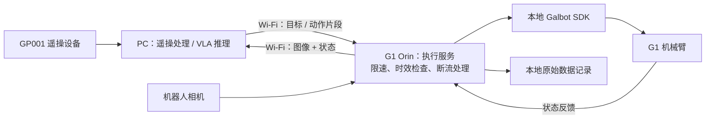

# 评估无线连接实现VLA可行性

- 归档编号：`01a08557-cea5-7d83-a980-12ff835028e5`
- 项目：VLA G1 项目
- 创建时间：2026-09-09T16:45:19.397000+08:00
- 更新时间：2026-09-09T17:09:48.111000+08:00
- 状态：活动
- 导出范围：用户可见消息与助手可见回复；不含隐藏推理和工具原始输出

## 1. 用户

我们在“对比三种G1控制方案” 对话下继续，我现在的情况链接有线有些麻烦，请问直接无线链接的可行性实现VLA到底如何？给我评估一下

## 2. 助手（进展）

我先查看“对比三种G1控制方案”里的配置和讨论，再结合 G1 的通信要求，评估无线连接跑 VLA 的可行性和实际限制。

## 3. 助手（进展）

从已有记录看，机器人端 SDK 读状态和跨机命令预览都曾跑通，但预览链路出现过约 210 ms 的接收空窗，原因还没有定位。因此，无线做 VLA 有可行路线；关键是把持续执行控制的部分留在 G1 上，并验证图像传输和动作更新的端到端延迟。

## 4. 助手

**可以不接 PC—G1 网线推进 VLA。结合你现在的条件，我建议采用“G1 本地执行控制 + PC 无线遥操作／模型推理”的组合。** 对低速桌面抓取、搬放等实验，这条路线有可行性；但现有测试还不足以证明无线连续控制已经稳定。

我看过“对比三种G1控制方案”和项目验证记录。之前“数采优先 PC 有线”的建议，需要根据你现在接线不便的条件调整。

**1. 无线连接，具体有三种实现方式**

| 方式 | 程序怎么运行 | 对你当前项目的评估 |
|---|---|---|
| 无线 SSH，控制程序在 G1 上 | PC 登录 Orin，启动机器人本地 SDK 程序 | **最适合现在验证读关节、简单动作** |
| PC SDK 直接通过 Wi-Fi 控制 | SDK 在 PC，通过无线访问机器人控制服务 | **暂不作为首选**，SSH 能通不代表 SDK 所需网络可达 |
| G1 本地控制服务 + PC 无线发送目标 | G1 调 SDK，PC 发送遥操目标或模型动作，接收状态和图像 | **最推荐用于后续数采和 VLA 推理** |

第一种方式里，程序启动后，SDK 到机器人内部控制系统的通信仍在机器人内部。无线主要影响登录和监控。不过，进程如何在 SSH 断开后运行、何时停止，需要明确配置。

Galbot 官方也将 Orin 本地部署定位为适合实时性要求较高的应用。[官方部署说明](https://developer.galbot.com/docs/SDK/1.9.1/g1/zh/installation_and_configuration/)

**2. 推荐的 VLA 分工**



采集时由 GP001 提供动作；自主运行时由 VLA 提供动作。**两者共用 G1 上的执行服务。** 模型训练在 PC 或服务器完成，训练过程本身不需要与机器人保持实时连接。

这种“机器人客户端 + 远程策略服务器”的推理分工已有 LeRobot 官方实现：上传观测、返回动作片段，机器人执行期间提前请求下一段。你仍需要适配银河 G1，不能直接把官方示例当成已支持你的机器人。[LeRobot 异步推理文档](https://huggingface.co/docs/lerobot/en/async)

**3. 你现在的证据支持到哪一步？**

已有记录确认：

- G1 端 SDK 曾成功读取真实左臂状态。
- 跨机无运动预览曾接受 **401 条目标消息**。
- 同一次约 8 秒短测中，发送最大间隔约 **20.8 ms**，接收最大间隔却达到 **209.7 ms**。
- 故意断流能触发预览接收器失能，但**没有验证真机实际停止行为**。

这些来自[跨机验证记录](/home/lsy03/文档/ChatGPT/VLA%20G1%20项目/teleoperation/SYNTHETIC_VALIDATION_20260908.md)。约 210 ms 的空窗可能涉及网络、系统调度或程序阻塞，不能直接归因于 Wi-Fi；也不能因为把超时调到 300 ms 就认定问题解决。

因此，我对当前状态的判断是：**无线通信原型有基础，正式连续运动和 VLA 数采尚待验收。** 本次评估没有重新连接或驱动真机。

**4. 无线真正影响 VLA 的地方**

**动作数据量通常很小，图像和延迟抖动更关键。** 举例计算：单路未压缩 `640×480、RGB、30 fps` 约为 **221 Mbps**，三路约 **664 Mbps**，还没算协议开销。无线推理需要按模型需求缩放图像、选择压缩方式，并实际测量编码和传输耗时。

需要关注完整链路：

> 相机曝光 → 图像处理 → 无线上传 → 模型推理 → 动作回传 → G1 开始执行。

Ping 很低也不能证明这条链路够快。动作片段可以缓冲短时抖动，但片段越长，对新情况的响应可能越慢；不能靠无限积压动作来维持“看起来连续”。

**数采则尤其依赖时间对齐。** 应记录相机采集时间、遥操目标、机器人收到和应用目标的时间、实际关节反馈。若只按 PC 收包时间配对，网络抖动可能把旧画面和新动作拼在一起。原始图像和状态优先在机器人本地记录，之后传回 PC，会更容易保留完整数据；跨设备时钟仍需对齐。

另外，**改成无线并不会绕过 XCU／WBC 等内部服务问题**。Orin 能 SSH 登录，只证明登录链路可用。

**5. 我建议你怎样推进**

| 阶段 | 建议 |
|---|---|
| 现在读关节、验证 SDK | 直接无线 SSH，在 G1 本地运行 |
| 简单动作验证 | 本地执行低速、小范围动作，先验证停止语义 |
| GP001 无线遥操作数采 | 使用 G1 接收服务，完成带图像负载的持续测试后再正式采集 |
| 低速 VLA 抓取、搬放 | PC 推理 + 无线动作片段 + G1 本地执行，值得推进 |
| 快速接触、精密插装等任务 | 当前证据不足，应先解决延迟长尾和反馈闭环问题 |

下一步最有价值的是做一次 **30–60 分钟、包含计划使用的相机流的无运动测试**，统计观测年龄、消息间隔 P95/P99、最大空窗和积压情况，再验证断网、进程退出、旧包迟到时的真实控制行为。验收阈值要根据任务速度和 SDK 停止能力制定。

**所以，你现在可以把主要路线调整为“无线 + G1 本地执行”，不必等有线问题全部解决才推进 VLA。** 代价是需要补一个可靠的机器人端执行与记录服务；大型模型也可以继续留在 PC，是否迁移 Orin 应由实际显存和推理速度决定。

[附件：07f016fda396099a--SYNTHETIC_VALIDATION_20260908.md](../../assets/07f016fda396099a--SYNTHETIC_VALIDATION_20260908.md)

## 5. 用户

就现在吧，给我验证一下现在的网络条件如何，评估一下延迟是否支持数据采?

## 6. 助手（进展）

我现在检查 PC 到 G1 的无线链路，测量延迟、丢包和长尾抖动，并尽量验证应用层通信。全程只做网络和只读检查，不驱动机械臂。

## 7. 助手（进展）

已确认走的是 Wi-Fi：PC 有线接口处于断开状态。首轮 30 包没有丢包，但往返延迟平均约 97 ms、最高约 214 ms，抖动明显。我继续做几分钟连续测试，并对照无线网关，判断延迟主要出现在哪段链路。已有 SSH 密钥未通过认证，因此暂时无法测机器人端应用服务。

## 8. 助手（进展）

当前连接是 `robot` 的 5 GHz Wi-Fi，PC 端信号读数约 −68 dBm。正在进行的测试会区分“偶尔慢”和“持续存在长尾延迟”；信号值本身不足以判定能否数采。此次尚未加入相机流负载，最终结论会明确这个限制。

## 9. 助手（进展）

这轮同时测 G1、无线网关，以及 G1 的 TCP 建连时间。这样可以避免仅凭 Ping 判断；但 TCP 建连也不等于 SDK 控制延迟，是否适合正式数采还要结合应用层和图像负载验证。

## 10. 助手（进展）

连续测试还在运行，原始结果会保存到项目目录。首轮已经出现约 200 ms 的往返延迟，因此目前不能把这条链路当作稳定的实时遥操链路；接下来的统计会给出这类延迟的出现比例。

## 11. 助手

**实测结果：当前无线能连通，但延迟抖动明显，我不建议直接用它开展正式的连续遥操作数采。** 可以继续做只读检查和低速预览验证。

刚才进行了约 3 分钟测试，全程没有驱动机械臂，也没有修改网络配置。确认 PC 到 G1 走 Wi-Fi，有线接口已断开。

| 指标 | PC → G1 往返延迟 | PC → 无线网关往返延迟 |
|---|---:|---:|
| 探测包数 | 900 | 900 |
| 丢包率 | **0%** | 0% |
| 平均延迟 | **80.8 ms** | 12.7 ms |
| 中位数 | 33.8 ms | 7.9 ms |
| P95（95% 的结果不超过此值） | **207 ms** | 35.6 ms |
| P99 | **222 ms** | 121 ms |
| 最大延迟 | **371 ms** | 243 ms |

G1 的 900 次探测中：

- **39.4% 超过 100 ms**。
- **7.9% 超过 200 ms**。
- 另测 180 次 TCP 建连，全部成功，但 P95 同样达到 **207 ms**，说明长尾延迟也出现在 TCP 建连测试中。

**对你数采的实际影响：**

| 使用方式 | 当前判断 |
|---|---|
| 无线 SSH 启动程序、读取状态 | 可以继续 |
| GP001 接 PC，无线实时发送目标到 G1 | **暂不建议正式数采**，跟手性和动作时序可能不稳定 |
| G1 本地执行、本地记录，无线仅监控和传文件 | 更适合当前网络条件 |
| 图像无线传 PC、VLA 推理后回传动作 | 尚不能验收，需要带相机流实测 |

以 **50 Hz 遥操输入**为例，每帧间隔是 20 ms，而当前 P95 往返延迟约为它的 **10 倍**。这不等于单向动作一定延迟 207 ms，但足以说明：**“没有丢包”不能代表实时性合格。**

网关本身也有抖动，而 G1 路径更明显。下一步应检查机器人端 Wi-Fi 信号、省电配置、AP 转发和进程调度；目前还不能确定根因。

**本轮限制：**已有 SSH 密钥认证失败，因此没有完成机器人端应用层、SDK 和相机流测试。当前结论是“正式无线遥操数采暂未达标”，不是“无线方案不可行”。

已保存[完整评估与原始测试数据](<../../assets/54f9999243bb1e63--%E8%AF%84%E4%BC%B0.md>)。

[附件：54f9999243bb1e63--评估.md](../../assets/54f9999243bb1e63--%E8%AF%84%E4%BC%B0.md)

## 12. 用户

[$galbot-136-ssh](/home/lsy03/.codex/skills/galbot-136-ssh/SKILL.md)

## 13. 用户

<skill>
<name>galbot-136-ssh</name>
<path>/home/lsy03/.codex/skills/galbot-136-ssh/SKILL.md</path>
---
name: galbot-136-ssh
description: 使用本机保存的凭据，通过 SSH 连接 galbot@10.34.216.136，完成用户要求的远程检查和文件操作。用于用户指定 10.34.216.136 或调用此技能时。
---

# Galbot 10.34.216.136 SSH

- 主机：`10.34.216.136`；用户：`galbot`；端口：`22`。
- 密码文件：`/home/lsy03/.config/galbot-136/ssh-password`，本地明文保存，目录权限 `700`、文件权限 `600`。通过认证工具直接读取，不输出密码或写入命令参数、仓库和日志。
- 用户于 2026-09-09 提供账号密码；创建此技能时未连接，网络可达性、密码有效性和机器人型号尚未验证。不要与 `10.34.216.17` 的 S1 混用。

用户要求连接、登录或远程操作时，在已授权范围内直接执行，无需重复询问登录许可。仅创建技能不代表授权连接。文件修改以当前任务为准；SSH 登录不自动授权机器人运动、控制器初始化或服务启停。操作机器人前先查看项目说明及程序副作用，并获得对应动作的明确授权。

本机有 `sshpass` 时，可用以下方式进行已授权的只读连接检查：

```bash
sshpass -f /home/lsy03/.config/galbot-136/ssh-password \
  ssh -o StrictHostKeyChecking=yes -o ConnectTimeout=10 \
  -o ControlMaster=no -o ControlPath=none -o ControlPersist=no \
  galbot@10.34.216.136 'hostname; id -un; pwd'
```

按任务替换远端命令。保留主机密钥校验；未知或变化的密钥须核实指纹，不关闭校验。凭据文件缺失、认证失败或依赖缺失时说明原因，不猜测密码或循环重试。不要因连接失败自动修改网络或远端服务。结束时清理本次创建的会话，报告实际结果与未验证项。

</skill>

## 14. 助手（进展）

我会使用你提供的 galbot-136-ssh 技能登录 G1，继续检查机器人端无线状态，并补测应用层延迟。全程不初始化控制器、不驱动机械臂，也不修改网络配置。

## 15. 助手（进展）

已成功登录 G1。发现机器人端 Wi-Fi 省电处于开启状态，而且 PC 和 G1 虽然都连接 `robot`，却分别在 56 和 64 信道，通信可能需要经过 AP 间转发。这些是抖动的排查线索，还不能认定为根因。我继续测 50 Hz 小包往返，并加入约 10 Mbps 的模拟图像回传负载作对照。

## 16. 助手（进展）

50 Hz 应用层测试的首段已完成：2193 条回显全部收到，平均往返约 18 ms，比刚才低频 Ping 好很多；但机器人端仍出现过约 247 ms 的收包空窗。因此需要修正判断：持续发包时表现有所改善，但偶发长停顿仍在。目前正在检查模拟图像回传时是否会进一步恶化。

## 17. 助手

**已通过这个技能成功登录 G1，并补完应用层测试。结论更明确了：平均延迟可以，但偶发停顿仍不适合直接开展正式连续数采。**

此次实际测了约 50 Hz 的 UDP 回显，全部 **4389 条收到，没有缺失**：

| 测试条件 | 平均往返 | P95 往返 | G1 最大收包空窗 |
|---|---:|---:|---:|
| 无额外负载，45 秒 | 18.0 ms | 61.1 ms | **247 ms** |
| 模拟图像回传约 9 Mbps，30 秒 | 13.4 ms | 28.1 ms | **150 ms** |
| 停止模拟回传后，15 秒 | 25.7 ms | 128.9 ms | **343 ms** |

**关键问题是最后一列。** 即使包最终都收到，机器人也曾连续约 **343 ms 没收到新目标**。这超过你之前的 **300 ms 候选看门狗阈值**，不能靠放宽超时来解决。

同时发现两个排查线索：

- **G1 的 Wi-Fi 省电已开启。**
- PC 在 **56 信道**，G1 在 **64 信道**，虽然 SSID 都叫 `robot`，通信可能涉及 AP 间转发。

模拟回传期间反而表现较好，提示省电或链路活跃程度可能有影响；但各段较短，**尚不能认定根因**。

因此，我建议下一步先做**关闭 G1 Wi-Fi 省电前后的同条件对照测试**，再检查 AP 连接。当前可以继续低速预览验证，正式数采还需要解决长尾停顿，并补测真实相机、时间对齐和断流停止。

本次未修改配置、未调用 SDK、未驱动机械臂；临时诊断进程已退出。已保存[完整补测报告](<../../assets/b68be05aec93892f--%E8%AF%84%E4%BC%B0.md>)。

[附件：b68be05aec93892f--评估.md](../../assets/b68be05aec93892f--%E8%AF%84%E4%BC%B0.md)
