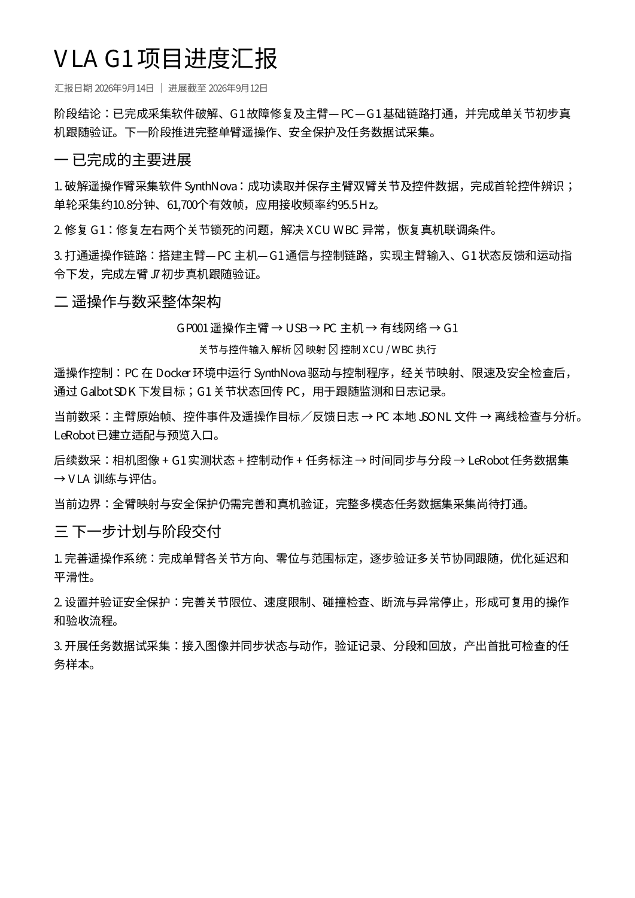
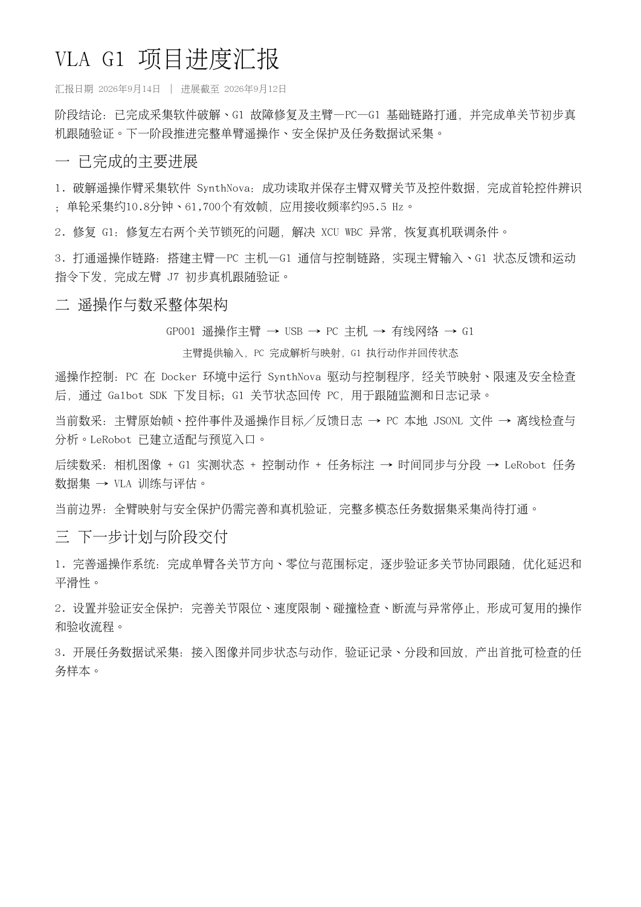
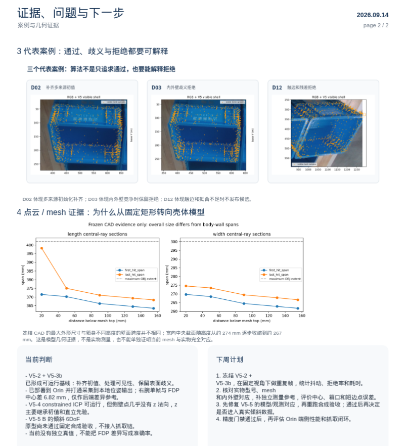
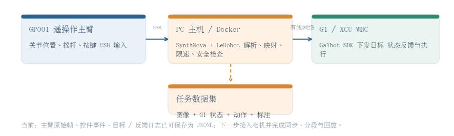
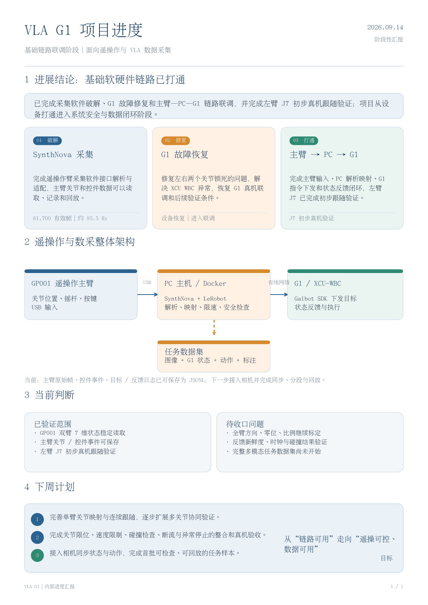
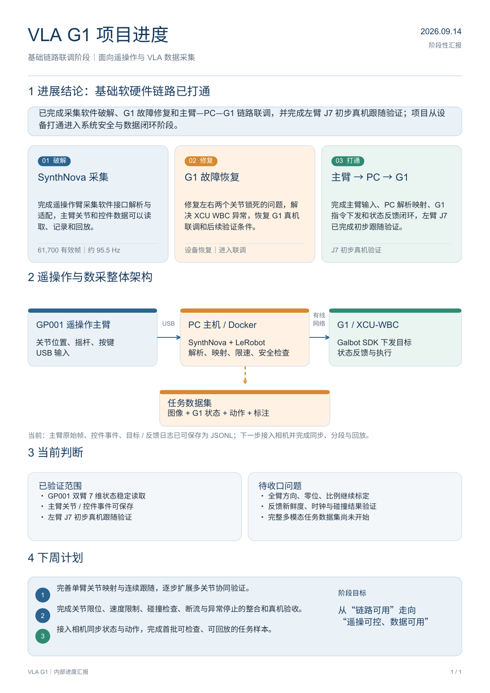

# 9_12 周报 整理VLA项目进度汇报

- 归档编号：`01a09317-1044-7b21-ae94-bb5f6de15616`
- 项目：VLA G1 项目
- 创建时间：2026-09-12T08:49:17.386000+08:00
- 更新时间：2026-09-14T09:08:59.528000+08:00
- 状态：活动
- 导出范围：用户可见消息与助手可见回复；不含隐藏推理和工具原始输出

## 1. 用户

给我总结一下这段时间本项目的进度，我周一要和经理汇报了
我想了一下是
“”
总结VLA进度

a)破解遥操作臂采集软件 sythonova 成功采集到数据帧
b）修好G1了
C）搭建遥操主臂-- PC主机 --  G1 的链路打通&#x20;

下一步计划： 遥操作系统搭建，安全限位设置
“”

你给我看看，我们先理一下思路

## 2. 助手（进展）

我先看看项目记录和相关任务，把已完成的成果、验证程度和下一步重点理清，再一起收敛成适合向经理汇报的说法。

## 3. 助手

你的三点抓住了主要进展。我建议把汇报主线定为：

**目前已打通 VLA 数据采集所需的基础软硬件链路，并完成初步真机控制验证；下一阶段重点是完善遥操作能力和安全保护，逐步具备任务数据采集条件。**

这样经理能理解这些工作的价值，以及项目现在走到了哪一步。

可以先按下面的思路整理：

| 方向 | 建议表述 | 体现的成果 |
|---|---|---|
| 遥操作主臂数据接入 | 完成 SynthNova 采集软件接口解析与适配，成功读取并保存主臂关节及控件数据 | 解决了遥操作输入和数据获取问题 |
| G1 设备恢复 | 完成 G1 故障修复，恢复后续联调所需的运行能力 | 排除了真机实验的设备阻塞 |
| 主从控制链路 | 打通“遥操作主臂 → PC 主机 → G1”链路，完成左臂 J7 初步真机跟随验证 | 已验证主臂输入能够驱动机器人实际运动 |

这里有两处值得调整：

**第一，“成功采集到数据帧”可以讲得更有分量。** 项目记录中已经有一轮约 **10.8 分钟、61,700 个有效帧**的采集，应用接收频率约 **95.5 Hz**，还完成了扳机、摇杆和普通按键的首轮辨识。因此可以说“完成主臂数据接入、记录及基础控件辨识”。汇报里“破解”建议换成“接口解析与适配”，更准确地突出工程成果。

**第二，“链路打通”和“完整遥操作系统完成”要区分清楚。** 已有记录能确认 J7 真机运动和初步跟随；全臂映射、跟随效果及安全保护仍在完善和验证。因此，下一步写“遥操作系统搭建”稍显重复，可以改成更明确的交付目标：

- **完善单臂遥操作：** 完成各关节映射标定，逐步验证多关节协同跟随，改善延迟和平滑性。
- **完善并验证安全保护：** 关节限位、速度限制、碰撞检查，以及断流和异常停止。已有部分实现，下一步重点是整合和真机验证。
- **开展小规模任务试采集：** 在遥操作稳定后，验证图像、机器人状态和动作数据的同步记录，为后续 VLA 训练准备数据。

周一口头汇报可以先用这一版：

> 这段时间主要推进 VLA 数据采集和遥操作基础平台建设。已经完成 SynthNova 主臂数据接口适配，实现关节和控件数据采集；完成 G1 故障修复；打通主臂、PC 和 G1 的控制链路，并完成单关节真机跟随验证。下一步重点是完善单臂遥操作及安全限位、碰撞和异常停止保护，完成验证后开展小规模任务数据采集。

**G1 修复这一项还可以补一句“具体修复了什么、恢复了什么能力”**，这会比单独说“修好了”更能体现工作量。

## 4. 用户

你能看到这个对话旁边的侧边对话吗

## 5. 助手（进展）

我用本应用的说明核对一下可见范围。

## 6. 助手

**能查看侧边栏中的其他对话列表，也能按需读取其中的内容**，但并不是自动看到每个对话的全部记录。

刚才我已经查到了本项目的这些对话，例如：

- “9_10 进行4J7真机验证成功”
- “9_10 左臂七关节 继续4J7真机验证”
- “评估遥操作脚本碰撞处理”
- “查询G1传感器与关节频率”

并读取了部分记录，用来核对进度。不过，有些对话目前返回的内容不完整，所以刚才的总结还没有覆盖所有历史进展。

## 7. 用户

破解 不要变
G1 修复了左右两个关节锁死的问题，解决XCU wbc异常的问题

顺便给我列一下当前遥操作和数采的整体架构

我们现在是需要生成一页的报告，我周一需要给经理汇报

## 8. 助手（进展）

我会保留“破解”，把 G1 两侧关节锁死和 XCU WBC 异常的修复写清楚，再核对遥操作与数采架构，整理成一页经理汇报稿。

## 9. 助手（进展）

我会使用 Documents 技能制作一页 Word 报告。架构会标清已打通的主臂输入、PC 控制和 G1 反馈链路，以及下一阶段要完善的图像同步和任务数据集采集。

## 10. 助手（进展）

已核对：当前真机控制走 PC 上的 Galbot SDK，经有线网络连接 G1；主臂通过 USB 接入 PC。数采已有主臂原始帧和遥操作过程日志，LeRobot 已有适配与预览入口，图像、状态、动作同步生成任务数据集将列为后续工作。

## 11. 助手（进展）

报告正文已整理好，“破解”和两项 G1 修复内容均已保留。排版预览遇到系统库兼容问题，我正在处理，确保交付文件确实是一页且没有溢出。

## 12. 助手（进展）

我改用 PDF 技能生成固定一页的汇报版，方便周一直接展示或打印；内容保持一致。

## 13. 助手

_工具输出图片（原始工具文本未纳入归档）。_

## 14. 助手

_工具输出图片（原始工具文本未纳入归档）。_

## 15. 助手

已整理成**一页 PDF 汇报稿**，保留“破解”，补充了：

- 左右两个关节锁死及 XCU WBC 异常修复。
- 遥操作与数采整体架构，区分当前已实现和后续建设。
- 遥操作完善、安全保护及任务试采集计划。

已检查为单页，可直接展示或打印：[下载汇报稿](<../../assets/295d48ba13543d47--VLA_G1_%E9%A1%B9%E7%9B%AE%E8%BF%9B%E5%BA%A6%E6%B1%87%E6%8A%A5_20260914.pdf>)。

[附件：295d48ba13543d47--VLA_G1_项目进度汇报_20260914.pdf](../../assets/295d48ba13543d47--VLA_G1_%E9%A1%B9%E7%9B%AE%E8%BF%9B%E5%BA%A6%E6%B1%87%E6%8A%A5_20260914.pdf)

## 16. 用户

你给我检查一下，为啥是空白的？

## 17. 助手（进展）

我检查一下 PDF 的字体和内容，确认是否是预览兼容问题，并修复文件。

## 18. 助手（进展）

发现原文件的中文字体没有嵌入，预览器需要自行替代字体，这很可能导致了空白。我之前只验证了本机渲染，遗漏了这一点。现在改成嵌入字体的版本，并重新检查。

## 19. 助手

_工具输出图片（原始工具文本未纳入归档）。_

## 20. 助手

原 PDF **没有嵌入中文字体**，很可能导致预览器显示空白，是我之前的兼容性检查遗漏了。

已嵌入字体并重新生成，检查确认内容完整、共一页。请打开这个新文件，避免旧预览缓存：

[打开修复版 PDF](<../../assets/295d48ba13543d47--VLA_G1_%E9%A1%B9%E7%9B%AE%E8%BF%9B%E5%BA%A6%E6%B1%87%E6%8A%A5_20260914.pdf>)

[附件：295d48ba13543d47--VLA_G1_项目进度汇报_20260914.pdf](../../assets/295d48ba13543d47--VLA_G1_%E9%A1%B9%E7%9B%AE%E8%BF%9B%E5%BA%A6%E6%B1%87%E6%8A%A5_20260914.pdf)

## 21. 用户

这个是sol 写的，为啥感觉这个风格差距这么大？

## 22. 助手

差距确实很大。**主要是我这次选错了呈现方式，把“给经理看的一页报告”做成了文字说明文档。**

你发的这版有几个明显优势：

| 方面 | 你发的这版 | 我这版 |
|---|---|---|
| 信息组织 | 结论、证据、判断、计划分区 | 按章节连续铺文字 |
| 视觉重点 | 图片、图表是主体 | 几乎全是正文 |
| 阅读层次 | 标题、卡片、注释有明确区别 | 主要靠字号区分 |
| 架构表达 | 用视觉证据帮助理解 | 把架构压成一行箭头和几段解释 |
| 整体感觉 | 适合会议展示的汇报页 | 适合坐下来阅读的技术说明 |

另外，我修复 PDF 时换成了偏细的宋体，进一步强化了“正文材料”的感觉。**字体兼容问题解决了，但设计质量没有跟着改善。**

你的 VLA 报告更适合这样排：

- **顶部：一句阶段结论。**
- **中部三个成果块：** 破解 SynthNova、修复 G1、打通遥操链路，每块只留成果和一条证据。
- **主体架构图：** 主臂 → PC → G1，画出状态反馈和数采分支；已完成用实线，待建设用虚线。
- **底部两栏：** 当前验证范围、下一步计划。

这不是换个颜色就能解决的，需要把内容重新组织成汇报页。我前一版在内容核对上做了工作，但没有把你“周一给经理汇报”的使用场景落实到版式上。

## 23. 用户

给我重新整一版

## 24. 助手（进展）

我重新按你给的 Sol 风格做一版：用“阶段结论 + 三个成果卡片 + 中部架构图 + 底部当前判断/下周计划”的汇报页结构，整体采用深蓝标题、浅灰卡片和清晰的视觉层级，避免上一版“技术说明书”的感觉。先做成一页可直接展示的 PDF。

## 25. 助手

_工具输出图片（原始工具文本未纳入归档）。_

## 26. 助手（进展）

新版已经生成，视觉结构改成了汇报页：顶部结论、三项成果卡片、链路与数采架构、当前判断、下周计划。现在做最后的单页和字体检查，并打开新版给你看。

## 27. 助手

已重新做了一版，整体改成你发的 Sol 风格：

- 顶部阶段结论
- 三个成果卡片
- 遥操作与数采架构图
- 当前判断与待收口问题
- 下周计划与阶段目标
- 深蓝标题、浅色卡片、嵌入中文字体，避免再次出现空白

已检查为单页 PDF： :codex-file-citation{path="/home/lsy03/文档/ChatGPT/VLA G1 项目/reports/VLA_G1_经理汇报_20260914.pdf" purpose="output"}

## 28. 用户

感觉这个排版的文字位置有点奇怪，文字也有点糊糊的，给我改改

## 29. 助手（进展）

我会把架构图这一块重新排：节点标题、说明、接口标签分层，增大正文并避免文字贴边；同时换成更清晰的嵌入字体，重新渲染检查整页。

## 30. 助手

_工具输出图片（原始工具文本未纳入归档）。_

## 31. 助手

_工具输出图片（原始工具文本未纳入归档）。_

## 32. 助手（进展）

我已经把架构区域改好：三块节点的标题和说明分层，接口标签移到箭头上方，任务数据集单独成块；正文也放大并重新嵌入字体。现在整页重新渲染后仍是一页，文字位置和清晰度都正常。

## 33. 助手

已改好。重点调整了架构区域的文字层级、节点高度、箭头标签位置，并放大了说明文字；字体继续嵌入，整页检查仍为一页。

请打开新版： :codex-file-citation{path="/home/lsy03/文档/ChatGPT/VLA G1 项目/reports/VLA_G1_经理汇报_20260914.pdf" purpose="output"}

## 34. 用户

我看了下，这个字体为啥不太统一，给我改一版 中文英文分别是 思源黑体 + Arial

## 35. 助手（进展）

我会把中文统一为思源黑体、英文和数字统一为 Arial，并检查字体嵌入和换行，保持一页排版。

## 36. 助手（进展）

确认了：上一版实际使用的是明体，细笔画让中英文看起来不协调。本机没有你指定的两种字体，我正在获取字体文件，随后按中文、英文和数字分别指定字体并嵌入 PDF。

## 37. 助手（进展）

两种字体已准备好。新版会用思源黑体的常规字重显示中文，Arial 显示英文和数字；我也调整了数据集框和底部计划区的空间，避免换字体后文字溢出。

## 38. 助手

_工具输出图片（原始工具文本未纳入归档）。_

## 39. 助手

_工具输出图片（原始工具文本未纳入归档）。_

## 40. 助手

已改为**中文思源黑体，英文和数字 Arial**，两种字体均已嵌入 PDF。也调整了换行和间距，检查确认仍为一页、无文字溢出。

[打开新版 PDF](<../../assets/3b895fd559476ef0--VLA_G1_%E7%BB%8F%E7%90%86%E6%B1%87%E6%8A%A5_20260914_%E6%80%9D%E6%BA%90%E9%BB%91%E4%BD%93Arial.pdf>)

[附件：3b895fd559476ef0--VLA_G1_经理汇报_20260914_思源黑体Arial.pdf](../../assets/3b895fd559476ef0--VLA_G1_%E7%BB%8F%E7%90%86%E6%B1%87%E6%8A%A5_20260914_%E6%80%9D%E6%BA%90%E9%BB%91%E4%BD%93Arial.pdf)

## 41. 助手

_历史投影中的图片引用（用于补全本地对话资源）。_

> 资源未归档：`/tmp/vla_pdf-1.png`（missing）

> 资源未归档：`/tmp/codex-clipboard-20309692-58c1-40e3-bc3a-0517b16cb373.png`（missing）

> 资源未归档：`/tmp/vla_compat-1.png`（missing）

> 资源未归档：`/tmp/codex-clipboard-c05dc9b5-2a57-4721-bcdb-afed5545ca6d.png`（missing）

> 资源未归档：`/tmp/vla_manager_render/page-1.png`（missing）

> 资源未归档：`/tmp/codex-clipboard-6342e21a-b5a2-4275-8ca5-3b510ade6a0b.png`（missing）

> 资源未归档：`/tmp/vla_manager_render2/page-1.png`（missing）

> 资源未归档：`/tmp/vla_manager_render3/page-1.png`（missing）

> 资源未归档：`/tmp/vla_fonts_review-1.png`（missing）

> 资源未归档：`/tmp/vla_fonts_final-1.png`（missing）
