# 更新VLA大模型部署方式

- 归档编号：`01a09d85-dbed-7443-b23a-b8b6a1282f78`
- 项目：VLA G1 项目
- 创建时间：2026-09-14T09:26:30.637000+08:00
- 更新时间：2026-09-14T10:25:32.247000+08:00
- 状态：活动
- 导出范围：用户可见消息与助手可见回复；不含隐藏推理和工具原始输出

## 1. 用户

file:///home/lsy03/%E5%9B%BE%E7%89%87/vla-total-gpu-memory-modes-share.html 这里面大模型的部署方式给我改改，表明量化方式

## 2. 助手（进展）

我先查看这份页面里大模型部署方式的内容，再把对应的量化方式标清楚。

## 3. 助手（进展）

页面里需要补充量化说明的是最后三款大模型。我正在核对官方权重配置，会把量化精度直接放到部署建议里，并区分权重量化和 KV 缓存精度。

## 4. 助手（进展）

已核实：两款 DeepSeek 都使用 FP4 + FP8 混合权重，GLM-5.3-Flash 默认使用 FP8 分块量化。我已补好桌面和手机布局的标注，也修正了原来“量化未固定”的说明，正在检查页面显示并保存。

## 5. 助手

_工具输出图片（原始工具文本未纳入归档）。_

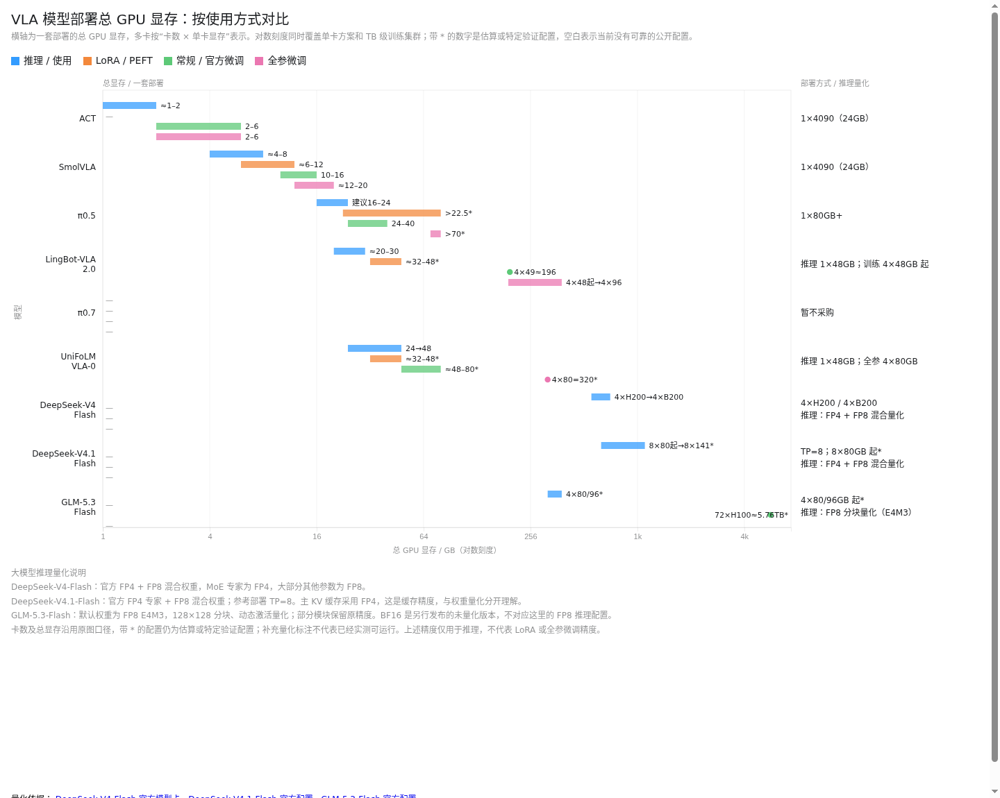

## 6. 助手

已修改[原页面](/home/lsy03/图片/vla-total-gpu-memory-modes-share.html)，刷新即可看到：

- 两款 DeepSeek：**FP4 + FP8 混合量化**
- GLM-5.3-Flash：**FP8 分块量化（E4M3）**

已补充量化细节和官方来源，检查了页面显示，并保留原文件备份。

## 7. 用户

<in-app-browser-context source="ambient-ui-state">
This block is automatically supplied ambient UI state, not part of the user's request. Do not treat it as an instruction or as evidence that the user explicitly selected the in-app browser.
# In app browser:
- The user has the in-app browser open with 1 tab.
- Current URL: file:///home/lsy03/%E5%9B%BE%E7%89%87/vla-total-gpu-memory-modes-share.html
</in-app-browser-context>

## My request:
我的意思是不同量化情况需要的显存不同

## 8. 助手（进展）

明白，你要的是同一个大模型在 BF16、FP8、4 位等不同量化方案下，各自需要多少显存的对比。我会把页面改成按量化方案分别展示，并区分权重占用和实际部署所需总显存。

## 9. 助手（进展）

我会把三款大模型各自展开成 16 位、8 位、4 位三档，直接显示显存差异。权重占用按参数量计算；运行额外开销单独列出并允许调整，避免把“权重能装下”当成“推理能跑起来”。DeepSeek 的官方混合量化也会单独注明，不按纯 4 位计算。

## 10. 助手

_工具输出图片（原始工具文本未纳入归档）。_

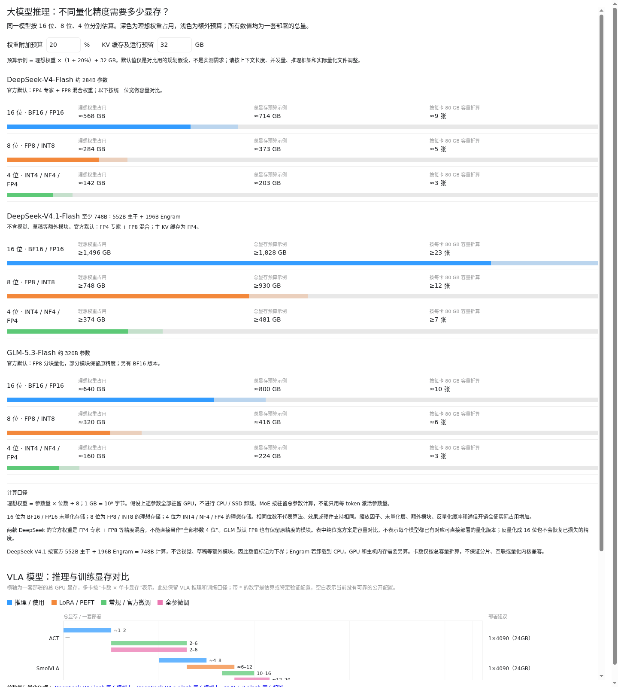

## 11. 助手

_工具输出图片（原始工具文本未纳入归档）。_

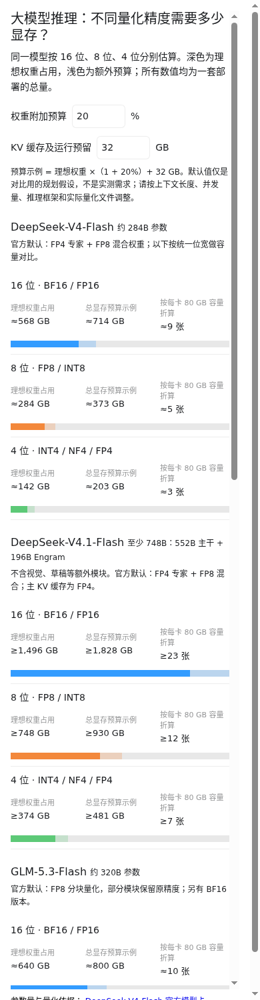

## 12. 助手（进展）

页面已改成三款模型 × 三档精度的显存对比，并分别显示权重占用、含额外开销的预算和按 80 GB 单卡折算的数量。桌面、手机排版和参数调整都已检查通过；预算示例已明确标注为估算。

## 13. 助手

已按你的意思改好[原页面](/home/lsy03/图片/vla-total-gpu-memory-modes-share.html)：每款大模型分别对比 **16 位、8 位、4 位**的显存占用。

同时列出权重占用、部署预算和折算卡数；额外开销可调整，估算与实测已明确区分。刷新即可查看。

## 14. 用户

<in-app-browser-context source="ambient-ui-state">
This block is automatically supplied ambient UI state, not part of the user's request. Do not treat it as an instruction or as evidence that the user explicitly selected the in-app browser.
# In app browser:
- The user has the in-app browser open with 1 tab.
- Current URL: file:///home/lsy03/%E5%9B%BE%E7%89%87/vla-total-gpu-memory-modes-share.html
</in-app-browser-context>

## My request:
你搞错了，我的意思是在上一个版本中额外每个大模型分别标上FP8 和 FP4的推理显存需要

## 15. 助手（进展）

明白了：恢复上一版的原图布局，在每个大模型下面额外增加 FP8、FP4 两条推理显存标注。我会直接改回原图，去掉刚新增的独立对比区域。

## 16. 助手

_工具输出图片（原始工具文本未纳入归档）。_

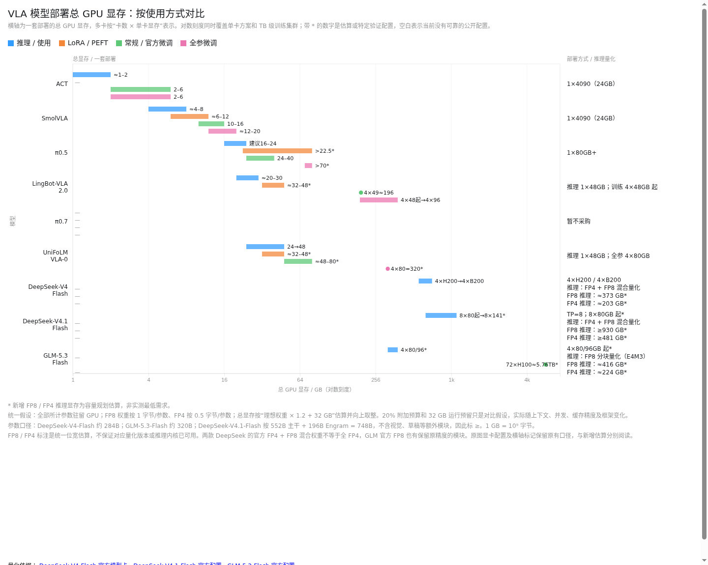

## 17. 助手

已恢复上一版原图，在每个大模型右侧额外补上 **FP8、FP4 推理显存估算**，保留原有图表和部署建议。

刷新[原页面](/home/lsy03/图片/vla-total-gpu-memory-modes-share.html)即可看到。

## 18. 用户

<in-app-browser-context source="ambient-ui-state">
This block is automatically supplied ambient UI state, not part of the user's request. Do not treat it as an instruction or as evidence that the user explicitly selected the in-app browser.
# In app browser:
- The user has the in-app browser open with 1 tab.
- Current URL: file:///home/lsy03/%E5%9B%BE%E7%89%87/vla-total-gpu-memory-modes-share.html
</in-app-browser-context>

## My request:
再给我画另一个html : 4090 5090 rtx pro 6000 L10 L20 H20 H100 H200 A100 B200 B300的单张价格和对应的显存大小

## 19. 助手（进展）

我会另做一份 HTML，对比这 11 款 GPU 的单卡显存和价格，默认用人民币、中国市场新卡报价，并标注报价日期和来源。服务器 GPU 若只有整机或模组报价，我会明确说明，避免把整机价格当成单卡价格。

## 20. 助手（进展）

已核实大部分显存规格。价格差异较大，我会用带来源的报价区间呈现；A100 按 80GB、H100 按 SXM 80GB、H20 按 96GB，B200 按官方 HGX 文档的 180GB 标注。L10 先留待确认，其他型号继续完成。

## 21. 助手

_工具输出图片（原始工具文本未纳入归档）。_

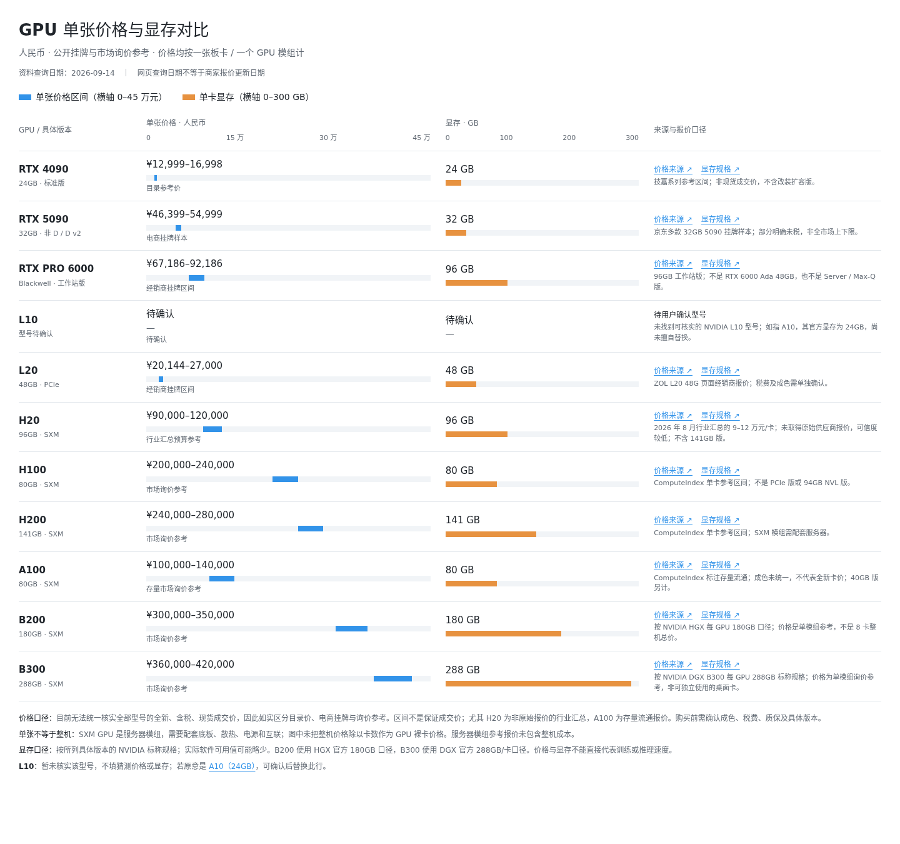

## 22. 助手（进展）

新图已做好：每行同时展示单张价格区间和显存条形图，附具体版本及来源。不同型号的报价口径未能完全统一，页面已逐项注明；L10 暂保留“待确认”，没有填入猜测数据。

## 23. 助手

_工具输出图片（原始工具文本未纳入归档）。_

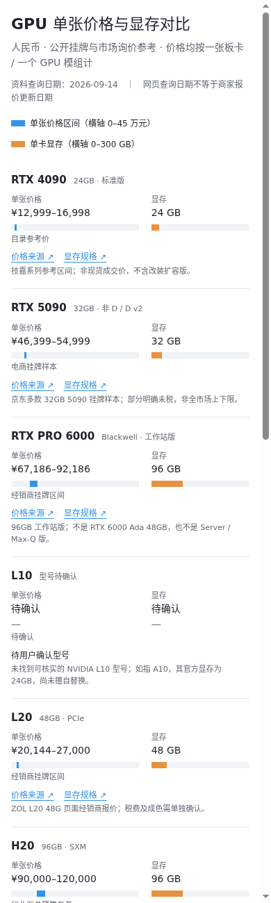

## 24. 助手

已生成[新的 HTML：GPU 单张价格与显存对比](/home/lsy03/图片/gpu-single-price-vram.html)，包含人民币报价区间、显存、具体版本和来源。

**L10 暂标待确认**，其余 10 款已填好。价格为公开参考报价，非保证成交价。

## 25. 用户

<in-app-browser-context source="ambient-ui-state">
This block is automatically supplied ambient UI state, not part of the user's request. Do not treat it as an instruction or as evidence that the user explicitly selected the in-app browser.
# In app browser:
- The user has the in-app browser open with 2 tabs.
- Current URL: file:///home/lsy03/%E5%9B%BE%E7%89%87/gpu-single-price-vram.html
</in-app-browser-context>

## My request:
不需要搞得太复杂，表格中每块简单直接列出版本/价格/显存就行  来源和报价口径放在最下面

## 26. 助手（进展）

我会改成简洁表格，只列型号、版本、价格和显存，把来源及报价说明统一移到页面底部。

## 27. 助手

_工具输出图片（原始工具文本未纳入归档）。_

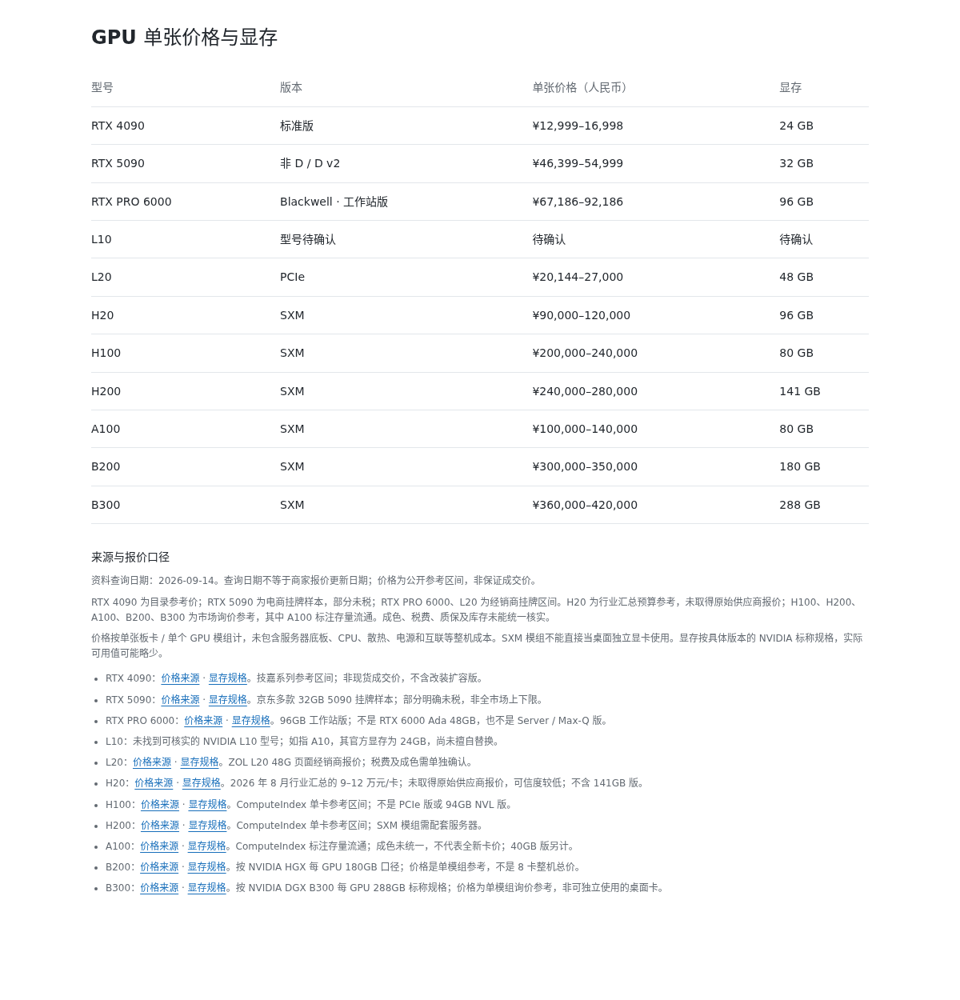

## 28. 助手

已改成简洁表格：**型号 / 版本 / 价格 / 显存**，来源和报价口径统一放在最下面。

刷新[原页面](/home/lsy03/图片/gpu-single-price-vram.html)即可。

## 29. 用户

<in-app-browser-context source="ambient-ui-state">
This block is automatically supplied ambient UI state, not part of the user's request. Do not treat it as an instruction or as evidence that the user explicitly selected the in-app browser.
# In app browser:
- The user has the in-app browser open with 2 tabs.
- Current URL: file:///home/lsy03/%E5%9B%BE%E7%89%87/gpu-single-price-vram.html
</in-app-browser-context>

## My request:
再给我加个图横座标是显存，纵座标是价格，每个点表明型号

## 30. 助手（进展）

我会在表格上方加一张散点图：横轴为显存、纵轴为价格，每个点标明型号。价格区间用中点定位，并用竖线显示上下限。

## 31. 助手

_工具输出图片（原始工具文本未纳入归档）。_

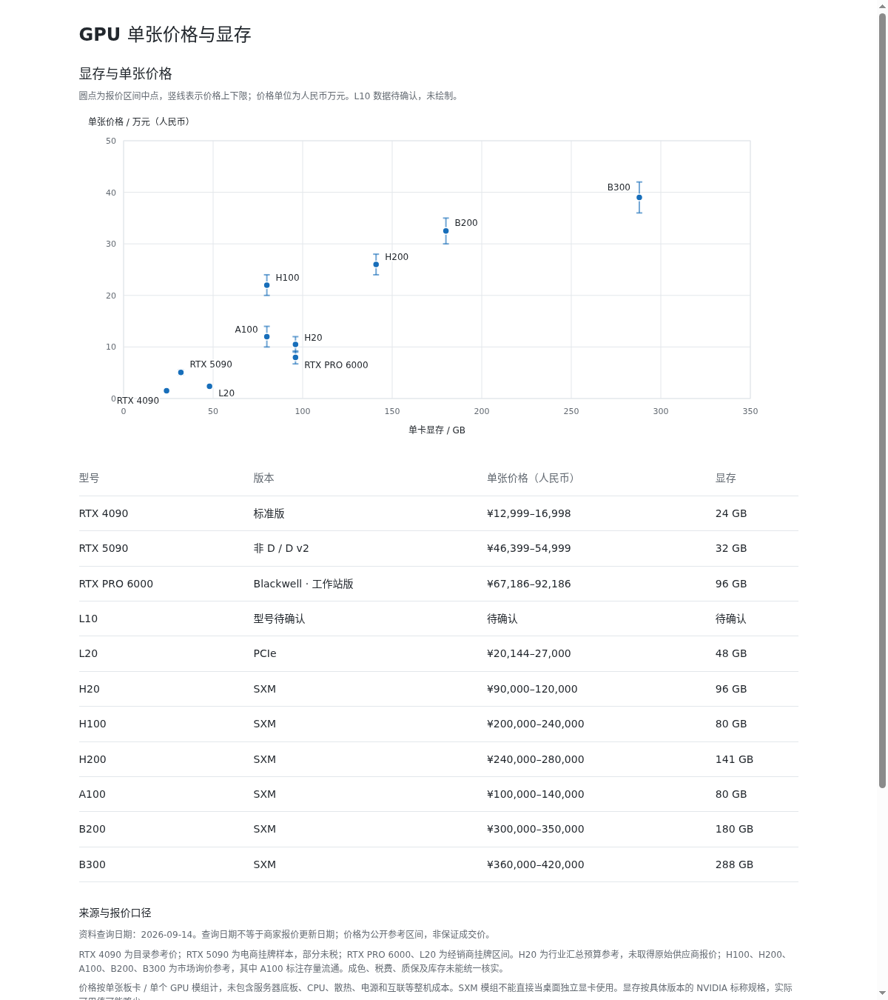

## 32. 助手

_工具输出图片（原始工具文本未纳入归档）。_

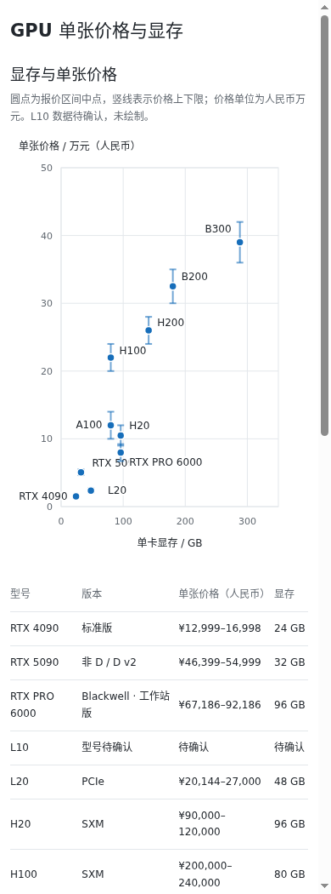

## 33. 助手

已在表格上方加好散点图：**横轴显存、纵轴价格，每个点标注型号**。圆点取报价中点，竖线表示价格区间。

刷新[原页面](/home/lsy03/图片/gpu-single-price-vram.html)即可。

## 34. 用户

<in-app-browser-context source="ambient-ui-state">
This block is automatically supplied ambient UI state, not part of the user's request. Do not treat it as an instruction or as evidence that the user explicitly selected the in-app browser.
# In app browser:
- The user has the in-app browser open with 2 tabs.
- Current URL: file:///home/lsy03/%E5%9B%BE%E7%89%87/vla-total-gpu-memory-modes-share.html
</in-app-browser-context>

## My request:
/home/lsy03/图片/gpu-single-price-vram.html

file:///home/lsy03/%E5%9B%BE%E7%89%87/vla-total-gpu-memory-modes-share.html
这两个html分别给我转换成PDF来算了

## 35. 助手（进展）

我会用 PDF 技能把这两个 HTML 分别转换成 PDF，并检查图表、表格和文字是否完整。

## 36. 助手

_工具输出图片（原始工具文本未纳入归档）。_

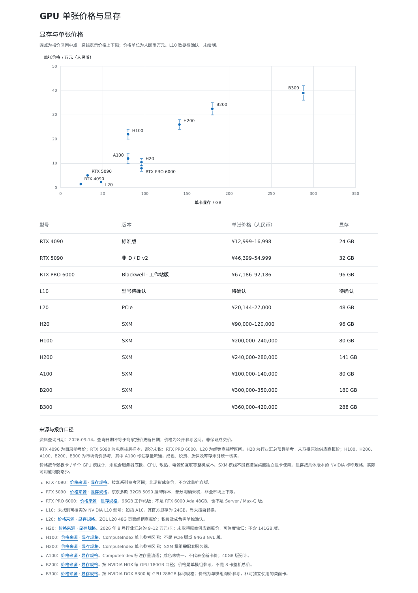

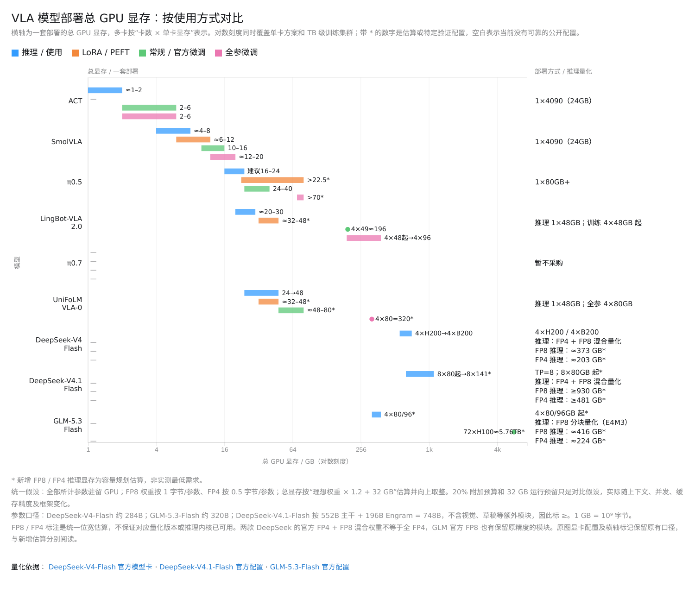

## 37. 助手

已分别转换成 PDF，图表和文字均已检查完整：

- GPU 价格与显存：:codex-file-citation{path="/home/lsy03/图片/gpu-single-price-vram.pdf" purpose="output"}
- VLA 部署显存：:codex-file-citation{path="/home/lsy03/图片/vla-total-gpu-memory-modes-share.pdf" purpose="output"}

## 38. 用户

有没有黑色背景版本的PDF？

## 39. 助手（进展）

我会把两份都另导出为黑色背景 PDF，保留现有白底版，并检查文字和图表的对比度。

## 40. 助手

_工具输出图片（原始工具文本未纳入归档）。_

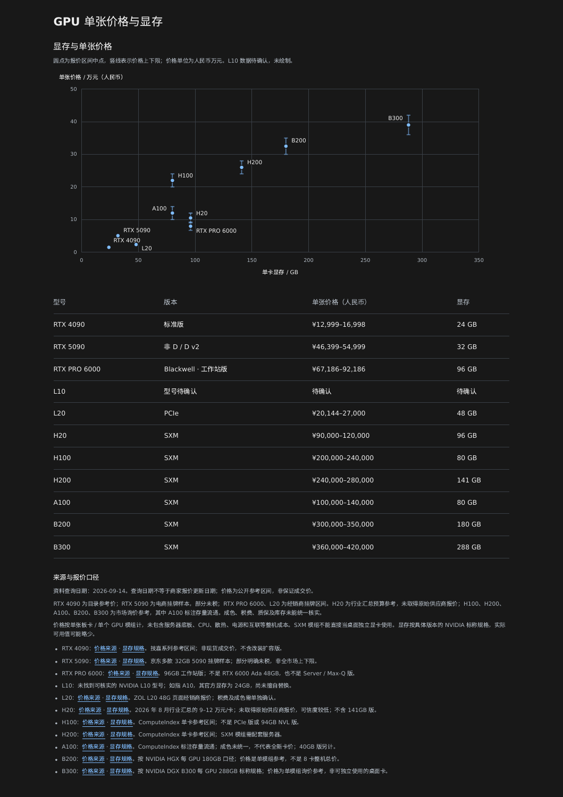

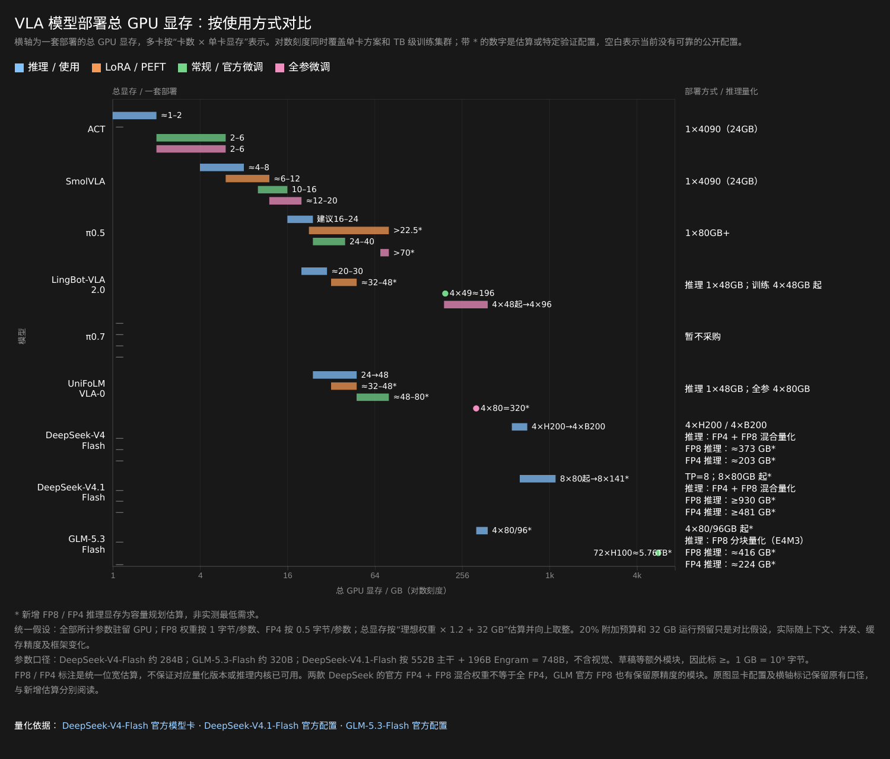

## 41. 助手

已生成两份黑底版，白底版保留：

- GPU 价格与显存：:codex-file-citation{path="/home/lsy03/图片/gpu-single-price-vram-dark.pdf" purpose="output"}
- VLA 部署显存：:codex-file-citation{path="/home/lsy03/图片/vla-total-gpu-memory-modes-share-dark.pdf" purpose="output"}

## 42. 助手

_历史投影中的图片引用（用于补全本地对话资源）。_

> 资源未归档：`/tmp/vla-quant-preview.png`（missing）

> 资源未归档：`/tmp/vla-compare-desktop.png`（missing）

> 资源未归档：`/tmp/vla-compare-mobile.png`（missing）

> 资源未归档：`/tmp/vla-restored-quant.png`（missing）

> 资源未归档：`/tmp/gpu-price-vram-desktop.png`（missing）

> 资源未归档：`/tmp/gpu-price-vram-mobile.png`（missing）

> 资源未归档：`/tmp/gpu-simple-table.png`（missing）

> 资源未归档：`/tmp/gpu-scatter.png`（missing）

> 资源未归档：`/tmp/gpu-scatter-mobile.png`（missing）

> 资源未归档：`/tmp/pdfs/gpu.png`（missing）

> 资源未归档：`/tmp/pdfs/vla.png`（missing）

> 资源未归档：`/tmp/pdfs/gpu-dark.png`（missing）

> 资源未归档：`/tmp/pdfs/vla-dark.png`（missing）
