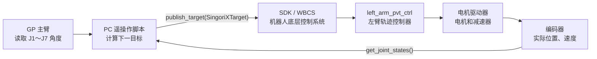
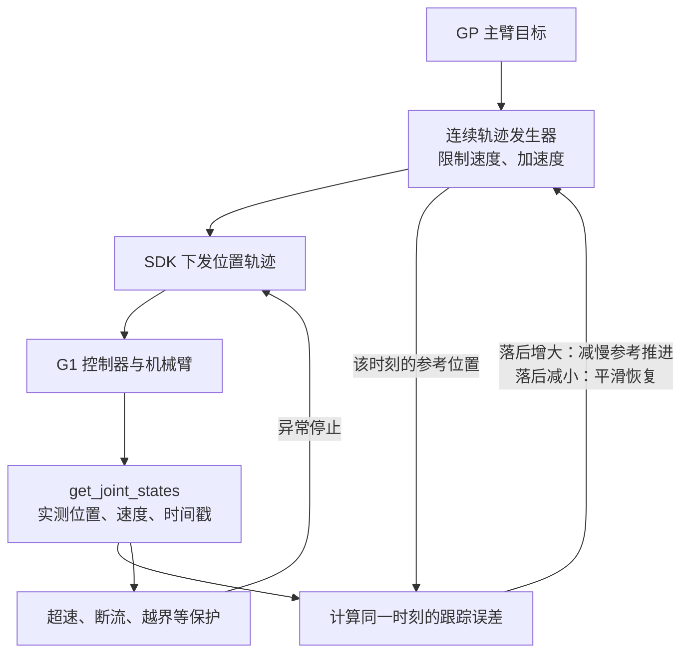

# 9_17 尝试控制闭环 分析左臂七关节遥操作原理

- 归档编号：`01a0aef8-0cbc-7df3-8ea2-c8a3f7572e4f`
- 项目：VLA G1 项目
- 创建时间：2026-09-17T18:44:46.924000+08:00
- 更新时间：2026-09-17T20:00:04.078000+08:00
- 状态：活动
- 导出范围：用户可见消息与助手可见回复；不含隐藏推理和工具原始输出

## 1. 用户

我们在“9\_17 9\_14 继续左臂七关节真机验证 （1）”的基础上继续

cd "/home/lsy03/文档/ChatGPT/VLA G1 项目"
bash teleoperation/run\_arm7\_direct.sh --execute --seconds 120 \\
&#x20; \--start-control left-button --align-speed-rad-s 0.4

给我分析一下这段代码遥操作的具体原理是什么？慢速跟随和之后的快速跟随的原理 有区别吗

## 2. 助手（进展）

我先查看这条启动命令对应的脚本和控制逻辑，并读取前一个任务的相关上下文，确认慢速与快速跟随分别是怎样实现的。

## 3. 助手（进展）

已确认：当前慢速和快速阶段共用同一套关节角跟随、分段限速和轨迹下发逻辑，第二次按键主要是把参数从 0.4 改成 1.0 rad/s。前一个任务提议的“固定目标、带加减速的完整慢速对齐轨迹”还没有落实到当前代码中。

## 4. 助手

**当前慢速跟随和后面的快速跟随，本质上是同一种控制方法：把 GP 主臂七个关节角映射为 G1 左臂目标，再分成小段位置轨迹下发。两者主要区别是速度参数和进入条件，并没有切换另一套控制算法。**

我核对了当前代码及“9_17 9_14 继续左臂七关节真机验证 （1）”的上下文。本次只做分析，没有运行真机命令。

**1. 整条遥操作链路**

```text
你移动 GP 主臂
    ↓
串口读取左臂 J1～J7 关节角
    ↓
一一映射为 G1 左臂期望关节角
    ↓
根据速度参数，限制每段目标角度的变化量
    ↓
生成一条 100 ms 的两点位置轨迹
    ↓
通过 SDK 下发给 left_arm_pvt_ctrl
    ↓
底层控制器驱动机械臂，同时脚本读取实际位置和速度
```

当前配置的映射是：

\[
q_{\text{目标},i}=q_{\text{GP},i}
\]

七个关节全部是同方向、比例 1、偏移 0。例如 GP 的 J3 为 −60°，G1 的 J3 最终目标就是 −60°。

因此，这是**关节空间绝对角度跟随**，不是先计算手的位置，再通过逆运动学求关节角；也不是“以启动姿态为零点，只复制之后的角度变化”。配置中仍把这套映射标记为实验性映射。[映射配置](../../assets/a1d2ebefd8d3b851--arm7_direct_profile.json)

**2. 慢速阶段具体怎么跟随**

第一次按左固定键前，需要七个关节主从误差都严格小于 **15°**，满足限位、反馈有效、全身静止等条件。

第一次按键后进入 `ALIGNING`，每个关节采用 **0.4 rad/s** 的轨迹速度参数。

程序并不立即把完整 GP 目标发给机器人，而是每次只向目标推进一小步：

\[
q_{\text{新指令}}
=
q_{\text{上一指令}}
+
\operatorname{clip}
\left(
q_{\text{GP}}-q_{\text{上一指令}},
-v\times0.1,\,
+v\times0.1
\right)
\]

其中 `clip` 表示把变化量限制在指定范围内。

以一个关节为例：

- G1 初始位置为 0°，GP 为 10°。
- 慢速每段最多推进 \(0.4\times0.1=0.04\) rad，约 **2.29°**。
- 若 GP 不动，指令终点依次接近：**2.29° → 4.58° → 6.88° → 9.17° → 10°**。

这些是**下发的目标位置**，不代表机器人实际已经到达。

另外，**当前慢速阶段一直读取最新 GP 角度**。如果你在对齐过程中移动主臂，慢速阶段也会继续追新的目标；它没有冻结第一次按键时的主臂姿态。[分段目标计算](/home/lsy03/文档/ChatGPT/VLA G1 项目/teleoperation/arm7_follow_collision.py:194)

**3. 什么时候变成快速跟随**

当七关节的“实时 GP 目标与 G1 实测位置”误差全部小于 **3°**，进入 `ALIGN_READY`。

**此时仍然慢速跟随，不会自动提速。** 只有再次按左固定键，并满足反馈和按键时序条件，才进入 `FOLLOWING`。

代码里的核心切换就是：

```python
gate.speeds = mapping.speeds
```

你的命令没有覆盖正式速度，因此读取当前配置的七关节 **1.0 rad/s**。同一个 `gate`、上一段目标和计时状态继续使用。[两阶段切换代码](/home/lsy03/文档/ChatGPT/VLA G1 项目/teleoperation/arm7_direct.py:309)

| 对比项 | 慢速阶段 | 正式快速阶段 |
|---|---|---|
| 跟随目标 | 实时 GP 七关节角 | 实时 GP 七关节角 |
| 轨迹生成算法 | 分段限制角度变化量 | 相同 |
| 每段轨迹时长 | 100 ms | 100 ms |
| 轨迹速度参数 | 0.4 rad/s | 1.0 rad/s |
| 每段最大角度变化 | 约 2.29° | 约 5.73° |
| 进入条件 | 主从误差全部 <15°，第一次确认 | 主从误差全部 <3°，第二次确认 |
| 加减速规划 | 没有实现 | 没有实现 |

**“快速”表示允许目标推进得更快，不是让机械臂始终以 1.0 rad/s 运动。** 主臂移动得慢，或者目标已经很近，生成的轨迹速度也会更低。

**4. 下发给机器人的是位置轨迹，不是硬速度限制**

每条消息包含两个轨迹点：

```text
t = 0.0 s：上一条指令的目标终点
t = 0.1 s：这次算出的新目标终点
```

第一段的起点例外：使用启动时的 G1 实测位置。

消息指定：

- 数据类型：关节位置；
- 插值方式：线性插值；
- 更新方式：覆盖旧轨迹；
- 时间戳：PC 当前时间。

因此，0.4 rad/s 是通过“两点位置差 ÷ 0.1 秒”实现的**指令轨迹斜率限制**，不是给底层电机设置一个不可超过的硬速度上限。消息虽然把 `velocity`、`acceleration` 字段填为零，但这不等于实现了速度闭环或加速度限制。[轨迹消息构造](/home/lsy03/文档/ChatGPT/VLA G1 项目/teleoperation/arm7_follow_collision.py:246)

脚本读取实测速度，是为了发现超限后停止。例如慢速阶段：

- 实测速度绝对值超过 **0.48 rad/s**，触发瞬时超速拒绝；
- 超过 **0.44 rad/s** 持续达到代码规定的约 0.15 秒，触发持续超速拒绝。

这是检测后的保护，不能保证实际速度从未超过 0.4。

**5. 为什么之前慢速也会超速，这与快速阶段有没有关系**

当前两个阶段都有同一个轨迹衔接问题：

> 新轨迹的零时刻起点使用上一条指令终点，没有根据机器人实际执行进度重新衔接。

例如：

```text
机器人实际只走到：2°
新轨迹却要求：
    现在位于 4°
    100 ms 后位于 6°
```

虽然新轨迹自身的斜率只有 20°/s，但机器人在接到它时已经落后起点 2°，底层可能产生额外追赶。脚本也没有限制加速度，所以“每段角度变化受限”不能直接推出“实际电机速度始终受限”。

另外，**100 ms 是轨迹段时长和最小更新间隔，不是严格保证的发送周期**。读取反馈、SDK 调用等耗时会使实际发送间隔变长或抖动。PC 与控制器的时间偏差是否进一步影响执行，还取决于底层的时间戳语义，不能仅凭这段脚本确定。

所以，**慢速和快速阶段共享这些实现限制，快速阶段并不会自动解决它们。** 前一个任务提出的“慢速先固定目标，生成带加减速的完整对齐轨迹”，属于后续改进方案，当前代码尚未实现。

这条命令的 `--seconds 120` 从第一次进入慢速阶段开始计时，包含后续快速阶段；当前 `direct` 路径也没有启用碰撞检查。

[附件：a1d2ebefd8d3b851--arm7_direct_profile.json](../../assets/a1d2ebefd8d3b851--arm7_direct_profile.json)

## 5. 用户

能不能画个图啥的讲的更加直观一点

## 6. 助手（进展）

我用可拖动的动画图展示：主臂目标、分段指令和从臂位置，并对比 0.4 与 1.0 rad/s，以及轨迹起点没衔接时的情况。

## 7. 助手

拖动滑块，可以看到**每一段指令向主臂目标推进多少**；切换场景，可以看到之前讨论的“轨迹起点领先实际位置”问题。

visualize{"path":"/home/lsy03/.codex/visualizations/2026/09/17/01a0aef8-0cbc-7df3-8ea2-c8a3f7572e4f/arm-follow-explainer.html"}

**慢速和快速就像同一种走法，分别迈小步和大步。** 但指令“要求走到的位置”不等于机械臂“已经走到的位置”——这就是每段指令限速了，实测速度仍可能超限的关键。

[附件：7e6735a356f23c84--arm-follow-explainer.html](../../assets/7e6735a356f23c84--arm-follow-explainer.html)

## 8. 用户

```
 SDK 下发给 left_arm_pvt_ctrl
    ↓
底层控制器驱动机械臂，同时脚本读取实际位置和速度

这一部分的原理是啥？
```

19:13

用时 2分钟 15秒

核心可以理解为：**PC 端脚本只负责不断生成“下一小段目标轨迹”；真正的电机控制在 G1 的&#x20;****`left_arm_pvt_ctrl`****&#x20;内部完成。**
````rust

````

可以把它想象成两条同时运行的路：

- **向下的指令路**：PC 告诉机器人“接下来 100 ms 走到哪里”。
- **向上的反馈路**：机器人告诉 PC“我现在实际在哪里、速度是多少”。

### 1. `publish_target()` 发的到底是什么

脚本不会直接发送电机电流、力矩或 PWM，而是构造一条关节位置轨迹：
```ini
t = 0.0 s：起始位置
t = 0.1 s：目标位置
```

例如某一关节：
```
当前指令起点：10°
下一目标终点：12°
执行时间：0.1 s
```

脚本发出的消息大致是：
```css
left_arm_joint1 ... left_arm_joint7
位置轨迹：
    0.0 s -> [10°, ...]
    0.1 s -> [12°, ...]
采样方式：线性插值
目标类型：覆盖当前目标
```

对应代码在：

- [轨迹消息构造]\(/home/lsy03/文档/ChatGPT/VLA G1 项目/teleoperation/arm7\_follow\_collision.py:226)
- [实际发布调用]\(/home/lsy03/文档/ChatGPT/VLA G1 项目/teleoperation/arm7\_direct.py:346)

`TARGET_SAMPLING_LINEAR_INTERPOLATE` 的含义是，控制器在两个轨迹点之间生成中间位置：

\\[ q\_d(t)=q\_0+\frac{t}{0.1}(q\_1-q\_0) \\]

所以它不是“突然跳到 12°”，而是期望在 100 ms 内从 10° 平滑地走到 12°。

### 2. `left_arm_pvt_ctrl` 做什么

`left_arm_pvt_ctrl` 不是 Python 函数，而是机器人系统中已经运行的左臂控制器名称。

脚本先检查：
```arduino
robot.get_active_controller("left_arm") == "left_arm_pvt_ctrl"
```

如果当前不是这个控制器，脚本拒绝下发指令。

SDK 文档把 `publish_target()` 描述为把目标发布到机器人底层控制系统，使目标可以被运动执行模块使用。WBCS 收到消息后，根据目标中的：

- 关节名称；
- 轨迹点；
- 时间；
- 线性插值方式；
- 覆盖模式；

把 `left_arm` 的轨迹交给当前活动的 `left_arm_pvt_ctrl`。

控制器内部随后会以比 PC 更高的频率运行，大致进行这样的过程：
```scss
读取编码器实际位置 q
计算期望位置 qd(t)
计算误差 qd(t) - q
生成电机驱动命令
```

典型内部可能包含位置环、速度环、动力学补偿或 WBC 控制，但这些内部增益和算法不在当前项目代码中，因此不能仅凭脚本断言它具体使用哪一种 PID 或控制律。

### 3. 脚本读取的“实际位置和速度”从哪里来

脚本调用：
```
robot.get_joint_states([], FULL_NAMES)
```

这会从 G1 状态接口读取 21 个关节的状态，每个关节包含：
```
joint_name
position       实际位置
velocity       实际速度
timestamp_ns   状态采样时间
```

然后取出左臂的 7 个关节：
```ini
current = full[7:14]
velocity = velocity[7:14]
```

对应代码在 [read\_full()](</home/lsy03/文档/ChatGPT/VLA G1 项目/teleoperation/arm7_follow_collision.py>)。

这些反馈主要有三个用途：

1. 判断 G1 的反馈是不是新鲜、时间戳是否正常；
2. 检查实际速度是否超限；
3. 根据上一次目标，计算下一段目标。

这里有一个容易混淆的地方：

> PC 脚本读取反馈，并不代表 PC 直接控制电机。

实际电机控制仍由 G1 内部控制器完成。PC 只是一个较慢的“外层目标生成器和安全监视器”。

### 4. 一次完整循环是什么样

每次循环可以画成：
```scss
读取 GP 主臂角度
      ↓
得到 G1 的期望绝对角度
      ↓
读取 G1 实际位置和速度
      ↓
检查限位、反馈新鲜度、速度和跟随误差
      ↓
只向目标推进一小步
      ↓
生成 0～100 ms 的两点轨迹
      ↓
publish_target()
      ↓
G1 内部控制器执行
      ↓
编码器产生新的实际位置和速度
      ↓
进入下一轮
```

所以这是一种“滚动发送短轨迹”的方式，而不是一次把整段动作发完。

例如慢速阶段，设定速度为 0.4 rad/s：

\\[ 0.4\times0.1=0.04\text{ rad} \\]

每一段最多推进 0.04 rad，约 2.29°。

快速阶段速度为 1.0 rad/s：

\\[ 1.0\times0.1=0.1\text{ rad} \\]

每一段最多推进 0.1 rad，约 5.73°。

两阶段都走同一个控制链路，区别只是每段目标距离不同。

### 5. 为什么 `publish_target()` 返回成功，机械臂不一定已经走到了

`publish_target()` 的 `SUCCESS` 主要说明：
```
这条目标消息已经被 SDK / 控制系统接受或发布
```

它不等于：
```
机器人已经完成了这段运动
```

调用返回后，底层还要继续执行轨迹。PC 脚本则继续读取反馈。

这也是之前出现问题的原因之一：脚本可能发出下一条轨迹时，机器人还没有完全执行完上一条轨迹。

当前代码后续轨迹的起点通常使用：
```
上一条指令的目标位置
```

而不是重新使用：
```
机器人此刻的实际位置
```

于是可能出现：
```
上一条指令目标：4°
机器人实际位置：2°
新轨迹起点：4°
新轨迹终点：6°
```

控制器收到新轨迹后，可能需要先追赶从 2° 到 4° 的差距，再继续走向 6°。因此，虽然脚本生成的每一段轨迹斜率没有超过 0.4 rad/s，实际电机速度仍可能短时间超过这个数值。

### 6. 最关键的一句话

当前系统是：
```
PC 外层：读取反馈、做安全检查、生成短位置轨迹
G1 内层：插值轨迹、闭环跟踪、驱动电机
```

所以 `0.4 rad/s` 和 `1.0 rad/s` 首先是**PC 生成的目标轨迹速度参数**，不是直接写入电机驱动器的绝对速度限制。

19:16

脚本是否使用 get\_joint\_states 读取实际的机械臂运动情况？所以现在我们脚本到底是开环的还是闭环的？

19:26

用时 44秒

是的，当前脚本确实通过 `get_joint_states()` 读取 G1 的实际关节位置、速度和时间戳：
```sql
full, velocity, stamps = common.read_full(...)
current = full[7:14]
```

对应代码在 [arm7\_direct.py:230](</home/lsy03/文档/ChatGPT/VLA G1 项目/teleoperation/arm7_direct.py>) 和 [arm7\_follow\_collision.py:314](</home/lsy03/文档/ChatGPT/VLA G1 项目/teleoperation/arm7_follow_collision.py>)。

但“读取反馈”不等于“控制算法就是闭环”。
````css

````

当前系统要分两层看。

| 层级是否闭环作用                  |           |                              |
| ------------------------- | --------- | ---------------------------- |
| G1 内部 `left_arm_pvt_ctrl` | 是闭环       | 根据编码器实际位置跟踪期望轨迹，并驱动电机        |
| PC 端 `arm7_direct.py`     | 不是严格的跟踪闭环 | 读取反馈做检查，但主要按“上一条指令目标”生成下一条目标 |
| 整个真机系统                    | 广义上是闭环    | 底层控制器本身闭环，PC 还有反馈监视和保护       |

关键在于 PC 端下一目标的计算：
```ini
self.segment_start = self.last_goal
desired = ...
```

这里的基础是 `self.last_goal`，也就是**上一条发出的目标位置**，不是当前实际位置 `current`。[ArmGate.update()](</home/lsy03/文档/ChatGPT/VLA G1 项目/teleoperation/arm7_follow_collision.py>)

而且当前直连脚本创建 `ArmGate` 时明确设置了：
```ini
feedback_window=False
```

[arm7\_direct.py:266](</home/lsy03/文档/ChatGPT/VLA G1 项目/teleoperation/arm7_direct.py>)

因此，实际位置和速度主要用于：

- 检查机械臂是否超速；
- 检查目标和实际位置是否偏差过大；
- 检查反馈是否新鲜；
- 检查是否越过限位；
- 异常时停止运行。

它们通常**不会直接用于修正下一条轨迹的起点**。

可以简化成：
```
q_cmd[k+1] =
    q_cmd[k] + clip(q_GP - q_cmd[k], 最大步长)
```

而不是严格的反馈控制形式：
```
q_cmd[k+1] =
    q_actual[k] + K × (q_GP - q_actual[k])
```

所以最准确的表述是：

> 当前 Python 遥操作层是“带反馈监视和安全保护的短轨迹发送”，属于监督式半闭环；它不是一个根据实时位置误差连续修正指令的标准闭环跟踪控制器。

真正的闭环发生在 G1 内部：
```
期望轨迹 → PVT 控制器 → 电机
                         ↑
                    编码器反馈
```

PC 脚本则像一个较慢的“目标轨迹提供者”和“安全监视器”。这也是为什么即使 `get_joint_states()` 已经读取了实际速度，上一条目标如果领先于机械臂实际位置，下一条指令仍可能继续从领先位置出发，造成追赶甚至短时超速


要不你先看下这个，我们是不是保留旧脚本“run\_arm7\_direct.sh”在旧脚本的基础上开发一个有闭环的新脚本？给点建议

## 9. 助手（进展）

我先复核当前脚本中反馈参与控制的具体位置，再给出保留旧版、开发新版的建议，重点区分“增加外层闭环”和“修好轨迹衔接”这两件事。

## 10. 助手

**建议保留旧版，另建一个“反馈参与轨迹生成”的新版，便于对照验证和回退。** 不过，新版要同时解决反馈调节、轨迹连续性和时间基准，不能只把起点换成实测位置，就认为闭环完成了。

我重新核对了代码，这次没有修改文件。

**先修正前面解释中两个容易误解的地方**

- **“半闭环”这个说法不够准确。** 当前更适合叫“带反馈监视的轨迹发生器”：实测反馈会影响启动、阶段切换、停止，但正常推进时，主要根据上一条指令生成下一条指令。
- **用上一条指令生成新指令，不一定意味着开环。** 判断关键是：实际跟踪误差是否参与后续指令的调节。一个闭环轨迹发生器也可以保留自己的指令状态，不必每轮从实测位置重新起步。

另外，`left_arm_pvt_ctrl` 的内部控制律没有在当前代码中暴露，不能据此认定具体的 PID、控制频率或硬限速机制。

**1. 新版建议采用什么结构**

保留现有 SDK 位置轨迹接口，在 PC 层增加反馈调节：



新版最直观的行为应当是：

> **机器人跟得上，参考轨迹正常推进；机器人明显落后，参考轨迹减速，避免指令继续往前积累；严重异常则停止。**

这里的反馈会改变接下来要发的轨迹，而不只是决定“是否退出程序”。

**2. 我建议优先解决这四项**

| 修改项 | 新版应怎样处理 | 解决什么问题 |
|---|---|---|
| 轨迹衔接 | 从上一条轨迹在新起始时刻对应的位置、速度继续生成 | 不再直接拿尚未执行到的终点当起点 |
| 加减速 | 保存参考位置、参考速度，限制速度变化率 | 减少启动、反向、切换快慢时的突变 |
| 反馈调节 | 根据参考与实测之间的误差，平滑调整推进速度 | 避免机器人落后时指令继续领先 |
| 时间处理 | 核实控制器时间语义，对齐参考与反馈的时刻 | 避免把时间差误判成跟踪误差 |

**尤其要区分两种误差：**

- **主从误差**：GP 目标 − G1 实测。表示机器人距离操作者希望的位置还有多远。
- **轨迹跟踪误差**：该反馈时刻的参考位置 − G1 实测。表示机器人有没有跟上我们安排的运动。

例如，慢速对齐时，主从差还有 10°，但机器人始终跟着慢速参考运动，这可以是正常情况。不能因为这 10° 就认定机器人执行异常。

**3. 慢速与快速阶段怎么安排**

建议新版第一阶段先做容易验证的慢速对齐：

1. 第一次按键时，记录 GP 目标和 G1 实测起点。
2. 向这个固定目标生成带加减速的参考轨迹。
3. 用反馈调整参考推进速度；跟踪异常时减速或停止。
4. 实测到位且速度稳定后，再检查实时 GP 与 G1 是否仍然对齐。
5. 满足条件并第二次按键，才进入实时跟随。

正式跟随阶段改为持续读取 GP 目标，复用同一套连续轨迹与反馈调节逻辑。**从慢速切到快速时逐渐放开速度，也不要瞬间把参考速度从 0.4 跳到 1.0。**

固定目标只用于初始对齐；如果对齐期间主臂移走，完成旧目标并不意味着可以进入快速阶段。

**4. 旧版如何保留**

建议新增：

```text
teleoperation/run_arm7_closed_loop.sh
teleoperation/arm7_closed_loop.py
teleoperation/arm7_closed_loop_profile.json
```

但只保留旧 `.sh` 不够：旧版还依赖 `arm7_direct.py`、配置和 `arm7_follow_collision.py` 中的公共逻辑。**需要一起保存可追溯的版本，避免修改公共模块后，旧命令行为也跟着变化。**

新版使用独立日志，同时保留与旧版相同的进程互斥锁，防止两套程序同时控制左臂。

**5. 开发与验证顺序**

我建议按这个顺序推进：

1. **确认时间戳、覆盖轨迹和插值的执行语义。** 这些决定怎样正确衔接。
2. **离线验证轨迹发生器。** 覆盖反馈延迟、发送抖动、机器人落后、主臂反向、快慢切换等情况。
3. **验证慢速固定目标对齐。** 同时记录参考位置、实测位置、实测速度和跟踪误差。
4. **慢速稳定后，再加入实时跟随和提速。**

验收重点应是：轨迹衔接是否连续、参考速度与加速度是否受限、机器人落后时指令是否确实减缓、实测速度是否正常。**单纯“没有触发超速退出”不足以说明新版已经做好。**

我赞成另建新版；优先做“连续轨迹＋反馈调节”，暂不直接叠加一套未经辨识的外层 PID。这样每个变化的作用更明确，也更容易定位之前的超速问题。

## 11. 用户

你先看看这个，对于新版的遥操作脚本，先给我制定一个修改方案，明确目标

[附件：9596096b9bf97f80--pasted-text.txt](../../assets/9596096b9bf97f80--pasted-text.txt)

## 12. 助手（进展）

我先阅读你贴的内容，并对照现有脚本整理新版的修改目标、范围和验收标准，形成方案后再进入开发。

## 13. 助手

**建议新版的明确目标是：让从臂反馈参与轨迹推进，在保持指令连续的前提下，减少落后追赶和速度突变。先完成稳定的慢速对齐，再实现实时跟随。旧版保留作为对照。**

我读完了你贴的内容，也核对了对应日志：第二条指令发布时，J6 实测约 **−6.526°**，新轨迹起点却是 **−4.617°**，两者相差 **1.909°**。这说明新版需要解决参考轨迹与实际执行进度的关系，但不能据此把超速全部归因于这一项。

下面是建议的修改方案。本轮只制定方案，不改控制代码、不运行真机。

**一、明确新版的目标和边界**

| 目标 | 具体要求 |
|---|---|
| 指令连续 | 新轨迹接续旧轨迹在切换时刻的参考状态，不直接把上一段未来终点当作当前起点 |
| 启停平稳 | 参考轨迹具备速度、加速度约束；启动、停止、反向、提速都有过渡 |
| 反馈参与控制 | 从臂跟踪误差增大时，主动降低参考推进速度，而不是继续推进直到报错 |
| 时间一致 | 用同一时刻的参考位置和实测位置计算跟踪误差 |
| 可解释、可验证 | 能从日志还原主臂目标、参考轨迹、实测运动，以及减速或停止的原因 |
| 旧版可复现 | 保留旧入口及其依赖版本，新版不会悄悄改变旧版行为 |

新版仍通过 SDK 下发位置轨迹，不改机器人内部控制器。**PC 层的轨迹限速仍不等于电机硬限速，也不能承诺增加反馈后一定没有超调。**

**二、先把三个位置分清楚**

新版需要明确保存三个不同的量：

```text
GP 目标位置：操作者希望机器人最终去哪里
参考轨迹位置：我们安排机器人在某个时刻走到哪里
G1 实测位置：机器人在该时刻实际走到了哪里
```

由此区分两种误差：

- **主从误差 = GP 目标 − G1 实测**：用于判断对齐程度。
- **跟踪误差 = 同时刻参考 − G1 实测**：用于调节参考推进速度。

例如，GP 比从臂领先 10°，但从臂准确跟随我们安排的慢速轨迹，这不应该被判断为执行异常。

**三、具体修改内容**

**1. 先核实时间与 SDK 执行语义**

开发前先弄清：

- 轨迹头时间戳是执行起点，还是消息时间标记？
- `time_from_start_s` 相对于哪个时刻？
- 覆盖轨迹立即生效，还是按时间戳生效？
- 旧轨迹执行完、新轨迹尚未到达时，控制器如何处理？
- 支持哪些插值方式，位置、速度、加速度字段哪些实际生效？

你贴的日志中存在约 82～91 ms 的时间戳差异，不能直接当成网络延迟，也不能直接拿这个差值修正轨迹。

**这一项决定后续怎样正确衔接。语义未确认前，可以开发离线逻辑，但不能声称已经实现真实执行时间上的连续性。**

**2. 新建有状态的连续轨迹发生器**

发生器持续保存：

```text
参考位置 q_ref
参考速度 v_ref
参考轨迹的时间信息
已成功发布的轨迹历史
```

每次重新规划时：

- 从旧参考在新轨迹切换时刻的状态接续；
- 根据目标、速度约束、加速度约束生成后续运动；
- 目标反向时先减速，再反向；
- 临近目标或限位时提前考虑制动距离；
- 不把最新实测位置直接重置为每段起点；
- 不把循环延迟简单变成一次更大的角度跳变。

**还要检查最终下发消息，而不只是内部计算。** 如果最终仍是两点线性插值，就不能宣称实现了严格的连续加速度约束；需要根据 SDK 能力选择合适插值，或明确多点离散近似的误差范围。

**3. 增加反馈调节器**

先采用容易解释的“参考推进倍率”，不直接叠加外层 PID：

| 跟踪状态 | 参考轨迹的处理 |
|---|---|
| 误差较小 | 正常推进 |
| 误差逐渐增大 | 平滑降低推进速度 |
| 误差较大但未触发硬保护 | 参考减速至保持，等待追上 |
| 误差恢复 | 平滑恢复推进 |
| 误差过大或持续不恢复 | 停止本轮 |

第一版建议七关节共用一个推进倍率，取最不利关节的情况，减少各关节独立减速导致的动作不协调。但这并不构成末端路径或碰撞保证。

软减速阈值、恢复阈值、恢复时间、加速度上限需要通过测试确定，先做成独立配置。**正常减速与异常停止分开处理，硬保护触发时不能为了轨迹平滑而延迟停止。**

**4. 改为两个明确的运动阶段**

```text
锁定
  ↓ 启动条件满足
就绪
  ↓ 第一次按键
固定目标慢速对齐
  ↓ 实测到位且稳定
等待第二次确认
  ↓ 实时主从仍对齐 + 第二次按键
实时跟随，平滑提高允许速度
```

慢速对齐阶段：

- 第一次按键时冻结 GP 目标；
- 从 G1 实测静止状态开始生成轨迹；
- 初始参考速度上限保留 0.4 rad/s，并增加加减速；
- 反馈参与推进调节；
- 到位判断同时看位置误差、实际速度和持续稳定时间。

等待第二次确认时：

- 保持对齐位置；
- 如果主臂移走，不继续追新目标；
- 实时主从误差不满足要求时，不允许进入正式跟随，可停止后重新对齐。

正式跟随阶段：

- 持续读取最新 GP 目标；
- 复用同一个连续轨迹发生器和反馈调节器；
- 1.0 rad/s 保留为后续验证目标，不在第一轮就启用；
- 保留再次按键停止的操作方式。

**5. 重整日志与反馈处理**

每次轨迹发布至少记录：

- GP 实时目标、冻结的对齐目标；
- 轨迹起始时间、采样点、参考速度；
- 实测位置、速度、反馈采样时间、主机接收时间；
- 对齐时间后的跟踪误差；
- 推进倍率及减速原因；
- 发布结果、实际发送间隔、停止原因。

反馈断流、重复或时间异常时，不把旧样本当成新反馈继续调节。运动发送、输入读取和显示日志也应减少相互阻塞。

**四、文件与版本安排**

建议新增以下入口和模块，具体拆分可在实现时调整：

```text
teleoperation/run_arm7_closed_loop.sh
teleoperation/arm7_closed_loop.py
teleoperation/arm7_closed_loop_profile.json
teleoperation/arm7_reference.py
teleoperation/tests/test_arm7_closed_loop.py
```

旧版保留的不只是 `run_arm7_direct.sh`，还包括 Python 文件、配置及公共依赖的可追溯版本。新版和旧版沿用相同的运动互斥锁，避免同时控制左臂。

现有超速、限位、反馈断流、急停等保护继续独立生效。碰撞检查属于另一项功能，不能因为新版增加了反馈调节就认为已经具备避碰能力。

**五、实施顺序和验收标准**

| 阶段 | 交付内容 | 通过条件 |
|---|---|---|
| A：执行语义与时间核查 | 时间基准、覆盖和插值行为说明 | 能解释参考轨迹与反馈怎样对应到同一时刻 |
| B：离线轨迹验证 | 连续轨迹发生器、消息构造、反馈调节 | 发送轨迹符合已定义的连续性和速度约束；落后会减速；恢复不突跳 |
| C：慢速固定目标 | 新版慢速对齐流程 | 实测稳定到位；切换处无异常突变；保护阈值不放宽 |
| D：实时低速跟随 | 动态目标、反向、暂停恢复 | 目标变化时轨迹连续；误差不持续积累 |
| E：逐步提速 | 向 1.0 rad/s 验证 | 各级速度下的实测速度、跟踪误差和停止行为均通过验收 |

离线必须覆盖发送抖动、反馈延迟、反馈停止更新、主臂突然反向、从臂持续落后、接近限位及发布失败。仿真结果用于验证算法行为，不能代替真机验证。

**第一版的完成目标应收敛为：固定主臂目标下，左臂七关节能完成有加减速、有反馈调节、日志可解释的慢速对齐。** 这一阶段稳定之后，再加入实时目标和快速跟随，才能清楚判断每一步是否真正改善了当前问题。
