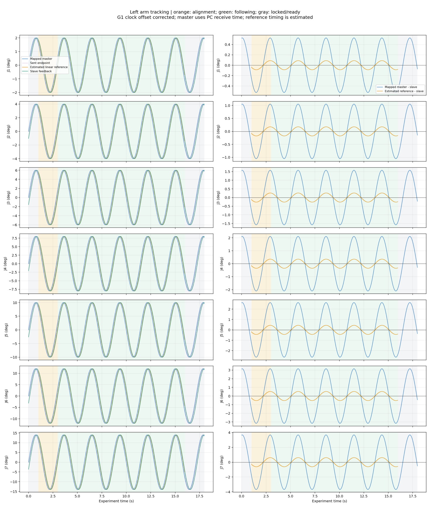
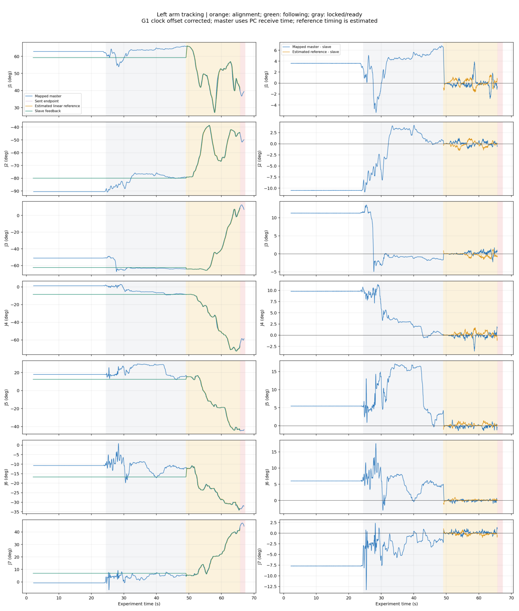
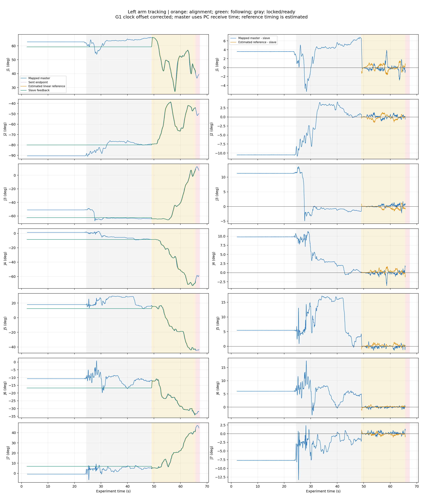

# 9_18 规划主从臂数据记录方案

- 归档编号：`01a0b218-7d40-77a0-99d4-e13cae1cfa92`
- 项目：VLA G1 项目
- 创建时间：2026-09-18T09:54:42.302000+08:00
- 更新时间：2026-09-18T10:59:52.620000+08:00
- 状态：活动
- 导出范围：用户可见消息与助手可见回复；不含隐藏推理和工具原始输出

## 1. 用户

我们在“9\_17 为遥操作脚本添加时间戳补偿”的基础上继续，要不我们给“bash teleoperation/run\_arm7\_direct.sh --execute --seconds 120 \\
&#x20; \--start-control left-button --align-speed-rad-s 0.4”这个脚本加上主臂和从臂的数据记录，实验完成可以绘制一张图来对比跟踪情况的，如何？ 先给我方案计划，明确目标，不要行动

## 2. 助手

可以。建议把这次目标定为：**在已有时间戳补偿逻辑的基础上，记录主臂指令与从臂反馈，用一次 120 秒实验评估跟踪误差和响应延迟，并生成对比图。** 这一轮只确定方案，不修改代码、不运行实验。

我目前没有“9_17 为遥操作脚本添加时间戳补偿”的具体实现内容，下面先给出设计方案；后续实施时再对照已有的时间戳来源、补偿方式和控制流程确认接入点。

**1. 明确比较对象**

建议同时记录三组关节数据，避免把坐标映射、限速或补偿造成的变化都算成从臂跟踪误差：

| 数据 | 含义 | 主要用途 |
|---|---|---|
| 主臂测量值 | 主臂原始关节位置，以及已有的速度数据 | 观察操作者输入 |
| 从臂目标值 | 完成主从映射、时间戳补偿、限速等处理后，实际发送的目标 | 确认从臂收到的指令 |
| 从臂反馈值 | 从臂实际关节位置，以及已有的速度数据 | 评估执行效果 |

**主要指标是“从臂目标—从臂反馈”的误差。** 主臂与从臂的整体跟随情况，则使用映射到同一关节定义、方向和单位的数据比较。

**2. 记录内容与方式**

每次实验保存一个独立目录，包含数据、运行参数和最终图表。

- **时间信息：** 主臂样本时间、接收时间、控制计算/发送时间、从臂反馈时间；保留已有的补偿时长或样本年龄。时间字段明确所属时钟，不能直接相减的时钟先做映射。
- **运动数据：** 上述三组关节位置；速度只记录系统已经提供的数据，离线差分结果另外标注。
- **阶段和状态：** 等待启动、初始对齐、正式控制、退出，以及可获取的反馈超时、限速触发等状态。
- **实验配置：** 保存本次命令、补偿配置、控制频率及关节映射等关键参数，便于复现。

优先复用控制过程中已经获取的数据，避免额外查询机器人。控制循环只向有界缓冲区提交记录，后台批量落盘，同时统计记录丢失数量；正常结束或中断时保存已采集的数据。

**3. 实验后的对比图**

建议生成**一张汇总图，每个受控关节一行、两列**：

- 左列：映射后的主臂位置、实际发送的从臂目标位置、从臂实际位置，三条曲线共用实验时间轴。
- 右列：从臂目标与实际位置的误差曲线。

图中标明对齐阶段和正式控制阶段。另附每个关节的 MAE、RMSE、最大绝对误差；对齐与正式控制分别统计。

**主图保留真实时间关系，不为追求曲线重合而平移反馈。** 响应延迟可以离线估计，作为辅助指标；运动幅度不足时不强行给出延迟结论。

**4. 实施顺序**

1. 核对上次时间戳补偿实现，确认三组数据的接入位置和时钟关系。
2. 增加可选记录开关及输出目录参数，保留当前控制行为。
3. 编写离线绘图与指标统计脚本。
4. 先验证记录完整性、时间顺序和运行开销，再做短时真机验证。
5. 最后按你给出的参数完成 120 秒实验，生成汇总图与指标。

**验收标准：** 数据能够追溯到本次实验配置；时间轴和主从关节定义一致；记录不会明显影响控制周期；实验结束或中断后数据可读取；一条离线命令即可生成图表。

这次先限定为**关节空间跟踪记录与分析**。如果还要证明“时间戳补偿是否改善了跟踪”，则需要再设计补偿开/关的对照实验，单次运行只能评估当前配置的表现。

## 3. 用户

要不给我把 120 秒 的时间先放宽， 请问当前版本的脚本是否有数据记录功能？

## 4. 助手（进展）

我先只读检查当前脚本和相关任务记录，确认运行时长限制及现有数据记录功能，不修改或启动遥操作。

## 5. 助手

**有，当前版本已经自动记录数据，但还不是完整的主从臂同步采集。** 我已只读核对代码，上一条方案需要调整为“完善现有记录并增加绘图”，不必从零添加。

每次启动都会生成日志，保存在项目的 [lerobot_runs 目录](</home/lsy03/文档/ChatGPT/VLA G1 项目/lerobot_runs>)，文件名为 `arm7_direct_日期_时间_进程号.jsonl`。

目前记录内容如下：

| 内容 | 当前情况 |
|---|---|
| 从臂七关节实际位置、速度、反馈时间戳 | 运动阶段每轮循环记录，实际频率受循环耗时影响 |
| 发送的目标位置、分段起点、速度参数、指令时间戳 | 每次尝试发指令时记录，并另记发送结果 |
| 主臂映射目标与从臂实际位置 | 约每 0.5 秒记录一次 |
| 对齐、正式跟随、停止、异常等事件 | 已记录 |
| 日志写入时间 | 每条都有 PC 系统时间及单调时间 |
| G1 的 +104 ms 时钟补偿配置 | 已记录 |

**现有日志已经能用于初步画跟踪曲线。** 主要缺口是：没有连续保存主臂原始关节数据及对应采样时间，主臂映射目标也只有约 2 Hz 的状态记录；尚未发现配套绘图脚本。

关于放宽 120 秒：

- 当前 Python 参数校验把 `--seconds` **硬限制在 1～120 秒**，直接填 `600` 会报错。[代码位置](</home/lsy03/文档/ChatGPT/VLA G1 项目/teleoperation/arm7_direct.py:388>)
- 计时从**第一次按键进入慢速对齐**开始，包含对齐时间；之后停止锁定也不会暂停或重置计时。
- 建议先把允许上限放宽到 **1800 秒（30 分钟）**，实际实验用 `--seconds 600`（10 分钟），保留到时退出和现有停止逻辑。

**本轮未修改代码、未启动机器人。**

## 6. 用户

要不我们新建一个脚本，允许上限放宽到 **1800 秒（30 分钟），并增加数据采集功能？**

## 7. 用户

要不我们新建一个脚本，允许上限放宽到 **1800 秒（30 分钟），并增加数据记录功能？先给我方案，明确目标，不要行动

## 8. 助手

可以。建议新建一个**用于主从臂跟踪实验的入口脚本**，允许最长运行 **1800 秒（30 分钟）**，补齐连续数据记录，并提供实验后绘图功能。现阶段只确定方案，不创建文件、不修改代码、不运行机器人。

**目标**

一次实验完成后，能够回答：

- 主臂运动时，从臂是否准确跟随？
- 主从差异有多少来自目标映射、限速，有多少来自从臂执行？
- 各关节的误差大小、响应延迟，以及异常发生时间是什么？

**脚本组织**

建议新增两个入口：

| 文件 | 用途 |
|---|---|
| `teleoperation/run_arm7_record.sh` | 启动带完整数据记录的遥操作实验 |
| `teleoperation/plot_arm7_tracking.py` | 读取实验数据，生成对比图和统计结果 |

新入口复用现有控制逻辑，通过独立配置启用长时运行和完整记录，避免复制整套控制代码后出现版本不一致。原入口继续保持当前行为及 120 秒上限。

**时长与控制行为**

- 新入口支持 `--seconds 1～1800`，默认建议 **600 秒**。
- 沿用当前语义：从第一次按键进入慢速对齐开始计时，包含对齐、正式跟随和中途锁定时间；锁定不暂停计时。
- 到时执行现有停止确认，再关闭记录文件。
- 保留两次按键确认、速度及限位检查、反馈时效检查和默认 **+104 ms 时钟偏差补偿**。该补偿是时钟校正，不是运动预测补偿。

**完整数据记录**

每次运行生成独立目录，至少包含：

| 文件 | 内容 |
|---|---|
| `metadata.json` | 运行参数、关节顺序、单位、映射配置、时钟补偿值及版本信息 |
| `samples.jsonl` | 连续主从臂数据和指令记录 |
| `events.jsonl` | 对齐、跟随、锁定、异常、退出等事件 |
| `tracking.png` | 实验后生成的七关节跟踪汇总图 |
| `metrics.json` | 分阶段误差指标及数据质量统计 |

连续数据包含三条关键链路：

1. **主臂输入：** 原始关节位置、映射后的从臂目标、帧标识、PC 接收时间；设备提供采样时间时同时保存。
2. **实际指令：** 限速等处理后的目标、分段起点、指令时间戳、发送前后时间及发送结果。
3. **从臂反馈：** 实际关节位置、速度、原始反馈时间戳及 PC 读取时间。

保留各自真实采样时间，标识重复读取的旧帧，离线绘图时再对齐。记录采用**有界队列和后台批量写盘**，统计丢帧、写入错误和循环耗时；若持续无法记录，则停止本轮实验并明确报错，避免实验结束后才发现数据缺失。

**实验后的图与指标**

一张汇总图，七个关节分别展示：

- 映射后的主臂目标、实际下发目标、从臂实测位置。
- 主臂映射目标与从臂实际位置之差。
- 对齐、正式跟随、锁定阶段的标记。

分别统计对齐和正式跟随阶段的 MAE、RMSE、最大绝对误差。**执行误差应依据指令分段及插值规则重建当时的参考位置**，不能直接把未来目标端点当成当前参考值。延迟估计作为辅助结果，数据不足时不输出确定值。

**实施与验收顺序**

1. 新增入口和独立时长配置，确认原入口行为保持一致。
2. 补齐连续记录及异常退出时的数据保存。
3. 完成离线绘图和统计。
4. 离线验证时长边界、时间对应关系、记录完整性及写入故障处理。
5. 后续经你安排，先短时真机验证，再开展较长实验。

验收重点是：**最长支持 1800 秒；主臂输入、实际指令和从臂反馈可追溯；记录对控制周期的影响有测量依据；正常结束或中断后，均能用已保存的数据生成图表。**

## 9. 用户

好的，我们开始编写脚本

## 10. 助手（进展）

我会按方案新增实验入口和绘图脚本，复用现有控制逻辑，并做离线验证；本轮不启动真机实验。

## 11. 助手（进展）

已确认指令使用两点线性插值，主臂设备时间戳的单位尚未明确。记录会保留原始时间戳，并用 PC 接收时间做主臂对齐；图中的指令参考会注明是按发送时间重建的估计值。记录写入失败时，控制循环会停止实验，停止指令本身不会被日志异常阻断。

## 12. 助手（进展）

新入口和记录模块已写好：原入口仍限制 120 秒，新入口默认 600 秒、上限 1800 秒，退出后会尝试生成图表。接下来重点验证记录故障时能否正常停止、重复反馈是否被排除，以及误差统计是否按实际阶段和时间戳对齐。

## 13. 助手（进展）

153 项离线测试已通过，覆盖了新旧入口的时长边界、记录队列溢出、写盘失败后的停止，以及时钟补偿后的误差计算。现在用合成轨迹检查图表和延迟估计，并测量记录调用开销；这些验证都不连接机器人。

## 14. 助手

_工具输出图片（原始工具文本未纳入归档）。_



## 15. 助手（进展）

合成轨迹的图表已生成并检查：设定的 120 ms 延迟被识别出来，运动幅度不足的关节没有输出确定延迟值。现有 Docker 镜像也具备绘图依赖；本机 5000 条模拟记录测试零丢弃。最后再核验运行环境兼容性和退出后的文件保存流程。

## 16. 助手

已完成。新增 [实验脚本](</home/lsy03/文档/ChatGPT/VLA G1 项目/teleoperation/run_arm7_record.sh>)，可运行：

```bash
bash teleoperation/run_arm7_record.sh --execute --seconds 1800 \
  --start-control left-button --align-speed-rad-s 0.4
```

- 默认 **600 秒**，上限 **1800 秒**；从首次进入慢速对齐开始计时。
- 连续记录主臂输入、映射目标、实际发送指令、从臂反馈及时间戳。
- 退出后自动生成七关节对比图 `tracking.png` 和误差统计 `metrics.json`。
- 数据保存到 `lerobot_runs/arm7_record_日期_时间_进程号/`。
- 原入口仍保留 **120 秒上限**，新入口沿用默认 **+104 ms** 时钟补偿。

**验证：154 项离线测试通过，其中 32 项也在实际 Docker 镜像内通过；合成数据绘图已检查。未连接或驱动机器人，尚未做真机长时验证。**

具体用法及时间对齐说明见 [使用文档](<../../assets/610d4890d4de101d--ARM7_RECORD_USAGE.md>)。图中的执行参考按发送时间重建，属于估计值。

[附件：610d4890d4de101d--ARM7_RECORD_USAGE.md](../../assets/610d4890d4de101d--ARM7_RECORD_USAGE.md)

## 17. 用户

你应该能看到日志，看看结果如何
二次对齐就绪：七关节误差均<3°，再次按开始键切换正式遥操作；当前仍为慢速。

ALIGN\_READY | 单位：度 | 差值=GP映射目标-G1实测
两次确认：误差<15°按键慢速对齐；全部<3°再次按键正式跟随；正式跟随中按键停止
+------+--------+--------+-----------+--------------------+----------+
\| 关节 | GP主臂 | G1从臂 | 目标-从臂 | 保守绝对限位       | 检查结果 |
+------+--------+--------+-----------+--------------------+----------+
\| J1   | +44.34 | +45.75 | -1.42     | [-169.14, +169.14] | 通过     |
\| J2   | -45.60 | -46.56 | +0.96     | [-89.14, +89.14]   | 通过     |
\| J3   | +0.86  | -1.19  | +2.05     | [-164.13, +164.13] | 通过     |
\| J4   | -70.85 | -72.30 | +1.45     | [-144.14, +104.14] | 通过     |
\| J5   | -43.15 | -41.86 | -1.30     | [-164.13, +164.13] | 通过     |
\| J6   | -32.30 | -31.51 | -0.79     | [-44.14, +39.14]   | 通过     |
\| J7   | +40.95 | +39.39 | +1.55     | [-45.00, +45.00]   | 通过     |
+------+--------+--------+-----------+--------------------+----------+

ALIGN\_READY | 单位：度 | 差值=GP映射目标-G1实测
两次确认：误差<15°按键慢速对齐；全部<3°再次按键正式跟随；正式跟随中按键停止
+------+--------+--------+-----------+--------------------+----------+
\| 关节 | GP主臂 | G1从臂 | 目标-从臂 | 保守绝对限位       | 检查结果 |
+------+--------+--------+-----------+--------------------+----------+
\| J1   | +42.55 | +43.26 | -0.71     | [-169.14, +169.14] | 通过     |
\| J2   | -44.31 | -44.64 | +0.33     | [-89.14, +89.14]   | 通过     |
\| J3   | +6.08  | +4.63  | +1.45     | [-164.13, +164.13] | 通过     |
\| J4   | -69.38 | -70.00 | +0.62     | [-144.14, +104.14] | 通过     |
\| J5   | -42.36 | -43.14 | +0.78     | [-164.13, +164.13] | 通过     |
\| J6   | -34.08 | -33.40 | -0.68     | [-44.14, +39.14]   | 通过     |
\| J7   | +41.01 | +41.14 | -0.13     | [-45.00, +45.00]   | 通过     |
+------+--------+--------+-----------+--------------------+----------+
停止请求成功，左臂静止反馈已确认。
本轮结束：SafetyReject: left\_arm\_joint7越过保守范围
跟踪图与统计已保存：lerobot\_runs/arm7\_record\_20260918\_021034\_7/tracking.png、metrics.json
lsy03\@lsy03-System-Product-Name:\~/文档/ChatGPT/VLA G1 项目$&#x20;

## 18. 助手（进展）

我会读取这次实验的记录、误差统计和图表，重点确认 J7 越界触发原因，以及是否进入过正式跟随。

## 19. 助手

_工具输出图片（原始工具文本未纳入归档）。_



## 20. 助手

看到了日志和图。**记录功能运行正常；本次因主臂 J7 的映射目标超过 +45° 而停止，从臂实测没有越过 +45°。此外，全程没有进入正式跟随阶段。**

**停止时的关键数据：**

| J7 数据 | 角度 |
|---|---:|
| 触发保护的主臂映射目标 | **45.056°** |
| 当时从臂实测 | 43.020° |
| 最后一条已发送目标 | 44.572° |
| 停止确认时从臂位置 | 43.712° |

因此，这次是目标越界触发保护。停止请求成功，随后确认了左臂静止。

实验总计约 **67.4 秒**，其中前约 49 秒等待启动，之后慢速对齐运行约 **16.8 秒**。日志有多次 `ALIGN_READY`，但没有 `FOLLOWING`，所以目前评估的是 **0.4 rad/s 慢速对齐表现**，还不能评价正式跟随。

跟踪曲线整体能跟上运动。不过，**当前图表的时间对齐结果需要谨慎看待**：仍使用昨天的 **+104 ms** 补偿，而本次运动阶段日志中，未经补偿的“PC 读取时间−G1 反馈时间”中位数约 **+3.5 ms**。这不足以单独确定时钟偏差，但说明应重新核验补偿值，否则曲线重合程度和误差统计可能受影响。

作为不依赖该补偿的辅助观察，同一控制循环内“当前主臂目标−读取到的从臂位置”的平均绝对差为：

| 关节 | J1 | J2 | J3 | J4 | J5 | J6 | J7 |
|---|---:|---:|---:|---:|---:|---:|---:|
| 平均绝对差（°） | 1.33 | 0.95 | 0.95 | 0.84 | 0.85 | 0.46 | 0.62 |

这包含反馈延迟，不等于纯执行误差。

记录方面：**14,227 条记录，记录队列零丢弃、无写入错误**；控制循环间隔中位数 **10.51 ms**，P95 **11.06 ms**。重复读取的从臂反馈已从统计中排除。

建议下一轮先核验时钟偏差，再在 `ALIGN_READY` 时保持主臂稳定、第二次按键进入正式跟随，并给 J7 留出限位余量。本轮未修改代码或控制机器人。

[查看本次跟踪图](<../../assets/449eb2d2cecc2932--tracking.png>)



## 21. 用户

那你画图数据的时间戳是如何对齐的？

## 22. 助手

目前采用的是：**把主臂和从臂数据都换算到 PC 的单调时钟时间轴，再按时间配对。** 但主臂与从臂采用的时间来源不同。

**1. 主臂：使用 PC 收到数据帧的时间**

主臂每帧记录：

- 原始设备时间戳：保留，但尚未确认其单位和时钟域，因此暂不用于对齐。
- PC 接收单调时间：`received_monotonic_ns`，作为主臂曲线的横轴。

因此，主臂横轴表示的是**数据到达 PC 的时间**，与主臂真正采样时间之间仍有传输延迟。

**2. 从臂：设备采样时间先减去时钟补偿，再转换到 PC 单调时间**

每次读取反馈时，记录 G1 原始时间戳，以及 PC 的系统时间和单调时间。换算公式为：

```text
从臂采样时间（PC 单调时钟）
  = G1 原始时间戳
  − 配置的时钟偏差
  − 读取时 PC 系统时间
  + 读取时 PC 单调时间
```

当前配置的偏差是 **+104 ms**，含义是“G1 时钟比 PC 快 104 ms”。最后主从时间都减去同一个实验起点，得到图中的秒数。

**3. 误差：按从臂采样时刻寻找主臂帧**

对每个有效从臂样本：

```text
选择该时刻之前，PC 最近收到的一帧主臂数据
误差 = 该帧主臂映射目标 − 从臂实测位置
```

主臂帧超过 **300 ms** 则不配对；重复读取的从臂反馈不重复统计。不是按日志行号或数组下标对应。

**4. 下发指令参考：按发送时刻重建**

对成功发送的指令，以 PC 开始调用 `publish_target()` 的时间为起点，按照轨迹段的起点、终点和周期做线性插值。**控制器实际开始执行的时间没有记录，所以这条参考曲线是估计值。**

这里需要明确我上一条提到的问题：**如果本次真实时钟偏差已经接近 0，但仍减去 104 ms，就会把从臂曲线向左错移约 104 ms，有可能抵消真实的跟随滞后，让曲线看起来过于重合。** 这属于错误补偿造成的偏移，并非绘图程序主动寻找最佳重合位置。

所以，当前图还不是严格的硬件采样同步对比。下一步应先核验本次时钟偏差；确认后可以直接用已经保存的原始时间戳重新绘图，无需为了修正这张图重新采集。
