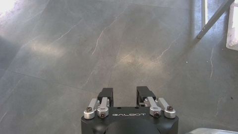
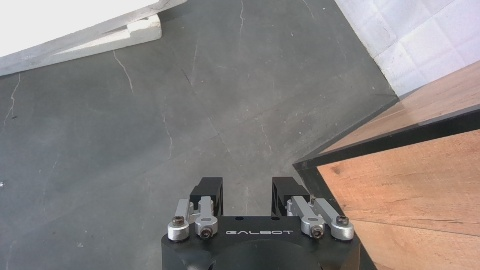
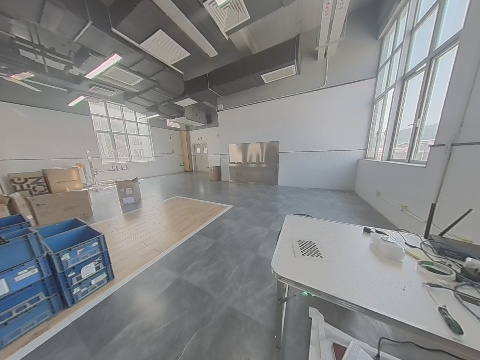
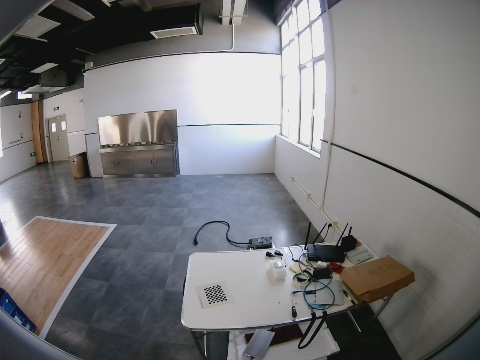
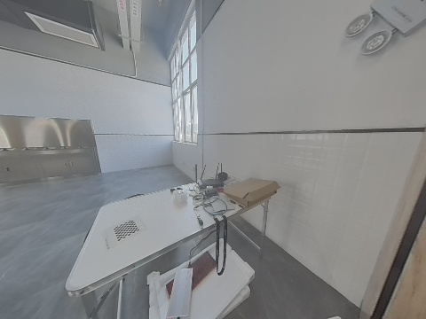
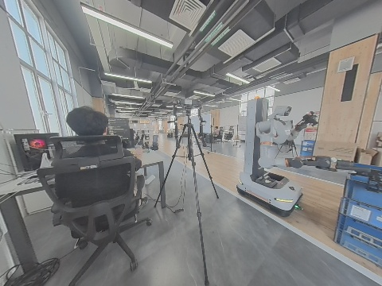
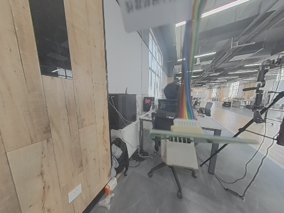

# 9_20 9_18 数采 评估 G1 传感器与 LeRobot 支持

- 归档编号：`01a0b23c-e3b0-7972-ab4e-594cdcf7e425`
- 项目：VLA G1 项目
- 创建时间：2026-09-18T09:58:50.047000+08:00
- 更新时间：2026-09-21T09:49:48.520000+08:00
- 状态：活动
- 导出范围：用户可见消息与助手可见回复；不含隐藏推理和工具原始输出

## 1. 用户

给我核实评估一下 G1的各个摄像头和力传感器是否正常，是否支持构建 lerobot 的数据集

## 2. 助手（进展）

我先检查项目里 G1 的连接方式和传感器配置，再核实能读取到的相机、力传感器数据，以及是否满足 LeRobot 数据集的采集要求。

## 3. 助手（进展）

项目记录显示，这里的 G1 是银河通用 `galbot-echo`（`10.34.216.136`）。我会使用 `galbot-136-ssh` 技能做只读检查，核实实际数据流；当前 LeRobot 预览适配器尚未接入相机或力数据。

## 4. 助手（进展）

已连上真机，头部、左右腕部和环视相机采集进程都在运行。接下来会读取连续帧、检查图像解码和时间戳，并采样左右腕力数据；仅凭进程存在还不能判定传感器正常。

## 5. 助手

_工具输出图片（原始工具文本未纳入归档）。_








## 6. 助手（进展）

第一轮连续采样已确认：8 路彩色图像、2 路腕部深度和左右腕六维力数据都在更新，抽检图像可正常解码。头部和腕部约 15 FPS，环视约 10 FPS。腕力读数稳定，但存在明显静态载荷，尚不能据此确认归零和测量精度；我正在进一步检查同步误差和 LeRobot 写入兼容性。

## 7. 助手

_工具输出图片（原始工具文本未纳入归档）。_









## 8. 助手（进展）

同步检查发现了需要处理的关键问题：左右腕相机相差约 33 ms，头部与左腕的对齐误差 P95 约 78 ms；直接读取“最新腕力”也会比图像时间晚。传感器具备采集条件，但正式数据集需要按时间戳缓存对齐。独立高频采样中，两侧腕力都读到了约 115 次/秒的新数据。

## 9. 助手（进展）

LeRobot 实际写入与回读验证已通过：20 帧诊断样本包含 3 路视频、14 维双臂关节状态和 12 维腕力/力矩，数值回读一致、视频均可解码。结论是“可以构建数据集”，但当前采集程序还缺相机/腕力接入及时间对齐；这次只读诊断没有采集动作标签，因此样本不属于训练演示数据。

## 10. 助手

已连接 G1 真机完成只读实测。**各路相机和左右腕力数据均可持续读取，支持构建 LeRobot 数据集；但正式训练采集还需要完善时间对齐和录制程序。** 全程未发送运动指令。

| 传感器 | 实测结果 | 判断 |
|---|---|---|
| 头部左目 | 1280×960，14.68 FPS | 图像正常 |
| 头部右目 | 1280×960，14.58 FPS | 图像正常 |
| 左腕 RGB | 1280×720，14.65 FPS | 图像正常 |
| 右腕 RGB | 1280×720，14.75 FPS | 图像正常 |
| 左腕深度 | 约 15 FPS，有效像素约 92% | 数据可用 |
| 右腕深度 | 约 15 FPS，有效像素约 89% | 数据可用 |
| 左前、右前、左后、右后环视 | 各 1280×960，约 10 FPS | 四路图像均正常 |
| 左、右腕六维力传感器 | 各约 115 次/秒更新 | 通信和静态输出正常 |

20 秒多路检查中未发现冻结帧或时间戳倒退，抽检图像全部解码成功。不过，**腕力精度尚不能判定合格**：左、右腕静态合力约 51.3 N、32.8 N，尚未核实零偏、工具重力补偿及已知载荷响应。

LeRobot 方面，已实际完成 **20 帧、3 路视频＋14 维关节位置＋12 维腕力/力矩**的写入与回读，全部通过。正式使用还有三个缺口：

- **同步**：左右腕图像相差约 33 ms，头部与左腕对齐误差 P95 约 78 ms；腕力需要缓存后按图像时间匹配。
- **采集适配**：现有项目录制器尚未接入图像和腕力。
- **动作标签**：此次为只读诊断，没有 `action`，诊断样本不能直接用作训练演示。

建议先接入“头部＋左右腕 RGB＋双臂/夹爪状态＋动作”，保留原始腕力和时间戳，再完成补偿与同步验收。

[完整评估报告与现场图片](<../../assets/aacdea1e014e4c94--%E8%AF%84%E4%BC%B0%E6%8A%A5%E5%91%8A.md>)

[附件：aacdea1e014e4c94--评估报告.md](../../assets/aacdea1e014e4c94--%E8%AF%84%E4%BC%B0%E6%8A%A5%E5%91%8A.md)

## 11. 用户

你要不再给我检测一下各个采集点的时间戳误差情况，并判断一下是否影响数据采集？或者我应该把采集程序放在G1机器人里面直接保存然后整体上传到PC主机，还是直接使用PC主机进行采集？

## 12. 助手（进展）

我会重新测量各路图像、关节和腕力的时间戳偏差、抖动及数据年龄，并检查 G1 到 PC 的传输条件，再判断哪种采集部署方式更合适。

## 13. 助手（进展）

这次继续使用 `galbot-136-ssh` 技能做只读检查。我会区分“传感器采样时刻不一致”和“数据到达 PC 晚”，这两种问题对离线训练和实时控制的影响不同。

## 14. 助手（进展）

当前 PC 与 G1 仍通过 Wi‑Fi 通信，G1 本地 NVMe 约有 1.5 TB 可用空间。60 秒传感器复测已完成；接下来我会比较“直接拼接最新值”和“缓存后按源时间戳配对”的误差，并测量两台机器的时钟偏差与实际传输速度。

## 15. 助手（进展）

复测发现，缓存对齐能明显降低误差：腕力相对左腕图像的 P95 偏差从约 83 ms 降到 4.5 ms，关节从约 79 ms 降到 8 ms。另一个重要问题是两台机器虽然都显示 NTP 已同步，但实测并未达到毫秒级一致，因此不能直接把 PC 接收时间当作传感器采样时间。

## 16. 助手（进展）

发现一个会改变部署建议的情况：PC 和 G1 其实已经有有线连接（`192.168.1.99 ↔ 192.168.1.88`），但此前使用 `10.34.216.136` 访问时走的是 Wi‑Fi。我会补测这条有线路径。G1 也在向这台 PC 校时，但刚启动后仍有数十毫秒的偏差，尚未稳定收敛。

## 17. 助手（进展）

有线补测结果很好：应用层 RTT 的 P95 约 1.1 ms，32 MiB 下载约 113.7 MB/s；Wi‑Fi 同项下载约 9.6 MB/s。因此“PC 直接采集”并非不可行，关键是走有线链路并保留源时间戳。我的建议仍是 G1 本地保存原始数据、通过有线按 episode 传到 PC，PC 负责对齐、转换和训练；这样断网也不会丢掉整段原始采集。

## 18. 助手

**建议采用：G1 本地保存原始数据 → 通过有线连接按 episode 上传 PC → PC 做时间对齐、LeRobot 转换和训练。** PC 经有线直接采集也可行，但不建议继续通过当前 Wi‑Fi 作为唯一录制通路。

这次重新做了 **60 秒、19 个数据流**的时间戳检查，并补测了无线和有线网络，全程没有发送运动指令。

**时间戳偏差确实会影响采集，但缓存对齐能明显改善。**

以下以左腕图像为基准，数值为绝对偏差 P95，即 95% 样本不超过该值：

| 采集点 | 直接拼接“最新值” | 缓存后按源时间戳匹配 |
|---|---:|---:|
| 头部左右目 | 约 91 ms | 31.7 ms |
| 右腕 RGB／深度 | 约 58 ms | 9.0 ms |
| 左腕深度 | 0 ms | 0 ms |
| 四路环视 | 约 190–191 ms | 49.0 ms |
| 左右腕力 | 83.2 ms | 4.5 ms |
| 双臂及其他关节组 | 78.6 ms | 8.0 ms |
| 左右夹爪 | 83.2 ms | 约 4.5 ms |

因此，**不能简单把同一轮读到的数据拼成一行**。例如末端以 0.2 m/s 运动，83 ms 错位就对应约 16.6 mm 位移，会污染图像与状态、动作之间的对应关系。

缓存后的结果具备低速抓取试采条件；精密插接、快速双臂操作和接触力学习仍需更严格同步。这里测的是 **SDK 时间戳差**，尚未证明物理曝光/测量同步精度；部分消息还出现了约 7–11 ms 的“时间戳领先本机读取时间”现象，需要进一步核实源时钟。

**另一个关键发现：你已经接好了千兆有线，但之前访问的地址走的是无线。**

| 项目 | Wi‑Fi | 现有千兆有线 |
|---|---:|---:|
| G1 地址 | `10.34.216.136` | `192.168.1.88` |
| 32 MiB 下载速度 | 9.6 MB/s | 113.7 MB/s |
| 应用层 RTT P95 | 约 54–56 ms | 约 1.1 ms |

当前“头左＋双腕 RGB”约需 **6.7 MB/s**，全部 RGB＋双深度约需 **76.2 MB/s**。有线具备带宽基础；上述是短时链路测试，还不能替代真实视频持续写盘验收。

同时，两端虽然显示 NTP 已同步，**G1 开机后仍在收敛**：后续有线测量中，G1 时钟仍比 PC 慢约 29–33 ms，且持续变化。因此不要用 PC 收包时间代替采样时间，也不要用一次测得的固定偏移校正整场数据。

我建议这样分工：

- **G1：**轻量采集、保留源时间戳、记录关节/腕力和实际动作，可靠保存原始数据。
- **传输：**每个 episode 或分片完成后走有线传到 PC，校验成功再清理机器人副本，无需等全部采集结束。
- **PC：**检查缺帧、统一时间基准、缓存配对，再生成 LeRobot 数据集和训练。

如果只采三路 RGB，**G1 缓冲转发＋PC 有线落盘**也合理；但应保留断线补传能力。把程序放进 G1 能减少网络导致的数据丢失，**不会自动消除传感器之间的时间差**。

[完整复测报告、各采集点统计与原始证据](<../../assets/97b60620850e58fe--%E6%97%B6%E9%97%B4%E6%88%B3%E4%B8%8E%E9%87%87%E9%9B%86%E9%83%A8%E7%BD%B2%E8%AF%84%E4%BC%B0.md>)

[附件：97b60620850e58fe--时间戳与采集部署评估.md](../../assets/97b60620850e58fe--%E6%97%B6%E9%97%B4%E6%88%B3%E4%B8%8E%E9%87%87%E9%9B%86%E9%83%A8%E7%BD%B2%E8%AF%84%E4%BC%B0.md)

## 19. 用户

数据采集是否使用 “vla-g1-teleop:lerobot-0.4.4”这个镜像？&#x20;
我希望采集的数据包括
“”头部左右目、左右腕 RGB／深度、 四路环视中的前方两路、左右腕力、双臂及其他关节组、左右夹爪”

给我先制定数采方案计划，明确目标

## 20. 助手（进展）

我先核对这个镜像的实际配置和现有采集代码，再按你指定的全部传感器制定数采目标、部署分工和验收计划。

## 21. 助手（进展）

已确认镜像存在，且是 `amd64` 的 PC 端镜像。方案会沿用它作为 PC 端遥操、数据转换和验证环境；G1 端使用自身的 ARM SDK 运行轻量记录器。你指定的范围是 6 路 RGB、2 路深度，以及全部指定的状态和腕力数据。另外，现有启动脚本还固定使用了 `104 ms` 时钟补偿，正式数采前需要替换为经过验证的时钟映射。

## 22. 助手

**使用 `vla-g1-teleop:lerobot-0.4.4`，作为 PC 端数采环境。** 已确认镜像存在，架构为 `amd64`；G1 端使用自身 ARM SDK 运行轻量记录器，不直接运行这个镜像。

建议明确分工：

**G1 原始采集与落盘 → 千兆有线分段上传 → PC 容器内对齐、转换、校验。**

### 采集目标

完整保存你指定的全部通道：

| 数据 | 范围 | 原始采集频率 |
|---|---|---|
| 头部 RGB | 左目、右目 | 各约 15 FPS |
| 腕部 RGB／深度 | 左右腕，各 RGB＋uint16 深度 | 各约 15 FPS |
| 前方环视 RGB | 左前、右前 | 各约 10 FPS |
| 六维腕力 | 左右力、力矩 | 各约 120 Hz |
| 关节状态 | 双臂、头部、腿、底盘 | 约 60 Hz |
| 夹爪状态 | 左右开度、速度及其他反馈 | 各约 120 Hz |

合计 **6 路 RGB＋2 路深度＋全部指定低维状态**。原始数据保留原生频率，第一版 LeRobot 数据集统一按 **10 Hz** 对齐导出。

另外必须保存**实际下发动作、任务描述和成功/失败标注**，才能形成模仿学习数据。采集双臂状态不等于必须同时控制双臂，动作维度按实际控制范围确定。

### 实施计划

| 阶段 | 主要工作 | 验收目标 |
|---|---|---|
| 1. 固定环境与格式 | 核实镜像内依赖、通道、单位、时钟和动作定义 | 所有字段含义明确、版本可追溯 |
| 2. 原始记录器 | G1 全通道采集、缓存、分片落盘 | 必采通道齐全，缺帧和异常显式记录 |
| 3. 上传与转换 | 有线校验传输、时间对齐、LeRobot 导出 | 六路视频可解码、深度无损回读、状态和动作可追溯 |
| 4. 持续验收 | 全通道连续录制 30 分钟，检查断线恢复、队列和写盘 | 无静默丢数，记录不阻塞控制 |
| 5. 任务试采 | 一个代表性低速任务，先采 10 个 episode | 回放对应正确，训练加载通过 |
| 6. 批量采集 | 固定通过验收的版本和参数 | 按任务覆盖要求扩充数据 |

**正式采集前必须处理两个缺口：**

- 现有脚本固定使用 `104 ms` 时钟补偿，需要改为经过验证的时钟映射。
- LeRobot 0.4.4 的双路 uint16 深度存取尚未验收，必须保留无损原始深度，并验证加载适配，不能用深度预览视频替代。

这套范围预计原始数据约 **253 GB/小时**；30 分钟测试约 **126 GB**，需要提前预留机器人和 PC 的存储空间。

**完成标准：全部指定通道采全、动作真实、时间对齐合格、传输可恢复、镜像内完整回读通过。** 本次仅制定计划，尚未启动实施或正式采集。

[完整数采方案 v1](<../../assets/e1a8d242dbddd514--G1_%E5%A4%9A%E6%A8%A1%E6%80%81%E6%95%B0%E9%87%87%E6%96%B9%E6%A1%88_v1.md>)

[附件：e1a8d242dbddd514--G1_多模态数采方案_v1.md](../../assets/e1a8d242dbddd514--G1_%E5%A4%9A%E6%A8%A1%E6%80%81%E6%95%B0%E9%87%87%E6%96%B9%E6%A1%88_v1.md)

## 23. 用户

我们先开始第一步如何

## 24. 助手（进展）

可以。我先执行第一步：核实 PC 镜像内的实际依赖和 G1 SDK，整理全部采集通道、字段单位、时钟来源及动作定义，形成可检查的环境清单和数据格式草案。

## 25. 助手（进展）

PC 镜像内验收已通过：LeRobot 0.4.4、SDK 1.9.1 能正常导入，历史诊断数据的 20 帧、3 路视频全部回读成功，uint16 深度 PNG 的边界值也能无损往返。另确认现有正式记录入口只控制左臂 7 关节，左夹爪属于另一入口，不能直接把当前 action 定义成双臂加双夹爪。G1 有线连接目前超时，我正在检查备用连接，并继续整理不依赖真机在线的格式清单。

## 26. 助手（进展）

发现两个需要记录的环境问题：镜像里的 TorchCodec 无法加载，基础镜像还存在 NumPy/Isaac Sim 依赖冲突。不过，指定使用 PyAV 的数据读取路径，以及 H.264、16 位无损深度编解码测试都通过了，数采转换可以先固定走这条路径。

G1 的有线和无线地址目前均不可达，因此本次不能确认真机当前配置。格式草案已覆盖 17 个必采数据流；4 个底盘状态字段的单位在现有 URDF 和文档中仍无法确认，会原样保留并标记未知。

## 27. 助手

第一步已开始，**离线环境和格式核实已完成，真机部分暂时受连接问题阻挡。**

已完成：

- 镜像内确认 **LeRobot 0.4.4、PC SDK 1.9.1** 可用。
- 历史数据 **20 帧×3 路视频**全部回读通过。
- H.264 编解码、16 位深度无损存取测试通过。
- 整理 **17 个必采数据流**，覆盖你指定的全部通道。
- 保存环境版本、文件哈希及数据格式草案。

发现的问题：

- **TorchCodec 不可用**，已验证可使用 PyAV；镜像另有仿真组件依赖冲突，暂不混用这些组件。
- 现有记录入口实际只有**左臂 7 维动作**，不能直接声明支持双臂双夹爪动作。
- 底盘 4 个状态字段的单位、腕力坐标系及源时钟仍需核实。
- G1 **有线连接超时，无线提示无路由**，所以尚未完成本次真机复核。

没有修改机器人控制或启动运动。连接恢复后，继续补齐真机配置与时钟验证，再冻结第一步结果。

[第一步验收记录与数据格式清单](<../../assets/11abaf0f2cc6342a--README.md>)

[附件：11abaf0f2cc6342a--README.md](../../assets/11abaf0f2cc6342a--README.md)

## 28. 用户

现在有线应该链接上了，你再看看

## 29. 助手（进展）

我先重新检查有线连接；连通后继续补齐第一步的真机配置、采集通道和时钟核实。

## 30. 助手

刚检查了，**有线还没有真正连通**：

- PC 原来的机器人网口 `eno1` 已启用，但显示 **`NO-CARRIER`，未检测到物理链路**。
- 原有地址 `192.168.1.99` 目前不在该网口上。
- G1 `192.168.1.88` 的 Ping 和 SSH 均失败。

请检查 **PC 的原机器人网口与 G1 两端网线、网口指示灯**。如果这次换用了 USB 网卡或其他网口，请告诉我，我按新的接口继续检查。

## 31. 用户

现在应该链接上了，G1上是否需要进行环境隔离？

## 32. 助手（进展）

我再检查一次有线连接，连通后继续只读核实 G1 环境。环境隔离建议采用“独立采集目录＋进程＋日志/数据目录”，先复用厂商 SDK 和系统 Python，不改机器人现有依赖；是否需要虚拟环境，要看新增依赖与 SDK 的兼容性。

## 33. 助手（进展）

有线已经恢复，当前是千兆链路，SSH 正常。G1 的 SDK 1.9.0、固件和两份 URDF 已核对，URDF 与本地一致。左右腕图像、深度、前环视、腕力和夹爪均读到了更新数据，但这轮短检暂未读到头部左右目；机器人刚启动，我会再确认头部通道状态。

## 34. 助手

**有线已连通，确认是千兆链路。** 已补验 G1 SDK、固件和 URDF，你指定的 **17 个采集流全部读到了更新数据**，包括头部左右目。

**G1 建议做轻量隔离，暂不需要部署 Docker 或完整 LeRobot 环境：**

| 层面 | 建议 |
|---|---|
| 程序 | 独立版本目录、启动脚本和采集进程 |
| 数据 | 原始数据、日志独立存放，不混入厂商目录 |
| Python／SDK | 初版复用已验证的 Python 3.8.10＋SDK 1.9.0 |
| 新增依赖 | 确有需要时建立独立 venv，固定版本并验证 SDK 兼容性 |
| 系统环境 | 不全局 `pip install`，不修改系统 Python、厂商 SDK 或 `.bashrc` |

虚拟环境可以隔离 Python 包，但**不能自动隔离 CPU、内存和磁盘负载**；采集程序仍需有界队列、独立写盘线程和容量监控。[Python 官方说明](https://docs.python.org/3.11/library/venv.html)

因此，第一版采用：**G1 轻量原始记录器＋PC 的 LeRobot 镜像处理数据**。本次尚未安装依赖或修改 G1 环境；第一步剩余的是源时钟、底盘字段单位和腕力语义的确认。

[环境隔离方案](<../../assets/384e71e17a59739c--G1%E7%8E%AF%E5%A2%83%E9%9A%94%E7%A6%BB%E6%96%B9%E6%A1%88.md>)

[附件：384e71e17a59739c--G1环境隔离方案.md](../../assets/384e71e17a59739c--G1%E7%8E%AF%E5%A2%83%E9%9A%94%E7%A6%BB%E6%96%B9%E6%A1%88.md)

## 35. 用户

好的我们继续

## 36. 助手（进展）

我继续完成第一步剩余的核实：重点查底盘字段单位、腕力坐标系与补偿状态，以及各数据源的时间戳定义，并复测有线时钟稳定性。结果明确后再冻结采集格式。

## 37. 助手（进展）

已找到更具体的字段定义：SDK 明确腕力单位为 N／N·m，时间戳为 epoch 纳秒，但没有说明腕力是否已做工具重力补偿。夹爪 `effort` 的文档存在冲突——C++ 写牛顿，Python 写牛顿米，因此暂不能把它作为已标定的夹持力使用。底盘 4 个字段也还缺明确的物理含义，我会保留原值并把这些限制写入格式。

## 38. 助手（进展）

60 秒时钟复测已完成，共 301 次交换，17 个数据流都持续可读。这一轮 G1 相对 PC 的时钟偏差约为 **+10.3 ms**，并未达到直接共用时间戳的目标；离线拟合在留出样本上的残差 P95 约 **0.69 ms**，但这还不是运行时映射或传感器物理同步的验收。我已将已知字段和未确认语义分别写入清单，原始记录器可以据此开发，正式训练导出仍需保留门槛。

## 39. 助手

已继续完成字段与时钟补验：

- **17 个必采流**在 60 秒、301 次抽检中均有数据，未发现时间戳倒退。
- G1 比 PC 快约 **10.3 ms**，仍不能直接混用两端时间。
- 离线时钟映射的留出样本残差 P95 为 **0.69 ms**，但尚未验证运行时校正及传感器物理同步。

还有三项不能凭现有资料确定：**底盘 4 个字段的物理含义、夹爪 effort 单位、腕力坐标系与重力补偿状态**。这些已明确标记为未知，不会擅自归一化。

目前可以据此进入**原始记录器开发**：全部原始数据、时间戳及未知状态一起保存。第一步的完整训练语义验收仍未通过，正式训练导出继续保持限制。

[本次补验结论与待确认清单](<../../assets/8f0db696d0c24db2--P0%E8%A1%A5%E5%85%85%E7%BB%93%E8%AE%BA.md>)

[附件：8f0db696d0c24db2--P0补充结论.md](../../assets/8f0db696d0c24db2--P0%E8%A1%A5%E5%85%85%E7%BB%93%E8%AE%BA.md)

## 40. 用户

原始记录器开发 开始

## 41. 助手（进展）

我开始实现 G1 原始记录器：按已确定的 17 个数据流采集，保留原始图像/深度字节和时间戳，加入有界队列、分片落盘、完整性校验与异常统计。先完成离线验证，再在 G1 上做短时只读试录。

## 42. 助手（进展）

记录器主体已写好：图像和深度直接保存 SDK 原始字节，低维状态连同源时间戳保存；数据按分片落盘，并记录校验和。队列溢出、磁盘余量不足或必采通道持续断流时，会停止并标记失败。接下来测试这些异常路径，再做短时真机试录。

## 43. 助手（进展）

离线测试已通过 9 项，包括分片回读、校验失败、断流、磁盘不足、队列上限和中断退出。准备部署时，有线链路又断开了：PC 的 `eno1` 当前无载波，因此代码尚未上传，真机试录也未执行。我先继续补齐恢复检查工具和使用说明。

## 44. 助手

**原始记录器 v0.1 已完成本地实现。**

包含：

- 17 个必采流，原始 RGB／深度字节及低维状态保存。
- 源时间戳、接收时间、单位及未知语义标记。
- 有界队列、分片落盘、SHA256 校验。
- 缺流、磁盘不足、队列溢出和中断处理。
- 完整性校验与未完成分片检查工具。

**本地和指定 PC 镜像内均通过 10 项测试。**

部署前有线再次断开，`eno1` 无载波，因此**尚未上传 G1，也未完成真机试录**。连接恢复后，下一步是 10 秒只读试录及全量回读校验。

本版仅记录观测数据，不发送运动指令，也尚未接入遥操动作日志。

[代码说明与运行方法](<../../assets/c8554653eb635a52--README.md>)

[附件：c8554653eb635a52--README.md](../../assets/c8554653eb635a52--README.md)

## 45. 用户

现在你看看，有线应该好了

## 46. 助手（进展）

我先复查有线连接；恢复后就部署已测试的记录器，执行 10 秒只读试录和全量回读校验。

## 47. 助手（进展）

有线已恢复，千兆链路和 SSH 都正常。记录器已部署到独立目录，G1 的 Python 3.8 上也通过了全部 10 项离线测试。现在正在执行 10 秒全通道只读试录。

## 48. 助手（进展）

试录在预检阶段正确停止了：头部左右目在 25 秒内没有提供更新帧，因此没有开始保存不完整数据；其他必采通道已就绪。我继续检查头部相机采集进程和单独订阅结果，确认是相机数据源还是 SDK 订阅的问题。

## 49. 助手（进展）

头部两路在独立订阅检查中恢复了连续帧，重新试录已完成：**17 个数据流共写入 8,541 条记录，6 个分片，队列峰值约 4.9 MB，无写入错误。** 我现在做逐文件、逐记录校验，并取回 PC 验证。另发现统计把预热结束到正式录制之间的间隔计入了“最大帧间隔”，会修正这个统计口径。

## 50. 助手（进展）

全量校验已通过：G1 和 PC 两端的文件、记录校验一致，PC 镜像内也成功解码了全部 **805 帧 RGB、302 帧深度**，原始文件约 **722 MB**。最大帧间隔的统计问题已修正并通过回归测试，我再用新版本做一次短录确认。

## 51. 助手

**有线已恢复，千兆链路正常。已继续完成部署和真机试录。**

- 10 秒采集覆盖全部 **17 个数据流**。
- 保存 **8,541 条记录、约 722 MB**。
- G1、PC 两端全量校验通过。
- PC 成功解码全部 **805 帧 RGB、302 帧深度**。
- 修正版 v0.1.1 通过 **11 项测试**及额外短录验证。

首次头部双目未就绪，被预检正确拦截；复检后全通道试录成功。全程未发送运动指令。

目前验证的是原始观测记录能力，**尚未接入动作日志或完成长期稳定性验收**。

[真机试录验收报告](<../../assets/5f1cf899fdc7374f--%E7%9C%9F%E6%9C%BA%E8%AF%95%E5%BD%95%E9%AA%8C%E6%94%B6.md>)

[附件：5f1cf899fdc7374f--真机试录验收.md](../../assets/5f1cf899fdc7374f--%E7%9C%9F%E6%9C%BA%E8%AF%95%E5%BD%95%E9%AA%8C%E6%94%B6.md)

## 52. 用户

好的，我们下一步是什么？

## 53. 助手

**下一步建议先完成“带动作的完整 episode”短录，验证 observation 与 action 能正确对应。** 先不急着做 30 分钟长录。

具体顺序：

1. **接入动作日志**
   保存实际下发目标、指令序号、发送时间和 SDK 返回状态。当前已有左臂 7 关节记录入口；左夹爪需另行整合。其余传感器仍全部采集。

2. **接入时间映射**
   持续记录 PC↔G1 时钟关系，替换历史固定 `104 ms` 补偿；保留各传感器原始时间戳。

3. **完成一个短 episode**
   先静态联调，再由你操作遥控器完成一段低速动作。检查开始、结束、动作日志与全部 17 个数据流是否齐全，并回放验证对应关系。

4. **导出 LeRobot 样本**
   在现有 PC 镜像内验证六路 RGB、双路无损深度、状态、腕力和 action 的加载。

这条流程通过后，再做 **30 分钟持续录制与断线恢复测试**。

下一阶段的明确目标是：**产出一个动作可追溯、时间可对齐、能够完整回读的演示 episode。**

## 54. 用户

我们的记录方式应该是 一个episode 开始停止一次是吧，我确认一下

## 55. 助手

对，**一次“开始记录 → 执行任务 → 停止记录”，对应一个 episode**。

建议操作流程：

1. 机器人和场景准备好。
2. 按“开始记录”，创建新 episode，开始记录全部传感器和动作。
3. 完成一次任务尝试。
4. 按“停止记录”，结束这一段，并标注成功、失败或中断。
5. 系统完成落盘、校验，再准备下一段。

注意两点：

- **停止记录不等于停止机器人运动**，运动停止／急停应独立控制。
- 一个 episode 内可以自动拆成多个存储分片，**分片不代表新的 episode**。

目前实现的是“每次启动记录器，按指定时长录一段”。你说的**手动开始／停止、连续创建多个 episode**，是下一步需要补上的会话控制功能。

## 56. 用户

下一步我们是需要“产出一个动作可追溯、时间可对齐、能够完整回读的演示 episode”这个吗

## 57. 助手

对，**下一步就是产出一个“动作可追溯、时间可对齐、能够完整回读的演示 episode”**。

验收要同时满足：

- **边界明确**：按一次开始、一次停止，形成一个独立 episode。
- **数据齐全**：包含指定的 17 个传感器流，以及实际下发的动作日志。
- **时间可对应**：图像、状态、腕力与动作保留原始时间戳，并有经过验证的对齐方式。
- **能够回读**：保存后可校验、回放，并在 PC 的 LeRobot 环境中读取。
- **结果有标注**：记录任务描述，以及成功、失败或中断。

当前原始传感器记录能力已通过短试。接下来重点补齐 **手动开始／停止、动作接入和时间映射**，然后完成首个演示 episode。

## 58. 用户

现在我们计划的数采架构是什么样的？是在G1里面还是在我PC主机上采集？

## 59. 助手

目前计划是 **G1 负责传感器采集和原始落盘，PC 负责遥操、录制管理以及后处理**，两端共同组成一个 episode。

```text
PC：遥操输入、开始/停止记录、任务标注
 ├─ 记录实际下发动作和 PC 时间戳
 └─ 经有线发送控制指令
                  ↓
G1：采集全部 17 个传感器流
 └─ 保存原始数据、源时间戳和 G1 接收时间
                  ↓ 千兆有线传输
PC：汇总同一个 episode
 └─ 校验 → 时间对齐 → 回放 → LeRobot 转换 → 训练
```

| 位置 | 负责什么 |
|---|---|
| **G1 内部** | 相机、深度、腕力、关节、夹爪的原始采集；有界缓存；分片写盘 |
| **PC 主机** | 遥操和动作日志；统一开始/停止；episode 编号和标注；接收、校验、对齐、转换 |
| **PC 镜像** | 使用 `vla-g1-teleop:lerobot-0.4.4` 运行相关 PC 程序 |
| **G1 环境** | 独立目录和进程，复用厂商 Python／SDK，不运行这个 PC 镜像 |

**因此，不是把全部相机实时传回 PC 后才开始保存。** 原始传感器数据先保存在 G1，完成的分片或 episode 再传到 PC，并保留机器人原件直到校验确认。

目前已验证的是 **G1 原始记录 → 有线复制 → PC 完整回读**。接下来要把两端用同一个 `episode_id` 串起来，补齐统一开始／停止、动作日志与时钟映射。

## 60. 用户

现在各个线路的时间戳差距到底还有没有问题？

## 61. 助手

**还有问题，目前不能判定时间对齐已经合格。** 原始数据能完整保存、回读，和各路数据在同一时刻对应正确，是两件事。

以下是 **9 月 20 日的实测结果，尚未在今天复测**：

| 对比项 | 实测情况 | 当前判断 |
|---|---|---|
| PC ↔ G1 主机时钟 | 最近一次 G1 比 PC 快约 **10.3 ms** | 不能直接混用；运行时映射尚未接入 |
| 左右腕相机 | 缓存配对后偏差 P95 约 **9 ms**，更早一次约 33 ms | 相位会变化，不能固定减一个数 |
| 头部 ↔ 左腕图像 | 缓存配对后 P95 约 **31.7 ms** | 低速任务可试验，精密任务需更严格验证 |
| 前环视 ↔ 左腕图像 | 缓存配对后 P95 约 **49 ms** | 时间分辨率较低，不宜直接用于快速接触判断 |
| 关节 ↔ 左腕图像 | 缓存配对后 P95 约 **8 ms** | 具备对齐基础，但未接入正式导出流程 |
| 腕力／夹爪 ↔ 左腕图像 | 缓存配对后 P95 约 **4.5 ms** | 软件时间戳配对较好，物理采样同步仍未证明 |
| 实际动作 ↔ 传感器 | 尚未完成联合记录与验证 | **首个演示 episode 的关键缺口** |

这些数字来自不同检查窗口，**不是最新记录器已实现的同步精度**。目前记录器保留各路原始时间戳，仍标记为 `unmapped`，没有自动完成校正和对齐。

另外，PC↔G1 的离线映射曾达到 **0.69 ms 的残差 P95**，说明可以进一步改善，但不能理解为所有相机和腕力都已经同步到 0.69 ms。

结论是：

- **原始试采可以继续**，保留数据和时间信息。
- **不能把同一轮读到的最新值直接拼成训练样本。**
- 首个演示 episode 前，需要复测时钟、接入持续映射，并实际验证“动作—图像—状态—腕力”的对应关系。
