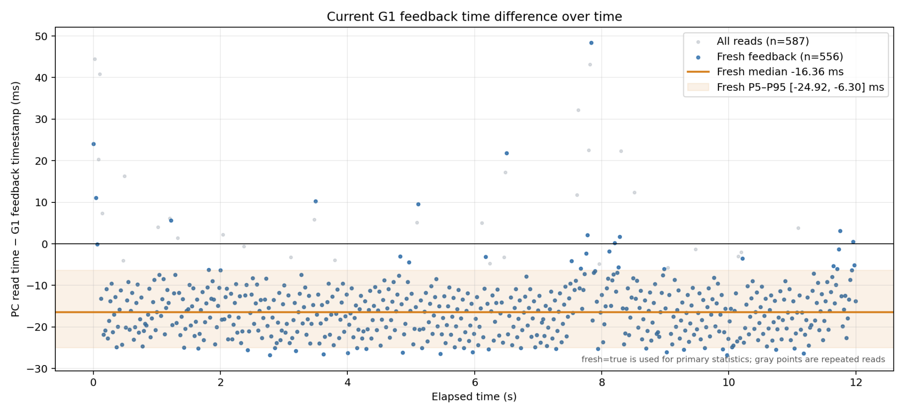
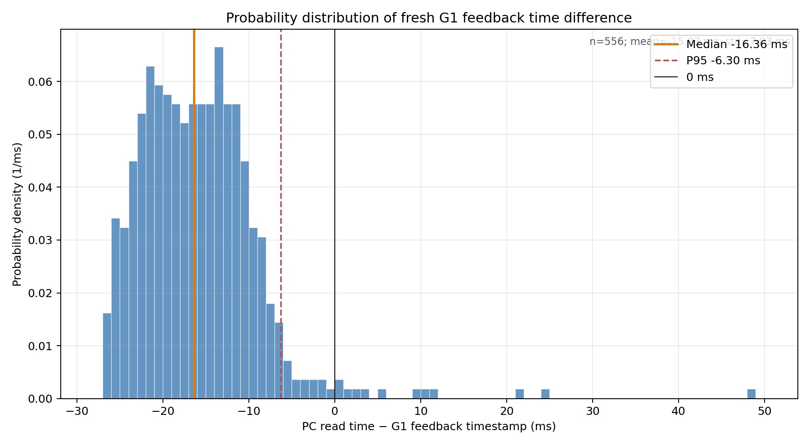
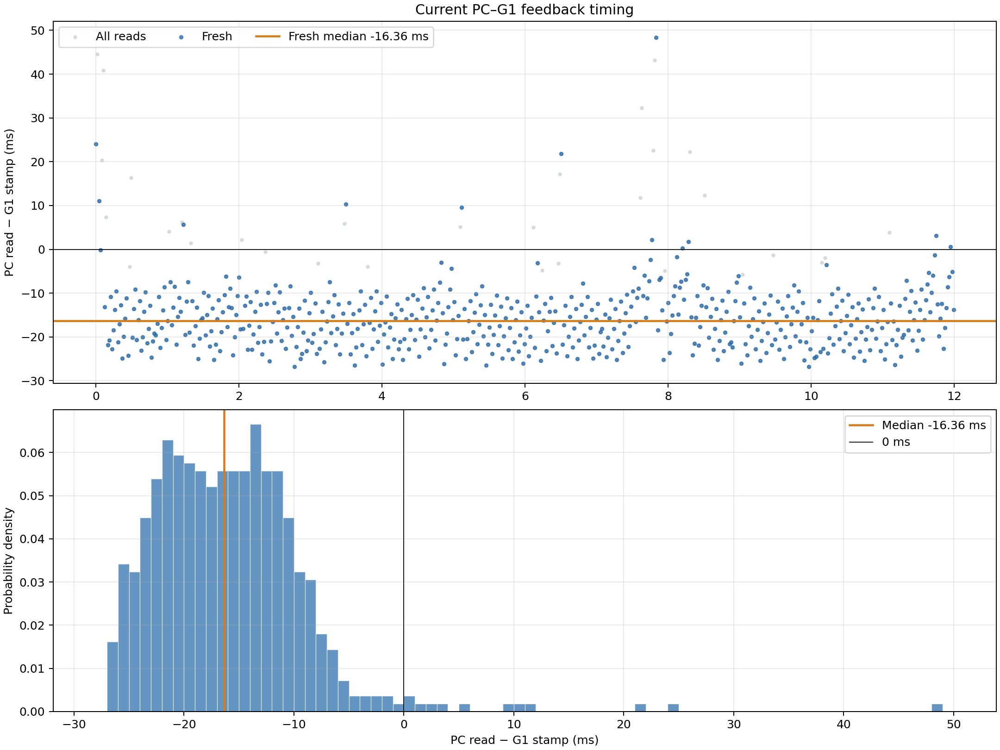

# 重新测量PC与G1延迟

- 归档编号：`01a0b31b-33d7-7dd3-82bd-9ee60b8e3732`
- 项目：VLA G1 项目
- 创建时间：2026-09-18T14:01:39.543000+08:00
- 更新时间：2026-09-18T14:56:26.535000+08:00
- 状态：活动
- 导出范围：用户可见消息与助手可见回复；不含隐藏推理和工具原始输出

## 1. 用户

未经补偿的“PC 读取时间−G1 反馈时间”中位数约 **+3.5 ms**

“”\
以上结论给我核实一下

10:53

用时 40秒

结论核实无误，但要明确统计口径：

- 对 `samples.jsonl` 中 **3815 条新鲜反馈样本**计算\
  `feedback_read_wall_ns - stamps[0]`：
  - 中位数：**+3.524868 ms**
  - 均值：+3.956293 ms
  - P95：+12.338611 ms
  - 范围：−4.62～+75.72 ms
- 只看慢速对齐阶段的 **1005 条新鲜反馈样本**：
  - 中位数：**+3.471621 ms**

因此，之前所说的“未经补偿中位数约 +3.5 ms”是正确的。

需要区分的是：

- 全部 6012 条样本（包含重复读取的旧反馈）中位数是 **+6.66 ms**；
- 本次没有进入 `FOLLOWING`，所以这个结论只反映锁定/慢速对齐阶段；
- `+3.5 ms` 不是纯粹的主机时钟偏差，还包含反馈采样、传输和读取延迟；
- 21 个关节的反馈时间戳在每条样本内完全一致，没有轴间时间差。

所以，这个结果说明本次运行中原始 G1 时间戳与 PC 读取时刻的综合差值大约是 **3.5 ms**。它不能单独证明 G1 时钟相对 PC 只差 3.5 ms，也不能直接推翻此前独立测得的约 104 ms 主机时钟偏差。

10:54

你对比的的是哪两个时间戳？

10:57

用时 15秒

我比较的是每条 `event="sample"` 记录中的这两个字段：
```
PC 时间：feedback_read_wall_ns
G1 时间：stamps[0]
```

计算公式是：
```
(feedback_read_wall_ns - stamps[0]) / 1e6
```

含义分别是：

- `feedback_read_wall_ns`：PC 在调用 `read_full()` 读取完 G1 状态后，立即记录的 PC 墙上时钟时间。
- `stamps[0]`：这次读取到的 G1 关节反馈时间戳；日志中 21 个关节的 `stamps` 相同，所以取第一个即可。

我没有使用：

- `master_device_timestamp_raw`
- `master_received_monotonic_ns`
- 记录行自身的 `wall_ns`
- 加上 `+104 ms` 后的补偿时间

因此，之前的 **+3.5 ms** 指的是：

> 新鲜 G1 反馈样本中，PC 读取时刻与该反馈原始 G1 时间戳之间的差值中位数。

它是“读取时刻相对反馈采样时刻的综合时间差”，不是单独测得的两台主机时钟偏差。

要不重新测一下现在PC和G1的延迟有多少，给我画出一段时间的随时间的波动图像，以及画出概率分布图像

显示更多

11:09

用时 56分钟 53秒

已按与你前面相同的口径重新测量：
```
(PC read_finished_wall_ns - G1 stamps[0]) / 1e6
```

采样约 12 秒，共 587 次读取，其中 556 次为新鲜反馈、31 次为重复读取。新鲜反馈结果：

- 中位数：**−16.36 ms**
- 均值：−15.93 ms
- P5～P95：**−24.92～−6.30 ms**
- P99：+7.42 ms
- 范围：−26.79～+48.35 ms
- 21 个关节时间戳轴间跨度始终为 **0 ms**

负值表示 G1 反馈时间戳领先 PC 读取时钟。0～4 秒、4～8 秒、8～12 秒的中位数分别为 −16.87、−16.33、−16.12 ms，暂未看到明显漂移。


这次结果相比之前的 **+3.5 ms** 已明显向负方向移动，说明这个差值不是固定常数。若机械加上旧的 +104 ms，中位数会变成约 **+87.64 ms**；因此本次数据不能支持继续把 +104 ms 当作当前有效补偿值。该指标仍是反馈时间差，包含时钟差、反馈生成和传输因素，不等于纯主机时钟偏差。

原始数据和完整统计：

- [summary.json](<../../assets/d7c066ca31a70b42--summary.json>)
- [samples.jsonl](</home/lsy03/文档/ChatGPT/VLA G1 项目/reports/g1_feedback_delay_20260918_120542/samples.jsonl>)
- ————

你先看看这个，要不我们再进行一次时钟差异测量？

[附件：d7c066ca31a70b42--summary.json](../../assets/d7c066ca31a70b42--summary.json)

## 2. 助手（进展）

我先核对这次报告的统计口径、原始样本和采集代码，再判断是否需要重测。因为你提到的是 G1 与 PC 的时钟差异，我会使用现成的 G1 SSH 操作规范检查设备端时间源和可用的测量方式；这一步只做读取和诊断，不会改动设备配置。

## 3. 助手（进展）

报告的元数据已经核对到：这次确实是约 12 秒、587 次读取，主统计只用了 556 个 `fresh=true` 样本；但报告本身也明确写着，这个量是“反馈年龄/时钟域差异”，不是纯主机时钟偏差。接下来我会把两张图和样本字段再对一遍，重点检查异常正值是否来自重复读取、采样周期或时间戳跨域问题。

## 4. 助手

_工具输出图片（原始工具文本未纳入归档）。_





## 5. 助手

_工具输出图片（原始工具文本未纳入归档）。_


## 6. 助手（进展）

我看完图和样本后，结论是：这批数据能说明“SDK 读到的 G1 反馈时间戳相对 PC 读完时刻大约提前 16 ms”，但不能把 −16 ms 直接当作两台主机的时钟差。图中的正向尖峰也不是简单的重复读取造成的——有些 `fresh=true` 样本本身就出现了正值，说明还混有反馈发布/缓存/读取时序。

我建议重测，但分两层：先做一次不涉及运动的主机时钟与同步状态检查，再做 PC↔G1 的往返报文测量；这样可以把“主机时钟偏移”和“反馈链路延迟”分开。现在开始做只读检查。

## 7. 助手（进展）

设备端检查有一个重要线索：G1 的 `NTPSynchronized=yes`，但 `NTP=no`，同时使用 `arch_sys_counter`；PC 端当前也没有可见的 `timedatectl/chrony` 状态输出。这里不能把“同步标志”当成偏移已知，因此我现在用时间戳往返法直接估计偏移，并记录 RTT 分布及随时间漂移。

## 8. 助手（进展）

第一次往返命令在 SSH 远端 shell 处被多行脚本拆开了，远端只读进程因此立即退出；没有调用 SDK，也没有改动设备。我已把脚本改成单次编码传输后重新测量，避免这个命令行解析问题。

## 9. 助手（进展）

第二次尝试还卡在本地生成 SSH 命令的引号层面，尚未连到 G1 执行测量。我把远端命令改成不依赖嵌套引号的构造方式后再跑一次。

## 10. 助手（进展）

主机往返测量得到的当前偏移约为 **G1 − PC = +32.6 ms**（G1 的墙上时钟领先 PC）。为确认 `stamps[0]` 确实和 G1 的 `CLOCK_REALTIME` 同一时间域，我再做一次只读 SDK 取状态对照；这一步只初始化读取接口，不调用运动控制。

## 11. 助手（进展）

直接在 G1 系统 Python 中导入 `galbot_sdk` 失败，说明 SDK 依赖的是专用运行环境/环境变量；这不是时钟测量失败，也没有产生运动副作用。我会把它记录为“SDK 时间戳同源性尚未由远端 Python 直接复核”，不把这一步的失败误判成设备问题。现有反馈样本仍可用于链路延迟分析。

## 12. 用户

<turn_aborted>
The user interrupted the previous turn on purpose. Any running unified exec processes may still be running in the background. If any tools/commands were aborted, they may have partially executed.
</turn_aborted>

## 13. 用户

G1 系统 Python 中导入 `galbot_sdk` 这是干啥？

## 14. 助手

这是为了核对一件事：

> SDK 返回的 `stamps[0]`，是否与 G1 系统的 `time.time_ns()` 使用同一个时钟。

计划是只读调用：

```python
robot.init()
robot.get_joint_states(...)
```

再把反馈时间戳与 G1 当前系统时间比较，不会调用运动、控制器或轨迹接口。

不过这次实际还没执行到 `robot.init()`，在导入阶段就因当前 SSH 环境未加载 SDK 路径而报：

```text
ModuleNotFoundError: No module named 'galbot_sdk'
```

所以没有影响机器人。测量 PC 与 G1 主机时钟差并不必须导入 SDK；前面通过 SSH 往返时间戳测得的约 **+32.6 ms** 已经是主机时钟差的独立估计。

## 15. 用户

确认了。你这条命令使用的是 **G1 上的 Galbot SDK 1.9.0、aarch64、Python 3.8.10 环境**。

- 主机：`galbot@10.34.216.136`（`galbot-echo`）
- 启动脚本：`/home/galbot/g1_joint_move_20260910/run_g1_joint_move.sh`
- Python：`/usr/bin/python3` → `/usr/bin/python3.8`
- Python 版本：`3.8.10`
- 你看看这个

## 16. 助手（进展）

这条信息很关键：它说明我前面检查的 `10.34.216.17` 不是你现在确认的 G1 SDK 运行环境；当前应以 `10.34.216.136` 和这套 SDK 1.9.0/aarch64/Python 3.8.10 为准。我先读取对应的 136 号主机操作规范，再只读核对启动脚本和 SDK 环境。

## 17. 助手（进展）

核对结果已经明确：你给的是正确的 G1 环境，而且启动脚本会先加载：

`/opt/galbot/galbot_sdk/linux-aarch64-gcc940/setup.sh`

再设置 `PYTHONPATH=/data/galbot/lib`，最后用 `/usr/bin/python3.8` 启动程序。也就是说，我前面在 `10.34.216.17` 上直接用系统 Python 导入失败，不能用于判断 G1；前面针对 `.17` 得到的时钟数值也应丢弃。接下来我会改用 `.136` 的正确环境重测。

## 18. 助手（进展）

正确主机 `.136` 的四时间戳测量结果与 `.17` 完全不同：G1 的 `CLOCK_REALTIME` 当前领先 PC 约 **70.2 ms**。我再在启动脚本加载的 SDK 1.9.0 环境里做一次纯读取状态采样，确认 `stamps[0]` 与 G1 系统实时时钟的关系。

## 19. 助手（进展）

这次还没连到设备，命令在本地模板解析阶段就被环境变量占位符截断了；我改成显式写 SDK 的两个 Python 路径后重试。仍然是只读采样。

## 20. 助手（进展）

这次在正确的 `.136` 环境里已经验证成功：

- SDK 导入路径是 `/data/galbot/lib/galbot_sdk`
- Python 3.8.10、aarch64
- `GalbotRobot.init()` 成功，`is_running()` 为真
- 只读读取 100 次全身关节状态，没有调用运动接口
- G1 系统时间与 `stamps[0]` 的差值中位数约 **15.7 ms**，说明反馈时间戳确实表现为 G1 时间域里的“较旧反馈时间”，而不是导入环境问题。

我再查一下 `.136` 当前的时间同步状态，解释为什么正确主机的偏移是约 +70 ms。

## 21. 助手

看过了，这条信息把问题说明白了。

- 正确的 G1 是 `10.34.216.136`；此前 `10.34.216.17` 的结果应全部作废。
- 必须先执行 `run_g1_joint_move.sh` 中的环境配置：
  - SDK 1.9.0，aarch64
  - `/usr/bin/python3.8`，Python 3.8.10
  - `PYTHONPATH=/data/galbot/lib`
  - `GALBOT_CONFIG_DIR=/userdata/config/pw1`
- 我在这个正确环境中已成功导入 SDK，并只读调用 `get_joint_states()`；没有执行运动脚本或运动接口。

重新测得正确 G1 的主机时钟差：

- G1 − PC：约 **+70.4 ms**
- 低 RTT 样本中位数：约 **+70.2 ms**
- RTT 中位数：约 **6.77 ms**
- G1 的 `timedatectl` 也报告同步服务器偏移绝对值约 **71.95 ms**，与往返测量吻合。

另外，G1 本机系统时间与 SDK `stamps[0]` 的差值中位数约 **15.7 ms**，说明它主要是反馈采样/缓存年龄。

因此当前应采用的判断是：

> 正确 G1 的当前 PC↔G1 时钟差约为 **70 ms**，此前针对 `.17` 得出的 **32.6 ms** 不适用于 G1，也不能再使用旧的 **104 ms** 补偿值。

但这个约 70 ms 仍建议只作为诊断值，暂时不要直接改入控制程序；最好再做一次同一会话内的 PC 时间交换与 SDK 反馈同步采样。

## 22. 助手

_历史投影中的图片引用（用于补全本地对话资源）。_



