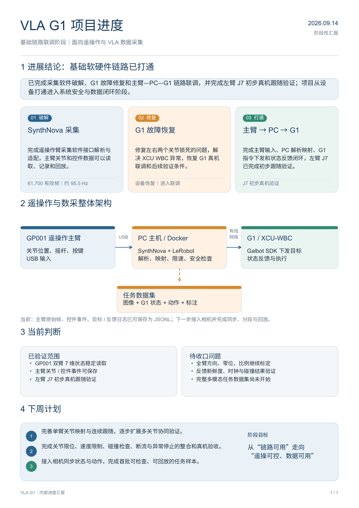
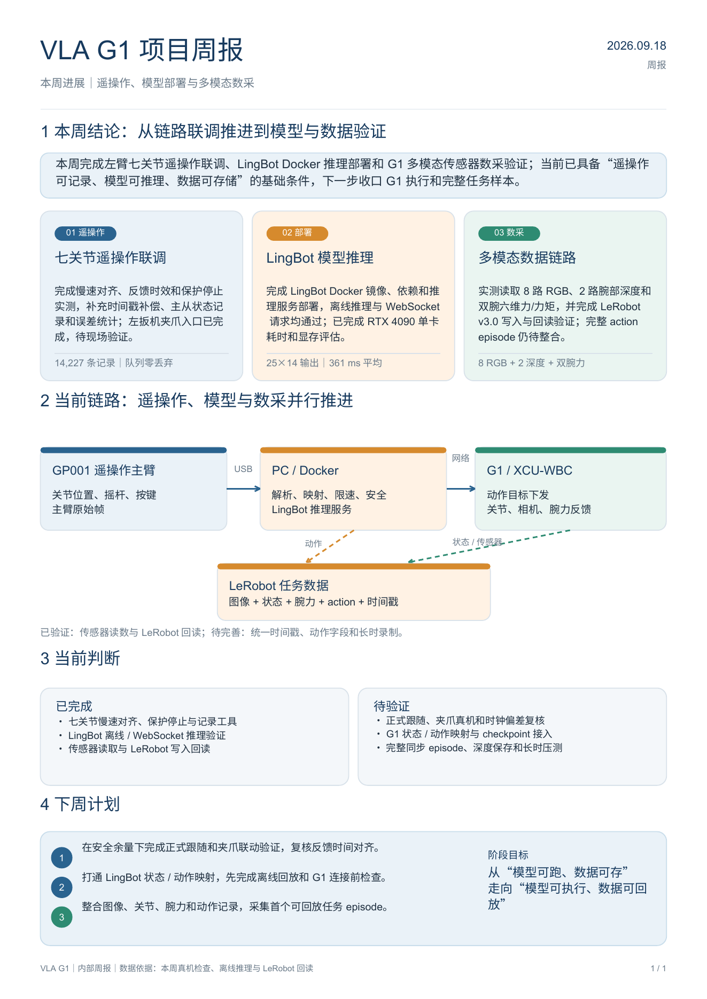

# 整理VLA项目周报

- 归档编号：`01a0b384-4b48-7851-aed4-47f72af68c3b`
- 项目：VLA G1 项目
- 创建时间：2026-09-18T15:56:26.833000+08:00
- 更新时间：2026-09-24T16:24:51.669000+08:00
- 状态：活动
- 导出范围：用户可见消息与助手可见回复；不含隐藏推理和工具原始输出

## 1. 用户

“9\_12 周报 整理VLA项目进度汇报” 参考下这个，我们现在这周的周报有没有啥能写的？
我现在想到的也就是 1. 遥操作  2. 模型镜像环境搭建 3. 你看看还有啥

## 2. 助手（进展）

我先找一下「9_12 周报 整理VLA项目进度汇报」和这周的项目记录，看看除了遥操作、模型镜像环境搭建，还有哪些有实际进展可以写。

## 3. 助手（进展）

这周还有一项比较扎实的内容：数采链路准备。已有相机、腕部六维力的真机读取验证，以及 LeRobot 格式写入和回读验证；主从臂记录和误差分析工具也已补上。我再核对上周周报和模型部署结果，把“已完成”和“待验证”分清楚。

## 4. 助手

**有，第三项建议写“多模态数采验证与 LeRobot 数据链路建设”**，这周已经有实际验证结果，值得单独列出来。

我对照了「9_12 周报 整理VLA项目进度汇报」和这周记录。上周主要是主臂接口接入、G1 故障恢复、J7 单关节跟随；这周可以突出以下三个方向：

| 方向 | 本周可以写的进展 | 当前阶段 |
|---|---|---|
| **1. 七关节遥操作与运行诊断** | 推进左臂七关节真机联调，验证慢速对齐和越界停止；补充时间戳补偿、主从状态及指令记录、跟踪曲线和误差统计；新增左扳机比例控制夹爪脚本 | 已有慢速对齐实测；夹爪待真机验证，正式跟随和长时间稳定性仍需验证 |
| **2. LingBot 模型部署与推理验证** | 完成 Docker 推理环境部署，跑通离线推理及 WebSocket 服务请求；RTX 4090 上预热后平均推理约 **361 ms**，输出 **25×14** 动作序列 | 已完成合成输入推理验证，尚未接入 G1 执行 |
| **3. 多模态传感器与数采格式验证** | 完成 **8 路 RGB、2 路腕部深度、双腕六维力/力矩**读取检查；使用真实观测完成 LeRobot 格式写入和回读，验证三路视频、双臂关节和腕力数据保存 | 已验证“传感器可读、数据可存”；完整带动作的演示录制仍需整合 |

**第二项其实可以写得比“镜像环境搭建”更进一步：模型已经跑通推理了。** 第三项也已经超过方案调研，做过真实数据落盘和回读。[推理实测结果](<../../assets/b8d30404a56a3c6c--smoke-result.json>)、[传感器与数采验证报告](<../../assets/aacdea1e014e4c94--%E8%AF%84%E4%BC%B0%E6%8A%A5%E5%91%8A.md>)都有记录。

可以直接放进周报的精简版：

> 本周围绕 G1 遥操作、VLA 模型部署及数据采集链路开展工作：
>
> 1. **遥操作联调：** 推进左臂七关节真机慢速对齐与保护机制验证，完善时间戳处理、主从运动记录及误差分析工具，新增扳机控制夹爪功能，待现场验证。
> 2. **模型部署：** 完成 LingBot Docker 推理环境及服务部署，跑通离线与 WebSocket 推理验证，完成单卡推理耗时和显存占用评估。
> 3. **数采链路验证：** 完成 G1 多路相机、深度及双腕六维力数据可用性检查，完成真实观测数据的 LeRobot 格式写入与回读，明确多模态同步及动作记录的后续整合要求。
>
> **下周重点：** 验证正式遥操作跟随及夹爪联动，核验时间同步，整合图像、状态和动作录制，形成首个完整任务演示 episode。

时间戳和延迟排查可以作为第一项里的技术难点展开。其中 **104 ms 是此前测得的临时补偿值，本周复测提示需要重新核验**，目前适合写“完成排查并建立补偿与分析工具”，还不宜写“时间同步问题已彻底解决”。

[附件：b8d30404a56a3c6c--smoke-result.json](../../assets/b8d30404a56a3c6c--smoke-result.json)

[附件：aacdea1e014e4c94--评估报告.md](../../assets/aacdea1e014e4c94--%E8%AF%84%E4%BC%B0%E6%8A%A5%E5%91%8A.md)

## 5. 用户

给我生成一版PDF报告

## 6. 助手（进展）

我会按 PDF 文档的渲染与检查流程，基于刚才整理的三项进展制作一页汇报稿，并检查中文字体、排版和最终渲染效果。

## 7. 助手

_工具输出图片（原始工具文本未纳入归档）。_

## 8. 助手（进展）

版式沿用上一版的单页汇报风格，但内容换成本周的三条主线：七关节遥操作、LingBot 推理部署、多模态数采验证；我现在生成并做渲染检查。

## 9. 助手

_工具输出图片（原始工具文本未纳入归档）。_

## 10. 助手

已生成并完成渲染检查：单页 A4、中文字体已嵌入，内容包含遥操作、LingBot 部署、多模态数采和下周计划。

:codex-file-citation{path="/home/lsy03/文档/ChatGPT/VLA G1 项目/output/pdf/VLA_G1_项目周报_20260918.pdf" purpose="output"}

- :codex-followup[调整汇报风格]{prompt="把这版改成更适合给经理展示的简洁风格"}
- :codex-followup[增加实验数据]{prompt="把遥操作延迟、相机帧率和腕力数据加入报告"}
- :codex-followup[制作汇报PPT]{prompt="根据这份周报生成一版对应的PPT"}
